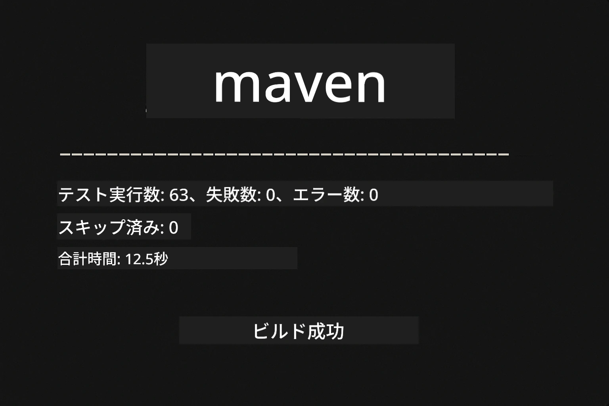
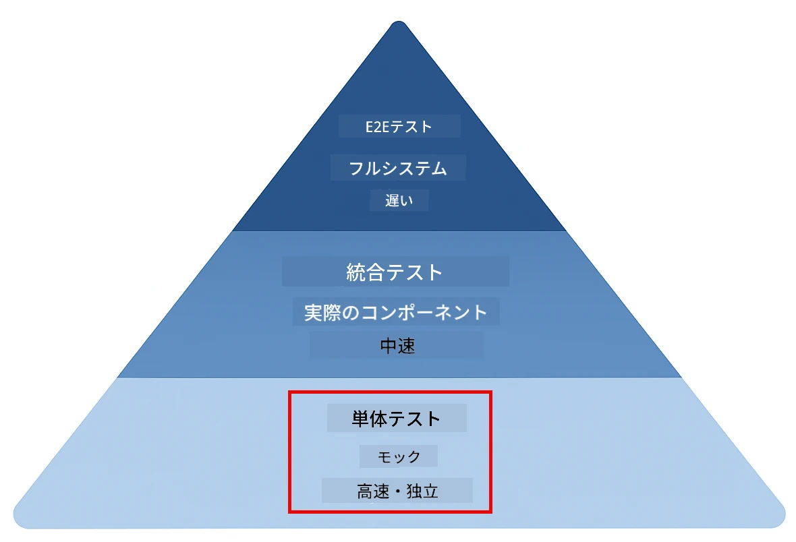
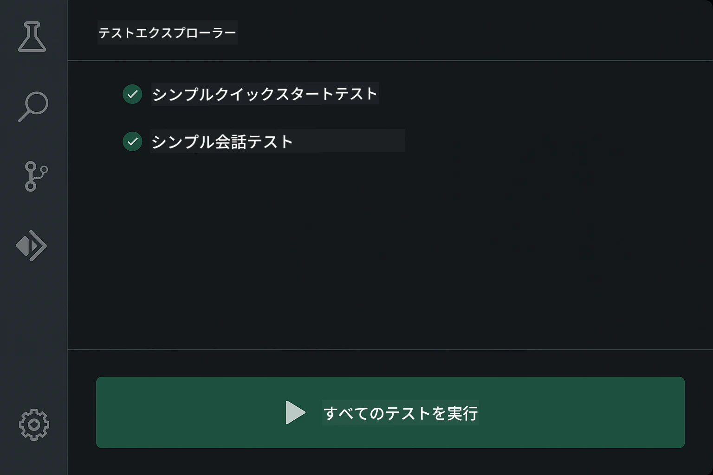
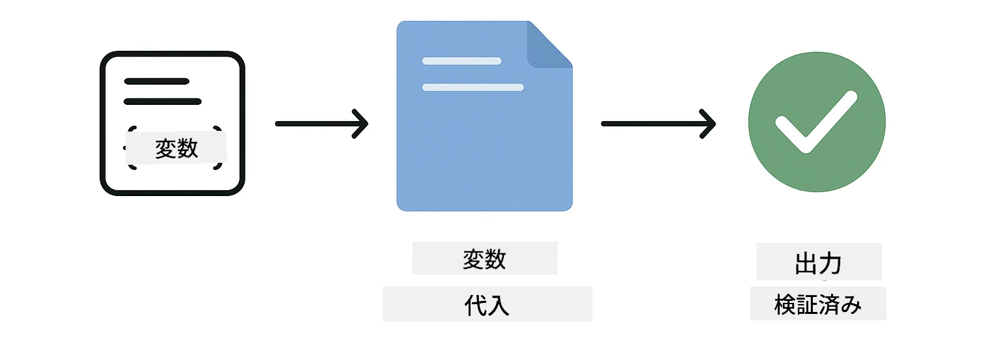
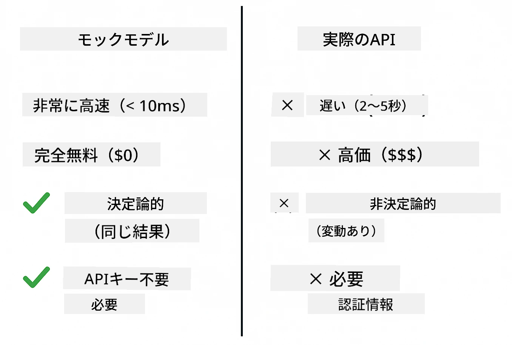
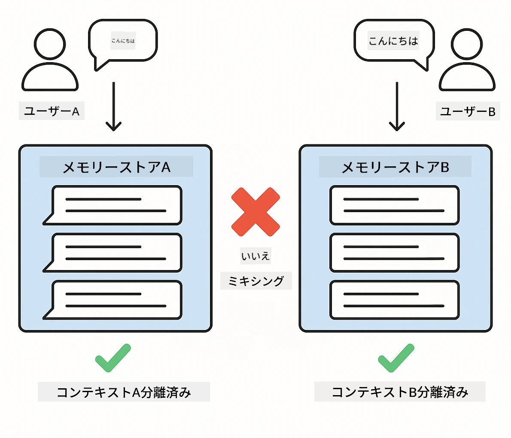
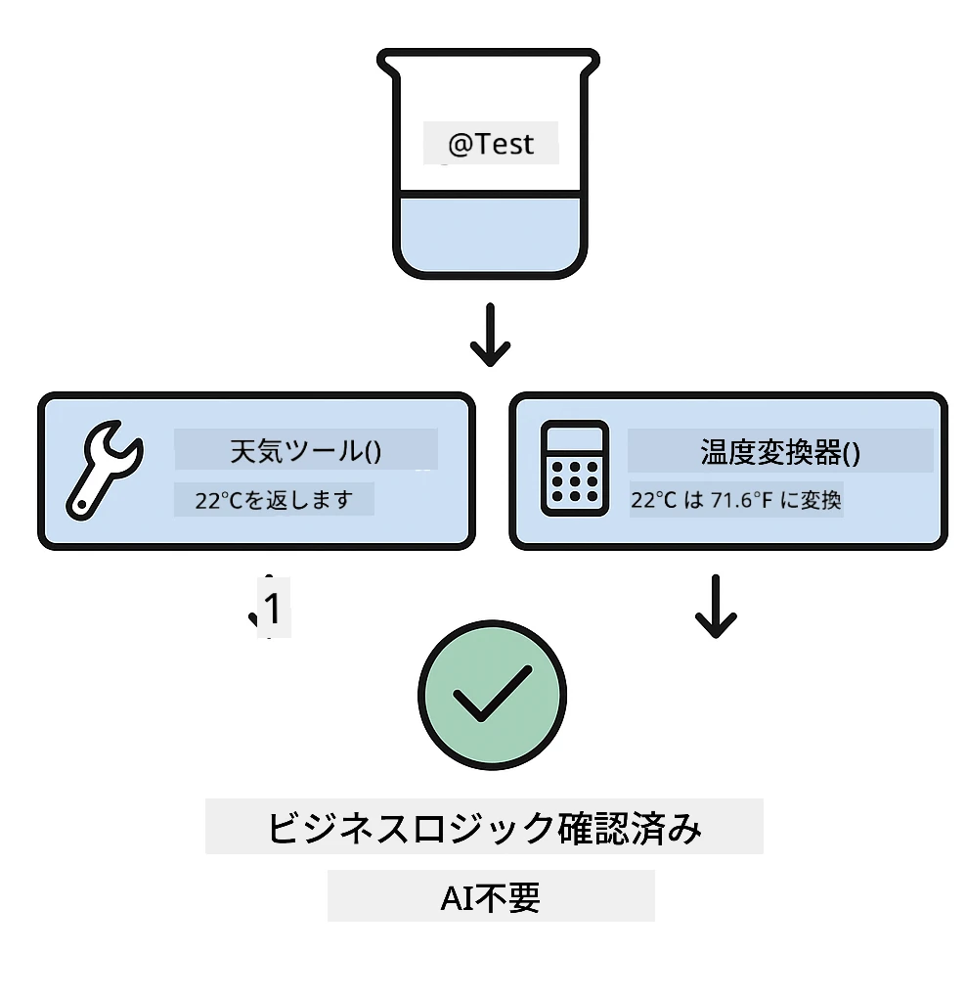
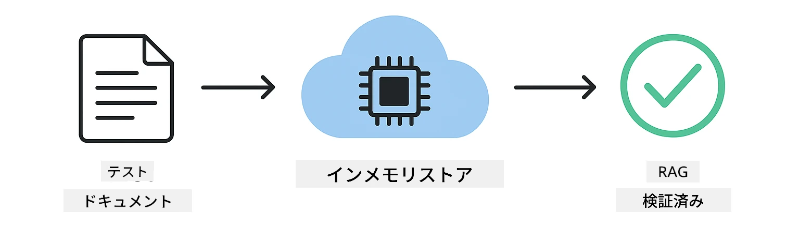

# LangChain4j アプリケーションのテスト

## 目次

- [クイックスタート](../../../docs)
- [テストの対象範囲](../../../docs)
- [テストの実行](../../../docs)
- [VS Codeでのテスト実行](../../../docs)
- [テストパターン](../../../docs)
- [テストの哲学](../../../docs)
- [次のステップ](../../../docs)

このガイドでは、APIキーや外部サービスを必要とせずにAIアプリケーションをテストする方法を示すテストについて説明します。

## クイックスタート

単一のコマンドで全テストを実行します:

**Bash:**
```bash
mvn test
```

**PowerShell:**
```powershell
mvn --% test
```



*すべてのテストが失敗ゼロで合格した成功したテスト実行の表示*

## テストの対象範囲

このコースはローカルで実行される**ユニットテスト**に焦点を当てています。各テストはLangChain4jの特定の概念を独立して示します。



*ユニットテスト（高速、独立）、統合テスト（実際のコンポーネント）、エンドツーエンドテストのバランスを示すテストピラミッド。このトレーニングではユニットテストをカバーします。*

| モジュール | テスト数 | 重点 | 主要ファイル |
|--------|-------|-------|-----------|
| **00 - クイックスタート** | 6 | プロンプトテンプレートと変数置換 | `SimpleQuickStartTest.java` |
| **01 - 導入** | 8 | 会話メモリと状態を持つチャット | `SimpleConversationTest.java` |
| **02 - プロンプトエンジニアリング** | 12 | GPT-5パターン、積極性レベル、構造化された出力 | `SimpleGpt5PromptTest.java` |
| **03 - RAG** | 10 | ドキュメント取り込み、埋め込み、類似検索 | `DocumentServiceTest.java` |
| **04 - ツール** | 12 | 関数呼び出しとツールのチェイン | `SimpleToolsTest.java` |
| **05 - MCP** | 8 | Stdioトランスポートを用いたModel Context Protocol | `SimpleMcpTest.java` |

## テストの実行

**ルートから全テストを実行する:**

**Bash:**
```bash
mvn test
```

**PowerShell:**
```powershell
mvn --% test
```

**特定のモジュールのテストを実行する:**

**Bash:**
```bash
cd 01-introduction && mvn test
# またはルートから
mvn test -pl 01-introduction
```

**PowerShell:**
```powershell
cd 01-introduction; mvn --% test
# またはルートから
mvn --% test -pl 01-introduction
```

**単一のテストクラスを実行する:**

**Bash:**
```bash
mvn test -Dtest=SimpleConversationTest
```

**PowerShell:**
```powershell
mvn --% test -Dtest=SimpleConversationTest
```

**特定のテストメソッドを実行する:**

**Bash:**
```bash
mvn test -Dtest=SimpleConversationTest#会話履歴を保持するべき
```

**PowerShell:**
```powershell
mvn --% test -Dtest=SimpleConversationTest#会話履歴を維持すべき
```

## VS Codeでのテスト実行

Visual Studio Codeを使用している場合、Test Explorerはテストの実行とデバッグのためのグラフィカルなインターフェースを提供します。



*VS Code Test Explorerが、すべてのJavaテストクラスと個々のテストメソッドを含むテストツリーを表示している様子*

**VS Codeでテストを実行するには:**

1. アクティビティバーのビーカーアイコンをクリックして Test Explorer を開きます
2. テストツリーを展開して、すべてのモジュールとテストクラスを表示します
3. 任意のテストの横にある再生ボタンをクリックして個別に実行します
4. 「Run All Tests」をクリックしてスイート全体を実行します
5. 任意のテストを右クリックして「Debug Test」を選択すると、ブレークポイントを設定してコードをステップ実行できます

Test Explorer は合格したテストに緑のチェックマークを表示し、テストが失敗したときは詳細な失敗メッセージを提供します。

## テストパターン

### パターン 1: プロンプトテンプレートのテスト

最も単純なパターンはAIモデルを呼び出さずにプロンプトテンプレートをテストします。変数置換が正しく機能するか、プロンプトが期待どおりにフォーマットされているかを検証します。



*プレースホルダのあるテンプレート → 値の適用 → フォーマットされた出力を検証、という変数置換フローを示すプロンプトテンプレートのテスト*

```java
@Test
@DisplayName("Should format prompt template with variables")
void testPromptTemplateFormatting() {
    PromptTemplate template = PromptTemplate.from(
        "Best time to visit {{destination}} for {{activity}}?"
    );
    
    Prompt prompt = template.apply(Map.of(
        "destination", "Paris",
        "activity", "sightseeing"
    ));
    
    assertThat(prompt.text()).isEqualTo("Best time to visit Paris for sightseeing?");
}
```

このテストは `00-quick-start/src/test/java/com/example/langchain4j/quickstart/SimpleQuickStartTest.java` にあります。

**実行方法:**

**Bash:**
```bash
cd 00-quick-start && mvn test -Dtest=SimpleQuickStartTest#プロンプトテンプレートの書式設定をテスト
```

**PowerShell:**
```powershell
cd 00-quick-start; mvn --% test -Dtest=SimpleQuickStartTest#プロンプトテンプレートのフォーマットをテスト
```

### パターン 2: 言語モデルのモック化

会話ロジックをテストする際は、Mockitoを使って事前に定義した応答を返すフェイクモデルを作成します。これによりテストは高速で、無料かつ決定論的になります。



*モックがテストに好まれる理由を示す比較: 高速、無料、決定論的、APIキー不要*

```java
@ExtendWith(MockitoExtension.class)
class SimpleConversationTest {
    
    private ConversationService conversationService;
    
    @Mock
    private OpenAiOfficialChatModel mockChatModel;
    
    @BeforeEach
    void setUp() {
        ChatResponse mockResponse = ChatResponse.builder()
            .aiMessage(AiMessage.from("This is a test response"))
            .build();
        when(mockChatModel.chat(anyList())).thenReturn(mockResponse);
        
        conversationService = new ConversationService(mockChatModel);
    }
    
    @Test
    void shouldMaintainConversationHistory() {
        String conversationId = conversationService.startConversation();
        
        ChatResponse mockResponse1 = ChatResponse.builder()
            .aiMessage(AiMessage.from("Response 1"))
            .build();
        ChatResponse mockResponse2 = ChatResponse.builder()
            .aiMessage(AiMessage.from("Response 2"))
            .build();
        ChatResponse mockResponse3 = ChatResponse.builder()
            .aiMessage(AiMessage.from("Response 3"))
            .build();
        
        when(mockChatModel.chat(anyList()))
            .thenReturn(mockResponse1)
            .thenReturn(mockResponse2)
            .thenReturn(mockResponse3);

        conversationService.chat(conversationId, "First message");
        conversationService.chat(conversationId, "Second message");
        conversationService.chat(conversationId, "Third message");

        List<ChatMessage> history = conversationService.getHistory(conversationId);
        assertThat(history).hasSize(6); // ユーザー3件 + AI3件のメッセージ
    }
}
```

このパターンは `01-introduction/src/test/java/com/example/langchain4j/service/SimpleConversationTest.java` にあります。モックは一貫した動作を保証するため、メモリ管理が正しく機能することを検証できます。

### パターン 3: 会話の分離テスト

会話メモリは複数のユーザーを分離して保持する必要があります。このテストは会話がコンテキストを混合しないことを検証します。



*異なるユーザーのために独立したメモリストアを示し、コンテキストの混入を防ぐ会話分離のテスト*

```java
@Test
void shouldIsolateConversationsByid() {
    String conv1 = conversationService.startConversation();
    String conv2 = conversationService.startConversation();
    
    ChatResponse mockResponse = ChatResponse.builder()
        .aiMessage(AiMessage.from("Response"))
        .build();
    when(mockChatModel.chat(anyList())).thenReturn(mockResponse);

    conversationService.chat(conv1, "Message for conversation 1");
    conversationService.chat(conv2, "Message for conversation 2");

    List<ChatMessage> history1 = conversationService.getHistory(conv1);
    List<ChatMessage> history2 = conversationService.getHistory(conv2);
    
    assertThat(history1).hasSize(2);
    assertThat(history2).hasSize(2);
}
```

各会話は独自の履歴を保持します。本番システムでは、この分離はマルチユーザーアプリケーションにとって重要です。

### パターン 4: ツールの独立テスト

ツールはAIが呼び出せる関数です。AIの決定に関係なく正しく動作することを確認するために、直接テストします。



*AI呼び出しなしでモックツール実行を示し、ビジネスロジックを検証するツールの独立テスト*

```java
@Test
void shouldConvertCelsiusToFahrenheit() {
    TemperatureTool tempTool = new TemperatureTool();
    String result = tempTool.celsiusToFahrenheit(25.0);
    assertThat(result).containsPattern("77[.,]0°F");
}

@Test
void shouldDemonstrateToolChaining() {
    WeatherTool weatherTool = new WeatherTool();
    TemperatureTool tempTool = new TemperatureTool();

    String weatherResult = weatherTool.getCurrentWeather("Seattle");
    assertThat(weatherResult).containsPattern("\\d+°C");

    String conversionResult = tempTool.celsiusToFahrenheit(22.0);
    assertThat(conversionResult).containsPattern("71[.,]6°F");
}
```

これらのテストは `04-tools/src/test/java/com/example/langchain4j/agents/tools/SimpleToolsTest.java` にあり、AIの関与なしでツールロジックを検証します。チェイニングの例は、あるツールの出力が別のツールの入力にどのように渡されるかを示します。

### パターン 5: インメモリRAGテスト

RAGシステムは通常、ベクトルデータベースや埋め込みサービスを必要とします。インメモリパターンでは外部依存なしでパイプライン全体をテストできます。



*ドキュメント解析、埋め込みの保存、データベース不要の類似検索を示すインメモリRAGテストワークフロー*

```java
@Test
void testProcessTextDocument() {
    String content = "This is a test document.\nIt has multiple lines.";
    InputStream inputStream = new ByteArrayInputStream(content.getBytes(StandardCharsets.UTF_8));
    
    DocumentService.ProcessedDocument result = 
        documentService.processDocument(inputStream, "test.txt");

    assertNotNull(result);
    assertTrue(result.segments().size() > 0);
    assertEquals("test.txt", result.segments().get(0).metadata().getString("filename"));
}
```

このテストは `03-rag/src/test/java/com/example/langchain4j/rag/service/DocumentServiceTest.java` にあり、メモリ内でドキュメントを作成し、チャンク化とメタデータ処理を検証します。

### パターン 6: MCP 統合テスト

MCPモジュールはstdioトランスポートを使用したModel Context Protocolの統合をテストします。これらのテストは、アプリケーションがMCPサーバーをサブプロセスとして起動し通信できることを検証します。

`05-mcp/src/test/java/com/example/langchain4j/mcp/SimpleMcpTest.java` のテストはMCPクライアントの動作を検証します。

**実行方法:**

**Bash:**
```bash
cd 05-mcp && mvn test
```

**PowerShell:**
```powershell
cd 05-mcp; mvn --% test
```

## テストの哲学

AIではなくコードをテストしてください。テストは、プロンプトがどのように構築されるか、メモリがどのように管理されるか、ツールがどのように実行されるかを確認することで、あなたが書いたコードを検証するべきです。AIの応答は変動するため、テストのアサーションに含めるべきではありません。AIが正しい答えを出すかどうかではなく、プロンプトテンプレートが変数を正しく置換しているかを自問してください。

言語モデルにはモックを使ってください。外部依存は遅く、高価で、非決定論的です。モックにするとテストはミリ秒単位で高速に実行され、APIコストはかからず、毎回同じ結果が得られます。

テストを独立させてください。各テストは自身のデータをセットアップし、他のテストに依存せず、終了後にクリーンアップするべきです。テストは実行順に関係なく合格するべきです。

ハッピーパス以外のエッジケースもテストしてください。空の入力、非常に大きな入力、特殊文字、無効なパラメータ、境界条件などを試してください。これらは通常の使用では露見しないバグを明らかにすることが多いです。

説明的な名前を使ってください。`shouldMaintainConversationHistoryAcrossMultipleMessages()` と `test1()` を比較してください。最初の例は何がテストされているかを正確に示すため、失敗時のデバッグがはるかに容易になります。

## 次のステップ

テストパターンを理解したら、各モジュールをさらに詳しく確認してください:

- **[00 - クイックスタート](../00-quick-start/README.md)** - プロンプトテンプレートの基本から始める
- **[01 - 導入](../01-introduction/README.md)** - 会話メモリ管理を学ぶ
- **[02 - プロンプトエンジニアリング](../02-prompt-engineering/README.md)** - GPT-5のプロンプトパターンを習得する
- **[03 - RAG](../03-rag/README.md)** - 情報検索強化生成システムを構築する
- **[04 - ツール](../04-tools/README.md)** - 関数呼び出しとツールチェーンを実装する
- **[05 - MCP](../05-mcp/README.md)** - Model Context Protocolを統合する

各モジュールのREADMEにはここでテストされている概念の詳細な説明が記載されています。

---

**ナビゲーション:** [← メインに戻る](../README.md)

---

<!-- CO-OP TRANSLATOR DISCLAIMER START -->
免責事項：
本書は AI 翻訳サービス「Co-op Translator」（https://github.com/Azure/co-op-translator）を用いて翻訳されました。正確性には努めていますが、自動翻訳には誤りや不正確な箇所が含まれる可能性があることをご承知おきください。重要な情報については、原文（原言語版）を正本とみなしてください。重要な内容に関しては、専門の人間による翻訳を推奨します。本翻訳の利用に起因する誤解や解釈の相違について、当社は一切の責任を負いません。
<!-- CO-OP TRANSLATOR DISCLAIMER END -->