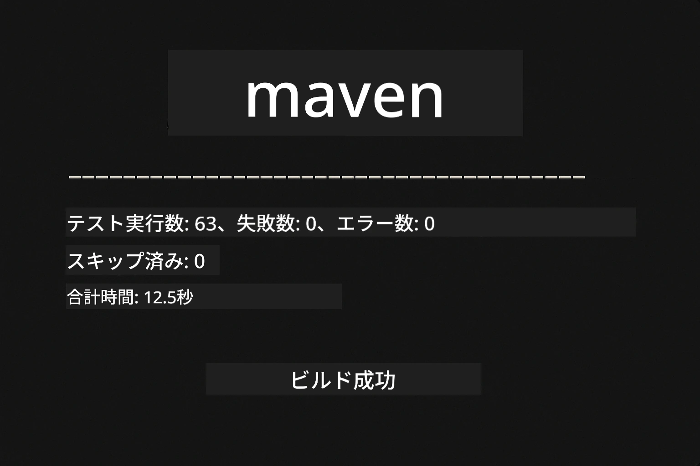
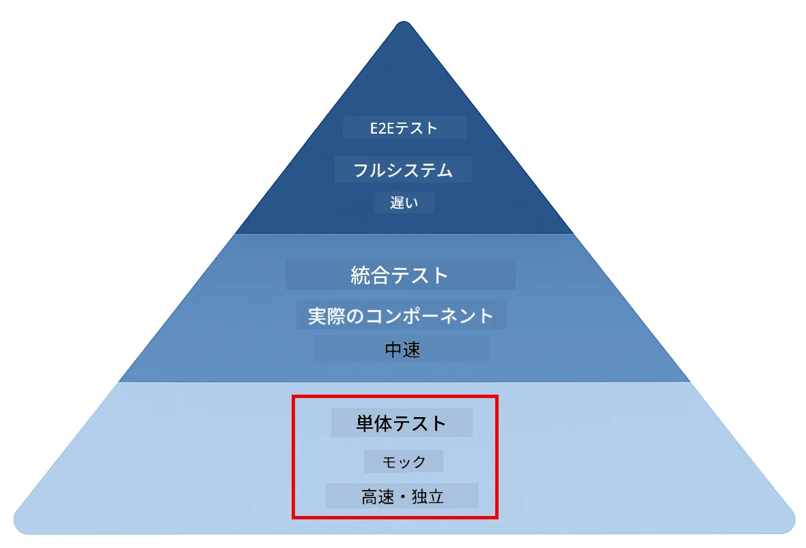
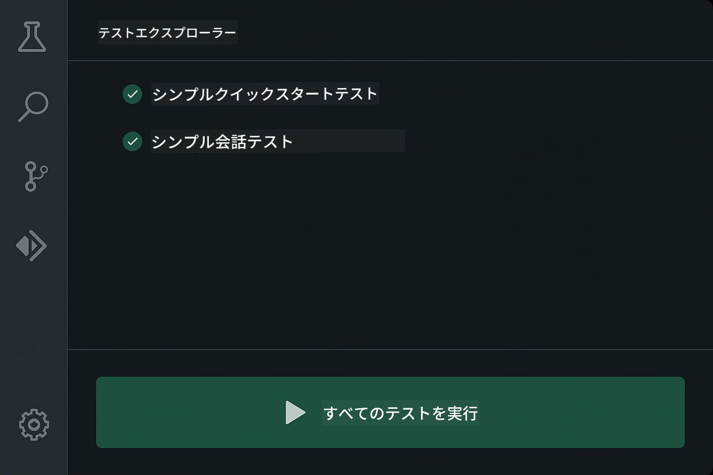
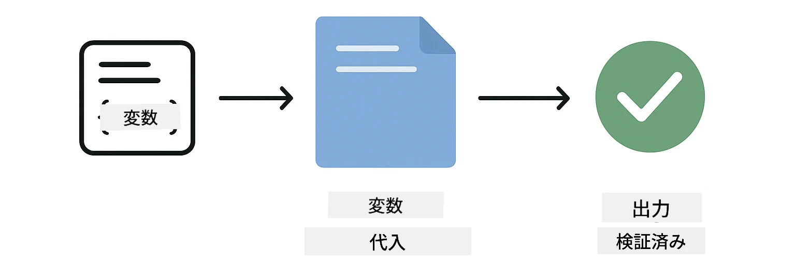
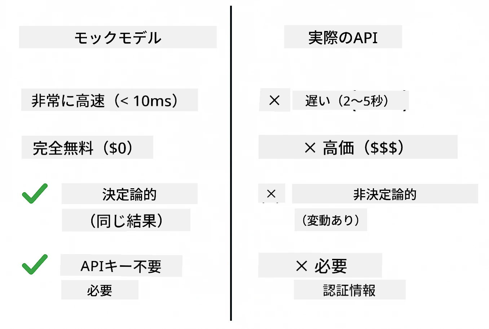
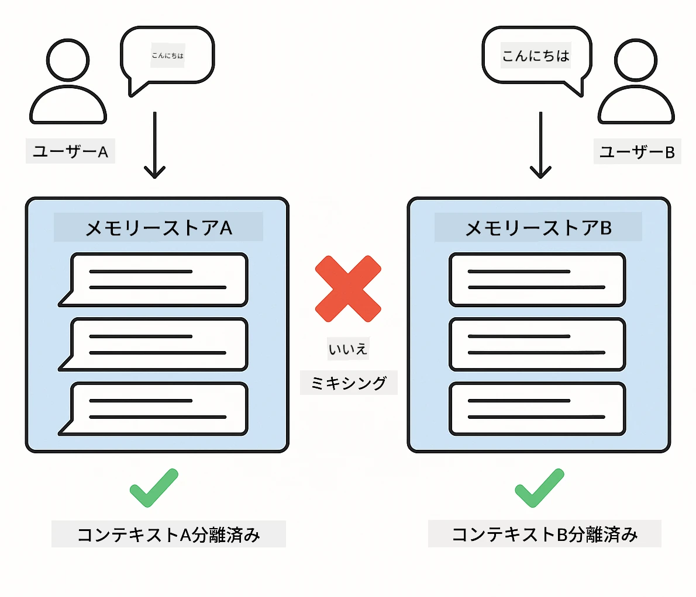
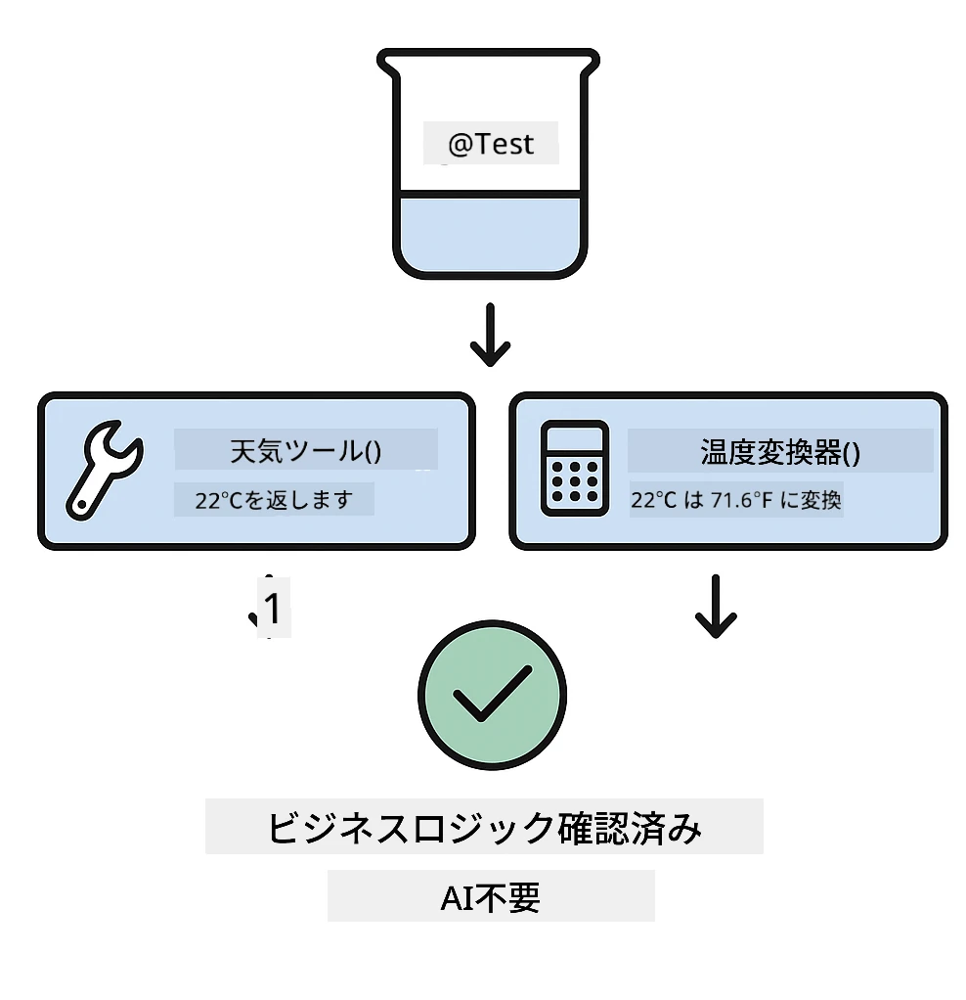
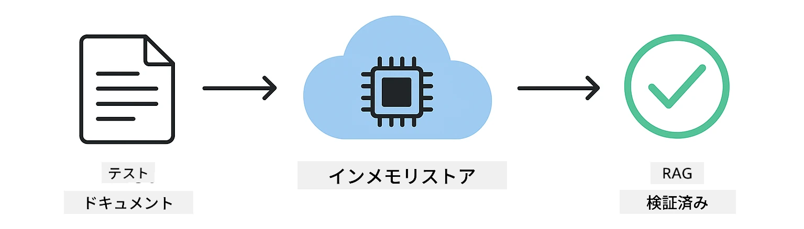

# LangChain4jアプリケーションのテスト

## 目次

- [クイックスタート](#クイックスタート)
- [テストの対象](#テストの対象)
- [テストの実行](#テストの実行)
- [VS Codeでのテスト実行](#vs-codeでのテスト実行)
- [テストパターン](#テストパターン)
- [テスト哲学](#テスト哲学)
- [次のステップ](#次のステップ)

このガイドでは、APIキーや外部サービスを必要とせずにAIアプリケーションをテストする方法を示すテストについて説明します。

## クイックスタート

すべてのテストを一つのコマンドで実行します：

**Bash:**
```bash
mvn test
```

**PowerShell:**
```powershell
mvn --% test
```

すべてのテストが成功すると、以下のスクリーンショットのように、失敗ゼロでテストが完了した出力が表示されます。



<em>すべてのテストが失敗ゼロで成功したテスト実行結果の例</em>

## テストの対象

このコースはローカルで実行される<strong>単体テスト</strong>に焦点を当てています。各テストはLangChain4jの特定の概念を単独で示しています。下のテストピラミッドは単体テストの位置付けを示しており、高速かつ信頼性が高い基盤として他のテスト戦略の土台となります。



*単体テスト（高速、孤立的）、統合テスト（実際のコンポーネント）、エンドツーエンドテストのバランスを示すテストピラミッド。このトレーニングでは単体テストを扱います。*

| モジュール | テスト数 | 焦点 | 主なファイル |
|--------|-------|-------|-----------|
| **01 - Introduction** | 8 | 会話のメモリと状態を持つチャット | `SimpleConversationTest.java` |
| **02 - Prompt Engineering** | 12 | GPT-5.2パターン、熱意レベル、構造化出力 | `SimpleGpt5PromptTest.java` |
| **03 - RAG** | 10 | ドキュメント取込、埋め込み、類似検索 | `DocumentServiceTest.java` |
| **04 - Tools** | 12 | 関数呼び出しとツール連結 | `SimpleToolsTest.java` |
| **05 - MCP** | 8 | Stdioトランスポートを用いたModel Context Protocol | `SimpleMcpTest.java` |

## テストの実行

**ルートからすべてのテストを実行：**

**Bash:**
```bash
mvn test
```

**PowerShell:**
```powershell
mvn --% test
```

**特定のモジュールのテストを実行：**

**Bash:**
```bash
cd 01-introduction && mvn test
# またはルートから
mvn test -pl 01-introduction
```

**PowerShell:**
```powershell
cd 01-introduction; mvn --% test
# またはルートから
mvn --% test -pl 01-introduction
```

**単一のテストクラスを実行：**

**Bash:**
```bash
mvn test -Dtest=SimpleConversationTest
```

**PowerShell:**
```powershell
mvn --% test -Dtest=SimpleConversationTest
```

**特定のテストメソッドを実行：**

**Bash:**
```bash
mvn test -Dtest=SimpleConversationTest#会話履歴を維持する必要があります
```

**PowerShell:**
```powershell
mvn --% test -Dtest=SimpleConversationTest#会話履歴を維持する必要があります
```

## VS Codeでのテスト実行

Visual Studio Codeを使用している場合、Test Explorerがテストの実行とデバッグのためのグラフィカルなインターフェースを提供します。



*すべてのJavaテストクラスと個別のテストメソッドが表示されたVS CodeのTest Explorerのテストツリー*

**VS Codeでテストを実行するには：**

1. アクティビティバーのフラスコアイコンをクリックしてTest Explorerを開く
2. テストツリーを展開してモジュールとテストクラスを確認
3. 任意のテストの再生ボタンをクリックして個別に実行
4. 「Run All Tests」をクリックして全テストを実行
5. 任意のテストを右クリックし「Debug Test」を選択してブレークポイントを設定し、コードをステップ実行可能

テストが成功するとTest Explorerに緑のチェックマークが表示され、失敗すると詳細な失敗メッセージが表示されます。

## テストパターン

### パターン1：プロンプトテンプレートのテスト

最も単純なパターンはAIモデルを呼び出さずにプロンプトテンプレートをテストするものです。変数の置換が正しく動作し、プロンプトが期待通りにフォーマットされていることを検証します。



*プレースホルダーのあるテンプレート→値の適用→フォーマットされた出力の検証という変数置換の流れを示すプロンプトテンプレートのテスト*

```java
@Test
@DisplayName("Should format prompt template with variables")
void testPromptTemplateFormatting() {
    PromptTemplate template = PromptTemplate.from(
        "Best time to visit {{destination}} for {{activity}}?"
    );
    
    Prompt prompt = template.apply(Map.of(
        "destination", "Paris",
        "activity", "sightseeing"
    ));
    
    assertThat(prompt.text()).isEqualTo("Best time to visit Paris for sightseeing?");
}
```

このパターンは変数の置換が正しく機能し、プロンプトが期待通りにフォーマットされることを検証します。APIキーやモデル呼び出しは不要です。

### パターン2：言語モデルのモッキング

会話ロジックをテストするときは、Mockitoを使ってあらかじめ決まった応答を返すフェイクモデルを作成します。これによりテストが高速、無料、決定論的になります。



*モックがテストに適している理由を示す比較：高速、無料、決定論的でAPIキー不要*

```java
@ExtendWith(MockitoExtension.class)
class SimpleConversationTest {
    
    private ConversationService conversationService;
    
    @Mock
    private OpenAiOfficialChatModel mockChatModel;
    
    @BeforeEach
    void setUp() {
        ChatResponse mockResponse = ChatResponse.builder()
            .aiMessage(AiMessage.from("This is a test response"))
            .build();
        when(mockChatModel.chat(anyList())).thenReturn(mockResponse);
        
        conversationService = new ConversationService(mockChatModel);
    }
    
    @Test
    void shouldMaintainConversationHistory() {
        String conversationId = conversationService.startConversation();
        
        ChatResponse mockResponse1 = ChatResponse.builder()
            .aiMessage(AiMessage.from("Response 1"))
            .build();
        ChatResponse mockResponse2 = ChatResponse.builder()
            .aiMessage(AiMessage.from("Response 2"))
            .build();
        ChatResponse mockResponse3 = ChatResponse.builder()
            .aiMessage(AiMessage.from("Response 3"))
            .build();
        
        when(mockChatModel.chat(anyList()))
            .thenReturn(mockResponse1)
            .thenReturn(mockResponse2)
            .thenReturn(mockResponse3);

        conversationService.chat(conversationId, "First message");
        conversationService.chat(conversationId, "Second message");
        conversationService.chat(conversationId, "Third message");

        List<ChatMessage> history = conversationService.getHistory(conversationId);
        assertThat(history).hasSize(6); // 3つのユーザーと3つのAIメッセージ
    }
}
```

このパターンは `01-introduction/src/test/java/com/example/langchain4j/service/SimpleConversationTest.java` に現れます。モックにより一貫した動作が保証され、メモリ管理が正しく動作することを検証可能です。

### パターン3：会話の隔離テスト

会話のメモリは複数ユーザーを区別する必要があります。このテストは会話がコンテキストを混同しないことを検証します。



*異なるユーザーのために分離されたメモリストアを示し、コンテキスト混入を防ぐ会話隔離のテスト*

```java
@Test
void shouldIsolateConversationsByid() {
    String conv1 = conversationService.startConversation();
    String conv2 = conversationService.startConversation();
    
    ChatResponse mockResponse = ChatResponse.builder()
        .aiMessage(AiMessage.from("Response"))
        .build();
    when(mockChatModel.chat(anyList())).thenReturn(mockResponse);

    conversationService.chat(conv1, "Message for conversation 1");
    conversationService.chat(conv2, "Message for conversation 2");

    List<ChatMessage> history1 = conversationService.getHistory(conv1);
    List<ChatMessage> history2 = conversationService.getHistory(conv2);
    
    assertThat(history1).hasSize(2);
    assertThat(history2).hasSize(2);
}
```

各会話は独立した履歴を保持します。本番システムではこの隔離がマルチユーザーアプリケーションに不可欠です。

### パターン4：ツールの独立テスト

ツールはAIが呼び出す関数です。AIの判断に関わらず正しく動作することを直接テストします。



*ビジネスロジックを検証するためにAI呼び出しなしでモックツールを実行するツールの独立テスト*

```java
@Test
void shouldConvertCelsiusToFahrenheit() {
    TemperatureTool tempTool = new TemperatureTool();
    String result = tempTool.celsiusToFahrenheit(25.0);
    assertThat(result).containsPattern("77[.,]0°F");
}

@Test
void shouldDemonstrateToolChaining() {
    WeatherTool weatherTool = new WeatherTool();
    TemperatureTool tempTool = new TemperatureTool();

    String weatherResult = weatherTool.getCurrentWeather("Seattle");
    assertThat(weatherResult).containsPattern("\\d+°C");

    String conversionResult = tempTool.celsiusToFahrenheit(22.0);
    assertThat(conversionResult).containsPattern("71[.,]6°F");
}
```

これらのテストは `04-tools/src/test/java/com/example/langchain4j/agents/tools/SimpleToolsTest.java` にあり、AIを介さずにツールロジックの検証を行います。チェイン例では一つのツールの出力が他の入力になる様子を示します。

### パターン5：インメモリRAGテスト

RAGシステムは通常ベクターデータベースや埋め込みサービスを必要とします。インメモリパターンを使うと外部依存なしにパイプライン全体をテストできます。



*ドキュメント解析、埋め込み格納、類似検索がデータベース不要で行われるインメモリRAGテストのワークフロー*

```java
@Test
void testProcessTextDocument() {
    String content = "This is a test document.\nIt has multiple lines.";
    InputStream inputStream = new ByteArrayInputStream(content.getBytes(StandardCharsets.UTF_8));
    
    DocumentService.ProcessedDocument result = 
        documentService.processDocument(inputStream, "test.txt");

    assertNotNull(result);
    assertTrue(result.segments().size() > 0);
    assertEquals("test.txt", result.segments().get(0).metadata().getString("filename"));
}
```

このテストは `03-rag/src/test/java/com/example/langchain4j/rag/service/DocumentServiceTest.java` にあり、メモリ内でドキュメントを作成しチャンク分割とメタデータ処理を検証します。

### パターン6：MCP統合テスト

MCPモジュールはstdioトランスポートを用いたModel Context Protocolの統合をテストします。これらのテストではアプリケーションがMCPサーバーをサブプロセスとして起動し通信可能か検証します。

`05-mcp/src/test/java/com/example/langchain4j/mcp/SimpleMcpTest.java` のテストがMCPクライアントの動作を検証します。

**実行コマンド：**

**Bash:**
```bash
cd 05-mcp && mvn test
```

**PowerShell:**
```powershell
cd 05-mcp; mvn --% test
```

## テスト哲学

AIではなくコードをテストしましょう。テストはプロンプト構築やメモリ管理、ツールの実行を検証するためのものです。AIの応答は変動するためテストアサーションに含めるべきではありません。プロンプトテンプレートが正しく変数を置換するかを検証し、AIが正解を出すかは問いません。

言語モデルはモックを使いましょう。言語モデルは外部依存であり遅く、高価で、非決定論的です。モックを使うことでテストはミリ秒単位で高速に、料金も発生せず、毎回同じ結果が得られます。

テストは独立させましょう。各テストは自身のデータを設定し、他のテストに依存せず、自分で後始末を行います。実行順に関係なく通るべきです。

正常系以外もテストしましょう。空入力や非常に大きな入力、特殊文字、無効パラメータ、境界条件などを試します。これらは通常の使用では見つからないバグを露呈します。

説明的な名前を使いましょう。`shouldMaintainConversationHistoryAcrossMultipleMessages()` と `test1()` を比べると、前者は何を検証しているかが明確で、失敗時のデバッグがはるかに楽です。

## 次のステップ

テストパターンを理解したら、各モジュールの詳細に進みましょう：

- **[01 - Introduction](../01-introduction/README.md)** - 会話メモリ管理の学習
- **[02 - Prompt Engineering](../02/prompt-engineering/README.md)** - GPT-5.2のプロンプトパターン習得
- **[03 - RAG](../03-rag/README.md)** - 検索強化生成システムの構築
- **[04 - Tools](../04-tools/README.md)** - 関数呼び出しとツールチェーンの実装
- **[05 - MCP](../05-mcp/README.md)** - Model Context Protocolの統合

各モジュールのREADMEにはここでテストした概念の詳細な説明が記載されています。

---

**ナビゲーション：** [← メインに戻る](../README.md)

---

<!-- CO-OP TRANSLATOR DISCLAIMER START -->
**免責事項**：
本書類は AI 翻訳サービス [Co-op Translator](https://github.com/Azure/co-op-translator) を使用して翻訳されています。正確性を期していますが、自動翻訳には誤りや不正確な部分が含まれる可能性があることをご承知おきください。原文の原語版が正式な情報源とみなされるべきです。重要な情報については、専門の人間による翻訳を推奨します。本翻訳の利用により生じたいかなる誤解や解釈違いについても、当方は責任を負いかねます。
<!-- CO-OP TRANSLATOR DISCLAIMER END -->