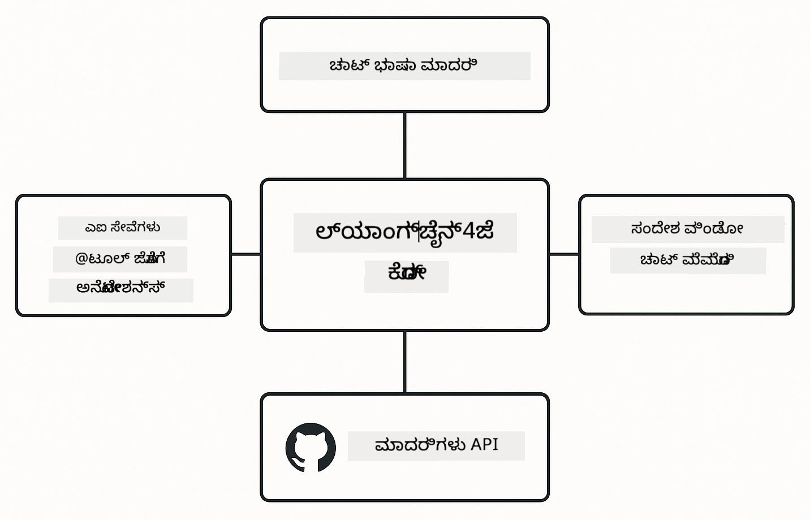

<!--
CO_OP_TRANSLATOR_METADATA:
{
  "original_hash": "22b5d7c8d7585325e38b37fd29eafe25",
  "translation_date": "2026-01-06T02:27:03+00:00",
  "source_file": "00-quick-start/README.md",
  "language_code": "kn"
}
-->
# ಮೋ듁ುಲ್ 00: ಕ್ವಿಕ್ ಸ್ಟಾರ್ಟ್

## ವಿಷಯಗಳ ಪಟ್ಟಿಯು

- [ಪರಿಚಯ](../../../00-quick-start)
- [ಲಾಂಗ್ಚೈನ್4ಜೆ ಎಂದರೆ ಏನು?](../../../00-quick-start)
- [ಲಾಂಗ್ಚೈನ್4ಜೆ ಅವಲಂಬನೆಗಳು](../../../00-quick-start)
- [ಪೂರ್ವಾಪೇಕ್ಷೆಗಳು](../../../00-quick-start)
- [ಸೆಟ್ಟಪ್](../../../00-quick-start)
  - [1. ನಿಮ್ಮ GitHub ಟೋಕೆನ್ ಪಡೆಯಿರಿ](../../../00-quick-start)
  - [2. ನಿಮ್ಮ ಟೋಕೆನ್ ಸೆಟ್ ಮಾಡಿ](../../../00-quick-start)
- [ಉದಾಹರಣೆಗಳನ್ನು ಹಾರಿಸಿ](../../../00-quick-start)
  - [1. ಅನುಪಾತ ಚಾಟ್](../../../00-quick-start)
  - [2. ಪ್ರಾಂಪ್ಟ್ ಮಾದರಿಗಳು](../../../00-quick-start)
  - [3. ಫಂಕ್ಷನ್ ಕರೆ](../../../00-quick-start)
  - [4. ಡಾಕ್ಯುಮೆಂಟ್ ಪ್ರಶ್ನೆ & ಉತ್ತರ (RAG)](../../../00-quick-start)
  - [5. ಜವಾಬ್ದಾರಿಯುತ AI](../../../00-quick-start)
- [ಪ್ರತಿ ಉದಾಹರಣೆಯು ಏನು ತೋರುತ್ತದೆ](../../../00-quick-start)
- [ಮುಂದಿನ ಹಂತಗಳು](../../../00-quick-start)
- [ ಸಮಸ್ಯೆ ಪರಿಹಾರ](../../../00-quick-start)

## ಪರಿಚಯ

ಈ ಕ್ವಿಕ್ ಸ್ಟಾರ್ಟ್ ನಿಮ್ಮನ್ನು ಬೇಗನೇ ಲಾಂಗ್ಚೈನ್4ಜೆ ಜೊತೆ ಕಾರ್ಯನಿರ್ವಹಿಸಲು ನೆರವಾಗುತ್ತದೆ. ಇದು AI ಅಪ್ಲಿಕೇಶನ್‌ಗಳನ್ನು ಲాంగ್ಚೈನ್4ಜೆ ಮತ್ತು GitHub ಮಾದರಿಗಳೊಂದಿಗೆ ನಿರ್ಮಿಸುವ ಅತ್ಯಂತ ಮೂಲಭೂತ ವಿಷಯಗಳನ್ನು ಒಳಗೊಂಡಿದೆ. ಮುಂದಿನ ಮೋಡ್ಯೂಲ್ಗಳಲ್ಲಿ ನೀವು Azure OpenAI ಆಧಾರಿತ ಲಾಂಗ್ಚೈನ್4ಜೆ ಬಳಸಿಕೊಂಡು ಹೆಚ್ಚು ಉನ್ನತ ಅಪ್ಲಿಕೇಶನ್‌ಗಳನ್ನು ರಚಿಸುತ್ತೀರಿ.

## ಲಾಂಗ್ಚೈನ್4ಜೆ ಎಂದರೆ ಏನು?

ಲಾಂಗ್ಚೈನ್4ಜೆ ಒಂದು ಜಾವಾ ಲೈಬ್ರರಿ ಆಗಿದ್ದು, AI ಚಾಲಿತ ಅಪ್ಲಿಕೇಶನ್‌ಗಳನ್ನು ಸರಳವಾಗಿಸಲು ಸಹಾಯ ಮಾಡುತ್ತದೆ. HTTP ಕ್ಲೈಂಟ್‌ಗಳು ಮತ್ತು JSON ವಿಶ್ಲೇಷಣೆಗಳೊಂದಿಗೆ ತೊಡಗಿಸಿಕೊಳ್ಳದೆ, ನೀವು ಶುದ್ಧ ಜಾವಾ APIs ನೊಂದಿಗೆ ಕೆಲಸ ಮಾಡಬಹುದು.

ಲಾಂಗ್ಚೈನ್ ಎಂದು ಕರೆಯುವುದರ ಅರ್ಥ പല ಘಟಕಗಳನ್ನು ಸ سلسلة ಮಾಡಿದಂತೆ — ನೀವು ಒಂದು ಪ್ರಾಂಪ್ಟ್ ಅನ್ನು ಮಾದರಿ, ನಂತರ ಪಾರ್ಸರ್ ಗೆ ಸ سلسلة ಮಾಡಬಹುದು, ಅಥವಾ ಹಲವಾರು AI ಕರೆಗಳನ್ನು ಸರಣಿಯಾಗಿ ಜೋಡಿಸಿ ಒಂದು ಹೊರಹೊಂದಿಕೆಯನ್ನು ಮುಂದಿನ ಒಳಹೊಂದಿಕೆಯಾಗಿ ಉಪಯೋಗಿಸುತ್ತೀರಿ. ಈ ಕ್ವಿಕ್ ಸ್ಟಾರ್ಟ್ ಮೂಲತತ್ತ್ವಗಳ ಮೇಲೆ ಕೇಂದ್ರೀಕೃತವಾಗಿದೆ ಮೆಟ್ಟಿಲುಮೇಲೆ ಜಟಿಲ ಸರಣಿಗಳನ್ನು ಅನ್ವೇಷಿಸುವ ಮೊದಲು.


*ಲಾಂಗ್ಚೈನ್4ಜೆ ಘಟಕಗಳನ್ನು ಸ سلسلة ಮಾಡುವುದು - ಶಕ್ತಿಶಾಲಿ AI ಕಾರ್ಯಪ್ರವಾಹಗಳನ್ನು ನಿರ್ಮಿಸುವ ಕಟ್ಟಡ ಬ್ಲಾಕ್ಸ್*

ನಾವು ಮೂರು ಮುಖ್ಯ ಘಟಕಗಳನ್ನು ಬಳಸುತ್ತೇವೆ:

**ChatLanguageModel** - AI ಮಾದರಿ ಸಂವಾದಗಳಿಗಾಗಿ ಇಂಟರ್ಫೇಸ್. `model.chat("prompt")` ಅನ್ನು ಕರೆಸಿ ಪ್ರತಿಕ್ರಿಯೆಯ ಸರಣಿಯನ್ನು ಪಡೆಯಿರಿ. ನಾವು `OpenAiOfficialChatModel` ಅನ್ನು ಬಳಸುತ್ತೇವೆ, ಅದು GitHub ಮಾದರಿಗಳಂತಹ OpenAI ಅನುಕೂಲ ಎಂಡ್‌ಪಾಯಿಂಟ್‌ಗಳೊಂದಿಗೆ ಕಾರ್ಯನಿರ್ವಹಿಸುತ್ತದೆ.

**AiServices** - ಪ್ರಕಾರ-ಸುರಕ್ಷಿತ AI ಸೇವಾ ಇಂಟರ್ಫೇಸುಗಳನ್ನು ರಚಿಸುತ್ತದೆ. ವಿಧಾನಗಳನ್ನು ವ್ಯಾಖ್ಯಾನಿಸಿ, ಅವುಗಳನ್ನು `@Tool` ನೊಂದಿಗೆ ಅಂಕಿತ ಮಾಡಿ ಮತ್ತು ಲಾಂಗ್ಚೈನ್4ಜೆ ನಿರ್ವಹಣೆಯನ್ನು ಹ್ಯಾಡಲ್ ಮಾಡುತ್ತದೆ. AI ಯಾವಾಗ ಬೇಕು ನಿಮ್ಮ ಜಾವಾ ವಿಧಾನಗಳನ್ನು ಸ್ವಯಂಚಾಲಿತವಾಗಿ ಕರೆ ಮಾಡುವುದನ್ನು ಮಾಡುತ್ತದೆ.

**MessageWindowChatMemory** - ಸಂವಾದ ಇತಿಹಾಸವನ್ನು ನಿರ್ವಹಿಸುತ್ತದೆ. ಇದಿಲ್ಲದೆ, ಪ್ರತಿ ವಿನಂತಿ ಸ್ವತಂತ್ರವಾಗಿರುತ್ತದೆ. ಇದೊಂದಿಗಿದ್ದರೆ, AI ಹಿಂದಿನ ಸಂದೇಶಗಳನ್ನು ನೆನಪಿನಲ್ಲಿ ಇಟ್ಟುಕೊಳ್ಳುತ್ತದೆ ಮತ್ತು ಹಲವಾರು ತಿರುವುಗಳ ತಲೆಹರಿವು ನಿರ್ವಹಿಸುತ್ತದೆ.



*ಲಾಂಗ್ಚೈನ್4ಜೆ ವಾಸ್ತುಶಿಲ್ಪ - ಮುಖ್ಯ ಘಟಕಗಳು ಒಟ್ಟಾಗಿ ನಿಮ್ಮ AI ಅಪ್ಲಿಕೇಶನ್‌ಗಳನ್ನು ಶಕ್ತಿ ತುಂಬಲು ಕಾರ್ಯನಿರ್ವಹಿಸುತ್ತವೆ*

## ಲಾಂಗ್ಚೈನ್4ಜೆ ಅವಲಂಬನೆಗಳು

ಈ ಕ್ವಿಕ್ ಸ್ಟಾರ್ಟ್ ಎರಡು ಮೇವನ್ ಅವಲಂಬನೆಗಳನ್ನು [`pom.xml`](../../../00-quick-start/pom.xml) ನಲ್ಲಿ ಬಳಸುತ್ತದೆ:

```xml
<!-- Core LangChain4j library -->
<dependency>
    <groupId>dev.langchain4j</groupId>
    <artifactId>langchain4j</artifactId> <!-- Inherited from BOM in root pom.xml -->
</dependency>

<!-- OpenAI integration (works with GitHub Models) -->
<dependency>
    <groupId>dev.langchain4j</groupId>
    <artifactId>langchain4j-open-ai-official</artifactId> <!-- Inherited from BOM in root pom.xml -->
</dependency>
```
  
`langchain4j-open-ai-official` ಮೋ듁ುಲ್ OpenAiOfficialChatModel ವರ್ಗವನ್ನು ಒದಗಿಸುತ್ತದೆ, ಇದು OpenAI-ಅನುಕೂಲಿತ APIs ಗೆ ಸಂಪರ್ಕಿಸುತ್ತದೆ. GitHub ಮಾದರಿಗಳು ಇದೇ API ವಿನ್ಯಾಸವನ್ನು ಬಳಸುವದು; ಆದ್ದರಿಂದ ಯಾವುದೇ ವಿಶೇಷ ಅಡಾಪ್ಟರ್ ಅಗತ್ಯವಿಲ್ಲ — ಕೇವಲ ಮೂಲ URL ಅನ್ನು `https://models.github.ai/inference` ಗೆ ಸೂಚಿಸಿ.

## ಪೂರ್ವಾಪೇಕ್ಷೆಗಳು

**ಡಿವ್ ಕಂಟೈನರ್ ಬಳಸುತ್ತಿದ್ದೀರಾ?** ಜಾವಾ ಮತ್ತು ಮೇವನ್ ఇప్పటికే ಸ್ಥಾಪಿಸಲಾಗಿದೆ. ನಿಮಗೆ ಕೇವಲ GitHub ವೈಯಕ್ತಿಕ ಪ್ರವೇಶ ಟೋಕೆನ್ ಅಗತ್ಯ.

**ಸ್ಥಳೀಯ ಅಭಿವೃದ್ಧಿ:**
- ಜಾವಾ 21+, ಮೇವನ್ 3.9+
- GitHub ವೈಯಕ್ತಿಕ ಪ್ರವೇಶ ಟೋಕೆನ್ (ಕೆಳಗಿನ ಸೂಚನೆಗಳು)

> **ಗಮನಿಸಿ:** ಈ ಮೋಡುಲ್ GitHub ಮಾದರಿಗಳಿಂದ `gpt-4.1-nano` ಅನ್ನು ಬಳಕೆಯಲ್ಲಿದೆ. ಕೋಡ್‌ನಲ್ಲಿ ಮಾದರಿ ಹೆಸರನ್ನು ಬದಲಾಯಿಸಬೇಡಿ — ಇದು GitHub ಲಭ್ಯವಿರುವ ಮಾದರಿಗಳೊಂದಿಗೆ ಕಾರ್ಯನಿರ್ವಹಿಸಲು ಹೊಂದಿಸಲಾಗಿದೆ.

## ಸೆಟ್ಟಪ್

### 1. ನಿಮ್ಮ GitHub ಟೋಕೆನ್ ಪಡೆಯಿರಿ

1. [GitHub ಸೆಟ್ಟಿಂಗ್ಸ್ → ವೈಯಕ್ತಿಕ ಪ್ರವೇಶ ಟೋಕೆನ್ಗಳು](https://github.com/settings/personal-access-tokens) ಗೆ ಹೋಗಿ  
2. "Generate new token" ಕ್ಲಿಕ್ ಮಾಡಿ  
3. ವಿವರಣಾತ್ಮಕ ಹೆಸರು ಹೊಂದಿಸಿ (ಉದಾ., "LangChain4j ಡೆಮೊ")  
4. ಅವಧಿ ಹೊಂದಿಸಿ (7 ದಿನಗಳ ಶಿಫಾರಸು)  
5. "Account permissions" ಅಡಿಯಲ್ಲಿ "Models" ಕಂಡು "Read-only" ಗೆ ಸೆಟ್ ಮಾಡಿ  
6. "Generate token" ಕ್ಲಿಕ್ ಮಾಡಿ  
7. ಟೋಕೆನನ್ನು ಪ್ರತಿಯನ್ನು ಮಾಡಿ ಉಳಿಸಿ — ಮತ್ತೊಮ್ಮೆ ಅದು ತೋರಿಸಲಾಗುವುದಿಲ್ಲ

### 2. ನಿಮ್ಮ ಟೋಕೆನ್ ಸೆಟ್ ಮಾಡಿ

**ಆಪ್‌ಷನ್ 1: VS ಕೋಡ್ ಬಳಸಿ (ಶಿಫಾರಸು)**

ನೀವು VS ಕೋಡ್ ಬಳಸುತ್ತಿದ್ದರೆ, ಪ್ರಾಜೆಕ್ಟ್ ರೂಟ್‌ನಲ್ಲಿ ಇರುವ `.env` ಫೈಲ್‌ಗೆ ನಿಮ್ಮ ಟೋಕೆನ್ ಅನ್ನು ಸೇರಿಸಿ:

`.env` ಫೈಲ್ ಇಲ್ಲದಿದ್ದರೆ, `.env.example` ನ್ನು `.env` ಗೆ ಪ್ರತಿಯಾಯಿಸಿ ಅಥವಾ ಹೊಸ `.env` ಫೈಲ್ ಪ್ರಾಜೆಕ್ಟ್ ರೂಟ್‌ನಲ್ಲಿ ರಚಿಸಿ.

**ಉದಾಹರಣೆ `.env` ಫೈಲ್:**  
```bash
# /workspaces/LangChain4j-for-Beginners/.env ನಲ್ಲಿ
GITHUB_TOKEN=your_token_here
```
  
ನಂತರExplorer ನಲ್ಲಿ ಯಾವುದಾದರೂ ಡೆಮೊ ಫೈಲ್ ಮೇಲೆ ರೈಟ್-ಕ್ಲಿಕ್ ಮಾಡಿ (ಉದಾ: `BasicChatDemo.java`) **"Run Java"** ಆಯ್ಕೆಮಾಡಿ ಅಥವಾ ರನ್ ಮತ್ತು ಡಿಬಗ್ ಪ್ಯಾನೆಲ್‌ನಿಂದ ಲಾಂಚ್ ಸಂರಚನೆಗಳನ್ನು ಬಳಸಬಹುದು.

**ಆಪ್‌ಷನ್ 2: ತರಮಿನಲ್ ಬಳಸಿಕೊಳ್ಳಿ**

ಟೋಕೆನನ್ನು ಪರಿಸರ ಚರ ರೂಪದಲ್ಲಿ ಹೊಂದಿಸಿ:

**Bash:**  
```bash
export GITHUB_TOKEN=your_token_here
```
  
**PowerShell:**  
```powershell
$env:GITHUB_TOKEN=your_token_here
```
  
## ಉದಾಹರಣೆಗಳನ್ನು ಹಾರಿಸುವುದು

**VS ಕೋಡ್ ಬಳಸಿ:** Explorer ನಲ್ಲಿಲ್ಲದೇ ಯಾವುದಾದರೂ ಡೆಮೊ ಫೈಲ್ ಮೇಲೆ ರೈಟ್-ಕ್ಲಿಕ್ ಮಾಡಿ **"Run Java"** ಆಯ್ಕೆಮಾಡಿ, ಅಥವಾ .env ಫೈಲ್‌ಗೆ ಟೋಕೆನ್ ಸೇರಿಸಿದ ನಂತರ ರನ್ ಮತ್ತು ಡಿಬಗ್ ಪ್ಯಾನೆಲ್‌ನಿಂದ ಲಾಂಚ್ ಸಂರಚನೆಗಳನ್ನು ಬಳಸಿ.

**ಮೇವನ್ ಬಳಸಿ:** ಬದಲಿ ಟರ್ಮಿನಲ್‌ನಿಂದ ಕೆಳಗಿನಂತೆ ಹಾರಿಸಬಹುದು:

### 1. ಮೂಲ ಚಾಟ್

**Bash:**  
```bash
mvn compile exec:java -Dexec.mainClass=com.example.langchain4j.quickstart.BasicChatDemo
```
  
**PowerShell:**  
```powershell
mvn --% compile exec:java -Dexec.mainClass=com.example.langchain4j.quickstart.BasicChatDemo
```
  
### 2. ಪ್ರಾಂಪ್ಟ್ ಮಾದರಿಗಳು

**Bash:**  
```bash
mvn compile exec:java -Dexec.mainClass=com.example.langchain4j.quickstart.PromptEngineeringDemo
```
  
**PowerShell:**  
```powershell
mvn --% compile exec:java -Dexec.mainClass=com.example.langchain4j.quickstart.PromptEngineeringDemo
```
  
ಶೂನ್ಯ-ಶಾಟ್, ಕೆಲವು-ಶಾಟ್, ಚೈನ್-ಅಫ್-ಥಾಟ್, ಮತ್ತು ಪಾತ್ರ ಆಧಾರಿತ ಪ್ರಾಂಪ್ಟಿಂಗ್ ತೋರಿಸುತ್ತದೆ.

### 3. ಫಂಕ್ಷನ್ ಕರೆ

**Bash:**  
```bash
mvn compile exec:java -Dexec.mainClass=com.example.langchain4j.quickstart.ToolIntegrationDemo
```
  
**PowerShell:**  
```powershell
mvn --% compile exec:java -Dexec.mainClass=com.example.langchain4j.quickstart.ToolIntegrationDemo
```
  
AI ಸ್ವಯಂಚಾಲಿತವಾಗಿ ನಿಮ್ಮ ಜಾವಾ ವಿಧಾನಗಳನ್ನು ಆವಶ್ಯಕತೆ ಇದ್ದಾಗಲೇ ಕರೆ ಮಾಡುತ್ತದೆ.

### 4. ಡಾಕ್ಯುಮೆಂಟ್ ಪ್ರಶ್ನೆ & ಉತ್ತರ (RAG)

**Bash:**  
```bash
mvn compile exec:java -Dexec.mainClass=com.example.langchain4j.quickstart.SimpleReaderDemo
```
  
**PowerShell:**  
```powershell
mvn --% compile exec:java -Dexec.mainClass=com.example.langchain4j.quickstart.SimpleReaderDemo
```
  
`document.txt` ನಲ್ಲಿ ಇದ್ದ ವಿಷಯಗಳ ಬಗ್ಗೆ ಪ್ರಶ್ನೆ ಕೇಳಿ.

### 5. ಜವಾಬ್ದಾರಿಯುತ AI

**Bash:**  
```bash
mvn compile exec:java -Dexec.mainClass=com.example.langchain4j.quickstart.ResponsibleAIDemo
```
  
**PowerShell:**  
```powershell
mvn --% compile exec:java -Dexec.mainClass=com.example.langchain4j.quickstart.ResponsibleAIDemo
```
  
AI ಸುರಕ್ಷತಾ ಫಿಲ್ಟರ್‌ಗಳು ಹಾನಿಕರ ವಿಷಯಗಳನ್ನು ಹೇಗೆ ತಡೆಯುತ್ತವೆ ಎಂಬುದನ್ನು ನೋಡಿ.

## ಪ್ರತಿ ಉದಾಹರಣೆಯು ಏನು ತೋರುತ್ತದೆ

**ಮೂಲ ಚಾಟ್** - [BasicChatDemo.java](../../../00-quick-start/src/main/java/com/example/langchain4j/quickstart/BasicChatDemo.java)

ಇಲ್ಲಿ ಲಾಂಗ್ಚೈನ್4ಜೆ ಅವರ ಸರಳತೆಯನ್ನು ನೋಡಬಹುದು. ನೀವು `OpenAiOfficialChatModel` ಸೃಷ್ಟಿಸಿ, `.chat()` ಮೂಲಕ ಪ್ರಾಂಪ್ಟ್ ಕಳಿಸಿ ಮತ್ತು ಪ್ರತಿಕ್ರಿಯೆ ಪಡೆಯುತ್ತೀರಿ. ಇದು ಆಧಾರವನ್ನು ತೋರಿಸುತ್ತದೆ: ಬೇರೆ ಎಂಡ್‌ಪಾಯಿಂಟ್‌ಗಳು ಮತ್ತು API ಕೀಲಿಗಳನ್ನು ಹೇಗೆ ಪ್ರಾರಂಭಿಸುವುದು. ಈ ಪಾಟರ್ನ್ ತಿಳಿದ ನಂತರ, ಇತರ ಎಲ್ಲವೂ ಇದರ ಮೇಲೆ ನಿರ್ಮಾಣವಾಗುತ್ತದೆ.

```java
ChatLanguageModel model = OpenAiOfficialChatModel.builder()
    .baseUrl("https://models.github.ai/inference")
    .apiKey(System.getenv("GITHUB_TOKEN"))
    .modelName("gpt-4.1-nano")
    .build();

String response = model.chat("What is LangChain4j?");
System.out.println(response);
```
  
> **🤖 [GitHub Copilot](https://github.com/features/copilot) ಚಾಟ್ ಬಳಸಿ ಪ್ರಯತ್ನಿಸಿ:** [`BasicChatDemo.java`](../../../00-quick-start/src/main/java/com/example/langchain4j/quickstart/BasicChatDemo.java) ತೆರೆದು ಕೇಳಿ:  
> - "GitHub ಮಾದರಿಗಳಿಂದ Azure OpenAI ಗೆ ಈ ಕೋಡ್‌ನಲ್ಲಿ ನಾನು ಹೇಗೆ ಬದಲಾಯಿಸುದು?"  
> - "OpenAiOfficialChatModel.builder() ನಲ್ಲಿ ಇನ್ನಾವುದೇ ಪರಿಮಾಣಗಳು ಹೊಂದಿಸಬಹುದು?"  
> - "ಪೂರ್ಣ ಪ್ರತಿಕ್ರಿಯೆಯನ್ನು ಕಾಯದೇ ಸ್ಟ್ರೀಮಿಂಗ್ ಪ್ರತಿಕ್ರಿಯೆ ಹೇಗೆ ಸೇರಿಸುವುದು?"

**ಪ್ರಾಂಪ್ಟ್ ಎಂಜಿನಿಯರಿಂಗ್** - [PromptEngineeringDemo.java](../../../00-quick-start/src/main/java/com/example/langchain4j/quickstart/PromptEngineeringDemo.java)

ಈಗ ಮಾದರಿಯ ಜೊತೆ ಸಂವಾದ ಮಾಡುವುದಾಗಿ ತಿಳಿದಿದ್ದೀರಿ, ನಾವು ಅದು ಹೇಳೋದು ಯಾವ ರೀತಿಯದು ಎಂದು ನೋಡಿ. ಈ ಡೆಮೊ ಅದೇ ಮಾದರಿ ಸೆಟ್ಟಪ್ ಬಳಸುತ್ತದೆ ಆದರೆ ನಾಲ್ಕು ಬಗೆಯ ಪ್ರಾಂಪ್ಟ್ ಮಾದರಿಗಳನ್ನು ತೋರಿಸುತ್ತದೆ. ನೇರ ಸೂಚನೆಗಳಿಗಾಗಿ ಶೂನ್ಯ-ಶಾಟ್ ಪ್ರಾಂಪ್ಟ್, ಉದಾಹರಣೆಗಳಿಂದ ಕಲಿಯುವ ಕೆಲವು-ಶಾಟ್, ಯುಕ್ತಿಯ ಹೆಜ್ಜೆಗಳನ್ನು ಬಹಿರಂಗಪಡಿಸುವ ಚೈನ್-ಆಫ್-ಥಾಟ್ ಮತ್ತು ಸಂದರ್ಭವನ್ನು ಹೊಂದಿಸುವ ಪಾತ್ರ ಆಧಾರಿತ ಪ್ರಾಂಪ್ಟ್ ಪ್ರಯತ್ನಿಸಿ. ನೀವು ನೋಡುತ್ತೀರಿ, ಹೇಗೆ ಮಾದರಿ ಬೇರೆ ಬೇರೆ ರೀತಿಯಲ್ಲಿ ಪ್ರತಿಕ್ರಿಯಿಸುತ್ತದೆ ನಿಮ್ಮ ವಿನಂತಿಯನ್ನು ಹೇಗೆ ರೂಪಿಸುವುದರಿಂದ.

```java
PromptTemplate template = PromptTemplate.from(
    "What's the best time to visit {{destination}} for {{activity}}?"
);

Prompt prompt = template.apply(Map.of(
    "destination", "Paris",
    "activity", "sightseeing"
));

String response = model.chat(prompt.text());
```
  
> **🤖 [GitHub Copilot](https://github.com/features/copilot) ಚಾಟ್ ಬಳಸಿ ಪ್ರಯತ್ನಿಸಿ:** [`PromptEngineeringDemo.java`](../../../00-quick-start/src/main/java/com/example/langchain4j/quickstart/PromptEngineeringDemo.java) ತೆರೆದು ಕೇಳಿ:  
> - "ಶೂನ್ಯ-ಶಾಟ್ ಮತ್ತು ಕೆಲವು-ಶಾಟ್ ಪ್ರಾಂಪ್ಟಿಂಗ್ ನಡುವಿನ ವ್ಯತ್ಯಾಸವೇನು ಮತ್ತು ಯಾವಾಗ ಯಾವುದು ಬಳಸಬೇಕು?"  
> - "ತಾಪಮಾನ ಪರಿಮಾಣ ಮಾಡೆಲಿನ ಪ್ರತಿಕ್ರಿಯೆಗಳನ್ನು ಹೇಗೆ ಪರಿಣಾಮ ಮಾಡುತ್ತದೆ?"  
> - "ಪ್ರಾಂಪ್ಟ್ ಇಂಜೆಕ್ಷನ್ ಆಕ್ರಮಣಗಳನ್ನು ತಡೆಗಟ್ಟಲು ಕೆಲವು ತಂತ್ರಗಳು ಯಾವುವು?"  
> - "ಸಾಮಾನ್ಯ ಮಾದರಿಗಳಿಗೆ ಮರುಬಳಕೆ ಮಾಡುವ PromptTemplate ವಸ್ತುಗಳನ್ನು ಹೇಗೆ ಸೃಷ್ಟಿಸಬಹುದು?"

**ಟೂಲ್ ಒಕ್ಕೂಟ** - [ToolIntegrationDemo.java](../../../00-quick-start/src/main/java/com/example/langchain4j/quickstart/ToolIntegrationDemo.java)

ಇಲ್ಲಿ ಲಾಂಗ್ಚೈನ್4ಜೆ ಶಕ್ತಿಶಾಲಿಯಾಗುತ್ತದೆ. ನೀವು `AiServices` ನ್ನು ಉಪಯೋಗಿಸಿ AI ಸಹಾಯಕನನ್ನಾಗಿ ಮಾಡುತ್ತೀರಿ, ಅದು ನಿಮ್ಮ ಜಾವಾ ವಿಧಾನಗಳನ್ನು ಕರೆ ಮಾಡಬಹುದು. ವಿಧಾನಗಳನ್ನು `@Tool("ವಿವರಣೆ")` দিয়ে ಅಂಕಿತ ಮಾಡಿ ಮತ್ತು ಲಾಂಗ್ಚೈನ್4ಜೆ ಉಳಿದ ಕಾರ್ಯ ನಿರ್ವಹಿಸುತ್ತದೆ — AI ಸ್ವಯಂಚಾಲಿತವಾಗಿ ಯಾವಾಗ ಯಾವ ಸಾಧನ ಬಳಸಬೇಕು ಎಂದು ನಿರ್ಧರಿಸಿ ಕರೆ ಮಾಡುತ್ತದೆ. ಇದು ಫಂಕ್ಷನ್ ಕರೆ, ಪ್ರಶ್ನೆಗಳಿಗೆ ಉತ್ತರಿಸುವುದಕ್ಕಿಂತೆಯಾಗಿಯೂ ಕಾರ್ಯಗಳನ್ನು ಕೈಗೊಳ್ಳುವ AI ರಚನೆಗೆ ಮುಖ್ಯ ತಂತ್ರ.

```java
@Tool("Performs addition of two numeric values")
public double add(double a, double b) {
    return a + b;
}

MathAssistant assistant = AiServices.create(MathAssistant.class, model);
String response = assistant.chat("What is 25 plus 17?");
```
  
> **🤖 [GitHub Copilot](https://github.com/features/copilot) ಚಾಟ್ ಬಳಸಿ ಪ್ರಯತ್ನಿಸಿ:** [`ToolIntegrationDemo.java`](../../../00-quick-start/src/main/java/com/example/langchain4j/quickstart/ToolIntegrationDemo.java) ತೆರೆದು ಕೇಳಿ:  
> - "@Tool ಅಂಕಿತ ಹೇಗೆ ಕಾರ್ಯನಿರ್ವಹಿಸುತ್ತದೆ ಮತ್ತು ಲಾಂಗ್ಚೈನ್4ಜೇಯು ಇದರ ಹಿಂದೆ ಏನು ಮಾಡುತ್ತದೆ?"  
> - "AI ಸಮಸಮಯವಾಗಿ ಹಲವು ಸಾಧನಗಳನ್ನು ಕ್ರಮವಾಗಿ ಹೇಗೆ ಕರೆ ಮಾಡಬಹುದು?"  
> - "ಯಾವುದೇ ಸಾಧನ ಅಪವ್ಯಕ್ತಿಯನ್ನು ಎಸೆಯಿದ್ರೆ ನಾನು ಎಷ್ಟು ದೋಷವಿಹರಿಸಲು ಎಂಥ ವಿಧಾನಗಳನ್ನು ಅನುಸರಿಸಬೇಕು?"  
> - "ಈ ಕ್ಯಾಲ್ಕ್ಯುಲೇಟರ್ ಉದಾಹರಣೆಯ ಬದಲು ನಿಜವಾದ API ಯನ್ನು ಹೇಗೆ ಒಕ್ಕೂಟ ಮಾಡಬಹುದು?"

**ಡಾಕ್ಯುಮೆಂಟ್ ಪ್ರಶ್ನೆ & ಉತ್ತರ (RAG)** - [SimpleReaderDemo.java](../../../00-quick-start/src/main/java/com/example/langchain4j/quickstart/SimpleReaderDemo.java)

ನೀವು ಇಲ್ಲಿ RAG (ರಿಟ್ರೀವಲ್-ಆಗ್ಮೆಂಟೆಡ್ ಜನೆರೇಷನ್) ಆಧಾರವನ್ನು ನೋಡುತ್ತೀರಿ. ಮಾದರಿಯ ತರಬೇತಿ ಡೇಟಾದ ಮೇಲೆ ಅವಲಂಬಿಸುವ ಬದಲು, ನೀವು [`document.txt`](../../../00-quick-start/document.txt) ಯಲ್ಲಿ ವಿಷಯವನ್ನು ಲೋಡ್ ಮಾಡಿ ಪ್ರಾಂಪ್ಟಿನಲ್ಲಿ ಸೇರಿಸುತ್ತೀರಿ. AI ನಿಮ್ಮ ದಸ್ತಾವೇಜಿನ ಆಧಾರದ ಮೇಲೆ ಉತ್ತರ ನೀಡುತ್ತದೆ, ಸಾಮಾನ್ಯ ಜ್ಞಾನವಲ್ಲ. ನಿಮ್ಮ ಸ್ವಂತ ಡೇಟಾ ಉಪಯೋಗಿಸುವ ವ್ಯವಸ್ಥೆಗಳನ್ನು ನಿರ್ಮಿಸುವ ಮೊದಲ ಹಂತ ಇದಾಗಿದೆ.

```java
Document document = FileSystemDocumentLoader.loadDocument("document.txt");
String content = document.text();

String prompt = "Based on this document: " + content + 
                "\nQuestion: What is the main topic?";
String response = model.chat(prompt);
```
  
> **ಗಮನಿಸಿ:** ಈ ಸರಳ ವಿಧಾನವು ಸಂಪೂರ್ಣ ಡಾಕ್ಯುಮೆಂಟ್ ಅನ್ನು ಪ್ರಾಂಪ್ಟ್ನಲ್ಲಿ ಲೋಡ್ ಮಾಡುತ್ತದೆ. ದೊಡ್ಡ ಫೈಲ್‌ಗಳು (>10KB) ಎಂದರೆ, ವಿಷಯದ ಮಿತಿ ಮೀರುವುದು. ಮೋಡ್ಯೂಲ್ 03 ರಲ್ಲಿ ಚಂಕಿಂಗ್ ಮತ್ತು ವೇಕ್ಟರ್ ಶೋಧ ಬಗ್ಗೆ ವಿವರಿಸಲಾಗುತ್ತದೆ.

> **🤖 [GitHub Copilot](https://github.com/features/copilot) ಚಾಟ್ ಬಳಸಿ ಪ್ರಯತ್ನಿಸಿ:** [`SimpleReaderDemo.java`](../../../00-quick-start/src/main/java/com/example/langchain4j/quickstart/SimpleReaderDemo.java) ತೆರೆದು ಕೇಳಿ:  
> - "RAG AI ಹಲ್ಲುಗಳನ್ನು (ಹಲ್ಯೂಸಿನೇಶನ್) ತಡೆಯುವುದು ಹೇಗೆ, ಮಾದರಿಯ ತರಬೇತಿಯ ಡೇಟಾದ ಕಡೆಗೆ ಅವಲಂಬಿಸುವುದರ ವಿರುದ್ದ?"  
> - "ಈ ಸರಳ ವಿಧಾನ ಮತ್ತು ರಿಟ್ರೀವಲ್ ಗಾಗಿ ವೇಕ್ಟರ್ ಎम्बೆಡಿಂಗ್ ಬಳಕೆಯ ನಡುವಿನ ವ್ಯತ್ಯಾಸವೇನು?"  
> - "ಹೆಚ್ಚು ಡಾಕ್ಯುಮೆಂಟ್‌ಗಳು ಅಥವಾ ದೊಡ್ಡ ಜ್ಞಾನಾಧಾರಗಳನ್ನು ಹೇಗೆ ಸ Skal ಮಾಡಬೇಕು?"  
> - "AI ಒದಗಿಸಿರುವ ಸಂದರ್ಭ ಮಾತ್ರವನ್ನು ಬಳಸಲು ಪ್ರಾಂಪ್ಟ್ ಅನ್ನು ಹೇಗೆ ಸೂಕ್ತವಾಗಿ ರಚಿಸುವುದು?"

**ಜವಾಬ್ದಾರಿಯುತ AI** - [ResponsibleAIDemo.java](../../../00-quick-start/src/main/java/com/example/langchain4j/quickstart/ResponsibleAIDemo.java)

ಗೌಪ್ಯತೆ ಮತ್ತು ಸುರಕ್ಷತೆಗಾಗಿ ದಳ ಕಡುಗಗಳನ್ನು ನಿರ್ಮಿಸಿ. ಈ ಡೆಮೊ ಎರಡು ಸುರಕ್ಷತಾ ಪದರಗಳನ್ನು ಒಟ್ಟಿಗೆ ಕಾರ್ಯನಿರ್ವಹಿಸುತ್ತದೆ:

**ಭಾಗ 1: ಲಾಂಗ್ಚೈನ್4ಜೆ ಇನ್‌ಪುಟ್ ಗಾರ್ಡ್‌ರೈಲ್ಸ್** - LLM ತಲುಪುವ ಮೊದಲು ಅಪಾಯಕರ ಪ್ರಾಂಪ್ಟ್‌ಗಳ ನಿರ್ಬಂಧ. ನಿಷೇಧಿತ ಕೀವರ್ಡ್‌ಗಳು ಅಥವಾ ಮಾದರಿಗಳನ್ನು ಪರಿಶೀಲಿಸಲು ಕಸ್ಟಮ್ ಗಾರ್ಡ್‌ರೈಲ್ಸ್ ರಚಿಸಿ. ಈ ಗಾರ್ಡ್‌ರೈಲ್ಸ್ ನಿಮ್ಮ ಕೋಡ್‌ನಲ್ಲಿ ನಡೆಸಲ್ಪடும், ಆದ್ದರಿಂದ ತಕ್ಷಣ ಮತ್ತು ಉಚಿತ.

```java
class DangerousContentGuardrail implements InputGuardrail {
    @Override
    public InputGuardrailResult validate(UserMessage userMessage) {
        String text = userMessage.singleText().toLowerCase();
        if (text.contains("explosives")) {
            return fatal("Blocked: contains prohibited keyword");
        }
        return success();
    }
}
```
  
**ಭಾಗ 2: ಪ್ರೊವೈಡರ್ ಸುರಕ್ಷತಾ ಫಿಲ್ಟರುಗಳು** - GitHub ಮಾದರಿಗಳಲ್ಲಿ ನಿರ್ಮಿತಿರುವ ಫಿಲ್ಟರ್‌ಗಳು ನಿಮ್ಮ ಗಾರ್ಡ್‌ರೈಲ್ಸ್ ತಪ್ಪಿಸಿಕೊಳ್ಳಬಹುದಾದ ವಿಷಯಗಳನ್ನು ಹಿಡಿಯುತ್ತವೆ. ಹಾರ್ಡ್ ಬ್ಲಾಕ್‌ಗಳು (HTTP 400 ದೋಷಗಳು) ಗಂಭೀರ ಉಲ್ಲಂಘನೆಗಳಿಗೆ ಮತ್ತು ಸಾಫ್ಟ್ ನಿರಾಕರಣೆಗಳು AI ವಿನಯಪೂರ್ವಕವಾಗಿ ತಳ್ಳುವುದಕ್ಕೆ ಕಾರ್ಯನಿರ್ವಹಿಸುತ್ತವೆ.

> **🤖 [GitHub Copilot](https://github.com/features/copilot) ಚಾಟ್ ಬಳಸಿ ಪ್ರಯತ್ನಿಸಿ:** [`ResponsibleAIDemo.java`](../../../00-quick-start/src/main/java/com/example/langchain4j/quickstart/ResponsibleAIDemo.java) ತೆರೆದು ಕೇಳಿ:  
> - "InputGuardrail ಎಂದರೇನು ಮತ್ತು ನಾನು ಹೇಗೆ ಕಸ್ಟಮ್ ಗಾರ್ಡ್‌ರೈಲ್ಸ್ ಸೃಷ್ಟಿಸಬಹುದು?"  
> - "ಹಾರ್ಡ್ ಬ್ಲಾಕ್ ಮತ್ತು ಸಾಫ್ಟ್ ನಿರಾಕರಣೆಯ ನಡುವಿನ ವ್ಯತ್ಯಾಸವೇನು?"  
> - "ಗಾರ್ಡ್‌ರೈಲ್ಸ್ ಮತ್ತು ಪ್ರೊವೈಡರ್ ಫಿಲ್ಟರ್ಸ್ ಅನ್ನು ಒಟ್ಟಿಗೆ ಬಳಸಲು ಏನು ಕಾರಣ?"

## ಮುಂದಿನ ಹಂತಗಳು

**ಮುಂದಿನ ಮೋಡುಲ್:** [01-ಪರಿಚಯ - LangChain4j ಮತ್ತು gpt-5 ಜೊತೆ Azure ನಲ್ಲಿ ಪ್ರಾರಂಭ](../01-introduction/README.md)

---

**ನಾವಿಗೇಶನ್:** [← ಹಿಂದಕ್ಕೆ ಮುಖ್ಯಕ್ಕೆ](../README.md) | [ಮುಂದೆ: ಮೋಡುಲ್ 01 - ಪರಿಚಯ →](../01-introduction/README.md)

---

## ಸಮಸ್ಯೆ ಪರಿಹಾರ

### ಮೊದಲ ಬಾರಿಗೆ ಮೇವನ್ ಬಿಲ್ಡ್

**ಸಮಸ್ಯೆ**: ಮೊದಲ `mvn clean compile` ಅಥವಾ `mvn package` ಬಹಳ ಸಮಯ ತಗೊಳ್ಳುತ್ತದೆ (10-15 ನಿಮಿಷ)  

**ಕಾರಣ**: ಮೇವನ್ ಮೊದಲ ಬಾರಿ ಎಲ್ಲಾ ಪ್ರಾಜೆಕ್ಟ್ ಅವಲಂಬನೆಗಳನ್ನು ಡೌನ್ಲೋಡ್ ಮಾಡಬೇಕಾಗುತ್ತದೆ (Spring Boot, ಲಾಂಗ್ಚೈನ್4ಜೆ ಲೈಬ್ರರಿಗಳು, Azure SDK ಗಳು ಇತ್ಯಾದಿ).

**ಸಮಾಧಾನ**: ಇದು ಸಾಮಾನ್ಯ ಸ್ಥಿತಿ. ನಂತರದ ಬಿಲ್ಡ್‌ಗಳು ಹೆಚ್ಚು ವೇಗವಾಗಿ ನಡೆಯುತ್ತವೆ ಏಕೆಂದರೆ ಅವಲಂಬನೆಗಳು ಸ್ಥಳೀಯವಾಗಿ ಕ್ಯಾಶ್ ಆಗಿರುತ್ತವೆ. ಡೌನ್ಲೋಡ್ ಸಮಯ ನಿಮ್ಮ ನೆಟ್‌ವರ್ಕ್ ವೇಗದ ಮೇಲೆ ಅವಲಂಬಿತ.

### ಪವರ್‌ಶೆಲ್ ಮೇವನ್ ಕಮಾಂಡ್ ಸಂಘಟನೆ

**ಸಮಸ್ಯೆ**: ಮೇವನ್ ಕಮಾಂಡ್‌ಗಳು `Unknown lifecycle phase ".mainClass=..."` ಎಂಬ ದೋಷದೊಂದಿಗೆ ವಿಫಲವಾಗುವುದು

**ಕಾರಣ**: ಪವರ್‌ಶೆಲ್ `=` ನ್ನು ಚರ(assign)ತಂತ್ರಾಂಶ ಎಂದು ವ್ಯಾಖ್ಯಾನಿಸುವುದರಿಂದ ಮೇವನ್ಂ ಪ್ರಾಪರ್ಟಿ ಬರಹ ಭಂಗವಾಗುತ್ತದೆ
**Solution**: Maven ಕಮಾಂಡ್‌ನ ಮೊದಲು stop-parsing ಆಪರೇಟರ್ `--%` ಬಳಸಿ:

**PowerShell:**
```powershell
mvn --% compile exec:java -Dexec.mainClass=com.example.langchain4j.quickstart.BasicChatDemo
```

**Bash:**
```bash
mvn compile exec:java -Dexec.mainClass=com.example.langchain4j.quickstart.BasicChatDemo
```

`--%` ಆಪರೇಟರ್ PowerShell ಗೆ ಉಳಿದ ಅರ್ಗ್ಯೂಮೆಂಟ್‌ಗಳನ್ನು ವಿವರಣೆ ಮಾಡದೆ ನೇರವಾಗಿ Maven ಗೆ ರವಾನಿಸಲು ಸೂಚಿಸುತ್ತದೆ.

### Windows PowerShell ಇಮೋಜಿ ಪ್ರದರ್ಶನ

**ಸಮಸ್ಯೆ**: PowerShell ನಲ್ಲಿ AI ಪ್ರತಿಕ್ರಿಯೆಗಳು ಇಮೋಜಿಗಳ ಬದಲು ಕುಚಕುಚಾಶಬ್ದಗಳು (ಉದಾ., `????` ಅಥವಾ `â??`) ತೋರಿಸುತ್ತವೆ

**ಕಾರಣ**: PowerShell ನ ಡೀಫಾಲ್ಟ್ ಎನ್ಕೋಡಿಂಗ್ UTF-8 ಇಮೋಜಿಗಳನ್ನು ಬೆಂಬಲಿಸುವುದಿಲ್ಲ

**ಉಪಾಯ**: ಜಾವಾ ಅಪ್ಲಿಕೇಷನ್‌ಗಳನ್ನು ಚಲಿಸುವ ಮೊದಲು ಈ ಕಮಾಂಡ್ ಅನ್ನು ರನ್ ಮಾಡಿ:
```cmd
chcp 65001
```

ಇದು ಟರ್ಮಿನಲ್‌ನಲ್ಲಿ UTF-8 ಎನ್ಕೋಡಿಂಗ್ ಅನ್ನು ಜೋರಾಗಿಸುುತ್ತದೆ. ಅಥವಾ ಉತ್ತಮ ಯುನಿಕೋಡ್ ಬೆಂಬಲ ಇರುವ Windows ಟರ್ಮಿನಲ್ ಅನ್ನು ಬಳಸಬಹುದು.

### ಡಿಬಗ್ಗಿಂಗ್ API ಕರೆಗಳು

**ಸಮಸ್ಯೆ**: ಗುರುತುಪಡೆದ ತಪ್ಪುಗಳು, ದರ ಮಿತಿಗಳು, ಅಥವಾ AI ಮಾದರಿಯಿಂದ ಅನัพేక్షಿತ ಪ್ರತಿಕ್ರಿಯೆಗಳು

**ಉಪಾಯ**: ಉದಾಹರಣೆಗಳಲ್ಲಿ `.logRequests(true)` ಮತ್ತು `.logResponses(true)` ಅನ್ನು ಸೇರಿಸಲಾಗಿದೆ API ಕರೆಗಳನ್ನು ಕಾನ್ಸೋಲ್‌ನಲ್ಲಿ ತೋರಿಸಲು. ಇದು ಗುರುತುಪಡೆದ ತಪ್ಪುಗಳು, ದರ ಮಿತಿಗಳು, ಅಥವಾ ಅನಾಪേക്ഷಿತ ಪ್ರತಿಕ್ರಿಯೆಗಳನ್ನು ತಲುಪಲು ಸಹಾಯ ಮಾಡುತ್ತದೆ. ಪ್ರೊಡಕ್ಷನ್‌ನಲ್ಲಿ ಇವುಗಳನ್ನು ತೆಗೆದು ಬಿಡಿ ώστε ಲಾಗ್ ಶಬ್ದವನ್ನು ಕಡಿಮೆ ಮಾಡಬಹುದು.

---

<!-- CO-OP TRANSLATOR DISCLAIMER START -->
**ತ್ಯಜ್ಯದ ಘೋಷಣೆ**:  
ಈ ದಸ್ತಾವೇಜು AI ಅನುವಾದ ಸೇವೆ [Co-op Translator](https://github.com/Azure/co-op-translator) ಬಳಸಿ ಅನುವಾದಿಸಲಾಗಿದೆ. ನಾವು ಶುದ್ಧತೆಯತ್ತ ಪ್ರಯತ್ನಿಸುವಾಗಲೂ, ಸ್ವಯಂಚಾಲಿತ ಅನುವಾದಗಳಲ್ಲಿ ದೋಷಗಳು ಅಥವಾ ತಪ್ಪುಗಳು ಇರುವ ಸಾಧ್ಯತೆ ಇದೆ ಎಂದು ದಯವಿಟ್ಟು ಗಮನಿಸಿ. ಮೂಲ ಭಾಷೆಯ ದಸ್ತಾವೇಜೆ ಅಧಿಕೃತ ಮೂಲವಾಗಿ ಪರಿಗಣಿಸಬೇಕು. ಪ್ರಮುಖ ಮಾಹಿತಿಗಾಗಿ, ವೃತ್ತಿಪರ ಮಾನವ ಅನುವಾದವನ್ನು ಶಿಫಾರಸು ಮಾಡಲಾಗಿದೆ. ಈ ಅನುವಾದ ಬಳಕೆಯಿಂದ ಉಂಟಾಗುವ ಯಾವುದೇ ಅರ್ಥ錯 ಅಥವಾ ತಪ್ಪು ವ್ಯಾಖ್ಯಾನಗಳಿಗೆ ನಾವು ಜವಾಬ್ದಾರರಾಗುವುದಿಲ್ಲ.
<!-- CO-OP TRANSLATOR DISCLAIMER END -->