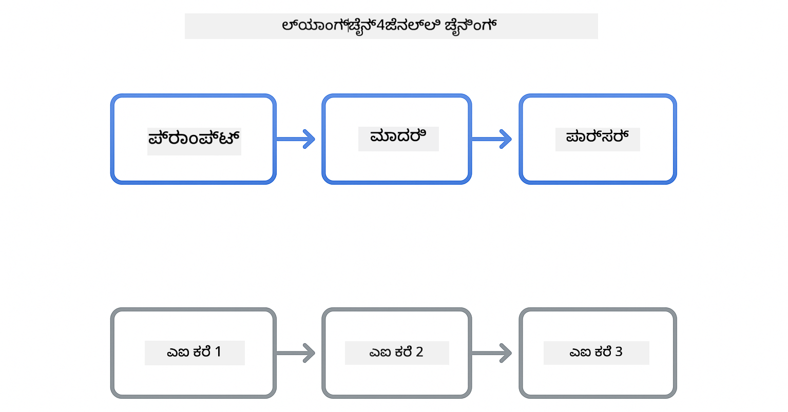

<!--
CO_OP_TRANSLATOR_METADATA:
{
  "original_hash": "377b3e3e6f8d02965bf0fbbc9ccb45c5",
  "translation_date": "2025-12-13T15:43:55+00:00",
  "source_file": "00-quick-start/README.md",
  "language_code": "kn"
}
-->
# Module 00: ತ್ವರಿತ ಪ್ರಾರಂಭ

## ವಿಷಯಗಳ ಪಟ್ಟಿಕೆ

- [ಪರಿಚಯ](../../../00-quick-start)
- [LangChain4j ಎಂದರೆ ಏನು?](../../../00-quick-start)
- [LangChain4j ಅವಲಂಬನೆಗಳು](../../../00-quick-start)
- [ಪೂರ್ವಾಪೇಕ್ಷೆಗಳು](../../../00-quick-start)
- [ಸೆಟಪ್](../../../00-quick-start)
  - [1. ನಿಮ್ಮ GitHub ಟೋಕನ್ ಪಡೆಯಿರಿ](../../../00-quick-start)
  - [2. ನಿಮ್ಮ ಟೋಕನ್ ಸೆಟ್ ಮಾಡಿ](../../../00-quick-start)
- [ಉದಾಹರಣೆಗಳನ್ನು ಚಾಲನೆ ಮಾಡಿ](../../../00-quick-start)
  - [1. ಮೂಲ ಚಾಟ್](../../../00-quick-start)
  - [2. ಪ್ರಾಂಪ್ಟ್ ಮಾದರಿಗಳು](../../../00-quick-start)
  - [3. ಫಂಕ್ಷನ್ ಕರೆ](../../../00-quick-start)
  - [4. ಡಾಕ್ಯುಮೆಂಟ್ ಪ್ರಶ್ನೋತ್ತರ (RAG)](../../../00-quick-start)
- [ಪ್ರತಿ ಉದಾಹರಣೆ ಏನು ತೋರಿಸುತ್ತದೆ](../../../00-quick-start)
- [ಮುಂದಿನ ಹಂತಗಳು](../../../00-quick-start)
- [ಸಮಸ್ಯೆ ಪರಿಹಾರ](../../../00-quick-start)

## ಪರಿಚಯ

ಈ ತ್ವರಿತ ಪ್ರಾರಂಭವು LangChain4j ನೊಂದಿಗೆ ನಿಮ್ಮನ್ನು ಸಾಧ್ಯವಾದಷ್ಟು ಬೇಗ ಕಾರ್ಯನಿರ್ವಹಿಸಲು ಉದ್ದೇಶಿಸಲಾಗಿದೆ. ಇದು LangChain4j ಮತ್ತು GitHub ಮಾದರಿಗಳೊಂದಿಗೆ AI ಅಪ್ಲಿಕೇಶನ್‌ಗಳನ್ನು ನಿರ್ಮಿಸುವ ಮೂಲಭೂತಗಳನ್ನು ಒಳಗೊಂಡಿದೆ. ಮುಂದಿನ ಘಟಕಗಳಲ್ಲಿ ನೀವು LangChain4j ನೊಂದಿಗೆ Azure OpenAI ಬಳಸಿ ಹೆಚ್ಚು ಸುಧಾರಿತ ಅಪ್ಲಿಕೇಶನ್‌ಗಳನ್ನು ನಿರ್ಮಿಸುವಿರಿ.

## LangChain4j ಎಂದರೆ ಏನು?

LangChain4j ಒಂದು ಜಾವಾ ಲೈಬ್ರರಿ ಆಗಿದ್ದು, AI-ಚಾಲಿತ ಅಪ್ಲಿಕೇಶನ್‌ಗಳನ್ನು ಸುಲಭವಾಗಿ ನಿರ್ಮಿಸಲು ಸಹಾಯ ಮಾಡುತ್ತದೆ. HTTP ಕ್ಲೈಂಟ್‌ಗಳು ಮತ್ತು JSON ಪಾರ್ಸಿಂಗ್ ನೊಂದಿಗೆ ವ್ಯವಹರಿಸುವ ಬದಲು, ನೀವು ಸ್ವಚ್ಛ ಜಾವಾ API ಗಳೊಂದಿಗೆ ಕೆಲಸ ಮಾಡುತ್ತೀರಿ.

LangChain ನಲ್ಲಿ "ಚೈನ್" ಎಂದರೆ ಹಲವಾರು ಘಟಕಗಳನ್ನು ಸರಪಳಿಯಾಗಿ ಜೋಡಿಸುವುದನ್ನು ಸೂಚಿಸುತ್ತದೆ - ನೀವು ಪ್ರಾಂಪ್ಟ್ ಅನ್ನು ಮಾದರಿಯೊಂದಕ್ಕೆ, ನಂತರ ಪಾರ್ಸರ್‌ಗೆ ಜೋಡಿಸಬಹುದು, ಅಥವಾ ಹಲವಾರು AI ಕರೆಗಳನ್ನು ಸರಪಳಿಯಾಗಿ ಜೋಡಿಸಬಹುದು, ಅಲ್ಲಿ ಒಂದು ಔಟ್‌ಪುಟ್ ಮುಂದಿನ ಇನ್‌ಪುಟ್ ಆಗಿ ಬಳಸಲಾಗುತ್ತದೆ. ಈ ತ್ವರಿತ ಪ್ರಾರಂಭವು ಮೂಲಭೂತಗಳ ಮೇಲೆ ಕೇಂದ್ರೀಕರಿಸುತ್ತದೆ, ನಂತರ ಹೆಚ್ಚು ಸಂಕೀರ್ಣ ಸರಪಳಿಗಳನ್ನು ಅನ್ವೇಷಿಸುತ್ತದೆ.



*LangChain4j ನಲ್ಲಿ ಘಟಕಗಳನ್ನು ಸರಪಳಿಯಾಗಿ ಜೋಡಿಸುವುದು - ಶಕ್ತಿಶಾಲಿ AI ಕಾರ್ಯಪ್ರವಾಹಗಳನ್ನು ನಿರ್ಮಿಸುವ ಕಟ್ಟಡ ಬ್ಲಾಕ್‌ಗಳು*

ನಾವು ಮೂರು ಮುಖ್ಯ ಘಟಕಗಳನ್ನು ಬಳಸುತ್ತೇವೆ:

**ChatLanguageModel** - AI ಮಾದರಿ ಸಂವಹನಗಳಿಗಾಗಿ ಇಂಟರ್ಫೇಸ್. `model.chat("prompt")` ಅನ್ನು ಕರೆ ಮಾಡಿ ಮತ್ತು ಪ್ರತಿಕ್ರಿಯೆ ಸ್ಟ್ರಿಂಗ್ ಪಡೆಯಿರಿ. ನಾವು `OpenAiOfficialChatModel` ಅನ್ನು ಬಳಸುತ್ತೇವೆ, ಇದು GitHub ಮಾದರಿಗಳಂತಹ OpenAI-ಸಮ್ಮತ ಎಂಡ್‌ಪಾಯಿಂಟ್‌ಗಳೊಂದಿಗೆ ಕೆಲಸ ಮಾಡುತ್ತದೆ.

**AiServices** - ಪ್ರಕಾರ-ಸುರಕ್ಷಿತ AI ಸೇವಾ ಇಂಟರ್ಫೇಸ್‌ಗಳನ್ನು ರಚಿಸುತ್ತದೆ. ವಿಧಾನಗಳನ್ನು ವ್ಯಾಖ್ಯಾನಿಸಿ, ಅವುಗಳನ್ನು `@Tool` ನೊಂದಿಗೆ ಅಂಕಿತ ಮಾಡಿ, ಮತ್ತು LangChain4j ಸಂಯೋಜನೆಯನ್ನು ನಿರ್ವಹಿಸುತ್ತದೆ. AI ಅಗತ್ಯವಿದ್ದಾಗ ನಿಮ್ಮ ಜಾವಾ ವಿಧಾನಗಳನ್ನು ಸ್ವಯಂಚಾಲಿತವಾಗಿ ಕರೆ ಮಾಡುತ್ತದೆ.

**MessageWindowChatMemory** - ಸಂಭಾಷಣಾ ಇತಿಹಾಸವನ್ನು ನಿರ್ವಹಿಸುತ್ತದೆ. ಇದಿಲ್ಲದೆ, ಪ್ರತಿ ವಿನಂತಿ ಸ್ವತಂತ್ರವಾಗಿರುತ್ತದೆ. ಇದೊಂದಿಗೆ, AI ಹಿಂದಿನ ಸಂದೇಶಗಳನ್ನು ನೆನಪಿಡುತ್ತದೆ ಮತ್ತು ಹಲವಾರು ತಿರುವುಗಳಾದ್ಯಂತ ಸಾಂದರ್ಭಿಕತೆಯನ್ನು ಕಾಪಾಡುತ್ತದೆ.


*LangChain4j ವಾಸ್ತುಶಿಲ್ಪ - ನಿಮ್ಮ AI ಅಪ್ಲಿಕೇಶನ್‌ಗಳಿಗೆ ಶಕ್ತಿ ನೀಡಲು ಕಾರ್ಯನಿರ್ವಹಿಸುವ ಮುಖ್ಯ ಘಟಕಗಳು*

## LangChain4j ಅವಲಂಬನೆಗಳು

ಈ ತ್ವರಿತ ಪ್ರಾರಂಭವು [`pom.xml`](../../../00-quick-start/pom.xml) ನಲ್ಲಿ ಎರಡು Maven ಅವಲಂಬನೆಗಳನ್ನು ಬಳಸುತ್ತದೆ:

```xml
<!-- Core LangChain4j library -->
<dependency>
    <groupId>dev.langchain4j</groupId>
    <artifactId>langchain4j</artifactId> <!-- Inherited from BOM in root pom.xml -->
</dependency>

<!-- OpenAI integration (works with GitHub Models) -->
<dependency>
    <groupId>dev.langchain4j</groupId>
    <artifactId>langchain4j-open-ai-official</artifactId> <!-- Inherited from BOM in root pom.xml -->
</dependency>
```

`langchain4j-open-ai-official` ಮೋಡ್ಯೂಲ್ `OpenAiOfficialChatModel` ಕ್ಲಾಸ್ ಅನ್ನು ಒದಗಿಸುತ್ತದೆ, ಇದು OpenAI-ಸಮ್ಮತ API ಗಳಿಗೆ ಸಂಪರ್ಕಿಸುತ್ತದೆ. GitHub ಮಾದರಿಗಳು ಅದೇ API ಸ್ವರೂಪವನ್ನು ಬಳಸುತ್ತವೆ, ಆದ್ದರಿಂದ ವಿಶೇಷ ಅಡಾಪ್ಟರ್ ಅಗತ್ಯವಿಲ್ಲ - ಕೇವಲ ಮೂಲ URL ಅನ್ನು `https://models.github.ai/inference` ಗೆ ಸೂಚಿಸಿ.

## ಪೂರ್ವಾಪೇಕ್ಷೆಗಳು

**Dev ಕಂಟೈನರ್ ಬಳಸುತ್ತಿದ್ದೀರಾ?** ಜಾವಾ ಮತ್ತು Maven ಈಗಾಗಲೇ ಸ್ಥಾಪಿಸಲಾಗಿದೆ. ನಿಮಗೆ ಕೇವಲ GitHub ವೈಯಕ್ತಿಕ ಪ್ರವೇಶ ಟೋಕನ್ ಬೇಕು.

**ಸ್ಥಳೀಯ ಅಭಿವೃದ್ಧಿ:**
- ಜಾವಾ 21+, Maven 3.9+
- GitHub ವೈಯಕ್ತಿಕ ಪ್ರವೇಶ ಟೋಕನ್ (ಕೆಳಗಿನ ಸೂಚನೆಗಳು)

> **ಗಮನಿಸಿ:** ಈ ಘಟಕವು GitHub ಮಾದರಿಗಳಿಂದ `gpt-4.1-nano` ಅನ್ನು ಬಳಸುತ್ತದೆ. ಕೋಡ್‌ನಲ್ಲಿ ಮಾದರಿ ಹೆಸರನ್ನು ಬದಲಿಸಬೇಡಿ - ಇದು GitHub ಲಭ್ಯವಿರುವ ಮಾದರಿಗಳೊಂದಿಗೆ ಕೆಲಸ ಮಾಡಲು ಸಂರಚಿಸಲಾಗಿದೆ.

## ಸೆಟಪ್

### 1. ನಿಮ್ಮ GitHub ಟೋಕನ್ ಪಡೆಯಿರಿ

1. [GitHub ಸೆಟ್ಟಿಂಗ್ಸ್ → ವೈಯಕ್ತಿಕ ಪ್ರವೇಶ ಟೋಕನ್‌ಗಳು](https://github.com/settings/personal-access-tokens) ಗೆ ಹೋಗಿ
2. "Generate new token" ಕ್ಲಿಕ್ ಮಾಡಿ
3. ವಿವರಣಾತ್ಮಕ ಹೆಸರು ನಿಗದಿಪಡಿಸಿ (ಉದಾ: "LangChain4j ಡೆಮೊ")
4. ಅವಧಿ ನಿಗದಿಪಡಿಸಿ (7 ದಿನಗಳು ಶಿಫಾರಸು)
5. "ಖಾತೆ ಅನುಮತಿಗಳು" ಅಡಿಯಲ್ಲಿ "Models" ಅನ್ನು "Read-only" ಗೆ ಸೆಟ್ ಮಾಡಿ
6. "Generate token" ಕ್ಲಿಕ್ ಮಾಡಿ
7. ನಿಮ್ಮ ಟೋಕನ್ ನಕಲಿಸಿ ಮತ್ತು ಉಳಿಸಿ - ನೀವು ಇದನ್ನು ಮತ್ತೆ ನೋಡಲಾರಿರಿ

### 2. ನಿಮ್ಮ ಟೋಕನ್ ಸೆಟ್ ಮಾಡಿ

**ಆಯ್ಕೆ 1: VS Code ಬಳಸಿ (ಶಿಫಾರಸು)**

ನೀವು VS Code ಬಳಸುತ್ತಿದ್ದರೆ, ನಿಮ್ಮ ಟೋಕನ್ ಅನ್ನು ಪ್ರಾಜೆಕ್ಟ್ ರೂಟ್‌ನ `.env` ಫೈಲ್‌ಗೆ ಸೇರಿಸಿ:

`.env` ಫೈಲ್ ಇಲ್ಲದಿದ್ದರೆ, `.env.example` ನಕಲಿಸಿ `.env` ಎಂದು ಹೆಸರಿಸಿ ಅಥವಾ ಪ್ರಾಜೆಕ್ಟ್ ರೂಟ್‌ನಲ್ಲಿ ಹೊಸ `.env` ಫೈಲ್ ರಚಿಸಿ.

**ಉದಾಹರಣೆಯ `.env` ಫೈಲ್:**
```bash
# /workspaces/LangChain4j-for-Beginners/.env ನಲ್ಲಿ
GITHUB_TOKEN=your_token_here
```

ನಂತರ ನೀವು ಎಕ್ಸ್‌ಪ್ಲೋರರ್‌ನಲ್ಲಿ ಯಾವುದೇ ಡೆಮೊ ಫೈಲ್ (ಉದಾ: `BasicChatDemo.java`) ಮೇಲೆ ರೈಟ್-ಕ್ಲಿಕ್ ಮಾಡಿ **"Run Java"** ಆಯ್ಕೆಮಾಡಬಹುದು ಅಥವಾ ರನ್ ಮತ್ತು ಡಿಬಗ್ ಪ್ಯಾನೆಲ್‌ನಿಂದ ಲಾಂಚ್ ಕಾನ್ಫಿಗರೇಶನ್‌ಗಳನ್ನು ಬಳಸಬಹುದು.

**ಆಯ್ಕೆ 2: ಟರ್ಮಿನಲ್ ಬಳಸಿ**

ಟೋಕನ್ ಅನ್ನು ಪರಿಸರ ಚರವಾಗಿ ಸೆಟ್ ಮಾಡಿ:

**Bash:**
```bash
export GITHUB_TOKEN=your_token_here
```

**PowerShell:**
```powershell
$env:GITHUB_TOKEN=your_token_here
```

## ಉದಾಹರಣೆಗಳನ್ನು ಚಾಲನೆ ಮಾಡಿ

**VS Code ಬಳಸಿ:** ಎಕ್ಸ್‌ಪ್ಲೋರರ್‌ನಲ್ಲಿ ಯಾವುದೇ ಡೆಮೊ ಫೈಲ್ ಮೇಲೆ ರೈಟ್-ಕ್ಲಿಕ್ ಮಾಡಿ **"Run Java"** ಆಯ್ಕೆಮಾಡಿ, ಅಥವಾ ರನ್ ಮತ್ತು ಡಿಬಗ್ ಪ್ಯಾನೆಲ್‌ನಿಂದ ಲಾಂಚ್ ಕಾನ್ಫಿಗರೇಶನ್‌ಗಳನ್ನು ಬಳಸಿ (ಮೊದಲು `.env` ಫೈಲ್‌ಗೆ ನಿಮ್ಮ ಟೋಕನ್ ಸೇರಿಸಿದ್ದೀರಾ ಎಂದು ಖಚಿತಪಡಿಸಿಕೊಳ್ಳಿ).

**Maven ಬಳಸಿ:** ಬದಲಾಗಿ, ನೀವು ಕಮಾಂಡ್ ಲೈನ್‌ನಿಂದ ಚಾಲನೆ ಮಾಡಬಹುದು:

### 1. ಮೂಲ ಚಾಟ್

**Bash:**
```bash
mvn compile exec:java -Dexec.mainClass=com.example.langchain4j.quickstart.BasicChatDemo
```

**PowerShell:**
```powershell
mvn --% compile exec:java -Dexec.mainClass=com.example.langchain4j.quickstart.BasicChatDemo
```

### 2. ಪ್ರಾಂಪ್ಟ್ ಮಾದರಿಗಳು

**Bash:**
```bash
mvn compile exec:java -Dexec.mainClass=com.example.langchain4j.quickstart.PromptEngineeringDemo
```

**PowerShell:**
```powershell
mvn --% compile exec:java -Dexec.mainClass=com.example.langchain4j.quickstart.PromptEngineeringDemo
```

ಶೂನ್ಯ-ಶಾಟ್, ಕೆಲವು-ಶಾಟ್, ಚೈನ್-ಆಫ್-ಥಾಟ್, ಮತ್ತು ಪಾತ್ರಾಧಾರಿತ ಪ್ರಾಂಪ್ಟಿಂಗ್ ತೋರಿಸುತ್ತದೆ.

### 3. ಫಂಕ್ಷನ್ ಕರೆ

**Bash:**
```bash
mvn compile exec:java -Dexec.mainClass=com.example.langchain4j.quickstart.ToolIntegrationDemo
```

**PowerShell:**
```powershell
mvn --% compile exec:java -Dexec.mainClass=com.example.langchain4j.quickstart.ToolIntegrationDemo
```

AI ಅಗತ್ಯವಿದ್ದಾಗ ನಿಮ್ಮ ಜಾವಾ ವಿಧಾನಗಳನ್ನು ಸ್ವಯಂಚಾಲಿತವಾಗಿ ಕರೆ ಮಾಡುತ್ತದೆ.

### 4. ಡಾಕ್ಯುಮೆಂಟ್ ಪ್ರಶ್ನೋತ್ತರ (RAG)

**Bash:**
```bash
mvn compile exec:java -Dexec.mainClass=com.example.langchain4j.quickstart.SimpleReaderDemo
```

**PowerShell:**
```powershell
mvn --% compile exec:java -Dexec.mainClass=com.example.langchain4j.quickstart.SimpleReaderDemo
```

`document.txt` ನಲ್ಲಿ ವಿಷಯದ ಬಗ್ಗೆ ಪ್ರಶ್ನೆಗಳನ್ನು ಕೇಳಿ.

## ಪ್ರತಿ ಉದಾಹರಣೆ ಏನು ತೋರಿಸುತ್ತದೆ

**ಮೂಲ ಚಾಟ್** - [BasicChatDemo.java](../../../00-quick-start/src/main/java/com/example/langchain4j/quickstart/BasicChatDemo.java)

ಇಲ್ಲಿ LangChain4j ನ ಮೂಲಭೂತವನ್ನು ನೋಡಲು ಪ್ರಾರಂಭಿಸಿ. ನೀವು `OpenAiOfficialChatModel` ರಚಿಸಿ, `.chat()` ಮೂಲಕ ಪ್ರಾಂಪ್ಟ್ ಕಳುಹಿಸಿ, ಮತ್ತು ಪ್ರತಿಕ್ರಿಯೆ ಪಡೆಯುತ್ತೀರಿ. ಇದು ಆಧಾರವನ್ನು ತೋರಿಸುತ್ತದೆ: ಕಸ್ಟಮ್ ಎಂಡ್‌ಪಾಯಿಂಟ್‌ಗಳು ಮತ್ತು API ಕೀಲಿಗಳೊಂದಿಗೆ ಮಾದರಿಗಳನ್ನು ಪ್ರಾರಂಭಿಸುವುದು ಹೇಗೆ. ಈ ಮಾದರಿಯನ್ನು ಅರ್ಥಮಾಡಿಕೊಂಡ ನಂತರ, ಉಳಿದ ಎಲ್ಲವೂ ಇದರಲ್ಲಿ ಆಧಾರಿತವಾಗಿರುತ್ತದೆ.

```java
ChatLanguageModel model = OpenAiOfficialChatModel.builder()
    .baseUrl("https://models.github.ai/inference")
    .apiKey(System.getenv("GITHUB_TOKEN"))
    .modelName("gpt-4.1-nano")
    .build();

String response = model.chat("What is LangChain4j?");
System.out.println(response);
```

> **🤖 [GitHub Copilot](https://github.com/features/copilot) ಚಾಟ್ ಬಳಸಿ ಪ್ರಯತ್ನಿಸಿ:** [`BasicChatDemo.java`](../../../00-quick-start/src/main/java/com/example/langchain4j/quickstart/BasicChatDemo.java) ತೆರೆಯಿರಿ ಮತ್ತು ಕೇಳಿ:
> - "ಈ ಕೋಡ್‌ನಲ್ಲಿ GitHub ಮಾದರಿಗಳಿಂದ Azure OpenAI ಗೆ ಹೇಗೆ ಬದಲಾಯಿಸಬಹುದು?"
> - "OpenAiOfficialChatModel.builder() ನಲ್ಲಿ ಇನ್ನಾವುವು ಪರಿಮಾಣಗಳನ್ನು ಸಂರಚಿಸಬಹುದು?"
> - "ಪೂರ್ಣ ಪ್ರತಿಕ್ರಿಯೆಗಾಗಿ ಕಾಯದೆ ಸ್ಟ್ರೀಮಿಂಗ್ ಪ್ರತಿಕ್ರಿಯೆಗಳನ್ನು ಹೇಗೆ ಸೇರಿಸಬಹುದು?"

**ಪ್ರಾಂಪ್ಟ್ ಎಂಜಿನಿಯರಿಂಗ್** - [PromptEngineeringDemo.java](../../../00-quick-start/src/main/java/com/example/langchain4j/quickstart/PromptEngineeringDemo.java)

ನೀವು ಈಗ ಮಾದರಿಯೊಂದಿಗೆ ಮಾತನಾಡುವುದು ಹೇಗೆ ಎಂಬುದನ್ನು ತಿಳಿದಿದ್ದೀರಿ, ಈಗ ನೀವು ಅದಕ್ಕೆ ಏನು ಹೇಳುತ್ತೀರಿ ಎಂಬುದನ್ನು ಅನ್ವೇಷಿಸೋಣ. ಈ ಡೆಮೊ ಅದೇ ಮಾದರಿ ಸೆಟಪ್ ಅನ್ನು ಬಳಸುತ್ತದೆ ಆದರೆ ನಾಲ್ಕು ವಿಭಿನ್ನ ಪ್ರಾಂಪ್ಟ್ ಮಾದರಿಗಳನ್ನು ತೋರಿಸುತ್ತದೆ. ನೇರ ಸೂಚನೆಗಳಿಗೆ ಶೂನ್ಯ-ಶಾಟ್ ಪ್ರಾಂಪ್ಟ್‌ಗಳನ್ನು ಪ್ರಯತ್ನಿಸಿ, ಉದಾಹರಣೆಗಳಿಂದ ಕಲಿಯುವ ಕೆಲವು-ಶಾಟ್ ಪ್ರಾಂಪ್ಟ್‌ಗಳು, ತರ್ಕದ ಹಂತಗಳನ್ನು ಬಹಿರಂಗಪಡಿಸುವ ಚೈನ್-ಆಫ್-ಥಾಟ್ ಪ್ರಾಂಪ್ಟ್‌ಗಳು, ಮತ್ತು ಸಾಂದರ್ಭಿಕತೆಯನ್ನು ನಿಗದಿಪಡಿಸುವ ಪಾತ್ರಾಧಾರಿತ ಪ್ರಾಂಪ್ಟ್‌ಗಳು. ನೀವು ಹೇಗೆ ಒಂದೇ ಮಾದರಿ ಬೇರೆ ಬೇರೆ ಫಲಿತಾಂಶಗಳನ್ನು ನೀಡುತ್ತದೆ ಎಂಬುದನ್ನು ನೋಡುತ್ತೀರಿ.

```java
PromptTemplate template = PromptTemplate.from(
    "What's the best time to visit {{destination}} for {{activity}}?"
);

Prompt prompt = template.apply(Map.of(
    "destination", "Paris",
    "activity", "sightseeing"
));

String response = model.chat(prompt.text());
```

> **🤖 [GitHub Copilot](https://github.com/features/copilot) ಚಾಟ್ ಬಳಸಿ ಪ್ರಯತ್ನಿಸಿ:** [`PromptEngineeringDemo.java`](../../../00-quick-start/src/main/java/com/example/langchain4j/quickstart/PromptEngineeringDemo.java) ತೆರೆಯಿರಿ ಮತ್ತು ಕೇಳಿ:
> - "ಶೂನ್ಯ-ಶಾಟ್ ಮತ್ತು ಕೆಲವು-ಶಾಟ್ ಪ್ರಾಂಪ್ಟಿಂಗ್ ನಡುವಿನ ವ್ಯತ್ಯಾಸವೇನು ಮತ್ತು ಯಾವಾಗ ಯಾವುದು ಬಳಸಬೇಕು?"
> - "ತಾಪಮಾನ ಪರಿಮಾಣವು ಮಾದರಿಯ ಪ್ರತಿಕ್ರಿಯೆಗಳನ್ನು ಹೇಗೆ ಪ್ರಭಾವಿಸುತ್ತದೆ?"
> - "ಉತ್ಪಾದನೆಯಲ್ಲಿ ಪ್ರಾಂಪ್ಟ್ ಇಂಜೆಕ್ಷನ್ ದಾಳಿಗಳನ್ನು ತಡೆಯಲು ಕೆಲವು ತಂತ್ರಗಳು ಯಾವುವು?"
> - "ಸಾಮಾನ್ಯ ಮಾದರಿಗಳಿಗಾಗಿ ಪುನಃಬಳಕೆ ಮಾಡಬಹುದಾದ PromptTemplate ವಸ್ತುಗಳನ್ನು ಹೇಗೆ ರಚಿಸಬಹುದು?"

**ಟೂಲ್ ಇಂಟಿಗ್ರೇಶನ್** - [ToolIntegrationDemo.java](../../../00-quick-start/src/main/java/com/example/langchain4j/quickstart/ToolIntegrationDemo.java)

ಇಲ್ಲಿ LangChain4j ಶಕ್ತಿಶಾಲಿಯಾಗುತ್ತದೆ. ನೀವು `AiServices` ಬಳಸಿ ನಿಮ್ಮ ಜಾವಾ ವಿಧಾನಗಳನ್ನು ಕರೆ ಮಾಡಬಹುದಾದ AI ಸಹಾಯಕನನ್ನು ರಚಿಸುತ್ತೀರಿ. ವಿಧಾನಗಳನ್ನು `@Tool("ವಿವರಣೆ")` ಅಂಕಿತ ಮಾಡಿ, ಮತ್ತು LangChain4j ಉಳಿದುದನ್ನು ನಿರ್ವಹಿಸುತ್ತದೆ - ಬಳಕೆದಾರ ಕೇಳಿದಂತೆ AI ಸ್ವಯಂಚಾಲಿತವಾಗಿ ಯಾವ ಟೂಲ್ ಬಳಸಬೇಕೆಂದು ನಿರ್ಧರಿಸುತ್ತದೆ. ಇದು ಫಂಕ್ಷನ್ ಕರೆ ತಂತ್ರವನ್ನು ತೋರಿಸುತ್ತದೆ, ಇದು ಪ್ರಶ್ನೆಗಳಿಗೆ ಉತ್ತರಿಸುವುದಕ್ಕಿಂತ ಕಾರ್ಯಗಳನ್ನು ಕೈಗೊಳ್ಳುವ AI ನಿರ್ಮಿಸಲು ಮುಖ್ಯ ತಂತ್ರ.

```java
@Tool("Performs addition of two numeric values")
public double add(double a, double b) {
    return a + b;
}

MathAssistant assistant = AiServices.create(MathAssistant.class, model);
String response = assistant.chat("What is 25 plus 17?");
```

> **🤖 [GitHub Copilot](https://github.com/features/copilot) ಚಾಟ್ ಬಳಸಿ ಪ್ರಯತ್ನಿಸಿ:** [`ToolIntegrationDemo.java`](../../../00-quick-start/src/main/java/com/example/langchain4j/quickstart/ToolIntegrationDemo.java) ತೆರೆಯಿರಿ ಮತ್ತು ಕೇಳಿ:
> - "@Tool ಅಂಕಿತ ಹೇಗೆ ಕೆಲಸ ಮಾಡುತ್ತದೆ ಮತ್ತು LangChain4j ಇದನ್ನು ಹಿಂದೆ ಹೇಗೆ ನಿರ್ವಹಿಸುತ್ತದೆ?"
> - "ಸಂಕೀರ್ಣ ಸಮಸ್ಯೆಗಳನ್ನು ಪರಿಹರಿಸಲು AI ಸರಣಿಯಾಗಿ ಹಲವಾರು ಟೂಲ್‌ಗಳನ್ನು ಕರೆ ಮಾಡಬಹುದೇ?"
> - "ಟೂಲ್ ಎಕ್ಸೆಪ್ಷನ್ ಎಸೆಯಿಸಿದರೆ ಏನು ಆಗುತ್ತದೆ - ದೋಷಗಳನ್ನು ಹೇಗೆ ನಿರ್ವಹಿಸಬೇಕು?"
> - "ಈ ಕ್ಯಾಲ್ಕ್ಯುಲೇಟರ್ ಉದಾಹರಣೆಯ ಬದಲು ನಿಜವಾದ API ಅನ್ನು ಹೇಗೆ ಸಂಯೋಜಿಸಬಹುದು?"

**ಡಾಕ್ಯುಮೆಂಟ್ ಪ್ರಶ್ನೋತ್ತರ (RAG)** - [SimpleReaderDemo.java](../../../00-quick-start/src/main/java/com/example/langchain4j/quickstart/SimpleReaderDemo.java)

ಇಲ್ಲಿ ನೀವು RAG (ರಿಟ್ರೀವಲ್-ಆಗ್ಮೆಂಟೆಡ್ ಜನರೇಶನ್) ನ ಮೂಲಭೂತವನ್ನು ನೋಡುತ್ತೀರಿ. ಮಾದರಿಯ ತರಬೇತಿ ಡೇಟಾದ ಮೇಲೆ ಅವಲಂಬಿಸದೆ, ನೀವು [`document.txt`](../../../00-quick-start/document.txt) ನಿಂದ ವಿಷಯವನ್ನು ಲೋಡ್ ಮಾಡಿ ಪ್ರಾಂಪ್ಟ್‌ನಲ್ಲಿ ಸೇರಿಸುತ್ತೀರಿ. AI ನಿಮ್ಮ ಡಾಕ್ಯುಮೆಂಟ್ ಆಧಾರಿತವಾಗಿ ಉತ್ತರಿಸುತ್ತದೆ, ಅದರ ಸಾಮಾನ್ಯ ಜ್ಞಾನವಲ್ಲ. ಇದು ನಿಮ್ಮ ಸ್ವಂತ ಡೇಟಾ ಬಳಸಿ ಕಾರ್ಯನಿರ್ವಹಿಸುವ ವ್ಯವಸ್ಥೆಗಳನ್ನು ನಿರ್ಮಿಸುವ ಮೊದಲ ಹಂತ.

```java
Document document = FileSystemDocumentLoader.loadDocument("document.txt");
String content = document.text();

String prompt = "Based on this document: " + content + 
                "\nQuestion: What is the main topic?";
String response = model.chat(prompt);
```

> **ಗಮನಿಸಿ:** ಈ ಸರಳ ವಿಧಾನವು ಸಂಪೂರ್ಣ ಡಾಕ್ಯುಮೆಂಟ್ ಅನ್ನು ಪ್ರಾಂಪ್ಟ್‌ಗೆ ಲೋಡ್ ಮಾಡುತ್ತದೆ. ದೊಡ್ಡ ಫೈಲ್‌ಗಳ (>10KB)ಿಗಾಗಿ, ನೀವು ಸಾಂದರ್ಭಿಕ ಮಿತಿಗಳನ್ನು ಮೀರುತ್ತೀರಿ. ಘಟಕ 03 ರಲ್ಲಿ ಚಂಕಿಂಗ್ ಮತ್ತು ವೆಕ್ಟರ್ ಶೋಧನೆಯನ್ನು ಉತ್ಪಾದನಾ RAG ವ್ಯವಸ್ಥೆಗಳಿಗೆ ಒಳಗೊಂಡಿದೆ.

> **🤖 [GitHub Copilot](https://github.com/features/copilot) ಚಾಟ್ ಬಳಸಿ ಪ್ರಯತ್ನಿಸಿ:** [`SimpleReaderDemo.java`](../../../00-quick-start/src/main/java/com/example/langchain4j/quickstart/SimpleReaderDemo.java) ತೆರೆಯಿರಿ ಮತ್ತು ಕೇಳಿ:
> - "RAG AI ಭ್ರಮೆಗಳನ್ನು ಮಾದರಿಯ ತರಬೇತಿ ಡೇಟಾ ಬಳಕೆಯೊಂದಿಗೆ ಹೋಲಿಸಿದರೆ ಹೇಗೆ ತಡೆಯುತ್ತದೆ?"
> - "ಈ ಸರಳ ವಿಧಾನ ಮತ್ತು ವೆಕ್ಟರ್ ಎಂಬೆಡ್ಡಿಂಗ್‌ಗಳ ಬಳಕೆಯ ನಡುವಿನ ವ್ಯತ್ಯಾಸವೇನು?"
> - "ಬಹು ಡಾಕ್ಯುಮೆಂಟ್‌ಗಳು ಅಥವಾ ದೊಡ್ಡ ಜ್ಞಾನ ಆಧಾರಗಳನ್ನು ಹೇಗೆ ವಿಸ್ತರಿಸಬಹುದು?"
> - "AI ಕೇವಲ ನೀಡಲಾದ ಸಾಂದರ್ಭಿಕತೆಯನ್ನು ಬಳಸಲು ಪ್ರಾಂಪ್ಟ್ ರಚನೆಗೆ ಉತ್ತಮ ಅಭ್ಯಾಸಗಳು ಯಾವುವು?"

## ಡಿಬಗ್ ಮಾಡುವುದು

ಉದಾಹರಣೆಗಳಲ್ಲಿ `.logRequests(true)` ಮತ್ತು `.logResponses(true)` ಅನ್ನು ಸೇರಿಸಲಾಗಿದೆ, ಇದು API ಕರೆಗಳನ್ನು ಕಾನ್ಸೋಲ್‌ನಲ್ಲಿ ತೋರಿಸುತ್ತದೆ. ಇದು ಪ್ರಮಾಣೀಕರಣ ದೋಷಗಳು, ದರ ಮಿತಿಗಳು, ಅಥವಾ ಅಪ್ರತೀಕ್ಷಿತ ಪ್ರತಿಕ್ರಿಯೆಗಳನ್ನು ಪರಿಹರಿಸಲು ಸಹಾಯ ಮಾಡುತ್ತದೆ. ಉತ್ಪಾದನೆಯಲ್ಲಿ ಈ ಫ್ಲಾಗ್‌ಗಳನ್ನು ತೆಗೆದುಹಾಕಿ ಲಾಗ್ ಶಬ್ದವನ್ನು ಕಡಿಮೆ ಮಾಡಿ.

## ಮುಂದಿನ ಹಂತಗಳು

**ಮುಂದಿನ ಘಟಕ:** [01-ಪರಿಚಯ - LangChain4j ಮತ್ತು gpt-5 ನೊಂದಿಗೆ Azure ನಲ್ಲಿ ಪ್ರಾರಂಭ](../01-introduction/README.md)

---

**ನಾವಿಗೇಶನ್:** [← ಮುಖ್ಯಕ್ಕೆ ಹಿಂತಿರುಗಿ](../README.md) | [ಮುಂದೆ: Module 01 - ಪರಿಚಯ →](../01-introduction/README.md)

---

## ಸಮಸ್ಯೆ ಪರಿಹಾರ

### ಮೊದಲ ಬಾರಿಗೆ Maven ನಿರ್ಮಾಣ

**ಸಮಸ್ಯೆ:** ಪ್ರಾಥಮಿಕ `mvn clean compile` ಅಥವಾ `mvn package` ಬಹಳ ಸಮಯ ತೆಗೆದುಕೊಳ್ಳುತ್ತದೆ (10-15 ನಿಮಿಷಗಳು)

**ಕಾರಣ:** Maven ಮೊದಲ ಬಾರಿಗೆ ಎಲ್ಲಾ ಪ್ರಾಜೆಕ್ಟ್ ಅವಲಂಬನೆಗಳನ್ನು (Spring Boot, LangChain4j ಲೈಬ್ರರಿಗಳು, Azure SDK ಗಳು, ಇತ್ಯಾದಿ) ಡೌನ್‌ಲೋಡ್ ಮಾಡಬೇಕಾಗುತ್ತದೆ.

**ಪರಿಹಾರ:** ಇದು ಸಾಮಾನ್ಯ ವರ್ತನೆ. ಮುಂದಿನ ನಿರ್ಮಾಣಗಳು ಸ್ಥಳೀಯವಾಗಿ ಕ್ಯಾಶ್ ಆಗಿರುವುದರಿಂದ ಬಹಳ ವೇಗವಾಗಿ ನಡೆಯುತ್ತವೆ. ಡೌನ್‌ಲೋಡ್ ಸಮಯ ನಿಮ್ಮ ನೆಟ್‌ವರ್ಕ್ ವೇಗದ ಮೇಲೆ ಅವಲಂಬಿತವಾಗಿದೆ.

### PowerShell Maven ಕಮಾಂಡ್ ಸಿಂಟ್ಯಾಕ್ಸ್

**ಸಮಸ್ಯೆ:** Maven ಕಮಾಂಡ್‌ಗಳು `Unknown lifecycle phase ".mainClass=..."` ದೋಷದೊಂದಿಗೆ ವಿಫಲವಾಗುತ್ತವೆ

**ಕಾರಣ:** PowerShell `=` ಅನ್ನು ಚರ ಸಂರಚನಾ ಆಪರೇಟರ್ ಎಂದು ವ್ಯಾಖ್ಯಾನಿಸುತ್ತದೆ, Maven ಗುಣಲಕ್ಷಣ ಸಿಂಟ್ಯಾಕ್ಸ್ ಅನ್ನು ಮುರಿಯುತ್ತದೆ

**ಪರಿಹಾರ:** Maven ಕಮಾಂಡ್‌ಗಿಂತ ಮುಂಚೆ ಸ್ಟಾಪ್-ಪಾರ್ಸಿಂಗ್ ಆಪರೇಟರ್ `--%` ಬಳಸಿ:

**PowerShell:**
```powershell
mvn --% compile exec:java -Dexec.mainClass=com.example.langchain4j.quickstart.BasicChatDemo
```

**Bash:**
```bash
mvn compile exec:java -Dexec.mainClass=com.example.langchain4j.quickstart.BasicChatDemo
```

`--%` ಆಪರೇಟರ್ PowerShell ಗೆ ಉಳಿದ ಎಲ್ಲಾ ಆರ್ಗ್ಯುಮೆಂಟ್‌ಗಳನ್ನು Maven ಗೆ ಅರ್ಥಮಾಡಿಕೊಳ್ಳದೆ ನೇರವಾಗಿ ಕಳುಹಿಸಲು ಸೂಚಿಸುತ್ತದೆ.

### Windows PowerShell ಇಮೋಜಿ ಪ್ರದರ್ಶನ

**ಸಮಸ್ಯೆ:** PowerShell ನಲ್ಲಿ AI ಪ್ರತಿಕ್ರಿಯೆಗಳು ಇಮೋಜಿಗಳ ಬದಲು ಕಸದ ಅಕ್ಷರಗಳನ್ನು (ಉದಾ: `????` ಅಥವಾ `â??`) ತೋರಿಸುತ್ತವೆ

**ಕಾರಣ:** PowerShell ನ ಡೀಫಾಲ್ಟ್ ಎನ್‌ಕೋಡಿಂಗ್ UTF-8 ಇಮೋಜಿಗಳನ್ನು ಬೆಂಬಲಿಸುವುದಿಲ್ಲ

**ಪರಿಹಾರ:** ಜಾವಾ ಅಪ್ಲಿಕೇಶನ್‌ಗಳನ್ನು ಚಾಲನೆ ಮಾಡುವ ಮೊದಲು ಈ ಕಮಾಂಡ್ ಅನ್ನು ರನ್ ಮಾಡಿ:
```cmd
chcp 65001
```

ಇದು ಟರ್ಮಿನಲ್‌ನಲ್ಲಿ UTF-8 ಎನ್‌ಕೋಡಿಂಗ್ ಅನ್ನು ಬಲವಂತವಾಗಿ ನಿಗದಿಪಡಿಸುತ್ತದೆ. ಬದಲಾಗಿ, ಉತ್ತಮ ಯುನಿಕೋಡ್ ಬೆಂಬಲ ಹೊಂದಿರುವ Windows ಟರ್ಮಿನಲ್ ಬಳಸಿ.

---

<!-- CO-OP TRANSLATOR DISCLAIMER START -->
**ಅಸ್ವೀಕಾರ**:  
ಈ ದಸ್ತಾವೇಜು AI ಅನುವಾದ ಸೇವೆ [Co-op Translator](https://github.com/Azure/co-op-translator) ಬಳಸಿ ಅನುವಾದಿಸಲಾಗಿದೆ. ನಾವು ನಿಖರತೆಯಿಗಾಗಿ ಪ್ರಯತ್ನಿಸುತ್ತಿದ್ದರೂ, ಸ್ವಯಂಚಾಲಿತ ಅನುವಾದಗಳಲ್ಲಿ ದೋಷಗಳು ಅಥವಾ ಅಸತ್ಯತೆಗಳು ಇರಬಹುದು ಎಂದು ದಯವಿಟ್ಟು ಗಮನಿಸಿ. ಮೂಲ ಭಾಷೆಯಲ್ಲಿರುವ ಮೂಲ ದಸ್ತಾವೇಜನ್ನು ಅಧಿಕೃತ ಮೂಲವೆಂದು ಪರಿಗಣಿಸಬೇಕು. ಮಹತ್ವದ ಮಾಹಿತಿಗಾಗಿ, ವೃತ್ತಿಪರ ಮಾನವ ಅನುವಾದವನ್ನು ಶಿಫಾರಸು ಮಾಡಲಾಗುತ್ತದೆ. ಈ ಅನುವಾದ ಬಳಕೆಯಿಂದ ಉಂಟಾಗುವ ಯಾವುದೇ ತಪ್ಪು ಅರ್ಥಮಾಡಿಕೊಳ್ಳುವಿಕೆ ಅಥವಾ ತಪ್ಪು ವಿವರಣೆಗಳಿಗೆ ನಾವು ಹೊಣೆಗಾರರಾಗುವುದಿಲ್ಲ.
<!-- CO-OP TRANSLATOR DISCLAIMER END -->