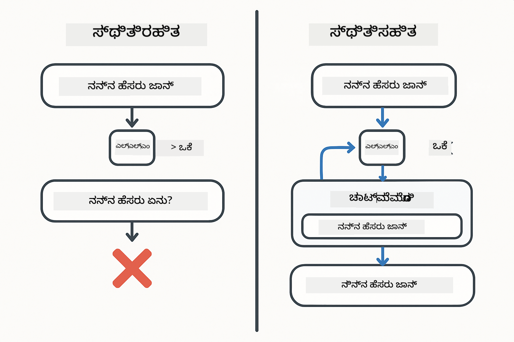
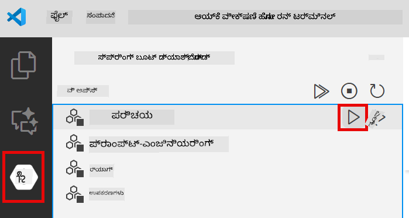
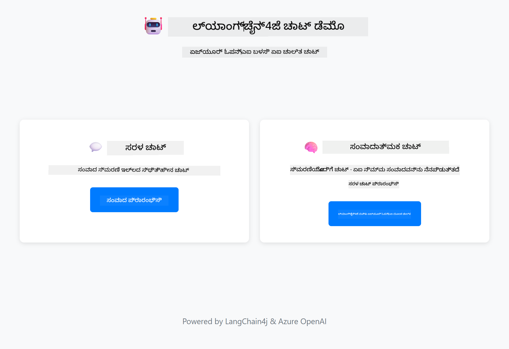
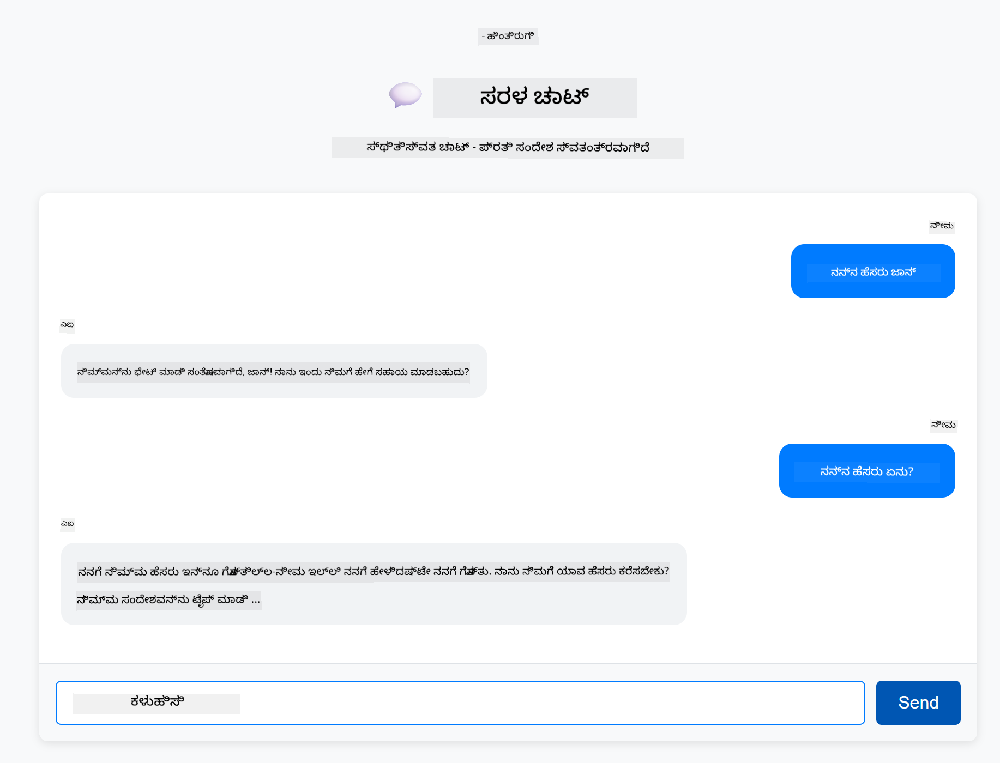
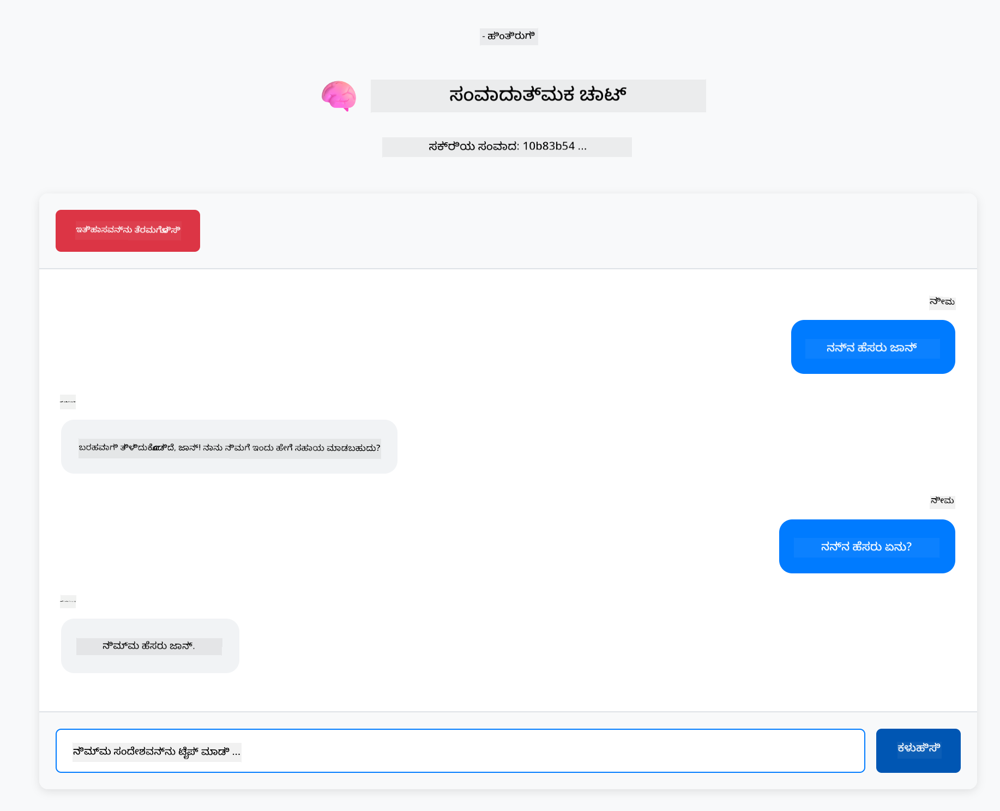

<!--
CO_OP_TRANSLATOR_METADATA:
{
  "original_hash": "c3e07ca58d0b8a3f47d3bf5728541e0a",
  "translation_date": "2025-12-13T14:24:15+00:00",
  "source_file": "01-introduction/README.md",
  "language_code": "kn"
}
-->
# Module 01: LangChain4j ಜೊತೆಗೆ ಪ್ರಾರಂಭಿಸುವುದು

## ವಿಷಯಗಳ ಪಟ್ಟಿಕೆ

- [ನೀವು ಕಲಿಯುವದು ಏನು](../../../01-introduction)
- [ಪೂರ್ವಾಪೇಕ್ಷಿತಗಳು](../../../01-introduction)
- [ಮೂಲ ಸಮಸ್ಯೆಯನ್ನು ಅರ್ಥಮಾಡಿಕೊಳ್ಳುವುದು](../../../01-introduction)
- [ಟೋಕನ್‌ಗಳನ್ನು ಅರ್ಥಮಾಡಿಕೊಳ್ಳುವುದು](../../../01-introduction)
- [ಸ್ಮರಣೆ ಹೇಗೆ ಕೆಲಸ ಮಾಡುತ್ತದೆ](../../../01-introduction)
- [ಇದು LangChain4j ಅನ್ನು ಹೇಗೆ ಬಳಸುತ್ತದೆ](../../../01-introduction)
- [Azure OpenAI ಮೂಲಸೌಕರ್ಯವನ್ನು ನಿಯೋಜಿಸುವುದು](../../../01-introduction)
- [ಅನ್ವಯಿಕೆಯನ್ನು ಸ್ಥಳೀಯವಾಗಿ ಚಾಲನೆ ಮಾಡುವುದು](../../../01-introduction)
- [ಅನ್ವಯಿಕೆಯನ್ನು ಬಳಸುವುದು](../../../01-introduction)
  - [ಸ್ಥಿತಿರಹಿತ ಚಾಟ್ (ಎಡ ಪ್ಯಾನೆಲ್)](../../../01-introduction)
  - [ಸ್ಥಿತಿಗತ ಚಾಟ್ (ಬಲ ಪ್ಯಾನೆಲ್)](../../../01-introduction)
- [ಮುಂದಿನ ಹಂತಗಳು](../../../01-introduction)

## ನೀವು ಕಲಿಯುವದು ಏನು

ನೀವು ತ್ವರಿತ ಪ್ರಾರಂಭವನ್ನು ಪೂರ್ಣಗೊಳಿಸಿದರೆ, ನೀವು ಪ್ರಾಂಪ್ಟ್‌ಗಳನ್ನು ಕಳುಹಿಸುವುದು ಮತ್ತು ಪ್ರತಿಕ್ರಿಯೆಗಳನ್ನು ಪಡೆಯುವುದು ಹೇಗೆ ಎಂಬುದನ್ನು ನೋಡಿದ್ದೀರಿ. ಅದು ಆಧಾರವಾಗಿದೆ, ಆದರೆ ನಿಜವಾದ ಅನ್ವಯಿಕೆಗಳಿಗೆ ಇನ್ನಷ್ಟು ಅಗತ್ಯವಿದೆ. ಈ ಮೋಡ್ಯೂಲ್ ನಿಮಗೆ ಸಂಭಾಷಣಾತ್ಮಕ AI ಅನ್ನು ನಿರ್ಮಿಸುವುದನ್ನು ಕಲಿಸುತ್ತದೆ, ಅದು ಸಾಂದರ್ಭಿಕತೆಯನ್ನು ನೆನಪಿಡುತ್ತದೆ ಮತ್ತು ಸ್ಥಿತಿಯನ್ನು ಕಾಪಾಡುತ್ತದೆ - ಒಂದು ಬಾರಿ ಪ್ರದರ್ಶನ ಮತ್ತು ಉತ್ಪಾದನೆಗೆ ಸಿದ್ಧ ಅನ್ವಯಿಕೆಯ ನಡುವಿನ ವ್ಯತ್ಯಾಸ.

ನಾವು ಈ ಮಾರ್ಗದರ್ಶಿಯಲ್ಲಿ Azure OpenAI ನ GPT-5 ಅನ್ನು ಬಳಸುತ್ತೇವೆ ಏಕೆಂದರೆ ಅದರ ಉನ್ನತ ತರ್ಕ ಸಾಮರ್ಥ್ಯಗಳು ವಿಭಿನ್ನ ಮಾದರಿಗಳ ವರ್ತನೆಯನ್ನು ಸ್ಪಷ್ಟಗೊಳಿಸುತ್ತವೆ. ನೀವು ಸ್ಮರಣೆಯನ್ನು ಸೇರಿಸಿದಾಗ, ವ್ಯತ್ಯಾಸ ಸ್ಪಷ್ಟವಾಗಿ ಕಾಣುತ್ತದೆ. ಇದು ಪ್ರತಿ ಘಟಕವು ನಿಮ್ಮ ಅನ್ವಯಿಕೆಗೆ ಏನು ತರುತ್ತದೆ ಎಂಬುದನ್ನು ಅರ್ಥಮಾಡಿಕೊಳ್ಳಲು ಸುಲಭವಾಗಿಸುತ್ತದೆ.

ನೀವು ಎರಡು ಮಾದರಿಗಳನ್ನು ತೋರಿಸುವ ಒಂದು ಅನ್ವಯಿಕೆಯನ್ನು ನಿರ್ಮಿಸುವಿರಿ:

**ಸ್ಥಿತಿರಹಿತ ಚಾಟ್** - ಪ್ರತಿ ವಿನಂತಿ ಸ್ವತಂತ್ರವಾಗಿದೆ. ಮಾದರಿಗೆ ಹಿಂದಿನ ಸಂದೇಶಗಳ ಸ್ಮರಣೆ ಇಲ್ಲ. ಇದು ನೀವು ತ್ವರಿತ ಪ್ರಾರಂಭದಲ್ಲಿ ಬಳಸಿದ ಮಾದರಿಯಾಗಿದೆ.

**ಸ್ಥಿತಿಗತ ಸಂಭಾಷಣೆ** - ಪ್ರತಿ ವಿನಂತಿಯಲ್ಲಿ ಸಂಭಾಷಣಾ ಇತಿಹಾಸ ಸೇರಿದೆ. ಮಾದರಿ ಹಲವಾರು ತಿರುವುಗಳ ನಡುವೆ ಸಾಂದರ್ಭಿಕತೆಯನ್ನು ಕಾಪಾಡುತ್ತದೆ. ಇದು ಉತ್ಪಾದನಾ ಅನ್ವಯಿಕೆಗಳಿಗೆ ಅಗತ್ಯ.

## ಪೂರ್ವಾಪೇಕ್ಷಿತಗಳು

- Azure OpenAI ಪ್ರವೇಶದೊಂದಿಗೆ Azure ಚಂದಾದಾರಿಕೆ
- Java 21, Maven 3.9+
- Azure CLI (https://learn.microsoft.com/en-us/cli/azure/install-azure-cli)
- Azure Developer CLI (azd) (https://learn.microsoft.com/en-us/azure/developer/azure-developer-cli/install-azd)

> **ಗಮನಿಸಿ:** Java, Maven, Azure CLI ಮತ್ತು Azure Developer CLI (azd) ನೀಡಲಾದ devcontainer ನಲ್ಲಿ ಪೂರ್ವಸ್ಥಾಪಿತವಾಗಿದೆ.

> **ಗಮನಿಸಿ:** ಈ ಮೋಡ್ಯೂಲ್ Azure OpenAI ನಲ್ಲಿ GPT-5 ಅನ್ನು ಬಳಸುತ್ತದೆ. ನಿಯೋಜನೆ `azd up` ಮೂಲಕ ಸ್ವಯಂಚಾಲಿತವಾಗಿ ಸಂರಚಿಸಲಾಗಿದೆ - ಕೋಡ್‌ನಲ್ಲಿ ಮಾದರಿ ಹೆಸರನ್ನು ಬದಲಾಯಿಸಬೇಡಿ.

## ಮೂಲ ಸಮಸ್ಯೆಯನ್ನು ಅರ್ಥಮಾಡಿಕೊಳ್ಳುವುದು

ಭಾಷಾ ಮಾದರಿಗಳು ಸ್ಥಿತಿರಹಿತವಾಗಿವೆ. ಪ್ರತಿ API ಕರೆ ಸ್ವತಂತ್ರವಾಗಿದೆ. ನೀವು "ನನ್ನ ಹೆಸರು ಜಾನ್" ಎಂದು ಕಳುಹಿಸಿದ ನಂತರ "ನನ್ನ ಹೆಸರು ಏನು?" ಎಂದು ಕೇಳಿದರೆ, ಮಾದರಿಗೆ ನೀವು ತಾವು ಪರಿಚಯಿಸಿಕೊಂಡಿದ್ದೀರಿ ಎಂಬುದರ ತಿಳಿವಳಿಕೆ ಇಲ್ಲ. ಇದು ಪ್ರತಿ ವಿನಂತಿಯನ್ನು ನೀವು ಮೊದಲ ಸಂಭಾಷಣೆ ಮಾಡುತ್ತಿರುವಂತೆ ಪರಿಗಣಿಸುತ್ತದೆ.

ಸರಳ ಪ್ರಶ್ನೋತ್ತರಗಳಿಗೆ ಇದು ಸರಿಯಾಗಿದೆ ಆದರೆ ನಿಜವಾದ ಅನ್ವಯಿಕೆಗಳಿಗೆ ಉಪಯುಕ್ತವಲ್ಲ. ಗ್ರಾಹಕ ಸೇವಾ ಬಾಟ್‌ಗಳು ನೀವು ಹೇಳಿದುದನ್ನು ನೆನಪಿಡಬೇಕು. ವೈಯಕ್ತಿಕ ಸಹಾಯಕರು ಸಾಂದರ್ಭಿಕತೆಯನ್ನು ಅಗತ್ಯವಿದೆ. ಯಾವುದೇ ಬಹು-ತಿರುವು ಸಂಭಾಷಣೆಗೆ ಸ್ಮರಣೆ ಅಗತ್ಯ.



*ಸ್ಥಿತಿರಹಿತ (ಸ್ವತಂತ್ರ ಕರೆಗಳು) ಮತ್ತು ಸ್ಥಿತಿಗತ (ಸಾಂದರ್ಭಿಕತೆಯ ಅರಿವು) ಸಂಭಾಷಣೆಗಳ ನಡುವಿನ ವ್ಯತ್ಯಾಸ*

## ಟೋಕನ್‌ಗಳನ್ನು ಅರ್ಥಮಾಡಿಕೊಳ್ಳುವುದು

ಸಂಭಾಷಣೆಯಲ್ಲಿ ಮುಳುಗುವ ಮೊದಲು, ಟೋಕನ್‌ಗಳನ್ನು ಅರ್ಥಮಾಡಿಕೊಳ್ಳುವುದು ಮುಖ್ಯ - ಭಾಷಾ ಮಾದರಿಗಳು ಪ್ರಕ್ರಿಯೆ ಮಾಡುವ ಮೂಲ ಪಠ್ಯದ ಘಟಕಗಳು:


*ಪಠ್ಯವು ಟೋಕನ್‌ಗಳಾಗಿ ಹೇಗೆ ವಿಭಜಿಸಲಾಗುತ್ತದೆ ಎಂಬ ಉದಾಹರಣೆ - "I love AI!" 4 ಪ್ರತ್ಯೇಕ ಪ್ರಕ್ರಿಯೆ ಘಟಕಗಳಾಗುತ್ತದೆ*

ಟೋಕನ್‌ಗಳು AI ಮಾದರಿಗಳು ಪಠ್ಯವನ್ನು ಅಳೆಯುವ ಮತ್ತು ಪ್ರಕ್ರಿಯೆ ಮಾಡುವ ವಿಧಾನ. ಪದಗಳು, ವಿರಾಮಚಿಹ್ನೆಗಳು ಮತ್ತು ಇಡೀ ಖಾಲಿ ಸ್ಥಳವೂ ಟೋಕನ್ ಆಗಿರಬಹುದು. ನಿಮ್ಮ ಮಾದರಿಗೆ ಒಮ್ಮೆ ಪ್ರಕ್ರಿಯೆ ಮಾಡಬಹುದಾದ ಟೋಕನ್‌ಗಳ ಮಿತಿ ಇದೆ (GPT-5 ಗೆ 400,000, 272,000 ಇನ್‌ಪುಟ್ ಟೋಕನ್‌ಗಳು ಮತ್ತು 128,000 ಔಟ್‌ಪುಟ್ ಟೋಕನ್‌ಗಳವರೆಗೆ). ಟೋಕನ್‌ಗಳನ್ನು ಅರ್ಥಮಾಡಿಕೊಳ್ಳುವುದು ಸಂಭಾಷಣೆಯ ಉದ್ದ ಮತ್ತು ವೆಚ್ಚಗಳನ್ನು ನಿರ್ವಹಿಸಲು ಸಹಾಯ ಮಾಡುತ್ತದೆ.

## ಸ್ಮರಣೆ ಹೇಗೆ ಕೆಲಸ ಮಾಡುತ್ತದೆ

ಚಾಟ್ ಸ್ಮರಣೆ ಸ್ಥಿತಿರಹಿತ ಸಮಸ್ಯೆಯನ್ನು ಸಂಭಾಷಣಾ ಇತಿಹಾಸವನ್ನು ಕಾಪಾಡುವ ಮೂಲಕ ಪರಿಹರಿಸುತ್ತದೆ. ನಿಮ್ಮ ವಿನಂತಿಯನ್ನು ಮಾದರಿಗೆ ಕಳುಹಿಸುವ ಮೊದಲು, ಫ್ರೇಮ್ವರ್ಕ್ ಸಂಬಂಧಿತ ಹಿಂದಿನ ಸಂದೇಶಗಳನ್ನು ಮುಂಚಿತವಾಗಿ ಸೇರಿಸುತ್ತದೆ. ನೀವು "ನನ್ನ ಹೆಸರು ಏನು?" ಎಂದು ಕೇಳಿದಾಗ, ವ್ಯವಸ್ಥೆ ಸಂಪೂರ್ಣ ಸಂಭಾಷಣಾ ಇತಿಹಾಸವನ್ನು ಕಳುಹಿಸುತ್ತದೆ, ಇದರಿಂದ ಮಾದರಿ ನೀವು ಹಿಂದಿನ ಸಂದೇಶದಲ್ಲಿ "ನನ್ನ ಹೆಸರು ಜಾನ್" ಎಂದು ಹೇಳಿದ್ದೀರಿ ಎಂದು ನೋಡಬಹುದು.

LangChain4j ಸ್ವಯಂಚಾಲಿತವಾಗಿ ಈ ಸ್ಮರಣೆ ಅನುಷ್ಠಾನಗಳನ್ನು ಒದಗಿಸುತ್ತದೆ. ನೀವು ಎಷ್ಟು ಸಂದೇಶಗಳನ್ನು ಉಳಿಸಬೇಕೆಂದು ಆಯ್ಕೆಮಾಡುತ್ತೀರಿ ಮತ್ತು ಫ್ರೇಮ್ವರ್ಕ್ ಸಾಂದರ್ಭಿಕ ಕಿಟಕಿಯನ್ನು ನಿರ್ವಹಿಸುತ್ತದೆ.


*MessageWindowChatMemory ಇತ್ತೀಚಿನ ಸಂದೇಶಗಳ ಸ್ಲೈಡಿಂಗ್ ವಿಂಡೋವನ್ನು ಕಾಪಾಡುತ್ತದೆ, ಹಳೆಯದನ್ನು ಸ್ವಯಂಚಾಲಿತವಾಗಿ ಬಿಟ್ಟುಬಿಡುತ್ತದೆ*

## ಇದು LangChain4j ಅನ್ನು ಹೇಗೆ ಬಳಸುತ್ತದೆ

ಈ ಮೋಡ್ಯೂಲ್ ತ್ವರಿತ ಪ್ರಾರಂಭವನ್ನು ವಿಸ್ತರಿಸಿ Spring Boot ಅನ್ನು ಸಂಯೋಜಿಸಿ ಸಂಭಾಷಣಾ ಸ್ಮರಣೆ ಸೇರಿಸುತ್ತದೆ. ಭಾಗಗಳು ಹೇಗೆ ಹೊಂದಿಕೊಳ್ಳುತ್ತವೆ:

**ಆಶ್ರಿತಗಳು** - ಎರಡು LangChain4j ಗ್ರಂಥಾಲಯಗಳನ್ನು ಸೇರಿಸಿ:

```xml
<dependency>
    <groupId>dev.langchain4j</groupId>
    <artifactId>langchain4j</artifactId> <!-- Inherited from BOM in root pom.xml -->
</dependency>
<dependency>
    <groupId>dev.langchain4j</groupId>
    <artifactId>langchain4j-open-ai-official</artifactId> <!-- Inherited from BOM in root pom.xml -->
</dependency>
```

**ಚಾಟ್ ಮಾದರಿ** - Azure OpenAI ಅನ್ನು Spring ಬೀನ್ ಆಗಿ ಸಂರಚಿಸಿ ([LangChainConfig.java](../../../01-introduction/src/main/java/com/example/langchain4j/config/LangChainConfig.java)):

```java
@Bean
public OpenAiOfficialChatModel openAiOfficialChatModel() {
    return OpenAiOfficialChatModel.builder()
            .baseUrl(azureEndpoint)
            .apiKey(azureApiKey)
            .modelName(deploymentName)
            .timeout(Duration.ofMinutes(5))
            .maxRetries(3)
            .build();
}
```

ಬಿಲ್ಡರ್ `azd up` ಮೂಲಕ ಸೆಟ್ ಮಾಡಲಾದ ಪರಿಸರ ಚರಗಳನ್ನು ಓದುತ್ತದೆ. `baseUrl` ಅನ್ನು ನಿಮ್ಮ Azure ಎಂಡ್‌ಪಾಯಿಂಟ್‌ಗೆ ಸೆಟ್ ಮಾಡುವುದು OpenAI ಕ್ಲೈಂಟ್ ಅನ್ನು Azure OpenAI ಜೊತೆಗೆ ಕಾರ್ಯನಿರ್ವಹಿಸುವಂತೆ ಮಾಡುತ್ತದೆ.

**ಸಂಭಾಷಣಾ ಸ್ಮರಣೆ** - MessageWindowChatMemory ಮೂಲಕ ಚಾಟ್ ಇತಿಹಾಸವನ್ನು ಟ್ರ್ಯಾಕ್ ಮಾಡಿ ([ConversationService.java](../../../01-introduction/src/main/java/com/example/langchain4j/service/ConversationService.java)):

```java
ChatMemory memory = MessageWindowChatMemory.withMaxMessages(10);

memory.add(UserMessage.from("My name is John"));
memory.add(AiMessage.from("Nice to meet you, John!"));

memory.add(UserMessage.from("What's my name?"));
AiMessage aiMessage = chatModel.chat(memory.messages()).aiMessage();
memory.add(aiMessage);
```

`withMaxMessages(10)` ಬಳಸಿ ಕೊನೆಯ 10 ಸಂದೇಶಗಳನ್ನು ಉಳಿಸಿ. ಬಳಕೆದಾರ ಮತ್ತು AI ಸಂದೇಶಗಳನ್ನು ಟೈಪ್ ಮಾಡಿದ ರಾಪರ್‌ಗಳೊಂದಿಗೆ ಸೇರಿಸಿ: `UserMessage.from(text)` ಮತ್ತು `AiMessage.from(text)`. ಇತಿಹಾಸವನ್ನು `memory.messages()` ಮೂಲಕ ಪಡೆಯಿರಿ ಮತ್ತು ಅದನ್ನು ಮಾದರಿಗೆ ಕಳುಹಿಸಿ. ಸೇವೆ ಪ್ರತಿ ಸಂಭಾಷಣಾ ID ಗೆ ಪ್ರತ್ಯೇಕ ಸ್ಮರಣೆ ಉದಾಹರಣೆಗಳನ್ನು ಸಂಗ್ರಹಿಸುತ್ತದೆ, ಇದರಿಂದ ಹಲವಾರು ಬಳಕೆದಾರರು ಒಂದೇ ಸಮಯದಲ್ಲಿ ಚಾಟ್ ಮಾಡಬಹುದು.

> **🤖 GitHub Copilot ಚಾಟ್ ಬಳಸಿ ಪ್ರಯತ್ನಿಸಿ:** [`ConversationService.java`](../../../01-introduction/src/main/java/com/example/langchain4j/service/ConversationService.java) ತೆರೆಯಿರಿ ಮತ್ತು ಕೇಳಿ:
> - "MessageWindowChatMemory ವಿಂಡೋ ತುಂಬಿದಾಗ ಯಾವ ಸಂದೇಶಗಳನ್ನು ಬಿಟ್ಟುಬಿಡಬೇಕು ಎಂದು ಹೇಗೆ ನಿರ್ಧರಿಸುತ್ತದೆ?"
> - "ನಾನು ಸ್ಮರಣೆ ಸಂಗ್ರಹಣೆಯನ್ನು in-memory ಬದಲು ಡೇಟಾಬೇಸ್ ಬಳಸಿ ಕಸ್ಟಮ್ ಆಗಿ ಅನುಷ್ಠಾನಗೊಳಿಸಬಹುದೇ?"
> - "ಹಳೆಯ ಸಂಭಾಷಣಾ ಇತಿಹಾಸವನ್ನು ಸಂಕ್ಷಿಪ್ತಗೊಳಿಸಲು ಸಾರಾಂಶವನ್ನು ಹೇಗೆ ಸೇರಿಸಬಹುದು?"

ಸ್ಥಿತಿರಹಿತ ಚಾಟ್ ಎಂಡ್‌ಪಾಯಿಂಟ್ ಸ್ಮರಣೆಯನ್ನು ಸಂಪೂರ್ಣವಾಗಿ ಬಿಟ್ಟುಬಿಡುತ್ತದೆ - ಕೇವಲ `chatModel.chat(prompt)` ಅನ್ನು ತ್ವರಿತ ಪ್ರಾರಂಭದಂತೆ ಬಳಸುತ್ತದೆ. ಸ್ಥಿತಿಗತ ಎಂಡ್‌ಪಾಯಿಂಟ್ ಸಂದೇಶಗಳನ್ನು ಸ್ಮರಣೆಗೆ ಸೇರಿಸಿ, ಇತಿಹಾಸವನ್ನು ಪಡೆಯುತ್ತದೆ ಮತ್ತು ಪ್ರತಿ ವಿನಂತಿಯೊಂದಿಗೆ ಆ ಸಾಂದರ್ಭಿಕತೆಯನ್ನು ಸೇರಿಸುತ್ತದೆ. ಮಾದರಿ ಸಂರಚನೆ ಒಂದೇ, ಮಾದರಿಗಳು ವಿಭಿನ್ನ.

## Azure OpenAI ಮೂಲಸೌಕರ್ಯವನ್ನು ನಿಯೋಜಿಸುವುದು

**Bash:**
```bash
cd 01-introduction
azd up  # ಚಂದಾದಾರಿಕೆ ಮತ್ತು ಸ್ಥಳವನ್ನು ಆಯ್ಕೆಮಾಡಿ (eastus2 ಶಿಫಾರಸು ಮಾಡಲಾಗಿದೆ)
```

**PowerShell:**
```powershell
cd 01-introduction
azd up  # ಚಂದಾದಾರಿಕೆ ಮತ್ತು ಸ್ಥಳವನ್ನು ಆಯ್ಕೆಮಾಡಿ (eastus2 ಶಿಫಾರಸು ಮಾಡಲಾಗಿದೆ)
```

> **ಗಮನಿಸಿ:** ನೀವು ಟೈಮೌಟ್ ದೋಷವನ್ನು ಎದುರಿಸಿದರೆ (`RequestConflict: Cannot modify resource ... provisioning state is not terminal`), `azd up` ಅನ್ನು ಮತ್ತೆ ಓಡಿಸಿ. Azure ಸಂಪನ್ಮೂಲಗಳು ಇನ್ನೂ ಹಿನ್ನೆಲೆಯಲ್ಲಿ ನಿಯೋಜನೆಯಲ್ಲಿರಬಹುದು, ಮರುಪ್ರಯತ್ನಿಸುವುದರಿಂದ ಸಂಪನ್ಮೂಲಗಳು ಅಂತಿಮ ಸ್ಥಿತಿಗೆ ಬಂದಾಗ ನಿಯೋಜನೆ ಪೂರ್ಣಗೊಳ್ಳುತ್ತದೆ.

ಇದು:
1. GPT-5 ಮತ್ತು text-embedding-3-small ಮಾದರಿಗಳೊಂದಿಗೆ Azure OpenAI ಸಂಪನ್ಮೂಲವನ್ನು ನಿಯೋಜಿಸುತ್ತದೆ
2. ಪ್ರಾಜೆಕ್ಟ್ ರೂಟ್‌ನಲ್ಲಿ ಕ್ರೆಡೆನ್ಷಿಯಲ್ಸ್ ಹೊಂದಿರುವ `.env` ಫೈಲ್ ಅನ್ನು ಸ್ವಯಂಚಾಲಿತವಾಗಿ ರಚಿಸುತ್ತದೆ
3. ಎಲ್ಲಾ ಅಗತ್ಯ ಪರಿಸರ ಚರಗಳನ್ನು ಸೆಟ್ ಮಾಡುತ್ತದೆ

**ನಿಯೋಜನೆಯಲ್ಲಿ ಸಮಸ್ಯೆಗಳಿದ್ದರೆ?** ಉಪಡೊಮೇನ್ ಹೆಸರು ಸಂಘರ್ಷಗಳು, ಕೈಯಿಂದ Azure ಪೋರ್ಟಲ್ ನಿಯೋಜನೆ ಹಂತಗಳು ಮತ್ತು ಮಾದರಿ ಸಂರಚನೆ ಮಾರ್ಗದರ್ಶನ ಸೇರಿದಂತೆ ವಿವರವಾದ ಸಮಸ್ಯೆ ಪರಿಹಾರಕ್ಕಾಗಿ [Infrastructure README](infra/README.md) ನೋಡಿ.

**ನಿಯೋಜನೆ ಯಶಸ್ವಿಯಾಗಿದೆ ಎಂದು ಪರಿಶೀಲಿಸಿ:**

**Bash:**
```bash
cat ../.env  # AZURE_OPENAI_ENDPOINT, API_KEY, ಇತ್ಯಾದಿಗಳನ್ನು ತೋರಿಸಬೇಕು.
```

**PowerShell:**
```powershell
Get-Content ..\.env  # AZURE_OPENAI_ENDPOINT, API_KEY, ಇತ್ಯಾದಿಗಳನ್ನು ತೋರಿಸಬೇಕು.
```

> **ಗಮನಿಸಿ:** `azd up` ಕಮಾಂಡ್ ಸ್ವಯಂಚಾಲಿತವಾಗಿ `.env` ಫೈಲ್ ಅನ್ನು ರಚಿಸುತ್ತದೆ. ನಂತರ ಅದನ್ನು ನವೀಕರಿಸಲು, ನೀವು `.env` ಫೈಲ್ ಅನ್ನು ಕೈಯಿಂದ ಸಂಪಾದಿಸಬಹುದು ಅಥವಾ ಕೆಳಗಿನಂತೆ ಮರುರಚಿಸಬಹುದು:
>
> **Bash:**
> ```bash
> cd ..
> bash .azd-env.sh
> ```
>
> **PowerShell:**
> ```powershell
> cd ..
> .\.azd-env.ps1
> ```

## ಅನ್ವಯಿಕೆಯನ್ನು ಸ್ಥಳೀಯವಾಗಿ ಚಾಲನೆ ಮಾಡುವುದು

**ನಿಯೋಜನೆಯನ್ನು ಪರಿಶೀಲಿಸಿ:**

Azure ಕ್ರೆಡೆನ್ಷಿಯಲ್ಸ್ ಹೊಂದಿರುವ `.env` ಫೈಲ್ ರೂಟ್ ಡೈರೆಕ್ಟರಿಯಲ್ಲಿ ಇದೆ ಎಂದು ಖಚಿತಪಡಿಸಿಕೊಳ್ಳಿ:

**Bash:**
```bash
cat ../.env  # AZURE_OPENAI_ENDPOINT, API_KEY, DEPLOYMENT ಅನ್ನು ತೋರಿಸಬೇಕು
```

**PowerShell:**
```powershell
Get-Content ..\.env  # AZURE_OPENAI_ENDPOINT, API_KEY, DEPLOYMENT ಅನ್ನು ತೋರಿಸಬೇಕು
```

**ಅನ್ವಯಿಕೆಗಳನ್ನು ಪ್ರಾರಂಭಿಸಿ:**

**ಆಯ್ಕೆ 1: Spring Boot ಡ್ಯಾಶ್‌ಬೋರ್ಡ್ ಬಳಸಿ (VS Code ಬಳಕೆದಾರರಿಗೆ ಶಿಫಾರಸು)**

devcontainer ನಲ್ಲಿ Spring Boot ಡ್ಯಾಶ್‌ಬೋರ್ಡ್ ವಿಸ್ತರಣೆ ಸೇರಿದೆ, ಇದು ಎಲ್ಲಾ Spring Boot ಅನ್ವಯಿಕೆಗಳನ್ನು ನಿರ್ವಹಿಸಲು ದೃಶ್ಯಾತ್ಮಕ ಇಂಟರ್ಫೇಸ್ ಒದಗಿಸುತ್ತದೆ. ನೀವು ಅದನ್ನು VS Code ಎಡಭಾಗದ Activity Bar ನಲ್ಲಿ (Spring Boot ಐಕಾನ್ ನೋಡಿ) ಕಾಣಬಹುದು.

Spring Boot ಡ್ಯಾಶ್‌ಬೋರ್ಡ್ ನಿಂದ ನೀವು:
- ಕಾರ್ಯಕ್ಷೇತ್ರದಲ್ಲಿನ ಎಲ್ಲಾ ಲಭ್ಯವಿರುವ Spring Boot ಅನ್ವಯಿಕೆಗಳನ್ನು ನೋಡಬಹುದು
- ಒಂದು ಕ್ಲಿಕ್ ನಲ್ಲಿ ಅನ್ವಯಿಕೆಗಳನ್ನು ಪ್ರಾರಂಭ/ನಿಲ್ಲಿಸಬಹುದು
- ಅನ್ವಯಿಕೆ ಲಾಗ್‌ಗಳನ್ನು ನೈಜ ಸಮಯದಲ್ಲಿ ವೀಕ್ಷಿಸಬಹುದು
- ಅನ್ವಯಿಕೆ ಸ್ಥಿತಿಯನ್ನು ಮೇಲ್ವಿಚಾರಣೆ ಮಾಡಬಹುದು

"introduction" ಪಕ್ಕದ ಪ್ಲೇ ಬಟನ್ ಕ್ಲಿಕ್ ಮಾಡಿ ಈ ಮೋಡ್ಯೂಲ್ ಪ್ರಾರಂಭಿಸಿ, ಅಥವಾ ಎಲ್ಲಾ ಮೋಡ್ಯೂಲ್‌ಗಳನ್ನು ಒಟ್ಟಿಗೆ ಪ್ರಾರಂಭಿಸಿ.



**ಆಯ್ಕೆ 2: ಶೆಲ್ ಸ್ಕ್ರಿಪ್ಟ್‌ಗಳು ಬಳಸಿ**

ಎಲ್ಲಾ ವೆಬ್ ಅನ್ವಯಿಕೆಗಳನ್ನು ಪ್ರಾರಂಭಿಸಿ (ಮೋಡ್ಯೂಲ್ 01-04):

**Bash:**
```bash
cd ..  # ರೂಟ್ ಡೈರೆಕ್ಟರಿಯಿಂದ
./start-all.sh
```

**PowerShell:**
```powershell
cd ..  # ರೂಟ್ ಡೈರೆಕ್ಟರಿಯಿಂದ
.\start-all.ps1
```

ಅಥವಾ ಕೇವಲ ಈ ಮೋಡ್ಯೂಲ್ ಪ್ರಾರಂಭಿಸಿ:

**Bash:**
```bash
cd 01-introduction
./start.sh
```

**PowerShell:**
```powershell
cd 01-introduction
.\start.ps1
```

ಎರಡೂ ಸ್ಕ್ರಿಪ್ಟ್‌ಗಳು ರೂಟ್ `.env` ಫೈಲ್‌ನಿಂದ ಪರಿಸರ ಚರಗಳನ್ನು ಸ್ವಯಂಚಾಲಿತವಾಗಿ ಲೋಡ್ ಮಾಡುತ್ತವೆ ಮತ್ತು JAR ಗಳು ಇಲ್ಲದಿದ್ದರೆ ಅವುಗಳನ್ನು ನಿರ್ಮಿಸುತ್ತವೆ.

> **ಗಮನಿಸಿ:** ನೀವು ಪ್ರಾರಂಭಿಸುವ ಮೊದಲು ಎಲ್ಲಾ ಮೋಡ್ಯೂಲ್‌ಗಳನ್ನು ಕೈಯಿಂದ ನಿರ್ಮಿಸಲು ಇಚ್ಛಿಸಿದರೆ:
>
> **Bash:**
> ```bash
> cd ..  # Go to root directory
> mvn clean package -DskipTests
> ```
>
> **PowerShell:**
> ```powershell
> cd ..  # Go to root directory
> mvn clean package -DskipTests
> ```

http://localhost:8080 ಅನ್ನು ನಿಮ್ಮ ಬ್ರೌಸರ್‌ನಲ್ಲಿ ತೆರೆಯಿರಿ.

**ನಿಲ್ಲಿಸಲು:**

**Bash:**
```bash
./stop.sh  # ಈ ಮಾಯಾಜಾಲ ಮಾತ್ರ
# ಅಥವಾ
cd .. && ./stop-all.sh  # ಎಲ್ಲಾ ಮಾಯಾಜಾಲಗಳು
```

**PowerShell:**
```powershell
.\stop.ps1  # ಈ ಮಾಯಾಜಾಲ ಮಾತ್ರ
# ಅಥವಾ
cd ..; .\stop-all.ps1  # ಎಲ್ಲಾ ಮಾಯಾಜಾಲಗಳು
```

## ಅನ್ವಯಿಕೆಯನ್ನು ಬಳಸುವುದು

ಅನ್ವಯಿಕೆ ಎರಡು ಚಾಟ್ ಅನುಷ್ಠಾನಗಳನ್ನು ಪಕ್ಕಪಕ್ಕವಾಗಿ ಒದಗಿಸುವ ವೆಬ್ ಇಂಟರ್ಫೇಸ್ ಅನ್ನು ಒದಗಿಸುತ್ತದೆ.



*ಸರಳ ಚಾಟ್ (ಸ್ಥಿತಿರಹಿತ) ಮತ್ತು ಸಂಭಾಷಣಾತ್ಮಕ ಚಾಟ್ (ಸ್ಥಿತಿಗತ) ಆಯ್ಕೆಗಳು ಇರುವ ಡ್ಯಾಶ್‌ಬೋರ್ಡ್*

### ಸ್ಥಿತಿರಹಿತ ಚಾಟ್ (ಎಡ ಪ್ಯಾನೆಲ್)

ಮೊದಲು ಇದನ್ನು ಪ್ರಯತ್ನಿಸಿ. "ನನ್ನ ಹೆಸರು ಜಾನ್" ಎಂದು ಕೇಳಿ ಮತ್ತು ತಕ್ಷಣ "ನನ್ನ ಹೆಸರು ಏನು?" ಎಂದು ಕೇಳಿ. ಮಾದರಿ ನೆನಪಿಡುವುದಿಲ್ಲ ಏಕೆಂದರೆ ಪ್ರತಿ ಸಂದೇಶ ಸ್ವತಂತ್ರವಾಗಿದೆ. ಇದು ಮೂಲಭೂತ ಭಾಷಾ ಮಾದರಿ ಸಂಯೋಜನೆಯ ಮೂಲ ಸಮಸ್ಯೆಯನ್ನು ತೋರಿಸುತ್ತದೆ - ಸಂಭಾಷಣಾ ಸಾಂದರ್ಭಿಕತೆ ಇಲ್ಲ.



*AI ಹಿಂದಿನ ಸಂದೇಶದಿಂದ ನಿಮ್ಮ ಹೆಸರನ್ನು ನೆನಪಿಸಿಕೊಳ್ಳುವುದಿಲ್ಲ*

### ಸ್ಥಿತಿಗತ ಚಾಟ್ (ಬಲ ಪ್ಯಾನೆಲ್)

ಈಗ ಇದೇ ಕ್ರಮವನ್ನು ಇಲ್ಲಿ ಪ್ರಯತ್ನಿಸಿ. "ನನ್ನ ಹೆಸರು ಜಾನ್" ಮತ್ತು ನಂತರ "ನನ್ನ ಹೆಸರು ಏನು?" ಎಂದು ಕೇಳಿ. ಈ ಬಾರಿ ಅದು ನೆನಪಿಡುತ್ತದೆ. ವ್ಯತ್ಯಾಸ MessageWindowChatMemory - ಇದು ಸಂಭಾಷಣಾ ಇತಿಹಾಸವನ್ನು ಕಾಪಾಡುತ್ತದೆ ಮತ್ತು ಪ್ರತಿ ವಿನಂತಿಯೊಂದಿಗೆ ಸೇರಿಸುತ್ತದೆ. ಇದು ಉತ್ಪಾದನಾ ಸಂಭಾಷಣಾತ್ಮಕ AI ಹೇಗೆ ಕೆಲಸ ಮಾಡುತ್ತದೆ ಎಂಬುದಾಗಿದೆ.



*AI ಸಂಭಾಷಣೆಯ ಆರಂಭದಲ್ಲಿ ನಿಮ್ಮ ಹೆಸರನ್ನು ನೆನಪಿಡುತ್ತದೆ*

ಎರಡೂ ಪ್ಯಾನೆಲ್‌ಗಳು ಒಂದೇ GPT-5 ಮಾದರಿಯನ್ನು ಬಳಸುತ್ತವೆ. ಏಕೈಕ ವ್ಯತ್ಯಾಸ ಸ್ಮರಣೆ. ಇದು ಸ್ಮರಣೆ ನಿಮ್ಮ ಅನ್ವಯಿಕೆಗೆ ಏನು ತರುತ್ತದೆ ಮತ್ತು ನಿಜವಾದ ಬಳಕೆಗೆ ಅದು ಏಕೆ ಅಗತ್ಯವಿದೆ ಎಂಬುದನ್ನು ಸ್ಪಷ್ಟಗೊಳಿಸುತ್ತದೆ.

## ಮುಂದಿನ ಹಂತಗಳು

**ಮುಂದಿನ ಮೋಡ್ಯೂಲ್:** [02-prompt-engineering - GPT-5 ಜೊತೆಗೆ ಪ್ರಾಂಪ್ಟ್ ಎಂಜಿನಿಯರಿಂಗ್](../02-prompt-engineering/README.md)

---

**ನಾವಿಗೇಶನ್:** [← ಹಿಂದಿನ: Module 00 - ತ್ವರಿತ ಪ್ರಾರಂಭ](../00-quick-start/README.md) | [ಮುಖ್ಯಕ್ಕೆ ಹಿಂತಿರುಗಿ](../README.md) | [ಮುಂದಿನ: Module 02 - ಪ್ರಾಂಪ್ಟ್ ಎಂಜಿನಿಯರಿಂಗ್ →](../02-prompt-engineering/README.md)

---

<!-- CO-OP TRANSLATOR DISCLAIMER START -->
**ಅಸ್ವೀಕರಣ**:  
ಈ ದಸ್ತಾವೇಜು AI ಅನುವಾದ ಸೇವೆ [Co-op Translator](https://github.com/Azure/co-op-translator) ಬಳಸಿ ಅನುವಾದಿಸಲಾಗಿದೆ. ನಾವು ನಿಖರತೆಯಿಗಾಗಿ ಪ್ರಯತ್ನಿಸುತ್ತಿದ್ದರೂ, ಸ್ವಯಂಚಾಲಿತ ಅನುವಾದಗಳಲ್ಲಿ ದೋಷಗಳು ಅಥವಾ ಅಸತ್ಯತೆಗಳು ಇರಬಹುದು ಎಂದು ದಯವಿಟ್ಟು ಗಮನಿಸಿ. ಮೂಲ ಭಾಷೆಯಲ್ಲಿರುವ ಮೂಲ ದಸ್ತಾವೇಜನ್ನು ಅಧಿಕೃತ ಮೂಲವಾಗಿ ಪರಿಗಣಿಸಬೇಕು. ಮಹತ್ವದ ಮಾಹಿತಿಗಾಗಿ, ವೃತ್ತಿಪರ ಮಾನವ ಅನುವಾದವನ್ನು ಶಿಫಾರಸು ಮಾಡಲಾಗುತ್ತದೆ. ಈ ಅನುವಾದ ಬಳಕೆಯಿಂದ ಉಂಟಾಗುವ ಯಾವುದೇ ತಪ್ಪು ಅರ್ಥಮಾಡಿಕೊಳ್ಳುವಿಕೆ ಅಥವಾ ತಪ್ಪು ವಿವರಣೆಗಳಿಗೆ ನಾವು ಹೊಣೆಗಾರರಾಗುವುದಿಲ್ಲ.
<!-- CO-OP TRANSLATOR DISCLAIMER END -->