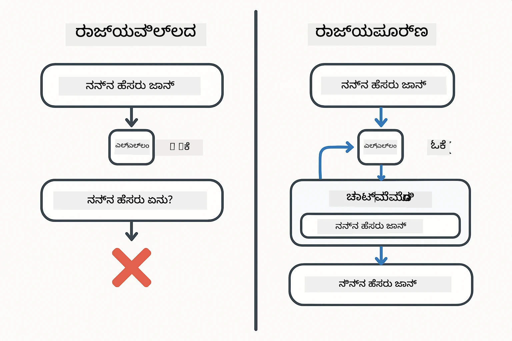
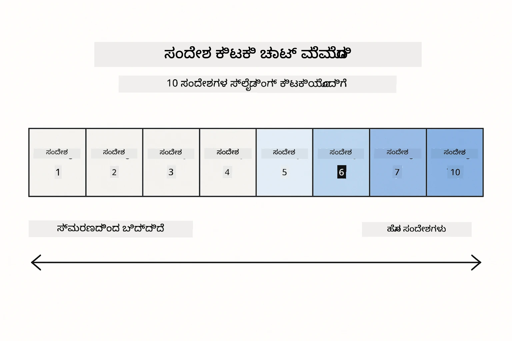
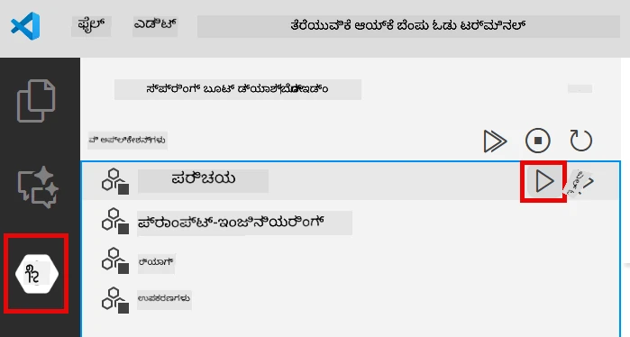
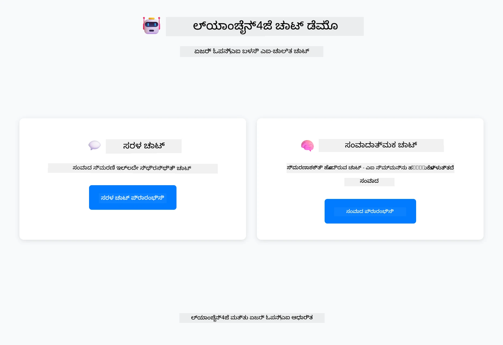
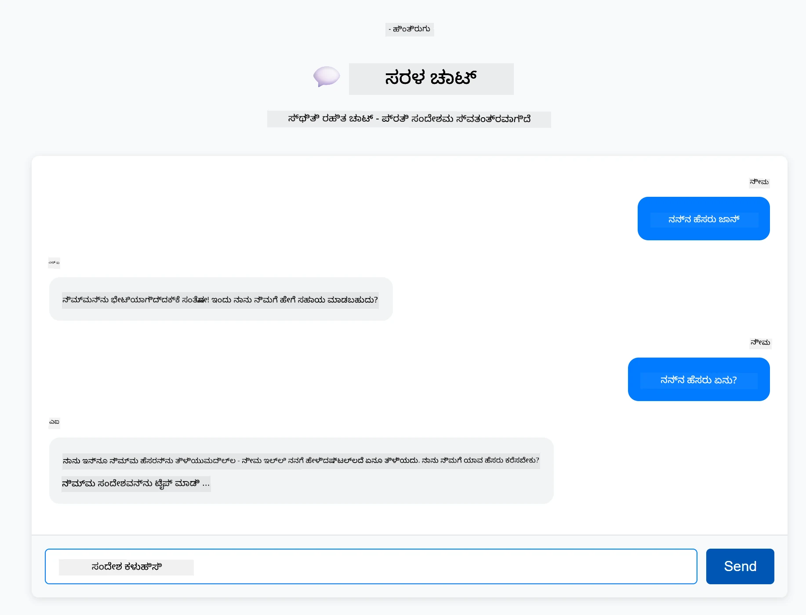
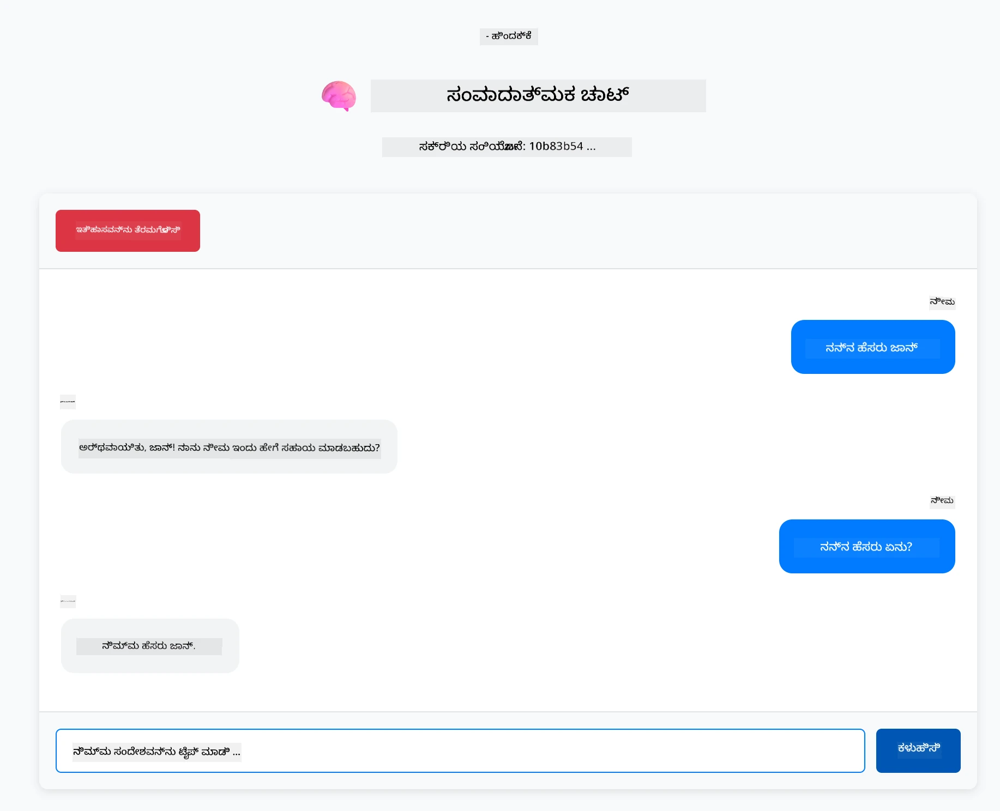

# ನಿಯಮ 01: ಲಾಂಗ್‍ಚೈನ್4ಜೆ ಜೊತೆಗೆ ಪ್ರಾರಂಭಿಸುವುದು

## ವಿಷಯಗಳ ಪರಿಚಯ

- [ವೀಡಿಯೊ ವಾಕ್‍ಥ್ರೂ](#ವೀಡಿಯೊ-ವಾಕ್‍ಥ್ರೂ)
- [ನೀವು ಏನು ಕಲಿಯುತ್ತೀರಿ](#ನೀವು-ಏನು-ಕಲಿಯುತ್ತೀರಿ)
- [ಪೂರ್ವಾಪೇಕ್ಷಿತಗಳು](#ಪೂರ್ವಾಪೇಕ್ಷಿತಗಳು)
- [ಮೂಲ ಸಮಸ್ಯೆಯನ್ನು ಅರ್ಥಮಾಡಿಕೊಳ್ಳುವುದು](#ಮೂಲ-ಸಮಸ್ಯೆಯನ್ನು-ಅರ್ಥಮಾಡಿಕೊಳ್ಳುವುದು)
- [ಟೋಕನ್ಗಳನ್ನು ಅರ್ಥಮಾಡಿಕೊಳ್ಳುವುದು](#ಟೋಕನ್ಗಳನ್ನು-ಅರ್ಥಮಾಡಿಕೊಳ್ಳುವುದು)
- [ಮೆಮರೀ ಹೇಗೆ ಕಾರ್ಯನಿರ್ವಹಿಸುತ್ತದೆ](#ಮೆಮರೀ-ಹೇಗೆ-ಕಾರ್ಯನಿರ್ವಹಿಸುತ್ತದೆ)
- [ಇದು ಲಾಂಗ್‍ಚೈನ್4ಜೆ ಅನ್ನು ಹೇಗೆ ಬಳಸುತ್ತದೆ](#ಇದು-ಲಾಂಗ್‍ಚೈನ್4ಜೆ-ಅನ್ನು-ಹೇಗೆ-ಬಳಸುತ್ತದೆ)
- [ಅಜೂರ್ ಓಪನ್‌ಎಐ ಮೂಲಸೌಕರ್ಯವನ್ನು ನಿಯೋಜಿಸಿ](#ಅಜೂರ್-ಓಪನ್‌ಎಐ-ಮೂಲಸೌಕರ್ಯವನ್ನು-ನಿಯೋಜಿಸಿ)
- [ಅಪ್ಲಿಕೇಶನ್ ಅನ್ನು ಸ್ಥಳೀಯವಾಗಿ ರನ್ಮಾಡಿ](#ಅಪ್ಲಿಕೇಶನ್-ಅನ್ನು-ಸ್ಥಳೀಯವಾಗಿ-ರನ್ಮಾಡಿ)
- [ಅಪ್ಲಿಕೇಶನ್ ಬಳಕೆ](#ಅಪ್ಲಿಕೇಶನ್-ಬಳಕೆ)
  - [ರಾಜಕೀಯ ಚಾಟ್ (ಎಡ ಪ್ಯಾನಲ್)](#ರಾಜಕೀಯ-ಚಾಟ್-ಎಡ-ಪ್ಯಾನಲ್)
  - [ಸ್ಥಾಯಿಶೀಲ ಚಾಟ್ (ಬಲ ಪ್ಯಾನಲ್)](#ಸ್ಥಾಯಿಶೀಲ-ಚಾಟ್-ಬಲ-ಪ್ಯಾನಲ್)
- [ಮುಂದಿನ ಹಂತಗಳು](#ಮುಂದಿನ-ಹಂತಗಳು)

## ವೀಡಿಯೊ ವಾಕ್‍ಥ್ರೂ

ಈ ಲೈವ್ ಸೆಷನ್‌ ಅನ್ನು ನೋಡು, ಇದು ಈ ನಿಯಮದೊಂದಿಗೆ ಪ್ರಾರಂಭಿಸಲು ಹೇಗೆ ಎಂಬುದನ್ನು ವಿವರಿಸುತ್ತದೆ:

<a href="https://www.youtube.com/live/nl_troDm8rQ?si=6b85S8xGjWnT2fX9"></a>

## ನೀವು ಏನು ಕಲಿಯುತ್ತೀರಿ

ಇದು ಲಾಂಗ್‍ಚೈನ್4ಜೆ ಮತ್ತು ಅಜೂರ್ ಓಪನ್‌ಎಐ ಜೊತೆಗೆ ನಿಮ್ಮ ಪ್ರಾರಂಭಬಿಂದುವಾಗಿದೆ. ನಾವು ಮೂಲತತ್ವಗಳಿಂದ ಪ್ರಾರಂಭಿಸಿ ಉತ್ಪಾದನಾ ಶೈಲಿ ಅಪ್ಲಿಕೇಶನ್‌ಗಳನ್ನು ನಿರ್ಮಿಸಲು ಪ್ರಾರಂಭಿಸುತ್ತೇವೆ. ಈ ನಿಯಮ ಸಂವಾದಾತ್ಮಕ AI ಗೆ ಕೇಂದ್ರೀಕೃತವಾಗಿದೆ, ಅದು ಸಾಂದರ್ಭವನ್ನು ನೆನಸುತ್ತದೆ ಮತ್ತು ಸ್ಥಿತಿಯನ್ನು ಇಡುವುದು — ಪ್ರತೀ ನಂತರದ ನಿಯಮವು ಅವಲಂಬಿಸುವ ಮೂಲಭೂತ ಕಲ್ಪನೆಗಳು.

ನಾವು ಈ ಮಾರ್ಗದರ್ಶನದಲ್ಲಿ ಅಜೂರ್ ಓಪನ್‌ಎಐನ GPT-5.2 ಅನ್ನು ಸಂಪೂರ್ಣವಾಗಿ ಬಳಸುತ್ತೇವೆ ಏಕೆಂದರೆ ಅದರ ಉನ್ನತವಾದ ತರ್ಕ ಸಾಮರ್ಥ್ಯಗಳು ವಿಭಿನ್ನ ವಿನ್ಯಾಸಗಳ ವರ್ತನೆಯನ್ನು ಸ್ಪಷ್ಟಗೊಳಿಸುತ್ತವೆ. ನೀವು ಮೆಮರೀ ಸೇರಿಸಿದಾಗ, ವ್ಯತ್ಯಾಸ ಸ್ಪಷ್ಟವಾಗಿ ಕಾಣುತ್ತದೆ. ಇದು ನಿಮ್ಮ ಅಪ್ಲಿಕೇಶನ್‌ಗೆ ಪ್ರತೀ ഘಟಕ ಏನು ತರಬಹುದು ಎಂದು ಅರ್ಥಮಾಡಿಕೊಳ್ಳುವುದರಲ್ಲಿ ಸಹಾಯ ಮಾಡುತ್ತದೆ.

ನೀವು ಎರಡು ವಿನ್ಯಾಸಗಳನ್ನೂ ತೋರಿಸುವ ಒಂದು ಅಪ್ಲಿಕೇಶನ್ ನಿರ್ಮಿಸುವಿರಿ:

**ರಾಜಕೀಯ ಚಾಟ್** - ಪ್ರತೀ ವಿನಂತಿ ಸ್ವತಂತ್ರವಾಗಿದೆ. ಮಾದರಿ ಹಿಂದಿನ ಸಂದೇಶಗಳನ್ನು ನೆನಸುವುದಿಲ್ಲ. ಇದು ಸರಳವಾದ ಪ್ರಾರಂಭದ ಬಿಂದುವಾಗಿದೆ.

**ಸ್ಥಾಯಿಶೀಲ ಸಂವಾದ** - ಪ್ರತೀ ವಿನಂತಿಗೆ ಸಂವಾದ ಇತಿಹಾಸ ಸೇರಿದೆ. ಮಾದರಿ ಹಲವಾರು ತಿರುವುಗಳ ನಡುವೆ ಸಾಂದರ್ಭಿಕತೆಯನ್ನು ನಡಿಸ್ತದೆ. ಇದು ಉತ್ಪಾದನಾ ಅಪ್ಲಿಕೇಶನ್‌ಗಳಿಗೆ ಬೇಕಾಗಿರುವುದು.

## ಪೂರ್ವಾಪೇಕ್ಷಿತಗಳು

- ಅಜೂರ್ ಸಬ್ಸ್ಕ್ರಿಪ್ಶನ್ ಜೊತೆಗೆ ಅಜೂರ್ ಓಪನ್‌ಎಐ ಪ್ರವೇಶ
- ಜವಾ 21, ಮೇವೆನ್ 3.9+ 
- ಅಜೂರ್ CLI (https://learn.microsoft.com/en-us/cli/azure/install-azure-cli)
- ಅಜೂರ್ ಡೆವಲಪರ್ CLI (azd) (https://learn.microsoft.com/en-us/azure/developer/azure-developer-cli/install-azd)

> **ಗಮನಿಸಿ:** ಜವಾ, ಮೇವೆನ್, ಅಜೂರ್ CLI ಮತ್ತು ಅಜೂರ್ ಡೆವಲಪರ್ CLI (azd) ಪೂರ್ವನಿಷ್ಠಿತವಾಗಿ devcontainernalli ಒಳಗೊಂಡಿವೆ.

> **ಗಮನಿಸಿ:** ಈ ನಿಯಮವು ಅಜೂರ್ ಓಪನ್‌ಎಐನಲ್ಲಿ GPT-5.2 ಅನ್ನು ಬಳಸುತ್ತದೆ. ನಿಯೋಜನೆ `azd up` ಮೂಲಕ ಸ್ವಯಂಚಾಲಿತವಾಗಿ ಸಂರಚಿತವಾಗಿದೆ - ಕೋಡ್ನಲ್ಲಿ ಮಾದರಿಯ ಹೆಸರನ್ನು ಬದಲಾಯಿಸಬೇಡಿ.

## ಮೂಲ ಸಮಸ್ಯೆಯನ್ನು ಅರ್ಥಮಾಡಿಕೊಳ್ಳುವುದು

ಭಾಷಾ ಮಾದರಿಗಳು ರಾಜಕೀಯ (stateless) ಆಗಿವೆ. ಪ್ರತೀ API ಕರೆ ಸ್ವತಂತ್ರವಾಗಿದೆ. ನೀವು "ನನ್ನ ಹೆಸರು ಜಾನ್" ಅನ್ನು ಕಳುಹಿಸಿದ পরে "ನನ್ನ ಹೆಸರು ಏನು?" ಎಂದು ಕೇಳಿದಲ್ಲಿ, ಮಾದರಿಗೆ ನೀವು ತಾಜಾ ಪರಿಚಯಿಸಿದ್ದು ಎಂಬುದರ ಎನಾದರೂ ತಿಳಿದಿಲ್ಲ. ಇದು ಪ್ರತೀ ವಿನಂತಿಯನ್ನು ಮೊದಲ ಸಂವಾದವಾಗಿದೆ ಎಂಬಂತೆ ಪರಿಗಣಿಸುತ್ತದೆ.

ಸಾದಾ ಪ್ರಶ್ನೋತ್ತರಕ್ಕೆ ಇದು ಸರಿ ಆದರೆ ನಿಜವಾದ ಅಪ್ಲಿಕೇಶನ್‌ಗಳಿಗೆ ಉಪಯೋಗವಿಲ್ಲ. ಗ್ರಾಹಕ ಸೇವೆಯ ಬಾಟ್‌ಗಳು ನೀವು ಹೇಳಿದ್ದನ್ನು ನೆನಸಿಕೊಳ್ಳಬೇಕು. ವೈಯಕ್ತಿಕ ಸಹಾಯಕರು ಸಾಂದರ್ಭಿಕತೆಯನ್ನು ಬೇಕಾಗಿರುತ್ತವೆ. ಯಾವುದೇ ಬಹು ತಿರುವಿನ ಸಂವಾದಕ್ಕೆ ಮೆಮರೀ ಅಗತ್ಯ.

ಕೆಳಗಿನ ಚಿತ್ರದಲ್ಲಿ ದಕ್ಷಿಣ ಬದಿಯಲ್ಲಿ ರಾಜಕೀಯ ಕರೆ ಇದ್ದು ನಿಮ್ಮ ಹೆಸರನ್ನು ಮರೆತಿದೆ; ಬಲಬದಿಯಲ್ಲಿ ChatMemory ಬೆಂಬಲಿತ ಸ್ಥಾಯಿಶೀಲ ಕರೆ ಇದೆ ಅದು ಹೆಸರನ್ನು ನೆನಸುತ್ತದೆ.



*ರಾಜಕೀಯ (ಸ್ವತಂತ್ರ ಕರೆಗಳು) ಮತ್ತು ಸ್ಥಾಯಿಶೀಲ (ಸಾಂದರ್ಭಿಕತೆ ಗೊತ್ತಿರುವ) ಸಂವಾದಗಳ ನಡುವಿನ ವ್ಯತ್ಯಾಸ*

## ಟೋಕನ್ಗಳನ್ನು ಅರ್ಥಮಾಡಿಕೊಳ್ಳುವುದು

ಸಂವಾದಗಳಿಗೆ ಕೈಹೊರಡುವ ಮುನ್ನ, ಟೋಕನ್ಗಳನ್ನು ಅರ್ಥಮಾಡಿಕೊಳ್ಳುವುದು ಮುಖ್ಯ - ಭಾಷಾ ಮಾದರಿಗಳು ಪ್ರಕ್ರಿಯೆ ಮಾಡುವ ಪಠ್ಯದ ಮೂಲ ಘಟಕಗಳು:


*ಪಠ್ಯವನ್ನು ಹೇಗೆ ಟೋಕನ್ಗಾಗಿ ತುಂಡುಮಾಡಲಾಗುತ್ತದೆ ಎಂಬ ಉದಾಹರಣೆ - "I love AI!" ಎಂಬುದು 4 ಪ್ರತ್ಯೇಕ ಪ್ರಕ್ರಿಯೆ ಘಟಕಗಳಾಗಿ ಪರಿಗಣಿಸಲಾಗುತ್ತದೆ*

ಟೋಕನ್ಗಳು AI ಮಾದರಿಗಳು ಪಠ್ಯವನ್ನು ಅಳೆಯುವ ಮತ್ತು ಪ್ರಕ್ರಿಯೆ ಮಾಡುವ ವಿಧಾನವಾಗಿದೆ. ಪದಗಳು, ವ್ಯಾಕರಣ ಚಿಹ್ನೆಗಳು ಮತ್ತು‌ ಖಾಲಿ ಬಿರುವು ಕೂಡ ಟೋಕನಾಗಬಹುದು. ನಿಮ್ಮ ಮಾದರಿಗೆ ಅದೇ ಸಮಯದಲ್ಲಿ ಎಷ್ಟು ಟೋಕನುಗಳನ್ನು ಪ್ರಕ್ರಿಯೆ ಮಾಡಬಹುದು ಎಂಬ ಮಿತಿ ಇದೆ (GPT-5.2 ಗಾಗಿ 400,000, 272,000 ಇನ್‌ಪುಟ್ ಟೋಕನ್ಗಳು ಮತ್ತು 128,000 ಔಟ್‌ಪುಟ್ ಟೋಕನ್ಗಳವರೆಗೆ). ಟೋಕನ್ಗಳ ಅರ್ಥಮಾಡಿಕೋಳ್ಳುವುದು ಸಂವಾದದ ಉದ್ದ ಮತ್ತು ವೆಚ್ಚಗಳನ್ನು ನಿರ್ವಹಿಸಲು ನೆರವಾಗುತ್ತದೆ.

## ಮೆಮರೀ ಹೇಗೆ ಕಾರ್ಯನಿರ್ವಹಿಸುತ್ತದೆ

ಚಾಟ್ ಮೆಮರೀ ರಾಜಕೀಯ ಸಮಸ್ಯೆಯನ್ನು ಸಂವಾದ ಇತಿಹಾಸವನ್ನು ನಡಿಸಿಕೊಡುವುದರ ಮೂಲಕ ಪರಿಹರಿಸುತ್ತದೆ. ನಿಮ್ಮ ವಿನಂತಿಯನ್ನು ಮಾದರಿಗೆ ಕಳುಹಿಸುವ ಮೊದಲು, ಫ್ರೇಮ್‌ವರ್ಕ್ ಸಂಬಂಧಿತ ಹಿಂದಿನ ಸಂದೇಶಗಳನ್ನು ಸೇರಿಸುತ್ತದೆ. ನೀವು "ನನ್ನ ಹೆಸರು ಏನು?" ಎಂದು ಕೇಳಿದಾಗ, ವ್ಯವಸ್ಥೆ ನಿಜವಾಗಿಯೂ ಸಂಪೂರ್ಣ ಸಂವಾದ ಇತಿಹಾಸವನ್ನು ಕಳುಹಿಸುತ್ತದೆ, ಹೀಗಾಗಿ ಮಾದರಿಗೆ ನೀವು ಹಿಂದಿನದಾಗಿ "ನನ್ನ ಹೆಸರು ಜಾನ್" ಎಂದಿದ್ದೀರಿ ಎಂದು ಕಾಣುತ್ತದೆ.

ಲಾಂಗ್‍ಚೈನ್4ಜೆ ಎರಡೂ ಮೆಮೊರೀ ಅನುಷ್ಠಾನಗಳನ್ನು ತರುತ್ತದೆ, ಅವುಗಳನ್ನು ಸ್ವಯಂಚಾಲಿತವಾಗಿ ನಿರ್ವಹಿಸುತ್ತದೆ. ನೀವು ಎಷ್ಟು ಸಂದೇಶಗಳನ್ನು ಉಳಿಸಬೇಕೆಂದು ಆಯ್ಕೆಮಾಡುತ್ತೀರಿ ಮತ್ತು ಫ್ರೇಮ್‌ವರ್ಕ್ ಸಾಂದರ್ಭಿಕ ವಿಂಡೋವನ್ನು ನಿರ್ವಹಿಸುತ್ತದೆ. ಕೆಳಗಿನ ಚಿತ್ರದಲ್ಲಿ MessageWindowChatMemory ಇತ್ತೀಚಿನ ಸಂದೇಶಗಳ ಸ್ಲೈಡಿಂಗ್ ವಿಂಡೋ ಅನ್ನು ಹೇಗೆ ನಿರ್ವಹಿಸುತ್ತದೆ ಎಂಬುದು ತೋರ್ಪಡಿಸಲಾಗಿದೆ.



*MessageWindowChatMemory ಇತ್ತೀಚಿನ ಸಂದೇಶಗಳ ಸ್ಲೈಡಿಂಗ್ ವಿಂಡೋ ಅನ್ನು ನಿರ್ವಹಿಸುತ್ತದೆ, ಹಳೆಯಗಳನ್ನು ಸ್ವಯಂಚಾಲಿತವಾಗಿ ಕಳೆದುಹೋಗುತ್ತದೆ*

## ಇದು ಲಾಂಗ್‍ಚೈನ್4ಜೆ ಅನ್ನು ಹೇಗೆ ಬಳಸುತ್ತದೆ

ಈ ನಿಯಮವು ಸ್ಪ್ರಿಂಗ್ ಬೂಟ್ ಅನ್ನು ಜೋಡಿಸಿ ಸಂವಾದ ಮೆಮೊರೀ ಸೇರಿಸುತ್ತದೆ. ಭಾಗಗಳು ಹೇಗೆ ಹೊಂದಿಕೊಂಡಿವೆ ಎಂಬುದನ್ನು ನೋಡೋಣ:

**ಆಧಾರಗಳು** - ಎರಡು ಲಾಂಗ್‍ಚೈನ್4ಜೆ ಗ್ರಂಥಾಲಯಗಳನ್ನು ಸೇರಿಸಿ:

```xml
<dependency>
    <groupId>dev.langchain4j</groupId>
    <artifactId>langchain4j</artifactId> <!-- Inherited from BOM in root pom.xml -->
</dependency>
<dependency>
    <groupId>dev.langchain4j</groupId>
    <artifactId>langchain4j-open-ai-official</artifactId> <!-- Inherited from BOM in root pom.xml -->
</dependency>
```

**ಚಾಟ್ ಮಾದರಿ** - ಅಜೂರ್ ಓಪನ್‌ಎಐ ಅನ್ನು ಸ್ಪ್ರಿಂಗ್ ಬೀನ್ ಆಗಿ ಸಂರಚಿಸಿ ([LangChainConfig.java](../../../01-introduction/src/main/java/com/example/langchain4j/config/LangChainConfig.java)):

```java
@Bean
public OpenAiOfficialChatModel openAiOfficialChatModel() {
    return OpenAiOfficialChatModel.builder()
            .baseUrl(azureEndpoint)
            .apiKey(azureApiKey)
            .modelName(deploymentName)
            .timeout(Duration.ofMinutes(5))
            .maxRetries(3)
            .build();
}
```

ಬಿಲ್ಡರ್ `azd up` ಮೂಲಕ ಸಿದ್ಧವಾಗಿರುವ ಪರಿಸರ ಬದಲಾಯಿಸುವ ಬದಲಾವಣೆಯಿಂದ ಮಾನ್ಯತೆಗಳನ್ನು ಓದುತ್ತದೆ. `baseUrl` ಅನ್ನು ನಿಮ್ಮ ಅಜೂರ್ ಎಂಡ್‍ಪಾಯಿಂಟ್‌ಗೆ ಸೆಟ್ ಮಾಡುವುದರಿಂದ ಓಪನ್‌ಎಐ ಕ್ಲೈಂಟ್ ಅಜೂರ್ ಓಪನ್‌ಎಐ ಜೊತೆಗೆ ಕೆಲಸಮಾಡುತ್ತದೆ.

**ಸಂವಾದ ಮೆಮೊರೀ** - MessageWindowChatMemory ಮೂಲಕ ಚಾಟ್ ಇತಿಹಾಸವನ್ನು ಟ್ರ್ಯಾಕ್ ಮಾಡಿ ([ConversationService.java](../../../01-introduction/src/main/java/com/example/langchain4j/service/ConversationService.java)):

```java
ChatMemory memory = MessageWindowChatMemory.withMaxMessages(10);

memory.add(UserMessage.from("My name is John"));
memory.add(AiMessage.from("Nice to meet you, John!"));

memory.add(UserMessage.from("What's my name?"));
AiMessage aiMessage = chatModel.chat(memory.messages()).aiMessage();
memory.add(aiMessage);
```

`withMaxMessages(10)` ಬಳಸಿ ಮೆಮೊರೀ ಸೃಷ್ಟಿಸಿ ბოლო 10 ಸಂದೇಶಗಳನ್ನು ಉಳಿಸಬಹುದು. ಬಳಕೆದಾರ ಮತ್ತು AI ಸಂದೇಶಗಳನ್ನು ಸರಿಯಾದ ವಿಧಾನದ ಅರ್ಹತೆಗಳನ್ನು ಬಳಸಿಕೊಂಡು ಸೇರಿಸಿ: `UserMessage.from(text)` ಮತ್ತು `AiMessage.from(text)`. ಇತಿಹಾಸವನ್ನು `memory.messages()` ಮೂಲಕ ಪಡೆದು ಮಾದರಿಗೆ ಕಳುಹಿಸಿ. ಸೇವೆ ಪ್ರತಿ ಸಂವಾದ ID ಗೆ ಪ್ರತ್ಯೇಕ ಮೆಮರೀ ಉದಾಹರಣೆಗಳನ್ನು ಸಂಗ್ರಹಿಸುತ್ತದೆ, ಇದು ಬಹು ಬಳಕೆದಾರರು ಸಮಕಾಲೀನವಾಗಿ ಚಾಟ್ ಮಾಡಲು ಸಹಾಯಕ.

> **🤖 [GitHub Copilot](https://github.com/features/copilot) ಚಾಟ್ ಇದೇನೆಂದೋ ಪ್ರಯತ್ನಿಸಿ:** [`ConversationService.java`](../../../01-introduction/src/main/java/com/example/langchain4j/service/ConversationService.java) ಓದಿ ಮತ್ತು ಕೇಳಿ:
> - "MessageWindowChatMemory ವಿಂಡೋ ತುಂಬಿರುವಾಗ ಯಾವ ಸಂದೇಶಗಳನ್ನು ಬಿಟ್ಟುಹೋಗಲು ನಿರ್ಧರಿಸುತ್ತದೆ?"
> - "ನಾನು ಇನ್‌ಮೆಮೊರೀ ಬದಲು ಡೇಟಾಬೇಸ್ ಬಳಸಿ ಕಸ್ಟಮ್ ಮೆಮೊರೀ ಸಂಗ್ರಹಣೆಯನ್ನು ಅಳವಡಿಸಬಹುದೆ?"
> - "ಹಳೆಯ ಸಂವಾದ ಇತಿಹಾಸವನ್ನು ಸಂಕ್ಷಿಪ್ತಗೊಳಿಸಲು ಸಮರಿșaನ್ ಅನ್ನು ಹೇಗೆ ಸೇರಿಸುವೆ?"

ರಾಜಕೀಯ ಚಾಟ್ ಎಂಡ್‍ಪಾಯಿಂಟ್ ಮೆಮೊರೀ ಸಂಪೂರ್ಣವಾಗಿ ಬಿಟ್ಟುಹೋಗುತ್ತದೆ - ಕೇವಲ `chatModel.chat(prompt)` ಅನ್ನು ಬಳಸುತ್ತೇವೆ. ಸ್ಥಾಯಿಶೀಲ ಎಂಡ್‍ಪಾಯಿಂಟ್ ಮೆಮೊರಿಗೆ ಸಂದೇಶಗಳನ್ನು ಸೇರಿಸಿ, ಇತಿಹಾಸ ಪಡೆಯುತ್ತವೆ ಮತ್ತು ಆ ಸಾಂದರ್ಭಿಕತೆಯನ್ನು ಪ್ರತೀ ವಿನಂತಿಗೆ ಸೇರಿಸುತ್ತವೆ. ಮಾದರಿ ಸಂರಚನೆ ಕೆಲವುಸರಿಯಾಗಿದ್ದರೂ, ವಿನ್ಯಾಸ ವಿಭಿನ್ನ.

## ಅಜೂರ್ ಓಪನ್‌ಎಐ ಮೂಲಸೌಕರ್ಯವನ್ನು ನಿಯೋಜಿಸಿ

**ಬ್ಯಾಶ್:**
```bash
cd 01-introduction
azd up  # ನಿಮ್ಮ ಸದಸ್ಯತ್ವ ಮತ್ತು ಸ್ಥಳವನ್ನು ಆಯ್ಕೆಮಾಡಿ (eastus2 ಶിപಾರಸು ಮಾಡಲಾಗಿದೆ)
```

**ಪವರ್‌ಶೆಲ್:**
```powershell
cd 01-introduction
azd up  # ಸಬ್ಸ್ಕ್ರಿಪ್ಷನ್ ಮತ್ತು ಸ್ಥಳವನ್ನು ಆಯ್ಕೆಮಾಡಿ (eastus2 ಶಿಫಾರಸು ಮಾಡಲಾಗಿದೆ)
```

> **ಗಮನಿಸಿ:** ನೀವು ಟೈಮೌಟ್ ದೋಷವನ್ನು ಎದುರಿಸುತ್ತಿದ್ದರೆ (`RequestConflict: Cannot modify resource ... provisioning state is not terminal`), `azd up` ಅನ್ನು ಮತ್ತೆ ಓಡಿಸಿ. ಅಜೂರ್ ಸಂಪನ್ಮೂಲಗಳು ಇನ್ನೂ ಶೇಖರಣೆಯಲ್ಲಿರಬಹುದು, ಮರುಪ್ರಯತ್ನವು ಸಂಪನ್ಮೂಲಗಳು ಅಂತಿಮ ಸ್ಥಿತಿಗೆ ತಲುಪಿದ ಮೇಲೆ ನಿಯೋಜನೆಯನ್ನು ಪೂರ್ಣಗೊಳಿಸುತ್ತದೆ.

ಇದು ಮಾಡುತ್ತದೆ:
1. GPT-5.2 ಮತ್ತು text-embedding-3-small ಮಾದರಿಗಳೊಂದಿಗೆ ಅಜೂರ್ ಓಪನ್‌ಎಐ ಸಂಪನ್ಮೂಲ ನಿಯೋಜನೆ
2. ಮಾನ್ಯತೆಗಳೊಂದಿಗೆ ಪ್ರಾಜೆಕ್ಟ್ ಮೂಲದಲ್ಲಿ `.env` ಫೈಲ್ ಸ್ವಯಂಚಾಲಿತ ರಚನೆ
3. ಎಲ್ಲಾ ಅಗತ್ಯ ಪರಿಸರ ಬದಲಾಯಿಸುವುವನ್ನು ಸೆಟ್ ಮಾಡುವುದು

**ನಿಯೋಜನೆಯಲ್ಲಿ ಸಮಸ್ಯೆಗಳಿವೇ?** ಉಪ ಡೊಮೇನ್ ಹೆಸರು ಸಂಧಾನಗಳು, ಕೈಯಿಂದ ಅಜೂರ್ ಪೋರ್ಟಲ್ ನಿಯೋಜನೆ ಹಂತಗಳು ಮತ್ತು ಮಾದರಿ ಸಂರಚನಾ ಮಾರ್ಗದರ್ಶನವನ್ನು ಒಳಗೊಂಡ [ಮೂಲಸೌಕರ್ಯ README](infra/README.md) ನೋಡಿ.

**ನಿಯೋಜನೆ ಯಶಸ್ವಿಯಾಗಿದೆ ಎಂದು ದೃಢೀಕರಿಸಿ:**

**ಬ್ಯಾಶ್:**
```bash
cat ../.env  # AZURE_OPENAI_ENDPOINT, API_KEY ಇತ್ಯಾದಿಗಳನ್ನು ಪ್ರದರ್ಶಿಸಬೇಕು.
```

**ಪವರ್‌ಶೆಲ್:**
```powershell
Get-Content ..\.env  # AZURE_OPENAI_ENDPOINT, API_KEY, ಇತ್ಯಾದಿಗಳನ್ನು ತೋರಿಸಬೇಕು.
```

> **ಗಮನಿಸಿ:** `azd up` ಆದೇಶವು ಸ್ವಯಂಚಾಲಿತವಾಗಿ `.env` ಫೈಲ್ ಅನ್ನು ರಚಿಸುತ್ತದೆ. ನೀವು ಬಳಿಕ ಅದನ್ನು ನವೀಕರಿಸುವ ಅಗತ್ಯವಿದ್ದರೆ, `.env` ಫೈಲ್ ಅನ್ನು ಕೈಯಿಂದ ಸಂಪಾದಿಸಬಹುದು ಅಥವಾ ಪರಿಶೀಲನೆಗಾಗಿ ಇವನ್ನು ಮತ್ತೆ ರಚಿಸಬಹುದು:
>
> **ಬ್ಯಾಶ್:**
> ```bash
> cd ..
> bash .azd-env.sh
> ```
>
> **ಪವರ್‌ಶೆಲ್:**
> ```powershell
> cd ..
> .\.azd-env.ps1
> ```


## ಅಪ್ಲಿಕೇಶನ್ ಅನ್ನು ಸ್ಥಳೀಯವಾಗಿ ರನ್ಮಾಡಿ

**ನಿಯೋಜನೆಯನ್ನು ಪರಿಶೀಲಿಸಿ:**

ಅಜೂರ್ ಮಾನ್ಯತೆಗಳೊಂದಿಗೆ `.env` ಫೈಲ್ ಮೂಲ ಡೈರೆಕ್ಟರಿಯಲ್ಲಿ ಇರುತ್ತದೆ ಎಂದು ಖಚಿತಪಡಿಸಿಕೊಳ್ಳಿ. ಈ ನಿಯಮ ಡೈರೆಕ್ಟರಿಯಿಂದ (`01-introduction/`) ಈ ಆદેશಗಳನ್ನು ರನ್ ಮಾಡಿ:

**ಬ್ಯಾಶ್:**
```bash
cat ../.env  # AZURE_OPENAI_ENDPOINT, API_KEY, DEPLOYMENT ಅನ್ನು ತೋರಿಸಬೇಕು
```

**ಪವರ್‌ಶೆಲ್:**
```powershell
Get-Content ..\.env  # AZURE_OPENAI_ENDPOINT, API_KEY, DEPLOYMENT ಅನ್ನು ತೋರಿಸಬೇಕು
```

**ಅಪ್ಲಿಕೇಶನ್‌ಗಳನ್ನು ಪ್ರಾರಂಭಿಸಿ:**

**ಆಯ್ಕೆ 1: ಸ್ಪ್ರಿಂಗ್ ಬೂಟ್ ಡ್ಯಾಶ್ಬೋರ್ಡ್ ಬಳಸಿ (VS ಕೋಡ್ ಬಳಕೆದಾರರಿಗೆ ಶಿಫಾರಸ್ಸು ಮಾಡಲಾಗಿದೆ)**

ಡೇವ್ ಕಂಟೈನರ್ ಸ್ಪ್ರಿಂಗ್ ಬೂಟ್ ಡ್ಯಾಶ್ಬೋರ್ಡ್ ವಿಸ್ತರಣೆ ಹೊಂದಿಸಿದೆ, ಇದು ಎಲ್ಲಾ ಸ್ಪ್ರಿಂಗ್ ಬೂಟ್ ಅಪ್ಲಿಕೇಶನ್‌ಗಳನ್ನು ನಿರ್ವಹಿಸಲು ದೃಶ್ಯ ಇಂಟರ್ಫೇಸ್ ಒದಗಿಸುತ್ತದೆ. ನೀವು ಇದನ್ನು VS ಕೋಡ್‌ನ ಎಡ നിറದ ಸ್ತಂಭದಲ್ಲಿ (Activity Bar) ಸ್ಪ್ರಿಂಗ್ ಬೂಟ್ ಐಕಾನ್ ಅಡಿಯಲ್ಲಿ ಕಾಣಬಹುದು.

ಸ್ಪ್ರಿಂಗ್ ಬೂಟ್ ಡ್ಯಾಶ್ಬೋರ್ಡ್‌ನಿಂದ ನೀವು:
- ಕಾರ್ಯಕ್ಷೇತ್ರದಲ್ಲಿನ ಎಲ್ಲಾ ಸ್ಪ್ರಿಂಗ್ ಬೂಟ್ ಅಪ್ಲಿಕೇಶನ್‌ಗಳನ್ನು ನೋಡಿ
- ಒಂದು ಕ್ಲಿಕ್‌ನೊಂದಿಗೆ ಅಪ್ಲಿಕೇಶನ್ ಗಳನ್ನು ಪ್ರಾರಂಭ / ನಿಲ್ಲಿಸಿ
- ಅಪ್ಲಿಕೇಶನ್ ಲಾಗ್‌ಗಳನ್ನು ನೇರ-ಸಮಯದಲ್ಲಿ ವೀಕ್ಷಿಸಿ
- ಅಪ್ಲಿಕೇಶನ್ ಸ್ಥಿತಿಯನ್ನು ಗಮನಿಸಿ

"introduction" ಹತ್ತಿರ ಇರುವ ಪ್ಲೇ ಬಟನ್ ಕ್ಲಿಕ್ ಮಾಡಿ ಈ ನಿಯಮವನ್ನು ಪ್ರಾರಂಭಿಸಿ, ಅಥವಾ ಎಲ್ಲಾ ನಿಯಮಗಳನ್ನು ಒಟ್ಟಾಗಿ ಪ್ರಾರಂಭಿಸಿ.



*VS ಕೋಡ್‌ನಲ್ಲಿನ ಸ್ಪ್ರಿಂಗ್ ಬೂಟ್ ಡ್ಯಾಶ್ಬೋರ್ಡ್ — ಒಂದೇ ಸ್ಥಳದಿಂದ ಎಲ್ಲಾ ನಿಯಮಗಳನ್ನು ಪ್ರಾರಂಭಿಸಿ, ನಿಲ್ಲಿಸಿ ಮತ್ತು ಪರಿಶೀಲಿಸಿ*

**ಆಯ್ಕೆ 2: ಶೆಲ್ ಸ್ಕ್ರಿಪ್ಟ್ ಬಳಸಿ**

ಎಲ್ಲಾ ವೆಬ್ ಅಪ್ಲಿಕೇಶನ್‌ಗಳನ್ನು (ನಿಯಮಗಳು 01-04) ಪ್ರಾರಂಭಿಸಿ:

**ಬ್ಯಾಶ್:**
```bash
cd ..  # ರೂಟ್ ಡೈರೆಕ್ಟરીಯಿಂದ
./start-all.sh
```

**ಪವರ್‌ಶೆಲ್:**
```powershell
cd ..  # ರೂಟ್ ಡೈರೆಕ್ಟರಿಯಿಂದ
.\start-all.ps1
```

ಅಥವಾ ಕೇವలం ಈ ನಿಯಮವನ್ನು ಪ್ರಾರಂಭಿಸಿ:

**ಬ್ಯಾಶ್:**
```bash
cd 01-introduction
./start.sh
```

**ಪವರ್‌ಶೆಲ್:**
```powershell
cd 01-introduction
.\start.ps1
```

ಎರಡು ಸ್ಕ್ರಿಪ್ಟ್‌ಗಳು ಸ್ವಯಂಚಾಲಿತವಾಗಿ ಮೂಲ `.env` ಫೈಲ್‌ನಿಂದ ಪರಿಸರ ಬದಲಾಯಿಸುವುವನ್ನು ಲೋಡ್ ಮಾಡಿ, ಮತ್ತು ಜೆಆರ್‌ಗಳು ಇಲ್ಲದಿದ್ದರೆ ನಿರ್ಮಿಸುವವು.

> **ಗಮನಿಸಿ:** ನೀವು ಪ್ರಾರಂಭಿಸುವ ಮುನ್ನ ಎಲ್ಲಾ ನಿಯಮಗಳನ್ನು ಕೈಯಿಂದ ನಿರ್ಮಿಸಲು ಇಚ್ಛಿಸಿದರೆ:
>
> **ಬ್ಯಾಶ್:**
> ```bash
> cd ..  # Go to root directory
> mvn clean package -DskipTests
> ```
>
> **ಪವರ್‌ಶೆಲ್:**
> ```powershell
> cd ..  # Go to root directory
> mvn clean package -DskipTests
> ```

ನಿಮ್ಮ ಬ್ರೌಸರ್‌ನಲ್ಲಿ http://localhost:8080 ತೆರೆಯಿರಿ.

**ನಿಲ್ಲಿಸಲು:**

**ಬ್ಯಾಶ್:**
```bash
./stop.sh  # ಈ ಮೋಡ್ಯೂಲ್ ಮಾತ್ರ
# ಅಥವಾ
cd .. && ./stop-all.sh  # ಎಲ್ಲಾ ಮೋಡ್ಯೂಲ್‌ಗಳು
```

**ಪವರ್‌ಶೆಲ್:**
```powershell
.\stop.ps1  # ಈ ಮಾಯಾಜಾಲ ಮಾತ್ರ
# ಅಥವಾ
cd ..; .\stop-all.ps1  # ಎಲ್ಲಾ ಮಾಯಾಜಾಲಗಳು
```


## ಅಪ್ಲಿಕೇಶನ್ ಬಳಕೆ

ಅಪ್ಲಿಕೇಶನ್ ಎರಡು ಚಾಟ್ ಅನುಷ್ಟಾನಗಳನ್ನು ಪಕ್ಕಾ ಪಕ್ಕಿ ನೀಡುತ್ತದೆ.



*ಸರಳ ಚಾಟ್ (ರಾಜಕೀಯ) ಮತ್ತು ಸಂವಾದಾತ್ಮಕ ಚಾಟ್ (ಸ್ಥಾಯಿಶೀಲ) ಆಯ್ಕೆಗಳನ್ನು ತೋರಿಸುವ ಡ್ಯಾಶ್ಬೋರ್ಡ್*

### ರಾಜಕೀಯ ಚಾಟ್ (ಎಡ ಪ್ಯಾನಲ್)

ಮೊದಲು ಇದನ್ನು ಪ್ರಯತ್ನಿಸಿ. "ನನ್ನ ಹೆಸರು ಜಾನ್" ಎಂದು ಹೇಳಿ, ತಕ್ಷಣ "ನನ್ನ ಹೆಸರು ಏನು?" ಎಂದು ಕೇಳಿ. ಮಾದರಿ ನೆನಸುವುದಿಲ್ಲ ಏಕೆಂದರೆ ಪ್ರತಿಯೊಂದು ಸಂದೇಶವೂ ಸ್ವತಂತ್ರವಾಗಿದೆ. ಇದು ಮೂಲ ಭಾಷಾ ಮಾದರಿ ಸಂಯೋಜನೆಯ ಪ್ರಮುಖ ಸಮಸ್ಯೆಯನ್ನು ತೋರುತ್ತದೆ - ಸಂವಾದ ಸಾಂದರ್ಭಿಕತೆ ಇಲ್ಲ.



*AI ಹಿಂದಿನ ಸಂದೇಶದಿಂದ ನಿಮ್ಮ ಹೆಸರನ್ನು ನೆನಸುವುದಿಲ್ಲ*

### ಸ್ಥಾಯಿಶೀಲ ಚಾಟ್ (ಬಲ ಪ್ಯಾನಲ್)

ಈಗ ಇದೇ ಕ್ರಮವನ್ನು ಇಲ್ಲಿ ಪ್ರಯತ್ನಿಸಿ. "ನನ್ನ ಹೆಸರು ಜಾನ್" ಮತ್ತು ನಂತರ "ನನ್ನ ಹೆಸರು ಏನು?" ಇದು ನೆನಸುತ್ತದೆ. ವ್ಯತ್ಯಾಸವೆಂದರೆ MessageWindowChatMemory - ಇದು ಸಂವಾದ ಇತಿಹಾಸವನ್ನು ನಡಿಸುತ್ತಿದ್ದು ಪ್ರತಿ ವಿನಂತಿಗೆ ಸೇರಿಸುತ್ತದೆ. ಇವು ಉತ್ಪಾದನಾ ಸಂವಾದಾತ್ಮಕ AI ಹೇಗೆ ಕೆಲಸಮಾಡುತ್ತದೆ ಎಂಬುದನ್ನು ತೋರುತ್ತದೆ.



*AI ಸಂವಾದದ ಮೊದಲ ಭಾಗದಿಂದ ನಿಮ್ಮ ಹೆಸರನ್ನು ನೆನಸಿಕೊಳ್ಳುತ್ತದೆ*

ಎರಡೂ ಪ್ಯಾನಲ್ಗಳು ಒಂದೇ GPT-5.2 ಮಾದರಿಯನ್ನು ಬಳಸುತವೆ. ಅವುಗಳಲ್ಲಿನ ಒಂದೇ ವ್ಯತ್ಯಾಸ ಮೆಮರೀ. ಇದು ಮೆಮರೀ ನಿಮ್ಮ ಅಪ್ಲಿಕೇಶನ್‌ಗೆ ಏನು ತರಬಹುದು ಮತ್ತು ಏಕೆ ನಿಜ ಜೀವನ ಪ್ರಕರಣಗಳಿಗೆ ಅತ್ಯಾವಶ್ಯಕವೋ ಸ್ಪಷ್ಟಪಡಿಸುತ್ತದೆ.

## ಮುಂದಿನ ಹಂತಗಳು

**ಮುಂದಿನ ನಿಯಮ:** [02-prompt-engineering - GPT-5.2 ನೊಂದಿಗೆ ಪ್ರಾಂಪ್ಟ್ ಇಂಜಿನಿಯರಿಂಗ್](../02-prompt-engineering/README.md)

---

**ನ್ಯಾಸಕರು:** [← ಹಿಂದಿನ ಮುಖ್ಯ ಪುಟಕ್ಕೆ](../README.md) | [ಮುಂದಿನ: ನಿಯಮ 02 - ಪ್ರಾಂಪ್ಟ್ ಇಂಜಿನಿಯರಿಂಗ್ →](../02-prompt-engineering/README.md)

---

<!-- CO-OP TRANSLATOR DISCLAIMER START -->
**ಅಸ್ವೀಕಾರ**:
ಈ ದಸ್ತಾವೇಜು AI ಅನುವಾದ ಸೇವೆ [Co-op Translator](https://github.com/Azure/co-op-translator) ಬಳಸಿ ಅನುವಾದಿಸಲಾಗಿದೆ. ನಾವು ನಿಖರತೆಯನ್ನು ಸಾಧಿಸಲು ಪ್ರಯತ್ನಿಸುತ್ತಿದ್ದರೂ, ದಯವಿಟ್ಟು ಗಮನಿಸಿ, ಸ್ವಯಂಚಾಲಿತ ಅನುವಾದಗಳಲ್ಲಿ ದೋಷಗಳು ಅಥವಾ ಅಸಡ್ಡೆಗಳು ಇರಬಹುದು. ಮೂಲ ಭಾಷೆಯಲ್ಲಿರುವ ಮೂಲ ದಸ್ತಾವೇಜು ಪ್ರಾಮಾಣಿಕ ಮೂಲವೆಂದು ಪರಿಗಣಿಸಬೇಕು. ಪ್ರಮುಖ ಮಾಹಿತಿಗಾಗಿ, ವೃತ್ತಿಪರ ಮಾನವ ಅನುವಾದವನ್ನು ಶಿಫಾರಸು ಮಾಡಲಾಗುತ್ತದೆ. ಈ ಅನುವಾದವನ್ನು ಬಳಸುವ ಮೂಲಕ ಉಂಟಾಗುವ ಯಾವುದೇ ತಪ್ಪು ಅರ್ಥಗಳ ಅಥವಾ ತಪ್ಪು ವ್ಯಾಖ್ಯಾನಗಳ ಬಗ್ಗೆ ನಾವು ಹೊಣೆಗಾರರಲ್ಲ.
<!-- CO-OP TRANSLATOR DISCLAIMER END -->