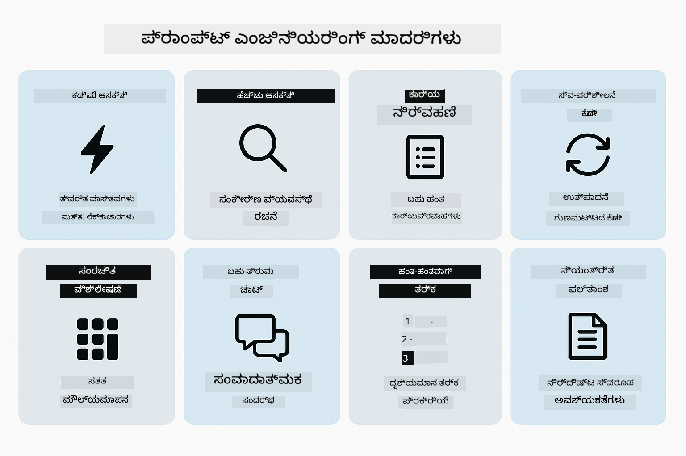
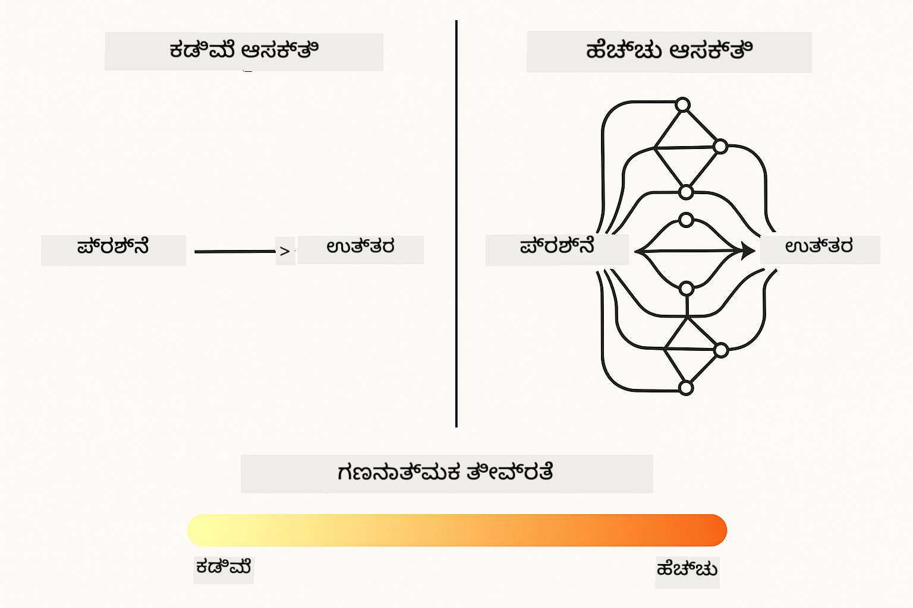
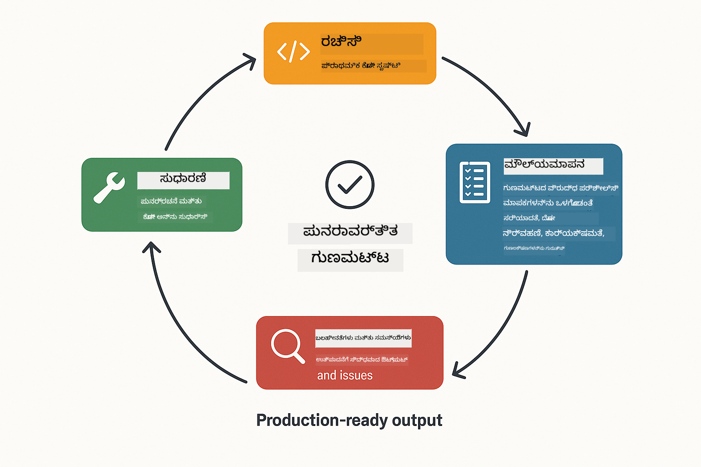
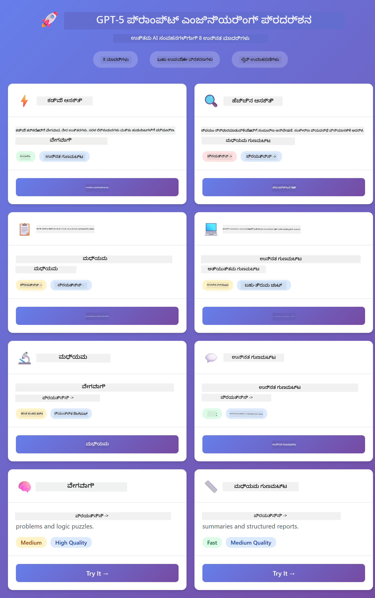
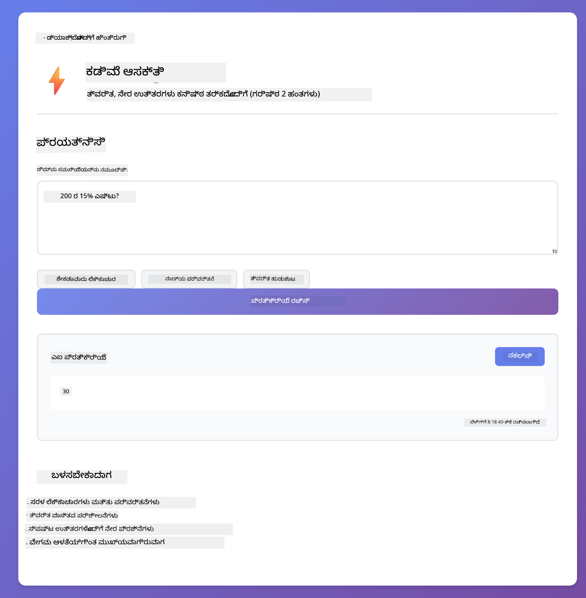
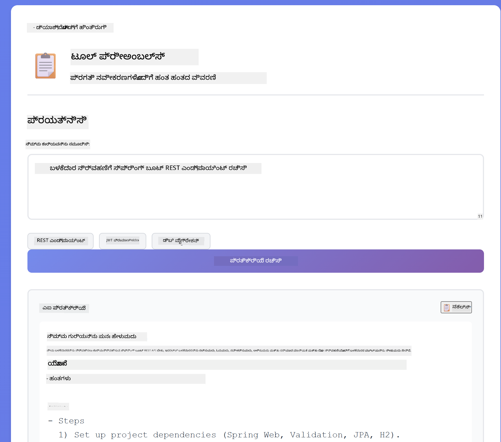
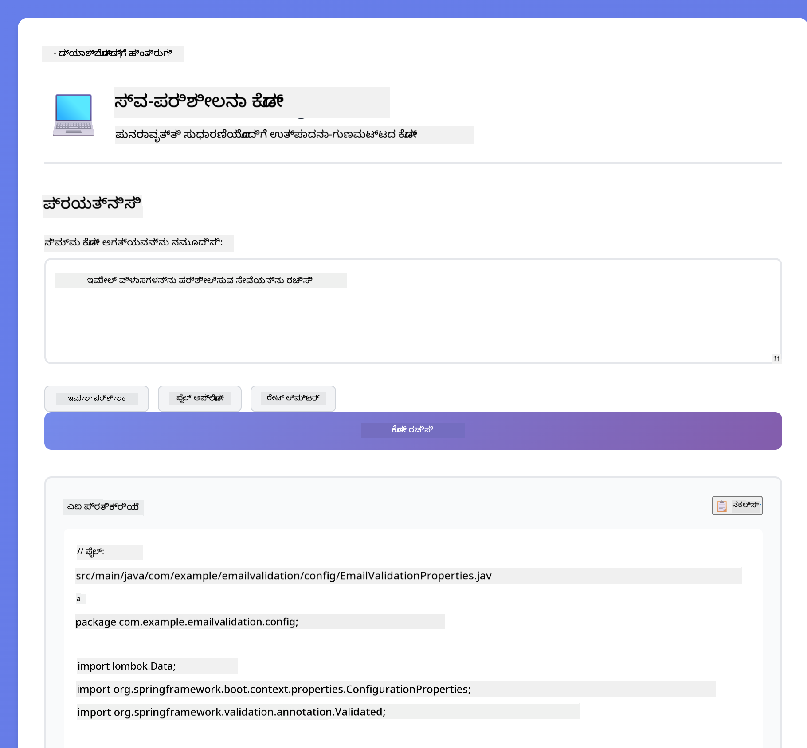
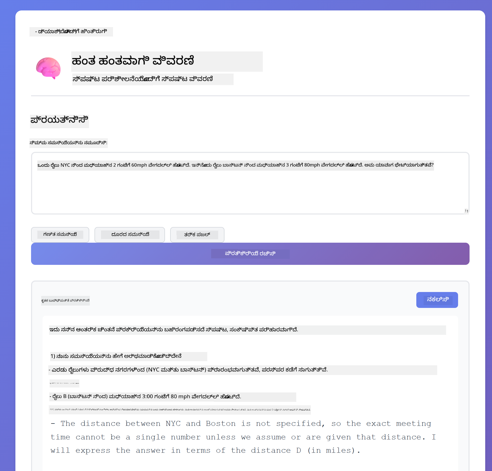
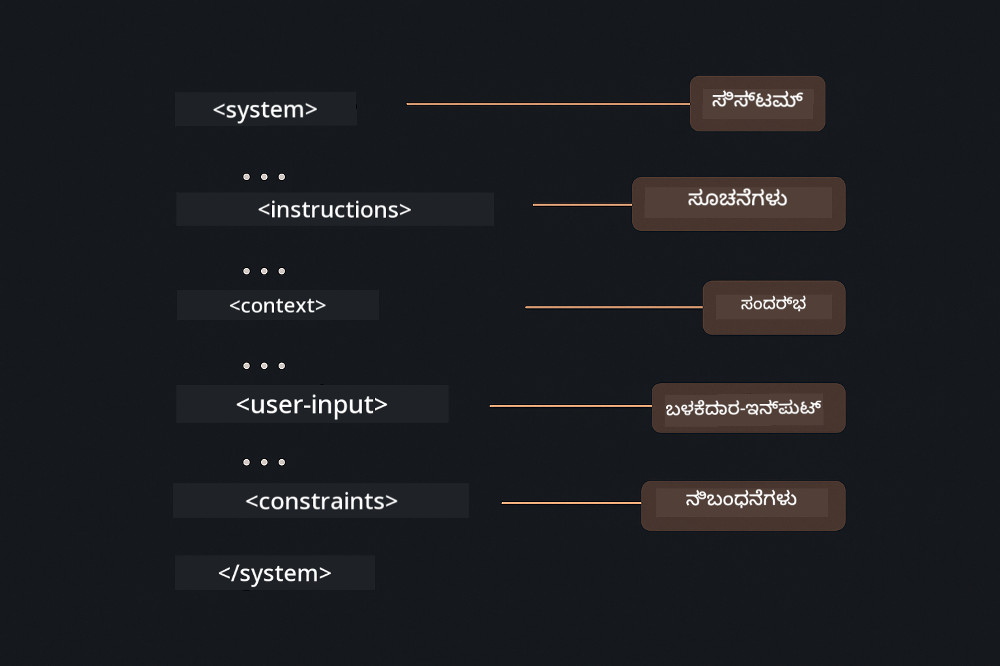

<!--
CO_OP_TRANSLATOR_METADATA:
{
  "original_hash": "8d787826cad7e92bf5cdbd116b1e6116",
  "translation_date": "2025-12-13T16:39:46+00:00",
  "source_file": "02-prompt-engineering/README.md",
  "language_code": "kn"
}
-->
# Module 02: GPT-5 ಜೊತೆಗೆ ಪ್ರಾಂಪ್ಟ್ ಎಂಜಿನಿಯರಿಂಗ್

## ವಿಷಯಗಳ ಪಟ್ಟಿಕೆ

- [ನೀವು ಕಲಿಯುವದು ಏನು](../../../02-prompt-engineering)
- [ಪೂರ್ವಾಪೇಕ್ಷಿತಗಳು](../../../02-prompt-engineering)
- [ಪ್ರಾಂಪ್ಟ್ ಎಂಜಿನಿಯರಿಂಗ್ ಅರ್ಥಮಾಡಿಕೊಳ್ಳುವುದು](../../../02-prompt-engineering)
- [ಇದು LangChain4j ಅನ್ನು ಹೇಗೆ ಬಳಸುತ್ತದೆ](../../../02-prompt-engineering)
- [ಮೂಲ ಮಾದರಿಗಳು](../../../02-prompt-engineering)
- [ಇದೀಗಿರುವ Azure ಸಂಪನ್ಮೂಲಗಳನ್ನು ಬಳಸುವುದು](../../../02-prompt-engineering)
- [ಅಪ್ಲಿಕೇಶನ್ ಸ್ಕ್ರೀನ್‌ಶಾಟ್‌ಗಳು](../../../02-prompt-engineering)
- [ಮಾದರಿಗಳನ್ನು ಅನ್ವೇಷಿಸುವುದು](../../../02-prompt-engineering)
  - [ಕಡಿಮೆ ಮತ್ತು ಹೆಚ್ಚು ಉತ್ಸಾಹ](../../../02-prompt-engineering)
  - [ಕಾರ್ಯ ನಿರ್ವಹಣೆ (ಟೂಲ್ ಪ್ರೀಅಂಬಲ್ಸ್)](../../../02-prompt-engineering)
  - [ಸ್ವ-ಪರಿಶೀಲನೆ ಕೋಡ್](../../../02-prompt-engineering)
  - [ಸಂರಚಿತ ವಿಶ್ಲೇಷಣೆ](../../../02-prompt-engineering)
  - [ಬಹು-ತಿರುವು ಚಾಟ್](../../../02-prompt-engineering)
  - [ಹಂತ ಹಂತದ ತರ್ಕ](../../../02-prompt-engineering)
  - [ನಿಯಂತ್ರಿತ ಔಟ್‌ಪುಟ್](../../../02-prompt-engineering)
- [ನೀವು ನಿಜವಾಗಿಯೂ ಕಲಿಯುತ್ತಿರುವುದು](../../../02-prompt-engineering)
- [ಮುಂದಿನ ಹಂತಗಳು](../../../02-prompt-engineering)

## ನೀವು ಕಲಿಯುವದು ಏನು

ಹಿಂದಿನ ಮೋಡ್ಯೂಲ್‌ನಲ್ಲಿ, ನೀವು ಮೆಮೊರಿ ಸಂಭಾಷಣಾತ್ಮಕ AIಗೆ ಹೇಗೆ ಸಹಾಯ ಮಾಡುತ್ತದೆ ಎಂದು ನೋಡಿದ್ದೀರಿ ಮತ್ತು ಮೂಲ ಸಂವಹನಗಳಿಗೆ GitHub ಮಾದರಿಗಳನ್ನು ಬಳಸಿದ್ದೀರಿ. ಈಗ ನಾವು ನೀವು ಪ್ರಶ್ನೆಗಳನ್ನು ಹೇಗೆ ಕೇಳುತ್ತೀರಿ - ಅಂದರೆ ಪ್ರಾಂಪ್ಟ್‌ಗಳು - Azure OpenAI ನ GPT-5 ಬಳಸಿ ಗಮನಹರಿಸುವೆವು. ನೀವು ಪ್ರಾಂಪ್ಟ್‌ಗಳನ್ನು ರಚಿಸುವ ವಿಧಾನವು ನೀವು ಪಡೆಯುವ ಪ್ರತಿಕ್ರಿಯೆಗಳ ಗುಣಮಟ್ಟವನ್ನು ಬಹಳ ಪ್ರಭಾವಿಸುತ್ತದೆ.

ನಾವು GPT-5 ಅನ್ನು ಬಳಸುತ್ತೇವೆ ಏಕೆಂದರೆ ಇದು ತರ್ಕ ನಿಯಂತ್ರಣವನ್ನು ಪರಿಚಯಿಸುತ್ತದೆ - ನೀವು ಮಾದರಿಗೆ ಉತ್ತರಿಸುವ ಮೊದಲು ಎಷ್ಟು ಚಿಂತನೆ ಮಾಡಬೇಕೆಂದು ಹೇಳಬಹುದು. ಇದು ವಿಭಿನ್ನ ಪ್ರಾಂಪ್ಟ್ ತಂತ್ರಗಳನ್ನು ಸ್ಪಷ್ಟಗೊಳಿಸುತ್ತದೆ ಮತ್ತು ಯಾವಾಗ ಯಾವ ವಿಧಾನವನ್ನು ಬಳಸಬೇಕೆಂದು ನಿಮಗೆ ಅರ್ಥಮಾಡಿಕೊಳ್ಳಲು ಸಹಾಯ ಮಾಡುತ್ತದೆ. GitHub ಮಾದರಿಗಳಿಗಿಂತ Azure ನ GPT-5 ಗೆ ಕಡಿಮೆ ದರ ಮಿತಿಗಳನ್ನು ನಾವು ಲಾಭ ಪಡೆಯುತ್ತೇವೆ.

## ಪೂರ್ವಾಪೇಕ್ಷಿತಗಳು

- ಮೋಡ್ಯೂಲ್ 01 ಪೂರ್ಣಗೊಂಡಿದೆ (Azure OpenAI ಸಂಪನ್ಮೂಲಗಳು ನಿಯೋಜಿಸಲಾಗಿದೆ)
- ರೂಟ್ ಡೈರೆಕ್ಟರಿಯಲ್ಲಿ `.env` ಫೈಲ್ ಇದೆ, Azure ಪ್ರಮಾಣಪತ್ರಗಳೊಂದಿಗೆ (`azd up` ಮೂಲಕ ಮೋಡ್ಯೂಲ್ 01 ರಲ್ಲಿ ರಚಿಸಲಾಗಿದೆ)

> **ಗಮನಿಸಿ:** ನೀವು ಮೋಡ್ಯೂಲ್ 01 ಪೂರ್ಣಗೊಳಿಸದಿದ್ದರೆ, ಮೊದಲು ಅಲ್ಲಿ ನಿಯೋಜನೆ ಸೂಚನೆಗಳನ್ನು ಅನುಸರಿಸಿ.

## ಪ್ರಾಂಪ್ಟ್ ಎಂಜಿನಿಯರಿಂಗ್ ಅರ್ಥಮಾಡಿಕೊಳ್ಳುವುದು

ಪ್ರಾಂಪ್ಟ್ ಎಂಜಿನಿಯರಿಂಗ್ ಎಂದರೆ ನೀವು ಬೇಕಾದ ಫಲಿತಾಂಶಗಳನ್ನು ನಿರಂತರವಾಗಿ ಪಡೆಯಲು ಇನ್‌ಪುಟ್ ಪಠ್ಯವನ್ನು ವಿನ್ಯಾಸಗೊಳಿಸುವುದು. ಇದು ಕೇವಲ ಪ್ರಶ್ನೆಗಳನ್ನು ಕೇಳುವುದಲ್ಲ - ಇದು ವಿನಂತಿಗಳನ್ನು ರಚಿಸುವುದು, ಹಾಗಾಗಿ ಮಾದರಿ ನೀವು ಏನು ಬೇಕು ಮತ್ತು ಅದನ್ನು ಹೇಗೆ ನೀಡಬೇಕು ಎಂಬುದನ್ನು ನಿಖರವಾಗಿ ಅರ್ಥಮಾಡಿಕೊಳ್ಳುತ್ತದೆ.

ಇದನ್ನು ಸಹೋದ್ಯೋಗಿಗೆ ಸೂಚನೆ ನೀಡುವುದಾಗಿ ಭಾವಿಸಿ. "ಬಗ್ ಸರಿಪಡಿಸಿ" ಅಸ್ಪಷ್ಟವಾಗಿದೆ. "UserService.java ಲೈನ್ 45 ರಲ್ಲಿ ನಲ್ ಪಾಯಿಂಟರ್ ಎಕ್ಸೆಪ್ಷನ್ ಸರಿಪಡಿಸಲು ನಲ್ ಚೆಕ್ ಸೇರಿಸಿ" ಸ್ಪಷ್ಟವಾಗಿದೆ. ಭಾಷಾ ಮಾದರಿಗಳು ಕೂಡ ಇದೇ ರೀತಿಯಲ್ಲಿ ಕಾರ್ಯನಿರ್ವಹಿಸುತ್ತವೆ - ನಿಖರತೆ ಮತ್ತು ರಚನೆ ಮುಖ್ಯ.

## ಇದು LangChain4j ಅನ್ನು ಹೇಗೆ ಬಳಸುತ್ತದೆ

ಈ ಮೋಡ್ಯೂಲ್ ಹಿಂದಿನ ಮೋಡ್ಯೂಲ್‌ಗಳಿಂದಲೂ ಅದೇ LangChain4j ಆಧಾರವನ್ನು ಬಳಸಿ ಸುಧಾರಿತ ಪ್ರಾಂಪ್ಟ್ ಮಾದರಿಗಳನ್ನು ತೋರಿಸುತ್ತದೆ, ಪ್ರಾಂಪ್ಟ್ ರಚನೆ ಮತ್ತು ತರ್ಕ ನಿಯಂತ್ರಣದ ಮೇಲೆ ಗಮನಹರಿಸಿ.


*LangChain4j ನಿಮ್ಮ ಪ್ರಾಂಪ್ಟ್‌ಗಳನ್ನು Azure OpenAI GPT-5 ಗೆ ಹೇಗೆ ಸಂಪರ್ಕಿಸುತ್ತದೆ*

**ಆಶ್ರಿತತೆಗಳು** - ಮೋಡ್ಯೂಲ್ 02 `pom.xml` ನಲ್ಲಿ ನಿರ್ದಿಷ್ಟಪಡಿಸಿದ langchain4j ಆಶ್ರಿತತೆಗಳನ್ನು ಬಳಸುತ್ತದೆ:
```xml
<dependency>
    <groupId>dev.langchain4j</groupId>
    <artifactId>langchain4j</artifactId> <!-- Inherited from BOM in root pom.xml -->
</dependency>
<dependency>
    <groupId>dev.langchain4j</groupId>
    <artifactId>langchain4j-open-ai-official</artifactId> <!-- Inherited from BOM in root pom.xml -->
</dependency>
```

**OpenAiOfficialChatModel ಸಂರಚನೆ** - [LangChainConfig.java](../../../02-prompt-engineering/src/main/java/com/example/langchain4j/prompts/config/LangChainConfig.java)

ಚಾಟ್ ಮಾದರಿಯನ್ನು OpenAI ಅಧಿಕೃತ ಕ್ಲೈಂಟ್ ಬಳಸಿ ಸ್ಪ್ರಿಂಗ್ ಬೀನಾಗಿ ಕೈಯಿಂದ ಸಂರಚಿಸಲಾಗಿದೆ, ಇದು Azure OpenAI ಎಂಡ್‌ಪಾಯಿಂಟ್‌ಗಳನ್ನು ಬೆಂಬಲಿಸುತ್ತದೆ. ಮೋಡ್ಯೂಲ್ 01 ರಿಂದ ಪ್ರಮುಖ ವ್ಯತ್ಯಾಸವೆಂದರೆ ನಾವು `chatModel.chat()` ಗೆ ಕಳುಹಿಸುವ ಪ್ರಾಂಪ್ಟ್‌ಗಳನ್ನು ಹೇಗೆ ರಚಿಸುತ್ತೇವೆ, ಮಾದರಿ ಸಂರಚನೆ ಅಲ್ಲ.

**ಸಿಸ್ಟಮ್ ಮತ್ತು ಬಳಕೆದಾರ ಸಂದೇಶಗಳು** - [Gpt5PromptService.java](../../../02-prompt-engineering/src/main/java/com/example/langchain4j/prompts/service/Gpt5PromptService.java)

LangChain4j ಸ್ಪಷ್ಟತೆಗಾಗಿ ಸಂದೇಶ ಪ್ರಕಾರಗಳನ್ನು ವಿಭಜಿಸುತ್ತದೆ. `SystemMessage` AI ನ ವರ್ತನೆ ಮತ್ತು ಸನ್ನಿವೇಶವನ್ನು ಹೊಂದಿಸುತ್ತದೆ (ಉದಾ: "ನೀವು ಕೋಡ್ ವಿಮರ್ಶಕ"), ಮತ್ತು `UserMessage` ನಿಜವಾದ ವಿನಂತಿಯನ್ನು ಹೊಂದಿದೆ. ಈ ವಿಭಜನೆ ವಿವಿಧ ಬಳಕೆದಾರ ಪ್ರಶ್ನೆಗಳ ನಡುವೆ AI ವರ್ತನೆಯನ್ನು ಸ್ಥಿರವಾಗಿರಿಸಲು ಸಹಾಯ ಮಾಡುತ್ತದೆ.

```java
SystemMessage systemMsg = SystemMessage.from(
    "You are a helpful Java programming expert."
);

UserMessage userMsg = UserMessage.from(
    "Explain what a List is in Java"
);

String response = chatModel.chat(systemMsg, userMsg);
```


*SystemMessage ಸ್ಥಿರ ಸನ್ನಿವೇಶವನ್ನು ಒದಗಿಸುತ್ತದೆ, UserMessages ವೈಯಕ್ತಿಕ ವಿನಂತಿಗಳನ್ನು ಹೊಂದಿವೆ*

**MessageWindowChatMemory ಬಹು-ತಿರುವಿಗೆ** - ಬಹು-ತಿರುವು ಸಂಭಾಷಣಾ ಮಾದರಿಗಾಗಿ, ನಾವು ಮೋಡ್ಯೂಲ್ 01 ನಿಂದ `MessageWindowChatMemory` ಅನ್ನು ಮರುಬಳಕೆ ಮಾಡುತ್ತೇವೆ. ಪ್ರತಿ ಸೆಷನ್ ತನ್ನದೇ ಮೆಮೊರಿ ಇನ್ಸ್ಟಾನ್ಸ್ ಅನ್ನು `Map<String, ChatMemory>` ನಲ್ಲಿ ಸಂಗ್ರಹಿಸುತ್ತದೆ, ಇದರಿಂದ ಹಲವಾರು ಸಮಕಾಲೀನ ಸಂಭಾಷಣೆಗಳು ಸನ್ನಿವೇಶ ಮಿಶ್ರಣವಿಲ್ಲದೆ ನಡೆಯುತ್ತವೆ.

**ಪ್ರಾಂಪ್ಟ್ ಟೆಂಪ್ಲೇಟುಗಳು** - ನಿಜವಾದ ಗಮನ ಪ್ರಾಂಪ್ಟ್ ಎಂಜಿನಿಯರಿಂಗ್ ಮೇಲೆ ಇದೆ, ಹೊಸ LangChain4j API ಗಳಲ್ಲ. ಪ್ರತಿ ಮಾದರಿ (ಕಡಿಮೆ ಉತ್ಸಾಹ, ಹೆಚ್ಚು ಉತ್ಸಾಹ, ಕಾರ್ಯ ನಿರ್ವಹಣೆ ಇತ್ಯಾದಿ) ಅದೇ `chatModel.chat(prompt)` ವಿಧಾನವನ್ನು ಬಳಸುತ್ತದೆ ಆದರೆ ಜಾಗರೂಕವಾಗಿ ರಚಿಸಲಾದ ಪ್ರಾಂಪ್ಟ್ ಸ್ಟ್ರಿಂಗ್‌ಗಳೊಂದಿಗೆ. XML ಟ್ಯಾಗ್‌ಗಳು, ಸೂಚನೆಗಳು ಮತ್ತು ಫಾರ್ಮ್ಯಾಟಿಂಗ್ ಎಲ್ಲವೂ ಪ್ರಾಂಪ್ಟ್ ಪಠ್ಯದ ಭಾಗ, LangChain4j ವೈಶಿಷ್ಟ್ಯಗಳಲ್ಲ.

**ತರ್ಕ ನಿಯಂತ್ರಣ** - GPT-5 ನ ತರ್ಕ ಪ್ರಯತ್ನವನ್ನು "ಗರಿಷ್ಠ 2 ತರ್ಕ ಹಂತಗಳು" ಅಥವಾ "ವಿಸ್ತೃತವಾಗಿ ಅನ್ವೇಷಿಸಿ" ಎಂಬ ಪ್ರಾಂಪ್ಟ್ ಸೂಚನೆಗಳ ಮೂಲಕ ನಿಯಂತ್ರಿಸಲಾಗುತ್ತದೆ. ಇವು ಪ್ರಾಂಪ್ಟ್ ಎಂಜಿನಿಯರಿಂಗ್ ತಂತ್ರಗಳು, LangChain4j ಸಂರಚನೆಗಳು ಅಲ್ಲ. ಲೈಬ್ರರಿ ನಿಮ್ಮ ಪ್ರಾಂಪ್ಟ್‌ಗಳನ್ನು ಮಾದರಿಗೆ ಸರಳವಾಗಿ ಒದಗಿಸುತ್ತದೆ.

ಮುಖ್ಯ ಪಾಠ: LangChain4j ಮೂಲಸೌಕರ್ಯವನ್ನು ಒದಗಿಸುತ್ತದೆ ([LangChainConfig.java](../../../02-prompt-engineering/src/main/java/com/example/langchain4j/prompts/config/LangChainConfig.java) ಮೂಲಕ ಮಾದರಿ ಸಂಪರ್ಕ, ಮೆಮೊರಿ, ಸಂದೇಶ ನಿರ್ವಹಣೆ [Gpt5PromptService.java](../../../02-prompt-engineering/src/main/java/com/example/langchain4j/prompts/service/Gpt5PromptService.java) ಮೂಲಕ), ಮತ್ತು ಈ ಮೋಡ್ಯೂಲ್ ಆ ಮೂಲಸೌಕರ್ಯದಲ್ಲಿ ಪರಿಣಾಮಕಾರಿ ಪ್ರಾಂಪ್ಟ್‌ಗಳನ್ನು ರಚಿಸುವುದನ್ನು ಕಲಿಸುತ್ತದೆ.

## ಮೂಲ ಮಾದರಿಗಳು

ಎಲ್ಲಾ ಸಮಸ್ಯೆಗಳು ಒಂದೇ ವಿಧಾನವನ್ನು ಅಗತ್ಯವಿಲ್ಲ. ಕೆಲವು ಪ್ರಶ್ನೆಗಳು ತ್ವರಿತ ಉತ್ತರಗಳನ್ನು ಬೇಕಾಗಿರುತ್ತವೆ, ಇತರವು ಆಳವಾದ ಚಿಂತನೆ ಬೇಕಾಗಿರುತ್ತದೆ. ಕೆಲವು ದೃಶ್ಯತರ್ಕವನ್ನು ಬೇಕಾಗಿರುತ್ತದೆ, ಇತರವು ಫಲಿತಾಂಶಗಳನ್ನು ಮಾತ್ರ. ಈ ಮೋಡ್ಯೂಲ್ ಎಂಟು ಪ್ರಾಂಪ್ಟ್ ಮಾದರಿಗಳನ್ನು ಒಳಗೊಂಡಿದೆ - ಪ್ರತಿ ಒಂದು ವಿಭಿನ್ನ ಸಂದರ್ಭಗಳಿಗೆ ಅನುಕೂಲಕರವಾಗಿದೆ. ನೀವು ಎಲ್ಲವನ್ನೂ ಪ್ರಯೋಗಿಸಿ ಯಾವಾಗ ಯಾವ ವಿಧಾನ ಉತ್ತಮ ಎಂದು ಕಲಿಯುತ್ತೀರಿ.



*ಎಂಟು ಪ್ರಾಂಪ್ಟ್ ಎಂಜಿನಿಯರಿಂಗ್ ಮಾದರಿಗಳ ಅವಲೋಕನ ಮತ್ತು ಅವುಗಳ ಬಳಕೆ ಪ್ರಕರಣಗಳು*



*ಕಡಿಮೆ ಉತ್ಸಾಹ (ತ್ವರಿತ, ನೇರ) ಮತ್ತು ಹೆಚ್ಚು ಉತ್ಸಾಹ (ವಿಸ್ತೃತ, ಅನ್ವೇಷಣಾತ್ಮಕ) ತರ್ಕ ವಿಧಾನಗಳ ಹೋಲಿಕೆ*

**ಕಡಿಮೆ ಉತ್ಸಾಹ (ತ್ವರಿತ ಮತ್ತು ಕೇಂದ್ರೀಕೃತ)** - ಸರಳ ಪ್ರಶ್ನೆಗಳಿಗೆ ತ್ವರಿತ, ನೇರ ಉತ್ತರ ಬೇಕಾದಾಗ. ಮಾದರಿ ಕನಿಷ್ಠ ತರ್ಕ ಮಾಡುತ್ತದೆ - ಗರಿಷ್ಠ 2 ಹಂತಗಳು. ಗಣನೆ, ಹುಡುಕಾಟ ಅಥವಾ ಸರಳ ಪ್ರಶ್ನೆಗಳಿಗೆ ಇದನ್ನು ಬಳಸಿ.

```java
String prompt = """
    <reasoning_effort>low</reasoning_effort>
    <instruction>maximum 2 reasoning steps</instruction>
    
    What is 15% of 200?
    """;

String response = chatModel.chat(prompt);
```

> 💡 **GitHub Copilot ನೊಂದಿಗೆ ಅನ್ವೇಷಿಸಿ:** [`Gpt5PromptService.java`](../../../02-prompt-engineering/src/main/java/com/example/langchain4j/prompts/service/Gpt5PromptService.java) ತೆರೆಯಿರಿ ಮತ್ತು ಕೇಳಿ:
> - "ಕಡಿಮೆ ಉತ್ಸಾಹ ಮತ್ತು ಹೆಚ್ಚು ಉತ್ಸಾಹ ಪ್ರಾಂಪ್ಟ್ ಮಾದರಿಗಳ ನಡುವಿನ ವ್ಯತ್ಯಾಸವೇನು?"
> - "ಪ್ರಾಂಪ್ಟ್‌ಗಳಲ್ಲಿ XML ಟ್ಯಾಗ್‌ಗಳು AI ಪ್ರತಿಕ್ರಿಯೆಯನ್ನು ಹೇಗೆ ರಚಿಸಲು ಸಹಾಯ ಮಾಡುತ್ತವೆ?"
> - "ಸ್ವ-ಪರಿಶೀಲನೆ ಮಾದರಿಗಳನ್ನು ನೇರ ಸೂಚನೆಗಳಿಗಿಂತ ಯಾವಾಗ ಬಳಸಬೇಕು?"

**ಹೆಚ್ಚು ಉತ್ಸಾಹ (ಆಳವಾದ ಮತ್ತು ವಿಸ್ತೃತ)** - ಸಂಕೀರ್ಣ ಸಮಸ್ಯೆಗಳಿಗೆ ಸಮಗ್ರ ವಿಶ್ಲೇಷಣೆ ಬೇಕಾದಾಗ. ಮಾದರಿ ವಿಸ್ತೃತವಾಗಿ ಅನ್ವೇಷಿಸಿ ವಿವರವಾದ ತರ್ಕವನ್ನು ತೋರಿಸುತ್ತದೆ. ಸಿಸ್ಟಮ್ ವಿನ್ಯಾಸ, ವಾಸ್ತುಶಿಲ್ಪ ನಿರ್ಣಯಗಳು ಅಥವಾ ಸಂಕೀರ್ಣ ಸಂಶೋಧನೆಗೆ ಇದನ್ನು ಬಳಸಿ.

```java
String prompt = """
    <reasoning_effort>high</reasoning_effort>
    <instruction>explore thoroughly, show detailed reasoning</instruction>
    
    Design a caching strategy for a high-traffic REST API.
    """;

String response = chatModel.chat(prompt);
```

**ಕಾರ್ಯ ನಿರ್ವಹಣೆ (ಹಂತ ಹಂತದ ಪ್ರಗತಿ)** - ಬಹು ಹಂತದ ಕಾರ್ಯಪ್ರವಾಹಗಳಿಗೆ. ಮಾದರಿ ಮೊದಲಿಗೆ ಯೋಜನೆಯನ್ನು ನೀಡುತ್ತದೆ, ಪ್ರತಿ ಹಂತವನ್ನು ವಿವರಿಸುತ್ತದೆ, ನಂತರ ಸಾರಾಂಶ ನೀಡುತ್ತದೆ. ಸ್ಥಳಾಂತರ, ಅನುಷ್ಠಾನ ಅಥವಾ ಯಾವುದೇ ಬಹು ಹಂತದ ಪ್ರಕ್ರಿಯೆಗೆ ಇದನ್ನು ಬಳಸಿ.

```java
String prompt = """
    <task>Create a REST endpoint for user registration</task>
    <preamble>Provide an upfront plan</preamble>
    <narration>Narrate each step as you work</narration>
    <summary>Summarize what was accomplished</summary>
    """;

String response = chatModel.chat(prompt);
```

ಚೈನ್-ಆಫ್-ಥಾಟ್ ಪ್ರಾಂಪ್ಟ್ ಮಾದರಿ ತರ್ಕ ಪ್ರಕ್ರಿಯೆಯನ್ನು ಸ್ಪಷ್ಟವಾಗಿ ತೋರಿಸಲು ಕೇಳುತ್ತದೆ, ಇದು ಸಂಕೀರ್ಣ ಕಾರ್ಯಗಳಿಗೆ ನಿಖರತೆಯನ್ನು ಹೆಚ್ಚಿಸುತ್ತದೆ. ಹಂತ ಹಂತದ ವಿವರಣೆ ಮಾನವರಿಗೂ AI ಗೆಲೂ ತರ್ಕವನ್ನು ಅರ್ಥಮಾಡಿಕೊಳ್ಳಲು ಸಹಾಯ ಮಾಡುತ್ತದೆ.

> **🤖 [GitHub Copilot](https://github.com/features/copilot) ಚಾಟ್ ಮೂಲಕ ಪ್ರಯತ್ನಿಸಿ:** ಈ ಮಾದರಿಯನ್ನು ಕುರಿತು ಕೇಳಿ:
> - "ದೀರ್ಘಕಾಲಿಕ ಕಾರ್ಯಗಳಿಗೆ ಕಾರ್ಯ ನಿರ್ವಹಣೆ ಮಾದರಿಯನ್ನು ಹೇಗೆ ಹೊಂದಿಸಬಹುದು?"
> - "ಉತ್ಪಾದನಾ ಅಪ್ಲಿಕೇಶನ್‌ಗಳಲ್ಲಿ ಟೂಲ್ ಪ್ರೀಅಂಬಲ್ಸ್ ರಚನೆಗೆ ಉತ್ತಮ ಅಭ್ಯಾಸಗಳು ಯಾವುವು?"
> - "UI ನಲ್ಲಿ ಮಧ್ಯಂತರ ಪ್ರಗತಿ ನವೀಕರಣಗಳನ್ನು ಹೇಗೆ ಸೆರೆಹಿಡಿದು ಪ್ರದರ್ಶಿಸಬಹುದು?"


*ಯೋಜನೆ → ನಿರ್ವಹಣೆ → ಸಾರಾಂಶ ಬಹು ಹಂತದ ಕಾರ್ಯಗಳಿಗೆ*

**ಸ್ವ-ಪರಿಶೀಲನೆ ಕೋಡ್** - ಉತ್ಪಾದನಾ ಗುಣಮಟ್ಟದ ಕೋಡ್ ರಚನೆಗೆ. ಮಾದರಿ ಕೋಡ್ ರಚಿಸಿ, ಗುಣಮಟ್ಟ ಮಾನದಂಡಗಳ ವಿರುದ್ಧ ಪರಿಶೀಲಿಸಿ, ಮತ್ತು ಕ್ರಮೇಣ ಸುಧಾರಣೆ ಮಾಡುತ್ತದೆ. ಹೊಸ ವೈಶಿಷ್ಟ್ಯಗಳು ಅಥವಾ ಸೇವೆಗಳನ್ನು ನಿರ್ಮಿಸುವಾಗ ಇದನ್ನು ಬಳಸಿ.

```java
String prompt = """
    <task>Create an email validation service</task>
    <quality_criteria>
    - Correct logic and error handling
    - Best practices (clean code, proper naming)
    - Performance optimization
    - Security considerations
    </quality_criteria>
    <instruction>Generate code, evaluate against criteria, improve iteratively</instruction>
    """;

String response = chatModel.chat(prompt);
```



*ಪುನರಾವರ್ತಿತ ಸುಧಾರಣಾ ಚಕ್ರ - ರಚಿಸಿ, ಮೌಲ್ಯಮಾಪನ ಮಾಡಿ, ಸಮಸ್ಯೆ ಗುರುತಿಸಿ, ಸುಧಾರಿಸಿ, ಪುನರಾವರ್ತಿಸಿ*

**ಸಂರಚಿತ ವಿಶ್ಲೇಷಣೆ** - ಸ್ಥಿರ ಮೌಲ್ಯಮಾಪನಕ್ಕೆ. ಮಾದರಿ ಕೋಡ್ ಅನ್ನು ನಿಶ್ಚಿತ ಚೌಕಟ್ಟಿನಲ್ಲಿ ವಿಮರ್ಶಿಸುತ್ತದೆ (ಸರಿಯಾದತೆ, ಅಭ್ಯಾಸಗಳು, ಕಾರ್ಯಕ್ಷಮತೆ, ಭದ್ರತೆ). ಕೋಡ್ ವಿಮರ್ಶೆ ಅಥವಾ ಗುಣಮಟ್ಟ ಮೌಲ್ಯಮಾಪನಕ್ಕೆ ಇದನ್ನು ಬಳಸಿ.

```java
String prompt = """
    <code>
    public List getUsers() {
        return database.query("SELECT * FROM users");
    }
    </code>
    
    <framework>
    Evaluate using these categories:
    1. Correctness - Logic and functionality
    2. Best Practices - Code quality
    3. Performance - Efficiency concerns
    4. Security - Vulnerabilities
    </framework>
    """;

String response = chatModel.chat(prompt);
```

> **🤖 [GitHub Copilot](https://github.com/features/copilot) ಚಾಟ್ ಮೂಲಕ ಪ್ರಯತ್ನಿಸಿ:** ಸಂರಚಿತ ವಿಶ್ಲೇಷಣೆ ಕುರಿತು ಕೇಳಿ:
> - "ವಿಭಿನ್ನ ಕೋಡ್ ವಿಮರ್ಶೆಗಳಿಗೆ ವಿಶ್ಲೇಷಣಾ ಚೌಕಟ್ಟನ್ನು ಹೇಗೆ ಕಸ್ಟಮೈಸ್ ಮಾಡಬಹುದು?"
> - "ಸಂರಚಿತ ಔಟ್‌ಪುಟ್ ಅನ್ನು ಪ್ರೋಗ್ರಾಮ್ಯಾಟಿಕಾಗಿ ಪಾರ್ಸ್ ಮಾಡಿ ಕಾರ್ಯಗತಗೊಳಿಸುವ ಉತ್ತಮ ವಿಧಾನವೇನು?"
> - "ವಿಭಿನ್ನ ವಿಮರ್ಶಾ ಸೆಷನ್‌ಗಳಲ್ಲಿ ಸ್ಥಿರ ಗಂಭೀರತೆ ಮಟ್ಟಗಳನ್ನು ಹೇಗೆ ಖಚಿತಪಡಿಸಿಕೊಳ್ಳಬಹುದು?"


*ಗಂಭೀರತೆ ಮಟ್ಟಗಳೊಂದಿಗೆ ಸ್ಥಿರ ಕೋಡ್ ವಿಮರ್ಶೆಗಾಗಿ ನಾಲ್ಕು ವರ್ಗದ ಚೌಕಟ್ಟು*

**ಬಹು-ತಿರುವು ಚಾಟ್** - ಸನ್ನಿವೇಶ ಬೇಕಾದ ಸಂಭಾಷಣೆಗಳಿಗೆ. ಮಾದರಿ ಹಿಂದಿನ ಸಂದೇಶಗಳನ್ನು ನೆನಪಿಡುತ್ತದೆ ಮತ್ತು ಅವುಗಳ ಮೇಲೆ ನಿರ್ಮಿಸುತ್ತದೆ. ಇಂಟರಾಕ್ಟಿವ್ ಸಹಾಯ ಸೆಷನ್‌ಗಳು ಅಥವಾ ಸಂಕೀರ್ಣ ಪ್ರಶ್ನೋತ್ತರಗಳಿಗೆ ಇದನ್ನು ಬಳಸಿ.

```java
ChatMemory memory = MessageWindowChatMemory.withMaxMessages(10);

memory.add(UserMessage.from("What is Spring Boot?"));
AiMessage aiMessage1 = chatModel.chat(memory.messages()).aiMessage();
memory.add(aiMessage1);

memory.add(UserMessage.from("Show me an example"));
AiMessage aiMessage2 = chatModel.chat(memory.messages()).aiMessage();
memory.add(aiMessage2);
```


*ಸಂಭಾಷಣಾ ಸನ್ನಿವೇಶವು ಹಲವಾರು ತಿರುವುಗಳಲ್ಲಿ ಸಂಗ್ರಹಿಸಿ ಟೋಕನ್ ಮಿತಿಗೆ ತಲುಪುವವರೆಗೆ*

**ಹಂತ ಹಂತದ ತರ್ಕ** - ದೃಶ್ಯತರ್ಕ ಬೇಕಾದ ಸಮಸ್ಯೆಗಳಿಗೆ. ಮಾದರಿ ಪ್ರತಿ ಹಂತದ ಸ್ಪಷ್ಟ ತರ್ಕವನ್ನು ತೋರಿಸುತ್ತದೆ. ಗಣಿತ ಸಮಸ್ಯೆಗಳು, ತರ್ಕ ಪಜಲ್‌ಗಳು ಅಥವಾ ಚಿಂತನೆ ಪ್ರಕ್ರಿಯೆಯನ್ನು ಅರ್ಥಮಾಡಿಕೊಳ್ಳಬೇಕಾದಾಗ ಇದನ್ನು ಬಳಸಿ.

```java
String prompt = """
    <instruction>Show your reasoning step-by-step</instruction>
    
    If a train travels 120 km in 2 hours, then stops for 30 minutes,
    then travels another 90 km in 1.5 hours, what is the average speed
    for the entire journey including the stop?
    """;

String response = chatModel.chat(prompt);
```


*ಸಮಸ್ಯೆಗಳನ್ನು ಸ್ಪಷ್ಟ ತರ್ಕ ಹಂತಗಳಾಗಿ ವಿಭಜಿಸುವುದು*

**ನಿಯಂತ್ರಿತ ಔಟ್‌ಪುಟ್** - ನಿರ್ದಿಷ್ಟ ಫಾರ್ಮ್ಯಾಟ್ ಅಗತ್ಯವಿರುವ ಪ್ರತಿಕ್ರಿಯೆಗಳಿಗೆ. ಮಾದರಿ ಫಾರ್ಮ್ಯಾಟ್ ಮತ್ತು ಉದ್ದ ನಿಯಮಗಳನ್ನು ಕಟ್ಟುನಿಟ್ಟಾಗಿ ಅನುಸರಿಸುತ್ತದೆ. ಸಾರಾಂಶಗಳು ಅಥವಾ ನಿಖರ ಔಟ್‌ಪುಟ್ ರಚನೆ ಬೇಕಾದಾಗ ಇದನ್ನು ಬಳಸಿ.

```java
String prompt = """
    <constraints>
    - Exactly 100 words
    - Bullet point format
    - Technical terms only
    </constraints>
    
    Summarize the key concepts of machine learning.
    """;

String response = chatModel.chat(prompt);
```


*ನಿರ್ದಿಷ್ಟ ಫಾರ್ಮ್ಯಾಟ್, ಉದ್ದ ಮತ್ತು ರಚನೆ ನಿಯಮಗಳನ್ನು ಜಾರಿಗೊಳಿಸುವುದು*

## ಇದೀಗಿರುವ Azure ಸಂಪನ್ಮೂಲಗಳನ್ನು ಬಳಸುವುದು

**ನಿಯೋಜನೆಯನ್ನು ಪರಿಶೀಲಿಸಿ:**

ರೂಟ್ ಡೈರೆಕ್ಟರಿಯಲ್ಲಿ `.env` ಫೈಲ್ ಇದೆ ಎಂದು ಖಚಿತಪಡಿಸಿಕೊಳ್ಳಿ, Azure ಪ್ರಮಾಣಪತ್ರಗಳೊಂದಿಗೆ (ಮೋಡ್ಯೂಲ್ 01 ಸಮಯದಲ್ಲಿ ರಚಿಸಲಾಗಿದೆ):
```bash
cat ../.env  # AZURE_OPENAI_ENDPOINT, API_KEY, DEPLOYMENT ಅನ್ನು ತೋರಿಸಬೇಕು
```

**ಅಪ್ಲಿಕೇಶನ್ ಪ್ರಾರಂಭಿಸಿ:**

> **ಗಮನಿಸಿ:** ನೀವು ಈಗಾಗಲೇ ಮೋಡ್ಯೂಲ್ 01 ನಿಂದ `./start-all.sh` ಬಳಸಿ ಎಲ್ಲಾ ಅಪ್ಲಿಕೇಶನ್‌ಗಳನ್ನು ಪ್ರಾರಂಭಿಸಿದ್ದರೆ, ಈ ಮೋಡ್ಯೂಲ್ ಈಗಾಗಲೇ 8083 ಪೋರ್ಟ್‌ನಲ್ಲಿ ಚಾಲನೆಯಲ್ಲಿದೆ. ಕೆಳಗಿನ ಪ್ರಾರಂಭ ಆಜ್ಞೆಗಳನ್ನು ಬಿಟ್ಟು http://localhost:8083 ಗೆ ನೇರವಾಗಿ ಹೋಗಬಹುದು.

**ಆಯ್ಕೆ 1: ಸ್ಪ್ರಿಂಗ್ ಬೂಟ್ ಡ್ಯಾಶ್‌ಬೋರ್ಡ್ ಬಳಸಿ (VS Code ಬಳಕೆದಾರರಿಗೆ ಶಿಫಾರಸು)**

ಡೆವ್ ಕಂಟೈನರ್ ಸ್ಪ್ರಿಂಗ್ ಬೂಟ್ ಡ್ಯಾಶ್‌ಬೋರ್ಡ್ ವಿಸ್ತರಣೆ ಹೊಂದಿದೆ, ಇದು ಎಲ್ಲಾ ಸ್ಪ್ರಿಂಗ್ ಬೂಟ್ ಅಪ್ಲಿಕೇಶನ್‌ಗಳನ್ನು ನಿರ್ವಹಿಸಲು ದೃಶ್ಯಾತ್ಮಕ ಇಂಟರ್ಫೇಸ್ ಒದಗಿಸುತ್ತದೆ. ನೀವು ಇದನ್ನು VS Code ನ ಎಡಭಾಗದ ಆಕ್ಟಿವಿಟಿ ಬಾರ್‌ನಲ್ಲಿ (ಸ್ಪ್ರಿಂಗ್ ಬೂಟ್ ಐಕಾನ್ ನೋಡಿ) ಕಾಣಬಹುದು.

ಸ್ಪ್ರಿಂಗ್ ಬೂಟ್ ಡ್ಯಾಶ್‌ಬೋರ್ಡ್‌ನಿಂದ ನೀವು:
- ಕಾರ್ಯಕ್ಷೇತ್ರದಲ್ಲಿನ ಎಲ್ಲಾ ಲಭ್ಯವಿರುವ ಸ್ಪ್ರಿಂಗ್ ಬೂಟ್ ಅಪ್ಲಿಕೇಶನ್‌ಗಳನ್ನು ನೋಡಬಹುದು
- ಒತ್ತುವ ಮೂಲಕ ಅಪ್ಲಿಕೇಶನ್‌ಗಳನ್ನು ಪ್ರಾರಂಭ/ನಿಲ್ಲಿಸಬಹುದು
- ಅಪ್ಲಿಕೇಶನ್ ಲಾಗ್‌ಗಳನ್ನು ನೇರವಾಗಿ ವೀಕ್ಷಿಸಬಹುದು
- ಅಪ್ಲಿಕೇಶನ್ ಸ್ಥಿತಿಯನ್ನು ಗಮನಿಸಬಹುದು

"prompt-engineering" ಪಕ್ಕದ ಪ್ಲೇ ಬಟನ್ ಕ್ಲಿಕ್ ಮಾಡಿ ಈ ಮೋಡ್ಯೂಲ್ ಪ್ರಾರಂಭಿಸಿ, ಅಥವಾ ಎಲ್ಲಾ ಮೋಡ್ಯೂಲ್‌ಗಳನ್ನು ಒಟ್ಟಿಗೆ ಪ್ರಾರಂಭಿಸಿ.


**ಆಯ್ಕೆ 2: ಶೆಲ್ ಸ್ಕ್ರಿಪ್ಟ್‌ಗಳು ಬಳಸಿ**

ಎಲ್ಲಾ ವೆಬ್ ಅಪ್ಲಿಕೇಶನ್‌ಗಳನ್ನು ಪ್ರಾರಂಭಿಸಿ (ಮೋಡ್ಯೂಲ್ 01-04):

**ಬ್ಯಾಶ್:**
```bash
cd ..  # ರೂಟ್ ಡೈರೆಕ್ಟರಿಯಿಂದ
./start-all.sh
```

**ಪವರ್‌ಶೆಲ್:**
```powershell
cd ..  # ರೂಟ್ ಡೈರೆಕ್ಟರಿಯಿಂದ
.\start-all.ps1
```

ಅಥವಾ ಈ ಮೋಡ್ಯೂಲ್ ಮಾತ್ರ ಪ್ರಾರಂಭಿಸಿ:

**ಬ್ಯಾಶ್:**
```bash
cd 02-prompt-engineering
./start.sh
```

**ಪವರ್‌ಶೆಲ್:**
```powershell
cd 02-prompt-engineering
.\start.ps1
```

ಎರಡೂ ಸ್ಕ್ರಿಪ್ಟ್‌ಗಳು ಸ್ವಯಂಚಾಲಿತವಾಗಿ ರೂಟ್ `.env` ಫೈಲ್‌ನಿಂದ ಪರಿಸರ ಚರಗಳನ್ನು ಲೋಡ್ ಮಾಡುತ್ತವೆ ಮತ್ತು JAR ಗಳು ಇಲ್ಲದಿದ್ದರೆ ನಿರ್ಮಿಸುತ್ತವೆ.

> **ಗಮನಿಸಿ:** ನೀವು ಪ್ರಾರಂಭಿಸುವ ಮೊದಲು ಎಲ್ಲಾ ಮೋಡ್ಯೂಲ್‌ಗಳನ್ನು ಕೈಯಿಂದ ನಿರ್ಮಿಸಲು ಇಚ್ಛಿಸಿದರೆ:
>
> **ಬ್ಯಾಶ್:**
> ```bash
> cd ..  # Go to root directory
> mvn clean package -DskipTests
> ```
>
> **ಪವರ್‌ಶೆಲ್:**
> ```powershell
> cd ..  # Go to root directory
> mvn clean package -DskipTests
> ```

ನಿಮ್ಮ ಬ್ರೌಸರ್‌ನಲ್ಲಿ http://localhost:8083 ತೆರೆಯಿರಿ.

**ನಿಲ್ಲಿಸಲು:**

**ಬ್ಯಾಶ್:**
```bash
./stop.sh  # ಈ ಮಾಯಾಜಾಲ ಮಾತ್ರ
# ಅಥವಾ
cd .. && ./stop-all.sh  # ಎಲ್ಲಾ ಮಾಯಾಜಾಲಗಳು
```

**ಪವರ್‌ಶೆಲ್:**
```powershell
.\stop.ps1  # ಈ ಮಾಯಾಜಾಲ ಮಾತ್ರ
# ಅಥವಾ
cd ..; .\stop-all.ps1  # ಎಲ್ಲಾ ಮಾಯಾಜಾಲಗಳು
```

## ಅಪ್ಲಿಕೇಶನ್ ಸ್ಕ್ರೀನ್‌ಶಾಟ್‌ಗಳು



*ಎಂಟು ಪ್ರಾಂಪ್ಟ್ ಎಂಜಿನಿಯರಿಂಗ್ ಮಾದರಿಗಳ ವೈಶಿಷ್ಟ್ಯಗಳು ಮತ್ತು ಬಳಕೆ ಪ್ರಕರಣಗಳೊಂದಿಗೆ ಮುಖ್ಯ ಡ್ಯಾಶ್‌ಬೋರ್ಡ್ ಪ್ರದರ್ಶನ*

## ಮಾದರಿಗಳನ್ನು ಅನ್ವೇಷಿಸುವುದು

ವೆಬ್ ಇಂಟರ್ಫೇಸ್ ನಿಮಗೆ ವಿಭಿನ್ನ ಪ್ರಾಂಪ್ಟ್ ತಂತ್ರಗಳನ್ನು ಪ್ರಯೋಗಿಸಲು ಅವಕಾಶ ನೀಡುತ್ತದೆ. ಪ್ರತಿ ಮಾದರಿ ವಿಭಿನ್ನ ಸಮಸ್ಯೆಗಳನ್ನು ಪರಿಹರಿಸುತ್ತದೆ - ಯಾವಾಗ ಯಾವ ವಿಧಾನ ಉತ್ತಮ ಎಂದು ನೋಡಲು ಅವುಗಳನ್ನು ಪ್ರಯತ್ನಿಸಿ.

### ಕಡಿಮೆ ಮತ್ತು ಹೆಚ್ಚು ಉತ್ಸಾಹ

"200 ರ 15% ಎಷ್ಟು?" ಎಂಬ ಸರಳ ಪ್ರಶ್ನೆಯನ್ನು ಕಡಿಮೆ ಉತ್ಸಾಹ ಬಳಸಿ ಕೇಳಿ. ನಿಮಗೆ ತಕ್ಷಣ, ನೇರ ಉತ್ತರ ಸಿಗುತ್ತದೆ. ಈಗ "ಹೆಚ್ಚು ಸಂಚಾರ ಇರುವ API ಗೆ ಕ್ಯಾಶಿಂಗ್ ತಂತ್ರವನ್ನು ವಿನ್ಯಾಸಗೊಳಿಸಿ" ಎಂಬ ಸಂಕೀರ್ಣ ಪ್ರಶ್ನೆಯನ್ನು ಹೆಚ್ಚು ಉತ್ಸಾಹ ಬಳಸಿ ಕೇಳಿ. ಮಾದರಿ ನಿಧಾನವಾಗಿ ತರ್ಕವನ್ನು ವಿವರಿಸುತ್ತದೆ. ಅದೇ ಮಾದರಿ, ಅದೇ ಪ್ರಶ್ನೆ ರಚನೆ - ಆದರೆ ಪ್ರಾಂಪ್ಟ್ ಅದಕ್ಕೆ ಎಷ್ಟು ಚಿಂತನೆ ಮಾಡಬೇಕೆಂದು ಹೇಳುತ್ತದೆ.


*ಕನಿಷ್ಠ ತರ್ಕದೊಂದಿಗೆ ತ್ವರಿತ ಲೆಕ್ಕಾಚಾರ*


*ವಿಸ್ತೃತ ಕ್ಯಾಶಿಂಗ್ ತಂತ್ರ (2.8MB)*

### ಕಾರ್ಯ ನಿರ್ವಹಣೆ (ಟೂಲ್ ಪ್ರೀಅಂಬಲ್ಸ್)

ಬಹು-ಹಂತದ ಕಾರ್ಯಪ್ರವಾಹಗಳು ಮುಂಚಿತ ಯೋಜನೆ ಮತ್ತು ಪ್ರಗತಿ ವರ್ಣನೆಯಿಂದ ಲಾಭ ಪಡೆಯುತ್ತವೆ. ಮಾದರಿ ಏನು ಮಾಡಲಿದೆ ಎಂದು ವಿವರಿಸುತ್ತದೆ, ಪ್ರತಿ ಹಂತವನ್ನು ವರ್ಣಿಸುತ್ತದೆ, ನಂತರ ಫಲಿತಾಂಶಗಳನ್ನು ಸಾರಾಂಶಗೊಳಿಸುತ್ತದೆ.



*ಹಂತ ಹಂತವಾಗಿ ವರ್ಣನೆಯೊಂದಿಗೆ REST ಎಂಡ್ಪಾಯಿಂಟ್ ರಚನೆ (3.9MB)*

### ಸ್ವ-ಪರಿಶೀಲನೆ ಕೋಡ್

"ಇಮೇಲ್ ಮಾನ್ಯತೆ ಸೇವೆಯನ್ನು ರಚಿಸಿ" ಎಂದು ಪ್ರಯತ್ನಿಸಿ. ಕೇವಲ ಕೋಡ್ ರಚಿಸುವುದರ ಬದಲು, ಮಾದರಿ ರಚನೆ ಮಾಡುತ್ತದೆ, ಗುಣಮಟ್ಟದ ಮಾನದಂಡಗಳ ವಿರುದ್ಧ ಮೌಲ್ಯಮಾಪನ ಮಾಡುತ್ತದೆ, ದುರ್ಬಲತೆಗಳನ್ನು ಗುರುತಿಸುತ್ತದೆ ಮತ್ತು ಸುಧಾರಣೆ ಮಾಡುತ್ತದೆ. ನೀವು ಕೋಡ್ ಉತ್ಪಾದನಾ ಮಾನದಂಡಗಳನ್ನು ತಲುಪುವವರೆಗೆ ಅದನ್ನು ಪುನರಾವರ್ತಿಸುವುದನ್ನು ನೋಡುತ್ತೀರಿ.



*ಪೂರ್ಣ ಇಮೇಲ್ ಮಾನ್ಯತೆ ಸೇವೆ (5.2MB)*

### ರಚನಾತ್ಮಕ ವಿಶ್ಲೇಷಣೆ

ಕೋಡ್ ವಿಮರ್ಶೆಗಳಿಗೆ ಸತತ ಮೌಲ್ಯಮಾಪನ ಚಟುವಟಿಕೆಗಳು ಅಗತ್ಯ. ಮಾದರಿ ನಿಶ್ಚಿತ ವರ್ಗಗಳ (ಸರಿಯಾದತೆ, ಅಭ್ಯಾಸಗಳು, ಕಾರ್ಯಕ್ಷಮತೆ, ಭದ್ರತೆ)ೊಂದಿಗೆ ಕೋಡ್ ವಿಶ್ಲೇಷಣೆ ಮಾಡುತ್ತದೆ ಮತ್ತು ತೀವ್ರತೆ ಮಟ್ಟಗಳನ್ನು ನೀಡುತ್ತದೆ.


*ಫ್ರೇಮ್ವರ್ಕ್ ಆಧಾರಿತ ಕೋಡ್ ವಿಮರ್ಶೆ*

### ಬಹು-ತಿರುವು ಚಾಟ್

"Spring Boot ಎಂದರೆ ಏನು?" ಎಂದು ಕೇಳಿ ನಂತರ ತಕ್ಷಣ "ಒಂದು ಉದಾಹರಣೆ ತೋರಿಸಿ" ಎಂದು ಕೇಳಿ. ಮಾದರಿ ನಿಮ್ಮ ಮೊದಲ ಪ್ರಶ್ನೆಯನ್ನು ನೆನಪಿಡುತ್ತದೆ ಮತ್ತು ನಿಮಗೆ ವಿಶೇಷವಾಗಿ Spring Boot ಉದಾಹರಣೆಯನ್ನು ನೀಡುತ್ತದೆ. ನೆನಪಿಲ್ಲದೆ, ಎರಡನೇ ಪ್ರಶ್ನೆ ಬಹಳ ಅಸ್ಪಷ್ಟವಾಗಿರುತ್ತದೆ.


*ಪ್ರಶ್ನೆಗಳ ನಡುವೆ ಸಾಂದರ್ಭಿಕ ಸಂರಕ್ಷಣೆ*

### ಹಂತ ಹಂತವಾಗಿ ತರ್ಕ

ಗಣಿತ ಸಮಸ್ಯೆಯನ್ನು ಆಯ್ಕೆ ಮಾಡಿ ಮತ್ತು ಹಂತ ಹಂತವಾಗಿ ತರ್ಕ ಮತ್ತು ಕಡಿಮೆ ಈಗರ್‌ನೆಸ್ ಎರಡರೊಂದಿಗೆ ಪ್ರಯತ್ನಿಸಿ. ಕಡಿಮೆ ಈಗರ್‌ನೆಸ್ ನಿಮಗೆ ಕೇವಲ ಉತ್ತರವನ್ನು ನೀಡುತ್ತದೆ - ವೇಗವಾಗಿ ಆದರೆ ಅಸ್ಪಷ್ಟವಾಗಿ. ಹಂತ ಹಂತವಾಗಿ ತರ್ಕವು ಪ್ರತಿಯೊಂದು ಲೆಕ್ಕಾಚಾರ ಮತ್ತು ನಿರ್ಧಾರವನ್ನು ತೋರಿಸುತ್ತದೆ.



*ಸ್ಪಷ್ಟ ಹಂತಗಳೊಂದಿಗೆ ಗಣಿತ ಸಮಸ್ಯೆ*

### ನಿಯಂತ್ರಿತ ಔಟ್‌ಪುಟ್

ನೀವು ನಿರ್ದಿಷ್ಟ ಸ್ವರೂಪಗಳು ಅಥವಾ ಪದಗಳ ಸಂಖ್ಯೆಯನ್ನು ಬೇಕಾದಾಗ, ಈ ಮಾದರಿ ಕಟ್ಟುನಿಟ್ಟಾದ ಅನುಸರಣೆ ಒದಗಿಸುತ್ತದೆ. ನಿಖರವಾಗಿ 100 ಪದಗಳ ಗುಂಡಿ ಪಾಯಿಂಟ್ ಸ್ವರೂಪದಲ್ಲಿ ಸಾರಾಂಶ ರಚಿಸಲು ಪ್ರಯತ್ನಿಸಿ.


*ಸ್ವರೂಪ ನಿಯಂತ್ರಣದೊಂದಿಗೆ ಯಂತ್ರ ಅಧ್ಯಯನ ಸಾರಾಂಶ*

## ನೀವು ನಿಜವಾಗಿಯೂ ಕಲಿಯುತ್ತಿರುವುದು

**ತರ್ಕದ ಪ್ರಯತ್ನ ಎಲ್ಲವನ್ನೂ ಬದಲಾಯಿಸುತ್ತದೆ**

GPT-5 ನಿಮ್ಮ ಪ್ರಾಂಪ್ಟ್‌ಗಳ ಮೂಲಕ ಗಣನೀಯ ಪ್ರಯತ್ನವನ್ನು ನಿಯಂತ್ರಿಸಲು ಅವಕಾಶ ನೀಡುತ್ತದೆ. ಕಡಿಮೆ ಪ್ರಯತ್ನ ಎಂದರೆ ಕಡಿಮೆ ಅನ್ವೇಷಣೆಯೊಂದಿಗೆ ವೇಗವಾದ ಪ್ರತಿಕ್ರಿಯೆಗಳು. ಹೆಚ್ಚಿನ ಪ್ರಯತ್ನ ಎಂದರೆ ಮಾದರಿ ಆಳವಾಗಿ ಯೋಚಿಸಲು ಸಮಯ ತೆಗೆದುಕೊಳ್ಳುತ್ತದೆ. ನೀವು ಕಾರ್ಯದ ಸಂಕೀರ್ಣತೆಗೆ ಅನುಗುಣವಾಗಿ ಪ್ರಯತ್ನವನ್ನು ಹೊಂದಿಸಲು ಕಲಿಯುತ್ತಿದ್ದೀರಿ - ಸರಳ ಪ್ರಶ್ನೆಗಳಿಗೆ ಸಮಯ ವ್ಯರ್ಥ ಮಾಡಬೇಡಿ, ಆದರೆ ಸಂಕೀರ್ಣ ನಿರ್ಧಾರಗಳನ್ನು ಕೂಡ ಬೇಗನೆ ಮಾಡಬೇಡಿ.

**ರಚನೆ ವರ್ತನೆಗೆ ಮಾರ್ಗದರ್ಶನ ನೀಡುತ್ತದೆ**

ಪ್ರಾಂಪ್ಟ್‌ಗಳಲ್ಲಿ XML ಟ್ಯಾಗ್‌ಗಳನ್ನು ಗಮನಿಸಿದ್ದೀರಾ? ಅವು ಅಲಂಕಾರಿಕವಲ್ಲ. ಮಾದರಿಗಳು ರಚನಾತ್ಮಕ ಸೂಚನೆಗಳನ್ನು ಮುಕ್ತರೂಪದ ಪಠ್ಯದಿಗಿಂತ ಹೆಚ್ಚು ನಂಬಿಕೆಯಿಂದ ಅನುಸರಿಸುತ್ತವೆ. ನೀವು ಬಹು-ಹಂತ ಪ್ರಕ್ರಿಯೆಗಳು ಅಥವಾ ಸಂಕೀರ್ಣ ತರ್ಕ ಬೇಕಾದಾಗ, ರಚನೆ ಮಾದರಿಗೆ ಅದು ಎಲ್ಲಿದೆ ಮತ್ತು ಮುಂದೇನು ಬರುವುದೆಂದು ಟ್ರ್ಯಾಕ್ ಮಾಡಲು ಸಹಾಯ ಮಾಡುತ್ತದೆ.



*ಸ್ಪಷ್ಟ ವಿಭಾಗಗಳು ಮತ್ತು XML ಶೈಲಿಯ ಸಂಘಟನೆಯೊಂದಿಗೆ ಚೆನ್ನಾಗಿ ರಚಿಸಲಾದ ಪ್ರಾಂಪ್ಟ್‌ನ ರಚನೆ*

**ಗುಣಮಟ್ಟ ಸ್ವ-ಮೌಲ್ಯಮಾಪನದ ಮೂಲಕ**

ಸ್ವ-ಪರಿಶೀಲನೆ ಮಾದರಿಗಳು ಗುಣಮಟ್ಟದ ಮಾನದಂಡಗಳನ್ನು ಸ್ಪಷ್ಟವಾಗಿ ಮಾಡುತ್ತವೆ. ಮಾದರಿ "ಸರಿಯಾಗಿ ಮಾಡುತ್ತದೆ" ಎಂದು ಭಾವಿಸುವ ಬದಲು, ನೀವು "ಸರಿಯಾದ" ಅರ್ಥವೇನು ಎಂದು ನಿಖರವಾಗಿ ಹೇಳುತ್ತೀರಿ: ಸರಿಯಾದ ತರ್ಕ, ದೋಷ ನಿರ್ವಹಣೆ, ಕಾರ್ಯಕ್ಷಮತೆ, ಭದ್ರತೆ. ನಂತರ ಮಾದರಿ ತನ್ನ ಸ್ವಂತ ಔಟ್‌ಪುಟ್ ಅನ್ನು ಮೌಲ್ಯಮಾಪನ ಮಾಡಿ ಸುಧಾರಿಸಬಹುದು. ಇದು ಕೋಡ್ ರಚನೆಯನ್ನು ಲಾಟರಿ ಅಲ್ಲದೆ ಪ್ರಕ್ರಿಯೆಯಾಗಿ ಪರಿವರ್ತಿಸುತ್ತದೆ.

**ಸಂದರ್ಭವು ಸೀಮಿತವಾಗಿದೆ**

ಬಹು-ತಿರುವು ಸಂಭಾಷಣೆಗಳು ಪ್ರತಿ ವಿನಂತಿಯೊಂದಿಗೆ ಸಂದೇಶ ಇತಿಹಾಸವನ್ನು ಸೇರಿಸುವ ಮೂಲಕ ಕಾರ್ಯನಿರ್ವಹಿಸುತ್ತವೆ. ಆದರೆ ಮಿತಿಯಿದೆ - ಪ್ರತಿ ಮಾದರಿಗೂ ಗರಿಷ್ಠ ಟೋಕನ್ ಎಣಿಕೆ ಇದೆ. ಸಂಭಾಷಣೆಗಳು ವೃದ್ಧಿಯಾಗುತ್ತಾ ಇದ್ದಂತೆ, ನೀವು ಸಂಬಂಧಿತ ಸಾಂದರ್ಭಿಕತೆಯನ್ನು ಉಳಿಸಲು ತಂತ್ರಗಳನ್ನು ಬಳಸಬೇಕಾಗುತ್ತದೆ, ಆ ಮಿತಿಯನ್ನು ತಲುಪದೆ. ಈ ಘಟಕವು ನಿಮಗೆ ನೆನಪಿನ ಕಾರ್ಯವಿಧಾನವನ್ನು ತೋರಿಸುತ್ತದೆ; ನಂತರ ನೀವು ಯಾವಾಗ ಸಾರಾಂಶ ಮಾಡಬೇಕು, ಯಾವಾಗ ಮರೆತಬೇಕು ಮತ್ತು ಯಾವಾಗ ಮರುಪಡೆಯಬೇಕು ಎಂದು ಕಲಿಯುತ್ತೀರಿ.

## ಮುಂದಿನ ಹಂತಗಳು

**ಮುಂದಿನ ಘಟಕ:** [03-rag - RAG (Retrieval-Augmented Generation)](../03-rag/README.md)

---

**ನಾವಿಗೇಶನ್:** [← ಹಿಂದಿನದು: ಘಟಕ 01 - ಪರಿಚಯ](../01-introduction/README.md) | [ಮುಖ್ಯಕ್ಕೆ ಹಿಂತಿರುಗಿ](../README.md) | [ಮುಂದಿನದು: ಘಟಕ 03 - RAG →](../03-rag/README.md)

---

<!-- CO-OP TRANSLATOR DISCLAIMER START -->
**ಅಸ್ವೀಕರಣ**:  
ಈ ದಸ್ತಾವೇಜು AI ಅನುವಾದ ಸೇವೆ [Co-op Translator](https://github.com/Azure/co-op-translator) ಬಳಸಿ ಅನುವಾದಿಸಲಾಗಿದೆ. ನಾವು ನಿಖರತೆಯಿಗಾಗಿ ಪ್ರಯತ್ನಿಸುತ್ತಿದ್ದರೂ, ಸ್ವಯಂಚಾಲಿತ ಅನುವಾದಗಳಲ್ಲಿ ದೋಷಗಳು ಅಥವಾ ತಪ್ಪುಗಳು ಇರಬಹುದು ಎಂದು ದಯವಿಟ್ಟು ಗಮನಿಸಿ. ಮೂಲ ಭಾಷೆಯಲ್ಲಿರುವ ಮೂಲ ದಸ್ತಾವೇಜನ್ನು ಅಧಿಕೃತ ಮೂಲವಾಗಿ ಪರಿಗಣಿಸಬೇಕು. ಮಹತ್ವದ ಮಾಹಿತಿಗಾಗಿ, ವೃತ್ತಿಪರ ಮಾನವ ಅನುವಾದವನ್ನು ಶಿಫಾರಸು ಮಾಡಲಾಗುತ್ತದೆ. ಈ ಅನುವಾದ ಬಳಕೆಯಿಂದ ಉಂಟಾಗುವ ಯಾವುದೇ ತಪ್ಪು ಅರ್ಥಮಾಡಿಕೊಳ್ಳುವಿಕೆ ಅಥವಾ ತಪ್ಪು ವಿವರಣೆಗಳಿಗೆ ನಾವು ಹೊಣೆಗಾರರಾಗುವುದಿಲ್ಲ.
<!-- CO-OP TRANSLATOR DISCLAIMER END -->