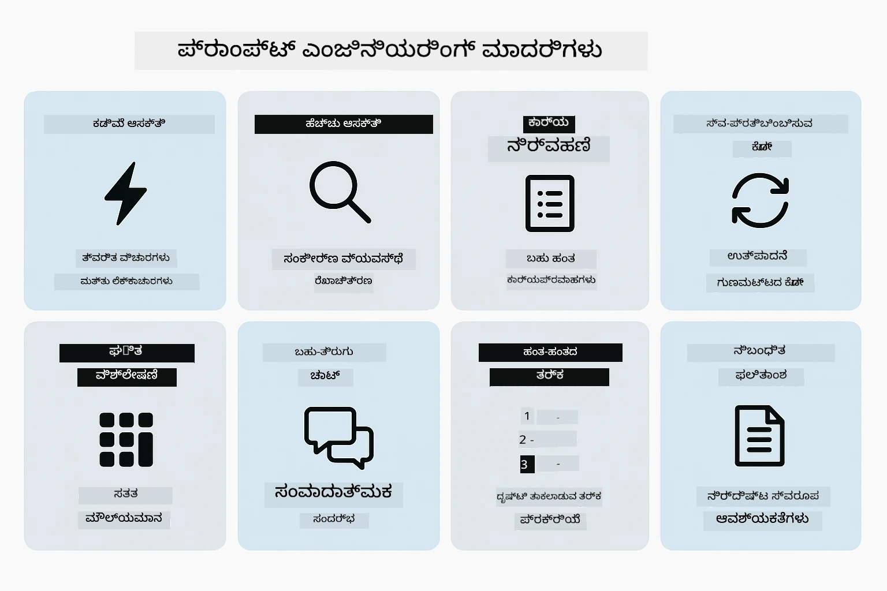
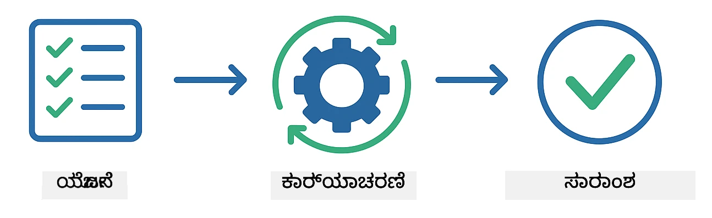
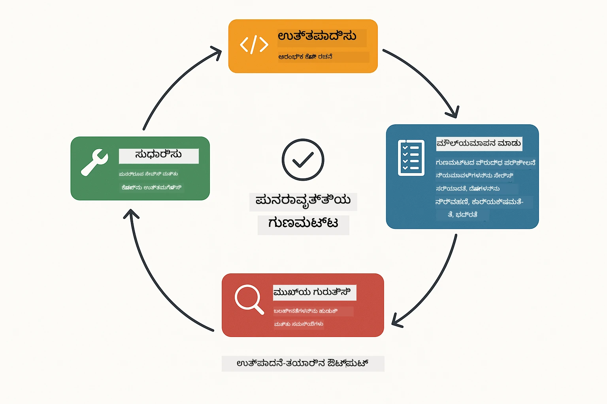
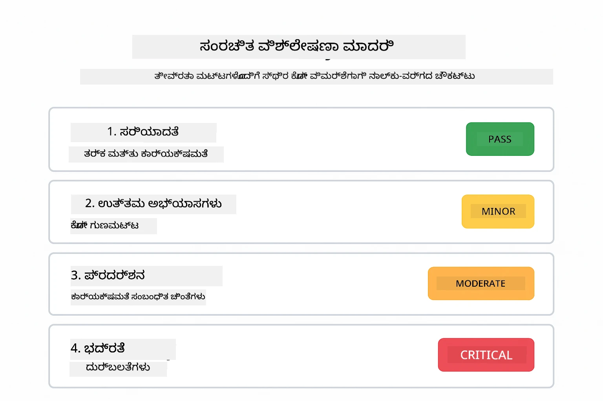
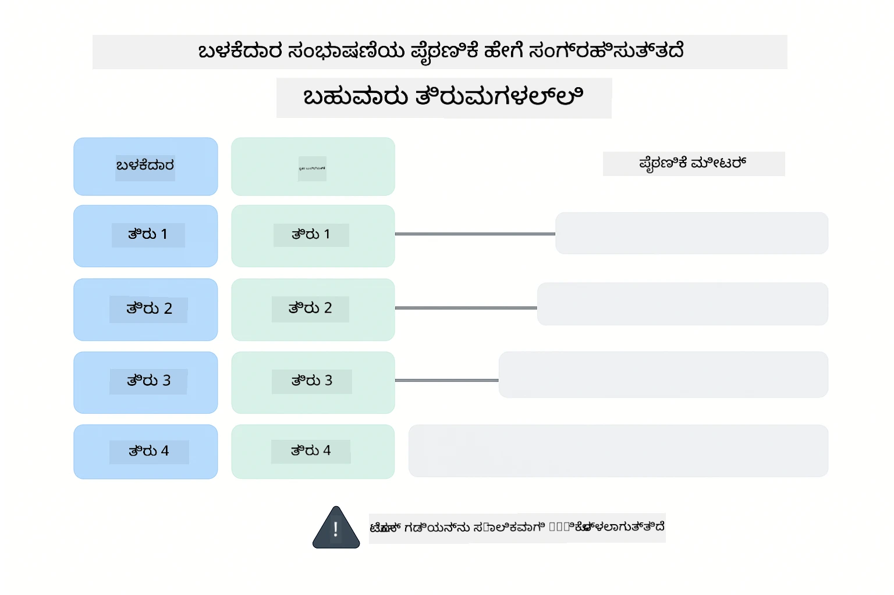
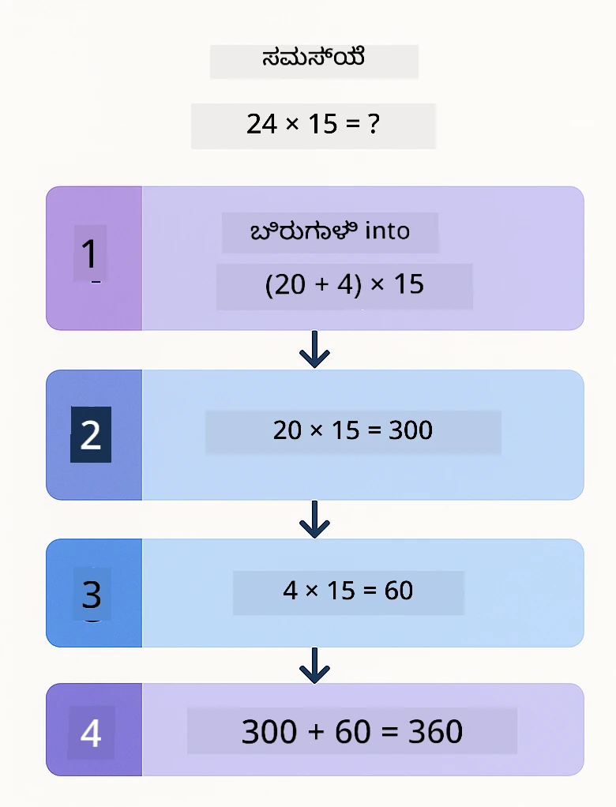
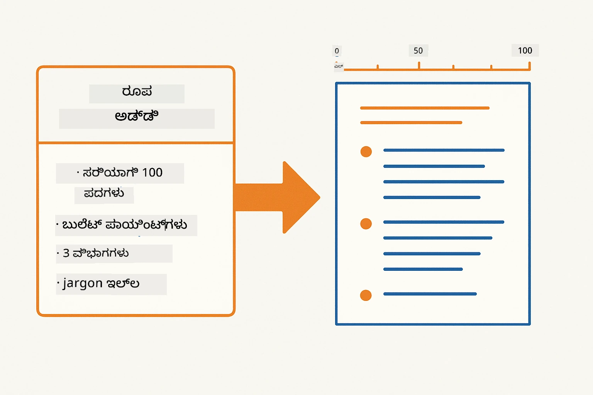
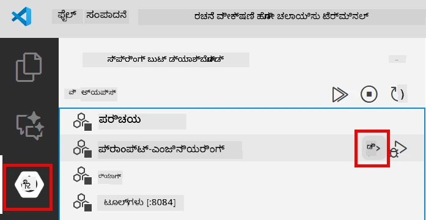
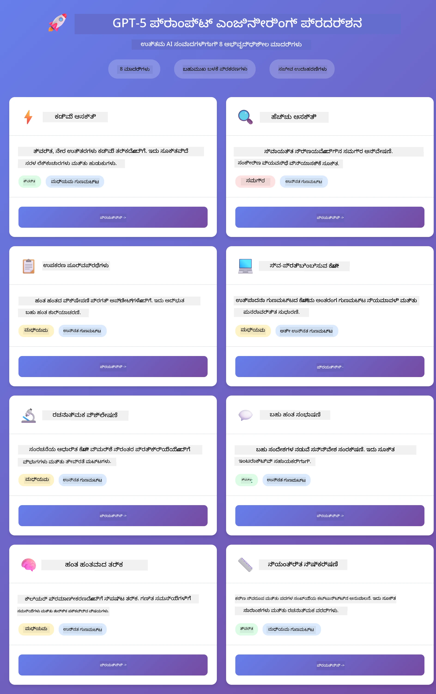
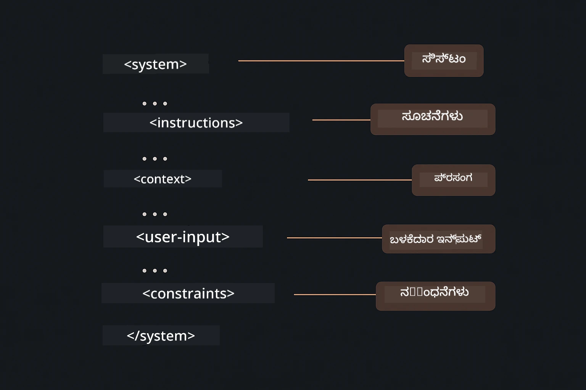

# Module 02: GPT-5.2 ನೊಂದಿಗೆ ಪ್ರಾಂಪ್ಟ್ ಎಂಜಿನಿಯರಿಂಗ್

## ವಿಷಯಗಳ ಪಟ್ಟಿ

- [ವೀಡಿಯೋ ವಾಕ್ಥ್ರೂ](#ವೀಡಿಯೋ-ವಾಕ್ಥ್ರೂ)
- [ನೀವು ಕಲಿಯುವುದೇನು](#ನೀವು-ಕಲಿಯುವುದೇನು)
- [ಆವಶ್ಯಕತೆಗಳಿವೆ](#ಆವಶ್ಯಕತೆಗಳಿವೆ)
- [ಪ್ರಾಂಪ್ಟ್ ಎಂಜಿನಿಯರಿಂಗ್ ಅನ್ನು ಅರ್ಥಮಾಡಿಕೊಳ್ಳುವುದು](#ಪ್ರಾಂಪ್ಟ್-ಎಂಜಿನಿಯರಿಂಗ್-ಅನ್ನು-ಅರ್ಥಮಾಡಿಕೊಳ್ಳುವುದು)
- [ಪ್ರಾಂಪ್ಟ್ ಎಂಜಿನಿಯರಿಂಗ್ ಮೂಲತತ್ವಗಳು](#ಪ್ರಾಂಪ್ಟ್-ಎಂಜಿನಿಯರಿಂಗ್-ಮೂಲತತ್ವಗಳು)
  - [ಝೀરો್-ಶಾಟ್ ಪ್ರಾಂಪ್ಟಿಂಗ್](#ಝೀโร್-ಶಾಟ್-ಪ್ರಾಂಪ್ಟಿಂಗ್)
  - [ಫ್ಯೂ-ಶಾಟ್ ಪ್ರಾಂಪ್ಟಿಂಗ್](#ಫ್ಯೂ-ಶಾಟ್-ಪ್ರಾಂಪ್ಟಿಂಗ್)
  - [ಚೈನ್ ಆಫ್ ಥಾಟ್](#ಚೈನ್-ಆಫ್-ಥಾಟ್)
  - [ರೋಲ್-ಬೇಸ್ ಪ್ರಾಂಪ್ಟಿಂಗ್](#ರೋಲ್-ಬೇಸ್-ಪ್ರಾಂಪ್ಟಿಂಗ್)
  - [ಪ್ರಾಂಪ್ಟ್ ಟೆಂಪ್ಲೇಟುಗಳು](#ಪ್ರಾಂಪ್ಟ್-ಟೆಂಪ್ಲೇಟುಗಳು)
- [ಅತ್ಯಾಧುನಿಕ ಸ್ವರೂಪಗಳು](#ಅತ್ಯಾಧುನಿಕ-ಸ್ವರೂಪಗಳು)
- [ಅಪ್ಲಿಕೇಶನ್ ಚಾಲನೆ ಮಾಡಿ](#ಅಪ್ಲಿಕೇಶನ್-ಅನ್ನು-ಓಡಿಸಿ)
- [ಅಪ್ಲಿಕೇಶನ್ ಸ್ಕ್ರೀನ್‌ಶಾಟ್‌ಗಳು](#ಅಪ್ಲಿಕೇಶನ್-ಸ್ಕ್ರೀನ್‌ಶಾಟ್‌ಗಳು)
- [ಸ್ವರೂಪಗಳನ್ನು ಅನ್ವೇಷಣೆ ಮಾಡುವುದು](#ಪ್ಯಾಟರ್ನ್‌ಗಳನ್ನು-ಅನ್ವೇಷಿಸುವುದು)
  - [ಕೆಳಗೂ ಮೇಲಿನ ಉತ್ಸಾಹ](#ಕಡಿಮೆ-ವಿರುದ್ಧ-ಹೆಚ್ಚು-ಆಸಕ್ತಿ)
  - [ಕಾರ್ಯ ನಿರ್ವಹಣೆ (ಟೂಲ್ ಪ್ರೀಮೇಬಲ್ಸ್)](#ಕಾರ್ಯಾಚರಣೆ-ಟೂಲ್-ಪ್ರೀऐಂಬಲ್‌ಗಳು)
  - [ಸ್ವ-ಪ್ರತಿಬಿಂಬಿಸುವ ಕೋಡ್](#ಸ್ವ-ಪರಿಶೀಲನೆಯ-ಕೋಡ್)
  - [ಸಂರಚಿತ ವಿಶ್ಲೇಷಣೆ](#ಸೂತ್ರಬದ್ಧ-ವಿಶ್ಲೇಷಣೆ)
  - [ಬಹು-ಉಳಿತಾಯ ಸಂಭಾಷಣೆ](#ಬಹು-ಟರ್ನ್-ಚಾಟ್)
  - [ಹೊಂದಿಕೆ-ಹೊಂದಿಕೆಯಿಂದ ಲಾಜಿಕ್](#ಹೆಜ್ಜೆ-ಹಂತ-ಆಲೋಚನೆ)
  - [ನಿಯಂತ್ರಿತ ಔಟ್‌ಪುಟ್](#ಬಂಧಿತ-ಔಟ್‌ಪುಟ್)
- [ನೀವು ನಿಜವಾಗಿಯೂ ಕಲಿಯುತ್ತಿರುವುದು](#ನೀವು-ನಿಜವಾಗಿಯೂ-ಕಲಿಯುತ್ತಿರುವುದು)
- [ಮುಂಭಾಗದ ಕ್ರಮಗಳು](#ಮುಂದಿನ-ಹಂತಗಳು)

## ವೀಡಿಯೋ ವಾಕ್ಥ್ರೂ

ಈ ಲೈವ್ ಸೆಷನ್ ಅನ್ನು ವೀಕ್ಷಿಸಿ ಇದು ಈ ಮೋಡ್ಯೂಲ್‌ಗೆ ಹೇಗೆ ಪ್ರಾರಂಭಿಸಲು ಎಂಬುದನ್ನು ವಿವರಿಸುತ್ತದೆ:

<a href="https://www.youtube.com/live/PJ6aBaE6bog?si=LDshyBrTRodP-wke"></a>

## ನೀವು ಕಲಿಯುವುದೇನು

ಕೆಳಗಿನ ಚಿತ್ರವು ನೀವು ಈ ಮೋಡ್ಯೂಲ್‌ನಲ್ಲಿ ಅಭಿವೃದ್ಧಿಪಡಿಸುವ ಪ್ರಮುಖ ವಿಷಯಗಳು ಮತ್ತು ಕೌಶಲ್ಯಗಳ ಒಂದು ಅವಲೋಕನವನ್ನು ನೀಡುತ್ತದೆ — ಪ್ರಾಂಪ್ಟ್ ಶುದ್ಧೀಕರಣ ತಂತ್ರಗಳಿಂದ ಆರಂಭಿಸಿ ನೀವು ಅನುಸರಿಸುವ ಹಂತ-ಹಂತ ಕಾರ್ಯಪ್ರವಾಹವರೆಗೆ.


ಹಿಂದಿನ ಮೋಡ್ಯೂಲ್‌ನಲ್ಲಿ, ನೀವು ಹೇಗೆ ಮೆಮೊರಿ ಸಂವಾದಾತ್ಮಕ AI ಗೆ ಅನುಮತಿಸುತ್ತದೆ ಎಂಬುದನ್ನು Azure OpenAI ಸಹಿತ ಗಮನಿಸಿದಿರಿ. ಈಗ ನಾವು ಹೇಗೆ ಪ್ರಶ್ನೆಗಳನ್ನು ಕೇಳುತ್ತೀರಿ - ಪ್ರಾಂಪ್ಟ್ಗಳು ಸ್ವತಂಶ - ಬಳಕೆಮಾಡುವುದು ಅನ್ನು ನೋಡುತ್ತೇವೆ, Azure OpenAI ನ GPT-5.2 ಬಳಸಿ. ನೀವು ನಿಮ್ಮ ಪ್ರಾಂಪ್ಟ್ ಗಳನ್ನು ಹೇಗೆ ರಚಿಸುವಿರಿ ಎಂಬುದು ನೀವು ಪಡೆಯುವ ಪ್ರತಿಕ್ರಿಯೆಗಳ ಗುಣಮಟ್ಟವನ್ನು ಬಹುಮುಖ್ಯವಾಗಿ ಪ್ರಭಾವಿಸುತ್ತದೆ. ನಾವು ಮೊದಲಿಗೆ ಮೂಲ ಪ್ರಾಂಪ್ಟಿಂಗ್ ತಂತ್ರಗಳನ್ನು ಪರಿಶೀಲಿಸುತ್ತೇವೆ, ನಂತರ GPT-5.2 ನ ಶಕ್ತಿಗಳನ್ನು ಸಂಪೂರ್ಣವಾಗಿ ಬಳಸುವ ಎಂಟು ಅತ್ಯಾಧುನಿಕ ಸ್ವರೂಪಗಳಿಗೆ ಹೋಗುತ್ತೇವೆ.

ನಾವು GPT-5.2 ಅನ್ನು ಬಳಸುತ್ತೇವೆ ಏಕೆಂದರೆ ಇದು ಯುಕ್ತಿ ನಿಯಂತ್ರಣವನ್ನು ಪರಿಚಯಿಸುತ್ತದೆ - ನೀವು ಮಾದರಿಯೆಷ್ಟು ಯೋಚನೆ ಮಾಡಬೇಕು ಎಂದು ಹೇಳಬಹುದು. ಇದರಿಂದ ವಿಭಿನ್ನ ಪ್ರಾಂಪ್ಟಿಂಗ್ ತಂತ್ರಗಳು ಹೆಚ್ಚು ಸ್ಪಷ್ಟವಾಗುತ್ತವೆ ಮತ್ತು ನೀವು ಯಾವ ತಂತ್ರವನ್ನು ಯಾವಾಗ ಬಳಸಬೇಕು ಎಂಬುದನ್ನು ಅರ್ಥಮಾಡಿಕೊಳ್ಳಲು ಸಹಾಯವಾಗುತ್ತದೆ.

## ಆವಶ್ಯಕತೆಗಳಿವೆ

- ಪೂರ್ಣಗೊಂಡಿದೆ Module 01 (Azure OpenAI ಸಂಪನ್ಮೂಲಗಳು ನಿಯೋಜಿಸಲಾಗಿದೆ)
- ರೂಟ್ ಡೈರೆಕ್ಟರಿಯಲ್ಲಿನ `.env` ಫೈಲ್ ಅನ್ನು Azure ಪ್ರಾಮಾಣಿಕತೆಗಳೊಂದಿಗೆ ಹೊಂದಿದೆ (`azd up` ಬಳಸಿ Module 01 ನಲ್ಲಿ ಸೃಷ್ಟಿಸಿದ)

> **ಗಮನಿಸಿ:** ನೀವು Module 01 ಅನ್ನು ಪೂರ್ಣಗೊಳಿಸದಿದ್ದರೆ, ಮೊದಲಿಗೆ ಅಲ್ಲಿನ ನಿಯೋಜನೆ ಸೂಚನೆಯನ್ನು ಅನುಸರಿಸಿ.

## ಪ್ರಾಂಪ್ಟ್ ಎಂಜಿನಿಯರಿಂಗ್ ಅನ್ನು ಅರ್ಥಮಾಡಿಕೊಳ್ಳುವುದು

ಮೂಲದಲ್ಲಿ, ಪ್ರಾಂಪ್ಟ್ ಎಂಜಿನಿಯರಿಂಗ್ ಅಸ್ಪಷ್ಟ ಉಪದೇಶಗಳು ಮತ್ತು ನಿಖರವಾದವುಗಳ ನಡುವಿನ ವ್ಯತ್ಯಾಸವಾಗಿದೆ, ಕೆಳಗಿನ ಹೋಲಿಕೆಯಿಂದ ಸ್ಪಷ್ಟವಾಗುತ್ತದೆ.


ಪ್ರಾಂಪ್ಟ್ ಎಂಜಿನಿಯರಿಂಗ್ ಎಂದರೆ ನೀವು ಬೇಕಾದ ಫಲಿತಾಂಶಗಳನ್ನು ಸತತವಾಗಿ ಪಡೆಯಲು ಇನ್‌ಪುಟ್ ಪಠ್ಯವನ್ನು ರೂಪಿಸುವುದಾಗಿದೆ. ಇದು ಕೇವಲ ಪ್ರಶ್ನೆ ಕೇಳುವುದಿಲ್ಲ - ಇದು ವಿನಂತಿಗಳನ್ನು ವಿನ್ಯಾಸಗೊಳಿಸುವುದು, ಇದರಿಂದ ಮಾದರಿ ಯಾವುದು ಬೇಕು ಮತ್ತು ಹೇಗೆ ಒದಗಿಸಲು ಪರಿಪಾಟಿಯಾಗುತ್ತದೆ ಎಂಬುದನ್ನು ಸಂಪೂರ್ಣವಾಗಿ ಅర్థಮಾಡಿಕೊಳ್ಳುತ್ತದೆ.

ನೀವು ಸಹೋದ್ಯೋಗಿಗೆ ಸೂಚನೆಗಳನ್ನು ನೀಡುತ್ತಿದ್ದಂತೆ ಭಾವಿಸಿ. "ದೋಷ ಸರಿ ಮಾಡಿ" ಅಸ್ಪಷ್ಟವಾಗಿದೆ. "UserService.java ಲೈನ್ 45 ನಲ್ಲಿ ನಲ್ ಪಾಯಿಂಟರ್ ಎಕ್ಸೆಪ್ಶನ್ ಸರಿ ಮಾಡು, ನಲ್ ಚೆಕ್ ಸೇರಿಸುವ ಮೂಲಕ" ನಿಖರವಾಗಿದೆ. ಭಾಷಾ ಮಾದರಿಗಳು ಒಂದೇ ರೀತಿಯಲ್ಲಿ ಕೆಲಸ ಮಾಡುತ್ತವೆ - ನಿಖರತೆ ಮತ್ತು ರಚನೆ ಮುಖ್ಯ.

ಕೆಳಗಿನ ಚಿತ್ರವು LangChain4j ಈ ಚಿತ್ರದಲ್ಲಿ ಹೇಗೆ ಹೊಂದಿದೆ ಎಂಬುದನ್ನು ತೋರಿಸುತ್ತದೆ — ನಿಮ್ಮ ಪ್ರಾಂಪ್ಟ್ ಸ್ವರೂಪಗಳನ್ನು SystemMessage ಮತ್ತು UserMessage ನಿರ್ಮಾಣ ಘಟಕಗಳ ಮೂಲಕ ಮಾದರಿಯೊಂದಿಗೆ ಸಂಪರ್ಕಿಸುತ್ತದೆ.


LangChain4j ಮೂಲಭೂತ ಸೌಲಭ್ಯಗಳನ್ನು ಒದಗಿಸುತ್ತದೆ — ಮಾದರಿ ಸಂಪರ್ಕಗಳು, ಮೆಮೊರಿ ಮತ್ತು ಸಂದೇಶ ಪ್ರಕಾರಗಳು — ಮತ್ತು ಪ್ರಾಂಪ್ಟ್ ಸ್ವರೂಪಗಳು ಅದು ರಚಿಸಿದ ಪಠ್ಯವಷ್ಟೇ ಆಗಿವೆ. ಪ್ರಮುಖ ನಿರ್ಮಾಣ ಘಟಕಗಳು `SystemMessage` (ಇವು AI ನ ವರ್ತನೆ ಮತ್ತು ಪಾತ್ರವನ್ನು ಹೊಂದಿದೆ) ಮತ್ತು `UserMessage` (ನಿಮ್ಮ ನಿಜವಾದ ವಿನಂತಿಯನ್ನು ಸಾಗಿಸುತ್ತದೆ).

## ಪ್ರಾಂಪ್ಟ್ ಎಂಜಿನಿಯರಿಂಗ್ ಮೂಲತತ್ವಗಳು

ಕೆಳಗಿನ ಐದು ಪ್ರಮುಖ ತಂತ್ರಗಳು ಪರಿಣಾಮಕಾರಿ ಪ್ರಾಂಪ್ಟ್ ಎಂಜಿನಿಯರಿಂಗ್‌ನ ಅಡಿಪಾಯವನ್ನು ರೂಪಿಸುತ್ತವೆ. ಪ್ರತಿಯೊಂದು ಭಾಷಾ ಮಾದರಿಗಳೊಂದಿಗೆ ನೀವು ಹೇಗೆ ಸಂವಹನ ಮಾಡುತ್ತೀರಿ ಎಂಬುದರ ವಿಭಿನ್ನ ಅಂಶವನ್ನು ಈವತ್ತು ನಿರ್ಧರಿಸುತ್ತದೆ.


ಈ ಮೋಡ್ಯೂಲ್‌ನ ಅತ್ಯಾಧುನಿಕ ಸ್ವರೂಪಗಳಿಗೆ ಮುನ್ನಡೆಯುವ ಮುನ್ನ, ಒಂಭತ್ತು ಮೂಲಭೂತ ಪ್ರಾಂಪ್ಟಿಂಗ್ ತಂತ್ರಗಳನ್ನು ಪರಿಶೀಲಿಸೋಣ. ಇವು ಪ್ರತಿ ಪ್ರಮಿನ್ ಪ್ರಾಂಪ್ಟ್ ಇಂಜಿನಿಯರ್ ತಿಳಿದುಕೊಳ್ಳಬೇಕಾದ ಇವು.

### ಝೀโร್-ಶಾಟ್ ಪ್ರಾಂಪ್ಟಿಂಗ್

ಸರಳವಾದ ವಿಧಾನ: ಮಾದರಿಗೆ ಉದಾಹರಣೆಗಳಿಲ್ಲದೆ ನೇರ ಆದೇಶ ನೀಡುವುದು. ಮಾದರಿ ಸಂಪೂರ್ಣವಾಗಿ ತನ್ನ ತರಬೇತಿಯ ಮೇಲೆ ಅವಲಂಬಿತವಾಗಿದೆ ಕಾರ್ಯವನ್ನು ಅರ್ಥಮಾಡಿಕೊಳ್ಳಲು ಮತ್ತು ನಡೆಸಲು. ಇದು ಸರಳ ವಿನಂತಿಗಳಿಗೆ ಸೂಕ್ತವಾಗಿದೆ, ಅಲ್ಲಿ ನಿರೀಕ್ಷಿತ ವರ್ತನೆ ಸ್ಪಷ್ಟವಾಗಿದೆ.


*ಉದಾಹರಣೆ ಇಲ್ಲದ ನೇರ ಆದೇಶ — ಮಾದರಿ ಆದೇಶದಿಂದಲೇ ಕಾರ್ಯವನ್ನು ಅನುವಾದಿಸುತ್ತದೆ*

```java
String prompt = "Classify this sentiment: 'I absolutely loved the movie!'";
String response = model.chat(prompt);
// ಪ್ರತಿಕ್ರಿಯೆ: "ಧನಾತ್ಮಕ"
```

**ಯಾವಾಗ ಬಳಸಬೇಕು:** ಸರಳ ವರ್ಗೀಕರಣಗಳು, ನೇರ ಪ್ರಶ್ನೆಗಳು, ಅನುವಾದಗಳು ಅಥವಾ ಯಾವುದೇ ಕಾರ್ಯಗಳು, ಮಾದರಿ ಹೆಚ್ಚುವರಿ ಮಾರ್ಗದರ್ಶನವಿಲ್ಲದೆ ನಿರ್ವಹಿಸಬಲ್ಲಾಗಬೇಕು.

### ಫ್ಯೂ-ಶಾಟ್ ಪ್ರಾಂಪ್ಟಿಂಗ್

ನೀವು ಅಗತ್ಯವಿರುವ ಮಾದರಿಯನ್ನು ತೋರಿಸುವ ಉದಾಹರಣೆಗಳನ್ನು ಒದಗಿಸಿ. ಮಾದರಿ ನಿಮ್ಮ ಉದಾಹರಣೆಗಳಿಂದ ನಿರೀಕ್ಷಿತ ಇನ್‌ಪುಟ್- ಔಟ್‌ಪುಟ್ ನ ಮಾದರಿಯನ್ನು ಕಲಿತುಕೊಳ್ಳುತ್ತದೆ ಮತ್ತು ಹೊಸ ಇನ್‌ಪುಟ್‌ಗಳಿಗೆ ಅದನ್ನು ಅನ್ವಯಿಸುತ್ತದೆ. ಇದರಿಂದ ನಿರಂತರತೆ ತಾಜಾ ಆದೇಶಗಳಲ್ಲೂ ಹೆಚ್ಚುತ್ತದೆ, ಮುಖ್ಯವಾಗಿ ನಿರೀಕ್ಷಿತ ಫಾರ್ಮ್ಯಾಟ್ ಅಥವಾ ವರ್ತನೆ ಸ್ಪಷ್ಟವಾಗದ ಪರಿಸ್ಥಿತಿಗಳಲ್ಲಿ.


*ಉದಾಹರಣೆಗಳಿಂದ ಕಲಿಯುವುದು — ಮಾದರಿ ಮಾದರಿಯನ್ನು ಗುರುತಿಸಿ ಹೊಸ ಇನ್‌ಪುಟ್‌ಗಳಿಗೆ ಅನ್ವಯಿಸುತ್ತದೆ*

```java
String prompt = """
    Classify the sentiment as positive, negative, or neutral.
    
    Examples:
    Text: "This product exceeded my expectations!" → Positive
    Text: "It's okay, nothing special." → Neutral
    Text: "Waste of money, very disappointed." → Negative
    
    Now classify this:
    Text: "Best purchase I've made all year!"
    """;
String response = model.chat(prompt);
```

**ಯಾವಾಗ ಬಳಸಬೇಕು:** ಕಸ್ಟಮ್ ವರ್ಗೀಕರಣಗಳು, ನಿರಂತರ ಫಾರ್ಮ್ಯಾಟಿಂಗ್, ಕ್ಷೇತ್ರ-ನಿರ್ದಿಷ್ಟ ಕೆಲಸಗಳು, ಅಥವಾ ಝೀರೋ-ಶಾಟ್ ಫಲಿತಾಂಶಗಳು ಅಸ್ಥಿರವಾಗಿರುವಾಗ.

### ಚೈನ್ ಆಫ್ ಥಾಟ್

ಮಾದರಿಯನ್ನು ಹಂತದ ಹಂತವಾಗಿ ತನ್ನ ಯುಕ್ತಿಕ ಚಿಂತನೆ ತೋರುವಂತೆ ಕೇಳಿ. ನೇರವಾಗಿ ಉತ್ತರಕ್ಕೆ ಹಾರದೇ, ಮಾದರಿ each ಭಾಗವನ್ನು ಸ್ಪಷ್ಟವಾಗಿ ವಿಭಾಗಿಸಿ ಪ್ರಕ್ರಿಯೆಯ ಮೂಲಕ ಹೋಗುತ್ತದೆ. ಇದು ಗಣಿತ, ತಾರ್ಕಿಕ, ಮತ್ತು ಬಹು ಹಂತದ ಯುಕ್ತಿ ಕಾರ್ಯಗಳಲ್ಲಿ ನಿಖರತೆಗೆ ಉತ್ತೇಜನ ನೀಡುತ್ತದೆ.


*ಹಂತದಿಂದ ಹಂತಕ್ಕೆ ಯುಕ್ತಿ — ಸಂಕೀರ್ಣ პრობლემೆಗಳನ್ನು ಸ್ಪಷ್ಟ ತಾರ್ಕಿಕ ಹಂತಗಳಾಗಿ ಭಂಗಿಮಾಡುವುದು*

```java
String prompt = """
    Problem: A store has 15 apples. They sell 8 apples and then 
    receive a shipment of 12 more apples. How many apples do they have now?
    
    Let's solve this step-by-step:
    """;
String response = model.chat(prompt);
// ಮಾದರಿ ತೋರುತ್ತದೆ: 15 - 8 = 7, ನಂತರ 7 + 12 = 19 ಸೇಬುಗಳು
```

**ಯಾವಾಗ ಬಳಸಬೇಕು:** ಗಣಿತ ಸಮಸ್ಯೆಗಳು, ತಾರ್ಕಿಕ ಪuzzlesಗಳು, ಡಿಬಗ್ ಮಾಡುವುದು, ಅಥವಾ ಯುಕ್ತಿ ಪ್ರಕ್ರಿಯೆಯನ್ನು ತೋರುವುದು ನಿಖರತೆ ಮತ್ತು ವಿಶ್ವಾಸಯುತತೆಗೆ ಸಹಾಯ ಮಾಡುವ ಯಾವುದೇ ಕಾರ್ಯ.

### ರೋಲ್-ಬೇಸ್ ಪ್ರಾಂಪ್ಟಿಂಗ್

AI ಗೆ ಪ್ರಶ್ನೆ ಕೇಳುವ ಮುನ್ನ ಪರ್ಸೋನ ಅಥವಾ ಪಾತ್ರವನ್ನು ಹೊಂದಿಸಿ. ಇದು ಪ್ರತಿಕ್ರಿಯೆಯ ಶೈಲಿ, ಆಳ ಮತ್ತು ಗಮನಕ್ಕೆ ಸಂದರ್ಭ ಒದಗಿಸುತ್ತದೆ. "ಸಾಫ್ಟ್‌ವೇರ್ ವಾಸ್ತುಕಾರ" "ಜೂನಿಯರ್ ಡೆವಲಪರ್" ಅಥವಾ "ಸುರಕ್ಷತಾ ಪರಿಶೀಲಕ" ಭಿನ್ನ ಸಲಹೆಗಳನ್ನು ನೀಡುತ್ತದೆ.


*ಸಂದರ್ಭ ಮತ್ತು ಪಾತ್ರವನ್ನು ಹೊಂದಿಸುವುದು — ಒಬ್ಬೇ ಪ್ರಶ್ನೆಗೆ ಸಂಬಂಧಿಸಿದ ಪಾತ್ರಕ್ಕೆ ಅನ್ವಯಿಸಿ ವಿಭಿನ್ನ ಪ್ರತಿಕ್ರಿಯೆ*

```java
String prompt = """
    You are an experienced software architect reviewing code.
    Provide a brief code review for this function:
    
    def calculate_total(items):
        total = 0
        for item in items:
            total = total + item['price']
        return total
    """;
String response = model.chat(prompt);
```

**ಯಾವಾಗ ಬಳಸಬೇಕು:** ಕೋಡ್ ಸಮೀಕ್ಷೆಗಳು, ಟ್ಯೂಟೋರಿಂಗ್, ಕ್ಷೇತ್ರ-ನಿರ್ದಿಷ್ಟ ವಿಶ್ಲೇಷಣೆ, ಅಥವಾ ನಿರ್ದಿಷ್ಟ ಪರಿಣತಿಯಿಂದ ಸಂಬಂಧವಾದ ಪ್ರತಿಕ್ರಿಯೆಗಳು ಬೇಕಾದಾಗ.

### ಪ್ರಾಂಪ್ಟ್ ಟೆಂಪ್ಲೇಟುಗಳು

ಚಲನೆಯಾಗಿ ಬದಲಾಗುವ ಸ್ಥಾನಮಾನಗಳನ್ನು ಹೊಂದಿರುವ ಪುನರುಪಯೋಗಿಸುವ ಪ್ರಾಂಪ್ಟ್‌ಗಳ ರಚನೆ ಮಾಡಿ. ಪ್ರತಿಯೊಮ್ಮೆ ಹೊಸ प्रಾಂಪ್ಟ್ ಬರೆಯುವ ಬದಲು, ಒಂದು ಟೆಂಪ್ಲೇಟ್ ನ್ನು ಒಂದೇ ಬಾರಿಗೆ ನಿರ್ಧರಿಸಿ ವಿಭಿನ್ನ ಮೌಲ್ಯಗಳನ್ನು ತುಂಬಿ. LangChain4j ನ `PromptTemplate` ಕ್ಲಾಸು ಇದನ್ನು `{{variable}}` ಸಿಂಟ್ಯಾಕ್ಸಿನೊಂದಿಗೆ ಸುಲಭವಾಗಿ ಮಾಡುತ್ತದೆ.


*ಸ್ಥಾನಮಾನಗಳನ್ನು ಹೊಂದಿರುವ ಪುನರುಪಯೋಗಿಸುವ ಪ್ರಾಂಪ್ಟ್ — ಒಂದು ಟೆಂಪ್ಲೇಟ್, ಅನೇಕ ಉಪಯೋಗಗಳು*

```java
PromptTemplate template = PromptTemplate.from(
    "What's the best time to visit {{destination}} for {{activity}}?"
);

Prompt prompt = template.apply(Map.of(
    "destination", "Paris",
    "activity", "sightseeing"
));

String response = model.chat(prompt.text());
```

**ಯಾವಾಗ ಬಳಸಬೇಕು:** ವಿಭಿನ್ನ ಇನ್‌ಪುಟ್‌ಗಳೊಂದಿಗೆ ಪುನರಾವರ್ತಿತ ಪ್ರಶ್ನೆಗಳು, ಬ್ಯಾಚ್ ಪ್ರಕ್ರಿಯೆ, ಪುನರುಪಯೋಗಿಸುವ AI ಕಾರ್ಯಪ್ರವಾಹ ನಿರ್ಮಾಣ, ಅಥವಾ ಯಾವುದೇ ಪರಿಸ್ಥಿತಿ ಇಲ್ಲಿ ಪ್ರಾಂಪ್ಟ್ ರಚನೆ ಒಂದೇ ಆದರೆ ಡೇಟಾ ಬದಲಾಗುತ್ತದೆ.

---

ಈ ಐದು ಮೂಲಭೂತಗಳು ನಿಮಗೆ ಹೆಚ್ಚಿನ ಪ್ರಾಂಪ್ಟಿಂಗ್ ಕಾರ್ಯಗಳಿಗೆ ಉತ್ತಮ ಉಪಕರಣಸಮೂಹವನ್ನು ನೀಡುತ್ತದೆ. ಈ ಮೋಡ್ಯೂಲ್ ಉಳಿದ ಹಂತದಲ್ಲಿ **ಎಂಟು ಅತ್ಯಾಧುನಿಕ ಸ್ವರೂಪಗಳು** ಇದ್ದಾರೆ, ಇವು GPT-5.2 ನ ಯುಕ್ತಿ ನಿಯಂತ್ರಣ, ಸ್ವ-ಮೌಲ್ಯಮಾಪನ ಮತ್ತು ಸಂರಚಿತ ಔಟ್‌ಪುಟ್ ಸಾಮರ್ಥ್ಯಗಳನ್ನು ಬಳಸಿ.

## ಅತ್ಯಾಧುನಿಕ ಸ್ವರೂಪಗಳು

ಮೂಲಭೂತಗಳನ್ನು ಮುಗಿಸಿದ ನಂತರ, ಈ ಮೋಡ್ಯೂಲ್ ಅನ್ನು ವಿಶಿಷ್ಟ ಮಾಡಿರುವ ಎಂಟು ಅತ್ಯಾಧುನಿಕ ಸ್ವರೂಪಗಳಿಗೆ ಸಾಗೋಣ. ಎಲ್ಲಾ ಸಮಸ್ಯೆಗಳಿಗೆ ಒಂದೇ ವಿಧಾನ ಬೇಕಾಗುವುದಿಲ್ಲ. ಕೆಲವು ಪ್ರಶ್ನೆಗಳು ಸುಲಭ ಉತ್ತರಗಳನ್ನು ಬೇಡುತ್ತವೆ, ಮತ್ತಷ್ಟು ಆಳವಾದ ಯುಕ್ತಿಯನ್ನು ಅಗತ್ಯವಿದೆ. ಕೆಲವು ಸ್ಪಷ್ಟ ಯುಕ್ತಿಯನ್ನು ತೋರಬೇಕು, ಇನ್ನಿತರ ಪ್ರಶ್ನೆಗಳು ಫಲಿತಾಂಶಗಳನ್ನು ಮಾತ್ರ ಬಯಸುತ್ತವೆ. ಕೆಳಗಿನ ಪ್ರತಿಯೊಂದು ಸ್ವರೂಪವು ವಿಭಿನ್ನ ಪರಿಸ್ಥಿತಿಗೆ ಅನುಗುಣವಾಗಿದೆ — ಮತ್ತು GPT-5.2 ಯುಕ್ತಿ ನಿಯಂತ್ರಣ ವ್ಯತ್ಯಾಸಗಳನ್ನು ಇನ್ನೂ ಸ್ಪಷ್ಟಗೊಳಿಸುತ್ತದೆ.



*ಎಂಟು ಪ್ರಾಂಪ್ಟ್ ಎಂಜಿನಿಯರಿಂಗ್ ಸ್ವರೂಪಗಳ ಅವಲೋಕನ ಮತ್ತು ಅವುಗಳ ಉಪಯೋಗಗಳು*

GPT-5.2 ಈ ಸ್ವರೂಪಗಳಿಗೆ ಇನ್ನೊಂದು ಆಯಾಮವನ್ನು ಸೇರಿಸಿದೆ: *ಯುಕ್ತಿ ನಿಯಂತ್ರಣ*. ಕೆಳಗಿನ ಸ್ಲೈಡರ್ ಮಾದರಿಯ ಯೋಚನಾ ಶ್ರಮವನ್ನು ಹೊಂದಿಸಲು ನಿಮಗೆ ಸಾಧ್ಯವಾಗುತ್ತದೆ — ತ್ವರಿತ, ನೇರ ಉತ್ತರಗಳಿಂದ ಆಳವಾದ ವಿಶ್ಲೇಷಣೆಗೆ.


*GPT-5.2 ಯುಕ್ತಿ ನಿಯಂತ್ರಣವು ನಿಮಗೆ ಮಾದರಿಗೆಷ್ಟು ಯೋಚನೆ ಮಾಡುವುದು ಮಾರ್ಪಡಿಸಲು ಅವಕಾಶ ನೀಡುತ್ತದೆ — ಶೀಘ್ರ ನೇರ ಉತ್ತರರಿಂದ ಆಳವಾದ ಅನ್ವೇಷಣೆಗೆ*

**ಕಡಿಮೆ ಉತ್ಸಾಹ (ತ್ವರಿತ ಮತ್ತು ಕೇಂದ್ರೀಕೃತ)** - ಸರಳ ಪ್ರಶ್ನೆಗಳಿಗಾಗಿ ಶೀಘ್ರ, ನೇರ ಉತ್ತರ ಬೇಕಾದಾಗ. ಮಾದರಿ ಕನಿಷ್ಠ ಯುಕ್ತಿ ಮಾಡುತ್ತದೆ - ಗರಿಷ್ಠ 2 ಹಂತಗಳು. ಇದನ್ನು ಗಣನೆಗಳು, ಹುಡುಕಾಟಗಳು, ಅಥವಾ ಸರಳ ಪ್ರಶ್ನೆಗಳಿಗಾಗಿ ಉಪಯೋಗಿಸಿ.

```java
String prompt = """
    <context_gathering>
    - Search depth: very low
    - Bias strongly towards providing a correct answer as quickly as possible
    - Usually, this means an absolute maximum of 2 reasoning steps
    - If you think you need more time, state what you know and what's uncertain
    </context_gathering>
    
    Problem: What is 15% of 200?
    
    Provide your answer:
    """;

String response = chatModel.chat(prompt);
```

> 💡 **GitHub Copilot ನೊಂದಿಗೆ ಅನ್ವೇಷಿಸಿ:** [`Gpt5PromptService.java`](../../../02-prompt-engineering/src/main/java/com/example/langchain4j/prompts/service/Gpt5PromptService.java) ತೆರೆಯಿರಿ ಮತ್ತು ಕೇಳಿ:
> - "ಕಡಿಮೆ ಉತ್ಸಾಹ ಮತ್ತು ಹೆಚ್ಚು ಉತ್ಸಾಹ ಪ್ರಾಂಪ್ಟಿಂಗ್ ಸ್ವರೂಪಗಳ ನಡುವೆ ಏನು ವ್ಯತ್ಯಾಸವಿದೆ?"
> - "ಪ್ರಾಂಪ್ಟ್ಗಳಲ್ಲಿ XML ಟ್ಯಾಗ್ ಗಳು AI ಪ್ರತಿಕ್ರಿಯೆಯ ರಚನೆಯನ್ನು ಹೇಗೆ ಸಹಾಯ ಮಾಡುತ್ತವೆ?"
> - "ಸ್ವ-ಪ್ರತಿಬಿಂಬಿಸುವ ಸ್ವರೂಪಗಳು ಮತ್ತು ನೇರ ಆದೇಶಗಳ დროს ಯಾವಾಗ ಯಾವನ್ನು ಬಳಸಬೇಕು?"

**ಹೆಚ್ಚು ಉತ್ಸಾಹ (ಆಳವಾದ ಮತ್ತು ಸಂಪೂರ್ಣ)** - ಸಂಕೀರ್ಣ ಸಮಸ್ಯೆಗಳಿಗಾಗಿ ಸಮಗ್ರ ವಿಶ್ಲೇಷಣೆ ಬೇಕಾದಾಗ. ಮಾದರಿ ಆಳವಾಗಿ ಅನ್ವೇಷಣೆ ಮಾಡುತ್ತದೆ ಮತ್ತು ವಿವರವಾದ ಯುಕ್ತಿಯನ್ನು ತೋರುತ್ತದೆ. ಇದನ್ನು ಸಿಸ್ಟಂ ವಿನ್ಯಾಸ, ವಾಸ್ತುಶಿಲ್ಪ ನಿರ್ಣಯಗಳು, ಅಥವಾ ಸಂಕೀರ್ಣ ಸಂಶೋಧನೆಗಳಿಗಾಗಿಯೂ ಉಪಯೋಗಿಸಿ.

```java
String prompt = """
    Analyze this problem thoroughly and provide a comprehensive solution.
    Consider multiple approaches, trade-offs, and important details.
    Show your analysis and reasoning in your response.
    
    Problem: Design a caching strategy for a high-traffic REST API.
    """;

String response = chatModel.chat(prompt);
```

**ಕಾರ್ಯ ನಿರ್ವಹಣೆ (ಹಂತ ಹಂತವಾಗಿ ಪ್ರಗತಿ)** - ಬಹು ಹಂತ ಕಾರ್ಯಗಳಿಗೆ. ಮಾದರಿ ಮುಂಚಿತ ಯೋಜನೆಯನ್ನು ಒದಗಿಸುತ್ತದೆ, ಪ್ರತಿ ಹಂತವನ್ನು ಕಾರ್ಯಾಚರಿಸುತ್ತಾ ವರ್ಣಿಸುತ್ತದೆ, ನಂತರ ಸಾರಾಂಶ ನೀಡುತ್ತದೆ. ಇದನ್ನು ಮೈಗ್ರೇಷನ್, ಅನುಷ್ಠಾನಗಳು ಅಥವಾ ಯಾವುದೇ ಬಹು ಹಂತ ಪ್ರಕ್ರಿಯೆಗೆ ಉಪಯೋಗಿಸಿ.

```java
String prompt = """
    <task_execution>
    1. First, briefly restate the user's goal in a friendly way
    
    2. Create a step-by-step plan:
       - List all steps needed
       - Identify potential challenges
       - Outline success criteria
    
    3. Execute each step:
       - Narrate what you're doing
       - Show progress clearly
       - Handle any issues that arise
    
    4. Summarize:
       - What was completed
       - Any important notes
       - Next steps if applicable
    </task_execution>
    
    <tool_preambles>
    - Always begin by rephrasing the user's goal clearly
    - Outline your plan before executing
    - Narrate each step as you go
    - Finish with a distinct summary
    </tool_preambles>
    
    Task: Create a REST endpoint for user registration
    
    Begin execution:
    """;

String response = chatModel.chat(prompt);
```

ಚೈನ್-ಆಫ್-ಥಾಟ್ ಪ್ರಾಂಪ್ಟಿಂಗ್ ಸ್ಪಷ್ಟವಾಗಿ ಮಾದರಿಯಿಂದ ಅದರ ಯುಕ್ತಿ ಪ್ರಕ್ರಿಯೆಯನ್ನು ತೋರುವಂತೆ ಹೇಳುತ್ತದೆ, ಸಂಕೀರ್ಣ ಕಾರ್ಯಗಳಿಗೆ ನಿಖರತೆಯನ್ನು ನೋಡಿಕೊಳ್ಳುತ್ತದೆ. ಹಂತ-ಹಂತವಾಗಿ ಭಂಗಿಮಾಡುವುದು ಮನುಷ್ಯರು ಮತ್ತು AI ಗೆ ತಾರ್ಕಿಕವನ್ನು ಅರ್ಥಮಾಡಿಕೊಳ್ಳಲು ಸಹಾಯವಾಗುತ್ತದೆ.

> **🤖 GitHub Copilot ಚಾಟ್ ಬಳಸಿ ಪ್ರಯತ್ನಿಸಿ:** ಈ ಸ್ವರೂಪ ಕುರಿತು ಕೇಳಿ:
> - "ನಾನು ಹಳೇ ಕಾರ್ಯ ನಿರ್ವಹಣೆ ಸ್ವರೂಪವನ್ನು ದೀರ್ಘ ಸಮಯದ ಕಾರ್ಯಗಳಿಗೆ ಹೇಗೆ ಹೊಂದಿಸಬಹುದು?"
> - "ಪ್ರೊಡಕ್ಷನ್ ಅಪ್ಲಿಕೇಶನ್ಗಳಲ್ಲಿ ಟೂಲ್ ಪ್ರೀಮೇಬಲ್‌ಗಳು ರಚನೆಗಾಗಿ ಉತ್ತಮ ಅಭ್ಯಾಸಗಳು ಯಾವುವು?"
> - "ನಾನು ಮಧ್ಯಸ್ಥ ಪ್ರಗತಿ ಅಪ್‌ಡೇಟ್ಗಳನ್ನು UI ನಲ್ಲಿ ಹೇಗೆ ಹಿಡಿದು ಮತ್ತು ತೋರಿಸಬಹುದು?"

ಕೆಳಗಿನ ಚಿತ್ರವು ಈ ಯೋಜನೆ → ನಿರ್ವಹಣೆ → ಸಾರಾಂಶ ಕಾರ್ಯಪ್ರವಾಹವನ್ನು ತೋರಿಸುತ್ತದೆ.



*ಹಂತ ಹಂತ ಕಾರ್ಯಗಳಿಗೆ ಯೋಜನೆ → ನಿರ್ವಹಣೆ → ಸಾರಾಂಶ ಕಾರ್ಯಪ್ರವಾಹ*

**ಸ್ವ-ಪ್ರತಿಬಿಂಬಿಸುವ ಕೋಡ್** - ಉತ್ಖಲಿತ ಗುಣಮಟ್ಟದ ಕೋಡ್ ರಚನೆಗೆ. ಮಾದರಿ ಉತ್ಪಾದನಾ ಮಟ್ಟದ ಕೋಡ್‌ನ್ನು ರಚಿಸುತ್ತದೆ, ಸರಿ ದೋಷ ನಿರ್ವಹಣೆಯೊಂದಿಗೆ. ಹೊಸ ವೈಶಿಷ್ಟ್ಯಗಳು ಅಥವಾ ಸೇವೆಗಳ ನಿರ್ಮಾಣಕ್ಕೆ ಬಳಸು.

```java
String prompt = """
    Generate Java code with production-quality standards: Create an email validation service
    Keep it simple and include basic error handling.
    """;

String response = chatModel.chat(prompt);
```

ಕೆಳಗಿನ ಚಿತ್ರದಲ್ಲಿ ಈ ಪುರಸ್ಕೃತ ಸುಧಾರಣೆ ಲೂಪ್ ಅನ್ನು ತೋರಿಸಲಾಗಿದೆ — ರಚಿಸಿ, ಮೌಲ್ಯಮಾಪನ ಮಾಡಿ, ದುರ್ಬಲತೆಗಳನ್ನು ಗುರುತಿಸಿ, ಮತ್ತು ಕೋಡ್ ಉತ್ಪಾದನಾ ಮಾನದಂಡಗಳನ್ನು ಪೂರೈಸುವವರೆಗೆ ಪರಿಷ್ಕರಿಸಿ.



*ಪುನರಾವರ್ತಿತ ಸುಧಾರಣೆ ಲೂಪ್ - ರಚನೆ, ಮೌಲ್ಯಮಾಪನ, ಸಮಸ್ಯೆ ಗುರುತು, ಸುಧಾರಣೆ, ಪುನರಾವರ್ತನೆ*

**ಸಂರಚಿತ ವಿಶ್ಲೇಷಣೆ** - ನಿರಂತರ ಮೌಲ್ಯಮಾಪನಕ್ಕೆ. ಮಾದರಿ ಕೋಡ್‌ಗಳನ್ನು ಸ್ಥಿರ ಫ್ರೇಮ್‌ವರ್ಕ್ (ಸರಿಯಾದಿಕೆ, ಅಭ್ಯಾಸಗಳು, ಕಾರ್ಯಕ್ಷಮತೆ, ಭದ್ರತೆ, ನಿರ್ವಹಣೆ) ಬಳಸಿ ವಿಮರ್ಶಿಸುತ್ತದೆ. ಕೋಡ್ ವಿಮರ್ಶೆಗಳು ಅಥವಾ ಗುಣಮಟ್ಟ ನಿರ್ಣಯಗಳಿಗೆ ಉಪಯೋಗಿಸಿ.

```java
String prompt = """
    <analysis_framework>
    You are an expert code reviewer. Analyze the code for:
    
    1. Correctness
       - Does it work as intended?
       - Are there logical errors?
    
    2. Best Practices
       - Follows language conventions?
       - Appropriate design patterns?
    
    3. Performance
       - Any inefficiencies?
       - Scalability concerns?
    
    4. Security
       - Potential vulnerabilities?
       - Input validation?
    
    5. Maintainability
       - Code clarity?
       - Documentation?
    
    <output_format>
    Provide your analysis in this structure:
    - Summary: One-sentence overall assessment
    - Strengths: 2-3 positive points
    - Issues: List any problems found with severity (High/Medium/Low)
    - Recommendations: Specific improvements
    </output_format>
    </analysis_framework>
    
    Code to analyze:
    ```
    public List getUsers() {
        return database.query("SELECT * FROM users");
    }
    ```
    Provide your structured analysis:
    """;

String response = chatModel.chat(prompt);
```

> **🤖 GitHub Copilot ಚಾಟ್ ಬಳಸಿ ಪ್ರಯತ್ನಿಸಿ:** ಸಂರಚಿತ ವಿಶ್ಲೇಷಣೆ ಕುರಿತು ಕೇಳಿ:
> - "ನಾನು ವಿಭಿನ್ನ ಕೋಡ್ ವಿಮರ್ಶೆ ಪ್ರಕಾರಗಳಿಗೆ ವಿಶ್ಲೇಷಣಾ ಫ್ರೇಮ್‌ವರ್ಕ್ ಅನ್ನು ಹೇಗೆ ಕಸ್ಟಮೈಸ್ ಮಾಡಬಹುದು?"
> - "ಸಂರಚಿತ ಔಟ್‌ಪುಟ್ ಅನ್ನು ಪ್ರೋಗ್ರಾಮಾಟಿಕವಾಗಿ ಪಾರ್ಸ್ ಮಾಡಿ ನಡೆಯಿಸುವ ಉತ್ತಮ ಮಾರ್ಗವೇನು?"
> - "ನಾನು ವಿಭಿನ್ನ ವಿಮರ್ಶಾ ಅವಧಿಗಳಲ್ಲಿ ಸ್ಥಿರ ತೀವ್ರತಾ ಮಟ್ಟಗಳನ್ನು ಹೇಗೆ ಖಾತ್ರಿ ಪಡಿಸಬಹುದು?"

ಕೆಳಗಿನ ಚಿತ್ರವು ಈ ಸಂರಚಿತ ಫ್ರೇಮ್‌ವರ್ಕ್ ಹೇಗೆ ಕೋಡ್ ವಿಮರ್ಶೆಯನ್ನು ಸ್ಥಿರ ವರ್ಗಗಳಲ್ಲಿ ಮತ್ತು ತೀವ್ರತಾ ಮಟ್ಟಗಳೊಂದಿಗೆ ಆಯೋಜಿಸುತ್ತದೆ ಎಂಬುದನ್ನು ತೋರಿಸುತ್ತದೆ.



*ತೀವ್ರತಾ ಮಟ್ಟಗಳಿಂದ ಸ್ಥಿರ ಕೋಡ್ ವಿಮರ್ಶೆಗಳಿಗಾಗಿ ಫ್ರೇಮ್‌ವರ್ಕ್*

**ಬಹು-ಉಳಿತಾಯ ಸಂಭಾಷಣೆ** - ಸಂದರ್ಭ ಬೇಕಾದ ಸಂಭಾಷಣೆಗಳಿಗೆ. ಮಾದರಿ ಹಿಂದಿನ ಸಂದೇಶಗಳನ್ನು ನೆನಪಿನಲ್ಲಿ ಇಟ್ಟುಕೊಂಡು ಅವುಗಳ ಮೇಲೆ ಕಟ್ಟಿಕೊಳುತ್ತದೆ. ಸಹಾಯ ಆಧಾರಿತ ಪರಸ್ಪರ ಸಹಾಯಕ ಸೆಶನ್ಗಳು ಅಥವಾ ಸಂಕೀರ್ಣ ಪ್ರಶ್ನೋತ್ತರಗಳಿಗೆ ಉಪಯೋಗಿಸಿ.

```java
ChatMemory memory = MessageWindowChatMemory.withMaxMessages(10);

memory.add(UserMessage.from("What is Spring Boot?"));
AiMessage aiMessage1 = chatModel.chat(memory.messages()).aiMessage();
memory.add(aiMessage1);

memory.add(UserMessage.from("Show me an example"));
AiMessage aiMessage2 = chatModel.chat(memory.messages()).aiMessage();
memory.add(aiMessage2);
```

ಕೆಳಗಿನ ಚಿತ್ರವು ಹೇಗೆ ಸಂಭಾಷಣೆ ಸಂದರ್ಭ ಪರಸ್ಪರ ಉಳಿತಾಯವಾಗುತ್ತೆ ಮತ್ತು ಮಾದರಿಯ ಟೋಕನ್ ಮಿತಿಯೊಂದಿಗೆ ಇದಕ್ಕೆ ಸಂಬಂಧ ಯಾಕೆ ಇದೆ ಎಂದು ಕാഴ്ചಕೊಡುತ್ತದೆ.



*ಬಹು ಹಂತ ಸಂಭಾಷಣೆಗಳಲ್ಲಿ ಸಂದರ್ಶನ ಸಂದರ್ಭವು ಟೋಕನ್ ಮಿತಿವರೆಗೆ ಹೇಗೆ ಜಮೆಯುತ್ತದೆ*

**ಹಂತ-ಹಂತ ಲಾಜಿಕ್** - ದೃಶ್ಯಮಾನ ತಾರ್ಕಿಕತೆ ಬೇಕಾದ ಸಮಸ್ಯೆಗಳಿಗೆ. ಮಾದರಿ ಪ್ರತಿ ಹಂತಕ್ಕೆ ಸ್ಪಷ್ಟ ಯುಕ್ತಿ ತೋರುತ್ತದೆ. ಗಣಿತ ಸಮಸ್ಯೆಗಳು, ತಾರ್ಕಿಕ ಪuzzlesಗಳು ಅಥವಾ ಯೋಚನೆಯ ಪ್ರಕ್ರಿಯೆಯನ್ನು ಅರ್ಥಮಾಡಿಕೊಳ್ಳಬೇಕಾದಾಗ ಇದನ್ನು ಉಪಯೋಗಿಸಿ.

```java
String prompt = """
    <instruction>Show your reasoning step-by-step</instruction>
    
    If a train travels 120 km in 2 hours, then stops for 30 minutes,
    then travels another 90 km in 1.5 hours, what is the average speed
    for the entire journey including the stop?
    """;

String response = chatModel.chat(prompt);
```

ಕೆಳಗಿನ ಚಿತ್ರವು ಮಾದರಿ ಸಮಸ್ಯೆಗಳನ್ನು ಸಂಖ್ಯಿತ ಲಾಜಿಕ್ ಹಂತಗಳಾಗಿ ಹೇಗೆ ವಿಭಜಿಸುತ್ತದೆ ಎಂಬುದನ್ನು ಪ್ರದರ್ಶಿಸುತ್ತದೆ.


*ಸಮಸ್ಯೆಗಳನ್ನು ಸ್ಪಷ್ಟ ಲಾಜಿಕಲ್ ಹೆಜ್ಜೆಗಳಿಗೆ ವಿಭಜಿಸುವುದು*

**ಬಂಧಿತ ಔಟ್‌പುಟ್** - ವಿಶೇಷ ವಿನ್ಯಾಸದ ಅಗತ್ಯಗಳಿರುವ ಪ್ರತಿಕ್ರಿಯೆಗಳಿಗಾಗಿ. ಮಾದರಿ ವಿನ್ಯಾಸ ಮತ್ತು ಉದ್ದ ನಿಯಮಗಳನ್ನು ಕಟ್ಟುನಿಟ್ಟಾಗಿ ಅನುಸರಿಸುತ್ತದೆ. ಸಾರಾಂಶಗಳಿಗಾಗಿ ಅಥವಾ ನೀವು ನಿಖರ ಔಟ್‌ಪುಟ್ ರಚನೆಯ ಅವಶ್ಯಕತೆ ಇರುವಾಗ ಇದನ್ನು ಬಳಸಿ.

```java
String prompt = """
    <constraints>
    - Exactly 100 words
    - Bullet point format
    - Technical terms only
    </constraints>
    
    Summarize the key concepts of machine learning.
    """;

String response = chatModel.chat(prompt);
```

ಕೆಳಗಿನ ಚಿತ್ರವು ನಿಯಮಗಳು ಹೇಗೆ ನಿಮ್ಮ ವಿನ್ಯಾಸ ಮತ್ತು ಉದ್ದ ಅಗತ್ಯಗಳನ್ನು ಕಟ್ಟುನಿಟ್ಟಾಗಿ ಅನುಸರಿಸುವ ಔಟ್‌ಪುಟ್ ಉತ್ಪಾದಿಸಲು ಮಾದರಿಯನ್ನು ಮಾರ್ಗದರ್ಶಿಸುತ್ತವೆ ಎಂಬುದನ್ನು ತೋರಿಸುತ್ತದೆ.



*ವಿಶೇಷ ವಿನ್ಯಾಸ, ಉದ್ದ ಮತ್ತು ರಚನಾ ಅವಶ್ಯಕತೆಗಳನ್ನು ಅನ್ವಯಿಸುವುದು*

## ಅಪ್ಲಿಕೇಶನ್ ಅನ್ನು ಓಡಿಸಿ

**ವಿತರಣೆ ಪರಿಶೀಲಿಸಿ:**

ಕೋಣೆಯಲ್ಲಿ ನಿರ್ಮಿತವಾದ Module 01 ನ ಸಮಯದಲ್ಲಿ ಅಪ್ಲಿಕೇಶನ್ ರೂಟ್ ಡೈರೆಕ್ಟರಿಯಲ್ಲಿ `.env` ಫೈಲ್ Azure ಪ್ರಮಾಣಪತ್ರಗಳೊಂದಿಗೆ ಇರುತ್ತದೆ ಎಂದು ಖಚಿತಪಡಿಸಿಕೊಳ್ಳಿ. ಇದನ್ನು ಈ module ಡೈರೆಕ್ಟರಿ (`02-prompt-engineering/`)ದಿಂದ ಓಡಿಸಿ:

**Bash:**
```bash
cat ../.env  # AZURE_OPENAI_ENDPOINT, API_KEY, DEPLOYMENT ಅನ್ನು ತೋರಿಸಬೇಕು
```

**PowerShell:**
```powershell
Get-Content ..\.env  # AZURE_OPENAI_ENDPOINT, API_KEY, DEPLOYMENT ಅನ್ನು ತೋರಿಸಬೇಕು
```

**ಅಪ್ಲಿಕೇಶನ್ ಪ್ರಾರಂಭಿಸಿ:**

> **ಸೂಚನೆ:** ನೀವು ಈಗಾಗಲೇ ಬ್ರಹತ್ ರೂಟ್ ಡೈರೆಕ್ಟರಿಯಿಂದ `./start-all.sh` ಬಳಸಿಕೊಂಡು ಎಲ್ಲಾ ಅಪ್ಲಿಕೇಶನ್ಗಳನ್ನು ಪ್ರಾರಂಭಿಸಿದ್ದರೆ (Module 01 ನಲ್ಲಿ ವರ್ಣಿಸಲಾಗಿದೆ), ಈ module ಈಗಾಗಲೇ 8083 ಪೋರ್ಟ್‌ನಲ್ಲಿ ಓಡುತ್ತಿದೆ. ನೀವು ಕೆಳಗಿನ ಪ್ರಾರಂಭ ಆಜ್ಞಾನವನ್ನು ತಪ್ಪಿಸಿ ಬಿಟ್ಟು ನೇರವಾಗಿ http://localhost:8083 ಗೆ ಹೋಗಬಹುದು.

**ಆಯ್ಕೆ 1: Spring Boot ಡ್ಯಾಶ್‌ಬೋರ್ಡ್ ಬಳಸಿ (VS Code ಬಳಕೆದಾರರಿಗೆ ಶಿಫಾರಸು ಮಾಡಲಾಗಿದೆ)**

ಡೆವ್ ಕಂಟೇನರ್ ಅನ್ನು Spring Boot ಡ್ಯಾಶ್‌ಬೋರ್ಡ್ ವಿಸ್ತರಣೆಯೊಂದಿಗೆ ಒಳಗೊಂಡಿದೆ, ಇದು ಎಲ್ಲಾ Spring Boot ಅಪ್ಲಿಕೇಶನ್ಗಳನ್ನು ದೃಷ್ಟಿಸಿದ ಮೇಲೆ ನಿರ್ವಹಿಸುವ ದೃಶ್ಯಮಾಹಿತಿ ನೀಡುತ್ತದೆ. ನೀವು ಇದನ್ನು VS Code ಎಡಭಾಗದಲ್ಲಿರುವ ಚಟುವಟಿಕೆ ಬಾರ್ನಲ್ಲಿ (Spring Boot ಐಕಾನ್ ಹುಡುಕಿ) ಕಾಣಬಹುದು.

Spring Boot ಡ್ಯಾಶ್‌ಬೋರ್ಡ್‌ನಿಂದ, ನೀವು:
- ವರ್ಕ್‌ಸ್ಪೇಸ್‌ನಲ್ಲಿರುವ ಎಲ್ಲಾ ಲಭ್ಯವಿರುವ Spring Boot ಅಪ್ಲಿಕೇಶನ್ಗಳನ್ನು ನೋಡಬಹುದು
- ಒಂದೇ ಕ್ಲಿಕ್ಕಿನಿಂದ ಅಪ್ಲಿಕೇಶನ್ಗಳನ್ನು ಪ್ರಾರಂಭಿಸಿ/ನಿಲ್ಲಿಸಬಹುದು
- ಅಪ್ಲಿಕೇಶನ್ ದಾಖಲೆಗಳನ್ನು ನಿಜ ಕಾಲದಲ್ಲಿ ವೀಕ್ಷಿಸಬಹುದು
- ಅಪ್ಲಿಕೇಶನ್ ಸ್ಥಿತಿಯನ್ನು ನಿರೀಕ್ಷಿಸಬಹುದು

"prompt-engineering" ಪಕ್ಕದಲ್ಲಿ ಇರುವ ಪ್ಲೇ ಬಟನ್ ಮೇಲೆ ಕ್ಲಿಕ್ ಮಾಡಿ ಈ module ಅನ್ನು ಪ್ರಾರಂಭಿಸಬಹುದು, ಅಥವಾ ಎಲ್ಲ module ಗಳನ್ನು ಒಟ್ಟಿಗೆ ಪ್ರಾರಂಭಿಸಬಹುದು.



*VS Code ನಲ್ಲಿ Spring Boot ಡ್ಯಾಶ್‌ಬೋರ್ಡ್ — ಎಲ್ಲ module ಗಳನ್ನು ಒಂದೇ ಸ್ಥಳದಿಂದ ಪ್ರಾರಂಭಿಸಿ, ನಿಲ್ಲಿಸಿ ಮತ್ತು ನೋಡಿಕೊಳ್ಳಿ*

**ಆಯ್ಕೆ 2: ಶೆಲ್ ಸ್ಕ್ರಿಪ್ಟ್‌ಗಳು ಬಳಸುವುದು**

ಎಲ್ಲಾ ವೆಬ್ ಅಪ್ಲಿಕೇಶನ್ಗಳನ್ನು ಪ್ರಾರಂಭಿಸಿ (module ಗಳು 01-04):

**Bash:**
```bash
cd ..  # ರೂಟ್ ಡೈರೆಕ್ಟರಿ ನಿಂದ
./start-all.sh
```

**PowerShell:**
```powershell
cd ..  # ರೂಟ್ ಡೈರೆಕ್ಟರಿಯಿಂದ
.\start-all.ps1
```

ಅಥವಾ ಈ module ಮಾತ್ರ ಪ್ರಾರಂಭಿಸಿ:

**Bash:**
```bash
cd 02-prompt-engineering
./start.sh
```

**PowerShell:**
```powershell
cd 02-prompt-engineering
.\start.ps1
```

ಇರ್ನಿವೇಶನ್ ಸ್ಕ್ರಿಪ್ಟ್‌ಗಳು ಸ್ವಯಂಚಾಲಿತವಾಗಿ ರೂಟ್ `.env` ಫೈಲ್‌ನಿಂದ ಪರಿಸರ ವ್ಯತ್ಯಾಸಗಳನ್ನು ಲೋಡ್ ಮಾಡುತ್ತವೆ ಮತ್ತು JAR ಫೈಲ್‌ಗಳು ಇಲ್ಲದಿದ್ದರೆ ನಿರ್ಮಿಸುತ್ತವೆ.

> **ಸೂಚನೆ:** ನೀವು ಪ್ರಾರಂಭಿಸುವ ಮುನ್ನ ಎಲ್ಲಾ module ಗಳನ್ನು ಕೈಯಲ್ಲಿ ನಿರ್ಮಿಸಲು ಇಚ್ಛಿಸಿದರೆ:
>
> **Bash:**
> ```bash
> cd ..  # Go to root directory
> mvn clean package -DskipTests
> ```
>
> **PowerShell:**
> ```powershell
> cd ..  # Go to root directory
> mvn clean package -DskipTests
> ```

ನಿಮ್ಮ ಬ್ರೌಸರಿನಲ್ಲಿ http://localhost:8083 ತೆರೆಯಿರಿ.

**ನಿಲ್ಲಿಸಲು:**

**Bash:**
```bash
./stop.sh  # ಈ ಘಟಕ ಮಾತ್ರ
# ಅಥವಾ
cd .. && ./stop-all.sh  # ಎಲ್ಲಾ ಘಟಕಗಳು
```

**PowerShell:**
```powershell
.\stop.ps1  # ಈ ಮాడ್ಯೂಲ್ ಮಾತ್ರ
# ಅಥವಾ
cd ..; .\stop-all.ps1  # ಎಲ್ಲಾ ಮಾಡ್ಯೂಲ್‌ಗಳು
```

## ಅಪ್ಲಿಕೇಶನ್ ಸ್ಕ್ರೀನ್‌ಶಾಟ್‌ಗಳು

ಇದು prompt engineering module ನ ಮುಖ್ಯ ಮುಖಪುಟವಾಗಿದೆ, ನೀವು ಇಲ್ಲಿ ಎಲ್ಲಾ ಎಂಟು ಪ್ಯಾಟರ್ನ್‌ಗಳ ಜೊತೆ ಜೊತೆಗೆ ಪ್ರಯತ್ನಿಸಬಹುದು.



*ಮುಖ್ಯ ಡ್ಯಾಶ್‌ಬೋರ್ಡ್‌ನಲ್ಲಿ 8 ಪ್ರಾಂಪ್ಟ್ ಇಂಜಿನಿಯರಿಂಗ್ ಪ್ಯಾಟರ್ನ್‌ಗಳ ಲಕ್ಷಣಗಳು ಮತ್ತು ಉಪಯೋಗ ಪ್ರಕರಣಗಳು*

## ಪ್ಯಾಟರ್ನ್‌ಗಳನ್ನು ಅನ್ವೇಷಿಸುವುದು

ವೆಬ್ ಇಂಟರ್ಫೇಸ್ ವಿವಿಧ ಪ್ರಾಂಪ್ಟ್ ತಂತ್ರಗಳನ್ನು ಪ್ರಯತ್ನಿಸುವ ಅವಕಾಶ ಕೊಡುತ್ತದೆ. ಪ್ರತಿ ಪ್ಯಾಟರ್ನ್ ವಿಭಿನ್ನ ಸಮಸ್ಯೆಗಳನ್ನು ಪರಿಹರಿಸುತ್ತದೆ - ಅವನ್ನು ಕಂಡುಬಂದಾಗ ಆ ಪ್ರಕಾರದ ವಿಧಾನ ಎಲ್ಲಿ ಉತ್ತಮ ಎಂದು ನೋಡಿರಿ.

> **ಸೂಚನೆ: ಸ್ಟ್ರೀಮಿಂಗ್ ಎದುರು ನಾನ್-ಸ್ಟ್ರೀಮಿಂಗ್** — ಪ್ರತಿಯೊಂದು ಪ್ಯಾಟರ್ನ್ ಪುಟದಲ್ಲಿ ಎರಡು ಬಟನ್‌ಗಳು ಇರುತ್ತದೆ: **🔴 ಸ್ರೋತ ಪ್ರತಿಕ್ರಿಯೆ (ಲೈವ್)** ಮತ್ತು ಒಂದು **ನಾನ್-ಸ್ಟ್ರೀಮಿಂಗ್** ಆಯ್ಕೆ. ಸ್ಟ್ರೀಮಿಂಗ್ ಮಾದರಿ ನಿಜ ಕಾಲದಲ್ಲಿ ಟೋಕನ್‌ಗಳನ್ನು ತೋರಿಸಲು Server-Sent Events (SSE) ಬಳಕೆಮಾಡುತ್ತದೆ, ಇದರಿಂದ ಪ್ರಗತಿ ತಕ್ಷಣವೇ ಕಾಣುತ್ತದೆ. ನಾನ್-ಸ್ಟ್ರೀಮಿಂಗ್ ಆಯ್ಕೆ ಸಂಪೂರ್ಣ ಪ್ರತಿಕ್ರಿಯೆಗೆ ಕಾಯುತ್ತದೆ. ದೀರ್ಘ ಆಲೋಚನೆಗೆ ಹೆಚ್ಚು ಸಮಯ ಬೇಕಾಗುವ ಪ್ರಶ್ನೆಗಳಿಗೆ (ಉದಾಹರಣೆಗೆ High Eagerness, Self-Reflecting Code) ನಾನ್-ಸ್ಟ್ರೀಮಿಂಗ್ ಕರೆಗೆ ಬಹಳ ಸಮಯ (ಕೆಲಸಮಾನಗಳು) ಬೇಕಾಗಬಹುದು ಮತ್ತು ಯಾವುದೇ ದೃಷ್ಟಿಗೋಚರ ನಿರೀಕ್ಷೆ ಇಲ್ಲ. **ಜಟಿಲ ಪ್ರಾಂಪ್ಟ್ ಪ್ರಯೋಗಿಸುವಾಗ ಸ್ಟ್ರೀಮಿಂಗ್ ಬಳಸಿ** - ಇದು ಮಾದರಿ ಕಾರ್ಯಕ್ಷಮತೆಯನ್ನು ತೋರಿಸುತ್ತದೆ ಮತ್ತು ಸಮಯ ಮೀರಿತಾಯಿತ ಎನ್ನುವ ಭಾವವನ್ನು ತಪ್ಪಿಸುತ್ತದೆ.
>
> **ಸೂಚನೆ: ಬ್ರೌಸರಿನ ಅಗತ್ಯತೆ** — ಸ್ಟ್ರೀಮಿಂಗ್ ವೈಶಿಷ್ಟ್ಯ Fetch Streams API (`response.body.getReader()`) ಬಳಸುತ್ತದೆ, ಇದು ಸಂಪೂರ್ಣ ಬ್ರೌಸರ್‌ಗಳು (Chrome, Edge, Firefox, Safari) ಅವಶ್ಯಕ. VS Code ನ ಒಳಗೊಂಡ ಸರಳ ಬ್ರೌಸರ್ (Simple Browser) ಇದನ್ನು ಬೆಂಬಲಿಸುವುದಿಲ್ಲ, ಏಕೆಂದರೆ ಅದರ ವೆಬ್‌ವ್ಯೂ ReadableStream API ಅನ್ನು ಭೊಡಲಾಗುವುದಿಲ್ಲ. ಸರಳ ಬ್ರೌಸರ್ ಬಳಕೆಯಾದರೆ ನಾನ್-ಸ್ಟ್ರೀಮಿಂಗ್ ಬಟನ್‌ಗಳು ಸಾಮಾನ್ಯವಾಗಿ ಕಾರ್ಯನಿರ್ವಹಿಸುತ್ತವೆ; ಸ್ಟ್ರೀಮಿಂಗ್ ಬಟನ್‌ಗಳಿಗೆ ಮಾತ್ರ ಎಫೆಕ್ಟ್ ಆಗುತ್ತದೆ. ಸಂಪೂರ್ಣ ಅನುಭವಕ್ಕಾಗಿ http://localhost:8083 ಅನ್ನು ಹೊರಗಿನ ಬ್ರೌಸರ್‌ನಲ್ಲಿ ತೆರೆಯಿರಿ.

### ಕಡಿಮೆ ವಿರುದ್ಧ ಹೆಚ್ಚು ಆಸಕ್ತಿ

"200 ರ 15% ಎಷ್ಟು?" ಎಂದು ಕಡಿಮೆ ಆಸಕ್ತಿಯಿಂದ ಸರಳ ಪ್ರಶ್ನೆ ಕೇಳಿ. ನಿಮಗೆ ತಕ್ಷಣ, ನೇರ ಉತ್ತರ ದೊರೆಯುತ್ತದೆ. ಈಗ "ಹೆಚ್ಚು ಟ್ರಾಫಿಕ್ ಇರುವ API ಗೆ ಕ್ಯಾಶಿಂಗ್ ತಂತ್ರವನ್ನು ವಿನ್ಯಾಸಮಾಡಿ" ಎಂದು ಹೆಚ್ಚು ಆಸಕ್ತಿಯಿಂದ ಕೇಳಿ. **🔴 ಸ್ರೋತ ಪ್ರತಿಕ್ರಿಯೆ (ಲೈವ್)** ಮೇಲೆ ಕ್ಲಿಕ್ ಮಾಡಿ, ಮಾದರಿ ಟೋಕನ್ ಪ್ರತಿ ಟೋಕನ್ ವಿಶ್ಲೇಷಣೆ ನೀಡುವುದನ್ನು ನೋಡಿ. ಸಮಾನ ಮಾದರಿ, ಸಮಾನ ಪ್ರಶ್ನಾ ರಚನೆ - ಆದರೆ ಪ್ರಾಂಪ್ಟ್ ಆಲೋಚನೆಯ ಪ್ರಮಾಣವನ್ನು ಸೂಚಿಸುತ್ತದೆ.

### ಕಾರ್ಯಾಚರಣೆ (ಟೂಲ್ ಪ್ರೀऐಂಬಲ್‌ಗಳು)

ಬಹು-ಹೆಜ್ಜೆ ಕಾರ್ಯವಿಧಾನಗಳಿಂದ ಮುಂಚಿತ ಯೋಜನೆ ಮತ್ತು ಪ್ರಗತಿ ವಿವರಣೆ ಲಾಭವಾಗುತ್ತದೆ. ಮಾದರಿ ತಯಾರಿಕೆಯಿಂದ ಪ್ರತಿ ಹಂತವನ್ನು ವಿವರಿಸಿ, ನಂತರ ಫಲಿತಾಂಶಗಳನ್ನು ಸಂಗ್ರಹಿಸುತ್ತದೆ.

### ಸ್ವ-ಪರಿಶೀಲನೆಯ ಕೋಡ್

"ಇಮೇಲ್ ಪ್ರಮಾಣೀಕರಣ ಸೇವೆ ಸೃಷ್ಟಿಸಿ" ಎಂದು ಪ್ರಯತ್ನಿಸಿ. ಕೇವಲ ಕೋಡ್ ರಚಿಸುವುದನ್ನು ನಿಲ್ಲಿಸಿ, ಮಾದರಿ ಉತ್ಪಾದಿಸುವ, ಗುಣಮಟ್ಟ ಮಾನದಂಡಗಳಿಗೆ ವಿರುದ್ಧವಾಗಿ ಮಾದರಿಯನ್ನು ಮೌಲ್ಯಮಾಪನ ಮಾಡಿ, ದೋಷಗಳನ್ನು ಗುರುತಿಸಿ ಮತ್ತು ಸುಧಾರಿಸುತ್ತದೆ. ನೀವು ಕೋಡ್ ಉತ್ಪಾದನೆ ಪ್ರಮಾಣಿತಗಳಿಗೆ ತಲುಪುವವರೆಗೆ ಪುನರಾವರ್ತನೆ ಕಾಣುತ್ತೀರಿ.

### ಸೂತ್ರಬದ್ಧ ವಿಶ್ಲೇಷಣೆ

ಕೋಡ್ ವಿಮರ್ಶೆಗಳು ಸತತ ಮೌಲ್ಯಮಾಪನ ಚೌಕಟವನ್ನು ಬೇಕಾಗಿಸುತ್ತದೆ. ಮಾದರಿ ಸ್ಥಿರ ವರ್ಗಗಳನ್ನು (ತಪ್ಪು, ಅಭ್ಯಾಸಗಳು, ಕಾರ್ಯಕ್ಷಮತೆ, ಭದ್ರತೆ) ತೀವ್ರತೆ ಮಟ್ಟಗಳೊಂದಿಗೆ ವಿಶ್ಲೇಷಿಸುತ್ತದೆ.

### ಬಹು-ಟರ್ನ್ ಚಾಟ್

"Spring Boot ಎಂದರೆ ಏನು?" ಎಂದು ಕೇಳಿ ನಂತರ ತಕ್ಷಣ "ಒಂದು ಉದಾಹರಣೆಯನ್ನು ತೋರಿಸಿ" ಎಂದು ಕೇಳಿ. ಮಾದರಿ ನಿಮ್ಮ ಮೊದಲ ಪ್ರಶ್ನೆಯನ್ನು ನೆನಪಿಡುತ್ತದೆ ಮತ್ತು ಸ್ಪಷ್ಟವಾಗಿ Spring Boot ಉದಾಹರಣೆಯನ್ನು ನೀಡುತ್ತದೆ. ಸ್ಮರಣೆ ಇಲ್ಲದೆ ಎರಡನೇ ಪ್ರಶ್ನೆ ತುಂಬಾ ಸಿಬ್ಬಂದಿಯಾಗಿರುತ್ತದೆ.

### ಹೆಜ್ಜೆ ಹಂತ ಆಲೋಚನೆ

ಗಣಿತದ ಸಮಸ್ಯೆಯನ್ನು ಆರಿಸಿ ಮತ್ತು Step-by-Step Reasoning ಮತ್ತು Low Eagerness ಎರಡರಲ್ಲಿಯೂ ಪ್ರಯತ್ನಿಸಿ. ಕಡಿಮೆ ಆಸಕ್ತಿ ತ್ವರಿತವಾಗಿ ಉತ್ತರ ಕೊಡುತ್ತದೆ ಆದರೆ ಅಪ್ರತ्यक्षವಾಗಿದೆ. ಹೆದಗೆ-ಹೆಜ್ಜೆ ಪ್ರತಿಯೊಂದು ಗಣನೆ ಮತ್ತು ನಿರ್ಣಯವನ್ನು ತೋರಿಸುತ್ತದೆ.

### ಬಂಧಿತ ಔಟ್‌ಪುಟ್

ನೀವು ವಿಶೇಷ ವಿನ್ಯಾಸಗಳು ಅಥವಾ ಪದಗಳ ಸಂಖ್ಯೆಯನ್ನು ಬೇಕಾಗಿದ್ದಾಗ, ಈ ಪ್ಯಾಟರ್ನ್ ಕಟ್ಟುನಿಟ್ಟಾಗಿ ಅನುಸರಿಸುತ್ತದೆ. ನಿಖರವಾಗಿ 100 ಪದಗಳಲ್ಲಿ ಬುಲೆಟ್ ಪಾಯಿಂಟ್ ರೂಪದಲ್ಲಿ ಸಾರಾಂಶ ರಚಿಸಿ.

## ನೀವು ನಿಜವಾಗಿಯೂ ಕಲಿಯುತ್ತಿರುವುದು

**ಆಲೋಚನಾ ಪ್ರಯತ್ನ ಎಲ್ಲವನ್ನೂ ಬದಲಿಸುತ್ತದೆ**

GPT-5.2 ನಿಮ್ಮ ಪ್ರಾಂಪ್ಟ್ ಮೂಲಕ ಗಣನೆ ಪ್ರಯತ್ನವನ್ನು ನಿಯಂತ್ರಣಕ್ಕೆ ನೆಡುತ್ತದೆ. ಕಡಿಮೆ ಪ್ರಯತ್ನವು ತ್ವರಿತ ಪ್ರತಿಕ್ರಿಯೆಗಳ ಜೊತೆ ಕಡಿಮೆ ಅನ್ವೇಷಣೆಯನ್ನು ಅರ್ಥಮಾಡಿಕೊಳ್ಳುತ್ತದೆ. ಹೆಚ್ಚು ಪ್ರಯತ್ನವು ಮಾದರಿಯನ್ನು ಆಳವಾಗಿ ಆಲೋಚಿಸಲು ಸಮಯ ಕೊಡುತ್ತದೆ. ನೀವು ಕಾರ್ಯದ ಜಟಿಲತೆಯನ್ನು ಪರಿಶೀಲಿಸಿ ಪ್ರಯತ್ನವನ್ನು ಹೊಂದಿಕೊಳ್ಳಲು ಕಲಿಯುತ್ತಿದ್ದೀರಿ - ಸರಳ ಪ್ರಶ್ನೆಗಳಲ್ಲಿ ಸಮಯ ವ್ಯರ್ಥಮಾಡಿಕೊಳ್ಳಬೇಡಿ, ಜಟಿಲ ನಿರ್ಣಯಗಳಿಗೆ ಬೇಗಬೇಡಿ.

**ರಚನೆ ನಡೆಗಾರಿಕೆಯನ್ನು ಮಾರ್ಗದರ್ಶಿಸುತ್ತದೆ**

ಪ್ರಾಂಪ್ಟ್ ಗಳಲ್ಲಿನ XML ಟ್ಯಾಗ್‌ಗಳನ್ನು ಗಮನಿಸಿ? ಅವು ಅಲಂಕಾರವಲ್ಲ. ಮಾದರಿಗಳು ರಚನಾತ್ಮಕ ಸೂಚನೆಗಳನ್ನು ಮುಕ್ತಲೇಖನಕ್ಕಿಂತ ಹೆಚ್ಚಿನ ನಂಬಿಕೆಯೊಂದಿಗೆ ಅನುಸರಿಸುತ್ತವೆ. ಬಹು-ಹೆಜ್ಜೆ ಪ್ರಕ್ರಿಯೆಗಳು ಅಥವಾ ಜಟಿಲ ಲಾಜಿಕ್ ಬೇಕಾದಾಗ, ರಚನೆ ಮಾದರಿಗೆ ತನ್ನ ಸ್ಥಿತಿಯನ್ನು ಮತ್ತು ಮುಂದೇನು ಮಾಡಬೇಕೆಂದು ತಿಳಿಯಲು ಸಹಾಯಮಾಡುತ್ತದೆ. ಕೆಳಗಿನ ಚಿತ್ರವು ಒಳ್ಳೆಯ ರಚನೆಯ ಪ್ರಾಂಪ್ಟ್ ಅನ್ನು ವಿಶ್ಲೇಷಿಸಿ `<system>`, `<instructions>`, `<context>`, `<user-input>`, ಮತ್ತು `<constraints>` ಟ್ಯಾಗ್‌ಗಳ ಮೂಲಕ ಸ್ಪಷ್ಟ ವಿಭಾಗಗಳಲ್ಲಿ ನಿಮ್ಮ ಸೂಚನೆಗಳನ್ನು ಏರ್ಪಡಿಸುವುದನ್ನು ತೋರಿಸುತ್ತದೆ.



*ಸದೃಢ ರಚನೆಯನ್ನು ಹೊಂದಿದ್ದು ಸ್ಪಷ್ಟ ವಿಭಾಗಗಳು ಮತ್ತು XML ಶೈಲಿಯ ವ್ಯವಸ್ಥೆಯೊಂದು*

**ಸ್ವ ಮೌಲ್ಯಮಾಪನದ ಮೂಲಕ ಗುಣಮಟ್ಟ**

ಸ್ವ-ಪರಿಶೀಲನೆ ಪ್ಯಾಟರ್ನ್ಗಳು ಗುಣಮಟ್ಟ ಮಾನದಂಡಗಳನ್ನು ಬಹಿರಂಗಗೊಳಿಸುವ ಕಾರ್ಯತಂತ್ರದಿಂದ ಕಾರ್ಯನಿರ್ವಹಿಸುತ್ತವೆ. ಮಾದರಿ "ಸರಿಯಾಗಿ ಮಾಡುತ್ತದೆ" ಎಂಬ ನಿರೀಕ್ಷೆಗಳ ಬದಲು, ನೀವು "ಸರಿಯಾಗಿ" ಅರ್ಥ ಎಷ್ಟೋ ಬಗೆಯ ನಿಯಮಗಳು: ಸರಿಯಾದ ಲಾಜಿಕ್, ದೋಷ ನಿರ್ವಹಣೆ, ಕಾರ್ಯಕ್ಷಮತೆ, ಭದ್ರತೆ ಎಂದು ಸರಳವಾಗಿ ಹೇಳುತ್ತೀರಾ. ನಂತರ ಮಾದರಿ ತನ್ನದೇ ಔಟ್‌ಪುಟ್ ಅನ್ನು ಮೌಲ್ಯಮಾಪನ ಮಾಡಿ ಸುಧಾರಿಸಬಹುದು. ಇದರಿಂದ ಕೋಡ್ ರಚನೆ ಲಾಟರಿ ಕ್ಷೇತ್ರದಿಂದ ಕಂಪ್ಲೀಟ್ ಪ್ರಕ್ರಿಯೆಯಾಗಿ ಪರಿವರ್ತನೆಗೊಳ್ಳುತ್ತದೆ.

**ಸಂದರ್ಭವು ಸೀಮಿತವಾಗಿದೆ**

ಬಹು-ಟರ್ನ್ ಸಂಭಾಷಣೆಗಳು ಪ್ರತಿ ವಿನಂತಿಯೊಂದಿಗೆ ಸಂದೇಶ ಇತಿಹಾಸವನ್ನು ಒಳಗೊಂಡಿರುವ ಮೂಲಕ ಕಾರ್ಯನಿರ್ವಹಿಸುತ್ತವೆ. ಆದ್ರು ಮಿತಿಯಿದೆ - ಪ್ರತಿ ಮಾದರಿಗೂ ಗರಿಷ್ಠ ಟೋಕನ್ ಗಣನೆ ಇರುತ್ತದೆ. ಸಂಭಾಷಣೆಗಳು ಹೆಚ್ಚಾಗುವಂತೆ, ನೀವು ಸಂಬಂಧಿಸಿದ ಸಂದರ್ಭವನ್ನು ಇರಿಸಿಕೊಳ್ಳುವ ಮಾರ್ಗವನ್ನು ಕಂಡುಹಿಡಿಯಬೇಕಾಗುತ್ತದೆ ಆದರೆ ಮಿತಿಯನ್ನು ಮೀರಕೂಡದು. ಈ module ನಿಮಗೆ ಸ್ಮರಣೆ ಹೇಗೆ ಕಾರ್ಯನಿರ್ವಹಿಸುತ್ತದೆ ಎಂದು ತೋರಿಸುತ್ತದೆ; ನಂತರ ನೀವು ಯಾವಾಗ ಸಾರಾಂಶ ಮಾಡುವುದು, ಯಾವಾಗ ಮರೆತುಹೋಗುವುದು, ಮತ್ತು ಯಾವಾಗ ಮತ್ತೆ ಪಡೆಯಬೇಕು ಎಂಬುದನ್ನು ಕಲಿಯೋದು.

## ಮುಂದಿನ ಹಂತಗಳು

**ಮುಂದಿನ module:** [03-rag - RAG (Retrieval-Augmented Generation)](../03-rag/README.md)

---

**ನೆವಿಗೆಶನ್:** [← ಹಿಂದಿನದು: Module 01 - ಪರಿಚಯ](../01-introduction/README.md) | [ಮೇನ್‌ಗೆ ಹಿಂತಿರುಗಿ](../README.md) | [ಮುಂದಿನದು: Module 03 - RAG →](../03-rag/README.md)

---

<!-- CO-OP TRANSLATOR DISCLAIMER START -->
**ಅಸ್ವೀಕಾರ**:
ಈ ದಸ್ತಾವೇಜು AI ಅನುವಾದ ಸೇವೆ [Co-op Translator](https://github.com/Azure/co-op-translator) ಬಳಸಿ ಅನುವಾದಿಸಲಾಗಿದೆ. ನಾವು ನಿಖರತೆಯನ್ನು ಸಾಧಿಸಲು ಪ್ರಯತ್ನಿಸುತ್ತಿದ್ದರೂ, ದಯವಿಟ್ಟು ಗಮನಿಸಿ, ಸ್ವಯಂಚಾಲಿತ ಅನುವಾದಗಳಲ್ಲಿ ದೋಷಗಳು ಅಥವಾ ಅಸಡ್ಡೆಗಳು ಇರಬಹುದು. ಮೂಲ ಭಾಷೆಯಲ್ಲಿರುವ ಮೂಲ ದಸ್ತಾವೇಜು ಪ್ರಾಮಾಣಿಕ ಮೂಲವೆಂದು ಪರಿಗಣಿಸಬೇಕು. ಪ್ರಮುಖ ಮಾಹಿತಿಗಾಗಿ, ವೃತ್ತಿಪರ ಮಾನವ ಅನುವಾದವನ್ನು ಶಿಫಾರಸು ಮಾಡಲಾಗುತ್ತದೆ. ಈ ಅನುವಾದವನ್ನು ಬಳಸುವ ಮೂಲಕ ಉಂಟಾಗುವ ಯಾವುದೇ ತಪ್ಪು ಅರ್ಥಗಳ ಅಥವಾ ತಪ್ಪು ವ್ಯಾಖ್ಯಾನಗಳ ಬಗ್ಗೆ ನಾವು ಹೊಣೆಗಾರರಲ್ಲ.
<!-- CO-OP TRANSLATOR DISCLAIMER END -->