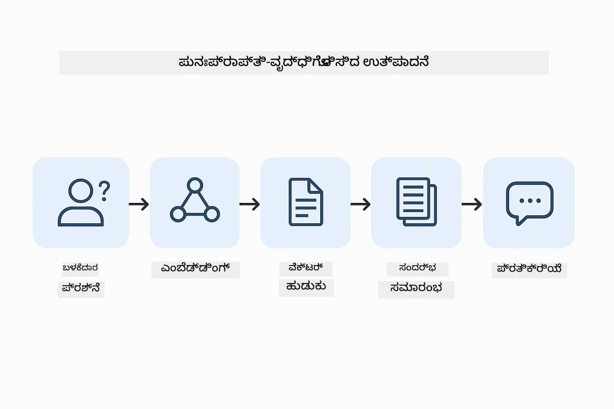

<!--
CO_OP_TRANSLATOR_METADATA:
{
  "original_hash": "f538a51cfd13147d40d84e936a0f485c",
  "translation_date": "2025-12-13T17:33:09+00:00",
  "source_file": "03-rag/README.md",
  "language_code": "kn"
}
-->
# Module 03: RAG (ಪುನಃಪ್ರಾಪ್ತಿ-ವೃದ್ಧಿಗೊಳಿಸಿದ ತಯಾರಿಕೆ)

## ವಿಷಯಗಳ ಪಟ್ಟಿಕೆ

- [ನೀವು ಕಲಿಯುವದು ಏನು](../../../03-rag)
- [ಪೂರ್ವಾಪೇಕ್ಷಿತಗಳು](../../../03-rag)
- [RAG ಅನ್ನು ಅರ್ಥಮಾಡಿಕೊಳ್ಳುವುದು](../../../03-rag)
- [ಇದು ಹೇಗೆ ಕೆಲಸ ಮಾಡುತ್ತದೆ](../../../03-rag)
  - [ದಾಖಲೆ ಪ್ರಕ್ರಿಯೆ](../../../03-rag)
  - [ಎಂಬೆಡ್ಡಿಂಗ್‌ಗಳನ್ನು ರಚಿಸುವುದು](../../../03-rag)
  - [ಅರ್ಥಪೂರ್ಣ ಹುಡುಕಾಟ](../../../03-rag)
  - [ಉತ್ತರ ತಯಾರಿಕೆ](../../../03-rag)
- [ಅಪ್ಲಿಕೇಶನ್ ಅನ್ನು ಚಾಲನೆ ಮಾಡುವುದು](../../../03-rag)
- [ಅಪ್ಲಿಕೇಶನ್ ಬಳಕೆ](../../../03-rag)
  - [ದಾಖಲೆ ಅಪ್ಲೋಡ್ ಮಾಡುವುದು](../../../03-rag)
  - [ಪ್ರಶ್ನೆಗಳು ಕೇಳುವುದು](../../../03-rag)
  - [ಮೂಲ ಉಲ್ಲೇಖಗಳನ್ನು ಪರಿಶೀಲಿಸುವುದು](../../../03-rag)
  - [ಪ್ರಶ್ನೆಗಳೊಂದಿಗೆ ಪ್ರಯೋಗ ಮಾಡುವುದು](../../../03-rag)
- [ಪ್ರಮುಖ ತತ್ವಗಳು](../../../03-rag)
  - [ಚಂಕಿಂಗ್ ತಂತ್ರ](../../../03-rag)
  - [ಸಮಾನತೆ ಅಂಕಗಳು](../../../03-rag)
  - [ಸ್ಮೃತಿ ಸಂಗ್ರಹಣೆ](../../../03-rag)
  - [ಸಂದರ್ಭ ವಿಂಡೋ ನಿರ್ವಹಣೆ](../../../03-rag)
- [ಯಾವಾಗ RAG ಮುಖ್ಯವಾಗುತ್ತದೆ](../../../03-rag)
- [ಮುಂದಿನ ಹಂತಗಳು](../../../03-rag)

## ನೀವು ಕಲಿಯುವದು ಏನು

ಹಿಂದಿನ ಮೋಡ್ಯೂಲ್‌ಗಳಲ್ಲಿ, ನೀವು AI ಜೊತೆಗೆ ಸಂಭಾಷಣೆ ನಡೆಸುವುದು ಮತ್ತು ನಿಮ್ಮ ಪ್ರಾಂಪ್ಟ್‌ಗಳನ್ನು ಪರಿಣಾಮಕಾರಿಯಾಗಿ ರಚಿಸುವುದನ್ನು ಕಲಿತಿದ್ದೀರಿ. ಆದರೆ ಒಂದು ಮೂಲಭೂತ ಮಿತಿ ಇದೆ: ಭಾಷಾ ಮಾದರಿಗಳು ತರಬೇತಿ ಸಮಯದಲ್ಲಿ ಕಲಿತದ್ದನ್ನು ಮಾತ್ರ ತಿಳಿದುಕೊಳ್ಳುತ್ತವೆ. ಅವು ನಿಮ್ಮ ಕಂಪನಿಯ ನೀತಿಗಳು, ನಿಮ್ಮ ಯೋಜನೆ ದಾಖಲೆಗಳು ಅಥವಾ ತರಬೇತಿಗೆ ಒಳಗಾಗದ ಯಾವುದೇ ಮಾಹಿತಿಯನ್ನು ಉತ್ತರಿಸಲು ಸಾಧ್ಯವಿಲ್ಲ.

RAG (ಪುನಃಪ್ರಾಪ್ತಿ-ವೃದ್ಧಿಗೊಳಿಸಿದ ತಯಾರಿಕೆ) ಈ ಸಮಸ್ಯೆಯನ್ನು ಪರಿಹರಿಸುತ್ತದೆ. ಮಾದರಿಯನ್ನು ನಿಮ್ಮ ಮಾಹಿತಿಯನ್ನು ಕಲಿಸುವ ಬದಲು (ಅದು ದುಬಾರಿ ಮತ್ತು ಅಪ್ರಾಯೋಗಿಕ), ನೀವು ಅದಕ್ಕೆ ನಿಮ್ಮ ದಾಖಲೆಗಳಲ್ಲಿ ಹುಡುಕಲು ಸಾಮರ್ಥ್ಯ ನೀಡುತ್ತೀರಿ. ಯಾರಾದರೂ ಪ್ರಶ್ನೆ ಕೇಳಿದಾಗ, ವ್ಯವಸ್ಥೆ ಸಂಬಂಧಿತ ಮಾಹಿತಿಯನ್ನು ಕಂಡು ಪ್ರಾಂಪ್ಟ್‌ಗೆ ಸೇರಿಸುತ್ತದೆ. ನಂತರ ಮಾದರಿ ಆ ಪಡೆದಿರುವ ಸಂದರ್ಭದ ಆಧಾರದ ಮೇಲೆ ಉತ್ತರ ನೀಡುತ್ತದೆ.

RAG ಅನ್ನು ಮಾದರಿಗೆ ಒಂದು ಉಲ್ಲೇಖ ಗ್ರಂಥಾಲಯ ನೀಡುವುದಾಗಿ ಭಾವಿಸಿ. ನೀವು ಪ್ರಶ್ನೆ ಕೇಳಿದಾಗ, ವ್ಯವಸ್ಥೆ:

1. **ಬಳಕೆದಾರ ಪ್ರಶ್ನೆ** - ನೀವು ಪ್ರಶ್ನೆ ಕೇಳುತ್ತೀರಿ
2. **ಎಂಬೆಡ್ಡಿಂಗ್** - ನಿಮ್ಮ ಪ್ರಶ್ನೆಯನ್ನು ವೆಕ್ಟರ್‌ಗೆ ಪರಿವರ್ತಿಸುತ್ತದೆ
3. **ವೆಕ್ಟರ್ ಹುಡುಕಾಟ** - ಸಮಾನ ದಾಖಲೆ ಚಂಕ್‌ಗಳನ್ನು ಹುಡುಕುತ್ತದೆ
4. **ಸಂದರ್ಭ ಸಂಯೋಜನೆ** - ಸಂಬಂಧಿತ ಚಂಕ್‌ಗಳನ್ನು ಪ್ರಾಂಪ್ಟ್‌ಗೆ ಸೇರಿಸುತ್ತದೆ
5. **ಪ್ರತಿಕ್ರಿಯೆ** - LLM ಆ ಸಂದರ್ಭದ ಆಧಾರದ ಮೇಲೆ ಉತ್ತರವನ್ನು ತಯಾರಿಸುತ್ತದೆ

ಇದು ಮಾದರಿಯ ಉತ್ತರಗಳನ್ನು ಅದರ ತರಬೇತಿ ಜ್ಞಾನ ಅಥವಾ ಕಲ್ಪನೆಗಳ ಮೇಲೆ ಅವಲಂಬಿಸದೆ ನಿಮ್ಮ ನಿಜವಾದ ಡೇಟಾದಲ್ಲಿ ನೆಲೆಸುವಂತೆ ಮಾಡುತ್ತದೆ.



*RAG ಕಾರ್ಯಪ್ರವಾಹ - ಬಳಕೆದಾರ ಪ್ರಶ್ನೆಯಿಂದ ಅರ್ಥಪೂರ್ಣ ಹುಡುಕಾಟ ಮತ್ತು ಸಂದರ್ಭಾತ್ಮಕ ಉತ್ತರ ತಯಾರಿಕೆ*

## ಪೂರ್ವಾಪೇಕ್ಷಿತಗಳು

- ಪೂರ್ಣಗೊಂಡ Module 01 (Azure OpenAI ಸಂಪನ್ಮೂಲಗಳು ನಿಯೋಜಿಸಲಾಗಿದೆ)
- ರೂಟ್ ಡೈರೆಕ್ಟರಿಯಲ್ಲಿ `.env` ಫೈಲ್ Azure ಪ್ರಮಾಣಪತ್ರಗಳೊಂದಿಗೆ (Module 01 ನಲ್ಲಿ `azd up` ಮೂಲಕ ರಚಿಸಲಾಗಿದೆ)

> **ಗಮನಿಸಿ:** ನೀವು Module 01 ಪೂರ್ಣಗೊಳಿಸದಿದ್ದರೆ, ಮೊದಲು ಅಲ್ಲಿ ನಿಯೋಜನೆ ಸೂಚನೆಗಳನ್ನು ಅನುಸರಿಸಿ.

## ಇದು ಹೇಗೆ ಕೆಲಸ ಮಾಡುತ್ತದೆ

**ದಾಖಲೆ ಪ್ರಕ್ರಿಯೆ** - [DocumentService.java](../../../03-rag/src/main/java/com/example/langchain4j/rag/service/DocumentService.java)

ನೀವು ಒಂದು ದಾಖಲೆ ಅಪ್ಲೋಡ್ ಮಾಡಿದಾಗ, ವ್ಯವಸ್ಥೆ ಅದನ್ನು ಚಂಕ್‌ಗಳಾಗಿ ವಿಭಜಿಸುತ್ತದೆ - ಮಾದರಿಯ ಸಂದರ್ಭ ವಿಂಡೋಗೆ ಅನುಕೂಲವಾಗುವಷ್ಟು ಸಣ್ಣ ತುಂಡುಗಳು. ಈ ಚಂಕ್‌ಗಳು ಸ್ವಲ್ಪ ಹೋಲಿಕೆ ಹೊಂದಿರುತ್ತವೆ, ಆದ್ದರಿಂದ ಗಡಿಗಳಲ್ಲಿ ಸಂದರ್ಭ ಕಳೆದುಕೊಳ್ಳುವುದಿಲ್ಲ.

```java
Document document = FileSystemDocumentLoader.loadDocument("sample-document.txt");

DocumentSplitter splitter = DocumentSplitters
    .recursive(300, 30, new OpenAiTokenizer());

List<TextSegment> segments = splitter.split(document);
```

> **🤖 [GitHub Copilot](https://github.com/features/copilot) ಚಾಟ್‌ನೊಂದಿಗೆ ಪ್ರಯತ್ನಿಸಿ:** [`DocumentService.java`](../../../03-rag/src/main/java/com/example/langchain4j/rag/service/DocumentService.java) ತೆರೆಯಿರಿ ಮತ್ತು ಕೇಳಿ:
> - "LangChain4j ದಾಖಲೆಗಳನ್ನು ಚಂಕ್‌ಗಳಾಗಿ ಹೇಗೆ ವಿಭಜಿಸುತ್ತದೆ ಮತ್ತು ಹೋಲಿಕೆ ಏಕೆ ಮುಖ್ಯ?"
> - "ವಿಭಿನ್ನ ದಾಖಲೆ ಪ್ರಕಾರಗಳಿಗೆ ಸೂಕ್ತ ಚಂಕ್ ಗಾತ್ರವೇನು ಮತ್ತು ಏಕೆ?"
> - "ಬಹುಭಾಷಾ ಅಥವಾ ವಿಶೇಷ ಸ್ವರೂಪದ ದಾಖಲೆಗಳನ್ನು ಹೇಗೆ ನಿರ್ವಹಿಸಬೇಕು?"

**ಎಂಬೆಡ್ಡಿಂಗ್‌ಗಳನ್ನು ರಚಿಸುವುದು** - [LangChainRagConfig.java](../../../03-rag/src/main/java/com/example/langchain4j/rag/config/LangChainRagConfig.java)

ಪ್ರತಿ ಚಂಕ್ ಅನ್ನು ಸಂಖ್ಯಾತ್ಮಕ ಪ್ರತಿನಿಧಾನವಾದ ಎಂಬೆಡ್ಡಿಂಗ್‌ಗೆ ಪರಿವರ್ತಿಸಲಾಗುತ್ತದೆ - ಇದು ಪಠ್ಯದ ಅರ್ಥವನ್ನು ಹಿಡಿದಿಡುವ ಗಣಿತೀಯ ಫಿಂಗರ್‌ಪ್ರಿಂಟ್. ಸಮಾನ ಪಠ್ಯವು ಸಮಾನ ಎಂಬೆಡ್ಡಿಂಗ್‌ಗಳನ್ನು ಉತ್ಪಾದಿಸುತ್ತದೆ.

```java
@Bean
public EmbeddingModel embeddingModel() {
    return OpenAiOfficialEmbeddingModel.builder()
        .baseUrl(azureOpenAiEndpoint)
        .apiKey(azureOpenAiKey)
        .modelName(azureEmbeddingDeploymentName)
        .build();
}

EmbeddingStore<TextSegment> embeddingStore = 
    new InMemoryEmbeddingStore<>();
```


*ಎಂಬೆಡ್ಡಿಂಗ್ ಸ್ಥಳದಲ್ಲಿ ವೆಕ್ಟರ್‌ಗಳಾಗಿ ಪ್ರತಿನಿಧಿಸಲಾದ ದಾಖಲೆಗಳು - ಸಮಾನ ವಿಷಯ ಗುಂಪುಗಳಾಗಿ ಸೇರಿವೆ*

**ಅರ್ಥಪೂರ್ಣ ಹುಡುಕಾಟ** - [RagService.java](../../../03-rag/src/main/java/com/example/langchain4j/rag/service/RagService.java)

ನೀವು ಪ್ರಶ್ನೆ ಕೇಳಿದಾಗ, ನಿಮ್ಮ ಪ್ರಶ್ನೆಯೂ ಎಂಬೆಡ್ಡಿಂಗ್ ಆಗುತ್ತದೆ. ವ್ಯವಸ್ಥೆ ನಿಮ್ಮ ಪ್ರಶ್ನೆಯ ಎಂಬೆಡ್ಡಿಂಗ್ ಅನ್ನು ಎಲ್ಲಾ ದಾಖಲೆ ಚಂಕ್ ಎಂಬೆಡ್ಡಿಂಗ್‌ಗಳೊಂದಿಗೆ ಹೋಲಿಸುತ್ತದೆ. ಅದು ಅರ್ಥಪೂರ್ಣ ಸಮಾನತೆ ಹೊಂದಿರುವ ಚಂಕ್‌ಗಳನ್ನು ಕಂಡುಹಿಡಿಯುತ್ತದೆ - ಕೀವರ್ಡ್‌ಗಳ ಸರಿಹೊಂದಿಕೆ ಮಾತ್ರವಲ್ಲ, ನಿಜವಾದ ಅರ್ಥಪೂರ್ಣ ಸಮಾನತೆ.

```java
Embedding queryEmbedding = embeddingModel.embed(question).content();

List<EmbeddingMatch<TextSegment>> matches = 
    embeddingStore.findRelevant(queryEmbedding, 5, 0.7);

for (EmbeddingMatch<TextSegment> match : matches) {
    String relevantText = match.embedded().text();
    double score = match.score();
}
```

> **🤖 [GitHub Copilot](https://github.com/features/copilot) ಚಾಟ್‌ನೊಂದಿಗೆ ಪ್ರಯತ್ನಿಸಿ:** [`RagService.java`](../../../03-rag/src/main/java/com/example/langchain4j/rag/service/RagService.java) ತೆರೆಯಿರಿ ಮತ್ತು ಕೇಳಿ:
> - "ಎಂಬೆಡ್ಡಿಂಗ್‌ಗಳೊಂದಿಗೆ ಸಮಾನತೆ ಹುಡುಕಾಟ ಹೇಗೆ ಕಾರ್ಯನಿರ್ವಹಿಸುತ್ತದೆ ಮತ್ತು ಅಂಕೆ ಏನು ನಿರ್ಧರಿಸುತ್ತದೆ?"
> - "ನಾನು ಯಾವ ಸಮಾನತೆ ಮಿತಿ ಬಳಸಬೇಕು ಮತ್ತು ಅದು ಫಲಿತಾಂಶಗಳನ್ನು ಹೇಗೆ ಪ್ರಭಾವಿಸುತ್ತದೆ?"
> - "ಸಂಬಂಧಿತ ದಾಖಲೆಗಳು ಸಿಗದಿದ್ದಾಗ ನಾನು ಹೇಗೆ ನಿರ್ವಹಿಸಬೇಕು?"

**ಉತ್ತರ ತಯಾರಿಕೆ** - [RagService.java](../../../03-rag/src/main/java/com/example/langchain4j/rag/service/RagService.java)

ಅತ್ಯಂತ ಸಂಬಂಧಿತ ಚಂಕ್‌ಗಳನ್ನು ಮಾದರಿಗೆ ಪ್ರಾಂಪ್ಟ್‌ನಲ್ಲಿ ಸೇರಿಸಲಾಗುತ್ತದೆ. ಮಾದರಿ ಆ ನಿರ್ದಿಷ್ಟ ಚಂಕ್‌ಗಳನ್ನು ಓದಿ ಆ ಮಾಹಿತಿಯ ಆಧಾರದ ಮೇಲೆ ನಿಮ್ಮ ಪ್ರಶ್ನೆಗೆ ಉತ್ತರ ನೀಡುತ್ತದೆ. ಇದು ಕಲ್ಪನೆ ತಪ್ಪಿಸುವಿಕೆಯನ್ನು ತಡೆಯುತ್ತದೆ - ಮಾದರಿ ಮುಂದೆ ಇರುವ ಮಾಹಿತಿಯಿಂದ ಮಾತ್ರ ಉತ್ತರ ನೀಡಬಹುದು.

## ಅಪ್ಲಿಕೇಶನ್ ಅನ್ನು ಚಾಲನೆ ಮಾಡುವುದು

**ನಿಯೋಜನೆಯನ್ನು ಪರಿಶೀಲಿಸಿ:**

ರೂಟ್ ಡೈರೆಕ್ಟರಿಯಲ್ಲಿ `.env` ಫೈಲ್ Azure ಪ್ರಮಾಣಪತ್ರಗಳೊಂದಿಗೆ ಇರುವುದನ್ನು ಖಚಿತಪಡಿಸಿಕೊಳ್ಳಿ (Module 01 ಸಮಯದಲ್ಲಿ ರಚಿಸಲಾಗಿದೆ):
```bash
cat ../.env  # AZURE_OPENAI_ENDPOINT, API_KEY, DEPLOYMENT ಅನ್ನು ತೋರಿಸಬೇಕು
```

**ಅಪ್ಲಿಕೇಶನ್ ಪ್ರಾರಂಭಿಸಿ:**

> **ಗಮನಿಸಿ:** ನೀವು Module 01 ನಿಂದ `./start-all.sh` ಬಳಸಿ ಎಲ್ಲಾ ಅಪ್ಲಿಕೇಶನ್‌ಗಳನ್ನು ಈಗಾಗಲೇ ಪ್ರಾರಂಭಿಸಿದ್ದರೆ, ಈ ಮೋಡ್ಯೂಲ್ ಈಗಾಗಲೇ 8081 ಪೋರ್ಟ್‌ನಲ್ಲಿ ಚಾಲನೆಯಲ್ಲಿ ಇದೆ. ಕೆಳಗಿನ ಪ್ರಾರಂಭ ಆಜ್ಞೆಗಳನ್ನು ಬಿಟ್ಟು http://localhost:8081 ಗೆ ನೇರವಾಗಿ ಹೋಗಬಹುದು.

**ಆಯ್ಕೆ 1: Spring Boot ಡ್ಯಾಶ್‌ಬೋರ್ಡ್ ಬಳಕೆ (VS Code ಬಳಕೆದಾರರಿಗೆ ಶಿಫಾರಸು)**

ಡೆವ್ ಕಂಟೈನರ್‌ನಲ್ಲಿ Spring Boot ಡ್ಯಾಶ್‌ಬೋರ್ಡ್ ವಿಸ್ತರಣೆ ಇದೆ, ಇದು ಎಲ್ಲಾ Spring Boot ಅಪ್ಲಿಕೇಶನ್‌ಗಳನ್ನು ನಿರ್ವಹಿಸಲು ದೃಶ್ಯಾತ್ಮಕ ಇಂಟರ್ಫೇಸ್ ಒದಗಿಸುತ್ತದೆ. ನೀವು ಅದನ್ನು VS Code ಎಡಭಾಗದ Activity Bar ನಲ್ಲಿ (Spring Boot ಐಕಾನ್ ನೋಡಿ) ಕಾಣಬಹುದು.

Spring Boot ಡ್ಯಾಶ್‌ಬೋರ್ಡ್‌ನಿಂದ ನೀವು:
- ಕಾರ್ಯಕ್ಷೇತ್ರದಲ್ಲಿನ ಎಲ್ಲಾ ಲಭ್ಯವಿರುವ Spring Boot ಅಪ್ಲಿಕೇಶನ್‌ಗಳನ್ನು ನೋಡಬಹುದು
- ಒಂದು ಕ್ಲಿಕ್‌ನಲ್ಲಿ ಅಪ್ಲಿಕೇಶನ್‌ಗಳನ್ನು ಪ್ರಾರಂಭ/ನಿಲ್ಲಿಸಬಹುದು
- ಅಪ್ಲಿಕೇಶನ್ ಲಾಗ್‌ಗಳನ್ನು ನೇರವಾಗಿ ವೀಕ್ಷಿಸಬಹುದು
- ಅಪ್ಲಿಕೇಶನ್ ಸ್ಥಿತಿಯನ್ನು ಗಮನಿಸಬಹುದು

"rag" ಪಕ್ಕದ ಪ್ಲೇ ಬಟನ್ ಕ್ಲಿಕ್ ಮಾಡಿ ಈ ಮೋಡ್ಯೂಲ್ ಪ್ರಾರಂಭಿಸಿ, ಅಥವಾ ಎಲ್ಲಾ ಮೋಡ್ಯೂಲ್‌ಗಳನ್ನು ಒಟ್ಟಿಗೆ ಪ್ರಾರಂಭಿಸಿ.


**ಆಯ್ಕೆ 2: ಶೆಲ್ ಸ್ಕ್ರಿಪ್ಟ್‌ಗಳು ಬಳಕೆ**

ಎಲ್ಲಾ ವೆಬ್ ಅಪ್ಲಿಕೇಶನ್‌ಗಳನ್ನು ಪ್ರಾರಂಭಿಸಿ (ಮೋಡ್ಯೂಲ್ 01-04):

**ಬ್ಯಾಶ್:**
```bash
cd ..  # ರೂಟ್ ಡೈರೆಕ್ಟರಿಯಿಂದ
./start-all.sh
```

**ಪವರ್‌ಶೆಲ್:**
```powershell
cd ..  # ರೂಟ್ ಡೈರೆಕ್ಟರಿಯಿಂದ
.\start-all.ps1
```

ಅಥವಾ ಈ ಮೋಡ್ಯೂಲ್ ಮಾತ್ರ ಪ್ರಾರಂಭಿಸಿ:

**ಬ್ಯಾಶ್:**
```bash
cd 03-rag
./start.sh
```

**ಪವರ್‌ಶೆಲ್:**
```powershell
cd 03-rag
.\start.ps1
```

ಎರಡೂ ಸ್ಕ್ರಿಪ್ಟ್‌ಗಳು ಸ್ವಯಂಚಾಲಿತವಾಗಿ ರೂಟ್ `.env` ಫೈಲ್‌ನಿಂದ ಪರಿಸರ ಚರಗಳನ್ನು ಲೋಡ್ ಮಾಡುತ್ತವೆ ಮತ್ತು JAR ಗಳು ಇಲ್ಲದಿದ್ದರೆ ನಿರ್ಮಿಸುತ್ತವೆ.

> **ಗಮನಿಸಿ:** ನೀವು ಪ್ರಾರಂಭಿಸುವ ಮೊದಲು ಎಲ್ಲಾ ಮೋಡ್ಯೂಲ್‌ಗಳನ್ನು ಕೈಯಿಂದ ನಿರ್ಮಿಸಲು ಇಚ್ಛಿಸಿದರೆ:
>
> **ಬ್ಯಾಶ್:**
> ```bash
> cd ..  # Go to root directory
> mvn clean package -DskipTests
> ```
>
> **ಪವರ್‌ಶೆಲ್:**
> ```powershell
> cd ..  # Go to root directory
> mvn clean package -DskipTests
> ```

ನಿಮ್ಮ ಬ್ರೌಸರ್‌ನಲ್ಲಿ http://localhost:8081 ತೆರೆಯಿರಿ.

**ನಿಲ್ಲಿಸಲು:**

**ಬ್ಯಾಶ್:**
```bash
./stop.sh  # ಈ ಮಾಯಾಜಾಲ ಮಾತ್ರ
# ಅಥವಾ
cd .. && ./stop-all.sh  # ಎಲ್ಲಾ ಮಾಯಾಜಾಲಗಳು
```

**ಪವರ್‌ಶೆಲ್:**
```powershell
.\stop.ps1  # ಈ ಮಾಯಾಜಾಲ ಮಾತ್ರ
# ಅಥವಾ
cd ..; .\stop-all.ps1  # ಎಲ್ಲಾ ಮಾಯಾಜಾಲಗಳು
```

## ಅಪ್ಲಿಕೇಶನ್ ಬಳಕೆ

ಅಪ್ಲಿಕೇಶನ್ ದಾಖಲೆ ಅಪ್ಲೋಡ್ ಮತ್ತು ಪ್ರಶ್ನೆಗಳಿಗೆ ವೆಬ್ ಇಂಟರ್ಫೇಸ್ ಒದಗಿಸುತ್ತದೆ.

<a href="images/rag-homepage.png"></a>

*RAG ಅಪ್ಲಿಕೇಶನ್ ಇಂಟರ್ಫೇಸ್ - ದಾಖಲೆಗಳನ್ನು ಅಪ್ಲೋಡ್ ಮಾಡಿ ಮತ್ತು ಪ್ರಶ್ನೆ ಕೇಳಿ*

**ದಾಖಲೆ ಅಪ್ಲೋಡ್ ಮಾಡುವುದು**

ದಾಖಲೆ ಅಪ್ಲೋಡ್ ಮಾಡುವುದರಿಂದ ಪ್ರಾರಂಭಿಸಿ - ಪರೀಕ್ಷೆಗೆ TXT ಫೈಲ್‌ಗಳು ಉತ್ತಮ. ಈ ಡೈರೆಕ್ಟರಿಯಲ್ಲಿ `sample-document.txt` ಇದೆ, ಇದು LangChain4j ವೈಶಿಷ್ಟ್ಯಗಳು, RAG ಅನುಷ್ಠಾನ ಮತ್ತು ಉತ್ತಮ ಅಭ್ಯಾಸಗಳ ಬಗ್ಗೆ ಮಾಹಿತಿಯನ್ನು ಒಳಗೊಂಡಿದೆ - ವ್ಯವಸ್ಥೆಯನ್ನು ಪರೀಕ್ಷಿಸಲು ಸೂಕ್ತವಾಗಿದೆ.

ವ್ಯವಸ್ಥೆ ನಿಮ್ಮ ದಾಖಲೆ ಪ್ರಕ್ರಿಯೆ ಮಾಡುತ್ತದೆ, ಅದನ್ನು ಚಂಕ್‌ಗಳಾಗಿ ವಿಭಜಿಸುತ್ತದೆ ಮತ್ತು ಪ್ರತಿ ಚಂಕ್‌ಗೆ ಎಂಬೆಡ್ಡಿಂಗ್‌ಗಳನ್ನು ರಚಿಸುತ್ತದೆ. ನೀವು ಅಪ್ಲೋಡ್ ಮಾಡಿದಾಗ ಇದು ಸ್ವಯಂಚಾಲಿತವಾಗಿ ನಡೆಯುತ್ತದೆ.

**ಪ್ರಶ್ನೆಗಳು ಕೇಳುವುದು**

ಈಗ ದಾಖಲೆ ವಿಷಯದ ಬಗ್ಗೆ ನಿರ್ದಿಷ್ಟ ಪ್ರಶ್ನೆಗಳನ್ನು ಕೇಳಿ. ಸ್ಪಷ್ಟವಾಗಿ ದಾಖಲೆದಲ್ಲಿ ಹೇಳಿರುವ ವಾಸ್ತವಿಕ ವಿಷಯವನ್ನು ಪ್ರಯತ್ನಿಸಿ. ವ್ಯವಸ್ಥೆ ಸಂಬಂಧಿತ ಚಂಕ್‌ಗಳನ್ನು ಹುಡುಕಿ, ಅವುಗಳನ್ನು ಪ್ರಾಂಪ್ಟ್‌ಗೆ ಸೇರಿಸಿ, ಉತ್ತರವನ್ನು ತಯಾರಿಸುತ್ತದೆ.

**ಮೂಲ ಉಲ್ಲೇಖಗಳನ್ನು ಪರಿಶೀಲಿಸುವುದು**

ಪ್ರತಿ ಉತ್ತರದಲ್ಲಿ ಮೂಲ ಉಲ್ಲೇಖಗಳು ಮತ್ತು ಸಮಾನತೆ ಅಂಕೆಗಳು ಸೇರಿವೆ. ಈ ಅಂಕೆಗಳು (0 ರಿಂದ 1) ನಿಮ್ಮ ಪ್ರಶ್ನೆಗೆ ಪ್ರತಿ ಚಂಕ್ ಎಷ್ಟು ಸಂಬಂಧಿತವೋ ತೋರಿಸುತ್ತವೆ. ಹೆಚ್ಚಿನ ಅಂಕೆಗಳು ಉತ್ತಮ ಹೊಂದಾಣಿಕೆಯನ್ನು ಸೂಚಿಸುತ್ತವೆ. ಇದರಿಂದ ನೀವು ಉತ್ತರವನ್ನು ಮೂಲ ವಸ್ತುಗಳೊಂದಿಗೆ ಪರಿಶೀಲಿಸಬಹುದು.

<a href="images/rag-query-results.png"></a>

*ಮೂಲ ಉಲ್ಲೇಖಗಳು ಮತ್ತು ಸಂಬಂಧಿತ ಅಂಕೆಗಳೊಂದಿಗೆ ಉತ್ತರವನ್ನು ತೋರಿಸುವ ಪ್ರಶ್ನೆ ಫಲಿತಾಂಶಗಳು*

**ಪ್ರಶ್ನೆಗಳೊಂದಿಗೆ ಪ್ರಯೋಗ ಮಾಡುವುದು**

ವಿಭಿನ್ನ ರೀತಿಯ ಪ್ರಶ್ನೆಗಳನ್ನು ಪ್ರಯತ್ನಿಸಿ:
- ನಿರ್ದಿಷ್ಟ ವಾಸ್ತವಗಳು: "ಮುಖ್ಯ ವಿಷಯವೇನು?"
- ಹೋಲಿಕೆಗಳು: "X ಮತ್ತು Y ನಡುವೆ ವ್ಯತ್ಯಾಸವೇನು?"
- ಸಾರಾಂಶಗಳು: "Z ಬಗ್ಗೆ ಪ್ರಮುಖ ಅಂಶಗಳನ್ನು ಸಾರಾಂಶ ಮಾಡಿ"

ನಿಮ್ಮ ಪ್ರಶ್ನೆ ದಾಖಲೆ ವಿಷಯಕ್ಕೆ ಎಷ್ಟು ಚೆನ್ನಾಗಿ ಹೊಂದಿಕೆಯಾಗುತ್ತದೆಯೋ ಆಧರಿಸಿ ಸಂಬಂಧಿತ ಅಂಕೆಗಳು ಹೇಗೆ ಬದಲಾಗುತ್ತವೆ ಎಂದು ಗಮನಿಸಿ.

## ಪ್ರಮುಖ ತತ್ವಗಳು

**ಚಂಕಿಂಗ್ ತಂತ್ರ**

ದಾಖಲೆಗಳನ್ನು 300-ಟೋಕನ್ ಚಂಕ್‌ಗಳಾಗಿ ವಿಭಜಿಸಲಾಗುತ್ತದೆ, 30 ಟೋಕನ್ ಹೋಲಿಕೆ ಇರುತ್ತದೆ. ಈ ಸಮತೋಲನವು ಪ್ರತಿ ಚಂಕ್‌ಗೆ ಅರ್ಥಪೂರ್ಣ ಸಂದರ್ಭ ನೀಡುತ್ತದೆ ಮತ್ತು ಪ್ರಾಂಪ್ಟ್‌ನಲ್ಲಿ ಹಲವಾರು ಚಂಕ್‌ಗಳನ್ನು ಸೇರಿಸಲು ಸಣ್ಣಗಾಗಿರುತ್ತದೆ.

**ಸಮಾನತೆ ಅಂಕೆಗಳು**

ಅಂಕೆಗಳು 0 ರಿಂದ 1 ರವರೆಗೆ:
- 0.7-1.0: ಅತ್ಯಂತ ಸಂಬಂಧಿತ, ನಿಖರ ಹೊಂದಾಣಿಕೆ
- 0.5-0.7: ಸಂಬಂಧಿತ, ಉತ್ತಮ ಸಂದರ್ಭ
- 0.5 ಕ್ಕಿಂತ ಕಡಿಮೆ: ಫಿಲ್ಟರ್ ಮಾಡಲಾಗಿದೆ, ತುಂಬಾ ವಿಭಿನ್ನ

ವ್ಯವಸ್ಥೆ ಗುಣಮಟ್ಟವನ್ನು ಖಚಿತಪಡಿಸಲು ಕನಿಷ್ಠ ಮಿತಿಯನ್ನು ಮೀರಿ ಇರುವ ಚಂಕ್‌ಗಳನ್ನು ಮಾತ್ರ ಪಡೆಯುತ್ತದೆ.

**ಸ್ಮೃತಿ ಸಂಗ್ರಹಣೆ**

ಈ ಮೋಡ್ಯೂಲ್ ಸರಳತೆಗೆ ಸ್ಮೃತಿ ಸಂಗ್ರಹಣೆಯನ್ನು ಬಳಸುತ್ತದೆ. ನೀವು ಅಪ್ಲಿಕೇಶನ್ ಮರುಪ್ರಾರಂಭಿಸಿದಾಗ, ಅಪ್ಲೋಡ್ ಮಾಡಿದ ದಾಖಲೆಗಳು ಕಳೆದುಹೋಗುತ್ತವೆ. ಉತ್ಪಾದನಾ ವ್ಯವಸ್ಥೆಗಳು Qdrant ಅಥವಾ Azure AI Search ಮುಂತಾದ ಸ್ಥಿರ ವೆಕ್ಟರ್ ಡೇಟಾಬೇಸ್‌ಗಳನ್ನು ಬಳಸುತ್ತವೆ.

**ಸಂದರ್ಭ ವಿಂಡೋ ನಿರ್ವಹಣೆ**

ಪ್ರತಿ ಮಾದರಿಯು ಗರಿಷ್ಠ ಸಂದರ್ಭ ವಿಂಡೋ ಹೊಂದಿದೆ. ದೊಡ್ಡ ದಾಖಲೆಗಳಿಂದ ಎಲ್ಲಾ ಚಂಕ್‌ಗಳನ್ನು ಸೇರಿಸಲು ಸಾಧ್ಯವಿಲ್ಲ. ವ್ಯವಸ್ಥೆ ಗರಿಷ್ಠ ಮಿತಿಗಳೊಳಗೆ ಉಳಿಯಲು ಅತ್ಯಂತ ಸಂಬಂಧಿತ ಟಾಪ್ N ಚಂಕ್‌ಗಳನ್ನು (ಡೀಫಾಲ್ಟ್ 5) ಪಡೆಯುತ್ತದೆ, ಸರಿಯಾದ ಉತ್ತರಗಳಿಗೆ ಸಾಕಷ್ಟು ಸಂದರ್ಭ ಒದಗಿಸುತ್ತದೆ.

## ಯಾವಾಗ RAG ಮುಖ್ಯವಾಗುತ್ತದೆ

**RAG ಅನ್ನು ಬಳಸುವುದು:**
- ಸ್ವಂತ ದಾಖಲೆಗಳ ಬಗ್ಗೆ ಪ್ರಶ್ನೆಗಳಿಗೆ ಉತ್ತರಿಸುವಾಗ
- ಮಾಹಿತಿ ತ್ವರಿತವಾಗಿ ಬದಲಾಗುವಾಗ (ನೀತಿ, ಬೆಲೆ, ವಿಶೇಷಣಗಳು)
- ನಿಖರತೆಗಾಗಿ ಮೂಲ ಉಲ್ಲೇಖ ಅಗತ್ಯವಿರುವಾಗ
- ವಿಷಯವು ಒಂದು ಪ್ರಾಂಪ್ಟ್‌ಗೆ ಸೇರಿಸಲು ತುಂಬಾ ದೊಡ್ಡದಾಗಿರುವಾಗ
- ಪರಿಶೀಲನೀಯ, ನೆಲೆಸಿದ ಉತ್ತರಗಳು ಬೇಕಾಗಿರುವಾಗ

**RAG ಅನ್ನು ಬಳಸಬೇಡಿ:**
- ಮಾದರಿಯು ಈಗಾಗಲೇ ಹೊಂದಿರುವ ಸಾಮಾನ್ಯ ಜ್ಞಾನಕ್ಕೆ ಸಂಬಂಧಿಸಿದ ಪ್ರಶ್ನೆಗಳಿಗೆ
- ನೇರ ಸಮಯದ ಡೇಟಾ ಅಗತ್ಯವಿರುವಾಗ (RAG ಅಪ್ಲೋಡ್ ಮಾಡಿದ ದಾಖಲೆಗಳ ಮೇಲೆ ಕಾರ್ಯನಿರ್ವಹಿಸುತ್ತದೆ)
- ವಿಷಯವು ಪ್ರಾಂಪ್ಟ್‌ನಲ್ಲಿ ನೇರ ಸೇರಿಸಲು ಸಾಕಷ್ಟು ಸಣ್ಣದಾಗಿರುವಾಗ

## ಮುಂದಿನ ಹಂತಗಳು

**ಮುಂದಿನ ಮೋಡ್ಯೂಲ್:** [04-tools - ಸಾಧನಗಳೊಂದಿಗೆ AI ಏಜೆಂಟ್ಸ್](../04-tools/README.md)

---

**ನಾವಿಗೇಶನ್:** [← ಹಿಂದಿನದು: Module 02 - ಪ್ರಾಂಪ್ಟ್ ಎಂಜಿನಿಯರಿಂಗ್](../02-prompt-engineering/README.md) | [ಮುಖ್ಯಕ್ಕೆ ಹಿಂತಿರುಗಿ](../README.md) | [ಮುಂದಿನದು: Module 04 - ಸಾಧನಗಳು →](../04-tools/README.md)

---

<!-- CO-OP TRANSLATOR DISCLAIMER START -->
**ಅಸ್ವೀಕರಣ**:  
ಈ ದಸ್ತಾವೇಜು AI ಅನುವಾದ ಸೇವೆ [Co-op Translator](https://github.com/Azure/co-op-translator) ಬಳಸಿ ಅನುವಾದಿಸಲಾಗಿದೆ. ನಾವು ನಿಖರತೆಯಿಗಾಗಿ ಪ್ರಯತ್ನಿಸುತ್ತಿದ್ದರೂ, ಸ್ವಯಂಚಾಲಿತ ಅನುವಾದಗಳಲ್ಲಿ ದೋಷಗಳು ಅಥವಾ ತಪ್ಪುಗಳು ಇರಬಹುದು ಎಂದು ದಯವಿಟ್ಟು ಗಮನಿಸಿ. ಮೂಲ ಭಾಷೆಯಲ್ಲಿರುವ ಮೂಲ ದಸ್ತಾವೇಜನ್ನು ಅಧಿಕೃತ ಮೂಲವಾಗಿ ಪರಿಗಣಿಸಬೇಕು. ಮಹತ್ವದ ಮಾಹಿತಿಗಾಗಿ, ವೃತ್ತಿಪರ ಮಾನವ ಅನುವಾದವನ್ನು ಶಿಫಾರಸು ಮಾಡಲಾಗುತ್ತದೆ. ಈ ಅನುವಾದ ಬಳಕೆಯಿಂದ ಉಂಟಾಗುವ ಯಾವುದೇ ತಪ್ಪು ಅರ್ಥಮಾಡಿಕೊಳ್ಳುವಿಕೆ ಅಥವಾ ತಪ್ಪು ವಿವರಣೆಗಳಿಗೆ ನಾವು ಹೊಣೆಗಾರರಾಗುವುದಿಲ್ಲ.
<!-- CO-OP TRANSLATOR DISCLAIMER END -->