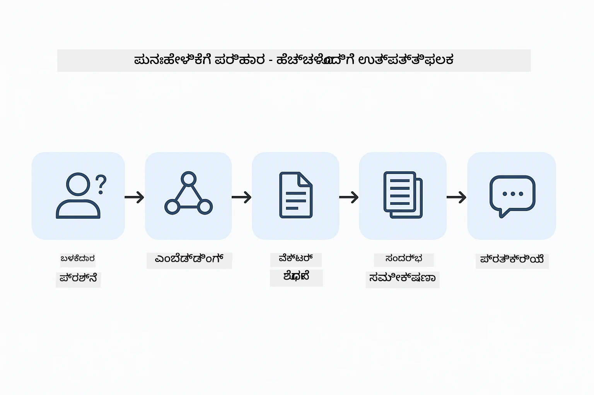
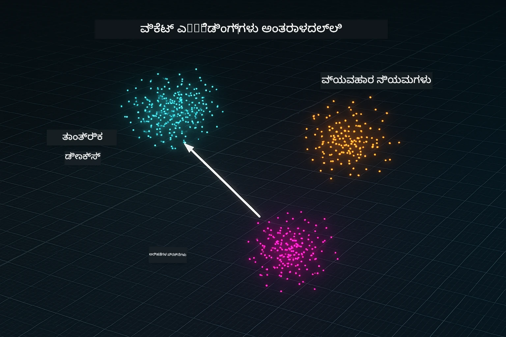
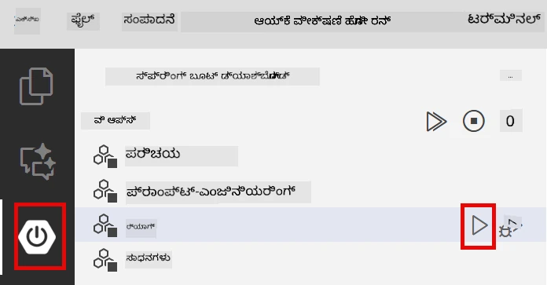
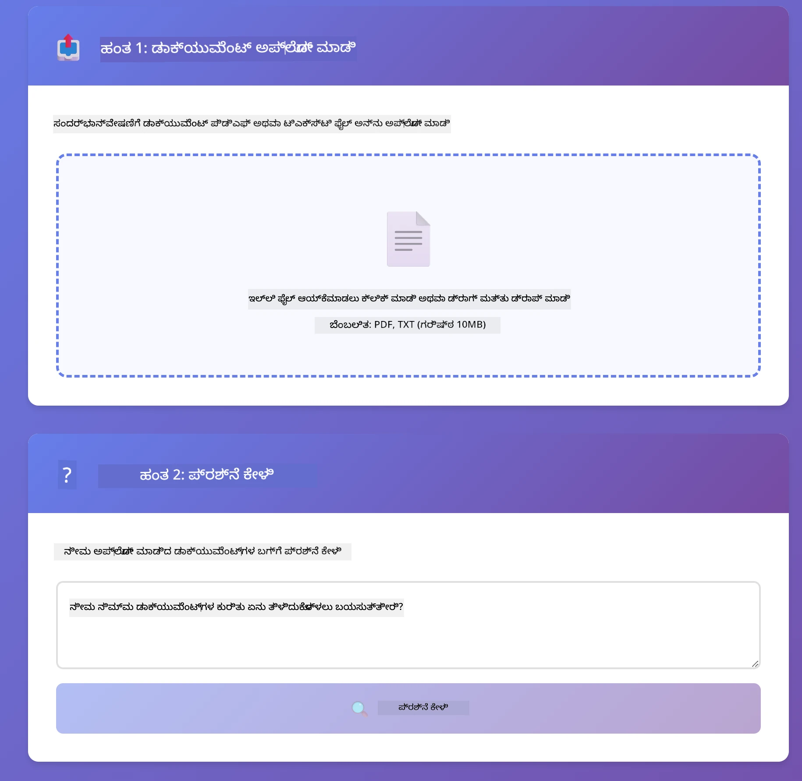
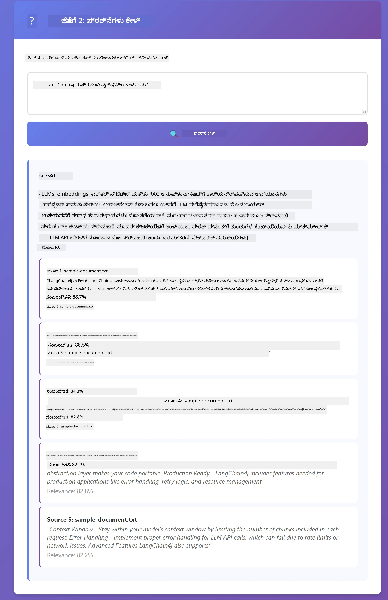

<!--
CO_OP_TRANSLATOR_METADATA:
{
  "original_hash": "81d087662fb3dd7b7124bce1a9c9ec86",
  "translation_date": "2026-01-06T02:27:59+00:00",
  "source_file": "03-rag/README.md",
  "language_code": "kn"
}
-->
# ಮೋಡ್ಯೂಲ್ 03: RAG (ರಿಟ್ರೀವಲ್-ಆಗ್ಮೆಂಟೆಡ್ ಜನರೇಷನ್)

## ವಿಷಯಗಳ ಬೆಂಗಳೂರು

- [ನೀವು ಏನು ಕಲಿಯುತ್ತೀರಾ](../../../03-rag)
- [ಹಿಂದಿನ ಅವಶ್ಯಕತೆಗಳು](../../../03-rag)
- [RAG ಅರ್ಥಮಾಡಿಕೊಳ್ಳುವಿಕೆ](../../../03-rag)
- [ಇದು ಹೇಗೆ ಕಾರ್ಯನಿರ್ವಹಿಸುತ್ತದೆ](../../../03-rag)
  - [ಡಾಕ್ಯುಮೆಂಟ್ ಪ್ರೊಸೆಸಿಂಗ್](../../../03-rag)
  - [ಎಂಬೆಡಿಂಗ್ಸ್ ಸೃಜನೆ](../../../03-rag)
  - [ಸಾಮಾನ್ಯ ಅಯ್ಕೆ](../../../03-rag)
  - [ಉತ್ತರ ತಯಾರಿಕೆ](../../../03-rag)
- [ಅಪ್ಲಿಕೇಶನ್ ಚಾಲನೆ](../../../03-rag)
- [ಅಪ್ಲಿಕೇಶನ್ ಬಳಕೆ](../../../03-rag)
  - [ಡಾಕ್ಯುಮೆಂಟ್ ಅಪ್‌ಲೋಡ್ ಮಾಡುವುದು](../../../03-rag)
  - [ಪ್ರಶ್ನೆಗಳು ಕೇಳುವುದು](../../../03-rag)
  - [ಮೂಲ ಉಲ್ಲೇಖ ಪರಿಶೀಲನೆ](../../../03-rag)
  - [ಪ್ರಶ್ನೆಗಳೊಂದಿಗೆ ಪ್ರಯೋಗ](../../../03-rag)
- [ಪ್ರಮುಖ ಸಂಪ್ರದಾಯಗಳು](../../../03-rag)
  - [ಚಂಕಿಂಗ್ ತಂತ್ರ](../../../03-rag)
  - [ಸಮಾನತೆ ಅಂಕಗಳು](../../../03-rag)
  - [ಸ್ಮರಣೆ ಸಂಗ್ರಹಣೆ](../../../03-rag)
  - [ಸಂದರ್ಭ ವಿಂಡೋ ನಿರ್ವಹಣೆ](../../../03-rag)
- [ಎಂದಿದೆ RAG ಅಗತ್ಯ](../../../03-rag)
- [ಮುಂದಿನ ಹಂತಗಳು](../../../03-rag)

## ನೀವು ಏನು ಕಲಿಯುತ್ತೀರಾ

ಹಿಂದಿನ ಮೋಡ್ಯೂಲ್‌ಗಳಲ್ಲಿ, ನೀವು एಐ ಜೊತೆಗೆ ಸಂವಾದಗಳನ್ನು ನಡೆಸುವ ಮತ್ತು ನಿಮ್ಮ ಪ್ರಾಂಪ್ಟ್‌ಗಳನ್ನು ಪರಿಣಾಮಕಾರಿಯಾಗಿ ರಚಿಸುವುದನ್ನು ಕಲಿತಿರಿ. ಆದರೆ ಮೂಲಭೂತ ಮಿತಿ ಇದೆ: ಭಾಷಾ ಮಾದರಿಗಳು ಕೇವಲ ತರಬೇತಿ ಸಮಯದಲ್ಲಿ ಕಲಿತದ್ದನ್ನು ಮಾತ್ರ ತಿಳಿವುಳ್ಳವು. ಅವು ನಿಮ್ಮ ಕಂಪನಿಯ ನೀತಿಗಳ ಕುರಿತು, ನಿಮ್ಮ ಯೋಜನೆಯ ದಾಖಲೆಗಳ ಬಗ್ಗೆ ಅಥವಾ ತರಬೇತಿ ಮಾಡದ ಯಾವುದೇ ಮಾಹಿತಿ ಕುರಿತು ಪ್ರಶ್ನೆಗಳಿಗೆ ಉತ್ತರ ನೀಡಲು ಸಾಧ್ಯವಿಲ್ಲ.

RAG (ರಿಟ್ರೀವಲ್-ಆಗ್ಮೆಂಟೆಡ್ ಜನರೇಷನ್) ಈ ಸಮಸ್ಯೆಯನ್ನು ಪರಿಹರಿಸುತ್ತದೆ. ಮಾದರಿಯನ್ನು ನಿಮ್ಮ ಮಾಹಿತಿಯನ್ನು ಕಲಿಸುವ 대신 (ಅದು ದುಬಾರಿ ಮತ್ತು ಕಾರ್ಯಕ್ಷಮತೆಗಾಗಿರುವುದಿಲ್ಲ) ನೀವು ಅದಕ್ಕೆ ನಿಮ್ಮ ಡಾಕ್ಯುಮೆಂಟ್‌ಗಳಲ್ಲಿ ಹುಡುಕಲು ಸಾಮರ್ಥ್ಯ ನೀಡುತ್ತೀರಿ. ಯಾರಾದರೂ ಪ್ರಶ್ನೆ ಕೇಳಿದಾಗ, ವ್ಯವಸ್ಥೆ ಸಂಬಂಧಿಸಿದ ಮಾಹಿತಿಯನ್ನು ಹುಡುಕಿ ಅದನ್ನು ಪ್ರಾಂಪ್ಟಿನಲ್ಲಿ ಸೇರಿಸುತ್ತದೆ. ನಂತರ ಮಾದರಿ ಅಂದಾಜಿಸಿದ ಸಂಧರ್ಭದಲ್ಲಿ ಆಧಾರಿತವಾಗಿ ಉತ್ತರ ನೀಡುತ್ತದೆ.

RAG ಅನ್ನು ಮಾದರಿಗೆ ಉಲ್ಲೇಖ ಗ್ರಂಥಾಲಯ ನೀಡುವಂತೆ ನೋಡಿ. ನೀವು ಪ್ರಶ್ನಿಸಬೇಕಾದಾಗ, ವ್ಯವಸ್ಥೆ:

1. **ಬಳಕೆದಾರ ಪ್ರಶ್ನೆ** - ನೀವು ಪ್ರಶ್ನೆಯನ್ನು ಕೇಳುತ್ತೀರಿ
2. **ಎಂಬೆಡಿಂಗ್** - ನಿಮ್ಮ ಪ್ರಶ್ನೆಯನ್ನು ಒಬ್ಬ ವೆಕ್ಟರ್‌ಗೆ ಪರಿವರ್ತಿಸುತ್ತದೆ
3. **ವೆಕ್ಟರ್ ಹುಡುಕು** - ಸಾದೃಶ ಡಾಕ್ಯುಮೆಂಟ್ ಚಂಕ್ಗಳನ್ನು ಹುಡುಕು  
4. **ಸಂದರ್ಭ ರಚನೆ** - ಸಂಬಂಧಿಸಿದ ಚಂಕ್ಗಳನ್ನು ಪ್ರಾಂಪ್ಟ್‌ಗೆ ಸೇರಿಸಿ  
5. **ಪ್ರತಿಕ್ರಿಯೆ** - LLM ಆಂದಾಜಿಸಿದ ಸಂದರ್ಭದ ಆಧಾರದ ಮೇಲೆ ಉತ್ತರ ನೀಡುತ್ತದೆ 

ಈ ಮೂಲಕ ಮಾದರಿಯ ಉತ್ತರಗಳು ಅದರ ತರಬೇತಿ ಜ್ಞಾನ ಅಥವಾ ಊಹಾಪೋಹವಿಲ್ಲದೆ ನಿಮ್ಮ ನೈಜ ಡೇಟಾವಿನ ಮೇಲೆ ನೆಲಸುತ್ತದೆ.



*RAG ಕಾರ್ಯಪ್ರವಾಹ - ಬಳಕೆದಾರ ಪ್ರಶ್ನೆಯಿಂದ ಸಾಮಾನ್ಯ ಹುಡುಕಾಟ ಮತ್ತು ಸಂದರ್ಭಾತ್ಮಕ ಉತ್ತರ ತಯಾರಿಕೆ*

## ಹಿಂದಿನ ಅವಶ್ಯಕತೆಗಳು

- ಪೂರ್ಣಗೊಂಡ ಮೋಡ್ಯೂಲ್ 01 (ಆಜೂರ್ ಓಪನ್‍ಎಐ ಸಂಪನ್ಮೂಲಗಳು ನಿಯೋಜಿಸಲಾಗಿದೆ)
- ರೂಟ್ ಡೈರೆಕ್ಟರಿಯಲ್ಲಿ `.env` ಫೈಲ್, ಆಜೂರ್ ಪ್ರಮಾಣಪತ್ರಗಳೊಂದಿಗೆ (ಮೋಡ್ಯೂಲ್ 01 ರಲ್ಲಿ `azd up` ಮೂಲಕ ಸೃಷ್ಟಿಸಲಾಗಿದೆ)

> **ಗಮನಿಸಿ:** ನೀವು ಮೋಡ್ಯೂಲ್ 01 ಪೂರ್ಣಗೊಳಿಸದಿದ್ದರೆ, ಮೊದಲಿಗೆ ಅಲ್ಲಿ ನಿಯೋಜನೆ ಸೂಚನೆಗಳನ್ನು ಅನುಸರಿಸಿ.

## ಅದು ಹೇಗೆ ಕಾರ್ಯನಿರ್ವಹಿಸುತ್ತದೆ

### ಡಾಕ್ಯುಮೆಂಟ್ ಪ್ರೊಸೆಸಿಂಗ್

[DocumentService.java](../../../03-rag/src/main/java/com/example/langchain4j/rag/service/DocumentService.java)

ನೀವು ಡಾಕ್ಯುಮೆಂಟ್ ಅಪ್‌ಲೋಡ್ ಮಾಡಿದಾಗ, ವ್ಯವಸ್ಥೆ ಅದನ್ನು ಚಂಕ್ಗಳಾಗಿ ವಿಭಜಿಸುತ್ತದೆ - ಮಾದರಿಯ ಸಂದರ್ಭ ವಿಂಡೋದಲ್ಲಿ ಸುಗಮವಾಗಿ ಹೊಂದುವ ಸಣ್ಣ ತುಂಡುಗಳು. ಈ ಚಂಕ್‌ಗಳು ಸೀಮೆಗಳಲ್ಲಿಯ ಸಹಜವಾದ ಆಸ್ಪದವನ್ನು ಕೊಂಡಿರುತ್ತವೆ ಆದರಿಂದ ನೀವು ಸಂದರ್ಭವನ್ನು ಕಳೆದುಕೊಳ್ಳುವುದಿಲ್ಲ. 

```java
Document document = FileSystemDocumentLoader.loadDocument("sample-document.txt");

DocumentSplitter splitter = DocumentSplitters
    .recursive(300, 30, new OpenAiTokenizer());

List<TextSegment> segments = splitter.split(document);
```

> **🤖 [GitHub Copilot](https://github.com/features/copilot) ಚಾಟ್ ಸಹಾಯದಿಂದ ಪ್ರಯತ್ನಿಸಿ:** [`DocumentService.java`](../../../03-rag/src/main/java/com/example/langchain4j/rag/service/DocumentService.java)ನ್ನು ತೆರೆಯಿರಿ ಮತ್ತು ಕೇಳಿ:  
> - "LangChain4j ಡಾಕ್ಯುಮೆಂಟ್‌ಗಳನ್ನು ಚಂಕ್ಗಳಾಗಿ ಹೇಗೆ ವಿಭಜಿಸುತ್ತದೆ ಮತ್ತು ಆಸ್ಪದದ ಮಹತ್ವ ಏನು?"  
> - "ಬೆರೆಗಿನ ಡಾಕ್ಯುಮೆಂಟ್ ಪ್ರಕಾರಗಳಿಗೆ ಏನು ಸೂಕ್ತ ಚಂಕ್ ಗಾತ್ರ ಮತ್ತು ಏಕೆ?"  
> - "ಬಹುಭಾಷಾ ಅಥವಾ ವಿಶೇಷ ಫಾರ್ಮ್ಯಾಟಿಂಗ್ ಇರುವ ಡಾಕ್ಯುಮೆಂಟ್‌ಗಳನ್ನು ನಾನು ಹೇಗೆ ನಿಭಾಯಿಸಬೇಕು?"

### ಎಂಬೆಡಿಂಗ್ಸ್ ಸೃಜನೆ

[LangChainRagConfig.java](../../../03-rag/src/main/java/com/example/langchain4j/rag/config/LangChainRagConfig.java)

ಪ್ರತಿ ಚಂಕ್ ಅನ್ನು ನಯವಾದ ಅಂಶ ಪ್ರತಿನಿಧಿಸುವ ಸಂಖ್ಯಾತ್ಮಕ ರೂಪಾಂತರವೆನ್ನುವ ಎಂಬೆಡಿಂಗ್ ಗೆ ಪರಿವರ್ತಿಸಲಾಗುತ್ತದೆ - ಇದು ಪಠ್ಯದ ಅರ್ಥವನ್ನು ಹಿಡಿದಿಡುವ ಗಣಿತೀಯ ಫಿಂಗರ್‌ಪ್ರಿಂಟ್. ಸಮಾನ ಪಠ್ಯವು ಸಾದೃಶ ಎಂಬೆಡಿಂಗ್‌ಗಳನ್ನು ಉತ್ಪಾದಿಸುತ್ತದೆ.

```java
@Bean
public EmbeddingModel embeddingModel() {
    return OpenAiOfficialEmbeddingModel.builder()
        .baseUrl(azureOpenAiEndpoint)
        .apiKey(azureOpenAiKey)
        .modelName(azureEmbeddingDeploymentName)
        .build();
}

EmbeddingStore<TextSegment> embeddingStore = 
    new InMemoryEmbeddingStore<>();
```



*ವ್ಯಾಖ್ಯಾನಸ್ಥಳದಲ್ಲಿ ವೆಕ್ಟರ್‌ಗಳಾಗಿ ಪ್ರತಿನಿಧಿಸಲಾದ ಡಾಕ್ಯುಮೆಂಟ್‌ಗಳು - ಸಮಾನ ವಿಷಯಗಳು ಗುಂಪಾಗಿ ಒಟ್ಟುಗೂಡಿವೆ*

### ಸಾಮಾನ್ಯ ಅಯ್ಕೆ

[RagService.java](../../../03-rag/src/main/java/com/example/langchain4j/rag/service/RagService.java)

ನೀವು ಪ್ರಶ್ನೆ ಕೇಳಿದಾಗ, ನಿಮ್ಮ ಪ್ರಶ್ನೆಯೂ ಎಂಬೆಡಿಂಗ್ ಆಗುತ್ತದೆ. ವ್ಯವಸ್ಥೆ ನಿಮ್ಮ ಪ್ರಶ್ನೆಯ ಎಂಬೆಡಿಂಗ್ ಹಾಗೂ ಎಲ್ಲಾ ಡಾಕ್ಯುಮೆಂಟ್ ಚಂಕ್ ಎಂಬೆಡಿಂಗ್‌ಗಳನ್ನು ಹೋಲಿಸುತ್ತದೆ. ಇದು ಅತ್ಯಂತ ಸಮಾನ ಅರ್ಥಗಳಿರುವ ಚಂಕ್‌ಗಳನ್ನು ಹುಡುಕುತ್ತದೆ - ಕೀಲಿಮಣೆ ಪದಗಳನ್ನು ಮಾತ್ರ ಹೊಂದಿರುವುದಿಲ್ಲ, ನಿಜವಾದ ಅರ್ಥ ಸಾದೃಶ್ಯವನ್ನು ಕಾಣುತ್ತದೆ.

```java
Embedding queryEmbedding = embeddingModel.embed(question).content();

List<EmbeddingMatch<TextSegment>> matches = 
    embeddingStore.findRelevant(queryEmbedding, 5, 0.7);

for (EmbeddingMatch<TextSegment> match : matches) {
    String relevantText = match.embedded().text();
    double score = match.score();
}
```

> **🤖 [GitHub Copilot](https://github.com/features/copilot) ಚಾಟ್ ಸಹಾಯದಿಂದ ಪ್ರಯತ್ನಿಸಿ:** [`RagService.java`](../../../03-rag/src/main/java/com/example/langchain4j/rag/service/RagService.java) ಅನ್ನು ತೆರೆಯಿರಿ ಮತ್ತು ಕೇಳಿ:  
> - "ಎಂಬೆಡಿಂಗ್‍ಗಳೊಂದಿಗೆ ಸಮಾನತೆ ಹುಡುಕಾಟ ಹೇಗೆ ಕಾರ್ಯನಿರ್ವಹಿಸುತ್ತದೆ ಮತ್ತು ಅಂಕಗಳು ಹೇಗೆ ನಿರ್ಣಯವಾಗುತ್ತವೆ?"  
> - "ಹಾಗೂ ಸಮಾನತೆ ಮಿತಿ ಯಾವುದು ಮತ್ತು ಅದು ಫಲಿತಾಂಶಗಳಿಗೆ ಹೇಗೆ ಪ್ರಭಾವ ಬೀರುತ್ತದೆ?"  
> - "ಸಂಬಂಧಿಸಿದ ಡಾಕ್ಯುಮೆಂಟ್‌ಗಳು ಕಂಡುಬರದ ಸಂದರ್ಭಗಳಲ್ಲಿ ನಾನು ಹೇಗೆ ನಿಭಾಯಿಸಬೇಕು?"

### ಉತ್ತರ ತಯಾರಿಕೆ

[RagService.java](../../../03-rag/src/main/java/com/example/langchain4j/rag/service/RagService.java)

ಅತಿ ಸಂಬಂಧಿಸಿದ ಚಂಕ್‌ಗಳು ಮಾದರಿ ಪ್ರಾಂಪ್ಟ್‌ಗೆ ಸೇರಿಸಲಾಗುತ್ತದೆ. ಮಾದರಿ ಆ ವಿಶೇಷ ಚಂಕ್‌ಗಳನ್ನು ಓದಿ ಆ ಮಾಹಿತಿಯ ಆಧಾರದ ಮೇಲೆ ನಿಮ್ಮ ಪ್ರಶ್ನೆಗೆ ಉತ್ತರ ನೀಡುತ್ತದೆ. ಇದು ಊಹಾಪೋಹ ತಪ್ಪಿಸುತ್ತದೆ - ಮಾದರಿ ಮುಂದೆ ಇರುವ ಮಾಹಿತಿಯಿಂದ ಮಾತ್ರ ಉತ್ತರಿಸಲು ಸಾಧ್ಯ.

## ಅಪ್ಲಿಕೇಶನ್ ಚಾಲನೆ

**ನಿಯೋಜನ ಪರಿಶೀಲಿಸಿ:**

ರೂಟ್ ಡೈರೆಕ್ಟರಿಯಲ್ಲಿ `.env` ಫೈಲ್ ಆಜೂರ್ ಪ್ರಮಾಣಪತ್ರಗಳೊಂದಿಗೆ ಇದ್ದದ್ದು ಖಚಿತ ಮಾಡಿ (ಮೋಡ್ಯೂಲ್ 01 ಸಮಯದಲ್ಲಿ ಸೃಷ್ಟಿಸಲಾಯಿತು):
```bash
cat ../.env  # AZURE_OPENAI_ENDPOINT, API_KEY, DEPLOYMENT ಅನ್ನು ತೋರಿಸಬೇಕು
```

**ಅಪ್ಲಿಕೇಶನ್ ಪ್ರಾರಂಭಿಸಿ:**

> **ಗಮನಿಸಿ:** ನೀವು ಮುಂಚಿತವಾಗಿ ಮೋಡ್ಯೂಲ್ 01 ರಲ್ಲಿ `./start-all.sh` ಬಳಸಿ ಎಲ್ಲ ಅಪ್ಲಿಕೇಶನ್‌ಗಳನ್ನು ಆರಂಭಿಸಿದ್ದರೆ, ಈ ಮೋಡ್ಯೂಲ್ ಈಗಾಗಲೇ ಪೋರ್ಟ್ 8081 ನಲ್ಲಿ ಚಾಲನೆಯಲ್ಲಿ ಇದೆ. ನೀವು ಕೆಳಗಿನ ಆರಂಭಿಕ ಆಜ್ಞಾನಗಳನ್ನು ಬಿಟ್ಟು http://localhost:8081 ಗೆ ನೇರವಾಗಿ ಹೋಗಬಹುದು.

**ಆಯ್ಕೆಯ 1: ಸ್ಪ್ರಿಂಗ್ ಬೂಟ್ ಡ್ಯಾಶ್‌ಬೋರ್ಡ್ ಬಳಕೆ (VS ಕೋಡ್ ಬಳಕೆದಾರರಿಗೆ ಶಿಫಾರಸು)**

ಡೆವ್ ಕಂಟೈನರ್‍ನಲ್ಲಿ ಸ್ಪ್ರಿಂಗ್ ಬೂಟ್ ಡ್ಯಾಶ್‌ಬೋರ್ಡ್ ವಿಸ್ತರಣೆಯಾಗಿದೆ, ಇದು ಸಂಪೂರ್ಣ ಸ್ಪ್ರಿಂಗ್ ಬೂಟ್ ಅಪ್ಲಿಕೇಶನ್‌ಗಳನ್ನು ದೃಶ್ಯದಂತೆ ನಿರ್ವಹಿಸಲು ಸಹಾಯ ಮಾಡುತ್ತದೆ. ಇದು VS ಕೋಡ್‌ನ ಎಡಬದಿ ಆ್ಯಕ್ಟಿವಿಟಿ ಬಾರ್‌ನಲ್ಲಿ ಸ್ಪ್ರಿಂಗ್ ಬೂಟ್ ಐಕಾನ್ ಜೊತೆ ಇರುತ್ತದೆ.

ಸ್ಪ್ರಿಂಗ್ ಬೂಟ್ ಡ್ಯಾಶ್‌ಬೋರ್ಡ್‌ನಿಂದ ನೀವು:
- ಕೆಲಸದ ಸ್ಥಳದಲ್ಲಿನ ಎಲ್ಲ ಸ್ಪ್ರಿಂಗ್ ಬೂಟ್ ಅಪ್ಲಿಕೇಶನ್‌ಗಳನ್ನೂ ನೋಡಬಹುದು  
- ಒಂದು ಕ್ಲಿಕ್‌ನಲ್ಲಿ ಅಪ್ಲಿಕೇಶನ್‍ಗಳನ್ನು ಪ್ರಾರಂಭ/ನಿಲ್ಲಿಸಬಹುದು  
- ಅಪ್ಲಿಕೇಶನ್ ಲಾಗ್‍ಗಳನ್ನು ರಿಯಲ್-ಟೈಮ್‌ನಲ್ಲಿ ನೋಡಬಹುದು  
- ಅಪ್ಲಿಕೇಶನ್ ಸ್ಥಿತಿಯನ್ನು ಮೇಲ್ವಿಚಾರಣೆ ಮಾಡಬಹುದು  

"rag" ಬٽನ್ ಪಕ್ಕದಲ್ಲಿರುವ ಪ್ಲೇ (play) ಬಟನ್ ಒತ್ತಿ ಈ ಮೋಡ್ಯೂಲ್ ಪ್ರಾರಂಭಿಸಿ, ಅಥವಾ ಎಲ್ಲ ಮೋಡ್ಯೂಲ್‌ಗಳನ್ನೂ ಒಂದೇ ಸಮಯದಲ್ಲಿ ಪ್ರಾರಂಭಿಸಿ.



**ಆಯ್ಕೆಯ 2: ಶೆಲ್ ಸ್ಕ್ರಿಪ್ಟ್‌ಗಳ ಬಳಕೆ**

ಎಲ್ಲಾ ವೆಬ್ ಅಪ್ಲಿಕೇಶನ್‌ಗಳನ್ನು ಪ್ರಾರಂಭಿಸಿ (ಮೋಡ್ಯೂಲ್ 01-04):

**ಬಾಶ್:**
```bash
cd ..  # ಮೂಲ ಡೈರೆಕ್ಟರಿಯಿಂದ
./start-all.sh
```

**ಪವರ್‌ಶೆಲ್:**
```powershell
cd ..  # ರೂಟ್ ಡೈರೆಕ್ಟರಿಯಿಂದ
.\start-all.ps1
```

ಅಥವಾ ಕೇವಲ ಈ ಮೋಡ್ಯೂಲ್ ಪ್ರಾರಂಭಿಸಿ:

**ಬಾಶ್:**
```bash
cd 03-rag
./start.sh
```

**ಪವರ್‌ಶೆಲ್:**
```powershell
cd 03-rag
.\start.ps1
```

ಎರಡು ಸ್ಕ್ರಿಪ್ಟ್‌ಗಳೂ ಆದೇಶಾತ್ಮಕವಾಗಿ ರೂಟ್ `.env` ಫೈಲ್‌ನಿಂದ ಪರಿಸರ ಸೌಲಭ್ಯಗಳನ್ನು ಲೋಡ್ ಮಾಡುತ್ತವೆ ಮತ್ತು ಜಾರ್ ಸಂಗ್ರಹಣೆಗಳಿಲ್ಲದಿದ್ದರೆ ಅವುಗಳನ್ನು ನಿರ್ಮಿಸುತ್ತವೆ.

> **ಗಮನಿಸಿ:** ನೀವು ಮೊದಲು ಎಲ್ಲಾ ಮೋಡ್ಯೂಲ್‌ಗಳನ್ನು ಕೈდანაჸಿ ನಿರ್ಮಿಸುವುದನ್ನು ಇಷ್ಟ ಪಡುತ್ತಿದ್ದರೆ ಆರಂಭಿಸುವ ಮುನ್ನ:  
>
> **ಬಾಶ್:**
> ```bash
> cd ..  # Go to root directory
> mvn clean package -DskipTests
> ```
  
> **ಪವರ್‌ಶೆಲ್:**
> ```powershell
> cd ..  # Go to root directory
> mvn clean package -DskipTests
> ```
  
ನಿಮ್ಮ ಬ್ರೌಘರ್‌ನಲ್ಲಿ http://localhost:8081 ತೆರೆದು ನೋಡಿ.

**ನಿಲ್ಲಿಸಲು:**

**ಬಾಶ್:**
```bash
./stop.sh  # ಈ ಮೋಡ್ಯೂಲ್ ಮಾತ್ರ
# ಅಥವಾ
cd .. && ./stop-all.sh  # ಎಲ್ಲಾ ಮೋಡ್ಯೂಲ್‌ಗಳು
```
  
**ಪವರ್‌ಶೆಲ್:**
```powershell
.\stop.ps1  # ಈ ಮಾಡ್ಯೂಲ್ ಮಾತ್ರ
# ಅಥವಾ
cd ..; .\stop-all.ps1  # ಎಲ್ಲಾ ಮಾಡ್ಯೂಲ್‌ಗಳು
```
  
## ಅಪ್ಲಿಕೇಶನ್ ಬಳಕೆ

ಅಪ್ಲಿಕೇಶನ್ ಡಾಕ್ಯುಮೆಂಟ್ ಅಪ್‌ಲೋಡ್ ಮತ್ತು ಪ್ರಶ್ನೆ ಮಾಡಲಿಗಾಗಿ ವೆಬ್ ಇಂಟರ್ಫೇಸ್ ನೀಡುತ್ತದೆ.

<a href="images/rag-homepage.png"></a>

*RAG ಅಪ್ಲಿಕೇಶನ್ ಇಂಟರ್ಫೇಸ್ - ಡಾಕ್ಯುಮೆಂಟ್ ಅಪ್‌ಲೋಡ್ ಮಾಡಿ ಪ್ರಶ್ನೆ ಕೇಳಿ*

### ಡಾಕ್ಯುಮೆಂಟ್ ಅಪ್‌ಲೋಡ್ ಮಾಡುವುದು

ಮೊದಲು ಡಾಕ್ಯುಮೆಂಟ್ ಅಪ್‌ಲೋಡ್ ಮಾಡುವುದು - ಪರೀಕ್ಷೆಗೆ TXT ಫೈಲ್‌ಗಳು ಉತ್ತಮ. ಈ ಡೈರೆಕ್ಟರಿಯಲ್ಲಿ `sample-document.txt` ಇದೆ, ಅದು LangChain4j ವೈಶಿಷ್ಟ್ಯಗಳು, RAG ಅನುಷ್ಠಾನ ಮತ್ತು ಉತ್ತಮ ಅಭ್ಯಾಸಗಳ ಮಾಹಿತಿ ಒಳಗೊಂಡಿದೆ - ವ್ಯವಸ್ಥೆಯ ಪರೀಕ್ಷೆಗೆ ಸಕಲ.

ವ್ಯವಸ್ಥೆ ನಿಮ್ಮ ಡಾಕ್ಯುಮೆಂಟ್ ಅನ್ನು ಸಂಸ್ಕರಿಸಿ, ಅದನ್ನು ಚಂಕ್ಗಳಾಗಿ ವಿಭಜಿಸಿ, ಮತ್ತು ಪ್ರತಿ ಚಂಕ್ ಗಾಗಿ ಎಂಬೆಡಿಂಗ್‌ಗಳನ್ನು ಸೃಜಿಸುತ್ತದೆ. ಇದನ್ನು ನೀವು ಅಪ್‌ಲೋಡ್ ಮಾಡಿದಾಗ ಸ್ವಯಂಚಾಲಿತವಾಗಿ ಮಾಡುತ್ತದೆ.

### ಪ್ರಶ್ನೆಗಳು ಕೇಳುವುದು

ಈಗ ಡಾಕ್ಯುಮೆಂಟ್ ವಿಷಯದ ಸ್ಪಷ್ಟವಾದ ಪ್ರಶ್ನೆಗಳನ್ನು ಕೇಳಿ. ಡಾಕ್ಯುಮೆಂಟ್‌ನಲ್ಲಿ ಸ್ಪಷ್ಟವಾಗಿ ಹೇಳಿದ ವಾಸ್ತವ ಮನಸ್ಸಿನ ವಿಷಯವನ್ನು ಪ್ರಯತ್ನಿಸಿ. ವ್ಯವಸ್ಥೆ ಸಂಬಂಧಿಸಿದ ಚಂಕ್‌ಗಳನ್ನು ಹುಡುಕಿ, ಅವುಗಳನ್ನು ಪ್ರಾಂಪ್ಟ್‌ಗೆ ಸೇರಿಸಿ, ಉತ್ತರ ತಯಾರಿಸುತ್ತದೆ.

### ಮೂಲ ಉಲ್ಲೇಖ ಪರಿಶೀಲನೆ

ಪ್ರತಿಯೊಂದು ಉತ್ತರದಲ್ಲಿ ಮೂಲ ಉಲ್ಲೇಖಗಳು ಸಹ ಸೇರಿವೆ ಮತ್ತು ಸಮಾನತೆ ಅಂಕಗಳನ್ನು ತೋರಿಸಲಾಗುತ್ತದೆ. ಈ ಅಂಕಗಳು (0 ರಿಂದ 1 ತನಕ) ಪ್ರಶ್ನೆಗೆ ಸಂಬಂಧಿಸಿದ ಚಂಕ್‌ಗಳ ಸಂಬಂಧಿತತೆಯನ್ನು ಸೂಚಿಸುತ್ತವೆ. ಹೆಚ್ಚಿನ ಅಂಕಗಳು ಉತ್ತಮ ಹೊಂದಾಣಿಕೆಯನ್ನು ತಿಳಿಸುತ್ತವೆ. ಇದರಿಂದ ನೀವು ಉತ್ತರವನ್ನು ಮೂಲದ ಮಾಹಿತಿಯ ವಿರುದ್ಧ ಪರಿಶೀಲಿಸಬಹುದು.

<a href="images/rag-query-results.png"></a>

*ಪ್ರಶ್ನೆಯ ಫಲಿತಾಂಶಗಳು, ಮೂಲ ಉಲ್ಲೇಖಗಳು ಹಾಗೂ ಸಂಬಂಧಿತತೆ ಅಂಕಗಳೊಂದಿಗೆ ಉತ್ತರವನ್ನು ತೋರಿಸುತ್ತದೆ*

### ಪ್ರಶ್ನೆಗಳೊಂದಿಗೆ ಪ್ರಯೋಗ

ವಿವಿಧ ರೀತಿಯ ಪ್ರಶ್ನೆಗಳನ್ನು ಪ್ರಯತ್ನಿಸಿ:
- ನಿರ್ದಿಷ್ಟ ವಾಸ್ತವಗಳು: "ಮುಖ್ಯ ವಿಷಯ ಏನು?"
- ಹೋಲಿಕೆಗಳು: "X ಮತ್ತು Y ನಡುವೆ有什么 ವ್ಯತ್ಯಾಸ ಇದೆ?"
- ಸಾರಾಂಶಗಳು: "Z ಕುರಿತು ಮುಖ್ಯ ಅಂಶಗಳನ್ನು ಸಾರಾಂಶವಾಗಿ ನೀಡಿರಿ"

ನಿಮ್ಮ ಪ್ರಶ್ನೆ ಡಾಕ್ಯುಮೆಂಟ್ ವಿಷಯದ ಎಷ್ಟು ಚೆನ್ನಾಗಿ ಹೊಂದಿಕೆ ಮಾಡುತ್ತದೆ ಆಧರಿಸಿ ಸಂಬಂಧಿತತೆ ಅಂಕಗಳು ಹೇಗೆ ಬದಲಾಗುತ್ತವೆ ಎಂದು ಗಮನಿಸಿ.

## ಪ್ರಮುಖ ಸಂಪ್ರದಾಯಗಳು

### ಚಂಕಿಂಗ್ ತಂತ್ರ

ಡಾಕ್ಯುಮೆಂಟ್‌ಗಳನ್ನು 300 ಟೋಕನ್ ಚಂಕ್‌ಗಳಾಗಿ ಮತ್ತು 30 ಟೋಕನ್ಗಳ ಸಹಾಹಿತ್ತಿನೊಂದಿಗೆ ವಿಭಜಿಸಲಾಗುತ್ತದೆ. ಈ ಸಮತೋಲನ ಪ್ರತಿ ಚಂಕ್‌ಗೆ ಅರ್ಥಪೂರ್ಣ ಸಂದರ್ಭವನ್ನು ಹೊಂದಿಸಲು ಮತ್ತು ಪ್ರಾಂಪ್ಟ್‌ನಲ್ಲಿ ಹಲವು ಚಂಕ್‌ಗಳನ್ನು ಒಳಗೊಳ್ಳಲು ಸಹಾಯಕ.

### ಸಮಾನತೆ ಅಂಕಗಳು

ಅಂಕಗಳು 0 ರಿಂದ 1 ರವರೆಗೆ ಇರುತ್ತವೆ:
- 0.7-1.0: ಅತ್ಯಂತ ಸಂಬಂಧಿತ, ನಿಖರ ಹೊಂದಿಕೆ  
- 0.5-0.7: ಸಂಬಂಧಿತ, ಉತ್ತಮ ಸಂದರ್ಭ  
- 0.5 ರ ಕೆಳಗೆ: ಫಿಲ್ಟರ್ ಮಾಡಲಾಗಿದೆ, ತುಲನೆಗೆ ಅಸಾಧಾರಣ  

ವ್ಯವಸ್ಥೆ ಕನಿಷ್ಠ ಮಿತಿ ಮೀರಿ ಇರುವ ಚಂಕ್‌ಗಳನ್ನು ಮಾತ್ರ ರಿಟ್ರೀವ್ ಮಾಡುತ್ತದೆ, ಇದು ಗುಣಮಟ್ಟವನ್ನು ಖಚಿತಪಡಿಸುತ್ತದೆ.

### ಸ್ಮರಣೆ ಸಂಗ್ರಹಣೆ

ಈ ಮೋಡ್ಯೂಲ್ ಸರಳತೆಗಾಗಿ ಸ್ಮರಣೆ ಆಧಾರಿತ ಸಂಗ್ರಹಣೆಯನ್ನು ಬಳಸುತ್ತದೆ. ನೀವು ಅಪ್ಲಿಕೇಶನ್ ಮರುಪ್ರಾರಂಭಿಸಿದಾಗ ಅಪ್‌ಲೋಡ್ ಮಾಡಿದ ಡಾಕ್ಯುಮೆಂಟ್‌ಗಳು ಕಳೆದುಕೊಂಡ ಹೋಗುತ್ತವೆ. ರೂಪಾಂತರ ವ್ಯವಸ್ಥೆಗಳು Qdrant ಅಥವಾ ಆಜೂರ್ AI ಹುಡುಕಾಟ ಮುಂತಾದ ಶಾಶ್ವತ ವೆಕ್ಟರ್ ಮಾಹಿತಿ ಸಂಗ್ರಾಮಗಳನ್ನು ಬಳಸುತ್ತವೆ.

### ಸಂದರ್ಭ ವಿಂಡೋ ನಿರ್ವಹಣೆ

ಪ್ರತಿ ಮಾದರಿಯು ಗರಿಷ್ಟ ಸಂದರ್ಭ ವಿಂಡೋ ಹೊಂದಿದ್ದದ್ದು, ದೊಡ್ಡ ಡಾಕ್ಯುಮೆಂಟ್‌ನಲ್ಲಿ ಪ್ರತಿಯೊಂದು ಚಂಕ್ ಸೇರಿಸುವುದು ಸಾಧ್ಯವಿಲ್ಲ. ವ್ಯವಸ್ಥೆ ಗರಿಷ್ಟವಾಗಿ ಸಂಬಂಧಿಸಿದ ಟಾಪ್ N (ಡೀಫಾಲ್ಟ್ 5) ಚಂಕ್‌ಗಳನ್ನು ಕಾಪಾಡುತ್ತದೆ, ಇದರಿಂದ ಸಂದರ್ಭ ನಿಯಮಗಳಲ್ಲಿ ನೆಲೆಗೊಂಡು ನಿಖರ ಉತ್ತರಗಳಿಗೆ ಸಾಕಷ್ಟು ಮಾಹಿತಿ ಒದಗಿಸುತ್ತದೆ.

## ಎಂದಿದೆ RAG ಅಗತ್ಯ

**RAG ಬಳಕೆ:**
- ಸ್ವಂತಿಕಿನ ಡಾಕ್ಯುಮೆಂಟ್‌ಗಳ ಬಗ್ಗೆ ಪ್ರಶ್ನೆಗಳಿಗೆ ಉತ್ತರಿಸುವಾಗ  
- ಮಾಹಿತಿ ಅಲೀಕಾಗಿ ಬದಲಾಗುವಾಗ (ನೀತಿ, ಬೆಲೆಗಳು, ಸ್ಪೆಸಿಫಿಕೇಶನ್)  
- ನಿಖರತೆ ಮೂಲ ಉಲ್ಲೇಖ ಅಗತ್ಯವಿರುವಾಗ  
- ವಿಷಯ ಒಂದು ಪ್ರಾಂಪ್ಟ್‌ನಲ್ಲಿ ಸೇರಿಸುವುದಕ್ಕಿಂತ ಹೆಚ್ಚು ದೊಡ್ಡದಾಗಿರುವಾಗ  
- ಪರಿಶೀಲನೀಯ, ನೆಲೆಗೊಂಡ ಉತ್ತರಗಳು ಬೇಕಾದಾಗ  

**RAG ಬಳಕೆ ಬೇಡ:**
- ಮಾದರಿಯ ಸಾಮಾನ್ಯ ಜ್ಞಾನ ಹೊಂದಿರುವ ಪ್ರಶ್ನೆಗಳಿಗೆ  
- ನವೀನ ಸಮಯದ ಡೇಟಾ ಬೇಕಾದಾಗ (RAG ಅಪ್‌ಲೋಡ್ ಮಾಡಿದ ಡಾಕ್ಯುಮೆಂಟ್ ಆಧಾರಿತ)  
- ವಿಷಯ ಪ್ರಾಂಪ್ಟ್‌ನಲ್ಲಿ ನೇರವಾಗಿ ಸೇರಿಸಲು ಸೂಕ್ತವಾಗಿರುವಾಗ  

## ಮುಂದಿನ ಹಂತಗಳು

**ಮುಂದಿನ ಮೋಡ್ಯೂಲ್:** [04-tools - ಟೂಲ್‌ಗಳೊಂದಿಗೆ AI ಏಜೆಂಟ್‌ಗಳು](../04-tools/README.md)

---

**ನಾವಿಗೇಷನ್:** [← ಹಿನ್ಯಾಸ: ಮೋಡ್ಯೂಲ್ 02 - ಪ್ರಾಂಪ್ಟ್ ಎಂಜಿನಿಯರಿಂಗ್](../02-prompt-engineering/README.md) | [ಮುಖ್ಯಕ್ಕೆ ಹಿಂದಿರುಗಿ](../README.md) | [ಮುಂದೆಗೆ: ಮೋಡ್ಯೂಲ್ 04 - ಟೂಲ್‌ಗಳು →](../04-tools/README.md)

---

<!-- CO-OP TRANSLATOR DISCLAIMER START -->
**ನಿರಸನ**:  
ಈ ದಾಖಲೆ [Co-op Translator](https://github.com/Azure/co-op-translator) ಎಂಬ AI ಅನುವಾದ ಸೇವೆಯನ್ನು ಬಳಸಿ ಅನುವಾದಿಸಲಾಗಿದೆ. ನಾವು ಸಮರ್ಥನೆಯಿಂದ ಶ್ರಮಿಸುತ್ತಿದ್ದರೂ ಸಹ, ಸ್ವಯಂಚಾಲಿತ ಅನುವಾದಗಳಲ್ಲಿ ದೋಷಗಳು ಅಥವಾ ಅಚೂಕತೆಗಳು ಇರುವ ಸಾಧ್ಯತೆ ಇದೆ. ಮೂಲ ಭಾಷೆಯಲ್ಲಿರುವ ಮೂಲ ದಾಖಲೆ ಅಧಿಕೃತ ಮೂಲವಾಗಿ ಪರಿಗಣಿಸಬೇಕಾಗಿದೆ. ಮಹತ್ವದ ಮಾಹಿತಿಗಾಗಿ, ವೃತ್ತಿಪರ ಮಾನವ ಅನುವಾದವನ್ನು ಶಿಫಾರಸು ಮಾಡಲಾಗುತ್ತದೆ. ಈ ಅನುವಾದ ಬಳಕೆಯಿಂದ ಉಂಟಾಗುವ ಯಾವುದೇ ಅಸಮಜ್ಞತೆಗಳು ಅಥವಾ ತಪ್ಪು ಮೌಲ್ಯಮಾಪನಗಳಿಗಾಗಿ ನಾವು ಹೊಣೆಗಾರರಾಗುವುದಿಲ್ಲ.
<!-- CO-OP TRANSLATOR DISCLAIMER END -->