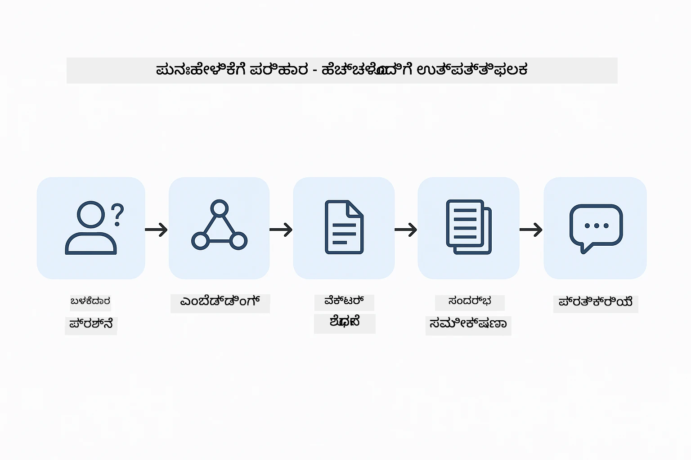
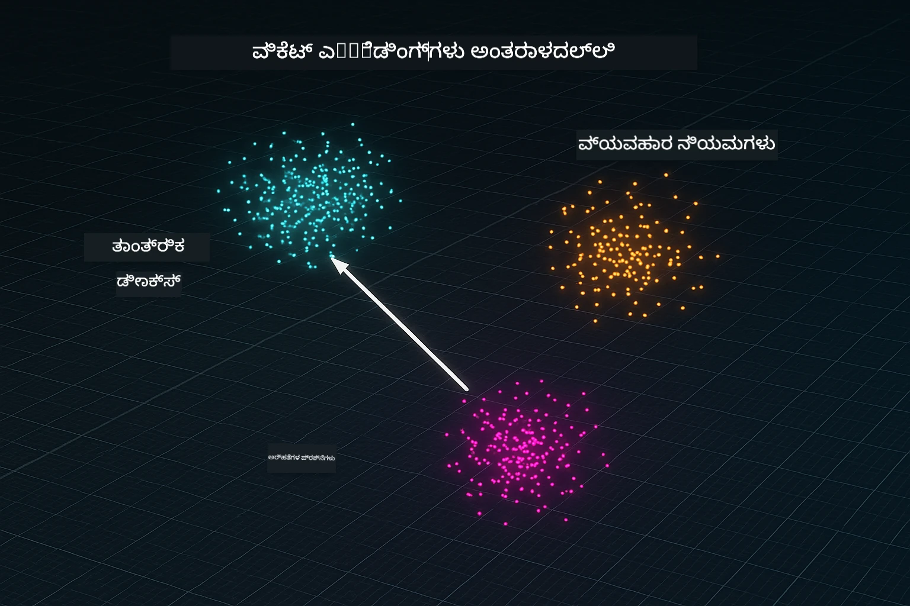
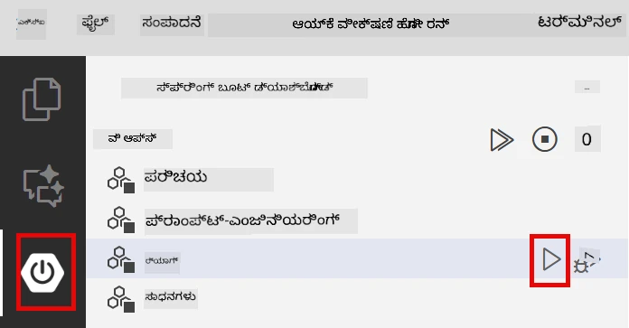
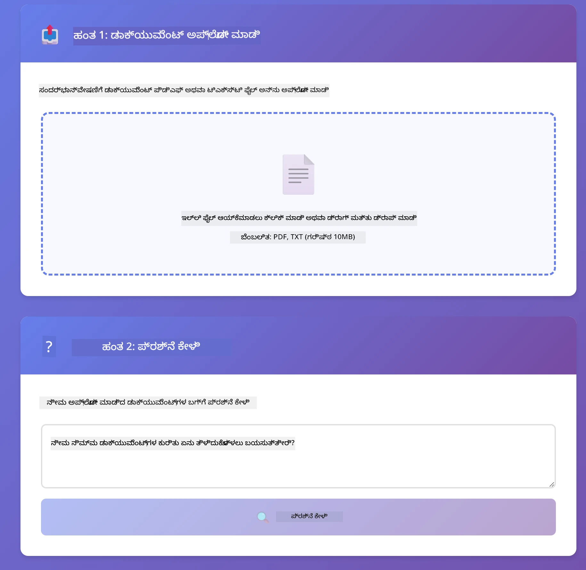
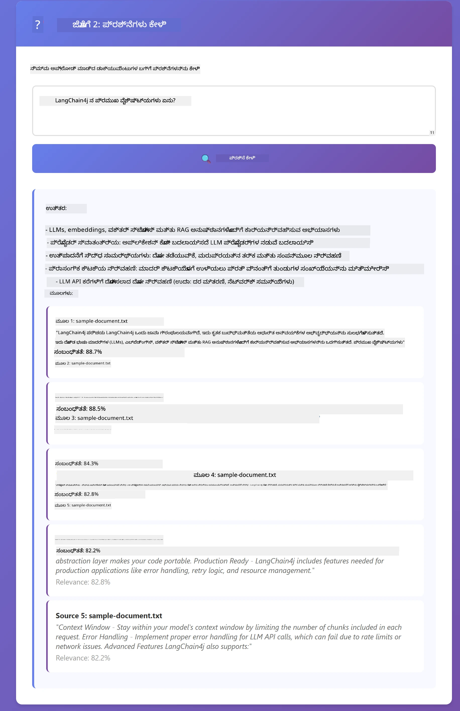

# Module 03: RAG (ಪ್ರತಿಪ್ರಾಪ್ತಿ-ಸಹಾಯಿತ ಉತ್ಪಾದನೆ)

## ವಿಷಯಗಳಪಟ್ಟಿ

- [ವಿಡಿಯೋ ಓಟ](#ವಿಡಿಯೋ-ಓಟ)
- [ನೀವು ಕಲಿಯುವುದು](#ನೀವು-ಕಲಿಯುವುದು)
- [ಮೊದಲು ಬೇಕಾಗಿರುವದು](#ಮೊದಲಿಗೆ-ಬೇಕಾಗಿರುವುದು)
- [RAG ಅನ್ನು ತಿಳಿದುಕೊಳ್ಳುವುದು](#rag-ಅನ್ನು-ತಿಳಿದುಕೊಳ್ಳುವುದು)
  - [ಈ ಟ್ಯುಟೋರಿಯಲ್ ಯಾವ RAG ವಿಧಾನವನ್ನು ಬಳಸುತ್ತದೆ?](#ಈ-ಟ್ಯುಟೋರಿಯಲ್-ಯಾವ-rag-ವಿಧಾನವನ್ನು-ಬಳಸುತ್ತದೆ)
- [ಇದು ಹೇಗೆ ಕೆಲಸ ಮಾಡುತ್ತದೆ](#ಇದು-ಹೇಗೆ-ಕೆಲಸ-ಮಾಡುತ್ತದೆ)
  - [ದಾಖಲೆ ಪ್ರಕ್ರಿಯೆ](#ಡಾಕ್ಯುಮೆಂಟ್-ಪ್ರಕ್ರಿಯೆ)
  - [ಎಂಬೆಡ್ಡಿಂಗ್ ಸೃಷ್ಟಿಸುವುದು](#ಎಂಬೆಡ್ಡಿಂಗ್-ಸೃಷ್ಠಿ)
  - [ಅರ್ಥ ಬೋಧಕ ಹುಡುಕಾಟ](#ಅರ್ಥಬೋಧಕ-ಹುಡುಕಾಟ)
  - [ಉತ್ತರ ಉತ್ಪಾದನೆ](#ಉತ್ತರ-ರಚನೆ)
- [ಅಪ್ಲಿಕೇಶನ್ ಓಡಿಸಿ](#ಅಪ್ಲಿಕೇಶನ್-ಚಾಲನೆ)
- [ಅಪ್ಲಿಕೇಶನ್ ಬಳಸುವುದು](#ಅಪ್ಲಿಕೇಶನ್-ಬಳಕೆ)
  - [ದಾಖಲೆ ಅಪ್ಲೋಡ್ ಮಾಡಲಾಗಿದೆ](#ಡಾಕ್ಯುಮೆಂಟ್-ಅಪ್ಲೋಡ್-ಮಾಡುವುದು)
  - [ಪ್ರಶ್ನೆಗಳನ್ನು ಕೇಳಿ](#ಪ್ರಶ್ನೆಗಳು-ಕೇಳಿ)
  - [ಮೂಲ ಉಲ್ಲೇಖಗಳನ್ನು ಪರಿಶೀಲಿಸಿ](#ಮೂಲ-ಸೂಚನೆಗಳನ್ನು-ಪರಿಶೀಲಿಸುವುದು)
  - [ಪ್ರಶ್ನೆಗಗಳೊಂದಿಗೆ ಪ್ರયોગ ಮಾಡಿ](#ಪ್ರಶ್ನೆಗಳಲ್ಲಿ-ಪ್ರಯೋಗ-ಮಾಡಿ)
- [ಮುಖ್ಯವಾಗಿ ತತ್ವಗಳು](#ಪ್ರಮುಖ-ಕಲ್ಪನೆಗಳು)
  - [ಚಂಕಿಂಗ್ ತಂತ್ರವಿಧಾನ](#ತುಣಕುಗಳ-ತಂತ್ರ)
  - [ಒಪಾದನೆ ಅಂಕಗಳು](#ಸಮಾನತೆ-ಅಂಕೆಗಳು)
  - [ಸ್ಮೃತಿ ಸಂಗ್ರಹಣೆ](#ಮೆಮೊರಿ-ಸಂಗ್ರಹಣೆ)
  - [ಸಂದರ್ಭ ವಿಂಡೋ ನಿರ್ವಹಣೆ](#ಸನ್ನಿವೇಶ-ಕಿಟಕಿ-ನಿರ್ವಹಣೆ)
- [ಯಾವಾಗ RAG ಮಹತ್ವವಾಗುತ್ತದೆ](#rag-ಯಾಗಿರುವ-ಸಂದರ್ಭಗಳು)
- [ಮುಂದಿನ ಹೆಜ್ಜೆಗಳು](#ಮುಂದಿನ-ಹಂತಗಳು)

## ವಿಡಿಯೋ ಓಟ

ಈ ಲೈವ್ ಸೆಷನ್ ನೋಡಿ, ಇದು ಈ ಮೊಡ್ಯೂಲ್ ಆರಂಭಿಸುವ ರೀತಿಯನ್ನು ವಿವರಿಸುತ್ತದೆ:

<a href="https://www.youtube.com/watch?v=_olq75ZH_eY"></a>

## ನೀವು ಕಲಿಯುವುದು

ಹಿಂದಿನ ಮೋಡ್ಯೂಲ್‌ಗಳಲ್ಲಿ, ನೀವು AI ಜೊತೆಗೆ ಸಂಭಾಷಣೆ ಮಾಡುವುದು ಮತ್ತು ನಿಮ್ಮ ಪ್ರಾಂಪ್ಟ್‌ಗಳನ್ನು ಪರಿಣಾಮಕಾರಿಯಾಗಿ ರಚಿಸುವುದನ್ನು ಕಲಿತಿದ್ದೀರಿ. ಆದರೆ ಇದರಲ್ಲಿ ಅಂಶಗಳ ನಿರ್ಬಂಧವಿದೆ: ಭಾಷಾ ಮಾದರಿಗಳು ತರಬೇತಿಗಾಗಿ ಕಲಿತ ವಿಷಯ ಮಾತ್ರವೇ ತಿಳಿದುಕೊಳ್ಳುತ್ತವೆ. ಅವು ನಿಮ್ಮ ಕಂಪನಿಯ ನೀತಿಗಳು, ನಿಮ್ಮ ಪ್ರಾಜೆಕ್ಟ್ ಡಾಕ್ಯುಮೆಂಟೇಶನ್ ಅಥವಾ ಅವರು ತರಬೇತಿಗೆ ಒಳಪಡದ ಯಾವುದೇ ಮಾಹಿತಿಯನ್ನು ಉತ್ತರಿಸತಕ್ಕವಿಲ್ಲ.

RAG (Retrieval-Augmented Generation - ಪ್ರತಿಪ್ರಾಪ್ತಿ ಹೆಚ್ಚಿಸಲಾದ ಉತ್ಪಾದನೆ) ಈ ಸಮಸ್ಯೆ ಪರಿಹರಿಸುತ್ತದೆ. ಮಾದರಿಯನ್ನು ನಿಮ್ಮ ಮಾಹಿತಿಯನ್ನು ಕಲಿಸುವ ಬದಲು (ಅದು ದುರ್ಗಮ ಮತ್ತು ಅಸಾಧ್ಯ), ನೀವು ಅದಕ್ಕೆ ನಿಮ್ಮ ದಾಖಲೆಗಳ ಮೂಲಕ ಹುಡುಕುವ ಸಾಮರ್ಥ್ಯವನ್ನು ನೀಡುತ್ತೀರಿ. ಯಾರಾದರೂ ಪ್ರಶ್ನೆ ಕೇಳಿದಾಗ, ವ್ಯವಸ್ಥೆ ಸಂಬಂಧಿಸಿದ ಮಾಹಿತಿಯನ್ನು ಹುಡುಕಿ ಪ್ರಾಂಪ್ಟ್‌ಗೆ ಸೇರಿಸುತ್ತದೆ. ಮಾದರಿ ನಂತರ ಆ ಪ್ರತಿಪ್ರಾಪ್ತ ಸಂಧರ್ಭವನ್ನು ಆಧರಿಸಿ ಉತ್ತರಿಸುತ್ತದೆ.

RAG ಅನ್ನು ಮಾದರಿಗೆ ಒಂದು ಉಲ್ಲೇಖ ಗ್ರಂಥಾಲಯ ನೀಡುವಂತೆ ಪರಿಗಣಿಸಿ. ನೀವು ಪ್ರಶ್ನೆ ಕೇಳಿದಾಗ, ವ್ಯವಸ್ಥೆ:

1. **ಬಳಕೆದಾರನ ಪ್ರಶ್ನೆ** - ನೀವು ಒಂದು ಪ್ರಶ್ನೆ ಕೇಳುತ್ತೀರಿ
2. **ಎಂಬೆಡ್ಡಿಂಗ್** - ನಿಮ್ಮ ಪ್ರಶ್ನೆಯನ್ನು ವೆಕ್ಟರಾಗಿ ಪರಿವರ್ತಿಸುತ್ತದೆ
3. **ವೆಕ್ಟರ್ ಹುಡುಕಾಟ** - ಸಮಾನಮಾನದ ದಸ್ತಾವೇಜು ಚುಂಕ್‌ಗಳನ್ನು ಹುಡುಕುತ್ತದೆ
4. **ಸಂದರ್ಭ ಸಂಯೋಜನೆ** - ಸಂಬಂಧಿಸಿದ ಚುಂಕ್‌ಗಳನ್ನು ಪ್ರಾಂಪ್ಟ್‌ಗೆ ಸೇರಿಸುತ್ತದೆ
5. **ಪ್ರತಿಕ್ರಿಯೆ** - LLM ಆಂದಿರಿಸುಗೆ ಆ ಸಂಧರ್ಭದ ಆಧಾರಿತ ಉತ್ತರವನ್ನು ತಯಾರಿಸುತ್ತದೆ

ಇದು ಮಾದರಿಯ ಉತ್ತರಗಳನ್ನು ಅದರ ತರಬೇತಿ ತಿಳಿವಳಿಕೆಗೆ ಭರವಸೆ ಇಡುವ ಬದಲು ನಿಮ್ಮ ನಿಜವಾದ ಡೇಟಾದ ಮೇಲೆ ನೆಲೆಸುತ್ತದೆ.

## ಮೊದಲಿಗೆ ಬೇಕಾಗಿರುವುದು

- ಪೂರ್ಣಗೊಂಡ [Module 01 - ಪರಿಚಯ](../01-introduction/README.md) (Azure OpenAI ಸಂಪನ್ಮೂಲಗಳನ್ನು ನಿಯೋಜಿಸಲಾಗಿದೆ, `text-embedding-3-small` ಎಂಬೆಡ್ಡಿಂಗ್ ಮಾದರಿಯನ್ನು ಸೇರಿಸಿ)
- ರೂಟ್ ಡೈರೆಕ್ಟರಿಯಲ್ಲಿ `.env` ಫೈಲ್ ಆಗಿರುವುದು (Module 01 ನಲ್ಲಿ `azd up` ಮೂಲಕ ರಚಿಸಲಾಗಿದೆ)

> **ಗಮನಿಸಿ:** ನೀವು Module 01 ನ ಪೂರ್ಣಗೊಳಿಸದಿದ್ದರೆ, ಮೊದಲಿಗೆ ಅಲ್ಲಿ ನೀಡಲಾದ ನಿಯೋಜನೆ ಸೂಚನೆಗಳನ್ನು ಅನುಸರಿಸಿ. `azd up` ಆಜ್ಞೆ GPT ಚಾಟ್ ಮಾದರಿ ಮತ್ತು ಈ ಮೋಡ್ಯೂಲ್ ಬಳಸುವ ಎಂಬೆಡ್ಡಿಂಗ್ ಮಾದರಿಯನ್ನು ಎರಡನ್ನೂ ನಿಯೋಜಿಸುತ್ತದೆ.

## RAG ಅನ್ನು ತಿಳಿದುಕೊಳ್ಳುವುದು

ಕೆಳಗಿನ ಚಿತ್ರವು ಮೂಲಭೂತ ವಿಚಾರವನ್ನು ವಿವರಿಸುತ್ತದೆ: ಮಾದರಿಯ ತರಬೇತಿ ದತ್ತಾಂಶದಲ್ಲಿ ಮಾತ್ರ ಅವಲಂಬಿಸುವ ಬದಲು, RAG ಪ್ರತಿ ಉತ್ತರ ತಯಾರಿಸುವ ಮೊದಲು ನಿಮ್ಮ ದಾಖಲೆಗಳ ಉಲ್ಲೇಖ ಗ್ರಂಥಾಲಯವನ್ನು ಒದಗಿಸುವುದು.


*ಈ ಚಿತ್ರವು ಕ್ರಮಬದ್ಧ LLM (ಅವು ತರಬೇತಿ ದತ್ತಾಂಶದಿಂದ ಊಹಿಸುವದು) ಮತ್ತು RAG-ಉನ್ನತಿಗೊಳ್ಳಲಾದ LLM (ಅವು ಮೊದಲು ನಿಮ್ಮ ದಸ್ತಾವೇಜುಗಳನ್ನು ಪರಾಮರ್ಶಿಸುವದು) ನಡುವಿನ ವ್ಯತ್ಯಾಸವನ್ನು ತೋರಿಸುತ್ತದೆ.*

ಈ ಭಾಗಗಳು ಹೇಗೆ ಅಂತರ್‌ಸೆಳುವಾಗಿವೆ ಎಂಬುದನ್ನು ಇಲ್ಲಿ ನೋಡೋಣ. ಬಳಕೆದಾರರ ಪ್ರಶ್ನೆ ನಾಲ್ಕು ಹಂತಗಳ ಮೂಲಕ ಹರಡುತ್ತದೆ — ಎಂಬೆಡ್ಡಿಂಗ್, ವೆಕ್ಟರ್ ಹುಡುಕಾಟ, ಸಂಧರ್ಭ ಸಂಯೋಜನೆ, ಮತ್ತು ಉತ್ತರ ಉತ್ಪಾದನೆ — ಪ್ರತಿಯೊಂದು ಹಂತ ಹಿಂದಿನ ಹಂತದ ಮೇಲೆ ನಿರ್ಮಿತವಾಗಿದೆ:



*ಈ ಚಿತ್ರವು ಅಂತಿಮ RAG ಪೈಪ್‌ಲೈನ್ ಅನ್ನು ತೋರಿಸುತ್ತದೆ — ಬಳಕೆದಾರ ಪ್ರಶ್ನೆ ಎಂಬರ್, ವೆಕ್ಟರ್ ಹುಡುಕಾಟ, ಸಂಧರ್ಭ ಸಂಯೋಜನೆ ಮತ್ತು ಉತ್ತರ ಉತ್ಪಾದನೆ ಮುಖಾಂತರ ಹರಡುತ್ತದೆ.*

ಈ ಮೋಡ್ಯೂಲ್‌ನ ಇತರ ಭಾಗವು ಪ್ರತಿ ಹಂತವನ್ನು ವಿವರವಾಗಿ ನಡಿಸಿ, ನೀವು ಓಡಿಸಿ ಮತ್ತು ಬದಲಿಸಬಹುದಾದ ಕೋಡ್ ಜೊತೆಗೆ ನೀಡುತ್ತದೆ.

### ಈ ಟ್ಯುಟೋರಿಯಲ್ ಯಾವ RAG ವಿಧಾನವನ್ನು ಬಳಸುತ್ತದೆ?

LangChain4j RAG ಅನ್ನು ಜಾರಿಗೆ ತರಲು ಮೂರು ವಿಧಾನಗಳನ್ನು ಒದಗಿಸುತ್ತದೆ, ಪ್ರತಿ ಒಂದು ವಿಭಿನ್ನ ಸಾರತನದ ಮಟ್ಟವನ್ನು ಹೊಂದಿದೆ. ಕೆಳಗಿನ ಚಿತ್ರದಲ್ಲಿ ಅವುತು ಹೋಲಿಕೆ ಮಾಡಲಾಗಿದೆ:


*ಈ ಚಿತ್ರವು LangChain4j ನಲ್ಲಿ ಇರುವ ಮೂರು RAG ವಿಧಾನಗಳನ್ನು ಹೋಲೈಸುತ್ತದೆ — ಇಸಿ, ಮೂಲ, ಹಾಗೂ ಸುಧಾರಿತ — ಅವುಗಳ ಪ್ರಮುಖ ಅಂಶಗಳು ಹಾಗೂ ಯುರಿಗಾಗಿರುವ ಸಂದರ್ಭಗಳು.*

| ವಿಧಾನ | ಇದು ಏನು ಮಾಡುತ್ತದೆ | ವ್ಯಾಪಾರ-ಆಫ್ |
|---|---|---|
| **ಇಸಿ RAG** | ಎಲ್ಲಾ ಕೆಲಸಗಳನ್ನು ಸ್ವಯಂಚಾಲಿತವಾಗಿ `AiServices` ಮತ್ತು `ContentRetriever` ಮೂಲಕ ಸಂಪರ್ಕಿಸುತ್ತದೆ. ನೀವು ಒಂದು ಇಂಟರ್‌ಫೇಸ್ ಅನ್ನು ಅಂಶಮಾಡಿ, ರಿಟ್ರೀವರ್ ಅಳವಡಿಸಿ, LangChain4j ಎಂಬೆಡ್ಡಿಂಗ್, ಹುಡುಕಾಟ ಮತ್ತು ಪ್ರಾಂಪ್ಟ್ ಸಂಯೋಜನೆಗಳನ್ನು ಹಿಂಭಾಗದಲ್ಲಿ ನಿರ್ವಹಿಸುತ್ತದೆ. | ಕನಿಷ್ಟ ಕೋಡ್, ಆದರೆ ಪ್ರತಿ ಹಂತದಲ್ಲಿ ಏನು ನಡೆಯುತ್ತಿದೆ ಅರ್ಥವಾಗುವುದಿಲ್ಲ. |
| **ಮೂಲ RAG** | ನೀವು ತಡದಿಂದ ಎಂಬೆಡ್ಡಿಂಗ್ ಮಾದರಿಯನ್ನು ಕರೆ ಮಾಡಿ, ಸ್ಟೋರ್ ಅನ್ನು ಹುಡುಕಿ, ಪ್ರಾಂಪ್ಟ್ ರಚಿಸಿ ಮತ್ತು ಉತ್ತರ ಉತ್ಪಾದನೆ ಮಾಡುತ್ತೀರಿ — ಪ್ರತಿಯೊಂದು ಹಂತವನ್ನು ಸ್ಪಷ್ಟವಾಗಿ ಕ್ರಮಬದ್ಧವಾಗಿ. | ಹೆಚ್ಚು ಕೋಡ್, ಆದರೆ ಪ್ರತಿಯೊಂದು ಹಂತವೂ ಗೋಚರವಾಗಿದ್ದು ಬದಲಾಯಿಸಲು ಸಾಧ್ಯ. |
| **ಸುಧಾರಿತ RAG** | `RetrievalAugmentor` ಫ್ರೇಮ್‌ವರ್ಕ್ ಅನ್ನು ಬಳಸಿ ಜನರಲ್-ಗ್ರೇಡ್ ಪೈಪ್‌ಲೈನ್‌ಗಳಿಗೆ ಪ್ಲಗ್ ಮಾಡಬಹುದಾದ ಪ್ರಶ್ನಾ ಪರಿವರ್ತಕರು, ರೌಟರ್ಸ್, ಮರು-ರ್ಯಾಂಕರ್ಸ್ ಮತ್ತು ವಿಷಯ ಸಂಯೋಜಕರುಗಳನ್ನು ಹೊಂದಿದೆ. | ಗರಿಷ್ಠ ವಿವರಣೆ ಮತ್ತು ಸ್ವಾತಂತ್ರ್ಯ, ಆದರೆ ಬಹುಪರಿಶ್ರಮದೊಂದಿಗೆ. |

**ಈ ಟ್ಯುಟೋರಿಯಲ್ ಮೂಲ ವಿಧಾನವನ್ನು ಬಳಸುತ್ತದೆ.** RAG ಪೈಪ್‌ಲೈನ್‌ನ ಪ್ರತಿಯೊಬ್ಬ ಹಂತ — ಪ್ರಶ್ನೆ embeddings, ವೆಕ್ಟರ್‌ಸ್ಟೋರ್ ಹುಡುಕಾಟ, ಸನ್ನಿವೇಶ ಸಂಯೋಜನೆ ಮತ್ತು ಉತ್ತರ ಉತ್ಪಾದನೆ — ಎಲ್ಲವೂ [`RagService.java`](../../../03-rag/src/main/java/com/example/langchain4j/rag/service/RagService.java) ನಲ್ಲಿ ಸ್ಪಷ್ಟವಾಗಿ ಬರೆಯಲ್ಪಟ್ಟಿವೆ. ಇದು ಉದ್ದೇಶಪೂರ್ವಕವಾಗಿದೆ: ಕಲಿಕೆಯ ಸಂಪನ್ಮೂಲವಾಗಿ ಪ್ರತಿಯೊಂದು ಹಂತವನ್ನು ನೀವು ವೀಕ್ಷಿಸಿ ಅರ್ಥಮಾಡಿಕೊಳ್ಳುವುದು ಪ್ರಮುಖ, ಕೋಡ್ ಕಡಿಮೆಗೊಳಿಸುವುದಕ್ಕಿಂತ. ಹಂತಗಳನ್ನು ಹೇಗೆ ಹೊಂದಿಸಿಕೊಳ್ಳುವುದು ತಿಳಿದ ನಂತರ, ನೀವು ತ್ವರಿತ ಪ್ರೋಟೋಟೈಪ್ಗಾಗಿ ಇಸಿ RAG ಅಥವಾ ಉತ್ಪಾದನಾ ವ್ಯವಸ್ಥೆಗಳಿಗೆ ಸುಧಾರಿತ RAG ಗೆ ಹೆಜ್ಜೆ ಹಾಕಬಹುದು.

> **💡 ಇಸಿ RAG ಬಗ್ಗೆ ಕುತೂಹಲವೇ?** LangChain4j ಇಸಿ RAG ಮಾದರಿಯನ್ನು ಸಹ ಒದಗಿಸುತ್ತದೆ, ಇಲ್ಲಿ `AiServices` ಮತ್ತು `ContentRetriever` ಎಂಬೆಡ್ಡಿಂಗ್, ಹುಡುಕಾಟ ಮತ್ತು ಪ್ರಾಂಪ್ಟ್ ಸಂಯೋಜನೆಯನ್ನು ಸ್ವಯಂಚಾಲಿತವಾಗಿ ನಿರ್ವಹಿಸುತ್ತವೆ. ಈ ಮೋಡ್ಯೂಲ್ ಸ್ಪಷ್ಟ ಹಾದಿಯನ್ನು ಅನುಸರಿಸುತ್ತದೆ — ಆ ಪೈಪ್‌ಲೈನ್ ಅನ್ನು ಪಡೆದೊಯ್ಯುತ್ತದೆ ಮತ್ತು ನೀವು ಪ್ರತಿಯೊಂದು ಹಂತವನ್ನು ನೋಡಲು ಹಾಗೂ ನಿಯಂತ್ರಿಸಲು ಸಹಾಯವಾಗುತ್ತದೆ.

ಕೆಳಗಿನ ಚಿತ್ರವು ಇಸಿ RAG ಪೈಪ್‌ಲೈನ್ ತೋರಿಸುತ್ತದೆ. `AiServices` ಮತ್ತು `EmbeddingStoreContentRetriever` ಎಲ್ಲ ಜಟಿಲತೆಯನ್ನು ಕೊನೆಯವರೆಗೂ ಗೂಪ್ತವಾಗಿಸುತ್ತದೆ — ನೀವು ಒಂದು ಡಾಕ್ಯುಮೆಂಟ್ ಲೋಡ್ ಮಾಡಿ, ರಿಟ್ರೀವರ್ ಅಳವಡಿಸಿ, ಉತ್ತರಗಳನ್ನು ಪಡೆಯುತ್ತೀರಿ. ಈ ಮೋಡ್ಯೂಲ್‌ನ ಮೂಲ ವಿಧಾನ ಆ ಎಲ್ಲಾ ಅಡಗೆ ಹಂತಗಳನ್ನು ತೆರೆದಿರುವುದು:


*ಈ ಚಿತ್ರವು ಇಸಿ RAG ಪೈಪ್‌ಲೈನ್ ತೋರಿಸುತ್ತದೆ. ಈ ಮೋಡ್ಯೂಲ್‌ನಲ್ಲಿ ಬಳಸಲಾದ ಮೂಲ ವಿಧಾನ ಜೊತೆಗೆ ಹೋಲಿಸಿ: ಇಸಿ RAG ಎಂಬೆಡ್ಡಿಂಗ್, ಪ್ರತಿಪ್ರಾಪ್ತಿ ಮತ್ತು ಪ್ರಾಂಪ್ಟ್ ಸಂಯೋಜನೆಯನ್ನು `AiServices` ಮತ್ತು `ContentRetriever` ಹಿಂದೆ ಮುಚ್ಚಿ ಇಡುತ್ತದೆ — ನೀವು ಡಾಕ್ಯುಮೆಂಟ್ ಲೋಡ್ ಮಾಡಿ, ರಿಟ್ರೀವರ್ ಅಳವಡಿಸಿ, ಉತ್ತರಗಳನ್ನು ಪಡೆಯುತ್ತೀರಿ. ಮೂಲ ವಿಧಾನದಲ್ಲಿ ಪ್ರತಿಯೊಂದು ಹಂತಗಳನ್ನು ತೆರೆಯಲಾಗುತ್ತದೆ ಮತ್ತು ನೀವು ಆ ಹಂತಗಳನ್ನು ಕರೆ ಮಾಡಿ, ಸಂಪೂರ್ಣ ನೋಟ ಮತ್ತು ನಿಯಂತ್ರಣ ಹೊಂದುತ್ತೀರಿ.*

## ಇದು ಹೇಗೆ ಕೆಲಸ ಮಾಡುತ್ತದೆ

ಈ ಮೋಡ್ಯೂಲ್‌ನ RAG ಪೈಪ್‌ಲೈನ್ ನಾಲ್ಕು ಹಂತಗಳಾಗಿ ವಿಂಗಡಿಸಲಾಗಿದೆ, ಪ್ರತಿ ಬಾರಿ ಬಳಕೆದಾರ ಪ್ರಶ್ನೆ ಕೇಳುವಾಗ ಕ್ರಮವಾಗಿ ನಡೆಯುತ್ತದೆ. ಮೊದಲು, ಅಪ್ಲೋಡ್ ಮಾಡಿದ ಡಾಕ್ಯುಮೆಂಟ್ ಅನ್ನು **ಪಾರ್ಸ್ ಮಾಡಲಾಗುತ್ತದೆ ಮತ್ತು ಚುಂಕ್ಗಳಾಗಿ ವಿಭಜಿಸಲಾಗುತ್ತದೆ** — ನಿರ್ವಹಣೀಯ ಭಾಗಗಳು. ಆ ಚುಂಕ್ಗಳನ್ನು ನಂತರ **ವೆಕ್ಟರ್ ಎಂಬೆಡ್ಡಿಂಗ್‌ಗಳಿಗೆ** ಪರಿವರ್ತಿಸಿ ಸಂಗ್ರಹಿಸಲಾಗುತ್ತದೆ, ಅಂದರೆ ಅವುಗೈಯು ವಿವರಣಾತ್ಮಕವಾಗಿ ಹೋಲಿಸಲಾಗುತ್ತದೆ. ಪ್ರಶ್ನೆ ಬಂದಾಗ, ವ್ಯವಸ್ಥೆ ಸಂಬಂಧಿಸಿದ ಚುಂಕ್‌ಗಳನ್ನು ಕಂಡುಹಿಡಿಯಲು **ಅರ್ಥ ಬೋಧಕ ಹುಡುಕಾಟ** ನೆರವನ್ನು ಒದಗಿಸುತ್ತದೆ ಮತ್ತು ಅಂತಿಮವಾಗಿ ಅವುಗಳನ್ನು LLM ಗೆ **ಉತ್ತರ ಉತ್ಪಾದನೆಗೆ** ಸನ್ನಿವೇಶವಾಗಿ ಪಾಸು ಮಾಡುತ್ತದೆ. ಕೆಳಗಿನ ವಿಭಾಗಗಳು ಪ್ರತಿ ಹಂತವನ್ನು ನಿಜವಾದ ಕೋಡ್ ಮತ್ತು ಚಿತ್ರಗಳೊಂದಿಗೆ ವಿವರಿಸುತ್ತವೆ. ಮೊದಲ ಹಂತ ನೋಡೋಣ.

### ಡಾಕ್ಯುಮೆಂಟ್ ಪ್ರಕ್ರಿಯೆ

[DocumentService.java](../../../03-rag/src/main/java/com/example/langchain4j/rag/service/DocumentService.java)

ನೀವು ಡಾಕ್ಯುಮೆಂಟ್ ಅಪ್ಲೋಡ್ ಮಾಡಿದಾಗ, ವ್ಯವಸ್ಥೆ ಅದನ್ನು (PDF ಅಥವಾ ಸರಳ ಪಠ್ಯ) ಪಾರ್ಸ್ ಮಾಡುತ್ತದೆ, ಫೈಲ್‌ನಾಮ್ ಮುಂತಾದ ಮೆಟಾಡೇಟಾವನ್ನು ಲಗತ್ತಿಸುತ್ತದೆ, ನಂತರ ಅದನ್ನು ಚುಂಕ್ಗಳಾಗಿ ವಿಭಜಿಸುತ್ತದೆ — ಮಾದರಿಯ ಸನ್ನಿವೇಶ ವಿಂಡೋಗೆ ಸೂಕ್ತವಾಗುವ ಚಿಕ್ಕ ಭಾಗಗಳು. ಈ ಚುಂಕ್‌ಗಳು ಸ್ವಲ್ಪ ತುಡಿಯುತ್ತವೆ, ಹಾಗಾಗಿ ಅಂಚುಗಳಲ್ಲಿ ಸಂಧರ್ಭ ಕಳೆದುಕೊಳ್ಳುವುದಿಲ್ಲ.

```java
// ಅಪ್ಲೋಡ್ ಮಾಡಲಾದ ಫೈಲನ್ನು ವಿಶ್ಲೇಷಿಸಿ ಮತ್ತು ಅದನ್ನು LangChain4j ಡಾಕ್ಯುಮೆಂಟ್‌ನಲ್ಲಿ ಹಿತಗೊಳಿಸಿ
Document document = Document.from(content, metadata);

// 300-ಟೋಕನ್ ತುಣುಕುಗಳಿಂದ ವಿಭಜಿಸಿ, 30-ಟೋಕನ್ ಸಹಭಾಗಿತ್ವದೊಂದಿಗೆ
DocumentSplitter splitter = DocumentSplitters
    .recursive(300, 30);

List<TextSegment> segments = splitter.split(document);
```

ಕೆಳಗಿನ ಚಿತ್ರವು ಇದನ್ನು ದೃಶ್ಯಮಾನವಾಗಿ ತೋರಿಸುತ್ತದೆ. ಪ್ರತಿ ಚುಂಕ್ ತನ್ನ ಹತ್ತಿರದ ಚುಂಕ್‌ಗಳೊಂದಿಗೆ ಕೆಲವು ಟೋಕನ್‌ಗಳನ್ನು ಹಂಚಿಕೊಳ್ಳುತ್ತದೆ — 30-ಟೋಕನ್ ತುಡಿಯುವಿಕೆ ಯಾವುದೇ ಪ್ರಮುಖ ಸಂಧರ್ಭವು ತಪ್ಪದೇ ಇರುತ್ತದೆ:


*ಈ ಚಿತ್ರವು ದಸ್ತಾವೇಜನ್ನು 300-ಟೋಕನ್ ಚುಂಕ್‌ಗಳಾಗಿ, 30-ಟೋಕನ್ ತುಡಿಯುವಿಕೆಯಿಂದ ಬಿಚ್ಚುತ್ತದೆ, ಚುಂಕ್ ಅಂಚುಗಳಲ್ಲಿ ಸಂಧರ್ಭ ರಕ್ಷಣೆ ಮಾಡುತ್ತದೆ.*

> **🤖 [GitHub Copilot](https://github.com/features/copilot) ಚಾಟ್ ಮೂಲಕ ಪ್ರಯತ್ನಿಸಿ:** [`DocumentService.java`](../../../03-rag/src/main/java/com/example/langchain4j/rag/service/DocumentService.java) ತೆರೆಯಿರಿ ಮತ್ತು ಕೇಳಿ:
> - "LangChain4j ಡಾಕ್ಯುಮೆಂಟ್‌ಗಳನ್ನು ಚುಂಕ್‌ಗಳಾಗಿ ಹೇಗೆ ವಿಭಜಿಸುತ್ತದೆ ಮತ್ತು ತುಡಿಯುವಿಕೆ ಏಕೆ ಮುಖ್ಯ?"
> - "ಬಿವಿಧ ಡಾಕ್ಯುಮೆಂಟ್ ಪ್ರಕಾರಗಳಿಗೆ ಯಾವುದು ಉತ್ಕೃಷ್ಟ ಚುಂಕ್ ಗಾತ್ರ ಮತ್ತು ಯಾಕೆ?"
> - "ಬಹುಭಾಷೆ ಅಥವಾ ವಿಶೇಷ ಸ್ವರೂಪಣೆಯ ಡಾಕ್ಯುಮೆಂಟ್‌ಗಳನ್ನು ನಾನು ಹೇಗೆ ನಿರ್ವಹಿಸಬಹುದು?"

### ಎಂಬೆಡ್ಡಿಂಗ್ ಸೃಷ್ಠಿ

[LangChainRagConfig.java](../../../03-rag/src/main/java/com/example/langchain4j/rag/config/LangChainRagConfig.java)

ಪ್ರತಿ ಚುಂಕ್ ಸಂಖ್ಯಾತ್ಮಕ ಪ್ರತಿನಿಧಾನವೊಂದು ಆಗಿ ಪರಿವರ್ತಿಸಲಾಗುತ್ತದೆ, ಅದನ್ನು ಎಂಬೆಡ್ಡಿಂಗ್ ಎಂದು ಕರೆಯಲಾಗುತ್ತದೆ — ಅರ್ಥವನ್ನು ಅಂಕೆಗಳಾಗಿ ಪರಿವರ್ತಿಸುವ ಸಾಧನ. ಎಂಬೆಡ್ಡಿಂಗ್ ಮಾದರಿ "ಚಾತುರ್ಯ" ಹೊಂದಿರುವ ಚಾಟ್ ಮಾದರಿಯಂತೆ ಅಲ್ಲ; ಅದು ಸೂಚನೆ ಅನುಸರಿಸಲು, ಯುಕ್ತಿ ಮಾಡುವುದು ಅಥವಾ ಪ್ರಶ್ನೆಗಳಿಗೆ ಉತ್ತರ ನೀಡುವುದು ಸಾಧ್ಯವಿಲ್ಲ. ಆದರೆ ಅದು ಪಠ್ಯವನ್ನು ಗಣಿತೀಯ ಜಾಗದಲ್ಲಿ ನಕ್ಷೆ ಮಾಡುತ್ತದೆ, ಅಲ್ಲಿ ಸಮಾನ ಅರ್ಥಗಳವು ಹತ್ತಿರ ಇರುವವು — "ಕಾರು" ಮತ್ತು "ಆಟೋಮೊಬೈಲ್", "ಧನ ಸರ್ಕಾರ" ಮತ್ತು "ನನ್ನ ಹಣ ಹಿಂತಿರುಗು" ಹತ್ತಿರವೇ ಇರುತ್ತವೆ. ಚಾಟ್ ಮಾದರಿಯನ್ನು ನೀವು ಮಾತನಾಡಬಲ್ಲ ವ್ಯಕ್ತಿಯಾಗಿ ಪರಿಗಣಿಸಿದರೆ, ಎಂಬೆಡ್ಡಿಂಗ್ ಮಾದರಿ ಅತ್ಯುತ್ತಮ ದಾಖಲೆ ವ್ಯವಸ್ಥೆಯಂತೆಯೇ.

ಕೆಳಗಿನ ಚಿತ್ರವು ಈ ತತ್ತ್ವವನ್ನು ದೃಶ್ಯರೂಪದಲ್ಲಿ ತೋರಿಸುತ್ತದೆ — ಪಠ್ಯ ಒಳಗೆ ಹೋಗುತ್ತದೆ, ಸಂಖ್ಯಾತ್ಮಕ ವೆಕ್ಟರ್‌ಗಳು ಹೊರಗೆ ಬರುತ್ತವೆ, ಮತ್ತು ಸಮಾನ ಅರ್ಥಗಳು ಹತ್ತಿರ ಇರುವ ವೆಕ್ಟರ್‌ಗಳನ್ನು ಉತ್ಪಾದಿಸುತ್ತವೆ:


*ಈ ಚಿತ್ರವು ಎಂಬೆಡ್ಡಿಂಗ್ ಮಾದರಿ ಪಠ್ಯವನ್ನು ಸಂಖ್ಯಾತ್ಮಕ ವೆಕ್ಟರ್‌ಗಳಾಗಿ ಪರಿವರ್ತಿಸುವ ವಿಧಾನವನ್ನು, ಮತ್ತು ಸಮಾನ ಅರ್ಥಗಳಂತೆ "ಕಾರು" ಮತ್ತು "ಆಟೋಮೊಬೈಲ್" ಹತ್ತಿರ ಇಟ್ಟುಕೊಳ್ಳುತ್ತದೆ ಎಂದು ತೋರಿಸುತ್ತದೆ.*

```java
@Bean
public EmbeddingModel embeddingModel() {
    return OpenAiOfficialEmbeddingModel.builder()
        .baseUrl(azureOpenAiEndpoint)
        .apiKey(azureOpenAiKey)
        .modelName(azureEmbeddingDeploymentName)
        .build();
}

EmbeddingStore<TextSegment> embeddingStore = 
    new InMemoryEmbeddingStore<>();
```

ಕೆಳಗಿನ ವರ್ಗ ಚಿತ್ರವು RAG ಪೈಪ್‌ಲೈನ್‌ನ ಎರಡು ಪ್ರತ್ಯೇಕ ಹರಿವನ್ನು ಮತ್ತು LangChain4j ವರ್ಗಗಳನ್ನು ತೋರಿಸುತ್ತದೆ. **ಇಂಗೆಷನ್ ಹರಿವು** (ಅಪ್ಲೋಡ್ ಸಮಯದಲ್ಲಿ ಒಂದೇ ಬಾರಿ ನಡೆಯುವದು) ಡಾಕ್ಯುಮೆಂಟ್ ಅನ್ನು ವಿಭಜಿಸಿ ಚುಂಕ್‌ಗಳನ್ನು ಎಂಬೆಡ್ಡ್ ಮಾಡಿ, ನಂತರ `.addAll()` ಮೂಲಕ ಸಂಗ್ರಹಿಸುತ್ತದೆ. **ಪ್ರಶ್ನೆ ಹರಿವು** (ಬಳಕೆದಾರರು ಪ್ರತಿಸುವಾಗ ಪ್ರತಿಯೊಮ್ಮೆ ನಡೆಯುವದು) ಪ್ರಶ್ನೆಯನ್ನು ಎಂಬೆಡ್ಡ್ ಮಾಡಿ, `.search()` ಮೂಲಕ ಹುಡುಕಿ, ಹೊಂದಿದ ಸಂಧರ್ಭವನ್ನು ಚಾಟ್ ಮಾದರಿಗೆ ಪಾಸು ಮಾಡುತ್ತದೆ. ಎರಡೂ ಹರಿವುಗಳು ಹಂಚಿಕೊಳ್ಳುವ `EmbeddingStore<TextSegment>` ಇಂಟರ್‌ಫೇಸ್‌ನಲ್ಲಿ ಸೇರುತ್ತವೆ:


*ಈ ಚಿತ್ರವು RAG ಪೈಪ್‌ಲೈನ್‌ನ ಎರಡು ಹರಿವುಗಳನ್ನು ತೋರಿಸುತ್ತದೆ — ಇಂಗೆಷನ್ ಮತ್ತು ಪ್ರಶ್ನೆ — ಮತ್ತು ಅವು ಹಂಚಿಕೊಳ್ಳುವ EmbeddingStore ಮೂಲಕ ಸಂಪರ್ಕ ಹೊಂದಿವೆ.*

ಒಮ್ಮೆ ಎಂಬೆಡ್ಡಿಂಗ್‌ಗಳನ್ನು ಸಂಗ್ರಹಿಸಿದರೆ, ಸಮಾನ ವಿಷಯಗಳು ಸ್ವಾಭಾವಿಕವಾಗಿ ವೆಕ್ಟರ್ ಜಾಗದಲ್ಲಿ ಗುಂಪು ಬದ್ಧವಾಗುತ್ತವೆ. ಕೆಳಗಿನ ದೃಶ್ಯದಲ್ಲಿ ಸಂಬಂಧಪಟ್ಟ ವಿಷಯಗಳ ಡಾಕ್ಯುಮೆಂಟ್‌ಗಳು ಹತ್ತಿರದ ಬಿಂದುಗಳಾಗಿ ಕಾಣುತ್ತಿರುವುದು, ಇದು ಅರ್ಥಬೋಧಕ ಹುಡುಕಾಟದ ಸಾಧ್ಯತೆಯನ್ನು ಸೃಷ್ಟಿಸುತ್ತದೆ:



*ಈ ದೃಶ್ಯವು ತಾಂತ್ರಿಕ ಡಾಕ್ಸ್, ವ್ಯವಹಾರ ನಿಯಮಗಳು ಮತ್ತು FAQs ಮುಂತಾದ ವಿಷಯಗಳೊಂದಿಗೆ ಸಂಬಂಧಿಸಿದ ಡಾಕ್ಯುಮೆಂಟ್‌ಗಳು 3D ವೆಕ್ಟರ್ ಜಾಗದಲ್ಲಿ ಗುಂಪು ಬದ್ಧವಾಗಿರುವುದನ್ನು ತೋರಿಸುತ್ತದೆ.*

ಬಳಕೆದಾರರು ಹುಡುಕುವಾಗ, ವ್ಯವಸ್ಥೆ ನಾಲ್ಕು ಹಂತಗಳನ್ನು ಅನುಸರಿಸುತ್ತದೆ: ಡಾಕ್ಯುಮೆಂಟ್‌ಗಳನ್ನು ಒಂದು ಬಾರಿ ಎಂಬೆಡ್ಡ್ ಮಾಡುವುದು, ಹುಡುಕಾಟದಲ್ಲಿ ಪ್ರಶ್ನೆಯನ್ನು ಎಂಬೆಡ್ಡ್ ಮಾಡುವುದು, ಪ್ರಶ್ನೆಯ ವೆಕ್ಟರ್ ಅನ್ನು ಎಲ್ಲಾ ಸಂಗ್ರಹಿತ ವೆಕ್ಟರ್‌ಗಳೊಂದಿಗೆ ಕೋಸೈನ್ ಒತ್ತಿಣಿಕೆ ಬಳಸಿ ಹೋಲಿಸುದು, ಮತ್ತು ಶೀರ್ಷಿಕೆ K ಅತ್ಯುಚ್ಛ ಅಂಕಗಳ ಚುಂಕ್‌ಗಳನ್ನು ಹಿಂತಿರುಗಿಸುವದು. ಕೆಳಗಿನ ಚಿತ್ರವು ಪ್ರತಿ ಹಂತವನ್ನು ಹಾಗೂ LangChain4j ವರ್ಗಗಳನ್ನು ವಿವರಿಸುತ್ತದೆ:


*ಈ ಚಿತ್ರವು ನಾಲ್ಕು ಹಂತಗಳ ಎಂಬೆಡ್ಡಿಂಗ್ ಹುಡುಕಾಟ ಪ್ರಕ್ರಿಯೆಯನ್ನು ತೋರಿಸುತ್ತದೆ: ಡಾಕ್ಯುಮೆಂಟ್‌ಗಳನ್ನು ಎಂಬೆಡ್ಡ್ ಮಾಡುವುದು, ಪ್ರಶ್ನೆಯನ್ನು ಎಂಬೆಡ್ಡ್ ಮಾಡುವುದು, ಕೋಸೈನ್ ಸಾಮ್ಯತೆ ಮೂಲಕ ವೆಕ್ಟರ್‌ಗಳನ್ನು ಹೋಲಿಸುವುದು, ಮತ್ತು ಶ್ರೇಷ್ಟ K ಫಲಿತಾಂಶಗಳನ್ನು ಹಿಂತಿರುಗಿಸುವುದು.*

### ಅರ್ಥಬೋಧಕ ಹುಡುಕಾಟ

[RagService.java](../../../03-rag/src/main/java/com/example/langchain4j/rag/service/RagService.java)

ನೀವು ಪ್ರಶ್ನೆ ಕೇಳಿದಾಗ, ನಿಮ್ಮ ಪ್ರಶ್ನೆಯು ಕೂಡ ಒಂದು ಎಂಬೆಡ್ಡಿಂಗ್ ಆಗುತ್ತದೆ. ವ್ಯವಸ್ಥೆ ನಿಮ್ಮ ಪ್ರಶ್ನೆಯ ಎಂಬೆಡ್ಡಿಂಗ್ ಅನ್ನು ಎಲ್ಲಾ ಡಾಕ್ಯುಮೆಂಟ್ ಚುಂಕ್ ಎಂಬೆಡ್ಡಿಂಗ್‌ಗಳ ಎದುರಾಗಿ ಹೋಲಿಸುತ್ತದೆ. ಅದು ಅರ್ಥದಲ್ಲಿ ಸಮಾನವಾದ ಚುಂಕ್‌ಗಳನ್ನು ಹುಡುಕುತ್ತದೆ - ಕೀವರ್ಡ್ ನುಡಿಗಳು ಮಾತ್ರವಲ್ಲ, ಸಂಪೂರ್ಣ ಅರ್ಥಸಮಾನತೆಯ ಮೇಲೆ.

```java
Embedding queryEmbedding = embeddingModel.embed(question).content();

EmbeddingSearchRequest searchRequest = EmbeddingSearchRequest.builder()
    .queryEmbedding(queryEmbedding)
    .maxResults(5)
    .minScore(0.5)
    .build();

EmbeddingSearchResult<TextSegment> searchResult = embeddingStore.search(searchRequest);
List<EmbeddingMatch<TextSegment>> matches = searchResult.matches();

for (EmbeddingMatch<TextSegment> match : matches) {
    String relevantText = match.embedded().text();
    double score = match.score();
}
```

ಕೆಳಗಿನ ಚಿತ್ರವು ಅರ್ಥಬೋಧಕ ಹುಡುಕಾಟವನ್ನು ಶ್ರೇಣಿಪದ ನೇಹಸಿ-ಹುಡುಕಾಟದೊಂದಿಗೆ ಹೋಲಿಸುತ್ತದೆ. "ವಾಹನ" ಒ关键词 ಹುಡುಕಾಟವು "ಕಾರ್ ಮತ್ತು ಟ್ರಕ್" ಬಗ್ಗೆ ಒಂದು ಚುಂಕ್ ತಪ್ಪಿಸುತ್ತದೆ, ಆದರೆ ಅರ್ಥಬೋಧಕ ಹುಡುಕಾಟ ಅವು ಸಮಾನವೆಂದು ಅರಿತು ಅದನ್ನು ಉತ್ತಮ ಆಂಕೆಯೊಂದಿಗೆ ವಿಷಯವಾಗಿ ಕರೆಸಿಕೊಳ್ಳುತ್ತದೆ:


*ಈ ಚಿತ್ರವು ಕೀವರ್ಡ್ ಆಧಾರಿತ ಹುಡುಕಾಟ ಮತ್ತು ಅರ್ಥಬೋಧಕ ಹುಡುಕಾಟವನ್ನು ಹೋಲಿಸುತ್ತದೆ, ಅರ್ಥಬೋಧಕ ಹುಡುಕಾಟವು ನಿಖರ ಕೀವರ್ಡ್ ಬೇಧವು ಇರುವಾಗಲೂ ತತ್ವಪೂರ್ಣವಾಗಿ ಸಂಬಂಧಿಸಿದ ವಿಷಯವನ್ನು ಪಡೆಯುತ್ತದೆ ಎಂದು ತೋರಿಸುತ್ತದೆ.*

ಕೆಳಮನೆ, ಸಾಮ್ಯತೆಯನ್ನು ಕೋಸೈನ್ ಸಮಾನತೆ ಮೂಲಕ ಅಳೆಯಲಾಗುತ್ತದೆ — ಅಂದರೆ "ಈ ಎರಡು ಬಾಣಗಳು ಒಂದೇ ದಿಕ್ಕಿನಲ್ಲಿ ಸೂಚಿಸುತ್ತಿವೆಯಾ?" ಎಂದು ಪ್ರಶ್ನಿಸುವಂತೆ. ಎರಡು ಚುಂಕ್ಗಳು ಸಂಪೂರ್ಣ ವಿಭಿನ್ನ ಪದಗಳನ್ನು ಬಳಸಬಹುದು, ಆದರೆ ಅವು ಒಂದೇ ಅರ್ಥ ಹೊಂದಿದ್ದರೆ ಅವುಗಳ ವೆಕ್ಟರ್‌ಗಳು ಒಂದೇ ದಿಕ್ಕಿನಲ್ಲಿ ನಿಲುಕುತ್ತವೆ ಮತ್ತು 1.0 ಕ್ಕೂ ಸಮೀಪ ಅಂಕೆಯನ್ನು ಪಡೆಯುತ್ತವೆ:


*ಈ ರೇಖಾಚಿತ್ರವು ಆಂಬೆಡ್ಡಿಂಗ್ ವೆಕ್ಟರ್‌ಗಳ ಮಧ್ಯದಲ್ಲಿನ ಕೋಸೈನ್ ಸಮಾನತೆಯನ್ನು ಕೋನವಾಗಿ ತೋರಿಸುತ್ತದೆ — ಹೆಚ್ಚು ಅನುರಂಜಿತ ವೆಕ್ಟರ್‌ಗಳು 1.0 ಗೆ ಹತ್ತಿರದ ಅಂಕೆಯನ್ನು ಪಡೆಯುತ್ತವೆ, ಇದು ಹೆಚ್ಚು ಅರ್ಥಪೂರ್ಣ ಸಮಾನತೆಯನ್ನು ಸೂಚಿಸುತ್ತದೆ.*

> **🤖 [GitHub Copilot](https://github.com/features/copilot) ಚಾಟ್‌ನೊಂದಿಗೆ ಪ್ರಯತ್ನಿಸಿ:** [`RagService.java`](../../../03-rag/src/main/java/com/example/langchain4j/rag/service/RagService.java) ಅನ್ನು ತೆರೆಯಿರಿ ಮತ್ತು ಕೇಳಿ:
> - "ಆಂಬೆಡ್ಡಿಂಗ್‌ಗಳೊಂದಿಗೆ ಸಮಾನತೆ ಹುಡುಕಾಟ ಹೇಗೆ ಕಾರ್ಯನಿರ್ವಹಿಸುತ್ತದೆ ಮತ್ತು ಅಂಕೆಯನ್ನು ಏನು ನಿರ್ಣಯಿಸುತ್ತದೆ?"
> - "ಯಾವ ಸಮಾನತೆ ತಟಸ್ಥತೆ ನಾನು ಬಳಸಬೇಕು ಮತ್ತು ಅದು ಫಲಿತಾಂಶಗಳಿಗೆ ಹೇಗೆ ಪ್ರಭಾವ ಬೀರುವದು?"
> - "ಯಾವುದೇ ಸಂಬಂಧಿಸಿದ ದಾಖಲೆಗಳು ಕಂಡುಬರುವಿಲ್ಲದ ಸಂದರ್ಭಗಳಲ್ಲಿ ನಾನು ಹೇಗೆ ಕೈಗಾರಿಕೆಗೆ ಬರುವುದು?"

### ಉತ್ತರ ರಚನೆ

[RagService.java](../../../03-rag/src/main/java/com/example/langchain4j/rag/service/RagService.java)

ಅತ್ಯಂತ ಸಂಬಂಧಿಸಿದ ತುಣುಕುಗಳನ್ನು ಒಂದು ಸಂರಚಿತ ಪ್ರಾಂಪ್ಟ್‌ನಲ್ಲಿ ಜೋಡಿಸಲಾಗುತ್ತದೆ, ಇದರಲ್ಲಿ ಸ್ಪಷ್ಟ ಸೂಚನೆಗಳು, ಪಡೆದುಕೊಂಡ ಸಂಧರ್ಭ ಮತ್ತು ಬಳಕೆದಾರರ ಪ್ರಶ್ನೆ ಸೇರಿರುತ್ತವೆ. ಮಾದರಿ ಆ ತುಣುಕುಗಳನ್ನು ಓದುತ್ತದೆ ಮತ್ತು ಆ ಮಾಹಿತಿಯ ಆಧಾರದಲ್ಲಿ ಉತ್ತರ ನೀಡುತ್ತದೆ — ಅದು ಎದುರುನಿದ್ದವಷ್ಟೇ ಬಳಸಲು ಸಾಧ್ಯ, ಹಾಳು ಕಲ್ಪನೆಗಳನ್ನು ತಡೆಗಟ್ಟುತ್ತದೆ.

```java
String context = matches.stream()
    .map(match -> match.embedded().text())
    .collect(Collectors.joining("\n\n"));

String prompt = String.format("""
    Answer the question based on the following context.
    If the answer cannot be found in the context, say so.

    Context:
    %s

    Question: %s

    Answer:""", context, request.question());

String answer = chatModel.chat(prompt);
```

ಕೆಳಗಿನ ರೇಖಾಚಿತ್ರವು ಈ ಸಂಯೋಜನೆಯನ್ನು ಪ್ರದರ್ಶಿಸುತ್ತದೆ — ಹುಡುಕಾಟ ಹಂತದ ಮೇಲ್ಪಡೆ ಸಂದರ್ಶನಗಳು ಪ್ರಾಂಪ್ಟ್ ಟೆಂಪ್ಲೇಟ್‌ನಲ್ಲಿ ಪೊರೆಸಲಾಗಿ, `OpenAiOfficialChatModel` ನೆಲಬದ್ಧ ಮಾಹಿತಿ ಜೊತೆಗೆ ಉತ್ತರವನ್ನು ತಯಾರಿಸುತ್ತದೆ:


*ಈ ರೇಖಾಚಿತ್ರವು ಪ್ರಾಂಪ್ಟ್‌ಗೆ ಮೇಲ್ಪಡೆ ಸಂದರ್ಶನಗಳು ಸಂಯೋಜಿಸುವ ವಿಧಾನವನ್ನು ತೋರಿಸುತ್ತದೆ, ಇದರಿಂದ ಮಾದರಿ ನಿಮ್ಮ ಡೇಟಾದಿಂದ ನೆಲಬದ್ಧ ಉತ್ತರವನ್ನು ತಯಾರಿಸಲು ಸಾಧ್ಯವಾಗುತ್ತದೆ.*

## ಅಪ್ಲಿಕೇಶನ್ ಚಾಲನೆ

**ನಿಯೋಜನ ಪರಿಶೀಲನೆ:**

ಮೂಲ ಡೈರೆಕ್ಟರಿಯಲ್ಲಿ `.env` ಫೈಲ್ ಅಸ್ತಿತ್ವದಲ್ಲಿದೆ ಎಂದು ಖಚಿತಪಡಿಸಿಕೊಳ್ಳಿ, ಅಲ್ಲಿ ಆಯೋಜನಾ 01 ರಲ್ಲಿ ಸೃಷ್ಟಿಸಲಾದ ಅಜೂರ್ ದೃಢೀಕರಣಗಳಿವೆ. ಈ ಮODULE ಡೈರೆಕ್ಟರಿಯಿಂದ (`03-rag/`) ಇದನ್ನು ಚಾಲನೆಮಾಡಿ:

**Bash:**
```bash
cat ../.env  # AZURE_OPENAI_ENDPOINT, API_KEY, DEPLOYMENT ಅನ್ನು ತೋರಿಸಬೇಕು
```

**PowerShell:**
```powershell
Get-Content ..\.env  # AZURE_OPENAI_ENDPOINT, API_KEY, DEPLOYMENT ತೋರಿಸಬೇಕು
```

**ಅಪ್ಲಿಕೇಶನ್ ಪ್ರಾರಂಭಿಸಿ:**

> **ಗಮನಿಸಿ:** ನೀವು ಎಲ್ಲಾ ಅಪ್ಲಿಕೇಶನ್‌ಗಳನ್ನು ಒಂದೇ ಬಾರಿ ಮೂಲ ಡೈರೆಕ್ಟರಿಯಿಂದ `./start-all.sh` ಮೂಲಕ ಪ್ರಾರಂಭಿಸಿದ್ದರೆ (ಅನುವಾಗಿ Module 01 ನಲ್ಲಿ ವಿವರಣೆ ನೀಡಲಾಗಿದೆ), ಈ ಮODULE ಈಗಾಗಲೇ ಪೋರ್ಟ್ 8081 ನಲ್ಲಿ ಚಾಲನೆಯಲ್ಲಿದೆ. ಕೆಳಗಿನ ಪ್ರಾರಂಭ ಆಜ್ಞೆಗಳನ್ನು ಬಿಟ್ಟು ಹೋಗಿ ನೇರವಾಗಿ http://localhost:8081 ಗೆ ಹೋಗಬಹುದು.

**ಆಯ್ಕೆ 1: ಸ್ಪ್ರಿಂಗ್ ಬೂಟ್ ಡ್ಯಾಶ್‌ಬೋರ್ಡ್ ಬಳಕೆ (VS ಕೋಡ್ ಬಳಕೆದಾರರಿಗೆ ಶಿಫಾರಸು)**

ಡೇವ್ ಕಂಟೈನರ್‌ನಲ್ಲಿ ಸ್ಪ್ರಿಂಗ್ ಬೂಟ್ ಡ್ಯಾಶ್‌ಬೋರ್ಡ್ ವಿಸ್ತರಣೆ ಇದೆ, ಇದು ಎಲ್ಲಾ ಸ್ಪ್ರಿಂಗ್ ಬೂಟ್ ಅಪ್ಲಿಕೇಶನ್‌ಗಳನ್ನು ದೃಶ್ಯಾತ್ಮಕವಾಗಿ ನಿರ್ವಹಿಸಲು ಸಹಾಯ ಮಾಡುತ್ತದೆ. ನೀವು VS ಕೋಡ್‌ನ ಎಡಭಾಗದಲ್ಲಿರುವ ಕ್ರಿಯಾಶೀಲತೆ ಪಟ್ಟಿಯಲ್ಲಿ (Activity Bar) ಸ್ಪ್ರಿಂಗ್ ಬೂಟ್ ಐಕಾನ್ ನೋಡಿ ಇದನ್ನು ಕಾಣಬಹುದು.

ಸ್ಪ್ರಿಂಗ್ ಬೂಟ್ ಡ್ಯಾಶ್‌ಬೋರ್ಡ್‌ನಿಂದ ನೀವು:
- ಕಾರ್ಯಕ್ಷೇತ್ರದಲ್ಲಿರುವ ಎಲ್ಲಾ ಸ್ಪ್ರಿಂಗ್ ಬೂಟ್ ಅಪ್ಲಿಕೇಶನ್‌ಗಳನ್ನು ನೋಡಿ
- ಒಂದೇ ಕ್ಲಿಕ್‌ನಿಂದ ಅಪ್ಲಿಕೇಶನ್‌ಗಳನ್ನು ಪ್ರಾರಂಭ/ನಿಲ್ಲಿಸಿ
- ಅಪ್ಲಿಕೇಶನ್ ಲಾಗ್‌ಗಳನ್ನು ನಿಜ ಸಮಯದಲ್ಲಿ ನೋಡಿರಿ
- ಅಪ್ಲಿಕೇಶನ್ ಸ್ಥಿತಿಯನ್ನು ಮೇಲ್ವಿಚಾರಿಸಿ

"rag" ಪಕ್ಕದ ಪ್ಲೇ ಬಟನ್ ಕ್ಲಿಕ್ ಮಾಡಿ ಈ ಮODULE ಪ್ರಾರಂಭಿಸುವುದು ಅಥವಾ ಎಲ್ಲ ಮODULEಗಳನ್ನು ಒಟ್ಟಿಗೆ ಪ್ರಾರಂಭಿಸುವುದು.



*ಈ ಸ್ಕ್ರೀನ್‌ಶಾಟ್ VS ಕೋಡ್‌ನ ಸ್ಪ್ರಿಂಗ್ ಬೂಟ್ ಡ್ಯಾಶ್‌ಬೋರ್ಡ್ ಅನ್ನು ತೋರಿಸುತ್ತದೆ, ಇಲ್ಲಿ ನೀವು ಅಪ್ಲಿಕೇಶನ್‌ಗಳನ್ನು ಪ್ರಾರಂಭ, ನಿಲ್ಲಿಸುವ ಹಾಗೂ ದೃಶ್ಯಾತ್ಮಕವಾಗಿ ಮೇಲ್ವಿಚಾರಣೆ ಮಾಡಬಹುದು.*

**ಆಯ್ಕೆ 2: ಶೆಲ್ ಸ್ಕ್ರಿಪ್ಟ್‌ಗಳನ್ನು ಬಳಕೆ ಮಾಡಿ**

ಎಲ್ಲಾ ವೆಬ್ ಅಪ್ಲಿಕೇಶನ್‌ಗಳು (ಮODULEಗಳು 01-04) ಪ್ರಾರಂಭಿಸಿ:

**Bash:**
```bash
cd ..  # ರೂಟ್ ಡೈರೆಕ್ಟರಿಯಿಂದ
./start-all.sh
```

**PowerShell:**
```powershell
cd ..  # ರೂಟ್ ಡೈರೆಕ್ಟರಿ ನಿಂದ
.\start-all.ps1
```

ಅಥವಾ ಈ ಮODULE ಮಾತ್ರ ಪ್ರಾರಂಭಿಸಿ:

**Bash:**
```bash
cd 03-rag
./start.sh
```

**PowerShell:**
```powershell
cd 03-rag
.\start.ps1
```

ಎರಡೂ ಸ್ಕ್ರಿಪ್ಟ್‌ಗಳು ಮೂಲ `.env` ಫೈಲ್‌ನಿಂದ ಪರಿಸರ ವೇರಿಯಬಲ್ಗಳನ್ನು ಸ್ವಯಂಚಾಲಿತವಾಗಿ ಲೋಡ್ ಮಾಡುತ್ತವೆ ಮತ್ತು ಜಾರ್ ಫೈಲ್‌ಗಳಿಲ್ಲದಿದ್ದರೆ ತಯಾರಿಸುತ್ತವೆ.

> **ಗಮನಿಸಿ:** ನೀವು ಪ್ರಾರಂಭಿಸುವ ಮುನ್ನ ಎಲ್ಲಾ ಮODULEಗಳನ್ನು ಕೈಯಿಂದ ನಿರ್ಮಿಸಲು ಇಚ್ಛಿಸಿದರೆ:
>
> **Bash:**
> ```bash
> cd ..  # Go to root directory
> mvn clean package -DskipTests
> ```

> **PowerShell:**
> ```powershell
> cd ..  # Go to root directory
> mvn clean package -DskipTests
> ```

ನಿಮ್ಮ ಬ್ರೌಸರ್‌ನಲ್ಲಿ http://localhost:8081 ತೆರೆಯಿರಿ.

**ನಿಲ್ಲಿಸಲು:**

**Bash:**
```bash
./stop.sh  # ಈ ಮಾಯಾಜಾಲ ಮಾತ್ರ
# ಅಥವಾ
cd .. && ./stop-all.sh  # ಎಲ್ಲಾ ಮಾಯಾಜಾಲಗಳು
```

**PowerShell:**
```powershell
.\stop.ps1  # ಈ ಮಾಯಾಜಾಲ ಮಾತ್ರ
# ಅಥವಾ
cd ..; .\stop-all.ps1  # ಎಲ್ಲಾ ಮಾಯಾಜಾಲಗಳು
```

## ಅಪ್ಲಿಕೇಶನ್ ಬಳಕೆ

ಅಪ್ಲಿಕೇಶನ್ ಡಾಕ್ಯುಮೆಂಟ್ ಅಪ್ಲೋಡ್ ಮತ್ತು ಪ್ರಶ್ನೆಯನ್ನು ವೆಬ್ ಇಂಟರ್‌ಫೇಸ್ ಮೂಲಕ ಒದಗಿಸುತ್ತದೆ.

<a href="images/rag-homepage.png"></a>

*ಈ ಸ್ಕ್ರೀನ್‌ಶಾಟ್ RAG ಅಪ್ಲಿಕೇಶನ್ ಇಂಟರ್‌ಫೇಸ್ ಅನ್ನು ತೋರಿಸುತ್ತದೆ, ಇಲ್ಲಿ ನೀವು ಡಾಕ್ಯುಮೆಂಟ್‌ಗಳನ್ನು ಅಪ್ಲೋಡ್ ಮಾಡಿ ಪ್ರಶ್ನೆಗಳನ್ನು ಕೇಳಬಹುದು.*

### ಡಾಕ್ಯುಮೆಂಟ್ ಅಪ್ಲೋಡ್ ಮಾಡುವುದು

ಡಾಕ್ಯುಮೆಂಟ್ ಅಪ್ಲೋಡ್ ಮಾಡಿಕೊಳ್ಳುವುದು ಆರಂಭವೊಂದು — ಪರೀಕ್ಷೆಗಾಗಿ TXT ಫೈಲ್‌ಗಳು ಅತ್ಯುತ್ತಮ. ಈ ಡೈರೆಕ್ಟರಿಯಲ್ಲಿ `sample-document.txt` ಒದಗಿಸಲಾಗಿದೆ, ಇದು LangChain4j ವೈಶಿಷ್ಟ್ಯಗಳು, RAG ಅನುಷ್ಠಾನ, ಮತ್ತು ಉತ್ತಮ ಅಭ್ಯಾಸಗಳ ಕುರಿತು ಮಾಹಿತಿಯನ್ನು ಒಳಗೊಂಡಿದೆ — ವ್ಯವಸ್ಥೆಯನ್ನು ಪರೀಕ್ಷಿಸಲು ಪರಿಪೂರ್ಣ.

ವ್ಯವಸ್ಥೆ ನಿಮ್ಮ ಡಾಕ್ಯುಮೆಂಟ್ ಅನ್ನು ಪ್ರಕ್ರಿಯೆ ಮಾಡುತ್ತದೆ, ಅದನ್ನು ತುಣುಕುಗಳಾಗಿ բաժಡಿಸುತ್ತದೆ ಮತ್ತು ಪ್ರತಿಯೊಂದು ತುಣುಕಿಗೆ ಆಂಬೆಡ್ಡಿಂಗ್ ತಯಾರಿಸುತ್ತದೆ. ಅದು ಸ್ವಯಂಚಾಲಿತವಾಗಿಯೇ ಅಪ್ಲೋಡ್ ಮಾಡಿದಾಗ ನಡೆಯುತ್ತದೆ.

### ಪ್ರಶ್ನೆಗಳು ಕೇಳಿ

ಈಗ ಡಾಕ್ಯುಮೆಂಟ್ ವಿಷಯದ ಬಗ್ಗೆ ನಿರ್ದಿಷ್ಟ ಪ್ರಶ್ನೆಗಳನ್ನು ಕೇಳಿ. ಡಾಕ್ಯುಮೆಂಟ್‌ನಲ್ಲಿ ಸ್ಪಷ್ಟವಾಗಿ ಹೇಳಲ್ಪಟ್ಟ ವಾಸ್ತವಿಕ ವಿಷಯಗಳನ್ನು ಪ್ರಯತ್ನಿಸಿ. ವ್ಯವಸ್ಥೆ ಸಂಬಂಧಿಸಿದ ತುಣುಕಿನ ಹುಡುಕಾಟ ಮಾಡುತ್ತದೆ, ಅವುಗಳನ್ನು ಪ್ರಾಂಪ್ಟ್‌ಗೆ ಸೇರಿಸಿ ಉತ್ತರವನ್ನು ರಚಿಸುತ್ತದೆ.

### ಮೂಲ ಸೂಚನೆಗಳನ್ನು ಪರಿಶೀಲಿಸುವುದು

ಪ್ರತಿ ಉತ್ತರದೊಂದಿಗೆ ಮೂಲ ಸೂಚನೆಗಳು ಮತ್ತು ಸಮಾನತೆಯ ಅಂಕೆಗಳು ಇದ್ದವೆ. ಈ ಅಂಕೆಗಳು (0 ರಿಂದ 1) ನಿಮ್ಮ ಪ್ರಶ್ನೆಯೊಂದಿಗೆ ಸಂಬಂಧಿಸಿದ ಪ್ರತಿಯೊಂದು ತುಣುಕಿನ ಸಂಬಂಧವನ್ನು ತೋರಿಸುತ್ತವೆ. ಹೆಚ್ಚು ಅಂಕೆಗಳು ಉತ್ತಮ ಹೊಂದಾಣಿಕೆಯನ್ನು ಸೂಚಿಸುತ್ತವೆ. ಇದರಿಂದ ನೀವು ಉತ್ತರವನ್ನು ಮೂಲ ವಸ್ತುಗಳ ಸಾಗಣೆಯೊಂದಿಗೆ ಪರಿಶೀಲಿಸಬಹುದು.

<a href="images/rag-query-results.png"></a>

*ಈ ಸ್ಕ್ರೀನ್‌ಶಾಟ್‌ನಲ್ಲಿ ಉತ್ಪಾದಿತ ಉತ್ತರ, ಮೂಲ ಸೂಚನೆಗಳು ಮತ್ತು ಪ್ರತಿಯೊಂದು ಪಡೆದ ತುಣುಕಿನ ಸಂಬಂಧ ಅಂಕೆಗಳೊಂದಿಗೆ ಪ್ರಶ್ನೆ ಫಲಿತಾಂಶಗಳನ್ನು ತೋರಿಸಲಾಗಿದೆ.*

### ಪ್ರಶ್ನೆಗಳಲ್ಲಿ ಪ್ರಯೋಗ ಮಾಡಿ

ವಿವಿಧ ವಿಧದ ಪ್ರಶ್ನೆಗಳನ್ನು ಪ್ರಯತ್ನಿಸಿ:
- ನಿರ್ದಿಷ್ಟ ವಾಸ್ತವಗಳು: "ಮುಖ್ಯ ವಿಷಯವೇನು?"
- ಹೋಲಿಕೆಗಳು: "X ಮತ್ತು Y ನಡುವೆ ಏನು ವ್ಯತ್ಯಾಸವಿದೆ?"
- ಸಾರಾಂಶ: "Z ಕುರಿತು ಮುಖ್ಯ ಅಂಶಗಳನ್ನು ಸಂಕ್ಷಿಪ್ತಗೊಳಿಸಿ"

ನಿಮ್ಮ ಪ್ರಶ್ನೆ ಡಾಕ್ಯುಮೆಂಟ್ ವಿಷಯದೊಂದಿಗೆ ಅಥ್ವವಾಗುವಿಕೆಯನ್ನು ಅವಲಂಬಿಸಿ ಸಂಬಂಧ ಅಂಕೆಗಳ ಬದಲಾವಣೆಯನ್ನು ಗಮನಿಸಿ.

## ಪ್ರಮುಖ ಕಲ್ಪನೆಗಳು

### ತುಣಕುಗಳ ತಂತ್ರ

ಡಾಕ್ಯುಮೆಂಟ್‌ಗಳನ್ನು 300-ಟೋಕನ್ ತುಣುಕಾಗಿ 30 ಟೋಕನ್ ಎಲ್ಲಾಪ್ ಹೊಂದಿಸಿ ವಿಭಾಗ ಮಾಡಲಾಗುತ್ತದೆ. ಈ ಸಮತೋಲನವು ಪ್ರತಿ ತುಣುಕಿಗೆ ಪ್ರಾಸಂಗಿಕತೆಯಷ್ಟು ಸನ್ನಿವೇಶವನ್ನು ನೀಡುತ್ತದೆ ಮತ್ತು ಸಾಕಷ್ಟು ತುಣುಕುಗಳನ್ನು ಪ್ರಾಂಪ್ಟ್‌ಗೆ ಸೇರಿಸಲು ಸಣ್ಣದಾಗಿರಲು ಸಹಾಯ ಮಾಡುತ್ತದೆ.

### ಸಮಾನತೆ ಅಂಕೆಗಳು

ಪ್ರತಿ ಪಡೆದ ತುಣುಕಿನತ್ತ 0 ರಿಂದ 1 ಜಾತಿಯ ಸಮಾನತೆ ಅಂಕೆ ಇರುತ್ತದೆ, ಇದು ಬಳಕೆದಾರರ ಪ್ರಶ್ನೆಯೊಂದಿಗೆ ಅದರ ಹೊಂದಾಣಿಕೆಯನ್ನು ಸೂಚಿಸುತ್ತದೆ. ಕೆಳಗಿನ ರೇಖಾಚಿತ್ರವು ಅಂಕೆ ಮಾರುಕಟ್ಟೆಯನ್ನು ಮತ್ತು ವ್ಯವಸ್ಥೆಯು ಅವುಗಳನ್ನು ಫಲಿತಾಂಶಗಳನ್ನು ತಳ್ಳುವುದು ಹೇಗೆ ಎಂಬುದನ್ನು ವಿವರಿಸುತ್ತದೆ:


*ಈ ರೇಖಾಚಿತ್ರವು 0 ರಿಂದ 1 ರವರೆಗೆ ಅಂಕೆಗಳ ವ್ಯಾಪ್ತಿಯನ್ನು ತೋರಿಸುತ್ತದೆ, ಇದರಲ್ಲಿ ಕನಿಷ್ಠ ಮಿತಿ 0.5 ಆಗಿದ್ದು ಸಂಬಂಧವಿಲ್ಲದ ತುಣುಕುಗಳನ್ನು ತಳ್ಳುತ್ತದೆ.*

ಅಂಕೆಗಳ ವ್ಯಾಪ್ತಿ 0 ರಿಂದ 1:
- 0.7-1.0: ಅತ್ಯಂತ ಸಂಬಂಧಿತ, ನಿಖರ ಹೊಂದಾಣಿಕೆ
- 0.5-0.7: ಸಂಬಂಧಿತ, ಉತ್ತಮ ಪ್ರಾಸಂಗಿಕತೆ
- 0.5 ಕ್ಕಿಂತ ಕಡಿಮೆ: ತಳ್ಳಲ್ಪಟ್ಟಿವೆ, ತುಂಬಾ ಭಿನ್ನ

ಮಾಹಿತಿಯ ಗುಣಮಟ್ಟಕ್ಕಾಗಿ ವ್ಯವಸ್ಥೆ ಕನಿಷ್ಠ ಮಿತಿಗಿಂತ ಮೇಲ್ಪಡೆ ತುಣುಕನ್ನು ಮಾತ್ರ ಪಡೆಯುತ್ತದೆ.

ಆಂಬೆಡ್ಡಿಂಗ್‌ಗಳು ಅರ್ಥಾಸ್ಪದ ಗುಂಪುಗಳನ್ನು ಚೆನ್ನಾಗಿ ಕಾರ್ಯನಿರ್ವಹಿಸುತ್ತವೆ, ಆದಾಗ್ಯೂ ಅವುಗೆ ಕೆಲ ಅಂಗಲಾಗುವಿಕೆಗಳಿವೆ. ಕೆಳಗಿನ ರೇಖಾಚಿತ್ರವು ಸಾಮಾನ್ಯ ವಿಫಲತೆಯ ರೀತಿಗಳನ್ನು ತೋರಿಸುತ್ತದೆ — ತುಂಬಾ ದೊಡ್ಡ ತುಣುಕುಗಳು ಅಲಿಸತ ನೀರೆಯಂತೆ ವೆಕ್ಟರ್‌ಗಳನ್ನು ಸೃಷ್ಟಿಸುತ್ತವೆ, ತುಂಬಾ ಸಣ್ಣ ತುಣುಕಿಗೆ ಸನ್ನಿವೇಶ ಕೊರತೆ, ಅನಿಶ್ಚಿತ ಪದಗಳು ಹಲವು ಗುಂಪುಗಳಿಗೆ ಸೂಚನೆ ನೀಡುತ್ತವೆ, ಮತ್ತು ನಿಖರ-ಹೊಂದಾಣಿಕೆ ಹುಡುಕಾಟಗಳು (ID ಗಳು, ಭಾಗ ಸಂಖ್ಯೆ) ಆಂಬೆಡ್ಡಿಂಗ್‌ಗಳೊಂದಿಗೆ ಕೆಲಸ ಮಾಡುತ್ತಿಲ್ಲ:


*ಈ ರೇಖಾಚಿತ್ರವು ಸಾಮಾನ್ಯ ಆಂಬೆಡ್ಡಿಂಗ್ ವಿಫಲತೆ ಕ್ರಮಗಳನ್ನು ತೋರಿಸುತ್ತದೆ: ತುಂಬಾ ದೊಡ್ಡ ತುಣಕುಗಳು, ತುಂಬಾ ಸಣ್ಣ ತುಣಕುಗಳು, ಅನಿಶ್ಚಿತ ಪದಗಳು ಬಹು ಗುಂಪುಗಳಿಗೆ ಸೂಚಿಸುವುದು, ಮತ್ತು IDಗಳಂತಹ ನಿಖರ-ಹೊಂದಾಣಿಕೆ ಹುಡುಕಾಟಗಳು.*

### ಮೆಮೊರಿ ಸಂಗ್ರಹಣೆ

ಈ ಮODULE ಸರಳತೆಗೆ ಮೆಮೊರಿ ಸಂಗ್ರಹಣೆಯನ್ನು ಬಳಸುತ್ತದೆ. ಅಪ್ಲಿಕೇಶನ್ ಮರುಪ್ರಾರಂಭಿಸಿದಾಗ ಅಪ್ಲೋಡ್ ಮಾಡಿದ ಡಾಕ್ಯುಮೆಂಟ್‌ಗಳು ಕಳೆದುಹೋಗುತ್ತವೆ. ಉತ್ಪಾದನಾ ವ್ಯವಸ್ಥೆಗಳು Qdrant ಅಥವಾ Azure AI Search ಮುಂತಾದ ಸ್ಥಿರ ವೆಕ್ಟರ್ ಡೇಟಾಬೇಸ್‌ಗಳನ್ನು ಬಳಸುತ್ತದೆ.

### ಸನ್ನಿವೇಶ ಕಿಟಕಿ ನಿರ್ವಹಣೆ

ಪ್ರತಿ ಮಾದರಿಗೊಂದು ಗರಿಷ್ಠ ಸನ್ನಿವೇಶ ಕಿಟಕಿ ಇದೆ. ದೊಡ್ಡ ಡಾಕ್ಯುಮೆಂಟ್‌ನ ಎಲ್ಲಾ ತುಣುಕುಗಳನ್ನು ಸೇರಿಸಲು ಸಾಧ್ಯವಿಲ್ಲ. ವ್ಯವಸ್ಥೆ ಪ್ರಾಮುಖ್ಯತೆಯ ಮೇಲ್ಪಡೆ N (ನಿರ್ಮಾಣಮ್ 5) ತುಣುಕುಗಳನ್ನು ಪಡೆದು ಸೇರಿಸುವ ಮೂಲಕ ನಿಯಂತ್ರಣದಲ್ಲಿರುತ್ತದೆ ಮತ್ತು ಸರಿಯಾದ ಉತ್ತರಕ್ಕೆ ಸನ್ನಿವೇಶದ ಸಾಕಷ್ಟು ಪ್ರಮಾಣ ಒದಗಿಸುತ್ತದೆ.

## RAG ಯಾಗಿರುವ ಸಂದರ್ಭಗಳು

RAG ಯಾವಾಗಲೂ ಸರಿಯಾದ ವಿಧಾನವಲ್ಲ. ಕೆಳಗಿನ ತೀರ್ಮಾನ ಮಾರ್ಗದರ್ಶಿ RAG ಹೆಚ್ಚುವಾಗಿ ಮೌಲ್ಯವನ್ನು ಸೇರಿಸುವಾಗ ಮತ್ತು ಸರಳ ವಿಧಾನಗಳು — ಅಂದರೆ ಪ್ರಾಂಪ್ಟ್‌ಗೆ ನೇರ ವಿಷಯ ಸೇರಿಸುವುದು ಅಥವಾ ಮಾದರಿಯ ನಿರ್ಮಿತ ಜ್ಞಾನವನ್ನು ಅವಲಂಬಿಸುವುದು — ಯಾಕಾಗು ಸಾಕಾಗುವುದು ಎಂಬುದನ್ನು ನಿರ್ಧರಿಸಲು ಸಹಾಯ ಮಾಡುತ್ತದೆ:


*ಈ ರೇಖಾಚಿತ್ರವು RAG ಹೆಚ್ಚುವಾಗಿ ಮೌಲ್ಯವನ್ನು ಸೇರಿಸುವ ಸಂದರ್ಭ ಮತ್ತು ಸರಳ ವಿಧಾನಗಳು ಸಾಕಾಗುವ ಸಂದರ್ಭಗಳ ತೀರ್ಮಾನ ಮಾರ್ಗದರ್ಶಿಯಿದೆ.*

## ಮುಂದಿನ ಹಂತಗಳು

**ಮುಂದಿನ ಮODULE:** [04-tools - AI Agents with Tools](../04-tools/README.md)

---

**ನಾವಿಗೇಶನ್:** [← ಹಿಂದಿನದು: Module 02 - ಪ್ರಾಂಪ್ಟ್ ಎಂಜಿನಿಯರಿಂಗ್](../02-prompt-engineering/README.md) | [ಮೇಲ್ಗಡೆ ಕುಟುಂಬಕ್ಕೆ](../README.md) | [ಮುಂದಿನದು: Module 04 - ಸಾಧನಗಳು →](../04-tools/README.md)

---

<!-- CO-OP TRANSLATOR DISCLAIMER START -->
**ಅಸ್ವೀಕಾರ**:
ಈ ದಸ್ತಾವೇಜು AI ಅನುವಾದ ಸೇವೆ [Co-op Translator](https://github.com/Azure/co-op-translator) ಬಳಸಿ ಅನುವಾದಿಸಲಾಗಿದೆ. ನಾವು ನಿಖರತೆಯನ್ನು ಸಾಧಿಸಲು ಪ್ರಯತ್ನಿಸುತ್ತಿದ್ದರೂ, ದಯವಿಟ್ಟು ಗಮನಿಸಿ, ಸ್ವಯಂಚಾಲಿತ ಅನುವಾದಗಳಲ್ಲಿ ದೋಷಗಳು ಅಥವಾ ಅಸಡ್ಡೆಗಳು ಇರಬಹುದು. ಮೂಲ ಭಾಷೆಯಲ್ಲಿರುವ ಮೂಲ ದಸ್ತಾವೇಜು ಪ್ರಾಮಾಣಿಕ ಮೂಲವೆಂದು ಪರಿಗಣಿಸಬೇಕು. ಪ್ರಮುಖ ಮಾಹಿತಿಗಾಗಿ, ವೃತ್ತಿಪರ ಮಾನವ ಅನುವಾದವನ್ನು ಶಿಫಾರಸು ಮಾಡಲಾಗುತ್ತದೆ. ಈ ಅನುವಾದವನ್ನು ಬಳಸುವ ಮೂಲಕ ಉಂಟಾಗುವ ಯಾವುದೇ ತಪ್ಪು ಅರ್ಥಗಳ ಅಥವಾ ತಪ್ಪು ವ್ಯಾಖ್ಯಾನಗಳ ಬಗ್ಗೆ ನಾವು ಹೊಣೆಗಾರರಲ್ಲ.
<!-- CO-OP TRANSLATOR DISCLAIMER END -->