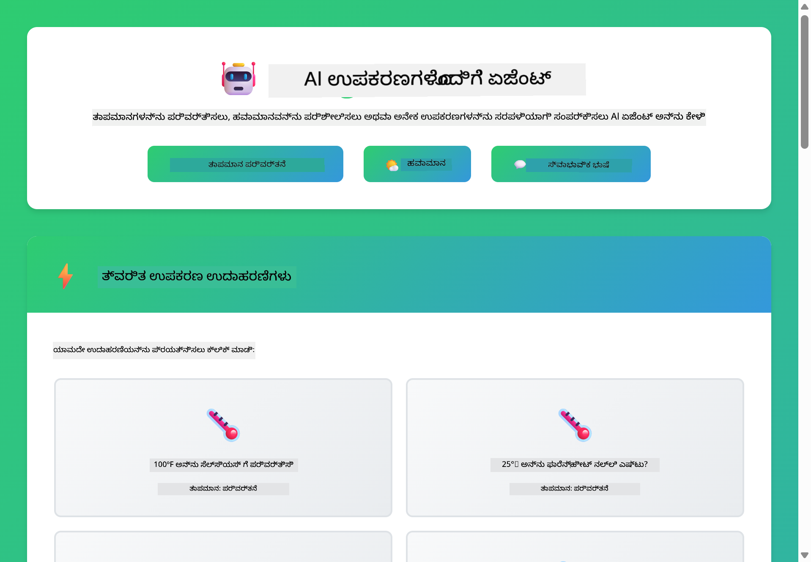
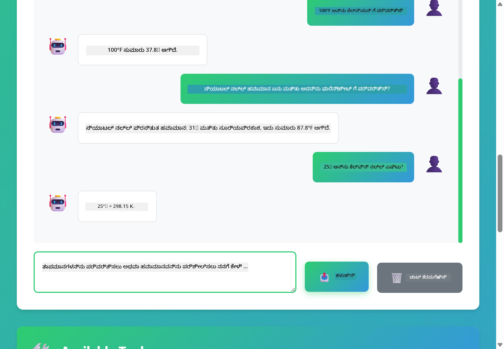

<!--
CO_OP_TRANSLATOR_METADATA:
{
  "original_hash": "13ec450c12cdd1a863baa2b778f27cd7",
  "translation_date": "2025-12-31T08:24:52+00:00",
  "source_file": "04-tools/README.md",
  "language_code": "kn"
}
-->
# Module 04: ಸಾಧನಗಳೊಂದಿಗೆ AI ಏಜೆಂಟ್ಗಳು

## ವಿಷಯಗಳು

- [ನೀವು ಏನು ಕಲಿಯುವಿರಿ](../../../04-tools)
- [ಹೋಗುವ ಮುನ್ನ ಬೇಕಾದವನದು](../../../04-tools)
- [ಸಾಧನಗಳೊಂದಿಗೆ AI ಏಜೆಂಟ್ಗಳನ್ನು ಅರ್ಥಮಾಡಿಕೊಳ್ಳುವುದು](../../../04-tools)
- [ಟೂಲ್ಗಳನ್ನು ಕರೆಸುವ ವಿಧಾನ](../../../04-tools)
  - [ಟೂಲ್ ವ್ಯಾಖ್ಯಾನಗಳು](../../../04-tools)
  - [ನಿರ್ಧಾರ ಕೈಗೊಳ್ಳುವುದು](../../../04-tools)
  - [ನಿರ್ವಹಣೆ](../../../04-tools)
  - [ಪ್ರತಿಕ್ರಿಯಾ ತಯಾರಿಕೆ](../../../04-tools)
- [ಟೂಲ್ಚೇನಿಂಗ್](../../../04-tools)
- [ಅನ್ವಯಿಕೆಯನ್ನು ಚಾಲನೆಮಾಡಿ](../../../04-tools)
- [ಅನ್ವಯಿಕೆಯನ್ನು ಬಳಸುವುದು](../../../04-tools)
  - [ಸರಳ ಟೂಲ್ವಿನ ಬಳಕೆ ಪ್ರಯತ್ನಿಸಿ](../../../04-tools)
  - [ಟೂಲ್ಚೇನಿಂಗ್ ಪರೀಕ್ಷಿಸಿ](../../../04-tools)
  - [ಸಂಭಾಷಣಾ ಪ್ರವಾಹವನ್ನು ನೋಡಿ](../../../04-tools)
  - [ತರ್ಕವನ್ನು ಗಮನಿಸಿ](../../../04-tools)
  - [ವಿಭಿನ್ನ ವಿನಂತಿಗಳೊಂದಿಗೆ ಪ್ರಯೋಗಿಸಿ](../../../04-tools)
- [ಮುಖ್ಯ ಅಂಶಗಳು](../../../04-tools)
  - [ReAct ಮಾದರಿ (ತರ್ಕ ಮತ್ತು ಕ್ರಿಯೆ)](../../../04-tools)
  - [ಟೂಲಿನ ವಿವರಣೆಗಳು ಮಹತ್ವ ಹೊಂದಿವೆ](../../../04-tools)
  - [ಸೆಶನ್ ನಿರ್ವಹಣೆ](../../../04-tools)
  - [ದೋಷ ನಿರ್ವಹಣೆ](../../../04-tools)
- [ಲಭ್ಯವಿರುವ ಟೂಲ್ಗಳು](../../../04-tools)
- [ಯಾವಾಗ ಟೂಲ್ ಆಧಾರಿತ ಏಜೆಂಟ್ಗಳನ್ನು ಬಳಸಬೇಕು](../../../04-tools)
- [ಮುಂದಿನ ಹಂತಗಳು](../../../04-tools)

## ನೀವು ಏನು ಕಲಿಯುವಿರಿ

ಇಲ್ಲವಾದವರೆಗೂ, ನೀವು ಏಐಯೊಂದಿಗೆ ಸಂಭಾಷಣೆ ಮಾಡುವ ವಿಧಾನ, ಪ್ರಾಂಪ್ಟ್‌ಗಳನ್ನು ಪರಿಣಾಮಕಾರಿಯಾಗಿ ರಚಿಸುವುದು ಮತ್ತು ನಿಮ್ಮ ದಸ್ತಾವೇಜುಗಳಲ್ಲಿ ಉತ್ತರಗಳನ್ನು ನೆಲೆಯಲ್ಲಿ ಇಡುವುದು ಕಲಿತಿದ್ದೀರಿ. ಆದರೆ ಇದೆಲ್ಲದ ಜೊತೆಗೆ ಒಂದು ಮೂಲಭೂತ ನಿಯಮಿತತೆ ಇದೆ: ಭಾಷಾ ಮಾದರಿಗಳು текಸ್ಟ್ ಮಾತ್ರ ಉತ್ಪಾದಿಸಬಹುದು. ಅವು ಮೌಸಂ ಪರಿಶೀಲಿಸಬಲ್ಲವು, ಲೆಕ್ಕಾಚಾರ ಮಾಡಲು, ಡೇಟಾಬೇಸ್‌ಗಳನ್ನು ಪ್ರಶ್ನಿಸಲು ಅಥವಾ ಹೊರಗಿನ ವ್ಯವಸ್ಥೆಗಳಿಗೆ ಸಂವಹನ ಮಾಡಲು ಸಾಧ್ಯವಿಲ್ಲ.

ಟೂಲ್ಗಳು ಇದನ್ನು ಬದಲಾಯಿಸುತ್ತವೆ. ಮಾದರಿಗೆ ಕರೆ ಮಾಡಬಹುದಾದ ಫಂಕ್ಷನ್‌ಗಳ ಪ್ರವේශವನ್ನು ನೀಡುವ ಮೂಲಕ, ನೀವು ಅದನ್ನು текಸ್ಟ್ ಅನ್ನು ಉತ್ಪಾದಿಸನೇಕಾಗಿ ಮಾತ್ರವಲ್ಲದೆ, ಕ್ರಿಯೆಗಳು ಕೈಗೊಳ್ಳಬಹುದಾದ ಏಜೆಂಟ್ ಆಗಿ ಪರಿವರ್ತಿಸುತ್ತೀರಿ. ಮಾದರಿ ಯಾವಾಗ ಟೂಲ್ಗೆ ಅಗತ್ಯವಿದೆ, ಯಾವ ಟೂಲ್ ಅನ್ನು ಬಳಸಬೇಕು ಮತ್ತು ಯಾವ ಪ್ಯಾರಮೀಟರ್‌ಗಳನ್ನು ಪಾಸ್ ಮಾಡಬೇಕು ಎಂಬುದನ್ನು ನಿರ್ಣಯಿಸುತ್ತದೆ. ನಿಮ್ಮ ಕೋಡ್ ಫಂಕ್ಷನ್ ಅನ್ನು ನಿರ್ವಹಿಸಿ ಫಲಿತಾಂಶವನ್ನು ಹಿಂತಿರುಗಿಸುತ್ತದೆ. ಮಾದರಿ ಆ ಫಲಿತಾಂಶವನ್ನು ತನ್ನ ಪ್ರತಿಕ್ರಿಯೆಯಲ್ಲಿ ಸೇರಿಸುತ್ತದೆ.

##Prerequisites

- Module 01 ಪೂರ್ಣಗೊಂಡಿದೆ (Azure OpenAI ಸಂಪನ್ಮೂಲಗಳು desplegado)
- ರೂಟ್ ಡೈರೆಕ್ಟರಿಯಲ್ಲಿ `.env` ಫೈಲ್ ಇದ್ದು ಅದರಲ್ಲಿನ Azure ಕ್ರೆಡೆನ್ಶಿಯಲ್‌ಗಳು (Module 01 ರಲ್ಲಿ `azd up` ಮೂಲಕ ರಚಿಸಲಾಗಿದೆ)

> **Note:** ನೀವು Module 01 ಪೂರ್ಣಗೊಳಿಸದಿದ್ದರೆ, ಮೊದಲು ಅಲ್ಲಿ ಇರುವ ಡಿಪ್ಲಾಯ್ ಸೂಚನೆಗಳನ್ನು ಅನುಸರಿಸಿ.

## ಸಾಧನಗಳೊಂದಿಗೆ AI ಏಜೆಂಟ್ಗಳನ್ನು ಅರ್ಥಮಾಡಿಕೊಳ್ಳುವುದು

> **📝 ಟಿಪ್ಪಣಿ:** ಈ ಮೊಡ್ಯೂಲಿನಲ್ಲಿ "ಏಜೆಂಟ್ಗಳು" ಎಂಬ ಪದವು ಟೂಲ್-ಕಾಲಿಂಗ್ ಸಾಮರ್ಥ್ಯಗಳೊಂದಿಗೆ ವಿಶಿಷ್ಟಗೊಳಿಸಲಾದ AI ಸಹಾಯಕರಿಗಾಗಿ ಉಲ್ಲೇಖ ಮಾಡುತ್ತದೆ. ಇದು ನಾವು [Module 05: MCP](../05-mcp/README.md) ಯಲ್ಲಿ ಕವರ್ ಮಾಡುವ **Agentic AI** ಮಾದರಿಗಳಿಂದ (ಯೋಜನೆ, ಸ್ಮೃತಿ ಮತ್ತು ಬಹು-ಹಂತ ತರ್ಕವನ್ನು ಹೊಂದಿರುವ ಸ್ವಾಯತ್ತ ಏಜೆಂಟ್ಗಳು) ವಿಭಿನ್ನವಾಗಿದೆ.

ಟೂಲ್ಗಳೊಂದಿಗೆ AI ಏಜೆಂಟ್ ReAct ಎಂಬ ತರ್ಕ ಮತ್ತು ಕ್ರಿಯೆ ಮಾದರಿಯನ್ನು ಅನುಸರಿಸುತ್ತದೆ:

1. ಬಳಕೆದಾರನು ಪ್ರಶ್ನೆ ಕೇಳುತ್ತಾನೆ
2. ಏಜೆಂಟ್ ಅದಕ್ಕೆ ಬೇಕಾಗಿರುವುದನ್ನು ಕುರಿತು ತರ್ಕಮಾಡುತ್ತದೆ
3. ಉತ್ತರಿಸಲು ಟೂಲ್ಗೆ ಅಗತ್ಯವಿದೆಯೇ ಎಂಬುದನ್ನು ಏಜೆಂಟ್ ನಿರ್ಧರಿಸುತ್ತದೆ
4. ಹೌದಾದರೆ, ಏಜೆಂಟ್ ಸರಿಯಾದ ಪಾರಾಮೀಟರ್‌ಗಳೊಂದಿಗೆ ಒಳಗೊಂಡಿರುವ ಸೂಕ್ತ ಟೂಲ್ನನ್ನು ಕರೆಸುತ್ತದೆ
5. ಟೂಲ್ ಕಾರ್ಯಗತಗೊಳ್ಳುತ್ತದೆ ಮತ್ತು ಡೇಟಾವನ್ನು ಹಿಂತಿರುಗಿಸುತ್ತದೆ
6. ಏಜೆಂಟ್ ಫಲಿತಾಂಶವನ್ನು ಸೇರಿಸಿ ಅಂತಿಮ ಉತ್ತರವನ್ನು ಒದಗಿಸುತ್ತದೆ


*ReAct ಮಾದರಿ - ಸಮಸ್ಯೆಗಳನ್ನು ಪರಿಹರಿಸಲು AI ಏಜೆಂಟರು ಹೇಗೆ ತರ್ಕ ಮತ್ತು ಕ್ರಿಯೆಗಳನ್ನು ಪರ್ಯಾಯವಾಗಿ ನಡೆಸುತ್ತಾರೆ*

ಈದು ಸ್ವಯಂಚಾಲಿತವಾಗಿಯೇ ಸಂಭವಿಸುತ್ತದೆ. ನೀವು ಟೂಲ್ಗಳನ್ನು ಮತ್ತು ಅವುಗಳ ವಿವರಣೆಗಳನ್ನು ವ್ಯಾಖ್ಯಾನಿಸುತ್ತೀರಿ. ಮಾದರಿ ಅವುಗಳನ್ನು ಬಳಸುವದು ಯಾಗೆ ಮತ್ತು ಹೇಗೆ ಎಂಬ ನಿರ್ಧಾರವನ್ನು ನಿರ್ವಹಿಸುತ್ತದೆ.

## ಟೂಲ್ಗಳನ್ನು ಕರೆಸುವ ವಿಧಾನ

**ಟೂಲ್ ವ್ಯಾಖ್ಯಾನಗಳು** - [WeatherTool.java](../../../04-tools/src/main/java/com/example/langchain4j/agents/tools/WeatherTool.java) | [TemperatureTool.java](../../../04-tools/src/main/java/com/example/langchain4j/agents/tools/TemperatureTool.java)

ನೀವು ಸ್ಪಷ್ಟ ವಿವರಣೆಗಳು ಮತ್ತು ಪ್ಯಾರಮೀಟರ್ ವಿವರಣೆಯೊಂದಿಗೆ ಫಂಕ್ಷನ್‌ಗಳನ್ನು ವ್ಯಾಖ್ಯಾನಿಸುತ್ತೀರಿ. ಮಾದರಿ ಈ ವಿವರಣೆಗಳನ್ನು ಅದರ ಸಿಸ್ಟಂ ಪ್ರಾಂಪ್ಟ್‌ನಲ್ಲಿ ನೋಡುತ್ತದೆ ಮತ್ತು ಪ್ರತಿಯೊಂದು ಟೂಲ್ ಏನು ಮಾಡುವುದೆಂದು ಅರ್ಥಮಾಡಿಕೊಳ್ಳುತ್ತದೆ.

```java
@Component
public class WeatherTool {
    
    @Tool("Get the current weather for a location")
    public String getCurrentWeather(@P("Location name") String location) {
        // ನಿಮ್ಮ ಹವಾಮಾನ ಹುಡುಕುವ ತರ್ಕ
        return "Weather in " + location + ": 22°C, cloudy";
    }
}

@AiService
public interface Assistant {
    String chat(@MemoryId String sessionId, @UserMessage String message);
}

// ಸಹಾಯಕವು Spring Boot ಮೂಲಕ ಸ್ವಯಂಚಾಲಿತವಾಗಿ ಕೆಳಕಂಡವುಗಳೊಂದಿಗೆ ಸಂಪರ್ಕಗೊಂಡಿದೆ:
// - ChatModel ಬೀನ್
// - @Component ವರ್ಗಗಳಿಂದಲಾದ ಎಲ್ಲಾ @Tool ವಿಧಾನಗಳು
// - ಸೆಷನ್ ನಿರ್ವಹಣೆಗಾಗಿ ChatMemoryProvider
```

> **🤖 [GitHub Copilot](https://github.com/features/copilot) ಚಾಟ್‌ನೊಂದಿಗೆ ಪ್ರಯತ್ನಿಸಿ:** [`WeatherTool.java`](../../../04-tools/src/main/java/com/example/langchain4j/agents/tools/WeatherTool.java) ತೆರೆದು ಕೇಳಿ:
> - "How would I integrate a real weather API like OpenWeatherMap instead of mock data?"
> - "What makes a good tool description that helps the AI use it correctly?"
> - "How do I handle API errors and rate limits in tool implementations?"

**ನಿರ್ಧಾರ ಕೈಗೊಳ್ಳುವುದು**

ಬಳಕೆದಾರನು "ಸೀಯಾಟಲ್ಲಿನ ಹವಾಮಾನ ಏನು?" ಎಂದು ಕೇಳಿದಾಗ, ಮಾದರಿ ಅದಕ್ಕಾಗಿ weather tool ಬೇಕು ಎಂದು ಗುರುತಿಸುತ್ತದೆ. ಅದು location ಪ್ಯಾರಮೀಟರ್ ಅನ್ನು "Seattle" ಎಂದು ಸೆಟ್ ಮಾಡಿದ ಫಂಕ್ಷನ್ ಕರೆನ್ನು ರಚಿಸುತ್ತದೆ.

**ನಿರ್ವಹಣೆ** - [AgentService.java](../../../04-tools/src/main/java/com/example/langchain4j/agents/service/AgentService.java)

Spring Boot, ಎಲ್ಲಾ ರಿಜಿಸ್ಟರ್ ಮಾಡಲಾದ ಟೂಲ್ಗಳೊಂದಿಗೆ ಘೋಷಿತ `@AiService` ಇಂಟರ್ಫೇಸ್ ಅನ್ನು ಸ್ವಯಂಚಾಲಿತವಾಗಿ ಆಯೋಜಿಸುತ್ತದೆ ಮತ್ತು LangChain4j ಟೂಲ್ಕಾಲ್‌ಗಳನ್ನು ಸ್ವಯಂಚಾಲಿತವಾಗಿ ನಿರ್ವಹಿಸುತ್ತದೆ.

> **🤖 [GitHub Copilot](https://github.com/features/copilot) ಚಾಟ್‌ನೊಂದಿಗೆ ಪ್ರಯತ್ನಿಸಿ:** [`AgentService.java`](../../../04-tools/src/main/java/com/example/langchain4j/agents/service/AgentService.java) ತೆರೆದು ಕೇಳಿ:
> - "How does the ReAct pattern work and why is it effective for AI agents?"
> - "How does the agent decide which tool to use and in what order?"
> - "What happens if a tool execution fails - how should I handle errors robustly?"

**ಪ್ರತಿಕ್ರಿಯಾ ತಯಾರಿಕೆ**

ಮಾದರಿ ಹವಾಮಾನ ಡೇಟಾವನ್ನು ಪಡೆಯುತ್ತದೆ ಮತ್ತು ಬಳಕೆದಾರನಿಗೆ ನೈಋತ್ಯ ಭಾಷೆಯಲ್ಲಿನ ಪ್ರತಿಕ್ರಿಯೆಯನ್ನು ರೂಪಗೊಳಿಸುತ್ತದೆ.

### ಘೋಷಣಾತ್ಮಕ AI ಸೇವೆಗಳನ್ನ 왜 ಬಳಸಬೇಕು?

ಈ ಮೊಡ್ಯೂಲ್ LangChain4j ನ Spring Boot ಇಂಟಿಗ್ರೇಶನ್ ಅನ್ನು ಘೋಷಿತ `@AiService` ಇಂಟರ್ಫೇಸ್‌ಗಳೊಂದಿಗೆ ಬಳಸುತ್ತದೆ:

- **Spring Boot ಸ್ವಯಂ-ವೈರ್ಡಿಂಗ್** - ChatModel ಮತ್ತು ಟೂಲ್ಗಳನ್ನು ಸ್ವಯಂಚಾಲಿತವಾಗಿ ಇಂಜೆಕ್ಟ್ ಮಾಡಲಾಗುತ್ತದೆ
- **@MemoryId ಪ್ಯಾಟರ್ನ್** - ಸೆಶನ್ ಆಧಾರದ ಮೆಮೊರಿ ನಿರ್ವಹಣೆ ಸ್ವಯಂಚಾಲಿತ
- **ಒಂದೇ ಇನುಸ್ಥಾನ** - ಸಹಾಯಕ ಒಮ್ಮೆ ಸೃಷ್ಟಿಸಿ ಉತ್ತಮ ಕಾರ್ಯಕ್ಷಮತಿಗಾಗಿ ಪುನಃ ಬಳಸಲಾಗುತ್ತದೆ
- **Type-safe ನಿರ್ವಹಣೆ** - Java ಮೆಥಡ್ಗಳು ನೇರವಾಗಿ ಕರೆಮಾಡಲ್ಪಡುತ್ತವೆ ಮತ್ತು ಟೈಪ್ ಪರಿವರ್ತನೆ ಆಗುತ್ತದೆ
- **ತಿರುಗು-ತಿರುಗು ಸಂಯೋಜನೆ** - ಟೂಲ್ಚೇನಿಂಗ್ ಸ್ವಯಂಚಾಲಿತವಾಗಿ ನಿರ್ವಹಿಸುತ್ತದೆ
- **ಶೂನ್ಯ ಬಾಯ್ಲರ್‌ಪ್ಲೇಟ್** - ಯಾವುದೇ ಕೈಯಿಂದ AiServices.builder() کال์ಗಳು ಅಥವಾ ಮೆಮೊರಿ HashMap ಅಗತ್ಯವಿಲ್ಲ

ವೈಕಲ್ಪಿಕ ವಿಧಾನಗಳು (ಮ್ಯಾನುಯಲ್ `AiServices.builder()`) ಹೆಚ್ಚು ಕೋಡ್ ಅಗತ್ಯವಿರುತ್ತವೆ ಮತ್ತು Spring Boot ಇಂಟಿಗ್ರೇಶನ್ ಪ್ರಯೋಜನಗಳನ್ನು ಕಳೆದುಕೊಳ್ಳುತ್ತವೆ.

## ಟೂಲ್ಚೇನಿಂಗ್

**ಟೂಲ್ಚೇನಿಂಗ್** - AI ಕ್ರಮವಾಗಿ ಅನೇಕ ಟೂಲ್ಗಳನ್ನು ಕರೆ ಮಾಡಬಹುದು. "What's the weather in Seattle and should I bring an umbrella?" ಎಂದು ಕೇಳಿ ಮತ್ತು ಅದು `getCurrentWeather` ಅನ್ನು ಕರೆ ಮಾಡಿ ಮಳೆಯನ್ನು ಕುರಿತು ತರ್ಕಿಸುವ ಮೂಲಕ ಹೇಗೆ ಚೇನಿಂಗ್ ಮಾಡುತ್ತದೆ ಎಂದು ನೋಡಿ.

<a href="images/tool-chaining.png"></a>

*ಕ್ರಮಬದ್ಧ ಟೂಲ್ ಕರೆಗಳು - ಒಂದು ಟೂಲ್‌ನ ಔಟ್ಪುಟ್ ಮುಂದಿನ ನಿರ್ಧಾರಕ್ಕೆ ಇನ್ಪುಟ್ ಆಗುತ್ತದೆ*

**ಗ್ರೀಸ್‌ಫುಲ್ ವೈಫಲ್ಯಗಳು** - ಮಾದರಿಯ ಡೇಟಾದಲ್ಲಿ ಇಲ್ಲದ ನಗರದ ಹವಾಮಾನ ಕೇಳಿ. ಟೂಲ್ ದೋಷ ಸಂದೇಶವನ್ನು ಹಿಂತಿರುಗಿಸುತ್ತದೆ ಮತ್ತು AI ಸಹಾಯಕರಾಗಿ ಅದು ಸಹಾಯ ಮಾಡಲು ಸಾಧ್ಯವಿಲ್ಲ ಎಂದು ವಿವರಿಸುತ್ತದೆ. ಟೂಲ್ಗಳು ಸುರಕ್ಷಿತವಾಗಿ ವೈಫಲ್ಯಗೊಳ್ಳುತ್ತವೆ.

ಇದು ಒಂದೇ ಸಂಭಾಷಣಾ ತಿರುವಿನಲ್ಲಿ ಸಂಭವಿಸುತ್ತದೆ. ಏಜೆಂಟ್ ಅನೇಕ ಟೂಲ್ ಕರೆಯಗಳನ್ನು ಸ್ವತಃ ಸಂಯೋಜಿಸುತ್ತದೆ.

## ಅನ್ವಯಿಕೆಯನ್ನು ಚಾಲನೆ ಮಾಡಿ

**ವಿನ್ಯಾಸ ಪರಿಶೀಲಿಸಿ:**

Root ಡೈರೆಕ್ಟರಿಯಲ್ಲಿ Azure ಕ್ರೆಡೆನ್ಶಿಯಲ್‌ಗಳೊಂದಿಗೆ `.env` ಫೈಲ್ ಇರುವುದನ್ನು ಖಾತ್ರಿ ಮಾಡಿ (Module 01 دوران ರಚಿಸಲಾಗಿದೆ):
```bash
cat ../.env  # AZURE_OPENAI_ENDPOINT, API_KEY, DEPLOYMENT ಅನ್ನು ತೋರಿಸಬೇಕು
```

**ಅನ್ವಯಿಕೆಯನ್ನು ಪ್ರಾರಂಭಿಸಿ:**

> **ಗಮನಿಸಿ:** ನೀವು ಆಗಾಗಲೆ Module 01ರಿಂದ `./start-all.sh` ಬಳಸಿ ಎಲ್ಲಾ ಅನ್ವಯಿಕೆಗಳನ್ನು ಪ್ರಾರಂಭಿಸಿದರೆ, ಈ ಮೊಡ್ಯೂಲ್ ಈಗಾಗಲೇ ಪೋರ್ಟ್ 8084 ನಲ್ಲಿ ನಮಗೆಲ್ಲುತ್ತಿ. ನೀವು ಕೆಳಗಿನ ಪ್ರಾರಂಭ ಆಜ್ಞೆಗಳನ್ನು ಬಿಡಿಸಬಹುದು ಮತ್ತು ನೇರವಾಗಿ http://localhost:8084 ಗೆ ಹೋಗಬಹುದು.

**ಆಯ್ಕೆ 1: Spring Boot ಡ್ಯಾಶ್‌ಬೋರ್ಡ್ ಬಳಸುವುದು (VS Code ಬಳಕೆದಾರರಿಗೆ ಶಿಫಾರಸು)**

ವಿಕ್ಸ್ ಕಾಂಟೇನರ್‌ನಲ್ಲಿ Spring Boot Dashboard ವಿಸ್ತರಣೆ ಒಳಗೊಂಡಿದೆ, ಇದು ಎಲ್ಲಾ Spring Boot ಅನ್ವಯಿಕೆಗಳನ್ನು ನಿರ್ವಹಿಸಲು ದೃಶ್ಯಾತ್ಮಕ ಬ್ರೌಸರ್ ನೀಡುತ್ತದೆ. ನೀವು ಇದು VS Code ನ ಎಕ್ಟಿವಿಟಿ ಬಾರ್‌ನ ಎಡಭಾಗದಲ್ಲಿ(Spring Boot ಐಕಾನ್) ಕಾಣಬಹುದು.

Spring Boot Dashboard ನಿಂದ, ನೀವು:
- ವರ್ಕ್‌ಸ್ಪೇಸ್‌ನಲ್ಲಿ ಲಭ್ಯವಿರುವ ಎಲ್ಲಾ Spring Boot ಅನ್ವಯಿಕೆಗಳನ್ನು ನೋಡಿ
- ಒಂದು ಕ್ಲಿಕ್ಕಿನಿಂದ ಅನ್ವಯಿಕೆಗಳನ್ನು ಪ್ರಾರಂಭ/ನಿಲ್ಲಿಸಬಹುದು
- ರಿಯಲ್-ಟೈಮ್ ಅಪ್ಲಿಕೇಶನ್ ಲಾಗ್‌ಗಳನ್ನು ವೀಕ್ಷಿಸಬಹುದು
- ಅಪ್ಲಿಕೇಶನ್ ಸ್ಥಿತಿಯನ್ನು ಮಾನಿಟರ್ ಮಾಡಬಹುದು

"tools" ಪಕ್ಕದಲ್ಲಿ ಇರುವ ಪ್ಲೇ ಬಟನ್ ಕ್ಲಿಕ್ ಮಾಡಿ ಈ ಮೊಡ್ಯೂಲ್ ಪ್ರಾರಂಭಿಸಿ, ಅಥವಾ ಎಲ್ಲಾ ಮೊಡ್ಯೂಲ್‌ಗಳನ್ನು ಒಂದೇ ಬಾರಿ ಪ್ರಾರಂಭಿಸಿ.


**ಆಯ್ಕೆ 2: ಶೆಲ್ ಸ್ಕ್ರಿಪ್ಟ್‌ಗಳು ಬಳಸುವುದು**

ಎಲ್ಲಾ ವೆಬ್ ಅನ್ವಯಿಕೆಗಳನ್ನು ಪ್ರಾರಂಭಿಸಿ (ಮಾಡ್ಯೂಲ್‌ಗಳು 01-04):

**Bash:**
```bash
cd ..  # ರೂಟ್ ಡೈರೆಕ್ಟರಿಯಿಂದ
./start-all.sh
```

**PowerShell:**
```powershell
cd ..  # ರೂಟ್ ಡೈರೆಕ್ಟರಿಯಿಂದ
.\start-all.ps1
```

ಅಥವಾ ಕೇವಲ ಈ ಮೊಡ್ಯೂಲ್ ಅನ್ನು ಪ್ರಾರಂಭಿಸಿ:

**Bash:**
```bash
cd 04-tools
./start.sh
```

**PowerShell:**
```powershell
cd 04-tools
.\start.ps1
```

ಇರಿಬ್ಬು ಸ್ಕ್ರಿಪ್ಟ್‌ಗಳು ರೂಟ್ `.env` ಫೈಲ್‌ನಿಂದ ಪರಿಸರ ಚರಗಳನ್ನು ಸ್ವಯಂಚಾಲಿತವಾಗಿ ಲೋಡ್ ಮಾಡುತ್ತವೆ ಮತ್ತು JAR ಗಳನ್ನು ಇಲ್ಲದಿದ್ದರೆ ಬಿಲ್ಡ್ ಮಾಡುತ್ತವೆ.

> **ಗಮನಿಸಿ:** ನೀವು ಪ್ರಿಫರ್ ಮಾಡುತ್ತೀರಾ ಎಲ್ಲಾ ಮೊಡ್ಯೂಲ್‌ಗಳನ್ನು ಪ್ರಾರಂಭಿಸುವ ಮುಂಚೆ ಮ್ಯಾನುಯಲ್ ಆಗಿ ಬಿಲ್ಡ್ ಮಾಡಲು:
>
> **Bash:**
> ```bash
> cd ..  # Go to root directory
> mvn clean package -DskipTests
> ```
>
> **PowerShell:**
> ```powershell
> cd ..  # Go to root directory
> mvn clean package -DskipTests
> ```

ನಿಮ್ಮ ಬ್ರೌಸರ್‌ನಲ್ಲಿ http://localhost:8084 ತೆರೆಯಿರಿ.

**ನಿಲ್ಲಿಸಲು:**

**Bash:**
```bash
./stop.sh  # ಈ ಮಾಡ್ಯೂಲ್ ಮಾತ್ರ
# ಅಥವಾ
cd .. && ./stop-all.sh  # ಎಲ್ಲಾ ಮಾಡ್ಯೂಲ್‌ಗಳು
```

**PowerShell:**
```powershell
.\stop.ps1  # ಈ ಘಟಕ ಮಾತ್ರ
# ಅಥವಾ
cd ..; .\stop-all.ps1  # ಎಲ್ಲಾ ಘಟಕಗಳು
```

## ಅನ್ವಯಿಕೆಯನ್ನು ಬಳಸುವುದು

ಅನ್ವಯಿಕೆಯಲ್ಲಿ ವೆಬ್ ಇಂಟರ್‌ಫೇಸ್ ಇರುತ್ತದೆ, ಇಲ್ಲಿ ನೀವು ಹವಾಮಾನ ಮತ್ತು ತಾಪಮಾನ ಪರಿವರ್ತನೆ ಟೂಲ್ಗಳಿಗೆ ಪ್ರವೇಶ ಹೊಂದಿರುವ AI ಏಜೆಂಟ್‌ನೊಂದಿಗೆ ಸಂವಹನ ಮಾಡಬಹುದು.

<a href="images/tools-homepage.png"></a>

*AI ಏಜೆಂಟ್ ಟೂಲ್ಸ್ ಇಂಟರ್ಫೇಸ್ - ತ್ವರಿತ ಉದಾಹರಣೆಗಳು ಮತ್ತು ಟೂಲ್ಗಳೊಂದಿಗೆ ಸಂವಹನಕ್ಕಾಗಿ ಚಾಟ್ ಇಂಟರ್ಫೇಸ್*

**ಸರಳ ಟೂಲ್ವಿನ ಬಳಕೆ ಪ್ರಯತ್ನಿಸಿ**

ಸರಳ ವಿನಂತಿಯಿಂದ ಪ್ರಾರಂಭಿಸಿ: "Convert 100 degrees Fahrenheit to Celsius". ಏಜೆಂಟ್ ಅದರಿಗಿಷ್ಟವಾದ temperatuur conversion tool ಬೇಕು ಎಂದು ಗುರುತಿಸಿ, ಸರಿಯಾದ ಪ್ಯಾರಮೀಟರ್‌ಗಳೊಂದಿಗೆ ಅದನ್ನು ಕರೆ ಮಾಡುತ್ತದೆ ಮತ್ತು ಫಲಿತಾಂಶ ನೀಡುತ್ತದೆ. ಇದು ಸ್ವಾಭಾವಿಕ ಹೇಗೊ ಭಾಸವಾಗುತ್ತದೆ — ನೀವು ಯಾವ ಟೂಲ್ ಬಳಸಬೇಕು ಅಥವಾ ಅದನ್ನು ಹೇಗೆ ಕರೆ ಮಾಡಬೇಕು ಎಂಬುದನ್ನು ನಿರ್ದಿಷ್ಟವಾಗಿ ಹೇಳಿರಲಿಲ್ಲ.

**ಟೂಲ್ಚೇನಿಂಗ್ ಪರೀಕ್ಷಿಸಿ**

ಇಗೋ ಒಂದನ್ನು ಹೆಚ್ಚು ಸಂಕೀರ್ಣವಾಗಿ ಪ್ರಯತ್ನಿಸಿ: "What's the weather in Seattle and convert it to Fahrenheit?" ಏಜೆಂಟ್ ಇದನ್ನು ಹಂತಗಳಲ್ಲಿ ಕಾರ್ಯನಿರ್ವಹಿಸುತ್ತಾ ನೋಡಿರಿ. ಮೊದಲಿಗೆ ಹವಾಮಾನವನ್ನು ಪಡೆಯುತ್ತದೆ (ಸಾಮಾನ್ಯವಾಗಿ ಸೆಲ್ಸಿಯಸ್‌ನಲ್ಲಿ), ಅನಂತರ ಅದನ್ನು ಫಾರೆನ್‌ಹೈಟ್‌ಗೆ ಪರಿವರ್ತನೆ ಮಾಡುವ ಅಗತ್ಯವಿದೆ ಎಂದು ತಿಳಿದುಕೊಂಡು ಪರಿವರ್ತನೆ ಟೂಲನ್ನು ಕರೆದು ಎರಡೂ ಫಲಿತಾಂಶಗಳನ್ನು ಒಂದು ಪ್ರತಿಕ್ರಿಯೆಯಲ್ಲಿ ಸಂಯೋಜಿಸುತ್ತದೆ.

**ಸಂಭಾಷಣಾ.flow ನೋಡಿರಿ**

ಚಾಟ್ ಇಂಟರ್ಫೇಸ್ ಸಂಭಾಷಣಾ ಇತಿಹಾಸವನ್ನು ಉಳಿಸುತ್ತದೆ, ಇದರಿಂದ ನೀವು ಬಹು-ತಿರುಗು ಸಂಭಾಷಣೆಗಳನ್ನು ನಡೆಸಬಹುದು. ನೀವು ಎಲ್ಲಾ ಹಿಂದಿನ ಪ್ರಶ್ನೆಗಳು ಮತ್ತು ಪ್ರತಿಕ್ರಿಯೆಗಳನ್ನು ನೋಡಬಹುದು, ಇದು ಸಂಭಾಷಣೆಯನ್ನು ಟ್ರ್ಯಾಕ್ ಮಾಡುವುದು ಮತ್ತು ಏಜೆಂಟ್ ಹೇಗೆ ನಿಯತಾಂತರವನ್ನು ನಿರ್ಮಿಸುತ್ತದೆ ಎಂಬುದನ್ನು ಅರ್ಥಮಾಡಿಕೊಳ್ಳಲು ಸುಲಭವಾಗಿಸುತ್ತದೆ.

<a href="images/tools-conversation-demo.png"></a>

*ಸರಳ ಪರಿವರ್ತನೆಗಳು, ಹವಾಮಾನ ಹುಡುಕಾಟಗಳು ಮತ್ತು ಟೂಲ್ಚೇನಿಂಗ್ ತೋರಿಸುವ ಬಹು-ತಿರುಗು ಸಂಭಾಷಣೆ*

**ವಿಭಿನ್ನ ವಿನಂತಿಗಳೊಂದಿಗೆ ಪ್ರಯೋಗಿಸುವುದು**

ವಿವಿಧ ಸಂಯೋಜನೆಗಳನ್ನು ಪ್ರಯತ್ನಿಸಿ:
- ಹವಾಮಾನ ಹುಡುಕಾಟಗಳು: "What's the weather in Tokyo?"
- ತಾಪಮಾನ ಪರಿವರ್ತನೆಗಳು: "What is 25°C in Kelvin?"
- ಸಂಯುಕ್ತ ಪ್ರಶ್ನೆಗಳು: "Check the weather in Paris and tell me if it's above 20°C"

ಏಜೆಂಟ್ ಹೇಗೆ ನೈಸರ್ಗಿಕ ಭಾಷೆಯನ್ನು ಪ್ರಾಯೋಗಿಕವಾಗಿ ಅರ್ಥ ಮಾಡಿ ಅದಕ್ಕೆ ಸೂಕ್ತ ಟೂಲ್ ಕರೆಗಳನ್ನು ನಕ್ಷೆ ಮಾಡುತ್ತದೆ ಎಂಬುದನ್ನು লক্ষ্যಿಸಿ.

## ಮುಖ್ಯ ಅಂಶಗಳು

**ReAct ಮಾದರಿ (ತರ್ಕ ಮತ್ತು ಕ್ರಿಯೆ)**

ಏಜೆಂಟ್ ತರ್ಕಿಸುವದು (ಏನು ಮಾಡಬೇಕೆಂದು ನಿರ್ಧರಿಸುವುದು) ಮತ್ತು ಕ್ರಿಯೆಯನ್ನು (ಟೂಲ್ಗಳನ್ನು ಬಳಸುವುದು) ಪರ್ಯಾಯವಾಗಿ ಮಾಡಬಹುದು. ಈ ಮಾದರಿ ನಿರ್ದೇಶನಗಳಿಗೆ ಮಾತ್ರ ಪ್ರತಿಕ್ರಿಯಿಸುವುದಕ್ಕಿಂತ ಸ್ವಾಯತ್ತ ಸಮಸ್ಯಾ ಪರಿಹಾರಕ್ಕೆ ಸಹಾಯಮಾಡುತ್ತದೆ.

**ಟೂಲ್ ವಿವರಣೆಗಳು ಮಹತ್ವವುಳ್ಳವು**

ನಿಮ್ಮ ಟೂಲಿನ ವಿವರಣೆಗಳ ಗುಣಮಟ್ಟವು ಏಜೆಂಟ್ ಅವುಗಳನ್ನು ಎಷ್ಟು ಚೆನ್ನಾಗಿ ಬಳಸುತ್ತದೆಯೋ ಅದಕ್ಕೆ ನೇರವಾಗಿ ಪ್ರಭಾವ ಬೀರುತ್ತದೆ. ಸ್ಪಷ್ಟ ಮತ್ತು ನಿರ್ದಿಷ್ಟ ವಿವರಣೆಗಳು ಮಾದರಿಯನ್ನು ಪ್ರತಿ ಟೂಲನ್ನು ಯಾವಾಗ ಮತ್ತು ಹೇಗೆ ಕರೆ ಮಾಡಬೇಕೆಂದು ಅರ್ಥಮಾಡಿಕೊಳ್ಳಲು ಸಹಾಯ ಮಾಡುತ್ತವೆ.

**ಸೆಶನ್ ನಿರ್ವಹಣೆ**

`@MemoryId` ಅನೋಟೇಶನ್ ಸ್ವಯಂಚಾಲಿತ ಸೆಶನ್-ಆಧಾರಿತ ಮೆಮೊರಿ ನಿರ್ವಹಣೆಯನ್ನು ಸಕ್ರಿಯಗೊಳಿಸುತ್ತದೆ. ಪ್ರತಿ ಸೆಶನ್ ID ಗೆ ತನ್ನದೇ ಆದ `ChatMemory` ಉದಾಹರಣೆ `ChatMemoryProvider` ಬೀನ್ ನಿಂದ ನಿರ್ವಹಿಸಲ್ಪಡುತ್ತದೆ, ಹೀಗಾಗಿ ಕೈಯಿಂದ ಮೆಮೊರಿ ಟ್ರ್ಯಾಕಿಂಗ್ ಅಗತ್ಯವಿಲ್ಲ.

**ದೋಷ ನಿರ್ವಹಣೆ**

ಟೂಲ್ಗಳು ವೈಫಲ್ಯಗೊಳ್ಳಬಹುದು - API ಗಳು ಟೈಮ್‌ಔಟ್ ಆಗಬಹುದು, ಪ್ಯಾರಮೀಟರ್‌ಗಳು ಅಮಾನ್ಯವಾಗಬಹುದು, ಹೊರಗಿನ ಸೇವೆಗಳು ಡೌನ್ ಆಗಬಹುದು. ಪ್ರೊಡಕ್ಷನ್ ಏಜೆಂಟ್‌ಗಳಿಗೆ ದೋಷ ನಿರ್ವಹಣೆ ಬೇಕಾಗುತ್ತದೆ ώστε ಮಾದರಿ ಸಮಸ್ಯೆಗಳನ್ನು ವಿವರಿಸಬಹುದು ಅಥವಾ ಪರ್ಯಾಯಗಳನ್ನು ಪ್ರಯತ್ನಿಸಬಹುದು.

## ಲಭ್ಯವಿರುವ ಟೂಲ್ಗಳು

**ಹವಾಮಾನ ಟೂಲ್ಗಳು** (ಪ್ರದರ್ಶನಕ್ಕಾಗಿ ಮಾಕ್ ಡೇಟಾ):
- ಸ್ಥಳಕ್ಕಾಗಿ ಪ್ರಸ್ತುತ ಹವಾಮಾನ ಪಡೆಯುವುದು
- ಬಹು-ದಿನಗಳ ಮುನ್ಸೂಚನೆ ಪಡೆಯುವುದು

**ತಾಪಮಾನ ಪರಿವರ್ತನೆ ಟೂಲ್ಗಳು**:
- ಸೆಲ್ಸಿಯಸ್ ಅನ್ನು ಫಾರೆನ್‌ಹೈಟ್‌ಗೆ
- ಫಾರೆನ್‌ಹೈಟ್ ಅನ್ನು ಸೆಲ್ಸಿಯಸ್‌ಗೆ
- ಸೆಲ್ಸಿಯಸ್ ಅನ್ನು ಕೆಲ್ವಿನ್‌ಗೆ
- ಕೆಲ್ವಿನ್ ಅನ್ನು ಸೆಲ್ಸಿಯಸ್‌ಗೆ
- ಫಾರೆನ್‌ಹೈಟ್ ಅನ್ನು ಕೆಲ್ವಿನ್‌ಗೆ
- ಕೆಲ್ವಿನ್ ಅನ್ನು ಫಾರೆನ್‌ಹೈಟ್‌ಗೆ

ಇವು ಸರಳ ಉದಾಹರಣೆಗಳಾದರೂ, ಈ ಮಾದರಿ ಯಾವುದೇ ಫಂಕ್ಷನ್‌ಗೆ ವಿಸ್ತರಿಸಬಹುದು: ಡೇಟಾಬೇಸ್ ಕ್ವೆರಿ, API ಕರೆದೊಯ್ಯುವಿಕೆ, ಲೆಕ್ಕಾಚಾರಗಳು, ಫೈಲ್ ಆಪರೇಷನ್‌ಗಳು ಅಥವಾ ಸಿಸ್ಟಮ್ ಕಮಾಂಡ್‌ಗಳು.

## ಯಾವಾಗ ಟೂಲ್ ಆಧಾರಿತ ಏಜೆಂಟ್ಗಳನ್ನು ಬಳಸಬೆಕು

**ಟೂಲ್ಗಳನ್ನು ಬಳಸಬೇಕು যখন:**
- ಉತ್ತರಕ್ಕೆ ರಿಯಲ್-ಟೈಮ್ ಡೇಟಾ ಬೇಕಾಗುವುದು (ಹವಾಮಾನ, ಷೇರುಬೆಲೆ, ಇನ್ವೆಂಟರಿ)
- ಸರಳ ಗಣಿತಕ್ಕಿಂತ ಹೆಚ್ಚಿನ ಲೆಕ್ಕಾಚಾರಗಳನ್ನು ಮಾಡಲು ಅಗತ್ಯವಿದೆ
- ಡೇಟಾಬೇಸ್‌ಗಳು ಅಥವಾ API ಗಳಿಗೆ ಪ್ರವೇಶ ಬೇಕಾದರೆ
- ಕೃತ್ಯಗಳನ್ನು ಕೈಗೊಳ್ಳಬೇಕು (ಇಮೇಲ್ ಕಳುಹಿಸುವುದು, ಟಿಕೆಟ್ ರಚಿಸುವುದು, ದಾಖಲೆಗಳನ್ನು ಅಪ್ಡೇಟ್ ಮಾಡುವುದು)
- ಅನೇಕ ಡೇಟಾ ಮೂಲಗಳನ್ನು ಸಂಯೋಜಿಸುವ ಅಗತ್ಯವಿದೆ

**ಟೂಲ್ಗಳನ್ನು ಬಳಸಬೇಡಿ जब:**
- ಪ್ರಶ್ನೆಗಳಿಗೆ ಸಾಮಾನ್ಯ ಜ್ಞಾನದಿಂದ ಉತ್ತರ ಸಿಗುತ್ತದೆ
- ಪ್ರತಿಕ್ರಿಯೆ ಶುದ್ಧವಾಗಿ ಸಂವಾದಾತ್ಮಕವಾಗಿರುತ್ತದೆ
- ಟೂಲ್ ವಿಳಂಬತೆ ಅನುಭವವನ್ನು ಬಹಳ ನಿಧಾನಗೊಳಿಸುತ್ತದೆ

## ಮುಂದಿನ ಹಂತಗಳು

**ಮುಂದಿನ ಮೊಡ್ಯೂಲ್:** [05-mcp - Model Context Protocol (MCP)](../05-mcp/README.md)

---

**ನಾವಿಗೇಶನ್:** [← ಹಿಂದಿನದು: Module 03 - RAG](../03-rag/README.md) | [ಮೂಖ್ಯಕ್ಕೆ ಹಿಂದಿರುಗಿ](../README.md) | [ಮುಂದೆ: Module 05 - MCP →](../05-mcp/README.md)

---

<!-- CO-OP TRANSLATOR DISCLAIMER START -->
ಜವಾಬ್ದಾರಿ ನಿರಾಕರಣೆ:
ಈ ದಸ್ತಾವೇಜನ್ನು AI ಅನುವಾದ ಸೇವೆ [Co-op Translator](https://github.com/Azure/co-op-translator) ಮೂಲಕ ಅನುವಾದಿಸಲಾಗಿದೆ. ನಾವು ನಿಖರತೆಗೆ ಪ್ರಯತ್ನಿಸಿದರೂ ಸಹ ಸ್ವಯಂಚಾಲಿತ ಅನುವಾದಗಳಲ್ಲಿ ತಪ್ಪುಗಳು ಅಥವಾ ಅಸಮ್ರುತಿಗಳು ಇರಬಹುದು ಎಂಬುದನ್ನು ದಯವಿಟ್ಟು ಗಮನದಲ್ಲಿರಿಸಿಕೊಳ್ಳಿ. ಮೂಲ ದಸ್ತಾವೇಜಿನ ಮೂಲ ಭಾಷೆಯ ಪ್ರತಿಯನ್ನು ಅಧಿಕೃತ ಮೂಲವೆಂದು ಮನ್ನಿಸಿ ತೆಗೆದುಕೊಳ್ಳಬೇಕು. ಮಹತ್ವದ ಅಥವಾ ನಿರ್ಣಾಯಕ ಮಾಹಿತಿಗಾಗಿ ವೃತ್ತಿಪರ ಮಾನವ ಅನುವಾದವನ್ನು ಶಿಫಾರಸು ಮಾಡಲಾಗುತ್ತದೆ. ಈ ಅನುವಾದವನ್ನು ಬಳಸಿದ ಪರಿಣಾಮವಾಗಿ ಉಂಟಾಗುವ ಯಾವುದೇ误ವುವುಗಳಿಗಾಗಿ ಅಥವಾ ತಪ್ಪಾಗಿ ಅರ್ಥೈಸಿಕೆಯಾಗುವ ಪರಿಣಾಮಕ್ಕಾಗಿ ನಾವು ಜವಾಬ್ದಾರಿಯಲ್ಲ.
<!-- CO-OP TRANSLATOR DISCLAIMER END -->