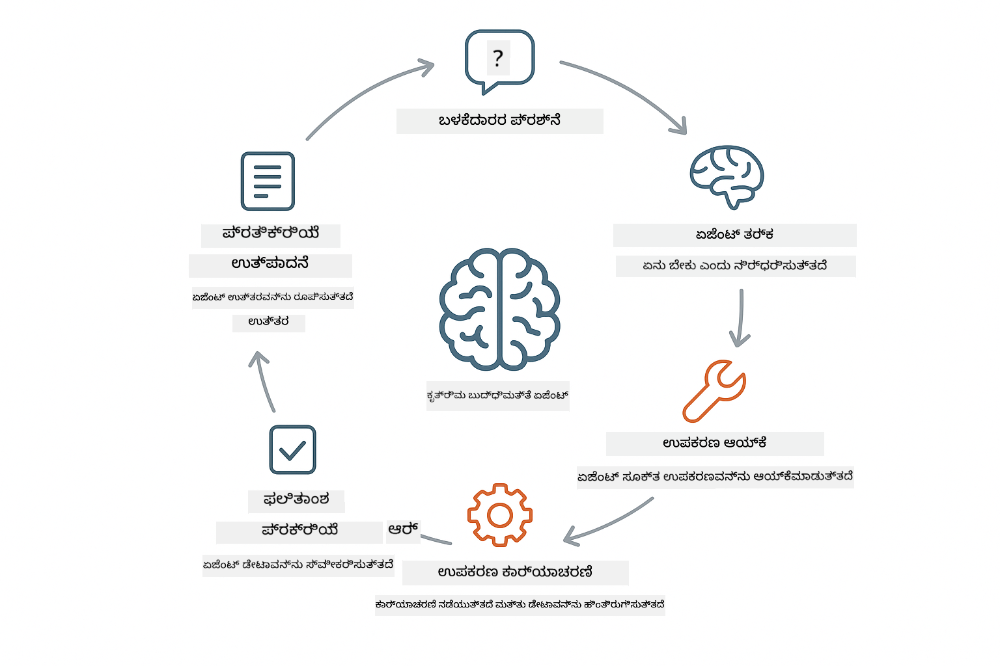
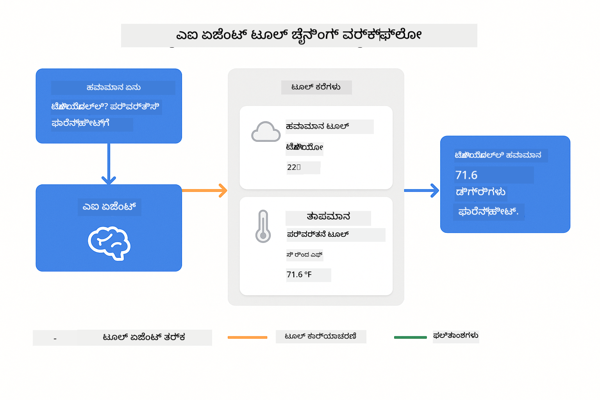
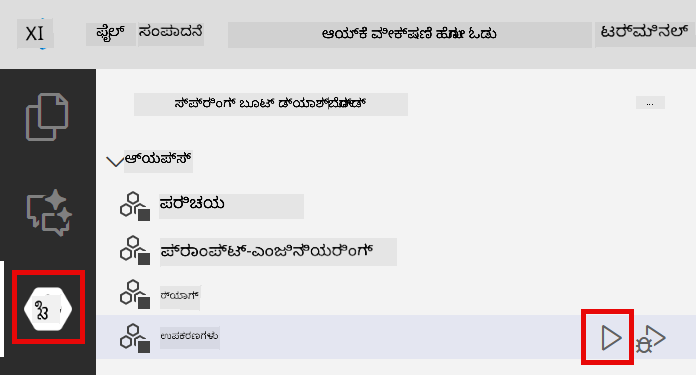

<!--
CO_OP_TRANSLATOR_METADATA:
{
  "original_hash": "aa23f106e7f53270924c9dd39c629004",
  "translation_date": "2025-12-13T19:47:26+00:00",
  "source_file": "04-tools/README.md",
  "language_code": "kn"
}
-->
# Module 04: ಸಾಧನಗಳೊಂದಿಗೆ AI ಏಜೆಂಟ್ಗಳು

## ವಿಷಯಗಳ ಪಟ್ಟಿಕೆ

- [ನೀವು ಕಲಿಯುವದು](../../../04-tools)
- [ಪೂರ್ವಾಪೇಕ್ಷಿತಗಳು](../../../04-tools)
- [ಸಾಧನಗಳೊಂದಿಗೆ AI ಏಜೆಂಟ್ಗಳನ್ನು ಅರ್ಥಮಾಡಿಕೊಳ್ಳುವುದು](../../../04-tools)
- [ಸಾಧನ ಕರೆ ಮಾಡುವ ವಿಧಾನ](../../../04-tools)
  - [ಸಾಧನ ವ್ಯಾಖ್ಯಾನಗಳು](../../../04-tools)
  - [ನಿರ್ಣಯ ಕೈಗೊಳ್ಳುವುದು](../../../04-tools)
  - [ಕಾರ್ಯಗತಗೊಳಿಸುವುದು](../../../04-tools)
  - [ಪ್ರತಿಕ್ರಿಯೆ ರಚನೆ](../../../04-tools)
- [ಸಾಧನ ಸರಪಳಿ](../../../04-tools)
- [ಅಪ್ಲಿಕೇಶನ್ ಚಾಲನೆ](../../../04-tools)
- [ಅಪ್ಲಿಕೇಶನ್ ಬಳಕೆ](../../../04-tools)
  - [ಸರಳ ಸಾಧನ ಬಳಕೆ ಪ್ರಯತ್ನಿಸಿ](../../../04-tools)
  - [ಸಾಧನ ಸರಪಳಿ ಪರೀಕ್ಷಿಸಿ](../../../04-tools)
  - [ಸಂವಾದದ ಹರಿವು ನೋಡಿ](../../../04-tools)
  - [ತರ್ಕವನ್ನು ಗಮನಿಸಿ](../../../04-tools)
  - [ವಿವಿಧ ವಿನಂತಿಗಳೊಂದಿಗೆ ಪ್ರಯೋಗ ಮಾಡಿ](../../../04-tools)
- [ಪ್ರಮುಖ ತತ್ವಗಳು](../../../04-tools)
  - [ReAct ಮಾದರಿ (ತರ್ಕ ಮತ್ತು ಕ್ರಿಯೆ)](../../../04-tools)
  - [ಸಾಧನ ವಿವರಣೆಗಳು ಮಹತ್ವವುಳ್ಳವು](../../../04-tools)
  - [ಸೆಷನ್ ನಿರ್ವಹಣೆ](../../../04-tools)
  - [ದೋಷ ನಿರ್ವಹಣೆ](../../../04-tools)
- [ಲಭ್ಯವಿರುವ ಸಾಧನಗಳು](../../../04-tools)
- [ಯಾವಾಗ ಸಾಧನ ಆಧಾರಿತ ಏಜೆಂಟ್ಗಳನ್ನು ಬಳಸಬೇಕು](../../../04-tools)
- [ಮುಂದಿನ ಹಂತಗಳು](../../../04-tools)

## ನೀವು ಕಲಿಯುವದು

ಈವರೆಗೆ, ನೀವು AI ಜೊತೆಗೆ ಸಂವಾದಗಳನ್ನು ನಡೆಸುವುದು, ಪ್ರಾಂಪ್ಟ್‌ಗಳನ್ನು ಪರಿಣಾಮಕಾರಿಯಾಗಿ ರಚಿಸುವುದು ಮತ್ತು ನಿಮ್ಮ ದಾಖಲೆಗಳಲ್ಲಿ ಪ್ರತಿಕ್ರಿಯೆಗಳನ್ನು ನೆಲೆಯಿಡುವುದು ಹೇಗೆ ಎಂಬುದನ್ನು ಕಲಿತಿದ್ದೀರಿ. ಆದರೆ ಇನ್ನೂ ಒಂದು ಮೂಲಭೂತ ಮಿತಿ ಇದೆ: ಭಾಷಾ ಮಾದರಿಗಳು ಕೇವಲ ಪಠ್ಯವನ್ನು ಉತ್ಪಾದಿಸಬಹುದು. ಅವು ಹವಾಮಾನ ಪರಿಶೀಲನೆ, ಗಣನೆ ಮಾಡುವುದು, ಡೇಟಾಬೇಸ್‌ಗಳನ್ನು ಪ್ರಶ್ನಿಸುವುದು ಅಥವಾ ಬಾಹ್ಯ ವ್ಯವಸ್ಥೆಗಳೊಂದಿಗೆ ಸಂವಹನ ಮಾಡುವುದನ್ನು ಮಾಡಲಾರವು.

ಸಾಧನಗಳು ಇದನ್ನು ಬದಲಾಯಿಸುತ್ತವೆ. ಮಾದರಿಗೆ ಕರೆ ಮಾಡಬಹುದಾದ ಕಾರ್ಯಗಳನ್ನು ನೀಡುವುದರಿಂದ, ನೀವು ಅದನ್ನು ಪಠ್ಯ ಉತ್ಪಾದಕನಿಂದ ಕ್ರಿಯೆಗಳನ್ನು ಕೈಗೊಳ್ಳಬಹುದಾದ ಏಜೆಂಟ್ ಆಗಿ ಪರಿವರ್ತಿಸುತ್ತೀರಿ. ಮಾದರಿ ಯಾವಾಗ ಸಾಧನ ಬೇಕು, ಯಾವ ಸಾಧನವನ್ನು ಬಳಸಬೇಕು ಮತ್ತು ಯಾವ ಪರಿಮಾಣಗಳನ್ನು ಪಾಸ್ ಮಾಡಬೇಕು ಎಂದು ನಿರ್ಧರಿಸುತ್ತದೆ. ನಿಮ್ಮ ಕೋಡ್ ಆ ಕಾರ್ಯವನ್ನು ಕಾರ್ಯಗತಗೊಳಿಸಿ ಫಲಿತಾಂಶವನ್ನು ಹಿಂತಿರುಗಿಸುತ್ತದೆ. ಮಾದರಿ ಆ ಫಲಿತಾಂಶವನ್ನು ತನ್ನ ಪ್ರತಿಕ್ರಿಯೆಯಲ್ಲಿ ಸೇರಿಸುತ್ತದೆ.

## ಪೂರ್ವಾಪೇಕ್ಷಿತಗಳು

- Module 01 ಪೂರ್ಣಗೊಂಡಿದೆ (Azure OpenAI ಸಂಪನ್ಮೂಲಗಳು ನಿಯೋಜಿಸಲಾಗಿದೆ)
- ರೂಟ್ ಡೈರೆಕ್ಟರಿಯಲ್ಲಿ `.env` ಫೈಲ್ ಇದೆ, Azure ಪ್ರಮಾಣಪತ್ರಗಳೊಂದಿಗೆ (Module 01 ನಲ್ಲಿ `azd up` ಮೂಲಕ ರಚಿಸಲಾಗಿದೆ)

> **ಗಮನಿಸಿ:** ನೀವು Module 01 ಪೂರ್ಣಗೊಳಿಸದಿದ್ದರೆ, ಮೊದಲು ಅಲ್ಲಿ ನೀಡಲಾದ ನಿಯೋಜನೆ ಸೂಚನೆಗಳನ್ನು ಅನುಸರಿಸಿ.

## ಸಾಧನಗಳೊಂದಿಗೆ AI ಏಜೆಂಟ್ಗಳನ್ನು ಅರ್ಥಮಾಡಿಕೊಳ್ಳುವುದು

ಸಾಧನಗಳೊಂದಿಗೆ AI ಏಜೆಂಟ್ ತರ್ಕ ಮತ್ತು ಕ್ರಿಯೆ ಮಾದರಿಯನ್ನು (ReAct) ಅನುಸರಿಸುತ್ತದೆ:

1. ಬಳಕೆದಾರನು ಪ್ರಶ್ನೆ ಕೇಳುತ್ತಾನೆ
2. ಏಜೆಂಟ್ ಏನು ತಿಳಿದುಕೊಳ್ಳಬೇಕೆಂದು ತರ್ಕ ಮಾಡುತ್ತದೆ
3. ಉತ್ತರಿಸಲು ಸಾಧನ ಬೇಕೋ ಇಲ್ಲವೋ ನಿರ್ಧರಿಸುತ್ತದೆ
4. ಹೌದಾದರೆ, ಸರಿಯಾದ ಪರಿಮಾಣಗಳೊಂದಿಗೆ ಸೂಕ್ತ ಸಾಧನವನ್ನು ಕರೆ ಮಾಡುತ್ತದೆ
5. ಸಾಧನ ಕಾರ್ಯಗತಗೊಳ್ಳುತ್ತದೆ ಮತ್ತು ಡೇಟಾವನ್ನು ಹಿಂತಿರುಗಿಸುತ್ತದೆ
6. ಏಜೆಂಟ್ ಫಲಿತಾಂಶವನ್ನು ಸೇರಿಸಿ ಅಂತಿಮ ಉತ್ತರವನ್ನು ನೀಡುತ್ತದೆ



*ReAct ಮಾದರಿ - AI ಏಜೆಂಟ್ಗಳು ತರ್ಕ ಮತ್ತು ಕ್ರಿಯೆಗಳನ್ನು ಪರ್ಯಾಯವಾಗಿ ಮಾಡಿ ಸಮಸ್ಯೆಗಳನ್ನು ಪರಿಹರಿಸುವುದು*

ಇದು ಸ್ವಯಂಚಾಲಿತವಾಗಿ ನಡೆಯುತ್ತದೆ. ನೀವು ಸಾಧನಗಳನ್ನು ಮತ್ತು ಅವುಗಳ ವಿವರಣೆಗಳನ್ನು ನಿರ್ಧರಿಸುತ್ತೀರಿ. ಮಾದರಿ ಯಾವಾಗ ಮತ್ತು ಹೇಗೆ ಅವುಗಳನ್ನು ಬಳಸಬೇಕು ಎಂಬ ನಿರ್ಧಾರವನ್ನು ಕೈಗೊಳ್ಳುತ್ತದೆ.

## ಸಾಧನ ಕರೆ ಮಾಡುವ ವಿಧಾನ

**ಸಾಧನ ವ್ಯಾಖ್ಯಾನಗಳು** - [WeatherTool.java](../../../04-tools/src/main/java/com/example/langchain4j/agents/tools/WeatherTool.java) | [TemperatureTool.java](../../../04-tools/src/main/java/com/example/langchain4j/agents/tools/TemperatureTool.java)

ನೀವು ಸ್ಪಷ್ಟ ವಿವರಣೆಗಳು ಮತ್ತು ಪರಿಮಾಣ ನಿರ್ದಿಷ್ಟತೆಗಳೊಂದಿಗೆ ಕಾರ್ಯಗಳನ್ನು ವ್ಯಾಖ್ಯಾನಿಸುತ್ತೀರಿ. ಮಾದರಿ ಈ ವಿವರಣೆಗಳನ್ನು ತನ್ನ ಸಿಸ್ಟಮ್ ಪ್ರಾಂಪ್ಟ್‌ನಲ್ಲಿ ನೋಡುತ್ತದೆ ಮತ್ತು ಪ್ರತಿಯೊಂದು ಸಾಧನ ಏನು ಮಾಡುತ್ತದೆ ಎಂಬುದನ್ನು ಅರ್ಥಮಾಡಿಕೊಳ್ಳುತ್ತದೆ.

```java
@Component
public class WeatherTool {
    
    @Tool("Get the current weather for a location")
    public String getCurrentWeather(@P("Location name") String location) {
        // ನಿಮ್ಮ ಹವಾಮಾನ ಹುಡುಕಾಟ ಲಾಜಿಕ್
        return "Weather in " + location + ": 22°C, cloudy";
    }
}

@AiService
public interface Assistant {
    String chat(@MemoryId String sessionId, @UserMessage String message);
}

// ಸಹಾಯಕನು ಸ್ವಯಂಚಾಲಿತವಾಗಿ ಸ್ಪ್ರಿಂಗ್ ಬೂಟ್ ಮೂಲಕ ಸಂಪರ್ಕಿಸಲಾಗಿದೆ:
// - ಚಾಟ್‌ಮಾಡೆಲ್ ಬಿನ್
// - @Component ವರ್ಗಗಳಿಂದ ಎಲ್ಲಾ @Tool ವಿಧಾನಗಳು
// - ಸೆಷನ್ ನಿರ್ವಹಣೆಗೆ ChatMemoryProvider
```

> **🤖 [GitHub Copilot](https://github.com/features/copilot) ಚಾಟ್‌ನೊಂದಿಗೆ ಪ್ರಯತ್ನಿಸಿ:** [`WeatherTool.java`](../../../04-tools/src/main/java/com/example/langchain4j/agents/tools/WeatherTool.java) ತೆರೆಯಿರಿ ಮತ್ತು ಕೇಳಿ:
> - "ನಕಲಿ ಡೇಟಾ ಬದಲು ನಿಜವಾದ ಹವಾಮಾನ API OpenWeatherMap ಅನ್ನು ನಾನು ಹೇಗೆ ಸಂಯೋಜಿಸಬಹುದು?"
> - "AI ಅದನ್ನು ಸರಿಯಾಗಿ ಬಳಸಲು ಸಹಾಯ ಮಾಡುವ ಉತ್ತಮ ಸಾಧನ ವಿವರಣೆ ಏನು?"
> - "ಸಾಧನ ಅನುಷ್ಠಾನಗಳಲ್ಲಿ API ದೋಷಗಳು ಮತ್ತು ದರ ಮಿತಿಗಳನ್ನು ನಾನು ಹೇಗೆ ನಿರ್ವಹಿಸಬೇಕು?"

**ನಿರ್ಣಯ ಕೈಗೊಳ್ಳುವುದು**

ಬಳಕೆದಾರನು "ಸಿಯಾಟಲ್‌ನಲ್ಲಿ ಹವಾಮಾನ ಹೇಗಿದೆ?" ಎಂದು ಕೇಳಿದಾಗ, ಮಾದರಿ ಹವಾಮಾನ ಸಾಧನ ಬೇಕೆಂದು ಗುರುತಿಸುತ್ತದೆ. ಅದು ಸ್ಥಳ ಪರಿಮಾಣವನ್ನು "ಸಿಯಾಟಲ್" ಎಂದು ಹೊಂದಿಸಿ ಕಾರ್ಯ ಕರೆ ರಚಿಸುತ್ತದೆ.

**ಕಾರ್ಯಗತಗೊಳಿಸುವುದು** - [AgentService.java](../../../04-tools/src/main/java/com/example/langchain4j/agents/service/AgentService.java)

Spring Boot ಎಲ್ಲಾ ನೋಂದಾಯಿತ ಸಾಧನಗಳೊಂದಿಗೆ ಘೋಷಣಾತ್ಮಕ `@AiService` ಇಂಟರ್ಫೇಸ್ ಅನ್ನು ಸ್ವಯಂಚಾಲಿತವಾಗಿ ಸಂಪರ್ಕಿಸುತ್ತದೆ ಮತ್ತು LangChain4j ಸಾಧನ ಕರೆಗಳನ್ನು ಸ್ವಯಂಚಾಲಿತವಾಗಿ ಕಾರ್ಯಗತಗೊಳಿಸುತ್ತದೆ.

> **🤖 [GitHub Copilot](https://github.com/features/copilot) ಚಾಟ್‌ನೊಂದಿಗೆ ಪ್ರಯತ್ನಿಸಿ:** [`AgentService.java`](../../../04-tools/src/main/java/com/example/langchain4j/agents/service/AgentService.java) ತೆರೆಯಿರಿ ಮತ್ತು ಕೇಳಿ:
> - "ReAct ಮಾದರಿ ಹೇಗೆ ಕಾರ್ಯನಿರ್ವಹಿಸುತ್ತದೆ ಮತ್ತು AI ಏಜೆಂಟ್ಗಳಿಗೆ ಇದು ಪರಿಣಾಮಕಾರಿಯಾಗಿದೆ ಏಕೆ?"
> - "ಏಜೆಂಟ್ ಯಾವ ಸಾಧನವನ್ನು ಯಾವ ಕ್ರಮದಲ್ಲಿ ಬಳಸಬೇಕು ಎಂದು ಹೇಗೆ ನಿರ್ಧರಿಸುತ್ತದೆ?"
> - "ಸಾಧನ ಕಾರ್ಯಗತಗೊಳಿಸುವಿಕೆ ವಿಫಲವಾದರೆ ಏನು ಆಗುತ್ತದೆ - ದೋಷಗಳನ್ನು ಬಲವಾಗಿ ಹೇಗೆ ನಿರ್ವಹಿಸಬೇಕು?"

**ಪ್ರತಿಕ್ರಿಯೆ ರಚನೆ**

ಮಾದರಿ ಹವಾಮಾನ ಡೇಟಾವನ್ನು ಸ್ವೀಕರಿಸಿ, ಬಳಕೆದಾರನಿಗೆ ಸಹಜ ಭಾಷೆಯ ಪ್ರತಿಕ್ರಿಯೆಯಾಗಿ ರೂಪಾಂತರಿಸುತ್ತದೆ.

### ಘೋಷಣಾತ್ಮಕ AI ಸೇವೆಗಳನ್ನು ಯಾಕೆ ಬಳಸಬೇಕು?

ಈ ಮೋಡ್ಯೂಲ್ LangChain4j ನ Spring Boot ಸಂಯೋಜನೆಯನ್ನು ಘೋಷಣಾತ್ಮಕ `@AiService` ಇಂಟರ್ಫೇಸ್‌ಗಳೊಂದಿಗೆ ಬಳಸುತ್ತದೆ:

- **Spring Boot ಸ್ವಯಂಚಾಲಿತ ಸಂಪರ್ಕ** - ChatModel ಮತ್ತು ಸಾಧನಗಳು ಸ್ವಯಂಚಾಲಿತವಾಗಿ ಸೇರಿಸಲಾಗುತ್ತದೆ
- **@MemoryId ಮಾದರಿ** - ಸ್ವಯಂಚಾಲಿತ ಸೆಷನ್ ಆಧಾರಿತ ಮೆಮೊರಿ ನಿರ್ವಹಣೆ
- **ಒಂದು ಉದಾಹರಣೆ** - ಸಹಾಯಕನು ಒಮ್ಮೆ ಸೃಷ್ಟಿಸಿ ಉತ್ತಮ ಕಾರ್ಯಕ್ಷಮತೆಗಾಗಿ ಮರುಬಳಕೆ ಮಾಡುತ್ತದೆ
- **ಪ್ರಕಾರ-ಸುರಕ್ಷಿತ ಕಾರ್ಯಗತಗೊಳಿಸುವಿಕೆ** - ಜಾವಾ ವಿಧಾನಗಳನ್ನು ನೇರವಾಗಿ ಕರೆ ಮಾಡಲಾಗುತ್ತದೆ ಮತ್ತು ಪ್ರಕಾರ ಪರಿವರ್ತನೆ ಆಗುತ್ತದೆ
- **ಬಹು-ತಿರುವು ಸಂಯೋಜನೆ** - ಸಾಧನ ಸರಪಳಿಯನ್ನು ಸ್ವಯಂಚಾಲಿತವಾಗಿ ನಿರ್ವಹಿಸುತ್ತದೆ
- **ಶೂನ್ಯ ಬಾಯ್ಲರ್‌ಪ್ಲೇಟ್** - ಕೈಯಿಂದ AiServices.builder() ಕರೆಗಳು ಅಥವಾ ಮೆಮೊರಿ HashMap ಇಲ್ಲ

ಮರುಬದ್ಧ ವಿಧಾನಗಳು (ಕೈಯಿಂದ `AiServices.builder()`) ಹೆಚ್ಚು ಕೋಡ್ ಅಗತ್ಯವಿದೆ ಮತ್ತು Spring Boot ಸಂಯೋಜನೆಯ ಲಾಭಗಳನ್ನು ತಪ್ಪಿಸುತ್ತವೆ.

## ಸಾಧನ ಸರಪಳಿ

**ಸಾಧನ ಸರಪಳಿ** - AI ಕ್ರಮವಾಗಿ ಹಲವಾರು ಸಾಧನಗಳನ್ನು ಕರೆ ಮಾಡಬಹುದು. "ಸಿಯಾಟಲ್‌ನಲ್ಲಿ ಹವಾಮಾನ ಹೇಗಿದೆ ಮತ್ತು ನಾನು ಛತ್ರಿ ತರಬೇಕೇ?" ಎಂದು ಕೇಳಿ ಮತ್ತು ಅದು `getCurrentWeather` ಅನ್ನು ಮಳೆ ಉಪಕರಣದ ಬಗ್ಗೆ ತರ್ಕದೊಂದಿಗೆ ಸರಪಳಿಯಲ್ಲಿ ಹೇಗೆ ಕರೆ ಮಾಡುತ್ತದೆ ಎಂದು ನೋಡಿ.

<a href="images/tool-chaining.png"></a>

*ಕ್ರಮವಾಗಿ ಸಾಧನ ಕರೆಗಳು - ಒಂದು ಸಾಧನದ ಔಟ್‌ಪುಟ್ ಮುಂದಿನ ನಿರ್ಧಾರಕ್ಕೆ ಆಹಾರ*

**ಸುಂದರ ವಿಫಲತೆಗಳು** - ನಕಲಿ ಡೇಟಾದಲ್ಲಿ ಇಲ್ಲದ ನಗರದಲ್ಲಿ ಹವಾಮಾನ ಕೇಳಿ. ಸಾಧನ ದೋಷ ಸಂದೇಶವನ್ನು ಹಿಂತಿರುಗಿಸುತ್ತದೆ ಮತ್ತು AI ಸಹಾಯ ಮಾಡಲು ಸಾಧ್ಯವಿಲ್ಲ ಎಂದು ವಿವರಿಸುತ್ತದೆ. ಸಾಧನಗಳು ಸುರಕ್ಷಿತವಾಗಿ ವಿಫಲವಾಗುತ್ತವೆ.

ಇದು ಒಂದು ಸಂವಾದ ತಿರುವಿನಲ್ಲಿ ನಡೆಯುತ್ತದೆ. ಏಜೆಂಟ್ ಸ್ವತಃ ಹಲವಾರು ಸಾಧನ ಕರೆಗಳನ್ನು ಸಂಯೋಜಿಸುತ್ತದೆ.

## ಅಪ್ಲಿಕೇಶನ್ ಚಾಲನೆ

**ನಿಯೋಜನ ಪರಿಶೀಲನೆ:**

ರೂಟ್ ಡೈರೆಕ್ಟರಿಯಲ್ಲಿ `.env` ಫೈಲ್ ಇದೆ ಎಂದು ಖಚಿತಪಡಿಸಿಕೊಳ್ಳಿ, Azure ಪ್ರಮಾಣಪತ್ರಗಳೊಂದಿಗೆ (Module 01 ಸಮಯದಲ್ಲಿ ರಚಿಸಲಾಗಿದೆ):
```bash
cat ../.env  # AZURE_OPENAI_ENDPOINT, API_KEY, DEPLOYMENT ಅನ್ನು ತೋರಿಸಬೇಕು
```

**ಅಪ್ಲಿಕೇಶನ್ ಪ್ರಾರಂಭಿಸಿ:**

> **ಗಮನಿಸಿ:** ನೀವು Module 01 ನಿಂದ `./start-all.sh` ಬಳಸಿ ಎಲ್ಲಾ ಅಪ್ಲಿಕೇಶನ್‌ಗಳನ್ನು ಈಗಾಗಲೇ ಪ್ರಾರಂಭಿಸಿದ್ದರೆ, ಈ ಮೋಡ್ಯೂಲ್ ಈಗಾಗಲೇ 8084 ಪೋರ್ಟ್‌ನಲ್ಲಿ ಚಾಲನೆಯಲ್ಲಿ ಇದೆ. ಕೆಳಗಿನ ಪ್ರಾರಂಭ ಆಜ್ಞೆಗಳನ್ನು ಬಿಟ್ಟು http://localhost:8084 ಗೆ ನೇರವಾಗಿ ಹೋಗಬಹುದು.

**ಆಯ್ಕೆ 1: Spring Boot ಡ್ಯಾಶ್‌ಬೋರ್ಡ್ ಬಳಕೆ (VS Code ಬಳಕೆದಾರರಿಗೆ ಶಿಫಾರಸು)**

ಡೆವ್ ಕಂಟೈನರ್ Spring Boot ಡ್ಯಾಶ್‌ಬೋರ್ಡ್ ವಿಸ್ತರಣೆ ಹೊಂದಿದೆ, ಇದು ಎಲ್ಲಾ Spring Boot ಅಪ್ಲಿಕೇಶನ್‌ಗಳನ್ನು ನಿರ್ವಹಿಸಲು ದೃಶ್ಯಾತ್ಮಕ ಇಂಟರ್ಫೇಸ್ ಒದಗಿಸುತ್ತದೆ. ನೀವು ಇದನ್ನು VS Code ಎಡಭಾಗದ Activity Bar ನಲ್ಲಿ (Spring Boot ಐಕಾನ್ ನೋಡಿ) ಕಾಣಬಹುದು.

Spring Boot ಡ್ಯಾಶ್‌ಬೋರ್ಡ್‌ನಿಂದ ನೀವು:
- ಕಾರ್ಯಕ್ಷೇತ್ರದಲ್ಲಿನ ಎಲ್ಲಾ ಲಭ್ಯವಿರುವ Spring Boot ಅಪ್ಲಿಕೇಶನ್‌ಗಳನ್ನು ನೋಡಬಹುದು
- ಒಂದು ಕ್ಲಿಕ್‌ನಲ್ಲಿ ಅಪ್ಲಿಕೇಶನ್‌ಗಳನ್ನು ಪ್ರಾರಂಭ/ನಿಲ್ಲಿಸಬಹುದು
- ಅಪ್ಲಿಕೇಶನ್ ಲಾಗ್‌ಗಳನ್ನು ನೇರವಾಗಿ ವೀಕ್ಷಿಸಬಹುದು
- ಅಪ್ಲಿಕೇಶನ್ ಸ್ಥಿತಿಯನ್ನು ಮೇಲ್ವಿಚಾರಣೆ ಮಾಡಬಹುದು

"tools" ಪಕ್ಕದ ಪ್ಲೇ ಬಟನ್ ಕ್ಲಿಕ್ ಮಾಡಿ ಈ ಮೋಡ್ಯೂಲ್ ಪ್ರಾರಂಭಿಸಿ, ಅಥವಾ ಎಲ್ಲಾ ಮೋಡ್ಯೂಲ್‌ಗಳನ್ನು ಒಟ್ಟಿಗೆ ಪ್ರಾರಂಭಿಸಿ.



**ಆಯ್ಕೆ 2: ಶೆಲ್ ಸ್ಕ್ರಿಪ್ಟ್ ಬಳಕೆ**

ಎಲ್ಲಾ ವೆಬ್ ಅಪ್ಲಿಕೇಶನ್‌ಗಳನ್ನು ಪ್ರಾರಂಭಿಸಿ (ಮೋಡ್ಯೂಲ್ 01-04):

**Bash:**
```bash
cd ..  # ರೂಟ್ ಡೈರೆಕ್ಟರಿಯಿಂದ
./start-all.sh
```

**PowerShell:**
```powershell
cd ..  # ರೂಟ್ ಡೈರೆಕ್ಟರಿಯಿಂದ
.\start-all.ps1
```

ಅಥವಾ ಕೇವಲ ಈ ಮೋಡ್ಯೂಲ್ ಪ್ರಾರಂಭಿಸಿ:

**Bash:**
```bash
cd 04-tools
./start.sh
```

**PowerShell:**
```powershell
cd 04-tools
.\start.ps1
```

ಎರಡೂ ಸ್ಕ್ರಿಪ್ಟ್‌ಗಳು ರೂಟ್ `.env` ಫೈಲ್‌ನಿಂದ ಪರಿಸರ ಚರಗಳನ್ನು ಸ್ವಯಂಚಾಲಿತವಾಗಿ ಲೋಡ್ ಮಾಡುತ್ತವೆ ಮತ್ತು JAR ಗಳು ಇಲ್ಲದಿದ್ದರೆ ನಿರ್ಮಿಸುತ್ತವೆ.

> **ಗಮನಿಸಿ:** ನೀವು ಪ್ರಾರಂಭಿಸುವ ಮೊದಲು ಎಲ್ಲಾ ಮೋಡ್ಯೂಲ್‌ಗಳನ್ನು ಕೈಯಿಂದ ನಿರ್ಮಿಸಲು ಇಚ್ಛಿಸಿದರೆ:
>
> **Bash:**
> ```bash
> cd ..  # Go to root directory
> mvn clean package -DskipTests
> ```
>
> **PowerShell:**
> ```powershell
> cd ..  # Go to root directory
> mvn clean package -DskipTests
> ```

ನಿಮ್ಮ ಬ್ರೌಸರ್‌ನಲ್ಲಿ http://localhost:8084 ತೆರೆಯಿರಿ.

**ನಿಲ್ಲಿಸಲು:**

**Bash:**
```bash
./stop.sh  # ಈ ಮಾಯಾಜಾಲ ಮಾತ್ರ
# ಅಥವಾ
cd .. && ./stop-all.sh  # ಎಲ್ಲಾ ಮಾಯಾಜಾಲಗಳು
```

**PowerShell:**
```powershell
.\stop.ps1  # ಈ ಮಾಯಾಜಾಲ ಮಾತ್ರ
# ಅಥವಾ
cd ..; .\stop-all.ps1  # ಎಲ್ಲಾ ಮಾಯಾಜಾಲಗಳು
```

## ಅಪ್ಲಿಕೇಶನ್ ಬಳಕೆ

ಅಪ್ಲಿಕೇಶನ್ ಒಂದು ವೆಬ್ ಇಂಟರ್ಫೇಸ್ ಒದಗಿಸುತ್ತದೆ, ಇಲ್ಲಿ ನೀವು ಹವಾಮಾನ ಮತ್ತು ತಾಪಮಾನ ಪರಿವರ್ತನೆ ಸಾಧನಗಳಿಗೆ ಪ್ರವೇಶ ಹೊಂದಿರುವ AI ಏಜೆಂಟ್ ಜೊತೆಗೆ ಸಂವಹನ ಮಾಡಬಹುದು.

<a href="images/tools-homepage.png"></a>

*AI ಏಜೆಂಟ್ ಸಾಧನಗಳ ಇಂಟರ್ಫೇಸ್ - ಸಾಧನಗಳೊಂದಿಗೆ ಸಂವಹನಕ್ಕೆ ವೇಗದ ಉದಾಹರಣೆಗಳು ಮತ್ತು ಚಾಟ್ ಇಂಟರ್ಫೇಸ್*

**ಸರಳ ಸಾಧನ ಬಳಕೆ ಪ್ರಯತ್ನಿಸಿ**

ಸರಳ ವಿನಂತಿಯಿಂದ ಪ್ರಾರಂಭಿಸಿ: "100 ಡಿಗ್ರಿ ಫಾರೆನ್‌ಹೀಟ್ ಅನ್ನು ಸೆಲ್ಸಿಯಸ್‌ಗೆ ಪರಿವರ್ತಿಸಿ". ಏಜೆಂಟ್ ತಾಪಮಾನ ಪರಿವರ್ತನೆ ಸಾಧನ ಬೇಕೆಂದು ಗುರುತಿಸಿ, ಸರಿಯಾದ ಪರಿಮಾಣಗಳೊಂದಿಗೆ ಅದನ್ನು ಕರೆ ಮಾಡಿ ಫಲಿತಾಂಶವನ್ನು ಹಿಂತಿರುಗಿಸುತ್ತದೆ. ಇದು ಸಹಜವಾಗಿಯೇ ಅನಿಸುತ್ತದೆ - ನೀವು ಯಾವ ಸಾಧನವನ್ನು ಬಳಸಬೇಕು ಅಥವಾ ಹೇಗೆ ಕರೆ ಮಾಡಬೇಕು ಎಂದು ನಿರ್ದಿಷ್ಟಪಡಿಸಿರಲಿಲ್ಲ.

**ಸಾಧನ ಸರಪಳಿ ಪರೀಕ್ಷಿಸಿ**

ಇದೀಗ ಸ್ವಲ್ಪ ಸಂಕೀರ್ಣವಾದುದನ್ನು ಪ್ರಯತ್ನಿಸಿ: "ಸಿಯಾಟಲ್‌ನಲ್ಲಿ ಹವಾಮಾನ ಹೇಗಿದೆ ಮತ್ತು ಅದನ್ನು ಫಾರೆನ್‌ಹೀಟ್‌ಗೆ ಪರಿವರ್ತಿಸಿ?" ಏಜೆಂಟ್ ಹಂತ ಹಂತವಾಗಿ ಕೆಲಸ ಮಾಡುತ್ತಿರುವುದನ್ನು ನೋಡಿ. ಮೊದಲು ಹವಾಮಾನ ಪಡೆಯುತ್ತದೆ (ಸೆಲ್ಸಿಯಸ್‌ನಲ್ಲಿ), ನಂತರ ಫಾರೆನ್‌ಹೀಟ್‌ಗೆ ಪರಿವರ್ತನೆ ಮಾಡಬೇಕೆಂದು ಗುರುತಿಸಿ, ಪರಿವರ್ತನೆ ಸಾಧನವನ್ನು ಕರೆ ಮಾಡಿ, ಎರಡೂ ಫಲಿತಾಂಶಗಳನ್ನು ಒಟ್ಟಿಗೆ ಪ್ರತಿಕ್ರಿಯೆಯಲ್ಲಿ ಸೇರಿಸುತ್ತದೆ.

**ಸಂವಾದದ ಹರಿವು ನೋಡಿ**

ಚಾಟ್ ಇಂಟರ್ಫೇಸ್ ಸಂವಾದ ಇತಿಹಾಸವನ್ನು ಕಾಯ್ದಿರಿಸುತ್ತದೆ, ನೀವು ಬಹು-ತಿರುವು ಸಂವಹನಗಳನ್ನು ನಡೆಸಬಹುದು. ನೀವು ಹಿಂದಿನ ಎಲ್ಲಾ ಪ್ರಶ್ನೆಗಳು ಮತ್ತು ಪ್ರತಿಕ್ರಿಯೆಗಳನ್ನು ನೋಡಬಹುದು, ಇದು ಸಂವಾದವನ್ನು ಅನುಸರಿಸಲು ಮತ್ತು ಏಜೆಂಟ್ ಹೇಗೆ ಬಹು ವಿನಿಮಯಗಳಲ್ಲಿ ಸಾಂದರ್ಭಿಕತೆ ನಿರ್ಮಿಸುತ್ತಿದೆ ಎಂಬುದನ್ನು ಅರ್ಥಮಾಡಿಕೊಳ್ಳಲು ಸುಲಭವಾಗಿಸುತ್ತದೆ.

<a href="images/tools-conversation-demo.png"></a>

*ಬಹು-ತಿರುವು ಸಂವಾದವು ಸರಳ ಪರಿವರ್ತನೆಗಳು, ಹವಾಮಾನ ಹುಡುಕಾಟಗಳು ಮತ್ತು ಸಾಧನ ಸರಪಳಿಯನ್ನು ತೋರಿಸುತ್ತದೆ*

**ವಿವಿಧ ವಿನಂತಿಗಳೊಂದಿಗೆ ಪ್ರಯೋಗ ಮಾಡಿ**

ವಿವಿಧ ಸಂಯೋಜನೆಗಳನ್ನು ಪ್ರಯತ್ನಿಸಿ:
- ಹವಾಮಾನ ಹುಡುಕಾಟಗಳು: "ಟೋಕಿಯೋದಲ್ಲಿ ಹವಾಮಾನ ಹೇಗಿದೆ?"
- ತಾಪಮಾನ ಪರಿವರ್ತನೆಗಳು: "25°C ಅನ್ನು ಕೆಲ್ವಿನ್‌ಗೆ ಪರಿವರ್ತಿಸಿ?"
- ಸಂಯೋಜಿತ ಪ್ರಶ್ನೆಗಳು: "ಪ್ಯಾರಿಸ್‌ನಲ್ಲಿ ಹವಾಮಾನ ಪರಿಶೀಲಿಸಿ ಮತ್ತು ಅದು 20°C ಕ್ಕಿಂತ ಮೇಲಾಗಿದೆಯೇ ಎಂದು ಹೇಳಿ"

ಎಲ್ಲಾ ಸಹಜ ಭಾಷೆಯನ್ನು ಏಜೆಂಟ್ ಹೇಗೆ ಅರ್ಥಮಾಡಿಕೊಳ್ಳುತ್ತದೆ ಮತ್ತು ಸೂಕ್ತ ಸಾಧನ ಕರೆಗಳಿಗೆ ನಕ್ಷೆ ಮಾಡುತ್ತದೆ ಎಂಬುದನ್ನು ಗಮನಿಸಿ.

## ಪ್ರಮುಖ ತತ್ವಗಳು

**ReAct ಮಾದರಿ (ತರ್ಕ ಮತ್ತು ಕ್ರಿಯೆ)**

ಏಜೆಂಟ್ ತರ್ಕ (ಏನು ಮಾಡಬೇಕು ಎಂದು ನಿರ್ಧರಿಸುವುದು) ಮತ್ತು ಕ್ರಿಯೆ (ಸಾಧನಗಳನ್ನು ಬಳಸುವುದು) ನಡುವೆ ಪರ್ಯಾಯವಾಗಿ ಕಾರ್ಯನಿರ್ವಹಿಸುತ್ತದೆ. ಈ ಮಾದರಿ ಸ್ವಾಯತ್ತ ಸಮಸ್ಯೆ ಪರಿಹಾರಕ್ಕೆ ಅವಕಾಶ ನೀಡುತ್ತದೆ, ಕೇವಲ ಸೂಚನೆಗಳಿಗೆ ಪ್ರತಿಕ್ರಿಯಿಸುವುದಿಲ್ಲ.

**ಸಾಧನ ವಿವರಣೆಗಳು ಮಹತ್ವವುಳ್ಳವು**

ನಿಮ್ಮ ಸಾಧನ ವಿವರಣೆಗಳ ಗುಣಮಟ್ಟ ಏಜೆಂಟ್ ಅವುಗಳನ್ನು ಹೇಗೆ ಬಳಸುತ್ತದೆಯೋ ಅದಕ್ಕೆ ನೇರವಾಗಿ ಪ್ರಭಾವ ಬೀರುತ್ತದೆ. ಸ್ಪಷ್ಟ, ನಿರ್ದಿಷ್ಟ ವಿವರಣೆಗಳು ಮಾದರಿಗೆ ಯಾವಾಗ ಮತ್ತು ಹೇಗೆ ಪ್ರತಿಯೊಂದು ಸಾಧನವನ್ನು ಕರೆ ಮಾಡಬೇಕು ಎಂಬುದನ್ನು ಅರ್ಥಮಾಡಿಕೊಳ್ಳಲು ಸಹಾಯ ಮಾಡುತ್ತವೆ.

**ಸೆಷನ್ ನಿರ್ವಹಣೆ**

`@MemoryId` ಅನೋಟೇಶನ್ ಸ್ವಯಂಚಾಲಿತ ಸೆಷನ್ ಆಧಾರಿತ ಮೆಮೊರಿ ನಿರ್ವಹಣೆಯನ್ನು ಸಕ್ರಿಯಗೊಳಿಸುತ್ತದೆ. ಪ್ರತಿ ಸೆಷನ್ ID ಗೆ ತನ್ನದೇ ಆದ `ChatMemory` ಉದಾಹರಣೆ `ChatMemoryProvider` ಬೀನ್ ಮೂಲಕ ನಿರ್ವಹಿಸಲಾಗುತ್ತದೆ, ಕೈಯಿಂದ ಮೆಮೊರಿ ಟ್ರ್ಯಾಕಿಂಗ್ ಅಗತ್ಯವಿಲ್ಲ.

**ದೋಷ ನಿರ್ವಹಣೆ**

ಸಾಧನಗಳು ವಿಫಲವಾಗಬಹುದು - API ಗಳು ಸಮಯ ಮೀರಬಹುದು, ಪರಿಮಾಣಗಳು ಅಮಾನ್ಯವಾಗಬಹುದು, ಬಾಹ್ಯ ಸೇವೆಗಳು ಡೌನ್ ಆಗಬಹುದು. ಉತ್ಪಾದನಾ ಏಜೆಂಟ್‌ಗಳಿಗೆ ದೋಷ ನಿರ್ವಹಣೆ ಅಗತ್ಯವಿದೆ, ಇದರಿಂದ ಮಾದರಿ ಸಮಸ್ಯೆಗಳನ್ನು ವಿವರಿಸಬಹುದು ಅಥವಾ ಪರ್ಯಾಯಗಳನ್ನು ಪ್ರಯತ್ನಿಸಬಹುದು.

## ಲಭ್ಯವಿರುವ ಸಾಧನಗಳು

**ಹವಾಮಾನ ಸಾಧನಗಳು** (ಪ್ರದರ್ಶನಕ್ಕಾಗಿ ನಕಲಿ ಡೇಟಾ):
- ಸ್ಥಳಕ್ಕೆ ಪ್ರಸ್ತುತ ಹವಾಮಾನ ಪಡೆಯಿರಿ
- ಬಹು-ದಿನಗಳ ಹವಾಮಾನ ಮುನ್ಸೂಚನೆ ಪಡೆಯಿರಿ

**ತಾಪಮಾನ ಪರಿವರ್ತನೆ ಸಾಧನಗಳು**:
- ಸೆಲ್ಸಿಯಸ್ ನಿಂದ ಫಾರೆನ್‌ಹೀಟ್
- ಫಾರೆನ್‌ಹೀಟ್ ನಿಂದ ಸೆಲ್ಸಿಯಸ್
- ಸೆಲ್ಸಿಯಸ್ ನಿಂದ ಕೆಲ್ವಿನ್
- ಕೆಲ್ವಿನ್ ನಿಂದ ಸೆಲ್ಸಿಯಸ್
- ಫಾರೆನ್‌ಹೀಟ್ ನಿಂದ ಕೆಲ್ವಿನ್
- ಕೆಲ್ವಿನ್ ನಿಂದ ಫಾರೆನ್‌ಹೀಟ್

ಇವು ಸರಳ ಉದಾಹರಣೆಗಳು, ಆದರೆ ಮಾದರಿ ಯಾವುದೇ ಕಾರ್ಯಕ್ಕೆ ವಿಸ್ತರಿಸಬಹುದು: ಡೇಟಾಬೇಸ್ ಪ್ರಶ್ನೆಗಳು, API ಕರೆಗಳು, ಗಣನೆಗಳು, ಫೈಲ್ ಕಾರ್ಯಾಚರಣೆಗಳು ಅಥವಾ ವ್ಯವಸ್ಥೆ ಆಜ್ಞೆಗಳು.

## ಯಾವಾಗ ಸಾಧನ ಆಧಾರಿತ ಏಜೆಂಟ್ಗಳನ್ನು ಬಳಸಬೇಕು

**ಸಾಧನಗಳನ್ನು ಬಳಸುವುದು:**
- ಉತ್ತರಿಸಲು ನೈಜ-ಸಮಯ ಡೇಟಾ ಬೇಕಾದಾಗ (ಹವಾಮಾನ, ಷೇರು ಬೆಲೆಗಳು, ಇನ್ವೆಂಟರಿ)
- ಸರಳ ಗಣಿತಕ್ಕಿಂತ ಹೆಚ್ಚಿನ ಗಣನೆಗಳನ್ನು ಮಾಡಬೇಕಾದಾಗ
- ಡೇಟಾಬೇಸ್‌ಗಳು ಅಥವಾ API ಗಳಿಗೆ ಪ್ರವೇಶ ಬೇಕಾದಾಗ
- ಕ್ರಿಯೆಗಳು ಕೈಗೊಳ್ಳಬೇಕಾದಾಗ (ಇಮೇಲ್ ಕಳುಹಿಸುವುದು, ಟಿಕೆಟ್ ರಚಿಸುವುದು, ದಾಖಲೆಗಳನ್ನು ನವೀಕರಿಸುವುದು)
- ಹಲವಾರು ಡೇಟಾ ಮೂಲಗಳನ್ನು ಸಂಯೋಜಿಸುವಾಗ

**ಸಾಧನಗಳನ್ನು ಬಳಸಬೇಡಿ:**
- ಪ್ರಶ್ನೆಗಳಿಗೆ ಸಾಮಾನ್ಯ ಜ್ಞಾನದಿಂದ ಉತ್ತರಿಸಬಹುದಾದಾಗ
- ಪ್ರತಿಕ್ರಿಯೆ ಸಂಪೂರ್ಣವಾಗಿ ಸಂವಾದಾತ್ಮಕವಾಗಿದ್ದಾಗ
- ಸಾಧನ ವಿಳಂಬವು ಅನುಭವವನ್ನು ನಿಧಾನಗೊಳಿಸುವಾಗ

## ಮುಂದಿನ ಹಂತಗಳು

**ಮುಂದಿನ ಮೋಡ್ಯೂಲ್:** [05-mcp - ಮಾದರಿ ಸಾಂದರ್ಭಿಕ ಪ್ರೋಟೋಕಾಲ್ (MCP)](../05-mcp/README.md)

---

**ನಾವಿಗೇಶನ್:** [← ಹಿಂದಿನ: Module 03 - RAG](../03-rag/README.md) | [ಮುಖ್ಯಕ್ಕೆ ಹಿಂತಿರುಗಿ](../README.md) | [ಮುಂದಿನ: Module 05 - MCP →](../05-mcp/README.md)

---

<!-- CO-OP TRANSLATOR DISCLAIMER START -->
**ಅಸ್ವೀಕರಣ**:  
ಈ ದಸ್ತಾವೇಜು AI ಅನುವಾದ ಸೇವೆ [Co-op Translator](https://github.com/Azure/co-op-translator) ಬಳಸಿ ಅನುವಾದಿಸಲಾಗಿದೆ. ನಾವು ನಿಖರತೆಯಿಗಾಗಿ ಪ್ರಯತ್ನಿಸುತ್ತಿದ್ದರೂ, ಸ್ವಯಂಚಾಲಿತ ಅನುವಾದಗಳಲ್ಲಿ ದೋಷಗಳು ಅಥವಾ ತಪ್ಪುಗಳು ಇರಬಹುದು ಎಂದು ದಯವಿಟ್ಟು ಗಮನಿಸಿ. ಮೂಲ ಭಾಷೆಯಲ್ಲಿರುವ ಮೂಲ ದಸ್ತಾವೇಜನ್ನು ಅಧಿಕೃತ ಮೂಲವಾಗಿ ಪರಿಗಣಿಸಬೇಕು. ಮಹತ್ವದ ಮಾಹಿತಿಗಾಗಿ, ವೃತ್ತಿಪರ ಮಾನವ ಅನುವಾದವನ್ನು ಶಿಫಾರಸು ಮಾಡಲಾಗುತ್ತದೆ. ಈ ಅನುವಾದ ಬಳಕೆಯಿಂದ ಉಂಟಾಗುವ ಯಾವುದೇ ತಪ್ಪು ಅರ್ಥಮಾಡಿಕೊಳ್ಳುವಿಕೆ ಅಥವಾ ತಪ್ಪು ವಿವರಣೆಗಳಿಗೆ ನಾವು ಹೊಣೆಗಾರರಾಗುವುದಿಲ್ಲ.
<!-- CO-OP TRANSLATOR DISCLAIMER END -->