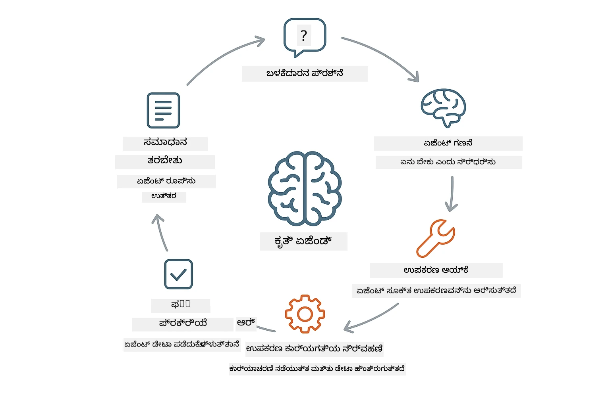
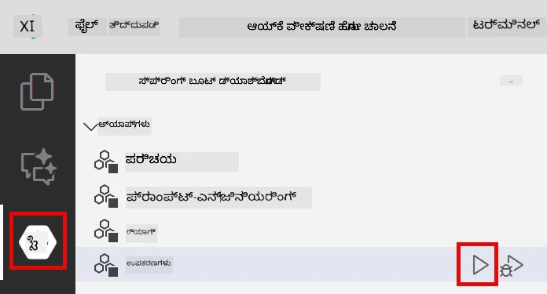
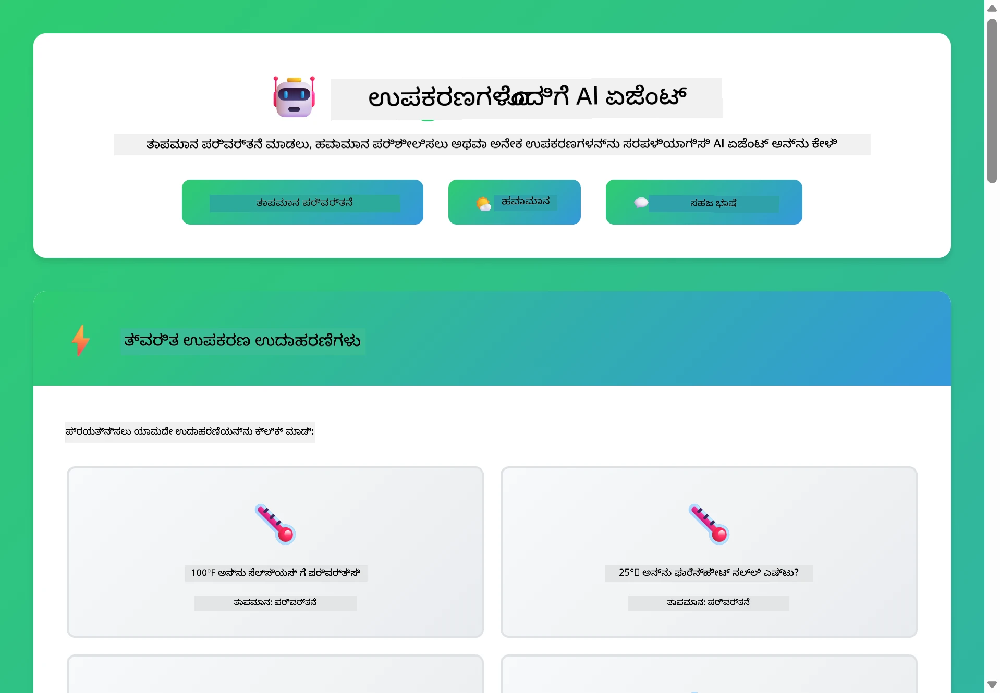

# Module 04: ಟೂಲ್‌ಗಳೊಂದಿಗೆ AI ಏಜೆಂಟ್ಗಳು

## ವಿಷಯಗಳ ಪಟ್ಟಿಕೆ

- [ನೀವು ಏನು ಕಲಿಯುತ್ತೀರಿ](../../../04-tools)
- [ಪೂರ್ವಾಪೇಕ್ಷಣಗಳು](../../../04-tools)
- [ಟೂಲ್ಗಳೊಂದಿಗೆ AI ಏಜೆಂಟ್ಗಳನ್ನು ಅರ್ಥಮಾಡಿಕೊಳ್ಳುವುದು](../../../04-tools)
- [ಟೂಲ್ ಕಾಲ್ ಮಾಡಲು ಹೇಗೆ ಕೆಲಸ ಮಾಡುತ್ತದೆ](../../../04-tools)
  - [ಟೂಲ್ನ ನಿರೂಪಣೆ](../../../04-tools)
  - [ತೀರ್ಮಾನ ಸ್ವೀಕರಣ](../../../04-tools)
  - [ನಿರ್ವಹಣೆ](../../../04-tools)
  - [ಪ್ರತಿಕ್ರಿಯೆ ರಚನೆ](../../../04-tools)
- [ಟೂಲ್ ಚೈನಿಂಗ್](../../../04-tools)
- [ಅನುದಿನವನ್ನು ಚಲಾಯಿಸಿ](../../../04-tools)
- [ಅನುದಿನ ಬಳಕೆ](../../../04-tools)
  - [ಸರಳ ಟೂಲ್ ಬಳಕೆ ಪ್ರಯತ್ನಿಸಿ](../../../04-tools)
  - [ಟೂಲ್ ಚೈನಿಂಗ್ ಪರೀಕ್ಷಿಸಿ](../../../04-tools)
  - [ಸಂವಾದದ ಪ್ರವಾಹ ನೋಡಿ](../../../04-tools)
  - [ಬೆರೆಗಿನ ವಿನಂತಿಗಳೊಂದಿಗೆ ಪ್ರಯೋಗ ಮಾಡಿ](../../../04-tools)
- [ಪ್ರಮುಖ ತತ್ವಗಳು](../../../04-tools)
  - [ReAct ಮಾದರಿ (ಕಾರಣ ಮತ್ತು ಕ್ರಿಯೆಗಳು)](../../../04-tools)
  - [ಟೂಲ್ ವಿವರಣೆ ಮಹತ್ವವುಳ್ಳದು](../../../04-tools)
  - [ಸೆಷನ್ ನಿರ್ವಹಣೆ](../../../04-tools)
  - [ದೋಷ ನಿರ್ವಹಣೆ](../../../04-tools)
- [ಲಭ್ಯವಿರುವ ಟೂಲ್ಗಳು](../../../04-tools)
- [ಯಾವಾಗ ಟೂಲ್ ಆಧಾರಿತ ಏಜೆಂಟ್ ಬಳಕೆ ಮಾಡುವುದು](../../../04-tools)
- [ಮುಂದಿನ ಹಂತಗಳು](../../../04-tools)

## ನೀವು ಏನು ಕಲಿಯುತ್ತೀರಿ

ಈವರೆಗೆ, ನೀವು AI ಜೊತೆ ಸಂಭಾಷಣೆ ಮಾಡುವುದು, ಪ್ರಾಂಪ್ಟ್‌ಗಳನ್ನು ಪರಿಣಾಮಕಾರಿಯಾಗಿ ರಚಿಸುವುದು ಮತ್ತು ಪ್ರತ್ಯುತ್ತರಗಳನ್ನು ನಿಮ್ಮ ಪ್ರമാണಗಳಲ್ಲಿ ಆಧರಿಸುವುದು ಹೇಗೆ ಎಂಬುದನ್ನು ಕಲಿತಿದ್ದೀರಿ. ಆದರೆ ಇನ್ನೂ ಒಂದು ಮೂಲಭೂತ ಮಿತಿಯಿದೆ: ಭಾಷಾ ಮಾದರಿಗಳು ಕೇವಲ ಪಠ್ಯವನ್ನು ಉತ್ಪಾದಿಸಬಹುದು. ಅವು ಹವಾಮಾನ ಪರಿಶೀಲನೆ, ಗಣನೆ ಮಾಡುವುದು, ಡೇಟಾಬೇಸ್ ಪ್ರಶ್ನಿಸುವುದು ಅಥವಾ ಬಾಹ್ಯ ವ್ಯವಸ್ಥೆಗಳೊಡನೆ ಸಂವಹನ ಮಾಡಲಾರವು.

ಟೂಲ್ಗಳು ಈ ಮಿತಿಯನ್ನು ಬದಲಾಯಿಸುತ್ತವೆ. ಮಾದರಿಗೆ ಕರೆ ಮಾಡಬಹುದಾದ ಕಾರ್ಯಗಳನ್ನು ಒದಗಿಸುವ ಮೂಲಕ, ನೀವು ಅದನ್ನು ಪಠ್ಯ ಉತ್ಪಾದಕನಿಂದ ಕ್ರಿಯೆಗಳನ್ನೂ ಕೈಗೊಳ್ಳುವ ಏಜೆಂಟ್ ಆಗಿ ಪರಿವರ್ತಿಸುತ್ತೀರಿ. ಮಾದರಿ ಯಾವಾಗ ಟೂಲ್ ಅಗತ್ಯವಿದೆ, ಯಾವ ಟೂಲ್ ಬಳಸಬೇಕು ಮತ್ತು ಯಾವ ಪರಿಮಾಣಗಳನ್ನು ಪಾಸ್ ಮಾಡಬೇಕು ಎಂದು ನಿರ್ಧರಿಸುತ್ತದೆ. ನಿಮ್ಮ ಕೋಡ್ ಆ ಕಾರ್ಯವನ್ನು ನಡೆಸಿ ಫಲಿತಾಂಶವನ್ನು ಮರಳಿ ನೀಡುತ್ತದೆ. ಮಾದರಿ ಆ ಫಲಿತಾಂಶವನ್ನು ತನ್ನ ಪ್ರತಿಕ್ರಿಯೆಯಲ್ಲಿ ಸೇರಿಸುತ್ತೆ.

## ಪೂರ್ವಾಪೇಕ್ಷಣಗಳು

- ಮಾಡ್ಯೂಲ್ 01 ಪೂರ್ಣಗೊಂಡಿದೆ (Azure OpenAI ಸಂಪನ್ಮೂಲಗಳು ನಿಯೋಜಿಸಲಾಗಿದೆ)
- ರೂಟ್ ಡೈರೆಕ್ಟರಿಯಲ್ಲಿ `.env` ಫೈಲ್ with Azure ಪ್ರಾಮಾಣಿಕೆ (ಮಾಡ್ಯೂಲ್ 01 ರಲ್ಲಿ `azd up` ಮೂಲಕ ಸೃಷ್ಟಿಸಲಾಗಿದೆ)

> **ಗಮನಿಸಿ:** ನೀವು ಮಾಡ್ಯೂಲ್ 01 ಪೂರ್ಣಗೊಳಿಸದೇ ಇದ್ದರೆ, ಮೊದಲು ಅಲ್ಲಿ ನೀಡಲಾದ ನಿಯೋಜನೆ ಸೂಚನೆಗಳನ್ನು ಅನುಸರಿಸಿ.

## ಟೂಲ್ಗಳೊಂದಿಗೆ AI ಏಜೆಂಟ್‌ಗಳನ್ನು ಅರ್ಥಮಾಡಿಕೊಳ್ಳುವುದು

> **📝 ಟಿಪ್ಪಣಿ:** ಈ ಮಾಡ್ಯೂಲ್‌ನಲ್ಲಿ "ಏಜೆಂಟ್‌ಗಳು" ಎಂಬ ಪದವು ಟೂಲ್-ಕಾಲಿಂಗ್ ಸಾಮರ್ಥ್ಯಗಳನ್ನು ಹೊಂದಿರುವ AI ಸಹಾಯಕರನ್ನು ಸೂಚಿಸುತ್ತದೆ. ಇದು [ಮಾಡ್ಯೂಲ್ 05: MCP](../05-mcp/README.md) ನಲ್ಲಿ ಚರ್ಚಿಸಬೇಕಾದ **ಏಜೆಂಟಿಕ್ AI** ಮಾದರಿಗಳ (ಸ್ವಯಂಚಾಲಿತ ಏಜೆಂಟ್‌ಗಳು, ಯೋಜನೆ, ಸ್ಮರಣೆ ಮತ್ತು ಬಹು ಹಂತದ ನಿರ್ಧಾರಗಳು) ಪಕ್ಕದಲ್ಲಿ ವ್ಯತ್ಯಾಸವಾಗಿದೆ.

ಟೂಲ್ಗಳೊಂದಿಗೆ AI ಏಜೆಂಟ್ ReAct (ಕಾರಣ ಮತ್ತು ಕ್ರಿಯೆ) ಮಾದರಿಯನ್ನು ಅನುಸರಿಸುತ್ತದೆ:

1. ಬಳಕೆದಾರರು ಪ್ರಶ್ನೆ ಕೇಳುತ್ತಾರೆ
2. ಏಜೆಂಟ್ ಏನು ತಿಳಿದುಕೊಳ್ಳಬೇಕೆಂಬುದನ್ನು ಯೋಚಿಸುತ್ತದೆ
3. ಪ್ರತಿಕ್ರಿಯಿಸಲು ಟೂಲ್ ಬೇಕೆಂದು ತೀರ್ಮಾನಿಸುತ್ತದೆ
4. ಹೌದಾದರೆ ಸರಿಯಾದ ಪರಿಮಾಣಗಳೊಂದಿಗೆ ಸೂಕ್ತ ಟೂಲ್ಗೆ ಕರೆ ಮಾಡುತ್ತದೆ
5. ಟೂಲ್ ಕಾರ್ಯನಿರ್ವಹಿಸಿ ಡೇಟಾವನ್ನು ಮರಳಿ ನೀಡುತ್ತದೆ
6. ಏಜೆಂಟ್ ಅವುಗಳನ್ನು ಸೇರಿಸಿ ಅಂತಿಮ ಉತ್ತರವನ್ನು ನೀಡುತ್ತದೆ



*ReAct ಮಾದರಿ - AI ಏಜೆಂಟ್‌ಗಳು ಸಮಸ್ಯೆಗಳನ್ನು ಪರಿಹರಿಸಲು ಯೋಚನೆ ಮತ್ತು ಕ್ರಿಯೆಯ ನಡುವೆ ಪರ್ಯಾಯವಾಗಿ ಕಾರ್ಯನಿರ್ವಹಿಸುವುದು*

ಇದು ಸ್ವಯಂಚಾಲಿತವಾಗಿ ನಡೆಯುತ್ತದೆ. ನೀವು ಟೂಲ್ಗಳನ್ನು ಮತ್ತು ಅವುಗಳ ವಿವರಣೆಗಳನ್ನು ನಿರೂಪಿಸುತ್ತೀರಿ. ಮಾದರಿ ಅವುಗಳನ್ನು ಯಾವಾಗ ಮತ್ತು ಹೇಗೆ ಬಳಸಬೇಕು ಎಂಬ ನಿರ್ಧಾರಗಳನ್ನು ನಿರ್ವಹಿಸುತ್ತದೆ.

## ಟೂಲ್ ಕಾಲ್ ಮಾಡುವ ವಿಧಾನ

### ಟೂಲಿನ ನಿರೂಪಣೆ

[WeatherTool.java](../../../04-tools/src/main/java/com/example/langchain4j/agents/tools/WeatherTool.java) | [TemperatureTool.java](../../../04-tools/src/main/java/com/example/langchain4j/agents/tools/TemperatureTool.java)

ನೀವು ಸ್ಪಷ್ಟ ವಿವರಣೆಗಳ ಮತ್ತು ಪರಿಮಾಣ ನಿರ್ದಿಷ್ಟತೆಗಳೊಂದಿಗೆ ಕಾರ್ಯಗಳನ್ನು ನಿರೂಪಿಸುತ್ತೀರಿ. ಮಾದರಿ ಈ ವಿವರಣೆಗಳನ್ನು ತನ್ನ ಸಿಸ್ಟಮ್ ಪ್ರಾಂಪ್ಟ್‌ನಲ್ಲಿ ನೋಡಿ ಪ್ರತಿ ಟೂಲ್ನೇನು ಮಾಡುತ್ತದೆಯೆಂಬುದನ್ನು ಅರ್ಥಮಾಡಿಕೊಳ್ಳುತ್ತದೆ.

```java
@Component
public class WeatherTool {
    
    @Tool("Get the current weather for a location")
    public String getCurrentWeather(@P("Location name") String location) {
        // ನಿಮ್ಮ ಹವಾಮಾನ ಹುಡುಕಾಟ ಲಾಜಿಕ್
        return "Weather in " + location + ": 22°C, cloudy";
    }
}

@AiService
public interface Assistant {
    String chat(@MemoryId String sessionId, @UserMessage String message);
}

// ಸಹಾಯಕನು ಸ್ವಯಂಚಾಲಿತವಾಗಿ ಸ್ಪ್ರಿಂಗ್ ಬೂಟ್ ಮೂಲಕ ಸಂಪರ್ಕಿತವಾಗಿದೆ:
// - ಚ್ಯಾಟ್ ಮಾದರಿ ಬೀನ್ನು
// - @Component ತರಗತಿಗಳಿಂದ ಎಲ್ಲಾ @Tool ವಿಧಾನಗಳು
// - ಸೆಷನ್ ನಿರ್ವಹಣೆಗೆ ಚ್ಯಾಟ್ ಮೆಮರಿ ಪೂರೈಕೆದಾರ
```

> **🤖 [GitHub Copilot](https://github.com/features/copilot) ಚಾಟ್‌ನಲ್ಲಿ ಪ್ರಯತ್ನಿಸಿ:** [`WeatherTool.java`](../../../04-tools/src/main/java/com/example/langchain4j/agents/tools/WeatherTool.java) ತೆರೆಯಿರಿ ಮತ್ತು ಕೇಳಿ:
> - "ನೀರುಮಾದ ಹವಾಮಾನ ಡೇಟಾ ಬದಲು ನಿಜವಾದ ಹವಾಮಾನ API ಆದಾಗ OpenWeatherMap ಅನ್ನು ಹೇಗೆ ಒಕ್ಕೂಡಿಸಬಹುದು?"
> - "ಹಲವು AI ಸರಿಯಾಗಿ ಟೂಲ್ ಬಳಕೆ ಮಾಡಲು ಸಹಾಯ ಮಾಡುವ ಉತ್ತಮ ಟೂಲ್ ವಿವರಣೆ ಎಂದರೇನು?"
> - "ಟೂಲ್ ಕಾರ್ಯಗತಗೊಳಿಸುವಿಕೆಯಲ್ಲಿ API ದೋಷಗಳು ಮತ್ತು ದರ ಮಿತಿಗಳನ್ನು ಹೇಗೆ ನಿರ್ವಹಿಸಬೇಕು?"

### ತೀರ್ಮಾನ ಸ್ವೀಕರಣ

ಬಳಕೆದಾರರು "ಸೀಯಾಟಲ್‌ನಲ್ಲಿ ಹವಾಮಾನ ಏನು?" ಎಂದು ಕೇಳಿದಾಗ, ಮಾದರಿ ಹವಾಮಾನ ಟೂಲ್ನ ಅಗತ್ಯವಿರುವುದನ್ನು ಗುರುತಿಸುತ್ತದೆ. ಅದು ಸ್ಥಳ ಪರಿಮಾಣ "ಸೀಯಾಟಲ್" ಎಂದು ಹೊಂದಿಸಿ ಕಾರ್ಯ ಕಾಲ್ ರಚಿಸುತ್ತದೆ.

### ನಿರ್ವಹಣೆ

[AgentService.java](../../../04-tools/src/main/java/com/example/langchain4j/agents/service/AgentService.java)

Spring Boot ಘೋಷಿತ `@AiService` ಇಂಟರ್ಫೇಸ್ನ ಮೂಲಕ ಎಲ್ಲಾ ನೋಂದಾಯಿತ ಟೂಲ್ಗಳನ್ನು ಸ್ವಯಂಚಾಲಿತವಾಗಿ ಜೋಡಿಸಿಬಿಡುತ್ತದೆ ಮತ್ತು LangChain4j ಟೂಲ್ ಕಾಲ್‌ಗಳನ್ನು ಸ್ವಯಂಚಾಲಿತವಾಗಿ ಕಾರ್ಯಗತಗೊಳಿಸುತ್ತದೆ.

> **🤖 [GitHub Copilot](https://github.com/features/copilot) ಚಾಟ್‌ನಲ್ಲಿ ಪ್ರಯತ್ನಿಸಿ:** [`AgentService.java`](../../../04-tools/src/main/java/com/example/langchain4j/agents/service/AgentService.java) ತೆರೆಯಿರಿ ಮತ್ತು ಕೇಳಿ:
> - "ReAct ಮಾದರಿ ಹೇಗೆ ಕಾರ್ಯನಿರ್ವಹಿಸುತ್ತದೆ ಮತ್ತು AI ಏಜೆಂಟ್ಗಳಿಗೆ ಇದು ಏಕೆ ಪರಿಣಾಮಕಾರಿ?"
> - "ಏಜೆಂಟ್ ಯಾವ ಟೂಲ್ಸ್ ಬಳಸದೆಯೆ ಮತ್ತು ಯಾವ ಕ್ರಮದಲ್ಲಿ ಬಳಸುವುದನ್ನು ಹೇಗೆ ನಿರ್ಧರಿಸುತ್ತದೆ?"
> - "ಟೂಲ್ ಕಾರ್ಯನಿರ್ವಹಣೆ ವಿಫಲವಾದರೆ ಏನು ನಡೆಯುತ್ತದೆ - ದೋಷಗಳನ್ನು ದಟ್ಟಾಗಿ ಹೇಗೆ ನಿರ್ವಹಿಸಬೇಕು?"

### ಪ್ರತಿಕ್ರಿಯೆ ರಚನೆ

ಮಾದರಿ ಹವಾಮಾನ ಡೇಟಾ ಪಡೆದ ಮೇಲೆ ಅದನ್ನು ನೈಸರ್ಗಿಕ ಭಾಷೆಯ ಪ್ರತಿಕ್ರಿಯೆಯಾಗಿ ವರ್ಗಾಯಿಸುತ್ತದೆ.

### ಘೋಷಣಾತ್ಮಕ AI ಸೇವೆಗಳ ಉಪಯೋಗ ಏಕೆ?

ಈ ಮಾಡ್ಯೂಲ್ LangChain4j ರ Spring Boot ಏಕೀಕರಣವನ್ನು `@AiService` ಘೋಷಣಾತ್ಮಕ ಇಂಟರ್ಫೇಸ್ಗಳೊಂದಿಗೆ ಬಳಸುತ್ತದೆ:

- **Spring Boot ಸ್ವಯಂಚಾಲಿತ ಜೋಡಣೆ** - ChatModel ಮತ್ತು ಟೂಲ್‌ಗಳನ್ನು ಸ್ವಯಮvastaveiglichahe
- **@MemoryId ಮಾದರಿ** - ಸ್ವಯಂಚಾಲಿತ ಸೆಷನ್ ಆಧಾರಿತ ಸ್ಮರಣೆ ನಿರ್ವಹಣೆ
- **ಏಕ ಘಟಕ** - ಸಹಾಯಕ ಒಮ್ಮೆ ಸೃಷ್ಟಿಸಿ ಪುನರಾವರ್ತನೆಗೆ ಬಳಸುವುದು
- **ಪ್ರಕಾರ ಸುರಕ್ಷಿತ ಕಾರ್ಯಗತಿ** - ಜಾವಾ ಮೆಥಡ್ಗಳನ್ನು ಡೈರೆಕ್ಟ್ ಟೈಪ್ ಪರಿವಾರ್ತನದೊಂದಿಗೆ ಕರೆ ಮಾಡುವುದು
- **ಬಹು-ಮುಗಿ ಸಂಚಿಕೆಯ ಸಂಯೋಜನೆ** - ಟೂಲ್ ಚೈನಿಂಗ್ ಅನ್ನು ಸ್ವಯಂಚಾಲಿತವಾಗಿ ನಿರ್ವಹಿಸುತ್ತದೆ
- **ಸೊಂಟದ ಪೂರ್ವವಾಯು** - ಕೈಯಿಂದ AiServices.builder() ಕರೆಯಬೇಕಾಗಿಲ್ಲ ಅಥವಾ ಸ್ಮರಣೆ HashMap ಇಲ್ಲ

ವೈಕಲ್ಪಿಕ ಮೆಥಡ್‌ಗಳು (ಕೈಯಿಂದ AiServices.builder() ) ಹೆಚ್ಚಿನ ಕೋಡ್ ಬೇಕು ಮತ್ತು Spring Boot ಏಕೀಕರಣದ ಪ್ರಯೋಜನಗಳನ್ನು ಇಟ್ಟುಕೊಳ್ಳಲಾರವು.

## ಟೂಲ್ ಚೈನಿಂಗ್

**ಟೂಲ್ ಚೈನಿಂಗ್** - AI ನಿರಂತರವಾಗಿ ಹಲವಾರು ಟೂಲ್‌ಗಳಿಗೆ ಕರೆ ಮಾಡಬಹುದು. "ಸೀಯಾಟಲ್‌ನಲ್ಲಿ ಹವಾಮಾನ ಏನು ಮತ್ತು ಚೆಪ್ಲೆಟ್ ತರುವುದೇ?" ಎಂದು ಕೇಳಿ ಮತ್ತು ಅದು `getCurrentWeather` ಅನ್ನು ಮ المطرಗಳ ಕುರಿತು ಯೋಚನೆ ಜೊತೆಗೆ ಸರಣಿಯಾಗಿ ಹೇಗೆ ಕರೆಮಾಡುತ್ತದೆ ಎಂದು ಗಮನಿಸಿ.

<a href="images/tool-chaining.png"></a>

*ಸರಣಿ ಟೂಲ್ ಕಾಲ್‌ಗಳು - ಒಂದು ಟೂಲ್‌ನ ಔಟ್‌ಪುಟ್ ಮುಂದಿನ ನಿರ್ಧಾರಕ್ಕೆ ಪೂರಕ*

**ಸುಂದರ ವೈಫಲ್ಯಗಳು** - ಮಾದರಿ ಡೇಟಾದಲ್ಲಿಲ್ಲದ ನಗರದಲ್ಲಿ ಹವಾಮಾನ ಕೇಳಿ. ಟೂಲ್ ದೋಷ ಸಂದೇಶ ನೀಡುತ್ತದೆ ಮತ್ತು AI ಸಹಾಯ ಮಾಡಲು ಸಾಧ್ಯವಿಲ್ಲವೆಂದು ವಿವರಿಸುತ್ತದೆ. ಟೂಲ್ಗಳು ಸುರಕ್ಷಿತವಾಗಿ ವೈಫಲ್ಯಗೊಳ್ಳುತ್ತವೆ.

ಇದು ಒಂದೇ ಸಂಭಾಷಣೆಯ ಪ್ರವೃತ್ತಿಯಲ್ಲಿ ನಡೆಯುತ್ತದೆ. ಏಜೆಂಟ್ ಸ್ವಯಂಚಾಲಿತವಾಗಿ ಹಲವಾರು ಟೂಲ್ ಕಾಲ್‌ಗಳನ್ನು ಪ್ರबंधಿಸುತ್ತದೆ.

## ಅನುದಿನವನ್ನು ಚಲಾಯಿಸಿ

**ನಿಯೋಜನ ಪರಿಶೀಲಿಸಿ:**

ರೂಟ್ ಡೈರೆಕ್ಟರಿಯಲ್ಲಿ `.env` ಫೈಲ್ ಇದೆ ಎಂದು ಖಚಿತಪಡಿಸಿಕೊಳ್ಳಿ (ಮಾಡ್ಯೂಲ್ 01 ರಲ್ಲಿ ಸೃಷ್ಟಿಸಲಾಗಿದೆ):
```bash
cat ../.env  # AZURE_OPENAI_ENDPOINT, API_KEY, DEPLOYMENT ತೋರಿಸಬೇಕು
```

**ಅನುದಿನವನ್ನು ಆರಂಭಿಸಿ:**

> **ಗಮನಿಸಿ:** ನೀವು ಈಗಾಗಲೇ ಎಲ್ಲಾ ಅನುದಿನಗಳನ್ನು ಮಾಡ್ಯೂಲ್ 01 ನಲ್ಲಿ `./start-all.sh` ಬಳಸಿ ಪ್ರಾರಂಭಿಸಿರುವ болса, ಈ ಮಾಡ್ಯೂಲ್ 8084 ಬಂದರಿನಲ್ಲಿ ಈಗಾಗಲೇ ಚಲಿಸುತ್ತಿದೆ. ನೀವು ಕೆಳಗಿನ ಪ್ರಾರಂಭದ ಆಜ್ಞೆಗಳನ್ನು ಬಿಟ್ಟು ನೇರವಾಗಿ http://localhost:8084 ಗೆ ಹೋಗಬಹುದು.

**ಆಯ್ಕೆ 1: Spring Boot ಡ್ಯಾಶ್‌ಬೋರ್ಡ್ ಬಳಕೆ (VS ಕೋಡ್ ಬಳಕೆದಾರರಿಗಾಗಿ ಶಿಫಾರಸು ಮಾಡಲ್ಪಟ್ಟಿದೆ)**

ಡೆವ್ ಕಂಟೈನರ್ Spring Boot ಡ್ಯಾಶ್‌ಬೋರ್ಡ್ ವಿಸ್ತರಣೆ ಹೊಂದಿದೆ, ಇದು ಎಲ್ಲಾ Spring Boot ಅನುದಿನಗಳನ್ನು ನಿರ್ವಹಿಸಲು ದೃಶ್ಯಾತ್ಮಕ ಇಂಟರ್ಫೇಸ್ ಒದಗಿಸುತ್ತದೆ. ನೀವು ಇದನ್ನು VS ಕೋಡ್‌ನ ಎಡಬದಿಯ Activity Bar ನಲ್ಲಿ (Spring Boot ಚಿಹ್ನೆ ಹುಡುಕಿ) ಕಾಣಬಹುದು.

Spring Boot ಡ್ಯಾಶ್‌ಬೋರ್ಡ್‌ನಿಂದ, ನೀವು:
- ಕಾರ್ಯಾಂಗದಲ್ಲಿರುವ ಎಲ್ಲಾ ಲಭ್ಯವಿರುವ Spring Boot ಅನುದಿನಗಳನ್ನು ನೋಡಿ
- ಕ್ಲಿಕ್ ಒಂದರಿಂದ ಅನುದಿನಗಳನ್ನು ಪ್ರಾರಂಭ/ನಿಲ್ಲಿಸಿ
- ಅನುದಿನ ಲಾಗಿಂಗನ್ನು ನಿಜಕಾಲದಲ್ಲಿ ವೀಕ್ಷಿಸಿ
- ಅನುದಿನ ಸ್ಥಿತಿಗಳನ್ನು ಮೇಲ್ವಿಚಾರಣೆ ಮಾಡಿ

"tools" ಪಕ್ಕದಲ್ಲಿ ಪ್ಲೇ ಬಟನ್ ಕ್ಲಿಕ್ ಮಾಡಿ ಈ ಮಾಡ್ಯೂಲ್ ಪ್ರಾರಂಭಿಸಿ ಅಥವಾ ಒಂದೇಬಾರಿಗೆ ಎಲ್ಲಾ ಮಾಡ್ಯೂಲ್‌ಗಳನ್ನು ಪ್ರಾರಂಭಿಸಿ.



**ಆಯ್ಕೆ 2: ಶೆಲ್ ಸ್ಕ್ರಿಪ್ಟ್ ಬಳಕೆ**

ಎಲ್ಲಾ ವೆಬ್ ಅನುದಿನಗಳನ್ನು ಪ್ರಾರಂಭಿಸಿ (ಮಾಡ್ಯೂಲ್ 01-04):

**ಬ್ಯಾಶ್:**
```bash
cd ..  # ರೂಟ್ ಡೈರೆಕ್ಟರಿಯಿಂದ
./start-all.sh
```

**ಪವರ್‌ಶೆಲ್:**
```powershell
cd ..  # ರುಟ್ ಡೈರೆಕ್ಟರಿಗೆಂದಿಂದ
.\start-all.ps1
```

ಅಥವಾ ಕೇವಲ ಈ ಮಾಡ್ಯೂಲ್ ಪ್ರಾರಂಭಿಸಿ:

**ಬ್ಯಾಶ್:**
```bash
cd 04-tools
./start.sh
```

**ಪವರ್‌ಶೆಲ್:**
```powershell
cd 04-tools
.\start.ps1
```

ಎರಡೂ ಸ್ಕ್ರಿಪ್ಟ್‌ಗಳು ಸ್ವಯಂಚಾಲಿತವಾಗಿ ರೂಟ್ `.env` ಫೈಲ್‌ನಿಂದ ಪರಿಸರ ಚರಗಳನ್ನೂ ಲೋಡ್ ಮಾಡುತ್ತವೆ ಮತ್ತು JAR ಗಳು ಲಭ್ಯವಿಲ್ಲದಿದ್ದರೆ ಅವು ನಿರ್ಮಿಸಲ್ಪಡುತ್ತವೆ.

> **ಗಮನಿಸಿ:** ನೀವು ಎಲ್ಲಾ ಮಾಡ್ಯೂಲ್‌ಗಳನ್ನು ಕೈಯಿಂದ ನಿರ್ಮಿಸಲು ಇಚ್ಛಿಸಿದರೆ:
>
> **ಬ್ಯಾಶ್:**
> ```bash
> cd ..  # Go to root directory
> mvn clean package -DskipTests
> ```
>
> **ಪವರ್‌ಶೆಲ್:**
> ```powershell
> cd ..  # Go to root directory
> mvn clean package -DskipTests
> ```

ನೀವು ಬ್ರೌಸರ್‌ನಲ್ಲಿ http://localhost:8084 ತೆರೆಯಿರಿ.

**ನಿಲ್ಲಿಸಲು:**

**ಬ್ಯಾಶ್:**
```bash
./stop.sh  # ಈ ಮೋಡ್ಯೂಲ್ ಮಾತ್ರ
# ಅಥವಾ
cd .. && ./stop-all.sh  # ಎಲ್ಲಾ ಮೋಡ್ಯೂಲ್ಗಳೂ
```

**ಪವರ್‌ಶೆಲ್:**
```powershell
.\stop.ps1  # ಈ ಮೋಡ್ಯೂಲ್ ಮಾತ್ರ
# ಅಥವಾ
cd ..; .\stop-all.ps1  # ಎಲ್ಲಾ ಮೋಡ್ಯೂಲ್‌ಗಳು
```

## ಅನುದಿನ ಬಳಕೆ

ಅನುದಿನವು ಹವಾಮಾನ ಮತ್ತು ತಾಪಮಾನ ಪರಿವರ್ತನ ಟೂಲ್ಗಳಿಗೆ ಪ್ರವೇಶ ಹೊಂದಿರುವ AI ಏಜೆಂಟ್‌తో ಸಂವಹನ ಮಾಡಲು ವೆಬ್ ಇಂಟರ್ಫೇಸ್ ಒದಗಿಸುತ್ತದೆ.

<a href="images/tools-homepage.png"></a>

*AI ಏಜೆಂಟ್ ಟೂಲ್‌ಗಳ ಇಂಟರ್ಫೇಸ್ - ಟೂಲ್‌ಗಳೊಂದಿಗೆ ಸಂವಹನಕ್ಕೆ ವೇಗದ ಉದಾಹರಣೆಗಳು ಮತ್ತು ಚಾಟ್ ಇಂಟರ್ಫೇಸ್*

### ಸರಳ ಟೂಲ್ ಬಳಕೆ ಪ್ರಯತ್ನಿಸಿ

ಸರಳ ವಿನಂತಿಯಿಂದ ಪ್ರಾರಂಭಿಸಿ: "100 ಡಿಗ್ರೀ ಫಾರೆನ್ಹೈಟ್ ಅನ್ನು ಸೆಲ್ಸಿಯಸ್‌ಗೆ ಪರಿವರ್ತಿಸಿ". ಏಜೆಂಟ್ ತಾಪಮಾನ ಪರಿವರ್ತನಾ ಟೂಲ್ ಬೇಕೆಂದು ಗುರುತಿಸಿ, ಸೂಕ್ತ ಪರಿಮಾಣಗಳೊಂದಿಗೆ ಕರೆ ಮಾಡಿ ಫಲಿತಾಂಶ ಮರಳಿಸುತ್ತದೆ. ಈ ಸಹಜತೆ ಗಮನಿಸಿ - ನೀವು ಯಾವ ಟೂಲ್ ಬಳಸಬೇಕು ಅಥವಾ ಹೇಗೆ ಕರೆಮಾಡಬೇಕು ಎಂದು ನಿರ್ದಿಷ್ಟಪಡಿಸಿರಲಿಲ್ಲ.

### ಟೂಲ್ ಚೈನಿಂಗ್ ಪರೀಕ್ಷಿಸಿ

ಈಗ ಸ್ವಲ್ಪ ಜಟಿಲವಾದುದನ್ನು ಪ್ರಯತ್ನಿಸಿ: "ಸೀಯಾಟಲ್‌ನ ಹವಾಮಾನ ಏನು ಮತ್ತು ಅದನ್ನು ಫಾರೆನ್ಹೈಟ್‌ಗೆ ಪರಿವರ್ತಿಸಿ?" ಏಜೆಂಟ್ ಹಂತ ಹಂತವಾಗಿ ಕೆಲಸ ಮಾಡುತ್ತಿರುವುದು ನೋಡಿರಿ. ಮೊದಲು ಹವಾಮಾನ ಪಡೆಯುತ್ತದೆ (ಸೆಲ್ಸಿಯಸ್‌ಗೆ ಮರಳುತ್ತದೆ), ನಂತರ ಅದನ್ನು ಫಾರೆನ್ಹೈಟ್‌ಗೆ ಪರಿವರ್ತಿಸುವ ಟೂಲ್‌ಗೆ ಕರೆಮಾಡುತ್ತದೆ ಮತ್ತು ಫಲಿತಾಂಶಗಳನ್ನು ಸಂಯೋಜಿಸಿ ಒಟ್ಟು ಪ್ರತಿಕ್ರಿಯೆ ನೀಡುತ್ತದೆ.

### ಸಂಭಾಷಣೆಯ ಪ್ರವಾಹ ನೋಡಿ

ಚಾಟ್ ಇಂಟರ್ಫೇಸ್ ಸಂಭಾಷಣೆಯ ಇತಿಹಾಸವನ್ನು ಉಳಿಸುತ್ತದೆ, ಬಹು-ಮುಖ ಸಂವಹನಗಳನ್ನು ಮಾಡಲು ಸಾಧ್ಯವಾಗುತ್ತದೆ. ನೀವು ಹಿಂದಿನ ಎಲ್ಲಾ ಪ್ರಶ್ನೆಗಳು ಮತ್ತು ಉತ್ತರಗಳನ್ನು ನೋಡಿ ಸಂಭಾಷಣೆಯನ್ನು ಸರಳವಾಗಿ ಟ್ರ್ಯಾಕ್ ಮಾಡಬಹುದು ಮತ್ತು ಏಜೆಂಟ್ ಹೇಗೆ ಪ್ರಚ್ಛಂದವಾದ ಸಂಧರ್ಭವನ್ನು ನಿರ್ಮಿಸುತ್ತದೆ ಎಂಬುದನ್ನು ಅರ್ಥಮಾಡಿಕೊಳ್ಳಬಹುದು.

<a href="images/tools-conversation-demo.png"></a>

*ಬಹು-ಮುಗಿ ಸಂಭಾಷಣೆ - ಸರಳ ಪರಿವರ್ತನೆಗಳು, ಹವಾಮಾನ ಪರಿಶೀಲನೆಗಳು ಮತ್ತು ಟೂಲ್ ಚೈನಿಂಗ್ ತೋರಿಕೆ*

### ಬೇರೆ ಬೇರೆ ವಿನಂತಿಗಳೊಂದಿಗೆ ಪ್ರಯೋಗ ಮಾಡಿ

ನಾನಾ ಸಂಯೋಜನೆಗಳನ್ನು ಪ್ರಯತ್ನಿಸಿ:
- ಹವಾಮಾನ ಪರಿಶೀಲನೆ: "ಟೊಕ್ಯೋನಲ್ಲಿ ಹವಾಮಾನ ಎನು?"
- ತಾಪಮಾನ ಪರಿವರ್ತನೆ: "25°C ಅನ್ನು ಕೆಲ್ವಿನ್‌ಗೆ ಎಷ್ಟು?"
- ಸಂಯೋಜಿತ ಪ್ರಶ್ನೆಗಳು: "ಪ್ಯಾರಿಸ್‌ನ ಹವಾಮಾನ ಪರಿಶೀಲಿಸಿ ಮತ್ತು ಅದು 20°Cಕ್ಕೆ ಮೇಲು ಆಗಿದೆಯೇ ಕೇಳಿ"

ನೀವು ಗಮನಿಸಿರಿ ಏಜೆಂಟ್ ನೈಸರ್ಗಿಕ ಭಾಷೆಯನ್ನು ಹೇಗೆ ಅರ್ಥಮಾಡಿಕೊಂಡು ಸೂಕ್ತ ಟೂಲ್ ಕಾಲ್‌ಗಳಿಗೆ ಮ್ಯಾಪ್ ಮಾಡುತ್ತದೆ.

## ಪ್ರಮುಖ ತತ್ವಗಳು

### ReAct ಮಾದರಿ (ಕಾರಣ ಮತ್ತು ಕ್ರಿಯೆಗಳು)

ಏಜೆಂಟ್ ಯೋಚಿಸಲು (ಏನು ಮಾಡಬೇಕು ಎಂದು ತೀರ್ಮಾನಿಸಲು) ಮತ್ತು ಕ್ರಮ ಮಾಡಲು (ಟೂಲ್ಗಳನ್ನು ಬಳಸಲು) ಪರ್ಯಾಯವಾಗಿ ಕಾರ್ಯನಿರ್ವಹಿಸುತ್ತದೆ. ಈ ಮಾದರಿ ಸ್ವಾಯತ್ತ ಸಮಸ್ಯಾ ಪರಿಹಾರವನ್ನು ಸಕ್ರಿಯಗೊಳಿಸುತ್ತದೆ, ಕೇವಲ ಸೂಚನೆಗಳಿಗೆ ಪ್ರತಿಕ್ರಿಯಿಸುವುದಲ್ಲ.

### ಟೂಲ್ ವಿವರಣೆ ಮಹತ್ವವುಳ್ಳದು

ನಿಮ್ಮ ಟೂಲ್ ವಿವರಗಳ ಗುಣಮಟ್ಟವೇ ಏಜೆಂಟ್ ಅವುಗಳನ್ನು ಹೇಗೆ ಬಳಸುವುದನ್ನು ನೇರವಾಗಿ ಪ್ರಭಾವಿಸುವುದು. ಸ್ಪಷ್ಟ, ನಿಖರ ವಿವರಣೆಗಳು ಮಾದರಿಯನ್ನು ಯಾವಾಗ ಮತ್ತು ಹೇಗೆ ಟೂಲ್‌ಗೆ ಕರೆಯಬೇಕು ಎಂದು ಅರ್ಥಮಾಡಿಕೊಳ್ಳಲು ಸಹಾಯ ಮಾಡುತ್ತವೆ.

### ಸೆಷನ್ ನಿರ್ವಹಣೆ

`@MemoryId` ಅನೋಟೇಶನ್ ಸ್ವಯಂಚಾಲಿತ ಸೆಷನ್ ಆಧಾರಿತ ಸ್ಮರಣೆ ನಿರ್ವಹಣೆಯನ್ನು ಸಕ್ರಿಯಗೊಳಿಸುತ್ತದೆ. ಪ್ರತಿ ಸೆಷನ್ ಐಡಿಗೆ ತನ್ನದೇ ಆದ `ChatMemory` ಉದಾಹರಣೆ ಇದೆ, ಮತ್ತು ಅದನ್ನು `ChatMemoryProvider` ಬೀನ್ ನಿರ್ವಹಿಸುತ್ತದೆ, ಕೈಯಿಂದ ಸ್ಮರಣೆ ಟ್ರ್ಯಾಕಿಂಗ್ ಅಗತ್ಯವಿಲ್ಲ ಮಾಡುತ್ತದೆ.

### ದೋಷ ನಿರ್ವಹಣೆ

ಟೂಲ್ಗಳು ವೈಫಲ್ಯಗೊಳ್ಳಬಹುದು - API ಗಳು ಸಮಯ ಮೀರಬಹುದು, ಪರಿಮಾಣಗಳು ಅಮಾನ್ಯವಾಗಬಹುದು, ಬಾಹ್ಯ ಸೇವೆಗಳು ಕೆಲಸ ನಿಲ್ಲಿಸಬಹುದು. ಉತ್ಪಾದನಾ ಏಜೆಂಟ್‌ಗಳು ದೋಷ ನಿರ್ವಹಣೆಯನ್ನು ಹೊಂದಿರಬೇಕು ताकि ಮಾದರಿ ಸಮಸ್ಯೆಗಳನ್ನು ವಿವರಿಸಬಹುದು ಅಥವಾ ಪರ್ಯಾಯ ಪ್ರಯತ್ನ ಮಾಡಬಹುದು.

## ಲಭ್ಯವಿರುವ ಟೂಲ್ಗಳು

**ಹವಾಮಾನ ಟೂಲ್ಗಳು** (ದರ್ಶನಕ್ಕಾಗಿ ಮೋಕ್ ಡೇಟಾ):
- ಸ್ಥಳದ ಪ್ರಸ್ತುತ ಹವಾಮಾನ ಪಡೆಯುವುದು
- ಬಹುದಿನಗಳ ಪೂರ್ವಾಂಕುಳ ಪಡೆಯುವುದು

**ತಾಪಮಾನ ಪರಿವರ್ತನಾ ಟೂಲ್ಗಳು:**
- ಸೆಲ್ಸಿಯಸ್ to ಫಾರೆನ್ಹೈಟ್
- ಫಾರೆನ್ಹೈಟ್ to ಸೆಲ್ಸಿಯಸ್
- ಸೆಲ್ಸಿಯಸ್ to ಕೆಲ್ವಿನ್
- ಕೆಲ್ವಿನ್ to ಸೆಲ್ಸಿಯಸ್
- ಫಾರೆನ್ಹೈಟ್ to ಕೆಲ್ವಿನ್
- ಕೆಲ್ವಿನ್ to ಫಾರೆನ್ಹೈಟ್

ಇವು ಸರಳ ಉದಾಹರಣೆಗಳು, ಆದರೆ ಮಾದರಿ ಯಾವುದೇ ಕಾರ್ಯಕ್ಕೆ ಅನ್ವಯಿಸುತ್ತದೆ: ಡೇಟಾಬೇಸ್ ವಿಚಾರಣೆಗಳು, API ಕಾಲ್‌ಗಳು, ಗಣನೆ, ಫೈಲ್ ಆಪರೇಷನ್ಸ್ ಅಥವಾ ವ್ಯವಸ್ಥೆ ಆಜ್ಞೆಗಳು.

## ಯಾವಾಗ ಟೂಲ್ ಆಧಾರಿತ ಏಜೆಂಟ್‌ಗಳನ್ನು ಬಳಸಬೇಕು

**ಟೂಲ್‌ಗಳನ್ನು ಬಳಸುವಾಗ:**
- ಪ್ರತಿಕ್ರಿಯೆ ಹೊಂದಿಸಲು ಸಕಾಲಿಕ ಡೇಟಾ ಬೇಕಾಗಿರುವಾಗ (ಹವಾಮಾನ, ಷೇರು ಬೆಲೆಗಳು, ಇನ್ವೆಂಟರಿ)
- ಸರಳ ಗಣಿತಕ್ಕಿಂತ ಹೆಚ್ಚುವರಿ ಲೆಕ್ಕಾಚಾರಗಳು ಮಾಡಬೇಕಾದಾಗ
- ಡೇಟಾಬೇಸ್ ಅಥವಾ API ಗಳ ಪ್ರವೇಶ ಕೊಳ್ಳಬೇಕಾದಾಗ
- ಕ್ರಿಯೆಗಳು (ಇಮೇಲ್ ಕಳುಹಿಸುವುದು, ಟಿಕೆಟ್ ಸೃಷ್ಟಿಸುವುದು, ದಾಖಲೆಗಳನ್ನು ನವೀಕರಿಸುವುದು) ತೆಗೆದುಕೊಳ್ಳುವಾಗ
- ಹಲವಾರು ಡೇಟಾ ಮೂಲಗಳನ್ನು ಸಂಯೋಜಿಸುವಾಗ

**ಟೂಲ್‌ಗಳನ್ನು ಬಳಸಬಾರದು:**
- ಪ್ರಶ್ನೆಗಳಿಗೆ ಸಾಮಾನ್ಯ ಜ್ಞಾನದಿಂದ ಉತ್ತರಿಸಬಹುದಾದಾಗ
- ಪ್ರತಿಕ್ರಿಯೆ ಕೇವಲ ಸಂಭಾಷಣೆಯಿದ್ದಾಗ
- ಟೂಲ್ ನಿರ್ದೇಶನದ ತಡವು ಅನುಭವವನ್ನು ನಿಧಾನಗೊಳಿಸುವಾಗ

## ಮುಂದಿನ ಹಂತಗಳು

**ಮುಂದಿನ ಮಾಡ್ಯೂಲ್:** [05-mcp - ಮಾದರಿ ಸನ್ನಿವೇಶ ಪ್ರೋಟೋಕಾಲ್ (MCP)](../05-mcp/README.md)

---

**ನಾವಿಗೇಶನ್:** [← ಹಿಂದೆ: ಮಾಡ್ಯೂಲ್ 03 - RAG](../03-rag/README.md) | [ಮುಖ್ಯ ಪುಟಕ್ಕೆ ಹಿಂತಿರುಗಿ](../README.md) | [ಮುಂದೆ: ಮಾಡ್ಯೂಲ್ 05 - MCP →](../05-mcp/README.md)

---

<!-- CO-OP TRANSLATOR DISCLAIMER START -->
**ತ್ಯಾಗ ಪತ್ರಿಕೆ**:  
ಈ ದಾಖಲೆವನ್ನು AI ಅನುವಾದ ಸೇವೆ [Co-op Translator](https://github.com/Azure/co-op-translator) ಬಳಸಿ ಅನುವದಿಸಲಾಗಿದೆ. ನಾವು ನಿಖರತೆಯನ್ನು ಸಾಧಿಸಲು ಪ್ರಯತ್ನಿಸುತ್ತಿದ್ದರೂ, ಸ್ವಯಂಚಾಲಿತ ಅನುವಾದಗಳಲ್ಲಿ ತಪ್ಪುಗಳು ಅಥವಾ ಅಸಮರ್ಪಕತೆಗಳು ಇರಬಹುದು ಎಂದು ದಯವಿಟ್ಟು ಗಮನಿಸಿ. ಮೂಲ ದಾಖಲೆ ಅದರ ಸ್ಥಳೀಯ ಭಾಷೆಯಲ್ಲಿ ಅಧಿಕೃತ ಮೂಲವೆಯಾಗಿ ಪರಿಗಣಿಸಬೇಕು. ಪ್ರಮುಖ ಮಾಹಿತಿಗಾಗಿ, ವೃತ್ತಿಪರ ಮಾನವ ಅನುವಾದವನ್ನು ಶಿಫಾರಸು ಮಾಡಲಾಗುತ್ತದೆ. ಈ ಅನುವಾದ ಬಳಕೆಯಿಂದ ಮೂಡಬಹುದಾದ ಯಾವುದೇ ತಪ್ಪುರ್ಥನೆಗಳು ಅಥವಾ ತಪ್ಪು ವಿವರಣೆಗಳಿಗಾಗಿ ನಾವು ಜವಾಬ್ದಾರರಾಗುವುದಿಲ್ಲ.
<!-- CO-OP TRANSLATOR DISCLAIMER END -->