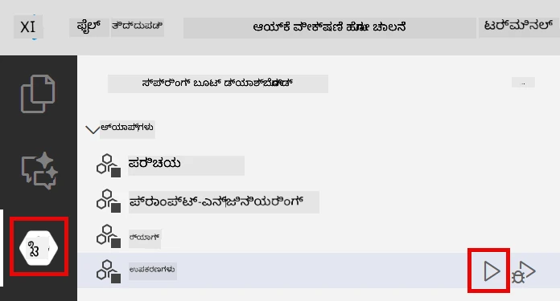
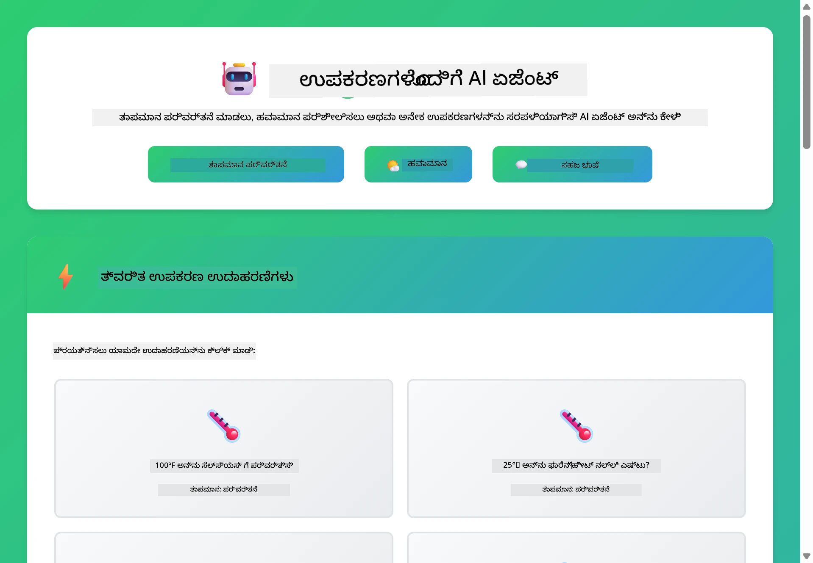
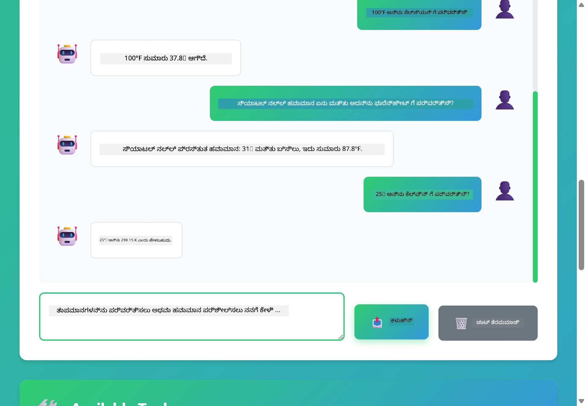

# Module 04: AI ಏಜೆಂಟ్లు ಉಪಕರಣಗಳೊಂದಿಗೆ

## ವಿಷಯಗಳ ಪಟ್ಟಿ

- [ವೀಡಿಯೊ ಮಾರ್ಗದರ್ಶನ](#ವೀಡಿಯೊ-ಮಾರ್ಗದರ್ಶನ)
- [ನಿಮಗೆ ಏನು ಕಲಿಯಲಿದೆ](#ನಿಮಗೆ-ಏನು-ಕಲಿಯಲಿದೆ)
- [ಆವಶ್ಯಕತೆಗಳು](#ಆವಶ್ಯಕತೆಗಳು)
- [ಉಪಕರಣಗಳೊಂದಿಗೆ AI ಏಜೆಂಟ್ಸ್ ಅನ್ನು ಅರ್ಥಮಾಡಿಕೊಳ್ಳುವುದು](#ಉಪಕರಣಗಳೊಂದಿಗೆ-ai-ಏಜೆಂಟ್ಸ್-ಅನ್ನು-ಅರ್ಥಮಾಡಿಕೊಳ್ಳುವುದು)
- [ಉಪಕರಣ ಕರೆ ಹೇಗೆ ಕಾರ್ಯನಿರ್ವಹಿಸುತ್ತದೆ](#ಉಪಕರಣ-ಕರೆ-ಹೇಗೆ-ಕಾರ್ಯನಿರ್ವಹಿಸುತ್ತದೆ)
  - [ಉಪಕರಣ ವ್ಯಾಖ್ಯಾನಗಳು](#ಉಪಕರಣ-ವ್ಯಾಖ್ಯಾನಗಳು)
  - [ ನಿರ್ಧಾರ ಕೈಗೊಳ್ಳುವುದು](#ನಿರ್ಧಾರ-ಕೈಗೊಳ್ಳುವುದು)
  - [ನಿರ್ವಹಣೆ](#ನಿರ್ವಹಣೆ)
  - [ಪ್ರತಿಕ್ರಿಯೆ ರಚನೆ](#ಪ್ರತಿಕ್ರಿಯೆ-ರಚನೆ)
  - [ವಾಸ್ತುಶಿಲ್ಪ: ಸ್ಪ್ರಿಂಗ್ ಬೂಟ್ ಸ್ವಯಂ-ವೈರಿಂಗ್](#ವಾಸ್ತುಶಿಲ್ಪ-ಸ್ಪ್ರಿಂಗ್-ಬೂಟ್-ಸ್ವಯಂ-ವೈರಿಂಗ್)
- [ಉಪಕರಣ ಸರಪಳಿ](#ಉಪಕರಣ-ಸರಪಳಿ)
- [ಅಪ್ಲಿಕೇಶನ್ ಜೋಡಿಸಿ](#ಅಪ್ಲಿಕೇಶನ್-ಜೋಡಿಸಿ)
- [ಅಪ್ಲಿಕೇಶನ್ ಬಳಕೆ](#ಅಪ್ಲಿಕೇಶನ್-ಬಳಕೆ)
  - [ಸರಳ ಉಪಕರಣ ಬಳಕೆ ಪ್ರಯತ್ನಿಸಿ](#ಸರಳ-ಉಪಕರಣ-ಬಳಕೆಯನ್ನು-ಪ್ರಯತ್ನಿಸಿ)
  - [ಉಪಕರಣ ಸರಪಳಿಗಾಗಿ ಪರೀಕ್ಷಿಸಿ](#ಟೂಲ್-ಚೈನ್-ಪರೀಕ್ಷೆ)
  - [ಸಂವಾದ ಹರಿವಿನಲ್ಲಿ ನೋಡಿ](#ಸಂಭಾಷಣಾ-ಹರಿವು-ನೋಡಿ)
  - [ವಿಭಿನ್ನ ವಿನಂತಿಗಳೊಂದಿಗೆ ಅನುಭವಿಸಿ](#ವಿವಿಧ-ವಿನಂತಿಗಳನ್ನು-ಪ್ರಯತ್ನಿಸಿ)
- [ಮುಖ್ಯ концеп್ಗಳು](#ಮುಖ್ಯ-ಪರಿಕಲ್ಪನೆಗಳು)
  - [ReAct ಪ್ಯಾಟರ್ನ್ (ತರ್ಕ ಮತ್ತು ಕ್ರಮ)](#react-ಮಾದರಿ-ತರ್ಕ-ಮತ್ತು-ಕಾರ್ಯ)
  - [ಉಪಕರಣ ವಿವರಣೆಗಳು ಮುಖ್ಯಬಾಗಿವೆ](#ಉಪಕರಣ-ವಿವರಣೆಗಳು-ಮುಖ್ಯ)
  - [ಸತ್ರ ನಿರ್ವಹಣೆ](#ಸೆಷನ್-ನಿರ್ವಹಣೆ)
  - [ದೋಷ ಹ್ಯಾಂಡ್ಲಿಂಗ್](#ದೋಷ-ನಿರ್ವಹಣೆ)
- [ಲಭ್ಯವಿರುವ ಉಪಕರಣಗಳು](#ಲಭ್ಯವಿರುವ-ಉಪಕರಣಗಳು)
- [ಯಾಗಾಗಲೀ ಉಪಕರಣ-ಆಧಾರಿತ ಏಜೆಂಟ್ಸ್ ಬಳಕೆ ಮಾಡುವುದು](#ಉಪಕರಣ-ಆಧಾರಿತ-ಏಜೆಂಟ್‌ಗಳನ್ನು-ಯಾವಾಗ-ಬಳಸಬೇಕು)
- [ಉಪಕರಣಗಳು ಮತ್ತು RAG](#ಉಪಕರಣಗಳು-ಮತ್ತು-rag)
- [ಮುಂದಿನ ಹಂತಗಳು](#ಮುಂದಿನ-ಹಂತಗಳು)

## ವೀಡಿಯೊ ಮಾರ್ಗದರ್ಶನ

ಈ ಮಾಯಾಜಾಲವನ್ನು ಹೇಗೆ ಪ್ರಾರಂಭಿಸಬೇಕು ಎಂಬುದನ್ನು ವಿವರಣಾತ್ಮಕವಾಗಿ ತಿಳಿಸುವ ಈ ಲೈಕ್ ಸೆಷನ್ ನೋಡಿ:

<a href="https://www.youtube.com/watch?v=O_J30kZc0rw"></a>

## ನಿಮಗೆ ಏನು ಕಲಿಯಲಿದೆ

ಈವರೆಗೂ, ನೀವು AIೊಂದಿಗೆ ಸಂಭಾಷಣೆಗಳನ್ನು ನಡೆಸುವಿಕೆ, ಪ್ರಾಂಪ್ಟ್‌ಗಳನ್ನು ಪರಿಣಾಮಕಾರಿಯಾಗಿ ರಚಿಸುವಿಕೆ ಮತ್ತು ಉತ್ತರಗಳನ್ನು ಡಾಕ್ಯುಮೆಂಟ್ಸ್‌ನಲ್ಲಿ ಸ್ಥಾಪಿಸುವಿಕೆ ಏನಾಗುತ್ತದೆ ಎಂದು ಕಲಿತಿದ್ದೀರ. ಆದರೆ ಇನ್ನೂ ಒಂದು ಆಧಾರಭೂತ ಮಿತಿಯಿದೆ: ಭಾಷಾ ಮಾದರಿಗಳು ಪಠ್ಯವನ್ನು ಮಾತ್ರ ಉತ್ಪಾದಿಸಬಹುದು. ಅವು ಹವಾಮಾನ ಪರಿಶೀಲಿಸಲು, ಗಣನೆ ಮಾಡಲು, ಡೇಟಾಬೇಸ್‌ಗಳನ್ನ ವಿಚಾರಿಸುವುದಕ್ಕೆ ಅಥವಾ ಬಾಹ್ಯ ವ್ಯವಸ್ಥೆಗಳೊಂದಿಗೆ ಸಂವಹನ ಮಾಡಲು ಸಾಧ್ಯವಿಲ್ಲ.

ಉಪಕರಣಗಳು ಇದನ್ನು ಬದಲಿಸುತ್ತವೆ. ಮಾದರಿಗೆ ಕರೆ ಮಾಡಬಹುದಾದ ಕಾರ್ಯಕ್ಷಮತೆ ನೀಡುವುದರಿಂದ ಅವು ಪಠ್ಯ ಉತ್ಪಾದಕನಿಂದ ಕ್ರಮ ಕೈಗೊಳ್ಳುವ ಏಜೆಂಟ್ ಆಗಿ ಮಾರ್ಪಡುತ್ತವೆ. ಮಾದರಿ ಯಾವಾಗ ಉಪಕರಣ ಬೇಕು, ಯಾವ ಉಪಕರಣ ಬಳಸಬೇಕು ಮತ್ತು ಯಾವುದೇ ಪ್ಯಾರಾಮೀಟರ್‌ಗಳನ್ನು ನೀಡಬೇಕೆಂಬುದನ್ನು ನಿರ್ಧರಿಸುತ್ತದೆ. ನಿಮ್ಮ ಕೋಡ್ ಆ ಕಾರ್ಯಕ್ಷಮತೆಯನ್ನು ನಿರ್ವಹಿಸಿ ಫಲಿತಾಂಶವನ್ನು ಹಿಂತಿರುಗಿಸುತ್ತದೆ. ಮಾದರಿ ಆ ಫಲಿತಾಂಶವನ್ನು ತನ್ನ ಪ್ರತಿಕ್ರಿಯೆಗೆ ಸೇರಿಸುತ್ತದೆ.

## ಆವಶ್ಯಕತೆಗಳು

- ಪೂರ್ಣಗೊಳಿಸಿರುವ [Module 01 - ಪರಿಚಯ](../01-introduction/README.md) (ಅಜೂರ್ ಓಪನ್AI ಸಂಪನ್ಮೂಲಗಳು ನಿಯೋಜಿಸಲಾಗಿದೆ)
- ಪೂರ್ವದ ಮಾಡ್ಯೂಲ್‌ಗಳನ್ನು ಪೂರ್ಣಗೊಳಿಸಿರಬೇಕು (ಈ ಮಾಡ್ಯೂಲ್ [RAG ಕಲ್ಪನೆಗಳನ್ನು Module 03](../03-rag/README.md) ನಿಯೋಜನೆ ಮಾಡುತ್ತದೆ)
- ರೂಟ್ ಡೈರೆಕ್ಟ್ರಿಯಲ್ಲಿ `.env` ಫೈಲ್ ಅಜೂರ್ ಪ್ರಮಾಣಪತ್ರಗಳೊಂದಿಗೆ (Module 01 ರಲ್ಲಿ `azd up` ರನ್ ಮಾಡುವ ಮೂಲಕ ಸೃಷ್ಟಿಸಲಾಗಿದೆ)

> **ಸೂಚನೆ:** ನೀವು Module 01 ಮುಗಿಸದಿದ್ದರೆ, ಮೊದಲಿಗೆ ನಿಯೋಜನೆ ಸೂಚನೆಗಳನ್ನು ಅನುಸರಿಸಿ.

## ಉಪಕರಣಗಳೊಂದಿಗೆ AI ಏಜೆಂಟ್ಸ್ ಅನ್ನು ಅರ್ಥಮಾಡಿಕೊಳ್ಳುವುದು

> **📝 ಟಿಪ್ಪಣಿ:** ಈ ಮಾಡ್ಯೂಲ್‌ನಲ್ಲಿ "ಏಜೆಂಟ್ಸ್" ಪದ AI ಸಹಾಯಕರನ್ನು ಸೂಚಿಸುತ್ತದೆ, ಉಪಕರಣ-ಕಾಲ್ ಮಾಡುವ ಸಾಮರ್ಥ್ಯಗಳೊಂದಿಗೆ ವೃದ್ಧಿಪಡಿಸಲಾಗಿದೆ. ಇದು [Module 05: MCP](../05-mcp/README.md) ನಲ್ಲಿ ನಾವು ಕವರ್ ಮಾಡುವ **Agentic AI** ಮಾದರಿಗಳು (ಸ್ವಯಂಚಾಲಿತ ಏಜೆಂಟ್ಸ್, ಯೋಜನೆ, ಸ್ಮರಣೆ ಮತ್ತು ಬಹು-ಹಂತ ರೀಸನಿಂಗ್) ಭಿನ್ನವಾಗಿದೆ.

ಉಪಕರಣಗಳಿಲ್ಲದೆ, ಭಾಷಾ ಮಾದರಿ ತನ್ನ ತರಬೇತಿ ಡೇಟಾದಿಂದ ಮಾತ್ರ ಪಠ್ಯವನ್ನು ಉತ್ಪಾದಿಸಬಹುದು. ನಿರ್ಧಿಷ್ಟ ಹವಾಮಾನವನ್ನು ಕೇಳಿದರೆ, ಅದು ಊಹೆ ಮಾಡಬೇಕು. ಉಪಕರಣಗಳನ್ನು ನೀಡಿದರೆ, ಅದು ಹವಾಮಾನ API ಅನ್ನು ಕರೆ ಮಾಡಬಹುದು, ಗಣನೆ ಮಾಡಿ ಅಥವಾ ಡೇಟಾಬೇಸ್ ವಿಚಾರಿಸಬಹುದು — ನಂತರ ಆ ವಾಸ್ತವಿಕ ಫಲಿತಾಂಶಗಳನ್ನು ತನ್ನ ಉತ್ತರದಲ್ಲಿ ಬೆರೆಸಿಕೊಳ್ಳಬಹುದು.


*ಉಪಕರಣವಿಲ್ಲದೆ ಮಾದರಿ ಊಹಿಸಲು ಮಾತ್ರ ಸಾಧ್ಯ — ಉಪಕರಣಗಳೊಂದಿಗೆ ಅದು APIs ಅನ್ನು ಕರೆ ಮಾಡಬಹುದು, ಗಣನೆಗಳು ನಡೆಸಬಹುದು ಮತ್ತು ನೈಜ-ಸಮಯ ದತ್ತಾಂಶ ಹಿಂತಿರುಗಿಸಬಹುದು.*

ಉಪಕರಣಗಳೊಂದಿಗೆ AI ಏಜೆಂಟ್ ಒಂದು **ಅವಲೋಕನ ಮತ್ತು ಕ್ರಮ (ReAct)** ಮಾದರಿಯನ್ನು ಅನುಸರಿಸುತ್ತದೆ. ಮಾದರಿ ಕೇವಲ ಪ್ರತಿಕ್ರಿಯಿಸುವುದಿಲ್ಲ — ಅದು ಏನು ಬೇಕು ಎಂದು ಯೋಚಿಸುತ್ತದೆ, ಉಪಕರಣವನ್ನು ಕರೆಮಾಡಿ ಕ್ರಮವನ್ನು ಕೈಗೊಳ್ಳುತ್ತದೆ, ಫಲಿತಾಂಶವನ್ನು ಗಮನಿಸುತ್ತಿದೆ ಮತ್ತು ಮತ್ತೆ ಕ್ರಮ ಕೈಗೊಳ್ಳಬೇಕೆಂಬುದನ್ನು ಅಥವಾ ಅಂತಿಮ ಉತ್ತರವನ್ನು ನೀಡಬೇಕೆಂಬುದನ್ನು ನಿರ್ಧರಿಸುತ್ತದೆ:

1. **ತರ್ಕಮಾಡೋಣ** — ಬಳಕೆದಾರನ ಪ್ರಶ್ನೆಯನ್ನು ವಿಶ್ಲೇಷಿಸಿ ಯಾವ ಮಾಹಿತಿ ಬೇಕೆಂದು ನಿರ್ಧರಿಸುವುದು  
2. **ಕ್ರಮ ತೆಗೆದುಕೊಳ್ಳಿ** — ಸರಿಯಾದ ಉಪಕರಣವನ್ನು ಆಯ್ಕೆಮಾಡಿ, ಸರಿಯಾದ ಪ್ಯಾರಾಮೀಟರ್‌ಗಳನ್ನು ರಚಿಸಿ ಮತ್ತು ಅದನ್ನು ಕರೆಮಾಡುವುದು  
3. **ನೋಟಮಾಡಿ** — ಉಪಕರಣದ ಫಲಿತಾಂಶವನ್ನು ಪಡೆದು ಪರಿಶೀಲಿಸುವುದು  
4. **ಮರುಕಳುಹಿಸಿ ಅಥವಾ ಪ್ರತಿಕ್ರಿಯಿಸಿ** — ಇನ್ನಷ್ಟು ಡೇಟಾ ಬೇಕಾದರೆ ಪುನರಾವೃತ್ತಿ ಮಾಡುವುದು; ಇಲ್ಲದಿದ್ದರೆ ಸರಳ ಉತ್ತರ ರಚಿಸುವುದು


*ReAct ಚಕ್ರ — ಏಜೆಂಟ್ ಏನು ಮಾಡಬೇಕೆಂದು ತರ್ಕಮಾಡುತ್ತದೆ, ಉಪಕರಣವನ್ನು ಕರೆಮಾಡಿ ಕ್ರಮ ತೆಗೆದುಕೊಳ್ಳುತ್ತದೆ, ಫಲಿತಾಂಶವನ್ನು ಗಮನಿಸಿ ಬಂದಿಲ್ಲಿಗೆ ಅಂತಿಮ ಉತ್ತರವನ್ನು ನೀಡುವವರೆಗೆ ಪುನರಾವೃತ್ತಿ ಮಾಡುತ್ತದೆ.*

ಇದು ಸ್ವಯಂಚಾಲಿತವಾಗಿ ನಡೆಯುತ್ತದೆ. ನೀವು ಉಪಕರಣಗಳನ್ನು ಮತ್ತು ಅವುಗಳ ವಿವರಣೆಗಳನ್ನುนิರ್ಧರಿಸುತ್ತೀರಿ. ಮಾದರಿ ಅವುಗಳನ್ನು ಬಳಸಲು ಯಾವಾಗ ಮತ್ತು ಹೇಗೆ ತಿಳಿದುಕೊಳ್ಳುವ ನಿರ್ಧಾರ ಮಾಡುತ್ತದೆ.

## ಉಪಕರಣ ಕರೆ ಹೇಗೆ ಕಾರ್ಯನಿರ್ವಹಿಸುತ್ತದೆ

### ಉಪಕರಣ ವ್ಯಾಖ್ಯಾನಗಳು

[WeatherTool.java](../../../04-tools/src/main/java/com/example/langchain4j/agents/tools/WeatherTool.java) | [TemperatureTool.java](../../../04-tools/src/main/java/com/example/langchain4j/agents/tools/TemperatureTool.java)

ನೀವು ಸ್ಪಷ್ಟ ವಿವರಣೆಗಳು ಮತ್ತು ಪ್ಯಾರಾಮೀಟರ್ ವಿವರಣೆಗಳೊಂದಿಗೆ ಕಾರ್ಯಗಳನ್ನು ವ್ಯಾಖ್ಯಾನಿಸುತ್ತೀರಿ. ಮಾದರಿ ತನ್ನ ಸಿಸ್ಟಮ್ ಪ್ರಾಂಪ್ಟ್‌ನಲ್ಲಿ ಈ ವಿವರಣೆಗಳನ್ನು ನೋಡಿ ಪ್ರತಿಯೊಂದು ಉಪಕರಣ ಏನು ಮಾಡುತ್ತದೆ ಎಂದು ಅರ್ಥಮಾಡಿಕೊಳ್ಳುತ್ತದೆ.

```java
@Component
public class WeatherTool {
    
    @Tool("Get the current weather for a location")
    public String getCurrentWeather(@P("Location name") String location) {
        // ನಿಮ್ಮ ಹವಾಮಾನ ಹುಡುಕಾಟ ತರ್ಕ
        return "Weather in " + location + ": 22°C, cloudy";
    }
}

@AiService
public interface Assistant {
    String chat(@MemoryId String sessionId, @UserMessage String message);
}

// ಸಹಾಯಕನು ಸ್ವಯಂಚಾಲಿತವಾಗಿ Spring Boot ಮೂಲಕ ಸಂಪರ್ಕಿಸಲಾಗಿದೆ:
// - ChatModel ಬೀನ್
// - @Component ವರ್ಗಗಳಿಂದ ಎಲ್ಲಾ @Tool ಮೆಥೋಡ್‌ಗಳು
// - ಸೆಷನ್ ನಿರ್ವಹಣೆಗೆ ChatMemoryProvider
```

ಕೆಳಗಿನ ಚಿತ್ತರಣದಲ್ಲಿ ಪ್ರತಿ ಅಂಕಗಳನ್ನು ವಿಭಜಿಸಲಾಗಿದ್ದು, ಪ್ರತಿಯೊಂದು ಭಾಗ AIಗೆ ಉಪಕರಣವನ್ನು ಯಾವಾಗ ಕರೆ ಮಾಡಬೇಕು ಮತ್ತು ಯಾವ аргументы ಇಡುವುದೇ ಎಂಬುದನ್ನು ತಿಳಿಸುವಂತೆ ಸಹಾಯ ಮಾಡುತ್ತದೆ:


*ಉಪಕರಣ ವ್ಯಾಖ್ಯಾನದ ರಚನೆ — @Tool ಉಪಕರಣವನ್ನು ಯಾವಾಗ ಬಳಸಬೇಕು ಎಂಬುದನ್ನು AIಗೆ ಹೇಳುತ್ತದೆ, @P ಪ್ರತಿ ಪ್ಯಾರಾಮೀಟರ್ ಅನ್ನು ವಿವರಿಸುತ್ತದೆ, ಮತ್ತು @AiService ಪ್ರಾರಂಭದಲ್ಲಿ ಎಲ್ಲವನ್ನೂ ಸಂಧಿಸುತ್ತದೆ.*

> **🤖 [GitHub Copilot](https://github.com/features/copilot) ಚಾಟ್‌ನೊಂದಿಗೆ ಪ್ರಯತ್ನಿಸಿ:** [`WeatherTool.java`](../../../04-tools/src/main/java/com/example/langchain4j/agents/tools/WeatherTool.java) ತೆರೆದೂ ಕೇಳಿ:  
> - "ಪ್ರಾಮಾಣಿಕ ಡೇಟಾ ಬದಲು mock data ನಂತರ OpenWeatherMap ನಂತಹ ನಿಜವಾದ ಹವಾಮಾನ API ಅನ್ನು ಹೇಗೆ ಇಂಟಿಗ್ರೇಟ್ ಮಾಡಲಿ?"  
> - "AI ಉಪಕರಣವನ್ನು ಸರಿಯಾಗಿ ಬಳಸಲು ಸಹಾಯ ಮಾಡುವ ಉತ್ತಮ ಉಪಕರಣ ವಿವರಣೆ ಹೇಗಿರಬೇಕು?"  
> - "API错误和速率限制处理要怎么实现?"

### ನಿರ್ಧಾರ ಕೈಗೊಳ್ಳುವುದು

ಬಳಕೆದಾರ "ಸಿಯಾಟಲ್‌ನಲ್ಲಿ ಹವಾಮಾನ ಏನೆಂದು?" ಎಂದು ಕೇಳಿದಾಗ, ಮಾದರಿ ಯಾದೃಚ್ಛಿಕವಾಗಿ ಉಪಕರಣ ಆಯ್ಕೆಮಾಡುವುದಿಲ್ಲ. ಅದು ಬಳಕೆದಾರದ ಉದ್ದೇಶವನ್ನು ಪ್ರತಿ ಉಪಕರಣ ವಿವರಣೆಯೊಂದಿಗೆ ಹೋಲಿಕೆ ಮಾಡುತ್ತದೆ, ಪ್ರತ್ಯೇಕವಾಗಿ ಪ್ರಾಸಕ್ತಿಗಾಗಿ ಅಂಕ ಹಚ್ಚುತ್ತದೆ ಮತ್ತು ಉತ್ತಮ ಹೊಂದಿಕೆಯನ್ನು ಆಯ್ಕೆಮಾಡುತ್ತದೆ. ನಂತರ ಸರಿಯಾದ ಪ್ಯಾರಾಮೀಟರ್‌ಗಳೊಂದಿಗೆ ರಚಿತ ಕಾರ್ಯಕ್ಷಮತೆ ಕರೆ ರಚಿಸುತ್ತದೆ — ಈ ದೃಷ್ಠಾಂತದಲ್ಲಿ `location` ಅನ್ನು `"Seattle"` ಎಂದು ನಿಗದಿಪಡಿಸುತ್ತದೆ.

ಯಾವುದೇ ಉಪಕರಣ ಬಳಕೆದಾರನ ವಿನಂತಿಗೆ ಹೊಂದಿಕೆಯಾಗದಿದ್ದರೆ, ಮಾದರಿ ತನ್ನ ಜ್ಞಾನದಿಂದ ಉತ್ತರ ನೀಡುತ್ತದೆ. ಬಹುಮಾನ ಉಪಕರಣಗಳು ಹೊಂದಿಕೆಯಾಗಿದ್ದರೆ, ಮಾದರಿ ಅತ್ಯಂತ ವಿಶಿಷ್ಟವಾದುದನ್ನು ಆಯ್ಕೆಮಾಡುತ್ತದೆ.


*ಮಾದರಿ ಪ್ರತಿ ಲಭ್ಯವಿರುವ ಉಪಕರಣವನ್ನು ಬಳಕೆದಾರದ ಉದ್ದೇಶಕ್ಕೆ ಮೌಲ್ಯಮಾಪನ ಮಾಡಿ ಅತ್ಯುತ್ತಮ ಹೊಂದಿಕೆಯನ್ನು ಆಯ್ಕೆಮಾಡುತ್ತದೆ — ಇದಕ್ಕಾಗಿ ಸ್ಪಷ್ಟ, ನಿರ್ದಿಷ್ಟ ಉಪಕರಣ ವಿವರಣೆಗಳನ್ನು ಬರೆಯುವುದು ಮುಖ್ಯ.*

### ನಿರ್ವಹಣೆ

[AgentService.java](../../../04-tools/src/main/java/com/example/langchain4j/agents/service/AgentService.java)

Spring Boot `@AiService` ಡಿಕ್ಲೇಟಿವ್ ಇಂಟರ್ಫೇಸ್ನನ್ನು ಎಲ್ಲಾ ನೋಂದಾಯಿತ ಉಪಕರಣಗಳೊಂದಿಗೆ ಸ್ವಯಂಚಾಲಿತವಾಗಿ ಜೋಡಿಸಿದೆ, ಮತ್ತು LangChain4j ಸ್ವಯಂಚಾಲಿತವಾಗಿ ಉಪಕರಣ ಕರೆಗಳನ್ನು ನಿರ್ವಹಿಸುತ್ತದೆ. ಹಿಂಬ್ಯಾಂಕ್‌ನಲ್ಲಿ, ಸಂಪೂರ್ಣ ಉಪಕರಣ ಕರೆ ಆರು ಹಂತಗಳಲ್ಲಿ ಸಾಗುತ್ತದೆ — ಬಳಕೆದಾರನ ನೈಸರ್ಗಿಕ ಭಾಷೆ ಪ್ರಶ್ನೆಯಿಂದ ಹಿಂದಿರುಗಿ ನೈಸರ್ಗಿಕ ಭಾಷೆ ಉತ್ತರಕ್ಕೆ:


*ಎಂಬರು ಎಲ್ಲ ಹಂತಗಳ ಹರಿವು — ಬಳಕೆದಾರನು ಪ್ರಶ್ನೆ ಕೇಳುತ್ತಾನೆ, ಮಾದರಿ ಉಪಕರಣ ಆಯ್ಕೆ ಮಾಡುತ್ತದೆ, LangChain4j ಅದನ್ನು ಕಾರ್ಯಗತಗೊಳಿಸುತ್ತದೆ ಮತ್ತು ಫಲಿತಾಂಶವನ್ನು ನೈಸರ್ಗಿಕ ಉತ್ತರದಲ್ಲಿ ಸೇರಿಸುತ್ತದೆ.*

ಹಿಂಬ್ಯಾಂಕ್‌ನಲ್ಲಿ, `AiServices` ಯಾವುದೇ ಉಪಕರಣಕ್ಕೆ ಅದೇ ಉಪಕರಣ-ಕಾಲ್ ಲೂಪನ್ನು ನಿರ್ವಹಿಸುತ್ತದೆ — ಇಲ್ಲಿ ಸರಳ `Calculator` ಉಪಕರಣ ಉದಾಹರಣೆಯಾಗಿ ತೋರಿಸಲಾಗಿದೆ. ಕೆಳಗಿನ ಕ್ರಮ ಚಿತ್ತರಣாவில் ಖಚಿತವಾಗಿ ದಿಟಿಸಲಾಗಿದೆ:


*ಉಪಕರಣ ಕರೆ ಲೂಪ್ — `AiServices` ನಿಮ್ಮ ಸಂದೇಶ ಮತ್ತು ಉಪಕರಣ ಸ್ಕೀಮಾಗಳನ್ನು LLM ಗೆ ಕಳುಹಿಸುತ್ತದೆ, LLM `add(42, 58)` ಎಂಬ ಕಾರ್ಯ ಕರೆಯನ್ನು ಮರುಪ್ರತಿಸುತೆ, LangChain4j ಸ್ಥಳೀಯವಾಗಿ `Calculator` ಮೆಥಡ್ ಅನ್ನು ಕಾರ್ಯಗತಗೊಳಿಸುತ್ತದೆ, ಮತ್ತು ಅಂತಿಮ ಉತ್ತರಕ್ಕಾಗಿ ಫಲಿತಾಂಶವನ್ನು ಹಿಂತಿರುಗಿಸುತ್ತದೆ.*

> **🤖 [GitHub Copilot](https://github.com/features/copilot) ಚಾಟ್‌ನೊಂದಿಗೆ ಪ್ರಯತ್ನಿಸಿ:** [`AgentService.java`](../../../04-tools/src/main/java/com/example/langchain4j/agents/service/AgentService.java) ತೆರೆದೂ ಕೇಳಿ:  
> - "ReAct ಮಾದರಿ ಹೇಗೆ ಕಾರ್ಯಗತಗೊಳಿಸಲಾಗುತ್ತದೆ ಮತ್ತು AI ಏಜೆಂಟ್‌ಗಳಿಗೆ ಇದು ಪರಿಣಾಮಕಾರಿಯೆ? "  
> - "ಏಜೆಂಟ್ ಯಾವ ಉಪಕರಣವನ್ನು ಯಾವ ಕ್ರಮದಲ್ಲಿ ಬಳಸಬೇಕೆಂದು ಹೇಗೆ ನಿರ್ಧರಿಸುತ್ತದೆ?"  
> - "ಉಪಕರಣ ನಿರ್ವಹಣೆ ವಿಫಲವಾದರೆ ಏನು — ದೋಷಗಳನ್ನು ಹೇಗೆ ದೃಢವಾಗಿ ಹ್ಯಾಂಡಲ್ ಮಾಡಬೇಕು?"

### ಪ್ರತಿಕ್ರಿಯೆ ರಚನೆ

ಮಾದರಿ ಹವಾಮಾನ ಡೇಟಾವನ್ನು ಪಡೆದು ಬಳಕೆದಾರನಿಗೆ ನೈಸರ್ಗಿಕ ಭಾಷೆಯಲ್ಲಿ ಪ್ರತಿಕ್ರಿಯೆ ರೂಪಿಗೆ ಪರಿವರ್ತಿಸುತ್ತದೆ.

### ವಾಸ್ತುಶಿಲ್ಪ: ಸ್ಪ್ರಿಂಗ್ ಬೂಟ್ ಸ್ವಯಂ-ವೈರಿಂಗ್

ಈ ಮಾಡ್ಯೂಲ್ LangChain4j ನ ಸ್ಪ್ರಿಂಗ್ ಬೂಟ್ ಏಕೀಕರಣವನ್ನು ಡಿಕ್ಲೇಟಿವ್ `@AiService` ಇಂಟರ್ಫೇಸ್‌ಗಳೊಂದಿಗೆ ಬಳಕೆಮಾಡುತ್ತದೆ. ಆರಂಭದಲ್ಲಿ Spring Boot ಪ್ರತಿ `@Component` ಅನ್ನು ಪತ್ತೆಹಚ್ಚುತ್ತದೆ ಅದು `@Tool` ವಿಧಾನಗಳನ್ನು ಬಾಳುತ್ತದೆ, ನಿಮ್ಮ `ChatModel` ಬೀನ್ ಮತ್ತು `ChatMemoryProvider` - ನಂತರ ಅವುಗಳೆಲ್ಲವನ್ನು ಸರಳ `Assistant` ಇಂಟರ್ಫೇಸ್‌ಗೆ ನೂತನವಾಗಿ ಜೋಡಿಸುತ್ತದೆ.


*`@AiService` ಇಂಟರ್ಫೇಸ್ ChatModel, ಉಪಕರಣ ಘಟಕಗಳು ಮತ್ತು ಸ್ಮರಣೆ ಒದಗಿಸುವವರನ್ನು ಜೋಡಿಸುತ್ತದೆ — Spring Boot ಎಲ್ಲ ವೈರಿಂಗ್ ಅನ್ನು ಸ್ವಯಂಚಾಲಿತವಾಗಿ ನಿರ್ವಹಿಸುತ್ತದೆ.*

ಇದು ಸಂಪೂರ್ಣ ವಿನಂತಿ ಜೀವನಚರಿತ್ರೆಯನ್ನು ಕ್ರಮ ಚಿತ್ತರಣವಾಗಿ ತೋರಿಸುತ್ತದೆ — HTTP ವಿನಂತಿಯಿಂದ ಕಂಟ್ರೋಲರ್, ಸೇವೆ ಮತ್ತು ಸ್ವಯಂ-ವೈರಿಂಗ್ ಪ್ರಾಕ್ಸಿ ಮೂಲಕ ನೀಡುವ ತನಕ, ಉಪಕರಣ ನಿರ್ವಹಣೆ ಮತ್ತು ಹಿಂತಿರುಗಿ:


*ಪೂರ್ಣ Spring Boot ವಿನಂತಿ ಜೀವನಚರಿತ್ರೆ — HTTP ವಿನಂತಿ ಕಂಟ್ರೋಲರ್ ಮತ್ತು ಸೇವೆ ಮೂಲಕ ಸ್ವಯಂಚಾಲಿತ ಉತ್ತರಕಾರಕ ಪ್ರಾಕ್ಸಿಗೆ ಹರಿದು, ಅದು LLM ಮತ್ತು ಉಪಕರಣ ಕರೆಗಳನ್ನು ಸ್ವಯಂಚಾಲಿತವಾಗಿ ವ್ಯವಸ್ಥಾಪಿಸುತ್ತದೆ.*

ಈ ವಿಧಾನದ ಪ್ರಮುಖ ಪ್ರಯೋಜನಗಳು:

- **Spring Boot ಸ್ವಯಂ-ವೈರಿಂಗ್** — ChatModel ಮತ್ತು ಉಪಕರಣಗಳು ಸ್ವಯಂಚಾಲಿತವಾಗಿ ಒಳಗೊಂಡಿರುತ್ತವೆ  
- **@MemoryId ಮಾದರಿ** — ಸ್ವಯಂಚಾಲಿತ ಸತ್ರ ಆಧಾರಿತ ಸ್ಮರಣೆ ನಿರ್ವಹಣೆ  
- **ಒಂದು ಉದಾಹರಣೆ** — Assistant ಒಮ್ಮೆ ತಯಾರಿಸಿ ಮರುಬಳಕೆಗಾಗಿ  
- **ಪ್ರಕಾರ-ಭದ್ರ ಕೊಡುಗೆ** — ಜಾವಾ ವಿಧಾನಗಳನ್ನು ನೇರವಾಗಿ ತರಗತಿ ರೂಪಾಂತರದಿಂದ ಕರೆಮಾಡು  
- **ಬಹು-ತಿರುವು ಸಂಯೋಜನೆ** — ಒಟ್ಟಾಗಿ ಉಪಕರಣ ಸರಪಳಿಯನ್ನು ಸ್ವಯಂಚಾಲಿತವಾಗಿ ನಿರ್ವಹಿಸುತ್ತದೆ  
- **ಶೂನ್ಯ ಬಾಯ್ಲರ್‌ಪ್ಲೇಟ್** — ಯಾವುದೇ ಕೈಯಿಂದ `AiServices.builder()` ಕರೆಗಳು ಅಥವಾ `HashMap` ಸ್ಮರಣೆ ಬೇಕಾಗುವುದಿಲ್ಲ

ಬದಲಿ ವಿಧಾನಗಳಾದ ಕೈಯಿಂದ `AiServices.builder()` ಹೆಚ್ಚಿನ ಕೋಡ್ ಅಗತ್ಯವಿದೆ ಮತ್ತು Spring Boot ಏಕೀಕರಣದ ಪ್ರಯೋಜನಗಳನ್ನು ತಪ್ಪಿಸುತ್ತವೆ.

## ಉಪಕರಣ ಸರಪಳಿ

**ಉಪಕರಣ ಸರಪಳಿ** — ಉಪಕರಣ ಆಧಾರಿತ ಏಜೆಂಟ್‌ಗಳ ನಿಜವಾದ ಶಕ್ತಿ ಒಂದು ಪ್ರಶ್ನೆಗೆ ಬಹು ಉಪಕರಣಗಳು ಬೇಕಾದಾಗ ಬರುತ್ತದೆ. "ಸಿಯಾಟಲ್‌ನಲ್ಲಿ ಹವಾಮಾನ ಫಾರೆನ್‌ಹೀಟ್‌ನಲ್ಲಿ ಏನೆಂದು?" ಎಂದು ಕೇಳಿದರೆ ಏಜೆಂಟ್ ಸ್ವಯಂಚಾಲಿತವಾಗಿ ಎರಡು ಉಪಕರಣಗಳನ್ನು ಸರಪಳಿ ಮಾಡುತ್ತದೆ: ಮೊದಲಿಗೆ ಅದು `getCurrentWeather` ಅನ್ನು ಕರೆಮಾಡಿ ಸೆಲ್ಸಿಯಸ್ ನಲ್ಲಿ ತಾಪಮಾನ ಪಡೆಯುತ್ತದೆ, ನಂತರ ಆ ಮೌಲ್ಯವನ್ನು `celsiusToFahrenheit` ಗೆ ಕಳುಹಿಸಿ ಬದಲಾವಣೆ ಮಾಡುತ್ತದೆ — ಇವು ಎಲ್ಲವು ಒಂದೇ ಸಂಭಾಷಣಾ ತಿರುವಿನಲ್ಲಿ.


*ಉಪಕರಣ ಸರಪಳಿಯಲ್ಲಿ — ಏಜೆಂಟ್ ಮೊದಲು getCurrentWeather ಅನ್ನು ಕರೆಮಾಡುತ್ತದೆ, ನಂತರ ಸೆಲ್ಸಿಯಸ್ ಫಲಿತಾಂಶವನ್ನು celsiusToFahrenheit ಗೆ ಪೈಪ್ ಮಾಡುತ್ತದೆ, ಮತ್ತು ಸಂಯುಕ್ತ ಉತ್ತರ ನೀಡುತ್ತದೆ.*

**ಶ್ರದ್ಧಾಪೂರ್ವಕ ವಿಫಲತೆಗಳು** — mock data ಯಲ್ಲಿ ಇಲ್ಲದ ನಗರದಲ್ಲಿ ಹವಾಮಾನ ಕೇಳಿದರೆ. ಉಪಕರಣದ ಫಲಿತಾಂಶ ದೋಷ ಸಂದೇಶ ನೀಡುತ್ತದೆ, ಮತ್ತು AI ಸಹಾಯ ಮಾಡಲಾಗುವುದಿಲ್ಲ ಎಂದು ಸ್ಪಷ್ಟಪಡಿಸುತ್ತದೆ ಬದಲಿಗೆ ಅಪ್ಲಿಕೇಶನ್ ಕ್ರ್ಯಾಷ್ ಆಗುವುದಿಲ್ಲ. ಉಪಕರಣಗಳು ಸುರಕ್ಷಿತವಾಗಿ ವಿಫಲಗೊಳ್ಳುತ್ತವೆ. ಕೆಳಗಿನ ಚಿತ್ರ ಎರಡು ವಿಧಾನಗಳನ್ನು ಹೋಲಿಸುತ್ತದೆ — ಸೂಕ್ತ ದೋಷ ನಿರ್ವಹಣೆಯೊಂದಿಗೆ ಏಜೆಂಟ್ ಅಪವಾದವನ್ನು ಹಿಡಿದು ಸಹಾಯಕರ ಪ್ರತಿಕ್ರಿಯೆಯನ್ನು ನೀಡುತ್ತದೆ, ಅದೇ ವೇಳೆ ಅದು ಇಲ್ಲದಿದ್ದರೆ ಅಪ್ಲಿಕೇಶನ್ ಸಂಪೂರ್ಣವಾಗಿ ನזಿಕೊಂಡಿರುತ್ತದೆ:


*ಉಪಕರಣ ವಿಫಲವಾದಾಗ, ಏಜೆಂಟ್ ದೋಷವನ್ನು ಹಿಡಿದು ಕ್ರ್ಯಾಷ್ ಆಗುವುದು ಬದಲು ಸಹಾಯಕರ ವಿವರಿಸಿ ಪ್ರತಿಕ್ರಿಯೆ ನೀಡುತ್ತದೆ.*

ಇದು ಒಂದೇ ಸಂಭಾಷಣಾ ತಿರುವಿನಲ್ಲಿ ನಡೆಯುತ್ತದೆ. ಏಜೆಂಟ್ ಬಹು ಉಪಕರಣ ಕರೆಗಳನ್ನು ಸ್ವತಃ ನಿರ್ವಹಿಸುತ್ತದೆ.

## ಅಪ್ಲಿಕೇಶನ್ ಜೋಡಿಸಿ

**ನಿಯೋಜನೆ ಪರಿಶೀಲಿಸಿ:**

Module 01 ನಲ್ಲಿ ಸೃಷ್ಟಿಸಲಾದ ಅಜೂರ್ ಪ್ರಮಾಣಪತ್ರಗಳೊಂದಿಗೆ `.env` ಫೈಲ್ ರೂಟ್ ಡೈರೆಕ್ಟ್ರಿಯಲ್ಲಿ ಇರುವುದನ್ನು ಖಚಿತಪಡಿಸಿಕೊಳ್ಳಿ. ಇದನ್ನು ಮಾಡ್ಯೂಲ್ ಡೈರೆಕ್ಟ್ರಿಯಲ್ಲಿ (`04-tools/`)ರಿಂದ ರನ್ ಮಾಡಿ:

**ಬ್ಯಾಶ್:**
```bash
cat ../.env  # AZURE_OPENAI_ENDPOINT, API_KEY, DEPLOYMENT ಅನ್ನು ತೋರಿಸಬೇಕು
```

**ಪವರ್‌ಶೆಲ್:**
```powershell
Get-Content ..\.env  # AZURE_OPENAI_ENDPOINT, API_KEY, DEPLOYMENT ಅನ್ನು ತೋರಿಸಬೇಕು
```

**ಅಪ್ಲಿಕೇಶನ್ ಪ್ರಾರಂಭಿಸಿ:**

> **ಸೂಚನೆ:** ನೀವು ಮೊದಲು ರೂಟ್ ಡೈರೆಕ್ಟ್ರಿಯಿಂದ `./start-all.sh` ರನ್ ಮಾಡಿಕೊಂಡಿದ್ದರೆ (Module 01 ನಲ್ಲಿ ವಿವರಿಸಲಾಗಿದೆ), ಈ ಮಾಡ್ಯೂಲ್ ಈಗಾಗಲೇ 8084 ಪೋರ್ಟ್‌ನಲ್ಲಿ ಕಾರ್ಯನಿರ್ವಹಿಸುತ್ತಿದೆ. ನೀವು ಕೆಳಗಿನ ಪ್ರಾರಂಭ ಆದೇಶಗಳನ್ನು ಉಲ್ಲೇಖಿಸದೆ ನೇರವಾಗಿ http://localhost:8084 ಗೆ ಹೋಗಬಹುದು.

**ಆಯ್ಕೆ 1: ಸ್ಪ್ರಿಂಗ್ ಬೂಟ್ ಡ್ಯಾಶ್ಬೋರ್ಡ್ ಬಳಸುವುದು (VS ಕೋಡ್ ಬಳಕೆದಾರರಿಗೆ ಶಿಫಾರಸು)**

ಡೆವ್ ಕಂಟೈನರ್ ಸ್ಪ್ರಿಂಗ್ ಬೂಟ್ ಡ್ಯಾಶ್ಬೋರ್ಡ್ ವಿಸ್ತರಣೆ ಸೇರಿದೆ, ಇದು ಎಲ್ಲಾ ಸ್ಪ್ರಿಂಗ್ ಬೂಟ್ ಅಪ್ಲಿಕೇಶನ್‌ಗಳನ್ನು ನಿರ್ವಹಿಸಲು ದೃಶ್ಯಮಯ ಇಂಟರ್ಫೇಸ್ ಒದಗಿಸುತ್ತದೆ. ನೀವು ಅದನ್ನು VS ಕೋಡ್‌ನ ಎಡಭಾಗದಲ್ಲಿನ activity ಬಾರ್‌ನಲ್ಲಿ ಕಂಡುಹೇಳಬಹುದು (ಸ್ಪ್ರಿಂಗ್ ಬೂಟ್ ಐಕಾನ್ ನೋಡಿರಿ).

ಸ್ಪ್ರಿಂಗ್ ಬೂಟ್ ಡ್ಯಾಶ್ಬೋರ್ಡ್ ಮೂಲಕ ನೀವು:
- ಕಾರ್ಯಕ್ಷೇತ್ರದಲ್ಲಿನ ಎಲ್ಲಾ ಲಭ್ಯವಿರುವ ಸ್ಪ್ರಿಂಗ್ ಬೂಟ್ ಅಪ್ಲಿಕೇಶನ್ಗಳನ್ನು ನೋಡಬಹುದು  
- ಏಕ ಕ್ಲಿಕ್ ಮೂಲಕ ಅಪ್ಲಿಕೇಶನ್‌ಗಳನ್ನು ಪ್ರಾರಂಭ/ನಿಲ್ಲಿಸಬಹುದು  
- ಅಪ್ಲಿಕೇಶನ್ ಲಾಗ್‌ಗಳನ್ನು ನಿಜ-ಸಮಯದಲ್ಲಿ ನೋಡಬಹುದು  
- ಅಪ್ಲಿಕೇಶನ್ ಸ್ಥಿತಿಯನ್ನು ನಿಗಾ ವಹಿಸಬಹುದು  

"tools" ಪಕ್ಕದ ಪ್ಲೇ ಬಟನ್ ಕ್ಲಿಕ್ ಮಾಡಿ ಈ ಮಾಡ್ಯೂಲ್ ಅನ್ನು ಪ್ರಾರಂಭಿಸಬಹುದು ಅಥವಾ ಎಲ್ಲ ಮಾಡ್ಯೂಲ್‌ಗಳನ್ನು ಒಟ್ಟಿಗೆ ಆರಂಭಿಸಬಹುದು.

VS ಕೋಡಿನಲ್ಲಿ ಸ್ಪ್ರಿಂಗ್ ಬೂಟ್ ಡ್ಯಾಶ್ಬೋರ್ಡ್ ಈ ರೀತಿ ಕಾಣುತ್ತದೆ:


*VS ಕೋಡ್‌ನಲ್ಲಿ ಸ್ಪ್ರಿಂಗ್ ಬೂಟ್ ಡ್ಯಾಶ್‌ಬೋರ್ಡ್ — ಒಬ್ಬೇ ಸ್ಥಳದಿಂದ ಎಲ್ಲಾ ಮೋಡ್ಯೂಲ್‌ಗಳನ್ನು ಪ್ರಾರಂಭಿಸಿ, ನಿಲ್ಲಿಸಿ ಮತ್ತು ಮೇಲ್ವಿಚಾರಣೆ ಮಾಡಿ*

**ಆಯ್ಕೆ 2: ಶೆಲ್ ಸ್ಕ್ರಿಪ್ಟ್ಗಳ ಬಳಕೆ**

ಎಲ್ಲಾ ವೆಬ್ ಅಪ್ಲಿಕೇಶನ್‌ಗಳು (ಮೋಡ್ಯೂಲ್‌ಗಳು 01-04) ಪ್ರಾರಂಭಿಸಿ:

**ಬ್ಯಾಶ್:**
```bash
cd ..  # ಮೂಲ ಡೈರેક્ટರಿ ನಿಂದ
./start-all.sh
```
  
**ಪವರ್‌ಶೆಲ್:**
```powershell
cd ..  # ರೂಟ್ ಡೈರೆಕ್ಟರಿ ಇಂದ
.\start-all.ps1
```
  
ಅಥವಾ ಈ ಮೋಡ್ಯೂಲ್ ಅನ್ನು ಮಾತ್ರ ಪ್ರಾರಂಭಿಸಿ:

**ಬ್ಯಾಶ್:**
```bash
cd 04-tools
./start.sh
```
  
**ಪವರ್‌ಶೆಲ್:**
```powershell
cd 04-tools
.\start.ps1
```
  
ಎರಡೂ ಸ್ಕ್ರಿಪ್ಟ್‌ಗಳು ಸ್ವಯಂಚಾಲಿತವಾಗಿ ರೂಟ್ `.env` ಫೈಲ್‌ನಿಂದ ಪರಿಸರ ನೇಮಕಾಂಕಗಳನ್ನು ಲೋಡ್ ಮಾಡುತ್ತವೆ ಮತ್ತು JAR ಗಳನ್ನು ನಿರ್ಮಿಸುವುದಿಲ್ಲದಿದ್ದರೆ ಅವುಗಳನ್ನು ನಿರ್ಮಿಸುತ್ತವೆ.

> **ಗಮನಿಸಿ:** ನೀವು ಪ್ರಾರಂಭಿಸುವ ಮೊದಲು ಎಲ್ಲಾ ಮೋಡ್ಯೂಲ್‌ಗಳನ್ನು ಕೈಯಿಂದ ನಿರ್ಮಿಸಲು ಇಚ್ಛಿಸುವರೆಂದರೆ:
>
> **ಬ್ಯಾಶ್:**
> ```bash
> cd ..  # Go to root directory
> mvn clean package -DskipTests
> ```
>
> **ಪವರ್‌ಶೆಲ್:**
> ```powershell
> cd ..  # Go to root directory
> mvn clean package -DskipTests
> ```
  
ನಿಮ್ಮ ಬ್ರೌಸರ್‌ನಲ್ಲಿ http://localhost:8084 ಅನ್ನು ತೆರೆಯಿರಿ.

**ನಿಲ್ಲಿಸಲು:**

**ಬ್ಯಾಶ್:**
```bash
./stop.sh  # ಈ ಮಾಯಾಜಾಲ ಮಾತ್ರ
# ಅಥವಾ
cd .. && ./stop-all.sh  # ಎಲ್ಲಾ ಮಾಯಾಜಾಲಗಳು
```
  
**ಪವರ್‌ಶೆಲ್:**
```powershell
.\stop.ps1  # ಈ ಮೋಡ್ಯೂಲ್ ಮಾತ್ರ
# ಅಥವಾ
cd ..; .\stop-all.ps1  # ಎಲ್ಲಾ ಮೋಡ್ಯೂಲ್‌ಗಳು
```
  

## ಅಪ್ಲಿಕೇಶನ್ ಬಳಕೆ

ಅಪ್ಲಿಕೇಶನ್ ಒಂದು ವೆಬ್ ಇಂಟರ್ಫೇಸ್ ಒದಗಿಸುತ್ತದೆ, ಅಲ್ಲಿ ನೀವು ಹವಾಮಾನ ಮತ್ತು ತಾಪಮಾನ ಪರಿವರ್ತನೆ ಉಪಕರಣಗಳನ್ನು ಹೊಂದಿರುವ AI ಏಜೆಂಟ್ ಜೊತೆ ಸಂವಹನ ಮಾಡಬಹುದು. ಇಂಟರ್ಫೇಸ್ ಹೀಗಿದೆ — ಇದು ತ್ವರಿತ ಪ್ರಾರಂಭ ಉದಾಹರಣೆಗಳು ಮತ್ತು ವಿನಂತಿಗಳನ್ನು ಕಳುಹಿಸಲು ಚಾಟ್ ಪ್ಯಾನೆಲ್ ಅನ್ನು ಒಳಗೊಂಡಿದೆ:

<a href="images/tools-homepage.png"></a>

*AI ಏಜೆಂಟ್ ಟೂಲ್ಸ್ ಇಂಟರ್ಫೇಸ್ - ಟೂಲ್‌ಗಳ ಜೊತೆಗೆ ಸಂವಹನ ಮಾಡಲು ತ್ವರಿತ ಉದಾಹರಣೆಗಳು ಮತ್ತು ಚಾಟ್ ಇಂಟರ್ಫೇಸ್*

### ಸರಳ ಉಪಕರಣ ಬಳಕೆಯನ್ನು ಪ್ರಯತ್ನಿಸಿ

ಸರಳ ವಿನಂತಿಯಿಂದ ಪ್ರಾರಂಭಿಸಿ: "100 ಡಿಗ್ರಿ ಫಾರೆನ್ಹೈಟ್ ಅನ್ನು ಸೆಲ್ಸಿಯಸ್‌ಗೆ ಪರಿವರ್ತಿಸಿ". ಏಜೆಂಟ್ ತಾಪಮಾನ ಪರಿವರ್ತನೆ ಉಪಕರಣ ಬೇಕಾಗಿದೆ ಎಂದು ಗುರುತಿಸಿ, ಸರಿಯಾದ ನಿಯಮಾನುಗ್ಗವಾಗಿ ಅದನ್ನು ಕರೆದು ಫಲಿತಾಂಶ ಹಿಂತಿರುಗಿಸುತ್ತದೆ. ನೀವು ಯಾವ ಉಪಕರಣವನ್ನು ಬಳಸಬೇಕೆಂದು ಅಥವಾ ಅದನ್ನು ಹೇಗೆ ಕರೆದುಕೊಳ್ಳಬೇಕೆಂದು ತಿಳಿಸುವ ಅವಶ್ಯಕತೆ ಇಲ್ಲದೆ ಇದು ಹೇಗೆ ಸಹಜವಾಗಿದೆಯೆಂದು ಗಮನಿಸಿ.

### ಟೂಲ್ ಚೈನ್ ಪರೀಕ್ಷೆ

ಈಗ ಸ್ವಲ್ಪ ಗೊಂದಲದ ವಿಷಯವನ್ನು ಪ್ರಯತ್ನಿಸಿ: "ಸಿಯಾಟಲ್‌ನ ಹವಾಮಾನ ಯಾವಾಗಿದ್ದು ಅದನ್ನು ಫಾರೆನ್ಹೈಟ್‌ಗೆ ಪರಿವರ್ತಿಸಿ?" ಏಜೆಂಟ್ ಹಂತ ಹಂತವಾಗಿ ಇದನ್ನು ನಿರ್ವಹಿಸುವುದನ್ನು ಗಮನಿಸಿ. ಮೊದಲು હવಾಮાન (ಸೆಲ್ಸಿಯಸ್‌ನಲ್ಲಿ ನೀಡುತ್ತದೆ) ಪಡೆಯುತ್ತದೆ, ನಂತರ ಫಾರೆನ್ಹೈಟ್‌ಗೆ ಪರಿವರ್ತಿಸಬೇಕೆಂಬ ಅಗತ್ಯವನ್ನು ಗುರುತಿಸಿ, ಪರಿವರ್ತನೆ ಉಪಕರಣವನ್ನು ಕರೆದು ಎರಡರ ಫಲಿತಾಂಶಗಳನ್ನು ಸಂಯೋಜಿಸಿ ಪ್ರತಿಕ್ರಿಯೆಯನ್ನು ನೀಡುತ್ತದೆ.

### ಸಂಭಾಷಣಾ ಹರಿವು ನೋಡಿ

ಚಾಟ್ ಇಂಟರ್ಫೇಸ್ ಸಂಭಾಷಣೆಯ ಇತಿಹಾಸವನ್ನು ಕಾಪಾಡಿಕೊಳ್ಳುತ್ತದೆ, ಇದರಿಂದ ನೀವು ಬಹು-ತಿರುವು ಸಂವಹನಗಳನ್ನು ನಡೆಸಬಹುದು. ಎಲ್ಲಾ ಹಿಂದಿನ ವಿನಂತಿಗಳು ಮತ್ತು ಉತ್ತರಗಳನ್ನು ನೀವು ನೋಡಬಹುದು, ಇದು ಸಂವಹನವನ್ನು ಟ್ರ್ಯಾಕ್ ಮಾಡಲು ಮತ್ತು ಏಜೆಂಟ್ ಹಲವು ವಿನಿಮಯಗಳ ಮೂಲಕ ಹೇಗೆ ಸಂಕೇತವನ್ನು ನಿರ್ಮಿಸುತ್ತಿದೆ ಎಂಬುದನ್ನು ಅರ್ಥಮಾಡಿಕೊಳ್ಳಲು ಸುಲಭ ಮಾಡುತ್ತದೆ.

<a href="images/tools-conversation-demo.png"></a>

*ಸರಳ ಪರಿವರ್ತನೆಗಳು, ಹವಾಮಾನ ಹುಡುಕಾಟಗಳು ಮತ್ತು ಟೂಲ್ ಚೈನಿಂಗ್ ತೋರಿಸುವ ಬಹು-ತಿರುವು ಸಂಭಾಷಣೆ*

### ವಿವಿಧ ವಿನಂತಿಗಳನ್ನು ಪ್ರಯತ್ನಿಸಿ

ವಿವಿಧ ಸಂಯೋಜನೆಗಳನ್ನು ಪ್ರಯತ್ನಿಸಿ:  
- ಹವಾಮಾನ ಹುಡುಕಾಟಗಳು: "ಟೋಕಿಯೋನಲ್ಲಿ ಹವಾಮಾನ ಹೇಗಿದೆ?"  
- ತಾಪಮಾನ ಪರಿವರ್ತನೆಗಳು: "25°C ಅನ್ನು ಕೆಲ್ವಿನ್‌ಗೆ ಪರಿವರ್ತಿಸಿ?"  
- ಸಂಯೋಜಿತ ಪ್ರಶ್ನೆಗಳು: "ಪ್ಯಾರಿಸ್‌ನಲ್ಲಿ ಹವಾಮಾನವನ್ನು ಪರಿಶೀಲಿಸಿ ಮತ್ತು ಅದು 20°C ಕ್ಕಿಂತ ಮೇಲಾಗಿದ್ದರೆ ಹೇಳಿ"  

ಎಷ್ಟು ಸಾದರವಾಗಿ ಏಜೆಂಟ್ ಪ್ರಕೃತಿಯ ಭಾಷೆಯನ್ನು ಅರ್ಥಮಾಡುತ್ತದೆಯೆಂದು ಮತ್ತು ಒತ್ತಾಯಿತೂಲ ಕಾಲ್‌ಗಳಿಗೆ ಹೋಲಿಕೆ ಮಾಡುತ್ತದೆಯೆಂದು ಗಮನಿಸಿ.

## ಮುಖ್ಯ ಪರಿಕಲ್ಪನೆಗಳು

### ReAct ಮಾದರಿ (ತರ್ಕ ಮತ್ತು ಕಾರ್ಯ)

ಏಜೆಂಟ್ ತರ್ಕ (ಏನು ಮಾಡಬೇಕು ಎಂದು ನಿರ್ಧರಿಸುವುದು) ಮತ್ತು ಕಾರ್ಯ (ಟೂಲ್‌ಗಳನ್ನು ಬಳಸುವುದು) ನಡುವೆ ಪರ್ಯಾಯವಾಗಿ ಕಾರ್ಯನಿರ್ವಹಿಸುತ್ತದೆ. ಈ ಮಾದರಿ ಸ್ವಾಯತ್ತವಾದ ಸಮಸ್ಯಾ ಪರಿಹಾರಕ್ಕೆ ಅವಕಾಶ ನೀಡುತ್ತದೆ, ಆದರೆ ಕೇವಲ ಸೂಚನೆಗಳಿಗೆ ಪ್ರತಿಕ್ರಿಯಿಸುವುದಕ್ಕೆ ಅಲ್ಲ.

### ಉಪಕರಣ ವಿವರಣೆಗಳು ಮುಖ್ಯ

ನಿಮ್ಮ ಉಪಕರಣ ವಿವರಣೆಗಳ ಗುಣಮಟ್ಟ ನೇರವಾಗಿ ಏಜೆಂಟ್ ಅವುಗಳನ್ನು ಹೇಗೆ ಬಳಸುವುದನ್ನು ಪ್ರಭಾವಿಸುತ್ತದೆ. ಸ್ಪಷ್ಟ, ನಿರ್ದಿಷ್ಟ ವಿವರಣೆಗಳು ಮಾದರಿಯನ್ನು ಯಾವಾಗ ಮತ್ತು ಹೇಗೆ ಪ್ರತಿಯೊಂದು ಉಪಕರಣವನ್ನು ಕರೆದುಕೊಳ್ಳಬೇಕು ಎಂಬುದನ್ನು ಅರ್ಥಮಾಡಿಕೊಳ್ಳಲು ಸಹಾಯ ಮಾಡುತ್ತವೆ.

### ಸೆಷನ್ ನಿರ್ವಹಣೆ

`@MemoryId` ವಿವರಣೆ ಸ್ವಯಂಚಾಲಿತ ಸೆಷನ್ ಆಧಾರಿತ ಮೆಮೊರಿ ನಿರ್ವಹಣೆಯನ್ನು ಸಕ್ರಿಯಗೊಳಿಸುತ್ತದೆ. ಪ್ರತಿ ಸೆಷನ್ ID ತನ್ನದೇ ಆದ `ChatMemory` ಘಟಕವನ್ನು ಹೊಂದಿದ್ದು, ಅದನ್ನು `ChatMemoryProvider` ಬೀನ್ ನಿರ್ವಹಿಸುತ್ತದೆ, ಆದ್ದರಿಂದ ಅನೇಕ ಬಳಕೆದಾರರು ಏಜೆಂಟ್ ಜೊತೆ ಸಮತೋಲನವಾಗಿ ಸಂವಹನ ಮಾಡಬಹುದು ಅವರಿಗೆ ಸಂಭಾಷಣೆಗಳ ಮಿಶ್ರಣವಾಗದು. ಕೆಳಗಿನ ಚಿತ್ರವು ಹೇಗೆ ಅನೇಕ ಬಳಕೆದಾರರನ್ನು ಪ್ರತ್ಯೇಕ ಮೆಮೊರಿ ಅಂಗಡಿಗಳಿಗೆ ಅವರ ಸೆಷನ್ ID ಗಳ ಆಧಾರಿನಲ್ಲಿ ಮಾರ್ಗದರ್ಶನ ಮಾಡಲಾಗುತ್ತದೆ ಎಂಬುದನ್ನು ತೋರಿಸುತ್ತದೆ:


*ಪ್ರತಿ ಸೆಷನ್ ID ಪ್ರತ್ಯೇಕ ಸಂಭಾಷಣಾ ಇತಿಹಾಸಕ್ಕೆ ಜೋಡಣೆ — ಬಳಕೆದಾರರು ಒಬ್ಬರ ಸಂದೇಶಗಳನ್ನು ಮತ್ತೊಬ್ಬರು ಎಂದಿಗೂ ನೋಡುವುದಿಲ್ಲ.*

### ದೋಷ ನಿರ್ವಹಣೆ

ಉಪಕರಣಗಳು ವಿಫಲವಾಗಬಹುದು — API ಗಳು ಸಮಯ ಮೀರಬಹುದು, ನಿಯಮಾಂಕಗಳು ಅಮಾನ್ಯವಾಗಬಹುದು, ಬಾಹ್ಯ ಸೇವೆಗಳ ನಿರ್ವಹಣೆ ಕಡಿಮೆಯಾಗಬಹುದು. ಉತ್ಪಾದನಾ ಏಜೆಂಟ್‌ಗಳು ದೋಷ ನಿರ್ವಹಣೆಯನ್ನು ಬೇಕಾಗಿರುತ್ತವೆ, ಆದ್ದರಿಂದ ಮಾದರಿ ಸಮಸ್ಯೆಗಳನ್ನು ವಿವರಿಸಲು ಅಥವಾ ಪರ್ಯಾಯ ಪ್ರಯತ್ನಿಸಲು ಸಾಧ್ಯವಾಗುತ್ತದೆ במקום ಸಂಪೂರ್ಣ ಅಪ್ಲಿಕೇಶನ್ ಕ್ರ್ಯಾಷ್ ಆಗುವುದು. ಉಪಕರಣವು ತೊಂದರೆ ಬೀರಿದಾಗ, LangChain4j ಅದನ್ನು ಹಿಡಿದು ದೋಷ ಸಂದೇಶವನ್ನು ಮಾದರಿಗೆ ಹಿಂತಿರುಗಿಸುತ್ತದೆ, ಇದರಿಂದ ಅದು ಸಾಂಸ್ಕೃತಿಕ ಭಾಷೆಯಲ್ಲಿ ಸಮಸ್ಯೆಯನ್ನು ವಿವರಿಸಬಹುದು.

## ಲಭ್ಯವಿರುವ ಉಪಕರಣಗಳು

ಕೆಳಗಿನ ಚಿತ್ರವು ನೀವು ನಿರ್ಮಿಸಬಹುದಾದ ವ್ಯಾಪಕ ಉಪಕರಣ ಸಮೂಹವನ್ನು ತೋರಿಸುತ್ತದೆ. ಈ ಮೋಡ್ಯೂಲ್ ಹವಾಮಾನ ಮತ್ತು ತಾಪಮಾನ ಉಪಕರಣಗಳನ್ನು ಪ್ರದರ್ಶಿಸುತ್ತದೆ, ಆದರೆ ಅದೇ `@Tool` ಮಾದರಿ ಯಾವುದೆ ಜಾವಾ ವಿಧಾನಕ್ಕೂ ಕೆಲಸ ಮಾಡುತ್ತದೆ — ಡೇಟಾಬೇಸ್ ಪ್ರಶ್ನೆಗಳಿಂದ ಪಾವತಿ ಪ್ರಕ್ರಿಯೆಯವರೆಗೆ.


*ಯಾವುದೇ ಜಾವಾ ವಿಧಾನವನ್ನು @Tool ಅಂಕಿತಗೊಳಿಸಿದರೆ ಅದು AI ಗೆ ಲಭ್ಯವಾಗುತ್ತದೆ — ಈ ಮಾದರಿ ಡೇಟಾಬೇಸ್, API ಗಳು, ಇಮೇಲ್, ಫೈಲ್ ಚಾಲನೆಗಳು ಮತ್ತು ಇನ್ನಷ್ಟು ವಿಸ್ತರಿಸುತ್ತದೆ.*

## ಉಪಕರಣ ಆಧಾರಿತ ಏಜೆಂಟ್‌ಗಳನ್ನು ಯಾವಾಗ ಬಳಸಬೇಕು

ಎಲ್ಲಾ ವಿನಂತಿಗಳಿಗೂ ಉಪಕರಣಗಳ ಅಗತ್ಯವೇ ಇಲ್ಲ. ತೀರ್ಮಾನ ಎಐ ಗೆ ಹೊರಗಿನ ವ್ಯವಸ್ಥೆಗಳಿಗೆ ಸಂವಹನ ಬೇಕೋ ಅಥವಾ ತನ್ನ ಸ್ವಂತ ಜ್ಞಾನದಿಂದ ಉತ್ತರಿಸಬಹುದೋ ಎನ್ನುವುದರ್ಟಿ ಮೇಲಿದೆ. ಕೆಳಗಿನ ಮಾರ್ಗದರ್ಶಿಯು ಯಾವಾಗ ಉಪಕರಣಗಳು ಮೌಲ್ಯ ವೃದ್ಧಿ ಮಾಡುತ್ತವೆ ಮತ್ತು ಯಾವಾಗ ಅವು ಅನಾವಶ್ಯಕ ಎನ್ನುವುದನ್ನು ಸಾರುತ್ತದೆ:


*ಏಕ ತ್ವರಿತ ನಿರ್ಧಾರ ಮಾರ್ಗದರ್ಶಿ — ಉಪಕರಣಗಳು ನೈಜ ಸಮಯ ಡೇಟಾ, ಗಣನೆಗಳು, ಮತ್ತು ಕಾರ್ಯಗಳಿಗೆ; ಸಾಮಾನ್ಯ ಜ್ಞಾನ ಮತ್ತು ಸೃಜನಾತ್ಮಕ ಕಾರ್ಯಗಳಿಗೆ ಅವಶ್ಯಕವಿಲ್ಲ.*

## ಉಪಕರಣಗಳು ಮತ್ತು RAG

ಮೋಡ್ಯೂಲ್‌ಗಳು 03 ಮತ್ತು 04 ಎರಡೂ AI ಮಾಡಬಹುದಾದುದನ್ನು ವಿಸ್ತರಿಸುತ್ತವೆ, ಆದರೆ ಮೂಲತಃ ವಿಭಿನ್ನ ರೀತಿಯಲ್ಲಿ. RAG ಮಾದರಿ **ಜ್ಞಾನ** ನಿಮಗೆ ನಿರ್ವಹಿಸಲಾದ ದಾಖಲಾತಿಗಳನ್ನು ಪಡೆದುಕೊಳ್ಳುವುದರ ಮೂಲಕ ಲಭ್ಯವಾಗುತ್ತದೆ. ಉಪಕರಣಗಳು, ಮಾದರಿಯು ಕಾರ್ಯಗಳನ್ನು ಕೈಗೊಳ್ಳಲು ಸಾಮರ್ಥ್ಯವನ್ನು ನೀಡುತ್ತವೆ. ಕೆಳಗಿನ ಚಿತ್ರವು ಈ ಎರಡು ರೀತಿ ನೀತಿಯಿಂದ ಸರಿಯಾದ ಹೋಲಿಕೆಯನ್ನು ನೀಡುತ್ತದೆ — ಯಾವ ರೀತಿ ಪ್ರತಿ ಕಾರ್ಯಪ್ರವಾಹ ಕಾರ್ಯನಿರ್ವಹಿಸುತ್ತದೆ ಮತ್ತು ಅವುಗಳ ನಡುವೆ ವ್ಯತ್ಯಾಸ:


*RAG ಸ್ಥಿರ ದಾಖಲೆಗಳಿಂದ ಮಾಹಿತಿ ಪಡೆಯುತ್ತದೆ — ಉಪಕರಣಗಳು ಕ್ರಿಯೆಗಳನ್ನು ನಿರ್ವಹಿಸಿ, ಡೈನಾಮಿಕ್, ನೈಜ ಸಮಯ ಡೇಟಾ ಪಡೆಯುತ್ತವೆ. ಅನೇಕ ಉತ್ಪಾದನಾ ವ್ಯವಸ್ಥೆಗಳು ಎರಡನ್ನೂ ಸಂಯೋಜಿಸುತ್ತವೆ.*

ವಾಸ್ತವದಲ್ಲಿ, ಅನೇಕ ಉತ್ಪಾದನಾ ವ್ಯವಸ್ಥೆಗಳು ಎರಡನೇ ಮಾರ್ಗಗಳನ್ನು ಸಂಯೋಜಿಸುತ್ತವೆ: RAG ನಿಮ್ಮ ಡಾಕ್ಯುಮೆಂಟೇಶನ್‌ನಲ್ಲಿನ ಉತ್ತರಗಳಿಗೆ ಸ್ಥಿರ ನೆಲೆ ನೀಡಲು ಮತ್ತು ಉಪಕರಣಗಳು ನೈಜ ಡೇಟಾವನ್ನು ಪಡೆಯಲು ಅಥವಾ ಕಾರ್ಯಾಚರಣೆಗಳನ್ನು ನಡೆಸಲು.

## ಮುಂದಿನ ಹಂತಗಳು

**ಮುಂದಿನ ಮೋಡ್ಯೂಲ್:** [05-mcp - ಮಾದರಿ ಸನ್ನಿವೇಶ ಪ್ರೋಟೋಕಾಲ್ (MCP)](../05-mcp/README.md)

---

**ಮಾರ್ಗದರ್ಶನ:** [← ಹಿಂದಿನ: ಮೋಡ್ಯೂಲ್ 03 - RAG](../03-rag/README.md) | [ಮುಖ್ಯ ಪೃಷ್ಟೆಗೆ ಹಿಂದಿರುಗಿ](../README.md) | [ಮುಂದಿನ: ಮೋಡ್ಯೂಲ್ 05 - MCP →](../05-mcp/README.md)

---

<!-- CO-OP TRANSLATOR DISCLAIMER START -->
**ಅಸ್ವೀಕಾರ**:
ಈ ದಸ್ತಾವೇಜು AI ಅನುವಾದ ಸೇವೆ [Co-op Translator](https://github.com/Azure/co-op-translator) ಬಳಸಿ ಅನುವಾದಿಸಲಾಗಿದೆ. ನಾವು ನಿಖರತೆಯನ್ನು ಸಾಧಿಸಲು ಪ್ರಯತ್ನಿಸುತ್ತಿದ್ದರೂ, ದಯವಿಟ್ಟು ಗಮನಿಸಿ, ಸ್ವಯಂಚಾಲಿತ ಅನುವಾದಗಳಲ್ಲಿ ದೋಷಗಳು ಅಥವಾ ಅಸಡ್ಡೆಗಳು ಇರಬಹುದು. ಮೂಲ ಭಾಷೆಯಲ್ಲಿರುವ ಮೂಲ ದಸ್ತಾವೇಜು ಪ್ರಾಮಾಣಿಕ ಮೂಲವೆಂದು ಪರಿಗಣಿಸಬೇಕು. ಪ್ರಮುಖ ಮಾಹಿತಿಗಾಗಿ, ವೃತ್ತಿಪರ ಮಾನವ ಅನುವಾದವನ್ನು ಶಿಫಾರಸು ಮಾಡಲಾಗುತ್ತದೆ. ಈ ಅನುವಾದವನ್ನು ಬಳಸುವ ಮೂಲಕ ಉಂಟಾಗುವ ಯಾವುದೇ ತಪ್ಪು ಅರ್ಥಗಳ ಅಥವಾ ತಪ್ಪು ವ್ಯಾಖ್ಯಾನಗಳ ಬಗ್ಗೆ ನಾವು ಹೊಣೆಗಾರರಲ್ಲ.
<!-- CO-OP TRANSLATOR DISCLAIMER END -->