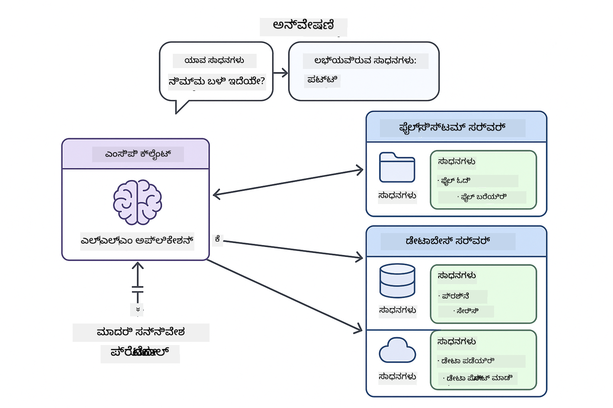

<!--
CO_OP_TRANSLATOR_METADATA:
{
  "original_hash": "c25ec1f10ef156c53e190cdf8b0711ab",
  "translation_date": "2025-12-13T18:15:59+00:00",
  "source_file": "05-mcp/README.md",
  "language_code": "kn"
}
-->
# Module 05: ಮಾದರಿ ಸಂದರ್ಭ ಪ್ರೋಟೋಕಾಲ್ (MCP)

## ವಿಷಯಗಳ ಪಟ್ಟಿಕೆ

- [ನೀವು ಕಲಿಯುವದು](../../../05-mcp)
- [MCP ಅನ್ನು ಅರ್ಥಮಾಡಿಕೊಳ್ಳುವುದು](../../../05-mcp)
- [MCP ಹೇಗೆ ಕೆಲಸ ಮಾಡುತ್ತದೆ](../../../05-mcp)
  - [ಸರ್ವರ್-ಕ್ಲೈಂಟ್ ವಾಸ್ತುಶಿಲ್ಪ](../../../05-mcp)
  - [ಉಪಕರಣ ಅನ್ವೇಷಣೆ](../../../05-mcp)
  - [ಸಾರಿಗೆ ಯಂತ್ರಗಳು](../../../05-mcp)
- [ಪೂರ್ವಾಪೇಕ್ಷಿತಗಳು](../../../05-mcp)
- [ಈ ಮಾಯಾಜಾಲವು ಏನು ಒಳಗೊಂಡಿದೆ](../../../05-mcp)
- [ತ್ವರಿತ ಪ್ರಾರಂಭ](../../../05-mcp)
  - [ಉದಾಹರಣೆ 1: ದೂರಸ್ಥ ಕ್ಯಾಲ್ಕುಲೇಟರ್ (ಸ್ಟ್ರೀಮಬಲ್ HTTP)](../../../05-mcp)
  - [ಉದಾಹರಣೆ 2: ಫೈಲ್ ಕಾರ್ಯಾಚರಣೆಗಳು (ಸ್ಟ್ಡಿಯೋ)](../../../05-mcp)
  - [ಉದಾಹರಣೆ 3: ಗಿಟ್ ವಿಶ್ಲೇಷಣೆ (ಡಾಕರ್)](../../../05-mcp)
- [ಪ್ರಮುಖ ತತ್ವಗಳು](../../../05-mcp)
  - [ಸಾರಿಗೆ ಆಯ್ಕೆ](../../../05-mcp)
  - [ಉಪಕರಣ ಅನ್ವೇಷಣೆ](../../../05-mcp)
  - [ಸೆಷನ್ ನಿರ್ವಹಣೆ](../../../05-mcp)
  - [ಕ್ರಾಸ್-ಪ್ಲಾಟ್‌ಫಾರ್ಮ್ ಪರಿಗಣನೆಗಳು](../../../05-mcp)
- [MCP ಅನ್ನು ಯಾವಾಗ ಬಳಸಬೇಕು](../../../05-mcp)
- [MCP ಪರಿಸರ ವ್ಯವಸ್ಥೆ](../../../05-mcp)
- [ಅಭಿನಂದನೆಗಳು!](../../../05-mcp)
  - [ಮುಂದೆ ಏನು?](../../../05-mcp)
- [ಸಮಸ್ಯೆ ಪರಿಹಾರ](../../../05-mcp)

## ನೀವು ಕಲಿಯುವದು

ನೀವು ಸಂಭಾಷಣಾತ್ಮಕ AI ನಿರ್ಮಿಸಿದ್ದೀರಿ, ಪ್ರಾಂಪ್ಟ್‌ಗಳನ್ನು ನಿಪುಣತೆಯಿಂದ ಬಳಸಿದ್ದೀರಿ, ದಾಖಲೆಗಳಲ್ಲಿ ಪ್ರತಿಕ್ರಿಯೆಗಳನ್ನು ನೆಲಸಿದ್ದೀರಿ ಮತ್ತು ಉಪಕರಣಗಳೊಂದಿಗೆ ಏಜೆಂಟ್‌ಗಳನ್ನು ರಚಿಸಿದ್ದೀರಿ. ಆದರೆ ಆ ಎಲ್ಲಾ ಉಪಕರಣಗಳು ನಿಮ್ಮ ನಿರ್ದಿಷ್ಟ ಅಪ್ಲಿಕೇಶನ್‌ಗೆ ಕಸ್ಟಮ್-ನಿರ್ಮಿತವಾಗಿದ್ದವು. ಯಾರಾದರೂ ರಚಿಸಿ ಹಂಚಿಕೊಳ್ಳಬಹುದಾದ ಮಾನಕೀಕೃತ ಉಪಕರಣಗಳ ಪರಿಸರ ವ್ಯವಸ್ಥೆಗೆ ನಿಮ್ಮ AI ಪ್ರವೇಶ ನೀಡಬಹುದಾದರೆ?

ಮಾದರಿ ಸಂದರ್ಭ ಪ್ರೋಟೋಕಾಲ್ (MCP) ಅದೇನು ನೀಡುತ್ತದೆ - AI ಅಪ್ಲಿಕೇಶನ್‌ಗಳಿಗೆ ಬಾಹ್ಯ ಉಪಕರಣಗಳನ್ನು ಕಂಡುಹಿಡಿದು ಬಳಸಲು ಮಾನಕೀಕೃತ ಮಾರ್ಗ. ಪ್ರತಿ ಡೇಟಾ ಮೂಲ ಅಥವಾ ಸೇವೆಗೆ ಕಸ್ಟಮ್ ಇಂಟಿಗ್ರೇಷನ್ ಬರೆದ ಬದಲು, ನೀವು MCP ಸರ್ವರ್‌ಗಳಿಗೆ ಸಂಪರ್ಕ ಮಾಡುತ್ತೀರಿ, ಅವು ತಮ್ಮ ಸಾಮರ್ಥ್ಯಗಳನ್ನು ಸुस್ಪಷ್ಟ ಸ್ವರೂಪದಲ್ಲಿ ಬಹಿರಂಗಪಡಿಸುತ್ತವೆ. ನಿಮ್ಮ AI ಏಜೆಂಟ್ ನಂತರ ಸ್ವಯಂಚಾಲಿತವಾಗಿ ಈ ಉಪಕರಣಗಳನ್ನು ಕಂಡುಹಿಡಿದು ಬಳಸಬಹುದು.


*MCP ಮೊದಲು: ಸಂಕೀರ್ಣ ಪಾಯಿಂಟ್-ಟು-ಪಾಯಿಂಟ್ ಇಂಟಿಗ್ರೇಷನ್ಗಳು. MCP ನಂತರ: ಒಂದು ಪ್ರೋಟೋಕಾಲ್, ಅನಂತ ಸಾಧ್ಯತೆಗಳು.*

## MCP ಅನ್ನು ಅರ್ಥಮಾಡಿಕೊಳ್ಳುವುದು

MCP AI ಅಭಿವೃದ್ಧಿಯಲ್ಲಿ ಮೂಲಭೂತ ಸಮಸ್ಯೆಯನ್ನು ಪರಿಹರಿಸುತ್ತದೆ: ಪ್ರತಿ ಇಂಟಿಗ್ರೇಷನ್ ಕಸ್ಟಮ್ ಆಗಿದೆ. GitHub ಗೆ ಪ್ರವೇಶ ಬೇಕೆ? ಕಸ್ಟಮ್ ಕೋಡ್. ಫೈಲ್ ಓದಲು ಬೇಕೆ? ಕಸ್ಟಮ್ ಕೋಡ್. ಡೇಟಾಬೇಸ್ ಪ್ರಶ್ನಿಸಲು ಬೇಕೆ? ಕಸ್ಟಮ್ ಕೋಡ್. ಮತ್ತು ಈ ಎಲ್ಲ ಇಂಟಿಗ್ರೇಷನ್ಗಳು ಇತರ AI ಅಪ್ಲಿಕೇಶನ್‌ಗಳೊಂದಿಗೆ ಕೆಲಸ ಮಾಡುತ್ತಿಲ್ಲ.

MCP ಇದನ್ನು ಮಾನಕೀಕೃತಗೊಳಿಸುತ್ತದೆ. MCP ಸರ್ವರ್ ಸ್ಪಷ್ಟ ವಿವರಣೆಗಳು ಮತ್ತು ಸ್ಕೀಮಾಗಳೊಂದಿಗೆ ಉಪಕರಣಗಳನ್ನು ಬಹಿರಂಗಪಡಿಸುತ್ತದೆ. ಯಾವುದೇ MCP ಕ್ಲೈಂಟ್ ಸಂಪರ್ಕಿಸಿ, ಲಭ್ಯವಿರುವ ಉಪಕರಣಗಳನ್ನು ಕಂಡುಹಿಡಿದು ಬಳಸಬಹುದು. ಒಮ್ಮೆ ನಿರ್ಮಿಸಿ, ಎಲ್ಲೆಡೆ ಬಳಸಿರಿ.



*ಮಾದರಿ ಸಂದರ್ಭ ಪ್ರೋಟೋಕಾಲ್ ವಾಸ್ತುಶಿಲ್ಪ - ಮಾನಕೀಕೃತ ಉಪಕರಣ ಅನ್ವೇಷಣೆ ಮತ್ತು ಕಾರ್ಯಗತಗೊಳಿಸುವಿಕೆ*

## MCP ಹೇಗೆ ಕೆಲಸ ಮಾಡುತ್ತದೆ

**ಸರ್ವರ್-ಕ್ಲೈಂಟ್ ವಾಸ್ತುಶಿಲ್ಪ**

MCP ಕ್ಲೈಂಟ್-ಸರ್ವರ್ ಮಾದರಿಯನ್ನು ಬಳಸುತ್ತದೆ. ಸರ್ವರ್‌ಗಳು ಉಪಕರಣಗಳನ್ನು ಒದಗಿಸುತ್ತವೆ - ಫೈಲ್ ಓದುವುದು, ಡೇಟಾಬೇಸ್ ಪ್ರಶ್ನಿಸುವುದು, APIಗಳನ್ನು ಕರೆ ಮಾಡುವುದು. ಕ್ಲೈಂಟ್‌ಗಳು (ನಿಮ್ಮ AI ಅಪ್ಲಿಕೇಶನ್) ಸರ್ವರ್‌ಗಳಿಗೆ ಸಂಪರ್ಕಿಸಿ ಅವುಗಳ ಉಪಕರಣಗಳನ್ನು ಬಳಸುತ್ತವೆ.

**ಉಪಕರಣ ಅನ್ವೇಷಣೆ**

ನಿಮ್ಮ ಕ್ಲೈಂಟ್ MCP ಸರ್ವರ್‌ಗೆ ಸಂಪರ್ಕಿಸಿದಾಗ, ಅದು ಕೇಳುತ್ತದೆ "ನಿಮ್ಮ ಬಳಿ ಯಾವ ಉಪಕರಣಗಳಿವೆ?" ಸರ್ವರ್ ಲಭ್ಯವಿರುವ ಉಪಕರಣಗಳ ಪಟ್ಟಿ, ಪ್ರತಿಯೊಂದು ವಿವರಣೆಗಳು ಮತ್ತು ಪ್ಯಾರಾಮೀಟರ್ ಸ್ಕೀಮಾಗಳೊಂದಿಗೆ ಪ್ರತಿಕ್ರಿಯಿಸುತ್ತದೆ. ನಿಮ್ಮ AI ಏಜೆಂಟ್ ನಂತರ ಬಳಕೆದಾರರ ವಿನಂತಿಗಳ ಆಧಾರದ ಮೇಲೆ ಯಾವ ಉಪಕರಣಗಳನ್ನು ಬಳಸಬೇಕೆಂದು ನಿರ್ಧರಿಸಬಹುದು.

**ಸಾರಿಗೆ ಯಂತ್ರಗಳು**

MCP ಎರಡು ಸಾರಿಗೆ ಯಂತ್ರಗಳನ್ನು ವ್ಯಾಖ್ಯಾನಿಸುತ್ತದೆ: ದೂರಸ್ಥ ಸರ್ವರ್‌ಗಳಿಗೆ HTTP, ಸ್ಥಳೀಯ ಪ್ರಕ್ರಿಯೆಗಳಿಗೆ (ಡಾಕರ್ ಕಂಟೈನರ್‌ಗಳನ್ನು ಒಳಗೊಂಡಂತೆ) ಸ್ಟ್ಡಿಯೋ:


*MCP ಸಾರಿಗೆ ಯಂತ್ರಗಳು: ದೂರಸ್ಥ ಸರ್ವರ್‌ಗಳಿಗೆ HTTP, ಸ್ಥಳೀಯ ಪ್ರಕ್ರಿಯೆಗಳಿಗೆ ಸ್ಟ್ಡಿಯೋ (ಡಾಕರ್ ಕಂಟೈನರ್‌ಗಳನ್ನು ಒಳಗೊಂಡಂತೆ)*

**ಸ್ಟ್ರೀಮಬಲ್ HTTP** - [StreamableHttpDemo.java](../../../05-mcp/src/main/java/com/example/langchain4j/mcp/StreamableHttpDemo.java)

ದೂರಸ್ಥ ಸರ್ವರ್‌ಗಳಿಗೆ. ನಿಮ್ಮ ಅಪ್ಲಿಕೇಶನ್ ನೆಟ್ವರ್ಕ್‌ನಲ್ಲಿ ಎಲ್ಲೋ ಓಡುತ್ತಿರುವ ಸರ್ವರ್‌ಗೆ HTTP ವಿನಂತಿಗಳನ್ನು ಮಾಡುತ್ತದೆ. ರಿಯಲ್-ಟೈಮ್ ಸಂವಹನಕ್ಕಾಗಿ ಸರ್ವರ್-ಸೆಂಟ್ ಇವೆಂಟ್ಸ್ ಬಳಸುತ್ತದೆ.

```java
McpTransport httpTransport = new StreamableHttpMcpTransport.Builder()
    .url("http://localhost:3001/mcp")
    .timeout(Duration.ofSeconds(60))
    .logRequests(true)
    .logResponses(true)
    .build();
```

> **🤖 [GitHub Copilot](https://github.com/features/copilot) ಚಾಟ್‌ನೊಂದಿಗೆ ಪ್ರಯತ್ನಿಸಿ:** [`StreamableHttpDemo.java`](../../../05-mcp/src/main/java/com/example/langchain4j/mcp/StreamableHttpDemo.java) ತೆರೆಯಿರಿ ಮತ್ತು ಕೇಳಿ:
> - "MCP ನೇರ ಉಪಕರಣ ಇಂಟಿಗ್ರೇಷನ್ (Module 04) ನಿಂದ ಹೇಗೆ ಭಿನ್ನವಾಗಿದೆ?"
> - "ಅಪ್ಲಿಕೇಶನ್‌ಗಳ ನಡುವೆ ಉಪಕರಣ ಹಂಚಿಕೆಗೆ MCP ಬಳಸುವುದರಿಂದ ಏನು ಲಾಭ?"
> - "MCP ಸರ್ವರ್‌ಗಳಿಗೆ ಸಂಪರ್ಕ ವಿಫಲತೆಗಳು ಅಥವಾ ಟೈಮೌಟ್‌ಗಳನ್ನು ಹೇಗೆ ನಿರ್ವಹಿಸಬೇಕು?"

**ಸ್ಟ್ಡಿಯೋ** - [StdioTransportDemo.java](../../../05-mcp/src/main/java/com/example/langchain4j/mcp/StdioTransportDemo.java)

ಸ್ಥಳೀಯ ಪ್ರಕ್ರಿಯೆಗಳಿಗೆ. ನಿಮ್ಮ ಅಪ್ಲಿಕೇಶನ್ ಸಬ್‌ಪ್ರೊಸೆಸ್ ಆಗಿ ಸರ್ವರ್ ಅನ್ನು ಪ್ರಾರಂಭಿಸಿ ಸ್ಟ್ಯಾಂಡರ್ಡ್ ಇನ್‌ಪುಟ್/ಔಟ್‌ಪುಟ್ ಮೂಲಕ ಸಂವಹನ ಮಾಡುತ್ತದೆ. ಫೈಲ್ ಸಿಸ್ಟಮ್ ಪ್ರವೇಶ ಅಥವಾ ಕಮಾಂಡ್-ಲೈನ್ ಉಪಕರಣಗಳಿಗೆ ಉಪಯುಕ್ತ.

```java
McpTransport stdioTransport = new StdioMcpTransport.Builder()
    .command(List.of(
        npmCmd, "exec",
        "@modelcontextprotocol/server-filesystem@0.6.2",
        resourcesDir
    ))
    .logEvents(false)
    .build();
```

> **🤖 [GitHub Copilot](https://github.com/features/copilot) ಚಾಟ್‌ನೊಂದಿಗೆ ಪ್ರಯತ್ನಿಸಿ:** [`StdioTransportDemo.java`](../../../05-mcp/src/main/java/com/example/langchain4j/mcp/StdioTransportDemo.java) ತೆರೆಯಿರಿ ಮತ್ತು ಕೇಳಿ:
> - "ಸ್ಟ್ಡಿಯೋ ಸಾರಿಗೆ ಹೇಗೆ ಕೆಲಸ ಮಾಡುತ್ತದೆ ಮತ್ತು HTTP ಗೆ ಬದಲಾಗಿ ಯಾವಾಗ ಬಳಸಬೇಕು?"
> - "LangChain4j spawned MCP ಸರ್ವರ್ ಪ್ರಕ್ರಿಯೆಗಳ ಜೀವನಚಕ್ರವನ್ನು ಹೇಗೆ ನಿರ್ವಹಿಸುತ್ತದೆ?"
> - "AI ಗೆ ಫೈಲ್ ಸಿಸ್ಟಮ್ ಪ್ರವೇಶ ನೀಡುವುದರಿಂದ ಯಾವ ಭದ್ರತಾ ಪರಿಣಾಮಗಳಿವೆ?"

**ಡಾಕರ್ (ಸ್ಟ್ಡಿಯೋ ಬಳಸುತ್ತದೆ)** - [GitRepositoryAnalyzer.java](../../../05-mcp/src/main/java/com/example/langchain4j/mcp/GitRepositoryAnalyzer.java)

ಕಂಟೈನರ್ ಸೇವೆಗಳಿಗೆ. `docker run` ಮೂಲಕ ಡಾಕರ್ ಕಂಟೈನರ್ ಜೊತೆ ಸಂವಹನ ಮಾಡಲು ಸ್ಟ್ಡಿಯೋ ಸಾರಿಗೆ ಬಳಸುತ್ತದೆ. ಸಂಕೀರ್ಣ ಅವಲಂಬನೆಗಳು ಅಥವಾ ಪ್ರತ್ಯೇಕ ಪರಿಸರಗಳಿಗೆ ಉತ್ತಮ.

```java
McpTransport dockerTransport = new StdioMcpTransport.Builder()
    .command(List.of(
        "docker", "run",
        "-e", "GITHUB_PERSONAL_ACCESS_TOKEN=" + System.getenv("GITHUB_TOKEN"),
        "-v", volumeMapping,
        "-i", "mcp/git"
    ))
    .logEvents(true)
    .build();
```

> **🤖 [GitHub Copilot](https://github.com/features/copilot) ಚಾಟ್‌ನೊಂದಿಗೆ ಪ್ರಯತ್ನಿಸಿ:** [`GitRepositoryAnalyzer.java`](../../../05-mcp/src/main/java/com/example/langchain4j/mcp/GitRepositoryAnalyzer.java) ತೆರೆಯಿರಿ ಮತ್ತು ಕೇಳಿ:
> - "ಡಾಕರ್ ಸಾರಿಗೆ MCP ಸರ್ವರ್‌ಗಳನ್ನು ಹೇಗೆ ಪ್ರತ್ಯೇಕಿಸುತ್ತದೆ ಮತ್ತು ಲಾಭಗಳು ಏನು?"
> - "ಹೋಸ್ಟ್ ಮತ್ತು MCP ಕಂಟೈನರ್‌ಗಳ ನಡುವೆ ಡೇಟಾ ಹಂಚಿಕೆಗೆ ವಾಲ್ಯೂಮ್ ಮಾಉಂಟ್‌ಗಳನ್ನು ಹೇಗೆ ಸಂರಚಿಸಬೇಕು?"
> - "ಉತ್ಪಾದನೆಯಲ್ಲಿ ಡಾಕರ್ ಆಧಾರಿತ MCP ಸರ್ವರ್ ಜೀವನಚಕ್ರ ನಿರ್ವಹಣೆಗೆ ಉತ್ತಮ ಅಭ್ಯಾಸಗಳು ಯಾವುವು?"

## ಉದಾಹರಣೆಗಳನ್ನು ಚಾಲನೆ ಮಾಡುವುದು

### ಪೂರ್ವಾಪೇಕ್ಷಿತಗಳು

- ಜಾವಾ 21+, ಮೇವೆನ್ 3.9+
- ನೋಡ್.js 16+ ಮತ್ತು npm (MCP ಸರ್ವರ್‌ಗಳಿಗೆ)
- **ಡಾಕರ್ ಡೆಸ್ಕ್‌ಟಾಪ್** - ಉದಾಹರಣೆ 3 ಗೆ **ಚಾಲನೆಯಲ್ಲಿರಬೇಕು** (ಮಾತ್ರ ಸ್ಥಾಪಿತವಲ್ಲ)
- GitHub ವೈಯಕ್ತಿಕ ಪ್ರವೇಶ ಟೋಕನ್ `.env` ಫೈಲ್‌ನಲ್ಲಿ ಸಂರಚಿತ (Module 00 ನಿಂದ)

> **ಗಮನಿಸಿ:** ನೀವು ಇನ್ನೂ GitHub ಟೋಕನ್ ಅನ್ನು ಹೊಂದಿಸದಿದ್ದರೆ, [Module 00 - ತ್ವರಿತ ಪ್ರಾರಂಭ](../00-quick-start/README.md) ನೋಡಿ.

> **⚠️ ಡಾಕರ್ ಬಳಕೆದಾರರು:** ಉದಾಹರಣೆ 3 ಚಾಲನೆಗೆ ಮುನ್ನ, `docker ps` ಮೂಲಕ ಡಾಕರ್ ಡೆಸ್ಕ್‌ಟಾಪ್ ಚಾಲನೆಯಲ್ಲಿದೆಯೇ ಎಂದು ಪರಿಶೀಲಿಸಿ. ಸಂಪರ್ಕ ದೋಷಗಳು ಕಂಡುಬಂದರೆ, ಡಾಕರ್ ಡೆಸ್ಕ್‌ಟಾಪ್ ಪ್ರಾರಂಭಿಸಿ ~30 ಸೆಕೆಂಡುಗಳ ಕಾಲ ಕಾಯಿರಿ.

## ತ್ವರಿತ ಪ್ರಾರಂಭ

**VS ಕೋಡ್ ಬಳಸಿ:** ಎಕ್ಸ್‌ಪ್ಲೋರರ್‌ನಲ್ಲಿ ಯಾವುದೇ ಡೆಮೊ ಫೈಲ್ ಮೇಲೆ ರೈಟ್-ಕ್ಲಿಕ್ ಮಾಡಿ **"Run Java"** ಆಯ್ಕೆಮಾಡಿ, ಅಥವಾ ರನ್ ಮತ್ತು ಡಿಬಗ್ ಪ್ಯಾನೆಲ್‌ನಿಂದ ಲಾಂಚ್ ಕಾನ್ಫಿಗರೇಶನ್‌ಗಳನ್ನು ಬಳಸಿ (ಮೊದಲು ನಿಮ್ಮ ಟೋಕನ್ `.env` ಫೈಲ್‌ಗೆ ಸೇರಿಸಿರಬೇಕು).

**ಮೇವನ್ ಬಳಸಿ:** ಬದಲಾಗಿ, ಕೆಳಗಿನ ಉದಾಹರಣೆಗಳೊಂದಿಗೆ ಕಮಾಂಡ್ ಲೈನ್‌ನಿಂದ ಚಾಲನೆ ಮಾಡಬಹುದು.

**⚠️ ಮುಖ್ಯ:** ಕೆಲವು ಉದಾಹರಣೆಗಳಿಗೆ ಪೂರ್ವಾಪೇಕ್ಷಿತಗಳು ಇವೆ (MCP ಸರ್ವರ್ ಪ್ರಾರಂಭಿಸುವುದು ಅಥವಾ ಡಾಕರ್ ಇಮೇಜ್ ನಿರ್ಮಿಸುವುದು). ಪ್ರತಿ ಉದಾಹರಣೆಯ ಅಗತ್ಯಗಳನ್ನು ಪರಿಶೀಲಿಸಿ.

### ಉದಾಹರಣೆ 1: ದೂರಸ್ಥ ಕ್ಯಾಲ್ಕುಲೇಟರ್ (ಸ್ಟ್ರೀಮಬಲ್ HTTP)

ಇದು ನೆಟ್ವರ್ಕ್ ಆಧಾರಿತ ಉಪಕರಣ ಇಂಟಿಗ್ರೇಷನ್ ಅನ್ನು ತೋರಿಸುತ್ತದೆ.

**⚠️ ಪೂರ್ವಾಪೇಕ್ಷಿತ:** ಮೊದಲು MCP ಸರ್ವರ್ ಪ್ರಾರಂಭಿಸಬೇಕು (ಕೆಳಗಿನ ಟರ್ಮಿನಲ್ 1 ನೋಡಿ).

**ಟರ್ಮಿನಲ್ 1 - MCP ಸರ್ವರ್ ಪ್ರಾರಂಭಿಸಿ:**

**ಬ್ಯಾಶ್:**
```bash
git clone https://github.com/modelcontextprotocol/servers.git
cd servers/src/everything
npm install
node dist/streamableHttp.js
```

**ಪವರ್‌ಶೆಲ್:**
```powershell
git clone https://github.com/modelcontextprotocol/servers.git
cd servers/src/everything
npm install
node dist/streamableHttp.js
```

**ಟರ್ಮಿನಲ್ 2 - ಉದಾಹರಣೆ ಚಾಲನೆ:**

**VS ಕೋಡ್ ಬಳಸಿ:** `StreamableHttpDemo.java` ಮೇಲೆ ರೈಟ್-ಕ್ಲಿಕ್ ಮಾಡಿ **"Run Java"** ಆಯ್ಕೆಮಾಡಿ.

**ಮೇವನ್ ಬಳಸಿ:**

**ಬ್ಯಾಶ್:**
```bash
export GITHUB_TOKEN=your_token_here
cd 05-mcp
mvn compile exec:java -Dexec.mainClass=com.example.langchain4j.mcp.StreamableHttpDemo
```

**ಪವರ್‌ಶೆಲ್:**
```powershell
$env:GITHUB_TOKEN=your_token_here
cd 05-mcp
mvn --% compile exec:java -Dexec.mainClass=com.example.langchain4j.mcp.StreamableHttpDemo
```

ಏಜೆಂಟ್ ಲಭ್ಯವಿರುವ ಉಪಕರಣಗಳನ್ನು ಕಂಡುಹಿಡಿಯುತ್ತದೆ, ನಂತರ ಕ್ಯಾಲ್ಕುಲೇಟರ್ ಬಳಸಿ ಸೇರಿಸುವ ಕಾರ್ಯವನ್ನು ನಿರ್ವಹಿಸುತ್ತದೆ.

### ಉದಾಹರಣೆ 2: ಫೈಲ್ ಕಾರ್ಯಾಚರಣೆಗಳು (ಸ್ಟ್ಡಿಯೋ)

ಇದು ಸ್ಥಳೀಯ ಸಬ್‌ಪ್ರೊಸೆಸ್ ಆಧಾರಿತ ಉಪಕರಣಗಳನ್ನು ತೋರಿಸುತ್ತದೆ.

**✅ ಯಾವುದೇ ಪೂರ್ವಾಪೇಕ್ಷಿತ ಅಗತ್ಯವಿಲ್ಲ** - MCP ಸರ್ವರ್ ಸ್ವಯಂಚಾಲಿತವಾಗಿ ಪ್ರಾರಂಭವಾಗುತ್ತದೆ.

**VS ಕೋಡ್ ಬಳಸಿ:** `StdioTransportDemo.java` ಮೇಲೆ ರೈಟ್-ಕ್ಲಿಕ್ ಮಾಡಿ **"Run Java"** ಆಯ್ಕೆಮಾಡಿ.

**ಮೇವನ್ ಬಳಸಿ:**

**ಬ್ಯಾಶ್:**
```bash
export GITHUB_TOKEN=your_token_here
cd 05-mcp
mvn compile exec:java -Dexec.mainClass=com.example.langchain4j.mcp.StdioTransportDemo
```

**ಪವರ್‌ಶೆಲ್:**
```powershell
$env:GITHUB_TOKEN=your_token_here
cd 05-mcp
mvn --% compile exec:java -Dexec.mainClass=com.example.langchain4j.mcp.StdioTransportDemo
```

ಅಪ್ಲಿಕೇಶನ್ ಸ್ವಯಂಚಾಲಿತವಾಗಿ ಫೈಲ್ ಸಿಸ್ಟಮ್ MCP ಸರ್ವರ್ ಅನ್ನು ಪ್ರಾರಂಭಿಸಿ ಸ್ಥಳೀಯ ಫೈಲ್ ಓದುತ್ತದೆ. ಸಬ್‌ಪ್ರೊಸೆಸ್ ನಿರ್ವಹಣೆ ನಿಮಗಾಗಿ ಹೇಗೆ ಮಾಡಲಾಗಿದೆ ಗಮನಿಸಿ.

**ನಿರೀಕ್ಷಿತ ಔಟ್‌ಪುಟ್:**
```
Assistant response: The content of the file is "Kaboom!".
```

### ಉದಾಹರಣೆ 3: ಗಿಟ್ ವಿಶ್ಲೇಷಣೆ (ಡಾಕರ್)

ಇದು ಕಂಟೈನರ್ ಆಧಾರಿತ ಉಪಕರಣ ಸರ್ವರ್‌ಗಳನ್ನು ತೋರಿಸುತ್ತದೆ.

**⚠️ ಪೂರ್ವಾಪೇಕ್ಷಿತಗಳು:** 
1. **ಡಾಕರ್ ಡೆಸ್ಕ್‌ಟಾಪ್ ಚಾಲನೆಯಲ್ಲಿರಬೇಕು** (ಮಾತ್ರ ಸ್ಥಾಪಿತವಲ್ಲ)
2. **ವಿಂಡೋಸ್ ಬಳಕೆದಾರರು:** WSL 2 ಮೋಡ್ ಶಿಫಾರಸು (ಡಾಕರ್ ಡೆಸ್ಕ್‌ಟಾಪ್ ಸೆಟ್ಟಿಂಗ್ಸ್ → ಜನರಲ್ → "Use the WSL 2 based engine"). ಹೈಪರ್-ವಿ ಮೋಡ್ ಕೈಯಿಂದ ಫೈಲ್ ಹಂಚಿಕೆಗೆ ಸಂರಚನೆ ಅಗತ್ಯ.
3. ಮೊದಲು ಡಾಕರ್ ಇಮೇಜ್ ನಿರ್ಮಿಸಬೇಕು (ಕೆಳಗಿನ ಟರ್ಮಿನಲ್ 1 ನೋಡಿ)

**ಡಾಕರ್ ಚಾಲನೆಯಲ್ಲಿದೆಯೇ ಎಂದು ಪರಿಶೀಲಿಸಿ:**

**ಬ್ಯಾಶ್:**
```bash
docker ps  # ದೋಷವಲ್ಲದೆ ಕಂಟೈನರ್ ಪಟ್ಟಿ ತೋರಿಸಬೇಕು
```

**ಪವರ್‌ಶೆಲ್:**
```powershell
docker ps  # ದೋಷವಿಲ್ಲದೆ ಕಂಟೈನರ್ ಪಟ್ಟಿ ತೋರಿಸಬೇಕು
```

"Cannot connect to Docker daemon" ಅಥವಾ "The system cannot find the file specified" ಎಂಬ ದೋಷ ಕಂಡರೆ, ಡಾಕರ್ ಡೆಸ್ಕ್‌ಟಾಪ್ ಪ್ರಾರಂಭಿಸಿ ಮತ್ತು ಪ್ರಾರಂಭಿಕರಣಕ್ಕೆ ~30 ಸೆಕೆಂಡುಗಳ ಕಾಲ ಕಾಯಿರಿ.

**ಸಮಸ್ಯೆ ಪರಿಹಾರ:**
- AI ಖಾಲಿ ರೆಪೊ ಅಥವಾ ಫೈಲ್‌ಗಳಿಲ್ಲ ಎಂದು ವರದಿ ಮಾಡಿದರೆ, ವಾಲ್ಯೂಮ್ ಮಾಉಂಟ್ (`-v`) ಕೆಲಸ ಮಾಡುತ್ತಿಲ್ಲ.
- **ವಿಂಡೋಸ್ ಹೈಪರ್-ವಿ ಬಳಕೆದಾರರು:** ಪ್ರಾಜೆಕ್ಟ್ ಡೈರೆಕ್ಟರಿಯನ್ನು ಡಾಕರ್ ಡೆಸ್ಕ್‌ಟಾಪ್ ಸೆಟ್ಟಿಂಗ್ಸ್ → ರಿಸೋರ್ಸಸ್ → ಫೈಲ್ ಹಂಚಿಕೆ ಸೇರಿಸಿ, ನಂತರ ಡಾಕರ್ ಡೆಸ್ಕ್‌ಟಾಪ್ ಮರುಪ್ರಾರಂಭಿಸಿ.
- **ಶಿಫಾರಸು ಮಾಡಿದ ಪರಿಹಾರ:** ಸ್ವಯಂಚಾಲಿತ ಫೈಲ್ ಹಂಚಿಕೆಗೆ WSL 2 ಮೋಡ್‌ಗೆ ಬದಲಾಯಿಸಿ (ಸೆಟ್ಟಿಂಗ್ಸ್ → ಜನರಲ್ → "Use the WSL 2 based engine" ಸಕ್ರಿಯಗೊಳಿಸಿ).

**ಟರ್ಮಿನಲ್ 1 - ಡಾಕರ್ ಇಮೇಜ್ ನಿರ್ಮಿಸಿ:**

**ಬ್ಯಾಶ್:**
```bash
cd servers/src/git
docker build -t mcp/git .
```

**ಪವರ್‌ಶೆಲ್:**
```powershell
cd servers/src/git
docker build -t mcp/git .
```

**ಟರ್ಮಿನಲ್ 2 - ವಿಶ್ಲೇಷಕ ಚಾಲನೆ:**

**VS ಕೋಡ್ ಬಳಸಿ:** `GitRepositoryAnalyzer.java` ಮೇಲೆ ರೈಟ್-ಕ್ಲಿಕ್ ಮಾಡಿ **"Run Java"** ಆಯ್ಕೆಮಾಡಿ.

**ಮೇವನ್ ಬಳಸಿ:**

**ಬ್ಯಾಶ್:**
```bash
export GITHUB_TOKEN=your_token_here
cd 05-mcp
mvn compile exec:java -Dexec.mainClass=com.example.langchain4j.mcp.GitRepositoryAnalyzer
```

**ಪವರ್‌ಶೆಲ್:**
```powershell
$env:GITHUB_TOKEN=your_token_here
cd 05-mcp
mvn --% compile exec:java -Dexec.mainClass=com.example.langchain4j.mcp.GitRepositoryAnalyzer
```

ಅಪ್ಲಿಕೇಶನ್ ಡಾಕರ್ ಕಂಟೈನರ್ ಪ್ರಾರಂಭಿಸಿ, ನಿಮ್ಮ ರೆಪೊ ಮೌಂಟ್ ಮಾಡಿ, AI ಏಜೆಂಟ್ ಮೂಲಕ ರೆಪೊ ರಚನೆ ಮತ್ತು ವಿಷಯಗಳನ್ನು ವಿಶ್ಲೇಷಿಸುತ್ತದೆ.

## ಪ್ರಮುಖ ತತ್ವಗಳು

**ಸಾರಿಗೆ ಆಯ್ಕೆ**

ನಿಮ್ಮ ಉಪಕರಣಗಳು ಎಲ್ಲಿವೆ ಎಂಬುದರ ಆಧಾರದ ಮೇಲೆ ಆಯ್ಕೆಮಾಡಿ:
- ದೂರಸ್ಥ ಸೇವೆಗಳು → ಸ್ಟ್ರೀಮಬಲ್ HTTP
- ಸ್ಥಳೀಯ ಫೈಲ್ ಸಿಸ್ಟಮ್ → ಸ್ಟ್ಡಿಯೋ
- ಸಂಕೀರ್ಣ ಅವಲಂಬನೆಗಳು → ಡಾಕರ್

**ಉಪಕರಣ ಅನ್ವೇಷಣೆ**

MCP ಕ್ಲೈಂಟ್‌ಗಳು ಸಂಪರ್ಕಿಸುವಾಗ ಲಭ್ಯವಿರುವ ಉಪಕರಣಗಳನ್ನು ಸ್ವಯಂಚಾಲಿತವಾಗಿ ಕಂಡುಹಿಡಿಯುತ್ತವೆ. ನಿಮ್ಮ AI ಏಜೆಂಟ್ ಉಪಕರಣ ವಿವರಣೆಗಳನ್ನು ನೋಡಿ ಬಳಕೆದಾರರ ವಿನಂತಿಯ ಆಧಾರದ ಮೇಲೆ ಯಾವ ಉಪಕರಣಗಳನ್ನು ಬಳಸಬೇಕೆಂದು ನಿರ್ಧರಿಸುತ್ತದೆ.

**ಸೆಷನ್ ನಿರ್ವಹಣೆ**

ಸ್ಟ್ರೀಮಬಲ್ HTTP ಸಾರಿಗೆ ಸೆಷನ್‌ಗಳನ್ನು ನಿರ್ವಹಿಸುತ್ತದೆ, ದೂರಸ್ಥ ಸರ್ವರ್‌ಗಳೊಂದಿಗೆ ಸ್ಥಿತಿಸ್ಥಾಪಕ ಸಂವಹನಕ್ಕೆ ಅವಕಾಶ ನೀಡುತ್ತದೆ. ಸ್ಟ್ಡಿಯೋ ಮತ್ತು ಡಾಕರ್ ಸಾರಿಗೆಗಳು ಸಾಮಾನ್ಯವಾಗಿ ಸ್ಥಿತಿಸ್ಥಾಪಕವಲ್ಲ.

**ಕ್ರಾಸ್-ಪ್ಲಾಟ್‌ಫಾರ್ಮ್ ಪರಿಗಣನೆಗಳು**

ಉದಾಹರಣೆಗಳು ವೇದಿಕೆ ಭೇದಗಳನ್ನು ಸ್ವಯಂಚಾಲಿತವಾಗಿ ನಿರ್ವಹಿಸುತ್ತವೆ (ವಿಂಡೋಸ್ ಮತ್ತು ಯುನಿಕ್ಸ್ ಕಮಾಂಡ್ ಭೇದಗಳು, ಡಾಕರ್ ಪಾತ್ ಪರಿವರ್ತನೆಗಳು). ಇದು ವಿಭಿನ್ನ ಪರಿಸರಗಳಲ್ಲಿ ಉತ್ಪಾದನಾ ನಿಯೋಜನೆಗಳಿಗೆ ಮುಖ್ಯ.

## MCP ಅನ್ನು ಯಾವಾಗ ಬಳಸಬೇಕು

**MCP ಬಳಸಿರಿ:**
- ಈಗಾಗಲೇ ಇರುವ ಉಪಕರಣ ಪರಿಸರ ವ್ಯವಸ್ಥೆಗಳನ್ನು ಉಪಯೋಗಿಸಲು
- ಹಲವಾರು ಅಪ್ಲಿಕೇಶನ್‌ಗಳು ಬಳಸುವ ಉಪಕರಣಗಳನ್ನು ನಿರ್ಮಿಸಲು
- ಮೂರನೇ ಪಕ್ಷದ ಸೇವೆಗಳನ್ನು ಮಾನಕ ಪ್ರೋಟೋಕಾಲ್ ಮೂಲಕ ಸಂಯೋಜಿಸಲು
- ಕೋಡ್ ಬದಲಾವಣೆಗಳಿಲ್ಲದೆ ಉಪಕರಣ ಅನುಷ್ಠಾನಗಳನ್ನು ಬದಲಾಯಿಸಲು

**ಕಸ್ಟಮ್ ಉಪಕರಣಗಳನ್ನು (Module 04) ಬಳಸಿರಿ:**
- ಅಪ್ಲಿಕೇಶನ್-ನಿರ್ದಿಷ್ಟ ಕಾರ್ಯಕ್ಷಮತೆ ನಿರ್ಮಿಸಲು
- ಕಾರ್ಯಕ್ಷಮತೆ ಅತ್ಯಂತ ಮುಖ್ಯವಾದಾಗ (MCP ಹೆಚ್ಚುವರಿ ಭಾರ)
- ನಿಮ್ಮ ಉಪಕರಣಗಳು ಸರಳವಾಗಿದ್ದು ಮರುಬಳಕೆ ಆಗುವುದಿಲ್ಲದಿದ್ದರೆ
- ನಿರ್ವಹಣೆಯ ಸಂಪೂರ್ಣ ನಿಯಂತ್ರಣ ಬೇಕಾದಾಗ

## MCP ಪರಿಸರ ವ್ಯವಸ್ಥೆ

ಮಾದರಿ ಸಂದರ್ಭ ಪ್ರೋಟೋಕಾಲ್ ಒಂದು ಮುಕ್ತ ಮಾನಕ ಮತ್ತು ಬೆಳೆಯುತ್ತಿರುವ ಪರಿಸರ ವ್ಯವಸ್ಥೆ:

- ಸಾಮಾನ್ಯ ಕಾರ್ಯಗಳಿಗೆ ಅಧಿಕೃತ MCP ಸರ್ವರ್‌ಗಳು (ಫೈಲ್ ಸಿಸ್ಟಮ್, ಗಿಟ್, ಡೇಟಾಬೇಸ್)
- ವಿವಿಧ ಸೇವೆಗಳಿಗೆ ಸಮುದಾಯ-ನಿರ್ಮಿತ ಸರ್ವರ್‌ಗಳು
- ಮಾನಕೀಕೃತ ಉಪಕರಣ ವಿವರಣೆಗಳು ಮತ್ತು ಸ್ಕೀಮಾಗಳು
- ಕ್ರಾಸ್-ಫ್ರೇಮ್ವರ್ಕ್ ಹೊಂದಾಣಿಕೆ (ಯಾವುದೇ MCP ಕ್ಲೈಂಟ್ ಜೊತೆಗೆ ಕೆಲಸ ಮಾಡುತ್ತದೆ)

ಈ ಮಾನಕೀಕರಣದಿಂದ ಒಂದು AI ಅಪ್ಲಿಕೇಶನ್‌ಗೆ ನಿರ್ಮಿತ ಉಪಕರಣಗಳು ಇತರರೊಂದಿಗೆ ಕೆಲಸ ಮಾಡುತ್ತವೆ, ಸಾಮೂಹಿಕ ಸಾಮರ್ಥ್ಯಗಳ ಪರಿಸರ ವ್ಯವಸ್ಥೆಯನ್ನು ಸೃಷ್ಟಿಸುತ್ತವೆ.

## ಅಭಿನಂದನೆಗಳು!

ನೀವು LangChain4j for Beginners ಕೋರ್ಸ್ ಪೂರ್ಣಗೊಳಿಸಿದ್ದೀರಿ. ನೀವು ಕಲಿತಿದ್ದೀರಿ:

- ಮೆಮೊರಿಯೊಂದಿಗೆ ಸಂಭಾಷಣಾತ್ಮಕ AI ನಿರ್ಮಿಸುವುದು (Module 01)
- ವಿಭಿನ್ನ ಕಾರ್ಯಗಳಿಗೆ ಪ್ರಾಂಪ್ಟ್ ಇಂಜಿನಿಯರಿಂಗ್ ಮಾದರಿಗಳು (Module 02)
- RAG ಮೂಲಕ ನಿಮ್ಮ ದಾಖಲೆಗಳಲ್ಲಿ ಪ್ರತಿಕ್ರಿಯೆ ನೆಲಸಿಸುವುದು (Module 03)
- ಕಸ್ಟಮ್ ಉಪಕರಣಗಳೊಂದಿಗೆ AI ಏಜೆಂಟ್‌ಗಳನ್ನು ರಚಿಸುವುದು (Module 04)
- MCP ಮೂಲಕ ಮಾನಕೀಕೃತ ಉಪಕರಣಗಳನ್ನು ಸಂಯೋಜಿಸುವುದು (Module 05)

ನೀವು ಈಗ ಉತ್ಪಾದನಾ AI ಅಪ್ಲಿಕೇಶನ್‌ಗಳನ್ನು ನಿರ್ಮಿಸಲು ಆಧಾರ ಹೊಂದಿದ್ದೀರಿ. ನೀವು ಕಲಿತ ತತ್ವಗಳು ನಿರ್ದಿಷ್ಟ ಫ್ರೇಮ್ವರ್ಕ್‌ಗಳು ಅಥವಾ ಮಾದರಿಗಳಿಂದ ಸ್ವತಂತ್ರವಾಗಿವೆ - ಅವು AI ಇಂಜಿನಿಯರಿಂಗ್‌ನ ಮೂಲಭೂತ ಮಾದರಿಗಳು.

### ಮುಂದೇನು?

ಮಾಡ್ಯೂಲ್‌ಗಳನ್ನು ಪೂರ್ಣಗೊಳಿಸಿದ ನಂತರ, LangChain4j ಪರೀಕ್ಷಾ ತತ್ವಗಳನ್ನು ಕಾರ್ಯಾಚರಣೆಯಲ್ಲಿ ನೋಡಲು [ಪರೀಕ್ಷಾ ಮಾರ್ಗದರ್ಶಿ](../docs/TESTING.md) ಅನ್ವೇಷಿಸಿ.

**ಅಧಿಕೃತ ಸಂಪನ್ಮೂಲಗಳು:**
- [LangChain4j ಡಾಕ್ಯುಮೆಂಟೇಶನ್](https://docs.langchain4j.dev/) - ಸಮಗ್ರ ಮಾರ್ಗದರ್ಶಿಗಳು ಮತ್ತು API ಉಲ್ಲೇಖ
- [LangChain4j GitHub](https://github.com/langchain4j/langchain4j) - ಮೂಲ ಕೋಡ್ ಮತ್ತು ಉದಾಹರಣೆಗಳು
- [LangChain4j ಟ್ಯುಟೋರಿಯಲ್ಸ್](https://docs.langchain4j.dev/tutorials/) - ವಿವಿಧ ಬಳಕೆಗಳಿಗಾಗಿ ಹಂತ ಹಂತದ ಟ್ಯುಟೋರಿಯಲ್ಸ್

ಈ ಕೋರ್ಸ್ ಪೂರ್ಣಗೊಳಿಸಿದಕ್ಕಾಗಿ ಧನ್ಯವಾದಗಳು!

---

**ನಾವಿಗೇಶನ್:** [← ಹಿಂದಿನದು: Module 04 - ಉಪಕರಣಗಳು](../04-tools/README.md) | [ಮುಖ್ಯಕ್ಕೆ ಹಿಂತಿರುಗಿ](../README.md)

---

## ಸಮಸ್ಯೆ ಪರಿಹಾರ

### ಪವರ್‌ಶೆಲ್ ಮೇವೆನ್ ಕಮಾಂಡ್ ವ್ಯಾಕರಣ
**ಸಮಸ್ಯೆ**: Maven ಕಮಾಂಡ್‌ಗಳು `Unknown lifecycle phase ".mainClass=..."` ಎಂಬ ದೋಷದೊಂದಿಗೆ ವಿಫಲವಾಗುತ್ತವೆ

**ಕಾರಣ**: PowerShell `=` ಅನ್ನು ವ್ಯತ್ಯಯ ನಿಯೋಜನೆ ಆಪರೇಟರ್ ಎಂದು ವ್ಯಾಖ್ಯಾನಿಸುತ್ತದೆ, ಇದರಿಂದ Maven ಗುಣಲಕ್ಷಣ ವಾಕ್ಯರಚನೆ ಮುರಿಯುತ್ತದೆ

**ಪರಿಹಾರ**: Maven ಕಮಾಂಡ್‌ಗೂ ಮುನ್ನ stop-parsing ಆಪರೇಟರ್ `--%` ಅನ್ನು ಬಳಸಿ:

**PowerShell:**
```powershell
mvn --% compile exec:java -Dexec.mainClass=com.example.langchain4j.mcp.StreamableHttpDemo
```

**Bash:**
```bash
mvn compile exec:java -Dexec.mainClass=com.example.langchain4j.mcp.StreamableHttpDemo
```

`--%` ಆಪರೇಟರ್ PowerShell ಗೆ ಉಳಿದ ಎಲ್ಲಾ ಆರ್ಗ್ಯುಮೆಂಟ್‌ಗಳನ್ನು ವ್ಯಾಖ್ಯಾನಿಸದೆ ನೇರವಾಗಿ Maven ಗೆ ಹಸ್ತಾಂತರಿಸಲು ಸೂಚಿಸುತ್ತದೆ.

### ಡೋಕರ್ ಸಂಪರ್ಕ ಸಮಸ್ಯೆಗಳು

**ಸಮಸ್ಯೆ**: ಡೋಕರ್ ಕಮಾಂಡ್‌ಗಳು "Cannot connect to Docker daemon" ಅಥವಾ "The system cannot find the file specified" ಎಂಬ ದೋಷದೊಂದಿಗೆ ವಿಫಲವಾಗುತ್ತವೆ

**ಕಾರಣ**: ಡೋಕರ್ ಡೆಸ್ಕ್‌ಟಾಪ್ ಚಾಲನೆಯಲ್ಲಿಲ್ಲ ಅಥವಾ ಸಂಪೂರ್ಣವಾಗಿ ಪ್ರಾರಂಭವಾಗಿಲ್ಲ

**ಪರಿಹಾರ**: 
1. ಡೋಕರ್ ಡೆಸ್ಕ್‌ಟಾಪ್ ಪ್ರಾರಂಭಿಸಿ
2. ಸಂಪೂರ್ಣ ಪ್ರಾರಂಭಕ್ಕಾಗಿ ~30 ಸೆಕೆಂಡುಗಳ ಕಾಲ ಕಾಯಿರಿ
3. `docker ps` ಮೂಲಕ ಪರಿಶೀಲಿಸಿ (ಕಂಟೈನರ್ ಪಟ್ಟಿ ತೋರಿಸಬೇಕು, ದೋಷವಲ್ಲ)
4. ನಂತರ ನಿಮ್ಮ ಉದಾಹರಣೆಯನ್ನು ಚಲಾಯಿಸಿ

### ವಿಂಡೋಸ್ ಡೋಕರ್ ವಾಲ್ಯೂಮ್ ಮಾಉಂಟಿಂಗ್

**ಸಮಸ್ಯೆ**: Git ರೆಪೊಸಿಟರಿ ವಿಶ್ಲೇಷಕ ಖಾಲಿ ರೆಪೊಸಿಟರಿ ಅಥವಾ ಯಾವುದೇ ಫೈಲ್‌ಗಳನ್ನು ವರದಿ ಮಾಡುತ್ತಿಲ್ಲ

**ಕಾರಣ**: ಫೈಲ್ ಹಂಚಿಕೆ ಸಂರಚನೆಯ ಕಾರಣದಿಂದ ವಾಲ್ಯೂಮ್ ಮಾಉಂಟ್ (`-v`) ಕಾರ್ಯನಿರ್ವಹಿಸುವುದಿಲ್ಲ

**ಪರಿಹಾರ**:
- **ಶಿಫಾರಸು ಮಾಡಲಾಗಿದೆ:** WSL 2 ಮೋಡ್‌ಗೆ ಬದಲಾಯಿಸಿ (ಡೋಕರ್ ಡೆಸ್ಕ್‌ಟಾಪ್ ಸೆಟ್ಟಿಂಗ್ಸ್ → ಜನರಲ್ → "Use the WSL 2 based engine")
- **ವೈಕಲ್ಪಿಕ (ಹೈಪರ್-ವಿ):** ಪ್ರಾಜೆಕ್ಟ್ ಡೈರೆಕ್ಟರಿಯನ್ನು ಡೋಕರ್ ಡೆಸ್ಕ್‌ಟಾಪ್ ಸೆಟ್ಟಿಂಗ್ಸ್ → ರಿಸೋರ್ಸಸ್ → ಫೈಲ್ ಹಂಚಿಕೆಗೆ ಸೇರಿಸಿ, ನಂತರ ಡೋಕರ್ ಡೆಸ್ಕ್‌ಟಾಪ್ ಅನ್ನು ಮರುಪ್ರಾರಂಭಿಸಿ

---

<!-- CO-OP TRANSLATOR DISCLAIMER START -->
**ಅಸ್ವೀಕರಣ**:  
ಈ ದಸ್ತಾವೇಜು AI ಅನುವಾದ ಸೇವೆ [Co-op Translator](https://github.com/Azure/co-op-translator) ಬಳಸಿ ಅನುವಾದಿಸಲಾಗಿದೆ. ನಾವು ನಿಖರತೆಯಿಗಾಗಿ ಪ್ರಯತ್ನಿಸುತ್ತಿದ್ದರೂ, ಸ್ವಯಂಚಾಲಿತ ಅನುವಾದಗಳಲ್ಲಿ ದೋಷಗಳು ಅಥವಾ ಅಸತ್ಯತೆಗಳು ಇರಬಹುದು ಎಂದು ದಯವಿಟ್ಟು ಗಮನಿಸಿ. ಮೂಲ ಭಾಷೆಯಲ್ಲಿರುವ ಮೂಲ ದಸ್ತಾವೇಜನ್ನು ಅಧಿಕೃತ ಮೂಲವೆಂದು ಪರಿಗಣಿಸಬೇಕು. ಮಹತ್ವದ ಮಾಹಿತಿಗಾಗಿ, ವೃತ್ತಿಪರ ಮಾನವ ಅನುವಾದವನ್ನು ಶಿಫಾರಸು ಮಾಡಲಾಗುತ್ತದೆ. ಈ ಅನುವಾದ ಬಳಕೆಯಿಂದ ಉಂಟಾಗುವ ಯಾವುದೇ ತಪ್ಪು ಅರ್ಥಮಾಡಿಕೊಳ್ಳುವಿಕೆ ಅಥವಾ ತಪ್ಪು ವಿವರಣೆಗಳಿಗೆ ನಾವು ಹೊಣೆಗಾರರಾಗುವುದಿಲ್ಲ.
<!-- CO-OP TRANSLATOR DISCLAIMER END -->