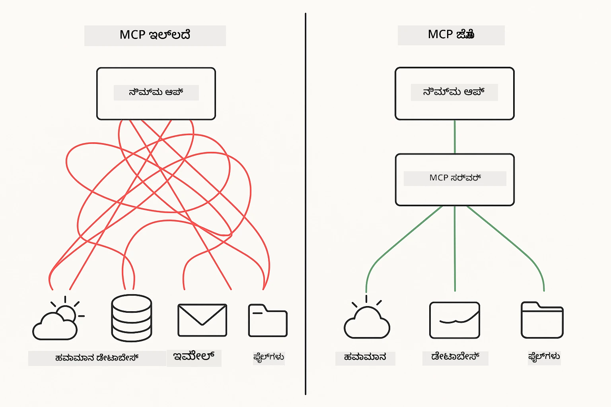
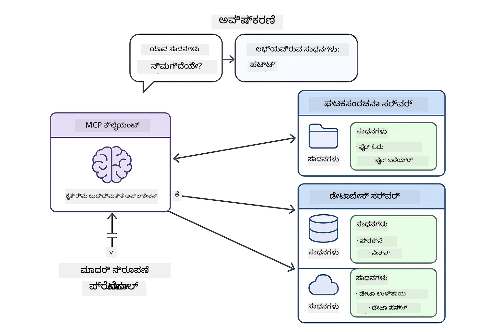
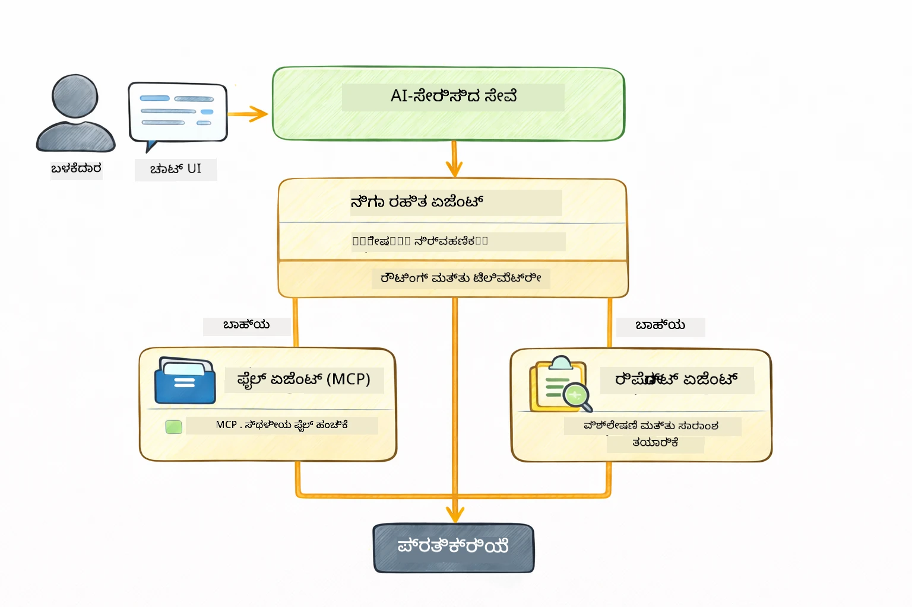

<!--
CO_OP_TRANSLATOR_METADATA:
{
  "original_hash": "6c816d130a1fa47570c11907e72d84ae",
  "translation_date": "2026-01-06T02:33:07+00:00",
  "source_file": "05-mcp/README.md",
  "language_code": "kn"
}
-->
# Module 05: ಮಾದರಿ ಸಂಧರ್ಭ ಪ್ರೋಟೋ콜್ (MCP)

## ವಿಷಯಪಟ್ಟಿ

- [ನೀವು ಏನು ಕಲಿಯಲಿದ್ದೀರಿ](../../../05-mcp)
- [MCP ಎಂದರೆ ಏನು?](../../../05-mcp)
- [MCP ಹೇಗೆ ಕೆಲಸ ಮಾಡುತ್ತದೆ](../../../05-mcp)
- [ಏಜೆಂಟಿಕ್ ಮಾಯ್ದ್ಯಮ](../../../05-mcp)
- [ಉದಾಹರಣೆಗಳನ್ನು ಚಲಾಯಿಸುವುದು](../../../05-mcp)
  - [ಮೊದಲು ಅಗತ್ಯವಿರುವವುಗಳು](../../../05-mcp)
- [ತ್ವರಿತ ಪ್ರಾರಂಭ](../../../05-mcp)
  - [ಕಾಗದ ಕಾರ್ಯಚಟುವಟಿಕೆಗಳು (Stdio)](../../../05-mcp)
  - [ಸೂಪರ್ವೈಸರ್ ಏಜೆಂಟ್](../../../05-mcp)
    - [ಫಲಿತಾಂಶವನ್ನು ಅರ್ಥಮಾಡಿಕೊಳ್ಳುವುದು](../../../05-mcp)
    - [ಪ್ರತಿಕ್ರಿಯೆ ತಂತ್ರಗಳು](../../../05-mcp)
    - [ಏಜೆಂಟಿಕ್ ಮಾಯ್ದ್ಯಮ ವೈಶಿಷ್ಟ್ಯಗಳ ವಿವರಣೆ](../../../05-mcp)
- [ಪ್ರಮುಖ ತತ್ವಗಳು](../../../05-mcp)
- [ಅಭಿನಂದನೆಗಳು!](../../../05-mcp)
  - [ಮುಂದೆಯೇನು?](../../../05-mcp)

## ನೀವು ಏನು ಕಲಿಯಲಿದ್ದೀರಿ

ನೀವು ಸಂಭಾಷಣಾತ್ಮಕ AI ನಿರ್ಮಿಸಿದ್ದು, ಪ್ರಾಂಪ್ಟ್‌ಗಳು mastered ಮಾಡಿದ್ದು, ಪ್ರತಿಕ್ರಿಯೆಗಳನ್ನು ದಾಖಲಿಗಳಲ್ಲಿ ನೆಟ್ಟುಕೊಂಡಿದ್ದು, ಮತ್ತು ಉಪಕರಣಗಳನ್ನು ಹೊಂದಿರುವ ಏಜೆಂಟ್‌ಗಳನ್ನು ಸೃಜಿಸಿದ್ದರು. ಆದರೆ ಆ ಎಲ್ಲ ಉಪಕರಣಗಳು ನಿಮ್ಮ ನಿಖರ ಆಪ್ಲಿಕೇಶನ್‌ಗೆ ವಿನಿಯೋಗಿತವಾಗಿ ನಿರ್ಮಿಸಲ್ಪಟ್ಟದ್ದಾಗಿವೆ. ಯಾರಿಗಾದರೂ ನಿರ್ಮಿಸಲು ಮತ್ತು ಹಂಚಿಕೊಳ್ಳಲು ಸಾಧ್ಯವಾದಂತೆ ಮಾತ್ರ API ಮೂಲಕ ಉಪಕರಣಗಳ ಪ್ರಾಮಾಣಿಕ-ಸ್ಥಳೀಯ ಪರಿಸರಕ್ಕೆ ನಿಮ್ಮ AI ಪ್ರವೇಶ ನೀಡಲು ಸಾಧ್ಯವಾದರೆ? ಈ ಸ೦ಧ್ಯೆಯಲ್ಲಿ, ನೀವು ಪ್ರತ್ಯಕ್ಷವಾಗಿ ಮಾಡಬಹುದಾದದ್ದು ಮಾದರಿ ಸಂಧರ್ಭ ಪ್ರೋಟೋ콜್ (MCP) ಮತ್ತು LangChain4j ನ ಏಜೆಂಟಿಕ್ ಮಾಯ್ದ್ಯಮದೊಂದಿಗೆ ಹೇಗೆ ಮಾಡುವುದು ಎಂಬುದನ್ನು ಕಲಿಯುತ್ತೀರಿ. ನಾವು ಮೊದಲು ಸರಳ MCP ಕಡತ ಓದುಗನನ್ನು ತೋರಿಸುತ್ತೇವೆ ಮತ್ತು ನಂತರ ಅದನ್ನು ಸುಲಭವಾಗಿ ಸೂಪರ್ವೈಸರ್ ಏಜೆಂಟ್ ಮಾದರಿಯ ಮೂಲಕ ಪ್ರಗತಿಪರ ಏಜೆಂಟಿಕ್ ಕಾರ್ಯಪ್ರವಾಹಗಳಿಗೆ ಹೇಗೆ ಸಂಯೋಜಿಸುವುದೆಂದು ತೋರಿಸುತ್ತೇವೆ.

## MCP ಎಂದರೆ ಏನು?

ಮಾದರಿ ಸಂಧರ್ಭ ಪ್ರೋಟೋ콜್ (MCP) ಆದುದನ್ನು ಮಾತ್ರ ಒದಗಿಸುತ್ತದೆ — AI ಆಪ್ಲಿಕೇಶನ್ಗಳು ಹೊರಗಿನ ಉಪಕರಣಗಳನ್ನು ಕಂಡುಹಿಡಿದು ಬಳಸಲು ಸ್ಟಾಂಡರ್ಡ್ ಮಾರ್ಗ. ಪ್ರತಿ ದತ್ತ ಮೂಲ ಅಥವಾ ಸೇವೆಗೆ ಕಸ್ಟಮ್ ಇಂಟಿಗ್ರೇಶನ್ ಬರೆಯುವ ಬದಲು, ನೀವು MCP ಸರ್ವರ್ಗಳಿಗೆ ಸಂಪರ್ಕಸಲಾಗಿ ಆ ಸರ್ವರ್ಗಳು ತಮ್ಮ ಸಾಮರ್ಥ್ಯಗಳನ್ನು ಸರಿಯಾದ ವಿನ್ಯಾಸದಲ್ಲಿ ತೆರೆದೋಡುತ್ತವೆ. ನಿಮ್ಮ AI ಏಜೆಂಟ್ ಆ ಉಪಕರಣಗಳನ್ನು ಸ್ವತಃ ಕಂಡುಹಿಡಿದು ಬಳಸಬಹುದು.



*MCP ಮೊದಲು: ಸಂಕೀರ್ಣ ಪೋಯಿಂಟ್-ಟು-ಪೋಯಿಂಟ್ ಸಂಯೋಜನೆಗಳು. MCP ನಂತರ: ಒಂದು ಪ್ರೋಟೋ콜್, ಅನಂತ ಸಾಧ್ಯತೆಗಳು.*

MCP AI ಅಭಿವೃದ್ಧಿಯಲ್ಲಿ ಮೂಲಗತಿಯ ಸಮಸ್ಯೆಯನ್ನು ಪರಿಹರಿಸುತ್ತದೆ: ಪ್ರತಿ ಸಂಯೋಜನೆ ಕಸ್ಟಮ್ ಆಗಿದೆ. GitHub ಗೆ ಪ್ರವೇಶ ಬೇಕಾ? ಕಸ್ಟಮ್ ಕೋಡ್. ಕಡತಗಳನ್ನು ಓದಲು? ಕಸ್ಟಮ್ ಕೋಡ್. ಡೇಟಾಬೇಸ್ ವಿಚಾರಣೆ ಬೇಕಾ? ಕಸ್ಟಮ್ ಕೋಡ್. ಮತ್ತು ಈ ಯಾವ ಸಂಯೋಜನೆ ಇತರ AI ಆಪ್ಲಿಕೇಶನ್ಗಳಿಗೆ ಕೆಲಸ ಮಾಡುವುದಿಲ್ಲ.

MCP ಇದನ್ನು ಸಾಮಾನ್ಯಗೊಳಿಸುತ್ತದೆ. MCP ಸರ್ವರ್ ಸ್ಪಷ್ಟ ವಿವರಣೆಗಳು ಮತ್ತು ಸ್ಕೀಮಾಗಳೊಂದಿಗೆ ಉಪಕರಣಗಳನ್ನು ತೆರೆದಿಡುತ್ತದೆ. ಯಾವುದೇ MCP ಕ್ಲೈಂಟ್ ಸಂಪರ್ಕಿಸಿ ಲಭ್ಯದ ಉಪಕರಣಗಳನ್ನು ಕಂಡುಹಿಡಿದು ಬಳಸಬಹುದು. ಸೃಷ್ಟಿಸಿ ಒಂದೇ ಬಾರಿ, ಎಲ್ಲಿಯೂ ಬಳಸಿ.



*ಮಾದರಿ ಸಂಧರ್ಭ ಪ್ರೋಟೋಕೊಲ್ ವಾಸ್ತುಶಿಲ್ಪ — ಸ್ಟಾಂಡರ್ಡ್ ಉಪಕರಣ ಕಂಡುಹಿಡಿಯುವಿಕೆ ಮತ್ತು ನಿರ್ವಹಣೆ*

## MCP ಹೇಗೆ ಕೆಲಸ ಮಾಡುತ್ತದೆ

**ಸರ್ವರ್-ಕ್ಲೈಂಟ್ ವಾಸ್ತುಶಿಲ್ಪ**

MCP ಕ್ಲೈಂಟ್-ಸರ್ವರ್ ಮಾದರಿಯನ್ನು ಬಳಸುತ್ತದೆ. ಸರ್ವರ್ಗಳು ಉಪಕರಣಗಳನ್ನು ಒದಗಿಸುತ್ತವೆ — ಕಡತಗಳನ್ನು ಓದುವುದು, ಡೇಟಾಬೇಸ್ ವಿಚಾರಣೆ ಮಾಡುವುದು, API ಕರೆಗಳನ್ನು ಮಾಡುವುದು. ಕ್ಲೈಂಟ್ಗಳು (ನಿಮ್ಮ AI ಆಪ್ಲಿಕೇಶನ್) ಸರ್ವರ್ಗಳಿಗೆ ಸಂಪರ್ಕಿಸಿ ಅವರ ಉಪಕರಣಗಳನ್ನು ಬಳಕೆ ಮಾಡುತ್ತವೆ.

LangChain4j ಜೊತೆ MCP ಬಳಸಲು, ಈ Maven ಅವಲಂಬನೆಯನ್ನು ಸೇರಿಸಿ:

```xml
<dependency>
    <groupId>dev.langchain4j</groupId>
    <artifactId>langchain4j-mcp</artifactId>
    <version>${langchain4j.version}</version>
</dependency>
```

**ಉಪಕರಣ ತಪಾಸಣೆ**

ನಿಮ್ಮ ಕ್ಲೈಂಟ್ MCP ಸರ್ವರ್ನಲ್ಲಿ ಸಂಪರ್ಕಿಸಿದಾಗ, ಅದು ಕೇಳುತ್ತದೆ "ನಿಮಗೆ ಯಾವ ಉಪಕರಣಗಳಿವೆ?" ಸರ್ವರ್ ಲಭ್ಯವಿರುವ ಉಪಕರಣಗಳ ಪಟ್ಟಿ, ಪ್ರತಿ ಉಪಕರಣದ ವಿವರಣೆಗಳು ಮತ್ತು ಪರಾಮಿತಿಗಳ ಸ್ಕೀಮಾವನ್ನು ಪ್ರತಿಕ್ರಿಯಿಸುವುದು. ನಿಮ್ಮ AI ಏಜೆಂಟ್ ಬಳಕೆದಾರರ ವಿನಂತಿಗಳ ಆಧಾರದಲ್ಲಿ ಯಾವ ಉಪಕರಣಗಳನ್ನು ಬಳಸಬೇಕೆಂದು ನಿರ್ಧರಿಸಬಹುದು.

**ಸಂವಹನ ವಿಧಾನಗಳು**

MCP ವಿಭಿನ್ನ ಸಂವಹನ ವಿಧಾನಗಳನ್ನು ಬೆಂಬಲಿಸುತ್ತದೆ. ಈ ಮಾಯ್ದ್ಯಮವು ಸ್ಥಳೀಯ ಪ್ರಕ್ರಿಯೆಗಳಿಗಾಗಿ Stdio ಸಂವಹನವನ್ನು ಪ್ರದರ್ಶಿಸುತ್ತದೆ:


*MCP ಸಂವಹನ ವಿಧಾನಗಳು: ದೂರ ಸರ್ವರ್‌ಗಳಿಗಾಗಿ HTTP, ಸ್ಥಳೀಯ ಪ್ರಕ್ರಿಯೆಗಳಿಗಾಗಿ Stdio*

**Stdio** - [StdioTransportDemo.java](../../../05-mcp/src/main/java/com/example/langchain4j/mcp/StdioTransportDemo.java)

ಸ್ಥಳೀಯ ಪ್ರಕ್ರಿಯೆಗಳಿಗಾಗಿ. ನಿಮ್ಮ ಆಪ್ಲಿಕೇಶನ್ ಸಬ್ಪ್ರೊಸೆಸ್ ಆಗಿ ಸರ್ವರ್ ಅನ್ನು ಸ್ಪಾನ್ಮಾಡಿ ಸಾಂಪ್ರದಾಯಿಕ ಇನ್‌ಪುಟ್/ಔಟ್‌ಪುಟ್ ಮೂಲಕ ಸಂವಹನ ಮಾಡುತ್ತದೆ. ಫೈಲ್ ಸಿಸ್ಟಮ್ ಪ್ರವೇಶ ಅಥವಾ ಕಮಾಂಡ್ ಲೈನ್ ಉಪಕರಣಗಳಿಗೆ ಉಪಯುಕ್ತ.

```java
McpTransport stdioTransport = new StdioMcpTransport.Builder()
    .command(List.of(
        npmCmd, "exec",
        "@modelcontextprotocol/server-filesystem@2025.12.18",
        resourcesDir
    ))
    .logEvents(false)
    .build();
```

> **🤖 [GitHub Copilot](https://github.com/features/copilot) ಚಾಟ್‌ನೊಂದಿಗೆ ಪ್ರಯತ್ನಿಸಿ:** [`StdioTransportDemo.java`](../../../05-mcp/src/main/java/com/example/langchain4j/mcp/StdioTransportDemo.java) ತೆರೆಯಿರಿ ಮತ್ತು ಕೇಳಿ:
> - "Stdio ಸಂವಹನ ಹೇಗೆ ಕೆಲಸ ಮಾಡುತ್ತದೆ ಮತ್ತು HTTP ಗೆ ಹೋಲಿಕೆಯಲ್ಲಿ ಸಮಯ ಏನು?"
> - "LangChain4j MCP ಸರ್ವರ್ ಪ್ರಕ್ರಿಯೆಗಳ ಜೀವನಚರ್ಯೆಯನ್ನು ಹೇಗೆ ನಿರ್ವಹಿಸುತ್ತದೆ?"
> - "AI ಗೆ ಕಡತ ವ್ಯವಸ್ಥೆ ಪ್ರವೇಶ ನೀಡುವುದರಿಂದ ಇರುವ ಭದ್ರತಾ ಪರಿಣಾಮಗಳು ಯಾವುವು?"

## ಏಜೆಂಟಿಕ್ ಮಾಯ್ದ್ಯಮ

MCP ಸ್ಟಾಂಡರ್ಡ್ ಉಪಕರಣಗಳನ್ನು ಒದಗಿಸುವಾಗ, LangChain4j ನ **ಏಜೆಂಟಿಕ್ ಮಾಯ್ದ್ಯಮ** ಅವುಗಳನ್ನು ನಿಯೋಜಿಸುವ ಏಜೆಂಟ್‌ಗಳನ್ನು ನಿರ್ಮಿಸಲು ಪ್ರಕಾರಪೂರಕ ಮಾರ್ಗವನ್ನು ಒದಗಿಸುತ್ತದೆ. `@Agent` ಟಿಪ್ಪಣಿ ಮತ್ತು `AgenticServices` ಮೂಲಕ ನೀವು ಕಾರ್ಯನಿರ್ವಹಣೆ ಬದಲು ಇಂಟರ್ಫೇಸ್ ಮೂಲಕ ಏಜೆಂಟ್ ವರ್ತನೆ ವ್ಯಾಖ್ಯಾನಿಸಬಹುದು.

ಈ ಮಾಯ್ದ್ಯಮದಲ್ಲಿ, ನೀವು **ಸೂಪರ್ವೈಸರ್ ಏಜೆಂಟ್** ಮಾದರಿಯನ್ನು ಅಧ್ಯಯನ ಮಾಡುತ್ತೀರಿ — ಇದು ಪ್ರಗತಿಪರ ಏಜೆಂಟಿಕ್ AI ವಿಧಾನವಿದ್ದು, "ಸೂಪರ್ವೈಸರ್" ಏಜೆಂಟ್ ಬಳಕೆದಾರ ವಿನಂತಿಗಳ ಆಧಾರದಲ್ಲಿ ಯಾವ ಉಪಏಜೆಂಟ್‌ಗಳನ್ನು ಕರೆಯಬೇಕು ಎಂದು ಡೈನಾಮಿಕ್ ನಿರ್ಧಾರ ಮಾಡುತ್ತದೆ. ನಾವು ಎರಡನ್ನೂ ಸಂಯೋಜಿಸಿ ಒಂದು ಉಪಏಜೆಂಟ್‌ಗೆ MCP ಚಾಲಿತ ಕಡತ ಪ್ರವೇಶ ಸಾಮರ್ಥ್ಯಗಳನ್ನು ನೀಡುತ್ತೇವೆ.

ಏಜೆಂಟಿಕ್ ಮಾಯ್ದ್ಯಮ ಬಳಸಲು, ಈ Maven ಅವಲಂಬನೆಯನ್ನು ಸೇರಿಸಿ:

```xml
<dependency>
    <groupId>dev.langchain4j</groupId>
    <artifactId>langchain4j-agentic</artifactId>
    <version>${langchain4j.mcp.version}</version>
</dependency>
```

> **⚠️ ಪರೀಕ್ಷಾತ್ಮಕ:** `langchain4j-agentic` ಮಾಯ್ದ್ಯಮ **ಪರೀಕ್ಷಾತ್ಮಕ** ಆಗಿದ್ದು ಬದಲಾವಣೆಗಳಿಗೆ ಒಳಪಟ್ಟಿದೆ. AI ಸಹಾಯಕರ ನಿರ್ಮಾಣದ ಸ್ಥಿರ ಪದ್ಧತಿಯು `langchain4j-core` ಮತ್ತು ಕಸ್ಟಮ್ ಉಪಕರಣಗಳೊಂದಿಗೆ (ಮಾಡ್ಯೂಲ್ 04) ಉಳಿದುಕೊಂಡಿದೆ.

## ಉದಾಹರಣೆಗಳನ್ನು ಚಲಾಯಿಸುವುದು

### ಮೊದಲಿಗೆ ಅಗತ್ಯವಿರುವವುಗಳು

- ಜಾವಾ 21+, ಮೇವನ 3.9+
- Node.js 16+ ಮತ್ತು npm (MCP ಸರ್ವರ್ಗಳಿಗಾಗಿ)
- `.env` ಕಡತದಲ್ಲಿ ಪರಿಸರ ಚರಗಳನ್ನು ಸಂರಚಿಸಲಾಗಿದೆ (ಮೂಲ ಡೈರೆಕ್ಟರಿಯಿಂದ):
  - `AZURE_OPENAI_ENDPOINT`, `AZURE_OPENAI_API_KEY`, `AZURE_OPENAI_DEPLOYMENT` (ಮಾಡ್ಯೂಲ್‌ಗಳು 01-04 ಜೊತೆ ಸಮಾನ)

> **ಟಿಪ್ಪಣಿ:** ನೀವು ನಿಮ್ಮ ಪರಿಸರ ಚರಗಳನ್ನು ಇಷ್ಟ್ ಮಾಡದಿದ್ದರೆ, [ಮಾಡ್ಯೂಲ್ 00 - ತ್ವರಿತ ಪ್ರಾರಂಭ](../00-quick-start/README.md) ನೋಡಿ, ಅಥವಾ ಮೂಲ ಡೈರೆಕ್ಟರಿಯಲ್ಲಿ `.env.example` ಅನ್ನು `.env` ಆಗಿ ನಕಲಿಸಿ ನಿಮ್ಮ ಮೌಲ್ಯಗಳನ್ನು ತುಂಬಿ.

## ತ್ವರಿತ ಪ್ರಾರಂಭ

**VS ಕೋಡ್ ಬಳಸಿ:** ಎಕ್ಸ್‌ಪ್ಲೋರರ್‌ನಲ್ಲಿ ಯಾವುದೇ ಡೆಮೊ ಕಡತದ ಮೇಲೆ ರೈಟ್-ಕ್ಲಿಕ್ ಮಾಡಿ **"Run Java"** ಆಯ್ಕೆಮಾಡಿ, ಅಥವಾ ರನ್ ಮತ್ತು ಡಿಬಗ್ ಪ್ಯಾನೆಲಿಂದ ಲಾಂಚ್ ಸಂರಚನೆಗಳನ್ನು ಬಳಸಿ (ಮೊದಲು `.env` ಕಡತದಲ್ಲಿ ಟೋಕನ್ ಸೇರಿಸಿದ್ದೀರಿ ಎಂದು ಖಚಿತಪಡಿಸಿಕೊಳ್ಳಿ).

**ಮೇವನ್ ಬಳಸಿ:** ಆಯ್ಕೆಮಾಡಿ ಕೆಳಗಿನ ಉದಾಹರಣೆಗಳ ಮೂಲಕ ಕಮಾಂಡ್ ಲೈನ್‌ರಿಂದ ಒಡನೆ ನಡೆಸಬಹುದು.

### ಕಡತ ಕಾರ್ಯಾಚರಣೆಗಳು (Stdio)

ಇದು ಸ್ಥಳೀಯ ಸಬ್ಪ್ರೊಸೆಸ್ನ ಆಧಾರಿತ ಉಪಕರಣಗಳನ್ನು ತೋರಿಸುತ್ತದೆ.

**✅ ಯಾವುದೇ ಮೊದಲು ಅಗತ್ಯವಿಲ್ಲ** - MCP ಸರ್ವರ್ ಸ್ವಯಂಚಾಲಿತವಾಗಿ ಸ್ಪಾನ್ ಆಗುತ್ತದೆ.

**ಪ್ರಾರಂಭಿಸೋ ಸ್ಕ್ರಿಪ್ಟ್‌ಗಳು (ಶಿಫಾರಸು):**

ಸ್ಟಾರ್ಟ್ ಸ್ಕ್ರಿಪ್ಟ್‌ಗಳು ಮೂಲ `.env` ಕಡತದಿಂದ ಪರಿಸರ ಚರಗಳನ್ನು ಸ್ವಯಂಚಾಲಿತವಾಗಿ ಲೋಡ್ ಮಾಡುತ್ತದೆ:

**ಬ್ಯಾಷ್:**
```bash
cd 05-mcp
chmod +x start-stdio.sh
./start-stdio.sh
```

**ಪವರ್‌ಶೆಲ್:**
```powershell
cd 05-mcp
.\start-stdio.ps1
```

**VS ಕೋಡ್ ಬಳಸಿ:** `StdioTransportDemo.java` ಮೇಲ್-ಕ್ಲಿಕ್ ಮಾಡಿ **"Run Java"** ಆಯ್ಕೆಮಾಡಿ (ನಿಮ್ಮ `.env` ಕಡತ ಸಂರಚಿಸಲಾಗಿದೆ ಎಂದು ಖಚಿತಪಡಿಸಿಕೊಳ್ಳಿ).

ಆಪ್ಲಿಕೇಶನ್ ಸ್ವಯಂಚಾಲಿತವಾಗಿ MCP ಫೈಲ್ ಸಿಸ್ಟಮ್ ಸರ್ವರ್ ಸ್ಪಾನ್ ಮಾಡಿ ಸ್ಥಳೀಯ ಕಡತವನ್ನು ಓದುವುದು. ಸಬ್ಪ್ರೊಸೆಸ್ ನಿರ್ವಹಣೆಯು ನಿಮಗಾಗಿ ಹೇಗೆ ಮಾಡಲ್ಪಟ್ಟಿದೆ ಎಂದು ಗಮನಿಸಿ.

**ನಿರೀಕ್ಷಿತ ಔಟ್‌ಪುಟ್:**
```
Assistant response: The file provides an overview of LangChain4j, an open-source Java library
for integrating Large Language Models (LLMs) into Java applications...
```

### ಸೂಪರ್ವೈಸರ್ ಏಜೆಂಟ್

**ಸೂಪರ್ವೈಸರ್ ಏಜೆಂಟ್ ಮಾದರಿ** ಒಂದು **ಲವಚಿಕ** ಏಜೆಂಟಿಕ್ AI ರೂಪವಾಗಿದೆ. ಸೂಪರ್ವೈಸರ್ ಉಪಯೋಗಿಸಿದ LLM ಬಳಸಿ ಬಳಕೆದಾರ ವಿನಂತಿಯ ಆಧಾರದ ಮೇಲೆ ಯಾವ ಏಜೆಂಟ್‌ಗಳನ್ನು ಆಹ್ವಾನಿಸುವುದು ಅಂತಾ ಸ್ವಯಂ ನಿರ್ಧರಿಸಿಕೊಳ್ಳುತ್ತಾನೆ. ಮುಂದಿನ ಉದಾಹರಣೆಯಲ್ಲಿ, ನಾವು MCP ಚಾಲಿತ ಕಡತ್ ಪ್ರವೇಶ ಮತ್ತು LLM ಏಜೆಂಟ್ ಅನ್ನು ಸಂಯೋಜಿಸಿ ಸೂಪರ್ವೈಸ್ಡ್ ಕಡತ ಓದುವುದು → ವರದಿ ಉತ್ಪಾದಿಸುವ ಕಾರ್ಯಪಥವನ್ನು ನಿರ್ಮಿಸುತ್ತೇವೆ.

ಡೆಮೋದಲ್ಲಿ, `FileAgent` MCP ಫೈಲ್ ಸಿಸ್ಟಮ್ ಉಪಕರಣಗಳನ್ನು ಬಳಸಿ ಕಡತವನ್ನು ಓದುತ್ತದೆ, ಮತ್ತು `ReportAgent` ಕಾರ್ಯನಿರ್ವಹಣೆ ವಿವರರುವ, ನಿರ್ಣಾಯಕ ಸಾರಾಂಶ (1 ವಾಕ್ಯ), 3 ಪ್ರಮುಖ ಅಂಶಗಳು, ಹಾಗೂ ಶಿಫಾರಸುಗಳನ್ನು ಹೊಂದಿರುವ ಬರಹ ವರದಿಯನ್ನು ಸೃಷ್ಟಿಸುತ್ತದೆ. ಸೂಪರ್ವೈಸರ್ ಸ್ವಯಂಚಾಲಿತವಾಗಿ ಈ ಪ್ರವಾಹವನ್ನು ಸಂಯೋಜಿಸುತ್ತದೆ:



```
┌─────────────┐      ┌──────────────┐
│  FileAgent  │ ───▶ │ ReportAgent  │
│ (MCP tools) │      │  (pure LLM)  │
└─────────────┘      └──────────────┘
   outputKey:           outputKey:
  'fileContent'         'report'
```

ಪ್ರತಿ ಏಜೆಂಟ್ ತನ್ನ ಔಟ್‌ಪುಟ್ ಅನ್ನು **ಏಜೆಂಟಿಕ್ ವ್ಯಾಪ್ತಿ** (ಹಂಚಿಕೊಂಡಿರುವ ಸ್ಮೃತಿ) ನಲ್ಲಿ ಸಂಗ್ರಹಿಸುತ್ತದೆ, ಇದರಿಂದ ಕೆಳಗಡೆ ಇರುವ ಏಜೆಂಟ್‌ಗಳು ಹಿಂದಿನ ಫಲಿತಾಂಶಗಳನ್ನು ಪ್ರವೇಶಿಸಬಹುದು. ಇದು MCP ಉಪಕರಣಗಳು ಏಜೆಂಟಿಕ್ ಕಾರ್ಯಪ್ರವಾಹಗಳಿಗೆ ಸುಗಮವಾಗಿ ಹೇಗೆ ಸೇರುತ್ತವೆ ಎಂಬುದನ್ನು ತೋರಿಸುತ್ತದೆ — ಸೂಪರ್ವೈಸರ್‌ಗೆ ಕಡತಗಳು ಹೇಗೆ ಓದಲ್ಪಡುತ್ತವೆ ಎಂಬುದನ್ನು ತಿಳಿದುಕೊಳ್ಳಬೇಕಾಗಿಲ್ಲ, ಕೇವಲ `FileAgent` ಅದು ಮಾಡಬಹುದು ಎಂದು ತಿಳಿದಿರಬೇಕು.

#### ಡೆಮೊ ಚಲಾಯಿಸುವುದು

ಸ್ಟಾರ್ಟ್ ಸ್ಕ್ರಿಪ್ಟ್‌ಗಳು ಮೂಲ `.env` ಕಡತದಿಂದ ಪರಿಸರ ಚರಗಳನ್ನು ಸ್ವಯಂಚಾಲಿತವಾಗಿ ಲೋಡ್ ಮಾಡುತ್ತದೆ:

**ಬ್ಯಾಷ್:**
```bash
cd 05-mcp
chmod +x start-supervisor.sh
./start-supervisor.sh
```

**ಪವರ್‌ಶೆಲ್:**
```powershell
cd 05-mcp
.\start-supervisor.ps1
```

**VS ಕೋಡ್ ಬಳಸಿ:** `SupervisorAgentDemo.java` ಮೇಲೆ ರೈಟ್-ಕ್ಲಿಕ್ ಮಾಡಿ **"Run Java"** ಆಯ್ಕೆಮಾಡಿ (ನಿಮ್ಮ `.env` ಕಡತ ಸಂರಚಿಸಲಾಗಿದೆ ಎಂದು ಖಚಿತಪಡಿಸಿಕೊಳ್ಳಿ).

#### ಸೂಪರ್ವೈಸರ್ ಹೇಗೆ ಕೆಲಸ ಮಾಡುತ್ತದೆ

```java
// ಹಂತ 1: ಫೈಲ್‍ಏಜೆಂಟ್ MCP ಉಪಕರಣಗಳನ್ನು ಬಳಸಿ ಫೈಲ್‌ಗಳನ್ನು ಓದುವಿಕೆ ಮಾಡುತ್ತದೆ
FileAgent fileAgent = AgenticServices.agentBuilder(FileAgent.class)
        .chatModel(model)
        .toolProvider(mcpToolProvider)  // ಫೈಲ್ ಕಾರ್ಯಚಟುವಟಿಕೆಗಳಿಗೆ MCP ಉಪಕರಣಗಳನ್ನು ಹೊಂದಿದೆ
        .build();

// ಹಂತ 2: ವರದಿಏಜೆಂಟ್ ರಚನಾತ್ಮಕ ವರದಿಗಳನ್ನು ಸೃಷ್ಟಿಸುತ್ತದೆ
ReportAgent reportAgent = AgenticServices.agentBuilder(ReportAgent.class)
        .chatModel(model)
        .build();

// ಮೇಲ್ವಿಚಾರಕ ಫೈಲ್ → ವರದಿ ಕೆಲಸದ ಪ್ರಕ್ರಿಯೆಯನ್ನು ನಿಯಂತ್ರಿಸುತ್ತಾನೆ
SupervisorAgent supervisor = AgenticServices.supervisorBuilder()
        .chatModel(model)
        .subAgents(fileAgent, reportAgent)
        .responseStrategy(SupervisorResponseStrategy.LAST)  // ಅಂತಿಮ ವರದಿಯನ್ನು ಹಿಂತಿರುಗಿಸಿ
        .build();

// ಮೇಲ್ವಿಚಾರಕ ವಿನಂತಿಯ ಆಧಾರದ ಮೇಲೆ ಯಾವ ಏಜೆಂಟ್‌ಗಳನ್ನು ಕರೆಸಬೇಕೆಂದು ನಿರ್ಧರಿಸುತ್ತಾನೆ
String response = supervisor.invoke("Read the file at /path/file.txt and generate a report");
```

#### ಪ್ರತಿಕ್ರಿಯೆ ತಂತ್ರಗಳು

ನೀವು `SupervisorAgent` ಅನ್ನು ಸಂರಚಿಸುವಾಗ, ಉಪಏಜೆಂಟ್‌ಗಳು ಕಾರ್ಯನಿರ್ವಹಿಸಿದ ಬಳಿಕ ಬಳಕೆದಾರರಿಗೆ ಕೊನೆಯ ಉತ್ತರವನ್ನು ಹೇಗೆ ರೂಪಿಸಬೇಕೆಂಬುದನ್ನು ನಿಯೋಜಿಸುತ್ತೀರಿ. ಲಭ್ಯವಿರುವ ತಂತ್ರಗಳು:

| ತಂತ್ರ | ವಿವರಣೆ |
|----------|-------------|
| **LAST** | ಸೂಪರ್ವೈಸರ್ ಕೊನೆಯ ಉಪಏಜೆಂಟ್ ಅಥವಾ ಉಪಕರಣದಿಂದ ಬಂದ ಔಟ್‌ಪುಟ್ ಅನ್ನು ಹಿಂತಿರುಗಿಸುತ್ತದೆ. ಇಂತಹ ವ್ಯವಸ್ಥೆಗಳಲ್ಲಿ ಕೊನೆಯ ಏಜೆಂಟ್ ಪೂರ್ಣ, ಅಂತಿಮ ಉತ್ತರವನ್ನು ಉತ್ಪಾದಿಸಲು ವಿನ್ಯಾಸಗೊಳಿಸಲಾಗಿರುತ್ತದೆ (ಉದಾ: ಸಂಶೋಧನಾ ಪೈಪ್ಲೈನ್‌ನ "ಸಾರಾಂಶ ಏಜೆಂಟ್"). |
| **SUMMARY** | ಸೂಪರ್ವೈಸರ್ ತನ್ನ ಸ್ವಂತ ಆಂತರಿಕ ಭಾಷಾ ಮಾದರಿಯನ್ನು (LLM) ಉಪಯೋಗಿಸಿ ಎಲ್ಲ ಉಪಏಜೆಂಟ್ ಔಟ್‌ಪುಟ್‌ಗಳ ಒಟ್ಟಾರೆ ಸಂವಾದದ ಸಾರಾಂಶ ಸೃಷ್ಟಿಸಿ ಅದನ್ನು ಅಂತಿಮ ಪ್ರತಿಕ್ರಿಯೆಯಾಗಿ ಹಿಂತಿರುಗಿಸುತ್ತದೆ. ಇದು ಬಳಕೆದಾರರಿಗೆ ಶುಚಿತ्वದ, ಸಮಗ್ರ ಉತ್ತರವನ್ನು ನೀಡುತ್ತದೆ. |
| **SCORED** | ವ್ಯವಸ್ಥೆ ಆಂತರಿಕ LLM ನಿಂದ ಕೊನೆಯ ಉತ್ತರ ಮತ್ತು ಸಂಕ್ಷಿಪ್ತ ವರದಿಯನ್ನು ಮೂಲ ಬಳಕೆದಾರ ವಿನಂತಿಯೊಂದಿಗೆ ಶ್ರೇಯಾಂಕನ ಮಾಡಿ, ಹೆಚ್ಚಿನ ಶ್ರೇಯಾಂಕ ಪಡೆದ ಔಟ್‌ಪುಟ್ ಅನ್ನು ಹಿಂತಿರುಗಿಸುತ್ತದೆ. |

ಪೂರ್ಣ ಜಾರಿಗೆಯನ್ನು `SupervisorAgentDemo.java` ನಲ್ಲಿ ನೋಡಿ.

> **🤖 [GitHub Copilot](https://github.com/features/copilot) ಚಾಟ್‌ನೊಂದಿಗೆ ಪ್ರಯತ್ನಿಸಿ:** [`SupervisorAgentDemo.java`](../../../05-mcp/src/main/java/com/example/langchain4j/mcp/SupervisorAgentDemo.java) ತೆರೆಯಿರಿ ಮತ್ತು ಕೇಳಿ:
> - "ಸೂಪರ್ವೈಸರ್ ಯಾವ ಏಜೆಂಟ್‌ಗಳನ್ನು ಕರೆಯಬೇಕು ಎಂದು ಹೇಗೆ ನಿರ್ಧರಿಸುತ್ತದೆ?"
> - "ಸೂಪರ್ವೈಸರ್ ಮತ್ತು ಸರಣಿನಿಯ_cmdಾಯ.Workflow ಮಾದರಿಗಳ ನಡುವಿನ ವ್ಯತ್ಯಾಸವೇನು?"
> - "ಸೂಪರ್ವೈಸರ್ ಯೋಜನಾ ವರ್ತನೆವನ್ನು ಹೇಗೆ_customize ಮಾಡಬಹುದು?"

#### ಫಲಿತಾಂಶಗಳನ್ನು ಅರ್ಥಮಾಡಿಕೊಳ್ಳುವುದು

ಡೆಮೋ ನಡೆಯುವಾಗ, ನೀವು ಸೂಪರ್ವೈಸರ್ ಅನೇಕ ಏಜೆಂಟ್‌ಗಳನ್ನು ಹೇಗೆ ನಿರ್ವಹಿಸುತ್ತದೆ ಎಂಬ ಕ್ಷೇತ್ರಬದ್ಧ ಒಂದು ಪ್ರವಾಸವನ್ನು ನೋಡುತ್ತೀರಿ. ಹೀಗಿದೆ ಪ್ರತಿಯೊಂದು ವಿಭಾಗದ ಅರ್ಥ:

```
======================================================================
  FILE → REPORT WORKFLOW DEMO
======================================================================

This demo shows a clear 2-step workflow: read a file, then generate a report.
The Supervisor orchestrates the agents automatically based on the request.
```

**ತಲೆಬರಹವು** ಕಾರ್ಯಪಥ ಕಲ್ಪನೆಯನ್ನು ಪರಿಚಯಿಸುತ್ತದೆ: ಕಡತ ಓದುವಿಕೆದಿಂದ ವರದಿ ಉತ್ಪಾದನೆಯವರೆಗೆ ಕೇಂದ್ರಿತ ಪೈಪ್ಲೈನ್.

```
--- WORKFLOW ---------------------------------------------------------
  ┌─────────────┐      ┌──────────────┐
  │  FileAgent  │ ───▶ │ ReportAgent  │
  │ (MCP tools) │      │  (pure LLM)  │
  └─────────────┘      └──────────────┘
   outputKey:           outputKey:
   'fileContent'        'report'

--- AVAILABLE AGENTS -------------------------------------------------
  [FILE]   FileAgent   - Reads files via MCP → stores in 'fileContent'
  [REPORT] ReportAgent - Generates structured report → stores in 'report'
```

**ಕಾರ್ಯಪ್ರವಾಹ ಚಿತ್ರ** ಏಜೆಂಟ್‌ಗಳ ಮಧ್ಯೆ ದತ್ತ ಹರಿವನ್ನು ತೋರಿಸುತ್ತದೆ. ಪ್ರತಿ ಏಜೆಂಟ್‌ಗೆ ವಿಶೇಷ ಪಾತ್ರವಿದೆ:
- **FileAgent** MCP ಉಪಕರಣಗಳೊಂದಿಗೆ ಕಡತಗಳನ್ನು ಓದುತ್ತದೆ ಮತ್ತು ಕಚ್ಚಾ ವಿಷಯವನ್ನು `fileContent` ನಲ್ಲಿ ಸಂಗ್ರಹಿಸುತ್ತದೆ
- **ReportAgent** ಆ ವಿಷಯವನ್ನು ಬಳಸಿಕೊಂಡು `report` ನಲ್ಲಿ ರಚಿಸಲಾದ ವರದಿಯನ್ನು ಉತ್ಪಾದಿಸುತ್ತದೆ

```
--- USER REQUEST -----------------------------------------------------
  "Read the file at .../file.txt and generate a report on its contents"
```

**ಬಳಕೆದಾರ ವಿನಂತಿ** ಕಾರ್ಯವನ್ನು ತೋರಿಸುತ್ತದೆ. ಸೂಪರ್ವೈಸರ್ ಇದನ್ನು ವಿಶ್ಲೇಷಿಸಿ FileAgent → ReportAgent ಅನ್ನು ಕರೆಯಲು ನಿರ್ಧರಿಸುತ್ತದೆ.

```
--- SUPERVISOR ORCHESTRATION -----------------------------------------
  The Supervisor decides which agents to invoke and passes data between them...

  +-- STEP 1: Supervisor chose -> FileAgent (reading file via MCP)
  |
  |   Input: .../file.txt
  |
  |   Result: LangChain4j is an open-source, provider-agnostic Java framework for building LLM...
  +-- [OK] FileAgent (reading file via MCP) completed

  +-- STEP 2: Supervisor chose -> ReportAgent (generating structured report)
  |
  |   Input: LangChain4j is an open-source, provider-agnostic Java framew...
  |
  |   Result: Executive Summary...
  +-- [OK] ReportAgent (generating structured report) completed
```

**ಸೂಪರ್ವೈಸರ್ ನಿರ್ವಹಣೆ** 2-ಹಂತದ ಕಾರ್ಯಪ್ರವಾಹವನ್ನು ತೋರಿಸುತ್ತದೆ:
1. **FileAgent** MCP ಮೂಲಕ ಕಡತವನ್ನು ಓದುತ್ತದೆ ಮತ್ತು ವಿಷಯವನ್ನು ಸಂಗ್ರಹಿಸುತ್ತದೆ
2. **ReportAgent** ಆ ವಿಷಯವನ್ನು ಪಡೆಯುವ ಮೂಲಕ ರಚಿತ ವರದಿಯನ್ನ ಸೃಷ್ಟಿಸುತ್ತದೆ

ಸೂಪರ್ವೈಸರ್ ಬಳಕೆದಾರ ವಿನಂತಿ ಆಧಾರದ ಮೇಲೆ ಈ ನಿರ್ಧಾರಗಳನ್ನು ಸ್ವತಃ ತೆಗೆದುಕೊಂಡಿದೆ.

```
--- FINAL RESPONSE ---------------------------------------------------
Executive Summary
...

Key Points
...

Recommendations
...

--- AGENTIC SCOPE (Data Flow) ----------------------------------------
  Each agent stores its output for downstream agents to consume:
  * fileContent: LangChain4j is an open-source, provider-agnostic Java framework...
  * report: Executive Summary...
```

#### ಏಜೆಂಟಿಕ್ ಮಾಯ್ದ್ಯಮ ವೈಶಿಷ್ಟ್ಯಗಳ ವಿವರಣೆ

ಉದಾಹರಣೆ ಏಜೆಂಟಿಕ್ ಮಾಯ್ದ್ಯಮದ ಕೆಲವು ಪ್ರಗತಿಶೀಲ ವೈಶಿಷ್ಟ್ಯಗಳನ್ನು ತೋರಿಸುತ್ತದೆ. ಈಗ, ಏಜೆಂಟಿಕ್ ವ್ಯಾಪ್ತಿ ಮತ್ತು ಏಜೆಂಟ್ ಶ್ರೋತೃಗಳನ್ನು ಸಮೀಕ್ಷಿಸೋಣ.

**ಏಜೆಂಟಿಕ್ ವ್ಯಾಪ್ತಿ** ಬಹುಮಾನವಂತ ಸ್ಪಂದಿಸುವ ಸ್ಮೃತಿಯಾಗಿದ್ದು `@Agent(outputKey="...")` ಬಳಸಿ ಏಜೆಂಟ್‌ಗಳು ತಮ್ಮ ಫಲಿತಾಂಶಗಳನ್ನು ಇಲ್ಲಿ ಸಂಗ್ರಹಿಸುತ್ತವೆ. ಇದರಿಂದ:
- ನಂತರದ ಏಜೆಂಟ್‌ಗಳು ಹಿಂದಿನ ಫಲಿತಾಂಶಗಳನ್ನು ಪಡೆಯಬಹುದು
- ಸೂಪರ್ವೈಸರ್ ಅಂತಿಮ ಉತ್ತರವನ್ನು ಸಂಯೋಜಿಸಬಹುದು
- ನೀವು ಪ್ರತಿ ಏಜೆಂಟ್ ಉತ್ಪಾದಿಸಿದುದನ್ನು ಪರಿಶೀಲಿಸಬಹುದು

```java
ResultWithAgenticScope<String> result = supervisor.invokeWithAgenticScope(request);
AgenticScope scope = result.agenticScope();
String fileContent = scope.readState("fileContent");  // ಫೈಲ್ ಏಜೆಂಟ್‌ನಿಂದ ಕಚ್ಚಾ ಫೈಲ್ ಡೇಟಾ
String report = scope.readState("report");            // ರಿಪೋರ್ಟ್ ಏಜೆಂಟ್‌ನಿಂದ ರಚಿಸಿರುವ ವರದಿ
```

**ಏಜೆಂಟ್ ಶ್ರೋತೃಗಳು** ಏಜೆಂಟ್ ಕಾರ್ಯಾಚರಣೆಯ ಮೇಲ್ವಿಚಾರಣೆ ಮತ್ತು ಡಿಬಗ್ ಮಾಡಲು ಅನುಮತಿಸುತ್ತದೆ. ಡೆಮೊದಲ್ಲಿ ಕಾಣುವ ಹಂತ-ಹಂತದ ಔಟ್‌ಪುಟ್ ಅನ್ನು ಪ್ರತಿ ಏಜೆಂಟ್ ಕರೆ ವೇಳೆ ಹೂಕಂಡಿರುವ AgentListener ನೀಡುತ್ತದೆ:
- **beforeAgentInvocation** - ಸೂಪರ್ವೈಸರ್ ಏಜೆಂಟ್ ಆಯ್ಕೆ ಮಾಡಿದಾಗ ಕರೆಮಾಡುತ್ತದೆ, ಯಾವ ಏಜೆಂಟ್ ಆಯ್ಕೆಯಾಗಿದ್ದು ಏಕೆ ಎಂದು ನಿಮಗೆ ತೋರಿಸುತ್ತದೆ
- **afterAgentInvocation** - ಏಜೆಂಟ್ ಪೂರ್ಣವಾದಾಗ ಕರೆಮಾಡುತ್ತದೆ, ಅದರ ಫಲಿತಾಂಶವನ್ನು ತೋರಿಸುತ್ತದೆ
- **inheritedBySubagents** - ಇದು ಸತ್ಯವಾಗಿದ್ದರೆ, ಶ್ರೋತೃ ಎಲ್ಲಾ ಉಪಏಜೆಂಟ್‌ಗಳನ್ನುHierarchy ನಲ್ಲಿ ಮೇಲ್ವಿಚಾರಣೆ ಮಾಡುತ್ತದೆ

```java
AgentListener monitor = new AgentListener() {
    private int step = 0;
    
    @Override
    public void beforeAgentInvocation(AgentRequest request) {
        step++;
        System.out.println("  +-- STEP " + step + ": " + request.agentName());
    }
    
    @Override
    public void afterAgentInvocation(AgentResponse response) {
        System.out.println("  +-- [OK] " + response.agentName() + " completed");
    }
    
    @Override
    public boolean inheritedBySubagents() {
        return true; // ಎಲ್ಲಾ ಉಪ-ಸೂತ್ರಧಾರರಿಗೆ ಪ್ರಸಾರ ಮಾಡಿ
    }
};
```

ಸೂಪರ್ವೈಸರ್ ಮಾದರಿಗಿಂತ ಹೊರತು, `langchain4j-agentic` ಮಾಯ್ದ್ಯಮ ಬಹಳ ಶಕ್ತಿಶಾಲಿ ಕಾರ್ಯಪ್ರವಾಹ ಮಾದರಿಗಳನ್ನು ಮತ್ತು ವೈಶಿಷ್ಟ್ಯಗಳನ್ನು ಒದಗಿಸುತ್ತದೆ:

| ಮಾದರಿ | ವಿವರಣೆ | ಬಳಕೆ ಪ್ರಕರಣ |
|---------|-------------|----------|
| **Sequential** | ಏಜೆಂಟ್‌ಗಳನ್ನು ಕ್ರಮವಾಗಿ ನಿರ್ವಹಿಸಿ, ಸಂಚಯ ನ следующುಗೆ ಹೊಂದುತ್ತದೆ | ಪೈಪ್ಲೈನ್‌ಗಳು: ಸಂಶೋಧನೆ → ವಿಶ್ಲೇಪಣೆ → ವರದಿ |
| **Parallel** | ಏಜೆಂಟ್‌ಗಳನ್ನು ಸಮಕಾಲೀನವಾಗಿ ಚಾಲನೆ ಮಾಡಿ | ಸ್ವತಂತ್ರ ಕಾರ್ಯಗಳು: ಹವಾಮಾನ + ಸುದ್ದಿ + ಸ್ಟಾಕ್‌ಗಳು |
| **Loop** | ಶರತ್ತು ಮಿತಸಿ ಪರಾಕಾಷ್ಠೆಯಾಗುವವರೆಗೆ ಪುನರಾವರ್ತನೆ | ಗುಣಮಟ್ಟ ಮೌಲ್ಯಮಾಪನ: ಶೇರು ≥ 0.8 ಆಗುವವರೆಗೆ ಸುಧಾರಣೆ |
| **Conditional** | ಶರತ್ತುಗಳ ಆಧಾರವಾಗಿ ಮಾರ್ಗನಿರ್ದೇಶನ | ವರ್ಗೀಕರಣ → ತಜ್ಞ ಏಜೆಂಟ್‌ಗೆ ಮಾರ್ಗದರ್ಶನ |
| **Human-in-the-Loop** | ಮಾನವ ಪರಿಶೀಲನೆಗಳನ್ನ ಸೇರ್ಪಡೆ ಮಾಡುವುದು | ಅನುಮೋದನೆ ಕಾರ್ಯಪ್ರವಾಹಗಳು, ವಿಷಯ ಪರಿಷೀಲನೆ |

## ಪ್ರಮುಖ ತತ್ವಗಳು

ನೀವು MCP ಮತ್ತು ಏಜೆಂಟಿಕ್ ಮಾಯ್ದ್ಯಮವನ್ನು ಅಭ್ಯಾಸದಲ್ಲಿ ನೋಡಿದ ನಂತರ, ಪ್ರತಿ ವಿಧಾನವನ್ನು ಯಾವಾಗ ಬಳಸಬೇಕು ಎಂಬುದನ್ನು ಸಂಕ್ಷಿಪ್ತವಾಗಿ ನೀಡೋಣ.

**MCP** ಪ್ರಸ್ತುತ ಉಪಕರಣ ಪರಿಸರಗಳನ್ನು ಪ್ರಯೋಜನಪಡೆದುಕೊಳ್ಳಲು, ಬಹು ಆಪ್ಲಿಕೇಶನ್ಗಳು ಹಂಚಿಕೊಳ್ಳಬಹುದಾದ ಉಪಕರಣಗಳನ್ನು ನಿರ್ಮಿಸಲು, ತೃತೀಯ ಪಕ್ಷ ಸೇವೆಗಳನ್ನು ಸ್ಟಾಂಡರ್ಡ್ ಪ್ರೋಟೋকল ಮೂಲಕ ಸಂಪರ್ಕಿಸಲು, ಅಥವಾ ಉಪಕರಣ ಮುಡುಪುಗಳನ್ನು ಕೋಡ್ ಬದಲಾವಣೆವಿಲ್ಲದೆ ಬದಲಾಯಿಸಲು ಅತ್ಯುತ್ತಮವಾಗಿದೆ.

**ಏಜೆಂಟಿಕ್ ಮಾಯ್ದ್ಯಮ** `@Agent` ಟಿಪ್ಪಣಿಗಳೊಂದಿಗೆ ಪ್ರಕಾರಪೂರಕ ಏಜೆಂಟ್ ವ್ಯಾಖ್ಯಾನಕ್ಕೆ, ಕಾರ್ಯಪ್ರವಾಹ ನಿಯಂತ್ರಣಕ್ಕೆ (ಕ್ರಮಬದ್ಧ, ಪುನರಾವರ್ತಿ, ಸಮಕಾಲೀನ), ಕಡ್ಡಾಯ ಕೋಡ್ ಬದಲಿಗೆ ಇಂಟರ್ಫೇಸ್ ಆಧಾರಿತ ಏಜೆಂಟ್ ವಿನ್ಯಾಸಕ್ಕೆ, ಅಥವಾ `outputKey` ಮೂಲಕ ಹಂಚಿಕೊಂಡ ಔಟ್‌ಪುಟ್‌ಗಳನ್ನು ಹೊಂದಿರುವ ಬಹು ಏಜೆಂಟ್‌ಗಳನ್ನು ಒಟ್ಟಾಗಿ ಬಳಸಲು ಉತ್ತಮವಾಗಿದೆ.

**ಸೂಪರ್ವೈಸರ್ ಏಜೆಂಟ್ ಮಾದರಿ** ಅದು ಅದು ಕಾರ್ಯಪ್ರವಾಹ ಮುಂಚಿತವಾಗಿ ನಿರ್ಣಯಿಸಲಾಗದಿದ್ದಾಗ, ಡೈನಾಮಿಕ್ ನಿಯಂತ್ರಣಕ್ಕೆ LLM ಅನ್ನು ಬಳಕೆ ಮಾಡಬೇಕಾಗಿದ್ದಾಗ, ಬಹು ತಜ್ಞ ಏಜೆಂಟ್‌ಗಳಿಗೆ ಸಂಚಯ ಕಲ್ಪನೆಯಾದಾಗ, ವಿವಿಧ ಸಾಮರ್ಥ್ಯಗಳಿಗೆ ದಾರಿನಿರ್ದೇಶನ ಮಾಡುವ ಸಂಭಾಷಣಾತ್ಮಕ ವ್ಯವಸ್ಥೆಗಳನ್ನು ನಿರ್ಮಿಸುವಾಗ, ಅಥವಾ ಅತ್ಯಂತ ಲವಚಿಕ ಮತ್ತು ಹೊಂದಾಣಿಕೆಯ ಏಜೆಂಟ್ ವರ್ತನೆ ಬೇಕಾದಾಗ ಅತ್ಯುತ್ತಮವಾಗಿದೆ.
## ಅಭಿನಂದನೆಗಳು!

ನೀವು LangChain4j for Beginners ಕೋರ್ಸ್ ಅನ್ನು ಪೂರ್ಣಗೊಳಿಸಿದ್ದೀರಿ. ನೀವು ಕಲಿತಿರುವುದು:

- ಸ್ಮೃತಿಯೊಂದಿಗೆ ಸಂಭಾಷಣಾತ್ಮಕ AI ಅನ್ನು ಸೃಷ್ಟಿಸುವುದು (ಮೊಡುಲ್ 01)
- ವಿವಿಧ ಕಾರ್ಯಗಳಿಗೆ ಪ್ರಾಂಪ್ಟ್ ಇಂಜಿನಿಯರಿಂಗ್ ಮಾದರಿಗಳು (ಮೊಡುಲ್ 02)
- ನಿಮ್ಮ ದಾಖಲೆಗಳಲ್ಲಿ RAG ಮೂಲಕ ಪ್ರತಿಕ್ರಿಯೆಗಳನ್ನು ನೆಲಸುತ್ತಿದೆ (ಮೊಡುಲ್ 03)
- ಕಸ್ಟಮ್ ಉಪಕರಣಗಳೊಂದಿಗೆ ಮೂಲ AI ಏಜೆಂಟುಗಳನ್ನು (ಸಹಾಯಕులు) ರಚಿಸುವುದು (ಮೊಡುಲ್ 04)
- LangChain4j MCP ಮತ್ತು Agentic ಮೋಡ್ಯೂಲ್‌ಗಳೊಂದಿಗೆ ಮಾನಕೃತ ಉಪಕರಣಗಳನ್ನು ಸಂಯೋಜಿಸುವುದು (ಮೊಡುಲ್ 05)

### ಮುಂದೇನು?

ಮೊಡುಲ್‌ಗಳನ್ನು ಪೂರ್ಣಗೊಳಿಸಿದ ನಂತರ, LangChain4j ಪರೀಕ್ಷಾ ಕಲ್ಪನೆಗಳನ್ನು ಕಾರ್ಯಗತಗೊಳಿಸಲು [ಪರೀಕ್ಷಾ ಮಾರ್ಗದರ್ಶಿ](../docs/TESTING.md) ಅನ್ನು ಅನ್ವೇಷಿಸಿ.

**ಅಧಿಕೃತ ಸಂಪನ್ಮೂಲಗಳು:**
- [LangChain4j ದಸ್ತಾವೇಜುಗಳು](https://docs.langchain4j.dev/) - ಸಮಗ್ರ ಮಾರ್ಗದರ್ಶಿಗಳು ಮತ್ತು API ಸೂಚನೆಗಳು
- [LangChain4j GitHub](https://github.com/langchain4j/langchain4j) - ಮೂಲ ಕೋಡ್ ಮತ್ತು ಉದಾಹರಣೆಗಳು
- [LangChain4j ಟ್ಯುಟೋರಿಯಲ್ಸ್](https://docs.langchain4j.dev/tutorials/) - ವಿವಿಧ ಉಪಯೋಗಗಳಿಗೆ ಹಂತ-ಹಂತದ ಪಾಠಗಳು

ಈ ಕೋರ್ಸ್ ಅನ್ನು ಪೂರ್ಣಗೊಳಿಸಿದ್ದಕ್ಕಾಗಿ ಧನ್ಯವಾದಗಳು!

---

**ನಾವಿಗೇಶನ್:** [← ಹಿಂದಿನದು: ಮೊಡುಲ್ 04 - ಉಪಕರಣಗಳು](../04-tools/README.md) | [ಮುಖ್ಯ ಪುಟಕ್ಕೆ ಹಿಂತಿರುಗಿ](../README.md)

---

<!-- CO-OP TRANSLATOR DISCLAIMER START -->
**ವಜಾಗ್ರಹ**:
ಈ ದಾಖಲೆ [Co-op Translator](https://github.com/Azure/co-op-translator) ಎಂಬ AI ಭಾಷಾಂತರ ಸೇವೆಯನ್ನು ಬಳಸಿಕೊಂಡು ಭಾಷಾಂತರಿಸಲಾಗಿದೆ. ನಾವು ಶುದ್ದತೆಯಿಗಾಗಿ ಯತ್ನಿಸುವಾಗ ಸಹ, ಸ್ವಯಂಚಾಲಿತ ಭಾಷಾಂತರಗಳಲ್ಲಿ ತಪ್ಪುಗಳು ಅಥವಾ ಅಸನ್ದಿಗ್ಧತೆಗಳು ಇರಬಹುದು ಎಂಬುದನ್ನು ದಯವಿಟ್ಟು ಗಮನಿಸಿ. ಮೂಲ ಭಾಷೆಯ ಮೂಲ ದಾಖಲೆ ಅನ್ನು ಅಧಿಕೃತ ಮೂಲವಾಗಿ ಪರಿಗಣಿಸಬೇಕು. ಪ್ರಮುಖ ಮಾಹಿತಿಗಾಗಿ, ವೃತ್ತಿಪರ ಮಾನವ ಭಾಷಾಂತರವನ್ನು ಶಿಫಾರಸು ಮಾಡಲಾಗುತ್ತದೆ. ಈ ಭಾಷಾಂತರದ ಬಳಕೆಗಳಿಂದ ಉಂಟಾಗುವ ಯಾವುದೇ ತಪ್ಪು ಅರ್ಥಗರ್ಭಿತತೆ ಅಥವಾ ತಪ್ಪು ವ್ಯಾಖ್ಯಾನಗಳಿಗೆ ನಾವು ಜವಾಬ್ದಾರರಾಗಿಲ್ಲ.
<!-- CO-OP TRANSLATOR DISCLAIMER END -->