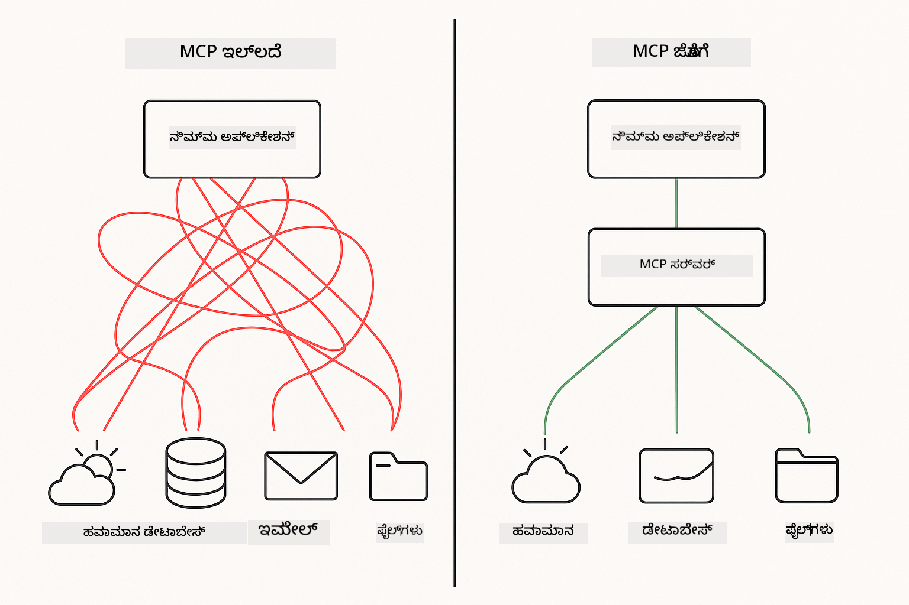
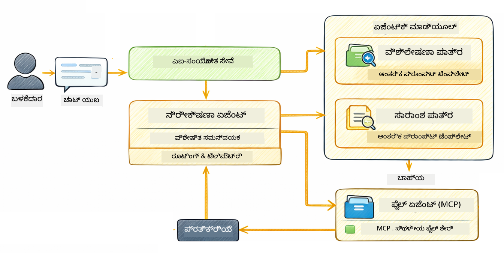

<!--
CO_OP_TRANSLATOR_METADATA:
{
  "original_hash": "f89f4c106d110e4943c055dd1a2f1dff",
  "translation_date": "2025-12-31T08:21:10+00:00",
  "source_file": "05-mcp/README.md",
  "language_code": "kn"
}
-->
# Module 05: Model Context Protocol (MCP)

## Table of Contents

- [ನೀವು ಏನು ಕಲಿಯೋದು](../../../05-mcp)
- [MCP ಎಂದರೆ ಏನು?](../../../05-mcp)
- [MCP ಹೇಗೆ ಕೆಲಸ ಮಾಡುತ್ತದೆ](../../../05-mcp)
- [ಏಜೆನ್ಟಿಕ್ ಮೋಡ್ಯೂಲ್](../../../05-mcp)
- [ಉದಾಹರಣಿಗಳನ್ನು ಚಾಲನೆ ಮಾಡುವುದು](../../../05-mcp)
  - [ಸೂಕ್ತ ಪೂರ್ವಾಪೇಕ್ಷೆಗಳು](../../../05-mcp)
- [ತ್ವರಿತ ಪ್ರಾರಂಭ](../../../05-mcp)
  - [ಫೈಲ್ ಕಾರ್ಯಾಚರಣೆಗಳು (Stdio)](../../../05-mcp)
  - [ಸೂಪರ್ವೈಸರ್ ಏಜೆಂಟ್](../../../05-mcp)
    - [ಔಟ್‌పುಟ್ ಅನ್ನು ಅರ್ಥಮಾಡಿಕೊಳ್ಳುವುದು](../../../05-mcp)
    - [ಏಜೆನ್ಟಿಕ್ ಮೋಡ್ಯೂಲ್ ವೈಶಿಷ್ಟ್ಯಗಳ ವಿವರಣೆ](../../../05-mcp)
- [ಪ್ರಮುಖ ಕಲ್ಪನೆಗಳು](../../../05-mcp)
- [ಭಾನುವಿಗೆ ಅಭಿನಂದನೆಗಳು!](../../../05-mcp)
  - [ಮುಂದೆ ಏನು?](../../../05-mcp)

## What You'll Learn

ನೀವು ಸಂಭಾಷಣಾತ್ಮಕ AI ನಿರ್ಮಿಸಿದ್ದಾರೆ, ಪ್ರಾಂಪ್ಟ್ಗಳನ್ನು ಅರ್ಥಮಾಡಿಕೊಂಡಿದ್ದು, ದಾಖಲಾತಿಗಳಲ್ಲಿ ಪ್ರತಿಕ್ರಿಯೆಗಳನ್ನು ನೆಲೆಯಲ್ಲಿ ಕಟ್ಟಿಕ್ಕೊಂಡಿದ್ದೀರಿ ಮತ್ತು ಟೂಲ್ಗಳೊಂದಿಗೆ ಏಜೆಂಟ್ಗಳನ್ನು ರಚಿಸಿದ್ದು. ಆದರೆ ಆ ಎಲ್ಲಾ ಟೂಲ್ಗಳು ನಿಮ್ಮ ವಿಶೇಷ ಅಪ್ಲಿಕೇಶನ್‌ಗಾಗಿ ಕಸ್ಟಮ್-ನಿರ್ಮಿತವಾಗಿದ್ದವು. AI ಗೆ ಯಾವುದೇ ವ್ಯಕ್ತಿಯೂ ರಚಿಸಿ ಹಂಚಿಕೊಂಡು ಕೂಡಿ ಬಳಸಬಹುದಾದ ಸಾಂದರ್ಭಿಕ ಟೂಲ್ ಪರಿಸರವನ್ನು ನೀಡಲು ಸಾಧ್ಯವಾದರೆ? ಈ ಮಾಡ್ಯೂಲ್ನಲ್ಲಿ, ನಿಮ್ಮಿಗೆ Model Context Protocol (MCP) ಮತ್ತು LangChain4j 的 agentic ಮೋಡ್ಯೂಲ್ ಬಳಸಿ ಅದನ್ನು ಹೇಗೆ ಮಾಡಲು ಆಗುತ್ತದೋ ಕಲಿಸುತ್ತೇವೆ. ಮೊದಲು ಸರಳ MCP ಫೈಲ್ ಓದುಗನನ್ನು ಕಾಣಿಸುತ್ತೇವೆ ಮತ್ತು ನಂತರ Supervisor Agent patterned ಬಳಸಿ ವೇಗವಾಗಿ agentic ಕಾರ್ಯಪ್ರವಾಹಗಳಲ್ಲಿ ಹೇಗೆ ಸಮ Victorianಗೆضم ಆಗುತ್ತದೊ ಪ್ರದರ್ಶಿಸುತ್ತೇವೆ.

## What is MCP?

Model Context Protocol (MCP) ನ್ನು ನಿಖರವಾಗಿ ಅದೇವು ಒದಗಿಸುತ್ತದೆ - AI ಅಪ್ಲಿಕೇಶನ್‌ಗಳಿಗೆ ಹೊರಗಿನ ಟೂಲ್ಗಳನ್ನು ಕಂಡುಹಿಡಿದು ಬಳಸಿಕೊಳ್ಳುವ ಒಂದು ಮಾನಕವಾದ ವಿಧಾನ. ಪ್ರತಿ ದತ್ತಮೂಲ ಅಥವಾ ಸೇವೆಗಾಗಿ ಕಸ್ಟಮ್ ಸಮನ್ವಯಗಳನ್ನು ಬರೆಯುವ ಬದಲು, ನೀವು ತಮ್ಮ ಸಾಮರ್ಥ್ಯಗಳನ್ನು ಸुस್ಪಷ್ಟ ಫಾರ್ಮ್ಯಾಟ್‌ನಲ್ಲಿ ಹೊರಗೋಳಿಸುವ MCP ಸರ್ವರ್‌ಗಳಿಗೆ ಸಂಪರ್ಕ ಮಾಡುತ್ತೀರಿ. ನಿಮ್ಮ AI ಏಜೆಂಟ್ ನಂತರ ಆ ಟೂಲ್ಗಳನ್ನು ಸ್ವಯಂಚಾಲಿತವಾಗಿ ಕಂಡುಹಿಡಿದು ಬಳಸಬಹುದು.



*MCP ಮುಂಚೆ: ಸಂಕೀರ್ಣ ಪಾಯಿಂಟ್-ಟು-ಪಾಯಿಂಟ್ ಸಮನ್ವಯ. MCP ನಂತರ: ಒಂದು ಪ್ರೋಟೋಕಾಲ್, ಅಸಂಗತ ಸಾಧ್ಯತೆಗಳು.*

MCP AI ಅಭಿವೃದ್ಧಿಯಲ್ಲಿ ಮೂಲಭೂತ ಸಮಸ್ಯೆಯನ್ನು ಪರಿಹರಿಸುತ್ತದೆ: ಪ್ರತಿ ಸಮನ്വಯವು ಕಸ್ಟಮ್ ಆಗಿವೆ. GitHub ಅನ್ನು ಪ್ರವೇಶಿಸಬೇಕೇ? ಕಸ್ಟಮ್ ಕೋಡ್. ಫೈಲ್ ಓದಲು ಬೇಕು? ಕಸ್ಟಮ್ ಕೋಡ್. ಡೇಟಾಬೇಸ್‌ ಅನ್ನು ಪ್ರಶ್ನಿಸಬೇಕೆ? ಕಸ್ಟಮ್ ಕೋಡ್. ಮತ್ತು ಈ ಒಂದಾದರೊಂದು ಸಮನ್ವಯಗಳು ಇತರ AI ಅಪ್ಲಿಕೇಶನ್‌ಗಳೊಂದಿಗೆ ಕೆಲಸ ಮಾಡುತ್ತಿಲ್ಲ.

MCP ಇದನ್ನು ಮಾನಕಗೊಳಿಸುತ್ತದೆ. ಒಂದು MCP ಸರ್ವರ್ ಸ್ಪಷ್ಟ ವರ್ಣನೆಗಳು ಮತ್ತು ಸ್ಕೀಮಾ ಹೊಂದಿರುವ ಟೂಲ್ಗಳನ್ನು ಹೊರತರುತ್ತದೆ. ಯಾವುದೇ MCP ಕ್ಲಯಂಟ್ ಸಂಪರ್ಕಿಸಿ, ಲಭ್ಯವಿರುವ ಟೂಲ್ಗಳನ್ನು ಕಂಡುಹಿಡಿದು, ಅವುಗಳನ್ನು ಬಳಸಬಹುದು. ಒಂದೇ ಬಾರಿ ನಿರ್ಮಿಸಿ, ಎಲ್ಲೆಡೆ ಬಳಸಿರಿ.


*Model Context Protocol ವಾಸ್ತುಶಿಲ್ಪ - ಮಾನಕಗೊಳಿಸಿದ ಟೂಲ್ ಕಂಡುಹಿಡಿತ ಮತ್ತು ಕಾರ್ಯಗತಗೊಳಿಸುವಿಕೆ*

## How MCP Works

**ಸರ್ವರ್-ಕ್ಲಯಂಟ್ ವಾಸ್ತುಶಿಲ್ಪ**

MCP ಒಂದು ಕ್ಲಯಂಟ್-ಸರ್ವರ್ ಮಾದರಿಯನ್ನು ಬಳಸುತ್ತದೆ. ಸರ್ವರ್‌ಗಳು ಟೂಲ್ಗಳನ್ನು ಒದಗಿಸುತ್ತವೆ - ಫೈಲ್ ಓದುವುದು, ಡೇಟಾಬೇಸ್‌ಗಳನ್ನು ಪ್ರಶ್ನಿಸುವುದು, APIಗಳನ್ನು ಕರೆ ಮಾಡುವುದು. ಕ್ಲಯಂಟ್‌ಗಳು (ನಿಮ್ಮ AI ಅಪ್ಲಿಕೇಶನ್) ಸರ್ವರ್‌ಗಳಿಗೆ ಸಂಪರ್ಕಿಸಿ ಅವುಗಳ ಟೂಲ್ಗಳನ್ನು ಬಳಸುತ್ತವೆ.

LangChain4j ಜೊತೆ MCP ಬಳಸಲು, ಈ Maven ಅವಲಂಬನೆಯನ್ನು ಸೇರಿಸಿ:

```xml
<dependency>
    <groupId>dev.langchain4j</groupId>
    <artifactId>langchain4j-mcp</artifactId>
    <version>${langchain4j.version}</version>
</dependency>
```

**ಟೂಲ್ ಕಂಡುಹಿಡಿತ**

ನಿಮ್ಮ ಕ್ಲಯಂಟ್ ಒಂದು MCP ಸರ್ವರ್‌ಗೆ ಸಂಪರ್ಕಿಸಿದಾಗ, ಅದು "ನಿಮಗೆ ಯಾವ ಟೂಲ್ಗಳು ಇದೆಯ?" ಎಂದು ಕೇಳುತ್ತದೆ. ಸರ್ವರ್ ಲಭ್ಯವಿರುವ ಟೂಲ್ಗಳ ಪಟ್ಟಿಯೊಂದಿಗೆ ಪ್ರತಿಕ್ರಿಯಿಸುತ್ತದೆ, ಪ್ರತಿ ಟೂಲ್ಗೆ ವರ್ಣನೆಗಳು ಮತ್ತು ಪರಿಮಾಣ ಸ್ಕೀಮಾಗಳು ಸಹಿತ. ಬಳಕೆದಾರರ ವಿನಂತಿಗಳ ಆಧಾರದ ಮೇಲೆ ನಿಮ್ಮ AI ಏಜೆಂಟ್ ಯಾವ ಟೂಲ್ಗಳನ್ನು ಬಳಸಬೇಕೆಂದು ತೀರ್ಮಾನಿಸಬಹುದು.

** ಸಾರಿವ ವ್ಯವಸ್ಥೆಗಳು**

MCP ವಿಭಿನ್ನ ಸಾರಿವ (ಟ್ರಾನ್ಸ್‌ಪೋರ್ಟ್) ಯಂತ್ರಾಂಗಗಳನ್ನು ಬೆಂಬಲಿಸುತ್ತದೆ. ಈ ಮಾಡ್ಯೂಲ್ ಲೊಕಲ್ ಪ್ರಕ್ರಿಯೆಗಳಿಗೆ Stdio ಸಾರಿವನ್ನು ಪ್ರದರ್ಶಿಸುತ್ತದೆ:


*MCP ಸಾರಿವ ವ್ಯವಸ್ಥೆಗಳು: ದೂರಸ್ಥ ಸರ್ವರ್‌ಗಳಿಗೆ HTTP, ಸ್ಥಳೀಯ ಪ್ರಕ್ರಿಯೆಗಳಿಗೆ Stdio*

**Stdio** - [StdioTransportDemo.java](../../../05-mcp/src/main/java/com/example/langchain4j/mcp/StdioTransportDemo.java)

ಸ್ಥಳೀಯ ಪ್ರಕ್ರಿಯೆಗಳಿಗಾಗಿ. ನಿಮ್ಮ ಅಪ್ಲಿಕೇಶನ್ ಒಂದು ಸರ್ವರ್ ಅನ್ನು subprocess ಆಗಿ ಸ್ಪಾನ್ ಮಾಡಿ ಮಾನಕ ಇನ್‌ಪುಟ್/ಔಟ್‌ಪುಟ್ ಮೂಲಕ ಸಂವಹನ ಮಾಡುತ್ತದೆ. ಫೈಲ್‌ಸಿಸ್ಟಮ್ ಪ್ರವೇಶ ಅಥವಾ ಕಮಾಂಡ್-ಲೈನ್ ಟೂಲ್ಗಳಿಗೆ ಉಪಯುಕ್ತ.

```java
McpTransport stdioTransport = new StdioMcpTransport.Builder()
    .command(List.of(
        npmCmd, "exec",
        "@modelcontextprotocol/server-filesystem@2025.12.18",
        resourcesDir
    ))
    .logEvents(false)
    .build();
```

> **🤖 Try with [GitHub Copilot](https://github.com/features/copilot) Chat:** Open [`StdioTransportDemo.java`](../../../05-mcp/src/main/java/com/example/langchain4j/mcp/StdioTransportDemo.java) and ask:
> - "Stdio ಸಾರಿವ ಹೇಗೆ ಕೆಲಸ ಮಾಡುತ್ತದೆ ಮತ್ತು HTTP ಗೆ ಬದಲಾಯಿಸಿದಾಗ ಯಾವಾಗ ಬಳಸಬೇಕು?"
> - "LangChain4j MCP ಸರ್ವರ್ ಪ್ರಕ್ರಿಯೆಗಳನ್ನು ಹೇಗೆ ಜೀವನಚಕ್ರ ನಿರ್ವಹಿಸುತ್ತದೆ?"
> - "AI ಗೆ ಫೈಲ್ ಸಿಸ್ಟಮ್‌ಗೆ ಪ್ರವೇಶ ನೀಡುವ ಸುರಕ್ಷತಾ ಪರಿಣಾಮಗಳು ಏನಿವೆ?"

## The Agentic Module

MCP ಮಾನಕಗೊಳಿಸಿದ ಟೂಲ್ಗಳನ್ನು ಒದಗಿಸಿದರೆ, LangChain4jದ **agentic ಮೋಡ್ಯೂಲ್** ಆ ಟೂಲ್ಗಳನ್ನು ವ್ಯವಸ್ಥಿತವಾಗಿ ಒರೆದಲು ಪ್ರಕಟಣಾ (declarative) ವಿಧಾನವನ್ನು ಒದಗಿಸುತ್ತದೆ. `@Agent` ಅನೋಟೇಶನ್ ಮತ್ತು `AgenticServices` ನಿಮಗೆ ಇಂಟರ್‌ಫೇಸ್‌ಗಳ ಮೂಲಕ ಏಜೆಂಟ್ ವರ್ತನೆಯನ್ನು ನಿರ್ಧರಿಸಲು ಅವಕಾಶ ನೀಡುತ್ತವೆ, ಸೂಚ್ಯಂಕ (imperative) ಕೋಡ್ ಬದಲಾಗಿ.

ಈ ಮಾಡ್ಯೂಲ್ನಲ್ಲಿ, ನೀವು **ಸೂಪರ್ವೈಸರ್ ಏಜೆಂಟ್** ಮಾದರಿಯನ್ನು ಅನ್ವೇಷಿಸುವಿರಿ — ಇದು ಪ್ರಬಲ agentic AI ವಿಧಾನವಾಗಿದ್ದು, "ಸೂಪರ್ವೈಸರ್" ಏಜೆಂಟ್ ಬಳಕೆದಾರರ ವಿನಂತಿಗಳ ಆಧಾರದ ಮೇಲೆ ಯಾವ ಉಪ-ಏಜೆಂಟ್‌ಗಳನ್ನು ಕರೆಮಾಡಬೇಕು ಎಂಬುದನ್ನು ಡೈನಾಮಿಕ್ ಆಗಿ ತೀರ್ಮಾನಿಸುತ್ತದೆ. ನಾವು ಎರಡೂ ಸಂಜ್ಞೆಗಳನ್ನು ಸಂಯೋಜಿಸಿ ನಮ್ಮ ಒಂದು ಉಪ-ಏಜೆಂಟ್‌ಗೆ MCP-ಸಪೋರ್ಟೆಡ್ ಫೈಲ್ 접근 ಸಾಮರ್ಥ್ಯಗಳನ್ನು ಕೊಡುತ್ತೇವೆ.

agentic ಮೋಡ್ಯೂಲ್ ಬಳಸಲು, ಈ Maven ಅವಲಂಬನೆಯನ್ನು ಸೇರಿಸಿ:

```xml
<dependency>
    <groupId>dev.langchain4j</groupId>
    <artifactId>langchain4j-agentic</artifactId>
    <version>${langchain4j.mcp.version}</version>
</dependency>
```

> **⚠️ ಪ್ರಯೋಗಾತ್ಮಕ:** `langchain4j-agentic` ಮೋಡ್ಯೂಲ್ **ಪ್ರಯೋಗಾತ್ಮಕ** ಆಗಿದ್ದು ಬದಲಾಗಬಹುದು. AI ಸಹಾಯಕರನ್ನು ನಿರ್ಮಿಸಲು ಸ್ಥಿರವಾದ ವಿಧಾನವು ಇನ್ನೂ `langchain4j-core` ಮತ್ತು ಕಸ್ಟಮ್ ಟೂಲ್ಗಳನ್ನು ಉಪಯೋಗಿಸುವುದು (Module 04).

## Running the Examples

### Prerequisites

- Java 21+, Maven 3.9+
- Node.js 16+ ಮತ್ತು npm (MCP ಸರ್ವರ್‌ಗಳಿಗಾಗಿ)
- ಮೂಲ ಡೈರೆಕ್ಟರಿಯಲ್ಲಿ `.env` ಫೈಲ್‌ನಲ್ಲಿ ಪರಿಸರ ಚರಗಳನ್ನು ಕಾನ್ಫಿಗರ್ ಮಾಡಿ:
  - **StdioTransportDemoಗಾಗಿ:** `GITHUB_TOKEN` (GitHub Personal Access Token)
  - **SupervisorAgentDemoಗಾಗಿ:** `AZURE_OPENAI_ENDPOINT`, `AZURE_OPENAI_API_KEY`, `AZURE_OPENAI_DEPLOYMENT` (Modules 01-04 ನಂತಹ)

> **ಗమనಿಸಿ:** ನೀವು ಇನ್ನೂ ನಿಮ್ಮ ಪರಿಸರ ಚರಗಳನ್ನು ಹೊಂದಿಸಿಲ್ಲದಿದ್ದರೆ, ನಿರ್ದೇಶನಗಳಿಗಾಗಿ [Module 00 - Quick Start](../00-quick-start/README.md) ನೋಡಿ, ಅಥವಾ ಮೂಲ ಡೈರೆಕ್ಟರಿಯಲ್ಲಿ `.env.example` ಅನ್ನು `.env` ಗೆ ನಕಲಿಸಿ ಮತ್ತು ನಿಮ್ಮ ಮೌಲ್ಯಗಳನ್ನು ತುಂಬಿ.

## Quick Start

**VS Code ಬಳಸುವುದು:** ಎಕ್ಸ್‌ಪ್ಲೋರರ್‌ನಲ್ಲಿ ಯಾವುದೇ ಡೆಮೊ ಫೈಲ್ ಮೇಲೆ ಬಲ-ಕ್ಲಿಕ್ ಮಾಡಿ **"Run Java"** ಆಯ್ಕೆಮಾಡಿ, ಅಥವಾ Run and Debug ಪ್ಯಾನೆಲ್ನಿಂದ ಲಾಂಚ್ ಕಾನ್ಫಿಗ್‌ಗಳನ್ನು ಬಳಸಿ (ಮೊದಲು ನಿಮ್ಮ ಟೋಕನ್ ಅನ್ನು `.env` ಫೈಲ್‌ನಲ್ಲಿ ಸೇರಿಸಿರುವುದನ್ನು ಖಚಿತಪಡಿಸಿಕೊಳ್ಳಿ).

**Maven ಬಳಸಿ:** ಬದಾಗಿ, ನೀವು ಕೆಳಗಿನ ಉದಾಹರಣೆಗಳೊಂದಿಗೆ ಕಮಾಂಡ್ ಲೈನ್‌ನಿಂದ ಚಾಲನೆ ಮಾಡಬಹುದು.

### File Operations (Stdio)

ಇದು ಸ್ಥಳೀಯ subprocess ಆಧಾರಿತ ಟೂಲ್ಗಳನ್ನು ಪ್ರದರ್ಶಿಸುತ್ತದೆ.

**✅ ಪೂರ್ವಾಪೇಕ್ಷೆಗಳು ಅಗತ್ಯವಿಲ್ಲ** - MCP ಸರ್ವರ್ ಸ್ವಯಂಚಾಲಿತವಾಗಿ ಸ್ಪಾನ್ ಆಗುತ್ತದೆ.

**VS Code ಬಳಸುವುದು:** `StdioTransportDemo.java` ಮೇಲೆ ಬಲ-ಕ್ಲಿಕ್ ಮಾಡಿ ಮತ್ತು **"Run Java"** ಆಯ್ಕೆಮಾಡಿ.

**Maven ಬಳಸಿ:**

**Bash:**
```bash
export GITHUB_TOKEN=your_token_here
cd 05-mcp
mvn compile exec:java -Dexec.mainClass=com.example.langchain4j.mcp.StdioTransportDemo
```

**PowerShell:**
```powershell
$env:GITHUB_TOKEN=your_token_here
cd 05-mcp
mvn --% compile exec:java -Dexec.mainClass=com.example.langchain4j.mcp.StdioTransportDemo
```

ಅಪ್ಲಿಕೇಶನ್ ಸ್ವಯಂಚಾಲಿತವಾಗಿ ಫೈಲ್‌ಸಿಸ್ಟಂ MCP ಸರ್ವರ್ ಅನ್ನು ಸ್ಪಾನ್ ಮಾಡುತ್ತದೆ ಮತ್ತು ಸ್ಥಳೀಯ ಫೈಲ್ ಅನ್ನು ಓದುತ್ತದೆ. subprocess ನಿರ್ವಹಣೆಯನ್ನು ಹೇಗೆ ನೋಡಿಕೊಳ್ಳಲಾಗುತ್ತದೆ ಎಂಬುದನ್ನು ಗಮನಿಸಿ.

**ಎಕ್ಕಲ್ಪಡಬಹುದಾದ ಔಟ್‌ಪುಟ್:**
```
Assistant response: The file provides an overview of LangChain4j, an open-source Java library
for integrating Large Language Models (LLMs) into Java applications...
```

### Supervisor Agent




**ಸೂಪರ್ವೈಸರ್ ಏಜೆಂಟ್ ಮಾದರಿ** ಒಂದು **ಲವಚಿಕ** agentic AI ರೂಪವಾಗಿದೆ. ನಿಯತ ಕಾರ್ಯಪ್ರವಾಹಗಳಿಗಿಂತ (ಕ్రమಬದ್ಧ, ಲೂಪ್, ಸಮಂತರ) ಭಿನ್ನವಾಗಿ, ಸೂಪರ್ವೈಸರ್ LLM ಅನ್ನು ಬಳಸಿಕೊಂಡು ಬಳಕೆದಾರರ ವಿನಂತಿಯ ಆಧಾರದ ಮೇಲೆ ಯಾವ ಏಜೆಂಟ್‌ಗಳನ್ನು ಕರೆಮಾಡಬೇಕು ಎಂದು ಸ್ವತಂತ್ರವಾಗಿ ತೀರ್ಮಾನಿಸುತ್ತದೆ.

**ಸೂಪರ್ವೈಸರ್ ಅನ್ನು MCP ಜೊತೆ ಸಂಯೋಜಿಸುವುದು:** ಈ ಉದಾಹರಣೆಯಲ್ಲಿ, ನಾವು `FileAgent` ಗೆ `toolProvider(mcpToolProvider)` ಮೂಲಕ MCP ಫೈಲ್ ಸಿಸ್ಟಮ್ ಟೂಲ್ಗಳ ಪ್ರಾಪ್ಯದ ನೀಡುತ್ತೇವೆ. ಬಳಕೆದಾರ "ಫೈಲ್ ಓದಿ ಮತ್ತು ವಿಶ್ಲೇಷಿಸಿ" ಎಂದು ಕೇಳಿದಾಗ, ಸೂಪರ್ವೈಸರ್ ವಿನಂತಿಯನ್ನು ವಿಶ್ಲೇಷಿಸಿ ಕಾರ್ಯಗತ ಯೋಜನೆಯನ್ನು ರಚಿಸುತ್ತದೆ. ನಂತರ ಅದು `FileAgent` ಗೆ ವಿನಂತಿಯನ್ನು ಮಾರ್ಗದರ್ಶಿಸಿ, `read_file` ಟೂಲನ್ನು ಬಳಸಿ ವಿಷಯವನ್ನು ಪಡೆದುಕೊಳ್ಳುತ್ತದೆ. ಸೂಪರ್ವೈಸರ್ ಆ ವಿಷಯವನ್ನು ಅನ್ವಯಿಸಲು `AnalysisAgent` ಗೆ ಪಾಸ್ ಮಾಡುತ್ತದೆ, ಮತ್ತು ಐಚ್ಛಿಕವಾಗಿ ಫಲಿತಾಂಶಗಳನ್ನು ಸಮೇವಿಸುವುದಕ್ಕೆ `SummaryAgent` ಅನ್ನು ಕರೆಮಾಡಬಹುದು.

ಇದು MCP ಟೂಲ್ಗಳು agentic ಕಾರ್ಯಪ್ರವಾಹಗಳಲ್ಲಿ ಹೇಗೆ ಸುಗಮವಾಗಿ ಅಳವಡಿಸಲಾಗುತ್ತವೋ ತೋರಿಸುತ್ತದೆ — ಸೂಪರ್ವೈಸರ್ ಫೈಲ್ಗಳನ್ನು ಹೇಗೆ ಓದಬೇಕೆಂದು ಜೀವಿತವಾಗಿ ತಿಳಿದಿರಬೇಕಾಗಿಲ್ಲ, ಕೇವಲ `FileAgent` ಅದನ್ನು ಮಾಡಬಲ್ಲದು ಎಂದು ತಿಳಿದುಕೊಳ್ಳುತ್ತದೆ. ಸೂಪರ್ವೈಸರ್ ವಿಭಿನ್ನ ರೀತಿಯ ವಿನಂತಿಗಳಿಗೆ ಡೈನಾಮಿಕ್ ಆಗಿ ಹೊಂದಿಕೊಳ್ಳುತ್ತದೆ ಮತ್ತು ಕೊನೆಗೆ ಕೊನೆಯ ಏಜೆಂಟ್‌ನ ಪ್ರತಿಕ್ರಿಯೆಯನ್ನು ಅಥವಾ ಎಲ್ಲಾ ಕಾರ್ಯಗಳ ಸಾರಾಂಶವನ್ನು ಹಿಂತಿರುಗಿಸುತ್ತದೆ.

**ಪ್ರಾರಂಭ ಸ್ಕ್ರಿಪ್ಟ್‌ಗಳು (ಶಿಫಾರಸು):**

ಸ್ಟಾರ್ಟ್ ಸ್ಕ್ರಿಪ್ಟ್‌ಗಳು ಮೂಲ `.env` ಫೈಲ್‌ನಿಂದ ಪರಿಸರ ಚರಗಳನ್ನು ಸ್ವಯಂಚಾಲಿತವಾಗಿ ಲೋಡ್ ಮಾಡುತ್ತವೆ:

**Bash:**
```bash
cd 05-mcp
chmod +x start.sh
./start.sh
```

**PowerShell:**
```powershell
cd 05-mcp
.\start.ps1
```

**VS Code ಬಳಸುವುದು:** `SupervisorAgentDemo.java` ಮೇಲೆ ಬಲ-ಕ್ಲಿಕ್ ಮಾಡಿ ಮತ್ತು **"Run Java"** ಆಯ್ಕೆಮಾಡಿ (ನಿಮ್ಮ `.env` ಫೈಲ್ ಕಾನ್ಫಿಗರ್ ಆಗಿರುವುದನ್ನು ಖಚಿತಪಡಿಸಿಕೊಳ್ಳಿ).

**ಸೂಪರ್ವೈಸರ್ ಹೇಗೆ ಕೆಲಸ ಮಾಡುತ್ತದೆ:**

```java
// ನಿಗದಿತ ಸಾಮರ್ಥ್ಯಗಳಿರುವ ಹಲವು ಏಜೆಂಟ್‌ಗಳನ್ನು ನಿರ್ದಿಷ್ಟಪಡಿಸಿ
FileAgent fileAgent = AgenticServices.agentBuilder(FileAgent.class)
        .chatModel(model)
        .toolProvider(mcpToolProvider)  // ಫೈಲ್ ಕಾರ್ಯಾಚರಣೆಗಳಿಗಾಗಿ MCP ಉಪಕರಣಗಳಿವೆ
        .build();

AnalysisAgent analysisAgent = AgenticServices.agentBuilder(AnalysisAgent.class)
        .chatModel(model)
        .build();

SummaryAgent summaryAgent = AgenticServices.agentBuilder(SummaryAgent.class)
        .chatModel(model)
        .build();

// ಈ ಏಜೆಂಟ್‌ಗಳನ್ನು ಸಂಯೋಜಿಸುವ Supervisor ಅನ್ನು ರಚಿಸಿ
SupervisorAgent supervisor = AgenticServices.supervisorBuilder()
        .chatModel(model)  // ಆ "planner" ಮಾದರಿ
        .subAgents(fileAgent, analysisAgent, summaryAgent)
        .responseStrategy(SupervisorResponseStrategy.SUMMARY)
        .build();

// Supervisor ಸ್ವಯಂಚಾಲಿತವಾಗಿ ಯಾವ ಏಜೆಂಟ್‌ಗಳನ್ನು ಕರೆಯಬೇಕೆಂದು ನಿರ್ಧರಿಸುತ್ತದೆ
// ಕೆವಲ ನೈಸರ್ಗಿಕ ಭಾಷೆಯ ವಿನಂತಿಯನ್ನು ನೀಡಿ - LLM ಕಾರ್ಯನಿರ್ವಹಣೆಯನ್ನು ಯೋಜಿಸುತ್ತದೆ
String response = supervisor.invoke("Read the file at /path/file.txt and analyze it");
```

ಸಂಪೂರ್ಣ ಅನುಷ್ಠಾನಕ್ಕಾಗಿ [SupervisorAgentDemo.java](../../../05-mcp/src/main/java/com/example/langchain4j/mcp/SupervisorAgentDemo.java) ನೋಡಿ.

> **🤖 Try with [GitHub Copilot](https://github.com/features/copilot) Chat:** Open [`SupervisorAgentDemo.java`](../../../05-mcp/src/main/java/com/example/langchain4j/mcp/SupervisorAgentDemo.java) and ask:
> - "ಸೂಪರ್ವೈಸರ್ ಯಾವ ಏಜೆಂಟ್‌ಗಳನ್ನು invoke ಮಾಡಬೇಕೆಂದು ಹೇಗೆ ನಿರ್ಧರಿಸುತ್ತದೆ?"
> - "ಸೂಪರ್ವೈಸರ್ ಮತ್ತು ಕ್ರಮಬದ್ಧ ಕಾರ್ಯಪ್ರವಾಹ ಮಾದರಿಗಳ ನಡುವಿನ ವ್ಯತ್ಯಾಸ ಏನು?"
> - "ಸೂಪರ್ವೈಸರ್‌ನ ಯೋಜನಾ ವರ್ತನೆಯನ್ನು ನಾನು ಹೇಗೆ ಕಸ್ಟಮೈಸ್ ಮಾಡಬಹುದು?"

#### Understanding the Output

ಡೆಮೊ ಅನ್ನು ನೀವು ಚಾಲನೆ ಮಾಡಿದಾಗ, ಸೂಪರ್ವೈಸರ್ ಹಲವಾರು ಏಜೆಂಟ್‌ಗಳನ್ನು ಹೇಗೆ ಒರಕ್ಯಾಸೆಸ್ಟ್ರೇಟ್ ಮಾಡುತ್ತದೆ ಎಂಬ ರಚಿತವಾದ ನಡೆವಣಿಯನ್ನು ನೀವು ನೋಡುತ್ತೀರಿ. ಪ್ರತಿ ವಿಭಾಗದ ಅರ್ಥವೇನೆಂದು ಇಲ್ಲಿದೆ:

```
======================================================================
  SUPERVISOR AGENT DEMO
======================================================================

This demo shows how a Supervisor Agent orchestrates multiple specialized agents.
The Supervisor uses an LLM to decide which agent to call based on the task.
```

**ಹೆಡರ್** ಡೆಮೊವನ್ನು ಪರಿಚಯಿಸುತ್ತದೆ ಮತ್ತು ಮೂಲ ಕಲ್ಪನೆ ಅನ್ನು ವಿವರಿಸುತ್ತದೆ: ಸೂಪರ್ವೈಸರ್ ಯಾವ ಏಜೆಂಟ್‌ಗಳನ್ನು ಕರೆಮಾಡಬೇಕು ಎಂದು ನಿರ್ಧರಿಸಲು LLM ಅನ್ನು ಬಳಸುತ್ತದೆ (ಕಠಿಣಕೋಡ್ ಮಾಡಲಾದ ನಿಯಮಗಳನ್ನು ಅಲ್ಲ).

```
--- AVAILABLE AGENTS -------------------------------------------------
  [FILE]     FileAgent     - Reads files using MCP filesystem tools
  [ANALYZE]  AnalysisAgent - Analyzes content for structure, tone, and themes
  [SUMMARY]  SummaryAgent  - Creates concise summaries of content
```

**ಲಭ್ಯವಿರುವ ಏಜೆಂಟ್‌ಗಳು** ಸೂಪರ್ವೈಸರ್ ಆಯ್ಕೆಮಾಡಬಹುದಾದ ಮೂರು ವಿಶೇಷ ಏಜೆಂಟ್‌ಗಳನ್ನು ತೋರಿಸುತ್ತದೆ. ಪ್ರತಿ ಏಜೆಂಟ್‌ಗೆ ವಿಶಿಷ್ಟ ಸಾಮರ್ಥ್ಯವಿದೆ:
- **FileAgent** MCP ಟೂಲ್ಗಳನ್ನು ಬಳಸಿ ಫೈಲ್‌ಗಳನ್ನು ಓದುತ್ತದೆ (ಬಾಹ್ಯ ಸಾಮರ್ಥ್ಯ)
- **AnalysisAgent** ವಿಷಯವನ್ನು ವಿಶ್ಲೇಷಿಸುತ್ತದೆ (ಶುದ್ಧ LLM ಸಾಮರ್ಥ್ಯ)
- **SummaryAgent** ಸಾರಾಂಶಗಳನ್ನು ತಯಾರಿಸುತ್ತದೆ (ಶುದ್ಧ LLM ಸಾಮರ್ಥ್ಯ)

```
--- USER REQUEST -----------------------------------------------------
  "Read the file at .../file.txt and analyze what it's about"
```

**ಬಳಕೆದಾರರ ವಿನಂತಿ** ಕೇಳಲ್ಪಟ್ಟಿದ್ದದ್ದನ್ನು ತೋರಿಸುತ್ತದೆ. ಸೂಪರ್ವೈಸರ್ ಇದನ್ನು ಪಾರ್ಸ್ ಮಾಡಿ ಯಾವ ಏಜೆಂಟ್‌ಗಳನ್ನು ಕರೆಮಾಡಬೇಕೆಂದು ನಿರ್ಧರಿಸಬೇಕು.

```
--- SUPERVISOR ORCHESTRATION -----------------------------------------
  The Supervisor will now decide which agents to invoke and in what order...

  +-- STEP 1: Supervisor chose -> FileAgent (reading file via MCP)
  |
  |   Input: .../file.txt
  |
  |   Result: LangChain4j is an open-source Java library designed to simplify...
  +-- [OK] FileAgent (reading file via MCP) completed

  +-- STEP 2: Supervisor chose -> AnalysisAgent (analyzing content)
  |
  |   Input: LangChain4j is an open-source Java library...
  |
  |   Result: Structure: The content is organized into clear paragraphs that int...
  +-- [OK] AnalysisAgent (analyzing content) completed
```

**ಸೂಪರ್ವೈಸರ್ ಒರ್ಕೆಸ್ಟ್ರೇಶನ್** ಇಲ್ಲಿ ಮಾಯಾಜಾಲ ನಡೆಯುತ್ತದೆ. ಹೇಗೆ ನಡೆಯುತ್ತದೆ ನೋಡಿ:
1. ಸೂಪರ್ವೈಸರ್ **ಮೊದಲು FileAgent ಅನ್ನು ಆಯ್ಕೆಮಾಡಿತು** ಏಕೆಂದರೆ ವಿನಂತಿಯಲ್ಲಿ "ಫೈಲ್ ಓದು" ಉಲ್ಲೇಖ ಇತ್ತು
2. FileAgent MCP ಯ `read_file` ಟೂಲನ್ನು ಬಳಸಿ ಫೈಲ್ ವಿಷಯವನ್ನು ತೆಗೆದುಕೊಂಡಿತು
3. ನಂತರ ಸೂಪರ್ವೈಸರ್ **AnalysisAgent ಅನ್ನು ಆಯ್ಕೆಮಾಡಿತು** ಮತ್ತು ಫೈಲ್ ವಿಷಯವನ್ನು ಅದಕ್ಕೆ ಪಾಸ್ ಮಾಡಿತು
4. AnalysisAgent ರಚನೆ, ಧ್ವನಿ (tone), ಮತ್ತು ವಿಷಯಗಳನ್ನನು ವಿಶ್ಲೇಷಿಸಿತು

ಸೂಪರ್ವೈಸರ್ ಬಳಕೆದಾರರ ವಿನಂತಿಯ ಆಧಾರದ ಮೇಲೆ ಈ ನಿರ್ಧಾರಗಳನ್ನು **ಸ್ವಯಂಚಾಲಿತವಾಗಿ** ಮಾಡಿಕೊಂಡಂತೆ ಗಮನಿಸಿ — ಯಾವುದೇ ಕಠಿಣಕೋಡ್ ಮಾಡಲಾದ ಕಾರ್ಯಪ್ರವಾಹವಿಲ್ಲ!

**ಅಂತಿಮ ಪ್ರತಿಕ್ರಿಯೆ** ಎಲ್ಲಾ ಏಜೆಂಟ್‌ಗಳಿಂದ ಸಂವೇದಿತ ಉತ್ತರವನ್ನು ಸಂಯೋಜಿಸುವ ಸೂಪರ್ವೈಸರ್‌ನ ಸಮಾವೇಶಿತ ಉತ್ತರವಾಗಿದೆ. ಉದಾಹರಣೆ ಪ್ರತಿಯೊಂದು ಏಜೆಂಟ್ ಸಂಗ್ರಹಿಸಿದ ಸಾರಾಂಶ ಮತ್ತು ವಿಶ್ಲೇಷಣಾ ಫಲಿತಾಂಶಗಳನ್ನು ತೋರಿಸುವ agentic ವ್ಯಾಪ್ತಿಯನ್ನು ಡಂಪ್ ಮಾಡುತ್ತದೆ.

```
--- FINAL RESPONSE ---------------------------------------------------
I read the contents of the file and analyzed its structure, tone, and key themes.
The file introduces LangChain4j as an open-source Java library for integrating
large language models...

--- AGENTIC SCOPE (Shared Memory) ------------------------------------
  Agents store their results in a shared scope for other agents to use:
  * summary: LangChain4j is an open-source Java library...
  * analysis: Structure: The content is organized into clear paragraphs that in...
```

### Explanation of Agentic Module Features

ಉದಾಹರಣೆ agentic ಮೋಡ್ಯೂಲ್‌ನ ಕೆಲವು ಉನ್ನತ ವೈಶಿಷ್ಟ್ಯಗಳನ್ನು ಪ್ರದರ್ಶಿಸುತ್ತದೆ. Agentic Scope ಮತ್ತು Agent Listeners ಗೆ ನಮ್ಮ ಒಂದು ಸಮೀಪದ ನೋಟ ಇಗೋಣ.

**Agentic Scope** ಏಜೆಂಟ್‌ಗಳು `@Agent(outputKey="...")` ಬಳಸಿ ಅವರ ಫಲಿತಾಂಶಗಳನ್ನು ಸಂಗ್ರಹಿಸಿದ ಶೇರ್ ಮಾಡಲಾದ ಮೆಮೋರಿಯನ್ನು ತೋರಿಸುತ್ತದೆ. ಇದು ಅನುಮತಿಸುತ್ತದೆ:
- ಬಳಿಕದ ಏಜೆಂಟ್‌ಗಳು ಮುಂಚಿತದ ಏಜೆಂಟ್‌ಗಳ ಔಟ್‌ಪುಟ್‌ಗಳನ್ನು ಪ್ರವೇಶಿಸಬಹುದಾದಂತೆ
- ಸೂಪರ್ವೈಸರ್ ಫೈನಲ್ ಪ್ರತಿಕ್ರಿಯೆಯನ್ನು ಸಂಯೋಜಿಸಲು
- ನೀವು ಪ್ರತಿ ಏಜೆಂಟ್ ಏನು ಉತ್ಪಾದಿಸಿತು ಎಂಬುದನ್ನು ಪರಿಶೀಲಿಸಲು

```java
ResultWithAgenticScope<String> result = supervisor.invokeWithAgenticScope(request);
AgenticScope scope = result.agenticScope();
String story = scope.readState("story");
List<AgentInvocation> history = scope.agentInvocations("analysisAgent");
```

**Agent Listeners** ಏಜೆಂಟ್ ಕಾರ್ಯಗತಗೊಳಿಸುವಿಕೆಯ ಮೇಲ್ವಿಚಾರಣೆ ಮತ್ತು ಡೀಬಗ್ಗಿಂಗ್ ಅನ್ನು ಸಕ್ರಿಯಗೊಳಿಸುತ್ತವೆ. ಡೆಮೊದಲ್ಲಿ ನೀವು ನೋಡುವ ಸ್ಟೆಪ್-ಬೈ-ಸ್ಟೆಪ್ ಔಟ್‌ಪುಟ್ ಒಂದು AgentListener ನಿಂದ ಬರುತ್ತದೆ, ಅದು ಪ್ರತಿ ಏಜೆಂಟ್ ಕರೆಮಾಡುವಾಗ hook ಆಗುತ್ತದೆ:
- **beforeAgentInvocation** - ಸೂಪರ್ವೈಸರ್ ಒಂದು ಏಜೆಂಟ್ ಅನ್ನು ಆರಿಸಿದಾಗ ಕರೆಮಾಡಲಾಗುತ್ತದೆ, ಯಾವ ಏಜೆಂಟ್ ಆಯ್ಕೆಮಾಡಲ್ಪಟ್ಟಿತು ಮತ್ತು ಏಕೆ ಎಂಬುದನ್ನು ನೋಡಿ
- **afterAgentInvocation** - ಒಂದು ಏಜೆಂಟ್ ಪೂರ್ಣಗೊಂಡಾಗ ಕರೆಮಾಡಲಾಗುತ್ತದೆ, ಅದರ ಫಲಿತಾಂಶವನ್ನು ತೋರಿಸುತ್ತದೆ
- **inheritedBySubagents** - true ಇದ್ದಾಗ,Listener ಹೈರಾರ್ಕಿಯಲ್ಲಿ ಎಲ್ಲಾ ಏಜೆಂಟ್‌ಗಳನ್ನು ಗಮನಿಸುತ್ತದೆ

```java
AgentListener monitor = new AgentListener() {
    private int step = 0;
    
    @Override
    public void beforeAgentInvocation(AgentRequest request) {
        step++;
        System.out.println("  +-- STEP " + step + ": " + request.agentName());
    }
    
    @Override
    public void afterAgentInvocation(AgentResponse response) {
        System.out.println("  +-- [OK] " + response.agentName() + " completed");
    }
    
    @Override
    public boolean inheritedBySubagents() {
        return true; // ಎಲ್ಲಾ ಉಪಏಜೆಂಟ್‌ಗಳಿಗೆ ಹರಡಿಸಿ
    }
};
```

ಸೂಪರ್ವೈಸರ್ ಮಾದರಿಯನ್ನು ಮೀರಿ, `langchain4j-agentic` ಮೋಡ್ಯೂಲ್ ಹಲವಾರು ಶಕ್ತಿಶಾಲಿ ಕಾರ್ಯಪ್ರವಾಹ ಮಾದರಿಗಳು ಮತ್ತು ವೈಶಿಷ್ಟ್ಯಗಳನ್ನು ಒದಗಿಸುತ್ತದೆ:

| Pattern | Description | Use Case |
|---------|-------------|----------|
| **Sequential** | ಕ್ರಮವಾಗಿ ಏಜೆಂಟ್‌ಗಳನ್ನು ಕಾರ್ಯಗತಗೊಳಿಸಿ, ಔಟ್‌ಪುಟ್ ಮುಂದಿನಕ್ಕೆ ಹರಿದುಕೊಳ್ಳುತ್ತದೆ | ಪೈಪ್‌ಲೈನ್‌ಗಳು: ಸಂಶೋಧನೆ → ವಿಶ್ಲೇಷಣೆ → ವರದಿ |
| **Parallel** | ಏಜೆಂಟ್‌ಗಳನ್ನು ಒಂದೇ ಸಮಯದಲ್ಲಿ ನಡೆಸಿ | ಸ್ವತಂತ್ರ ಕಾರ್ಯಗಳು: ಹೆೆಂಡತಿ + ಸುದ್ದಿ + ಸ್ಟಾಕ್ಸ್ |
| **Loop** | ನಿರ್ದಿಷ್ಟ ಶರತ್ತು ಪೂರೈಸುವವರೆಗೂ ಪುನರಾವರ್ತಿಸಿ | ಗುಣಮಟ್ಟ ಸ್ಕೋರಿಂಗ್: ಶೇಕ್ಷಣೆಯನ್ನು 0.8 ಅಥವಾ ಹೆಚ್ಚು ಆಗುವವರೆಗೂ ಸುಧಾರಿಸಿ |
| **Conditional** | ಶರತ್ತುಗಳ ಆಧಾರದ ಮೇಲೆ ಮಾರ್ಗನಿರ್ದೇಶನ ಮಾಡಿ | ವರ್ಗೀಕರಿಸಿ → ವಿಶೇಷಜ್ಞರಿಗೆ ಮಾರ್ಗನಿರ್ದೇಶಿಸಿ |
| **Human-in-the-Loop** | ಮಾನವ ತಟಸ್ಥರನ್ನು ಸೇರಿಸಿ | ಅನುಮೋದನೆ ಕಾರ್ಯಪ್ರವಾಹಗಳು, ವಿಷಯ ಪರಿಶೀಲನೆ |

## Key Concepts

**MCP** ಇದ್ದಾಗ ನೀವು ಇದ್ದುಕೆಲಸವನ್ನು ಲಾಭ ಪಡೆಯುತ್ತೀರಿ: ಇತರ ಅಪ್ಲಿಕೇಶನ್‌ಗಳು ಹಂಚಿಕೊಳ್ಳಬಹುದಾದ ಅಸ್ತಿತ್ವದಲ್ಲಿರುವ ಟೂಲ್ ಪರಿಸರಗಳನ್ನು ಬಳಸುವುದು, ಬಹುಅಪ್ಲಿಕೇಶನ್‌ಗಳು ಬಳಸಬಹುದಾದ ಟೂಲ್ಗಳನ್ನು ನಿರ್ಮಿಸುವುದು, ಮಾನಕ ಪ್ರೋಟೋಕಾಲ್‌ಗಳೊಂದಿಗೆ ತೃತೀಯ-ಪಕ್ಷ ಸೇವೆಗಳನ್ನು ಏಕೀಕೃತಗೊಳಿಸುವುದು, ಅಥವಾ ಕೋಡ್ ಬದಲಾಯಿಸದೆ ಟೂಲಿನ ಅನುಷ್ಠಾನಗಳನ್ನು ವಿನಿಮಯ ಮಾಡಿಕೊಳ್ಳುವುದು.

**ಏಜೆನ್ಟಿಕ್ ಮೋಡ್ಯೂಲ್** ಉತ್ತಮವಾಗಿ ಕೆಲಸ ಮಾಡುತ್ತದೆ when ನೀವು `@Agent` ಅನೋಟೇಶನ್‌ಗಳೊಂದಿಗೆ ಘೋಷನಾತ್ಮಕ ಏಜೆಂಟ್ ವ್ಯಾಖ್ಯಾನಗಳನ್ನು ಬಯಸಿದಾಗ, ಕಾರ್ಯಪ್ರವಾಹ ಒರ್ಪಣೆ (ಕ್ರಮಬದ್ಧ, ಲೂಪ್, ಸಮಂತರ) ಬೇಕಾದಾಗ, ಇಂಟರ್‌ಫೇಸ್‌ ಆಧಾರಿತ ಏಜೆಂಟ್ ವಿನ್ಯಾಸವನ್ನು ಸೂಚ್ಯಂಕ ಕೋಡ್ ಬದಲು ಬಯಸಿದಾಗ, ಅಥವಾ outputKey ಮೂಲಕ ಹಂಚಿಕೊಂಡು ಹಲವಾರು ಏಜೆಂಟ್‌ಗಳನ್ನು ಸಂಯೋಜಿಸುತ್ತಿದ್ದಾಗ.

**ಸೂಪರ್ವೈಸರ್ ಏಜೆಂಟ್ ಮಾದರಿ** ಅಲ್ಲಿ ಮುನ್ನಡೆ ಸ್ಪಷ್ಟವಾಗದಿರುವಾಗ ಮತ್ತು ನೀವು LLM ನಿಂದ ತೀರ್ಮಾನವನ್ನು ಬಯಸಿದಾಗ ಅದೃಷ್ಟವಾಗುತ್ತದೆ, ನೀವು ಹಲವಾರು ವಿಶೇಷ ಏಜೆಂಟ್‌ಗಳನ್ನು ಹೊಂದಿದ್ದಾಗ ಮತ್ತು ಡೈನಾಮಿಕ್ ಒರ್ಕೆಸ್ಟ್ರೇಶನ್ ಬೇಕಾದಾಗ, ವಿಭಿನ್ನ ಸಾಮರ್ಥ್ಯಗಳಿಗೆ ರೌಟ್ ಮಾಡುವ ಸಂಭಾಷಣಾತ್ಮಕ ವ್ಯವಸ್ಥೆಗಳನ್ನು ನಿರ್ಮಿಸುವಾಗ, ಅಥವಾ ಅತ್ಯಂತ ಲವಚಿಕ, ಹೊಂದುವಿಕೆಯಿಂದಿರುವ ಏಜೆಂಟ್ ವರ್ತನೆಯನ್ನು ಬಯಸುವಾಗ यह ಪದರ ಪ್ರಕಾಶಮಾನವಾಗುತ್ತದೆ.

## Congratulations!

ನೀವು LangChain4j for Beginners ಕೋರ್ಸ್ ಅನ್ನು ಪೂರ್ಣಗೊಳಿಸಿದ್ದೀರಿ. ನೀವು ಕಲಿತದ್ದೇನು:

- ಮೆಮೊರಿ ಜೊತೆಗೆ ಸಂಭಾಷಣಾತ್ಮಕ AI ಅನ್ನು ಹೇಗೆ ನಿರ್ಮಿಸುವುದು (Module 01)
- ವಿಭಿನ್ನ ಕಾರ್ಯಗಳಿಗೆ ಪ್ರಾಂಪ್ಟ್ ಎಂಜಿನಿಯರಿಂಗ್ ಮಾದರಿಗಳು (Module 02)
- ನಿಮ್ಮ ದಾಖಲೆಗಳಲ್ಲಿ ಉತ್ತರಗಳನ್ನು ನೆಲೆಗೆ ಕಟ್ಟಿಕೊಳ್ಳುವುದು RAG ಮೂಲಕ (Module 03)
- ಕಸ್ಟಮ್ ಟೂಲ್ಗಳ ಜೊತೆಗೆ ಮೂಲ AI ಏಜೆಂಟ್‌ಗಳನ್ನು ರಚಿಸುವುದು (Module 04)
- ಪ್ರಮಾಣೀಕೃತ ಸಾಧನಗಳನ್ನು LangChain4j MCP ಮತ್ತು Agentic ಮಾಡ್ಯೂಲ್‌ಗಳೊಂದಿಗೆ ಏಕೀಕರಿಸುವುದು (ಮಾಡ್ಯೂಲ್ 05)

### ಮುಂದೆ ಏನು?

ಮಾಡ್ಯೂಲ್‌ಗಳನ್ನು ಪೂರ್ಣಗೊಳಿಸಿದ ನಂತರ, LangChain4j ಪರೀಕ್ಷಾ ತತ್ವಗಳನ್ನು ಕಾರ್ಯಾಚರಣೆಯಲ್ಲಿ ನೋಡಲು [ಪರೀಕ್ಷಣಾ ಮಾರ್ಗದರ್ಶಿ](../docs/TESTING.md) ಅನ್ನು ಅನ್ವೇಷಿಸಿ.

**ಅಧಿಕೃತ ಸಂಪನ್ಮೂಲಗಳು:**
- [LangChain4j ದಾಖಲೆಗಳು](https://docs.langchain4j.dev/) - ಸಮಗ್ರ ಮಾರ್ಗದರ್ಶನಗಳು ಮತ್ತು API ಉಲ್ಲೇಖ
- [LangChain4j GitHub](https://github.com/langchain4j/langchain4j) - ಮೂಲ ಕೋಡ್ ಮತ್ತು ಉದಾಹರಣೆಗಳು
- [LangChain4j ಮಾರ್ಗದರ್ಶಿಗಳು](https://docs.langchain4j.dev/tutorials/) - ವಿಭಿನ್ನ ಬಳಕೆ ಪ್ರಕರಣಗಳಿಗೆ ಹಂತ ಹಂತದ ಮಾರ್ಗದರ್ಶನಗಳು

ಈ ಕೋರ್ಸ್ ಅನ್ನು ಪೂರ್ಣಗೊಳಿಸಿದ್ದಕ್ಕಾಗಿ ಧನ್ಯವಾದಗಳು!

---

**ನಾವಿಗೇಷನ್:** [← ಹಿಂದಿನ: ಮಾಡ್ಯೂಲ್ 04 - ಸಾಧನಗಳು](../04-tools/README.md) | [ಮುಖ್ಯ ಪುಟಕ್ಕೆ ಹಿಂತಿರುಗಿ](../README.md)

---

<!-- CO-OP TRANSLATOR DISCLAIMER START -->
ನಿರಾಕರಣೆ:
ಈ ದಸ್ತಾವೇಜನ್ನು AI ಅನುವಾದ ಸೇವೆಯಾದ [Co-op Translator](https://github.com/Azure/co-op-translator) ಬಳಸಿ ಅನುವಾದಿಸಲಾಗಿದೆ. ನಾವು ನಿಖರತೆಯನ್ನು ಸಾಧಿಸಲು ಪ್ರಯತ್ನಿಸುತ್ತಿದ್ದರೂ ಸ್ವಯಂಚಾಲಿತ ಅನುವಾದಗಳಲ್ಲಿ ದೋಷಗಳು ಅಥವಾ ಅಶುದ್ಧತೆಗಳು ಇರುವ ಸಾಧ್ಯತೆಯಿದೆ ಎಂದು ದಯವಿಟ್ಟು ಗಮನಿಸಿ. ಮೂಲ ದಸ್ತಾವೇಜನ್ನು ಅದರ ಮೂಲ ಭಾಷೆಯಲ್ಲಿರುವುದು ಅಧಿಕೃತ ಮೂಲವೆಂದು ಪರಿಗಣಿಸಬೇಕು. ಗಂಭೀರ ಮಾಹಿತಿಗಾಗಿ ವೃತ್ತಿಪರ ಮಾನವ ಅನುವಾದವನ್ನು ಶಿಫಾರಸು ಮಾಡಲಾಗುತ್ತದೆ. ಈ ಅನುವಾದ ಬಳಕೆಯಿಂದ ಉಂಟಾಗುವ ಯಾವುದೇ ಗೊಂದಲಗಳು ಅಥವಾ ತಪ್ಪುಅರ್ಥಗ್ರಹಣಗಳಿಗೆ ನಾವು ಜವಾಬ್ದಾರರಾಗುವುದಿಲ್ಲ.
<!-- CO-OP TRANSLATOR DISCLAIMER END -->