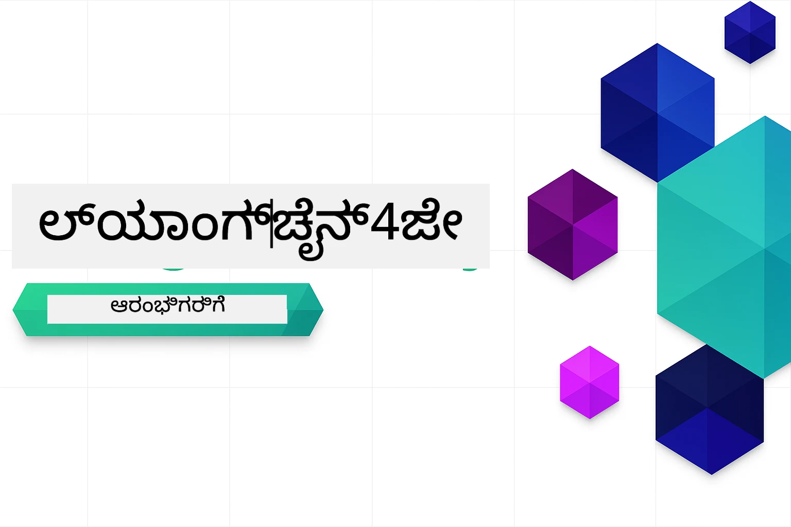

<!--
CO_OP_TRANSLATOR_METADATA:
{
  "original_hash": "7dffae166c7db7dc932a0e3d0217cbb7",
  "translation_date": "2026-01-16T12:41:55+00:00",
  "source_file": "README.md",
  "language_code": "kn"
}
-->


### 🌐 ಬಹುಭಾಷಾ ಬೆಂಬಲ

#### GitHub ಕ್ರಿಯೆಯಿಂದ (ಸ್ವಯಂಚಾಲಿತ ಮತ್ತು ಸದಾ ನವೀಕರಿಸಲಾಗಿದೆ) ಬೆಂಬಲಿಸಲಾಗಿದೆ

<!-- CO-OP TRANSLATOR LANGUAGES TABLE START -->
[ಅರಬ್ಬಿಕ್](../ar/README.md) | [ಬೆಂಗಾಲಿ](../bn/README.md) | [ಬულ್ಗೇರಿಯನ್](../bg/README.md) | [ಬರ್ಮೀಸ್ (ಮ್ಯಾನ್ಮಾರ್)](../my/README.md) | [ಚೈನೀಸ್ (ಸರಳೀಕೃತ)](../zh/README.md) | [ಚೈನೀಸ್ (ಪರಂಪರাগত, ಹಾಂಗ್ ಕಾಂಗ್)](../hk/README.md) | [ಚೈನೀಸ್ (ಪರಂಪರাগত, ಮಕಾವು)](../mo/README.md) | [ಚೈನೀಸ್ (ಪರಂಪರাগত,台湾)](../tw/README.md) | [ಕ್ರೊಯೇಶಿಯನ್](../hr/README.md) | [ಚೆಕ್](../cs/README.md) | [ಡ್ಯಾನಿಶ್](../da/README.md) | [ಡಚ್](../nl/README.md) | [ಎಸ್ಟೋನಿಯನ್](../et/README.md) | [ಫಿನ್ನಿಷ್](../fi/README.md) | [ಫ್ರೆಂಚ್](../fr/README.md) | [ಜರ್ಮನ್](../de/README.md) | [ಗ್ರೀಕ್](../el/README.md) | [ಹೀಬ್ರೂ](../he/README.md) | [ಹಿಂದಿ](../hi/README.md) | [ಹಂಗೇರಿಯನ್](../hu/README.md) | [ಇಂಡೋನೇಶಿಯನ್](../id/README.md) | [ಇಟಾಲಿಯನ್](../it/README.md) | [ಜಪಾನೀಸ್](../ja/README.md) | [ಕನ್ನಡ](./README.md) | [ಕೋರಿಯನ್](../ko/README.md) | [ಲಿಥುವೇನಿಯನ್](../lt/README.md) | [ಮಲಯ್](../ms/README.md) | [ಮಲಯಾಳಂ](../ml/README.md) | [ಮರಾಠಿ](../mr/README.md) | [ನೇಪಾಳಿ](../ne/README.md) | [ನೈಜೀರಿಯನ್ ಪಿಡ್ಜಿನ್](../pcm/README.md) | [ನಾರ್ವೇಜಿಯನ್](../no/README.md) | [ಫರ್ಸಿ (ಪರ್ಶಿಯನ್)](../fa/README.md) | [ಪೋಲಿಷ್](../pl/README.md) | [ಪೋರ್ಚುಗೀಸ್ (ಬ್ರೆಜಿಲ್)](../br/README.md) | [ಪೋರ್ಚುಗೀಸ್ (ಪೋರ್ಚುಗಲ್)](../pt/README.md) | [ಪುಂಜಾಬಿ (ಗುರमुखಿ)](../pa/README.md) | [ರೊಮೇನಿಯನ್](../ro/README.md) | [ರಷ್ಯನ್](../ru/README.md) | [ಸೆರ್ಬಿಯನ್ (ಸಿರಿಲಿಕ್)](../sr/README.md) | [ಸ್ಲೋವಾಕ್](../sk/README.md) | [ಸ್ಲೋವೇನಿಯನ್](../sl/README.md) | [ಸ್ಪ್ಯಾನಿಷ್](../es/README.md) | [ಸ್ವಾಹಿಲಿ](../sw/README.md) | [ಸ್ವೀಡಿಷ್](../sv/README.md) | [ಟಗಾಲೋಗ್ (ಫಿಲಿಪಿನೋ)](../tl/README.md) | [ತೆಲುಗು](../ta/README.md) | [ತೆಲುಗು](../te/README.md) | [ಥಾಯಿ](../th/README.md) | [ತುರ್ಕಿಶ್](../tr/README.md) | [ಯೂಕ್ರೇನಿಯನ್](../uk/README.md) | [ಉರ್ದು](../ur/README.md) | [ವಿಯೆಟ್ನಾಮೀಸ್](../vi/README.md)

> **ಸ್ಥಳೀಯವಾಗಿ ಕ್ಲೋನ್ ಮಾಡಬೇಕೆಂದು ಇಚ್ಛಿಸುವಿರಾ?**

> ಈ ಸಂಗ್ರಹಾಲಯವು 50+ ಭಾಷೆಗಳ ಅನುವಾದಗಳನ್ನು ಒಳಗೊಂಡಿದೆ, ಇದು ಡೌನ್‌ಲೋಡ್ ಗಾತ್ರವನ್ನು ಬಹುಮಟ್ಟಿಗೆ ಹೆಚ್ಚಿಸುತ್ತದೆ. ಅನುವಾದಗಳು ಇಲ್ಲದೆ ಕ್ಲೋನ್ ಮಾಡಲು sparse checkout ಬಳಸಿ:
> ```bash
> git clone --filter=blob:none --sparse https://github.com/microsoft/LangChain4j-for-Beginners.git
> cd LangChain4j-for-Beginners
> git sparse-checkout set --no-cone '/*' '!translations' '!translated_images'
> ```
> ಇದರಿಂದ ನೀವು ಕೋರ್ಸನ್ನು ಪೂರ್ಣಗೊಳಿಸಲು ಅಗತ್ಯವಿರುವ ಎಲ್ಲವನ್ನೂ ಮತ್ತಷ್ಟು ವೇಗವಾಗಿ ಡೌನ್‌ಲೋಡ್ ಮಾಡಬಹುದು.
<!-- CO-OP TRANSLATOR LANGUAGES TABLE END -->

# LangChain4j ಹಂಬಲಿಗಳುಗಾಗಿ

ಮೂಲಭೂತ ಚಾಟ್‌ರಿಂದ AI ಏಜೆಂಟ್‌ಗಳವರೆಗೆ LangChain4j ಮತ್ತು Azure OpenAI GPT-5 ಬಳಸಿ AI ಅಪ್ಲಿಕೇಶನ್‌ಗಳನ್ನು ರಚಿಸುವ ಕೋರ್ಸ್.

**LangChain4j ನಲ್ಲಿ ಹೊಸದಾಗಿ?** ಮುಖ್ಯ ಪದಗಳು ಮತ್ತು ಅರ್ಥಗಳ ವಿವರಣೆಗಾಗಿ [ಪದಕೋಶ](docs/GLOSSARY.md) ನೋಡಿ.

## ವಿಷಯಗಳ ಪಟ್ಟಿ

1. [ತ್ವರಿತ ಪ್ರಾರಂಭ](00-quick-start/README.md) - LangChain4j ಸಾಥ್ ಪ್ರಾರಂಭಿಸಿ
2. [ಪರಿಚಯ](01-introduction/README.md) - LangChain4j ಮೂಲಭೂತಗಳನ್ನು ಕಲಿಯಿರಿ
3. [ಪ್ರಾಂಪ್ಟ್ ಎಂಜಿನಿಯರಿಂಗ್](02-prompt-engineering/README.md) - ಪರಿಣಾಮಕಾರಿಯಾದ ಪ್ರಾಂಪ್ಟ್ ವಿನ್ಯಾಸವನ್ನು ಮಾಸ್ಟರ್ ಮಾಡಿ
4. [ರ್ಯಾಗ್ (ರಿಟ್ರೀವಲ್-ಆಗ್ಮೆಂಟೆಡ್ ಜನರೇಷನ್)](03-rag/README.md) - ಬುದ್ಧಿವಂತಿಕೆಯಲ್ಲಿರುವ ಜ್ಞಾನಾಧಾರಿತ ವ್ಯವಸ್ಥೆಗಳನ್ನು ನಿರ್ಮಿಸಿ
5. [ಟೂಲ್ಸ್](04-tools/README.md) - ಬಾಹ್ಯೋಪಕರಣಗಳು ಮತ್ತು ಸರಳ ಸಹಾಯಕರನ್ನು ಒಗ್ಗೂಡಿಸಿ
6. [ಎಂಸಿಪಿ (ಮಾದರಿ ಸಂಧರ್ಭ ಪ್ರೋಟೋಕಾಲ್)](05-mcp/README.md) - ಮಾದರಿ ಸಂಧರ್ಭ ಪ್ರೋಟೋಕಾಲ್ (ಎಂಸಿಪಿ) ಮತ್ತು ಏಜೆಂಟಿಕ್ ಮೋಡ್ಯೂಲ್‌ಗಳೊಂದಿಗೆ ಕೆಲಸಮಾಡಿ
---

##  ಅಧ್ಯಯನ ಮಾರ್ಗ

> **ತ್ವರಿತ ಪ್ರಾರಂಭ**

1. ಈ ಸಂಗ್ರಹಾಲಯವನ್ನು ನಿಮ್ಮ GitHub ಖಾತೆಗೆ Fork ಮಾಡಿ
2. **Code** → **Codespaces** ಟ್ಯಾಬ್ → **...** → **New with options...** ಕ್ಲಿಕ್ ಮಾಡಿ
3. ಡೀಫಾಲ್ಟ್ ಆಯ್ಕೆಮಾಡಿ - ಈ ಕೋರ್ಸ್ ಗಾಗಿ ನಿರ್ಮಿಸಲಾದ ಡೆವಲಪ್‌ಮೆಂಟ್ ಕಂಟೇನರ್ ಆಯ್ಕೆ ಮಾಡಲಾಗುತ್ತದೆ
4. **Create codespace** ಕ್ಲಿಕ್ ಮಾಡಿ
5. ಪರಿಸರ ಸಿದ್ಧವಾಗಲು 5-10 ನಿಮಿಷ ಕಾಯಿರಿ
6. ಪ್ರಾರಂಭಿಸಲು ನೇರವಾಗಿ [ತ್ವರಿತ ಪ್ರಾರಂಭ](./00-quick-start/README.md) ಗೆ ತೆರಳಿರಿ!

ಮಾಡ್ಯೂಲ್‌ಗಳನ್ನು ಪೂರ್ಣಗೊಳಿಸಿದ ಮೇಲೆ, LangChain4j ಪರೀಕ್ಷಾ ತತ್ವಗಳನ್ನು ಕಾರ್ಯನಿರ್ವಹಣೆಯಲ್ಲಿಯೂ ನೋಡಲು [ಪರೀಕ್ಷಾ ಮಾರ್ಗದರ್ಶನ](docs/TESTING.md) ಅನ್ನು ಅನ್ವೇಷಿಸಿ.

> **ಸೂಚನೆ:** ಈ ತರಬೆತಿ GitHub ಮಾದರಿಗಳು ಮತ್ತು Azure OpenAI ಎರಡನ್ನೂ ಬಳಸುತ್ತದೆ. [ತ್ವರಿತ ಪ್ರಾರಂಭ](00-quick-start/README.md) ಮಾಡ್ಯೂಲ್ GitHub ಮಾದರಿಗಳನ್ನು (Azure ಸಬ್‌ಸ್ಕ್ರಿಪ್ಷನ್ ಅಗತ್ಯವಿಲ್ಲ) ಬಳಸುತ್ತದೆ, ಇನ್ನಿತರಕ್ಕೂ ಮಾಡ್ಯೂಲ್‌ಗಳು 1-5 Azure OpenAI ಬಳಕೆ ಮಾಡುತ್ತವೆ.


## GitHub Copilot ನೊಂದಿಗೆ ಅಧ್ಯಯನ

ದ್ರುತವಾಗಿ ಕೋಡಿಂಗ್ ಪ್ರಾರಂಭಿಸಲು, ಈ ಪ್ರಾಜೆಕ್ಟ್ನ್ನು GitHub Codespace ಅಥವಾ ನಿಮ್ಮ ಸ್ಥಳೀಯ IDE ನಲ್ಲಿ ಒಪನ್ ಮಾಡಿ ಮತ್ತು ಸಕ್ರೀಯ devcontainer ಬಳಸಿ. ಈ ಕೋರ್ಸ್‌ನಲ್ಲಿ ಬಳಸಲ್ಪಡುವ devcontainer GitHub Copilot ನೊಂದಿಗೆ ಪೂರ್ವ-ಸಂರಚಿತವಾಗಿದೆ, ಇದು AI ಜೊತೆಯಿ ಪ್ರೋಗ್ರಾಮಿಂಗ್ ಗೆ ಸಹಾಯ ಮಾಡುತ್ತದೆ.

ಪ್ರತೀ ಕೋಡ್ ಉದಾಹರಣೆಯಲ್ಲಿ GitHub Copilot ನ್ನು ಕೇಳಬಹುದಾದ ಸಲಹೆ ಪ್ರಶ್ನೆಗಳು ಇವೆ, ಇದು ನಿಮ್ಮ ಅರ್ಥವನ್ನು ಮತ್ತಷ್ಟು ಆಳವನ್ನಾಗಿಸಲು ಸಹಾಯ ಮಾಡುತ್ತದೆ. 💡/🤖 ಸೂಚನೆಗಳನ್ನು ಹುಡುಕಿ:

- **Java ಫೈಲ್ ಹೆಡರ್‌ಗಳು** - ಪ್ರತೀ ಉದಾಹರಣೆಗೆ ಸಂಬಂಧಿಸಿದ ಪ್ರಶ್ನೆಗಳು
- **ಮಾಡ್ಯೂಲ್ READMEಗಳು** - ಕೋಡ್ ಉದಾಹರಣೆಗಳ ನಂತರ ಸಂಶೋಧನೆ ಪ್ರಶ್ನೆಗಳು

**ಬಳಿಸುವ ವಿಧಾನ:** ಯಾವುದೇ ಕೋಡ್ ಫೈಲ್ ತೆಗೆಯಿರಿ ಮತ್ತು ಸಲಹೆಯ ಪ್ರಶ್ನೆಗಳನ್ನು Copilot ಗೆ ಕೇಳಿ. ಇದಕ್ಕೆ ಸಂಪೂರ್ಣ ಸಂಪನ್ಮೂಲ ಗೊತ್ತು ಮತ್ತು ವಿವರಣೆ, ವಿಸ್ತರಣೆ ಹಾಗೂ ಪರ್ಯಾಯ ಸಲಹೆಗಳನ್ನು ನೀಡಬಲ್ಲದು.

ಇನ್ನೂ ಕಲಿಯಬೇಕಿದ್ದಾನೆಯಾ? [AI ಜೊತೆಗೆ ಸಂಯುಕ್ತ ಪ್ರೋಗ್ರಾಮಿಂಗ್ ಗಾಗಿ Copilot](https://aka.ms/GitHubCopilotAI) ನೋಡಿ.


## ಹೆಚ್ಚುವರಿ ಸಂಪನ್ಮೂಲಗಳು

<!-- CO-OP TRANSLATOR OTHER COURSES START -->
### ಲಾಂಗ್‌ಚೈನ್
[](https://aka.ms/langchain4j-for-beginners)
[](https://aka.ms/langchainjs-for-beginners?WT.mc_id=m365-94501-dwahlin)

---

### Azure / ಎಡ್ಜ್ / MCP / ಏಜೆಂಟ್ಸ್
[](https://github.com/microsoft/AZD-for-beginners?WT.mc_id=academic-105485-koreyst)
[](https://github.com/microsoft/edgeai-for-beginners?WT.mc_id=academic-105485-koreyst)
[](https://github.com/microsoft/mcp-for-beginners?WT.mc_id=academic-105485-koreyst)
[](https://github.com/microsoft/ai-agents-for-beginners?WT.mc_id=academic-105485-koreyst)

---
 
### ಜನರೇಟಿವ್ AI ಸರಣಿ
[](https://github.com/microsoft/generative-ai-for-beginners?WT.mc_id=academic-105485-koreyst)
[-9333EA?style=for-the-badge&labelColor=E5E7EB&color=9333EA)](https://github.com/microsoft/Generative-AI-for-beginners-dotnet?WT.mc_id=academic-105485-koreyst)
[-C084FC?style=for-the-badge&labelColor=E5E7EB&color=C084FC)](https://github.com/microsoft/generative-ai-for-beginners-java?WT.mc_id=academic-105485-koreyst)
[-E879F9?style=for-the-badge&labelColor=E5E7EB&color=E879F9)](https://github.com/microsoft/generative-ai-with-javascript?WT.mc_id=academic-105485-koreyst)

---
 
### ಕೋರ್ ಲರ್ನಿಂಗ್
[](https://aka.ms/ml-beginners?WT.mc_id=academic-105485-koreyst)
[](https://aka.ms/datascience-beginners?WT.mc_id=academic-105485-koreyst)
[](https://aka.ms/ai-beginners?WT.mc_id=academic-105485-koreyst)
[](https://github.com/microsoft/Security-101?WT.mc_id=academic-96948-sayoung)
[](https://aka.ms/webdev-beginners?WT.mc_id=academic-105485-koreyst)
[](https://aka.ms/iot-beginners?WT.mc_id=academic-105485-koreyst)
[](https://github.com/microsoft/xr-development-for-beginners?WT.mc_id=academic-105485-koreyst)

---
 
### ಕೊಪೈಲಟ್ ಸರಣಿ
[](https://aka.ms/GitHubCopilotAI?WT.mc_id=academic-105485-koreyst)
[](https://github.com/microsoft/mastering-github-copilot-for-dotnet-csharp-developers?WT.mc_id=academic-105485-koreyst)
[](https://github.com/microsoft/CopilotAdventures?WT.mc_id=academic-105485-koreyst)
<!-- CO-OP TRANSLATOR OTHER COURSES END -->

## ಸಹಾಯ ಪಡೆಯುವುದು

ನೀವು ಅटकಿದರೆ ಅಥವಾ AI ಅಪ್ಲಿಕೇಶನ್‌ಗಳನ್ನು ನಿರ್ಮಿಸುವ ಕುರಿತು ಏನಾದರೂ ಪ್ರಶ್ನೆಗಳಿದ್ದರೆ, ಸೇರಿ:

[](https://aka.ms/foundry/discord)

ನೀವು ಉತ್ಪನ್ನ ಅಭಿಪ್ರಾಯ ಅಥವಾ ನಿರ್ಮಾಣದ ವೇಳೆ ದೋಷಗಳನ್ನು ಕಂಡುಕೊಂಡರೆ ಭೇಟಿ ನೀಡಿ:

[](https://aka.ms/foundry/forum)

## ಪರವಾನಗಿ

MIT ಪರವಾನಗಿ - ವಿವರಗಳಿಗೆ [LICENSE](../../LICENSE) ಫೈಲ್ ನೋಡಿ.

---

<!-- CO-OP TRANSLATOR DISCLAIMER START -->
**ಅಸ್ವೀಕಾರ**:
ಈ ದಸ್ತಾವೇಜನ್ನು AI ಭಾಷಾಂತरण ಸೇವೆ [Co-op Translator](https://github.com/Azure/co-op-translator) ಉಪಯೋಗಿಸಿ ಅನುವಾದಿಸಲಾಗಿದೆ. ನಾವು ನಿಖರತೆಗಾಗಿ ಪ್ರಯತ್ನಿಸುತ್ತಿದ್ದರೂ, ಸ್ವಯಂಚಾಲಿತ ಭಾಷಾಂತರಗಳಲ್ಲಿ ತಪ್ಪುಗಳು ಅಥವಾ ಅಸತ್ಯತೆಗಳಾಗಿರಬಹುದು ಎಂಬುದನ್ನು ಗಮನದಲ್ಲಿಟ್ಟುಕೊಳ್ಳಿ. ಮೂಲ ದಸ್ತಾವೇಜು ಅದರ ಸ್ವದೇಶಿ ಭಾಷೆಯಲ್ಲಿ ಆದೇಶಾತ್ಮಕ ಮೂಲವಾಗಿರುತ್ತದೆ. ಪ್ರಮುಖ ಮಾಹಿತಿಗಾಗಿ, ವೃತ್ತಿಪರ ಮಾನವ ಭಾಷಾಂತರಣೆಯನ್ನು ಶಿಫಾರಸು ಮಾಡಲಾಗುತ್ತದೆ. ಈ ಭಾಷಾಂತರ ಬಳಕೆಯಿಂದ ಉಂಟಾಗುವ ಯಾವುದೇ ತಪ್ಪ فهمಗೆ ಅಥವಾ ದುರ್ಭಾವನೆಗಳಿಗೆ ನಾವು ಜವಾಬ್ದಾರರಲ್ಲ.
<!-- CO-OP TRANSLATOR DISCLAIMER END -->