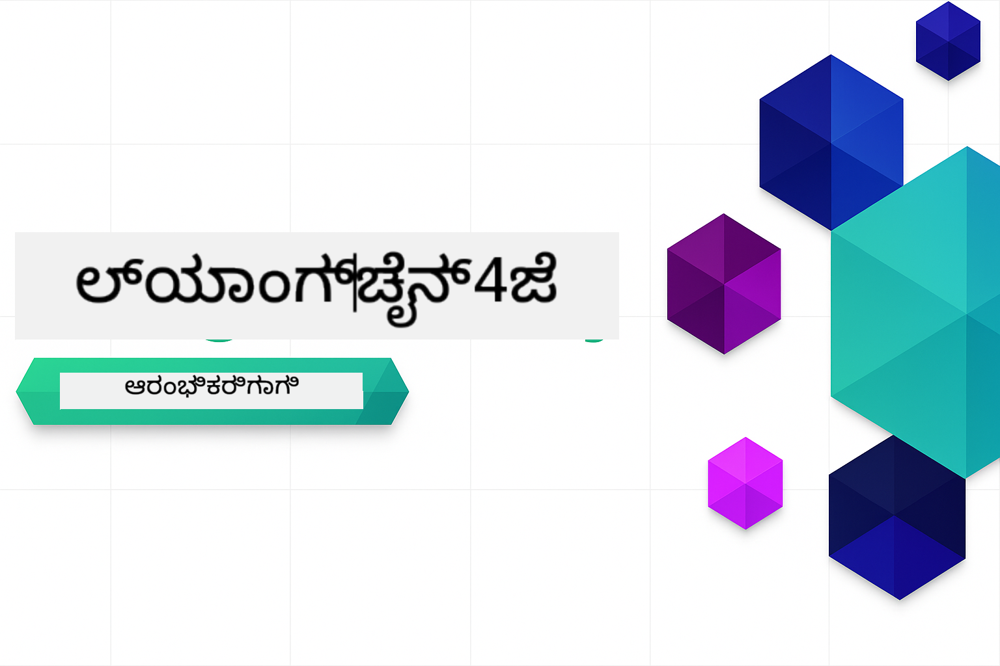

<!--
CO_OP_TRANSLATOR_METADATA:
{
  "original_hash": "6a3bd54fc243ce3dc79d18848d2b5413",
  "translation_date": "2026-01-06T02:26:14+00:00",
  "source_file": "README.md",
  "language_code": "kn"
}
-->


### 🌐 ಬಹುಭಾಷಾ ಬೆಂಬಲ

#### GitHub Action ಮೂಲಕ ಬೆಂಬಲಿಸಲಾಗಿದ್ದು (ಸ್ವಯಂಚಾಲಿತ ಮತ್ತು ಎಲ್ಲದಕ್ಕೂ ಅಪ್‌ಡೇಟ್ ಆಗಿರುವುದು)

<!-- CO-OP TRANSLATOR LANGUAGES TABLE START -->
[Arabic](../ar/README.md) | [Bengali](../bn/README.md) | [Bulgarian](../bg/README.md) | [Burmese (Myanmar)](../my/README.md) | [Chinese (Simplified)](../zh/README.md) | [Chinese (Traditional, Hong Kong)](../hk/README.md) | [Chinese (Traditional, Macau)](../mo/README.md) | [Chinese (Traditional, Taiwan)](../tw/README.md) | [Croatian](../hr/README.md) | [Czech](../cs/README.md) | [Danish](../da/README.md) | [Dutch](../nl/README.md) | [Estonian](../et/README.md) | [Finnish](../fi/README.md) | [French](../fr/README.md) | [German](../de/README.md) | [Greek](../el/README.md) | [Hebrew](../he/README.md) | [Hindi](../hi/README.md) | [Hungarian](../hu/README.md) | [Indonesian](../id/README.md) | [Italian](../it/README.md) | [Japanese](../ja/README.md) | [Kannada](./README.md) | [Korean](../ko/README.md) | [Lithuanian](../lt/README.md) | [Malay](../ms/README.md) | [Malayalam](../ml/README.md) | [Marathi](../mr/README.md) | [Nepali](../ne/README.md) | [Nigerian Pidgin](../pcm/README.md) | [Norwegian](../no/README.md) | [Persian (Farsi)](../fa/README.md) | [Polish](../pl/README.md) | [Portuguese (Brazil)](../br/README.md) | [Portuguese (Portugal)](../pt/README.md) | [Punjabi (Gurmukhi)](../pa/README.md) | [Romanian](../ro/README.md) | [Russian](../ru/README.md) | [Serbian (Cyrillic)](../sr/README.md) | [Slovak](../sk/README.md) | [Slovenian](../sl/README.md) | [Spanish](../es/README.md) | [Swahili](../sw/README.md) | [Swedish](../sv/README.md) | [Tagalog (Filipino)](../tl/README.md) | [Tamil](../ta/README.md) | [Telugu](../te/README.md) | [Thai](../th/README.md) | [Turkish](../tr/README.md) | [Ukrainian](../uk/README.md) | [Urdu](../ur/README.md) | [Vietnamese](../vi/README.md)

> **ಸ್ಥಳೀಯವಾಗಿ ಕ್ಲೋನ್ ಮಾಡುವುದನ್ನು ಆದ್ಯತೆ ನೀಡುತ್ತೀರಾ?**

> ಈ ಸಂಗ್ರಹದಲ್ಲಿ 50 ಕ್ಕೂ ಹೆಚ್ಚು ಭಾಷಾ ಅನುವಾದಗಳು ಸೇರಿವೆ, ಈದು ಡೌನ್ಲೋಡ್ ಗಾತ್ರವನ್ನು ಬಹಳ ಹೆಚ್ಚಿಸುತ್ತವೆ. ಅನುವಾದಗಳಿಲ್ಲದೆ ಕ್ಲೋನ್ ಮಾಡಲು sparse checkout ಬಳಸಿ:
> ```bash
> git clone --filter=blob:none --sparse https://github.com/microsoft/LangChain4j-for-Beginners.git
> cd LangChain4j-for-Beginners
> git sparse-checkout set --no-cone '/*' '!translations' '!translated_images'
> ```
> ಇದರಿಂದ ನೀವು ಕೋರ್ಸ್ ಪೂರ್ಣಗೊಳಿಸಲು ಅಗತ್ಯವಿದ್ದ ಎಲ್ಲವನ್ನೂ ಬಹಳವೇ ವೇಗವಾಗಿ ಡೌನ್ಲೋಡ್ ಮಾಡಬಹುದು.
<!-- CO-OP TRANSLATOR LANGUAGES TABLE END -->

# LangChain4j ಆರಂಭಿಕರಿಗೆ

LangChain4j ಮತ್ತು Azure OpenAI GPT-5 ಬಳಸಿ ಮೆಷಿನ್ ಇನ್ಟೆಲಿಜೆನ್ಸ್ ಅಪ್ಲಿಕೇಶನ್‌ಗಳನ್ನು ನಿರ್ಮಾಣ ಮಾಡುವ ಕೋರ್ಸ್, ಮೂಲಭೂತ ಚಾಟ್‌ನಿಂದ AI ಏಜೆಂಟ್‌ಗಳವರೆಗೆ.

**LangChain4j ಹೊಸದಾಗಿ ಉಪಯೋಗಿಸುತ್ತಿದ್ದೀರಾ?** ಮುಖ್ಯ ಪದಗಳು ಮತ್ತು ಸಂಜ್ಞೆಗಳ ವ್ಯಾಖ್ಯಾನಗಳಿಗೆ [ಶಬ್ದಕೋಶ](docs/GLOSSARY.md) ನೋಡಿ.

## ವಿಷಯಗಳ ಪರಿಸರ

1. [ಶೀಘ್ರ ಪ್ರಾರಂಭ](00-quick-start/README.md) - LangChain4j ಪ್ರಾರಂಭಿಸಿ
2. [ಪರಿಚಯ](01-introduction/README.md) - LangChain4j ಮೂಲಭೂತ ತತ್ವಗಳನ್ನು ತಿಳಿದುಕೊಳ್ಳಿ
3. [ಪ್ರಾಂಪ್ಟ್ ಇಂಜಿನಿಯರಿಂಗ್](02-prompt-engineering/README.md) - ಪರಿಣಾಮಕಾರಿಯಾದ ಪ್ರಾಂಪ್ಟ್ ವಿನ್ಯಾಸವನ್ನು ಅನ್ವಯಿಸು
4. [RAG (ರೆಟ್ರೀವಲ್-ಆಗುಮೆಂಟೆಡ್ ಜನರೇಷನ್)](03-rag/README.md) - ಬುದ್ದಿವಂತಿಕೆ ಆಧಾರಿತ ಜ್ಞಾನ ವ್ಯವಸ್ಥೆಗಳನ್ನು ನಿರ್ಮಿಸಿ
5. [ಕರೇofar Sarkblind Where314](../..) - ಹೊರಗಿನ ಸಾಧನಗಳು ಮತ್ತು ಸರಳ ನೆರವಿಗಾರರನ್ನು ಸೇರಿಸಿ
6. [MCP (ಮಾದರಿ ಸಂಬಂಧ ಪ್ರೋಟೋಕಾಲ್)](05-mcp/README.md) - Model Context Protocol (MCP) ಮತ್ತು ಏಜೆಂಟಿಕ್ ಘಟಕಗಳೊಂದಿಗೆ ಕೆಲಸ ಮಾಡಿ
---

## ಅಧ್ಯಯನ ಮಾರ್ಗ

> **ಶೀಘ್ರ ಪ್ರಾರಂಭ**

1. ಈ ಸಂಗ್ರಹವನ್ನು ನಿಮ್ಮ GitHub ಖಾತೆಗೆ Fork ಮಾಡಿ
2. **Code** → **Codespaces** ಟ್ಯಾಬ್ → **...** → **New with options...** ಕ್ಲಿಕ್ ಮಾಡಿ
3. ಡೀಫಾಲ್ಟ್ ಆಯ್ಕೆಮಾಡಿ – ಇದು ಈ ಕೋರ್ಸ್‌ಗೆ ಸೃಷ್ಟಿಸಲಾದ ಅಭಿವೃದ್ಧಿ ಕಂಟೈನರ್ ಆಯ್ಕೆ ಮಾಡುತ್ತದೆ
4. **Create codespace** ಕ್ಲಿಕ್ ಮಾಡಿ
5. ಪರಿಸರ ಸಿದ್ಧವಾಗಲು 5-10 ನಿಮಿಷ ಕಾಯಿರಿ
6. ಸರಿಯಾಗಿ ಪ್ರಾರಂಭಿಸಲು [ಶೀಘ್ರ ಪ್ರಾರಂಭ](./00-quick-start/README.md) ಗೆ ನೇರವಾಗಿ ಹೋಗಿ!

> **ಸ್ಥಳೀಯವಾಗಿ ಕ್ಲೋನ್ ಮಾಡುವುದನ್ನು ಆದ್ಯತೆ ನೀಡುತ್ತೀರಾ?**
>
> ಈ ಸಂಗ್ರಹದಲ್ಲಿ 50 ಕ್ಕೂ ಹೆಚ್ಚು ಭಾಷಾ ಅನುವಾದಗಳು ಸೇರಿವೆ, ಈದು ಡೌನ್ಲೋಡ್ ಗಾತ್ರವನ್ನು ಬಹಳ ಹೆಚ್ಚಿಸುತ್ತವೆ. ಅನುವಾದಗಳಿಲ್ಲದೆ ಕ್ಲೋನ್ ಮಾಡಲು sparse checkout ಬಳಸಿ:
> ```bash
> git clone --filter=blob:none --sparse https://github.com/microsoft/LangChain4j-for-Beginners.git
> cd LangChain4j-for-Beginners
> git sparse-checkout set --no-cone '/*' '!translations' '!translated_images'
> ```
> ಇದರಿಂದ ನೀವು ಕೋರ್ಸ್ ಪೂರ್ಣಗೊಳಿಸಲು ಅಗತ್ಯವಿದ್ದ ಎಲ್ಲವನ್ನೂ ಬಹಳವೇ ವೇಗವಾಗಿ ಡೌನ್ಲೋಡ್ ಮಾಡಬಹುದು.

ಮಾಡ್ಯೂಲ್ಗಳನ್ನು ಪೂರ್ಣಗೊಳಿಸಿದ ನಂತರ, LangChain4j ಪರೀಕ್ಷಾ ತತ್ವಗಳನ್ನು ಕ್ರಿಯೆಯಲ್ಲಿ ನೋಡುವುದಕ್ಕಾಗಿ [ಪರೀಕ್ಷಾ ಮಾರ್ಗದರ್ಶಿ](docs/TESTING.md) ಅನ್ವೇಷಿಸಿ.

> **ಗಮನಿಸಿ:** ಈ ತರಬೇತಿ GitHub ಮಾದರಿಗಳು ಮತ್ತು Azure OpenAI ಎರಡನ್ನು ಬಳಸುತ್ತದೆ. [ಶೀಘ್ರ ಪ್ರಾರಂಭ](00-quick-start/README.md) ಮಾಡ್ಯೂಲ್ GitHub ಮಾದರಿಗಳನ್ನು ಬಳಕೆ ಮಾಡುತ್ತದೆ (Azure ಸಬ್ಸ್ಕ್ರಿಪ್ಷನ್ ಅಗತ್ಯವಿಲ್ಲದ), ಆದರೆ ಮಾಡ್ಯೂಲ್ಗಳು 1-5 Azure OpenAI ಬಳಕೆ ಮಾಡುತ್ತವೆ.


## GitHub Copilot ಜೊತೆಗೆ ಅಧ್ಯಯನ

ತ್ವರಿತವಾಗಿ ಕೋಡಿಂಗ್ ಪ್ರಾರಂಭಿಸಲು, ಈ ಪ್ರಾಜೆಕ್ಟ್ ಅನ್ನು GitHub Codespace ಅಥವಾ ನಿಮ್ಮ ಸ್ಥಳೀಯ IDEನಲ್ಲಿ devcontainer ಜೊತೆಗೆ ತೆರೆಯಿರಿ. ಈ ಕೋರ್ಸ್‌ನಲ್ಲಿ ಬಳಸಲಾದ devcontainer ಪೂರ್ವಸಿದ್ಧಪಡಿಸಲ್ಪಟ್ಟಿದ್ದು GitHub Copilot AI ಜೊತೆ ಪಂಚಾಯಿತ ಪ್ರೋಗ್ರಾಮಿಂಗ್‌ಗೆ ಸಿದ್ಧವಾಗಿದೆ.

ಪ್ರತಿ ಕೋಡ್ ಉದಾಹರಣೆಯು GitHub Copilot ನಿಂದ ನೀವು ಕೇಳಬಹುದಾದ ಸಲಹೆಗಳ ಪ್ರಶ್ನೆಗಳನ್ನು ಒಳಗೊಂಡಿದೆ, ಇದು ನಿಮ್ಮ ಅರ್ಥವನ್ನು ಗಾಢಗೊಳಿಸಲು ಸಹಾಯಮಾಡುತ್ತದೆ. 💡/🤖 ಸೂಚನೆಗಳನ್ನು ಹುಡುಕಿ:

- **ಜಾವಾ ಫೈಲ್ ಹೆಡರ್ಗಳಲ್ಲಿ** - ಪ್ರತಿ ಉದಾಹರಣೆಗೆ ವಿಶೇಷ ಪ್ರಶ್ನೆಗಳು
- **ಮಾಡ್ಯೂಲ್ README‌ಗಳಲ್ಲಿ** - ಕೋಡ್ ಉದಾಹರಣೆಯ ನಂತರ ಅನ್ವೇಷಣಾತ್ಮಕ ಸೂಚನೆಗಳು

**ಬಳಸದ طریقೆ:** ಯಾವುದಾದರೂ ಕೋಡ್ ಫೈಲ್ ತೆರೆಯಿರಿ ಮತ್ತು ಸಲಹೆ ಸಲ್ಲಿಸಿದ ಪ್ರಶ್ನೆಗಳನ್ನು Copilot ಗೆ ಕೇಳಿ. ಇದಕ್ಕೆ ಸಂಪೂರ್ಣ ಕೋಡ್‌ಬೇಸ್ ಸೃಷ್ಟಿ ತಿಳಿವು ಇರುತ್ತದೆ ಮತ್ತು ವಿವರಿಸಲು, ವಿಸ್ತರಿಸಲು ಹಾಗೂ ಪರ್ಯಾಯಗಳನ್ನು ಸೂಚಿಸಲು ಸಾಧ್ಯ.

ಹೆಚ್ಚು ತಿಳಿಯಲು ಬಯಸುತ್ತೀರಾ? [AI ಪೇರಿ ಪ್ರೋಗ್ರಾಮಿಂಗ್‌ಗೆ Copilot](https://aka.ms/GitHubCopilotAI) ನೋಡಿ.


## ಹೆಚ್ಚುವರಿ ಸಂಪನ್ಮೂಲಗಳು

<!-- CO-OP TRANSLATOR OTHER COURSES START -->
### ಲಾಂಗ್ಚೈನ್
[](https://aka.ms/langchain4j-for-beginners)
[](https://aka.ms/langchainjs-for-beginners?WT.mc_id=m365-94501-dwahlin)

---

### ಅಜ್ಯೂರ್ / ಎಡ್ಜ್ / MCP / ಏಜೆಂಟ್‌ಗಳು
[](https://github.com/microsoft/AZD-for-beginners?WT.mc_id=academic-105485-koreyst)
[](https://github.com/microsoft/edgeai-for-beginners?WT.mc_id=academic-105485-koreyst)
[](https://github.com/microsoft/mcp-for-beginners?WT.mc_id=academic-105485-koreyst)
[](https://github.com/microsoft/ai-agents-for-beginners?WT.mc_id=academic-105485-koreyst)

---
 
### ಜನರೇಟಿವ್ AI ಸರಣಿ
[](https://github.com/microsoft/generative-ai-for-beginners?WT.mc_id=academic-105485-koreyst)
[-9333EA?style=for-the-badge&labelColor=E5E7EB&color=9333EA)](https://github.com/microsoft/Generative-AI-for-beginners-dotnet?WT.mc_id=academic-105485-koreyst)
[-C084FC?style=for-the-badge&labelColor=E5E7EB&color=C084FC)](https://github.com/microsoft/generative-ai-for-beginners-java?WT.mc_id=academic-105485-koreyst)
[-E879F9?style=for-the-badge&labelColor=E5E7EB&color=E879F9)](https://github.com/microsoft/generative-ai-with-javascript?WT.mc_id=academic-105485-koreyst)

---
 
### ಮೂಲ ಅಧ್ಯಯನ
[](https://aka.ms/ml-beginners?WT.mc_id=academic-105485-koreyst)
[](https://aka.ms/datascience-beginners?WT.mc_id=academic-105485-koreyst)
[](https://aka.ms/ai-beginners?WT.mc_id=academic-105485-koreyst)
[](https://github.com/microsoft/Security-101?WT.mc_id=academic-96948-sayoung)
[](https://aka.ms/webdev-beginners?WT.mc_id=academic-105485-koreyst)
[](https://aka.ms/iot-beginners?WT.mc_id=academic-105485-koreyst)
[](https://github.com/microsoft/xr-development-for-beginners?WT.mc_id=academic-105485-koreyst)

---
 
### ಕೋಪೈಲಟ್ ಸರಣಿ
[](https://aka.ms/GitHubCopilotAI?WT.mc_id=academic-105485-koreyst)
[](https://github.com/microsoft/mastering-github-copilot-for-dotnet-csharp-developers?WT.mc_id=academic-105485-koreyst)
[](https://github.com/microsoft/CopilotAdventures?WT.mc_id=academic-105485-koreyst)
<!-- CO-OP TRANSLATOR OTHER COURSES END -->

## ಸಹಾಯ ಪಡೆಯುವುದು

ನೀವು ಅಡಚणೆಗೆ ಸಿಲುಕಿದರೆ ಅಥವಾ AI ಅಪ್ಲಿಕೇಶನ್‌ಗಳನ್ನು ನಿರ್ಮಿಸುವ ಬಗ್ಗೆ ಯಾವಾಗಲಾದರೂ ಪ್ರಶ್ನೆಗಳು ಇದ್ದರೆ, ಸೇರುತ್ತೀರಂತೆ:

[](https://aka.ms/foundry/discord)

ನೀವು ಉತ್ಪನ್ನ ಪ್ರತಿಕ್ರಿಯೆ ನೀಡಬೇಕಾದರೆ ಅಥವಾ ತಯಾರಿಸುವಾಗ ದೋಷಗಳು ಕಂಡುಬಂದರೆ, ಭೇಟಿ ನೀಡಿ:

[](https://aka.ms/foundry/forum)

## ಪರವಾನಗಿ

MIT ಲೈಸೆನ್ಸ್ - ವಿವರಕ್ಕಾಗಿ [LICENSE](../../LICENSE) ಫೈಲ್ ನೋಡಿ.

---

<!-- CO-OP TRANSLATOR DISCLAIMER START -->
**ತಪ್ಪು ಖಂಡನೆ**:  
ಈ ಡಾಕ್ಯುಮೆಂಟ್ ಅನ್ನು AI ಅನುವಾದ ಸೇವೆ [Co-op Translator](https://github.com/Azure/co-op-translator) ಬಳಸಿ ಅನುವಾದಿಸಲಾಗಿದೆ. ನಾವು ನಿಖರತೆಗಾಗಿ ಪ್ರಯತ್ನಿಸುತ್ತೇವೆ ಆದರೆ ಸ್ವಯಂಚಾಲಿತ ಅನುವಾದಗಳಲ್ಲಿ ತಪ್ಪುಗಳು ಅಥವಾ ಅಸಮರ್ಪಕತೆಗಳು থাকতে ಸಾಧ್ಯತೆ ಇದೆ. ಮೂಲ ಭಾಷೆಯ ಅಧಿಕೃತ ಡಾಕ್ಯುಮೆಂಟ್ ಅನ್ನು ವಿಶ್ವಾಸಾರ್ಹ ಮೂಲವೆಂದು ಪರಿಗಣಿಸಬೇಕು. ಆವಶ್ಯಕ ಮಾಹಿತಿಗಾಗಿ ವೃತ್ತಿಪರ ಮಾನವ ಅನುವಾದವನ್ನು ಶಿಫಾರಸು ಮಾಡಲಾಗಿದೆ. ಈ ಅನುವಾದ ಬಳಕೆಯಿಂದ ಸಂಭವಿಸುವ ಯಾವುದೇ ತಪ್ಪು ಅರ್ಥಮಾಡಿಕೊಳ್ಳುವಿಕೆ ಅಥವಾ ತಪ್ಪು ವಿವರಣೆಗಳಿಗೆ ನಾವು ಹೊಣೆಗಾರರು ಅಲ್ಲ.
<!-- CO-OP TRANSLATOR DISCLAIMER END -->