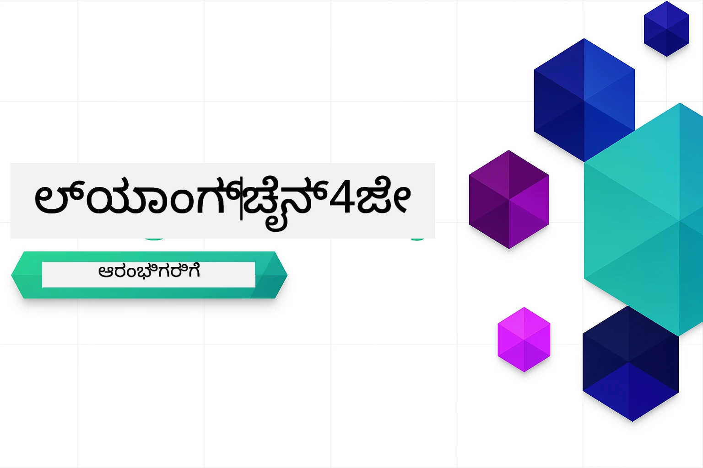

# LangChain4j ಆರಂಭಿಕರಿಗಾಗಿ

LangChain4j ಮತ್ತು Azure OpenAI GPT-5.2 ನೊಂದಿಗೆ AI ಅಪ್ಲಿಕೇಶನ್‌ಗಳನ್ನು ನಿರ್ಮಿಸುವ ಕೋರ್ಸ್, ಮೂಲಭೂತ ಚಾಟ್‌ನಿಂದ AI ಏಜೆಂಟ್ಸ್ ವರೆಗೆ.

### 🌐 ಬಹುಭಾಷಾ ಬೆಂಬಲ

#### GitHub Action ಮೂಲಕ ಬೆಂಬಲಿಸಲಾಗಿದೆ (ಸ್ವಯಂಚಾಲಿತ ಮತ್ತು ಯಾವಾಗಲೂ ನವೀಕರಿಸಲಾಗಿದೆ)

<!-- CO-OP TRANSLATOR LANGUAGES TABLE START -->
[Arabic](../ar/README.md) | [Bengali](../bn/README.md) | [Bulgarian](../bg/README.md) | [Burmese (Myanmar)](../my/README.md) | [Chinese (Simplified)](../zh-CN/README.md) | [Chinese (Traditional, Hong Kong)](../zh-HK/README.md) | [Chinese (Traditional, Macau)](../zh-MO/README.md) | [Chinese (Traditional, Taiwan)](../zh-TW/README.md) | [Croatian](../hr/README.md) | [Czech](../cs/README.md) | [Danish](../da/README.md) | [Dutch](../nl/README.md) | [Estonian](../et/README.md) | [Finnish](../fi/README.md) | [French](../fr/README.md) | [German](../de/README.md) | [Greek](../el/README.md) | [Hebrew](../he/README.md) | [Hindi](../hi/README.md) | [Hungarian](../hu/README.md) | [Indonesian](../id/README.md) | [Italian](../it/README.md) | [Japanese](../ja/README.md) | [Kannada](./README.md) | [Khmer](../km/README.md) | [Korean](../ko/README.md) | [Lithuanian](../lt/README.md) | [Malay](../ms/README.md) | [Malayalam](../ml/README.md) | [Marathi](../mr/README.md) | [Nepali](../ne/README.md) | [Nigerian Pidgin](../pcm/README.md) | [Norwegian](../no/README.md) | [Persian (Farsi)](../fa/README.md) | [Polish](../pl/README.md) | [Portuguese (Brazil)](../pt-BR/README.md) | [Portuguese (Portugal)](../pt-PT/README.md) | [Punjabi (Gurmukhi)](../pa/README.md) | [Romanian](../ro/README.md) | [Russian](../ru/README.md) | [Serbian (Cyrillic)](../sr/README.md) | [Slovak](../sk/README.md) | [Slovenian](../sl/README.md) | [Spanish](../es/README.md) | [Swahili](../sw/README.md) | [Swedish](../sv/README.md) | [Tagalog (Filipino)](../tl/README.md) | [Tamil](../ta/README.md) | [Telugu](../te/README.md) | [Thai](../th/README.md) | [Turkish](../tr/README.md) | [Ukrainian](../uk/README.md) | [Urdu](../ur/README.md) | [Vietnamese](../vi/README.md)

> **ಸ್ಥಳೀಯವಾಗಿ ಕ್ಲೋನ್ ಮಾಡಲು ಇಷ್ಟವಿದೆಯಾ?**
>
> ಈ ರಿಪಾಜಿಟರಿಯಲ್ಲಿ 50+ ಭಾಷಾಂತರಗಳು ಸೇರಿಕೊಂಡಿದ್ದು ಡೌನ್ಲೋಡ್ ಗಾತ್ರವನ್ನು ಪ್ರಮುಖವಾಗಿ ಹೆಚ್ಚಿಸುತ್ತವೆ. ಭಾಷಾಂತರಗಳಿಲ್ಲದೆ ಕ್ಲೋನ್ ಮಾಡಲು sparse checkout ಉಪಯೋಗಿಸಿ:
>
> **Bash / macOS / ಲಿನಕ್ಸ್ನಲ್ಲಿ:**
> ```bash
> git clone --filter=blob:none --sparse https://github.com/microsoft/LangChain4j-for-Beginners.git
> cd LangChain4j-for-Beginners
> git sparse-checkout set --no-cone '/*' '!translations' '!translated_images'
> ```
>
> **CMD (Windows):**
> ```cmd
> git clone --filter=blob:none --sparse https://github.com/microsoft/LangChain4j-for-Beginners.git
> cd LangChain4j-for-Beginners
> git sparse-checkout set --no-cone "/*" "!translations" "!translated_images"
> ```
>
> ಇದು ನಿಮಗೆ ಅಗತ್ಯವಿರುವ ಎಲ್ಲಾ ವಿಷಯಗಳನ್ನು ಹೆಚ್ಚು ವೇಗವಾಗಿ ಡೌನ್ಲೋಡ್ ಮಾಡಲು ಸಹಾಯ ಮಾಡುತ್ತದೆ.
<!-- CO-OP TRANSLATOR LANGUAGES TABLE END -->

## ವಿಷಯಗಳ ಟೇಬಲ್

1. [ಪರಿಚಯ](01-introduction/README.md) - LangChain4j ಮೂಲತತ್ವಗಳನ್ನು ಕಲಿಯಿರಿ
2. [ಪ್ರಾಂಪ್ಟ್ ಎಂಜಿನಿಯರಿಂಗ್](02-prompt-engineering/README.md) - ಪರಿಣಾಮಕಾರಿ ಪ್ರಾಂಪ್ಟ್ ವಿನ್ಯಾಸದಲ್ಲಿ ಪರಿಣತಿ ಪಡೆಯಿರಿ
3. [RAG (ರಿಟ್ರೀವಲ್-ಆಗ್ಮೆಂಟೆಡ್ ಜನರೇಷನ್)](03-rag/README.md) - ಬುದ್ಧಿವಂತ ಜ್ಞಾನ ಆಧಾರಿತ ವ್ಯವಸ್ಥೆಗಳು ನಿರ್ಮಿಸಿ
4. [ಉಪಕರಣಗಳು](04-tools/README.md) - ಹೊರಗಿನ ಸಾಧನಗಳನ್ನು ಮತ್ತು ಸರಳ ಸಹಾಯಕರನ್ನು ಸಂಯೋಜಿಸಿ
5. [MCP (ಮೋಡೆಲ್ ಕಾಂಟೆಕ್ಸ್ಟ್ ಪ್ರೋಟೋಕಾಲ್)](05-mcp/README.md) - Model Context Protocol (MCP) ಮತ್ತು ಏಜೆಂಟಿಕ್ ಮಾಯುಲುಗಳೊಂದಿಗೆ ಕೆಲಸ ಮಾಡಿರಿ

### ವೀಡಿಯೊ ವಾಕ್ತ್ರೂಗಳು

ಪ್ರತಿಯೊಂದು ಘಟಕಕ್ಕೂ ಒಂದು ಲೈವ್ ಸೆಷನ್ ಇದೆ, ಅಲ್ಲಿ ನಾವು ತತ್ವಗಳು ಮತ್ತು ಕೋಡ್ ಅನ್ನು ಹೆಜ್ಜೆ ಹೆಜ್ಜೆಗೆ ಅನುಸರಿಸಿ ಪರಿಶೀಲಿಸುತ್ತೇವೆ.

| ಘಟಕ | ವೀಡಿಯೊ |
|--------|-------|
| 01 - ಪರಿಚಯ | [LangChain4j ಜೊತೆ ಆರಂಭಿಸುವುದು](https://www.youtube.com/live/nl_troDm8rQ) |
| 02 - ಪ್ರಾಂಪ್ಟ್ ಎಂಜಿನಿಯರಿಂಗ್ | [LangChain4j ಜೊತೆಗೆ ಪ್ರಾಂಪ್ಟ್ ಎಂಜಿನಿಯರಿಂಗ್](https://www.youtube.com/live/PJ6aBaE6bog) |
| 03 - RAG | [LangChain4j ಜೊತೆ RAG](https://www.youtube.com/watch?v=_olq75ZH_eY) |
| 04 - ಉಪಕರಣಗಳು & 05 - MCP | [ಉಪಕರಣಗಳು ಮತ್ತು MCP ಇರುವ AI ಏಜೆಂಟ್ಸ್](https://www.youtube.com/watch?v=O_J30kZc0rw) |

---

## ಅಧ್ಯಯನ ಪಥ

**LangChain4j ಹೊಸದಾಗಿದೆಯೇ?** ಪ್ರಮುಖ ಪದಗಳು ಮತ್ತು ತತ್ವಗಳ ವ್ಯಾಖ್ಯಾನಗಳಿಗೆ [ಗ್ಲಾಸರಿ](docs/GLOSSARY.md) ನೋಡಿ.

> **ತ್ವರಿತ ಪ್ರಾರಂಭ**

1. ಈ ರಿಪಾಜಿಟರಿಯನ್ನು ನಿಮ್ಮ GitHub ಖಾತೆಗೆ ಫೋರ್ಕ್ ಮಾಡಿ
2. **Code** → **Codespaces** ಟ್ಯಾಬ್ → **...** → **ಹೊಸ ಆಯ್ಕೆಗಳು ಬಳಸಿ...** ಕ್ಲಿಕ್ ಮಾಡಿ
3. ಮೂಲಭೂತಗಳನ್ನು ಬಳಸಿ – ಇದು ಈ ಕೋರ್ಸ್‌ಗೆ ವಿನಿರ್ಮಿತ ಡೆವಲಪ್‌ಮೆಂಟ್ ಕಂಟೇನರ್ ಆಯ್ಕೆ ಮಾಡುತ್ತದೆ
4. **Create codespace** ಕ್ಲಿಕ್ ಮಾಡಿ
5. ಪರಿಸರ ಸಿದ್ಧವಾಗಲು 5-10 ನಿಮಿಷ ಕಾಯಿರಿ
6. ಪ್ರಾರಂಭಿಸಲು ನೇರವಾಗಿ [ಪರಿಚಯ](./01-introduction/README.md) ಗೆ ಹೋಗಿ!

ಘಟಕಗಳನ್ನು ಪೂರ್ಣಗೊಳಿಸಿದ ಬಳಿಕ, LangChain4j ಪರೀಕ್ಷಾ ತತ್ವಗಳನ್ನು ಅನುಭವಿಸಲು [ಪರೀಕ್ಷಾ ಮಾರ್ಗದರ್ಶಿ](docs/TESTING.md) ಅನ್ನು ಅನ್ವೇಷಿಸಿ.

> **ಸೂಚನೆ:** ಈ ತರಬೇತಿ Azure OpenAI ಅನ್ನು ಬಳಸುತ್ತದೆ. ನಿಮಗೆ ಇಲ್ಲದಿದ್ದರೆ [ಉಚಿತ Azure ಖಾತೆ](https://aka.ms/azure-free-account) ಮೂಲಕ ಪ್ರಾರಂಭಿಸಿ.


## GitHub Copilot ಮೂಲಕ ಅಧ್ಯಯನ

ತ್ವರಿತವಾಗಿ ಕೋಡಿಂಗ್ ಪ್ರಾರಂಭಿಸಲು, ಈ ಯೋಜನೆಯನ್ನು GitHub Codespace ಅಥವಾ ನಿಮ್ಮ ಸ್ಥಳೀಯ IDE ಯಲ್ಲಿ devcontainer ಜೊತೆ ತೆರೆಯಿರಿ. ಈ ಕೋರ್ಸ್‌ನಲ್ಲಿ ಬಳಕೆಯಾದ devcontainer AI ಜತೆಗೆ ಜೋಡಣಾ ಪ್ರೋಗ್ರಾಮಿಂಗ್‌ಗೆ GitHub Copilot ಪೂರ್ವಕಂಡಿತವಾಗಿದೆ.

ಪ್ರತಿ ಕೋಡ್ ಉದಾಹರಣೆಯು GitHub Copilot ಗೆ ಕೇಳಬಹುದಾದ ಸಲಹೆಗಳ ಪ್ರಶ್ನೆಗಳನ್ನು ಒಳಗೊಂಡಿರುತ್ತದೆ, ಇದು ನಿಮ್ಮ ಅರ್ಥವನ್ನು ಗಾಢಗೆ ಮಾಡುತ್ತದೆ. ಕೆಳಗಿನ ಸ್ಥಳಗಳಲ್ಲಿ 💡/🤖 ಟಿಪ್ಪಣಿಗಳನ್ನು ಹುಡುಕಿ:

- **ಜಾವಾ ಕಡತದ ಹೆಡರ್ಸ್** - ಪ್ರತಿ ಉದಾಹರಣೆಗೆ ವಿಶೇಷವಾದ ಪ್ರಶ್ನೆಗಳು
- **ಘಟಕಗಳ READMEಗಳು** - ಕೋಡ್ ಉದಾಹರಣೆಗಳ ನಂತರದ ಅನ್ವೇಷಣೆ ಪ್ರಶ್ನೆಗಳು

**ಬಳಸದ ವಿಧಾನ:** ಯಾವುದಾದ್ರೊಂದು ಕೋಡ್ ಫೈಲ್ ತೆರೆಯಿರಿ ಮತ್ತು Copilot ಗೆ ಸಲಹೆ ಮಾಡಿದ ಪ್ರಶ್ನೆಗಳನ್ನು ಕೇಳಿ. ಇದಕ್ಕೆ ಸಂಪೂರ್ಣ ಕೋಡ್ ಪರಿಧಿ ಅರ್ಥವಾಗಿದ್ದು, ವಿವರಿಸುವುದು, ವಿಸ್ತರಿಸುವುದು ಮತ್ತು ಪರ್ಯಾಯಗಳನ್ನು ಸೂಚಿಸುವುದೂ ಇದೆ.

ಹೆಚ್ಚು ಕಲಿಯಲು ಬಯಸುವಿರಾ? [AI ಜೊತೆಯ ಕಾರ್ಯಕ್ರಮಕ್ಕೆ Copilot](https://aka.ms/GitHubCopilotAI) ನೋಡಿ.


## ಹೆಚ್ಚುವರಿ ಸಂಪನ್ಮೂಲಗಳು

<!-- CO-OP TRANSLATOR OTHER COURSES START -->
### LangChain
[](https://aka.ms/langchain4j-for-beginners)
[](https://aka.ms/langchainjs-for-beginners?WT.mc_id=m365-94501-dwahlin)
[](https://github.com/microsoft/langchain-for-beginners?WT.mc_id=m365-94501-dwahlin)
---

### Azure / Edge / MCP / Agents
[](https://github.com/microsoft/AZD-for-beginners?WT.mc_id=academic-105485-koreyst)
[](https://github.com/microsoft/edgeai-for-beginners?WT.mc_id=academic-105485-koreyst)
[](https://github.com/microsoft/mcp-for-beginners?WT.mc_id=academic-105485-koreyst)
[](https://github.com/microsoft/ai-agents-for-beginners?WT.mc_id=academic-105485-koreyst)

---
 
### Generative AI Series
[](https://github.com/microsoft/generative-ai-for-beginners?WT.mc_id=academic-105485-koreyst)
[-9333EA?style=for-the-badge&labelColor=E5E7EB&color=9333EA)](https://github.com/microsoft/Generative-AI-for-beginners-dotnet?WT.mc_id=academic-105485-koreyst)
[-C084FC?style=for-the-badge&labelColor=E5E7EB&color=C084FC)](https://github.com/microsoft/generative-ai-for-beginners-java?WT.mc_id=academic-105485-koreyst)
[-E879F9?style=for-the-badge&labelColor=E5E7EB&color=E879F9)](https://github.com/microsoft/generative-ai-with-javascript?WT.mc_id=academic-105485-koreyst)

---
 
### ಮೂಲ ಅಧ್ಯಯನ
[](https://aka.ms/ml-beginners?WT.mc_id=academic-105485-koreyst)
[](https://aka.ms/datascience-beginners?WT.mc_id=academic-105485-koreyst)
[](https://aka.ms/ai-beginners?WT.mc_id=academic-105485-koreyst)
[](https://github.com/microsoft/Security-101?WT.mc_id=academic-96948-sayoung)
[](https://aka.ms/webdev-beginners?WT.mc_id=academic-105485-koreyst)
[](https://aka.ms/iot-beginners?WT.mc_id=academic-105485-koreyst)
[](https://github.com/microsoft/xr-development-for-beginners?WT.mc_id=academic-105485-koreyst)

---
 
### ಕೋಪೈಲಟ್ ಸರಣಿ
[](https://aka.ms/GitHubCopilotAI?WT.mc_id=academic-105485-koreyst)
[](https://github.com/microsoft/mastering-github-copilot-for-dotnet-csharp-developers?WT.mc_id=academic-105485-koreyst)
[](https://github.com/microsoft/CopilotAdventures?WT.mc_id=academic-105485-koreyst)
<!-- CO-OP TRANSLATOR OTHER COURSES END -->

## ಸಹಾಯ ಪಡೆಯುವುದು

ನೀವು ಅಡ್ಡಿದರೆ ಅಥವಾ AI ಅಪ್ಲಿಕೇಶನ್‌ಗಳನ್ನು ನಿರ್ಮಿಸುವ ಬಗ್ಗೆ ಯಾವುದೇ ಪ್ರಶ್ನೆಗಳಿದ್ದರೆ, ಸೇರಿ:

[](https://aka.ms/foundry/discord)

ನೀವು ಉತ್ಪನ್ನ ಪ್ರತಿಕ್ರಿಯೆ ಅಥವಾ ನಿರ್ಮಿಸುವ ಸಮಯದಲ್ಲಿ ತೊಂದರೆಗಳಿದ್ದರೆ ಇಲ್ಲಿ ಭೇಟಿ ನೀಡಿ:

[](https://aka.ms/foundry/forum)

## ಪರವಾನಗಿ

MIT ಪರವಾನಗಿ - ವಿವರಗಳಿಗೆ [LICENSE](../../LICENSE) ಕಡತವನ್ನು ನೋಡಿ.

---

<!-- CO-OP TRANSLATOR DISCLAIMER START -->
**ಅಸ್ವೀಕಾರ**:
ಈ ದಸ್ತಾವೇಜು AI ಅನುವಾದ ಸೇವೆ [Co-op Translator](https://github.com/Azure/co-op-translator) ಬಳಸಿ ಅನುವಾದಿಸಲಾಗಿದೆ. ನಾವು ನಿಖರತೆಯನ್ನು ಸಾಧಿಸಲು ಪ್ರಯತ್ನಿಸುತ್ತಿದ್ದರೂ, ದಯವಿಟ್ಟು ಗಮನಿಸಿ, ಸ್ವಯಂಚಾಲಿತ ಅನುವಾದಗಳಲ್ಲಿ ದೋಷಗಳು ಅಥವಾ ಅಸಡ್ಡೆಗಳು ಇರಬಹುದು. ಮೂಲ ಭಾಷೆಯಲ್ಲಿರುವ ಮೂಲ ದಸ್ತಾವೇಜು ಪ್ರಾಮಾಣಿಕ ಮೂಲವೆಂದು ಪರಿಗಣಿಸಬೇಕು. ಪ್ರಮುಖ ಮಾಹಿತಿಗಾಗಿ, ವೃತ್ತಿಪರ ಮಾನವ ಅನುವಾದವನ್ನು ಶಿಫಾರಸು ಮಾಡಲಾಗುತ್ತದೆ. ಈ ಅನುವಾದವನ್ನು ಬಳಸುವ ಮೂಲಕ ಉಂಟಾಗುವ ಯಾವುದೇ ತಪ್ಪು ಅರ್ಥಗಳ ಅಥವಾ ತಪ್ಪು ವ್ಯಾಖ್ಯಾನಗಳ ಬಗ್ಗೆ ನಾವು ಹೊಣೆಗಾರರಲ್ಲ.
<!-- CO-OP TRANSLATOR DISCLAIMER END -->