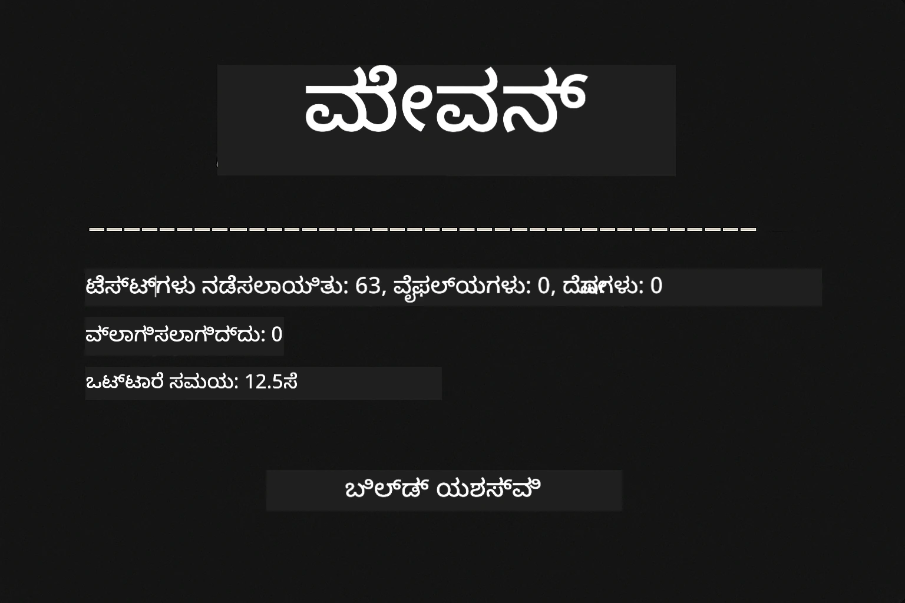
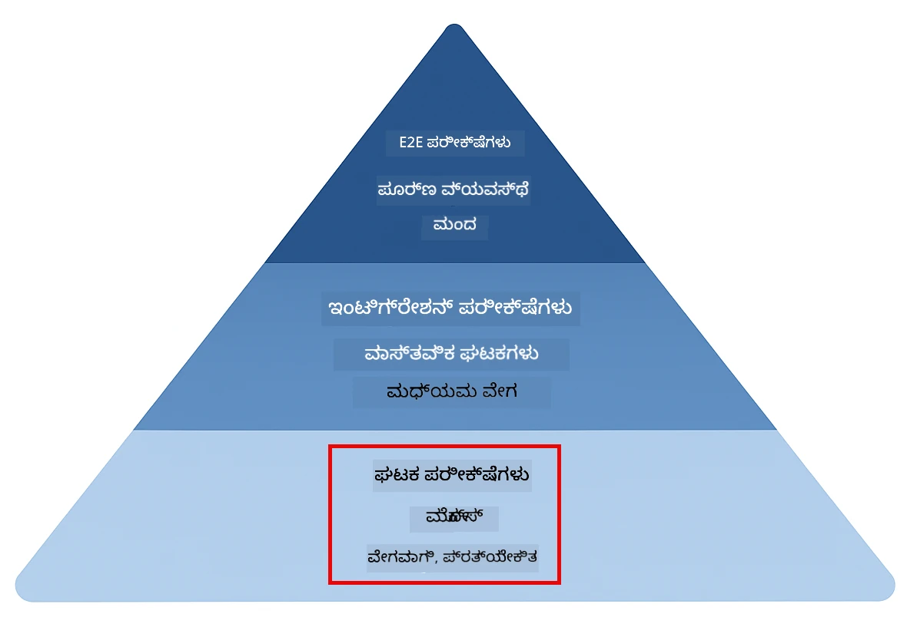
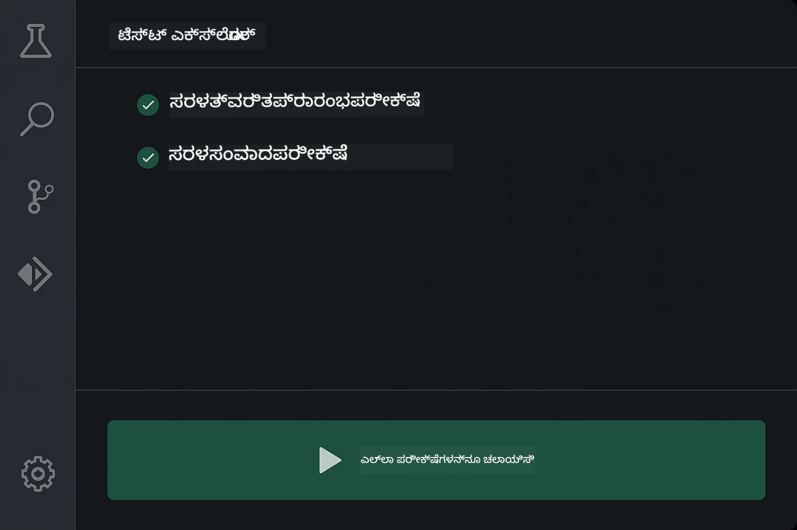
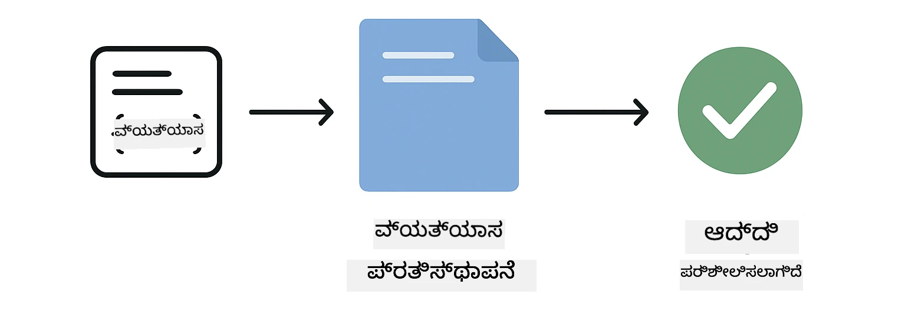
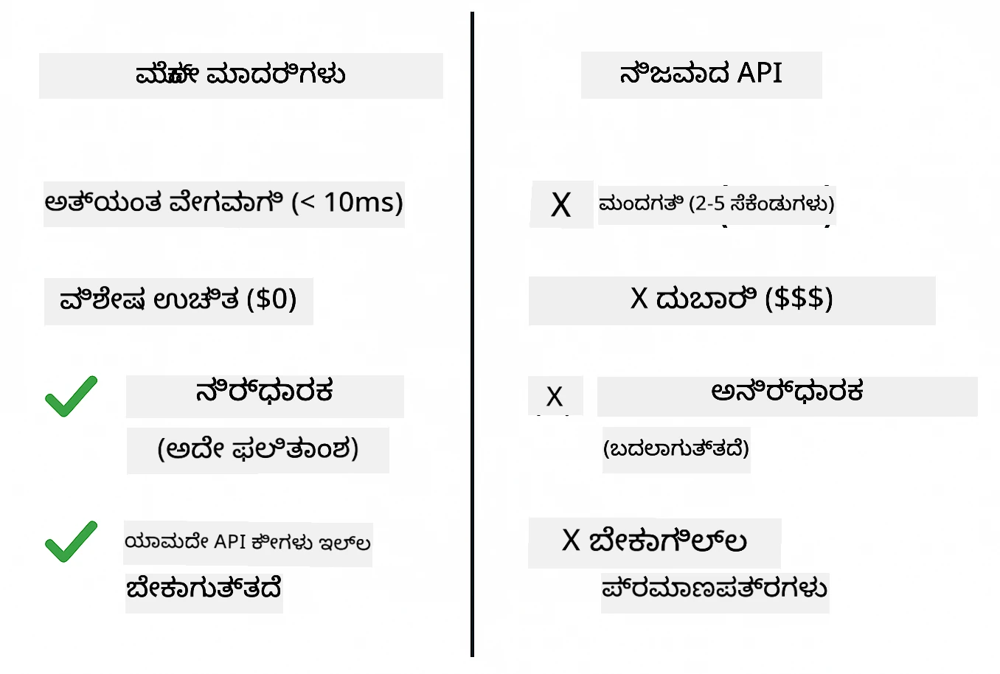
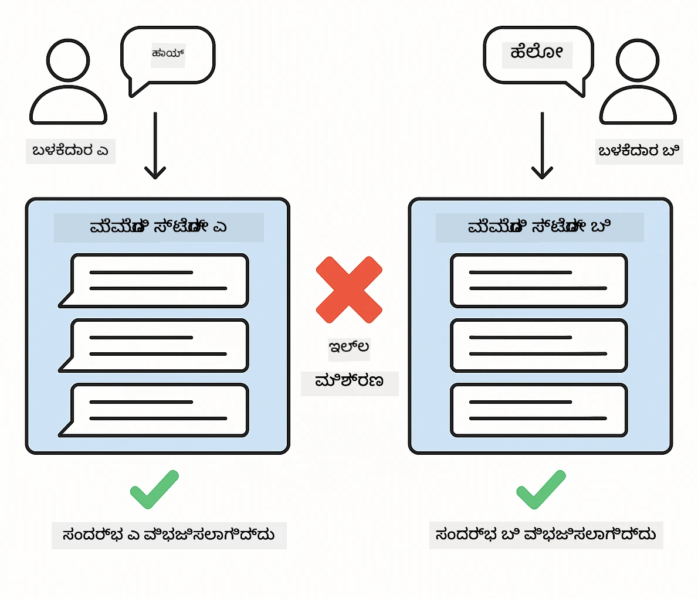
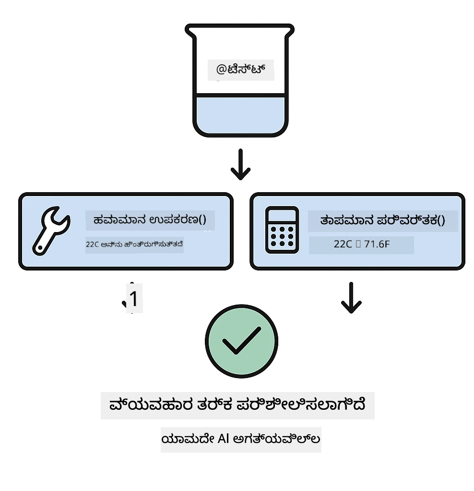
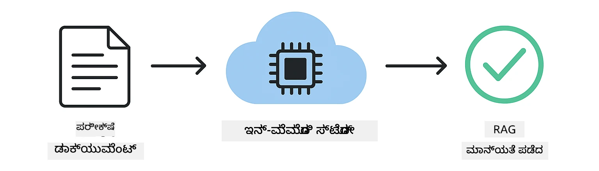

# LangChain4j ಅಪ್ಲಿಕೇಶನ್‌ಗಳ ಪರೀಕ್ಷಾ ಮಾರ್ಗದರ್ಶಿ

## ವಿಷಯಗಳ ಪಟ್ಟಿ

- [Quick Start](../../../docs)
- [What the Tests Cover](../../../docs)
- [Running the Tests](../../../docs)
- [Running Tests in VS Code](../../../docs)
- [Testing Patterns](../../../docs)
- [Testing Philosophy](../../../docs)
- [Next Steps](../../../docs)

ಈ ಮಾರ್ಗದರ್ಶಿ API ಕೀಗಳನ್ನು ಅಥವಾ ಹೊರಗಿನ ಸೇವೆಗಳನ್ನು ಅಗತ್ಯವಿಲ್ಲದೆ AI ಅಪ್ಲಿಕೇಶನ್‌ಗಳನ್ನು ಪರೀಕ್ಷಿಸುವ ಬಗ್ಗೆ ನಿಮಗೆ ಸೂಚಿಸುತ್ತದೆ.

## Quick Start

ಒಂದು ಕಮಾಂಡ್‌ನೊಂದಿಗೆ ಎಲ್ಲಾ ಪರೀಕ್ಷೆಗಳನ್ನು چلಾಯಿಸಿ:

**Bash:**
```bash
mvn test
```

**PowerShell:**
```powershell
mvn --% test
```



*ಎಲ್ಲಾ ಪರೀಕ್ಷೆಗಳೂ ಯಶಸ್ವಿಯಾಗಿ ಚಾಲನೆಗೊಂಡು ಶೂನ್ಯ ವಿಫಲತೆಗಳನ್ನು ತೋರಿಸುವ ಯಶಸ್ವಿ ಪರೀಕ್ಷಾ ನಿರ್ವಹಣೆ*

## What the Tests Cover

ಈ ಕೋರ್ಸ್ ಸ್ಥಳೀಯವಾಗಿ ಚಾಲನೆಯಾಗುವ **ಏಕಕ ಪರೀಕ್ಷೆಗಳನ್ನು (unit tests)** ಮೇಲೆ ಕೇಂದ್ರಿತವಾಗಿದೆ. ಪ್ರತಿ ಪರೀಕ್ಷೆ ಒಂದೇ ಸ್ವತಂತ್ರ LangChain4j ಕಲ್ಪನೆಯನ್ನು ತೋರಿಸುತ್ತದೆ.



*ಯುನಿಟ್ ಟೆಸ್ಟ್‌ಗಳು (ವೇಗವಾದ, ಪ್ರತ್ಯೇಕ), ಇಂಟಿಗ್ರೇಶನ್ ಟೆಸ್ಟ್‌ಗಳು (ವಾಸ್ತವಿಕ ಘಟಕಗಳು), ಮತ್ತು end-to-end ಟೆಸ್ಟ್‌ಗಳ ನಡುವೆ ಸಮತೋಲನಕ್ಕೆ ಪರೀಕ್ಷಣಾ ಪಿರಮಿಡ್ ತೋರಿಸಲಾಗಿದೆ. ಈ ತರಬೇತಿ ಯುನಿಟ್ ಟೆಸ್ಟಿಂಗ್ ಅನ್ನು ಒಳಗೊಂಡಿದೆ.*

| Module | Tests | Focus | Key Files |
|--------|-------|-------|-----------|
| **00 - Quick Start** | 6 | ಪ್ರಾಂಪ್ಟ್ ಟೆಂಪ್ಲೇಟ್‌ಗಳು ಮತ್ತು ಚರ ಪರಿವರ್ತನೆ | `SimpleQuickStartTest.java` |
| **01 - Introduction** | 8 | ಸಂಭಾಷಣಾ ಮೆಮೊರಿ ಮತ್ತು ಸ್ಥಿತಿಗತ ಚಾಟ್ | `SimpleConversationTest.java` |
| **02 - Prompt Engineering** | 12 | GPT-5 ಪ್ಯಾಟರ್ನ್‌ಗಳು, ಉತ್ಸಾಹ ಮಟ್ಟಗಳು, ರಚನಾತ್ಮಕ output | `SimpleGpt5PromptTest.java` |
| **03 - RAG** | 10 | ಡಾಕ್ಯುಮೆಂಟ್ ಇಂಜೆಕ್ಷನ್, ಎಂಬೆಡ್ಡಿಂಗ್‌ಗಳು, ಸಾದೃಶ್ಯ ಹುಡುಕಾಟ | `DocumentServiceTest.java` |
| **04 - Tools** | 12 | ಫಂಕ್ಷನ್ ಕಾಲಿಂಗ್ ಮತ್ತು ಉಪಕರಣ連ಣನೆ | `SimpleToolsTest.java` |
| **05 - MCP** | 8 | Model Context Protocol with Stdio transport | `SimpleMcpTest.java` |

## Running the Tests

**Run all tests from root:**

**Bash:**
```bash
mvn test
```

**PowerShell:**
```powershell
mvn --% test
```

**Run tests for a specific module:**

**Bash:**
```bash
cd 01-introduction && mvn test
# ಅಥವಾ ರೂಟ್‌ನಿಂದ
mvn test -pl 01-introduction
```

**PowerShell:**
```powershell
cd 01-introduction; mvn --% test
# ಅಥವಾ ರೂಟ್‌ನಿಂದ
mvn --% test -pl 01-introduction
```

**Run a single test class:**

**Bash:**
```bash
mvn test -Dtest=SimpleConversationTest
```

**PowerShell:**
```powershell
mvn --% test -Dtest=SimpleConversationTest
```

**Run a specific test method:**

**Bash:**
```bash
mvn test -Dtest=SimpleConversationTest#ಸಂವಾದದ ಇತಿಹಾಸವನ್ನು ಸಂರಕ್ಷಿಸಬೇಕು
```

**PowerShell:**
```powershell
mvn --% test -Dtest=SimpleConversationTest#ಸಂಭಾಷಣಾ ಇತಿಹಾಸವನ್ನು ಉಳಿಸಬೇಕು
```

## Running Tests in VS Code

ನೀವು Visual Studio Code ಬಳಸುತ್ತಿದ್ದರೆ, Test Explorer ದೃಶ್ಯಾತ್ಮಕ ಇಂಟರ್ಫೇಸ್ ಅನ್ನು ಪರೀಕ್ಷೆಗಳನ್ನು ಚಾಲನೆ ಮತ್ತು ಡೀಬಗ್ ಮಾಡಲು ಒದಗಿಸುತ್ತದೆ.



*VS Code Test Explorer ಎಲ್ಲಾ Java ಟೆಸ್ಟ್ ಕ್ಲಾಸ್‌ಗಳು ಮತ್ತು ವೈಯಕ್ತಿಕ ಟೆಸ್ಟ್ ಮೆಥಡ್‌ಗಳೊಂದಿಗೆ ಪರೀಕ್ಷಾ ಮರವನ್ನು ತೋರಿಸುತ್ತಿದೆ*

**VS Code ನಲ್ಲಿ ಪರೀಕ್ಷೆಗಳನ್ನು ನಡೆಸಲು:**

1. Activity Bar ನಲ್ಲಿ ಬೀಕರ್ ಐಕಾನ್ ಕ್ಲಿಕ್ ಮಾಡಿ Test Explorer ಅನ್ನು ತೆರೆಯಿರಿ
2. ಎಲ್ಲಾ מוד್ಯೂಗಳು ಮತ್ತು ಟೆಸ್ಟ್ ಕ್ಲಾಸ್‌ಗಳನ್ನು ನೋಡಲು ಪರೀಕ್ಷಾ ಮರವನ್ನು ವಿಸ್ತರಿಸಿ
3. ಯಾವುದಾದರೂ ಪರೀಕ್ಷೆಯ ಪಕ್ಕದಲ್ಲಿ ಇರುವ ಪ್ಲೇ ಬಟನ್‍ನ್ನು ಕ್ಲಿಕ್ ಮಾಡಿ ಅದನ್ನು தனೀಗವಾಗಿ ಚಾಲನೆಗೊಳಿಸಿ
4. ಪೂರ್ಣ ಜೋಡಿಯನ್ನು ಕಾರ್ಯಗತಗೊಳಿಸಲು "Run All Tests" ಕ್ಲಿಕ್ ಮಾಡಿ
5. ಯಾವುದಾದರೂ ಪರೀಕ್ಷೆಯ ಮೇಲೆ ರೈಟ್‑ಕ್ಲಿಕ್ ಮಾಡಿ "Debug Test" ಆಯ್ಕೆಮಾಡಿ ಬ್ರೇಕ್‑ಪಾಯಿಂಟ್‌ಗಳನ್ನು ಸೆಟ್ ಮಾಡಿ ಮತ್ತು ಕೋಡ್ ಮೂಲಕ ಸ್ಟೆಪ್ ಮಾಡಿ

Test Explorer ಪಾಸಾದ ಪರೀಕ್ಷೆಗಳಿಗಾಗಿ ಹಸಿರು ಚೆಕ್‌ಮಾರ್ಕ್‌ಗಳನ್ನು ತೋರಿಸುತ್ತದೆ ಮತ್ತು ಪರೀಕ್ಷೆಗಳು ವಿಫಲವಾದಾಗ ವಿವರವಾದ ವೈಫಲ್ಯ ಸಂದೇಶಗಳನ್ನು ನೀಡುತ್ತದೆ.

## Testing Patterns

### Pattern 1: Testing Prompt Templates

ಸರಳವಾದ ಪ್ಯಾಟರ್ನ್ ಏನಂದ್ರೆ ಯಾವುದೇ AI ಮಾದರಿಯನ್ನು ಕಾಲ್ ಮಾಡದೆ ಪ್ರಾಂಪ್ಟ್ ಟೆಂಪ್ಲೇಟ್‌ಗಳನ್ನು ಪರೀಕ್ಷಿಸುವುದು. ನೀವು ಚರಗಳ ನಿರ್ವಹಣೆ ಸರಿಯಾಗಿ ಕೆಲಸ ಮಾಡುತ್ತಿದೆಯೇ ಎಂದು ಪರಿಶೀಲಿಸುತ್ತೀರಿ ಮತ್ತು ಪ್ರಾಂಪ್ಟ್‌ಗಳು ನಿರೀಕ್ಷೆಯಂತೆ ಸ್ವರೂಪಗೊಳ್ಳುತ್ತಿವೆಯೇ ಅಂತ ಪರಿಶೀಲನೆ ಮಾಡುತ್ತೀರಿ.



*ಪ್ರಾಂಪ್ಟ್ ಟೆಂಪ್ಲೇಟ್‌ಗಳನ್ನು ಪರೀಕ್ಷಿಸುವುದು: ಪ್ಲೇಸ್‌ಹೋಲ್ಡರ್‌ಗಳಿರುವ ಟೆಂಪ್ಲೇಟ್ → ಮೌಲ್ಯಗಳು ಅನ್ವಯಿಸಲ್ಪಡುವುದು → ಫಾರ್ಮ್ಯಾಟೆಡ್ ಔಟ್‌ಪುಟ್ ಪರಿಶೀಲನೆ*

```java
@Test
@DisplayName("Should format prompt template with variables")
void testPromptTemplateFormatting() {
    PromptTemplate template = PromptTemplate.from(
        "Best time to visit {{destination}} for {{activity}}?"
    );
    
    Prompt prompt = template.apply(Map.of(
        "destination", "Paris",
        "activity", "sightseeing"
    ));
    
    assertThat(prompt.text()).isEqualTo("Best time to visit Paris for sightseeing?");
}
```

This test lives in `00-quick-start/src/test/java/com/example/langchain4j/quickstart/SimpleQuickStartTest.java`.

**Run it:**

**Bash:**
```bash
cd 00-quick-start && mvn test -Dtest=SimpleQuickStartTest#ಪರೀಕ್ಷೆ ಪ್ರಾಂಪ್ಟ್ ಟೆಂಪ್ಲೇಟ್ ಸ್ವರೂಪೀಕರಣ
```

**PowerShell:**
```powershell
cd 00-quick-start; mvn --% test -Dtest=SimpleQuickStartTest#ಪ್ರಾಂಪ್ಟ್ ಟೆಂಪ್ಲೇಟ್ ಫಾರ್ಮ್ಯಾಟಿಂಗ್ ಪರೀಕ್ಷೆ
```

### Pattern 2: Mocking Language Models

ಸಂಭಾಷಣಾ ಲాజಿಕ್ ಪರೀಕ್ಷಿಸುವಾಗ, Mockito ಅನ್ನು ಬಳಸಿಕೊಂಡು ನಕಲಿ ಮಾದರಿಗಳನ್ನು ರಚಿಸಿ ಅದು ಪೂರ್ವನಿರ್ಧರಿತ ಪ್ರತಿಕ್ರಿಯೆಗಳನ್ನು ನೀಡುತ್ತದೆ. ಇದರಿಂದ ಪರೀಕ್ಷೆಗಳು ವೇಗವಾಗಿ, ಉಚಿತವಾಗಿ ಮತ್ತು ನಿಶ್ಚಿತ ಫಲಿತಾಂಶದಂತೆ ನಡೆಯುತ್ತವೆ.



*ಪರೀಕ್ಷೆಗಳಿಗಾಗಿ ಮಾಕ್ ಗಳನ್ನು ಆದ್ಯತೆ ನೀಡಬೇಕಾದ ಕಾರಣವು: ಅವು ವೇಗದ, ಉಚಿತ, ನಿಶ್ಚಿತ ಮತ್ತು ಯಾವುದೇ API ಕೀಗಳನ್ನು ಅಗತ್ಯವಿಲ್ಲದಿರುತ್ತವೆ ಎಂಬುದನ್ನು ತೋರಿಸುವ ಹೋಲಿಕೆ*

```java
@ExtendWith(MockitoExtension.class)
class SimpleConversationTest {
    
    private ConversationService conversationService;
    
    @Mock
    private OpenAiOfficialChatModel mockChatModel;
    
    @BeforeEach
    void setUp() {
        ChatResponse mockResponse = ChatResponse.builder()
            .aiMessage(AiMessage.from("This is a test response"))
            .build();
        when(mockChatModel.chat(anyList())).thenReturn(mockResponse);
        
        conversationService = new ConversationService(mockChatModel);
    }
    
    @Test
    void shouldMaintainConversationHistory() {
        String conversationId = conversationService.startConversation();
        
        ChatResponse mockResponse1 = ChatResponse.builder()
            .aiMessage(AiMessage.from("Response 1"))
            .build();
        ChatResponse mockResponse2 = ChatResponse.builder()
            .aiMessage(AiMessage.from("Response 2"))
            .build();
        ChatResponse mockResponse3 = ChatResponse.builder()
            .aiMessage(AiMessage.from("Response 3"))
            .build();
        
        when(mockChatModel.chat(anyList()))
            .thenReturn(mockResponse1)
            .thenReturn(mockResponse2)
            .thenReturn(mockResponse3);

        conversationService.chat(conversationId, "First message");
        conversationService.chat(conversationId, "Second message");
        conversationService.chat(conversationId, "Third message");

        List<ChatMessage> history = conversationService.getHistory(conversationId);
        assertThat(history).hasSize(6); // 3 ಬಳಕೆದಾರರು + 3 ಏಐ ಸಂದೇಶಗಳು
    }
}
```

This pattern appears in `01-introduction/src/test/java/com/example/langchain4j/service/SimpleConversationTest.java`. The mock ensures consistent behavior so you can verify memory management works correctly.

### Pattern 3: Testing Conversation Isolation

ಸಂಭಾಷಣಾ ಮೆಮೊರಿಯು ಅನೇಕ ಬಳಕೆದಾರರನ್ನು ಪ್ರತ್ಯೇಕವಾಗಿಡಬೇಕು. ಈ ಪರೀಕ್ಷೆ ಸಂಭಾಷಣೆಗಳನ್ನು ದೃಢೀಕರಿಸುತ್ತದೆ किcontexts ಮಿಶ್ರವಾಗುವುದಿಲ್ಲ.



*ವಿಭಿನ್ನ ಬಳಕೆದಾರರಿಗಾಗಿ ಪ್ರತ್ಯೇಕ ಮೆಮೊರಿ ಸ್ಟೋರ್‌ಗಳನ್ನು ತೋರಿಸಿ ಕಾಂಟೆಕ್ಸ್ಟ್ ಮಿಶ್ರವಾಗುವುದನ್ನು ತಡೆಗಟ್ಟುವ ಸಂಭಾಷಣಾ ಪ್ರತ್ಯೇಕತೆ ಪರೀಕ್ಷೆ*

```java
@Test
void shouldIsolateConversationsByid() {
    String conv1 = conversationService.startConversation();
    String conv2 = conversationService.startConversation();
    
    ChatResponse mockResponse = ChatResponse.builder()
        .aiMessage(AiMessage.from("Response"))
        .build();
    when(mockChatModel.chat(anyList())).thenReturn(mockResponse);

    conversationService.chat(conv1, "Message for conversation 1");
    conversationService.chat(conv2, "Message for conversation 2");

    List<ChatMessage> history1 = conversationService.getHistory(conv1);
    List<ChatMessage> history2 = conversationService.getHistory(conv2);
    
    assertThat(history1).hasSize(2);
    assertThat(history2).hasSize(2);
}
```

Each conversation maintains its own independent history. In production systems, this isolation is critical for multi-user applications.

### Pattern 4: Testing Tools Independently

ಉಪಕರಣಗಳು AI ಕರೆ ಮಾಡಬಹುದಾದ ಫಂಕ್ಷನ್‌ಗಳು. AI ನಿರ್ಣಯಗಳನ್ನೇ ಬಿಟ್ಟುಕೊಟ್ಟು ಅವುಗಳನ್ನು ನೇರವಾಗಿ ಪರೀಕ್ಷಿಸಿ ಅವು ಸರಿಯಾಗಿ ಕಾರ್ಯನಿರ್ವಹಿಸುತ್ತವೆಯೇ ಎಂದು ಖಚಿತಪಡಿಸಿಕೊಳ್ಳಿ.



*AI ಕರೆಗಳಿಲ್ಲದೆ ನಕಲಿ ಉಪಕರಣ ಕಾರ್ಯಗತಗೊಳಿಸುವುದನ್ನು ತೋರಿಸುವ ಉದ್ದೇಶದೊಂದಿಗೆ ಉದ್ಯಮ ಲಾಜಿಕ್ ಪರಿಶೀಲಿಸುವ ಉಪಕರಣಗಳ ಸ್ವತಂತ್ರ ಪರೀಕ್ಷೆ*

```java
@Test
void shouldConvertCelsiusToFahrenheit() {
    TemperatureTool tempTool = new TemperatureTool();
    String result = tempTool.celsiusToFahrenheit(25.0);
    assertThat(result).containsPattern("77[.,]0°F");
}

@Test
void shouldDemonstrateToolChaining() {
    WeatherTool weatherTool = new WeatherTool();
    TemperatureTool tempTool = new TemperatureTool();

    String weatherResult = weatherTool.getCurrentWeather("Seattle");
    assertThat(weatherResult).containsPattern("\\d+°C");

    String conversionResult = tempTool.celsiusToFahrenheit(22.0);
    assertThat(conversionResult).containsPattern("71[.,]6°F");
}
```

These tests from `04-tools/src/test/java/com/example/langchain4j/agents/tools/SimpleToolsTest.java` validate tool logic without AI involvement. The chaining example shows how one tool's output feeds into another's input.

### Pattern 5: In-Memory RAG Testing

RAG ವ್ಯವಸ್ಥೆಗಳು ಸಾಮಾನ್ಯವಾಗಿ ವೆಕ್ಟರ್ ಡೇಟಾಬೇಸ್‌ಗಳು ಮತ್ತು ಎಂಬೆಡ್ಡಿಂಗ್ ಸೇವೆಗಳನ್ನು ಅಗತ್ಯವಿರಿಸುತ್ತವೆ. ಇನ್‑ಮೆಮೊರಿ ಪ್ಯಾಟರ್ನ್ ಪೂರ್ಣ ಪೈಸ್ಟೆಮ್ ಅನ್ನು ಹೊರಗಿನ ಅವಲಂಬನೆಗಳಿಲ್ಲದೇ ಪರೀಕ್ಷಿಸಲು ಅವಕಾಶ ಮಾಡುತ್ತದೆ.



*ಡಾಕ್ಯುಮೆಂಟ್ ಪಾರ್ಸಿಂಗ್, ಎम्बೆಡ್ಡಿಂಗ್ ಸಂಗ್ರಹಣೆ ಮತ್ತು ಸಾದೃಶ್ಯ ಹುಡುಕಾಟವನ್ನು ಡೇಟಾಬೇಸ್ ಅಗತ್ಯವಿಲ್ಲದೆ ತೋರಿಸುವ ಇನ್‑ಮೆಮೊರಿ RAG ಕಾರ್ಯಸರಣಿ*

```java
@Test
void testProcessTextDocument() {
    String content = "This is a test document.\nIt has multiple lines.";
    InputStream inputStream = new ByteArrayInputStream(content.getBytes(StandardCharsets.UTF_8));
    
    DocumentService.ProcessedDocument result = 
        documentService.processDocument(inputStream, "test.txt");

    assertNotNull(result);
    assertTrue(result.segments().size() > 0);
    assertEquals("test.txt", result.segments().get(0).metadata().getString("filename"));
}
```

This test from `03-rag/src/test/java/com/example/langchain4j/rag/service/DocumentServiceTest.java` creates a document in memory and verifies chunking and metadata handling.

### Pattern 6: MCP Integration Testing

MCP ಮಾಡ್ಯೂಲ್ stdio ಸಾರಿಗೆ ಬಳಸಿ Model Context Protocol ಇಂಟಗ್ರೇಷನ್ ಅನ್ನು ಪರೀಕ್ಷಿಸುತ್ತದೆ. ಈ ಪರೀಕ್ಷೆಗಳು ನಿಮ್ಮ ಅಪ್ಲಿಕೇಶನ್ subprocess ಗಳಾಗಿ MCP ಸರ್ವರ್‌ಗಳನ್ನು spawn ಮಾಡಿ ಸಂವಹನ ಮಾಡಲು ಸಾಧ್ಯವಿದೆಯೇ ಎಂದು ಪರಿಶೀಲಿಸುತ್ತವೆ.

The tests in `05-mcp/src/test/java/com/example/langchain4j/mcp/SimpleMcpTest.java` validate MCP client behavior.

**Run them:**

**Bash:**
```bash
cd 05-mcp && mvn test
```

**PowerShell:**
```powershell
cd 05-mcp; mvn --% test
```

## Testing Philosophy

ನಿಮ್ಮ ಕೋಡ್ ಅನ್ನು ಪರೀಕ್ಷಿಸಿ, AI ಅನ್ನು ಅಲ್ಲ. ನಿಮ್ಮ ಪರೀಕ್ಷೆಗಳು ನೀವು ಬರೆದಿರುವ ಕೋಡ್ ಅನ್ನು ಮಾನ್ಯಗೊಳಿಸಬೇಕು: ಪ್ರಾಂಪ್ಟ್‌ಗಳು ಹೇಗೆ ನಿರ್ಮಿಸಲಾಗುತ್ತಿವೆ, ಮೆಮೊರಿ ಹೇಗೆ ನಿರ್ವಹಿಸಲಾಗುತ್ತಿದೆ, ಮತ್ತು ಉಪಕರಣಗಳು ಹೇಗೆ ಕಾರ್ಯನಿರ್ವಹಿಸುತ್ತವೆ ಎಂಬುದನ್ನು ಪರಿಶೀಲಿಸುವ ಮೂಲಕ. AI ಪ್ರತಿಕ್ರಿಯೆಗಳು ಬದಲಾಗುವಂತಿವೆ ಮತ್ತು ಅವುಗಳನ್ನು ಟೆಸ್ಟ್ ಅಸರ್ಚನ್ಸ್‌ಗಳಲ್ಲಿ ಸೇರಿಸಬಾರದು. ನಿಮ್ಮ ಪ್ರಾಂಪ್ಟ್ ಟೆಂಪ್ಲೇಟ್ ಸರಿಯಾಗಿ ಚರಗಳನ್ನು ಬದಲಾಯಿಸುತ್ತಿದೆಯೇ ಎಂಬುದನ್ನು ಪರಿಶೀಲಿಸಿ, AI ಸರಿಯಾದ ಉತ್ತರವನ್ನು ನೀಡಿದೆಯೇ ಎಂದು ಅಲ್ಲ.

ಭಾಷಾ ಮಾದರಿಗಳಿಗೆ ಮಾಕ್‌ಗಳನ್ನು ಬಳಸಿ. ಅವು ಹೊರಗಿನ ಅವಲಂಬನೆಗಳು, ನಿಧಾನವಾಗಿವೆ, ದುಬಾರಿಯಾದವು, ಮತ್ತು ನಿಶ್ಚಿತವಲ್ಲದವು. ಮಾಕ್‌ಿಂಗ್ ಪರೀಕ್ಷೆಗಳನ್ನು ಮೆಸಿನೋಸೆಕಂಡುಗಳಲ್ಲಿ ವೇಗವಾಗಿ ನಡೆಸಲು, ಯಾವುದೇ API ವೆಚ್ಚಗಳನ್ನು ಇಲ್ಲದೇ ಉಚಿತವಾಗಿ ಮತ್ತು ಪ್ರತಿ ಬಾರಿ 동일 ಫಲಿತಾಂಶ ನೀಡುವಂತೆ ಮಾಡುತ್ತದೆ.

ಪరీక్షೆಗಳನ್ನು ಸ್ವತಂತ್ರವಾಗಿರಲಿ. ಪ್ರತಿ ಪರೀಕ್ಷೆ ತನ್ನ ಸ್ವಂತ ಡೇಟಾವನ್ನು ಸೆಟ್ ಅಪ್ ಮಾಡಲಿ, ಇತರ ಪರೀಕ್ಷೆಗಳ ಮೇಲೆ ಅವಲಂಬಿಸಬಾರದು, ಮತ್ತು ತಾನು ಸ್ವತಃ ಸ್ವಚ್ಛಗೊಳಿಸಿಕೊಳ್ಳಲಿ. ಪರೀಕ್ಷೆಗಳು ನಿರ್ವಹಣೆಯ ಕ್ರಮದ ಮೇಲೆ ಅವಲಂಬಿಸದೇ ಯಶಸ್ವಿಯಾಗಿ ಪಾಸ್ ಆಗಬೇಕು.

ಸಂತೋಷಕರ ಮಾರ್ಗದ ಹೊರಗಿನ ಎಡ್ಜ್ ಪ್ರಕರಣಗಳನ್ನು ಪರೀಕ್ಷಿಸಿ. ಖಾಲಿ ಇನ್‌ಪುಟ್‌ಗಳನ್ನು, ತುಂಬಾ ದೊಡ್ಡ ಇನ್‌ಪುಟ್‌ಗಳನ್ನು, ವಿಶೇಷ ಅಕ್ಷರಗಳನ್ನು, ಅಮಾನ್ಯ ಪರಿಮಾಣಗಳನ್ನು ಮತ್ತು ಗಡಿಬಿಡಿ ಪರಿಸ್ಥಿತಿಗಳನ್ನು ಪ್ರಯತ್ನಿಸಿ. ಇವು ಸಾಮಾನ್ಯ ಬಳಕೆಯಲ್ಲದೇ ದೋಷ್ಟಗಳನ್ನು ಬಹುಶಃ ಬಹಿರಂಗಪಡಿಸುತ್ತವೆ.

ವಿವರಣಾತ್ಮಕ ಹೆಸರನ್ನು ಬಳಸಿ. `shouldMaintainConversationHistoryAcrossMultipleMessages()` ಅನ್ನು `test1()` ಎಂಬ ಹೆಸರಿನೊಂದಿಗೆ ಹೋಲಿಸಿ. ಮೊದಲದುವು ಯಾವದನ್ನು ಪರೀಕ್ಷಿಸುತ್ತಿದೆ ಎಂದು ನಿರ್ದಿಷ್ಟವಾಗಿ ಹೇಳುತ್ತದೆ, ವೈಫಲ್ಯಗಳನ್ನು ಡೀಬಗ್ ಮಾಡಲು ಇದು ಬಹಳ ಸಹಾಯಕ.

## Next Steps

ಈಗ ನೀವು ಪರೀಕ್ಷಾ ಪ್ಯಾಟರ್ನ್‌ಗಳನ್ನು ಅರ್ಥಮಾಡಿಕೊಂಡಿರುವಾಗ, ಪ್ರತಿ מוד್ಯೂವನ್ನು ಇನ್ನಷ್ಟು ಆಳವಾಗಿ ಅನ್ವೇಷಿಸಿ:

- **[00 - Quick Start](../00-quick-start/README.md)** - ಪ್ರಾಂಪ್ಟ್ ಟೆಂಪ್ಲೇಟ್ ಮೂಲಭೂತಗಳಿಂದ ಪ್ರಾರಂಭಿಸಿ
- **[01 - Introduction](../01-introduction/README.md)** - ಸಂಭಾಷಣಾ ಮೆಮೊರಿ ನಿರ್ವಹಣೆಯನ್ನು ಕಲಿಯಿರಿ
- **[02 - Prompt Engineering](../02-prompt-engineering/README.md)** - GPT-5 ಪ್ರಾಂಪ್ಟ್ ಪ್ಯಾಟರ್ನ್‌ಗಳಲ್ಲಿ ಪರಿಣತಿ ಪಡೆಯಿರಿ
- **[03 - RAG](../03-rag/README.md)** - retrieval-augmented generation ವ್ಯವಸ್ಥೆಗಳನ್ನು ನಿರ್ಮಿಸಿ
- **[04 - Tools](../04-tools/README.md)** - ಫಂಕ್ಷನ್ ಕಾಲಿಂಗ್ ಮತ್ತು ಉಪಕರಣ ಶ್ರೇಣಿಗಳನ್ನು ಜಾರಿಗೆ ತರುವುದನ್ನು ಅನುಷ್ಠಾನಗೊಳಿಸಿ
- **[05 - MCP](../05-mcp/README.md)** - Model Context Protocol ಅನ್ನು ಇಂಟಿಗ್ರೇಟ್ ಮಾಡಿ

ಪ್ರತಿ מוד್ಯೂಯ README ಇಲ್ಲಿ ಪರೀಕ್ಷಿಸಲಾದ ಕಲ್ಪನೆಗಳ ಕುರಿತು ವಿಶದ ವಿವರಣೆಗಳನ್ನು ಒದಗಿಸುತ್ತದೆ.

---

**Navigation:** [← Back to Main](../README.md)

---

<!-- CO-OP TRANSLATOR DISCLAIMER START -->
ಅಸ್ವೀಕರಣ:
ಈ ದಸ್ತಾವೇಜನ್ನು AI ಅನುವಾದ ಸೇವೆ Co-op Translator (https://github.com/Azure/co-op-translator) ಬಳಸಿ ಅನುವಾದಿಸಲಾಗಿದೆ. ನಾವು ನಿಖರತೆಯನ್ನು ಕಾಪಾಡಲು ಪ್ರಯತ್ನಿಸಿದರೂ, ದಯವಿಟ್ಟು ಗಮನಿಸಿ ಸ್ವಯಂಚಾಲಿತ ಅನುವಾದಗಳಲ್ಲಿ ತಪ್ಪುಗಳು ಅಥವಾ ಅಸ್ಪಷ್ಟತೆಗಳಿರಬಹುದು. ಮೂಲ ದಸ್ತಾವೇಜನ್ನು ಅದರ ಮೂಲ ಭಾಷೆಯಲ್ಲೇ ಅಧಿಕೃತ ಮೂಲವೆಂದು ಪರಿಗಣಿಸಬೇಕು. ಅತ್ಯಂತ ಮಹತ್ವದ್ದಾದ ಮಾಹಿತಿಗೆ ವೃತ್ತಿಪರ ಮಾನವ ಅನುವಾದವನ್ನು ಶಿಫಾರಸು ಮಾಡಲಾಗುತ್ತದೆ. ಈ ಅನುವಾದದ ಬಳಕೆಯಿಂದ ಉಂಟಾಗುವ ಯಾವುದೇ ಗೊಂದಲಗಳು ಅಥವಾ ತಪ್ಪು ಅರ್ಥಗಳಿಗಾಗಿ ನಾವು ಜವಾಬ್ದಾರರಾಗುವುದಿಲ್ಲ.
<!-- CO-OP TRANSLATOR DISCLAIMER END -->