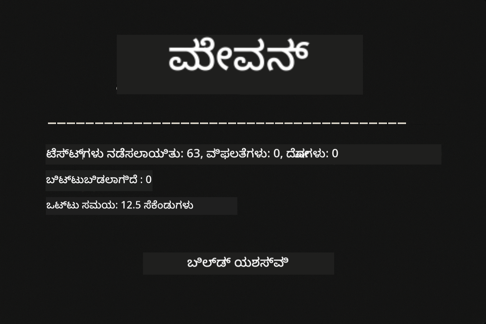
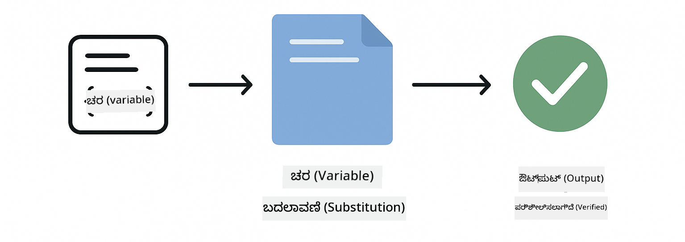
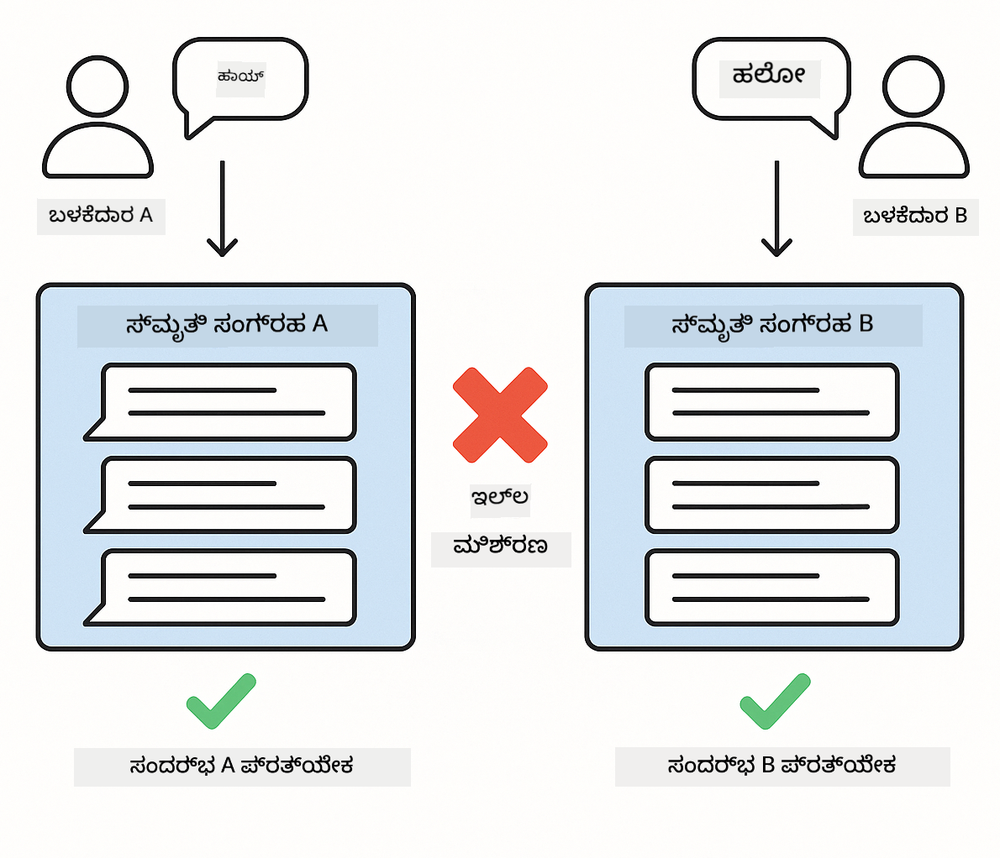
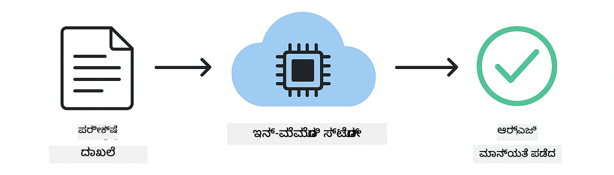

<!--
CO_OP_TRANSLATOR_METADATA:
{
  "original_hash": "b975537560c404d5f254331832811e78",
  "translation_date": "2025-12-13T21:39:49+00:00",
  "source_file": "docs/TESTING.md",
  "language_code": "kn"
}
-->
# LangChain4j ಅಪ್ಲಿಕೇಶನ್‌ಗಳನ್ನು ಪರೀಕ್ಷಿಸುವುದು

## ವಿಷಯಗಳ ಪಟ್ಟಿಕೆ

- [ತ್ವರಿತ ಪ್ರಾರಂಭ](../../../docs)
- [ಪರೀಕ್ಷೆಗಳು ಏನು ಒಳಗೊಂಡಿವೆ](../../../docs)
- [ಪರೀಕ್ಷೆಗಳನ್ನು ನಡೆಸುವುದು](../../../docs)
- [VS ಕೋಡ್‌ನಲ್ಲಿ ಪರೀಕ್ಷೆಗಳನ್ನು ನಡೆಸುವುದು](../../../docs)
- [ಪರೀಕ್ಷಾ ಮಾದರಿಗಳು](../../../docs)
- [ಪರೀಕ್ಷಾ ತತ್ವಶಾಸ್ತ್ರ](../../../docs)
- [ಮುಂದಿನ ಹಂತಗಳು](../../../docs)

ಈ ಮಾರ್ಗದರ್ಶಿ API ಕೀಗಳು ಅಥವಾ ಬಾಹ್ಯ ಸೇವೆಗಳ ಅಗತ್ಯವಿಲ್ಲದೆ AI ಅಪ್ಲಿಕೇಶನ್‌ಗಳನ್ನು ಪರೀಕ್ಷಿಸುವ ವಿಧಾನವನ್ನು ತೋರಿಸುವ ಪರೀಕ್ಷೆಗಳ ಮೂಲಕ ನಿಮಗೆ ಮಾರ್ಗದರ್ಶನ ನೀಡುತ್ತದೆ.

## ತ್ವರಿತ ಪ್ರಾರಂಭ

ಒಂದು ಕಮಾಂಡ್‌ನೊಂದಿಗೆ ಎಲ್ಲಾ ಪರೀಕ್ಷೆಗಳನ್ನು ನಡೆಸಿ:

**Bash:**
```bash
mvn test
```

**PowerShell:**
```powershell
mvn --% test
```



*ಎಲ್ಲಾ ಪರೀಕ್ಷೆಗಳು ವಿಫಲತೆ ಇಲ್ಲದೆ ಯಶಸ್ವಿಯಾಗಿ ನಡೆಯುತ್ತಿರುವುದನ್ನು ತೋರಿಸುವ ಫಲಿತಾಂಶ*

## ಪರೀಕ್ಷೆಗಳು ಏನು ಒಳಗೊಂಡಿವೆ

ಈ ಕೋರ್ಸ್ ಸ್ಥಳೀಯವಾಗಿ ನಡೆಯುವ **ಯೂನಿಟ್ ಪರೀಕ್ಷೆಗಳಿಗೆ** ಕೇಂದ್ರೀಕರಿಸಿದೆ. ಪ್ರತಿ ಪರೀಕ್ಷೆ LangChain4j ಯೊಂದು ನಿರ್ದಿಷ್ಟ ತತ್ವವನ್ನು ಪ್ರತ್ಯೇಕವಾಗಿ ತೋರಿಸುತ್ತದೆ.


*ಪರೀಕ್ಷಾ ಪಿರಮಿಡ್ ಯೂನಿಟ್ ಪರೀಕ್ಷೆಗಳು (ವೇಗವಾಗಿ, ಪ್ರತ್ಯೇಕವಾಗಿ), ಇಂಟಿಗ್ರೇಶನ್ ಪರೀಕ್ಷೆಗಳು (ನಿಜವಾದ ಘಟಕಗಳು), ಮತ್ತು ಎಂಡ್-ಟು-ಎಂಡ್ ಪರೀಕ್ಷೆಗಳು (ಡೋಕರ್‌ನೊಂದಿಗೆ ಸಂಪೂರ್ಣ ವ್ಯವಸ್ಥೆ) ನಡುವಿನ ಸಮತೋಲನವನ್ನು ತೋರಿಸುತ್ತದೆ. ಈ ತರಬೇತಿ ಯೂನಿಟ್ ಪರೀಕ್ಷೆಯನ್ನು ಒಳಗೊಂಡಿದೆ.*

| ಘಟಕ | ಪರೀಕ್ಷೆಗಳು | ಕೇಂದ್ರೀಕರಣ | ಪ್ರಮುಖ ಫೈಲ್‌ಗಳು |
|--------|-------|-------|-----------|
| **00 - ತ್ವರಿತ ಪ್ರಾರಂಭ** | 6 | ಪ್ರಾಂಪ್ಟ್ ಟೆಂಪ್ಲೇಟುಗಳು ಮತ್ತು ಚರ ಪರಿವರ್ತನೆ | `SimpleQuickStartTest.java` |
| **01 - ಪರಿಚಯ** | 8 | ಸಂಭಾಷಣೆ ಸ್ಮರಣೆ ಮತ್ತು ಸ್ಥಿತಿಗತ ಚಾಟ್ | `SimpleConversationTest.java` |
| **02 - ಪ್ರಾಂಪ್ಟ್ ಎಂಜಿನಿಯರಿಂಗ್** | 12 | GPT-5 ಮಾದರಿಗಳು, ಉತ್ಸಾಹ ಮಟ್ಟಗಳು, ರಚನಾತ್ಮಕ ಔಟ್‌ಪುಟ್ | `SimpleGpt5PromptTest.java` |
| **03 - RAG** | 10 | ಡಾಕ್ಯುಮೆಂಟ್ ಇಂಜೆಕ್ಷನ್, ಎम्बೆಡ್ಡಿಂಗ್‌ಗಳು, ಸಾದೃಶ್ಯ ಹುಡುಕಾಟ | `DocumentServiceTest.java` |
| **04 - ಉಪಕರಣಗಳು** | 12 | ಫಂಕ್ಷನ್ ಕರೆ ಮತ್ತು ಉಪಕರಣ ಸರಪಳಿ | `SimpleToolsTest.java` |
| **05 - MCP** | 15 | ಡೋಕರ್‌ನೊಂದಿಗೆ ಮಾದರಿ ಸನ್ನಿವೇಶ ಪ್ರೋಟೋಕಾಲ್ | `SimpleMcpTest.java`, `McpDockerTransportTest.java` |

## ಪರೀಕ್ಷೆಗಳನ್ನು ನಡೆಸುವುದು

**ರೂಟ್‌ನಿಂದ ಎಲ್ಲಾ ಪರೀಕ್ಷೆಗಳನ್ನು ನಡೆಸಿ:**

**Bash:**
```bash
mvn test
```

**PowerShell:**
```powershell
mvn --% test
```

**ನಿರ್ದಿಷ್ಟ ಘಟಕದ ಪರೀಕ್ಷೆಗಳನ್ನು ನಡೆಸಿ:**

**Bash:**
```bash
cd 01-introduction && mvn test
# ಅಥವಾ ರೂಟ್‌ನಿಂದ
mvn test -pl 01-introduction
```

**PowerShell:**
```powershell
cd 01-introduction; mvn --% test
# ಅಥವಾ ರೂಟ್‌ನಿಂದ
mvn --% test -pl 01-introduction
```

**ಒಂದು ಪರೀಕ್ಷಾ ಕ್ಲಾಸ್ ಅನ್ನು ನಡೆಸಿ:**

**Bash:**
```bash
mvn test -Dtest=SimpleConversationTest
```

**PowerShell:**
```powershell
mvn --% test -Dtest=SimpleConversationTest
```

**ನಿರ್ದಿಷ್ಟ ಪರೀಕ್ಷಾ ವಿಧಾನವನ್ನು ನಡೆಸಿ:**

**Bash:**
```bash
mvn test -Dtest=SimpleConversationTest#ಸಂಭಾಷಣೆ ಇತಿಹಾಸವನ್ನು ಕಾಪಾಡಿಕೊಳ್ಳಬೇಕು
```

**PowerShell:**
```powershell
mvn --% test -Dtest=SimpleConversationTest#ಸಂಭಾಷಣೆ ಇತಿಹಾಸವನ್ನು ಕಾಪಾಡಿಕೊಳ್ಳಬೇಕು
```

## VS ಕೋಡ್‌ನಲ್ಲಿ ಪರೀಕ್ಷೆಗಳನ್ನು ನಡೆಸುವುದು

ನೀವು Visual Studio Code ಬಳಸುತ್ತಿದ್ದರೆ, Test Explorer ಪರೀಕ್ಷೆಗಳನ್ನು ನಡೆಸಲು ಮತ್ತು ಡಿಬಗ್ ಮಾಡಲು ಗ್ರಾಫಿಕಲ್ ಇಂಟರ್ಫೇಸ್ ಅನ್ನು ಒದಗಿಸುತ್ತದೆ.


*VS ಕೋಡ್ ಟೆಸ್ಟ್ ಎಕ್ಸ್‌ಪ್ಲೋರರ್ ಎಲ್ಲಾ ಜಾವಾ ಪರೀಕ್ಷಾ ಕ್ಲಾಸ್‌ಗಳು ಮತ್ತು ವೈಯಕ್ತಿಕ ಪರೀಕ್ಷಾ ವಿಧಾನಗಳೊಂದಿಗೆ ಪರೀಕ್ಷಾ ಮರವನ್ನು ತೋರಿಸುತ್ತದೆ*

**VS ಕೋಡ್‌ನಲ್ಲಿ ಪರೀಕ್ಷೆಗಳನ್ನು ನಡೆಸಲು:**

1. Activity Bar ನಲ್ಲಿ ಬೀಕರ್ ಐಕಾನ್ ಕ್ಲಿಕ್ ಮಾಡಿ Test Explorer ತೆರೆಯಿರಿ
2. ಎಲ್ಲಾ ಘಟಕಗಳು ಮತ್ತು ಪರೀಕ್ಷಾ ಕ್ಲಾಸ್‌ಗಳನ್ನು ನೋಡಲು ಪರೀಕ್ಷಾ ಮರವನ್ನು ವಿಸ್ತರಿಸಿ
3. ಯಾವುದೇ ಪರೀಕ್ಷೆಯ ಪಕ್ಕದಲ್ಲಿ ಪ್ಲೇ ಬಟನ್ ಕ್ಲಿಕ್ ಮಾಡಿ ಅದನ್ನು ವೈಯಕ್ತಿಕವಾಗಿ ನಡೆಸಿ
4. "Run All Tests" ಕ್ಲಿಕ್ ಮಾಡಿ ಸಂಪೂರ್ಣ ಸ್ಯೂಟ್ ಅನ್ನು ಕಾರ್ಯಗತಗೊಳಿಸಿ
5. ಯಾವುದೇ ಪರೀಕ್ಷೆಯನ್ನು ರೈಟ್-ಕ್ಲಿಕ್ ಮಾಡಿ "Debug Test" ಆಯ್ಕೆ ಮಾಡಿ ಬ್ರೇಕ್‌ಪಾಯಿಂಟ್‌ಗಳನ್ನು ಸೆಟ್ ಮಾಡಿ ಮತ್ತು ಕೋಡ್ ಮೂಲಕ ಹೆಜ್ಜೆ ಹಾಕಿ

ಪರೀಕ್ಷಾ ಎಕ್ಸ್‌ಪ್ಲೋರರ್ ಪಾಸಾಗುತ್ತಿರುವ ಪರೀಕ್ಷೆಗಳಿಗೆ ಹಸಿರು ಚೆಕ್‌ಮಾರ್ಕ್‌ಗಳನ್ನು ತೋರಿಸುತ್ತದೆ ಮತ್ತು ಪರೀಕ್ಷೆಗಳು ವಿಫಲವಾದಾಗ ವಿವರವಾದ ವಿಫಲತಾ ಸಂದೇಶಗಳನ್ನು ಒದಗಿಸುತ್ತದೆ.

## ಪರೀಕ್ಷಾ ಮಾದರಿಗಳು


*LangChain4j ಅಪ್ಲಿಕೇಶನ್‌ಗಳಿಗೆ ಆರು ಪರೀಕ್ಷಾ ಮಾದರಿಗಳು: ಪ್ರಾಂಪ್ಟ್ ಟೆಂಪ್ಲೇಟುಗಳು, ಮಾದರಿಗಳನ್ನು ನಕಲಿಸುವುದು, ಸಂಭಾಷಣೆ ಪ್ರತ್ಯೇಕತೆ, ಉಪಕರಣಗಳ ಪರೀಕ್ಷೆ, ಇನ್-ಮೆಮೊರಿ RAG, ಮತ್ತು ಡೋಕರ್ ಇಂಟಿಗ್ರೇಶನ್*

### ಮಾದರಿ 1: ಪ್ರಾಂಪ್ಟ್ ಟೆಂಪ್ಲೇಟುಗಳ ಪರೀಕ್ಷೆ

ಸರಳ ಮಾದರಿ ಯಾವುದೇ AI ಮಾದರಿಯನ್ನು ಕರೆ ಮಾಡದೆ ಪ್ರಾಂಪ್ಟ್ ಟೆಂಪ್ಲೇಟುಗಳನ್ನು ಪರೀಕ್ಷಿಸುತ್ತದೆ. ನೀವು ಚರ ಪರಿವರ್ತನೆ ಸರಿಯಾಗಿ ಕೆಲಸ ಮಾಡುತ್ತದೆಯೇ ಮತ್ತು ಪ್ರಾಂಪ್ಟ್‌ಗಳು ನಿರೀಕ್ಷಿತ ರೀತಿಯಲ್ಲಿ ರೂಪುಗೊಂಡಿದ್ದಾರೆಯೇ ಎಂದು ಪರಿಶೀಲಿಸುತ್ತೀರಿ.



*ಚರ ಪರಿವರ್ತನೆ ಪ್ರಕ್ರಿಯೆಯನ್ನು ತೋರಿಸುವ ಪ್ರಾಂಪ್ಟ್ ಟೆಂಪ್ಲೇಟುಗಳ ಪರೀಕ್ಷೆ: ಪ್ಲೇಸ್‌ಹೋಲ್ಡರ್‌ಗಳೊಂದಿಗೆ ಟೆಂಪ್ಲೇಟು → ಮೌಲ್ಯಗಳನ್ನು ಅನ್ವಯಿಸಲಾಗಿದೆ → ರೂಪುಗೊಂಡ ಔಟ್‌ಪುಟ್ ಪರಿಶೀಲಿಸಲಾಗಿದೆ*

```java
@Test
@DisplayName("Should format prompt template with variables")
void testPromptTemplateFormatting() {
    PromptTemplate template = PromptTemplate.from(
        "Best time to visit {{destination}} for {{activity}}?"
    );
    
    Prompt prompt = template.apply(Map.of(
        "destination", "Paris",
        "activity", "sightseeing"
    ));
    
    assertThat(prompt.text()).isEqualTo("Best time to visit Paris for sightseeing?");
}
```

ಈ ಪರೀಕ್ಷೆ `00-quick-start/src/test/java/com/example/langchain4j/quickstart/SimpleQuickStartTest.java` ನಲ್ಲಿ ಇದೆ.

**ನಡೆಸುವುದು:**

**Bash:**
```bash
cd 00-quick-start && mvn test -Dtest=SimpleQuickStartTest#ಪರೀಕ್ಷಾ ಪ್ರಾಂಪ್ಟ್ ಟೆಂಪ್ಲೇಟ್ ಫಾರ್ಮ್ಯಾಟಿಂಗ್
```

**PowerShell:**
```powershell
cd 00-quick-start; mvn --% test -Dtest=SimpleQuickStartTest#ಪರೀಕ್ಷಾ ಪ್ರಾಂಪ್ಟ್ ಟೆಂಪ್ಲೇಟ್ ಫಾರ್ಮ್ಯಾಟಿಂಗ್
```

### ಮಾದರಿ 2: ಭಾಷಾ ಮಾದರಿಗಳನ್ನು ನಕಲಿಸುವುದು

ಸಂಭಾಷಣೆ ಲಾಜಿಕ್ ಪರೀಕ್ಷಿಸುವಾಗ, Mockito ಬಳಸಿ ನಕಲಿ ಮಾದರಿಗಳನ್ನು ರಚಿಸಿ, ಅವು ನಿರ್ಧಿಷ್ಟ ಪ್ರತಿಕ್ರಿಯೆಗಳನ್ನು ನೀಡುತ್ತವೆ. ಇದು ಪರೀಕ್ಷೆಗಳನ್ನು ವೇಗವಾಗಿ, ಉಚಿತವಾಗಿ ಮತ್ತು ನಿರ್ಧಿಷ್ಟವಾಗಿ ಮಾಡುತ್ತದೆ.


*ಪರೀಕ್ಷೆಗಾಗಿ ನಕಲು ಮಾದರಿಗಳನ್ನು ಪ್ರಾಮುಖ್ಯತೆ ನೀಡುವ ಕಾರಣಗಳನ್ನು ತೋರಿಸುವ ಹೋಲಿಕೆ: ಅವು ವೇಗವಾಗಿ, ಉಚಿತವಾಗಿ, ನಿರ್ಧಿಷ್ಟವಾಗಿ ಮತ್ತು API ಕೀಗಳನ್ನು ಅಗತ್ಯವಿಲ್ಲದೆ ಇರುತ್ತವೆ*

```java
@ExtendWith(MockitoExtension.class)
class SimpleConversationTest {
    
    private ConversationService conversationService;
    
    @Mock
    private OpenAiOfficialChatModel mockChatModel;
    
    @BeforeEach
    void setUp() {
        ChatResponse mockResponse = ChatResponse.builder()
            .aiMessage(AiMessage.from("This is a test response"))
            .build();
        when(mockChatModel.chat(anyList())).thenReturn(mockResponse);
        
        conversationService = new ConversationService(mockChatModel);
    }
    
    @Test
    void shouldMaintainConversationHistory() {
        String conversationId = conversationService.startConversation();
        
        ChatResponse mockResponse1 = ChatResponse.builder()
            .aiMessage(AiMessage.from("Response 1"))
            .build();
        ChatResponse mockResponse2 = ChatResponse.builder()
            .aiMessage(AiMessage.from("Response 2"))
            .build();
        ChatResponse mockResponse3 = ChatResponse.builder()
            .aiMessage(AiMessage.from("Response 3"))
            .build();
        
        when(mockChatModel.chat(anyList()))
            .thenReturn(mockResponse1)
            .thenReturn(mockResponse2)
            .thenReturn(mockResponse3);

        conversationService.chat(conversationId, "First message");
        conversationService.chat(conversationId, "Second message");
        conversationService.chat(conversationId, "Third message");

        List<ChatMessage> history = conversationService.getHistory(conversationId);
        assertThat(history).hasSize(6); // 3 ಬಳಕೆದಾರ + 3 AI ಸಂದೇಶಗಳು
    }
}
```

ಈ ಮಾದರಿ `01-introduction/src/test/java/com/example/langchain4j/service/SimpleConversationTest.java` ನಲ್ಲಿ ಕಾಣಿಸುತ್ತದೆ. ನಕಲು ನಿರಂತರ ವರ್ತನೆ ಖಚಿತಪಡಿಸುತ್ತದೆ ಆದ್ದರಿಂದ ನೀವು ಸ್ಮರಣೆ ನಿರ್ವಹಣೆ ಸರಿಯಾಗಿ ಕೆಲಸ ಮಾಡುತ್ತದೆಯೇ ಎಂದು ಪರಿಶೀಲಿಸಬಹುದು.

### ಮಾದರಿ 3: ಸಂಭಾಷಣೆ ಪ್ರತ್ಯೇಕತೆಯ ಪರೀಕ್ಷೆ

ಸಂಭಾಷಣೆ ಸ್ಮರಣೆ ಬಹು ಬಳಕೆದಾರರನ್ನು ಪ್ರತ್ಯೇಕವಾಗಿ ಇರಿಸಬೇಕು. ಈ ಪರೀಕ್ಷೆ ಸಂಭಾಷಣೆಗಳು ಸನ್ನಿವೇಶಗಳನ್ನು ಮಿಶ್ರಣ ಮಾಡದಿರುವುದನ್ನು ಪರಿಶೀಲಿಸುತ್ತದೆ.



*ವಿಭಿನ್ನ ಬಳಕೆದಾರರಿಗಾಗಿ ಪ್ರತ್ಯೇಕ ಸ್ಮರಣೆ ಸಂಗ್ರಹಗಳನ್ನು ತೋರಿಸುವ ಸಂಭಾಷಣೆ ಪ್ರತ್ಯೇಕತೆಯ ಪರೀಕ್ಷೆ, ಸನ್ನಿವೇಶ ಮಿಶ್ರಣವನ್ನು ತಡೆಯಲು*

```java
@Test
void shouldIsolateConversationsByid() {
    String conv1 = conversationService.startConversation();
    String conv2 = conversationService.startConversation();
    
    ChatResponse mockResponse = ChatResponse.builder()
        .aiMessage(AiMessage.from("Response"))
        .build();
    when(mockChatModel.chat(anyList())).thenReturn(mockResponse);

    conversationService.chat(conv1, "Message for conversation 1");
    conversationService.chat(conv2, "Message for conversation 2");

    List<ChatMessage> history1 = conversationService.getHistory(conv1);
    List<ChatMessage> history2 = conversationService.getHistory(conv2);
    
    assertThat(history1).hasSize(2);
    assertThat(history2).hasSize(2);
}
```

ಪ್ರತಿ ಸಂಭಾಷಣೆ ತನ್ನ ಸ್ವಂತ ಸ್ವತಂತ್ರ ಇತಿಹಾಸವನ್ನು ಕಾಪಾಡುತ್ತದೆ. ಉತ್ಪಾದನಾ ವ್ಯವಸ್ಥೆಗಳಲ್ಲಿ, ಈ ಪ್ರತ್ಯೇಕತೆ ಬಹು-ಬಳಕೆದಾರ ಅಪ್ಲಿಕೇಶನ್‌ಗಳಿಗೆ ಅತ್ಯಂತ ಮುಖ್ಯವಾಗಿದೆ.

### ಮಾದರಿ 4: ಉಪಕರಣಗಳನ್ನು ಸ್ವತಂತ್ರವಾಗಿ ಪರೀಕ್ಷಿಸುವುದು

ಉಪಕರಣಗಳು AI ಕರೆ ಮಾಡಬಹುದಾದ ಫಂಕ್ಷನ್‌ಗಳು. AI ನಿರ್ಧಾರಗಳಿಗಿಂತ ಸ್ವತಂತ್ರವಾಗಿ ಅವು ಸರಿಯಾಗಿ ಕೆಲಸ ಮಾಡುತ್ತವೆಯೇ ಎಂದು ನೇರವಾಗಿ ಪರೀಕ್ಷಿಸಿ.


*AI ಕರೆ ಇಲ್ಲದೆ ನಕಲಿ ಉಪಕರಣ ಕಾರ್ಯಾಚರಣೆಯನ್ನು ತೋರಿಸುವ ಉಪಕರಣಗಳ ಸ್ವತಂತ್ರ ಪರೀಕ್ಷೆ, ವ್ಯವಹಾರ ಲಾಜಿಕ್ ಪರಿಶೀಲಿಸಲು*

```java
@Test
void shouldConvertCelsiusToFahrenheit() {
    TemperatureTool tempTool = new TemperatureTool();
    String result = tempTool.celsiusToFahrenheit(25.0);
    assertThat(result).containsPattern("77[.,]0°F");
}

@Test
void shouldDemonstrateToolChaining() {
    WeatherTool weatherTool = new WeatherTool();
    TemperatureTool tempTool = new TemperatureTool();

    String weatherResult = weatherTool.getCurrentWeather("Seattle");
    assertThat(weatherResult).containsPattern("\\d+°C");

    String conversionResult = tempTool.celsiusToFahrenheit(22.0);
    assertThat(conversionResult).containsPattern("71[.,]6°F");
}
```

`04-tools/src/test/java/com/example/langchain4j/agents/tools/SimpleToolsTest.java` ನಿಂದ ಈ ಪರೀಕ್ಷೆಗಳು AI ಭಾಗವಹಿಸುವಿಕೆ ಇಲ್ಲದೆ ಉಪಕರಣ ಲಾಜಿಕ್ ಅನ್ನು ಮಾನ್ಯಗೊಳಿಸುತ್ತವೆ. ಸರಪಳಿ ಉದಾಹರಣೆ ಒಂದು ಉಪಕರಣದ ಔಟ್‌ಪುಟ್ ಇನ್ನೊಂದರ ಇನ್‌ಪುಟ್ ಆಗಿ ಹೇಗೆ ಹೋಗುತ್ತದೆ ಎಂದು ತೋರಿಸುತ್ತದೆ.

### ಮಾದರಿ 5: ಇನ್-ಮೆಮೊರಿ RAG ಪರೀಕ್ಷೆ

RAG ವ್ಯವಸ್ಥೆಗಳು ಸಾಮಾನ್ಯವಾಗಿ ವೆಕ್ಟರ್ ಡೇಟಾಬೇಸ್‌ಗಳು ಮತ್ತು ಎम्बೆಡ್ಡಿಂಗ್ ಸೇವೆಗಳನ್ನು ಅಗತ್ಯವಿರುತ್ತವೆ. ಇನ್-ಮೆಮೊರಿ ಮಾದರಿ ಸಂಪೂರ್ಣ ಪೈಪ್‌ಲೈನ್ ಅನ್ನು ಬಾಹ್ಯ ಅವಲಂಬನೆಗಳಿಲ್ಲದೆ ಪರೀಕ್ಷಿಸಲು ಅವಕಾಶ ನೀಡುತ್ತದೆ.



*ಡೇಟಾಬೇಸ್ ಅಗತ್ಯವಿಲ್ಲದೆ ಡಾಕ್ಯುಮೆಂಟ್ ಪಾರ್ಸಿಂಗ್, ಎम्बೆಡ್ಡಿಂಗ್ ಸಂಗ್ರಹಣೆ ಮತ್ತು ಸಾದೃಶ್ಯ ಹುಡುಕಾಟವನ್ನು ತೋರಿಸುವ ಇನ್-ಮೆಮೊರಿ RAG ಪರೀಕ್ಷಾ ಕಾರ್ಯಪ್ರವಾಹ*

```java
@Test
void testProcessTextDocument() {
    String content = "This is a test document.\nIt has multiple lines.";
    InputStream inputStream = new ByteArrayInputStream(content.getBytes(StandardCharsets.UTF_8));
    
    DocumentService.ProcessedDocument result = 
        documentService.processDocument(inputStream, "test.txt");

    assertNotNull(result);
    assertTrue(result.segments().size() > 0);
    assertEquals("test.txt", result.segments().get(0).metadata().getString("filename"));
}
```

`03-rag/src/test/java/com/example/langchain4j/rag/service/DocumentServiceTest.java` ನಿಂದ ಈ ಪರೀಕ್ಷೆ ಡಾಕ್ಯುಮೆಂಟ್ ಅನ್ನು ಮೆಮೊರಿಯಲ್ಲಿ ರಚಿಸಿ ಚಂಕಿಂಗ್ ಮತ್ತು ಮೆಟಾಡೇಟಾ ನಿರ್ವಹಣೆಯನ್ನು ಪರಿಶೀಲಿಸುತ್ತದೆ.

### ಮಾದರಿ 6: ಡೋಕರ್‌ನೊಂದಿಗೆ ಇಂಟಿಗ್ರೇಶನ್ ಪರೀಕ್ಷೆ

ಕೆಲವು ವೈಶಿಷ್ಟ್ಯಗಳಿಗೆ ನಿಜವಾದ ಮೂಲಸೌಕರ್ಯ ಅಗತ್ಯವಿರುತ್ತದೆ. MCP ಘಟಕವು Testcontainers ಬಳಸಿ ಡೋಕರ್ ಕಂಟೈನರ್‌ಗಳನ್ನು ಸೃಷ್ಟಿಸಿ ಇಂಟಿಗ್ರೇಶನ್ ಪರೀಕ್ಷೆಗಳನ್ನು ನಡೆಸುತ್ತದೆ. ಇವು ನಿಮ್ಮ ಕೋಡ್ ನಿಜವಾದ ಸೇವೆಗಳೊಂದಿಗೆ ಕೆಲಸ ಮಾಡುತ್ತದೆಯೇ ಎಂದು ಪರಿಶೀಲಿಸುತ್ತವೆ ಮತ್ತು ಪರೀಕ್ಷಾ ಪ್ರತ್ಯೇಕತೆಯನ್ನು ಕಾಪಾಡುತ್ತವೆ.


*Testcontainers ಬಳಸಿ ಸ್ವಯಂಚಾಲಿತ ಕಂಟೈನರ್ ಜೀವನಚರಿತ್ರೆಯನ್ನು ತೋರಿಸುವ MCP ಇಂಟಿಗ್ರೇಶನ್ ಪರೀಕ್ಷೆ: ಪ್ರಾರಂಭ, ಪರೀಕ್ಷೆ ನಡೆಸುವುದು, ನಿಲ್ಲಿಸುವುದು ಮತ್ತು ಸ್ವಚ್ಛತೆ*

`05-mcp/src/test/java/com/example/langchain4j/mcp/McpDockerTransportTest.java` ನಲ್ಲಿ ಇರುವ ಪರೀಕ್ಷೆಗಳಿಗೆ ಡೋಕರ್ ಚಾಲನೆಯಲ್ಲಿರಬೇಕು.

**ನಡೆಸುವುದು:**

**Bash:**
```bash
cd 05-mcp && mvn test
```

**PowerShell:**
```powershell
cd 05-mcp; mvn --% test
```

## ಪರೀಕ್ಷಾ ತತ್ವಶಾಸ್ತ್ರ

ನಿಮ್ಮ ಕೋಡ್ ಅನ್ನು ಪರೀಕ್ಷಿಸಿ, AI ಅನ್ನು ಅಲ್ಲ. ನಿಮ್ಮ ಪರೀಕ್ಷೆಗಳು ನೀವು ಬರೆಯುವ ಕೋಡ್ ಅನ್ನು ಪರಿಶೀಲಿಸಬೇಕು, ಪ್ರಾಂಪ್ಟ್‌ಗಳು ಹೇಗೆ ರಚಿಸಲ್ಪಡುತ್ತವೆ, ಸ್ಮರಣೆ ಹೇಗೆ ನಿರ್ವಹಿಸಲಾಗುತ್ತದೆ ಮತ್ತು ಉಪಕರಣಗಳು ಹೇಗೆ ಕಾರ್ಯನಿರ್ವಹಿಸುತ್ತವೆ ಎಂದು ನೋಡಬೇಕು. AI ಪ್ರತಿಕ್ರಿಯೆಗಳು ಬದಲಾಗಬಹುದು ಮತ್ತು ಪರೀಕ್ಷಾ ದೃಢೀಕರಣದ ಭಾಗವಾಗಬಾರದು. ನಿಮ್ಮ ಪ್ರಾಂಪ್ಟ್ ಟೆಂಪ್ಲೇಟ್ ಚರಗಳನ್ನು ಸರಿಯಾಗಿ ಬದಲಾಯಿಸುತ್ತದೆಯೇ ಎಂದು ಕೇಳಿ, AI ಸರಿಯಾದ ಉತ್ತರ ನೀಡುತ್ತದೆಯೇ ಎಂದು ಅಲ್ಲ.

ಭಾಷಾ ಮಾದರಿಗಳಿಗೆ ನಕಲುಗಳನ್ನು ಬಳಸಿ. ಅವು ಬಾಹ್ಯ ಅವಲಂಬನೆಗಳು, ನಿಧಾನವಾಗಿವೆ, ದುಬಾರಿ ಮತ್ತು ನಿರ್ಧಿಷ್ಟವಲ್ಲ. ನಕಲುಗಳು ಪರೀಕ್ಷೆಗಳನ್ನು ಸೆಕೆಂಡುಗಳ ಬದಲು ಮಿಲಿಸೆಕೆಂಡುಗಳಲ್ಲಿ ವೇಗವಾಗಿ, ಉಚಿತವಾಗಿ ಮತ್ತು ನಿರ್ಧಿಷ್ಟವಾಗಿ ಮಾಡುತ್ತವೆ.

ಪರೀಕ್ಷೆಗಳನ್ನು ಸ್ವತಂತ್ರವಾಗಿರಿಸಿ. ಪ್ರತಿ ಪರೀಕ್ಷೆ ತನ್ನದೇ ಡೇಟಾವನ್ನು ಸಿದ್ಧಪಡಿಸಬೇಕು, ಇತರ ಪರೀಕ್ಷೆಗಳಿಗೆ ಅವಲಂಬಿಸಬಾರದು ಮತ್ತು ಸ್ವತಃ ಸ್ವಚ್ಛಗೊಳಿಸಬೇಕು. ಪರೀಕ್ಷೆಗಳು ಕಾರ್ಯಗತಗೊಳಿಸುವ ಕ್ರಮದಿಂದ ಪ್ರಭಾವಿತವಾಗಬಾರದು.

ಸಂತೋಷಕರ ಮಾರ್ಗದ ಹೊರತಾಗಿ ಅಂಚು ಪ್ರಕರಣಗಳನ್ನು ಪರೀಕ್ಷಿಸಿ. ಖಾಲಿ ಇನ್‌ಪುಟ್‌ಗಳು, ಬಹಳ ದೊಡ್ಡ ಇನ್‌ಪುಟ್‌ಗಳು, ವಿಶೇಷ ಅಕ್ಷರಗಳು, ಅಮಾನ್ಯ ಪರಿಮಾಣಗಳು ಮತ್ತು ಗಡಿಬಿಡಿ ಸ್ಥಿತಿಗಳನ್ನು ಪ್ರಯತ್ನಿಸಿ. ಇವು ಸಾಮಾನ್ಯ ಬಳಕೆಯಿಂದ ಬಹುಮಾನವಾಗದ ದೋಷಗಳನ್ನು ಬಹುಮಾನಗೊಳಿಸುತ್ತವೆ.

ವಿವರಣಾತ್ಮಕ ಹೆಸರುಗಳನ್ನು ಬಳಸಿ. `shouldMaintainConversationHistoryAcrossMultipleMessages()` ಅನ್ನು `test1()` ಜೊತೆಗೆ ಹೋಲಿಸಿ. ಮೊದಲದು ನೀವು ಏನು ಪರೀಕ್ಷಿಸುತ್ತಿದ್ದೀರಿ ಎಂಬುದನ್ನು ನಿಖರವಾಗಿ ಹೇಳುತ್ತದೆ, ವಿಫಲತೆಗಳನ್ನು ಡಿಬಗ್ ಮಾಡುವುದು ಸುಲಭವಾಗುತ್ತದೆ.

## ಮುಂದಿನ ಹಂತಗಳು

ಈಗ ನೀವು ಪರೀಕ್ಷಾ ಮಾದರಿಗಳನ್ನು ಅರ್ಥಮಾಡಿಕೊಂಡಿದ್ದೀರಿ, ಪ್ರತಿ ಘಟಕವನ್ನು ಆಳವಾಗಿ ಅಧ್ಯಯನ ಮಾಡಿ:

- **[00 - ತ್ವರಿತ ಪ್ರಾರಂಭ](../00-quick-start/README.md)** - ಪ್ರಾಂಪ್ಟ್ ಟೆಂಪ್ಲೇಟ್ ಮೂಲಭೂತಗಳಿಂದ ಪ್ರಾರಂಭಿಸಿ
- **[01 - ಪರಿಚಯ](../01-introduction/README.md)** - ಸಂಭಾಷಣೆ ಸ್ಮರಣೆ ನಿರ್ವಹಣೆಯನ್ನು ಕಲಿಯಿರಿ
- **[02 - ಪ್ರಾಂಪ್ಟ್ ಎಂಜಿನಿಯರಿಂಗ್](../02-prompt-engineering/README.md)** - GPT-5 ಪ್ರಾಂಪ್ಟ್ ಮಾದರಿಗಳನ್ನು ಪರಿಣತಗೊಳಿಸಿ
- **[03 - RAG](../03-rag/README.md)** - ರಿಟ್ರೀವಲ್-ಆಗ್ಮೆಂಟೆಡ್ ಜನರೇಶನ್ ವ್ಯವಸ್ಥೆಗಳನ್ನು ನಿರ್ಮಿಸಿ
- **[04 - ಉಪಕರಣಗಳು](../04-tools/README.md)** - ಫಂಕ್ಷನ್ ಕರೆ ಮತ್ತು ಉಪಕರಣ ಸರಪಳಿಗಳನ್ನು ಜಾರಿಗೆ ತರುವಿರಿ
- **[05 - MCP](../05-mcp/README.md)** - ಡೋಕರ್‌ನೊಂದಿಗೆ ಮಾದರಿ ಸನ್ನಿವೇಶ ಪ್ರೋಟೋಕಾಲ್ ಅನ್ನು ಸಂಯೋಜಿಸಿ

ಪ್ರತಿ ಘಟಕದ README ಇಲ್ಲಿ ಪರೀಕ್ಷಿಸಲಾದ ತತ್ವಗಳ ವಿವರವಾದ ವಿವರಣೆಗಳನ್ನು ಒದಗಿಸುತ್ತದೆ.

---

**ನಾವಿಗೇಶನ್:** [← ಮುಖ್ಯಕ್ಕೆ ಹಿಂತಿರುಗಿ](../README.md)

---

<!-- CO-OP TRANSLATOR DISCLAIMER START -->
**ಅಸ್ವೀಕಾರ**:  
ಈ ದಸ್ತಾವೇಜು AI ಅನುವಾದ ಸೇವೆ [Co-op Translator](https://github.com/Azure/co-op-translator) ಬಳಸಿ ಅನುವಾದಿಸಲಾಗಿದೆ. ನಾವು ನಿಖರತೆಯಿಗಾಗಿ ಪ್ರಯತ್ನಿಸುತ್ತಿದ್ದರೂ, ಸ್ವಯಂಚಾಲಿತ ಅನುವಾದಗಳಲ್ಲಿ ದೋಷಗಳು ಅಥವಾ ಅಸತ್ಯತೆಗಳು ಇರಬಹುದು ಎಂದು ದಯವಿಟ್ಟು ಗಮನಿಸಿ. ಮೂಲ ಭಾಷೆಯಲ್ಲಿರುವ ಮೂಲ ದಸ್ತಾವೇಜನ್ನು ಅಧಿಕೃತ ಮೂಲವೆಂದು ಪರಿಗಣಿಸಬೇಕು. ಮಹತ್ವದ ಮಾಹಿತಿಗಾಗಿ, ವೃತ್ತಿಪರ ಮಾನವ ಅನುವಾದವನ್ನು ಶಿಫಾರಸು ಮಾಡಲಾಗುತ್ತದೆ. ಈ ಅನುವಾದ ಬಳಕೆಯಿಂದ ಉಂಟಾಗುವ ಯಾವುದೇ ತಪ್ಪು ಅರ್ಥಮಾಡಿಕೊಳ್ಳುವಿಕೆ ಅಥವಾ ತಪ್ಪು ವಿವರಣೆಗಳಿಗೆ ನಾವು ಹೊಣೆಗಾರರಾಗುವುದಿಲ್ಲ.
<!-- CO-OP TRANSLATOR DISCLAIMER END -->