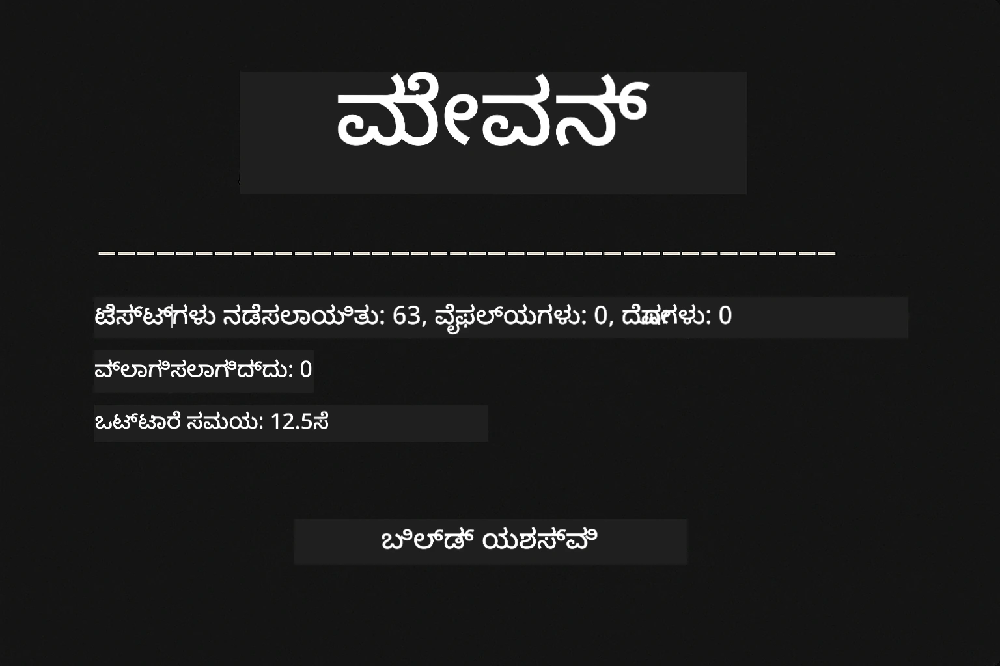
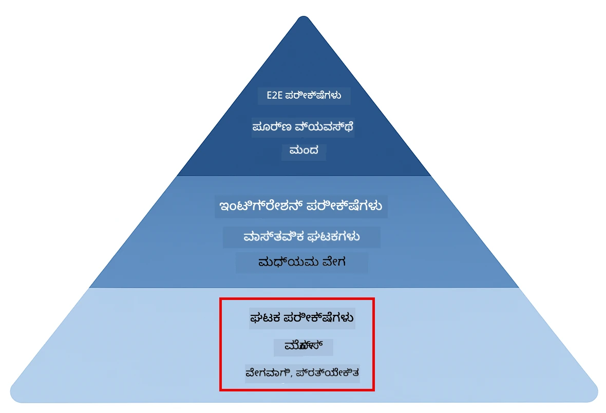
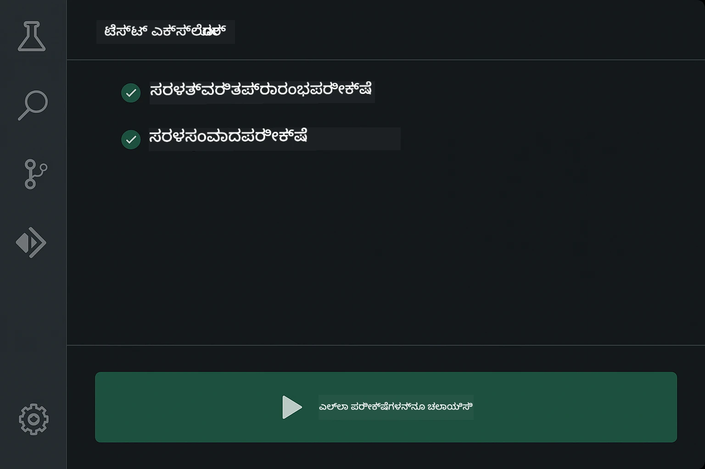
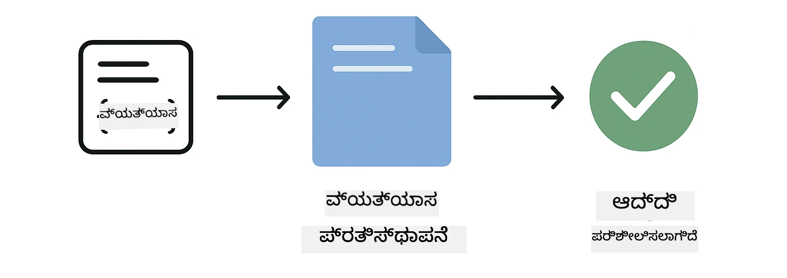
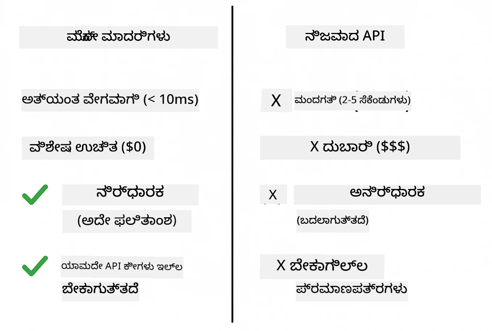
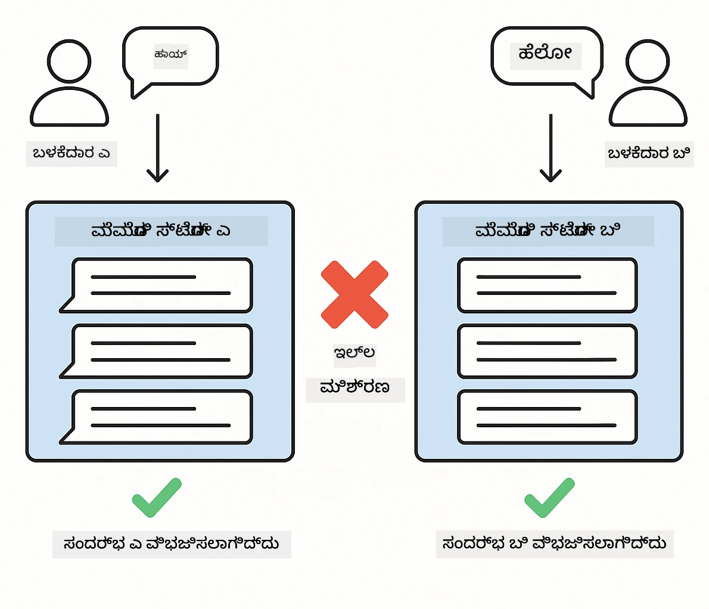
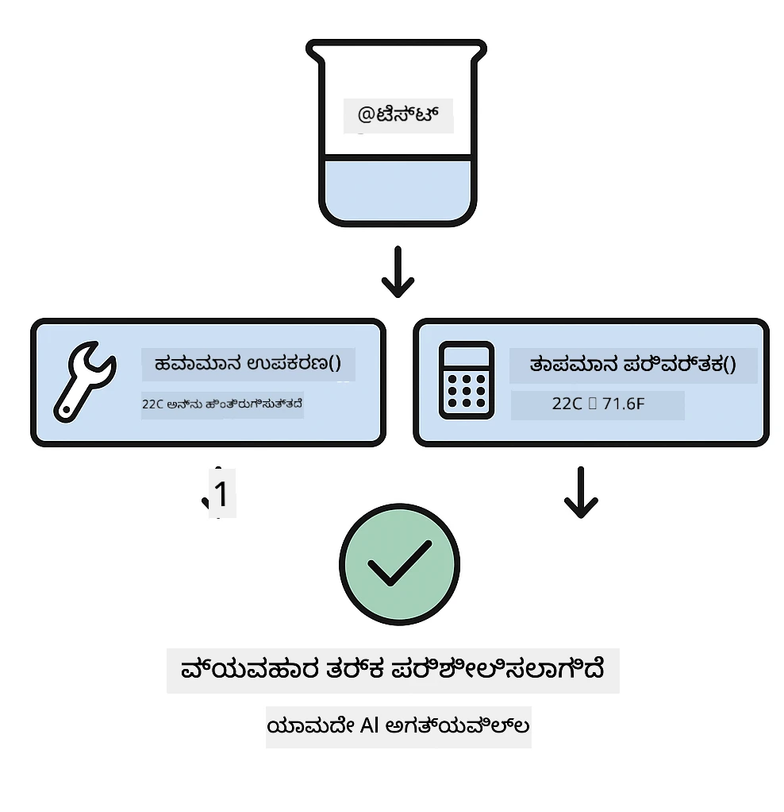
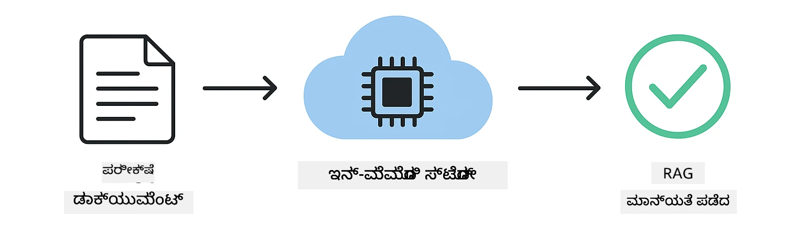

# LangChain4j ಅಪ್ಲಿಕೇಶನ್‌ಗಳನ್ನು ಪರೀಕ್ಷಿಸುವುದು

## ವಿಷಯಗಳು

- [ಶೀಘ್ರ ಪ್ರಾರಂಭ](#ಶೀಘ್ರ-ಪ್ರಾರಂಭ)
- [ಪರೀಕ್ಷೆಗಳು ಏನು ಕವರ್ ಮಾಡುತ್ತವೆ](#ಪರೀಕ್ಷೆಗಳು-ಏನು-ಕವರ್-ಮಾಡುತ್ತವೆ)
- [ಪರೀಕ್ಷೆಗಳನ್ನು ನಡೆಸುವುದು](#ಪರೀಕ್ಷೆಗಳನ್ನು-ನಡೆಸುವುದು)
- [VS ಕೋಡ್‌ನಲ್ಲಿ ಪರೀಕ್ಷೆಗಳನ್ನು ನಡೆಸುವುದು](#vs-ಕೋಡ್‌ನಲ್ಲಿ-ಪರೀಕ್ಷೆಗಳನ್ನು-ನಡೆಸುವುದು)
- [ಪರೀಕ್ಷೆ ಮಾದರಿಗಳು](#ಪರೀಕ್ಷೆ-ಮಾದರಿಗಳು)
- [ಪರೀಕ್ಷೆ ತತ್ವಶಾಸ್ತ್ರ](#ಪರೀಕ್ಷೆ-ತತ್ವಶಾಸ್ತ್ರ)
- [ಮುಂದಿನ ಹೆಜ್ಜೆಗಳು](#ಮುಂದಿನ-ಹೆಜ್ಜೆಗಳು)

ಈ ಮಾರ್ಗದರ್ಶಿ API ರಹಸ್ಯಗಳು ಅಥವಾ ಹೊರಗಿನ ಸೇವೆಗಳನ್ನು ಅವಲಂಬಿಸದೆ ಎಐ ಅಪ್ಲಿಕೇಶನ್‌ಗಳನ್ನು ಹೇಗೆ ಪರೀಕ್ಷಿಸುವುದನ್ನು ತೋರಿಸುವ ಪರೀಕ್ಷೆಗಳ ಮೂಲಕ ನಿಮ್ಮನ್ನು ನಡೆಸುತ್ತದೆ.

## ಶೀಘ್ರ ಪ್ರಾರಂಭ

ಒಂದು ಆಜ್ಞೆ ಮೂಲಕ ಎಲ್ಲಾ ಪರೀಕ್ಷೆಗಳನ್ನು ನಡೆಸಿ:

**ಬ್ಯಾಶ್:**
```bash
mvn test
```

**ಪವರ್‌ಶೆಲ್:**
```powershell
mvn --% test
```


ಎಲ್ಲಾ ಪರೀಕ್ಷೆಗಳು ಸಫಲವಾಗಿದ್ದರೆ, ಕೆಳಗಿನ ಸ್ಕ್ರೀನ್ಶಾಟ್‌ನಲ್ಲಿ ಇರುವಂತೆ ಔಟ್‌ಪುಟ್ ಕಾಣಬೇಕು — ಪ್ರಮಾದಗಳಿಲ್ಲದೆ ಪರೀಕ್ಷೆಗಳು ನಡೆಯುತ್ತವೆ.



*ಪ್ರಮಾದಗಳಿಲ್ಲದೆ ಎಲ್ಲಾ ಪರೀಕ್ಷೆಗಳು ಸಫಲವಾಗಿ ನಡೆದಿರುವುದನ್ನು ತೋರಿಸುವ ಯಶಸ್ವಿ ಪರೀಕ್ಷಾ ಕಾರ್ಯಪ್ರದರ್ಶನ*

## ಪರೀಕ್ಷೆಗಳು ಏನು ಕವರ್ ಮಾಡುತ್ತವೆ

ಈ ಕೋರ್ಸ್ ಸ್ಥಳೀಯವಾಗಿ ನಡೆಯುವ **ಯೂನಿಟ್ ಪರೀಕ್ಷೆಗಳನ್ನು** ಕೌಂದಲ್ಯಗೊಳಿಸಿದೆ. ಪ್ರತಿ ಪರೀಕ್ಷೆಲಲ್ಲಿ LangChain4j ಯೊಂದು ನಿಖರವಾದ ಕಲ್ಪನೆಯನ್ನು ಪ್ರತ್ಯೇಕವಾಗಿ ಪ್ರದರ್ಶಿಸುತ್ತದೆ. ಕೆಳಗಿನ ಪರೀಕ್ಷಾ ಪಿರಮಿಡ್ ಯೂನಿಟ್ ಪರೀಕ್ಷೆಗಳು ಎಲ್ಲ ಅಂಶಗಳ ತಳಹದಿಯಾಗಿವೆ ಎಂಬುದನ್ನು ತೋರಿಸುತ್ತದೆ — ಇವು ವೇಗದ, ಭರವಸೆಯಾದ ಅಸ್ತಂಭಗಳು.



*ಪರೀಕ್ಷಾ ಪಿರಮಿಡ್, ಯೂನಿಟ್ ಪರೀಕ್ಷೆಗಳ (ವೇಗದ, ಪ್ರತ್ಯೇಕित), ಏಕೀಕರಣ ಪರೀಕ್ಷೆಗಳು (ನಿಜವಾದ ಘಟಕಗಳು), ಮತ್ತು ಅಂತ್ಯ-ಮುಗಿಯುವ ಪರೀಕ್ಷೆಗಳನ್ನು ತೋರಿಸುತ್ತದೆ. ಈ ತರಬೇತಿ ಯೂನಿಟ್ ಪರೀಕ್ಷೆಯನ್ನು ಒಳಗೊಂಡಿದೆ.*

| ಮೋಡುಲ್ | ಪರೀಕ್ಷೆಗಳು | ಗುರಿ | ಪ್ರಮುಖ ಕಡತಗಳು |
|--------|------------|-------|-------------------|
| **01 - ಪರಿಚಯ** | 8 | ಸಂಭಾಷಣೆ ಮೆಮೊರಿ ಮತ್ತು ಸ್ಥಿತಿಗತ ಚಾಟ್ | `SimpleConversationTest.java` |
| **02 - ಪ್ರಾಂಪ್ಟ್ ಎಂಜಿನಿಯರಿಂಗ್** | 12 | GPT-5.2 ಮಾದರಿಗಳು, ಆಸಕ್ತಿಯ ಮಟ್ಟಗಳು, ಸಂರಚಿತ ಔಟ್‌ಪುಟ್ | `SimpleGpt5PromptTest.java` |
| **03 - RAG** | 10 | ಡಾಕ್ಯುಮೆಂಟ್ ಇಂಜೆಕ್ಷನ್, ಎಂಭೆಡಿಂಗ್ಸ್, ಸಾದೃಶ್ಯ ಹುಡುಕಿ | `DocumentServiceTest.java` |
| **04 - ಉಪಕರಣಗಳು** | 12 | ಫಂಕ್ಷನ್ ಕರೆದೊಯ್ಯುವುದು ಮತ್ತು ಉಪಕರಣ ಸರಪಳಿ | `SimpleToolsTest.java` |
| **05 - MCP** | 8 | Model Context Protocol ಸ್ಟ್ಡಿಯೋ ಸಾರಿಗೆ | `SimpleMcpTest.java` |

## ಪರೀಕ್ಷೆಗಳನ್ನು ನಡೆಸುವುದು

**ಮೂಲ ಡೈರೆಕ್ಟರಿಯಿಂದ ಎಲ್ಲಾ ಪರೀಕ್ಷೆಗಳನ್ನು ಚಲಾಯಿಸು:**

**ಬ್ಯಾಶ್:**
```bash
mvn test
```

**ಪವರ್‌ಶೆಲ್:**
```powershell
mvn --% test
```


**ನಿರ್ದಿಷ್ಟ ಮೋಡುಲ್‌ಗೆ ಪರೀಕ್ಷೆಗಳನ್ನು ನಿರ್ವಹಿಸಲು:**

**ಬ್ಯಾಶ್:**
```bash
cd 01-introduction && mvn test
# ಅಥವಾ ರೂಟ್‌ನಿಂದ
mvn test -pl 01-introduction
```

**ಪವರ್‌ಶೆಲ್:**
```powershell
cd 01-introduction; mvn --% test
# ಅಥವಾ ಮೂಳಿನಿಂದ
mvn --% test -pl 01-introduction
```


**ಒಂದು ಪರೀಕ್ಷಾ ಕ್ಲಾಸ್ ಅನ್ನು ನಡೆಸಲು:**

**ಬ್ಯಾಶ್:**
```bash
mvn test -Dtest=SimpleConversationTest
```

**ಪವರ್‌ಶೆಲ್:**
```powershell
mvn --% test -Dtest=SimpleConversationTest
```


**ನಿರ್ದಿಷ್ಟ ಪರೀಕ್ಷಾ ಮೆಥಡ್ ಅನ್ನು ನಡೆಸಲು:**

**ಬ್ಯಾಶ್:**
```bash
mvn test -Dtest=SimpleConversationTest#ಸಂಭಾಷಣಾ ಇತಿಹಾಸವನ್ನು ಕಾಯ್ದುಕೊಳ್ಳಬೇಕು
```

**ಪವರ್‌ಶೆಲ್:**
```powershell
mvn --% test -Dtest=SimpleConversationTest#ಸಂಭಾಷಣಾ ಇತಿಹಾಸವನ್ನು ಕಾಯ್ದುಕೊಳ್ಳಬೇಕು
```


## VS ಕೋಡ್‌ನಲ್ಲಿ ಪರೀಕ್ಷೆಗಳನ್ನು ನಡೆಸುವುದು

ನೀವು Visual Studio Code ಬಳಸುತ್ತಿದ್ದರೆ, ಟೆಸ್ಟ್ ಎಕ್ಸ್‌ಪ್ಲೋರ್ ಗ್ರಾಫಿಕಲ್ ಇಂಟರ್ಫೇಸ್ ಅನ್ನು ಒದಗಿಸುತ್ತದೆ, ಇದು ಪರೀಕ್ಷೆಗಳನ್ನು ಚಲಾಯಿಸುವುದಕ್ಕೆ ಮತ್ತು ಡಿಬಗ್ ಮಾಡಲು ಸಹಾಯಕ.



*VS ಕೋಡ್ ಟೆಸ್ಟ್ ಎಕ್ಸ್ಪ್ಲೋರ್ ಟೆಸ್ಟ್ ಗಿಡವು ಎಲ್ಲ Java ಟೆಸ್ಟ್ ಕ್ಲಾಸುಗಳ ಮತ್ತು ವೈಯಕ್ತಿಕ ಪರೀಕ್ಷಾ ವಿಧಾನಗಳೊಂದಿಗೆ ತೋರಿಸುತ್ತದೆ*

**VS ಕೋಡ್‌ನಲ್ಲಿ ಪರೀಕ್ಷೆಗಳನ್ನು ನಡೆಸಲು:**

1. ಕ್ರಿಯೆ ಪಟ್ಟಿಯ ಬಾರ್‌ನಲ್ಲಿ ಬಿಕರ್ ಐಕಾನ್ ಕ್ಲಿಕ್ ಮಾಡಿ ಟೆಸ್ಟ್ ಎಕ್ಸ್‌ಪ್ಲೋರರ್ ಅನ್ನು ತೆರೆದುಕೊಳ್ಳಿ
2. ಎಲ್ಲಾ ಮೋಡುಲ್‌ಗಳು ಮತ್ತು ಟೆಸ್ಟ್ ಕ್ಲಾಸ್‌ಗಳನ್ನು ವಿಸ್ತರಿಸಿ ನೋಡಿ
3. ಪ್ರತಿ ಪರೀಕ್ಷೆಯ ಬೆರಗಿನ ಬटनನ್ನು ಕ್ಲಿಕ್ ಮಾಡಿ ಅದು ವೈಯಕ್ತಿಕವಾಗಿ ಚಲಾಯಿಸಲು
4. "ಎಲ್ಲಾ ಪರೀಕ್ಷೆಗಳನ್ನು ನಡೆಸು" ಕ್ಲಿಕ್ ಮಾಡಿ ಸಂಪೂರ್ಣ ಸ್ಯೂಟ್ ಕಾರ್ಯಗತಗೊಳಿಸಲು
5. ಯಾವುದೇ ಪರೀಕ್ಷೆಯನ್ನು ರೈಟ್ ಕ್ಲಿಕ್ ಮಾಡಿ "ಡಿಬಗ್ ಟೆಸ್ಟ್" ಆಯ್ಕೆ ಮಾಡಿ ಬ್ರೇಕ್ ಪಾಯಿಂಟ್‌ಗಳನ್ನು ಸೆಟ್ ಮಾಡಿ ಮತ್ತು ಕ್ರಮದಲ್ಲಿ ಹೆಜ್ಜೆ ಹಾಕಿ

ಪರೀಕ್ಷೆಗಳು ಪಾಸಾಗುವಾಗ ಹಸಿರು ಸಾಧ್ಯತೆ ಗುರುತು ತೋರಿಸುತ್ತವೆ ಮತ್ತು ವೈಫಲ್ಯಗಳಾಗುವಾಗ ವಿವರಣಾತ್ಮಕ ಜತೆಗಿನ ಸಂದೇಶ ನೀಡುತ್ತವೆ.

## ಪರೀಕ್ಷೆ ಮಾದರಿಗಳು

### ಮಾದರಿ 1: ಪ್ರಾಂಪ್ಟ್ ಟೆಂಪ್ಲೇಟ್‌ಗಳನ್ನು ಪರೀಕ್ಷಿಸುವುದು

ಸರಳವಾದ ಮಾದರಿ ಯಾವುದೇ ಎಐ ಮಾದರಿಯನ್ನು ಕರೆದಿಲ್ಲದೆ ಪ್ರಾಂಪ್ಟ್ ಟೆಂಪ್ಲೇಟ್‌ಗಳನ್ನು ಪರೀಕ್ಷಿಸುತ್ತದೆ. ನೀವು ವ್ಯತ್ಯಯವನ್ನು ಸರಿಯಾಗಿ ಬದಲಾಯಿಸಲಾಗುತ್ತದೆಯೇ ಮತ್ತು ಪ್ರಾಂಪ್ಟ್‌ಗಳು ನಿರೀಕ್ಷಿತವಾಗಿ ರೂಪಿಸಬಹುದೇ ಎಂದು ಪರಿಶೀಲಿಸಬೇಕು.



*ಪ್ರಾಂಪ್ಟ್ ಟೆಂಪ್ಲೇಟ್ ಪರೀಕ್ಷಿಸುವುದು, ಪ್ಲೇಸ್‌ಹೋಲ್ಡರ್‌ಗಳೊಂದಿಗೆ ಟೆಂಪ್ಲೇಟ್ → ಮೌಲ್ಯ ಬದಲಾಯಿಸುವುದು → ರೂಪಿತ ಔಟ್‌ಪುಟ್ ಪರಿಶೀಲನೆ*

```java
@Test
@DisplayName("Should format prompt template with variables")
void testPromptTemplateFormatting() {
    PromptTemplate template = PromptTemplate.from(
        "Best time to visit {{destination}} for {{activity}}?"
    );
    
    Prompt prompt = template.apply(Map.of(
        "destination", "Paris",
        "activity", "sightseeing"
    ));
    
    assertThat(prompt.text()).isEqualTo("Best time to visit Paris for sightseeing?");
}
```

ಈ ಮಾದರಿ ವ್ಯತ್ಯಯ ಬದಲಾವಣೆ ಸರಿಯಾಗಿ ನಡೆಯುತ್ತದೆ ಎಂದು ಮತ್ತು ಪ್ರಾಂಪ್ಟ್ ಗಳು ನಿರೀಕ್ಷಿತವಾಗಿ ರೂಪಿತವಾಗುತ್ತವೆ ಎಂದು ಪರಿಶೀಲಿಸುತ್ತದೆ — API ಕೀ ಅಥವಾ ಮಾದರಿ ಕರೆಗೆ ಅಗತ್ಯವಿಲ್ಲ.

### ಮಾದರಿ 2: ಭಾಷಾ ಮಾದರಿಗಳನ್ನು ಮಾಕ್ ಮಾಡುವುದು

ಸಂಭಾಷಣೆ ತರ್ಕವನ್ನು ಪರೀಕ್ಷಿಸುವಾಗ, ಹಿಂದಿನಿಂದ ನಿಗದಿತ ಪ್ರತಿಕ್ರಿಯೆ ನೀಡುವ ನಕಲಿ ಮಾದರಿಗಳನ್ನು ಸೃಷ್ಟಿಸಲು Mockito ಬಳಸಿರಿ. ಇದರಿಂದ ಪರೀಕ್ಷೆಗಳು ವೇಗವಾಗಿ, ಉಚಿತವಾಗಿ, ಮತ್ತು ನಿರ್ಧಿಷ್ಟವಾಗುತ್ತವೆ.



*ಮೂಕಿ ಮಾದರಿಗಳು ಏಕೆ ಆಪಿಯು ಕಿಲಿಯ ಬದಿಗೆ ಇಷ್ಟಪಡುವುದನ್ನು ತೋರಿಸುವ ಹೋಲಿಕೆ: ಅವು ವೇಗವಾದ, ಉಚಿತ, ನಿರ್ಧಿಷ್ಟ, ಮತ್ತು API ಕೀಗಳನ್ನು ಬೇಕಾಗದೆ*

```java
@ExtendWith(MockitoExtension.class)
class SimpleConversationTest {
    
    private ConversationService conversationService;
    
    @Mock
    private OpenAiOfficialChatModel mockChatModel;
    
    @BeforeEach
    void setUp() {
        ChatResponse mockResponse = ChatResponse.builder()
            .aiMessage(AiMessage.from("This is a test response"))
            .build();
        when(mockChatModel.chat(anyList())).thenReturn(mockResponse);
        
        conversationService = new ConversationService(mockChatModel);
    }
    
    @Test
    void shouldMaintainConversationHistory() {
        String conversationId = conversationService.startConversation();
        
        ChatResponse mockResponse1 = ChatResponse.builder()
            .aiMessage(AiMessage.from("Response 1"))
            .build();
        ChatResponse mockResponse2 = ChatResponse.builder()
            .aiMessage(AiMessage.from("Response 2"))
            .build();
        ChatResponse mockResponse3 = ChatResponse.builder()
            .aiMessage(AiMessage.from("Response 3"))
            .build();
        
        when(mockChatModel.chat(anyList()))
            .thenReturn(mockResponse1)
            .thenReturn(mockResponse2)
            .thenReturn(mockResponse3);

        conversationService.chat(conversationId, "First message");
        conversationService.chat(conversationId, "Second message");
        conversationService.chat(conversationId, "Third message");

        List<ChatMessage> history = conversationService.getHistory(conversationId);
        assertThat(history).hasSize(6); // 3 ಬಳಕೆದಾರ + 3 AI ಸಂದೇಶಗಳು
    }
}
```

ಈ ಮಾದರಿ `01-introduction/src/test/java/com/example/langchain4j/service/SimpleConversationTest.java` ನಲ್ಲಿ ಕಾಣಬಹುದು. ಮಾಕ್ ನಿರಂತರ ವರ್ತನೆ ಖಚಿತಪಡಿಸಿಕೊಳುತ್ತದೆ ನೀವು ಮೆಮೊರಿ ನಿರ್ವಹಣೆಯನ್ನು ಸರಿಯಾಗಿ ಪರಿಶೀಲಿಸಬಹುದು.

### ಮಾದರಿ 3: ಸಂಭಾಷಣೆ ಪ್ರತ್ಯೇಕತೆಯನ್ನು ಪರೀಕ್ಷಿಸುವುದು

ಸಂಭಾಷಣೆ ಮೆಮೊರಿಯು ಬಾಹ್ಯ ಬಳಕೆದಾರರಿಗೆ ಪ್ರತ್ಯೇಕವಾಗಿರಬೇಕು. ಈ ಪರೀಕ್ಷೆ ಸಂಭಾಷಣೆಗಳು ಸಂಧರ್ಭಗಳನ್ನು ಮಿಶ್ರಿಸುವುದರಿಂದ ತಪ್ಪಿಸಿಕೊಳ್ತದೆ ಎಂದು ಖಚಿತಪಡಿಸುತ್ತದೆ.



*ವಿವಿಧ ಬಳಕೆದಾರರಿಗಾಗಿ ಪ್ರತ್ಯೇಕ ಮೆಮೊರಿ ಮಳಕನ್ನು ತೋರಿಸುವ ಸಂಭಾಷಣೆ ಪ್ರತ್ಯೇಕತೆ ಪರೀಕ್ಷೆ*

```java
@Test
void shouldIsolateConversationsByid() {
    String conv1 = conversationService.startConversation();
    String conv2 = conversationService.startConversation();
    
    ChatResponse mockResponse = ChatResponse.builder()
        .aiMessage(AiMessage.from("Response"))
        .build();
    when(mockChatModel.chat(anyList())).thenReturn(mockResponse);

    conversationService.chat(conv1, "Message for conversation 1");
    conversationService.chat(conv2, "Message for conversation 2");

    List<ChatMessage> history1 = conversationService.getHistory(conv1);
    List<ChatMessage> history2 = conversationService.getHistory(conv2);
    
    assertThat(history1).hasSize(2);
    assertThat(history2).hasSize(2);
}
```

ಪ್ರತಿ ಸಂಭಾಷಣೆ ತನ್ನ ಸ್ವಂತ ಸ್ವತಂತ್ರ ಇತಿಹಾಸವನ್ನು ನಿಭಾಯಿಸುತ್ತದೆ. ಉತ್ಪಾದನೆ ವ್ಯವಸ್ಥೆಗಳಲ್ಲಿ, ಈ ಪ್ರತ್ಯೇಕತೆ ಬಹು-ಬಳಕೆದಾರ ಅಪ್ಲಿಕೇಶನ್‌ಗಳಿಗೆ ಪ್ರಮುಖವಾಗಿದೆ.

### ಮಾದರಿ 4: ಉಪಕರಣಗಳನ್ನು ಸ್ವತಂತ್ರವಾಗಿ ಪರೀಕ್ಷಿಸುವುದು

ಉಪಕರಣಗಳು ಎಐ ಕರೆತರುವ ಕಾರ್ಯಗಳಾಗಿವೆ. ಅವುಗಳನ್ನು ನೇರವಾಗಿ ಪರೀಕ್ಷಿಸಿ ಒಳ್ಳೆಯ ತರ್ಕಗಳನ್ನು ಎಲ್ಲಿಂದಲಾದರೂ ಕೆಲಸ ಮಾಡುತ್ತವೆ ಎಂದು ಖಚಿತಪಡಿಸಿಕೊಳ್ಳಿ.



*ಎಐ ಕರೆಗಳಿಲ್ಲದೆ ನಕಲಿ ಉಪಕರಣ ನಿರ್ವಹಣೆಯನ್ನು ತೋರಿಸುವ ಉಪಕರಣ ಪರಿಶೀಲನೆ*

```java
@Test
void shouldConvertCelsiusToFahrenheit() {
    TemperatureTool tempTool = new TemperatureTool();
    String result = tempTool.celsiusToFahrenheit(25.0);
    assertThat(result).containsPattern("77[.,]0°F");
}

@Test
void shouldDemonstrateToolChaining() {
    WeatherTool weatherTool = new WeatherTool();
    TemperatureTool tempTool = new TemperatureTool();

    String weatherResult = weatherTool.getCurrentWeather("Seattle");
    assertThat(weatherResult).containsPattern("\\d+°C");

    String conversionResult = tempTool.celsiusToFahrenheit(22.0);
    assertThat(conversionResult).containsPattern("71[.,]6°F");
}
```

`04-tools/src/test/java/com/example/langchain4j/agents/tools/SimpleToolsTest.java` ನಿಂದ ಈ ಪರೀಕ್ಷೆಗಳು ಎಐ ಭಾಗವಹಿಸದೇ ಉಪಕರಣ ತರ್ಕವನ್ನು ಪರಿಶೀಲಿಸುತ್ತವೆ. ಸರಪಳಿ ಮಾದರಿ ಒಂದು ಉಪಕರಣದ ಔಟ್‌ಪುಟ್ ಮತ್ತೊಂದು ಉಪಕರಣದ ಇನ್‌ಪುಟ್ ಆಗುವುದು ಹೇಗೋ ತೋರಿಸುತ್ತದೆ.

### ಮಾದರಿ 5: ಮೆಮೊರಿಯಲ್ಲಿರುವ RAG ಪರೀಕ್ಷೆ

RAG ವ್ಯವಸ್ಥೆಗಳು ಸಾಮಾನ್ಯವಾಗಿ ವೆಕ್ಟರ್ ಡೇಟಾಬೇಸ್‌ಗಳು ಮತ್ತು ಎಂಭೆಡಿಂಗ್ ಸೇವೆಗಳ ಅಗತ್ಯವಿರುತ್ತದೆ. ಮೆಮೊರಿಯಲ್ಲಿರುವ ಮಾದರಿ ನೀವು ಹೊರಗಿನ ಅವಲಂಬನೆಗಳಿಲ್ಲದೆ ಸಂಪೂರ್ಣ ಪೈಪ್ಲೈನ್ ಅನ್ನು ಪರೀಕ್ಷಿಸಲು ಸಹಾಯ ಮಾಡುತ್ತದೆ.



*ಡಾಕ್ಯುಮೆಂಟ್ ವಿಶ್ಲೇಷಣೆ, ಎಂಭೆಡಿಂಗ್ ಸಂಗ್ರಹಣೆ, ಮತ್ತು ಸಾದೃಶ್ಯ ಹುಡುಕಿಕೆಯನ್ನು ಡೇಟಾಬೇಸ್ ವಿನಾ ತೋರಿಸುವ ಮೆಮೊರಿಯಲ್ಲಿ RAG ಪರಿಶೀಲನೆ ಕಾರ್ಯಪ್ರವಾಹ*

```java
@Test
void testProcessTextDocument() {
    String content = "This is a test document.\nIt has multiple lines.";
    InputStream inputStream = new ByteArrayInputStream(content.getBytes(StandardCharsets.UTF_8));
    
    DocumentService.ProcessedDocument result = 
        documentService.processDocument(inputStream, "test.txt");

    assertNotNull(result);
    assertTrue(result.segments().size() > 0);
    assertEquals("test.txt", result.segments().get(0).metadata().getString("filename"));
}
```

`03-rag/src/test/java/com/example/langchain4j/rag/service/DocumentServiceTest.java` ನಿಂದ ಈ ಪರೀಕ್ಷೆ ಎರಡು ದೃಷ್ಟಾಂತಗಳನ್ನು ಸೃಷ್ಟಿಸಿ ಅವುಗಳ ವಿಭಾಗಣೆ ಮತ್ತು ಮೆಟಾಡೇಟಾ ನಿರ್ವಹಣೆಯನ್ನು ಪರಿಶೀಲಿಸುತ್ತದೆ.

### ಮಾದರಿ 6: MCP ಏಕೀಕರಣ ಪರೀಕ್ಷೆ

MCP ಮೋಡುಲ್ Model Context Protocol ಅನ್ನು ಸ್ಟ್ಡಿಯೋ ಸಾರಿಗೆ ಬಳಸಿ ಏಕೀಕರಿಸುವುದನ್ನು ಪರೀಕ್ಷಿಸುತ್ತದೆ. ಈ ಪರೀಕ್ಷೆಗಳು ನಿಮ್ಮ ಅಪ್ಲಿಕೇಶನ್ MCP ಸರ್ವರ್‌ಗಳನ್ನು ಉಪಪ್ರಕ್ರಿಯೆಗಳಾಗಿ ಆರಂಭಿಸಿ ಸಂವಹನ ಮಾಡಬಲ್ಲದು ಎಂದು ಖಚಿತ ಮಾಡಲು ಸಹಾಯಮಾಡುತ್ತವೆ.

`05-mcp/src/test/java/com/example/langchain4j/mcp/SimpleMcpTest.java` ನಲ್ಲಿ ಇರುವ ಪರೀಕ್ಷೆಗಳು MCP ಕ್ಲೈಂಟ್ ವರ್ತನೆಯನ್ನು ಖಚಿತಪಡಿಸುತ್ತವೆ.

**ನಡೆಸಲು:**

**ಬ್ಯಾಶ್:**
```bash
cd 05-mcp && mvn test
```

**ಪವರ್‌ಶೆಲ್:**
```powershell
cd 05-mcp; mvn --% test
```


## ಪರೀಕ್ಷೆ ತತ್ವಶಾಸ್ತ್ರ

ನೀವು ಎಐಯನ್ನು ಪರೀಕ್ಷಿಸುವುದಿಲ್ಲ; ನಿಮ್ಮ ಕೋಡ್ ಅನ್ನು ಪರೀಕ್ಷಿಸಿ. ನಿಮ್ಮ ಪರೀಕ್ಷೆಗಳು ನೀವು ಬರೆಯುವ ಕೋಡ್ ಅನ್ನು ಪರಿಶೀಲಿಸಬೆಕು: ಪ್ರಾಂಪ್ಟ್‌ಗಳು ಹೇಗೆ ರಚಿಸಲ್ಪಡುತ್ತವೆ, ಮೆಮೊರಿ ಹೇಗೆ ನಿರ್ವಹಿಸಲಾಗುತ್ತದೆ, ಮತ್ತು ಉಪಕರಣಗಳು ಹೇಗೆ ಕಾರ್ಯನಿರ್ವಹಿಸುತ್ತವೆ. ಎಐ ಪ್ರತಿಕ್ರಿಯೆಗಳು ಬದಲಾಗಬಹುದು ಮತ್ತು ಪರೀಕ್ಷಾ ಖಾತ್ರಿ ಭಾಗವಾಗಬಾರದು. ನಿಮ್ಮ ಪ್ರಾಂಪ್ಟ್ ಟೆಂಪ್ಲೇಟ್ ವ್ಯತ್ಯಯಗಳನ್ನು ಸರಿಯಾಗಿ ಬದಲಾಯಿಸುವುದೇ ಪ್ರಶ್ನಿಸಿರಿ, ಏನಿಲ್ಲ ಎಐ ಸರಿಯಾದ ಉತ್ತರವನ್ನು ಕೊಡುವುದೇ ಅಲ್ಲ.

ಭಾಷಾ ಮಾದರಿಗಳಿಗೆ ಮಾಕ್‌ಗಳನ್ನು ಬಳಸಿ. ಅವು ಹೊರಗಿನ ಅವಲಂಬನೆಗಳು, ಯವು ನಿಧಾನ, ದುಬಾರಿಯಾಗಿವೆ ಮತ್ತು ನಿರ್ಣಾಯಕವಲ್ಲ. ಮಾಕ್ ಪರೀಕ್ಷೆಗಳನ್ನು ಸೆಕೆಂಡುಗಳ ಬದಲು ಮಿಲಿ ಸೆಕೆಂಡುಗಳಲ್ಲಿ ವೇಗವಾಗಿ, ಉಚಿತವಾಗಿ, ಮತ್ತು ನ್ಯಾಯಸಮ್ಮತವಾಗಿ ಮಾಡಿ.

ಪರೀಕ್ಷೆಗಳನ್ನು ಸ್ವತಂತ್ರವಾಗಿರಿಸಿ. ಪ್ರತಿ ಪರೀಕ್ಷೆ ತನ್ನದೇ ಆದ ಡೇಟಾವನ್ನು ಸಿದ್ಧಪಡಿಸಬೇಕು, ಇತರ ಪರೀಕ್ಷೆಗಳಿಗೆ ಅವಲಂಬಿಸಬಾರದು ಮತ್ತು ಸ್ವಚ್ಛಗೊಳಿಸುವುದು ಮಾಡಬೇಕು. ಪರೀಕ್ಷೆಗಳು ನಿರ್ಗತಿಗಳ ಕ್ರಮದಿಂದ ಪ್ರಭಾವಿತರಾಗಬಾರದು.

ಸಂತುಷ್ಟಿಸುವ ಮಾರ್ಗದ ಹೊರಗಿನ ಪ್ರಾಂಬಲಗಳನ್ನು ಪರೀಕ್ಷಿಸಿ. ಖಾಲಿ ಇನ್‌ಪುಟ್‌ಗಳು, ಬಹು ದೊಡ್ಡ ಇನ್‌ಪುಟ್‌ಗಳು, ವಿಶೇಷ ಅಕ್ಷರಗಳು, ಅಮಾನ್ಯ ಪರಿಮಾಣಗಳು, ಮತ್ತು ಗಡಿದೊಡ್ಡ ನಿಯಮಗಳನ್ನು ಪ್ರಯತ್ನಿಸಿ. ಸಾಮಾನ್ಯ ಬಳಕೆಯಲ್ಲಿ ಮೂಡು ಕಾಣದ ದೋಷಗಳನ್ನು ಓದಲು ಇದು ಸಹಾಯ ಮಾಡುತ್ತದೆ.

ವಿವರಣಾತ್ಮಕ ಹೆಸರುಗಳನ್ನು ಬಳಸಿ. `shouldMaintainConversationHistoryAcrossMultipleMessages()` ಮತ್ತು `test1()`ನ್ನು ಹೋಲಿಸಿ. ಮೊದಲದು ಪರಿಶೀಲನೆಯ ವಿಷಯವನ್ನು ನಿಖರವಾಗಿ ತಿಳಿಸುವ ಕಾರಣ ವೈಫಲ್ಯಗಳನ್ನು ಡಿಬಗ್ ಮಾಡುವುದು ಸುಲಭ.

## ಮುಂದಿನ ಹೆಜ್ಜೆಗಳು

ಈಗ ನೀವು ಪರೀಕ್ಷಾ ಮಾದರಿಗಳನ್ನು ಅರ್ಥಮಾಡಿಕೊಂಡಿದ್ದೀರಿ, ಪ್ರತಿ ಮೋಡುಲ್ ಆಳವಾಗಿ ವಿಶ್ಲೇಷಿಸಿ:

- **[01 - ಪರಿಚಯ](../01-introduction/README.md)** - ಸಂಭಾಷಣೆ ಮೆಮೊರಿ ನಿರ್ವಹಣೆಯನ್ನು ಕಲಿಯಿರಿ
- **[02 - ಪ್ರಾಂಪ್ಟ್ ಎಂಜಿನಿಯರಿಂಗ್](../02-prompt-engineering/README.md)** - GPT-5.2 ಪ್ರಾಂಪ್ಟ್ ಮಾದರಿಗಳನ್ನು ಅಭ್ಯಾಸ ಮಾಡಿ
- **[03 - RAG](../03-rag/README.md)** - ರಿಟ್ರೀವಲ್-ಆಗ್ಮೆಂಟೆಡ್ ಜನರೇಶನ್ ವ್ಯವಸ್ಥೆಗಳನ್ನು ನಿರ್ಮಿಸಿ
- **[04 - ಉಪಕರಣಗಳು](../04-tools/README.md)** - ಫಂಕ್ಷನ್ ಕರೆಮಾಡುವಿಕೆ ಮತ್ತು ಉಪಕರಣ ಸರಪಳಿಗಳನ್ನು ಅನುಷ್ಟಿಸಲು
- **[05 - MCP](../05-mcp/README.md)** - Model Context Protocol ಏಕೀಕರಿಸಿ

ಪ್ರತಿಯೊಂದು ಮೋಡುಲ್‌ನ README ಇಲ್ಲಿ ಪರೀಕ್ಷಿಸಲಾದ ಕಲ್ಪನೆಗಳ ವಿವರಗಳನ್ನು ನೀಡುತ್ತದೆ.

---

**ನಾವಿಗೇಷನ್:** [← ಮುಖ್ಯಕ್ಕೆ ಹಿಂತಿರುಗಿ](../README.md)

---

<!-- CO-OP TRANSLATOR DISCLAIMER START -->
**ಅಸ್ವೀಕಾರ**:
ಈ ದಸ್ತಾವೇಜು AI ಅನುವಾದ ಸೇವೆ [Co-op Translator](https://github.com/Azure/co-op-translator) ಬಳಸಿ ಅನುವಾದಿಸಲಾಗಿದೆ. ನಾವು ನಿಖರತೆಯನ್ನು ಸಾಧಿಸಲು ಪ್ರಯತ್ನಿಸುತ್ತಿದ್ದರೂ, ದಯವಿಟ್ಟು ಗಮನಿಸಿ, ಸ್ವಯಂಚಾಲಿತ ಅನುವಾದಗಳಲ್ಲಿ ದೋಷಗಳು ಅಥವಾ ಅಸಡ್ಡೆಗಳು ಇರಬಹುದು. ಮೂಲ ಭಾಷೆಯಲ್ಲಿರುವ ಮೂಲ ದಸ್ತಾವೇಜು ಪ್ರಾಮಾಣಿಕ ಮೂಲವೆಂದು ಪರಿಗಣಿಸಬೇಕು. ಪ್ರಮುಖ ಮಾಹಿತಿಗಾಗಿ, ವೃತ್ತಿಪರ ಮಾನವ ಅನುವಾದವನ್ನು ಶಿಫಾರಸು ಮಾಡಲಾಗುತ್ತದೆ. ಈ ಅನುವಾದವನ್ನು ಬಳಸುವ ಮೂಲಕ ಉಂಟಾಗುವ ಯಾವುದೇ ತಪ್ಪು ಅರ್ಥಗಳ ಅಥವಾ ತಪ್ಪು ವ್ಯಾಖ್ಯಾನಗಳ ಬಗ್ಗೆ ನಾವು ಹೊಣೆಗಾರರಲ್ಲ.
<!-- CO-OP TRANSLATOR DISCLAIMER END -->