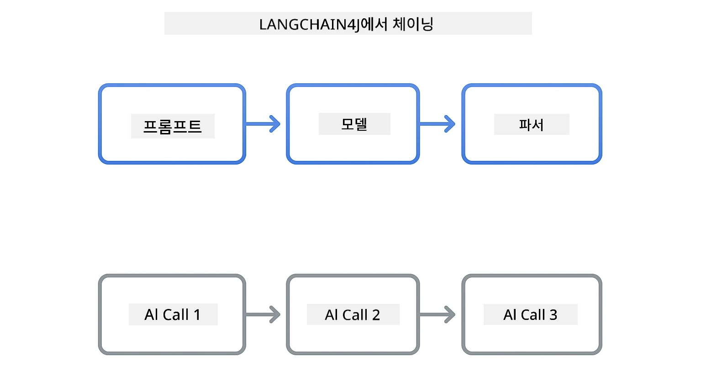
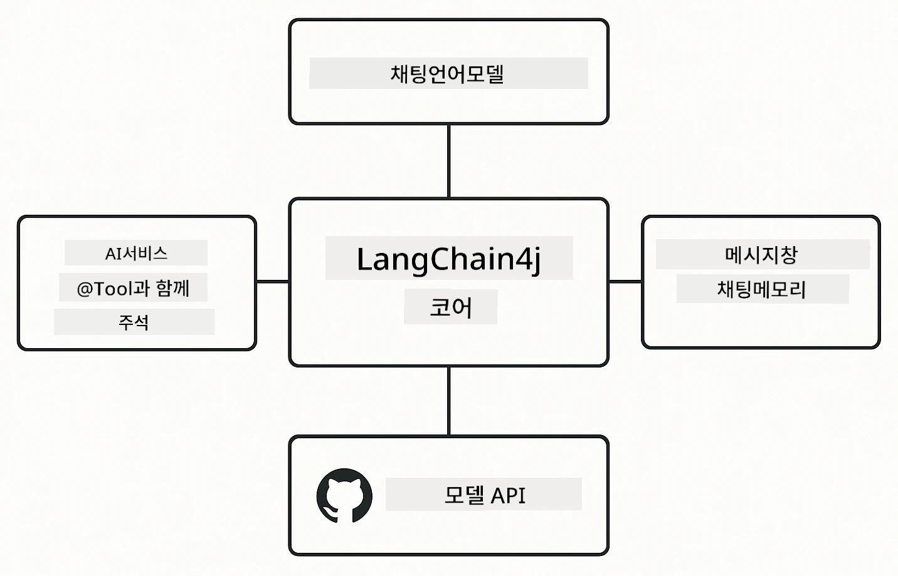

# Module 00: 빠른 시작

## 목차

- [소개](../../../00-quick-start)
- [LangChain4j란?](../../../00-quick-start)
- [LangChain4j 의존성](../../../00-quick-start)
- [사전 요구 사항](../../../00-quick-start)
- [설정](../../../00-quick-start)
  - [1. GitHub 토큰 받기](../../../00-quick-start)
  - [2. 토큰 설정하기](../../../00-quick-start)
- [예제 실행하기](../../../00-quick-start)
  - [1. 기본 채팅](../../../00-quick-start)
  - [2. 프롬프트 패턴](../../../00-quick-start)
  - [3. 함수 호출](../../../00-quick-start)
  - [4. 문서 Q&A (RAG)](../../../00-quick-start)
  - [5. 책임 있는 AI](../../../00-quick-start)
- [각 예제의 기능](../../../00-quick-start)
- [다음 단계](../../../00-quick-start)
- [문제 해결](../../../00-quick-start)

## 소개

이 빠른 시작 가이드는 LangChain4j를 최대한 빠르게 실행할 수 있도록 설계되었습니다. LangChain4j와 GitHub 모델로 AI 애플리케이션을 구축하는 가장 기본적인 내용을 다룹니다. 다음 모듈에서는 Azure OpenAI와 LangChain4j를 사용해 더 고급 애플리케이션을 구축합니다.

## LangChain4j란?

LangChain4j는 AI 기반 애플리케이션 개발을 간소화하는 자바 라이브러리입니다. HTTP 클라이언트나 JSON 파싱을 직접 다루는 대신, 깔끔한 자바 API를 사용합니다.

LangChain의 "체인"은 여러 컴포넌트를 연결하는 것을 의미합니다. 프롬프트를 모델에 연결하거나, 하나의 출력이 다음 입력으로 연결되는 여러 AI 호출을 체인 형태로 연결할 수 있습니다. 이 빠른 시작은 복잡한 체인을 탐구하기 전에 기본에 집중합니다.



*LangChain4j에서 컴포넌트 체인 - 강력한 AI 워크플로우를 만드는 빌딩 블록*

세 가지 핵심 컴포넌트를 사용합니다:

**ChatLanguageModel** - AI 모델 상호작용용 인터페이스입니다. `model.chat("prompt")`를 호출하면 응답 문자열을 받습니다. `OpenAiOfficialChatModel`을 사용하며, GitHub 모델과 같이 OpenAI 호환 엔드포인트에서 작동합니다.

**AiServices** - 타입 안전 AI 서비스 인터페이스를 생성합니다. 메서드를 정의하고 `@Tool`로 주석 처리하면 LangChain4j가 조정을 처리합니다. 필요 시 AI가 자동으로 자바 메서드를 호출합니다.

**MessageWindowChatMemory** - 대화 기록을 유지합니다. 없으면 각 요청은 독립적이지만, 있으면 AI가 이전 메시지를 기억하고 여러 턴에 걸쳐 컨텍스트를 유지합니다.



*LangChain4j 아키텍처 - 핵심 컴포넌트가 협력하여 AI 애플리케이션을 구동*

## LangChain4j 의존성

이 빠른 시작에서는 [`pom.xml`](../../../00-quick-start/pom.xml)에 두 개의 Maven 의존성을 사용합니다:

```xml
<!-- Core LangChain4j library -->
<dependency>
    <groupId>dev.langchain4j</groupId>
    <artifactId>langchain4j</artifactId> <!-- Inherited from BOM in root pom.xml -->
</dependency>

<!-- OpenAI integration (works with GitHub Models) -->
<dependency>
    <groupId>dev.langchain4j</groupId>
    <artifactId>langchain4j-open-ai-official</artifactId> <!-- Inherited from BOM in root pom.xml -->
</dependency>
```

`langchain4j-open-ai-official` 모듈은 OpenAI 호환 API에 연결하는 `OpenAiOfficialChatModel` 클래스를 제공합니다. GitHub 모델도 동일한 API 형식을 사용하므로 특별한 어댑터 없이 기본 URL만 `https://models.github.ai/inference`로 지정하면 됩니다.

## 사전 요구 사항

**Dev Container 사용 중인가요?** Java와 Maven이 이미 설치되어 있습니다. GitHub 개인 액세스 토큰만 있으면 됩니다.

**로컬 개발:**
- Java 21 이상, Maven 3.9 이상
- GitHub 개인 액세스 토큰 (아래 설명 참조)

> **참고:** 이 모듈은 GitHub 모델의 `gpt-4.1-nano`를 사용합니다. 코드 내 모델 이름은 변경하지 마세요 - GitHub 사용 가능 모델에 맞게 구성되어 있습니다.

## 설정

### 1. GitHub 토큰 받기

1. [GitHub 설정 → 개인 액세스 토큰](https://github.com/settings/personal-access-tokens)으로 이동
2. "토큰 새로 생성" 클릭
3. 설명 이름 지정 (예: "LangChain4j Demo")
4. 만료 기간 설정 (7일 권장)
5. "계정 권한"에서 "Models"를 찾아 "읽기 전용"으로 설정
6. "토큰 생성" 클릭
7. 토큰을 복사하여 저장 - 다시 볼 수 없습니다

### 2. 토큰 설정하기

**옵션 1: VS Code 사용 (권장)**

VS Code를 사용하는 경우 프로젝트 루트의 `.env` 파일에 토큰을 추가하세요:

`.env` 파일이 없으면 `.env.example`을 `.env`로 복사하거나 새 `.env` 파일을 만드세요.

**예시 `.env` 파일:**
```bash
# /workspaces/LangChain4j-for-Beginners/.env 에서
GITHUB_TOKEN=your_token_here
```

그런 다음 탐색기에서 원하는 데모 파일(예: `BasicChatDemo.java`)을 마우스 오른쪽 버튼으로 클릭하고 **"Run Java"**를 선택하거나, 실행 및 디버그 패널에서 실행 구성을 사용할 수 있습니다.

**옵션 2: 터미널 사용**

환경 변수로 토큰을 설정하세요:

**Bash:**
```bash
export GITHUB_TOKEN=your_token_here
```

**PowerShell:**
```powershell
$env:GITHUB_TOKEN=your_token_here
```

## 예제 실행하기

**VS Code 사용:** 탐색기에서 데모 파일을 마우스 오른쪽 버튼 클릭 후 **"Run Java"** 선택 또는 실행 및 디버그 패널의 실행 구성을 사용하세요 (먼저 `.env`에 토큰을 추가해야 합니다).

**Maven 사용:** 또는 명령줄에서 실행할 수 있습니다:

### 1. 기본 채팅

**Bash:**
```bash
mvn compile exec:java -Dexec.mainClass=com.example.langchain4j.quickstart.BasicChatDemo
```

**PowerShell:**
```powershell
mvn --% compile exec:java -Dexec.mainClass=com.example.langchain4j.quickstart.BasicChatDemo
```

### 2. 프롬프트 패턴

**Bash:**
```bash
mvn compile exec:java -Dexec.mainClass=com.example.langchain4j.quickstart.PromptEngineeringDemo
```

**PowerShell:**
```powershell
mvn --% compile exec:java -Dexec.mainClass=com.example.langchain4j.quickstart.PromptEngineeringDemo
```

제로샷, 몇 샷, 사고의 사슬, 역할 기반 프롬프트를 보여줍니다.

### 3. 함수 호출

**Bash:**
```bash
mvn compile exec:java -Dexec.mainClass=com.example.langchain4j.quickstart.ToolIntegrationDemo
```

**PowerShell:**
```powershell
mvn --% compile exec:java -Dexec.mainClass=com.example.langchain4j.quickstart.ToolIntegrationDemo
```

필요한 경우 AI가 자동으로 자바 메서드를 호출합니다.

### 4. 문서 Q&A (RAG)

**Bash:**
```bash
mvn compile exec:java -Dexec.mainClass=com.example.langchain4j.quickstart.SimpleReaderDemo
```

**PowerShell:**
```powershell
mvn --% compile exec:java -Dexec.mainClass=com.example.langchain4j.quickstart.SimpleReaderDemo
```

`document.txt` 내용에 대해 질문하세요.

### 5. 책임 있는 AI

**Bash:**
```bash
mvn compile exec:java -Dexec.mainClass=com.example.langchain4j.quickstart.ResponsibleAIDemo
```

**PowerShell:**
```powershell
mvn --% compile exec:java -Dexec.mainClass=com.example.langchain4j.quickstart.ResponsibleAIDemo
```

AI 안전 필터가 유해한 콘텐츠를 차단하는 방식을 확인하세요.

## 각 예제의 기능

**기본 채팅** - [BasicChatDemo.java](../../../00-quick-start/src/main/java/com/example/langchain4j/quickstart/BasicChatDemo.java)

LangChain4j의 가장 단순한 사용법을 볼 수 있습니다. `OpenAiOfficialChatModel`을 생성하고 `.chat()`으로 프롬프트를 보내 응답을 받습니다. 이는 모델을 커스텀 엔드포인트와 API 키로 초기화하는 기본을 보여줍니다. 이 패턴을 이해하면 다른 모든 예제가 이에 기반해 구축됩니다.

```java
ChatLanguageModel model = OpenAiOfficialChatModel.builder()
    .baseUrl("https://models.github.ai/inference")
    .apiKey(System.getenv("GITHUB_TOKEN"))
    .modelName("gpt-4.1-nano")
    .build();

String response = model.chat("What is LangChain4j?");
System.out.println(response);
```

> **🤖 [GitHub Copilot](https://github.com/features/copilot) Chat과 함께 시도해 보세요:** [`BasicChatDemo.java`](../../../00-quick-start/src/main/java/com/example/langchain4j/quickstart/BasicChatDemo.java)를 열고 물어보세요:
> - "이 코드에서 GitHub 모델에서 Azure OpenAI로 전환하려면 어떻게 해야 하나요?"
> - "OpenAiOfficialChatModel.builder()에서 설정할 수 있는 다른 매개변수는 무엇인가요?"
> - "완전한 응답을 기다리지 않고 스트리밍 응답을 추가하려면 어떻게 해야 하나요?"

**프롬프트 엔지니어링** - [PromptEngineeringDemo.java](../../../00-quick-start/src/main/java/com/example/langchain4j/quickstart/PromptEngineeringDemo.java)

모델과 대화하는 방법을 알게 됐으니, 이제 무엇을 말할지 살펴봅니다. 이 데모는 같은 모델 설정을 사용하지만 네 가지 다른 프롬프트 패턴을 보여줍니다. 직접 명령하는 제로샷, 예제로 배우는 몇 샷, 추론 단계를 보여주는 사고의 사슬, 컨텍스트를 설정하는 역할 기반 프롬프트를 실험해 보세요. 동일한 모델도 요청을 어떻게 구성하느냐에 따라 완전히 다른 결과를 제공합니다.

```java
PromptTemplate template = PromptTemplate.from(
    "What's the best time to visit {{destination}} for {{activity}}?"
);

Prompt prompt = template.apply(Map.of(
    "destination", "Paris",
    "activity", "sightseeing"
));

String response = model.chat(prompt.text());
```

> **🤖 [GitHub Copilot](https://github.com/features/copilot) Chat과 함께 시도해 보세요:** [`PromptEngineeringDemo.java`](../../../00-quick-start/src/main/java/com/example/langchain4j/quickstart/PromptEngineeringDemo.java)를 열고 물어보세요:
> - "제로샷과 몇 샷 프롬프트의 차이는 무엇이며 언제 각각 사용해야 하나요?"
> - "temperature 매개변수가 모델 응답에 어떤 영향을 주나요?"
> - "프로덕션에서 프롬프트 인젝션 공격을 방지하는 기술에는 어떤 것이 있나요?"
> - "공통 패턴용 재사용 가능한 PromptTemplate 객체를 어떻게 만들 수 있나요?"

**툴 통합** - [ToolIntegrationDemo.java](../../../00-quick-start/src/main/java/com/example/langchain4j/quickstart/ToolIntegrationDemo.java)

여기서 LangChain4j의 강력함이 드러납니다. `AiServices`를 사용해 자바 메서드를 호출하는 AI 비서를 만듭니다. 메서드에 `@Tool("설명")` 어노테이션만 달면 LangChain4j가 나머지를 처리하며, AI가 사용자의 요청에 따라 자동으로 각 툴을 사용 여부를 결정합니다. 함수 호출은 단순 답변을 넘는 AI 액션 빌딩을 위한 핵심 기술입니다.

```java
@Tool("Performs addition of two numeric values")
public double add(double a, double b) {
    return a + b;
}

MathAssistant assistant = AiServices.create(MathAssistant.class, model);
String response = assistant.chat("What is 25 plus 17?");
```

> **🤖 [GitHub Copilot](https://github.com/features/copilot) Chat과 함께 시도해 보세요:** [`ToolIntegrationDemo.java`](../../../00-quick-start/src/main/java/com/example/langchain4j/quickstart/ToolIntegrationDemo.java)를 열고 물어보세요:
> - "@Tool 어노테이션은 어떻게 작동하며 LangChain4j가 내부에서 무엇을 하나요?"
> - "AI가 여러 툴을 연속적으로 호출해 복잡한 문제를 해결할 수 있나요?"
> - "툴에서 예외가 발생하면 어떻게 처리해야 하나요?"
> - "이 계산기 예제 대신 실제 API를 어떻게 통합하나요?"

**문서 Q&A (RAG)** - [SimpleReaderDemo.java](../../../00-quick-start/src/main/java/com/example/langchain4j/quickstart/SimpleReaderDemo.java)

RAG(검색 증강 생성)의 기초를 봅니다. 모델 학습 데이터에만 의존하는 대신 [`document.txt`](../../../00-quick-start/document.txt)의 내용을 로드해 프롬프트에 포함시킵니다. AI가 일반 지식이 아닌 여러분의 문서 기반으로 답변합니다. 이는 자체 데이터를 활용하는 시스템 구축의 첫 단계입니다.

```java
Document document = FileSystemDocumentLoader.loadDocument("document.txt");
String content = document.text();

String prompt = "Based on this document: " + content + 
                "\nQuestion: What is the main topic?";
String response = model.chat(prompt);
```

> **참고:** 이 간단한 방식은 전체 문서를 프롬프트에 로드합니다. 큰 파일(>10KB)은 컨텍스트 한도를 초과할 수 있습니다. 모듈 03에서 청킹 및 벡터 검색을 통한 실제 RAG 시스템을 다룹니다.

> **🤖 [GitHub Copilot](https://github.com/features/copilot) Chat과 함께 시도해 보세요:** [`SimpleReaderDemo.java`](../../../00-quick-start/src/main/java/com/example/langchain4j/quickstart/SimpleReaderDemo.java)를 열고 물어보세요:
> - "RAG가 모델 학습 데이터 사용과 비교해 AI 착각(hallucination)을 어떻게 방지하나요?"
> - "이 간단한 방법과 검색용 벡터 임베딩 사용의 차이는 무엇인가요?"
> - "여러 문서나 더 큰 지식 기반을 다루려면 어떻게 확장하나요?"
> - "AI가 제공된 컨텍스트만 사용하도록 프롬프트를 구조화하는 최선의 방법은 무엇인가요?"

**책임 있는 AI** - [ResponsibleAIDemo.java](../../../00-quick-start/src/main/java/com/example/langchain4j/quickstart/ResponsibleAIDemo.java)

다중 방어선으로 AI 안전을 구축합니다. 이 데모는 두 층의 보호 기능을 보여줍니다:

**1부: LangChain4j 입력 가드레일** - 위험한 프롬프트가 LLM에 도달하기 전 차단합니다. 금지된 키워드나 패턴을 검사하는 커스텀 가드레일을 만듭니다. 코드 내에서 실행되어 빠르고 비용이 없습니다.

```java
class DangerousContentGuardrail implements InputGuardrail {
    @Override
    public InputGuardrailResult validate(UserMessage userMessage) {
        String text = userMessage.singleText().toLowerCase();
        if (text.contains("explosives")) {
            return fatal("Blocked: contains prohibited keyword");
        }
        return success();
    }
}
```

**2부: 제공자 안전 필터** - GitHub 모델에는 가드레일이 놓친 부분을 잡아내는 내장 필터가 있습니다. 심각한 위반 시(HTTP 400 오류) 강력 차단과, AI가 정중히 거부하는 완화 차단을 확인할 수 있습니다.

> **🤖 [GitHub Copilot](https://github.com/features/copilot) Chat과 함께 시도해 보세요:** [`ResponsibleAIDemo.java`](../../../00-quick-start/src/main/java/com/example/langchain4j/quickstart/ResponsibleAIDemo.java)를 열고 물어보세요:
> - "InputGuardrail이란 무엇이며 어떻게 직접 만들 수 있나요?"
> - "강력 차단(hard block)과 완화 거부(soft refusal)의 차이는 무엇인가요?"
> - "가드레일과 제공자 필터를 함께 사용하는 이유는 무엇인가요?"

## 다음 단계

**다음 모듈:** [01-introduction - LangChain4j 및 Azure의 gpt-5 시작하기](../01-introduction/README.md)

---

**탐색:** [← 메인으로 돌아가기](../README.md) | [다음: Module 01 - 소개 →](../01-introduction/README.md)

---

## 문제 해결

### 처음 Maven 빌드 시

**문제**: 초기 `mvn clean compile` 또는 `mvn package` 실행에 시간이 오래 걸림 (10-15분)

**원인**: Maven이 첫 빌드 시 모든 프로젝트 의존성(스프링 부트, LangChain4j 라이브러리, Azure SDK 등)을 다운로드하기 때문임.

**해결 방법**: 정상적인 동작입니다. 이후 빌드는 로컬에 의존성들이 캐시되어 훨씬 빨라집니다. 다운로드 속도는 네트워크 상태에 따라 다릅니다.

### PowerShell Maven 명령어 구문 문제

**문제**: Maven 명령어 실행 시 `Unknown lifecycle phase ".mainClass=..."` 오류 발생

**원인**: PowerShell이 `=` 문자를 변수 할당 연산자로 해석하여 Maven 속성 구문이 깨짐
**해결책**: Maven 명령어 앞에 중지-파싱 연산자 `--%`를 사용하세요:

**PowerShell:**
```powershell
mvn --% compile exec:java -Dexec.mainClass=com.example.langchain4j.quickstart.BasicChatDemo
```

**Bash:**
```bash
mvn compile exec:java -Dexec.mainClass=com.example.langchain4j.quickstart.BasicChatDemo
```

`--%` 연산자는 PowerShell에게 나머지 모든 인수를 해석하지 않고 그대로 Maven에 전달하도록 지시합니다.

### Windows PowerShell 이모지 표시

**문제점**: PowerShell에서 AI 응답에 이모지 대신 쓰레기 문자(예: `????` 또는 `â??`)가 표시됨

**원인**: PowerShell의 기본 인코딩이 UTF-8 이모지를 지원하지 않음

**해결책**: Java 애플리케이션 실행 전에 다음 명령어를 실행하세요:
```cmd
chcp 65001
```

이 명령어는 터미널에서 UTF-8 인코딩을 강제로 적용합니다. 또는 더 나은 유니코드 지원을 제공하는 Windows Terminal을 사용할 수 있습니다.

### API 호출 디버깅

**문제점**: AI 모델에서 인증 오류, 속도 제한, 예상치 못한 응답 발생

**해결책**: 예제에는 `.logRequests(true)` 및 `.logResponses(true)`가 포함되어 콘솔에 API 호출을 표시합니다. 이는 인증 오류, 속도 제한, 예상치 못한 응답 문제를 해결하는 데 도움이 됩니다. 운영 환경에서는 로그 소음을 줄이기 위해 이 플래그들을 제거하세요.

---

<!-- CO-OP TRANSLATOR DISCLAIMER START -->
**면책 조항**:  
이 문서는 AI 번역 서비스 [Co-op Translator](https://github.com/Azure/co-op-translator)를 사용하여 번역되었습니다. 정확성을 위해 최선을 다하고 있으나, 자동 번역은 오류나 부정확성이 포함될 수 있음을 유의하시기 바랍니다. 원문은 해당 언어의 원본 문서를 권위 있는 출처로 간주해야 합니다. 중요한 정보의 경우, 전문적인 인간 번역을 권장합니다. 이 번역 사용으로 인한 오해나 잘못된 해석에 대해서는 당사가 책임을 지지 않습니다.
<!-- CO-OP TRANSLATOR DISCLAIMER END -->