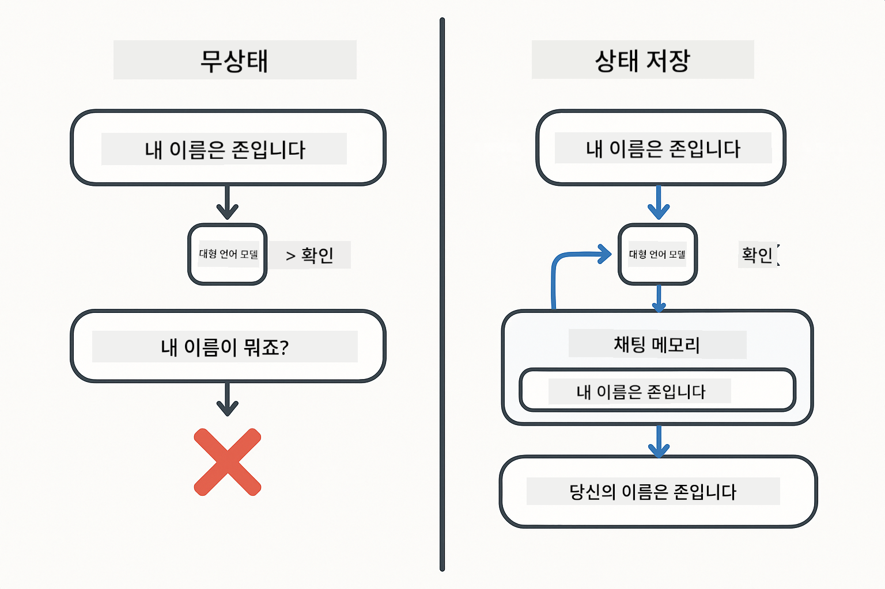
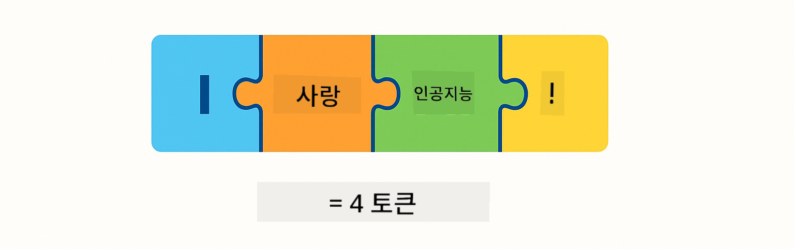
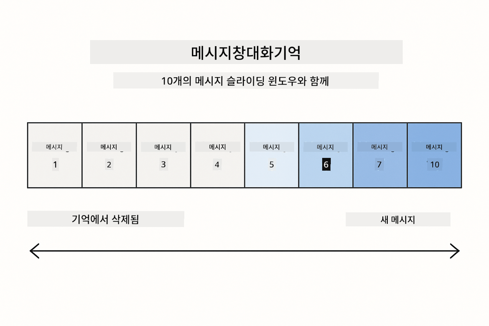
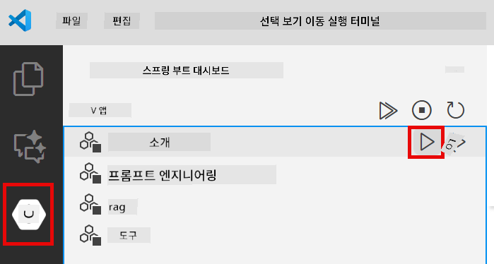
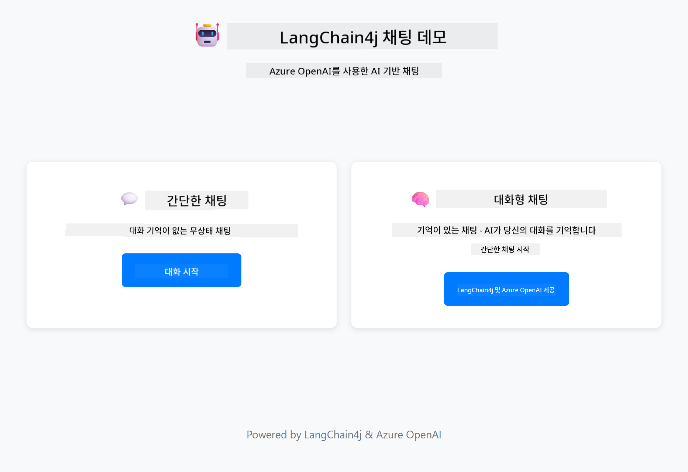
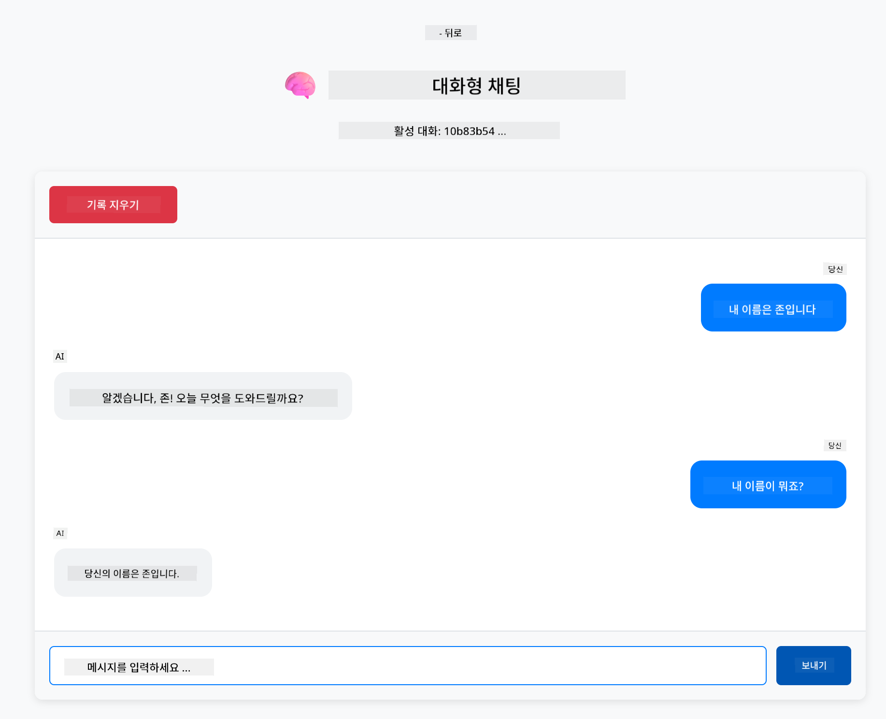

<!--
CO_OP_TRANSLATOR_METADATA:
{
  "original_hash": "c3e07ca58d0b8a3f47d3bf5728541e0a",
  "translation_date": "2025-12-13T13:18:30+00:00",
  "source_file": "01-introduction/README.md",
  "language_code": "ko"
}
-->
# Module 01: LangChain4j 시작하기

## 목차

- [학습 내용](../../../01-introduction)
- [필수 조건](../../../01-introduction)
- [핵심 문제 이해하기](../../../01-introduction)
- [토큰 이해하기](../../../01-introduction)
- [메모리 작동 방식](../../../01-introduction)
- [LangChain4j 사용 방법](../../../01-introduction)
- [Azure OpenAI 인프라 배포](../../../01-introduction)
- [애플리케이션 로컬 실행](../../../01-introduction)
- [애플리케이션 사용법](../../../01-introduction)
  - [무상태 채팅 (왼쪽 패널)](../../../01-introduction)
  - [상태 유지 채팅 (오른쪽 패널)](../../../01-introduction)
- [다음 단계](../../../01-introduction)

## 학습 내용

빠른 시작을 완료했다면, 프롬프트를 보내고 응답을 받는 방법을 보셨을 것입니다. 이것이 기본이지만, 실제 애플리케이션은 더 많은 것이 필요합니다. 이 모듈에서는 컨텍스트를 기억하고 상태를 유지하는 대화형 AI를 구축하는 방법을 배웁니다. 이는 단발성 데모와 프로덕션 준비 애플리케이션의 차이입니다.

이 가이드 전반에 걸쳐 Azure OpenAI의 GPT-5를 사용할 것입니다. 고급 추론 기능 덕분에 다양한 패턴의 동작 차이가 더 명확해집니다. 메모리를 추가하면 차이를 분명히 볼 수 있습니다. 이는 각 구성 요소가 애플리케이션에 무엇을 제공하는지 이해하기 쉽게 만듭니다.

두 가지 패턴을 모두 보여주는 애플리케이션을 하나 구축할 것입니다:

**무상태 채팅** - 각 요청은 독립적입니다. 모델은 이전 메시지를 기억하지 않습니다. 빠른 시작에서 사용한 패턴입니다.

**상태 유지 대화** - 각 요청에 대화 기록이 포함됩니다. 모델은 여러 턴에 걸쳐 컨텍스트를 유지합니다. 프로덕션 애플리케이션에 필요한 방식입니다.

## 필수 조건

- Azure OpenAI 액세스가 포함된 Azure 구독
- Java 21, Maven 3.9+
- Azure CLI (https://learn.microsoft.com/en-us/cli/azure/install-azure-cli)
- Azure Developer CLI (azd) (https://learn.microsoft.com/en-us/azure/developer/azure-developer-cli/install-azd)

> **참고:** Java, Maven, Azure CLI 및 Azure Developer CLI(azd)는 제공된 devcontainer에 미리 설치되어 있습니다.

> **참고:** 이 모듈은 Azure OpenAI에서 GPT-5를 사용합니다. 배포는 `azd up`을 통해 자동으로 구성되므로 코드 내 모델 이름을 변경하지 마십시오.

## 핵심 문제 이해하기

언어 모델은 무상태입니다. 각 API 호출은 독립적입니다. "내 이름은 John입니다"라고 보내고 나서 "내 이름이 뭐죠?"라고 물으면, 모델은 방금 자신을 소개했다는 사실을 알지 못합니다. 모든 요청을 처음 하는 대화인 것처럼 처리합니다.

이는 간단한 Q&A에는 괜찮지만 실제 애플리케이션에는 쓸모가 없습니다. 고객 서비스 봇은 사용자가 말한 내용을 기억해야 합니다. 개인 비서는 컨텍스트가 필요합니다. 다중 턴 대화는 메모리가 필요합니다.



*무상태(독립 호출)와 상태 유지(컨텍스트 인식) 대화의 차이*

## 토큰 이해하기

대화에 들어가기 전에 토큰을 이해하는 것이 중요합니다. 토큰은 언어 모델이 처리하는 텍스트의 기본 단위입니다:



*텍스트가 토큰으로 분해되는 예 - "I love AI!"는 4개의 별도 처리 단위가 됩니다*

토큰은 AI 모델이 텍스트를 측정하고 처리하는 방법입니다. 단어, 구두점, 심지어 공백도 토큰이 될 수 있습니다. 모델은 한 번에 처리할 수 있는 토큰 수에 제한이 있습니다(GPT-5는 최대 400,000 토큰, 입력 토큰 최대 272,000, 출력 토큰 최대 128,000). 토큰을 이해하면 대화 길이와 비용을 관리하는 데 도움이 됩니다.

## 메모리 작동 방식

채팅 메모리는 대화 기록을 유지하여 무상태 문제를 해결합니다. 모델에 요청을 보내기 전에 프레임워크가 관련 이전 메시지를 앞에 붙입니다. "내 이름이 뭐죠?"라고 물으면 시스템은 실제로 전체 대화 기록을 보내 모델이 이전에 "내 이름은 John입니다"라고 말한 것을 볼 수 있게 합니다.

LangChain4j는 이를 자동으로 처리하는 메모리 구현체를 제공합니다. 유지할 메시지 수를 선택하면 프레임워크가 컨텍스트 창을 관리합니다.



*MessageWindowChatMemory는 최근 메시지의 슬라이딩 윈도우를 유지하며 오래된 메시지는 자동으로 삭제*

## LangChain4j 사용 방법

이 모듈은 빠른 시작을 확장하여 Spring Boot와 대화 메모리를 통합합니다. 구성 요소가 어떻게 맞물리는지 설명합니다:

**종속성** - 두 개의 LangChain4j 라이브러리를 추가합니다:

```xml
<dependency>
    <groupId>dev.langchain4j</groupId>
    <artifactId>langchain4j</artifactId> <!-- Inherited from BOM in root pom.xml -->
</dependency>
<dependency>
    <groupId>dev.langchain4j</groupId>
    <artifactId>langchain4j-open-ai-official</artifactId> <!-- Inherited from BOM in root pom.xml -->
</dependency>
```

**채팅 모델** - Azure OpenAI를 Spring 빈으로 구성 ([LangChainConfig.java](../../../01-introduction/src/main/java/com/example/langchain4j/config/LangChainConfig.java)):

```java
@Bean
public OpenAiOfficialChatModel openAiOfficialChatModel() {
    return OpenAiOfficialChatModel.builder()
            .baseUrl(azureEndpoint)
            .apiKey(azureApiKey)
            .modelName(deploymentName)
            .timeout(Duration.ofMinutes(5))
            .maxRetries(3)
            .build();
}
```

빌더는 `azd up`으로 설정된 환경 변수에서 자격 증명을 읽습니다. `baseUrl`을 Azure 엔드포인트로 설정하면 OpenAI 클라이언트가 Azure OpenAI와 작동합니다.

**대화 메모리** - MessageWindowChatMemory로 채팅 기록 추적 ([ConversationService.java](../../../01-introduction/src/main/java/com/example/langchain4j/service/ConversationService.java)):

```java
ChatMemory memory = MessageWindowChatMemory.withMaxMessages(10);

memory.add(UserMessage.from("My name is John"));
memory.add(AiMessage.from("Nice to meet you, John!"));

memory.add(UserMessage.from("What's my name?"));
AiMessage aiMessage = chatModel.chat(memory.messages()).aiMessage();
memory.add(aiMessage);
```

`withMaxMessages(10)`으로 메모리를 생성해 최근 10개 메시지를 유지합니다. 사용자 및 AI 메시지는 `UserMessage.from(text)`와 `AiMessage.from(text)`로 래핑하여 추가합니다. `memory.messages()`로 기록을 가져와 모델에 보냅니다. 서비스는 대화 ID별로 별도의 메모리 인스턴스를 저장해 여러 사용자가 동시에 채팅할 수 있습니다.

> **🤖 GitHub Copilot 채팅으로 시도해 보세요:** [`ConversationService.java`](../../../01-introduction/src/main/java/com/example/langchain4j/service/ConversationService.java)를 열고 다음을 물어보세요:
> - "MessageWindowChatMemory가 윈도우가 가득 찼을 때 어떤 메시지를 삭제하는지 어떻게 결정하나요?"
> - "인메모리 대신 데이터베이스를 사용해 커스텀 메모리 저장소를 구현할 수 있나요?"
> - "오래된 대화 기록을 압축하는 요약 기능을 어떻게 추가하나요?"

무상태 채팅 엔드포인트는 메모리를 전혀 사용하지 않고 빠른 시작과 같이 `chatModel.chat(prompt)`만 호출합니다. 상태 유지 엔드포인트는 메시지를 메모리에 추가하고 기록을 가져와 각 요청에 컨텍스트로 포함합니다. 같은 모델 구성, 다른 패턴입니다.

## Azure OpenAI 인프라 배포

**Bash:**
```bash
cd 01-introduction
azd up  # 구독 및 위치 선택 (eastus2 권장)
```

**PowerShell:**
```powershell
cd 01-introduction
azd up  # 구독 및 위치 선택 (eastus2 권장)
```

> **참고:** 타임아웃 오류(`RequestConflict: Cannot modify resource ... provisioning state is not terminal`)가 발생하면 `azd up`을 다시 실행하세요. Azure 리소스가 백그라운드에서 아직 프로비저닝 중일 수 있으며, 재시도하면 리소스가 최종 상태에 도달했을 때 배포가 완료됩니다.

이 작업은 다음을 수행합니다:
1. GPT-5 및 text-embedding-3-small 모델이 포함된 Azure OpenAI 리소스 배포
2. 프로젝트 루트에 자격 증명이 포함된 `.env` 파일 자동 생성
3. 필요한 모든 환경 변수 설정

**배포 문제 발생 시?** [인프라 README](infra/README.md)를 참조하세요. 서브도메인 이름 충돌, 수동 Azure 포털 배포 단계, 모델 구성 안내 등 자세한 문제 해결 방법이 있습니다.

**배포 성공 여부 확인:**

**Bash:**
```bash
cat ../.env  # AZURE_OPENAI_ENDPOINT, API_KEY 등을 보여야 합니다.
```

**PowerShell:**
```powershell
Get-Content ..\.env  # AZURE_OPENAI_ENDPOINT, API_KEY 등을 보여야 합니다.
```

> **참고:** `azd up` 명령은 `.env` 파일을 자동으로 생성합니다. 나중에 업데이트가 필요하면 `.env` 파일을 수동으로 편집하거나 다음 명령으로 다시 생성할 수 있습니다:
>
> **Bash:**
> ```bash
> cd ..
> bash .azd-env.sh
> ```
>
> **PowerShell:**
> ```powershell
> cd ..
> .\.azd-env.ps1
> ```

## 애플리케이션 로컬 실행

**배포 확인:**

루트 디렉터리에 Azure 자격 증명이 포함된 `.env` 파일이 있는지 확인하세요:

**Bash:**
```bash
cat ../.env  # AZURE_OPENAI_ENDPOINT, API_KEY, DEPLOYMENT를 표시해야 합니다
```

**PowerShell:**
```powershell
Get-Content ..\.env  # AZURE_OPENAI_ENDPOINT, API_KEY, DEPLOYMENT를 표시해야 합니다
```

**애플리케이션 시작:**

**옵션 1: Spring Boot 대시보드 사용 (VS Code 사용자 권장)**

devcontainer에는 Spring Boot 대시보드 확장 기능이 포함되어 있어 모든 Spring Boot 애플리케이션을 시각적으로 관리할 수 있습니다. VS Code 왼쪽의 활동 표시줄에서 Spring Boot 아이콘을 찾으세요.

Spring Boot 대시보드에서:
- 작업 공간 내 모든 Spring Boot 애플리케이션 확인
- 클릭 한 번으로 애플리케이션 시작/중지
- 실시간 애플리케이션 로그 보기
- 애플리케이션 상태 모니터링

"introduction" 옆의 재생 버튼을 클릭해 이 모듈을 시작하거나 모든 모듈을 한 번에 시작할 수 있습니다.



**옵션 2: 셸 스크립트 사용**

모든 웹 애플리케이션(모듈 01-04) 시작:

**Bash:**
```bash
cd ..  # 루트 디렉토리에서
./start-all.sh
```

**PowerShell:**
```powershell
cd ..  # 루트 디렉토리에서
.\start-all.ps1
```

또는 이 모듈만 시작:

**Bash:**
```bash
cd 01-introduction
./start.sh
```

**PowerShell:**
```powershell
cd 01-introduction
.\start.ps1
```

두 스크립트 모두 루트 `.env` 파일에서 환경 변수를 자동으로 로드하며, JAR 파일이 없으면 빌드합니다.

> **참고:** 시작 전에 모든 모듈을 수동으로 빌드하려면:
>
> **Bash:**
> ```bash
> cd ..  # Go to root directory
> mvn clean package -DskipTests
> ```
>
> **PowerShell:**
> ```powershell
> cd ..  # Go to root directory
> mvn clean package -DskipTests
> ```

브라우저에서 http://localhost:8080 을 엽니다.

**중지하려면:**

**Bash:**
```bash
./stop.sh  # 이 모듈만
# 또는
cd .. && ./stop-all.sh  # 모든 모듈
```

**PowerShell:**
```powershell
.\stop.ps1  # 이 모듈만
# 또는
cd ..; .\stop-all.ps1  # 모든 모듈
```

## 애플리케이션 사용법

애플리케이션은 두 가지 채팅 구현을 나란히 제공하는 웹 인터페이스를 제공합니다.



*무상태 간단 채팅과 상태 유지 대화형 채팅 옵션을 보여주는 대시보드*

### 무상태 채팅 (왼쪽 패널)

먼저 이것을 시도해 보세요. "내 이름은 John입니다"라고 말한 후 바로 "내 이름이 뭐죠?"라고 물어보세요. 모델은 기억하지 못합니다. 각 메시지가 독립적이기 때문입니다. 이는 기본 언어 모델 통합의 핵심 문제인 대화 컨텍스트 부재를 보여줍니다.


*AI가 이전 메시지에서 이름을 기억하지 못함*

### 상태 유지 채팅 (오른쪽 패널)

이제 같은 순서를 여기서 시도해 보세요. "내 이름은 John입니다"라고 말한 후 "내 이름이 뭐죠?"라고 물으면 이번에는 기억합니다. 차이는 MessageWindowChatMemory에 있습니다. 대화 기록을 유지하고 각 요청에 포함시키기 때문입니다. 이것이 프로덕션 대화형 AI가 작동하는 방식입니다.



*AI가 대화 초반에 말한 이름을 기억함*

두 패널 모두 같은 GPT-5 모델을 사용합니다. 유일한 차이는 메모리입니다. 이를 통해 메모리가 애플리케이션에 무엇을 제공하는지, 그리고 실제 사용 사례에 왜 필수적인지 명확히 알 수 있습니다.

## 다음 단계

**다음 모듈:** [02-prompt-engineering - GPT-5를 활용한 프롬프트 엔지니어링](../02-prompt-engineering/README.md)

---

**네비게이션:** [← 이전: Module 00 - 빠른 시작](../00-quick-start/README.md) | [메인으로 돌아가기](../README.md) | [다음: Module 02 - 프롬프트 엔지니어링 →](../02-prompt-engineering/README.md)

---

<!-- CO-OP TRANSLATOR DISCLAIMER START -->
**면책 조항**:  
이 문서는 AI 번역 서비스 [Co-op Translator](https://github.com/Azure/co-op-translator)를 사용하여 번역되었습니다. 정확성을 위해 최선을 다하고 있으나, 자동 번역에는 오류나 부정확성이 포함될 수 있음을 유의하시기 바랍니다. 원문 문서는 권위 있는 출처로 간주되어야 합니다. 중요한 정보의 경우 전문적인 인간 번역을 권장합니다. 본 번역 사용으로 인한 오해나 잘못된 해석에 대해 당사는 책임을 지지 않습니다.
<!-- CO-OP TRANSLATOR DISCLAIMER END -->