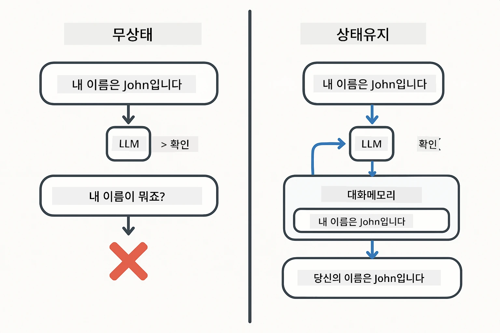
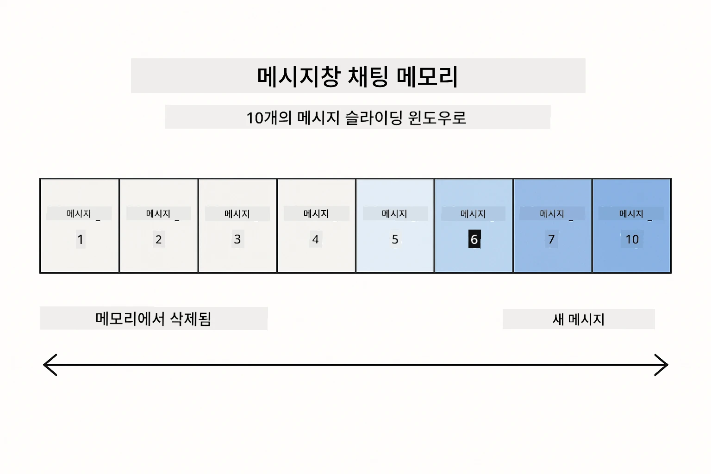
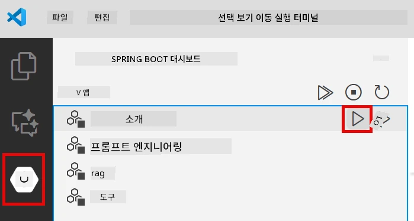
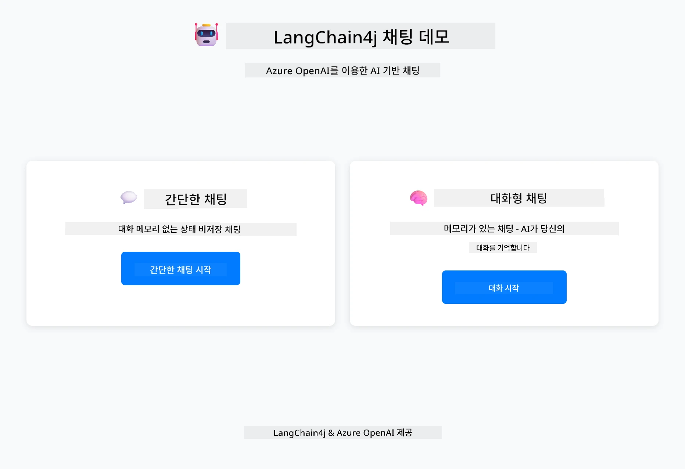
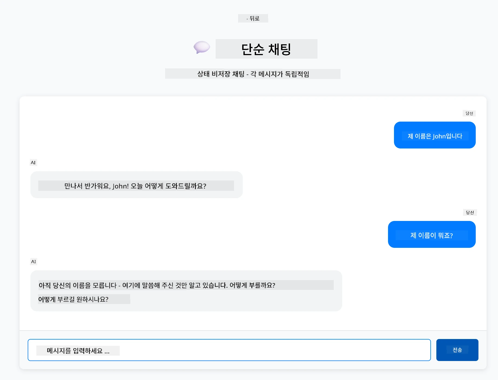
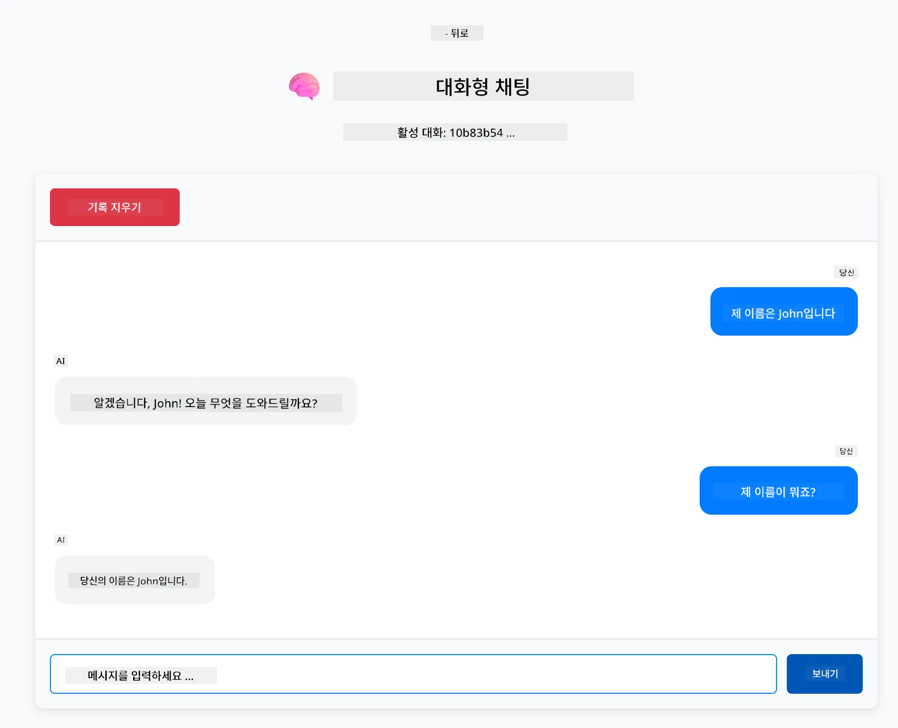

# Module 01: LangChain4j 시작하기

## 목차

- [비디오 안내](#비디오-안내)
- [학습 내용](#학습-내용)
- [필수 조건](#필수-조건)
- [핵심 문제 이해하기](#핵심-문제-이해하기)
- [토큰 이해하기](#토큰-이해하기)
- [메모리 작동 원리](#메모리-작동-원리)
- [LangChain4j 사용 방법](#langchain4j-사용-방법)
- [Azure OpenAI 인프라 배포하기](#azure-openai-인프라-배포하기)
- [애플리케이션 로컬 실행하기](#애플리케이션-로컬-실행하기)
- [애플리케이션 사용법](#애플리케이션-사용법)
  - [상태 비저장 대화 (왼쪽 패널)](#상태-비저장-대화-왼쪽-패널)
  - [상태 저장 대화 (오른쪽 패널)](#상태-저장-대화-오른쪽-패널)
- [다음 단계](#다음-단계)

## 비디오 안내

이 모듈 시작 방법을 설명하는 라이브 세션을 시청하세요:

<a href="https://www.youtube.com/live/nl_troDm8rQ?si=6b85S8xGjWnT2fX9"></a>

## 학습 내용

이것은 LangChain4j와 Azure OpenAI의 출발점입니다. 기본부터 시작하여 프로덕션 스타일 애플리케이션을 구축합니다. 이 모듈은 컨텍스트를 기억하고 상태를 유지하는 대화형 AI에 집중하며, 이후 모든 모듈의 기초가 되는 개념입니다.

이 가이드 전체에서 Azure OpenAI의 GPT-5.2를 사용할 것입니다. 이 모델은 고급 추론 능력이 있어 다양한 패턴의 동작 차이가 더 명확하게 드러납니다. 메모리를 추가하면 차이를 분명히 알 수 있습니다. 따라서 각 구성 요소가 애플리케이션에 어떤 기여를 하는지 이해하기 쉽습니다.

두 가지 패턴을 모두 보여주는 하나의 애플리케이션을 만들 것입니다:

**상태 비저장 대화** - 각 요청이 독립적입니다. 모델은 이전 메시지를 기억하지 않습니다. 가장 단순한 시작점입니다.

**상태 저장 대화** - 각 요청에 대화 기록이 포함됩니다. 모델이 다중 턴 동안 컨텍스트를 유지합니다. 프로덕션 애플리케이션에 필요한 방식입니다.

## 필수 조건

- Azure 구독 및 Azure OpenAI 접근 권한
- Java 21, Maven 3.9+
- Azure CLI (https://learn.microsoft.com/en-us/cli/azure/install-azure-cli)
- Azure Developer CLI (azd) (https://learn.microsoft.com/en-us/azure/developer/azure-developer-cli/install-azd)

> **참고:** 제공된 개발 컨테이너에는 Java, Maven, Azure CLI 및 Azure Developer CLI(azd)가 미리 설치되어 있습니다.

> **참고:** 이 모듈은 Azure OpenAI에서 GPT-5.2를 사용합니다. 배포는 `azd up` 명령으로 자동 구성되므로 코드 내 모델 이름을 변경하지 마세요.

## 핵심 문제 이해하기

언어 모델은 상태 비저장입니다. 각 API 호출은 독립적입니다. 예를 들어 "내 이름은 John입니다"라고 입력한 후 "내 이름이 뭐지?"라고 물으면, 모델은 방금 자신을 소개한 것을 알지 못합니다. 매 요청을 처음 대화라고 간주합니다.

간단한 Q&A에는 괜찮지만 실제 애플리케이션에는 무용지물입니다. 고객 지원 봇은 당신이 말한 것을 기억해야 하고, 개인 비서는 컨텍스트가 필요합니다. 다중 턴 대화는 메모리가 필요합니다.

다음 다이어그램은 두 가지 접근법을 대비합니다 — 왼쪽은 이름을 잊어버리는 상태 비저장 호출, 오른쪽은 ChatMemory가 백업하여 기억하는 상태 저장 호출입니다.



*상태 비저장(독립 호출)과 상태 저장(컨텍스트 인지) 대화의 차이*

## 토큰 이해하기

대화에 들어가기 전에 토큰을 이해하는 것이 중요합니다 - 언어 모델이 처리하는 텍스트의 기본 단위입니다:


*텍스트가 토큰으로 분리되는 예 - "I love AI!"는 4개의 별도 처리 단위로 나뉩니다*

토큰은 AI 모델이 텍스트를 측정하고 처리하는 방법입니다. 단어, 구두점, 심지어 공백도 토큰이 될 수 있습니다. 모델마다 한 번에 처리 가능한 토큰 수 제한이 있습니다(GPT-5.2는 최대 400,000 토큰, 입력 272,000 토큰 및 출력 128,000 토큰). 토큰 이해는 대화 길이와 비용 관리에 도움이 됩니다.

## 메모리 작동 원리

채팅 메모리는 상태 비저장 문제를 대화 기록을 유지함으로써 해결합니다. 모델에 요청을 보내기 전에 프레임워크가 관련 이전 메시지를 앞에 붙입니다. "내 이름이 뭐지?"라고 물을 때 시스템은 실제로 전체 대화 기록을 보내 모델이 "내 이름은 John입니다"라고 이전에 말한 것을 알 수 있게 합니다.

LangChain4j는 이를 자동으로 처리하는 메모리 구현체를 제공합니다. 유지할 메시지 수를 선택하면 프레임워크가 컨텍스트 창을 관리합니다. 아래 다이어그램은 MessageWindowChatMemory가 최근 메시지의 슬라이딩 윈도우를 유지하는 방식을 보여줍니다.



*MessageWindowChatMemory는 최근 메시지의 슬라이딩 윈도우를 유지하며 오래된 메시지는 자동으로 삭제*

## LangChain4j 사용 방법

이 모듈은 Spring Boot와 통합되어 대화 메모리를 추가합니다. 구성요소는 다음과 같이 연결됩니다:

<strong>종속성</strong> - 두 개의 LangChain4j 라이브러리를 추가:

```xml
<dependency>
    <groupId>dev.langchain4j</groupId>
    <artifactId>langchain4j</artifactId> <!-- Inherited from BOM in root pom.xml -->
</dependency>
<dependency>
    <groupId>dev.langchain4j</groupId>
    <artifactId>langchain4j-open-ai-official</artifactId> <!-- Inherited from BOM in root pom.xml -->
</dependency>
```

**채팅 모델** - Azure OpenAI를 Spring 빈으로 구성 ([LangChainConfig.java](../../../01-introduction/src/main/java/com/example/langchain4j/config/LangChainConfig.java)):

```java
@Bean
public OpenAiOfficialChatModel openAiOfficialChatModel() {
    return OpenAiOfficialChatModel.builder()
            .baseUrl(azureEndpoint)
            .apiKey(azureApiKey)
            .modelName(deploymentName)
            .timeout(Duration.ofMinutes(5))
            .maxRetries(3)
            .build();
}
```

빌더는 `azd up`로 설정된 환경 변수에서 자격 증명을 읽습니다. `baseUrl`을 Azure 엔드포인트로 설정하면 OpenAI 클라이언트가 Azure OpenAI와 연결됩니다.

**대화 메모리** - MessageWindowChatMemory로 대화 기록 추적 ([ConversationService.java](../../../01-introduction/src/main/java/com/example/langchain4j/service/ConversationService.java)):

```java
ChatMemory memory = MessageWindowChatMemory.withMaxMessages(10);

memory.add(UserMessage.from("My name is John"));
memory.add(AiMessage.from("Nice to meet you, John!"));

memory.add(UserMessage.from("What's my name?"));
AiMessage aiMessage = chatModel.chat(memory.messages()).aiMessage();
memory.add(aiMessage);
```

`withMaxMessages(10)`로 마지막 10개의 메시지를 유지하는 메모리를 생성합니다. 사용자 메시지와 AI 메시지는 각각 `UserMessage.from(text)`와 `AiMessage.from(text)`로 래핑합니다. `memory.messages()`로 기록을 조회해 모델에 보냅니다. 서비스는 각 대화 ID별로 별도의 메모리 인스턴스를 저장해 여러 사용자가 동시에 대화할 수 있도록 합니다.

> **🤖 GitHub Copilot 채팅으로 시도해보세요:** [`ConversationService.java`](../../../01-introduction/src/main/java/com/example/langchain4j/service/ConversationService.java)를 열고 물어보세요:
> - "MessageWindowChatMemory가 윈도우가 가득 찼을 때 어떤 메시지를 삭제할지 어떻게 결정하나요?"
> - "메모리를 메모리 대신 데이터베이스를 사용해 커스텀으로 구현할 수 있나요?"
> - "오래된 대화 기록을 압축하기 위한 요약 기능을 어떻게 추가할 수 있나요?"

상태 비저장 채팅 엔드포인트는 메모리를 전혀 사용하지 않고 `chatModel.chat(prompt)`를 호출합니다. 상태 저장 엔드포인트는 메시지를 메모리에 추가하고 기록을 불러와 각 요청에 컨텍스트로 포함합니다. 동일한 모델 구성, 다른 패턴입니다.

## Azure OpenAI 인프라 배포하기

**Bash:**
```bash
cd 01-introduction
azd up  # 구독 및 위치 선택 (eastus2 권장)
```

**PowerShell:**
```powershell
cd 01-introduction
azd up  # 구독 및 위치 선택 (eastus2 권장)
```

> **참고:** 만약 `RequestConflict: Cannot modify resource ... provisioning state is not terminal`과 같은 타임아웃 오류가 발생하면, 단순히 `azd up`를 다시 실행하세요. Azure 리소스가 아직 프로비저닝 중일 수 있으며, 재시도하여 리소스가 완료 상태에 도달하면 배포가 완료됩니다.

다음 작업이 수행됩니다:
1. GPT-5.2와 text-embedding-3-small 모델이 포함된 Azure OpenAI 리소스 배포
2. 자격 증명이 포함된 `.env` 파일을 프로젝트 루트에 자동 생성
3. 필요한 모든 환경 변수 설정

**배포에 문제가 있나요?** 하위 도메인 이름 충돌, 수동 Azure Portal 배포 단계, 모델 구성 가이드 등 자세한 문제 해결은 [인프라 README](infra/README.md)를 참조하세요.

**배포 성공 여부 확인:**

**Bash:**
```bash
cat ../.env  # AZURE_OPENAI_ENDPOINT, API_KEY 등을 표시해야 합니다.
```

**PowerShell:**
```powershell
Get-Content ..\.env  # AZURE_OPENAI_ENDPOINT, API_KEY 등을 표시해야 합니다.
```

> **참고:** `azd up` 명령은 `.env` 파일을 자동 생성합니다. 나중에 업데이트가 필요하면 `.env` 파일을 직접 수정하거나 다음 명령어를 실행해 재생성할 수 있습니다:
>
> **Bash:**
> ```bash
> cd ..
> bash .azd-env.sh
> ```
>
> **PowerShell:**
> ```powershell
> cd ..
> .\.azd-env.ps1
> ```

## 애플리케이션 로컬 실행하기

**배포 확인:**

`.env` 파일이 루트 디렉터리에 Azure 자격 증명과 함께 존재하는지 확인하세요. 모듈 디렉터리(`01-introduction/`)에서 다음을 실행합니다:

**Bash:**
```bash
cat ../.env  # AZURE_OPENAI_ENDPOINT, API_KEY, DEPLOYMENT를 보여줘야 합니다
```

**PowerShell:**
```powershell
Get-Content ..\.env  # AZURE_OPENAI_ENDPOINT, API_KEY, DEPLOYMENT를 표시해야 합니다
```

**애플리케이션 시작:**

**옵션 1: Spring Boot 대시보드 사용 (VS Code 사용자를 위한 권장 방법)**

개발 컨테이너는 Spring Boot 대시보드 확장 기능을 포함하며, 이를 통해 모든 Spring Boot 애플리케이션을 시각적으로 관리할 수 있습니다. VS Code 왼쪽 활동 표시줄에서 Spring Boot 아이콘을 찾으세요.

Spring Boot 대시보드를 사용하여:
- 작업 공간 내 모든 Spring Boot 애플리케이션 확인
- 애플리케이션을 클릭 한 번으로 시작/중지
- 실시간 애플리케이션 로그 보기
- 애플리케이션 상태 모니터링

`introduction` 옆의 재생 버튼을 클릭해 이 모듈을 시작하거나, 모든 모듈을 한 번에 시작할 수 있습니다.



*VS Code 내의 Spring Boot 대시보드 — 한 곳에서 모든 모듈 시작, 중지 및 모니터링*

**옵션 2: 셸 스크립트 사용**

모든 웹 애플리케이션 (모듈 01-04) 시작:

**Bash:**
```bash
cd ..  # 루트 디렉토리에서
./start-all.sh
```

**PowerShell:**
```powershell
cd ..  # 루트 디렉터리에서
.\start-all.ps1
```

또는 이 모듈만 시작:

**Bash:**
```bash
cd 01-introduction
./start.sh
```

**PowerShell:**
```powershell
cd 01-introduction
.\start.ps1
```

두 스크립트는 루트 `.env` 파일에서 환경 변수를 자동으로 로드하며, JAR 파일이 없으면 빌드합니다.

> **참고:** 시작 전에 수동으로 모든 모듈을 빌드하려면:
>
> **Bash:**
> ```bash
> cd ..  # Go to root directory
> mvn clean package -DskipTests
> ```
>
> **PowerShell:**
> ```powershell
> cd ..  # Go to root directory
> mvn clean package -DskipTests
> ```

브라우저에서 http://localhost:8080 을 엽니다.

**중지하려면:**

**Bash:**
```bash
./stop.sh  # 이 모듈만
# 또는
cd .. && ./stop-all.sh  # 모든 모듈
```

**PowerShell:**
```powershell
.\stop.ps1  # 이 모듈만
# 또는
cd ..; .\stop-all.ps1  # 모든 모듈
```

## 애플리케이션 사용법

애플리케이션은 두 개의 채팅 구현을 나란히 제공하는 웹 인터페이스를 제공합니다.



*간단 채팅(상태 비저장)과 대화형 채팅(상태 저장) 옵션을 모두 보여주는 대시보드*

### 상태 비저장 대화 (왼쪽 패널)

먼저 이것을 시도해보세요. "내 이름은 John입니다"라고 물어본 다음 바로 "내 이름이 뭐야?"라고 질문하세요. 모델은 기억하지 못합니다. 각 메시지가 독립적이기 때문입니다. 이것이 기본 언어 모델 통합의 핵심 문제 — 대화 컨텍스트가 없다는 점 — 를 보여줍니다.



*AI는 이전 메시지에서 이름을 기억하지 못함*

### 상태 저장 대화 (오른쪽 패널)

이제 같은 질문을 여기서 해보세요. "내 이름은 John입니다"라고 말한 후 "내 이름이 뭐야?"라고 질문하면 이번에는 기억합니다. 차이점은 MessageWindowChatMemory 덕분입니다 — 대화 기록을 유지하며 각 요청에 포함시킵니다. 이것이 프로덕션 대화형 AI의 작동 방식입니다.



*AI는 대화 초반에 말한 이름을 기억함*

두 패널 모두 동일한 GPT-5.2 모델을 사용합니다. 유일한 차이점은 메모리입니다. 이를 통해 메모리가 애플리케이션에 어떤 가치를 주는지, 실제 사용 사례에 왜 필수적인지 명확히 알 수 있습니다.

## 다음 단계

**다음 모듈:** [02-prompt-engineering - GPT-5.2와 함께하는 프롬프트 엔지니어링](../02-prompt-engineering/README.md)

---

**내비게이션:** [← 메인으로 돌아가기](../README.md) | [다음: 모듈 02 - 프롬프트 엔지니어링 →](../02-prompt-engineering/README.md)

---

<!-- CO-OP TRANSLATOR DISCLAIMER START -->
**면책 조항**:
이 문서는 AI 번역 서비스 [Co-op Translator](https://github.com/Azure/co-op-translator)를 사용하여 번역되었습니다. 정확성을 기하기 위해 노력하고 있으나, 자동 번역은 오류나 부정확한 부분이 있을 수 있음을 유의하시기 바랍니다. 원본 문서의 원어본이 권위 있는 자료로 간주되어야 합니다. 중요한 정보의 경우, 전문가의 인간 번역을 권장합니다. 이 번역 사용으로 인해 발생하는 오해나 잘못된 해석에 대해 당사는 책임을 지지 않습니다.
<!-- CO-OP TRANSLATOR DISCLAIMER END -->