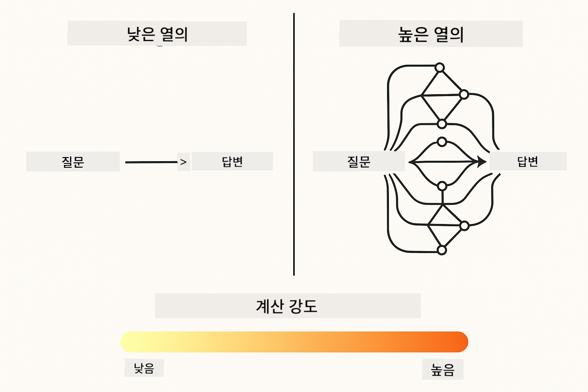
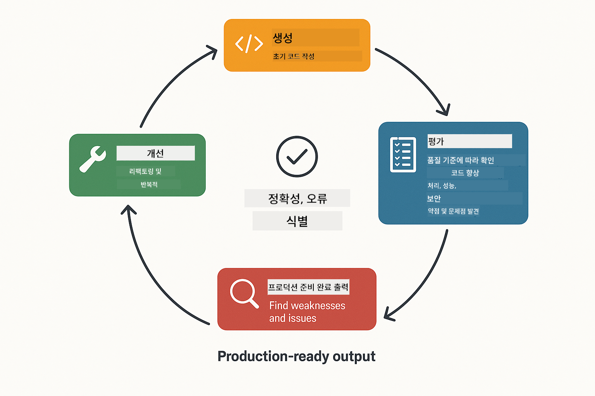
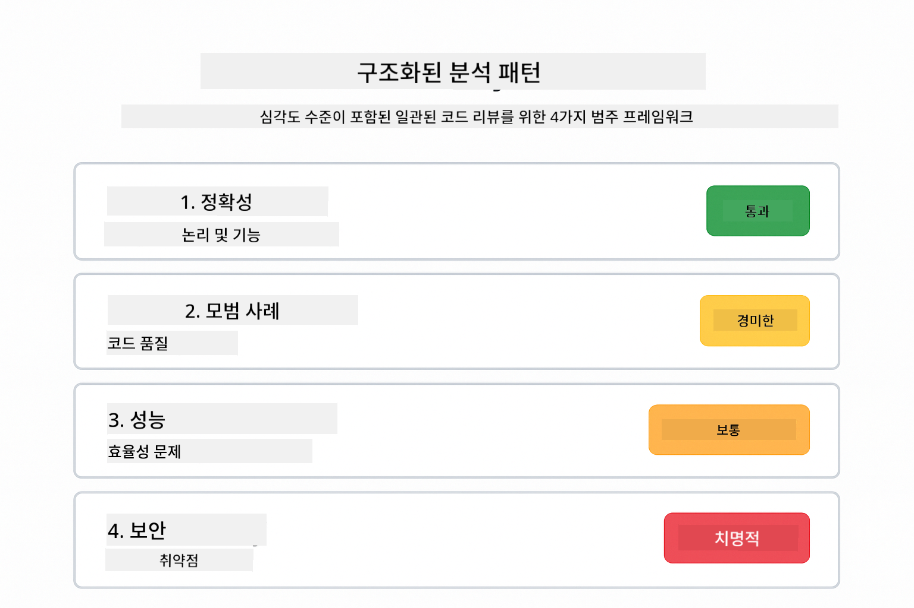
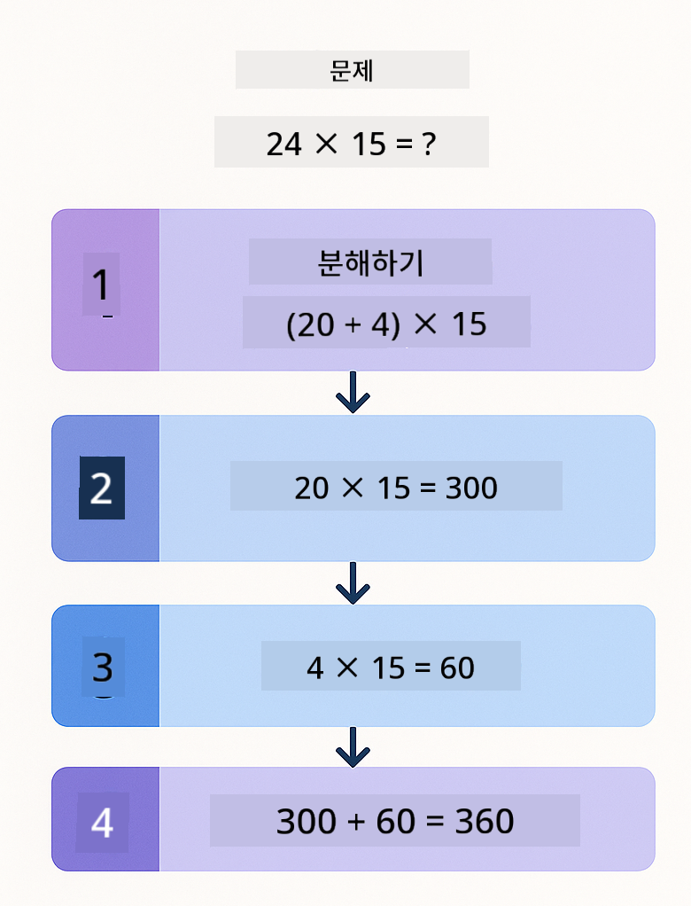
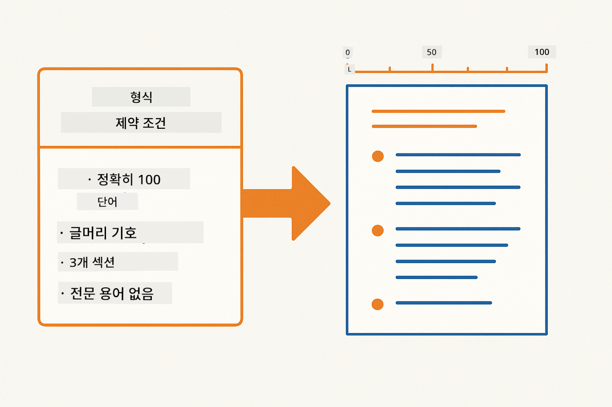
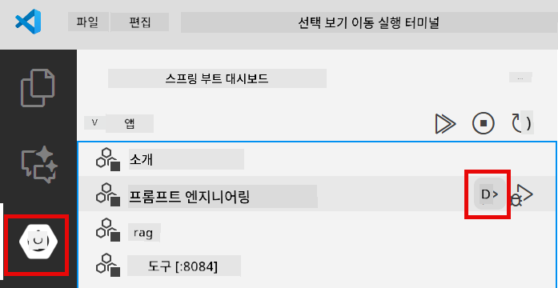
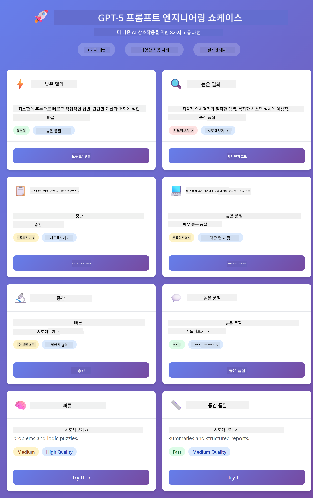
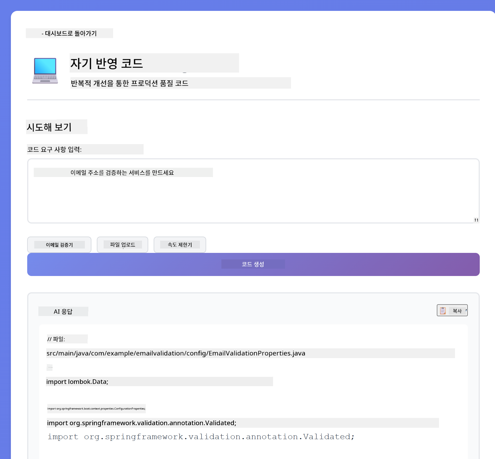
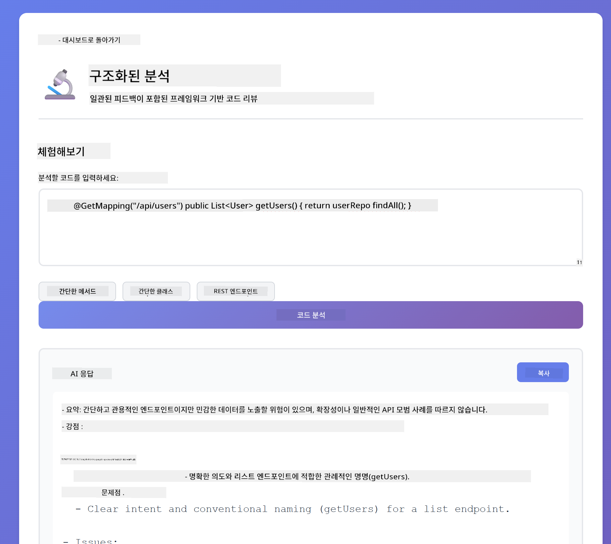
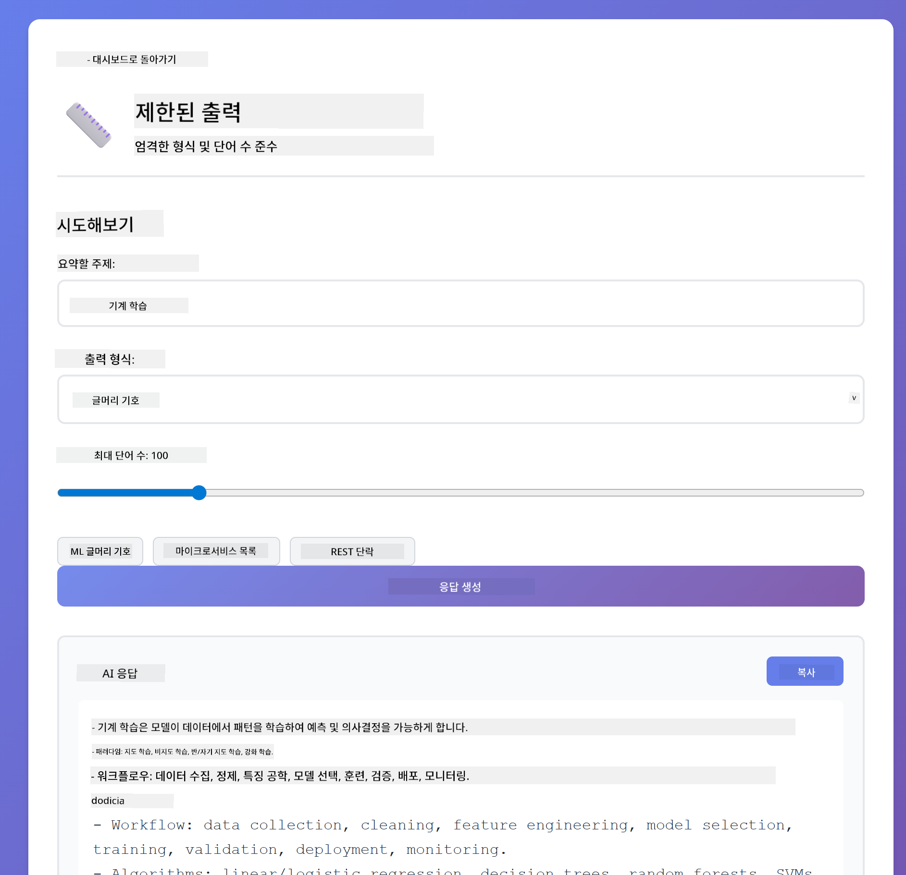

<!--
CO_OP_TRANSLATOR_METADATA:
{
  "original_hash": "8d787826cad7e92bf5cdbd116b1e6116",
  "translation_date": "2025-12-13T15:56:47+00:00",
  "source_file": "02-prompt-engineering/README.md",
  "language_code": "ko"
}
-->
# Module 02: GPT-5를 활용한 프롬프트 엔지니어링

## 목차

- [학습 내용](../../../02-prompt-engineering)
- [사전 준비 사항](../../../02-prompt-engineering)
- [프롬프트 엔지니어링 이해하기](../../../02-prompt-engineering)
- [LangChain4j 활용 방법](../../../02-prompt-engineering)
- [핵심 패턴](../../../02-prompt-engineering)
- [기존 Azure 리소스 사용하기](../../../02-prompt-engineering)
- [애플리케이션 스크린샷](../../../02-prompt-engineering)
- [패턴 탐색하기](../../../02-prompt-engineering)
  - [낮은 열의도 vs 높은 열의도](../../../02-prompt-engineering)
  - [작업 실행 (도구 프리앰블)](../../../02-prompt-engineering)
  - [자기 반영 코드](../../../02-prompt-engineering)
  - [구조화된 분석](../../../02-prompt-engineering)
  - [다중 턴 채팅](../../../02-prompt-engineering)
  - [단계별 추론](../../../02-prompt-engineering)
  - [제한된 출력](../../../02-prompt-engineering)
- [진짜 배우는 것](../../../02-prompt-engineering)
- [다음 단계](../../../02-prompt-engineering)

## 학습 내용

이전 모듈에서는 메모리가 대화형 AI를 어떻게 가능하게 하는지 살펴보고 GitHub 모델을 사용해 기본 상호작용을 경험했습니다. 이제는 질문하는 방법, 즉 프롬프트 자체에 집중합니다. Azure OpenAI의 GPT-5를 사용하여 프롬프트를 구성하는 방식이 응답 품질에 큰 영향을 미칩니다.

GPT-5를 사용하는 이유는 추론 제어 기능이 도입되어 모델에게 답변 전에 얼마나 깊게 생각할지 지시할 수 있기 때문입니다. 이를 통해 다양한 프롬프트 전략이 더 명확해지고 각 접근법을 언제 사용해야 하는지 이해할 수 있습니다. 또한 GPT-5는 GitHub 모델보다 Azure에서 더 적은 속도 제한을 받는 이점도 있습니다.

## 사전 준비 사항

- 모듈 01 완료 (Azure OpenAI 리소스 배포 완료)
- 루트 디렉터리에 Azure 자격 증명이 포함된 `.env` 파일 (모듈 01에서 `azd up`으로 생성됨)

> **참고:** 모듈 01을 완료하지 않았다면 먼저 해당 배포 지침을 따르세요.

## 프롬프트 엔지니어링 이해하기

프롬프트 엔지니어링은 원하는 결과를 일관되게 얻기 위해 입력 텍스트를 설계하는 것입니다. 단순히 질문하는 것이 아니라, 모델이 정확히 무엇을 원하는지, 어떻게 전달할지 이해하도록 요청을 구조화하는 것입니다.

동료에게 지시하는 것과 비슷합니다. "버그를 고쳐"는 모호하지만, "UserService.java 45번째 줄의 널 포인터 예외를 널 체크 추가로 고쳐"는 구체적입니다. 언어 모델도 마찬가지로 구체성과 구조가 중요합니다.

## LangChain4j 활용 방법

이 모듈은 이전 모듈과 동일한 LangChain4j 기반을 사용하면서 프롬프트 구조와 추론 제어에 중점을 둔 고급 프롬프트 패턴을 보여줍니다.


*LangChain4j가 프롬프트를 Azure OpenAI GPT-5에 연결하는 방식*

**종속성** - 모듈 02는 `pom.xml`에 정의된 다음 langchain4j 종속성을 사용합니다:
```xml
<dependency>
    <groupId>dev.langchain4j</groupId>
    <artifactId>langchain4j</artifactId> <!-- Inherited from BOM in root pom.xml -->
</dependency>
<dependency>
    <groupId>dev.langchain4j</groupId>
    <artifactId>langchain4j-open-ai-official</artifactId> <!-- Inherited from BOM in root pom.xml -->
</dependency>
```

**OpenAiOfficialChatModel 구성** - [LangChainConfig.java](../../../02-prompt-engineering/src/main/java/com/example/langchain4j/prompts/config/LangChainConfig.java)

채팅 모델은 Azure OpenAI 엔드포인트를 지원하는 OpenAI 공식 클라이언트를 사용해 스프링 빈으로 수동 구성됩니다. 모듈 01과의 주요 차이점은 모델 설정이 아니라 `chatModel.chat()`에 전달하는 프롬프트 구조입니다.

**시스템 및 사용자 메시지** - [Gpt5PromptService.java](../../../02-prompt-engineering/src/main/java/com/example/langchain4j/prompts/service/Gpt5PromptService.java)

LangChain4j는 명확성을 위해 메시지 유형을 분리합니다. `SystemMessage`는 AI의 동작과 컨텍스트를 설정(예: "당신은 코드 리뷰어입니다")하고, `UserMessage`는 실제 요청을 담습니다. 이 분리는 다양한 사용자 쿼리에서 일관된 AI 동작을 유지할 수 있게 합니다.

```java
SystemMessage systemMsg = SystemMessage.from(
    "You are a helpful Java programming expert."
);

UserMessage userMsg = UserMessage.from(
    "Explain what a List is in Java"
);

String response = chatModel.chat(systemMsg, userMsg);
```


*SystemMessage는 지속적인 컨텍스트를 제공하고 UserMessages는 개별 요청을 포함*

**다중 턴용 MessageWindowChatMemory** - 다중 턴 대화 패턴에서는 모듈 01에서 사용한 `MessageWindowChatMemory`를 재사용합니다. 각 세션은 `Map<String, ChatMemory>`에 저장된 고유 메모리 인스턴스를 가지며, 여러 동시 대화가 컨텍스트 혼합 없이 가능합니다.

**프롬프트 템플릿** - 실제 초점은 프롬프트 엔지니어링에 있으며, 새로운 LangChain4j API가 아닙니다. 각 패턴(낮은 열의도, 높은 열의도, 작업 실행 등)은 동일한 `chatModel.chat(prompt)` 메서드를 사용하지만 신중하게 구조화된 프롬프트 문자열을 사용합니다. XML 태그, 지침, 포맷팅은 모두 프롬프트 텍스트의 일부이며 LangChain4j 기능이 아닙니다.

**추론 제어** - GPT-5의 추론 노력은 "최대 2단계 추론" 또는 "철저히 탐색" 같은 프롬프트 지침으로 제어됩니다. 이는 LangChain4j 설정이 아니라 프롬프트 엔지니어링 기법입니다. 라이브러리는 단순히 프롬프트를 모델에 전달합니다.

핵심 요점: LangChain4j는 인프라(모델 연결 via [LangChainConfig.java](../../../02-prompt-engineering/src/main/java/com/example/langchain4j/prompts/config/LangChainConfig.java), 메모리, 메시지 처리 via [Gpt5PromptService.java](../../../02-prompt-engineering/src/main/java/com/example/langchain4j/prompts/service/Gpt5PromptService.java))를 제공하며, 이 모듈은 그 인프라 내에서 효과적인 프롬프트를 만드는 방법을 가르칩니다.

## 핵심 패턴

모든 문제에 같은 접근법이 필요한 것은 아닙니다. 어떤 질문은 빠른 답변이 필요하고, 어떤 것은 깊은 사고가 필요합니다. 어떤 것은 추론 과정을 보여줘야 하고, 어떤 것은 결과만 필요합니다. 이 모듈은 8가지 프롬프트 패턴을 다루며, 각각 다른 시나리오에 최적화되어 있습니다. 모든 패턴을 실험하며 언제 어떤 접근법이 가장 적합한지 배울 것입니다.


*8가지 프롬프트 엔지니어링 패턴과 사용 사례 개요*



*낮은 열의도(빠르고 직접적) vs 높은 열의도(철저하고 탐색적) 추론 접근법 비교*

**낮은 열의도 (빠르고 집중적)** - 빠르고 직접적인 답변이 필요한 간단한 질문에 적합합니다. 모델은 최소한의 추론만 수행하며 최대 2단계까지 합니다. 계산, 조회, 단순 질문에 사용하세요.

```java
String prompt = """
    <reasoning_effort>low</reasoning_effort>
    <instruction>maximum 2 reasoning steps</instruction>
    
    What is 15% of 200?
    """;

String response = chatModel.chat(prompt);
```

> 💡 **GitHub Copilot으로 탐색하기:** [`Gpt5PromptService.java`](../../../02-prompt-engineering/src/main/java/com/example/langchain4j/prompts/service/Gpt5PromptService.java)를 열고 다음을 물어보세요:
> - "낮은 열의도와 높은 열의도 프롬프트 패턴의 차이점은 무엇인가요?"
> - "프롬프트 내 XML 태그가 AI 응답 구조화에 어떻게 도움이 되나요?"
> - "자기 반영 패턴과 직접 지시 패턴은 언제 사용해야 하나요?"

**높은 열의도 (깊고 철저함)** - 복잡한 문제에 대해 포괄적인 분석이 필요할 때 사용합니다. 모델이 철저히 탐색하고 상세한 추론을 보여줍니다. 시스템 설계, 아키텍처 결정, 복잡한 연구에 적합합니다.

```java
String prompt = """
    <reasoning_effort>high</reasoning_effort>
    <instruction>explore thoroughly, show detailed reasoning</instruction>
    
    Design a caching strategy for a high-traffic REST API.
    """;

String response = chatModel.chat(prompt);
```

**작업 실행 (단계별 진행)** - 다단계 워크플로우에 적합합니다. 모델이 사전 계획을 제공하고, 각 단계를 설명하며, 마지막에 요약을 제공합니다. 마이그레이션, 구현, 다단계 프로세스에 사용하세요.

```java
String prompt = """
    <task>Create a REST endpoint for user registration</task>
    <preamble>Provide an upfront plan</preamble>
    <narration>Narrate each step as you work</narration>
    <summary>Summarize what was accomplished</summary>
    """;

String response = chatModel.chat(prompt);
```

Chain-of-Thought 프롬프트는 모델에게 추론 과정을 명시적으로 보여주도록 요청하여 복잡한 작업의 정확도를 높입니다. 단계별 분해는 사람과 AI 모두 논리를 이해하는 데 도움을 줍니다.

> **🤖 [GitHub Copilot](https://github.com/features/copilot) Chat으로 시도해보세요:** 이 패턴에 대해 물어보세요:
> - "장기 실행 작업에 작업 실행 패턴을 어떻게 적용할 수 있나요?"
> - "프로덕션 애플리케이션에서 도구 프리앰블 구조화의 모범 사례는 무엇인가요?"
> - "UI에서 중간 진행 상황 업데이트를 어떻게 캡처하고 표시할 수 있나요?"


*다단계 작업을 위한 계획 → 실행 → 요약 워크플로우*

**자기 반영 코드** - 프로덕션 품질 코드를 생성할 때 사용합니다. 모델이 코드를 생성하고 품질 기준에 따라 검토하며 반복적으로 개선합니다. 새로운 기능이나 서비스를 구축할 때 적합합니다.

```java
String prompt = """
    <task>Create an email validation service</task>
    <quality_criteria>
    - Correct logic and error handling
    - Best practices (clean code, proper naming)
    - Performance optimization
    - Security considerations
    </quality_criteria>
    <instruction>Generate code, evaluate against criteria, improve iteratively</instruction>
    """;

String response = chatModel.chat(prompt);
```



*반복 개선 루프 - 생성, 평가, 문제 식별, 개선, 반복*

**구조화된 분석** - 일관된 평가를 위해 사용합니다. 모델이 고정된 프레임워크(정확성, 관행, 성능, 보안)를 사용해 코드를 검토합니다. 코드 리뷰나 품질 평가에 적합합니다.

```java
String prompt = """
    <code>
    public List getUsers() {
        return database.query("SELECT * FROM users");
    }
    </code>
    
    <framework>
    Evaluate using these categories:
    1. Correctness - Logic and functionality
    2. Best Practices - Code quality
    3. Performance - Efficiency concerns
    4. Security - Vulnerabilities
    </framework>
    """;

String response = chatModel.chat(prompt);
```

> **🤖 [GitHub Copilot](https://github.com/features/copilot) Chat으로 시도해보세요:** 구조화된 분석에 대해 물어보세요:
> - "다양한 코드 리뷰 유형에 맞게 분석 프레임워크를 어떻게 맞춤화할 수 있나요?"
> - "구조화된 출력을 프로그래밍적으로 파싱하고 활용하는 최선의 방법은 무엇인가요?"
> - "다른 리뷰 세션 간에 일관된 심각도 수준을 어떻게 보장하나요?"



*심각도 수준이 포함된 4가지 카테고리 프레임워크로 일관된 코드 리뷰*

**다중 턴 채팅** - 컨텍스트가 필요한 대화에 적합합니다. 모델이 이전 메시지를 기억하고 이를 기반으로 대화를 이어갑니다. 대화형 도움말 세션이나 복잡한 Q&A에 사용하세요.

```java
ChatMemory memory = MessageWindowChatMemory.withMaxMessages(10);

memory.add(UserMessage.from("What is Spring Boot?"));
AiMessage aiMessage1 = chatModel.chat(memory.messages()).aiMessage();
memory.add(aiMessage1);

memory.add(UserMessage.from("Show me an example"));
AiMessage aiMessage2 = chatModel.chat(memory.messages()).aiMessage();
memory.add(aiMessage2);
```


*여러 턴에 걸쳐 대화 컨텍스트가 누적되어 토큰 한도에 도달할 때까지 유지되는 방식*

**단계별 추론** - 명확한 논리가 필요한 문제에 사용합니다. 모델이 각 단계를 명시적으로 추론합니다. 수학 문제, 논리 퍼즐, 사고 과정을 이해해야 할 때 적합합니다.

```java
String prompt = """
    <instruction>Show your reasoning step-by-step</instruction>
    
    If a train travels 120 km in 2 hours, then stops for 30 minutes,
    then travels another 90 km in 1.5 hours, what is the average speed
    for the entire journey including the stop?
    """;

String response = chatModel.chat(prompt);
```



*문제를 명확한 논리 단계로 분해*

**제한된 출력** - 특정 형식 요구사항이 있는 응답에 사용합니다. 모델이 형식과 길이 규칙을 엄격히 준수합니다. 요약이나 정밀한 출력 구조가 필요할 때 적합합니다.

```java
String prompt = """
    <constraints>
    - Exactly 100 words
    - Bullet point format
    - Technical terms only
    </constraints>
    
    Summarize the key concepts of machine learning.
    """;

String response = chatModel.chat(prompt);
```



*특정 형식, 길이, 구조 요구사항 강제 적용*

## 기존 Azure 리소스 사용하기

**배포 확인:**

루트 디렉터리에 Azure 자격 증명이 포함된 `.env` 파일이 존재하는지 확인하세요 (모듈 01에서 생성됨):
```bash
cat ../.env  # AZURE_OPENAI_ENDPOINT, API_KEY, DEPLOYMENT를 표시해야 합니다
```

**애플리케이션 시작:**

> **참고:** 모듈 01에서 `./start-all.sh`로 모든 애플리케이션을 이미 시작했다면, 이 모듈은 포트 8083에서 이미 실행 중입니다. 아래 시작 명령은 건너뛰고 바로 http://localhost:8083 로 접속하세요.

**옵션 1: Spring Boot 대시보드 사용 (VS Code 사용자 권장)**

개발 컨테이너에는 Spring Boot 대시보드 확장 기능이 포함되어 있어 모든 Spring Boot 애플리케이션을 시각적으로 관리할 수 있습니다. VS Code 왼쪽 활동 표시줄에서 Spring Boot 아이콘을 찾으세요.

Spring Boot 대시보드에서 할 수 있는 것:
- 작업 공간 내 모든 Spring Boot 애플리케이션 보기
- 클릭 한 번으로 애플리케이션 시작/중지
- 실시간 애플리케이션 로그 보기
- 애플리케이션 상태 모니터링

"prompt-engineering" 옆의 재생 버튼을 클릭해 이 모듈을 시작하거나 모든 모듈을 한 번에 시작할 수 있습니다.



**옵션 2: 셸 스크립트 사용**

모든 웹 애플리케이션(모듈 01-04) 시작:

**Bash:**
```bash
cd ..  # 루트 디렉토리에서
./start-all.sh
```

**PowerShell:**
```powershell
cd ..  # 루트 디렉토리에서
.\start-all.ps1
```

또는 이 모듈만 시작:

**Bash:**
```bash
cd 02-prompt-engineering
./start.sh
```

**PowerShell:**
```powershell
cd 02-prompt-engineering
.\start.ps1
```

두 스크립트 모두 루트 `.env` 파일에서 환경 변수를 자동으로 로드하며, JAR 파일이 없으면 빌드합니다.

> **참고:** 시작 전에 모든 모듈을 수동으로 빌드하려면:
>
> **Bash:**
> ```bash
> cd ..  # Go to root directory
> mvn clean package -DskipTests
> ```
>
> **PowerShell:**
> ```powershell
> cd ..  # Go to root directory
> mvn clean package -DskipTests
> ```

브라우저에서 http://localhost:8083 을 엽니다.

**중지하려면:**

**Bash:**
```bash
./stop.sh  # 이 모듈만
# 또는
cd .. && ./stop-all.sh  # 모든 모듈
```

**PowerShell:**
```powershell
.\stop.ps1  # 이 모듈만
# 또는
cd ..; .\stop-all.ps1  # 모든 모듈
```

## 애플리케이션 스크린샷



*8가지 프롬프트 엔지니어링 패턴과 각 특성 및 사용 사례를 보여주는 메인 대시보드*

## 패턴 탐색하기

웹 인터페이스를 통해 다양한 프롬프트 전략을 실험할 수 있습니다. 각 패턴은 다른 문제를 해결하므로, 직접 사용해 보며 언제 어떤 접근법이 효과적인지 확인하세요.

### 낮은 열의도 vs 높은 열의도

"200의 15%는 얼마인가요?" 같은 간단한 질문을 낮은 열의도로 물어보면 즉각적이고 직접적인 답변을 받습니다. 이제 "고트래픽 API를 위한 캐싱 전략을 설계하세요" 같은 복잡한 질문을 높은 열의도로 물어보세요. 모델이 천천히 자세한 추론을 제공하는 것을 볼 수 있습니다. 같은 모델, 같은 질문 구조지만 프롬프트가 얼마나 깊게 생각할지 지시합니다.


*최소한의 추론으로 빠른 계산*


*포괄적인 캐싱 전략 (2.8MB)*

### 작업 실행 (도구 프리앰블)

다단계 워크플로우는 사전 계획과 진행 내레이션에 유리합니다. 모델은 수행할 작업을 개요로 제시하고, 각 단계를 설명한 후 결과를 요약합니다.


*단계별 내레이션과 함께 REST 엔드포인트 생성 (3.9MB)*

### 자기 반영 코드

"이메일 검증 서비스 생성"을 시도해 보세요. 단순히 코드를 생성하고 멈추는 대신, 모델은 코드를 생성하고 품질 기준에 따라 평가하며 약점을 식별하고 개선합니다. 코드는 생산 기준에 도달할 때까지 반복되는 과정을 볼 수 있습니다.



*완전한 이메일 검증 서비스 (5.2MB)*

### 구조화된 분석

코드 리뷰에는 일관된 평가 프레임워크가 필요합니다. 모델은 고정된 범주(정확성, 관행, 성능, 보안)와 심각도 수준을 사용하여 코드를 분석합니다.



*프레임워크 기반 코드 리뷰*

### 다중 턴 채팅

"Spring Boot가 무엇인가요?"라고 묻고 바로 "예제를 보여주세요"라고 이어서 질문하세요. 모델은 첫 번째 질문을 기억하고 구체적인 Spring Boot 예제를 제공합니다. 메모리가 없으면 두 번째 질문은 너무 모호할 것입니다.


*질문 간 컨텍스트 보존*

### 단계별 추론

수학 문제를 선택하고 단계별 추론과 낮은 열의 두 가지 방식으로 시도해 보세요. 낮은 열의는 답만 빠르게 제공하지만 불투명합니다. 단계별은 모든 계산과 결정을 보여줍니다.


*명확한 단계가 포함된 수학 문제*

### 제한된 출력

특정 형식이나 단어 수가 필요할 때 이 패턴은 엄격한 준수를 강제합니다. 정확히 100단어의 요약을 글머리 기호 형식으로 생성해 보세요.



*형식 제어가 포함된 머신러닝 요약*

## 당신이 실제로 배우는 것

**추론 노력은 모든 것을 바꾼다**

GPT-5는 프롬프트를 통해 계산 노력을 제어할 수 있게 합니다. 낮은 노력은 최소한의 탐색으로 빠른 응답을 의미합니다. 높은 노력은 모델이 깊이 생각하는 데 시간을 할애합니다. 당신은 작업 복잡도에 맞게 노력을 조절하는 법을 배우는 중입니다 - 간단한 질문에 시간을 낭비하지 말고, 복잡한 결정은 서두르지 마세요.

**구조는 행동을 안내한다**

프롬프트에 XML 태그가 있는 것을 눈치채셨나요? 장식용이 아닙니다. 모델은 자유 형식 텍스트보다 구조화된 지침을 더 신뢰성 있게 따릅니다. 다단계 프로세스나 복잡한 논리가 필요할 때, 구조는 모델이 현재 위치와 다음 단계를 추적하는 데 도움을 줍니다.


*명확한 섹션과 XML 스타일 구성이 포함된 잘 구조화된 프롬프트의 해부*

**자기 평가를 통한 품질**

자기 반영 패턴은 품질 기준을 명확히 함으로써 작동합니다. 모델이 "올바르게 하길 바라는" 대신, "올바름"이 무엇인지 정확히 알려줍니다: 올바른 논리, 오류 처리, 성능, 보안. 모델은 자신의 출력을 평가하고 개선할 수 있습니다. 이는 코드 생성을 복권이 아닌 프로세스로 만듭니다.

**컨텍스트는 유한하다**

다중 턴 대화는 각 요청에 메시지 기록을 포함함으로써 작동합니다. 하지만 한계가 있습니다 - 모든 모델은 최대 토큰 수가 있습니다. 대화가 길어질수록 관련 컨텍스트를 유지하면서 한도에 도달하지 않도록 전략이 필요합니다. 이 모듈은 메모리가 어떻게 작동하는지 보여주며, 나중에 언제 요약하고, 언제 잊고, 언제 검색할지 배우게 됩니다.

## 다음 단계

**다음 모듈:** [03-rag - RAG (검색 증강 생성)](../03-rag/README.md)

---

**탐색:** [← 이전: 모듈 01 - 소개](../01-introduction/README.md) | [메인으로 돌아가기](../README.md) | [다음: 모듈 03 - RAG →](../03-rag/README.md)

---

<!-- CO-OP TRANSLATOR DISCLAIMER START -->
**면책 조항**:  
이 문서는 AI 번역 서비스 [Co-op Translator](https://github.com/Azure/co-op-translator)를 사용하여 번역되었습니다. 정확성을 위해 최선을 다하고 있으나, 자동 번역에는 오류나 부정확한 부분이 있을 수 있음을 유의하시기 바랍니다. 원문은 해당 언어의 원본 문서를 권위 있는 출처로 간주해야 합니다. 중요한 정보의 경우 전문적인 인간 번역을 권장합니다. 본 번역 사용으로 인한 오해나 잘못된 해석에 대해 당사는 책임을 지지 않습니다.
<!-- CO-OP TRANSLATOR DISCLAIMER END -->