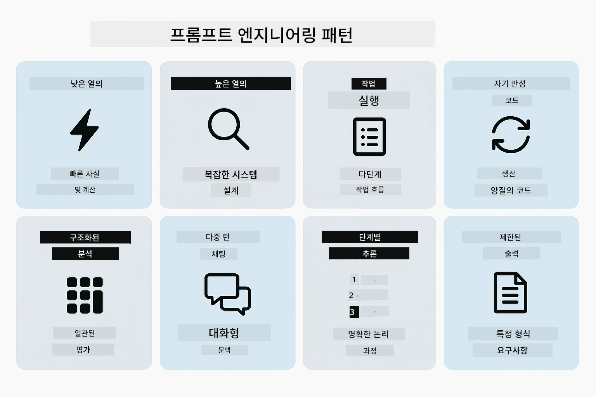
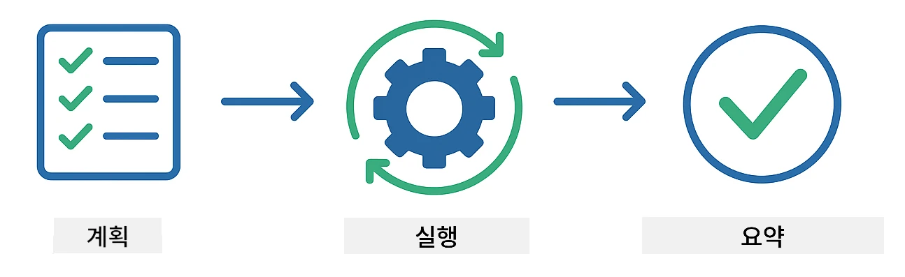
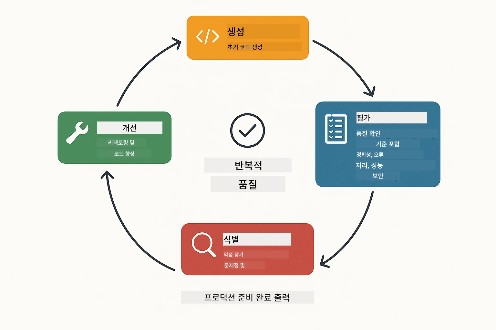
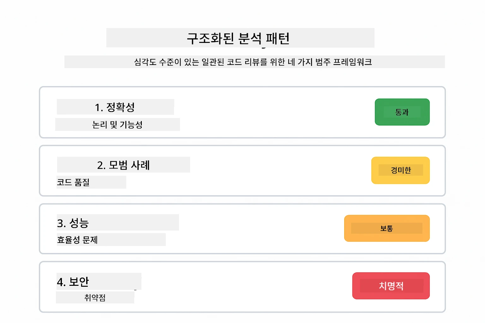
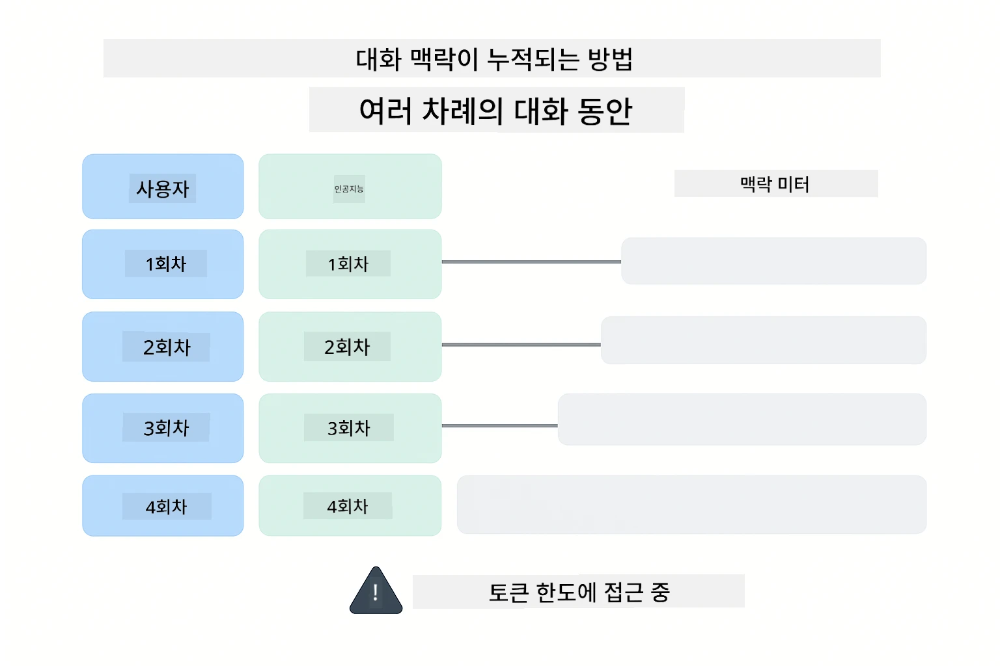
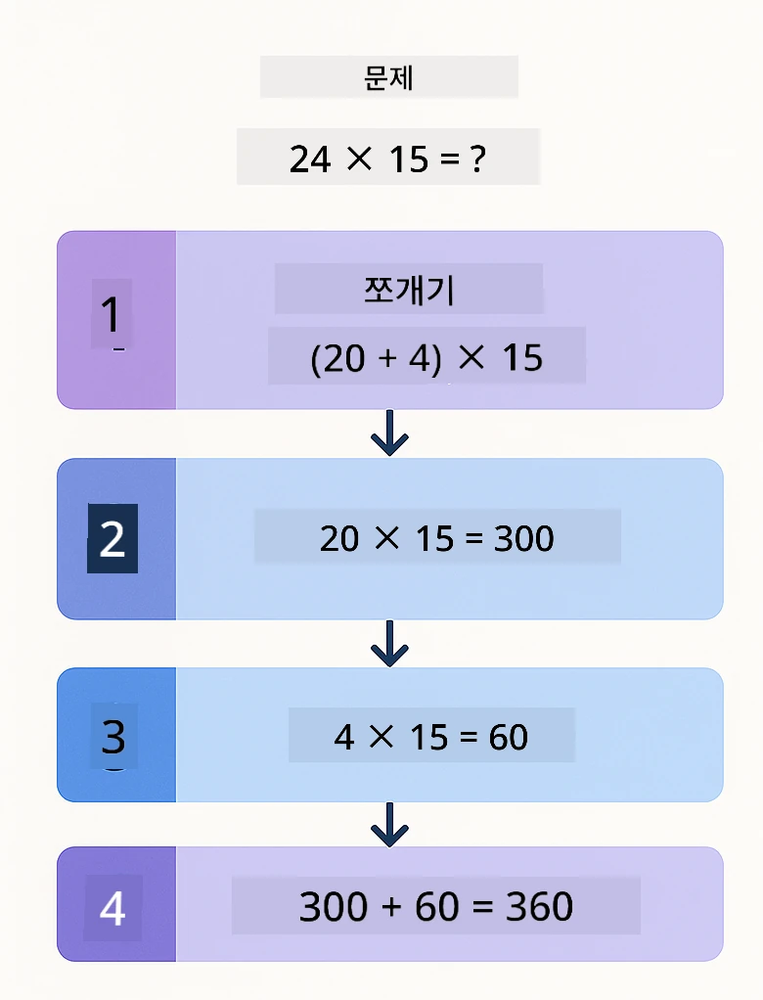
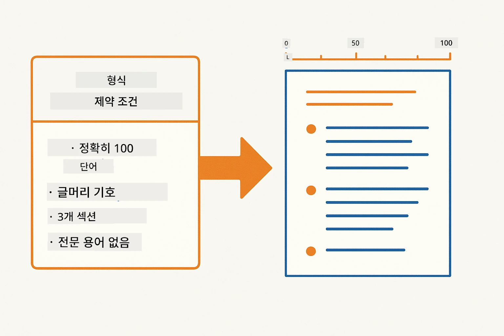
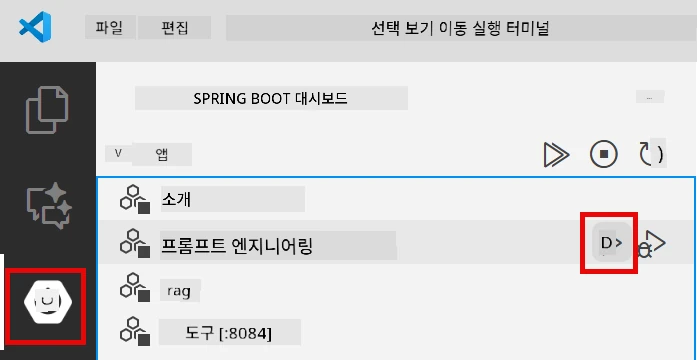
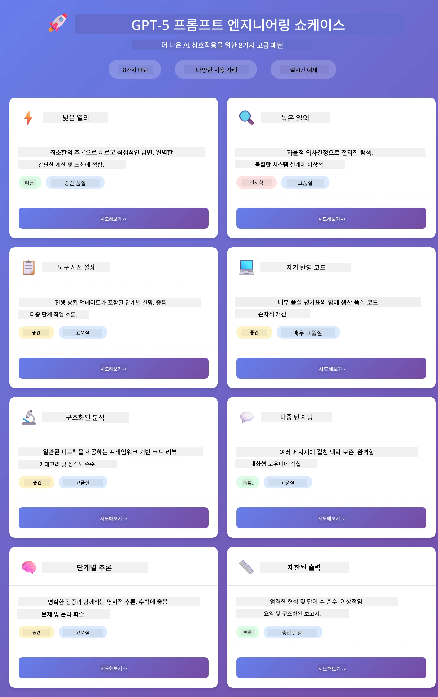
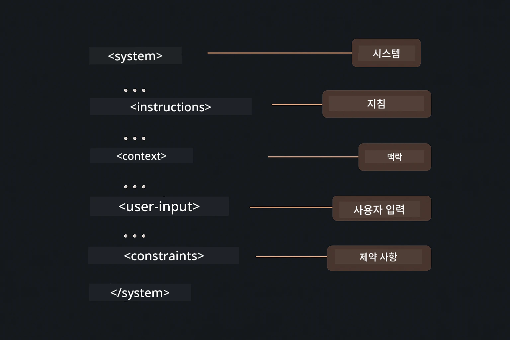

# 모듈 02: GPT-5.2를 활용한 프롬프트 엔지니어링

## 목차

- [비디오 워크스루](#비디오-워크스루)
- [학습 내용](#학습-내용)
- [사전 준비 사항](#사전-준비-사항)
- [프롬프트 엔지니어링 이해하기](#프롬프트-엔지니어링-이해하기)
- [프롬프트 엔지니어링 기초](#프롬프트-엔지니어링-기초)
  - [제로샷 프롬프트](#제로샷-프롬프트)
  - [퓨샷 프롬프트](#퓨샷-프롬프트)
  - [사고의 연쇄](#사고의-연쇄)
  - [역할 기반 프롬프트](#역할-기반-프롬프트)
  - [프롬프트 템플릿](#프롬프트-템플릿)
- [고급 패턴](#고급-패턴)
- [애플리케이션 실행하기](#애플리케이션-실행)
- [애플리케이션 스크린샷](#애플리케이션-스크린샷)
- [패턴 탐구](#패턴-탐색)
  - [낮은 열의 vs 높은 열의](#낮은-집중력-vs-높은-집중력)
  - [작업 실행 (도구 프리앰블)](#작업-실행-도구-프리앰블)
  - [자기 반영 코드](#자기-반영-코드)
  - [구조화된 분석](#구조적-분석)
  - [다중 턴 대화](#다중-회차-채팅)
  - [단계별 추론](#단계별-추론)
  - [제약된 출력](#제한된-출력)
- [진짜 배우는 것](#당신이-실제로-배우는-것)
- [다음 단계](#다음-단계)

## 비디오 워크스루

이 모듈 시작 방법을 설명하는 라이브 세션을 시청하세요:

<a href="https://www.youtube.com/live/PJ6aBaE6bog?si=LDshyBrTRodP-wke"></a>

## 학습 내용

아래 다이어그램은 이 모듈을 통해 개발할 주요 주제와 기술 개요를 제공합니다 — 프롬프트 다듬기 기법부터 단계별 워크플로우까지.


이전 모듈에서는 Azure OpenAI를 사용한 대화형 AI에서 메모리가 어떻게 작동하는지 보았습니다. 이제는 질문하는 방법 — 즉 프롬프트 자체 — 에 집중합니다. 프롬프트를 구성하는 방식이 응답 품질에 크게 영향을 미칩니다. 먼저 기본 프롬프트 기술을 검토한 후 GPT-5.2의 기능을 최대한 활용하는 여덟 개의 고급 패턴으로 넘어갑니다.

GPT-5.2를 사용하는 이유는 추론 제어 기능을 도입했기 때문입니다 — 모델이 답변 전 얼마나 많이 생각할지 지정할 수 있습니다. 이는 다양한 프롬프트 전략의 차이를 명확히 하고, 각 접근법을 언제 써야 할지 이해하는 데 도움을 줍니다.

## 사전 준비 사항

- 모듈 01 완료 (Azure OpenAI 리소스 배포)
- 루트 디렉터리에 Azure 자격 증명이 포함된 `.env` 파일 (모듈 01에서 `azd up` 명령어로 생성됨)

> **참고:** 모듈 01을 완료하지 않았다면, 먼저 거기서 배포 지침을 따르세요.

## 프롬프트 엔지니어링 이해하기

프롬프트 엔지니어링의 핵심은 모호한 지시와 정확한 지시의 차이점에 있습니다. 다음 비교가 이를 보여줍니다.


프롬프트 엔지니어링은 원하는 결과를 일관되게 얻을 수 있는 입력 텍스트를 설계하는 작업입니다. 단순히 질문하는 것이 아니라, 모델이 정확히 무엇을 원하며 어떻게 전달할지 이해하도록 요청을 구조화하는 것입니다.

동료에게 지시하는 것과 비슷합니다. "버그 고쳐"는 모호하지만, "UserService.java의 45번째 줄에서 널 포인터 예외를 널 체크 추가로 고쳐"는 구체적입니다. 언어 모델도 마찬가지입니다 — 구체성과 구조가 중요합니다.

아래 다이어그램은 LangChain4j가 이 과정에서 어떻게 작동하는지 보여줍니다 — 프롬프트 패턴을 시스템 메시지와 사용자 메시지 빌딩 블록을 통해 모델에 연결합니다.


LangChain4j는 인프라스트럭처 — 모델 연결, 메모리, 메시지 유형 — 를 제공합니다. 프롬프트 패턴은 그 인프라를 통해 전송하는 체계적으로 구성된 텍스트일 뿐입니다. 핵심 빌딩 블록은 AI의 행동과 역할을 설정하는 `SystemMessage` 와 실제 요청을 전달하는 `UserMessage` 입니다.

## 프롬프트 엔지니어링 기초

아래 다섯 가지 핵심 기술은 효과적인 프롬프트 엔지니어링의 토대입니다. 각각은 언어 모델과 소통하는 다양한 측면을 다룹니다.


이 모듈의 고급 패턴에 들어가기 전에 다섯 가지 기본 프롬프트 기술을 복습합니다. 모든 프롬프트 엔지니어가 알아야 할 빌딩 블록입니다.

### 제로샷 프롬프트

가장 단순한 방식: 예시 없이 모델에 직접 지시를 내립니다. 모델은 오로지 학습된 내용을 바탕으로 작업을 이해하고 수행합니다. 예상되는 행동이 명확한 간단한 요청에 적합합니다.


*예시 없이 직접 지시 — 모델이 지시만 보고 작업을 추론함*

```java
String prompt = "Classify this sentiment: 'I absolutely loved the movie!'";
String response = model.chat(prompt);
// 응답: "긍정적"
```
  
**사용 시기:** 단순 분류, 직접 질문, 번역 또는 추가 안내 없이 모델이 처리할 수 있는 작업.

### 퓨샷 프롬프트

모델이 따라야 할 패턴을 보여주는 예시를 제공합니다. 모델은 예시에서 입력-출력 형식을 배우고 이를 새로운 입력에 적용합니다. 원하는 형식이나 행동이 명확하지 않을 때 일관성 향상에 효과적입니다.


*예시로 학습 — 모델이 패턴을 파악해 새로운 입력에 적용*

```java
String prompt = """
    Classify the sentiment as positive, negative, or neutral.
    
    Examples:
    Text: "This product exceeded my expectations!" → Positive
    Text: "It's okay, nothing special." → Neutral
    Text: "Waste of money, very disappointed." → Negative
    
    Now classify this:
    Text: "Best purchase I've made all year!"
    """;
String response = model.chat(prompt);
```
  
**사용 시기:** 맞춤 분류, 일관된 형식, 도메인 특화 작업, 제로샷 결과가 불안정할 때.

### 사고의 연쇄

모델이 reasoning(추론) 과정을 단계별로 보여주도록 합니다. 바로 답을 내지 않고 문제를 분해해 각 부분을 명확히 처리합니다. 수학, 논리, 다단계 추론 문제의 정확도를 높입니다.


*단계별 추론 — 복잡한 문제를 명확한 논리 단계로 분해*

```java
String prompt = """
    Problem: A store has 15 apples. They sell 8 apples and then 
    receive a shipment of 12 more apples. How many apples do they have now?
    
    Let's solve this step-by-step:
    """;
String response = model.chat(prompt);
// 모델은 15 - 8 = 7을 보여주고, 그 다음에 7 + 12 = 19 사과를 보여줍니다
```
  
**사용 시기:** 수학 문제, 논리 퍼즐, 디버깅, 추론 과정을 보여줘야 정확도와 신뢰가 높아지는 경우.

### 역할 기반 프롬프트

질문 전에 AI에게 페르소나 또는 역할을 부여합니다. 이는 응답의 어조, 깊이, 초점을 결정하는 컨텍스트를 제공합니다. "소프트웨어 아키텍트"와 "주니어 개발자", "보안 감사자"가 주는 조언은 다릅니다.


*컨텍스트와 페르소나 설정 — 같은 질문도 역할에 따라 다른 응답*

```java
String prompt = """
    You are an experienced software architect reviewing code.
    Provide a brief code review for this function:
    
    def calculate_total(items):
        total = 0
        for item in items:
            total = total + item['price']
        return total
    """;
String response = model.chat(prompt);
```
  
**사용 시기:** 코드 리뷰, 멘토링, 도메인 특화 분석, 특정 전문성 수준 또는 관점에 맞는 응답이 필요할 때.

### 프롬프트 템플릿

변수 자리 표시자가 포함된 재사용 가능한 프롬프트를 만듭니다. 매번 새 프롬프트를 작성하는 대신, 템플릿을 한 번 정의하고 다른 값을 채웁니다. LangChain4j의 `PromptTemplate` 클래스는 `{{variable}}` 구문으로 쉽게 만듭니다.


*변수 자리표시자가 있는 재사용 가능한 프롬프트 — 하나의 템플릿, 여러 활용*

```java
PromptTemplate template = PromptTemplate.from(
    "What's the best time to visit {{destination}} for {{activity}}?"
);

Prompt prompt = template.apply(Map.of(
    "destination", "Paris",
    "activity", "sightseeing"
));

String response = model.chat(prompt.text());
```
  
**사용 시기:** 다양한 입력을 반복 질의, 배치 처리, 재사용 가능한 AI 워크플로우 구축, 프롬프트 구조는 같고 자료만 바뀔 때.

---

이 다섯 가지 기초는 대부분 프롬프트 작업의 견고한 도구 키트를 제공합니다. 이 모듈의 나머지는 GPT-5.2의 추론 제어, 자기 평가, 구조화된 출력 기능을 활용한 <strong>여덟 개의 고급 패턴</strong>으로 확장합니다.

## 고급 패턴

기초를 다졌으니, 이 모듈을 독특하게 만드는 여덟 개의 고급 패턴으로 넘어갑니다. 모든 문제에 같은 접근법이 필요한 건 아닙니다. 어떤 질문은 빠른 답변이, 어떤 질문은 깊은 사고가 필요합니다. 어떤 것은 추론 과정을 눈에 띄게 보여야 하고 어떤 것은 결과만 있으면 됩니다. 아래 각 패턴은 서로 다른 시나리오에 최적화되어 있으며, GPT-5.2의 추론 제어 덕분에 차이가 더욱 뚜렷해졌습니다.



*여덟 가지 프롬프트 엔지니어링 패턴과 해당 활용 사례 개요*

GPT-5.2는 여기에 *추론 제어* 라는 차원을 더했습니다. 아래 슬라이더는 모델의 사고 노력 정도를 조정하는 모습을 보여줍니다 — 빠르고 직접적인 답변부터 깊고 철저한 분석까지.


*GPT-5.2의 추론 제어는 모델이 생각할 양을 지정할 수 있음 — 빠른 직접 답변부터 깊은 탐색까지*

**낮은 열의 (빠르고 집중됨)** - 빠르고 직접적인 답변이 필요한 간단한 질문에 적합합니다. 모델은 최소한의 추론만 하며 최대 2단계 내에서 작업합니다. 계산, 조회, 단순 질문에 사용하세요.

```java
String prompt = """
    <context_gathering>
    - Search depth: very low
    - Bias strongly towards providing a correct answer as quickly as possible
    - Usually, this means an absolute maximum of 2 reasoning steps
    - If you think you need more time, state what you know and what's uncertain
    </context_gathering>
    
    Problem: What is 15% of 200?
    
    Provide your answer:
    """;

String response = chatModel.chat(prompt);
```
  
> 💡 **GitHub Copilot으로 탐색하기:** [`Gpt5PromptService.java`](../../../02-prompt-engineering/src/main/java/com/example/langchain4j/prompts/service/Gpt5PromptService.java) 파일을 열고 질문해보세요:  
> - "낮은 열의와 높은 열의 프롬프트 패턴의 차이는 무엇인가요?"  
> - "프롬프트 내 XML 태그가 AI 응답 구조화에 어떻게 도움이 되나요?"  
> - "언제 자기 반영 패턴을, 언제 직접 지시를 써야 하나요?"

**높은 열의 (깊고 철저함)** - 포괄적 분석과 상세 추론이 필요한 복잡 문제에 적합합니다. 모델은 철저히 탐색하고 자세한 추론 과정을 보여줍니다. 시스템 설계, 아키텍처 결정, 복잡한 연구에 사용하세요.

```java
String prompt = """
    Analyze this problem thoroughly and provide a comprehensive solution.
    Consider multiple approaches, trade-offs, and important details.
    Show your analysis and reasoning in your response.
    
    Problem: Design a caching strategy for a high-traffic REST API.
    """;

String response = chatModel.chat(prompt);
```
  
**작업 실행 (단계별 진행)** - 다단계 워크플로우에 적합합니다. 모델이 사전에 계획을 제시하고 각 단계를 수행하며 설명한 뒤 최종 요약을 제공합니다. 마이그레이션, 구현, 다단계 프로세스에 사용하세요.

```java
String prompt = """
    <task_execution>
    1. First, briefly restate the user's goal in a friendly way
    
    2. Create a step-by-step plan:
       - List all steps needed
       - Identify potential challenges
       - Outline success criteria
    
    3. Execute each step:
       - Narrate what you're doing
       - Show progress clearly
       - Handle any issues that arise
    
    4. Summarize:
       - What was completed
       - Any important notes
       - Next steps if applicable
    </task_execution>
    
    <tool_preambles>
    - Always begin by rephrasing the user's goal clearly
    - Outline your plan before executing
    - Narrate each step as you go
    - Finish with a distinct summary
    </tool_preambles>
    
    Task: Create a REST endpoint for user registration
    
    Begin execution:
    """;

String response = chatModel.chat(prompt);
```
  
Chain-of-Thought 프롬프트는 모델이 추론 과정을 명확히 드러내도록 명령합니다. 복잡한 작업의 정확도가 향상되며, 단계별 분해가 인간과 AI 모두 논리를 이해하는 데 도움을 줍니다.

> **🤖 [GitHub Copilot](https://github.com/features/copilot) Chat으로 시도해보세요:** 이 패턴에 대해 질문해보세요:  
> - "장기 실행 작업에 작업 실행 패턴을 어떻게 적응시킬 수 있을까요?"  
> - "프로덕션 애플리케이션에서 도구 프리앰블 구조의 모범 사례는 무엇인가요?"  
> - "중간 진행 상태를 UI에 표시하려면 어떻게 캡처하고 보여줘야 할까요?"

아래 다이어그램은 이 계획 → 실행 → 요약 워크플로우를 보여줍니다.



*다단계 작업을 위한 계획 → 실행 → 요약 워크플로우*

**자기 반영 코드** - 프로덕션 수준 코드 생성을 위한 패턴입니다. 모델이 적절한 오류 처리와 함께 프로덕션 표준에 맞는 코드를 생성합니다. 신규 기능이나 서비스 개발 시 활용하세요.

```java
String prompt = """
    Generate Java code with production-quality standards: Create an email validation service
    Keep it simple and include basic error handling.
    """;

String response = chatModel.chat(prompt);
```
  
아래 다이어그램은 반복적 개선 사이클 — 생성, 평가, 약점 식별, 개선 — 을 보여줍니다. 이 과정을 통해 코드는 프로덕션 기준에 맞춰집니다.



*반복적 개선 사이클 - 생성 → 평가 → 문제점 확인 → 개선 → 반복*

**구조화된 분석** - 일관된 평가를 위한 패턴입니다. 모델이 고정된 프레임워크(정확성, 관행, 성능, 보안, 유지보수성)를 사용해 코드를 검토합니다. 코드 리뷰나 품질 평가에 적합합니다.

```java
String prompt = """
    <analysis_framework>
    You are an expert code reviewer. Analyze the code for:
    
    1. Correctness
       - Does it work as intended?
       - Are there logical errors?
    
    2. Best Practices
       - Follows language conventions?
       - Appropriate design patterns?
    
    3. Performance
       - Any inefficiencies?
       - Scalability concerns?
    
    4. Security
       - Potential vulnerabilities?
       - Input validation?
    
    5. Maintainability
       - Code clarity?
       - Documentation?
    
    <output_format>
    Provide your analysis in this structure:
    - Summary: One-sentence overall assessment
    - Strengths: 2-3 positive points
    - Issues: List any problems found with severity (High/Medium/Low)
    - Recommendations: Specific improvements
    </output_format>
    </analysis_framework>
    
    Code to analyze:
    ```
    public List getUsers() {
        return database.query("SELECT * FROM users");
    }
    ```
    Provide your structured analysis:
    """;

String response = chatModel.chat(prompt);
```
  
> **🤖 [GitHub Copilot](https://github.com/features/copilot) Chat으로 시도해보세요:** 구조화된 분석에 대해 질문하세요:  
> - "다양한 코드 리뷰 유형에 맞게 분석 프레임워크를 어떻게 맞춤화할 수 있나요?"  
> - "구조화된 출력을 프로그램적으로 파싱하고 처리하는 최선의 방법은 무엇인가요?"  
> - "다양한 리뷰 세션에서 일관된 심각도 수준을 유지하려면 어떻게 해야 하나요?"

아래 다이어그램은 이 구조화된 프레임워크가 심각도 수준과 함께 코드 리뷰를 일관된 카테고리로 조직하는 방식을 보여줍니다.



*심각도 수준과 함께 일관된 코드 리뷰를 위한 프레임워크*

**다중 턴 대화** - 문맥이 필요한 대화에 적합한 패턴입니다. 모델이 이전 메시지를 기억하고 그 위에 쌓아 올립니다. 대화형 도움말 세션이나 복잡한 Q&A에 활용하세요.

```java
ChatMemory memory = MessageWindowChatMemory.withMaxMessages(10);

memory.add(UserMessage.from("What is Spring Boot?"));
AiMessage aiMessage1 = chatModel.chat(memory.messages()).aiMessage();
memory.add(aiMessage1);

memory.add(UserMessage.from("Show me an example"));
AiMessage aiMessage2 = chatModel.chat(memory.messages()).aiMessage();
memory.add(aiMessage2);
```
  
아래 다이어그램은 대화 문맥이 여러 턴을 거치며 누적되는 방식과 이것이 모델의 토큰 제한과 어떻게 관련되는지 시각화합니다.



*대화 문맥이 여러 턴에 걸쳐 누적되어 토큰 제한에 도달하는 과정*

**단계별 추론** - 논리를 눈에 띄게 보여줘야 하는 문제에 적합합니다. 모델이 각 단계를 명시적이고 번호가 매겨진 논리적 단계로 나누어 보여줍니다. 수학문제, 논리 퍼즐, 추론 과정을 이해해야 할 때 사용하세요.

```java
String prompt = """
    <instruction>Show your reasoning step-by-step</instruction>
    
    If a train travels 120 km in 2 hours, then stops for 30 minutes,
    then travels another 90 km in 1.5 hours, what is the average speed
    for the entire journey including the stop?
    """;

String response = chatModel.chat(prompt);
```
  
아래 다이어그램은 모델이 문제를 명확한 번호가 매겨진 논리 단계로 분해하는 방식을 보여줍니다.


*문제를 명확한 논리 단계로 분해하기*

**제한된 출력** - 특정 형식 요구사항이 있는 응답용. 모델은 형식 및 길이 규칙을 엄격히 준수합니다. 요약하거나 정확한 출력 구조가 필요할 때 사용하세요.

```java
String prompt = """
    <constraints>
    - Exactly 100 words
    - Bullet point format
    - Technical terms only
    </constraints>
    
    Summarize the key concepts of machine learning.
    """;

String response = chatModel.chat(prompt);
```

다음 다이어그램은 제약 조건이 모델이 형식과 길이 요구사항을 엄격히 준수하는 출력을 생성하도록 안내하는 방식을 보여줍니다.



*특정 형식, 길이 및 구조 요구사항 강제 적용*

## 애플리케이션 실행

**배포 확인:**

모듈 01에서 생성한 Azure 자격 증명이 포함된 `.env` 파일이 루트 디렉터리에 존재하는지 확인하세요. 모듈 디렉터리(`02-prompt-engineering/`)에서 다음을 실행합니다:

**Bash:**
```bash
cat ../.env  # AZURE_OPENAI_ENDPOINT, API_KEY, DEPLOYMENT를 보여야 합니다
```

**PowerShell:**
```powershell
Get-Content ..\.env  # AZURE_OPENAI_ENDPOINT, API_KEY, DEPLOYMENT를 보여야 합니다
```

**애플리케이션 시작:**

> **참고:** 이미 루트 디렉터리에서 `./start-all.sh`로 모든 애플리케이션을 시작한 경우(모듈 01 참조), 이 모듈은 이미 포트 8083에서 실행 중입니다. 아래 시작 명령은 건너뛰고 바로 http://localhost:8083 으로 접속하세요.

**옵션 1: Spring Boot 대시보드 사용 (VS Code 사용자 권장)**

개발 컨테이너에는 모든 Spring Boot 애플리케이션 관리를 위한 시각적 인터페이스인 Spring Boot Dashboard 확장 기능이 포함되어 있습니다. VS Code 왼쪽의 활동 표시줄에서 Spring Boot 아이콘을 찾을 수 있습니다.

Spring Boot 대시보드에서는 다음이 가능합니다:
- 작업 공간 내 모든 Spring Boot 애플리케이션 확인
- 단일 클릭으로 애플리케이션 시작/중지
- 애플리케이션 로그 실시간 보기
- 애플리케이션 상태 모니터링

"prompt-engineering" 옆의 재생 버튼을 클릭해 이 모듈을 시작하거나 모든 모듈을 한 번에 시작할 수 있습니다.



*VS Code의 Spring Boot 대시보드 — 한 곳에서 모든 모듈을 시작, 중지 및 모니터링*

**옵션 2: 셸 스크립트 사용**

모든 웹 애플리케이션(모듈 01-04) 시작:

**Bash:**
```bash
cd ..  # 루트 디렉토리에서
./start-all.sh
```

**PowerShell:**
```powershell
cd ..  # 루트 디렉터리에서부터
.\start-all.ps1
```

또는 이 모듈만 시작:

**Bash:**
```bash
cd 02-prompt-engineering
./start.sh
```

**PowerShell:**
```powershell
cd 02-prompt-engineering
.\start.ps1
```

두 스크립트 모두 루트 `.env` 파일에서 환경 변수를 자동으로 로드하며, JAR 파일이 없으면 빌드합니다.

> **참고:** 모든 모듈을 수동으로 빌드한 후 시작하고 싶다면:
>
> **Bash:**
> ```bash
> cd ..  # Go to root directory
> mvn clean package -DskipTests
> ```

> **PowerShell:**
> ```powershell
> cd ..  # Go to root directory
> mvn clean package -DskipTests
> ```

브라우저에서 http://localhost:8083 을 엽니다.

**중지하려면:**

**Bash:**
```bash
./stop.sh  # 이 모듈만
# 또는
cd .. && ./stop-all.sh  # 모든 모듈
```

**PowerShell:**
```powershell
.\stop.ps1  # 이 모듈만
# 또는
cd ..; .\stop-all.ps1  # 모든 모듈
```

## 애플리케이션 스크린샷

아래는 프롬프트 엔지니어링 모듈의 주요 인터페이스입니다. 여기서 8가지 패턴을 나란히 실험할 수 있습니다.



*8가지 프롬프트 엔지니어링 패턴과 특성 및 사용 사례를 보여주는 메인 대시보드*

## 패턴 탐색

웹 인터페이스에서 다양한 프롬프팅 전략을 실험할 수 있습니다. 각 패턴은 다른 문제를 해결하므로, 각 접근법이 언제 빛을 발하는지 직접 확인해보세요.

> **참고: 스트리밍 vs 비스트리밍** — 모든 패턴 페이지에는 두 가지 버튼이 있습니다: **🔴 스트림 응답 (실시간)** 와 <strong>비스트리밍</strong> 옵션. 스트리밍은 서버-전송 이벤트(SSE)를 사용해 모델이 생성하는 토큰을 실시간으로 표시하므로 즉시 진행 상황을 볼 수 있습니다. 비스트리밍 옵션은 전체 응답을 기다린 후 표시합니다. 심층 추론을 유발하는 프롬프트(예: High Eagerness, Self-Reflecting Code)는 비스트리밍 호출 시 매우 오래 걸리거나(때론 수분 이상) 아무런 피드백 없이 대기할 수 있습니다. **복잡한 프롬프트 실험 시 스트리밍을 사용하세요**. 모델 작업 과정이 보여 요청이 타임아웃된 것처럼 느끼지 않도록 합니다.
>
> **참고: 브라우저 요구사항** — 스트리밍 기능은 Fetch Streams API(`response.body.getReader()`)를 사용하며, Chrome, Edge, Firefox, Safari 같은 완전한 브라우저에서만 작동합니다. VS Code 내장 간단 브라우저(Simple Browser)는 ReadableStream API를 지원하지 않아 스트리밍 기능이 작동하지 않습니다. 간단 브라우저를 사용할 경우, 비스트리밍 버튼은 정상 동작하지만 스트리밍 버튼만 영향을 받습니다. 완전한 경험을 위해 외부 브라우저에서 `http://localhost:8083` 을 여세요.

### 낮은 집중력 vs 높은 집중력

"200의 15%가 얼마입니까?" 같은 단순 질문을 낮은 집중력(Low Eagerness)으로 물어보면 즉시 직접적인 답변을 받습니다. 반면 "고트래픽 API를 위한 캐싱 전략 설계를 해주세요" 같은 복잡한 질문은 높은 집중력(High Eagerness)으로 물어보세요. **🔴 스트림 응답 (실시간)** 을 클릭하면 모델의 자세한 추론이 토큰 단위로 나타나는 것을 볼 수 있습니다. 같은 모델, 같은 질문 구조이지만 얼마나 깊이 생각할지 프롬프트가 지시합니다.

### 작업 실행 (도구 프리앰블)

다단계 워크플로우는 사전 계획과 진행 상황 내레이션에 유리합니다. 모델이 할 일을 개괄하고 각 단계를 설명한 뒤 결과를 요약합니다.

### 자기 반영 코드

"이메일 유효성 검사 서비스를 만들어라"를 시도해 보세요. 단순히 코드를 생성하고 멈추는 대신 모델이 생성, 품질 기준에 대한 평가, 약점 발견, 개선까지 수행합니다. 코드가 프로덕션 수준에 도달할 때까지 반복 과정을 볼 수 있습니다.

### 구조적 분석

코드 리뷰는 일관된 평가 체계가 필요합니다. 모델이 고정된 카테고리(정확성, 관행, 성능, 보안)와 심각도 수준으로 코드를 분석합니다.

### 다중 회차 채팅

"Spring Boot가 뭐야?"라고 묻고 바로 "예제를 보여줘"라고 이어 질문하세요. 모델이 첫 질문을 기억해 Spring Boot 예제를 구체적으로 제공합니다. 메모리가 없으면 두 번째 질문은 너무 애매할 것입니다.

### 단계별 추론

수학 문제 하나를 골라 단계별 추론과 낮은 집중력으로 각각 시도해 보세요. 낮은 집중력은 빠르지만 답만 줍니다 - 불투명합니다. 단계별은 모든 계산과 결정을 보여줍니다.

### 제한된 출력

특정 형식이나 단어 수가 필요할 때 이 패턴이 엄격히 준수하게 합니다. 정확히 100단어 분량의 요약을 글머리표 형식으로 만들어 보세요.

## 당신이 실제로 배우는 것

**추론 노력은 모든 것을 바꾼다**

GPT-5.2는 프롬프트를 통해 계산 노력을 제어할 수 있게 합니다. 낮은 노력은 빠른 응답과 최소 탐색을 의미합니다. 높은 노력은 모델이 시간을 들여 깊이 사고하는 것입니다. 작업 복잡도에 맞춰 노력을 조절하는 법을 배우는 겁니다 - 단순 질문에 쓸데없이 오래 투자하지 말고, 복잡한 결정은 서두르지 마세요.

**구조가 행동을 이끈다**

프롬프트의 XML 태그를 보셨나요? 장식이 아닙니다. 모델은 구조화된 지시사항을 자유 텍스트보다 훨씬 신뢰성 있게 따릅니다. 여러 단계 과정이나 복잡한 논리가 필요할 때 구조는 모델이 어디에 있고 다음에 무엇을 해야 하는지 추적하는 데 도움을 줍니다. 아래 다이어그램은 잘 구성된 프롬프트를 분해하여 `<system>`, `<instructions>`, `<context>`, `<user-input>`, `<constraints>` 같은 태그가 어떻게 명확한 섹션으로 지시사항을 조직하는지 보여줍니다.



*명확한 섹션과 XML 스타일 구성을 갖춘 잘 짜인 프롬프트 해부*

**자기 평가를 통한 품질 보증**

자기 반영 패턴은 품질 기준을 명확히 제시하는 방식으로 작동합니다. 모델이 "잘 하길 바라기"보다는 무엇이 "옳음"인지 정확히 알려줍니다: 올바른 논리, 오류 처리, 성능, 보안 등. 모델은 스스로 출력물을 평가하고 개선할 수 있습니다. 코드 생성을 복권에서 체계적인 프로세스로 바꾸는 셈입니다.

**컨텍스트는 유한하다**

다중 회차 대화는 각 요청에 메시지 기록을 포함하는 방식으로 작동하지만 제한이 있습니다 - 모든 모델은 최대 토큰 수 한도가 있습니다. 대화가 길어질수록 관련 컨텍스트를 유지하면서 한도에 도달하지 않도록 전략이 필요합니다. 이 모듈은 메모리 작동법을 보여주고, 이후 요약, 잊기, 검색 시점을 배우게 됩니다.

## 다음 단계

**다음 모듈:** [03-rag - RAG (Retrieval-Augmented Generation)](../03-rag/README.md)

---

**탐색:** [← 이전: 모듈 01 - 소개](../01-introduction/README.md) | [메인으로 돌아가기](../README.md) | [다음: 모듈 03 - RAG →](../03-rag/README.md)

---

<!-- CO-OP TRANSLATOR DISCLAIMER START -->
**면책 조항**:
이 문서는 AI 번역 서비스 [Co-op Translator](https://github.com/Azure/co-op-translator)를 사용하여 번역되었습니다. 정확성을 기하기 위해 노력하고 있으나, 자동 번역은 오류나 부정확한 부분이 있을 수 있음을 유의하시기 바랍니다. 원본 문서의 원어본이 권위 있는 자료로 간주되어야 합니다. 중요한 정보의 경우, 전문가의 인간 번역을 권장합니다. 이 번역 사용으로 인해 발생하는 오해나 잘못된 해석에 대해 당사는 책임을 지지 않습니다.
<!-- CO-OP TRANSLATOR DISCLAIMER END -->