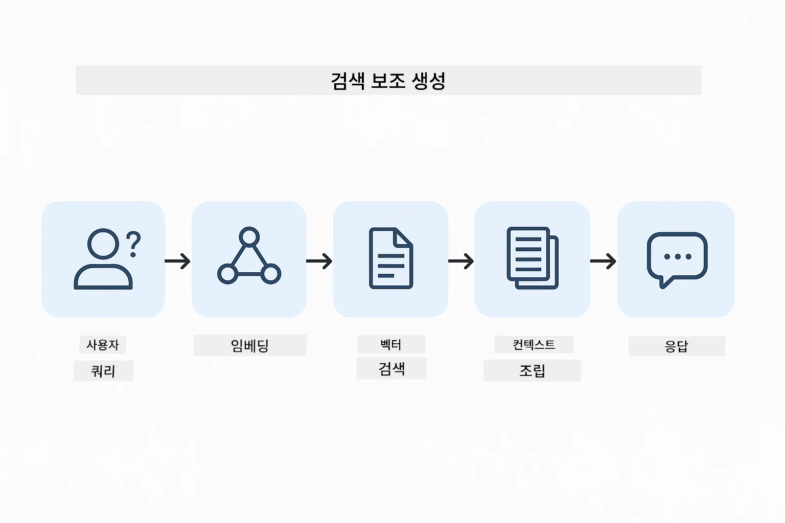
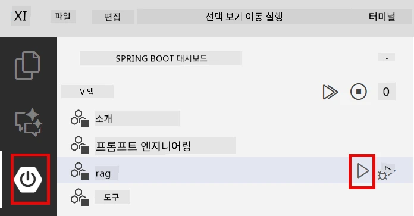
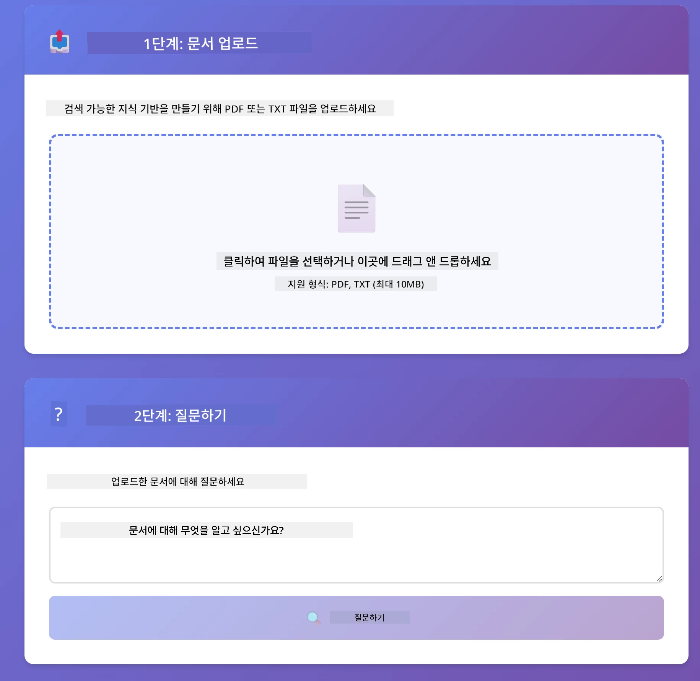
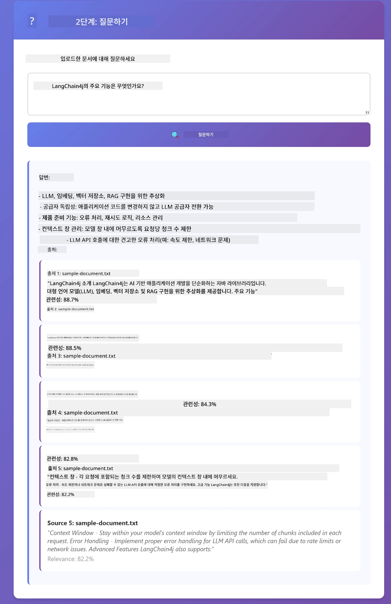

# Module 03: RAG (검색 증강 생성)

## 목차

- [배울 내용](../../../03-rag)
- [사전 요구 사항](../../../03-rag)
- [RAG 이해하기](../../../03-rag)
- [작동 원리](../../../03-rag)
  - [문서 처리](../../../03-rag)
  - [임베딩 생성](../../../03-rag)
  - [의미 기반 검색](../../../03-rag)
  - [답변 생성](../../../03-rag)
- [애플리케이션 실행](../../../03-rag)
- [애플리케이션 사용법](../../../03-rag)
  - [문서 업로드](../../../03-rag)
  - [질문하기](../../../03-rag)
  - [출처 참고 확인](../../../03-rag)
  - [질문 실험하기](../../../03-rag)
- [핵심 개념](../../../03-rag)
  - [청킹 전략](../../../03-rag)
  - [유사도 점수](../../../03-rag)
  - [인메모리 저장소](../../../03-rag)
  - [컨텍스트 창 관리](../../../03-rag)
- [RAG가 중요한 경우](../../../03-rag)
- [다음 단계](../../../03-rag)

## 배울 내용

이전 모듈들에서 AI와 대화하는 방법과 효과적으로 프롬프트를 구성하는 방법을 배웠습니다. 하지만 근본적인 한계가 있습니다: 언어 모델은 훈련 중에 배운 것만 알고 있습니다. 회사 정책, 프로젝트 문서, 혹은 훈련받지 않은 정보에 관한 질문에는 답할 수 없습니다.

RAG(검색 증강 생성)는 이 문제를 해결합니다. 모델에 직접 정보를 가르치려고 하기보다는(비용이 많이 들고 실용적이지 않음), 모델이 문서를 검색할 수 있는 기능을 제공합니다. 누군가 질문을 하면 시스템은 관련 정보를 찾아 프롬프트에 포함시킵니다. 모델은 그렇게 검색된 컨텍스트를 기반으로 대답합니다.

RAG를 모델에 참고 도서관을 제공하는 것으로 생각해 보세요. 질문을 하면 시스템은:

1. **사용자 질의** - 질문을 합니다.
2. **임베딩 변환** - 질문을 벡터로 변환합니다.
3. **벡터 검색** - 비슷한 문서 청크를 찾습니다.
4. **컨텍스트 조립** - 관련 청크를 프롬프트에 추가합니다.
5. **응답 생성** - LLM이 컨텍스트를 기반으로 답변을 생성합니다.

이렇게 하면 모델이 훈련 지식이나 임의의 답변에 의존하지 않고 실제 데이터에 근거한 응답을 제공합니다.



*RAG 워크플로우 - 사용자 질의부터 의미 기반 검색 후 컨텍스트 답변 생성까지*

## 사전 요구 사항

- 모듈 01 완료 (Azure OpenAI 리소스 배포)
- 루트 디렉터리에 Azure 자격 증명이 포함된 `.env` 파일 (모듈 01에서 `azd up` 실행 시 생성됨)

> **참고:** 모듈 01을 완료하지 않았다면 먼저 그쪽 배포 지침을 따르세요.

## 작동 원리

### 문서 처리

[DocumentService.java](../../../03-rag/src/main/java/com/example/langchain4j/rag/service/DocumentService.java)

문서를 업로드하면 시스템이 문서를 청크로 나눕니다. 이는 모델의 컨텍스트 창에 적합하도록 작은 조각으로 분리하는 과정입니다. 경계 부분에서 문맥을 잃지 않도록 청크는 약간 겹치게 만듭니다.

```java
Document document = FileSystemDocumentLoader.loadDocument("sample-document.txt");

DocumentSplitter splitter = DocumentSplitters
    .recursive(300, 30, new OpenAiTokenizer());

List<TextSegment> segments = splitter.split(document);
```

> **🤖 [GitHub Copilot](https://github.com/features/copilot) 채팅에서 시도해 보세요:** [`DocumentService.java`](../../../03-rag/src/main/java/com/example/langchain4j/rag/service/DocumentService.java)를 열고 질문해 보세요:
> - "LangChain4j가 문서를 청크로 분할하는 방법과 왜 겹치는 부분이 중요한가요?"
> - "문서 유형별 최적의 청크 크기는 얼마며 그 이유는 무엇인가요?"
> - "다국어 문서나 특수 포맷의 문서는 어떻게 처리하나요?"

### 임베딩 생성

[LangChainRagConfig.java](../../../03-rag/src/main/java/com/example/langchain4j/rag/config/LangChainRagConfig.java)

각 청크는 임베딩이라는 수치 표현으로 변환됩니다. 임베딩은 텍스트 의미를 포착하는 수학적 지문과 같습니다. 비슷한 텍스트는 비슷한 임베딩을 가집니다.

```java
@Bean
public EmbeddingModel embeddingModel() {
    return OpenAiOfficialEmbeddingModel.builder()
        .baseUrl(azureOpenAiEndpoint)
        .apiKey(azureOpenAiKey)
        .modelName(azureEmbeddingDeploymentName)
        .build();
}

EmbeddingStore<TextSegment> embeddingStore = 
    new InMemoryEmbeddingStore<>();
```


*임베딩 공간에 벡터로 표현된 문서들 - 유사한 내용은 군집화됨*

### 의미 기반 검색

[RagService.java](../../../03-rag/src/main/java/com/example/langchain4j/rag/service/RagService.java)

질문을 하면 질문 또한 임베딩으로 변환됩니다. 시스템은 질문 임베딩과 모든 문서 청크 임베딩을 비교합니다. 단순한 키워드 일치가 아니라 실제 의미의 유사성을 찾아 가장 관련이 높은 청크를 찾습니다.

```java
Embedding queryEmbedding = embeddingModel.embed(question).content();

List<EmbeddingMatch<TextSegment>> matches = 
    embeddingStore.findRelevant(queryEmbedding, 5, 0.7);

for (EmbeddingMatch<TextSegment> match : matches) {
    String relevantText = match.embedded().text();
    double score = match.score();
}
```

> **🤖 [GitHub Copilot](https://github.com/features/copilot) 채팅에서 시도해 보세요:** [`RagService.java`](../../../03-rag/src/main/java/com/example/langchain4j/rag/service/RagService.java)를 열고 질문해 보세요:
> - "임베딩을 이용한 유사도 검색은 어떻게 작동하며 점수는 어떻게 결정되나요?"
> - "적절한 유사도 임계값은 무엇이며 결과에 어떤 영향을 주나요?"
> - "관련 문서가 없을 때는 어떻게 처리하나요?"

### 답변 생성

[RagService.java](../../../03-rag/src/main/java/com/example/langchain4j/rag/service/RagService.java)

가장 관련성 높은 청크들이 모델 프롬프트에 포함됩니다. 모델은 그 정보만 읽고 질문에 답변합니다. 이로써 '환각(hallucination)'을 방지합니다—모델이 앞에 있는 정보만으로 대답할 수 있습니다.

## 애플리케이션 실행

**배포 확인:**

루트 디렉터리에 Azure 자격 증명이 포함된 `.env` 파일이 있는지 확인하세요 (모듈 01 실행 시 생성됨):
```bash
cat ../.env  # AZURE_OPENAI_ENDPOINT, API_KEY, DEPLOYMENT를 보여야 합니다
```

**애플리케이션 실행:**

> **참고:** 모듈 01에서 `./start-all.sh`로 모든 애플리케이션을 시작했다면 이 모듈은 이미 8081 포트에서 실행 중입니다. 아래 명령어를 생략하고 http://localhost:8081 로 바로 접속해도 됩니다.

**옵션 1: Spring Boot 대시보드 사용 (VS Code 사용자 권장)**

개발 컨테이너에는 Spring Boot 대시보드 확장이 포함되어 있어 모든 Spring Boot 애플리케이션을 시각적으로 관리할 수 있습니다. VS Code 좌측 활동 바에서 스프링 부트 아이콘을 찾으세요.

대시보드에서:
- 작업 영역의 모든 Spring Boot 애플리케이션 확인
- 한 번의 클릭으로 애플리케이션 시작/중지
- 실시간 로그 보기
- 애플리케이션 상태 모니터링

"rag" 옆에 있는 재생 버튼을 클릭해 이 모듈을 실행하거나, 모든 모듈을 한 번에 시작할 수 있습니다.



**옵션 2: 셸 스크립트 사용**

모듈 01-04까지 모든 웹 애플리케이션 실행:

**Bash:**
```bash
cd ..  # 루트 디렉토리에서
./start-all.sh
```

**PowerShell:**
```powershell
cd ..  # 루트 디렉토리에서
.\start-all.ps1
```

또는 이 모듈만 실행:

**Bash:**
```bash
cd 03-rag
./start.sh
```

**PowerShell:**
```powershell
cd 03-rag
.\start.ps1
```

두 스크립트 모두 루트의 `.env` 파일에서 환경 변수를 자동으로 불러오며, JAR 파일이 없으면 빌드까지 진행합니다.

> **참고:** 시작 전에 모든 모듈을 수동으로 빌드하고 싶다면:
>
> **Bash:**
> ```bash
> cd ..  # Go to root directory
> mvn clean package -DskipTests
> ```
>
> **PowerShell:**
> ```powershell
> cd ..  # Go to root directory
> mvn clean package -DskipTests
> ```

브라우저에서 http://localhost:8081 을 엽니다.

**중지하려면:**

**Bash:**
```bash
./stop.sh  # 이 모듈만
# 또는
cd .. && ./stop-all.sh  # 모든 모듈
```

**PowerShell:**
```powershell
.\stop.ps1  # 이 모듈만
# 또는
cd ..; .\stop-all.ps1  # 모든 모듈
```

## 애플리케이션 사용법

이 애플리케이션은 문서 업로드와 질문을 위한 웹 인터페이스를 제공합니다.

<a href="images/rag-homepage.png"></a>

*RAG 애플리케이션 인터페이스 - 문서 업로드 및 질문*

### 문서 업로드

TXT 파일 업로드로 시작하세요. 이 디렉터리에 `sample-document.txt`가 있는데 LangChain4j 기능, RAG 구현 및 모범 사례에 관한 정보가 포함되어 있어 시스템 테스트에 적합합니다.

시스템은 문서를 처리해 청크로 나누고 각 청크에 대해 임베딩을 만듭니다. 업로드 시 자동으로 처리됩니다.

### 질문하기

이제 문서 내용에 관한 구체적인 질문을 해보세요. 문서에 명확하게 나와 있는 사실을 질문해 보세요. 시스템은 관련 청크를 검색해 프롬프트에 포함시키고 답변을 생성합니다.

### 출처 참고 확인

각 답변에는 유사도 점수가 표시된 출처 참고가 포함됩니다. 이 점수(0에서 1 사이)는 각 청크가 질문과 얼마나 관련이 있는지 보여줍니다. 점수가 높을수록 더 좋은 매칭입니다. 이를 통해 출처 자료와 답변을 검증할 수 있습니다.

<a href="images/rag-query-results.png"></a>

*출처 참고와 관련도 점수가 포함된 쿼리 결과*

### 질문 실험하기

다양한 유형의 질문을 시도해 보세요:
- 구체적 사실: "주요 주제는 무엇인가요?"
- 비교: "X와 Y의 차이점은 무엇인가요?"
- 요약: "Z에 대한 핵심 포인트를 요약해 주세요."

질문과 문서 내용의 일치도에 따라 관련도 점수가 어떻게 변하는지 확인하세요.

## 핵심 개념

### 청킹 전략

문서는 300토큰 단위로 청크로 나누며 30토큰을 겹칩니다. 이 균형은 각 청크가 의미 있는 문맥을 유지하면서 여러 청크를 프롬프트에 포함할 수 있을 만큼 작도록 합니다.

### 유사도 점수

점수는 0에서 1 사이입니다:
- 0.7-1.0: 매우 관련 있음, 정확한 일치
- 0.5-0.7: 관련 있음, 좋은 문맥
- 0.5 미만: 제외됨, 너무 차이가 큼

시스템은 품질 보장을 위해 최소 임계값 이상인 청크만 검색합니다.

### 인메모리 저장소

이 모듈은 단순화를 위해 인메모리 저장소를 사용합니다. 애플리케이션을 재시작하면 업로드된 문서가 사라집니다. 운영 환경에서는 Qdrant나 Azure AI Search 같은 영속적인 벡터 데이터베이스를 사용합니다.

### 컨텍스트 창 관리

모델마다 최대 컨텍스트 창 크기가 있습니다. 큰 문서의 모든 청크를 포함할 수 없기 때문에 시스템은 가장 관련성 높은 상위 N개 청크(기본값 5개)를 검색해 제한을 지키면서도 정확한 답변에 필요한 문맥을 제공합니다.

## RAG가 중요한 경우

**RAG를 사용해야 할 때:**
- 독점 문서에 관한 질문에 답변할 때
- 정보가 자주 바뀔 때 (정책, 가격, 사양 등)
- 정확성에 출처 명시가 필요할 때
- 콘텐츠가 너무 커서 한 프롬프트에 다 넣을 수 없을 때
- 검증 가능하고 근거 있는 응답이 필요할 때

**RAG를 사용하지 않아도 될 때:**
- 모델이 이미 일반 지식을 가지고 있는 질문일 때
- 실시간 데이터가 필요한 경우 (RAG는 업로드된 문서에 기반)
- 콘텐츠가 프롬프트에 직접 포함될 만큼 작을 때

## 다음 단계

**다음 모듈:** [04-tools - 도구가 있는 AI 에이전트](../04-tools/README.md)

---

**내비게이션:** [← 이전: Module 02 - 프롬프트 엔지니어링](../02-prompt-engineering/README.md) | [메인으로 돌아가기](../README.md) | [다음: Module 04 - 도구 →](../04-tools/README.md)

---

<!-- CO-OP TRANSLATOR DISCLAIMER START -->
**면책 조항**:  
이 문서는 AI 번역 서비스 [Co-op Translator](https://github.com/Azure/co-op-translator)를 사용하여 번역되었습니다. 정확성을 위해 최선을 다하고 있으나, 자동 번역은 오류나 부정확성이 있을 수 있음을 유의해 주시기 바랍니다. 원문은 해당 언어의 원본 문서를 권위 있는 출처로 간주해야 합니다. 중요한 정보의 경우, 전문적인 인간 번역을 권장합니다. 본 번역 사용으로 인한 오해나 잘못된 해석에 대해 당사는 책임을 지지 않습니다.
<!-- CO-OP TRANSLATOR DISCLAIMER END -->