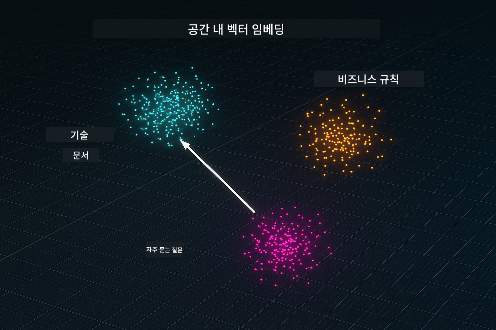
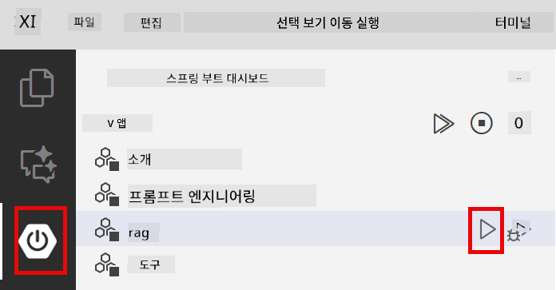
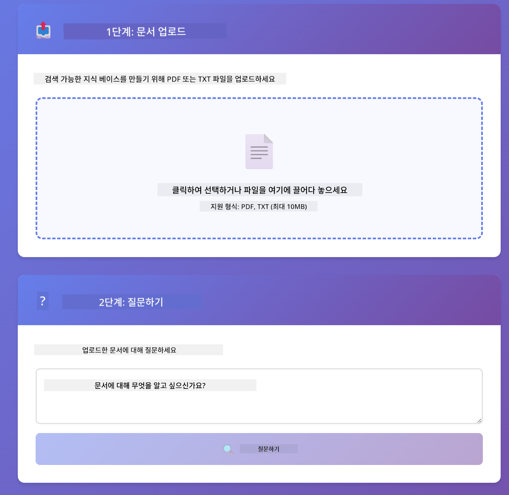

<!--
CO_OP_TRANSLATOR_METADATA:
{
  "original_hash": "f538a51cfd13147d40d84e936a0f485c",
  "translation_date": "2025-12-13T16:52:24+00:00",
  "source_file": "03-rag/README.md",
  "language_code": "ko"
}
-->
# Module 03: RAG (검색 증강 생성)

## 목차

- [학습 내용](../../../03-rag)
- [사전 준비 사항](../../../03-rag)
- [RAG 이해하기](../../../03-rag)
- [작동 원리](../../../03-rag)
  - [문서 처리](../../../03-rag)
  - [임베딩 생성](../../../03-rag)
  - [의미 기반 검색](../../../03-rag)
  - [답변 생성](../../../03-rag)
- [애플리케이션 실행](../../../03-rag)
- [애플리케이션 사용법](../../../03-rag)
  - [문서 업로드](../../../03-rag)
  - [질문하기](../../../03-rag)
  - [출처 확인](../../../03-rag)
  - [질문 실험하기](../../../03-rag)
- [핵심 개념](../../../03-rag)
  - [청킹 전략](../../../03-rag)
  - [유사도 점수](../../../03-rag)
  - [인메모리 저장소](../../../03-rag)
  - [컨텍스트 윈도우 관리](../../../03-rag)
- [RAG가 중요한 경우](../../../03-rag)
- [다음 단계](../../../03-rag)

## 학습 내용

이전 모듈에서는 AI와 대화하는 방법과 효과적으로 프롬프트를 구성하는 방법을 배웠습니다. 하지만 근본적인 한계가 있습니다: 언어 모델은 훈련 중에 배운 것만 알고 있습니다. 회사 정책, 프로젝트 문서, 또는 훈련받지 않은 정보에 대해 질문에 답할 수 없습니다.

RAG(검색 증강 생성)는 이 문제를 해결합니다. 모델에 정보를 직접 가르치려 하지 않고(비용도 많이 들고 비현실적임), 문서를 검색할 수 있는 능력을 부여합니다. 누군가 질문하면 시스템이 관련 정보를 찾아 프롬프트에 포함시킵니다. 모델은 그 검색된 컨텍스트를 바탕으로 답변합니다.

RAG를 모델에 참고 도서관을 주는 것이라고 생각하세요. 질문하면 시스템은:

1. **사용자 질문** - 질문을 합니다
2. **임베딩** - 질문을 벡터로 변환합니다
3. **벡터 검색** - 유사한 문서 청크를 찾습니다
4. **컨텍스트 조립** - 관련 청크를 프롬프트에 추가합니다
5. **응답** - LLM이 컨텍스트를 기반으로 답변을 생성합니다

이렇게 모델의 답변을 훈련 지식이나 추측에 의존하지 않고 실제 데이터에 기반하도록 합니다.


*RAG 워크플로우 - 사용자 질문에서 의미 기반 검색, 컨텍스트 답변 생성까지*

## 사전 준비 사항

- 모듈 01 완료 (Azure OpenAI 리소스 배포 완료)
- 루트 디렉터리에 Azure 자격 증명이 포함된 `.env` 파일 (모듈 01에서 `azd up`으로 생성됨)

> **참고:** 모듈 01을 완료하지 않았다면 먼저 그 배포 지침을 따르세요.

## 작동 원리

**문서 처리** - [DocumentService.java](../../../03-rag/src/main/java/com/example/langchain4j/rag/service/DocumentService.java)

문서를 업로드하면 시스템이 문서를 청크로 분할합니다 - 모델의 컨텍스트 윈도우에 적합한 작은 조각들입니다. 이 청크들은 경계에서 컨텍스트 손실을 방지하기 위해 약간 겹칩니다.

```java
Document document = FileSystemDocumentLoader.loadDocument("sample-document.txt");

DocumentSplitter splitter = DocumentSplitters
    .recursive(300, 30, new OpenAiTokenizer());

List<TextSegment> segments = splitter.split(document);
```

> **🤖 [GitHub Copilot](https://github.com/features/copilot) Chat으로 시도해보세요:** [`DocumentService.java`](../../../03-rag/src/main/java/com/example/langchain4j/rag/service/DocumentService.java)를 열고 질문하세요:
> - "LangChain4j가 문서를 어떻게 청크로 나누고 겹침이 왜 중요한가요?"
> - "문서 유형별 최적 청크 크기는 얼마이며 그 이유는 무엇인가요?"
> - "다국어 문서나 특수 포맷 문서는 어떻게 처리하나요?"

**임베딩 생성** - [LangChainRagConfig.java](../../../03-rag/src/main/java/com/example/langchain4j/rag/config/LangChainRagConfig.java)

각 청크는 임베딩이라는 수치 표현으로 변환됩니다 - 텍스트 의미를 포착하는 수학적 지문과 같습니다. 유사한 텍스트는 유사한 임베딩을 생성합니다.

```java
@Bean
public EmbeddingModel embeddingModel() {
    return OpenAiOfficialEmbeddingModel.builder()
        .baseUrl(azureOpenAiEndpoint)
        .apiKey(azureOpenAiKey)
        .modelName(azureEmbeddingDeploymentName)
        .build();
}

EmbeddingStore<TextSegment> embeddingStore = 
    new InMemoryEmbeddingStore<>();
```



*임베딩 공간에서 벡터로 표현된 문서 - 유사한 내용이 클러스터를 이룸*

**의미 기반 검색** - [RagService.java](../../../03-rag/src/main/java/com/example/langchain4j/rag/service/RagService.java)

질문을 하면 질문도 임베딩으로 변환됩니다. 시스템은 질문 임베딩과 모든 문서 청크 임베딩을 비교합니다. 키워드 일치뿐 아니라 실제 의미 유사성이 가장 높은 청크를 찾습니다.

```java
Embedding queryEmbedding = embeddingModel.embed(question).content();

List<EmbeddingMatch<TextSegment>> matches = 
    embeddingStore.findRelevant(queryEmbedding, 5, 0.7);

for (EmbeddingMatch<TextSegment> match : matches) {
    String relevantText = match.embedded().text();
    double score = match.score();
}
```

> **🤖 [GitHub Copilot](https://github.com/features/copilot) Chat으로 시도해보세요:** [`RagService.java`](../../../03-rag/src/main/java/com/example/langchain4j/rag/service/RagService.java)를 열고 질문하세요:
> - "임베딩을 이용한 유사도 검색은 어떻게 작동하며 점수는 어떻게 결정되나요?"
> - "어떤 유사도 임계값을 사용해야 하며 결과에 어떤 영향을 미치나요?"
> - "관련 문서가 없을 때는 어떻게 처리하나요?"

**답변 생성** - [RagService.java](../../../03-rag/src/main/java/com/example/langchain4j/rag/service/RagService.java)

가장 관련성 높은 청크들이 모델 프롬프트에 포함됩니다. 모델은 그 청크들을 읽고 그 정보를 바탕으로 질문에 답합니다. 이로써 환각(hallucination)을 방지합니다 - 모델은 앞에 있는 정보만으로 답변할 수 있습니다.

## 애플리케이션 실행

**배포 확인:**

루트 디렉터리에 Azure 자격 증명이 포함된 `.env` 파일이 있는지 확인하세요 (모듈 01에서 생성됨):
```bash
cat ../.env  # AZURE_OPENAI_ENDPOINT, API_KEY, DEPLOYMENT를 표시해야 합니다
```

**애플리케이션 시작:**

> **참고:** 모듈 01에서 `./start-all.sh`로 모든 애플리케이션을 이미 시작했다면 이 모듈은 포트 8081에서 실행 중입니다. 아래 시작 명령은 건너뛰고 바로 http://localhost:8081 로 접속하세요.

**옵션 1: Spring Boot 대시보드 사용 (VS Code 사용자 권장)**

개발 컨테이너에는 Spring Boot 대시보드 확장 기능이 포함되어 있어 모든 Spring Boot 애플리케이션을 시각적으로 관리할 수 있습니다. VS Code 왼쪽 활동 표시줄에서 Spring Boot 아이콘을 찾으세요.

Spring Boot 대시보드에서:
- 워크스페이스 내 모든 Spring Boot 애플리케이션 확인
- 클릭 한 번으로 애플리케이션 시작/중지
- 실시간 로그 보기
- 애플리케이션 상태 모니터링

"rag" 옆의 재생 버튼을 클릭해 이 모듈을 시작하거나 모든 모듈을 한 번에 시작할 수 있습니다.



**옵션 2: 셸 스크립트 사용**

모든 웹 애플리케이션(모듈 01-04) 시작:

**Bash:**
```bash
cd ..  # 루트 디렉토리에서
./start-all.sh
```

**PowerShell:**
```powershell
cd ..  # 루트 디렉토리에서
.\start-all.ps1
```

또는 이 모듈만 시작:

**Bash:**
```bash
cd 03-rag
./start.sh
```

**PowerShell:**
```powershell
cd 03-rag
.\start.ps1
```

두 스크립트 모두 루트 `.env` 파일에서 환경 변수를 자동으로 로드하며, JAR 파일이 없으면 빌드합니다.

> **참고:** 시작 전에 모든 모듈을 수동으로 빌드하려면:
>
> **Bash:**
> ```bash
> cd ..  # Go to root directory
> mvn clean package -DskipTests
> ```
>
> **PowerShell:**
> ```powershell
> cd ..  # Go to root directory
> mvn clean package -DskipTests
> ```

브라우저에서 http://localhost:8081 을 엽니다.

**중지하려면:**

**Bash:**
```bash
./stop.sh  # 이 모듈만
# 또는
cd .. && ./stop-all.sh  # 모든 모듈
```

**PowerShell:**
```powershell
.\stop.ps1  # 이 모듈만
# 또는
cd ..; .\stop-all.ps1  # 모든 모듈
```

## 애플리케이션 사용법

애플리케이션은 문서 업로드와 질문을 위한 웹 인터페이스를 제공합니다.

<a href="images/rag-homepage.png"></a>

*RAG 애플리케이션 인터페이스 - 문서 업로드 및 질문하기*

**문서 업로드**

먼저 문서를 업로드하세요 - 테스트용으로는 TXT 파일이 가장 적합합니다. 이 디렉터리에 LangChain4j 기능, RAG 구현, 모범 사례에 관한 정보가 담긴 `sample-document.txt`가 제공되어 시스템 테스트에 완벽합니다.

시스템은 문서를 처리해 청크로 나누고 각 청크에 대한 임베딩을 생성합니다. 업로드 시 자동으로 진행됩니다.

**질문하기**

이제 문서 내용에 대해 구체적인 질문을 해보세요. 문서에 명확히 명시된 사실적인 질문이 좋습니다. 시스템은 관련 청크를 검색해 프롬프트에 포함시키고 답변을 생성합니다.

**출처 확인**

각 답변에는 유사도 점수가 포함된 출처 참조가 표시됩니다. 이 점수(0~1)는 각 청크가 질문과 얼마나 관련 있는지를 나타냅니다. 점수가 높을수록 더 좋은 매칭입니다. 이를 통해 답변을 출처 자료와 대조할 수 있습니다.

<a href="images/rag-query-results.png"></a>

*출처 참조 및 관련성 점수가 포함된 답변 쿼리 결과*

**질문 실험하기**

다양한 유형의 질문을 시도해보세요:
- 구체적 사실: "주요 주제는 무엇인가요?"
- 비교: "X와 Y의 차이점은 무엇인가요?"
- 요약: "Z에 대한 핵심 내용을 요약해 주세요"

질문이 문서 내용과 얼마나 잘 맞는지에 따라 관련성 점수가 어떻게 변하는지 관찰하세요.

## 핵심 개념

**청킹 전략**

문서는 300 토큰 크기의 청크로 나누며 30 토큰씩 겹칩니다. 이 균형은 각 청크가 의미 있는 컨텍스트를 유지하면서도 여러 청크를 프롬프트에 포함할 수 있도록 충분히 작게 만듭니다.

**유사도 점수**

점수 범위는 0에서 1까지입니다:
- 0.7-1.0: 매우 관련성 높음, 정확한 매칭
- 0.5-0.7: 관련성 있음, 좋은 컨텍스트
- 0.5 미만: 필터링됨, 너무 다름

시스템은 최소 임계값 이상의 청크만 검색해 품질을 보장합니다.

**인메모리 저장소**

이 모듈은 간단함을 위해 인메모리 저장소를 사용합니다. 애플리케이션을 재시작하면 업로드한 문서가 사라집니다. 실제 운영 환경에서는 Qdrant나 Azure AI Search 같은 영속적 벡터 데이터베이스를 사용합니다.

**컨텍스트 윈도우 관리**

각 모델은 최대 컨텍스트 윈도우 크기가 있습니다. 큰 문서의 모든 청크를 포함할 수 없습니다. 시스템은 가장 관련성 높은 상위 N개 청크(기본값 5개)를 검색해 제한 내에서 충분한 컨텍스트를 제공합니다.

## RAG가 중요한 경우

**RAG를 사용해야 할 때:**
- 독점 문서에 관한 질문에 답할 때
- 정보가 자주 변경될 때 (정책, 가격, 사양)
- 정확한 출처 표기가 필요할 때
- 내용이 너무 커서 한 프롬프트에 모두 넣을 수 없을 때
- 검증 가능하고 근거 있는 답변이 필요할 때

**RAG를 사용하지 말아야 할 때:**
- 모델이 이미 알고 있는 일반 지식 질문일 때
- 실시간 데이터가 필요할 때 (RAG는 업로드된 문서 기반)
- 내용이 작아서 프롬프트에 직접 포함할 수 있을 때

## 다음 단계

**다음 모듈:** [04-tools - 도구를 활용한 AI 에이전트](../04-tools/README.md)

---

**탐색:** [← 이전: Module 02 - 프롬프트 엔지니어링](../02-prompt-engineering/README.md) | [메인으로 돌아가기](../README.md) | [다음: Module 04 - 도구 →](../04-tools/README.md)

---

<!-- CO-OP TRANSLATOR DISCLAIMER START -->
**면책 조항**:  
이 문서는 AI 번역 서비스 [Co-op Translator](https://github.com/Azure/co-op-translator)를 사용하여 번역되었습니다. 정확성을 위해 최선을 다하고 있으나, 자동 번역에는 오류나 부정확한 부분이 있을 수 있음을 유의하시기 바랍니다. 원문 문서는 해당 언어의 권위 있는 자료로 간주되어야 합니다. 중요한 정보의 경우 전문적인 인간 번역을 권장합니다. 본 번역 사용으로 인한 오해나 잘못된 해석에 대해 당사는 책임을 지지 않습니다.
<!-- CO-OP TRANSLATOR DISCLAIMER END -->