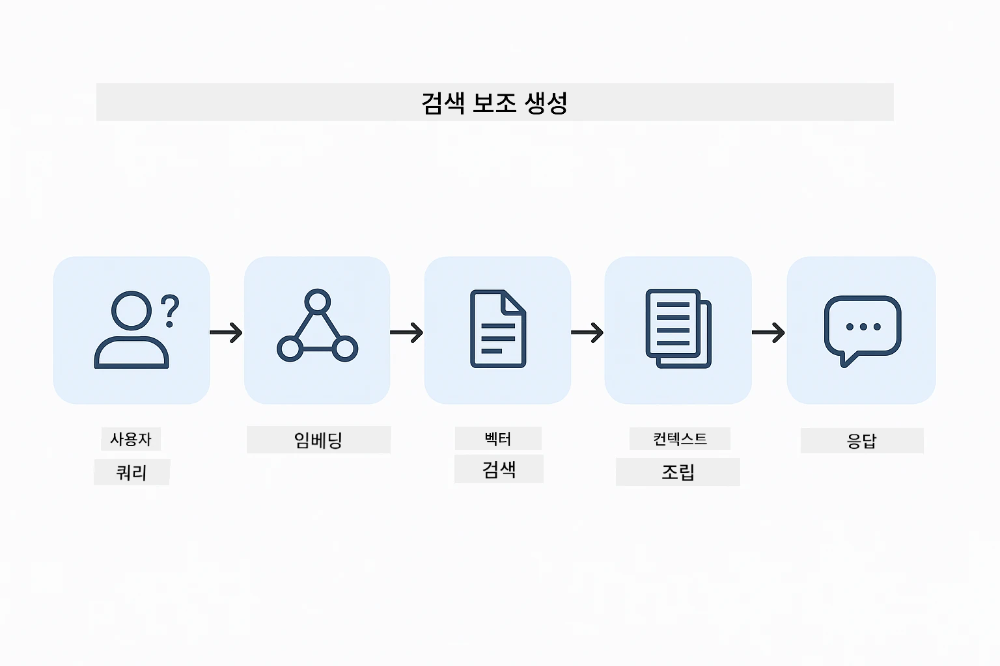
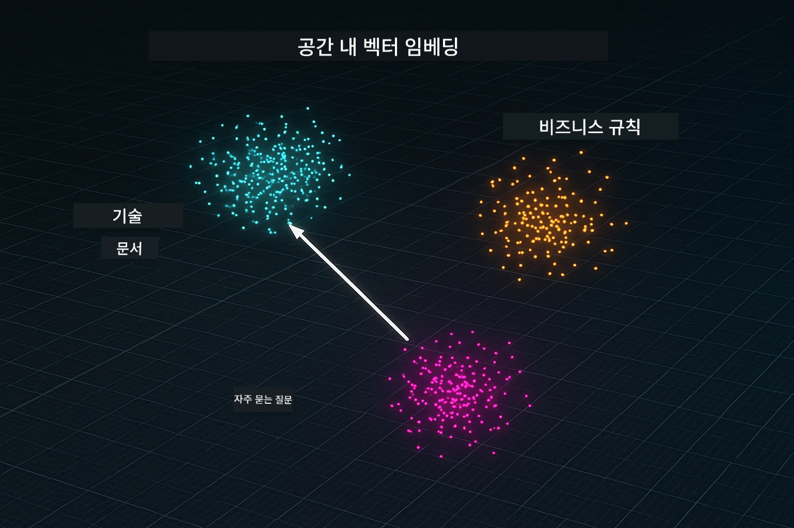
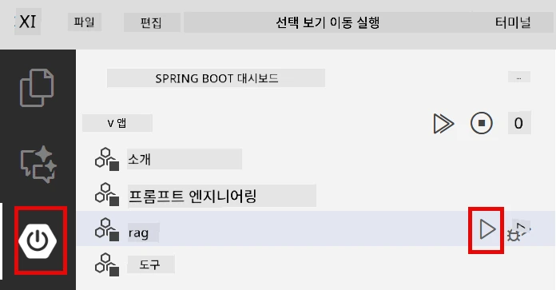
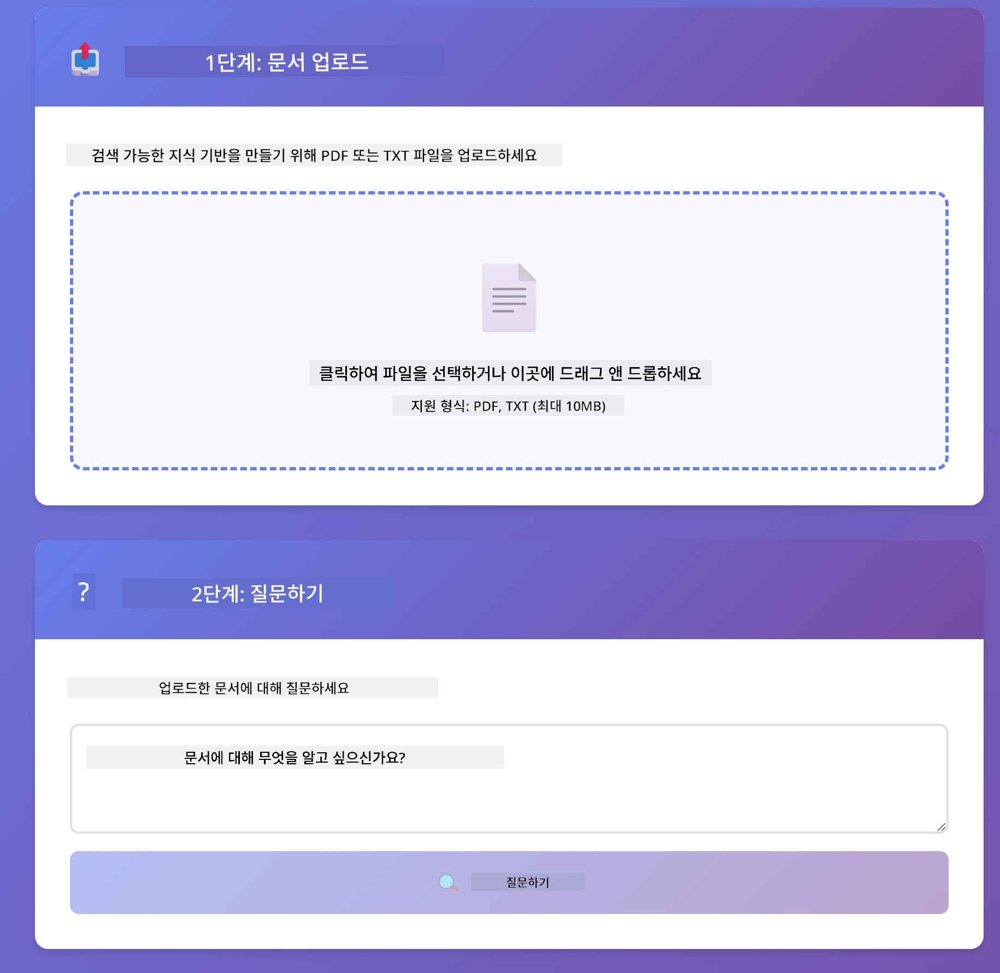
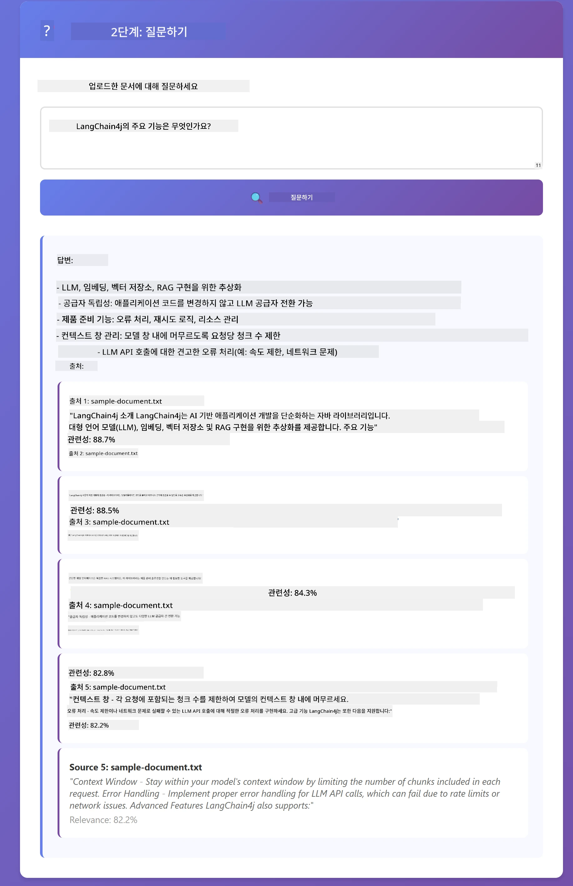

# Module 03: RAG (검색 증강 생성)

## 목차

- [비디오 워크스루](#비디오-워크스루)
- [학습 내용](#학습-내용)
- [필수 조건](#필수-조건)
- [RAG 이해하기](#rag-이해하기)
  - [이 튜토리얼에서 사용하는 RAG 접근법은?](#이-튜토리얼에서-사용하는-rag-접근법은)
- [작동 원리](#작동-원리)
  - [문서 처리](#문서-처리)
  - [임베딩 생성](#임베딩-생성)
  - [시맨틱 검색](#시맨틱-검색)
  - [답변 생성](#응답-생성)
- [애플리케이션 실행하기](#애플리케이션-실행)
- [애플리케이션 사용법](#애플리케이션-사용법)
  - [문서 업로드](#문서-업로드)
  - [질문하기](#질문하기)
  - [소스 참조 확인](#출처-확인하기)
  - [질문 실험하기](#다양한-질문-시도하기)
- [핵심 개념](#주요-개념)
  - [청킹 전략](#청크-분할-전략)
  - [유사도 점수](#유사도-점수)
  - [인메모리 저장소](#인메모리-저장소)
  - [컨텍스트 윈도우 관리](#문맥-창-관리)
- [RAG가 중요한 경우](#rag가-중요한-경우)
- [다음 단계](#다음-단계)

## 비디오 워크스루

이 모듈을 시작하는 방법을 설명하는 라이브 세션을 시청하세요:

<a href="https://www.youtube.com/watch?v=_olq75ZH_eY"></a>

## 학습 내용

이전 모듈에서 AI와 대화하고 프롬프트를 효과적으로 구성하는 방법을 배웠습니다. 하지만 근본적인 한계가 있습니다: 언어 모델은 학습 시에만 알고 있는 정보만을 바탕으로 작동합니다. 회사 정책, 프로젝트 문서, 혹은 학습되지 않은 정보에 대해 질문하면 답변할 수 없습니다.

RAG (검색 증강 생성)는 이 문제를 해결합니다. 모델에게 정보를 직접 가르치려 하기보다(비용과 실용성 문제), 문서 내에서 검색할 수 있는 능력을 제공합니다. 누군가 질문을 하면, 시스템이 관련 정보를 찾아 프롬프트에 포함시키고 모델은 그 검색된 컨텍스트를 바탕으로 답변합니다.

RAG를 모델에게 참고 도서관을 제공하는 것으로 생각해 보세요. 질문하면 시스템은 다음을 수행합니다:

1. **사용자 질의** - 질문을 합니다
2. <strong>임베딩</strong> - 질문을 벡터로 변환합니다
3. **벡터 검색** - 유사한 문서 청크를 찾습니다
4. **컨텍스트 조립** - 관련 청크를 프롬프트에 추가합니다
5. <strong>응답</strong> - LLM이 컨텍스트를 기반으로 답변을 생성합니다

이렇게 하면 모델의 응답이 학습 지식에 근거하지 않고 실제 데이터에 기반하여 제공됩니다.

## 필수 조건

- [Module 01 - 소개](../01-introduction/README.md) 완료 (Azure OpenAI 리소스가 배포되어야 하며 `text-embedding-3-small` 임베딩 모델 포함)
- 루트 디렉터리에 `.env` 파일에 Azure 자격 증명 포함 (`Module 01`에서 `azd up` 실행 시 생성)

> **참고:** Module 01을 완료하지 않았다면 우선 그 지침을 따라 배포하세요. `azd up` 명령은 이 모듈에서 사용하는 GPT 채팅 모델과 임베딩 모델을 모두 배포합니다.

## RAG 이해하기

아래 다이어그램은 핵심 개념을 보여줍니다: 모델의 학습 데이터에만 의존하는 대신, RAG는 답변 생성 전에 참조할 수 있는 문서 라이브러리를 제공합니다.


*이 다이어그램은 일반 LLM(학습 데이터만 추론)과 RAG 강화 LLM(먼저 문서를 참조하는)의 차이를 보여줍니다.*

사용자 질문이 임베딩 → 벡터 검색 → 컨텍스트 조립 → 답변 생성이라는 네 단계로 흐르는 과정을 보여줍니다:



*이 다이어그램은 RAG 파이프라인의 처음부터 끝까지—임베딩, 벡터 검색, 컨텍스트 조립, 답변 생성 단계를 거치는 사용자 질의 흐름을 보여줍니다.*

이 모듈의 나머지 부분은 각 단계를 실제 코드와 함께 상세히 다룹니다.

### 이 튜토리얼에서 사용하는 RAG 접근법은?

LangChain4j는 추상화 수준이 다른 세 가지 RAG 구현 방식을 제공합니다. 아래 다이어그램은 이들을 나란히 비교한 것입니다:


*이 다이어그램은 LangChain4j의 세 가지 RAG 방식(쉬운, 네이티브, 고급)과 주요 구성요소, 사용 시기를 비교합니다.*

| 접근법 | 설명 | 트레이드오프 |
|---|---|---|
| **쉬운 RAG** | `AiServices`와 `ContentRetriever`를 통해 모든 걸 자동으로 연결합니다. 인터페이스에 주석을 달고 리트리버를 연결하면 임베딩, 검색, 프롬프트 조립을 LangChain4j가 처리합니다. | 코드가 최소화되지만 각 단계가 어떻게 동작하는지 볼 수 없습니다. |
| **네이티브 RAG** | 임베딩 모델을 호출하고 저장소를 검색하며 프롬프트를 구성하고 답변을 생성하는 각 단계를 직접 명시적으로 수행합니다. | 코드가 더 많지만 모든 단계를 명확히 보고 수정할 수 있습니다. |
| **고급 RAG** | 플러그형 쿼리 변환기, 라우터, 재순위기, 콘텐츠 주입기를 갖춘 `RetrievalAugmentor` 프레임워크를 사용하여 프로덕션급 파이프라인을 구성합니다. | 가장 유연하지만 복잡도가 크게 증가합니다. |

**이 튜토리얼은 네이티브 방식을 사용합니다.** 쿼리 임베딩, 벡터 저장소 검색, 컨텍스트 조립, 답변 생성 등 RAG 파이프라인의 각 단계가 [`RagService.java`](../../../03-rag/src/main/java/com/example/langchain4j/rag/service/RagService.java)에서 명시적으로 작성되어 있습니다. 학습용으로서 코드를 최소화하는 것보다 각 단계를 보고 이해하는 것이 중요하기 때문입니다. 이후엔 쉽게 쓰려면 쉬운 RAG, 프로덕션용이라면 고급 RAG를 선택할 수 있습니다.

> **💡 쉬운 RAG에 관심 있나요?** LangChain4j는 `AiServices`와 `ContentRetriever`가 임베딩, 검색, 프롬프트 조립을 자동으로 처리하는 *쉬운 RAG* 방식을 지원합니다. 이 모듈은 각 단계를 직접 열어 보고 제어하는 명시적인 경로를 택했습니다.

아래 다이어그램은 쉬운 RAG 파이프라인을 보여줍니다. `AiServices`와 `EmbeddingStoreContentRetriever`가 복잡함을 숨기고 있어, 문서를 로드하고 리트리버만 붙이면 바로 답변을 얻을 수 있습니다. 이 모듈의 네이티브 방식은 그 숨겨진 각 단계를 연 세부 과정을 보여줍니다:


*이 다이어그램은 쉬운 RAG 파이프라인을 나타냅니다. 이 모듈에서 사용하는 네이티브 방식과 비교해 보세요: 쉬운 RAG는 임베딩, 검색, 프롬프트 조립을 `AiServices`와 `ContentRetriever` 뒤에 숨기지만, 네이티브 방식은 각 단계를 직접 호출해 완전한 가시성과 제어를 제공합니다.*

## 작동 원리

이 모듈의 RAG 파이프라인은 사용자가 질문할 때마다 순차적으로 네 단계로 실행됩니다. 먼저 업로드된 문서를 **파싱하고 청킹(분할)** 합니다. 그런 다음 청크들을 <strong>벡터 임베딩</strong>으로 변환하여 저장하고, 쿼리가 들어오면 <strong>시맨틱 검색</strong>으로 관련 청크를 찾고, 마지막으로 이 청크들을 LLM에 컨텍스트로 넘겨 <strong>답변 생성</strong>을 합니다. 아래 섹션은 각 단계를 코드 및 도표로 설명합니다. 첫 번째 단계를 살펴보겠습니다.

### 문서 처리

[DocumentService.java](../../../03-rag/src/main/java/com/example/langchain4j/rag/service/DocumentService.java)

문서를 업로드하면 시스템이 PDF 또는 일반 텍스트를 파싱하고, 파일명 같은 메타데이터를 추가한 후, 모델의 컨텍스트 윈도우에 잘 맞는 크기로 청크로 나눕니다. 청크끼리는 경계에서 약간 겹칩니다.

```java
// 업로드된 파일을 파싱하고 LangChain4j 문서에 래핑합니다
Document document = Document.from(content, metadata);

// 30토큰 겹침을 가진 300토큰 청크로 분할합니다
DocumentSplitter splitter = DocumentSplitters
    .recursive(300, 30);

List<TextSegment> segments = splitter.split(document);
```

아래 다이어그램은 이를 시각적으로 보여줍니다. 각 청크가 이웃 청크와 약간씩 토큰을 공유하는데, 30토큰 겹침은 중요한 컨텍스트가 경계에서 끊어지지 않도록 보장합니다:


*이 다이어그램은 문서를 300토큰 크기 청크로 나누고 30토큰씩 겹쳐 청크 경계에서 컨텍스트를 유지하는 방법을 보여줍니다.*

> **🤖 [GitHub Copilot](https://github.com/features/copilot) Chat과 함께 시도해 보세요:** [`DocumentService.java`](../../../03-rag/src/main/java/com/example/langchain4j/rag/service/DocumentService.java)를 열고 질문해 보세요:
> - "LangChain4j가 문서를 어떻게 청킹하고 겹침이 왜 중요한가요?"
> - "문서 타입별 최적 청크 크기는 무엇이며 이유는?"
> - "다국어 문서나 특수 포맷 문서는 어떻게 처리하나요?"

### 임베딩 생성

[LangChainRagConfig.java](../../../03-rag/src/main/java/com/example/langchain4j/rag/config/LangChainRagConfig.java)

각 청크는 임베딩이라고 하는 수치적 표현으로 변환됩니다 — 본질적으로 의미를 수치로 바꾸는 역할입니다. 임베딩 모델은 챗 모델처럼 "똑똑한" 것이 아닙니다; 명령을 따르거나 추론하거나 질문에 답할 수 없습니다. 다만, 비슷한 의미를 가진 텍스트들이 가까운 수학적 공간에 놓이도록 매핑합니다 — "car"와 "automobile", "refund policy"와 "return my money"가 비슷하게 위치하는 것처럼요. 챗 모델을 사람이랑 대화하는 것에 비유한다면 임베딩 모델은 매우 잘 짜인 분류 시스템입니다.

아래 다이어그램은 이 개념을 시각화합니다 — 텍스트가 들어가면 수치 벡터가 나오고, 비슷한 의미들은 서로 가까운 벡터로 나타납니다:


*이 다이어그램은 임베딩 모델이 텍스트를 수치 벡터로 변환하고, "car"와 "automobile"처럼 비슷한 의미가 벡터 공간에서 가까이 위치하는 방식을 보여줍니다.*

```java
@Bean
public EmbeddingModel embeddingModel() {
    return OpenAiOfficialEmbeddingModel.builder()
        .baseUrl(azureOpenAiEndpoint)
        .apiKey(azureOpenAiKey)
        .modelName(azureEmbeddingDeploymentName)
        .build();
}

EmbeddingStore<TextSegment> embeddingStore = 
    new InMemoryEmbeddingStore<>();
```

아래 클래스 다이어그램은 RAG 파이프라인의 두 흐름과 이를 구현한 LangChain4j 클래스를 보여줍니다. **인제스션 흐름**(업로드 시 단 한 번 실행)은 문서를 분할하고 청크를 임베딩한 뒤 `.addAll()`로 저장합니다. **쿼리 흐름**(사용자 질문 시 실행)은 질문을 임베딩하고 `.search()`로 저장소를 검색한 뒤 매칭된 컨텍스트를 채팅 모델에 전달합니다. 두 흐름은 공용 `EmbeddingStore<TextSegment>` 인터페이스를 경유합니다:


*이 다이어그램은 RAG 파이프라인의 인제스션 및 쿼리 두 흐름과 공용 EmbeddingStore를 통한 연결을 보여줍니다.*

임베딩이 저장되면 유사한 내용은 벡터 공간에서 자연스럽게 군집을 이룹니다. 아래 시각화는 관련 주제 문서들이 3D 벡터 공간에서 근접한 점으로 나타나는 모습을 보여주어 시맨틱 검색의 가능성을 시사합니다:



*이 시각화는 기술 문서, 비즈니스 규칙, FAQ 같은 주제가 3D 벡터 공간에서 별도 클러스터를 형성하는 방식을 보여줍니다.*

사용자가 검색할 때 시스템은 네 단계를 거칩니다: 문서를 한 번 임베딩, 검색 시 쿼리 임베딩, 쿼리 벡터와 저장된 모든 벡터를 코사인 유사도로 비교, 그 중 상위 K개 청크 반환. 아래 다이어그램은 각 단계와 관여하는 LangChain4j 클래스를 표시합니다:


*이 다이어그램은 임베딩 검색 과정 네 단계를 — 문서 임베딩, 쿼리 임베딩, 코사인 유사도 비교, 상위 K결과 반환 — 보여줍니다.*

### 시맨틱 검색

[RagService.java](../../../03-rag/src/main/java/com/example/langchain4j/rag/service/RagService.java)

사용자가 질문을 하면 질문 자체도 임베딩으로 변환됩니다. 시스템은 질문 임베딩과 모든 문서 청크 임베딩을 비교하여 가장 의미가 비슷한 청크를 찾습니다 — 키워드 일치뿐 아니라 실제 시맨틱 유사성을 평가합니다.

```java
Embedding queryEmbedding = embeddingModel.embed(question).content();

EmbeddingSearchRequest searchRequest = EmbeddingSearchRequest.builder()
    .queryEmbedding(queryEmbedding)
    .maxResults(5)
    .minScore(0.5)
    .build();

EmbeddingSearchResult<TextSegment> searchResult = embeddingStore.search(searchRequest);
List<EmbeddingMatch<TextSegment>> matches = searchResult.matches();

for (EmbeddingMatch<TextSegment> match : matches) {
    String relevantText = match.embedded().text();
    double score = match.score();
}
```

아래 다이어그램은 시맨틱 검색과 전통적인 키워드 검색을 대비하여 설명합니다. "vehicle" 검색 키워드로는 "cars and trucks"가 포함된 청크를 놓치지만, 시맨틱 검색은 동일한 의미임을 이해해 상위 점수를 줍니다:


*이 다이어그램은 키워드 기반 검색과 시맨틱 검색을 비교하며, 시맨틱 검색은 정확한 키워드가 다르더라도 개념적으로 연관된 내용을 찾아서 반환하는 모습을 나타냅니다.*

내부적으로 유사도는 코사인 유사도로 측정합니다 — "두 벡터가 같은 방향을 가리키는지"를 묻는 셈입니다. 서로 다른 단어를 써도 의미가 같으면 벡터 방향이 같아 점수가 1.0에 가까워집니다:


*이 다이어그램은 임베딩 벡터 사이의 각도로 코사인 유사도를 나타냅니다 — 더 정렬된 벡터는 1.0에 가까운 점수를 획득하여 더 높은 의미론적 유사성을 나타냅니다.*

> **🤖 [GitHub Copilot](https://github.com/features/copilot) Chat으로 시도해보세요:** [`RagService.java`](../../../03-rag/src/main/java/com/example/langchain4j/rag/service/RagService.java)를 열고 다음을 물어보세요:
> - "임베딩과 함께 유사도 검색은 어떻게 작동하며 점수는 무엇에 의해 결정되나요?"
> - "어떤 유사도 임계값을 사용해야 하며 결과에 어떤 영향을 미치나요?"
> - "관련 문서를 찾지 못한 경우 어떻게 처리하나요?"

### 응답 생성

[RagService.java](../../../03-rag/src/main/java/com/example/langchain4j/rag/service/RagService.java)

가장 관련성 높은 청크들은 명확한 지침, 검색된 문맥, 그리고 사용자의 질문을 포함하는 구조화된 프롬프트로 조립됩니다. 모델은 특정 청크만 읽고 이 정보를 바탕으로 답변을 생성하여 환각을 방지합니다.

```java
String context = matches.stream()
    .map(match -> match.embedded().text())
    .collect(Collectors.joining("\n\n"));

String prompt = String.format("""
    Answer the question based on the following context.
    If the answer cannot be found in the context, say so.

    Context:
    %s

    Question: %s

    Answer:""", context, request.question());

String answer = chatModel.chat(prompt);
```

아래 다이어그램은 조립 과정을 보여줍니다 — 검색 단계에서 최고 점수를 받은 청크들이 프롬프트 템플릿에 삽입되고, `OpenAiOfficialChatModel`이 근거 있는 답변을 생성합니다:


*이 다이어그램은 최고 점수를 받은 청크들을 구조화된 프롬프트로 조립하여 모델이 데이터에서 근거 있는 답변을 생성하는 방식을 보여줍니다.*

## 애플리케이션 실행

**배포 확인:**

루트 디렉토리에 Azure 자격 증명과 함께 `.env` 파일이 존재하는지 확인하세요(Module 01에서 생성됨). 모듈 디렉토리(`03-rag/`)에서 다음 명령을 실행합니다:

**Bash:**
```bash
cat ../.env  # AZURE_OPENAI_ENDPOINT, API_KEY, DEPLOYMENT을 표시해야 합니다
```

**PowerShell:**
```powershell
Get-Content ..\.env  # AZURE_OPENAI_ENDPOINT, API_KEY, DEPLOYMENT를 보여야 합니다
```

**애플리케이션 시작:**

> **참고:** 루트 디렉토리에서 `./start-all.sh`를 사용해 모든 애플리케이션을 이미 시작했다면(Module 01에 설명된 대로), 이 모듈은 이미 포트 8081에서 실행 중입니다. 아래 시작 명령은 건너뛰고 바로 http://localhost:8081 로 이동할 수 있습니다.

**옵션 1: Spring Boot 대시보드 사용 (VS Code 사용자 권장)**

개발 컨테이너에는 모든 Spring Boot 애플리케이션을 관리할 수 있는 Spring Boot 대시보드 확장 기능이 포함되어 있습니다. VS Code 왼쪽의 Activity Bar에서 Spring Boot 아이콘을 찾으세요.

Spring Boot 대시보드에서 할 수 있는 작업:
- 워크스페이스의 모든 Spring Boot 애플리케이션 보기
- 클릭 한 번으로 애플리케이션 시작/중지
- 실시간 애플리케이션 로그 확인
- 애플리케이션 상태 모니터링

"rag" 옆의 재생 버튼을 클릭해 이 모듈을 시작하거나 모든 모듈을 한 번에 시작할 수 있습니다.



*이 스크린샷은 VS Code에서 Spring Boot 대시보드를 보여주며, 여기서 애플리케이션을 시각적으로 시작, 중지 및 모니터링할 수 있습니다.*

**옵션 2: 셸 스크립트 사용**

모든 웹 애플리케이션(모듈 01-04) 시작:

**Bash:**
```bash
cd ..  # 루트 디렉토리에서
./start-all.sh
```

**PowerShell:**
```powershell
cd ..  # 루트 디렉터리에서
.\start-all.ps1
```

또는 이 모듈만 시작:

**Bash:**
```bash
cd 03-rag
./start.sh
```

**PowerShell:**
```powershell
cd 03-rag
.\start.ps1
```

두 스크립트 모두 루트 `.env` 파일에서 환경 변수를 자동으로 로드하며, JAR 파일이 없는 경우 빌드합니다.

> **참고:** 시작하기 전에 모든 모듈을 수동으로 빌드하려면:
>
> **Bash:**
> ```bash
> cd ..  # Go to root directory
> mvn clean package -DskipTests
> ```
>
> **PowerShell:**
> ```powershell
> cd ..  # Go to root directory
> mvn clean package -DskipTests
> ```

브라우저에서 http://localhost:8081 을 엽니다.

**중지하려면:**

**Bash:**
```bash
./stop.sh  # 이 모듈만
# 또는
cd .. && ./stop-all.sh  # 모든 모듈
```

**PowerShell:**
```powershell
.\stop.ps1  # 이 모듈만
# 또는
cd ..; .\stop-all.ps1  # 모든 모듈
```

## 애플리케이션 사용법

애플리케이션은 문서 업로드와 질문을 위한 웹 인터페이스를 제공합니다.

<a href="images/rag-homepage.png"></a>

*이 스크린샷은 문서를 업로드하고 질문하는 RAG 애플리케이션 인터페이스를 보여줍니다.*

### 문서 업로드

먼저 문서를 업로드하세요 - 테스트용으로는 TXT 파일이 가장 적합합니다. 이 디렉토리에 `sample-document.txt` 파일이 포함되어 있으며, LangChain4j 기능, RAG 구현, 모범 사례에 대한 정보가 들어있어 테스트에 완벽합니다.

시스템은 문서를 처리하고, 청크로 분할하며, 각 청크에 대한 임베딩을 생성합니다. 업로드 시 자동으로 수행됩니다.

### 질문하기

이제 문서 내용에 대해 구체적인 질문을 해보세요. 문서에 명확히 명시된 사실 기반 질문이 좋습니다. 시스템은 관련 청크를 검색해 프롬프트에 포함하고 답변을 생성합니다.

### 출처 확인하기

각 답변에는 유사도 점수가 포함된 출처 참조가 포함되어 있습니다. 이 점수(0~1)는 각 청크가 질문과 얼마나 관련성이 높은지를 보여줍니다. 점수가 높을수록 더 좋은 매칭입니다. 이를 통해 답변의 출처 자료와 대조할 수 있습니다.

<a href="images/rag-query-results.png"></a>

*이 스크린샷은 생성된 답변, 출처 참조, 검색된 각 청크의 관련성 점수를 포함한 쿼리 결과를 보여줍니다.*

### 다양한 질문 시도하기

다양한 유형의 질문을 시도해보세요:
- 구체적인 사실: "주요 주제가 무엇인가요?"
- 비교: "X와 Y의 차이점은 무엇인가요?"
- 요약: "Z에 대한 주요 내용을 요약해 주세요."

질문과 문서 내용의 매칭 정도에 따라 관련성 점수가 어떻게 변하는지 관찰하세요.

## 주요 개념

### 청크 분할 전략

문서는 300토큰 청크로 분할되며, 30토큰이 중첩됩니다. 이 균형은 청크가 적절한 맥락을 포함하되 너무 크지 않아 프롬프트에 여러 청크를 포함할 수 있도록 합니다.

### 유사도 점수

검색된 각 청크에는 0과 1 사이의 유사도 점수가 붙으며, 이는 사용자의 질문과 얼마나 밀접하게 일치하는지를 나타냅니다. 아래 다이어그램은 점수 범위와 시스템이 이를 사용해 결과를 필터링하는 방식을 시각화합니다:


*이 다이어그램은 0에서 1 범위의 점수와 0.5 이상의 최소 임계값이 어떻게 관련 없는 청크를 필터링하는지 보여줍니다.*

점수 범위는 다음과 같습니다:
- 0.7-1.0: 매우 관련성 높음, 정확한 매칭
- 0.5-0.7: 관련성 있음, 양호한 문맥
- 0.5 미만: 필터링 됨, 너무 이질적임

시스템은 품질을 보장하기 위해 최소 임계값 이상인 청크만 검색합니다.

임베딩은 의미가 명확히 군집될 때 잘 작동하지만, 맹점도 존재합니다. 아래 다이어그램은 일반적인 실패 모드를 보여줍니다 — 너무 큰 청크는 흐릿한 벡터를 만들고, 너무 작은 청크는 문맥이 부족하며, 애매한 용어는 여러 군집을 가리키고, 정확 매칭 조회(ID, 부품 번호)는 임베딩에서 작동하지 않습니다:


*이 다이어그램은 일반적인 임베딩 실패 모드를 보여줍니다: 청크가 너무 크거나, 너무 작거나, 여러 군집을 가리키는 애매한 용어, 그리고 ID 같은 정확 매칭 조회.*

### 인메모리 저장소

이 모듈은 간단히 하기 위해 인메모리 저장소를 사용합니다. 애플리케이션을 재시작하면 업로드된 문서가 사라집니다. 실제 환경에서는 Qdrant 나 Azure AI Search 같은 영구 벡터 데이터베이스를 사용합니다.

### 문맥 창 관리

각 모델은 최대 문맥 창이 있습니다. 큰 문서에서 모든 청크를 포함할 수 없습니다. 시스템은 정확한 답변을 제공하면서 한도를 지키기 위해 가장 관련성 높은 상위 N개 청크(기본값 5개)만 검색합니다.

## RAG가 중요한 경우

RAG는 항상 적합한 접근법은 아닙니다. 아래 의사결정 가이드는 RAG가 가치를 더하는 경우와, 단순히 프롬프트에 내용을 포함하거나 모델 내장 지식에 의존하는 것이 충분한 경우를 구분하는 데 도움이 됩니다:


*이 다이어그램은 RAG가 가치를 더하는 경우와 단순한 접근법이 충분한 경우에 대한 의사결정 가이드를 보여줍니다.*

## 다음 단계

**다음 모듈:** [04-tools - AI Agents with Tools](../04-tools/README.md)

---

**탐색:** [← 이전: Module 02 - Prompt Engineering](../02-prompt-engineering/README.md) | [메인으로 돌아가기](../README.md) | [다음: Module 04 - Tools →](../04-tools/README.md)

---

<!-- CO-OP TRANSLATOR DISCLAIMER START -->
**면책 조항**:
이 문서는 AI 번역 서비스 [Co-op Translator](https://github.com/Azure/co-op-translator)를 사용하여 번역되었습니다. 정확성을 기하기 위해 노력하고 있으나, 자동 번역은 오류나 부정확한 부분이 있을 수 있음을 유의하시기 바랍니다. 원본 문서의 원어본이 권위 있는 자료로 간주되어야 합니다. 중요한 정보의 경우, 전문가의 인간 번역을 권장합니다. 이 번역 사용으로 인해 발생하는 오해나 잘못된 해석에 대해 당사는 책임을 지지 않습니다.
<!-- CO-OP TRANSLATOR DISCLAIMER END -->