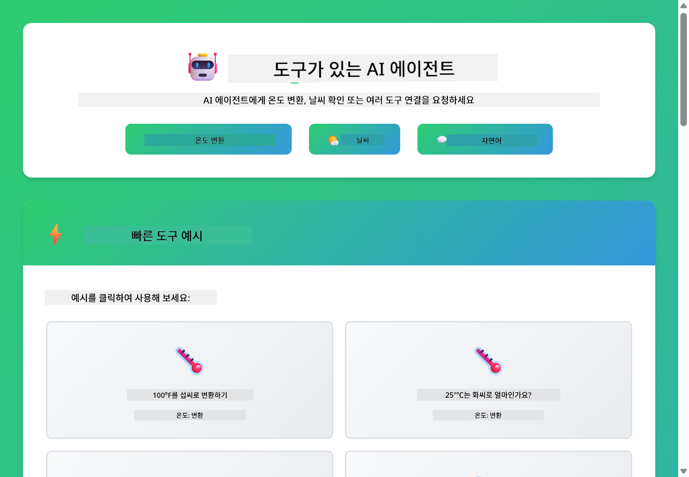
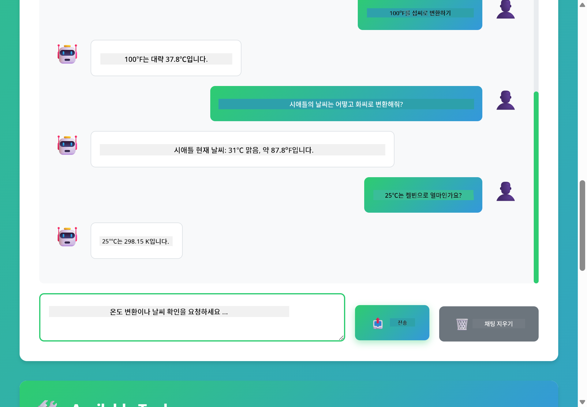

<!--
CO_OP_TRANSLATOR_METADATA:
{
  "original_hash": "13ec450c12cdd1a863baa2b778f27cd7",
  "translation_date": "2025-12-30T22:15:44+00:00",
  "source_file": "04-tools/README.md",
  "language_code": "ko"
}
-->
# 모듈 04: 도구를 사용하는 AI 에이전트

## 목차

- [배울 내용](../../../04-tools)
- [전제 조건](../../../04-tools)
- [도구를 사용하는 AI 에이전트 이해하기](../../../04-tools)
- [도구 호출 작동 방식](../../../04-tools)
  - [도구 정의](../../../04-tools)
  - [의사 결정](../../../04-tools)
  - [실행](../../../04-tools)
  - [응답 생성](../../../04-tools)
- [도구 체이닝](../../../04-tools)
- [애플리케이션 실행하기](../../../04-tools)
- [애플리케이션 사용법](../../../04-tools)
  - [간단한 도구 사용 시도](../../../04-tools)
  - [도구 체이닝 테스트](../../../04-tools)
  - [대화 흐름 보기](../../../04-tools)
  - [추론 관찰하기](../../../04-tools)
  - [다양한 요청 실험하기](../../../04-tools)
- [핵심 개념](../../../04-tools)
  - [ReAct 패턴 (추론과 행동)](../../../04-tools)
  - [도구 설명의 중요성](../../../04-tools)
  - [세션 관리](../../../04-tools)
  - [오류 처리](../../../04-tools)
- [사용 가능한 도구](../../../04-tools)
- [도구 기반 에이전트를 언제 사용해야 하나요](../../../04-tools)
- [다음 단계](../../../04-tools)

## 배울 내용

지금까지는 AI와 대화하는 방법, 프롬프트를 효과적으로 구성하는 방법, 문서에 기반해 응답을 근거화하는 방법을 배웠습니다. 하지만 근본적인 제한이 하나 있습니다: 언어 모델은 텍스트만 생성할 수 있습니다. 날씨를 확인하거나 계산을 수행하거나 데이터베이스를 조회하거나 외부 시스템과 상호작용할 수는 없습니다.

도구가 이를 바꿉니다. 모델에 호출할 수 있는 함수를 제공하면 텍스트 생성기에서 행동을 취할 수 있는 에이전트로 변환됩니다. 모델은 도구가 필요할 때, 어떤 도구를 사용할지, 어떤 매개변수를 전달할지 결정합니다. 귀하의 코드는 함수를 실행하고 결과를 반환합니다. 모델은 그 결과를 응답에 통합합니다.

## 전제 조건

- 모듈 01 완료 (Azure OpenAI 리소스 배포)
- 루트 디렉터리에 Azure 자격 증명이 포함된 `.env` 파일 (모듈 01에서 `azd up`으로 생성됨)

> **참고:** 모듈 01을 완료하지 않았다면 먼저 그곳의 배포 지침을 따르세요.

## 도구를 사용하는 AI 에이전트 이해하기

> **📝 참고:** 이 모듈에서 "에이전트"라는 용어는 도구 호출 기능이 향상된 AI 어시스턴트를 의미합니다. 이는 우리가 [Module 05: MCP](../05-mcp/README.md)에서 다룰 **Agentic AI** 패턴(계획, 메모리, 다단계 추론을 가진 자율 에이전트)과는 다릅니다.

도구를 가진 AI 에이전트는 추론 및 행동 패턴(ReAct)을 따릅니다:

1. 사용자가 질문을 한다
2. 에이전트는 무엇을 알아야 하는지 추론한다
3. 에이전트는 답변에 도구가 필요한지 결정한다
4. 필요하면 적절한 매개변수를 사용해 적절한 도구를 호출한다
5. 도구가 실행되고 데이터를 반환한다
6. 에이전트는 결과를 통합하고 최종 답변을 제공한다


*ReAct 패턴 - AI 에이전트가 문제를 해결하기 위해 추론과 행동을 번갈아 가며 수행하는 방식*

이 과정은 자동으로 발생합니다. 귀하는 도구와 그 설명을 정의합니다. 모델은 언제 어떻게 도구를 사용할지에 대한 의사결정을 처리합니다.

## 도구 호출 작동 방식

**도구 정의** - [WeatherTool.java](../../../04-tools/src/main/java/com/example/langchain4j/agents/tools/WeatherTool.java) | [TemperatureTool.java](../../../04-tools/src/main/java/com/example/langchain4j/agents/tools/TemperatureTool.java)

명확한 설명과 매개변수 사양을 가진 함수를 정의합니다. 모델은 이러한 설명을 시스템 프롬프트에서 보고 각 도구가 무엇을 하는지 이해합니다.

```java
@Component
public class WeatherTool {
    
    @Tool("Get the current weather for a location")
    public String getCurrentWeather(@P("Location name") String location) {
        // 날씨 조회 로직
        return "Weather in " + location + ": 22°C, cloudy";
    }
}

@AiService
public interface Assistant {
    String chat(@MemoryId String sessionId, @UserMessage String message);
}

// Assistant는 Spring Boot에 의해 자동으로 다음과 같이 연결됩니다:
// - ChatModel 빈
// - @Component 클래스의 모든 @Tool 메서드
// - 세션 관리를 위한 ChatMemoryProvider
```

> **🤖 [GitHub Copilot](https://github.com/features/copilot) 채팅으로 시도해 보세요:** [`WeatherTool.java`](../../../04-tools/src/main/java/com/example/langchain4j/agents/tools/WeatherTool.java)를 열고 다음을 물어보세요:
> - "모의 데이터 대신 OpenWeatherMap 같은 실제 날씨 API를 통합하려면 어떻게 해야 하나요?"
> - "AI가 도구를 올바르게 사용하도록 돕는 좋은 도구 설명의 조건은 무엇인가요?"
> - "도구 구현에서 API 오류와 요청 제한을 어떻게 처리하나요?"

**의사 결정**

사용자가 "시애틀의 날씨는 어때?"라고 물으면 모델은 날씨 도구가 필요함을 인식합니다. 모델은 location 매개변수가 "Seattle"로 설정된 함수 호출을 생성합니다.

**실행** - [AgentService.java](../../../04-tools/src/main/java/com/example/langchain4j/agents/service/AgentService.java)

Spring Boot는 등록된 모든 도구로 선언적 `@AiService` 인터페이스를 자동 주입하고, LangChain4j는 도구 호출을 자동으로 실행합니다.

> **🤖 [GitHub Copilot](https://github.com/features/copilot) 채팅으로 시도해 보세요:** [`AgentService.java`](../../../04-tools/src/main/java/com/example/langchain4j/agents/service/AgentService.java)를 열고 다음을 물어보세요:
> - "ReAct 패턴은 어떻게 작동하며 왜 에이전트에 효과적인가요?"
> - "에이전트는 어떤 도구를 어떤 순서로 사용할지 어떻게 결정하나요?"
> - "도구 실행에 실패하면 어떻게 되나요 - 오류를 강건하게 처리하려면 어떻게 해야 하나요?"

**응답 생성**

모델은 날씨 데이터를 받고 이를 자연스러운 언어 응답으로 사용자에게 포맷합니다.

### 선언적 AI 서비스 사용 이유

이 모듈은 LangChain4j의 Spring Boot 통합과 선언적 `@AiService` 인터페이스를 사용합니다:

- **Spring Boot 자동 주입** - ChatModel 및 도구들이 자동으로 주입됨
- **@MemoryId 패턴** - 세션 기반 자동 메모리 관리
- **단일 인스턴스** - 어시스턴트가 한 번 생성되어 재사용되어 성능 향상
- **타입 안전 실행** - Java 메서드가 타입 변환과 함께 직접 호출됨
- **다중 턴 오케스트레이션** - 도구 체이닝을 자동으로 처리
- **보일러플레이트 제로** - 수동 AiServices.builder() 호출이나 메모리 HashMap 불필요

대안 접근법(수동 `AiServices.builder()`)은 더 많은 코드가 필요하고 Spring Boot 통합 이점을 놓칩니다.

## 도구 체이닝

**도구 체이닝** - AI는 여러 도구를 순차적으로 호출할 수 있습니다. "시애틀의 날씨가 어때? 우산을 가져가야 할까?"라고 물어보면 `getCurrentWeather`를 호출한 뒤 비 여부에 대해 추론하면서 체이닝하는 것을 볼 수 있습니다.

<a href="images/tool-chaining.png"></a>

*순차적 도구 호출 - 한 도구의 출력이 다음 결정에 입력으로 사용됨*

**우아한 실패 처리** - 모의 데이터에 없는 도시의 날씨를 요청해 보세요. 도구는 오류 메시지를 반환하고 AI는 도와줄 수 없음을 설명합니다. 도구는 안전하게 실패합니다.

이 모든 것은 하나의 대화 턴에서 발생합니다. 에이전트는 여러 도구 호출을 자율적으로 조정합니다.

## 애플리케이션 실행하기

**배포 확인:**

루트 디렉터리에 Azure 자격 증명이 포함된 `.env` 파일이 있는지 확인하세요 (모듈 01 중 생성됨):
```bash
cat ../.env  # AZURE_OPENAI_ENDPOINT, API_KEY, DEPLOYMENT를 표시해야 합니다
```

**애플리케이션 시작:**

> **참고:** 이미 모듈 01에서 `./start-all.sh`를 사용해 모든 애플리케이션을 시작했다면 이 모듈은 이미 포트 8084에서 실행 중입니다. 아래 시작 명령을 건너뛰고 http://localhost:8084 로 바로 이동할 수 있습니다.

**옵션 1: Spring Boot 대시보드 사용(권장, VS Code 사용자용)**

개발 컨테이너에는 모든 Spring Boot 애플리케이션을 관리할 수 있는 Spring Boot Dashboard 확장이 포함되어 있습니다. VS Code 왼쪽 활동 표시줄에서 Spring Boot 아이콘을 찾으세요.

Spring Boot Dashboard에서 할 수 있는 것:
- 작업공간의 모든 Spring Boot 애플리케이션 보기
- 클릭 한 번으로 애플리케이션 시작/중지
- 실시간으로 애플리케이션 로그 보기
- 애플리케이션 상태 모니터링

간단히 "tools" 옆의 재생 버튼을 클릭하여 이 모듈을 시작하거나, 모든 모듈을 한 번에 시작하세요.


**옵션 2: 셸 스크립트 사용**

모든 웹 애플리케이션(모듈 01-04) 시작:

**Bash:**
```bash
cd ..  # 루트 디렉터리에서
./start-all.sh
```

**PowerShell:**
```powershell
cd ..  # 루트 디렉터리에서
.\start-all.ps1
```

또는 이 모듈만 시작:

**Bash:**
```bash
cd 04-tools
./start.sh
```

**PowerShell:**
```powershell
cd 04-tools
.\start.ps1
```

두 스크립트는 루트 `.env` 파일에서 환경 변수를 자동으로 로드하며 JAR 파일이 없으면 빌드합니다.

> **참고:** 시작 전에 모든 모듈을 수동으로 빌드하려면:
>
> **Bash:**
> ```bash
> cd ..  # Go to root directory
> mvn clean package -DskipTests
> ```

> **PowerShell:**
> ```powershell
> cd ..  # Go to root directory
> mvn clean package -DskipTests
> ```

브라우저에서 http://localhost:8084 를 여세요.

**중지하려면:**

**Bash:**
```bash
./stop.sh  # 이 모듈만
# 또는
cd .. && ./stop-all.sh  # 모든 모듈
```

**PowerShell:**
```powershell
.\stop.ps1  # 이 모듈만
# 또는
cd ..; .\stop-all.ps1  # 모든 모듈
```

## 애플리케이션 사용법

이 애플리케이션은 날씨 및 온도 변환 도구에 접근할 수 있는 AI 에이전트와 상호작용할 수 있는 웹 인터페이스를 제공합니다.

<a href="images/tools-homepage.png"></a>

*AI 에이전트 도구 인터페이스 - 도구와 상호작용하기 위한 빠른 예제와 채팅 인터페이스*

**간단한 도구 사용 시도**

간단한 요청부터 시작하세요: "100도 화씨를 섭씨로 변환해줘". 에이전트는 온도 변환 도구가 필요함을 인식하고 올바른 매개변수로 호출하여 결과를 반환합니다. 어떤 도구를 사용하거나 어떻게 호출해야 하는지 지정하지 않았는데도 매우 자연스럽게 동작하는 것을 확인할 수 있습니다.

**도구 체이닝 테스트**

이제 좀 더 복잡한 것을 시도해 보세요: "시애틀의 날씨가 어때? 그리고 화씨로 변환해줘." 에이전트가 단계별로 처리하는 과정을 지켜보세요. 먼저 날씨를 가져오고(섭씨로 반환됨), 화씨로 변환해야 함을 인식하고 변환 도구를 호출한 뒤 두 결과를 결합하여 하나의 응답으로 제공합니다.

**대화 흐름 보기**

채팅 인터페이스는 대화 기록을 유지하므로 다중 턴 상호작용이 가능합니다. 이전의 모든 쿼리와 응답을 확인할 수 있어 대화를 추적하고 에이전트가 여러 교환을 통해 맥락을 어떻게 구축하는지 이해하기 쉽습니다.

<a href="images/tools-conversation-demo.png"></a>

*단순 변환, 날씨 조회 및 도구 체이닝을 보여주는 다중 턴 대화*

**다양한 요청 실험하기**

다음과 같은 조합을 시도해 보세요:
- 날씨 조회: "도쿄의 날씨는 어때?"
- 온도 변환: "25°C는 켈빈으로 얼마야?"
- 결합 쿼리: "파리의 날씨를 확인하고 20°C 이상인지 알려줘"

에이전트가 자연어를 해석하고 적절한 도구 호출로 매핑하는 방식을 관찰해 보세요.

## 핵심 개념

**ReAct 패턴 (추론과 행동)**

에이전트는 추론(무엇을 할지 결정)과 행동(도구 사용)을 번갈아 수행합니다. 이 패턴은 단순한 지시 응답보다 자율적인 문제 해결을 가능하게 합니다.

**도구 설명의 중요성**

도구 설명의 품질은 에이전트가 도구를 얼마나 잘 사용하는지에 직접적인 영향을 미칩니다. 명확하고 구체적인 설명은 모델이 언제 어떻게 각 도구를 호출해야 하는지 이해하는 데 도움이 됩니다.

**세션 관리**

`@MemoryId` 애너테이션은 자동 세션 기반 메모리 관리를 가능하게 합니다. 각 세션 ID는 `ChatMemoryProvider` 빈이 관리하는 고유한 `ChatMemory` 인스턴스를 얻어 수동 메모리 추적이 필요 없습니다.

**오류 처리**

도구는 실패할 수 있습니다 - API가 타임아웃되거나 매개변수가 유효하지 않거나 외부 서비스가 중단될 수 있습니다. 운영 환경의 에이전트는 모델이 문제를 설명하거나 대안을 시도할 수 있도록 오류 처리가 필요합니다.

## 사용 가능한 도구

**날씨 도구** (시연을 위한 모의 데이터):
- 위치의 현재 날씨 가져오기
- 다일 예측 가져오기

**온도 변환 도구**:
- 섭씨에서 화씨로
- 화씨에서 섭씨로
- 섭씨에서 켈빈으로
- 켈빈에서 섭씨로
- 화씨에서 켈빈으로
- 켈빈에서 화씨로

이들은 단순한 예제이지만, 이 패턴은 데이터베이스 쿼리, API 호출, 계산, 파일 작업 또는 시스템 명령 등 모든 함수에 확장될 수 있습니다.

## 도구 기반 에이전트를 언제 사용해야 하나요

**도구를 사용하세요 when:**
- 실시간 데이터(날씨, 주가, 재고 등)가 필요할 때
- 간단한 수학을 넘어선 계산이 필요할 때
- 데이터베이스나 API에 접근해야 할 때
- 작업을 수행해야 할 때(이메일 전송, 티켓 생성, 레코드 업데이트)
- 여러 데이터 소스를 결합해야 할 때

**도구를 사용하지 마세요 when:**
- 질문이 일반 지식으로 답할 수 있을 때
- 응답이 순수하게 대화형일 때
- 도구 지연 시간이 경험을 너무 느리게 만들 때

## 다음 단계

**다음 모듈:** [05-mcp - Model Context Protocol (MCP)](../05-mcp/README.md)

---

**탐색:** [← 이전: 모듈 03 - RAG](../03-rag/README.md) | [메인으로 돌아가기](../README.md) | [다음: 모듈 05 - MCP →](../05-mcp/README.md)

---

<!-- CO-OP TRANSLATOR DISCLAIMER START -->
면책사항:
이 문서는 AI 번역 서비스 [Co-op Translator](https://github.com/Azure/co-op-translator)를 사용하여 번역되었습니다. 정확성을 위해 최선을 다하고 있으나 자동 번역에는 오류나 부정확성이 있을 수 있습니다. 원문(원어로 된 문서)을 권위 있는 출처로 간주하시기 바랍니다. 중요한 정보의 경우 전문적인 인간 번역을 권장합니다. 본 번역의 사용으로 인해 발생하는 오해나 잘못된 해석에 대해서는 당사는 책임을 지지 않습니다.
<!-- CO-OP TRANSLATOR DISCLAIMER END -->