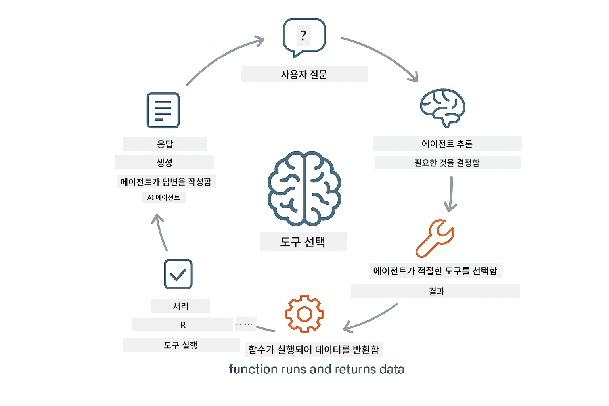
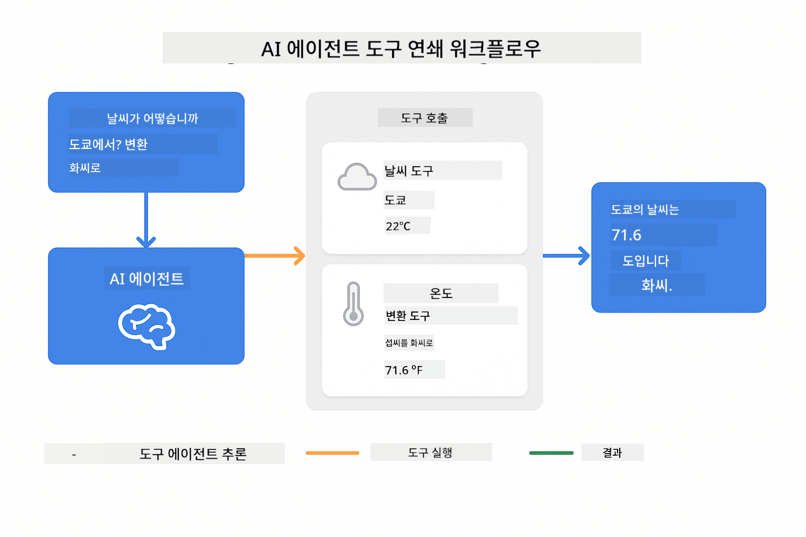
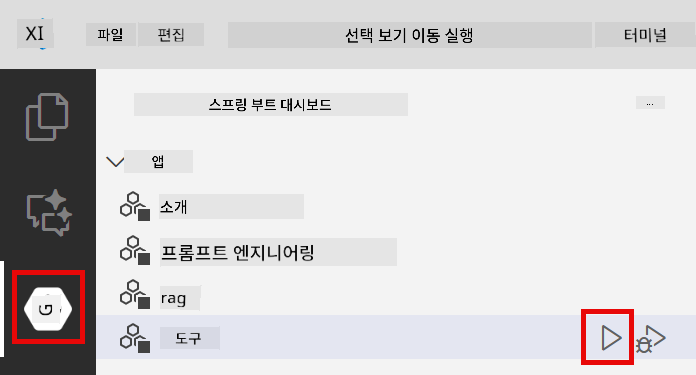

<!--
CO_OP_TRANSLATOR_METADATA:
{
  "original_hash": "aa23f106e7f53270924c9dd39c629004",
  "translation_date": "2025-12-13T18:36:29+00:00",
  "source_file": "04-tools/README.md",
  "language_code": "ko"
}
-->
# Module 04: 도구가 있는 AI 에이전트

## 목차

- [학습 내용](../../../04-tools)
- [사전 준비 사항](../../../04-tools)
- [도구가 있는 AI 에이전트 이해하기](../../../04-tools)
- [도구 호출 작동 방식](../../../04-tools)
  - [도구 정의](../../../04-tools)
  - [의사 결정](../../../04-tools)
  - [실행](../../../04-tools)
  - [응답 생성](../../../04-tools)
- [도구 체이닝](../../../04-tools)
- [애플리케이션 실행하기](../../../04-tools)
- [애플리케이션 사용법](../../../04-tools)
  - [간단한 도구 사용해보기](../../../04-tools)
  - [도구 체이닝 테스트하기](../../../04-tools)
  - [대화 흐름 보기](../../../04-tools)
  - [추론 관찰하기](../../../04-tools)
  - [다양한 요청 실험하기](../../../04-tools)
- [핵심 개념](../../../04-tools)
  - [ReAct 패턴 (추론과 행동)](../../../04-tools)
  - [도구 설명의 중요성](../../../04-tools)
  - [세션 관리](../../../04-tools)
  - [오류 처리](../../../04-tools)
- [사용 가능한 도구](../../../04-tools)
- [도구 기반 에이전트 사용 시기](../../../04-tools)
- [다음 단계](../../../04-tools)

## 학습 내용

지금까지 AI와 대화하는 방법, 효과적으로 프롬프트를 구성하는 방법, 문서에 기반한 응답을 만드는 방법을 배웠습니다. 하지만 근본적인 한계가 있습니다: 언어 모델은 텍스트만 생성할 수 있습니다. 날씨를 확인하거나, 계산을 수행하거나, 데이터베이스를 조회하거나, 외부 시스템과 상호작용할 수 없습니다.

도구가 이를 바꿉니다. 모델이 호출할 수 있는 기능에 접근할 수 있게 하면, 텍스트 생성기에서 행동을 취할 수 있는 에이전트로 변신합니다. 모델은 언제 도구가 필요한지, 어떤 도구를 사용할지, 어떤 매개변수를 전달할지 결정합니다. 코드는 해당 함수를 실행하고 결과를 반환합니다. 모델은 그 결과를 응답에 통합합니다.

## 사전 준비 사항

- Module 01 완료 (Azure OpenAI 리소스 배포 완료)
- 루트 디렉터리에 Azure 자격 증명이 포함된 `.env` 파일 (Module 01에서 `azd up`으로 생성됨)

> **참고:** Module 01을 완료하지 않았다면, 먼저 그곳의 배포 지침을 따르세요.

## 도구가 있는 AI 에이전트 이해하기

도구가 있는 AI 에이전트는 추론과 행동 패턴(ReAct)을 따릅니다:

1. 사용자가 질문을 함
2. 에이전트가 필요한 정보를 추론함
3. 에이전트가 답변에 도구가 필요한지 결정함
4. 필요하면 적절한 도구를 올바른 매개변수와 함께 호출함
5. 도구가 실행되어 데이터를 반환함
6. 에이전트가 결과를 통합하여 최종 답변을 제공함



*ReAct 패턴 - AI 에이전트가 문제를 해결하기 위해 추론과 행동을 번갈아 수행하는 방식*

이 과정은 자동으로 이루어집니다. 도구와 그 설명을 정의하면, 모델이 언제 어떻게 도구를 사용할지 결정합니다.

## 도구 호출 작동 방식

**도구 정의** - [WeatherTool.java](../../../04-tools/src/main/java/com/example/langchain4j/agents/tools/WeatherTool.java) | [TemperatureTool.java](../../../04-tools/src/main/java/com/example/langchain4j/agents/tools/TemperatureTool.java)

명확한 설명과 매개변수 사양을 가진 함수를 정의합니다. 모델은 시스템 프롬프트에서 이 설명을 보고 각 도구가 무엇을 하는지 이해합니다.

```java
@Component
public class WeatherTool {
    
    @Tool("Get the current weather for a location")
    public String getCurrentWeather(@P("Location name") String location) {
        // 당신의 날씨 조회 로직
        return "Weather in " + location + ": 22°C, cloudy";
    }
}

@AiService
public interface Assistant {
    String chat(@MemoryId String sessionId, @UserMessage String message);
}

// 어시스턴트는 Spring Boot에 의해 자동으로 연결됩니다:
// - ChatModel 빈
// - @Component 클래스의 모든 @Tool 메서드
// - 세션 관리를 위한 ChatMemoryProvider
```

> **🤖 [GitHub Copilot](https://github.com/features/copilot) Chat으로 시도해보기:** [`WeatherTool.java`](../../../04-tools/src/main/java/com/example/langchain4j/agents/tools/WeatherTool.java)를 열고 다음을 물어보세요:
> - "모의 데이터 대신 OpenWeatherMap 같은 실제 날씨 API를 어떻게 통합할 수 있나요?"
> - "AI가 도구를 올바르게 사용하도록 돕는 좋은 도구 설명은 무엇인가요?"
> - "도구 구현에서 API 오류와 속도 제한을 어떻게 처리하나요?"

**의사 결정**

사용자가 "시애틀의 날씨가 어때?"라고 묻는 경우, 모델은 날씨 도구가 필요함을 인식합니다. 위치 매개변수를 "Seattle"로 설정한 함수 호출을 생성합니다.

**실행** - [AgentService.java](../../../04-tools/src/main/java/com/example/langchain4j/agents/service/AgentService.java)

Spring Boot는 선언적 `@AiService` 인터페이스를 모든 등록된 도구와 자동 연결하며, LangChain4j가 도구 호출을 자동으로 실행합니다.

> **🤖 [GitHub Copilot](https://github.com/features/copilot) Chat으로 시도해보기:** [`AgentService.java`](../../../04-tools/src/main/java/com/example/langchain4j/agents/service/AgentService.java)를 열고 다음을 물어보세요:
> - "ReAct 패턴은 어떻게 작동하며 AI 에이전트에 왜 효과적인가요?"
> - "에이전트는 어떤 도구를 어떤 순서로 사용할지 어떻게 결정하나요?"
> - "도구 실행이 실패하면 어떻게 되며, 오류를 견고하게 처리하려면 어떻게 해야 하나요?"

**응답 생성**

모델은 날씨 데이터를 받아 사용자에게 자연어 응답으로 포맷합니다.

### 선언적 AI 서비스 사용 이유

이 모듈은 LangChain4j의 Spring Boot 통합과 선언적 `@AiService` 인터페이스를 사용합니다:

- **Spring Boot 자동 연결** - ChatModel과 도구가 자동 주입됨
- **@MemoryId 패턴** - 세션 기반 메모리 관리 자동화
- **단일 인스턴스** - 어시스턴트가 한 번 생성되어 재사용되어 성능 향상
- **타입 안전 실행** - Java 메서드를 직접 호출하며 타입 변환 지원
- **다중 턴 오케스트레이션** - 도구 체이닝 자동 처리
- **제로 보일러플레이트** - 수동 AiServices.builder() 호출이나 메모리 HashMap 불필요

수동 `AiServices.builder()` 방식은 코드가 더 많고 Spring Boot 통합 이점을 누리지 못합니다.

## 도구 체이닝

**도구 체이닝** - AI는 여러 도구를 순차적으로 호출할 수 있습니다. "시애틀의 날씨가 어때? 우산을 가져가야 할까?"라고 물으면 `getCurrentWeather`를 호출하고 비 관련 추론을 연결하는 과정을 볼 수 있습니다.

<a href="images/tool-chaining.png"></a>

*순차적 도구 호출 - 한 도구의 출력이 다음 결정에 입력으로 사용됨*

**우아한 실패 처리** - 모의 데이터에 없는 도시의 날씨를 요청하면 도구가 오류 메시지를 반환하고 AI가 도움을 줄 수 없음을 설명합니다. 도구는 안전하게 실패합니다.

이 모든 과정은 한 대화 턴 내에서 이루어집니다. 에이전트가 여러 도구 호출을 자율적으로 조율합니다.

## 애플리케이션 실행하기

**배포 확인:**

루트 디렉터리에 Azure 자격 증명이 포함된 `.env` 파일이 있는지 확인하세요 (Module 01에서 생성됨):
```bash
cat ../.env  # AZURE_OPENAI_ENDPOINT, API_KEY, DEPLOYMENT를 표시해야 합니다
```

**애플리케이션 시작:**

> **참고:** Module 01에서 `./start-all.sh`로 모든 애플리케이션을 이미 시작했다면, 이 모듈은 포트 8084에서 이미 실행 중입니다. 아래 시작 명령은 건너뛰고 http://localhost:8084 로 바로 접속하세요.

**옵션 1: Spring Boot 대시보드 사용 (VS Code 사용자 권장)**

개발 컨테이너에는 Spring Boot 대시보드 확장 기능이 포함되어 있어 모든 Spring Boot 애플리케이션을 시각적으로 관리할 수 있습니다. VS Code 왼쪽 활동 표시줄에서 Spring Boot 아이콘을 찾으세요.

Spring Boot 대시보드에서:
- 작업 공간 내 모든 Spring Boot 애플리케이션 보기
- 클릭 한 번으로 애플리케이션 시작/중지
- 실시간 로그 보기
- 애플리케이션 상태 모니터링

"tools" 옆의 재생 버튼을 클릭해 이 모듈을 시작하거나 모든 모듈을 한 번에 시작할 수 있습니다.



**옵션 2: 셸 스크립트 사용**

모든 웹 애플리케이션(모듈 01-04) 시작:

**Bash:**
```bash
cd ..  # 루트 디렉토리에서
./start-all.sh
```

**PowerShell:**
```powershell
cd ..  # 루트 디렉토리에서
.\start-all.ps1
```

또는 이 모듈만 시작:

**Bash:**
```bash
cd 04-tools
./start.sh
```

**PowerShell:**
```powershell
cd 04-tools
.\start.ps1
```

두 스크립트 모두 루트 `.env` 파일에서 환경 변수를 자동으로 로드하며, JAR 파일이 없으면 빌드합니다.

> **참고:** 시작 전에 모든 모듈을 수동으로 빌드하려면:
>
> **Bash:**
> ```bash
> cd ..  # Go to root directory
> mvn clean package -DskipTests
> ```
>
> **PowerShell:**
> ```powershell
> cd ..  # Go to root directory
> mvn clean package -DskipTests
> ```

브라우저에서 http://localhost:8084 를 엽니다.

**중지하려면:**

**Bash:**
```bash
./stop.sh  # 이 모듈만
# 또는
cd .. && ./stop-all.sh  # 모든 모듈
```

**PowerShell:**
```powershell
.\stop.ps1  # 이 모듈만
# 또는
cd ..; .\stop-all.ps1  # 모든 모듈
```

## 애플리케이션 사용법

이 애플리케이션은 날씨 및 온도 변환 도구에 접근할 수 있는 AI 에이전트와 상호작용할 수 있는 웹 인터페이스를 제공합니다.

<a href="images/tools-homepage.png"></a>

*AI 에이전트 도구 인터페이스 - 도구와 상호작용할 수 있는 빠른 예제 및 채팅 인터페이스*

**간단한 도구 사용해보기**

"100도 화씨를 섭씨로 변환해줘" 같은 간단한 요청으로 시작하세요. 에이전트는 온도 변환 도구가 필요함을 인식하고 올바른 매개변수로 호출하여 결과를 반환합니다. 어떤 도구를 사용하고 어떻게 호출할지 지정하지 않아도 자연스럽게 작동하는 것을 느낄 수 있습니다.

**도구 체이닝 테스트하기**

이번에는 좀 더 복잡한 요청을 해보세요: "시애틀의 날씨가 어때? 그리고 화씨로 변환해줘." 에이전트가 단계별로 작업하는 모습을 볼 수 있습니다. 먼저 날씨를 가져오고(섭씨로 반환됨), 화씨로 변환해야 함을 인식하고 변환 도구를 호출한 후 두 결과를 결합해 응답합니다.

**대화 흐름 보기**

채팅 인터페이스는 대화 기록을 유지하여 다중 턴 상호작용이 가능합니다. 이전 모든 쿼리와 응답을 볼 수 있어 대화 추적과 에이전트가 여러 교환을 통해 문맥을 구축하는 방식을 이해하기 쉽습니다.

<a href="images/tools-conversation-demo.png"></a>

*간단한 변환, 날씨 조회, 도구 체이닝을 보여주는 다중 턴 대화*

**다양한 요청 실험하기**

다양한 조합을 시도해보세요:
- 날씨 조회: "도쿄의 날씨가 어때?"
- 온도 변환: "25°C는 켈빈으로 얼마야?"
- 복합 쿼리: "파리의 날씨를 확인하고 20°C 이상인지 알려줘"

에이전트가 자연어를 해석해 적절한 도구 호출로 매핑하는 방식을 확인할 수 있습니다.

## 핵심 개념

**ReAct 패턴 (추론과 행동)**

에이전트는 추론(무엇을 할지 결정)과 행동(도구 사용)을 번갈아 수행합니다. 이 패턴은 단순한 지시 응답을 넘어 자율적 문제 해결을 가능하게 합니다.

**도구 설명의 중요성**

도구 설명의 품질이 에이전트가 도구를 얼마나 잘 사용하는지에 직접적인 영향을 미칩니다. 명확하고 구체적인 설명이 모델이 언제 어떻게 도구를 호출할지 이해하는 데 도움을 줍니다.

**세션 관리**

`@MemoryId` 애노테이션은 자동 세션 기반 메모리 관리를 가능하게 합니다. 각 세션 ID는 `ChatMemoryProvider` 빈이 관리하는 고유한 `ChatMemory` 인스턴스를 받으며, 수동 메모리 추적이 필요 없습니다.

**오류 처리**

도구는 실패할 수 있습니다 - API 타임아웃, 잘못된 매개변수, 외부 서비스 장애 등. 프로덕션 에이전트는 모델이 문제를 설명하거나 대안을 시도할 수 있도록 오류 처리가 필요합니다.

## 사용 가능한 도구

**날씨 도구** (데모용 모의 데이터):
- 위치별 현재 날씨 조회
- 다일간 예보 조회

**온도 변환 도구**:
- 섭씨 → 화씨
- 화씨 → 섭씨
- 섭씨 → 켈빈
- 켈빈 → 섭씨
- 화씨 → 켈빈
- 켈빈 → 화씨

이들은 간단한 예제지만, 이 패턴은 데이터베이스 쿼리, API 호출, 계산, 파일 작업, 시스템 명령 등 모든 기능으로 확장 가능합니다.

## 도구 기반 에이전트 사용 시기

**도구를 사용할 때:**
- 실시간 데이터가 필요한 경우 (날씨, 주가, 재고)
- 단순 수학을 넘어선 계산 수행 필요 시
- 데이터베이스나 API 접근 시
- 행동 수행 시 (이메일 전송, 티켓 생성, 기록 업데이트)
- 여러 데이터 소스 결합 시

**도구를 사용하지 않을 때:**
- 일반 지식으로 답변 가능한 질문
- 순수 대화형 응답일 때
- 도구 지연으로 경험이 너무 느려질 때

## 다음 단계

**다음 모듈:** [05-mcp - 모델 컨텍스트 프로토콜 (MCP)](../05-mcp/README.md)

---

**네비게이션:** [← 이전: Module 03 - RAG](../03-rag/README.md) | [메인으로 돌아가기](../README.md) | [다음: Module 05 - MCP →](../05-mcp/README.md)

---

<!-- CO-OP TRANSLATOR DISCLAIMER START -->
**면책 조항**:  
이 문서는 AI 번역 서비스 [Co-op Translator](https://github.com/Azure/co-op-translator)를 사용하여 번역되었습니다. 정확성을 위해 최선을 다하고 있으나, 자동 번역에는 오류나 부정확한 부분이 있을 수 있음을 유의해 주시기 바랍니다. 원문은 해당 언어의 원본 문서가 권위 있는 출처로 간주되어야 합니다. 중요한 정보의 경우 전문적인 인간 번역을 권장합니다. 본 번역 사용으로 인해 발생하는 오해나 잘못된 해석에 대해 당사는 책임을 지지 않습니다.
<!-- CO-OP TRANSLATOR DISCLAIMER END -->