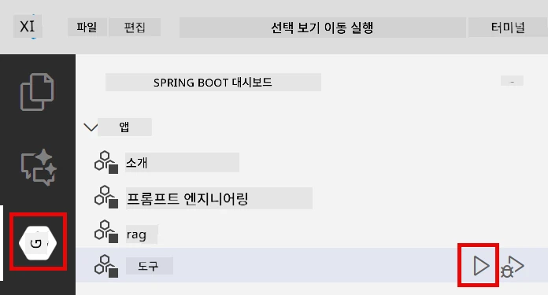
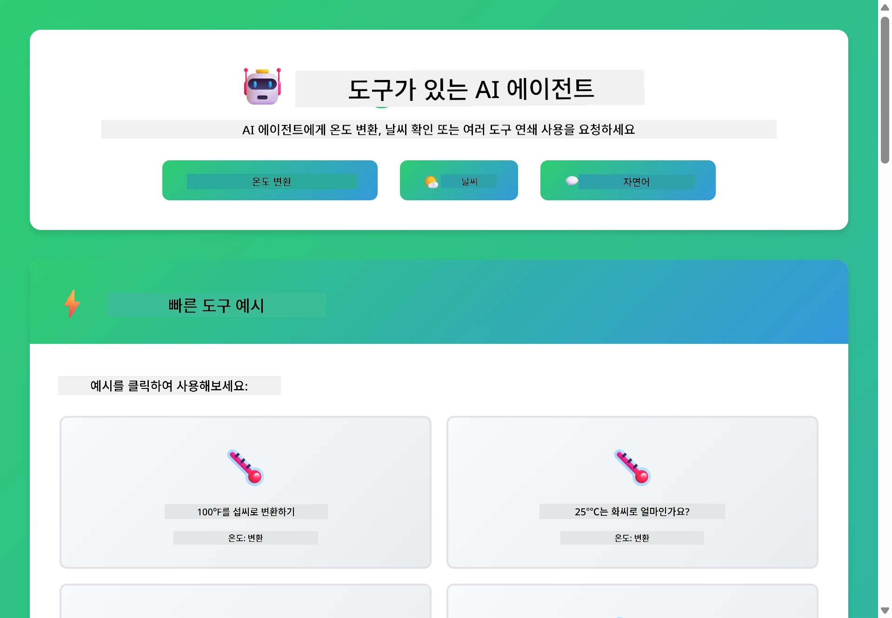
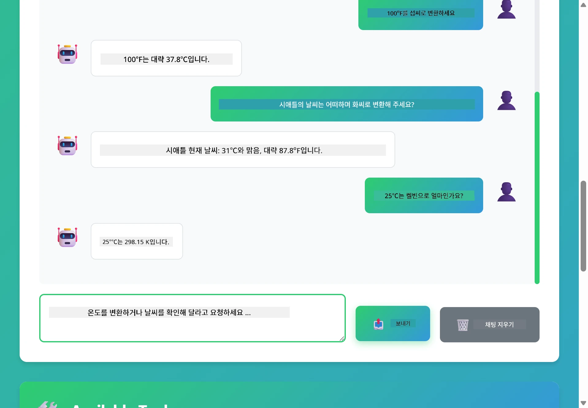

# Module 04: 도구가 있는 AI 에이전트

## 목차

- [비디오 워크스루](#비디오-워크스루)
- [학습 내용](#학습-내용)
- [사전 요구 사항](#사전-요구-사항)
- [도구가 있는 AI 에이전트 이해하기](#도구가-있는-ai-에이전트-이해하기)
- [도구 호출 작동 방식](#도구-호출-작동-방식)
  - [도구 정의](#도구-정의)
  - [의사 결정](#의사-결정)
  - [실행](#실행)
  - [응답 생성](#응답-생성)
  - [아키텍처: Spring Boot 자동 주입](#아키텍처-spring-boot-자동-주입)
- [도구 체이닝](#도구-체이닝)
- [애플리케이션 실행하기](#애플리케이션-실행하기)
- [애플리케이션 사용법](#애플리케이션-사용법)
  - [간단한 도구 사용 시도하기](#간단한-도구-사용해보기)
  - [도구 체이닝 테스트하기](#도구-연쇄-테스트)
  - [대화 흐름 살펴보기](#대화-흐름-보기)
  - [다양한 요청 실험하기](#다양한-요청-실험)
- [핵심 개념](#주요-개념)
  - [ReAct 패턴 (추론 및 실행)](#react-패턴-추론-및-행동)
  - [도구 설명의 중요성](#도구-설명의-중요성)
  - [세션 관리](#세션-관리)
  - [오류 처리](#오류-처리)
- [사용 가능한 도구](#사용-가능한-도구)
- [도구 기반 에이전트 사용 시기](#도구-기반-에이전트-사용-시기)
- [도구 vs RAG](#도구와-rag의-차이)
- [다음 단계](#다음-단계)

## 비디오 워크스루

이 모듈 시작 방법을 설명하는 라이브 세션을 시청하세요:

<a href="https://www.youtube.com/watch?v=O_J30kZc0rw"></a>

## 학습 내용

지금까지 AI와 대화하는 법, 효과적인 프롬프트 구조화, 문서에 기반한 응답 방법을 배웠습니다. 하지만 근본적인 한계가 있습니다: 언어 모델은 텍스트만 생성할 수 있습니다. 날씨를 확인하거나 계산을 수행하거나 데이터베이스를 쿼리하거나 외부 시스템과 상호작용할 수 없습니다.

도구가 이를 바꿉니다. 모델이 호출할 수 있는 기능에 접근할 수 있도록 하면, 텍스트 생성기에서 행동을 취할 수 있는 에이전트로 변합니다. 모델은 어떤 도구가 필요한지, 어떤 도구를 사용할지, 어떤 매개변수를 전달할지 결정합니다. 그리고 코드는 함수를 실행하여 결과를 반환합니다. 모델은 그 결과를 응답에 반영합니다.

## 사전 요구 사항

- [Module 01 - 소개](../01-introduction/README.md)를 완료 (Azure OpenAI 리소스 배포 완료)
- 이전 모듈 완료 권장 (이 모듈에서는 [Module 03의 RAG 개념](../03-rag/README.md)을 도구 vs RAG 비교에서 참조)
- 루트 디렉터리에 Azure 자격 증명이 포함된 `.env` 파일 (Module 01에서 `azd up`으로 생성됨)

> **참고:** Module 01을 완료하지 않았다면, 먼저 그곳의 배포 지침을 따르세요.

## 도구가 있는 AI 에이전트 이해하기

> **📝 참고:** 이 모듈에서 "에이전트"라는 용어는 도구 호출 기능이 추가된 AI 보조자를 의미합니다. 이는 [Module 05: MCP](../05-mcp/README.md)에서 다룰 **Agentic AI** 패턴(계획, 기억, 다단계 추론이 포함된 자율 에이전트)과는 다릅니다.

도구 없이는 언어 모델이 훈련 데이터에서 텍스트만 생성할 수 있습니다. 현재 날씨를 묻는다면 추측할 수밖에 없습니다. 도구를 주면 날씨 API 호출, 계산 수행, 데이터베이스 쿼리 등을 할 수 있고, 그 실제 결과를 응답에 통합합니다.


*도구 없이는 모델이 추측만 하지만 도구를 사용하면 API 호출, 계산 실행, 실시간 데이터 제공 가능.*

도구가 있는 AI 에이전트는 **추론 및 실행(Reasoning and Acting, ReAct)** 패턴을 따릅니다. 모델은 단순히 응답하는 것이 아니라 무엇이 필요한지 생각하고, 도구를 호출하여 행동하며, 결과를 관찰한 뒤 다시 행동할지 최종 답변을 할지 결정합니다:

1. <strong>추론</strong> — 에이전트가 사용자의 질문을 분석하고 필요한 정보를 파악함  
2. <strong>실행</strong> — 적합한 도구를 선택, 올바른 매개변수를 생성하여 호출  
3. <strong>관찰</strong> — 도구 출력물을 받고 결과 평가  
4. **반복 또는 응답** — 더 많은 정보가 필요하면 반복, 아니면 자연어 답변 작성


*ReAct 사이클 — 에이전트가 무엇을 할지 추론하고, 도구를 호출해 실행한 후 결과를 관찰하며 최종 답변까지 반복.*

이 과정은 자동으로 일어납니다. 도구와 설명을 정의하면 모델이 언제 어떻게 사용할지 결정합니다.

## 도구 호출 작동 방식

### 도구 정의

[WeatherTool.java](../../../04-tools/src/main/java/com/example/langchain4j/agents/tools/WeatherTool.java) | [TemperatureTool.java](../../../04-tools/src/main/java/com/example/langchain4j/agents/tools/TemperatureTool.java)

명확한 설명과 매개변수 명세를 갖춘 함수를 정의합니다. 모델은 시스템 프롬프트에서 설명을 보고 각 도구가 하는 일을 이해합니다.

```java
@Component
public class WeatherTool {
    
    @Tool("Get the current weather for a location")
    public String getCurrentWeather(@P("Location name") String location) {
        // 날씨 조회 로직
        return "Weather in " + location + ": 22°C, cloudy";
    }
}

@AiService
public interface Assistant {
    String chat(@MemoryId String sessionId, @UserMessage String message);
}

// 어시스턴트는 Spring Boot에 의해 자동으로 연결됩니다:
// - ChatModel 빈
// - @Component 클래스의 모든 @Tool 메서드
// - 세션 관리를 위한 ChatMemoryProvider
```
  
아래 다이어그램은 각 어노테이션이 무엇을 의미하며 AI가 언제 도구를 호출하고 어떤 인수를 전달할지 이해하는 데 어떻게 도움이 되는지 보여줍니다:


*도구 정의의 구조 — @Tool은 AI에 사용할 때를 알리고, @P는 각 매개변수를 설명하며, @AiService가 시작 시 모든 것을 연결합니다.*

> **🤖 [GitHub Copilot](https://github.com/features/copilot) Chat에서 시도해보세요:** [`WeatherTool.java`](../../../04-tools/src/main/java/com/example/langchain4j/agents/tools/WeatherTool.java)를 열고 질문하세요:  
> - "모의 데이터 대신 OpenWeatherMap과 같은 실제 날씨 API를 어떻게 통합하나요?"  
> - "AI가 올바르게 도구를 사용하도록 돕는 좋은 도구 설명은 무엇인가요?"  
> - "도구 구현 시 API 오류 및 호출 제한은 어떻게 처리하나요?"

### 의사 결정

사용자가 "시애틀 날씨 알려줘"라고 물으면 모델이 무작위로 도구를 고르지 않습니다. 모델은 사용자 의도를 모든 도구 설명과 비교해 관련 점수를 매기고 최선의 도구를 선택합니다. 그런 다음 올바른 매개변수를 포함한 구조화된 함수 호출을 생성하며, 이 경우 `location`을 `"Seattle"`로 설정합니다.

어떤 도구도 요청과 일치하지 않으면 모델이 자신의 지식으로 답합니다. 여러 도구가 일치하면 가장 구체적인 도구를 선택합니다.


*모델은 모든 도구를 사용자 의도와 비교하며 최상의 일치를 선택하기 때문에 명확하고 구체적인 도구 설명이 중요합니다.*

### 실행

[AgentService.java](../../../04-tools/src/main/java/com/example/langchain4j/agents/service/AgentService.java)

Spring Boot는 선언적 `@AiService` 인터페이스를 모든 등록된 도구와 자동으로 연결하며, LangChain4j는 도구 호출을 자동으로 실행합니다. 내부적으로 완전한 도구 호출은 여섯 단계로 흐르며 — 사용자의 자연어 질문에서 최종 자연어 답변까지 진행됩니다:


*종단간 플로우 — 사용자가 질문하면 모델이 도구를 선택, LangChain4j가 실행, 모델이 결과를 자연어 응답에 통합.*

내부적으로 `AiServices`는 여기 단순한 `Calculator` 예제로 모든 도구 호출 루프를 실행합니다. 아래 시퀀스 다이어그램은 내부에서 정확히 어떤 일이 일어나는지 보여줍니다:


*도구 호출 루프 — `AiServices`가 메시지와 도구 스키마를 LLM에 보내면 LLM이 `add(42, 58)`과 같은 함수 호출을 응답하고, LangChain4j가 `Calculator` 메서드를 로컬에서 실행 후 결과를 마지막 응답을 위해 다시 전달.*

> **🤖 [GitHub Copilot](https://github.com/features/copilot) Chat에서 시도해보세요:** [`AgentService.java`](../../../04-tools/src/main/java/com/example/langchain4j/agents/service/AgentService.java)를 열고 질문하세요:  
> - "ReAct 패턴은 어떻게 작동하며 AI 에이전트에 왜 효과적인가요?"  
> - "에이전트가 어떤 도구를 어떤 순서로 사용할지 어떻게 결정하나요?"  
> - "도구 실행 실패 시 어떻게 오류를 견고하게 처리해야 하나요?"

### 응답 생성

모델은 날씨 데이터를 받아 사용자를 위한 자연어 응답으로 형식을 만듭니다.

### 아키텍처: Spring Boot 자동 주입

이 모듈은 LangChain4j의 Spring Boot 연동을 사용하며 선언적 `@AiService` 인터페이스를 적용합니다. 시작 시 Spring Boot는 `@Tool` 메서드가 포함된 모든 `@Component`, `ChatModel` 빈, `ChatMemoryProvider`를 탐색하여 모두를 하나의 `Assistant` 인터페이스로 연결합니다. 별도의 보일러플레이트 없이 완료됩니다.


*@AiService 인터페이스가 ChatModel, 도구 컴포넌트, 메모리 제공자를 연결 — Spring Boot가 모든 연결을 자동으로 처리.*

전체 요청 수명주기를 시퀀스 다이어그램으로 표현하면 아래와 같습니다 — HTTP 요청에서 컨트롤러, 서비스, 자동 주입 프록시, 도구 실행 및 응답까지 모두 포함:


*Spring Boot의 완전한 요청 라이프사이클 — HTTP 요청이 컨트롤러 및 서비스를 거쳐 자동 주입된 Assistant 프록시로 흐르고, LLM과 도구 호출을 자동으로 조율.*

이 접근법의 주요 장점:

- **Spring Boot 자동 주입** — ChatModel과 도구가 자동으로 삽입됨  
- **@MemoryId 패턴** — 자동 세션 기반 메모리 관리  
- **단일 인스턴스** — Assistant가 한 번 생성되어 재사용으로 성능 향상  
- **타입 안전 실행** — 자바 메서드를 타입 변환과 함께 직접 호출  
- **다중 턴 오케스트레이션** — 도구 체이닝 자동 처리  
- **보일러플레이트 없음** — 수동 `AiServices.builder()` 호출이나 메모리 해시맵 불필요

수동 `AiServices.builder()` 사용 같은 대체 방법은 코드가 더 많고 Spring Boot 연동 장점이 부족합니다.

## 도구 체이닝

**도구 체이닝** — 도구 기반 에이전트의 진정한 힘은 단일 질문에 여러 도구가 동시에 필요할 때 발휘됩니다. 예를 들어 "시애틀의 화씨 기준 날씨는?"이라 묻는다면 에이전트는 자동으로 두 개 도구를 체이닝합니다: 먼저 `getCurrentWeather`를 호출해 섭씨 온도를 받아오고, 그 값을 `celsiusToFahrenheit`로 전달해 화씨로 변환합니다 — 모두 한 대화 턴 안에서 진행됩니다.


*도구 체이닝 동작 — 에이전트가 먼저 getCurrentWeather를 호출하고, 섭씨 결과를 celsiusToFahrenheit에 연결해 결합된 답변을 전달.*

**우아한 실패 처리** — 모의 데이터에 없는 도시의 날씨를 요청하면 도구가 오류 메시지를 반환하고 AI가 도움을 줄 수 없음을 설명하면서 크래시하지 않습니다. 도구는 안전하게 실패합니다. 아래 다이어그램은 두 방식을 대비합니다 — 적절한 오류 처리 시 에이전트가 예외를 잡아 유용한 설명으로 응답하지만, 그렇지 않으면 애플리케이션 전체가 중단됨:


*도구 실패 시 에이전트가 오류를 잡아 충돌 대신 도움 되는 설명을 응답.*

모든 과정이 한 번의 대화 턴 내에서 일어나며, 에이전트가 여러 도구 호출을 자율적으로 조율합니다.

## 애플리케이션 실행하기

**배포 확인:**

루트 디렉터리에 Azure 자격 증명이 포함된 `.env` 파일이 있는지 확인하세요 (Module 01에서 생성됨). 모듈 디렉터리(`04-tools/`)에서 다음을 실행:

**Bash:**  
```bash
cat ../.env  # AZURE_OPENAI_ENDPOINT, API_KEY, DEPLOYMENT를 표시해야 합니다
```
  
**PowerShell:**  
```powershell
Get-Content ..\.env  # AZURE_OPENAI_ENDPOINT, API_KEY, DEPLOYMENT을(를) 보여야 합니다
```
  
**애플리케이션 시작:**

> **참고:** 만약 이미 루트 디렉터리에서 `./start-all.sh`로 모든 애플리케이션을 시작했다면(Module 01에 설명), 이 모듈은 포트 8084에서 실행 중입니다. 아래 시작 명령은 건너뛰고 http://localhost:8084 로 바로 접속해도 됩니다.

**옵션 1: Spring Boot 대시보드 사용 (VS Code 사용자 추천)**

개발 컨테이너는 Spring Boot 대시보드 확장 기능이 포함되어 있어 모든 Spring Boot 애플리케이션을 시각적으로 관리할 수 있습니다. VS Code 좌측 활동 표시줄에서 스프링 부트 아이콘을 찾아 실행하세요.

Spring Boot 대시보드에서 할 수 있는 작업:

- 워크스페이스 내 모든 Spring Boot 애플리케이션 확인  
- 버튼 클릭으로 애플리케이션 시작/중지  
- 실시간 로그 보기  
- 애플리케이션 상태 모니터링  

"tools" 옆의 재생 버튼을 클릭하면 이 모듈이 시작되고, 원하는 경우 모든 모듈을 동시에 시작할 수도 있습니다.

VS Code에서 Spring Boot 대시보드는 다음과 같이 표시됩니다:


*VS Code의 Spring Boot 대시보드 — 한 곳에서 모든 모듈을 시작, 중지 및 모니터링하세요*

**옵션 2: 셸 스크립트 사용**

모든 웹 애플리케이션(모듈 01-04) 시작:

**Bash:**
```bash
cd ..  # 루트 디렉터리에서
./start-all.sh
```

**PowerShell:**
```powershell
cd ..  # 루트 디렉토리에서부터
.\start-all.ps1
```

또는 이 모듈만 시작:

**Bash:**
```bash
cd 04-tools
./start.sh
```

**PowerShell:**
```powershell
cd 04-tools
.\start.ps1
```

두 스크립트 모두 루트 `.env` 파일에서 환경 변수를 자동으로 로드하며 존재하지 않는 경우 JAR 파일을 빌드합니다.

> **참고:** 시작 전에 모든 모듈을 수동으로 빌드하려면:
>
> **Bash:**
> ```bash
> cd ..  # Go to root directory
> mvn clean package -DskipTests
> ```
>
> **PowerShell:**
> ```powershell
> cd ..  # Go to root directory
> mvn clean package -DskipTests
> ```

브라우저에서 http://localhost:8084 를 여세요.

**중지하려면:**

**Bash:**
```bash
./stop.sh  # 이 모듈만
# 또는
cd .. && ./stop-all.sh  # 모든 모듈
```

**PowerShell:**
```powershell
.\stop.ps1  # 이 모듈만
# 또는
cd ..; .\stop-all.ps1  # 모든 모듈
```

## 애플리케이션 사용법

애플리케이션은 날씨 및 온도 변환 도구에 접근할 수 있는 AI 에이전트와 상호작용할 수 있는 웹 인터페이스를 제공합니다. 인터페이스는 다음과 같습니다 — 빠른 시작 예제와 요청을 보낼 수 있는 채팅 패널이 포함되어 있습니다:

<a href="images/tools-homepage.png"></a>

*AI 에이전트 도구 인터페이스 - 빠른 예제와 도구와 상호작용할 수 있는 채팅 인터페이스*

### 간단한 도구 사용해보기

간단한 요청부터 시작하세요: "100도 화씨를 섭씨로 변환해줘". 에이전트는 온도 변환 도구가 필요함을 인식하고 올바른 매개변수로 호출하여 결과를 반환합니다. 어떤 도구를 사용하거나 호출 방법을 지정하지 않았음에도 자연스럽게 작동하는 점을 확인하세요.

### 도구 연쇄 테스트

더 복잡한 시도를 해보세요: "시애틀의 날씨는 어떻고 화씨로 변환해줘?" 에이전트가 단계를 거쳐 작업하는 모습을 지켜보세요. 먼저 날씨 데이터를 가져오고(섭씨 반환), 화씨로 변환해야 함을 인식하여 변환 도구를 호출한 뒤 두 결과를 합쳐 응답합니다.

### 대화 흐름 보기

채팅 인터페이스는 대화 기록을 유지하여 다중 턴 상호작용이 가능합니다. 이전 쿼리와 응답을 모두 확인할 수 있어 대화 추적 및 에이전트가 여러 교환을 통해 어떻게 맥락을 구축하는지 이해하기 쉽습니다.

<a href="images/tools-conversation-demo.png"></a>

*간단한 변환, 날씨 조회, 도구 연쇄를 보여주는 다중 턴 대화*

### 다양한 요청 실험

다양한 조합을 시도해보세요:
- 날씨 조회: "도쿄 날씨 어때?"
- 온도 변환: "25°C는 켈빈으로 얼마야?"
- 결합 쿼리: "파리 날씨 확인하고 20°C 이상인지 알려줘"

에이전트가 자연어를 해석하고 적절한 도구 호출로 매핑하는 방식을 확인하세요.

## 주요 개념

### ReAct 패턴 (추론 및 행동)

에이전트는 추론(무엇을 할지 결정)과 행동(도구 사용)을 번갈아 수행합니다. 이 패턴은 단순 지시 응답이 아닌 자율적 문제 해결을 가능하게 합니다.

### 도구 설명의 중요성

도구 설명의 품질은 에이전트가 도구를 얼마나 잘 사용하는지에 직접 영향을 미칩니다. 명확하고 구체적인 설명은 모델이 언제 어떻게 도구를 호출할지 이해하는 데 도움을 줍니다.

### 세션 관리

`@MemoryId` 주석은 자동 세션 기반 메모리 관리를 가능하게 합니다. 각 세션 ID마다 `ChatMemory` 인스턴스가 `ChatMemoryProvider` 빈에 의해 관리되어 여러 사용자가 동시에 다른 대화 내역을 볼 수 없습니다. 다음 다이어그램은 세션 ID에 따라 격리된 메모리 저장소로 여러 사용자를 라우팅하는 방식을 보여줍니다:


*각 세션 ID는 격리된 대화 기록으로 매핑되어 사용자는 서로의 메시지를 볼 수 없습니다.*

### 오류 처리

도구는 실패할 수 있습니다 — API 타임아웃, 잘못된 매개변수, 외부 서비스 중단 등. 프로덕션 환경의 에이전트는 오류 처리가 필요하여 모델이 문제를 설명하거나 대안을 시도할 수 있어야 합니다. 도구가 예외를 던지면 LangChain4j가 이를 포착해 오류 메시지를 모델에 전달하고, 모델이 자연어로 문제를 설명할 수 있습니다.

## 사용 가능한 도구

아래 다이어그램은 구축 가능한 도구의 광범위한 생태계를 보여줍니다. 이 모듈은 날씨 및 온도 도구를 시연하지만, 동일한 `@Tool` 패턴은 데이터베이스 쿼리부터 결제 처리까지 모든 Java 메서드에 적용됩니다.


*@Tool로 주석 처리된 모든 Java 메서드는 AI에서 사용할 수 있습니다 — 이 패턴은 데이터베이스, API, 이메일, 파일 작업 등으로 확장됩니다.*

## 도구 기반 에이전트 사용 시기

모든 요청에 도구가 필요한 것은 아닙니다. AI가 외부 시스템과 상호작용해야 하는지, 자체 지식으로 답변할 수 있는지에 따라 결정됩니다. 다음 가이드는 도구가 가치를 더하는 경우와 불필요한 경우를 요약합니다:


*간단 의사 결정 가이드 — 도구는 실시간 데이터, 계산 및 작업용; 일반 지식과 창의적 작업은 필요하지 않습니다.*

## 도구와 RAG의 차이

모듈 03과 04는 AI가 할 수 있는 일을 확장하지만 근본적으로 다른 방식입니다. RAG는 문서 검색을 통해 모델에 <strong>지식</strong>을 제공합니다. 도구는 기능 호출을 통해 모델에 <strong>작업 수행 능력</strong>을 부여합니다. 아래 다이어그램은 두 접근 방식을 나란히 비교합니다 — 워크플로우 운영 방식부터 장단점까지:


*RAG는 정적 문서에서 정보를 검색 — 도구는 동적 실시간 데이터를 가져오거나 작업을 실행합니다. 많은 프로덕션 시스템은 두 방법을 모두 사용합니다.*

실제로 많은 프로덕션 시스템은 두 접근법을 함께 사용합니다: 문서 기반 답변 근거에는 RAG를, 라이브 데이터 조회나 작업 수행에는 도구를 사용합니다.

## 다음 단계

**다음 모듈:** [05-mcp - 모델 컨텍스트 프로토콜 (MCP)](../05-mcp/README.md)

---

**내비게이션:** [← 이전: 모듈 03 - RAG](../03-rag/README.md) | [메인으로 돌아가기](../README.md) | [다음: 모듈 05 - MCP →](../05-mcp/README.md)

---

<!-- CO-OP TRANSLATOR DISCLAIMER START -->
**면책 조항**:
이 문서는 AI 번역 서비스 [Co-op Translator](https://github.com/Azure/co-op-translator)를 사용하여 번역되었습니다. 정확성을 기하기 위해 노력하고 있으나, 자동 번역은 오류나 부정확한 부분이 있을 수 있음을 유의하시기 바랍니다. 원본 문서의 원어본이 권위 있는 자료로 간주되어야 합니다. 중요한 정보의 경우, 전문가의 인간 번역을 권장합니다. 이 번역 사용으로 인해 발생하는 오해나 잘못된 해석에 대해 당사는 책임을 지지 않습니다.
<!-- CO-OP TRANSLATOR DISCLAIMER END -->