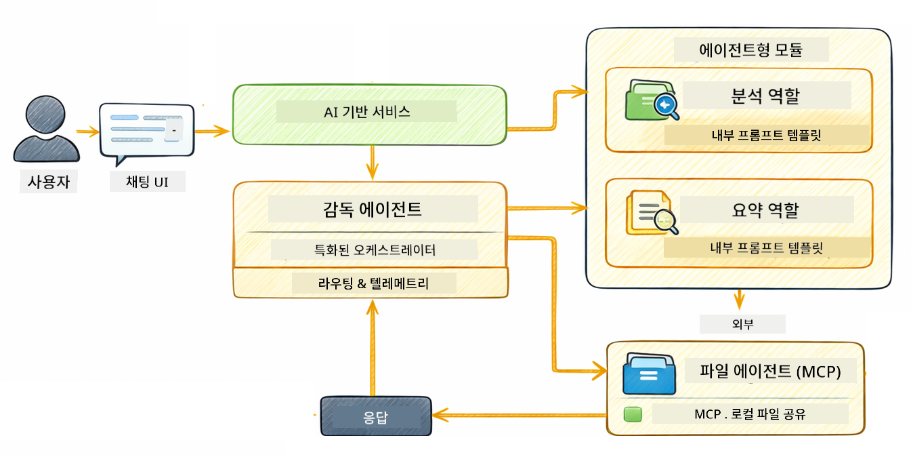

<!--
CO_OP_TRANSLATOR_METADATA:
{
  "original_hash": "6c816d130a1fa47570c11907e72d84ae",
  "translation_date": "2026-01-05T22:20:36+00:00",
  "source_file": "05-mcp/README.md",
  "language_code": "ko"
}
-->
# Module 05: 모델 컨텍스트 프로토콜 (MCP)

## 목차

- [학습 내용](../../../05-mcp)
- [MCP란?](../../../05-mcp)
- [MCP 작동 원리](../../../05-mcp)
- [에이전틱 모듈](../../../05-mcp)
- [예제 실행하기](../../../05-mcp)
  - [사전 조건](../../../05-mcp)
- [빠른 시작](../../../05-mcp)
  - [파일 작업 (Stdio)](../../../05-mcp)
  - [슈퍼바이저 에이전트](../../../05-mcp)
    - [출력 이해하기](../../../05-mcp)
    - [응답 전략](../../../05-mcp)
    - [에이전틱 모듈 기능 설명](../../../05-mcp)
- [핵심 개념](../../../05-mcp)
- [축하합니다!](../../../05-mcp)
  - [다음은?](../../../05-mcp)

## 학습 내용

대화형 AI를 구축하고, 프롬프트에 능숙해지고, 문서 기반 응답을 만들고, 도구를 갖춘 에이전트를 만들어 봤습니다. 하지만 그 모든 도구는 특정한 애플리케이션을 위해 맞춤 제작된 것이었죠. 만약 누구나 만들고 공유할 수 있는 표준화된 도구 생태계에 AI가 접근할 수 있다면 어떨까요? 이번 모듈에서는 Model Context Protocol (MCP)와 LangChain4j의 에이전틱 모듈을 사용해 바로 그것을 구현하는 방법을 배웁니다. 우선 간단한 MCP 파일 리더를 보여주고, 이어서 감독자 에이전트 패턴을 이용한 고급 에이전틱 워크플로우에 어떻게 쉽게 통합되는지 소개합니다.

## MCP란?

Model Context Protocol (MCP)은 바로 그 부분을 해결합니다 — AI 애플리케이션이 외부 도구를 발견하고 사용할 수 있는 표준적인 방법을 제공합니다. 각 데이터 소스나 서비스 마다 맞춤 통합을 작성하는 대신, 기능을 일관된 포맷으로 제공하는 MCP 서버에 연결합니다. AI 에이전트는 이런 도구들을 자동으로 찾아 사용하게 됩니다.


*MCP 이전: 복잡한 포인트 투 포인트 통합. MCP 이후: 하나의 프로토콜, 무한한 가능성.*

MCP는 AI 개발의 근본적인 문제를 해결합니다: 모든 통합이 맞춤형이라는 점입니다. GitHub에 접근하고 싶나요? 맞춤 코드. 파일을 읽고 싶나요? 맞춤 코드. 데이터베이스를 쿼리하고 싶나요? 맞춤 코드. 그리고 이런 통합들은 다른 AI 애플리케이션과 호환되지 않습니다.

MCP가 이를 표준화합니다. MCP 서버는 명확한 설명과 스키마를 가진 도구를 제공합니다. 어떤 MCP 클라이언트라도 연결하여 사용 가능한 도구를 발견하고 사용할 수 있습니다. 한 번 만들고 어디서나 사용하세요.


*Model Context Protocol 아키텍처 — 표준화된 도구 발견 및 실행*

## MCP 작동 원리

**서버-클라이언트 아키텍처**

MCP는 클라이언트-서버 모델을 사용합니다. 서버는 도구를 제공합니다 — 파일 읽기, 데이터베이스 쿼리, API 호출 등. 클라이언트(귀하의 AI 애플리케이션)는 서버에 연결하여 도구를 사용합니다.

LangChain4j에서 MCP를 사용하려면 다음 Maven 의존성을 추가하세요:

```xml
<dependency>
    <groupId>dev.langchain4j</groupId>
    <artifactId>langchain4j-mcp</artifactId>
    <version>${langchain4j.version}</version>
</dependency>
```

**도구 발견**

클라이언트가 MCP 서버에 연결하면 "어떤 도구가 있나요?"라고 묻습니다. 서버는 사용 가능한 도구 목록을 설명과 파라미터 스키마와 함께 응답합니다. AI 에이전트는 사용자 요청에 따라 사용할 도구를 결정할 수 있습니다.

**전송 방식**

MCP는 여러 전송 방식을 지원합니다. 이 모듈에서는 로컬 프로세스용 Stdio 전송을 시연합니다:


*MCP 전송 방식: 원격 서버용 HTTP, 로컬 프로세스용 Stdio*

**Stdio** - [StdioTransportDemo.java](../../../05-mcp/src/main/java/com/example/langchain4j/mcp/StdioTransportDemo.java)

로컬 프로세스를 위해. 애플리케이션이 서버를 서브프로세스로 실행하고 표준 입출력을 통해 통신합니다. 파일 시스템 접근 또는 커맨드 라인 도구에 적합합니다.

```java
McpTransport stdioTransport = new StdioMcpTransport.Builder()
    .command(List.of(
        npmCmd, "exec",
        "@modelcontextprotocol/server-filesystem@2025.12.18",
        resourcesDir
    ))
    .logEvents(false)
    .build();
```

> **🤖 [GitHub Copilot](https://github.com/features/copilot) 채팅에서 시도해보세요:** [`StdioTransportDemo.java`](../../../05-mcp/src/main/java/com/example/langchain4j/mcp/StdioTransportDemo.java)를 열고 다음을 물어보세요:
> - "Stdio 전송은 어떻게 작동하며 HTTP와 언제 차이를 두어야 하나요?"
> - "LangChain4j는 MCP 서버 프로세스의 수명 주기를 어떻게 관리하나요?"
> - "AI에게 파일 시스템 접근 권한을 주는 보안 문제는 무엇인가요?"

## 에이전틱 모듈

MCP가 표준화된 도구를 제공한다면, LangChain4j의 **에이전틱 모듈**은 이러한 도구들을 조율하는 에이전트를 선언적으로 구축하는 방법을 제공합니다. `@Agent` 애노테이션과 `AgenticServices`를 통해 명령형 코드 대신 인터페이스로 에이전트 동작을 정의할 수 있습니다.

이번 모듈에서는 사용자의 요청에 따라 동적으로 어떤 하위 에이전트를 호출할지 결정하는 고급 에이전틱 AI 접근법인 **슈퍼바이저 에이전트** 패턴을 탐구합니다. 그리고 우리 하위 에이전트 중 한 명에게 MCP 기반 파일 접근 기능을 부여해 두 가지 개념을 결합합니다.

에이전틱 모듈을 사용하려면 다음 Maven 의존성을 추가하세요:

```xml
<dependency>
    <groupId>dev.langchain4j</groupId>
    <artifactId>langchain4j-agentic</artifactId>
    <version>${langchain4j.mcp.version}</version>
</dependency>
```

> **⚠️ 실험적:** `langchain4j-agentic` 모듈은 **실험적**이며 변경될 수 있습니다. 안정적인 AI 어시스턴트 구축은 여전히 `langchain4j-core`와 맞춤 도구(모듈 04)를 권장합니다.

## 예제 실행하기

### 사전 조건

- Java 21 이상, Maven 3.9 이상
- Node.js 16 이상 및 npm (MCP 서버용)
- `.env` 파일에 환경 변수 설정 (루트 디렉터리 기준):
  - `AZURE_OPENAI_ENDPOINT`, `AZURE_OPENAI_API_KEY`, `AZURE_OPENAI_DEPLOYMENT` (모듈 01-04와 동일)

> **참고:** 환경 변수를 아직 설정하지 않았다면, [모듈 00 - 빠른 시작](../00-quick-start/README.md)을 참고하거나 루트 디렉터리에 `.env.example`을 `.env`로 복사한 후 값을 입력하세요.

## 빠른 시작

**VS Code 사용 시:** 탐색기에서 원하는 데모 파일을 우클릭하여 **"Run Java"**를 선택하거나 실행 및 디버그 패널의 실행 구성(런치 구성)을 사용하세요 (먼저 `.env`에 토큰을 추가했는지 확인).

**Maven 사용 시:** 터미널에서 다음 예제를 실행할 수도 있습니다.

### 파일 작업 (Stdio)

로컬 서브프로세스 기반 도구 시연입니다.

**✅ 사전 조건 불필요** - MCP 서버가 자동으로 실행됩니다.

**시작 스크립트 사용 (권장):**

시작 스크립트는 루트 `.env` 파일에서 환경 변수를 자동으로 불러옵니다:

**Bash:**
```bash
cd 05-mcp
chmod +x start-stdio.sh
./start-stdio.sh
```

**PowerShell:**
```powershell
cd 05-mcp
.\start-stdio.ps1
```

**VS Code 사용:** `StdioTransportDemo.java`를 우클릭하고 **"Run Java"**를 선택하세요(`.env`가 설정되어 있어야 합니다).

애플리케이션이 파일 시스템 MCP 서버를 자동으로 실행하고 로컬 파일을 읽습니다. 서브프로세스 관리가 자동으로 처리되는 점에 주목하세요.

**예상 출력:**
```
Assistant response: The file provides an overview of LangChain4j, an open-source Java library
for integrating Large Language Models (LLMs) into Java applications...
```

### 슈퍼바이저 에이전트

**슈퍼바이저 에이전트 패턴**은 에이전틱 AI의 **유연한** 형태입니다. 슈퍼바이저는 LLM을 사용해 사용자의 요청에 따라 호출할 에이전트를 자율적으로 결정합니다. 다음 예제에서는 MCP 기반 파일 접근과 LLM 에이전트를 결합해 파일 읽기 → 보고서 작성의 감독 워크플로우를 만듭니다.

데모에서 `FileAgent`는 MCP 파일 시스템 도구로 파일을 읽고, `ReportAgent`는 실행 요약(1문장), 3가지 주요 포인트, 권고사항이 포함된 구조화된 보고서를 생성합니다. 슈퍼바이저가 이 흐름을 자동으로 조율합니다:



```
┌─────────────┐      ┌──────────────┐
│  FileAgent  │ ───▶ │ ReportAgent  │
│ (MCP tools) │      │  (pure LLM)  │
└─────────────┘      └──────────────┘
   outputKey:           outputKey:
  'fileContent'         'report'
```

각 에이전트는 **에이전틱 범위(Agentic Scope)**(공유 메모리)에 결과를 저장해 하위 에이전트들이 이전 결과에 접근할 수 있습니다. MCP 도구가 에이전틱 워크플로우에 원활히 통합되는 것을 보여줍니다 — 슈퍼바이저는 파일이 어떻게 읽히는지 알 필요 없이 `FileAgent`가 할 수 있다는 사실만 알면 됩니다.

#### 데모 실행 방법

시작 스크립트는 루트 `.env` 파일에서 환경 변수를 자동으로 불러옵니다:

**Bash:**
```bash
cd 05-mcp
chmod +x start-supervisor.sh
./start-supervisor.sh
```

**PowerShell:**
```powershell
cd 05-mcp
.\start-supervisor.ps1
```

**VS Code 사용:** `SupervisorAgentDemo.java`를 우클릭하고 **"Run Java"**를 선택하세요(`.env` 파일 설정 필수).

#### 슈퍼바이저 작동 방식

```java
// 1단계: FileAgent가 MCP 도구를 사용하여 파일을 읽습니다
FileAgent fileAgent = AgenticServices.agentBuilder(FileAgent.class)
        .chatModel(model)
        .toolProvider(mcpToolProvider)  // 파일 작업을 위한 MCP 도구를 보유하고 있습니다
        .build();

// 2단계: ReportAgent가 구조화된 보고서를 생성합니다
ReportAgent reportAgent = AgenticServices.agentBuilder(ReportAgent.class)
        .chatModel(model)
        .build();

// 감독자가 파일 → 보고서 작업 흐름을 조율합니다
SupervisorAgent supervisor = AgenticServices.supervisorBuilder()
        .chatModel(model)
        .subAgents(fileAgent, reportAgent)
        .responseStrategy(SupervisorResponseStrategy.LAST)  // 최종 보고서를 반환합니다
        .build();

// 감독자가 요청에 따라 어떤 에이전트를 호출할지 결정합니다
String response = supervisor.invoke("Read the file at /path/file.txt and generate a report");
```

#### 응답 전략

`SupervisorAgent`를 구성할 때 하위 에이전트가 작업을 완료한 후 최종 사용자에게 어떻게 답변할지 지정할 수 있습니다. 사용 가능한 전략은 다음과 같습니다:

| 전략 | 설명 |
|----------|-------------|
| **LAST** | 슈퍼바이저가 호출한 마지막 하위 에이전트 또는 도구의 출력을 반환합니다. 최종 에이전트가 완전한 최종 답변을 생성하도록 설계된 경우에 유용합니다 (예: 연구 파이프라인의 "요약 에이전트"). |
| **SUMMARY** | 슈퍼바이저가 자체 내장된 LLM을 사용해 전체 상호작용과 모든 하위 에이전트 출력을 요약하고, 그 요약을 최종 답변으로 제공합니다. 사용자에게 깔끔한 집계 답변을 제공합니다. |
| **SCORED** | 내장 LLM을 사용해 마지막 응답과 요약을 원 요청과 비교 점수화한 후 점수가 더 높은 쪽을 반환합니다. |

전체 구현은 [SupervisorAgentDemo.java](../../../05-mcp/src/main/java/com/example/langchain4j/mcp/SupervisorAgentDemo.java)를 참조하세요.

> **🤖 [GitHub Copilot](https://github.com/features/copilot) 채팅에서 시도해보세요:** [`SupervisorAgentDemo.java`](../../../05-mcp/src/main/java/com/example/langchain4j/mcp/SupervisorAgentDemo.java)를 열고 다음을 물어보세요:
> - "슈퍼바이저가 어떤 에이전트를 호출할지 어떻게 결정하나요?"
> - "슈퍼바이저와 순차 워크플로우 패턴의 차이는 무엇인가요?"
> - "슈퍼바이저의 계획 행동을 어떻게 맞춤설정할 수 있나요?"

#### 출력 이해하기

데모를 실행하면 슈퍼바이저가 여러 에이전트를 조율하는 과정을 구조화된 형태로 볼 수 있습니다. 각 섹션이 의미하는 바는 다음과 같습니다:

```
======================================================================
  FILE → REPORT WORKFLOW DEMO
======================================================================

This demo shows a clear 2-step workflow: read a file, then generate a report.
The Supervisor orchestrates the agents automatically based on the request.
```

**헤더**는 파일 읽기에서 보고서 생성까지의 집중된 파이프라인 워크플로우 개념을 소개합니다.

```
--- WORKFLOW ---------------------------------------------------------
  ┌─────────────┐      ┌──────────────┐
  │  FileAgent  │ ───▶ │ ReportAgent  │
  │ (MCP tools) │      │  (pure LLM)  │
  └─────────────┘      └──────────────┘
   outputKey:           outputKey:
   'fileContent'        'report'

--- AVAILABLE AGENTS -------------------------------------------------
  [FILE]   FileAgent   - Reads files via MCP → stores in 'fileContent'
  [REPORT] ReportAgent - Generates structured report → stores in 'report'
```

**워크플로우 다이어그램**은 에이전트 간 데이터 흐름을 보여줍니다. 각 에이전트는 특정 역할을 수행합니다:
- **FileAgent**는 MCP 도구로 파일을 읽고, 원본 내용을 `fileContent`에 저장합니다
- **ReportAgent**는 그 콘텐츠를 받아 `report`에 구조화된 보고서를 만듭니다

```
--- USER REQUEST -----------------------------------------------------
  "Read the file at .../file.txt and generate a report on its contents"
```

**사용자 요청**은 작업 내용을 보여줍니다. 슈퍼바이저가 이를 파싱해 FileAgent → ReportAgent 호출을 결정합니다.

```
--- SUPERVISOR ORCHESTRATION -----------------------------------------
  The Supervisor decides which agents to invoke and passes data between them...

  +-- STEP 1: Supervisor chose -> FileAgent (reading file via MCP)
  |
  |   Input: .../file.txt
  |
  |   Result: LangChain4j is an open-source, provider-agnostic Java framework for building LLM...
  +-- [OK] FileAgent (reading file via MCP) completed

  +-- STEP 2: Supervisor chose -> ReportAgent (generating structured report)
  |
  |   Input: LangChain4j is an open-source, provider-agnostic Java framew...
  |
  |   Result: Executive Summary...
  +-- [OK] ReportAgent (generating structured report) completed
```

**슈퍼바이저 조율**은 2단계 흐름을 보여줍니다:
1. **FileAgent**가 MCP를 통해 파일을 읽고 내용을 저장
2. **ReportAgent**가 그 내용을 받아 구조화된 보고서를 생성

슈퍼바이저는 사용자의 요청에 따라 **자율적으로** 이 결정을 내렸습니다.

```
--- FINAL RESPONSE ---------------------------------------------------
Executive Summary
...

Key Points
...

Recommendations
...

--- AGENTIC SCOPE (Data Flow) ----------------------------------------
  Each agent stores its output for downstream agents to consume:
  * fileContent: LangChain4j is an open-source, provider-agnostic Java framework...
  * report: Executive Summary...
```

#### 에이전틱 모듈 기능 설명

이 예제는 에이전틱 모듈의 여러 고급 기능을 보여줍니다. 에이전틱 범위와 에이전트 리스너에 대해 자세히 살펴보겠습니다.

**에이전틱 범위**는 에이전트들이 `@Agent(outputKey="...")`를 사용해 결과를 저장한 공유 메모리입니다. 이를 통해:
- 이후 에이전트들이 이전 에이전트 출력에 접근 가능
- 슈퍼바이저가 최종 응답을 종합 가능
- 각 에이전트가 생성한 결과를 사용자가 검토 가능

```java
ResultWithAgenticScope<String> result = supervisor.invokeWithAgenticScope(request);
AgenticScope scope = result.agenticScope();
String fileContent = scope.readState("fileContent");  // FileAgent의 원시 파일 데이터
String report = scope.readState("report");            // ReportAgent의 구조화된 보고서
```

**에이전트 리스너**는 에이전트 실행 모니터링과 디버깅을 가능하게 합니다. 데모에 표시된 단계별 출력은 각 에이전트 호출 시 후킹된 AgentListener에서 생성됩니다:
- **beforeAgentInvocation** - 슈퍼바이저가 에이전트를 선택할 때 호출되어 어떤 에이전트가 왜 선택되었는지 보여줍니다
- **afterAgentInvocation** - 에이전트가 작업을 마쳤을 때 호출되어 결과를 표시합니다
- **inheritedBySubagents** - true일 경우, 계층 내 모든 에이전트를 모니터링합니다

```java
AgentListener monitor = new AgentListener() {
    private int step = 0;
    
    @Override
    public void beforeAgentInvocation(AgentRequest request) {
        step++;
        System.out.println("  +-- STEP " + step + ": " + request.agentName());
    }
    
    @Override
    public void afterAgentInvocation(AgentResponse response) {
        System.out.println("  +-- [OK] " + response.agentName() + " completed");
    }
    
    @Override
    public boolean inheritedBySubagents() {
        return true; // 모든 하위 에이전트에 전파하십시오
    }
};
```

슈퍼바이저 패턴 외에도, `langchain4j-agentic` 모듈은 여러 강력한 워크플로우 패턴과 기능을 제공합니다:

| 패턴 | 설명 | 사용 사례 |
|---------|-------------|----------|
| **Sequential** | 에이전트를 순서대로 실행하며 출력은 다음으로 전달 | 파이프라인: 연구 → 분석 → 보고서 |
| **Parallel** | 에이전트를 동시에 실행 | 독립 작업: 날씨 + 뉴스 + 주식 |
| **Loop** | 조건 만족 시까지 반복 | 품질 점수화: 점수 ≥ 0.8까지 개선 |
| **Conditional** | 조건에 따라 경로 분기 | 분류 → 전문 에이전트로 라우팅 |
| **Human-in-the-Loop** | 인간 검증 단계 추가 | 승인 워크플로우, 콘텐츠 검토 |

## 핵심 개념

이제 MCP와 에이전틱 모듈을 직접 접해봤으니, 각각 언제 사용하는지 요약해 봅니다.

**MCP**는 기존 도구 생태계를 활용하거나 여러 애플리케이션이 공유하는 도구를 만들고, 표준 프로토콜로 제3자 서비스를 통합하거나, 도구 구현을 코드 변경 없이 교체할 때 적합합니다.

**에이전틱 모듈**은 `@Agent` 애노테이션으로 선언적 에이전트 정의가 필요하거나, 순차·반복·병렬 워크플로 조율이 필요하고, 명령형 코드 대신 인터페이스 기반 에이전트 설계를 선호하거나, 여러 에이전트가 `outputKey`로 출력을 공유하며 함께 작동할 때 적합합니다.

**슈퍼바이저 에이전트 패턴**은 워크플로우가 미리 예측 불가능하고 LLM이 결정하기를 원할 때, 여러 특화된 에이전트가 동적으로 호출되어야 할 때, 다양한 기능으로 라우팅하는 대화형 시스템을 구성할 때, 가장 유연하고 적응력 있는 에이전트 행동이 필요할 때 빛을 발합니다.
## 축하합니다!

LangChain4j for Beginners 과정을 완료하셨습니다. 다음을 배우셨습니다:

- 메모리를 활용한 대화형 AI 구축 방법 (모듈 01)
- 다양한 작업을 위한 프롬프트 엔지니어링 패턴 (모듈 02)
- 문서 기반 응답 강화(RAG) 방법 (모듈 03)
- 사용자 정의 도구를 사용한 기본 AI 에이전트(도우미) 생성 (모듈 04)
- LangChain4j MCP 및 Agentic 모듈과 표준화된 도구 통합 (모듈 05)

### 다음 단계는?

모듈을 완료한 후, [Testing Guide](../docs/TESTING.md)를 탐색하여 LangChain4j 테스트 개념을 실제로 확인해 보세요.

**공식 자료:**
- [LangChain4j Documentation](https://docs.langchain4j.dev/) - 종합 가이드 및 API 참조
- [LangChain4j GitHub](https://github.com/langchain4j/langchain4j) - 소스 코드 및 예제
- [LangChain4j Tutorials](https://docs.langchain4j.dev/tutorials/) - 다양한 사용 사례별 단계별 튜토리얼

이 과정을 완료해 주셔서 감사합니다!

---

**네비게이션:** [← 이전: 모듈 04 - 도구](../04-tools/README.md) | [메인으로 돌아가기](../README.md)

---

<!-- CO-OP TRANSLATOR DISCLAIMER START -->
**면책 조항**:  
이 문서는 AI 번역 서비스 [Co-op Translator](https://github.com/Azure/co-op-translator)를 사용하여 번역되었습니다. 정확성을 위해 최선을 다했으나, 자동 번역은 오류나 부정확성을 포함할 수 있음을 유의하시기 바랍니다. 원본 문서의 원어 버전이 권위 있는 자료로 간주되어야 합니다. 중요한 정보의 경우 전문가의 인간 번역을 권장합니다. 본 번역 사용으로 인해 발생하는 오해나 해석상의 문제에 대해 당사는 책임을 지지 않습니다.
<!-- CO-OP TRANSLATOR DISCLAIMER END -->