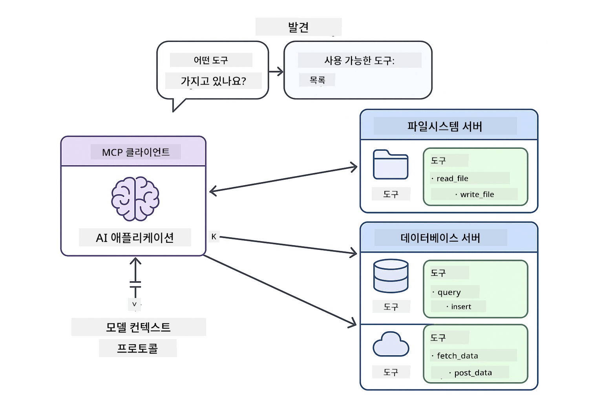
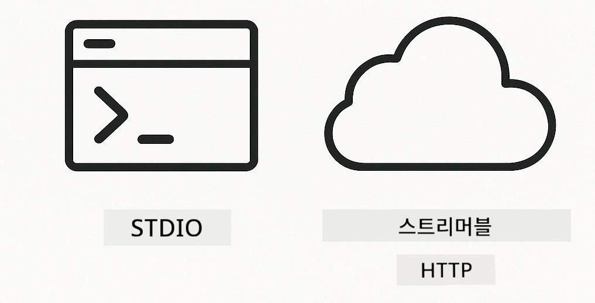

<!--
CO_OP_TRANSLATOR_METADATA:
{
  "original_hash": "c25ec1f10ef156c53e190cdf8b0711ab",
  "translation_date": "2025-12-13T17:43:44+00:00",
  "source_file": "05-mcp/README.md",
  "language_code": "ko"
}
-->
# Module 05: 모델 컨텍스트 프로토콜 (MCP)

## 목차

- [학습 내용](../../../05-mcp)
- [MCP 이해하기](../../../05-mcp)
- [MCP 작동 방식](../../../05-mcp)
  - [서버-클라이언트 아키텍처](../../../05-mcp)
  - [도구 검색](../../../05-mcp)
  - [전송 메커니즘](../../../05-mcp)
- [필수 조건](../../../05-mcp)
- [이 모듈에서 다루는 내용](../../../05-mcp)
- [빠른 시작](../../../05-mcp)
  - [예제 1: 원격 계산기 (스트리밍 HTTP)](../../../05-mcp)
  - [예제 2: 파일 작업 (Stdio)](../../../05-mcp)
  - [예제 3: Git 분석 (Docker)](../../../05-mcp)
- [핵심 개념](../../../05-mcp)
  - [전송 방식 선택](../../../05-mcp)
  - [도구 검색](../../../05-mcp)
  - [세션 관리](../../../05-mcp)
  - [크로스 플랫폼 고려사항](../../../05-mcp)
- [MCP를 언제 사용해야 하나요](../../../05-mcp)
- [MCP 생태계](../../../05-mcp)
- [축하합니다!](../../../05-mcp)
  - [다음 단계는?](../../../05-mcp)
- [문제 해결](../../../05-mcp)

## 학습 내용

대화형 AI를 구축하고, 프롬프트를 마스터하며, 문서에 기반한 응답을 만들고, 도구가 포함된 에이전트를 생성했습니다. 하지만 지금까지 사용한 도구들은 모두 특정 애플리케이션에 맞게 맞춤 제작된 것이었습니다. 만약 누구나 만들고 공유할 수 있는 표준화된 도구 생태계에 AI가 접근할 수 있다면 어떨까요?

모델 컨텍스트 프로토콜(MCP)은 바로 그 점을 제공합니다 — AI 애플리케이션이 외부 도구를 발견하고 사용할 수 있는 표준화된 방법입니다. 각 데이터 소스나 서비스마다 맞춤 통합을 작성하는 대신, 일관된 형식으로 기능을 노출하는 MCP 서버에 연결합니다. 그러면 AI 에이전트가 이 도구들을 자동으로 발견하고 사용할 수 있습니다.


*MCP 이전: 복잡한 포인트 투 포인트 통합. MCP 이후: 하나의 프로토콜, 무한한 가능성.*

## MCP 이해하기

MCP는 AI 개발에서 근본적인 문제를 해결합니다: 모든 통합이 맞춤형이라는 점입니다. GitHub에 접근하려면? 맞춤 코드. 파일을 읽으려면? 맞춤 코드. 데이터베이스를 쿼리하려면? 맞춤 코드. 그리고 이러한 통합은 다른 AI 애플리케이션과 호환되지 않습니다.

MCP는 이를 표준화합니다. MCP 서버는 명확한 설명과 스키마를 가진 도구를 노출합니다. 어떤 MCP 클라이언트든 연결하여 사용 가능한 도구를 발견하고 사용할 수 있습니다. 한 번 구축하면 어디서든 사용 가능합니다.



*모델 컨텍스트 프로토콜 아키텍처 - 표준화된 도구 검색 및 실행*

## MCP 작동 방식

**서버-클라이언트 아키텍처**

MCP는 클라이언트-서버 모델을 사용합니다. 서버는 파일 읽기, 데이터베이스 쿼리, API 호출 등 도구를 제공합니다. 클라이언트(당신의 AI 애플리케이션)는 서버에 연결하여 도구를 사용합니다.

**도구 검색**

클라이언트가 MCP 서버에 연결하면 "어떤 도구가 있나요?"라고 묻습니다. 서버는 설명과 매개변수 스키마가 포함된 사용 가능한 도구 목록을 응답합니다. AI 에이전트는 사용자 요청에 따라 어떤 도구를 사용할지 결정할 수 있습니다.

**전송 메커니즘**

MCP는 두 가지 전송 메커니즘을 정의합니다: 원격 서버용 HTTP, 로컬 프로세스용 Stdio(도커 컨테이너 포함):



*MCP 전송 메커니즘: 원격 서버용 HTTP, 로컬 프로세스용 Stdio(도커 컨테이너 포함)*

**스트리밍 HTTP** - [StreamableHttpDemo.java](../../../05-mcp/src/main/java/com/example/langchain4j/mcp/StreamableHttpDemo.java)

원격 서버용입니다. 애플리케이션이 네트워크 어딘가에서 실행 중인 서버에 HTTP 요청을 보냅니다. 실시간 통신을 위해 서버 전송 이벤트(Server-Sent Events)를 사용합니다.

```java
McpTransport httpTransport = new StreamableHttpMcpTransport.Builder()
    .url("http://localhost:3001/mcp")
    .timeout(Duration.ofSeconds(60))
    .logRequests(true)
    .logResponses(true)
    .build();
```

> **🤖 [GitHub Copilot](https://github.com/features/copilot) 채팅으로 시도해보세요:** [`StreamableHttpDemo.java`](../../../05-mcp/src/main/java/com/example/langchain4j/mcp/StreamableHttpDemo.java)를 열고 다음을 물어보세요:
> - "MCP가 모듈 04의 직접 도구 통합과 어떻게 다른가요?"
> - "애플리케이션 간 도구 공유를 위해 MCP를 사용하는 이점은 무엇인가요?"
> - "MCP 서버 연결 실패나 타임아웃을 어떻게 처리하나요?"

**Stdio** - [StdioTransportDemo.java](../../../05-mcp/src/main/java/com/example/langchain4j/mcp/StdioTransportDemo.java)

로컬 프로세스용입니다. 애플리케이션이 서브프로세스로 서버를 생성하고 표준 입출력을 통해 통신합니다. 파일 시스템 접근이나 커맨드라인 도구에 유용합니다.

```java
McpTransport stdioTransport = new StdioMcpTransport.Builder()
    .command(List.of(
        npmCmd, "exec",
        "@modelcontextprotocol/server-filesystem@0.6.2",
        resourcesDir
    ))
    .logEvents(false)
    .build();
```

> **🤖 [GitHub Copilot](https://github.com/features/copilot) 채팅으로 시도해보세요:** [`StdioTransportDemo.java`](../../../05-mcp/src/main/java/com/example/langchain4j/mcp/StdioTransportDemo.java)를 열고 다음을 물어보세요:
> - "Stdio 전송은 어떻게 작동하며 HTTP와 언제 사용을 구분해야 하나요?"
> - "LangChain4j는 생성된 MCP 서버 프로세스의 라이프사이클을 어떻게 관리하나요?"
> - "AI에 파일 시스템 접근 권한을 주는 보안상의 고려사항은 무엇인가요?"

**Docker (Stdio 사용)** - [GitRepositoryAnalyzer.java](../../../05-mcp/src/main/java/com/example/langchain4j/mcp/GitRepositoryAnalyzer.java)

컨테이너화된 서비스용입니다. `docker run`을 통해 도커 컨테이너와 stdio 전송으로 통신합니다. 복잡한 의존성이나 격리된 환경에 적합합니다.

```java
McpTransport dockerTransport = new StdioMcpTransport.Builder()
    .command(List.of(
        "docker", "run",
        "-e", "GITHUB_PERSONAL_ACCESS_TOKEN=" + System.getenv("GITHUB_TOKEN"),
        "-v", volumeMapping,
        "-i", "mcp/git"
    ))
    .logEvents(true)
    .build();
```

> **🤖 [GitHub Copilot](https://github.com/features/copilot) 채팅으로 시도해보세요:** [`GitRepositoryAnalyzer.java`](../../../05-mcp/src/main/java/com/example/langchain4j/mcp/GitRepositoryAnalyzer.java)를 열고 다음을 물어보세요:
> - "Docker 전송은 MCP 서버를 어떻게 격리하며 이점은 무엇인가요?"
> - "호스트와 MCP 컨테이너 간 데이터 공유를 위한 볼륨 마운트 설정 방법은?"
> - "프로덕션에서 Docker 기반 MCP 서버 라이프사이클 관리 모범 사례는 무엇인가요?"

## 예제 실행하기

### 필수 조건

- Java 21+, Maven 3.9+
- Node.js 16+ 및 npm (MCP 서버용)
- **Docker Desktop** - 예제 3 실행 시 반드시 **실행 중**이어야 함 (설치만 되어서는 안 됨)
- `.env` 파일에 GitHub 개인 액세스 토큰 구성 (모듈 00 참고)

> **참고:** GitHub 토큰 설정이 아직 안 되어 있다면 [모듈 00 - 빠른 시작](../00-quick-start/README.md)을 참고하세요.

> **⚠️ Docker 사용자:** 예제 3 실행 전 `docker ps`로 Docker Desktop이 실행 중인지 확인하세요. 연결 오류가 발생하면 Docker Desktop을 시작하고 약 30초간 초기화를 기다리세요.

## 빠른 시작

**VS Code 사용 시:** 탐색기에서 데모 파일을 우클릭하고 **"Run Java"**를 선택하거나 실행 및 디버그 패널의 실행 구성을 사용하세요 (먼저 `.env` 파일에 토큰을 추가했는지 확인).

**Maven 사용 시:** 아래 예제 명령어로 커맨드라인에서 실행할 수 있습니다.

**⚠️ 중요:** 일부 예제는 MCP 서버 시작 또는 Docker 이미지 빌드 같은 사전 작업이 필요합니다. 각 예제 요구사항을 확인하세요.

### 예제 1: 원격 계산기 (스트리밍 HTTP)

네트워크 기반 도구 통합을 시연합니다.

**⚠️ 사전 조건:** MCP 서버를 먼저 시작해야 합니다 (아래 터미널 1 참고).

**터미널 1 - MCP 서버 시작:**

**Bash:**
```bash
git clone https://github.com/modelcontextprotocol/servers.git
cd servers/src/everything
npm install
node dist/streamableHttp.js
```

**PowerShell:**
```powershell
git clone https://github.com/modelcontextprotocol/servers.git
cd servers/src/everything
npm install
node dist/streamableHttp.js
```

**터미널 2 - 예제 실행:**

**VS Code 사용 시:** `StreamableHttpDemo.java`를 우클릭하고 **"Run Java"** 선택.

**Maven 사용 시:**

**Bash:**
```bash
export GITHUB_TOKEN=your_token_here
cd 05-mcp
mvn compile exec:java -Dexec.mainClass=com.example.langchain4j.mcp.StreamableHttpDemo
```

**PowerShell:**
```powershell
$env:GITHUB_TOKEN=your_token_here
cd 05-mcp
mvn --% compile exec:java -Dexec.mainClass=com.example.langchain4j.mcp.StreamableHttpDemo
```

에이전트가 사용 가능한 도구를 발견하고 계산기를 사용해 덧셈을 수행하는 것을 확인하세요.

### 예제 2: 파일 작업 (Stdio)

로컬 서브프로세스 기반 도구를 시연합니다.

**✅ 사전 조건 없음** - MCP 서버가 자동으로 생성됩니다.

**VS Code 사용 시:** `StdioTransportDemo.java`를 우클릭하고 **"Run Java"** 선택.

**Maven 사용 시:**

**Bash:**
```bash
export GITHUB_TOKEN=your_token_here
cd 05-mcp
mvn compile exec:java -Dexec.mainClass=com.example.langchain4j.mcp.StdioTransportDemo
```

**PowerShell:**
```powershell
$env:GITHUB_TOKEN=your_token_here
cd 05-mcp
mvn --% compile exec:java -Dexec.mainClass=com.example.langchain4j.mcp.StdioTransportDemo
```

애플리케이션이 파일 시스템 MCP 서버를 자동으로 생성하고 로컬 파일을 읽습니다. 서브프로세스 관리가 자동으로 처리되는 점에 주목하세요.

**예상 출력:**
```
Assistant response: The content of the file is "Kaboom!".
```

### 예제 3: Git 분석 (Docker)

컨테이너화된 도구 서버를 시연합니다.

**⚠️ 사전 조건:** 
1. **Docker Desktop이 실행 중이어야 함** (설치만 되어서는 안 됨)
2. **Windows 사용자:** WSL 2 모드 권장 (Docker Desktop 설정 → 일반 → "Use the WSL 2 based engine"). Hyper-V 모드는 수동 파일 공유 설정 필요.
3. Docker 이미지 먼저 빌드 필요 (아래 터미널 1 참고)

**Docker 실행 확인:**

**Bash:**
```bash
docker ps  # 오류가 아닌 컨테이너 목록을 보여야 합니다
```

**PowerShell:**
```powershell
docker ps  # 오류가 아닌 컨테이너 목록을 보여야 합니다
```

"Cannot connect to Docker daemon" 또는 "The system cannot find the file specified" 같은 오류가 보이면 Docker Desktop을 시작하고 초기화(약 30초)를 기다리세요.

**문제 해결:**
- AI가 빈 저장소 또는 파일 없음 보고 시, 볼륨 마운트(`-v`)가 작동하지 않는 것입니다.
- **Windows Hyper-V 사용자:** 프로젝트 디렉터리를 Docker Desktop 설정 → 리소스 → 파일 공유에 추가하고 Docker Desktop을 재시작하세요.
- **권장 해결책:** 자동 파일 공유를 위해 WSL 2 모드로 전환하세요 (설정 → 일반 → "Use the WSL 2 based engine" 활성화).

**터미널 1 - Docker 이미지 빌드:**

**Bash:**
```bash
cd servers/src/git
docker build -t mcp/git .
```

**PowerShell:**
```powershell
cd servers/src/git
docker build -t mcp/git .
```

**터미널 2 - 분석기 실행:**

**VS Code 사용 시:** `GitRepositoryAnalyzer.java`를 우클릭하고 **"Run Java"** 선택.

**Maven 사용 시:**

**Bash:**
```bash
export GITHUB_TOKEN=your_token_here
cd 05-mcp
mvn compile exec:java -Dexec.mainClass=com.example.langchain4j.mcp.GitRepositoryAnalyzer
```

**PowerShell:**
```powershell
$env:GITHUB_TOKEN=your_token_here
cd 05-mcp
mvn --% compile exec:java -Dexec.mainClass=com.example.langchain4j.mcp.GitRepositoryAnalyzer
```

애플리케이션이 도커 컨테이너를 실행하고 저장소를 마운트하여 AI 에이전트를 통해 저장소 구조와 내용을 분석합니다.

## 핵심 개념

**전송 방식 선택**

도구 위치에 따라 선택하세요:
- 원격 서비스 → 스트리밍 HTTP
- 로컬 파일 시스템 → Stdio
- 복잡한 의존성 → Docker

**도구 검색**

MCP 클라이언트는 연결 시 자동으로 사용 가능한 도구를 발견합니다. AI 에이전트는 도구 설명을 보고 사용자 요청에 따라 사용할 도구를 결정합니다.

**세션 관리**

스트리밍 HTTP 전송은 세션을 유지하여 원격 서버와 상태를 가진 상호작용이 가능합니다. Stdio와 Docker 전송은 일반적으로 무상태입니다.

**크로스 플랫폼 고려사항**

예제는 플랫폼 차이(Windows vs Unix 명령어 차이, Docker 경로 변환)를 자동으로 처리합니다. 이는 다양한 환경에서 프로덕션 배포 시 중요합니다.

## MCP를 언제 사용해야 하나요

**MCP를 사용하세요:**
- 기존 도구 생태계를 활용하고 싶을 때
- 여러 애플리케이션에서 사용할 도구를 구축할 때
- 표준 프로토콜로 서드파티 서비스를 통합할 때
- 코드 변경 없이 도구 구현을 교체해야 할 때

**맞춤 도구(모듈 04)를 사용하세요:**
- 애플리케이션 특화 기능을 구축할 때
- 성능이 매우 중요한 경우 (MCP는 오버헤드가 있음)
- 도구가 단순하고 재사용되지 않을 때
- 실행에 대한 완전한 제어가 필요할 때

## MCP 생태계

모델 컨텍스트 프로토콜은 성장하는 오픈 표준 생태계입니다:

- 공통 작업용 공식 MCP 서버(파일 시스템, Git, 데이터베이스)
- 다양한 서비스용 커뮤니티 기여 서버
- 표준화된 도구 설명과 스키마
- 크로스 프레임워크 호환성(모든 MCP 클라이언트와 작동)

이 표준화 덕분에 한 AI 애플리케이션용으로 만든 도구가 다른 애플리케이션에서도 작동하여 공유 가능한 기능 생태계를 만듭니다.

## 축하합니다!

LangChain4j 초급 과정을 완료했습니다. 배운 내용은:

- 메모리가 있는 대화형 AI 구축 (모듈 01)
- 다양한 작업을 위한 프롬프트 엔지니어링 패턴 (모듈 02)
- 문서 기반 응답 생성(RAG) (모듈 03)
- 맞춤 도구를 사용한 AI 에이전트 생성 (모듈 04)
- MCP를 통한 표준화된 도구 통합 (모듈 05)

이제 프로덕션 AI 애플리케이션을 구축할 기초를 갖췄습니다. 배운 개념은 특정 프레임워크나 모델에 관계없이 AI 엔지니어링의 기본 패턴입니다.

### 다음 단계는?

모듈을 완료한 후 [테스트 가이드](../docs/TESTING.md)를 탐색하여 LangChain4j 테스트 개념을 실습해보세요.

**공식 자료:**
- [LangChain4j 문서](https://docs.langchain4j.dev/) - 종합 가이드 및 API 참조
- [LangChain4j GitHub](https://github.com/langchain4j/langchain4j) - 소스 코드 및 예제
- [LangChain4j 튜토리얼](https://docs.langchain4j.dev/tutorials/) - 다양한 사용 사례별 단계별 튜토리얼

이 과정을 완료해 주셔서 감사합니다!

---

**네비게이션:** [← 이전: 모듈 04 - 도구](../04-tools/README.md) | [메인으로 돌아가기](../README.md)

---

## 문제 해결

### PowerShell Maven 명령어 구문
**문제**: Maven 명령이 `Unknown lifecycle phase ".mainClass=..."` 오류와 함께 실패함

**원인**: PowerShell이 `=`를 변수 할당 연산자로 해석하여 Maven 속성 구문이 깨짐

**해결책**: Maven 명령 앞에 중지 구문 분석 연산자 `--%`를 사용:

**PowerShell:**
```powershell
mvn --% compile exec:java -Dexec.mainClass=com.example.langchain4j.mcp.StreamableHttpDemo
```

**Bash:**
```bash
mvn compile exec:java -Dexec.mainClass=com.example.langchain4j.mcp.StreamableHttpDemo
```

`--%` 연산자는 PowerShell에 나머지 인수를 해석하지 않고 문자 그대로 Maven에 전달하도록 지시합니다.

### Docker 연결 문제

**문제**: Docker 명령이 "Cannot connect to Docker daemon" 또는 "The system cannot find the file specified" 오류와 함께 실패함

**원인**: Docker Desktop이 실행 중이 아니거나 완전히 초기화되지 않음

**해결책**: 
1. Docker Desktop 시작
2. 완전 초기화를 위해 약 30초 대기
3. `docker ps`로 확인 (오류가 아닌 컨테이너 목록이 보여야 함)
4. 그런 다음 예제 실행

### Windows Docker 볼륨 마운트

**문제**: Git 저장소 분석기가 빈 저장소 또는 파일 없음으로 보고함

**원인**: 파일 공유 구성 문제로 인해 볼륨 마운트(`-v`)가 작동하지 않음

**해결책**:
- **권장:** WSL 2 모드로 전환 (Docker Desktop 설정 → 일반 → "Use the WSL 2 based engine")
- **대안 (Hyper-V):** 프로젝트 디렉터리를 Docker Desktop 설정 → 리소스 → 파일 공유에 추가한 후 Docker Desktop 재시작

---

<!-- CO-OP TRANSLATOR DISCLAIMER START -->
**면책 조항**:  
이 문서는 AI 번역 서비스 [Co-op Translator](https://github.com/Azure/co-op-translator)를 사용하여 번역되었습니다. 정확성을 위해 최선을 다하고 있으나, 자동 번역에는 오류나 부정확한 부분이 있을 수 있음을 유의하시기 바랍니다. 원문 문서는 해당 언어의 권위 있는 자료로 간주되어야 합니다. 중요한 정보의 경우 전문적인 인간 번역을 권장합니다. 본 번역 사용으로 인한 오해나 잘못된 해석에 대해 당사는 책임을 지지 않습니다.
<!-- CO-OP TRANSLATOR DISCLAIMER END -->