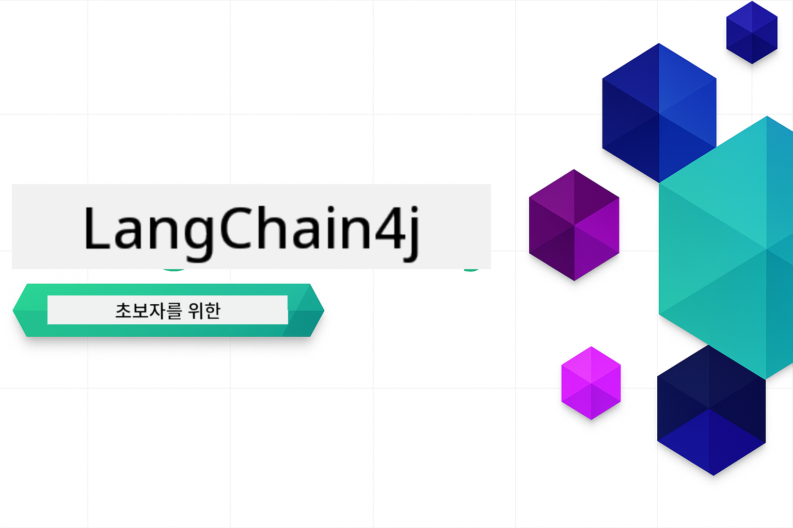
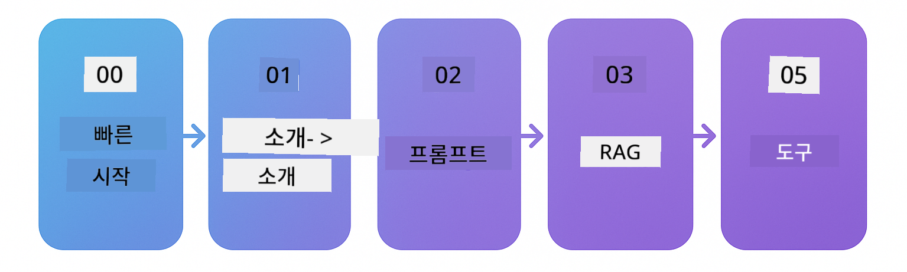

<!--
CO_OP_TRANSLATOR_METADATA:
{
  "original_hash": "e137234b4d3a7fcbbfc93bf17ae8a621",
  "translation_date": "2025-12-19T10:06:46+00:00",
  "source_file": "README.md",
  "language_code": "ko"
}
-->


### 🌐 다국어 지원

#### GitHub Action을 통한 지원 (자동화 및 항상 최신 상태 유지)

<!-- CO-OP TRANSLATOR LANGUAGES TABLE START -->
[아랍어](../ar/README.md) | [벵골어](../bn/README.md) | [불가리아어](../bg/README.md) | [버마어 (미얀마)](../my/README.md) | [중국어 (간체)](../zh/README.md) | [중국어 (번체, 홍콩)](../hk/README.md) | [중국어 (번체, 마카오)](../mo/README.md) | [중국어 (번체, 대만)](../tw/README.md) | [크로아티아어](../hr/README.md) | [체코어](../cs/README.md) | [덴마크어](../da/README.md) | [네덜란드어](../nl/README.md) | [에스토니아어](../et/README.md) | [핀란드어](../fi/README.md) | [프랑스어](../fr/README.md) | [독일어](../de/README.md) | [그리스어](../el/README.md) | [히브리어](../he/README.md) | [힌디어](../hi/README.md) | [헝가리어](../hu/README.md) | [인도네시아어](../id/README.md) | [이탈리아어](../it/README.md) | [일본어](../ja/README.md) | [칸나다어](../kn/README.md) | [한국어](./README.md) | [리투아니아어](../lt/README.md) | [말레이어](../ms/README.md) | [말라얄람어](../ml/README.md) | [마라티어](../mr/README.md) | [네팔어](../ne/README.md) | [나이지리아 피진어](../pcm/README.md) | [노르웨이어](../no/README.md) | [페르시아어 (파르시)](../fa/README.md) | [폴란드어](../pl/README.md) | [포르투갈어 (브라질)](../br/README.md) | [포르투갈어 (포르투갈)](../pt/README.md) | [펀자브어 (구르무키)](../pa/README.md) | [루마니아어](../ro/README.md) | [러시아어](../ru/README.md) | [세르비아어 (키릴문자)](../sr/README.md) | [슬로바키아어](../sk/README.md) | [슬로베니아어](../sl/README.md) | [스페인어](../es/README.md) | [스와힐리어](../sw/README.md) | [스웨덴어](../sv/README.md) | [타갈로그어 (필리핀어)](../tl/README.md) | [타밀어](../ta/README.md) | [텔루구어](../te/README.md) | [태국어](../th/README.md) | [터키어](../tr/README.md) | [우크라이나어](../uk/README.md) | [우르두어](../ur/README.md) | [베트남어](../vi/README.md)
<!-- CO-OP TRANSLATOR LANGUAGES TABLE END -->

# 초보자를 위한 LangChain4j

기본 채팅부터 AI 에이전트까지 LangChain4j와 Azure OpenAI GPT-5로 AI 애플리케이션을 구축하는 과정입니다.

**LangChain4j가 처음이신가요?** 주요 용어와 개념 정의는 [용어집](docs/GLOSSARY.md)을 참고하세요.

## 목차

1. [빠른 시작](00-quick-start/README.md) - LangChain4j 시작하기
2. [소개](01-introduction/README.md) - LangChain4j 기본 개념 배우기
3. [프롬프트 엔지니어링](02-prompt-engineering/README.md) - 효과적인 프롬프트 설계 마스터하기
4. [RAG (검색 보강 생성)](03-rag/README.md) - 지능형 지식 기반 시스템 구축하기
5. [도구](04-tools/README.md) - AI 에이전트와 외부 도구 및 API 통합하기
6. [MCP (모델 컨텍스트 프로토콜)](05-mcp/README.md) - 모델 컨텍스트 프로토콜 다루기
---

## 학습 경로

> **빠른 시작**

1. 이 저장소를 GitHub 계정으로 포크하세요
2. **Code** → **Codespaces** 탭 → **...** → **옵션으로 새로 만들기...** 클릭
3. 기본값을 사용하세요 – 이 과정에 맞게 생성된 개발 컨테이너가 선택됩니다
4. **Codespace 생성** 클릭
5. 환경이 준비될 때까지 5-10분 기다리세요
6. 바로 [빠른 시작](./00-quick-start/README.md)으로 이동해 시작하세요!

> **로컬에서 클론하기를 선호하시나요?**
>
> 이 저장소는 50개 이상의 언어 번역을 포함하여 다운로드 크기가 크게 증가합니다. 번역 없이 클론하려면 sparse checkout을 사용하세요:
> ```bash
> git clone --filter=blob:none --sparse https://github.com/microsoft/LangChain4j-for-Beginners.git
> cd LangChain4j-for-Beginners
> git sparse-checkout set --no-cone '/*' '!translations' '!translated_images'
> ```
> 이 방법으로 훨씬 빠른 다운로드로 코스를 완료하는 데 필요한 모든 것을 얻을 수 있습니다.

[빠른 시작](00-quick-start/README.md) 모듈부터 시작하여 각 모듈을 단계별로 진행하며 실력을 쌓으세요. 기본 예제를 통해 기초를 이해한 후 [소개](01-introduction/README.md) 모듈에서 GPT-5와 함께 더 깊이 학습합니다.



모듈을 완료한 후에는 [테스트 가이드](docs/TESTING.md)를 탐색하여 LangChain4j 테스트 개념을 실제로 확인하세요.

> **참고:** 이 교육 과정은 GitHub 모델과 Azure OpenAI를 모두 사용합니다. [빠른 시작](00-quick-start/README.md)과 [MCP](05-mcp/README.md) 모듈은 GitHub 모델을 사용하며 (Azure 구독 불필요), 1~4 모듈은 Azure OpenAI GPT-5를 사용합니다.


## GitHub Copilot과 함께 학습하기

빠르게 코딩을 시작하려면 이 프로젝트를 GitHub Codespace 또는 제공된 devcontainer가 포함된 로컬 IDE에서 열어보세요. 이 과정에서 사용되는 devcontainer는 AI 페어 프로그래밍을 위한 GitHub Copilot이 사전 구성되어 있습니다.

각 코드 예제에는 GitHub Copilot에게 물어볼 수 있는 추천 질문이 포함되어 있어 이해를 깊게 할 수 있습니다. 💡/🤖 프롬프트는 다음 위치에서 확인하세요:

- **Java 파일 헤더** - 각 예제에 특화된 질문
- **모듈 README** - 코드 예제 후 탐색용 질문

**사용 방법:** 코드 파일을 열고 추천 질문을 Copilot에게 물어보세요. Copilot은 코드베이스 전체를 이해하고 있어 설명, 확장, 대안 제시가 가능합니다.

더 배우고 싶나요? [AI 페어 프로그래밍을 위한 Copilot](https://aka.ms/GitHubCopilotAI)을 확인하세요.


## 추가 자료

<!-- CO-OP TRANSLATOR OTHER COURSES START -->
### LangChain
[](https://aka.ms/langchain4j-for-beginners)
[](https://aka.ms/langchainjs-for-beginners?WT.mc_id=m365-94501-dwahlin)

---

### Azure / Edge / MCP / 에이전트
[](https://github.com/microsoft/AZD-for-beginners?WT.mc_id=academic-105485-koreyst)
[](https://github.com/microsoft/edgeai-for-beginners?WT.mc_id=academic-105485-koreyst)
[](https://github.com/microsoft/mcp-for-beginners?WT.mc_id=academic-105485-koreyst)
[](https://github.com/microsoft/ai-agents-for-beginners?WT.mc_id=academic-105485-koreyst)

---
 
### 생성 AI 시리즈
[](https://github.com/microsoft/generative-ai-for-beginners?WT.mc_id=academic-105485-koreyst)
[-9333EA?style=for-the-badge&labelColor=E5E7EB&color=9333EA)](https://github.com/microsoft/Generative-AI-for-beginners-dotnet?WT.mc_id=academic-105485-koreyst)
[-C084FC?style=for-the-badge&labelColor=E5E7EB&color=C084FC)](https://github.com/microsoft/generative-ai-for-beginners-java?WT.mc_id=academic-105485-koreyst)
[-E879F9?style=for-the-badge&labelColor=E5E7EB&color=E879F9)](https://github.com/microsoft/generative-ai-with-javascript?WT.mc_id=academic-105485-koreyst)

---
 
### 핵심 학습
[](https://aka.ms/ml-beginners?WT.mc_id=academic-105485-koreyst)
[](https://aka.ms/datascience-beginners?WT.mc_id=academic-105485-koreyst)
[](https://aka.ms/ai-beginners?WT.mc_id=academic-105485-koreyst)
[](https://github.com/microsoft/Security-101?WT.mc_id=academic-96948-sayoung)
[](https://aka.ms/webdev-beginners?WT.mc_id=academic-105485-koreyst)
[](https://aka.ms/iot-beginners?WT.mc_id=academic-105485-koreyst)
[](https://github.com/microsoft/xr-development-for-beginners?WT.mc_id=academic-105485-koreyst)

---
 
### 코파일럿 시리즈
[](https://aka.ms/GitHubCopilotAI?WT.mc_id=academic-105485-koreyst)
[](https://github.com/microsoft/mastering-github-copilot-for-dotnet-csharp-developers?WT.mc_id=academic-105485-koreyst)
[](https://github.com/microsoft/CopilotAdventures?WT.mc_id=academic-105485-koreyst)
<!-- CO-OP TRANSLATOR OTHER COURSES END -->

## 도움 받기

AI 앱 개발 중 막히거나 질문이 있으면 다음에 참여하세요:

[](https://aka.ms/foundry/discord)

제품 피드백이나 빌드 중 오류가 있으면 방문하세요:

[](https://aka.ms/foundry/forum)

## 라이선스

MIT 라이선스 - 자세한 내용은 [LICENSE](../../LICENSE) 파일을 참조하세요.

---

<!-- CO-OP TRANSLATOR DISCLAIMER START -->
**면책 조항**:  
이 문서는 AI 번역 서비스 [Co-op Translator](https://github.com/Azure/co-op-translator)를 사용하여 번역되었습니다. 정확성을 위해 최선을 다하고 있으나, 자동 번역에는 오류나 부정확한 부분이 있을 수 있음을 유의하시기 바랍니다. 원문 문서가 권위 있는 출처로 간주되어야 합니다. 중요한 정보의 경우 전문적인 인간 번역을 권장합니다. 본 번역 사용으로 인해 발생하는 오해나 잘못된 해석에 대해 당사는 책임을 지지 않습니다.
<!-- CO-OP TRANSLATOR DISCLAIMER END -->