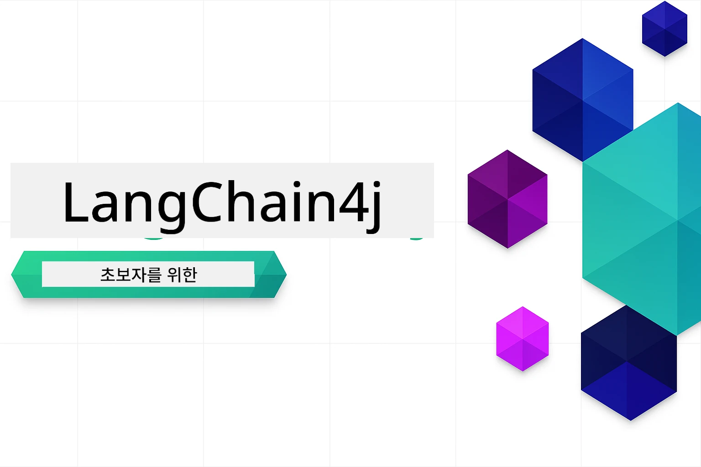

# LangChain4j 초보자용

LangChain4j와 Azure OpenAI GPT-5.2를 사용하여 기본 채팅부터 AI 에이전트까지 AI 애플리케이션을 구축하는 과정입니다.

### 🌐 다국어 지원

#### GitHub Action을 통해 지원 (자동화 및 항상 최신 상태 유지)

<!-- CO-OP TRANSLATOR LANGUAGES TABLE START -->
[Arabic](../ar/README.md) | [Bengali](../bn/README.md) | [Bulgarian](../bg/README.md) | [Burmese (Myanmar)](../my/README.md) | [Chinese (Simplified)](../zh-CN/README.md) | [Chinese (Traditional, Hong Kong)](../zh-HK/README.md) | [Chinese (Traditional, Macau)](../zh-MO/README.md) | [Chinese (Traditional, Taiwan)](../zh-TW/README.md) | [Croatian](../hr/README.md) | [Czech](../cs/README.md) | [Danish](../da/README.md) | [Dutch](../nl/README.md) | [Estonian](../et/README.md) | [Finnish](../fi/README.md) | [French](../fr/README.md) | [German](../de/README.md) | [Greek](../el/README.md) | [Hebrew](../he/README.md) | [Hindi](../hi/README.md) | [Hungarian](../hu/README.md) | [Indonesian](../id/README.md) | [Italian](../it/README.md) | [Japanese](../ja/README.md) | [Kannada](../kn/README.md) | [Khmer](../km/README.md) | [Korean](./README.md) | [Lithuanian](../lt/README.md) | [Malay](../ms/README.md) | [Malayalam](../ml/README.md) | [Marathi](../mr/README.md) | [Nepali](../ne/README.md) | [Nigerian Pidgin](../pcm/README.md) | [Norwegian](../no/README.md) | [Persian (Farsi)](../fa/README.md) | [Polish](../pl/README.md) | [Portuguese (Brazil)](../pt-BR/README.md) | [Portuguese (Portugal)](../pt-PT/README.md) | [Punjabi (Gurmukhi)](../pa/README.md) | [Romanian](../ro/README.md) | [Russian](../ru/README.md) | [Serbian (Cyrillic)](../sr/README.md) | [Slovak](../sk/README.md) | [Slovenian](../sl/README.md) | [Spanish](../es/README.md) | [Swahili](../sw/README.md) | [Swedish](../sv/README.md) | [Tagalog (Filipino)](../tl/README.md) | [Tamil](../ta/README.md) | [Telugu](../te/README.md) | [Thai](../th/README.md) | [Turkish](../tr/README.md) | [Ukrainian](../uk/README.md) | [Urdu](../ur/README.md) | [Vietnamese](../vi/README.md)

> **로컬로 클론하는 것을 선호하나요?**
>
> 이 저장소에는 50개 이상의 언어 번역이 포함되어 있어 다운로드 크기가 크게 증가합니다. 번역 없이 클론하려면 희소 체크아웃을 사용하세요:
>
> **Bash / macOS / Linux:**
> ```bash
> git clone --filter=blob:none --sparse https://github.com/microsoft/LangChain4j-for-Beginners.git
> cd LangChain4j-for-Beginners
> git sparse-checkout set --no-cone '/*' '!translations' '!translated_images'
> ```
>
> **CMD (Windows):**
> ```cmd
> git clone --filter=blob:none --sparse https://github.com/microsoft/LangChain4j-for-Beginners.git
> cd LangChain4j-for-Beginners
> git sparse-checkout set --no-cone "/*" "!translations" "!translated_images"
> ```
>
> 이 방법으로 훨씬 빠른 다운로드로 코스를 완료하는 데 필요한 모든 것을 얻을 수 있습니다.
<!-- CO-OP TRANSLATOR LANGUAGES TABLE END -->

## 목차

1. [소개](01-introduction/README.md) - LangChain4j 기본 개념 배우기
2. [프롬프트 엔지니어링](02-prompt-engineering/README.md) - 효과적인 프롬프트 설계 마스터하기
3. [RAG (검색 기반 생성)](03-rag/README.md) - 지능형 지식 기반 시스템 구축
4. [도구](04-tools/README.md) - 외부 도구와 간단한 어시스턴트 통합
5. [MCP (모델 컨텍스트 프로토콜)](05-mcp/README.md) - MCP와 에이전틱 모듈 사용하기

### 비디오 워크스루

각 모듈에는 개념과 코드를 단계별로 안내하는 라이브 세션이 함께 제공됩니다.

| 모듈 | 비디오 |
|--------|-------|
| 01 - 소개 | [LangChain4j 시작하기](https://www.youtube.com/live/nl_troDm8rQ) |
| 02 - 프롬프트 엔지니어링 | [LangChain4j에서의 프롬프트 엔지니어링](https://www.youtube.com/live/PJ6aBaE6bog) |
| 03 - RAG | [LangChain4j와 함께하는 RAG](https://www.youtube.com/watch?v=_olq75ZH_eY) |
| 04 - 도구 & 05 - MCP | [도구 및 MCP를 활용한 AI 에이전트](https://www.youtube.com/watch?v=O_J30kZc0rw) |

---

## 학습 경로

**LangChain4j를 처음 접하나요?** 주요 용어와 개념 정의는 [용어집](docs/GLOSSARY.md)을 참고하세요.

> **빠른 시작**

1. 이 저장소를 GitHub 계정에 포크합니다.
2. **Code** → **Codespaces** 탭 → **...** → **옵션과 함께 새로 만들기...** 클릭
3. 기본값 사용 – 이 과정에 맞게 만들어진 개발 컨테이너가 선택됩니다.
4. **코드스페이스 만들기** 클릭
5. 환경 준비까지 5-10분 기다리기
6. 바로 [소개](./01-introduction/README.md)로 이동해 시작하세요!

모듈을 완료하면 [테스트 가이드](docs/TESTING.md)를 통해 LangChain4j 테스트 개념을 직접 확인해 보세요.

> **참고:** 본 교육은 Azure OpenAI를 사용합니다. 아직 계정이 없으면 [무료 Azure 계정](https://aka.ms/azure-free-account)으로 시작하세요.


## GitHub Copilot과 함께 배우기

빠르게 코딩을 시작하려면 GitHub Codespace 또는 제공된 devcontainer를 사용하여 이 프로젝트를 로컬 IDE에서 여세요. 이 과정에서 사용되는 devcontainer는 AI 페어 프로그래밍을 위한 GitHub Copilot이 사전 구성되어 있습니다.

각 코드 예제에는 GitHub Copilot에게 물어볼 수 있는 추천 질문이 포함되어 있어 이해를 깊게 할 수 있습니다. 💡/🤖 프롬프트는 다음 위치에서 찾으세요:

- **Java 파일 헤더** - 각 예제별 구체적 질문
- **모듈 README** - 코드 예제 후 탐색을 위한 질문

**사용 방법:** 코드 파일을 열고 추천 질문을 Copilot에게 물어보세요. Copilot은 코드베이스 전체를 파악하고 있어 설명, 확장 및 대안 제시가 가능합니다.

더 배우고 싶나요? [AI 페어 프로그래밍용 Copilot](https://aka.ms/GitHubCopilotAI)을 확인하세요.


## 추가 자료

<!-- CO-OP TRANSLATOR OTHER COURSES START -->
### LangChain
[](https://aka.ms/langchain4j-for-beginners)
[](https://aka.ms/langchainjs-for-beginners?WT.mc_id=m365-94501-dwahlin)
[](https://github.com/microsoft/langchain-for-beginners?WT.mc_id=m365-94501-dwahlin)
---

### Azure / Edge / MCP / Agents
[](https://github.com/microsoft/AZD-for-beginners?WT.mc_id=academic-105485-koreyst)
[](https://github.com/microsoft/edgeai-for-beginners?WT.mc_id=academic-105485-koreyst)
[](https://github.com/microsoft/mcp-for-beginners?WT.mc_id=academic-105485-koreyst)
[](https://github.com/microsoft/ai-agents-for-beginners?WT.mc_id=academic-105485-koreyst)

---
 
### 생성 AI 시리즈
[](https://github.com/microsoft/generative-ai-for-beginners?WT.mc_id=academic-105485-koreyst)
[-9333EA?style=for-the-badge&labelColor=E5E7EB&color=9333EA)](https://github.com/microsoft/Generative-AI-for-beginners-dotnet?WT.mc_id=academic-105485-koreyst)
[-C084FC?style=for-the-badge&labelColor=E5E7EB&color=C084FC)](https://github.com/microsoft/generative-ai-for-beginners-java?WT.mc_id=academic-105485-koreyst)
[-E879F9?style=for-the-badge&labelColor=E5E7EB&color=E879F9)](https://github.com/microsoft/generative-ai-with-javascript?WT.mc_id=academic-105485-koreyst)

---
 
### 핵심 학습
[](https://aka.ms/ml-beginners?WT.mc_id=academic-105485-koreyst)
[](https://aka.ms/datascience-beginners?WT.mc_id=academic-105485-koreyst)
[](https://aka.ms/ai-beginners?WT.mc_id=academic-105485-koreyst)
[](https://github.com/microsoft/Security-101?WT.mc_id=academic-96948-sayoung)

[](https://aka.ms/webdev-beginners?WT.mc_id=academic-105485-koreyst)
[](https://aka.ms/iot-beginners?WT.mc_id=academic-105485-koreyst)
[](https://github.com/microsoft/xr-development-for-beginners?WT.mc_id=academic-105485-koreyst)

---
 
### Copilot 시리즈
[](https://aka.ms/GitHubCopilotAI?WT.mc_id=academic-105485-koreyst)
[](https://github.com/microsoft/mastering-github-copilot-for-dotnet-csharp-developers?WT.mc_id=academic-105485-koreyst)
[](https://github.com/microsoft/CopilotAdventures?WT.mc_id=academic-105485-koreyst)
<!-- CO-OP TRANSLATOR OTHER COURSES END -->

## 도움 받기

AI 앱 구축 중 막히거나 질문이 있으면 다음에 참여하세요:

[](https://aka.ms/foundry/discord)

제품 피드백이나 빌드 중 오류가 있으면 다음을 방문하세요:

[](https://aka.ms/foundry/forum)

## 라이선스

MIT 라이선스 - 자세한 내용은 [LICENSE](../../LICENSE) 파일을 참조하세요.

---

<!-- CO-OP TRANSLATOR DISCLAIMER START -->
**면책 조항**:
이 문서는 AI 번역 서비스 [Co-op Translator](https://github.com/Azure/co-op-translator)를 사용하여 번역되었습니다. 정확성을 기하기 위해 노력하고 있으나, 자동 번역은 오류나 부정확한 부분이 있을 수 있음을 유의하시기 바랍니다. 원본 문서의 원어본이 권위 있는 자료로 간주되어야 합니다. 중요한 정보의 경우, 전문가의 인간 번역을 권장합니다. 이 번역 사용으로 인해 발생하는 오해나 잘못된 해석에 대해 당사는 책임을 지지 않습니다.
<!-- CO-OP TRANSLATOR DISCLAIMER END -->