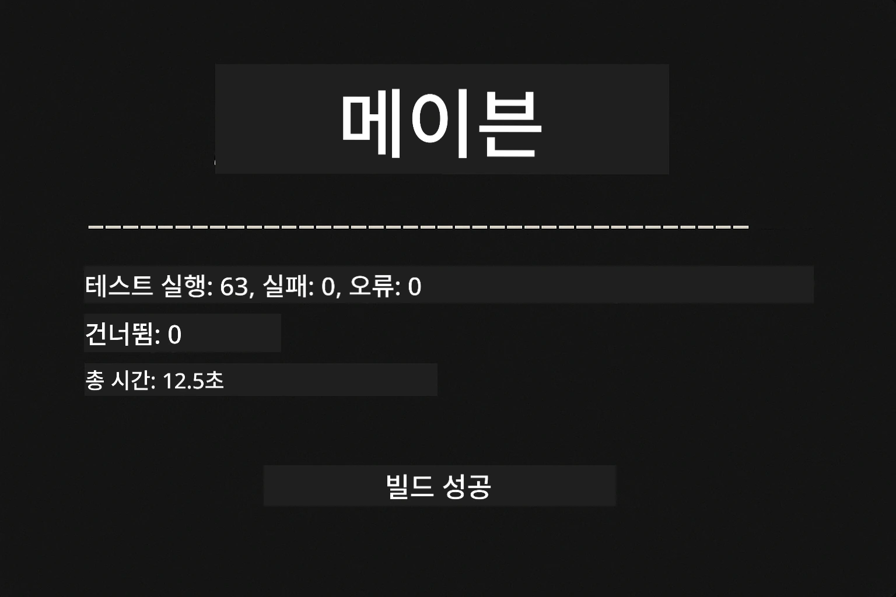
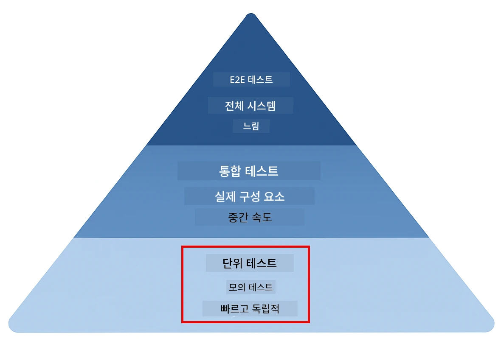
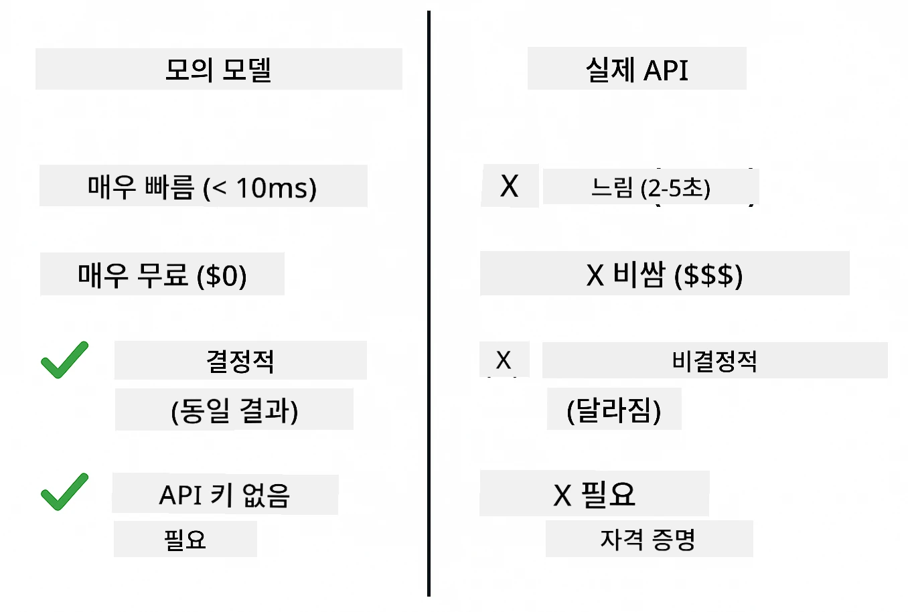
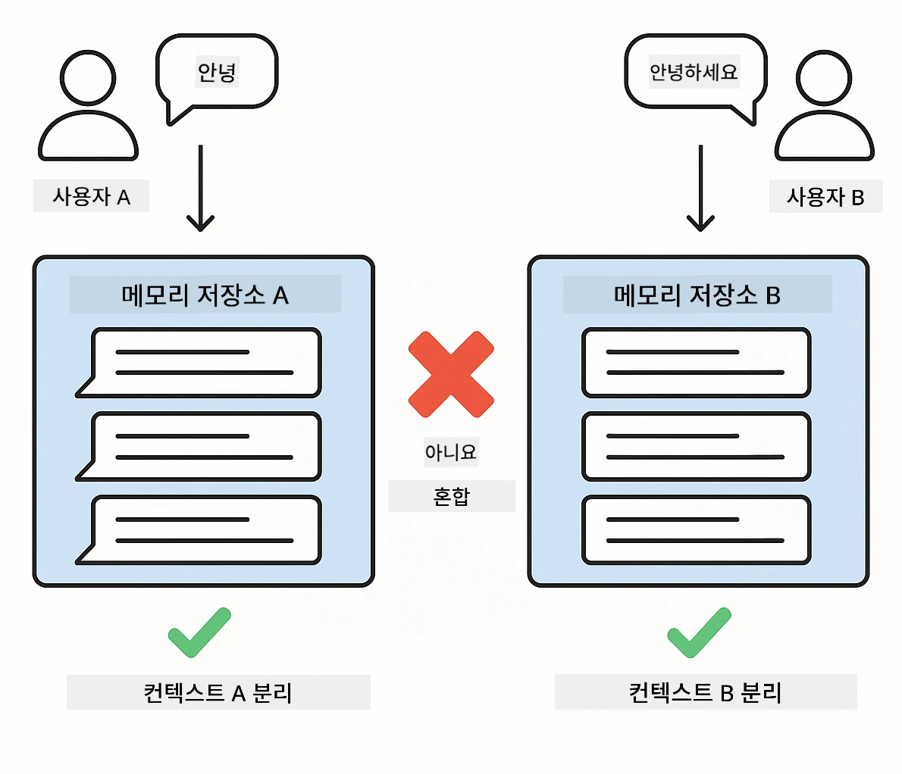
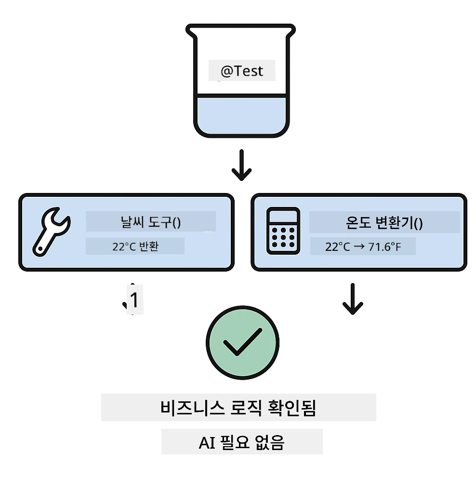
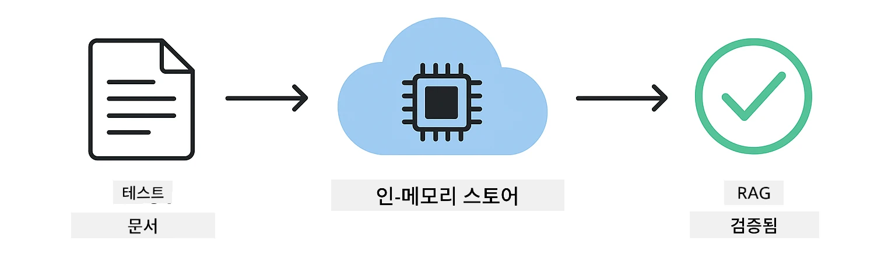

# LangChain4j 애플리케이션 테스트

## 목차

- [빠른 시작](../../../docs)
- [테스트 범위](../../../docs)
- [테스트 실행 방법](../../../docs)
- [VS Code에서 테스트 실행하기](../../../docs)
- [테스트 패턴](../../../docs)
- [테스트 철학](../../../docs)
- [다음 단계](../../../docs)

이 가이드는 API 키나 외부 서비스를 요구하지 않고 AI 애플리케이션을 테스트하는 방법을 보여주는 테스트를 안내합니다.

## 빠른 시작

단일 명령으로 모든 테스트를 실행하세요:

**Bash:**
```bash
mvn test
```

**PowerShell:**
```powershell
mvn --% test
```



*모든 테스트가 실패 없이 통과하는 성공적인 테스트 실행 화면*

## 테스트 범위

이 과정은 로컬에서 실행되는 **단위 테스트(unit tests)** 에 중점을 둡니다. 각 테스트는 특정 LangChain4j 개념을 격리하여 보여줍니다.



*단위 테스트(빠르고 격리됨), 통합 테스트(실제 구성 요소), 엔드투엔드 테스트 간의 균형을 보여주는 테스트 피라미드. 이 교육은 단위 테스트를 다룹니다.*

| Module | Tests | Focus | Key Files |
|--------|-------|-------|-----------|
| **00 - Quick Start** | 6 | 프롬프트 템플릿과 변수 치환 | `SimpleQuickStartTest.java` |
| **01 - Introduction** | 8 | 대화 메모리와 상태 기반 채팅 | `SimpleConversationTest.java` |
| **02 - Prompt Engineering** | 12 | GPT-5 패턴, 열의 수준(eagerness levels), 구조화된 출력 | `SimpleGpt5PromptTest.java` |
| **03 - RAG** | 10 | 문서 수집, 임베딩, 유사도 검색 | `DocumentServiceTest.java` |
| **04 - Tools** | 12 | 함수 호출 및 도구 체이닝 | `SimpleToolsTest.java` |
| **05 - MCP** | 8 | Stdio 전송을 사용하는 Model Context Protocol | `SimpleMcpTest.java` |

## 테스트 실행 방법

**루트에서 모든 테스트 실행:**

**Bash:**
```bash
mvn test
```

**PowerShell:**
```powershell
mvn --% test
```

**특정 모듈의 테스트 실행:**

**Bash:**
```bash
cd 01-introduction && mvn test
# 또는 루트에서
mvn test -pl 01-introduction
```

**PowerShell:**
```powershell
cd 01-introduction; mvn --% test
# 또는 루트에서
mvn --% test -pl 01-introduction
```

**단일 테스트 클래스 실행:**

**Bash:**
```bash
mvn test -Dtest=SimpleConversationTest
```

**PowerShell:**
```powershell
mvn --% test -Dtest=SimpleConversationTest
```

**특정 테스트 메서드 실행:**

**Bash:**
```bash
mvn test -Dtest=SimpleConversationTest#대화 기록을 유지해야 함
```

**PowerShell:**
```powershell
mvn --% test -Dtest=SimpleConversationTest#대화 기록을 유지해야 함
```

## VS Code에서 테스트 실행하기

Visual Studio Code를 사용하는 경우, Test Explorer는 테스트를 실행하고 디버그할 수 있는 그래픽 인터페이스를 제공합니다.


*모든 Java 테스트 클래스와 개별 테스트 메서드가 표시된 VS Code Test Explorer의 테스트 트리 화면*

**VS Code에서 테스트를 실행하려면:**

1. 활동 표시줄에서 비커(beaker) 아이콘을 클릭하여 Test Explorer를 엽니다
2. 테스트 트리를 확장하여 모든 모듈과 테스트 클래스를 확인합니다
3. 개별 테스트 옆의 재생 버튼을 클릭하여 해당 테스트를 실행합니다
4. "Run All Tests"를 클릭하여 전체 테스트 스위트를 실행합니다
5. 아무 테스트에서나 오른쪽 클릭하고 "Debug Test"를 선택하여 중단점을 설정하고 코드를 단계별로 디버깅합니다

Test Explorer는 통과한 테스트에 대해 녹색 체크 표시를 보여주고, 실패 시 자세한 실패 메시지를 제공합니다.

## 테스트 패턴

### 패턴 1: 프롬프트 템플릿 테스트

가장 단순한 패턴은 AI 모델을 호출하지 않고 프롬프트 템플릿을 테스트하는 것입니다. 변수 치환이 올바르게 작동하는지, 프롬프트가 예상한 대로 포맷되는지 확인합니다.


*플레이스홀더가 있는 템플릿 → 값이 적용됨 → 형식화된 출력 검증 흐름을 보여주는 프롬프트 템플릿 테스트*

```java
@Test
@DisplayName("Should format prompt template with variables")
void testPromptTemplateFormatting() {
    PromptTemplate template = PromptTemplate.from(
        "Best time to visit {{destination}} for {{activity}}?"
    );
    
    Prompt prompt = template.apply(Map.of(
        "destination", "Paris",
        "activity", "sightseeing"
    ));
    
    assertThat(prompt.text()).isEqualTo("Best time to visit Paris for sightseeing?");
}
```

이 테스트는 `00-quick-start/src/test/java/com/example/langchain4j/quickstart/SimpleQuickStartTest.java`에 있습니다.

**실행 방법:**

**Bash:**
```bash
cd 00-quick-start && mvn test -Dtest=SimpleQuickStartTest#프롬프트 템플릿 형식 테스트
```

**PowerShell:**
```powershell
cd 00-quick-start; mvn --% test -Dtest=SimpleQuickStartTest#테스트 프롬프트 템플릿 형식화
```

### 패턴 2: 언어 모델 모킹(Mock)

대화 로직을 테스트할 때는 Mockito를 사용해 미리 정의된 응답을 반환하는 가짜 모델을 만드세요. 이렇게 하면 테스트가 빠르고 무료이며 결정론적(deterministic)입니다.



*모킹이 테스트에 더 적합한 이유를 보여주는 비교: 빠르고, 무료이며, 결정론적이고, API 키가 필요 없음*

```java
@ExtendWith(MockitoExtension.class)
class SimpleConversationTest {
    
    private ConversationService conversationService;
    
    @Mock
    private OpenAiOfficialChatModel mockChatModel;
    
    @BeforeEach
    void setUp() {
        ChatResponse mockResponse = ChatResponse.builder()
            .aiMessage(AiMessage.from("This is a test response"))
            .build();
        when(mockChatModel.chat(anyList())).thenReturn(mockResponse);
        
        conversationService = new ConversationService(mockChatModel);
    }
    
    @Test
    void shouldMaintainConversationHistory() {
        String conversationId = conversationService.startConversation();
        
        ChatResponse mockResponse1 = ChatResponse.builder()
            .aiMessage(AiMessage.from("Response 1"))
            .build();
        ChatResponse mockResponse2 = ChatResponse.builder()
            .aiMessage(AiMessage.from("Response 2"))
            .build();
        ChatResponse mockResponse3 = ChatResponse.builder()
            .aiMessage(AiMessage.from("Response 3"))
            .build();
        
        when(mockChatModel.chat(anyList()))
            .thenReturn(mockResponse1)
            .thenReturn(mockResponse2)
            .thenReturn(mockResponse3);

        conversationService.chat(conversationId, "First message");
        conversationService.chat(conversationId, "Second message");
        conversationService.chat(conversationId, "Third message");

        List<ChatMessage> history = conversationService.getHistory(conversationId);
        assertThat(history).hasSize(6); // 사용자 메시지 3개 + AI 메시지 3개
    }
}
```

이 패턴은 `01-introduction/src/test/java/com/example/langchain4j/service/SimpleConversationTest.java`에서 나타납니다. 모킹은 일관된 동작을 보장하여 메모리 관리가 올바르게 작동하는지 검증할 수 있게 합니다.

### 패턴 3: 대화 격리 테스트

대화 메모리는 여러 사용자를 분리해서 유지해야 합니다. 이 테스트는 대화들이 문맥을 섞지 않는지 검증합니다.



*다른 사용자의 문맥 혼합을 방지하기 위해 서로 분리된 메모리 저장소를 보여주는 대화 격리 테스트*

```java
@Test
void shouldIsolateConversationsByid() {
    String conv1 = conversationService.startConversation();
    String conv2 = conversationService.startConversation();
    
    ChatResponse mockResponse = ChatResponse.builder()
        .aiMessage(AiMessage.from("Response"))
        .build();
    when(mockChatModel.chat(anyList())).thenReturn(mockResponse);

    conversationService.chat(conv1, "Message for conversation 1");
    conversationService.chat(conv2, "Message for conversation 2");

    List<ChatMessage> history1 = conversationService.getHistory(conv1);
    List<ChatMessage> history2 = conversationService.getHistory(conv2);
    
    assertThat(history1).hasSize(2);
    assertThat(history2).hasSize(2);
}
```

각 대화는 자체 독립적인 기록을 유지합니다. 운영 시스템에서는 이러한 격리가 멀티유저 애플리케이션에 필수적입니다.

### 패턴 4: 도구(툴) 단독 테스트

도구는 AI가 호출할 수 있는 함수입니다. AI의 결정과 상관없이 도구를 직접 테스트하여 올바르게 동작하는지 확인하세요.



*AI 호출 없이 모의 도구 실행을 통해 비즈니스 로직을 검증하는 도구 단독 테스트*

```java
@Test
void shouldConvertCelsiusToFahrenheit() {
    TemperatureTool tempTool = new TemperatureTool();
    String result = tempTool.celsiusToFahrenheit(25.0);
    assertThat(result).containsPattern("77[.,]0°F");
}

@Test
void shouldDemonstrateToolChaining() {
    WeatherTool weatherTool = new WeatherTool();
    TemperatureTool tempTool = new TemperatureTool();

    String weatherResult = weatherTool.getCurrentWeather("Seattle");
    assertThat(weatherResult).containsPattern("\\d+°C");

    String conversionResult = tempTool.celsiusToFahrenheit(22.0);
    assertThat(conversionResult).containsPattern("71[.,]6°F");
}
```

이 테스트들은 `04-tools/src/test/java/com/example/langchain4j/agents/tools/SimpleToolsTest.java`에서 도구 로직을 AI 개입 없이 검증합니다. 체이닝 예시는 한 도구의 출력이 다른 도구의 입력으로 어떻게 전달되는지 보여줍니다.

### 패턴 5: 인메모리 RAG 테스트

RAG 시스템은 전통적으로 벡터 데이터베이스와 임베딩 서비스를 필요로 합니다. 인메모리 패턴은 외부 종속성 없이 전체 파이프라인을 테스트할 수 있게 해줍니다.



*데이터베이스 없이 문서 파싱, 임베딩 저장 및 유사도 검색을 보여주는 인메모리 RAG 테스트 워크플로우*

```java
@Test
void testProcessTextDocument() {
    String content = "This is a test document.\nIt has multiple lines.";
    InputStream inputStream = new ByteArrayInputStream(content.getBytes(StandardCharsets.UTF_8));
    
    DocumentService.ProcessedDocument result = 
        documentService.processDocument(inputStream, "test.txt");

    assertNotNull(result);
    assertTrue(result.segments().size() > 0);
    assertEquals("test.txt", result.segments().get(0).metadata().getString("filename"));
}
```

이 테스트는 `03-rag/src/test/java/com/example/langchain4j/rag/service/DocumentServiceTest.java`에서 인메모리에 문서를 생성하고 청킹 및 메타데이터 처리를 검증합니다.

### 패턴 6: MCP 통합 테스트

MCP 모듈은 stdio 전송을 사용하여 Model Context Protocol 통합을 테스트합니다. 이 테스트들은 애플리케이션이 하위 프로세스로 MCP 서버를 생성하고 통신할 수 있는지 검증합니다.

`05-mcp/src/test/java/com/example/langchain4j/mcp/SimpleMcpTest.java`의 테스트들이 MCP 클라이언트 동작을 검증합니다.

**실행 방법:**

**Bash:**
```bash
cd 05-mcp && mvn test
```

**PowerShell:**
```powershell
cd 05-mcp; mvn --% test
```

## 테스트 철학

AI를 테스트하지 마세요 — 당신이 작성한 코드를 테스트하세요. 테스트는 프롬프트가 어떻게 구성되는지, 메모리가 어떻게 관리되는지, 도구가 어떻게 실행되는지를 검증해야 합니다. AI 응답은 변동성이 있으므로 테스트 Assertions의 일부가 되어서는 안 됩니다. 프롬프트 템플릿이 변수를 올바르게 치환하는지 확인해야지, AI가 정답을 내는지를 테스트해서는 안 됩니다.

언어 모델에는 모킹을 사용하세요. 외부 종속성은 느리고, 비용이 들며, 비결정적입니다. 모킹을 사용하면 테스트가 수초 대신 밀리초 단위로 빠르고, API 비용이 들지 않으며, 항상 동일한 결과를 반환합니다.

테스트는 독립적으로 유지하세요. 각 테스트는 자체 데이터를 설정하고 다른 테스트에 의존하지 않으며 스스로 정리해야 합니다. 테스트는 실행 순서에 관계없이 통과해야 합니다.

정상 경로뿐 아니라 엣지 케이스도 테스트하세요. 빈 입력, 매우 큰 입력, 특수 문자, 잘못된 매개변수, 경계 조건 등을 시도해 보세요. 이러한 경우가 정상 사용에서 드러나지 않는 버그를 발견하곤 합니다.

설명적인 이름을 사용하세요. `shouldMaintainConversationHistoryAcrossMultipleMessages()`와 `test1()`을 비교해 보세요. 첫 번째 이름은 무엇을 테스트하는지 정확히 알려주어 실패 시 디버깅을 훨씬 쉽게 만듭니다.

## 다음 단계

이제 테스트 패턴을 이해했으니 각 모듈을 더 깊이 살펴보세요:

- **[00 - Quick Start](../00-quick-start/README.md)** - 프롬프트 템플릿 기본부터 시작
- **[01 - Introduction](../01-introduction/README.md)** - 대화 메모리 관리 학습
- **[02 - Prompt Engineering](../02-prompt-engineering/README.md)** - GPT-5 프롬프트 패턴 마스터하기
- **[03 - RAG](../03-rag/README.md)** - 검색 보강 생성(RAG) 시스템 구축
- **[04 - Tools](../04-tools/README.md)** - 함수 호출 및 도구 체인 구현
- **[05 - MCP](../05-mcp/README.md)** - Model Context Protocol 통합

각 모듈의 README는 여기서 테스트된 개념들에 대한 자세한 설명을 제공합니다.

---

**Navigation:** [← 메인으로 돌아가기](../README.md)

---

<!-- CO-OP TRANSLATOR DISCLAIMER START -->
면책사항:
이 문서는 AI 번역 서비스 [Co-op Translator](https://github.com/Azure/co-op-translator)를 사용하여 번역되었습니다. 정확성을 위해 최선을 다하고 있으나, 자동 번역에는 오류나 부정확성이 포함될 수 있음을 양지해 주시기 바랍니다. 원문(원어) 문서를 권위 있는 출처로 간주해야 합니다. 중요한 정보의 경우에는 전문 번역가에 의한 번역을 권장합니다. 본 번역의 사용으로 인해 발생하는 오해나 잘못된 해석에 대해서는 당사가 책임을 지지 않습니다.
<!-- CO-OP TRANSLATOR DISCLAIMER END -->