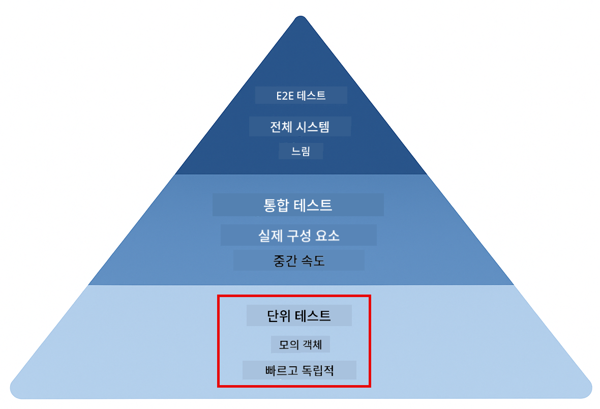
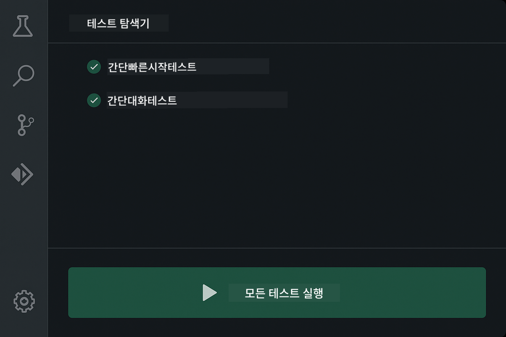
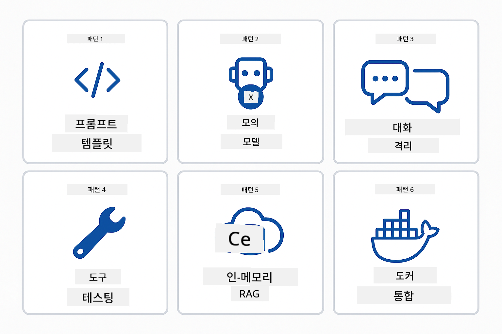
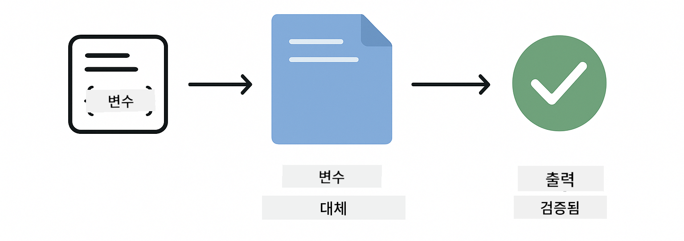
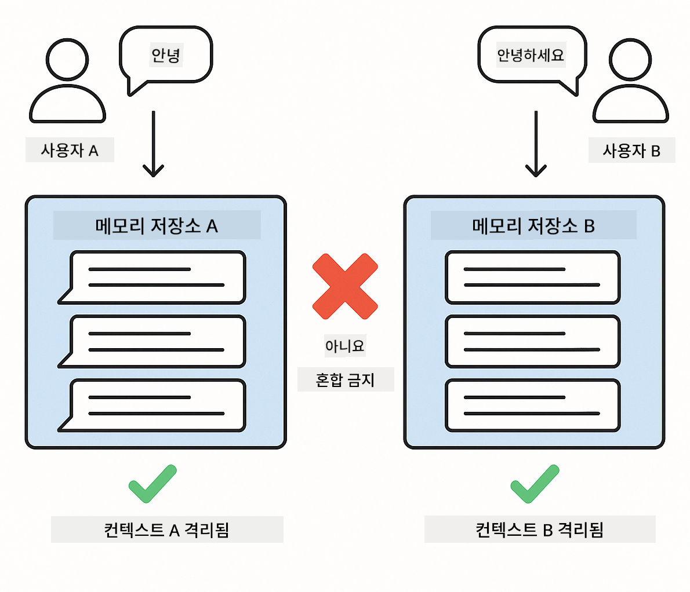
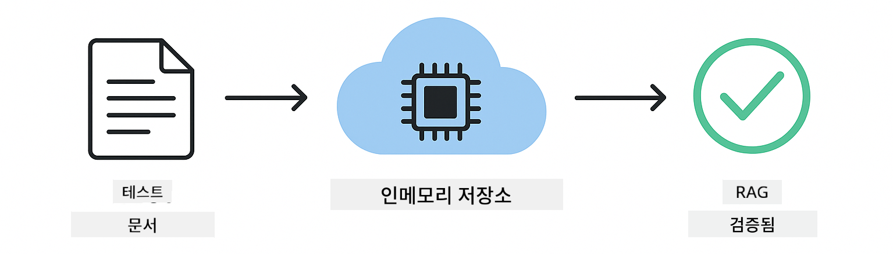
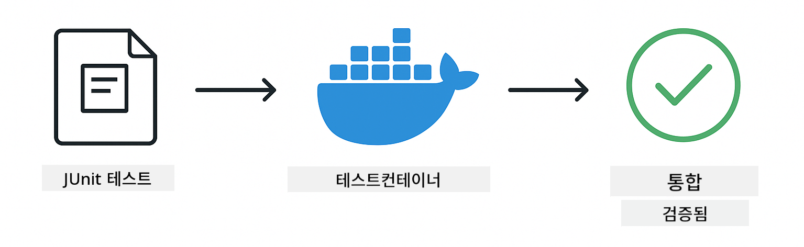

<!--
CO_OP_TRANSLATOR_METADATA:
{
  "original_hash": "b975537560c404d5f254331832811e78",
  "translation_date": "2025-12-13T20:47:23+00:00",
  "source_file": "docs/TESTING.md",
  "language_code": "ko"
}
-->
# LangChain4j 애플리케이션 테스트

## 목차

- [빠른 시작](../../../docs)
- [테스트 범위](../../../docs)
- [테스트 실행](../../../docs)
- [VS Code에서 테스트 실행](../../../docs)
- [테스트 패턴](../../../docs)
- [테스트 철학](../../../docs)
- [다음 단계](../../../docs)

이 가이드는 API 키나 외부 서비스 없이 AI 애플리케이션을 테스트하는 방법을 보여주는 테스트를 안내합니다.

## 빠른 시작

한 번의 명령으로 모든 테스트를 실행하세요:

**Bash:**
```bash
mvn test
```

**PowerShell:**
```powershell
mvn --% test
```


*실패 없이 모든 테스트가 통과된 성공적인 테스트 실행 화면*

## 테스트 범위

이 과정은 로컬에서 실행되는 **단위 테스트**에 중점을 둡니다. 각 테스트는 LangChain4j의 특정 개념을 독립적으로 보여줍니다.



*단위 테스트(빠르고 독립적), 통합 테스트(실제 구성 요소), 엔드 투 엔드 테스트(Docker를 포함한 전체 시스템) 간의 균형을 보여주는 테스트 피라미드. 이 교육은 단위 테스트를 다룹니다.*

| 모듈 | 테스트 수 | 중점 | 주요 파일 |
|--------|-------|-------|-----------|
| **00 - 빠른 시작** | 6 | 프롬프트 템플릿과 변수 치환 | `SimpleQuickStartTest.java` |
| **01 - 소개** | 8 | 대화 메모리 및 상태 기반 채팅 | `SimpleConversationTest.java` |
| **02 - 프롬프트 엔지니어링** | 12 | GPT-5 패턴, 열의 수준, 구조화된 출력 | `SimpleGpt5PromptTest.java` |
| **03 - RAG** | 10 | 문서 수집, 임베딩, 유사도 검색 | `DocumentServiceTest.java` |
| **04 - 도구** | 12 | 함수 호출 및 도구 체인 | `SimpleToolsTest.java` |
| **05 - MCP** | 15 | Docker를 이용한 모델 컨텍스트 프로토콜 | `SimpleMcpTest.java`, `McpDockerTransportTest.java` |

## 테스트 실행

**루트에서 모든 테스트 실행:**

**Bash:**
```bash
mvn test
```

**PowerShell:**
```powershell
mvn --% test
```

**특정 모듈 테스트 실행:**

**Bash:**
```bash
cd 01-introduction && mvn test
# 또는 루트에서부터
mvn test -pl 01-introduction
```

**PowerShell:**
```powershell
cd 01-introduction; mvn --% test
# 또는 루트에서부터
mvn --% test -pl 01-introduction
```

**단일 테스트 클래스 실행:**

**Bash:**
```bash
mvn test -Dtest=SimpleConversationTest
```

**PowerShell:**
```powershell
mvn --% test -Dtest=SimpleConversationTest
```

**특정 테스트 메서드 실행:**

**Bash:**
```bash
mvn test -Dtest=SimpleConversationTest#대화 기록을 유지해야 함
```

**PowerShell:**
```powershell
mvn --% test -Dtest=SimpleConversationTest#대화 기록을 유지해야 함
```

## VS Code에서 테스트 실행

Visual Studio Code를 사용하는 경우, Test Explorer가 테스트 실행 및 디버깅을 위한 그래픽 인터페이스를 제공합니다.



*모든 Java 테스트 클래스와 개별 테스트 메서드를 보여주는 VS Code 테스트 탐색기*

**VS Code에서 테스트 실행 방법:**

1. 활동 표시줄에서 비커 아이콘을 클릭하여 테스트 탐색기 열기
2. 테스트 트리를 확장하여 모든 모듈과 테스트 클래스를 확인
3. 개별 테스트 옆의 재생 버튼을 클릭하여 단독 실행
4. "모든 테스트 실행"을 클릭하여 전체 테스트 실행
5. 테스트를 우클릭하고 "테스트 디버그"를 선택하여 중단점 설정 및 코드 단계별 실행

테스트 탐색기는 통과한 테스트에 녹색 체크 표시를 보여주며, 실패 시 상세한 실패 메시지를 제공합니다.

## 테스트 패턴



*LangChain4j 애플리케이션을 위한 여섯 가지 테스트 패턴: 프롬프트 템플릿, 모델 모킹, 대화 격리, 도구 테스트, 인메모리 RAG, Docker 통합*

### 패턴 1: 프롬프트 템플릿 테스트

가장 간단한 패턴으로 AI 모델을 호출하지 않고 프롬프트 템플릿을 테스트합니다. 변수 치환이 올바르게 작동하는지, 프롬프트가 예상대로 포맷되는지 검증합니다.



*변수 치환 흐름을 보여주는 프롬프트 템플릿 테스트: 플레이스홀더가 있는 템플릿 → 값 적용 → 포맷된 출력 검증*

```java
@Test
@DisplayName("Should format prompt template with variables")
void testPromptTemplateFormatting() {
    PromptTemplate template = PromptTemplate.from(
        "Best time to visit {{destination}} for {{activity}}?"
    );
    
    Prompt prompt = template.apply(Map.of(
        "destination", "Paris",
        "activity", "sightseeing"
    ));
    
    assertThat(prompt.text()).isEqualTo("Best time to visit Paris for sightseeing?");
}
```

이 테스트는 `00-quick-start/src/test/java/com/example/langchain4j/quickstart/SimpleQuickStartTest.java`에 있습니다.

**실행 방법:**

**Bash:**
```bash
cd 00-quick-start && mvn test -Dtest=SimpleQuickStartTest#테스트프롬프트템플릿포맷팅
```

**PowerShell:**
```powershell
cd 00-quick-start; mvn --% test -Dtest=SimpleQuickStartTest#테스트프롬프트템플릿포맷팅
```

### 패턴 2: 언어 모델 모킹

대화 로직을 테스트할 때는 Mockito를 사용해 미리 정해진 응답을 반환하는 가짜 모델을 만듭니다. 이렇게 하면 테스트가 빠르고 무료이며 결정적입니다.


*테스트에 모킹이 선호되는 이유를 보여주는 비교: 빠르고, 무료이며, 결정적이고, API 키가 필요 없음*

```java
@ExtendWith(MockitoExtension.class)
class SimpleConversationTest {
    
    private ConversationService conversationService;
    
    @Mock
    private OpenAiOfficialChatModel mockChatModel;
    
    @BeforeEach
    void setUp() {
        ChatResponse mockResponse = ChatResponse.builder()
            .aiMessage(AiMessage.from("This is a test response"))
            .build();
        when(mockChatModel.chat(anyList())).thenReturn(mockResponse);
        
        conversationService = new ConversationService(mockChatModel);
    }
    
    @Test
    void shouldMaintainConversationHistory() {
        String conversationId = conversationService.startConversation();
        
        ChatResponse mockResponse1 = ChatResponse.builder()
            .aiMessage(AiMessage.from("Response 1"))
            .build();
        ChatResponse mockResponse2 = ChatResponse.builder()
            .aiMessage(AiMessage.from("Response 2"))
            .build();
        ChatResponse mockResponse3 = ChatResponse.builder()
            .aiMessage(AiMessage.from("Response 3"))
            .build();
        
        when(mockChatModel.chat(anyList()))
            .thenReturn(mockResponse1)
            .thenReturn(mockResponse2)
            .thenReturn(mockResponse3);

        conversationService.chat(conversationId, "First message");
        conversationService.chat(conversationId, "Second message");
        conversationService.chat(conversationId, "Third message");

        List<ChatMessage> history = conversationService.getHistory(conversationId);
        assertThat(history).hasSize(6); // 사용자 3명 + AI 메시지 3개
    }
}
```

이 패턴은 `01-introduction/src/test/java/com/example/langchain4j/service/SimpleConversationTest.java`에 나타납니다. 모킹은 일관된 동작을 보장하여 메모리 관리가 올바르게 작동하는지 검증할 수 있습니다.

### 패턴 3: 대화 격리 테스트

대화 메모리는 여러 사용자를 분리해야 합니다. 이 테스트는 대화가 서로의 컨텍스트를 섞지 않는지 검증합니다.



*서로 다른 사용자를 위한 별도의 메모리 저장소를 보여주는 대화 격리 테스트로 컨텍스트 혼합 방지*

```java
@Test
void shouldIsolateConversationsByid() {
    String conv1 = conversationService.startConversation();
    String conv2 = conversationService.startConversation();
    
    ChatResponse mockResponse = ChatResponse.builder()
        .aiMessage(AiMessage.from("Response"))
        .build();
    when(mockChatModel.chat(anyList())).thenReturn(mockResponse);

    conversationService.chat(conv1, "Message for conversation 1");
    conversationService.chat(conv2, "Message for conversation 2");

    List<ChatMessage> history1 = conversationService.getHistory(conv1);
    List<ChatMessage> history2 = conversationService.getHistory(conv2);
    
    assertThat(history1).hasSize(2);
    assertThat(history2).hasSize(2);
}
```

각 대화는 독립적인 기록을 유지합니다. 운영 시스템에서는 다중 사용자 애플리케이션에 이 격리가 매우 중요합니다.

### 패턴 4: 도구 독립 테스트

도구는 AI가 호출할 수 있는 함수입니다. AI 결정과 무관하게 도구가 올바르게 작동하는지 직접 테스트합니다.


*AI 호출 없이 모킹된 도구 실행을 보여주는 도구 독립 테스트로 비즈니스 로직 검증*

```java
@Test
void shouldConvertCelsiusToFahrenheit() {
    TemperatureTool tempTool = new TemperatureTool();
    String result = tempTool.celsiusToFahrenheit(25.0);
    assertThat(result).containsPattern("77[.,]0°F");
}

@Test
void shouldDemonstrateToolChaining() {
    WeatherTool weatherTool = new WeatherTool();
    TemperatureTool tempTool = new TemperatureTool();

    String weatherResult = weatherTool.getCurrentWeather("Seattle");
    assertThat(weatherResult).containsPattern("\\d+°C");

    String conversionResult = tempTool.celsiusToFahrenheit(22.0);
    assertThat(conversionResult).containsPattern("71[.,]6°F");
}
```

`04-tools/src/test/java/com/example/langchain4j/agents/tools/SimpleToolsTest.java`의 이 테스트들은 AI 개입 없이 도구 로직을 검증합니다. 체인 예시는 한 도구의 출력이 다른 도구의 입력으로 연결되는 방식을 보여줍니다.

### 패턴 5: 인메모리 RAG 테스트

RAG 시스템은 전통적으로 벡터 데이터베이스와 임베딩 서비스를 필요로 합니다. 인메모리 패턴은 외부 의존성 없이 전체 파이프라인을 테스트할 수 있게 합니다.



*데이터베이스 없이 문서 파싱, 임베딩 저장, 유사도 검색을 보여주는 인메모리 RAG 테스트 워크플로우*

```java
@Test
void testProcessTextDocument() {
    String content = "This is a test document.\nIt has multiple lines.";
    InputStream inputStream = new ByteArrayInputStream(content.getBytes(StandardCharsets.UTF_8));
    
    DocumentService.ProcessedDocument result = 
        documentService.processDocument(inputStream, "test.txt");

    assertNotNull(result);
    assertTrue(result.segments().size() > 0);
    assertEquals("test.txt", result.segments().get(0).metadata().getString("filename"));
}
```

`03-rag/src/test/java/com/example/langchain4j/rag/service/DocumentServiceTest.java`의 이 테스트는 메모리 내 문서를 생성하고 청킹 및 메타데이터 처리를 검증합니다.

### 패턴 6: Docker를 이용한 통합 테스트

일부 기능은 실제 인프라가 필요합니다. MCP 모듈은 Testcontainers를 사용해 Docker 컨테이너를 띄워 통합 테스트를 수행합니다. 이는 실제 서비스와 코드가 잘 작동하는지 검증하면서 테스트 격리를 유지합니다.



*자동화된 컨테이너 라이프사이클(시작, 테스트 실행, 중지, 정리)을 보여주는 MCP 통합 테스트*

`05-mcp/src/test/java/com/example/langchain4j/mcp/McpDockerTransportTest.java`의 테스트는 Docker가 실행 중이어야 합니다.

**실행 방법:**

**Bash:**
```bash
cd 05-mcp && mvn test
```

**PowerShell:**
```powershell
cd 05-mcp; mvn --% test
```

## 테스트 철학

AI가 아니라 코드를 테스트하세요. 테스트는 프롬프트가 어떻게 구성되는지, 메모리가 어떻게 관리되는지, 도구가 어떻게 실행되는지를 검증해야 합니다. AI 응답은 다양하므로 테스트 단언에 포함하지 마세요. 프롬프트 템플릿이 변수를 올바르게 치환하는지 여부를 확인하세요, AI가 정답을 주는지 여부가 아닙니다.

언어 모델에는 모킹을 사용하세요. 이는 느리고 비용이 들며 비결정적인 외부 의존성입니다. 모킹은 테스트를 밀리초 단위로 빠르게, API 비용 없이 무료로, 항상 같은 결과로 결정적으로 만듭니다.

테스트는 독립적으로 유지하세요. 각 테스트는 자체 데이터를 설정하고 다른 테스트에 의존하지 않으며 스스로 정리해야 합니다. 실행 순서와 상관없이 테스트가 통과해야 합니다.

행복 경로를 넘어 경계 조건을 테스트하세요. 빈 입력, 매우 큰 입력, 특수 문자, 잘못된 매개변수, 경계 조건 등을 시도하세요. 이는 일반 사용에서 드러나지 않는 버그를 발견하는 데 도움이 됩니다.

설명적인 이름을 사용하세요. `shouldMaintainConversationHistoryAcrossMultipleMessages()`와 `test1()`을 비교해 보세요. 첫 번째는 무엇을 테스트하는지 정확히 알려주어 실패 시 디버깅이 훨씬 쉽습니다.

## 다음 단계

테스트 패턴을 이해했으니 각 모듈을 더 깊이 탐구하세요:

- **[00 - 빠른 시작](../00-quick-start/README.md)** - 프롬프트 템플릿 기본부터 시작
- **[01 - 소개](../01-introduction/README.md)** - 대화 메모리 관리 학습
- **[02 - 프롬프트 엔지니어링](../02-prompt-engineering/README.md)** - GPT-5 프롬프트 패턴 마스터
- **[03 - RAG](../03-rag/README.md)** - 검색 보강 생성 시스템 구축
- **[04 - 도구](../04-tools/README.md)** - 함수 호출 및 도구 체인 구현
- **[05 - MCP](../05-mcp/README.md)** - Docker와 모델 컨텍스트 프로토콜 통합

각 모듈의 README에는 여기서 테스트하는 개념에 대한 자세한 설명이 포함되어 있습니다.

---

**네비게이션:** [← 메인으로 돌아가기](../README.md)

---

<!-- CO-OP TRANSLATOR DISCLAIMER START -->
**면책 조항**:  
이 문서는 AI 번역 서비스 [Co-op Translator](https://github.com/Azure/co-op-translator)를 사용하여 번역되었습니다. 정확성을 위해 최선을 다하고 있으나, 자동 번역에는 오류나 부정확한 부분이 있을 수 있음을 유의하시기 바랍니다. 원문 문서가 권위 있는 출처로 간주되어야 합니다. 중요한 정보의 경우 전문적인 인간 번역을 권장합니다. 본 번역 사용으로 인해 발생하는 오해나 잘못된 해석에 대해 당사는 책임을 지지 않습니다.
<!-- CO-OP TRANSLATOR DISCLAIMER END -->