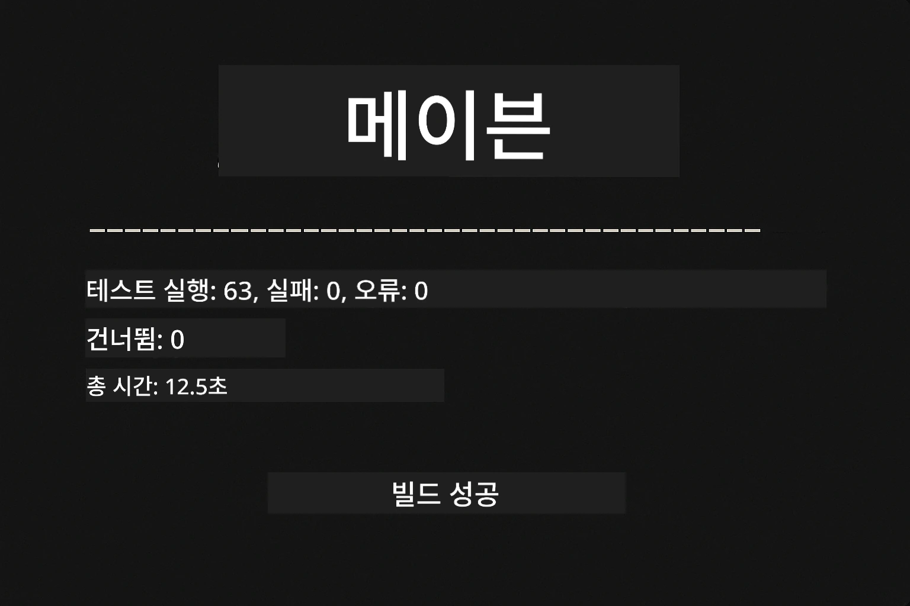
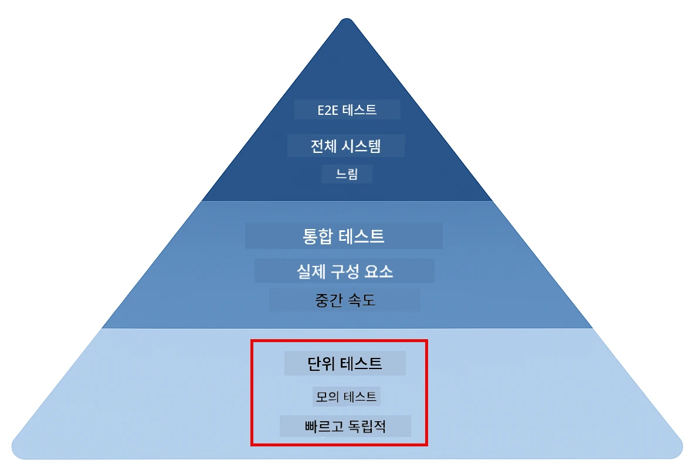
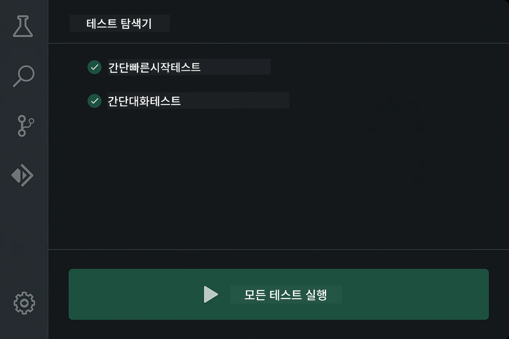
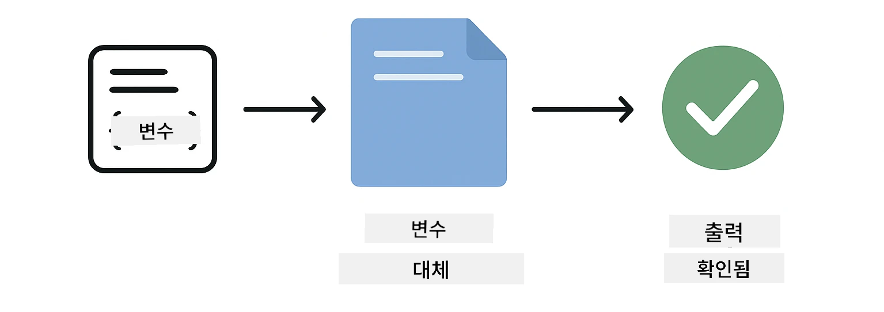
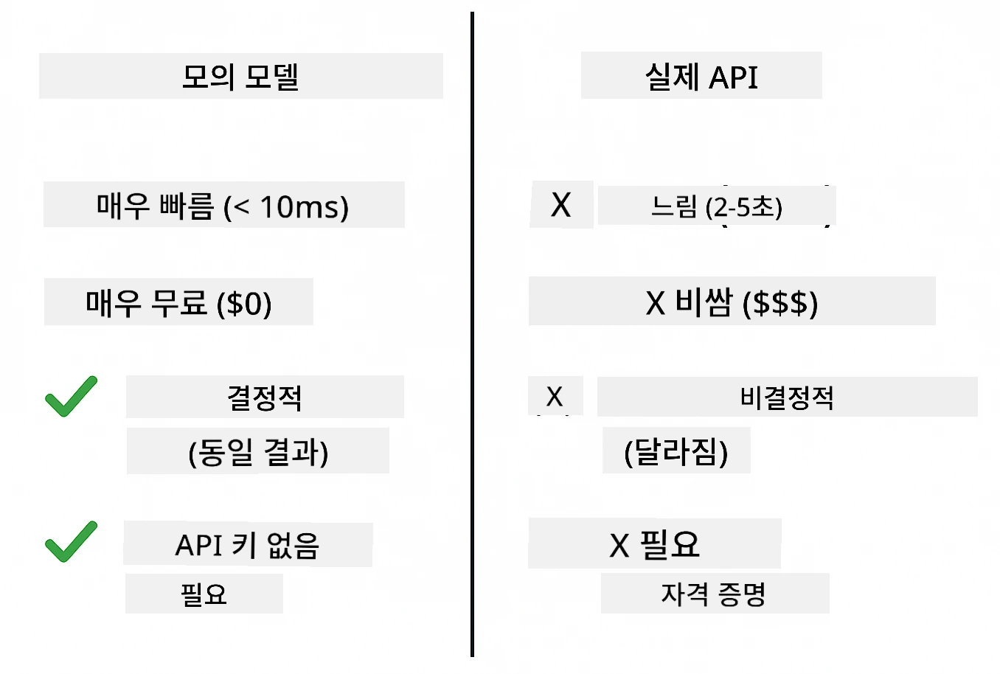
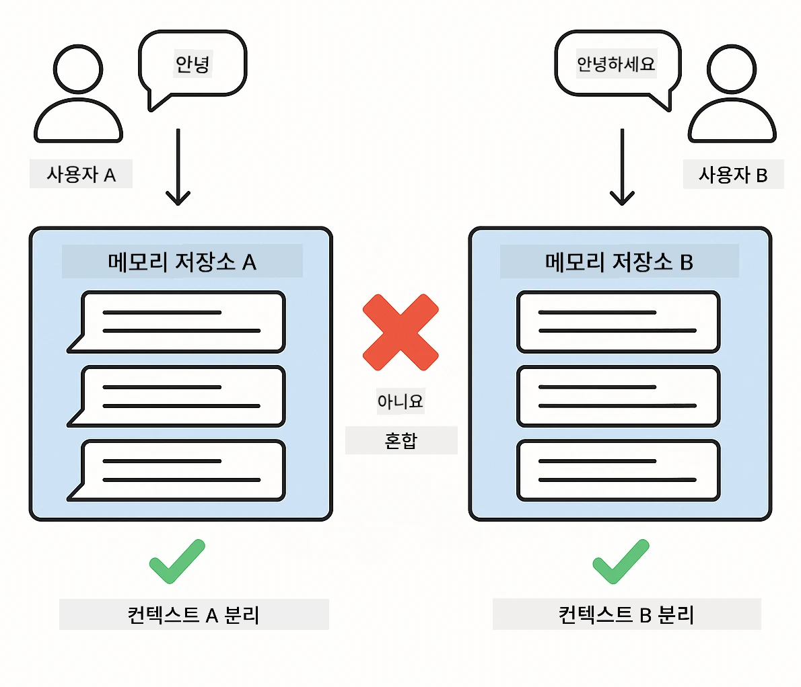
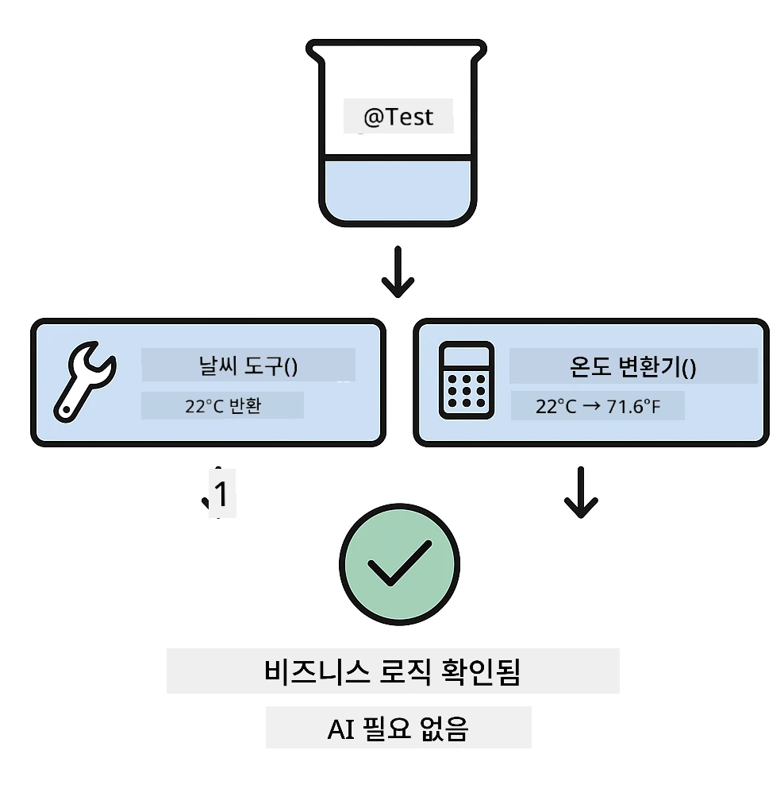
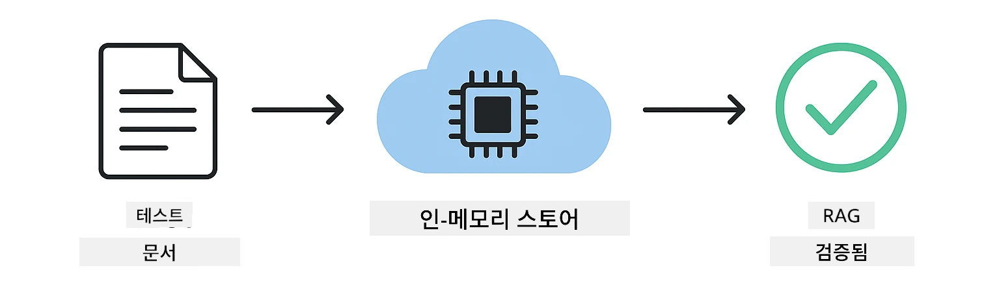

# LangChain4j 애플리케이션 테스트

## 목차

- [빠른 시작](#빠른-시작)
- [테스트 범위](#테스트-범위)
- [테스트 실행](#테스트-실행)
- [VS Code에서 테스트 실행](#vs-code에서-테스트-실행)
- [테스트 패턴](#테스트-패턴)
- [테스트 철학](#테스트-철학)
- [다음 단계](#다음-단계)

이 가이드는 API 키나 외부 서비스를 요구하지 않고 AI 애플리케이션을 테스트하는 방법을 보여주는 테스트를 안내합니다.

## 빠른 시작

한 번의 명령으로 모든 테스트를 실행하세요:

**Bash:**
```bash
mvn test
```

**PowerShell:**
```powershell
mvn --% test
```

모든 테스트가 통과하면 아래 스크린샷과 같은 출력이 나타납니다 — 실패 없이 테스트가 실행됩니다.



*모든 테스트가 실패 없이 성공적으로 실행된 결과*

## 테스트 범위

이 과정은 로컬에서 실행되는 **단위 테스트(unit test)** 에 집중합니다. 각 테스트는 LangChain4j의 특정 개념을 독립적으로 보여줍니다. 아래 테스트 피라미드는 단위 테스트가 어디에 위치하는지 보여줍니다 — 빠르고 신뢰할 수 있는 기초로서 나머지 테스트 전략이 구축됩니다.



*단위 테스트(빠르고 독립적), 통합 테스트(실제 컴포넌트), 엔드 투 엔드 테스트 간의 균형을 보여주는 테스트 피라미드. 이 훈련은 단위 테스트를 다룹니다.*

| 모듈 | 테스트 수 | 집중 내용 | 주요 파일 |
|--------|-------|-------|-----------|
| **01 - 소개** | 8 | 대화 메모리 및 상태 기반 채팅 | `SimpleConversationTest.java` |
| **02 - 프롬프트 엔지니어링** | 12 | GPT-5.2 패턴, eagerness 레벨, 구조화된 출력 | `SimpleGpt5PromptTest.java` |
| **03 - RAG** | 10 | 문서 수집, 임베딩, 유사도 검색 | `DocumentServiceTest.java` |
| **04 - 툴** | 12 | 함수 호출 및 도구 체인 | `SimpleToolsTest.java` |
| **05 - MCP** | 8 | Stdio 전송을 사용하는 모델 컨텍스트 프로토콜 | `SimpleMcpTest.java` |

## 테스트 실행

**루트에서 모든 테스트 실행:**

**Bash:**
```bash
mvn test
```

**PowerShell:**
```powershell
mvn --% test
```

**특정 모듈 테스트 실행:**

**Bash:**
```bash
cd 01-introduction && mvn test
# 또는 루트에서부터
mvn test -pl 01-introduction
```

**PowerShell:**
```powershell
cd 01-introduction; mvn --% test
# 또는 루트에서부터
mvn --% test -pl 01-introduction
```

**단일 테스트 클래스 실행:**

**Bash:**
```bash
mvn test -Dtest=SimpleConversationTest
```

**PowerShell:**
```powershell
mvn --% test -Dtest=SimpleConversationTest
```

**특정 테스트 메서드 실행:**

**Bash:**
```bash
mvn test -Dtest=SimpleConversationTest#대화 기록을 유지해야 함
```

**PowerShell:**
```powershell
mvn --% test -Dtest=SimpleConversationTest#대화 기록을 유지해야 함
```

## VS Code에서 테스트 실행

Visual Studio Code를 사용한다면, Test Explorer가 테스트 실행과 디버깅을 위한 그래픽 인터페이스를 제공합니다.



*모든 Java 테스트 클래스와 개별 테스트 메서드가 표시된 VS Code Test Explorer*

**VS Code에서 테스트 실행 방법:**

1. 활동 표시줄의 비커 아이콘을 클릭하여 Test Explorer를 엽니다
2. 테스트 트리를 확장하여 모든 모듈과 테스트 클래스를 봅니다
3. 개별 테스트를 실행하려면 원하는 테스트 옆의 실행 버튼을 클릭합니다
4. 전체 테스트 스위트를 실행하려면 "Run All Tests"를 클릭합니다
5. 원하는 테스트를 우클릭하고 "Debug Test"를 선택하여 중단점을 설정하고 단계 실행할 수 있습니다

Test Explorer는 테스트가 통과하면 녹색 체크표시를 보여주고, 실패 시 상세 실패 메시지를 제공합니다.

## 테스트 패턴

### 패턴 1: 프롬프트 템플릿 테스트

가장 단순한 패턴으로, AI 모델을 호출하지 않고 프롬프트 템플릿을 테스트합니다. 변수 치환이 올바르게 작동하는지와 프롬프트 포맷이 예상대로인지 검증합니다.



*플레이스홀더가 포함된 템플릿 → 값 적용 → 포맷된 출력 검증의 변수 치환 흐름을 보여주는 프롬프트 템플릿 테스트*

```java
@Test
@DisplayName("Should format prompt template with variables")
void testPromptTemplateFormatting() {
    PromptTemplate template = PromptTemplate.from(
        "Best time to visit {{destination}} for {{activity}}?"
    );
    
    Prompt prompt = template.apply(Map.of(
        "destination", "Paris",
        "activity", "sightseeing"
    ));
    
    assertThat(prompt.text()).isEqualTo("Best time to visit Paris for sightseeing?");
}
```

이 패턴은 변수 치환이 올바로 작동하고 프롬프트가 예상대로 포맷되는지를 검증합니다 — API 키나 모델 호출은 필요하지 않습니다.

### 패턴 2: 언어 모델 모킹(Mock)

대화 로직을 테스트할 때는 Mockito를 사용해 미리 정해진 응답을 반환하는 가짜 모델을 만드세요. 이를 통해 테스트는 빠르고, 무료이며, 결정적입니다.



*모킹이 테스트에 선호되는 이유 — 빠르고, 무료, 결정적이며 API 키 불필요함*

```java
@ExtendWith(MockitoExtension.class)
class SimpleConversationTest {
    
    private ConversationService conversationService;
    
    @Mock
    private OpenAiOfficialChatModel mockChatModel;
    
    @BeforeEach
    void setUp() {
        ChatResponse mockResponse = ChatResponse.builder()
            .aiMessage(AiMessage.from("This is a test response"))
            .build();
        when(mockChatModel.chat(anyList())).thenReturn(mockResponse);
        
        conversationService = new ConversationService(mockChatModel);
    }
    
    @Test
    void shouldMaintainConversationHistory() {
        String conversationId = conversationService.startConversation();
        
        ChatResponse mockResponse1 = ChatResponse.builder()
            .aiMessage(AiMessage.from("Response 1"))
            .build();
        ChatResponse mockResponse2 = ChatResponse.builder()
            .aiMessage(AiMessage.from("Response 2"))
            .build();
        ChatResponse mockResponse3 = ChatResponse.builder()
            .aiMessage(AiMessage.from("Response 3"))
            .build();
        
        when(mockChatModel.chat(anyList()))
            .thenReturn(mockResponse1)
            .thenReturn(mockResponse2)
            .thenReturn(mockResponse3);

        conversationService.chat(conversationId, "First message");
        conversationService.chat(conversationId, "Second message");
        conversationService.chat(conversationId, "Third message");

        List<ChatMessage> history = conversationService.getHistory(conversationId);
        assertThat(history).hasSize(6); // 사용자 3명 + AI 메시지 3개
    }
}
```

이 패턴은 `01-introduction/src/test/java/com/example/langchain4j/service/SimpleConversationTest.java`에서 확인할 수 있습니다. 모킹은 일관된 동작을 보장하여 메모리 관리를 정확히 검증할 수 있습니다.

### 패턴 3: 대화 격리 테스트

대화 메모리는 여러 사용자를 분리해야 합니다. 이 테스트는 대화가 서로 섞이지 않는지를 검증합니다.



*서로 다른 사용자의 별도 메모리 저장소를 보여주어 컨텍스트 혼합을 방지하는 대화 격리 테스트*

```java
@Test
void shouldIsolateConversationsByid() {
    String conv1 = conversationService.startConversation();
    String conv2 = conversationService.startConversation();
    
    ChatResponse mockResponse = ChatResponse.builder()
        .aiMessage(AiMessage.from("Response"))
        .build();
    when(mockChatModel.chat(anyList())).thenReturn(mockResponse);

    conversationService.chat(conv1, "Message for conversation 1");
    conversationService.chat(conv2, "Message for conversation 2");

    List<ChatMessage> history1 = conversationService.getHistory(conv1);
    List<ChatMessage> history2 = conversationService.getHistory(conv2);
    
    assertThat(history1).hasSize(2);
    assertThat(history2).hasSize(2);
}
```

각 대화는 독립적인 기록을 유지합니다. 운영 환경에서는 멀티유저 애플리케이션에 이 격리가 필수적입니다.

### 패턴 4: 도구 독립 테스트

도구는 AI가 호출할 수 있는 함수입니다. AI 결정과 상관없이 도구가 정상 작동하는지 직접 테스트하세요.



*AI 호출 없이 모킹된 도구 실행으로 비즈니스 로직을 검증하는 도구 독립 테스트*

```java
@Test
void shouldConvertCelsiusToFahrenheit() {
    TemperatureTool tempTool = new TemperatureTool();
    String result = tempTool.celsiusToFahrenheit(25.0);
    assertThat(result).containsPattern("77[.,]0°F");
}

@Test
void shouldDemonstrateToolChaining() {
    WeatherTool weatherTool = new WeatherTool();
    TemperatureTool tempTool = new TemperatureTool();

    String weatherResult = weatherTool.getCurrentWeather("Seattle");
    assertThat(weatherResult).containsPattern("\\d+°C");

    String conversionResult = tempTool.celsiusToFahrenheit(22.0);
    assertThat(conversionResult).containsPattern("71[.,]6°F");
}
```

`04-tools/src/test/java/com/example/langchain4j/agents/tools/SimpleToolsTest.java`에서 나온 이 테스트들은 AI 개입 없이 도구 로직을 검증합니다. 체인 예시에서는 하나 도구의 출력이 다른 도구의 입력으로 연결되는 것을 보여줍니다.

### 패턴 5: 인메모리 RAG 테스트

RAG 시스템은 전통적으로 벡터 데이터베이스와 임베딩 서비스를 요구합니다. 인메모리 패턴은 외부 의존성 없이 전체 파이프라인을 테스트할 수 있도록 합니다.



*데이터베이스 없이 문서 파싱, 임베딩 저장, 유사도 검색을 보여주는 인메모리 RAG 테스트 워크플로우*

```java
@Test
void testProcessTextDocument() {
    String content = "This is a test document.\nIt has multiple lines.";
    InputStream inputStream = new ByteArrayInputStream(content.getBytes(StandardCharsets.UTF_8));
    
    DocumentService.ProcessedDocument result = 
        documentService.processDocument(inputStream, "test.txt");

    assertNotNull(result);
    assertTrue(result.segments().size() > 0);
    assertEquals("test.txt", result.segments().get(0).metadata().getString("filename"));
}
```

`03-rag/src/test/java/com/example/langchain4j/rag/service/DocumentServiceTest.java`의 이 테스트는 문서를 메모리에서 생성하고 청킹 및 메타데이터 처리를 검증합니다.

### 패턴 6: MCP 통합 테스트

MCP 모듈은 stdio 전송을 사용하는 모델 컨텍스트 프로토콜 통합을 테스트합니다. 이 테스트들은 애플리케이션이 MCP 서버를 서브프로세스로 생성하고 통신할 수 있는지 검증합니다.

`05-mcp/src/test/java/com/example/langchain4j/mcp/SimpleMcpTest.java` 테스트에서 MCP 클라이언트 동작을 확인할 수 있습니다.

**실행 명령:**

**Bash:**
```bash
cd 05-mcp && mvn test
```

**PowerShell:**
```powershell
cd 05-mcp; mvn --% test
```

## 테스트 철학

AI가 아니라 여러분의 코드를 테스트하세요. 테스트는 프롬프트 구성, 메모리 관리, 도구 실행 방식을 검증해야 합니다. AI 응답은 변동성이 크므로 테스트 단언문의 일부가 되어서는 안 됩니다. 프롬프트 템플릿이 변수를 올바르게 대체하는지 스스로에게 물어보세요, AI가 정확한 답을 주는지는 묻지 마세요.

언어 모델은 모킹하세요. 외부 의존성이며 느리고, 비용이 들며, 결정적이지 않기 때문입니다. 모킹은 테스트를 밀리초 단위로 빠르고, 무료로, 매번 같은 결과를 내게 만듭니다.

테스트는 독립적으로 유지하세요. 각 테스트는 데이터를 스스로 설정하고, 다른 테스트에 의존하지 않으며, 끝난 뒤 정리해야 합니다. 실행 순서에 관계없이 테스트가 통과해야 합니다.

행복한 경로 외 케이스를 테스트하세요. 빈 입력, 매우 큰 입력, 특수 문자, 잘못된 매개변수, 경계 조건들을 시도하세요. 이는 정상 사용 시 드러나지 않는 버그를 발견하게 해 줍니다.

설명적인 이름을 사용하세요. `shouldMaintainConversationHistoryAcrossMultipleMessages()`와 `test1()`을 비교해 보세요. 첫 번째는 무엇이 테스트되는지 정확히 알려 주어 실패 시 디버깅을 훨씬 쉽게 만듭니다.

## 다음 단계

테스트 패턴을 이해했으니 각 모듈을 더 깊이 탐구하세요:

- **[01 - 소개](../01-introduction/README.md)** - 대화 메모리 관리 학습
- **[02 - 프롬프트 엔지니어링](../02/prompt-engineering/README.md)** - GPT-5.2 프롬프트 패턴 마스터
- **[03 - RAG](../03-rag/README.md)** - 검색 기반 생성 시스템 구축
- **[04 - 툴](../04-tools/README.md)** - 함수 호출 및 도구 체인 구현
- **[05 - MCP](../05-mcp/README.md)** - 모델 컨텍스트 프로토콜 통합

각 모듈의 README에서 여기서 테스트된 개념을 자세히 설명합니다.

---

**탐색:** [← 메인으로 돌아가기](../README.md)

---

<!-- CO-OP TRANSLATOR DISCLAIMER START -->
**면책 조항**:
이 문서는 AI 번역 서비스 [Co-op Translator](https://github.com/Azure/co-op-translator)를 사용하여 번역되었습니다. 정확성을 기하기 위해 노력하고 있으나, 자동 번역은 오류나 부정확한 부분이 있을 수 있음을 유의하시기 바랍니다. 원본 문서의 원어본이 권위 있는 자료로 간주되어야 합니다. 중요한 정보의 경우, 전문가의 인간 번역을 권장합니다. 이 번역 사용으로 인해 발생하는 오해나 잘못된 해석에 대해 당사는 책임을 지지 않습니다.
<!-- CO-OP TRANSLATOR DISCLAIMER END -->