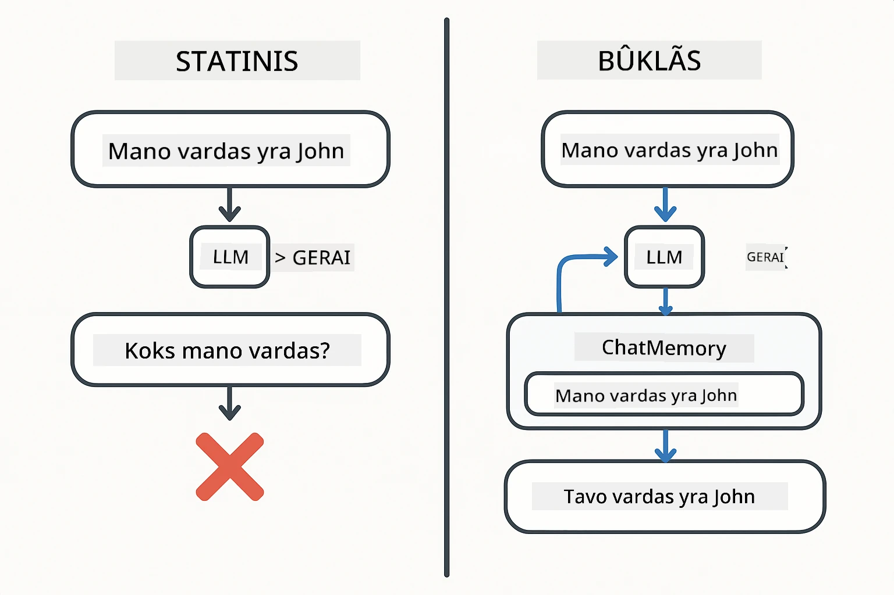
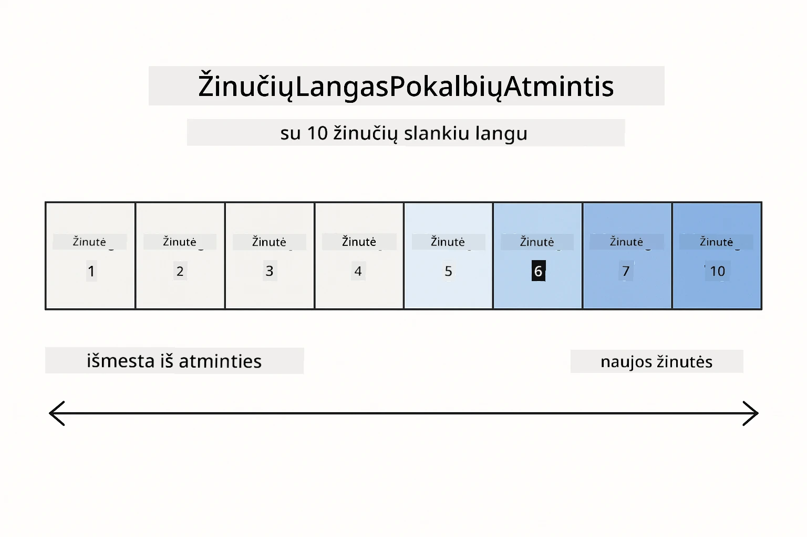
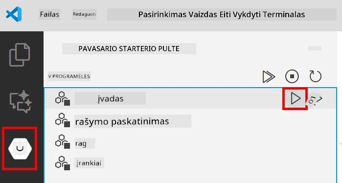
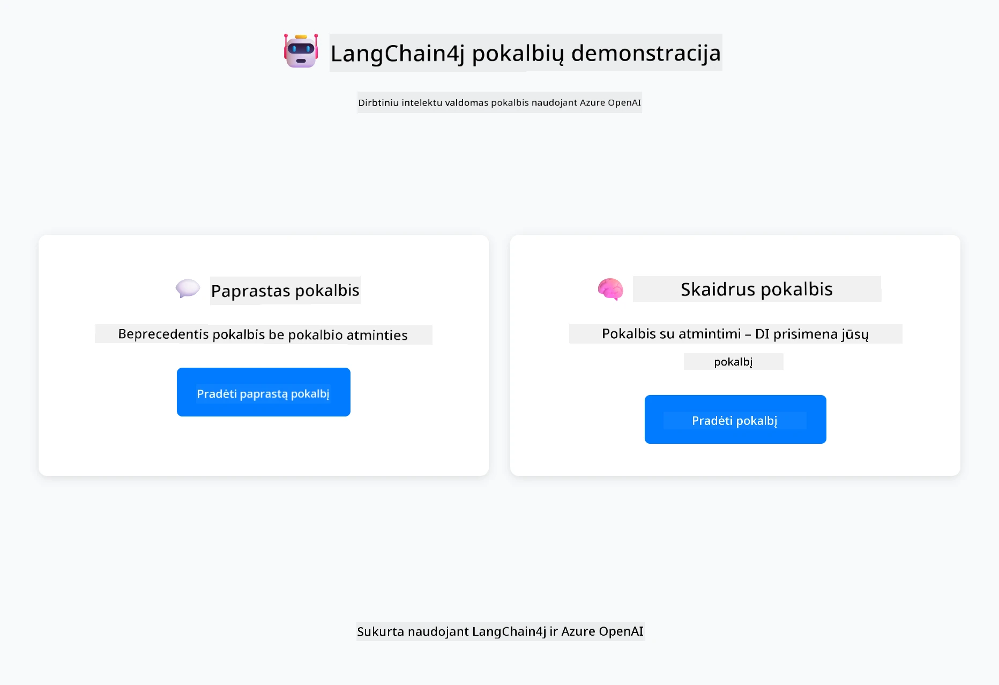
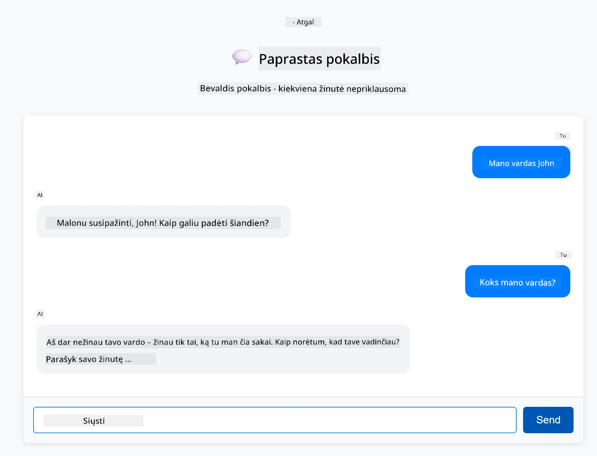
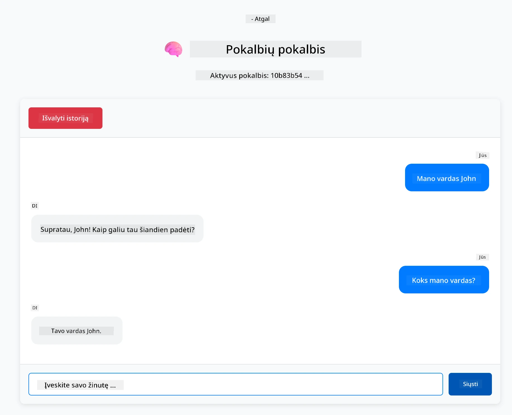

# Modulis 01: Pradžia su LangChain4j

## Turinys

- [Vaizdo įrašo apžvalga](#vaizdo-įrašo-apžvalga)
- [Ką išmoksite](#ką-išmoksite)
- [Reikalavimai](#reikalavimai)
- [Pagrindinės problemos supratimas](#pagrindinės-problemos-supratimas)
- [Tokenų supratimas](#tokenų-supratimas)
- [Kaip veikia atmintis](#kaip-veikia-atmintis)
- [Kaip tai naudoja LangChain4j](#kaip-tai-naudoja-langchain4j)
- [Azure OpenAI infrastruktūros diegimas](#azure-openai-infrastruktūros-diegimas)
- [Programos paleidimas lokaliai](#programos-paleidimas-lokaliai)
- [Programos naudojimas](#programos-naudojimas)
  - [Valstybės neįtvirtinta pokalbių sistema (kairysis skydelis)](#valstybės-neįtvirtinta-pokalbių-sistema-kairysis-skydelis)
  - [Valstybės įtvirtinta pokalbių sistema (dešinysis skydelis)](#valstybės-įtvirtinta-pokalbių-sistema-dešinysis-skydelis)
- [Kiti žingsniai](#kiti-žingsniai)

## Vaizdo įrašo apžvalga

Žiūrėkite tiesioginę sesiją, kurioje paaiškinama, kaip pradėti naudotis šiuo moduliu:

<a href="https://www.youtube.com/live/nl_troDm8rQ?si=6b85S8xGjWnT2fX9"></a>

## Ką išmoksite

Tai jūsų pradžios taškas su LangChain4j ir Azure OpenAI. Pradėsime nuo pagrindų ir pradėsime kurti gamybinio stiliaus programas. Šis modulis orientuotas į pokalbių AI, kuris prisimena kontekstą ir palaiko būseną – tai yra pagrindinės sąvokos, kurias vėlesni moduliai vysto.

Visos šios pamokos metu naudosime Azure OpenAI GPT-5.2, nes jo pažangios atpažinimo galimybės leidžia aiškiau matyti skirtingų modelių elgesio skirtumus. Įdiegus atmintį, aiškiai matysite skirtumą. Tai padeda geriau suprasti, ką kiekviena dalis prideda jūsų programai.

Jūs sukursite vieną programą, kuri demonstruoja abu modelius:

**Valstybės neįtvirtinta pokalbių sistema** – kiekvienas užklausimas yra nepriklausomas. Modelis neprisimena ankstesnių žinučių. Tai paprasčiausias pradžios taškas.

**Valstybės įtvirtinta pokalbių sistema** – kiekviena užklausa apima pokalbio istoriją. Modelis palaiko kontekstą keliuose etapuose. Tai reikalinga gamybinėms programoms.

## Reikalavimai

- Azure prenumerata su prieiga prie Azure OpenAI
- Java 21, Maven 3.9+
- Azure CLI (https://learn.microsoft.com/en-us/cli/azure/install-azure-cli)
- Azure Developer CLI (azd) (https://learn.microsoft.com/en-us/azure/developer/azure-developer-cli/install-azd)

> **Pastaba:** Java, Maven, Azure CLI ir Azure Developer CLI (azd) yra iš anksto įdiegti pateiktame devcontainer.

> **Pastaba:** Šis modulis naudoja GPT-5.2 Azure OpenAI. Diegimas konfigūruojamas automatiškai per `azd up` - nekeiskite modelio pavadinimo kode.

## Pagrindinės problemos supratimas

Kalbų modeliai yra be būsenos. Kiekvienas API kvietimas yra nepriklausomas. Jei paskelbsite "Mano vardas John" ir po to klausite "Koks mano vardas?", modelis nežino, kad ką tik prisistatėte. Jis laiko kiekvieną užklausą it tai būtų pirmas pokalbis.

Tai tinka paprastiems klausimams ir atsakymams, bet nėra naudinga realioms programoms. Klientų aptarnavimo robotai turi prisiminti, ką jiems pasakėte. Asmeniniai asistentai reikia konteksto. Bet kuris kelių etapų pokalbis reikalauja atminties.

Toliau pateikiamas diagrama vaizduoja abi prieigas – kairėje, valstybės neįtvirtintas kvietimas, kuris pamiršta jūsų vardą; dešinėje, valdoma pokalbių atmintimi ChatMemory, kuri jį prisimena.



*Skirtumas tarp valstybės neįtvirtintų (nepriklausomų kvietimų) ir valstybės įtvirtintų (su kontekstu) pokalbių*

## Tokenų supratimas

Prieš pradedant pokalbius svarbu suprasti tokenus – pagrindinius teksto vienetus, kuriuos apdoroja kalbų modeliai:


*Pavyzdys, kaip tekstas suskaidomas į tokenus – "Aš myliu AI!" tampa 4 atskiromis apdorojimo vienetais*

Tokenai yra tai, kaip AI modeliai matuoja ir apdoroja tekstą. Žodžiai, skyrybos ženklai ir net tarpai gali būti tokenais. Jūsų modelis turi ribą, kiek tokenų jis gali apdoroti iš karto (400 000 tokenų GPT-5.2, iš jų iki 272 000 įvesties tokenų ir 128 000 išvesties tokenų). Tokenų supratimas padeda valdyti pokalbio ilgį ir sąnaudas.

## Kaip veikia atmintis

Pokalbių atmintis išsprendžia valstybės neįtvirtinimo problemą palaikydama pokalbio istoriją. Prieš siųsdama jūsų užklausą modeliui, sistema įterpia atitinkamas ankstesnes žinutes. Kai klausiate "Koks mano vardas?", sistema išsiunčia visą pokalbio istoriją, leidžiančią modeliui matyti, kad anksčiau pasakėte "Mano vardas John."

LangChain4j teikia atminties įgyvendinimus, kurie tai automatiškai valdo. Jūs pasirenkate, kiek žinučių išlaikyti, o sistema rūpinasi konteksto lange. Toliau pateikta diagrama rodo, kaip MessageWindowChatMemory palaiko slankiojančio lango principą su neseniai naudotomis žinutėmis.



*MessageWindowChatMemory palaiko slankiojantį langą su naujausiomis žinutėmis, automatiškai išmetant senas*

## Kaip tai naudoja LangChain4j

Šis modulis integruoja Spring Boot ir prideda pokalbių atmintį. Štai kaip dalys dera tarpusavyje:

**Priklausomybės** – pridėkite dvi LangChain4j bibliotekas:

```xml
<dependency>
    <groupId>dev.langchain4j</groupId>
    <artifactId>langchain4j</artifactId> <!-- Inherited from BOM in root pom.xml -->
</dependency>
<dependency>
    <groupId>dev.langchain4j</groupId>
    <artifactId>langchain4j-open-ai-official</artifactId> <!-- Inherited from BOM in root pom.xml -->
</dependency>
```

**Pokalbių modelis** – konfigūruokite Azure OpenAI kaip Spring bean ([LangChainConfig.java](../../../01-introduction/src/main/java/com/example/langchain4j/config/LangChainConfig.java)):

```java
@Bean
public OpenAiOfficialChatModel openAiOfficialChatModel() {
    return OpenAiOfficialChatModel.builder()
            .baseUrl(azureEndpoint)
            .apiKey(azureApiKey)
            .modelName(deploymentName)
            .timeout(Duration.ofMinutes(5))
            .maxRetries(3)
            .build();
}
```

Konstruktorius nuskaito kredencialus iš aplinkos kintamųjų, nustatytų `azd up`. Nustatant `baseUrl` į jūsų Azure endpointą leidžiama OpenAI klientui dirbti su Azure OpenAI.

**Pokalbių atmintis** – sekite pokalbio istoriją su MessageWindowChatMemory ([ConversationService.java](../../../01-introduction/src/main/java/com/example/langchain4j/service/ConversationService.java)):

```java
ChatMemory memory = MessageWindowChatMemory.withMaxMessages(10);

memory.add(UserMessage.from("My name is John"));
memory.add(AiMessage.from("Nice to meet you, John!"));

memory.add(UserMessage.from("What's my name?"));
AiMessage aiMessage = chatModel.chat(memory.messages()).aiMessage();
memory.add(aiMessage);
```

Kurti atmintį su `withMaxMessages(10)`, kad išlaikytumėte paskutines 10 žinučių. Pridėti vartotojo ir AI žinutes su tipizuotais apvyniojimais: `UserMessage.from(text)` ir `AiMessage.from(text)`. Gauti istoriją su `memory.messages()` ir perduoti modeliui. Paslauga saugo atskiras atminties instancijas pagal pokalbio ID, leidžiant keliems vartotojams vienu metu bendrauti.

> **🤖 Išbandykite su [GitHub Copilot](https://github.com/features/copilot) pokalbiu:** Atidarykite [`ConversationService.java`](../../../01-introduction/src/main/java/com/example/langchain4j/service/ConversationService.java) ir paklauskite:
> - "Kaip MessageWindowChatMemory nusprendžia, kurias žinutes išmesti, kai langas pilnas?"
> - "Ar galiu įgyvendinti savo atminties saugojimo sprendimą naudojant duomenų bazę vietoje atminties?"
> - "Kaip pridėti santrauką, kad suspausčiau seną pokalbio istoriją?"

Valstybės neįtvirtinta pokalbių pabaigos taškas visiškai praleidžia atmintį – tiesiog `chatModel.chat(prompt)`, kaip pradžioje. Valstybės įtvirtinta pabaigos taškas įtraukią žinutes į atmintį, gauna istoriją ir kiekvienai užklausai prideda šį kontekstą. Tas pats modelio konfigūravimas, skirtingi modeliai.

## Azure OpenAI infrastruktūros diegimas

**Bash:**
```bash
cd 01-introduction
azd up  # Pasirinkite prenumeratą ir vietą (rekomenduojama eastus2)
```

**PowerShell:**
```powershell
cd 01-introduction
azd up  # Pasirinkite prenumeratą ir vietą (rekomenduojama eastus2)
```

> **Pastaba:** Jei susiduriate su laiko ribos klaida (`RequestConflict: Cannot modify resource ... provisioning state is not terminal`), tiesiog dar kartą paleiskite `azd up`. Azure ištekliai gali vis dar būti diegiami fone ir bandymas dar kartą leidžia diegimui baigtis, kai ištekliai pasiekia galutinę būseną.

Tai atliks:
1. Diegs Azure OpenAI resursą su GPT-5.2 ir text-embedding-3-small modeliais
2. Automatiškai sukurs `.env` failą projekto šaknyje su kredencialais
3. Konfigūruos visus reikalingus aplinkos kintamuosius

**Turite diegimo problemų?** Žr. [Infrastruktūros README](infra/README.md) puslapį, kuriame pateikiamos detalios trikčių šalinimo instrukcijos, įskaitant subdomeno pavadinimų konfliktus, rankinius Azure portalo diegimo žingsnius ir modelio konfigūracijos rekomendacijas.

**Patikrinkite, ar diegimas pavyko:**

**Bash:**
```bash
cat ../.env  # Turėtų rodyti AZURE_OPENAI_ENDPOINT, API_KEY ir kt.
```

**PowerShell:**
```powershell
Get-Content ..\.env  # Turėtų rodyti AZURE_OPENAI_ENDPOINT, API_KEY ir kt.
```

> **Pastaba:** Komanda `azd up` automatiškai sukuria `.env` failą. Jei vėliau reikės jį atnaujinti, galite redaguoti `.env` failą rankiniu būdu arba atkurti jį vėl paleisdami:
>
> **Bash:**
> ```bash
> cd ..
> bash .azd-env.sh
> ```
>
> **PowerShell:**
> ```powershell
> cd ..
> .\.azd-env.ps1
> ```

## Programos paleidimas lokaliai

**Patikrinkite diegimą:**

Įsitikinkite, kad `.env` failas su Azure kredencialais yra šakniniame kataloge. Paleiskite tai modulyje (`01-introduction/`):

**Bash:**
```bash
cat ../.env  # Turėtų rodyti AZURE_OPENAI_ENDPOINT, API_KEY, DEPLOYMENT
```

**PowerShell:**
```powershell
Get-Content ..\.env  # Turėtų rodyti AZURE_OPENAI_ENDPOINT, API_KEY, DEPLOYMENT
```

**Paleiskite programas:**

**1 variantas: Naudojant Spring Boot Dashboard (rekomenduojama VS Code vartotojams)**

Dev konteineryje yra Spring Boot Dashboard plėtinys, suteikiantis vizualų valdymo įrankį visoms Spring Boot programoms. Rasite jį veiklos juostoje (Activity Bar) kairėje VS Code pusėje (žr. Spring Boot piktogramą).

Naudodamiesi Spring Boot Dashboard galite:
- Matyti visas įdiegtas Spring Boot programas darbinėje erdvėje
- Vienu paspaudimu paleisti/stabdyti programas
- Stebėti programų žurnalus realiu laiku
- Žiūrėti programų būseną

Tiesiog spustelėkite paleidimo mygtuką šalia „introduction“, kad pradėtumėte šį modulį, arba paleiskite visus modulius vienu metu.



*Spring Boot Dashboard VS Code — paleiskite, sustabdykite ir stebėkite visus modulius vienoje vietoje*

**2 variantas: Naudojant komandos eilutės scenarijus**

Paleiskite visas žiniatinklio programas (modulius 01-04):

**Bash:**
```bash
cd ..  # Iš šaknų katalogo
./start-all.sh
```

**PowerShell:**
```powershell
cd ..  # Iš šakninio katalogo
.\start-all.ps1
```

Arba paleiskite tik šį modulį:

**Bash:**
```bash
cd 01-introduction
./start.sh
```

**PowerShell:**
```powershell
cd 01-introduction
.\start.ps1
```

Abu scenarijai automatiškai įkelia aplinkos kintamuosius iš šakninio `.env` failo ir, jei nebus, sukurs JAR failus.

> **Pastaba:** Jei norite rankiniu būdu iš anksto sukompiliuoti visus modulius:
>
> **Bash:**
> ```bash
> cd ..  # Go to root directory
> mvn clean package -DskipTests
> ```
>
> **PowerShell:**
> ```powershell
> cd ..  # Go to root directory
> mvn clean package -DskipTests
> ```

Atidarykite http://localhost:8080 naršyklėje.

**Norėdami sustabdyti:**

**Bash:**
```bash
./stop.sh  # Tik šis modulis
# Arba
cd .. && ./stop-all.sh  # Visi moduliai
```

**PowerShell:**
```powershell
.\stop.ps1  # Tik šis modulis
# Arba
cd ..; .\stop-all.ps1  # Visi moduliai
```

## Programos naudojimas

Programa suteikia žiniatinklio sąsają su dviem šoninės kitos pokalbių implementacijomis.



*Valdymo skydelis, rodantis paprastos pokalbių sistemos (valstybės neįtvirtintos) ir pokalbių sistemos su būsena (valstybės įtvirtintos) parinktis*

### Valstybės neįtvirtinta pokalbių sistema (kairysis skydelis)

Išbandykite pirmiausia šią. Paklauskite „Mano vardas John“ ir iškart tada klauskite „Koks mano vardas?“ Modelis neprisimins, nes kiekviena žinutė yra nepriklausoma. Tai parodo pagrindinę problemą su bazine kalbų modelių integracija – jokio pokalbio konteksto.



*Dirbtinis intelektas neprisimena jūsų vardo iš ankstesnės žinutės*

### Valstybės įtvirtinta pokalbių sistema (dešinysis skydelis)

Dabar pabandykite tą patį seką čia. Paklauskite „Mano vardas John“ ir tada „Koks mano vardas?“ Šį kartą sistema atsimena. Skirtumas yra MessageWindowChatMemory – ji palaiko pokalbio istoriją ir kiekvienai užklausai prideda tą kontekstą. Tokiu būdu veikia gamybinis pokalbių AI.



*Dirbtinis intelektas prisimena jūsų vardą iš ankstesnių pokalbio etapų*

Abi sąsajos naudoja tą patį GPT-5.2 modelį. Vienintelis skirtumas yra atmintis. Tai aiškiai parodo, ką atmintis suteikia jūsų programai ir kodėl ji yra būtina tikram naudojimui.

## Kiti žingsniai

**Kitas modulis:** [02-prompt-engineering - Prompt Engineering su GPT-5.2](../02-prompt-engineering/README.md)

---

**Navigacija:** [← Grįžti prie pagrindinio](../README.md) | [Toliau: Modulis 02 - Prompt Engineering →](../02-prompt-engineering/README.md)

---

<!-- CO-OP TRANSLATOR DISCLAIMER START -->
**Atsakomybės apribojimas**:
Šis dokumentas buvo išverstas naudojant dirbtinio intelekto vertimo paslaugą [Co-op Translator](https://github.com/Azure/co-op-translator). Nors siekiame tikslumo, prašome atkreipti dėmesį, kad automatiniai vertimai gali turėti klaidų ar netikslumų. Originalus dokumentas jo gimtąja kalba laikomas autoritetingu šaltiniu. Svarbiai informacijai rekomenduojama naudoti profesionalų žmogiškąjį vertimą. Mes neatsakome už jokius nesusipratimus ar neteisingą interpretaciją, kilusią naudojantis šiuo vertimu.
<!-- CO-OP TRANSLATOR DISCLAIMER END -->