# Modulis 02: Promptų inžinerija su GPT-5

## Turinys

- [Ko išmoksite](../../../02-prompt-engineering)
- [Reikalavimai](../../../02-prompt-engineering)
- [Promptų inžinerijos supratimas](../../../02-prompt-engineering)
- [Kaip tai naudoja LangChain4j](../../../02-prompt-engineering)
- [Pagrindiniai modeliai](../../../02-prompt-engineering)
- [Esamų Azure išteklių naudojimas](../../../02-prompt-engineering)
- [Programos ekrano nuotraukos](../../../02-prompt-engineering)
- [Modelių tyrinėjimas](../../../02-prompt-engineering)
  - [Mažas prieš didelį entuziazmą](../../../02-prompt-engineering)
  - [Užduočių vykdymas (įrankių įvadas)](../../../02-prompt-engineering)
  - [Savireflektuojantis kodas](../../../02-prompt-engineering)
  - [Struktūruota analizė](../../../02-prompt-engineering)
  - [Daugiapakopis pokalbis](../../../02-prompt-engineering)
  - [Žingsnis po žingsnio samprotavimas](../../../02-prompt-engineering)
  - [Apribotas išvestis](../../../02-prompt-engineering)
- [Ką iš tikrųjų išmokstate](../../../02-prompt-engineering)
- [Kiti žingsniai](../../../02-prompt-engineering)

## Ko išmoksite

Ankstesniame modulyje matėte, kaip atmintis leidžia pokalbių AI ir naudojote GitHub modelius pagrindiniams sąveikoms. Dabar sutelksime dėmesį į tai, kaip užduodate klausimus – pačius promptus – naudodami Azure OpenAI GPT-5. Kaip struktūruojate savo promptus, labai stipriai veikia gaunamų atsakymų kokybę.

Naudosime GPT-5, nes jis įveda samprotavimo kontrolę – galite nurodyti modeliui, kiek mąstymo atlikti prieš atsakant. Tai daro skirtingas promptų strategijas aiškesnes ir padeda suprasti, kada naudoti kurią metodiką. Taip pat pasinaudosime Azure mažesniais GPT-5 greičio apribojimais, palyginti su GitHub modeliais.

## Reikalavimai

- Baigtas Modulis 01 (įdiegti Azure OpenAI ištekliai)
- `.env` failas šakniniame kataloge su Azure kredencialais (sukurtas `azd up` Modulyje 01)

> **Pastaba:** Jei dar nebaigėte Modulio 01, pirmiausia sekite ten pateiktas diegimo instrukcijas.

## Promptų inžinerijos supratimas

Promptų inžinerija – tai įvesties teksto kūrimas, kuris nuosekliai suteikia jums reikalingus rezultatus. Tai ne tik klausimų uždavimas – tai užklausų struktūrizavimas taip, kad modelis tiksliai suprastų, ko norite ir kaip tai pateikti.

Įsivaizduokite, kad duodate nurodymus kolegai. „Pataisyk klaidą“ yra neaišku. „Pataisyk null pointer exception UserService.java 45 eilutėje pridėdamas null patikrinimą“ yra konkretu. Kalbos modeliai veikia taip pat – svarbi konkretumas ir struktūra.

## Kaip tai naudoja LangChain4j

Šis modulis demonstruoja pažangius promptų modelius, naudodamas tą pačią LangChain4j pagrindą iš ankstesnių modulių, daugiausia dėmesio skiriant promptų struktūrai ir samprotavimo kontrolei.

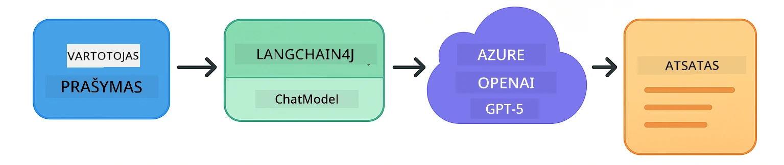

*Kaip LangChain4j jungia jūsų promptus su Azure OpenAI GPT-5*

**Priklausomybės** – Modulis 02 naudoja šias langchain4j priklausomybes, apibrėžtas `pom.xml`:
```xml
<dependency>
    <groupId>dev.langchain4j</groupId>
    <artifactId>langchain4j</artifactId> <!-- Inherited from BOM in root pom.xml -->
</dependency>
<dependency>
    <groupId>dev.langchain4j</groupId>
    <artifactId>langchain4j-open-ai-official</artifactId> <!-- Inherited from BOM in root pom.xml -->
</dependency>
```

**OpenAiOfficialChatModel konfigūracija** – [LangChainConfig.java](../../../02-prompt-engineering/src/main/java/com/example/langchain4j/prompts/config/LangChainConfig.java)

Pokalbių modelis rankiniu būdu konfigūruojamas kaip Spring bean, naudojant OpenAI Official klientą, kuris palaiko Azure OpenAI galinius taškus. Pagrindinis skirtumas nuo Modulio 01 yra tai, kaip struktūruojame promptus, siunčiamus į `chatModel.chat()`, o ne pats modelio nustatymas.

**Sistemos ir vartotojo žinutės** – [Gpt5PromptService.java](../../../02-prompt-engineering/src/main/java/com/example/langchain4j/prompts/service/Gpt5PromptService.java)

LangChain4j atskiria žinučių tipus aiškumui. `SystemMessage` nustato AI elgesį ir kontekstą (pvz., „Jūs esate kodo peržiūros specialistas“), o `UserMessage` talpina faktinį užklausimą. Šis atskyrimas leidžia išlaikyti nuoseklų AI elgesį skirtingų vartotojų užklausose.

```java
SystemMessage systemMsg = SystemMessage.from(
    "You are a helpful Java programming expert."
);

UserMessage userMsg = UserMessage.from(
    "Explain what a List is in Java"
);

String response = chatModel.chat(systemMsg, userMsg);
```

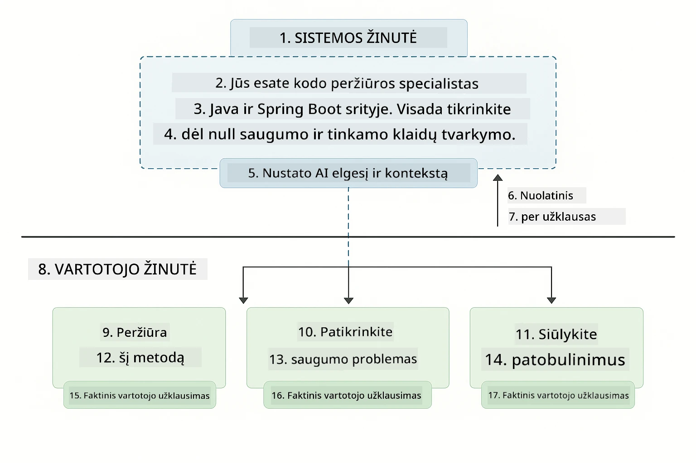

*SystemMessage suteikia nuolatinį kontekstą, o UserMessages talpina atskiras užklausas*

**MessageWindowChatMemory daugiapakopiui pokalbiui** – Daugiapakopio pokalbio modeliui naudojame `MessageWindowChatMemory` iš Modulio 01. Kiekviena sesija turi savo atminties egzempliorių, saugomą `Map<String, ChatMemory>`, leidžiantį vykdyti kelis pokalbius vienu metu nesimaišant kontekstams.

**Promptų šablonai** – Tikrasis dėmesys čia skiriamas promptų inžinerijai, o ne naujoms LangChain4j API. Kiekvienas modelis (mažas entuziazmas, didelis entuziazmas, užduočių vykdymas ir kt.) naudoja tą patį `chatModel.chat(prompt)` metodą, bet su kruopščiai struktūruotais promptų tekstais. XML žymos, instrukcijos ir formatavimas yra prompto teksto dalis, o ne LangChain4j funkcijos.

**Samprotavimo kontrolė** – GPT-5 samprotavimo pastangos valdomos per promptų instrukcijas, tokias kaip „maksimaliai 2 samprotavimo žingsniai“ arba „išsamiai ištirti“. Tai promptų inžinerijos technikos, o ne LangChain4j konfigūracijos. Biblioteka tiesiog perduoda jūsų promptus modeliui.

Pagrindinė išvada: LangChain4j suteikia infrastruktūrą (modelio ryšį per [LangChainConfig.java](../../../02-prompt-engineering/src/main/java/com/example/langchain4j/prompts/config/LangChainConfig.java), atmintį, žinučių valdymą per [Gpt5PromptService.java](../../../02-prompt-engineering/src/main/java/com/example/langchain4j/prompts/service/Gpt5PromptService.java)), o šis modulis moko, kaip kurti efektyvius promptus šioje infrastruktūroje.

## Pagrindiniai modeliai

Ne visiems uždaviniams tinka tas pats požiūris. Kai kurie klausimai reikalauja greitų atsakymų, kiti – gilaus mąstymo. Kai kuriems reikia matomo samprotavimo, kitiems – tik rezultatų. Šis modulis apima aštuonis promptų modelius – kiekvienas optimizuotas skirtingoms situacijoms. Eksperimentuosite su visais, kad suprastumėte, kada kuris požiūris geriausias.

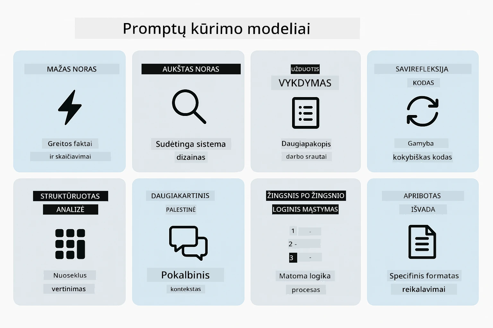

*Aštuonių promptų inžinerijos modelių apžvalga ir jų panaudojimo atvejai*


*Mažas entuziazmas (greitas, tiesioginis) prieš didelį entuziazmą (išsamus, tyrinėjamasis) samprotavimo metodai*

**Mažas entuziazmas (greitas ir koncentruotas)** – Paprastiems klausimams, kai norite greito, tiesioginio atsakymo. Modelis atlieka minimalų samprotavimą – maksimaliai 2 žingsnius. Naudokite skaičiavimams, paieškoms ar paprastiems klausimams.

```java
String prompt = """
    <reasoning_effort>low</reasoning_effort>
    <instruction>maximum 2 reasoning steps</instruction>
    
    What is 15% of 200?
    """;

String response = chatModel.chat(prompt);
```

> 💡 **Išbandykite su GitHub Copilot:** Atidarykite [`Gpt5PromptService.java`](../../../02-prompt-engineering/src/main/java/com/example/langchain4j/prompts/service/Gpt5PromptService.java) ir paklauskite:
> - „Kuo skiriasi mažo ir didelio entuziazmo promptų modeliai?“
> - „Kaip XML žymos promptuose padeda struktūruoti AI atsakymą?“
> - „Kada naudoti savireflektavimo modelius, o kada tiesiogines instrukcijas?“

**Didelis entuziazmas (gilus ir išsamus)** – Sudėtingoms problemoms, kai norite išsamios analizės. Modelis kruopščiai tiria ir pateikia detalius samprotavimus. Naudokite sistemų dizainui, architektūros sprendimams ar sudėtingiems tyrimams.

```java
String prompt = """
    <reasoning_effort>high</reasoning_effort>
    <instruction>explore thoroughly, show detailed reasoning</instruction>
    
    Design a caching strategy for a high-traffic REST API.
    """;

String response = chatModel.chat(prompt);
```

**Užduočių vykdymas (žingsnis po žingsnio progresas)** – Daugiažingsniams darbo eigoms. Modelis pateikia išankstinį planą, pasakoja apie kiekvieną žingsnį vykdydamas, tada pateikia santrauką. Naudokite migracijoms, įgyvendinimams ar bet kokiems daugiažingsniams procesams.

```java
String prompt = """
    <task>Create a REST endpoint for user registration</task>
    <preamble>Provide an upfront plan</preamble>
    <narration>Narrate each step as you work</narration>
    <summary>Summarize what was accomplished</summary>
    """;

String response = chatModel.chat(prompt);
```

Chain-of-Thought promptas aiškiai prašo modelio parodyti savo samprotavimo procesą, gerinant tikslumą sudėtingoms užduotims. Žingsnis po žingsnio išskaidymas padeda tiek žmonėms, tiek AI suprasti logiką.

> **🤖 Išbandykite su [GitHub Copilot](https://github.com/features/copilot) pokalbiu:** Paklauskite apie šį modelį:
> - „Kaip pritaikyti užduočių vykdymo modelį ilgai trunkančioms operacijoms?“
> - „Kokios yra geriausios praktikos struktūruojant įrankių įvadus gamybinėse programose?“
> - „Kaip fiksuoti ir rodyti tarpinio progreso atnaujinimus vartotojo sąsajoje?“

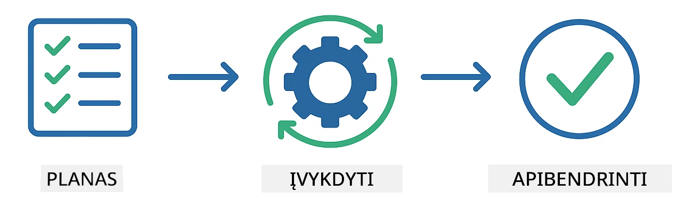

*Planavimas → Vykdymas → Santrauka daugiažingsnėms užduotims*

**Savireflektuojantis kodas** – Produkcijos kokybės kodo generavimui. Modelis generuoja kodą, tikrina jį pagal kokybės kriterijus ir iteratyviai tobulina. Naudokite kuriant naujas funkcijas ar paslaugas.

```java
String prompt = """
    <task>Create an email validation service</task>
    <quality_criteria>
    - Correct logic and error handling
    - Best practices (clean code, proper naming)
    - Performance optimization
    - Security considerations
    </quality_criteria>
    <instruction>Generate code, evaluate against criteria, improve iteratively</instruction>
    """;

String response = chatModel.chat(prompt);
```

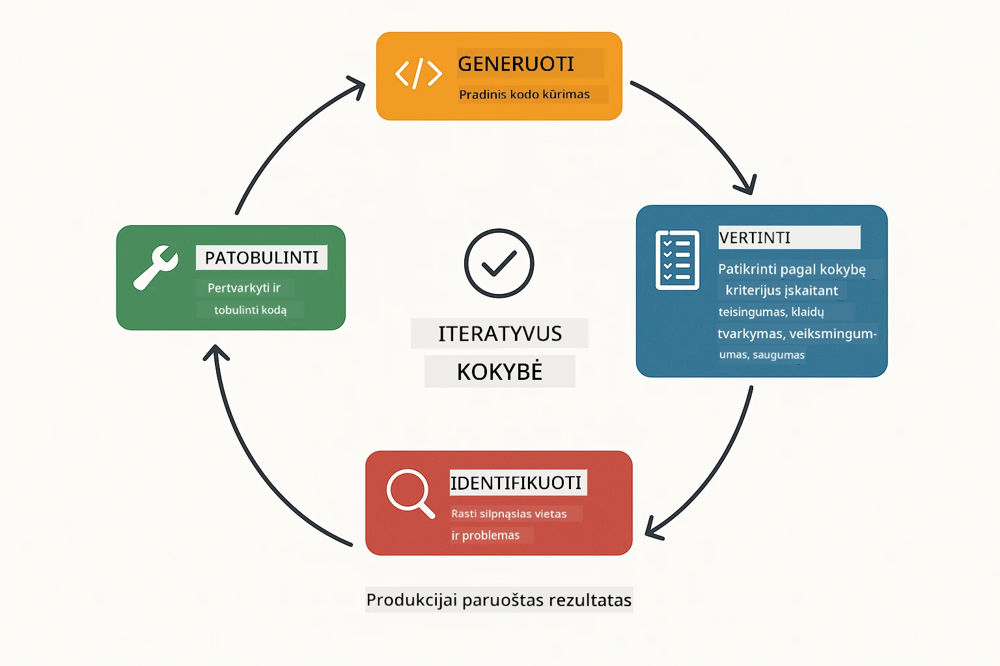

*Iteratyvus tobulinimo ciklas – generuoti, vertinti, identifikuoti problemas, tobulinti, kartoti*

**Struktūruota analizė** – Nuosekliam vertinimui. Modelis peržiūri kodą naudodamas fiksuotą sistemą (teisingumas, praktikos, našumas, saugumas). Naudokite kodo peržiūroms ar kokybės vertinimams.

```java
String prompt = """
    <code>
    public List getUsers() {
        return database.query("SELECT * FROM users");
    }
    </code>
    
    <framework>
    Evaluate using these categories:
    1. Correctness - Logic and functionality
    2. Best Practices - Code quality
    3. Performance - Efficiency concerns
    4. Security - Vulnerabilities
    </framework>
    """;

String response = chatModel.chat(prompt);
```

> **🤖 Išbandykite su [GitHub Copilot](https://github.com/features/copilot) pokalbiu:** Paklauskite apie struktūruotą analizę:
> - „Kaip pritaikyti analizės sistemą skirtingų tipų kodo peržiūroms?“
> - „Koks geriausias būdas programiškai apdoroti ir veikti pagal struktūruotą išvestį?“
> - „Kaip užtikrinti nuoseklius rimtumo lygius skirtingose peržiūrų sesijose?“

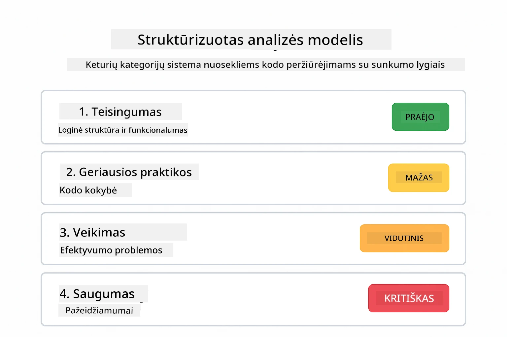

*Keturių kategorijų sistema nuoseklioms kodo peržiūroms su rimtumo lygiais*

**Daugiapakopis pokalbis** – Pokalbiams, kuriems reikalingas kontekstas. Modelis prisimena ankstesnes žinutes ir jas naudoja. Naudokite interaktyvioms pagalbos sesijoms ar sudėtingiems klausimams ir atsakymams.

```java
ChatMemory memory = MessageWindowChatMemory.withMaxMessages(10);

memory.add(UserMessage.from("What is Spring Boot?"));
AiMessage aiMessage1 = chatModel.chat(memory.messages()).aiMessage();
memory.add(aiMessage1);

memory.add(UserMessage.from("Show me an example"));
AiMessage aiMessage2 = chatModel.chat(memory.messages()).aiMessage();
memory.add(aiMessage2);
```

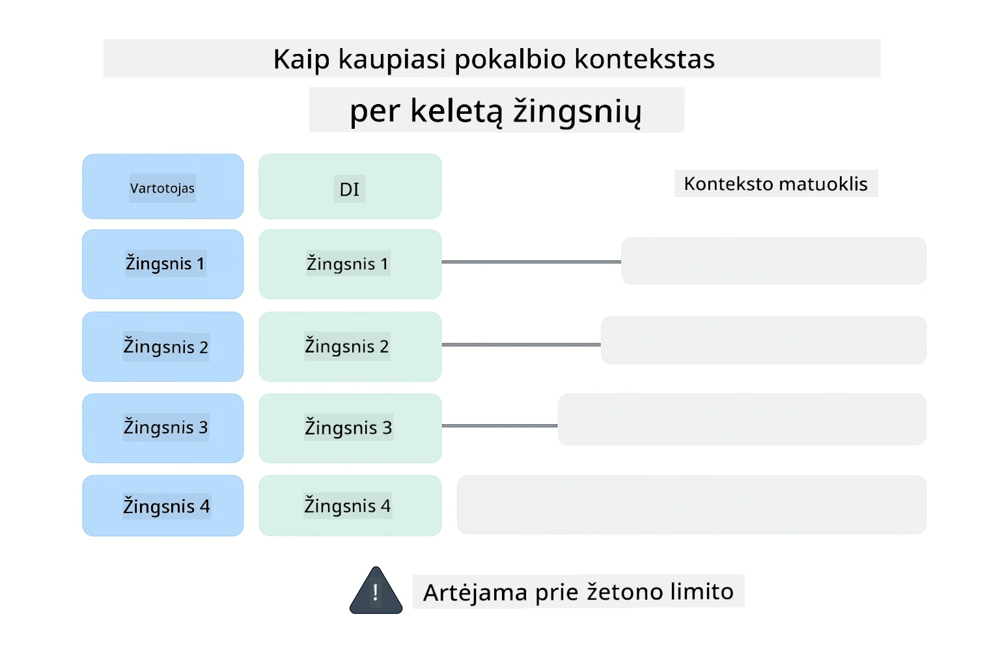

*Kaip pokalbio kontekstas kaupiasi per kelis žingsnius iki tokenų limito*

**Žingsnis po žingsnio samprotavimas** – Problemoms, kurioms reikalinga matoma logika. Modelis aiškiai rodo samprotavimą kiekvienam žingsniui. Naudokite matematikos uždaviniams, logikos galvosūkiams ar kai reikia suprasti mąstymo procesą.

```java
String prompt = """
    <instruction>Show your reasoning step-by-step</instruction>
    
    If a train travels 120 km in 2 hours, then stops for 30 minutes,
    then travels another 90 km in 1.5 hours, what is the average speed
    for the entire journey including the stop?
    """;

String response = chatModel.chat(prompt);
```

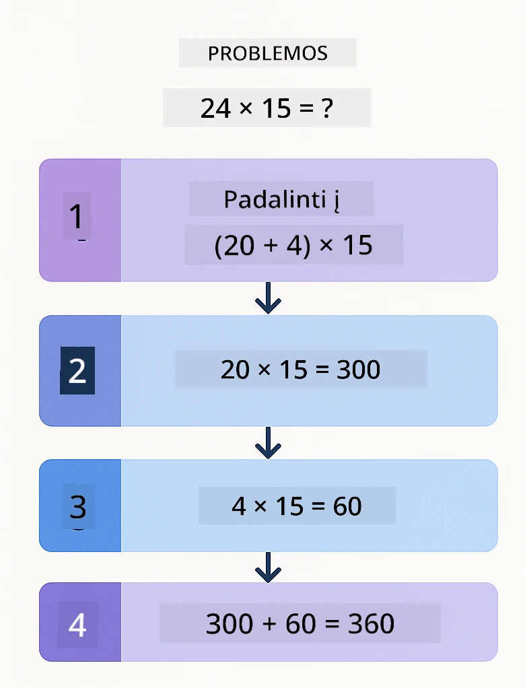

*Problemų išskaidymas į aiškius loginius žingsnius*

**Apribotas išvestis** – Atsakymams su specifiniais formato reikalavimais. Modelis griežtai laikosi formato ir ilgio taisyklių. Naudokite santraukoms ar kai reikia tikslios išvesties struktūros.

```java
String prompt = """
    <constraints>
    - Exactly 100 words
    - Bullet point format
    - Technical terms only
    </constraints>
    
    Summarize the key concepts of machine learning.
    """;

String response = chatModel.chat(prompt);
```

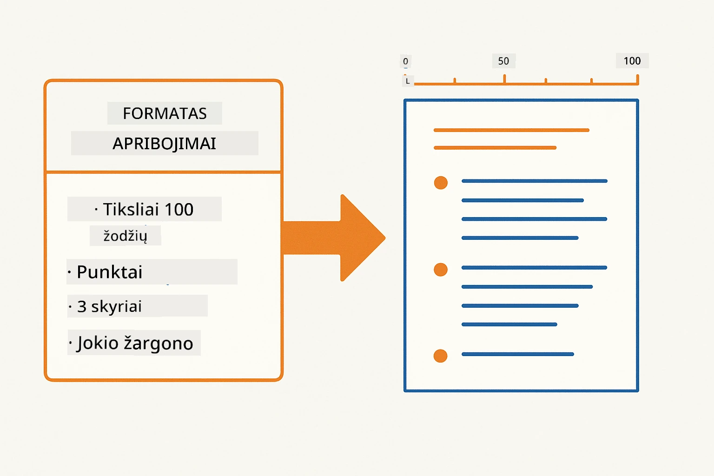

*Specifinių formato, ilgio ir struktūros reikalavimų užtikrinimas*

## Esamų Azure išteklių naudojimas

**Patikrinkite diegimą:**

Įsitikinkite, kad `.env` failas yra šakniniame kataloge su Azure kredencialais (sukurtas Modulyje 01):
```bash
cat ../.env  # Turėtų rodyti AZURE_OPENAI_ENDPOINT, API_KEY, DEPLOYMENT
```

**Paleiskite programą:**

> **Pastaba:** Jei jau paleidote visas programas naudodami `./start-all.sh` Modulyje 01, šis modulis jau veikia 8083 prievade. Galite praleisti žemiau pateiktas paleidimo komandas ir tiesiogiai eiti į http://localhost:8083.

**1 variantas: Naudojant Spring Boot Dashboard (rekomenduojama VS Code naudotojams)**

Dev konteineryje yra Spring Boot Dashboard plėtinys, kuris suteikia vizualią sąsają valdyti visas Spring Boot programas. Jį rasite kairėje VS Code veiklos juostoje (ieškokite Spring Boot ikonos).

Iš Spring Boot Dashboard galite:
- Matyti visas darbo erdvėje esančias Spring Boot programas
- Vienu paspaudimu paleisti/stabdyti programas
- Realioje laiko sekti programų žurnalus
- Stebėti programų būseną

Tiesiog spustelėkite paleidimo mygtuką šalia „prompt-engineering“, kad paleistumėte šį modulį, arba paleiskite visus modulius vienu metu.

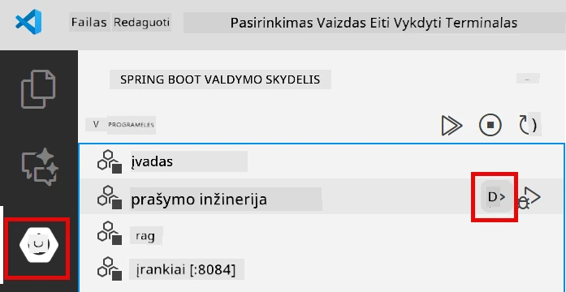

**2 variantas: Naudojant shell skriptus**

Paleiskite visas žiniatinklio programas (modulius 01-04):

**Bash:**
```bash
cd ..  # Iš šakninių katalogų
./start-all.sh
```

**PowerShell:**
```powershell
cd ..  # Iš šakninių katalogų
.\start-all.ps1
```

Arba paleiskite tik šį modulį:

**Bash:**
```bash
cd 02-prompt-engineering
./start.sh
```

**PowerShell:**
```powershell
cd 02-prompt-engineering
.\start.ps1
```

Abu skriptai automatiškai įkelia aplinkos kintamuosius iš šakniniame kataloge esančio `.env` failo ir sukurs JAR failus, jei jų nėra.

> **Pastaba:** Jei norite rankiniu būdu sukompiliuoti visus modulius prieš paleidimą:
>
> **Bash:**
> ```bash
> cd ..  # Go to root directory
> mvn clean package -DskipTests
> ```
>
> **PowerShell:**
> ```powershell
> cd ..  # Go to root directory
> mvn clean package -DskipTests
> ```

Atidarykite http://localhost:8083 savo naršyklėje.

**Norėdami sustabdyti:**

**Bash:**
```bash
./stop.sh  # Tik šis modulis
# Arba
cd .. && ./stop-all.sh  # Visi moduliai
```

**PowerShell:**
```powershell
.\stop.ps1  # Tik šis modulis
# Arba
cd ..; .\stop-all.ps1  # Visi moduliai
```

## Programos ekrano nuotraukos

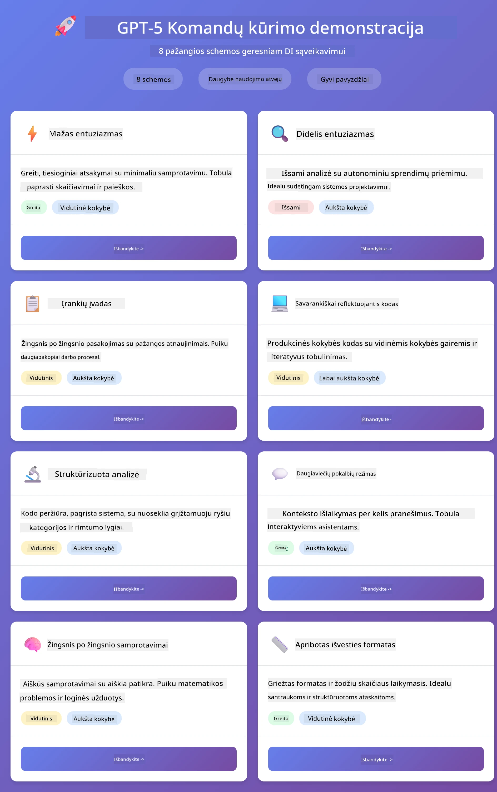

*Pagrindinis valdymo skydelis, rodantis visus 8 promptų inžinerijos modelius su jų charakteristikomis ir panaudojimo atvejais*

## Modelių tyrinėjimas

Žiniatinklio sąsaja leidžia eksperimentuoti su skirtingomis promptų strategijomis. Kiekvienas modelis sprendžia skirtingas problemas – išbandykite juos, kad pamatytumėte, kada kuris požiūris geriausiai veikia.

### Mažas prieš didelį entuziazmą

Užduokite paprastą klausimą, pavyzdžiui, „Kiek yra 15 % iš 200?“ naudodami Mažą entuziazmą. Gaunate greitą, tiesioginį atsakymą. Dabar užduokite sudėtingą klausimą, pavyzdžiui, „Sukurkite talpyklos strategiją didelio srauto API“ naudodami Didelį entuziazmą. Stebėkite, kaip modelis sulėtėja ir pateikia detalius samprotavimus. Tas pats modelis, ta pati klausimo struktūra – bet promptas nurodo, kiek mąstyti.

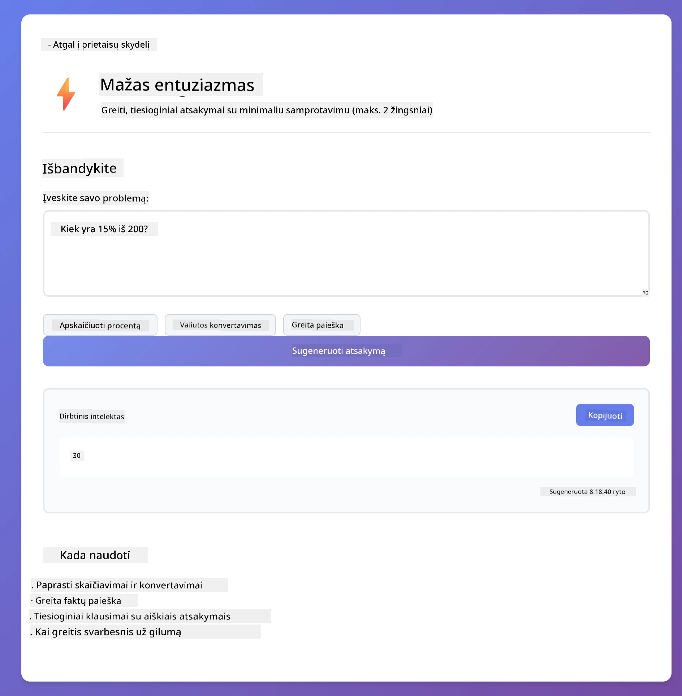
*Greitas skaičiavimas su minimaliu samprotavimu*

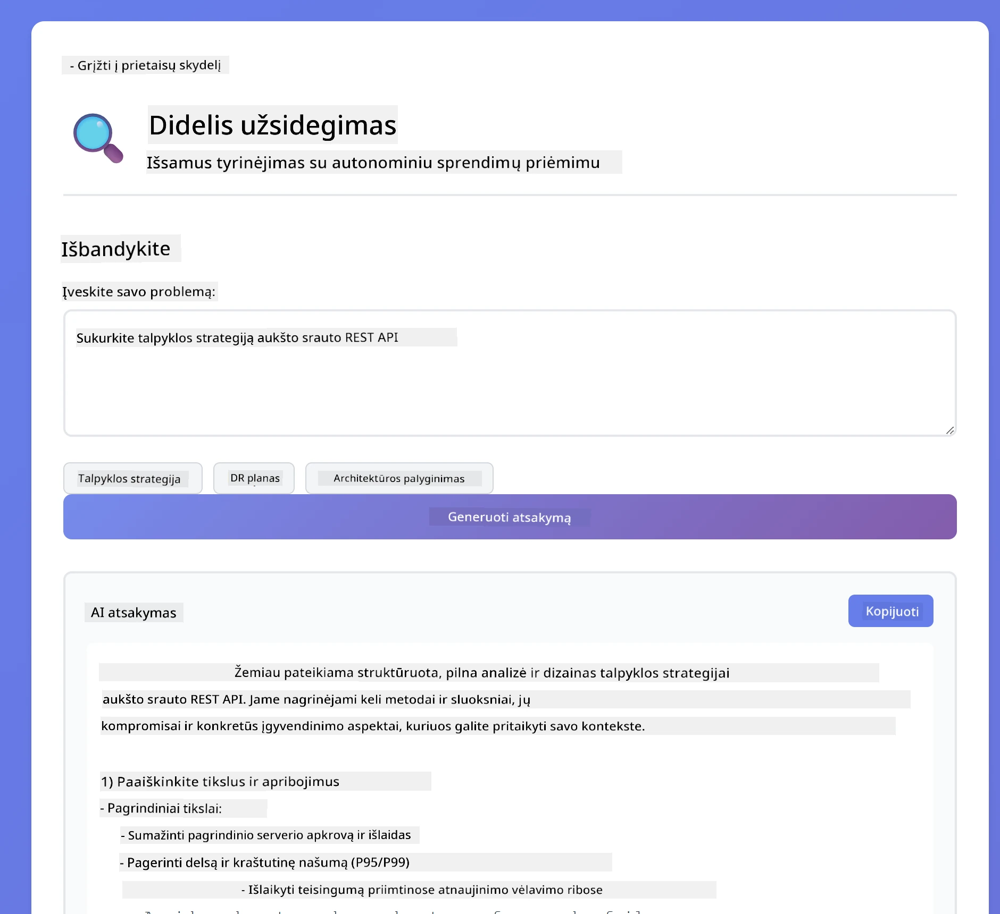

*Išsami talpyklos strategija (2.8MB)*

### Užduoties vykdymas (Įrankių įvadas)

Daugiapakopiai darbo procesai naudingiausi, kai iš anksto suplanuojami ir aprašomi žingsniai. Modelis aprašo, ką darys, pasakoja apie kiekvieną žingsnį, tada apibendrina rezultatus.

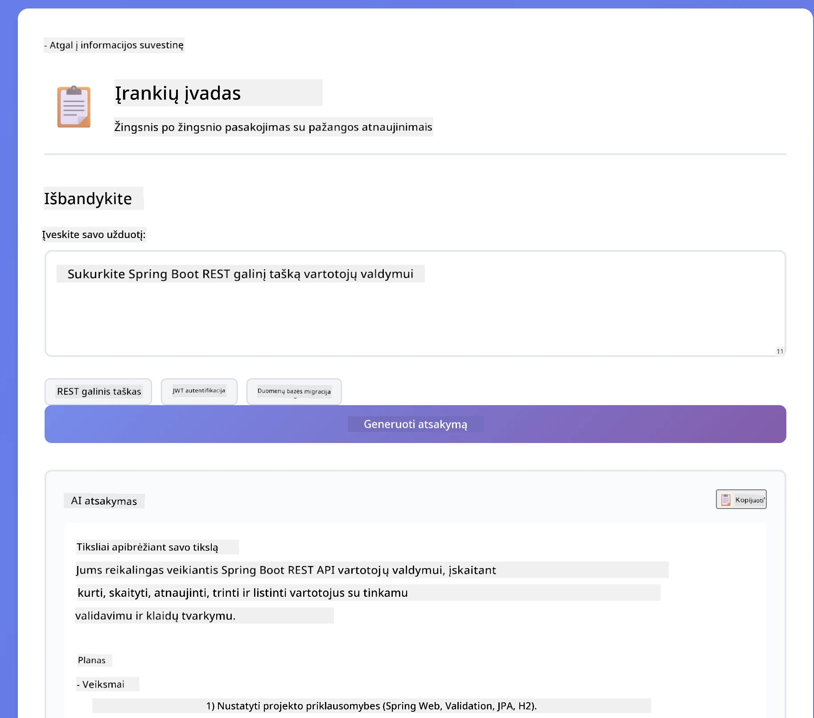

*REST galinio taško kūrimas su žingsnis po žingsnio pasakojimu (3.9MB)*

### Savianalizuojantis kodas

Išbandykite „Sukurti el. pašto patvirtinimo paslaugą“. Vietoj to, kad tik sugeneruotų kodą ir sustotų, modelis generuoja, vertina pagal kokybės kriterijus, nustato trūkumus ir tobulina. Matysite, kaip jis kartoja, kol kodas atitiks gamybos standartus.

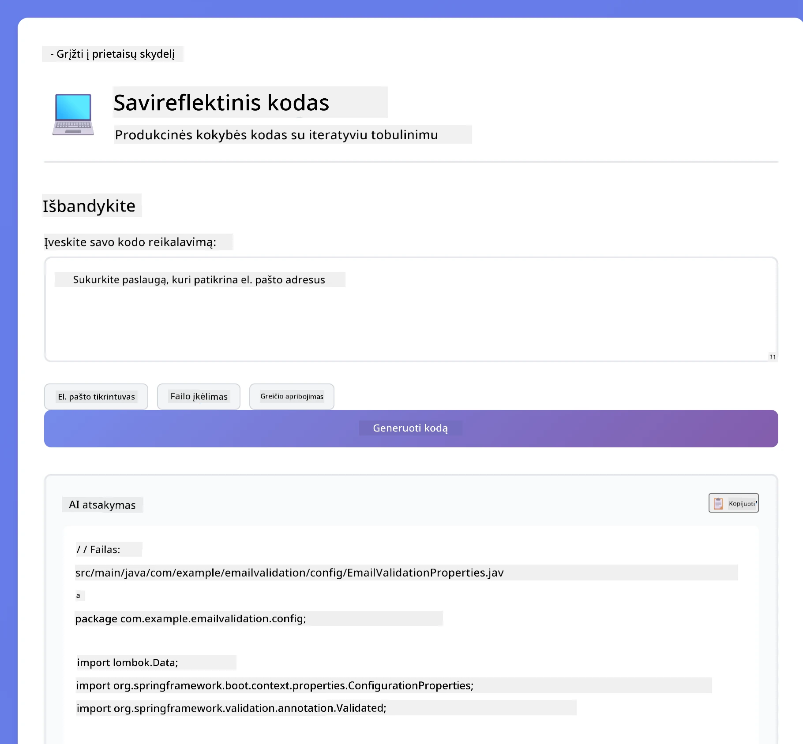

*Pilna el. pašto patvirtinimo paslauga (5.2MB)*

### Struktūruota analizė

Kodo peržiūroms reikalingi nuoseklūs vertinimo pagrindai. Modelis analizuoja kodą naudodamas fiksuotas kategorijas (teisingumas, praktikos, našumas, saugumas) su rimtumo lygiais.

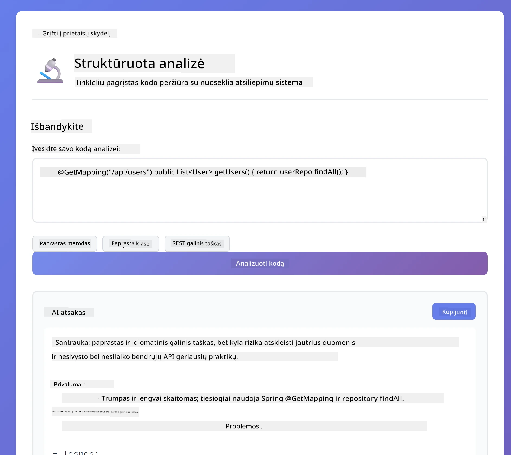

*Kodo peržiūra pagal sistemą*

### Daugiapakopis pokalbis

Paklauskite „Kas yra Spring Boot?“ ir iškart po to „Parodyk pavyzdį“. Modelis prisimena pirmą klausimą ir pateikia būtent Spring Boot pavyzdį. Be atminties antras klausimas būtų per daug neaiškus.

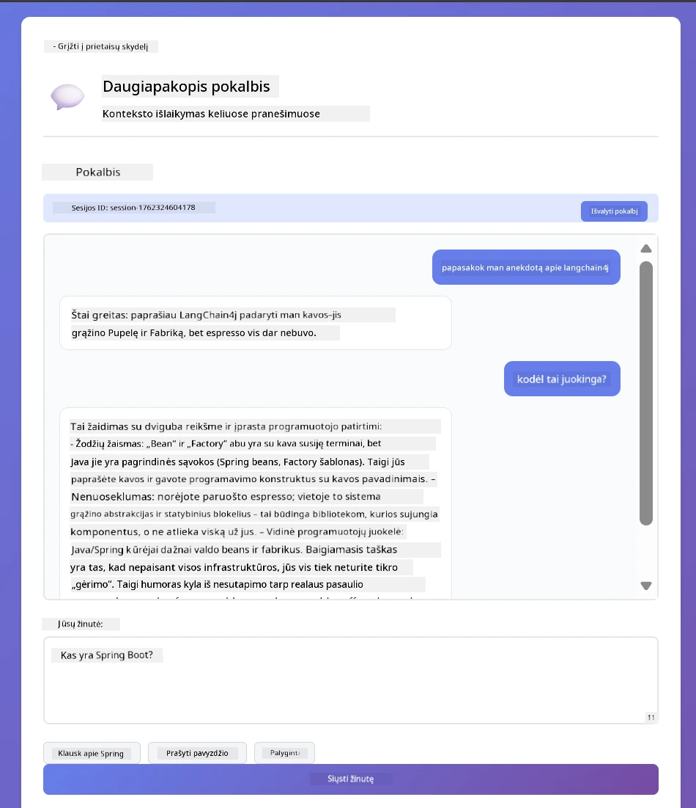

*Konteksto išlaikymas tarp klausimų*

### Žingsnis po žingsnio samprotavimas

Pasirinkite matematikos uždavinį ir išbandykite tiek Žingsnis po žingsnio samprotavimą, tiek Mažą entuziazmą. Mažas entuziazmas tiesiog pateikia atsakymą – greitai, bet neaiškiai. Žingsnis po žingsnio parodo kiekvieną skaičiavimą ir sprendimą.

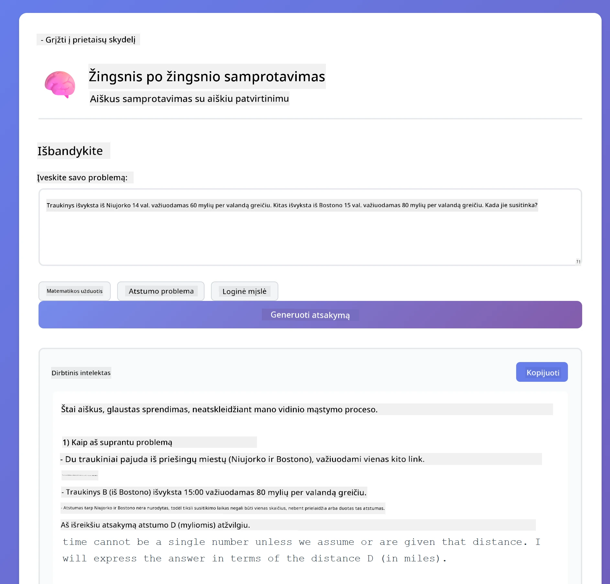

*Matematikos uždavinys su aiškiais žingsniais*

### Apribotas išvestis

Kai reikia specifinių formatų ar žodžių skaičiaus, šis modelis užtikrina griežtą laikymąsi. Išbandykite sugeneruoti santrauką, kurioje būtų tiksliai 100 žodžių ir punktų formatu.

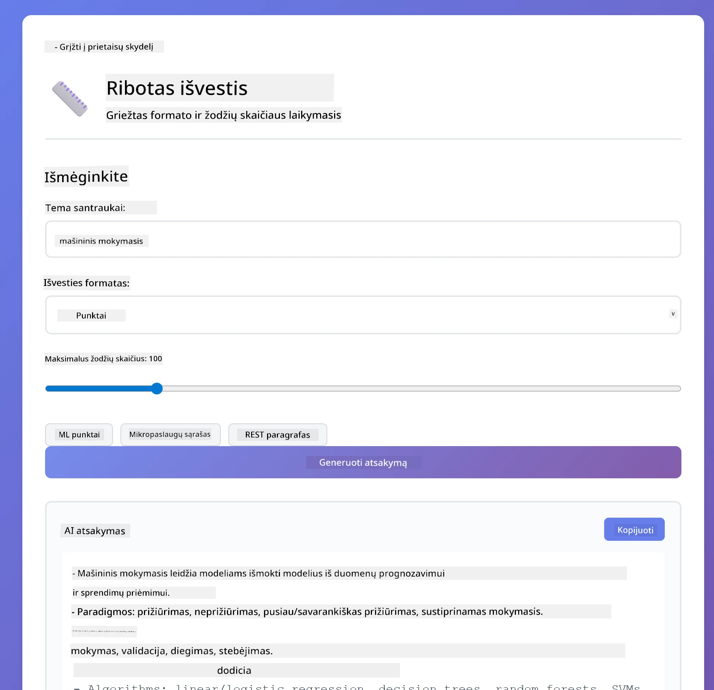

*Mašininio mokymosi santrauka su formato kontrole*

## Ką iš tikrųjų mokotės

**Samprotavimo pastangos keičia viską**

GPT-5 leidžia valdyti skaičiavimo pastangas per jūsų užklausas. Mažos pastangos reiškia greitus atsakymus su minimaliu tyrimu. Didelės pastangos reiškia, kad modelis skiria laiko giliau apmąstyti. Jūs mokotės pritaikyti pastangas užduoties sudėtingumui – nešvaistykite laiko paprastiems klausimams, bet ir neskubėkite sudėtingų sprendimų.

**Struktūra nurodo elgesį**

Pastebėjote XML žymes užklausose? Jos nėra dekoratyvios. Modeliai patikimiau laikosi struktūruotų nurodymų nei laisvo teksto. Kai reikia daugiapakopių procesų ar sudėtingos logikos, struktūra padeda modeliui sekti, kur jis yra ir kas toliau.

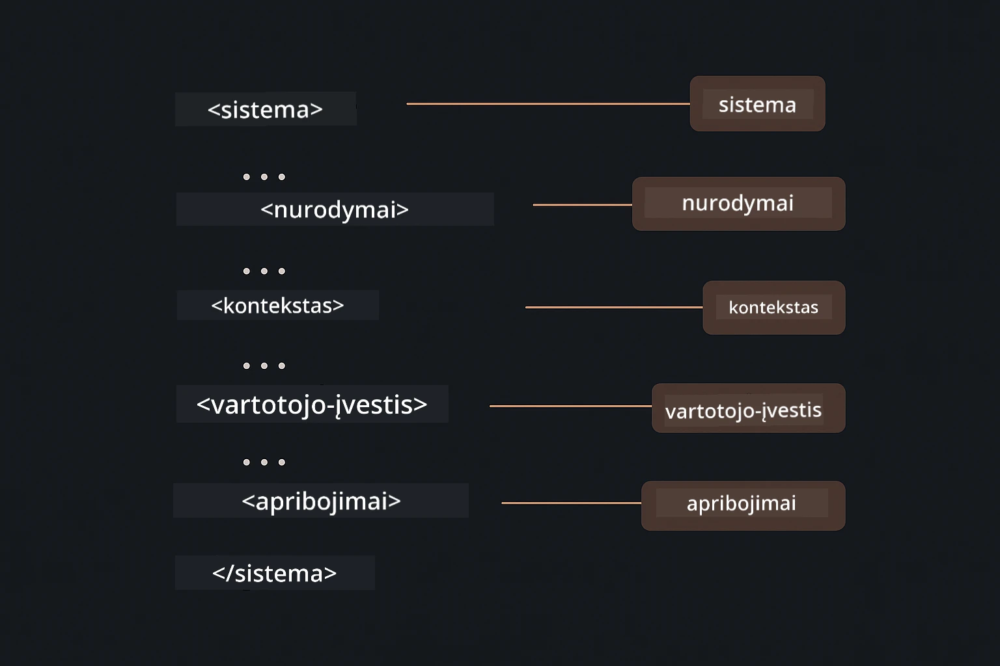

*Gerai struktūruotos užklausos anatomija su aiškiomis dalimis ir XML stiliaus organizacija*

**Kokybė per savianalizę**

Savianalizuojantys modeliai veikia, aiškiai nurodydami kokybės kriterijus. Vietoj to, kad tikėtumėtės, jog modelis „padarys teisingai“, jūs tiksliai sakote, ką reiškia „teisingai“: teisinga logika, klaidų valdymas, našumas, saugumas. Modelis tada gali įvertinti savo išvestį ir tobulėti. Tai paverčia kodo generavimą iš loterijos į procesą.

**Kontekstas yra ribotas**

Daugiapakopiai pokalbiai veikia įtraukdami žinučių istoriją į kiekvieną užklausą. Bet yra riba – kiekvienas modelis turi maksimalų žodžių skaičių. Augant pokalbiams, reikės strategijų, kaip išlaikyti svarbų kontekstą neviršijant ribos. Šis modulis parodo, kaip veikia atmintis; vėliau išmoksite, kada apibendrinti, kada pamiršti ir kada atkurti informaciją.

## Tolimesni žingsniai

**Kitas modulis:** [03-rag - RAG (Retrieval-Augmented Generation)](../03-rag/README.md)

---

**Navigacija:** [← Ankstesnis: Modulis 01 - Įvadas](../01-introduction/README.md) | [Atgal į pagrindinį](../README.md) | [Kitas: Modulis 03 - RAG →](../03-rag/README.md)

---

<!-- CO-OP TRANSLATOR DISCLAIMER START -->
**Atsakomybės apribojimas**:  
Šis dokumentas buvo išverstas naudojant dirbtinio intelekto vertimo paslaugą [Co-op Translator](https://github.com/Azure/co-op-translator). Nors stengiamės užtikrinti tikslumą, prašome atkreipti dėmesį, kad automatiniai vertimai gali turėti klaidų ar netikslumų. Originalus dokumentas gimtąja kalba turėtų būti laikomas autoritetingu šaltiniu. Svarbiai informacijai rekomenduojamas profesionalus žmogaus vertimas. Mes neatsakome už bet kokius nesusipratimus ar neteisingus aiškinimus, kilusius dėl šio vertimo naudojimo.
<!-- CO-OP TRANSLATOR DISCLAIMER END -->