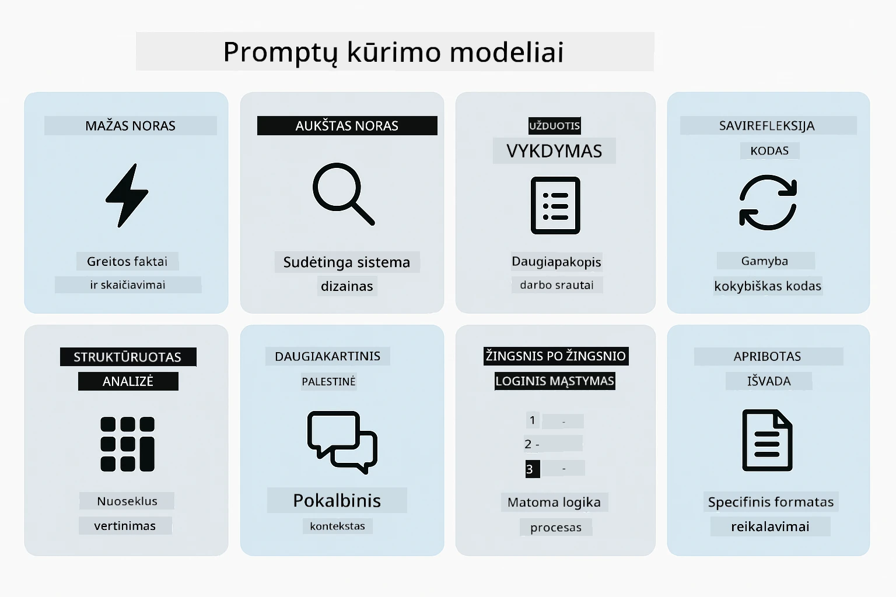
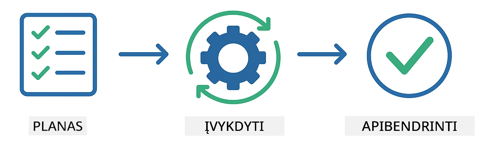
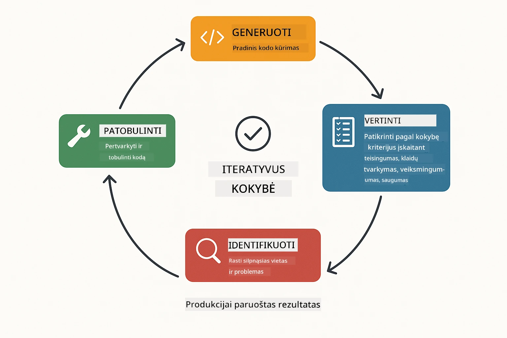
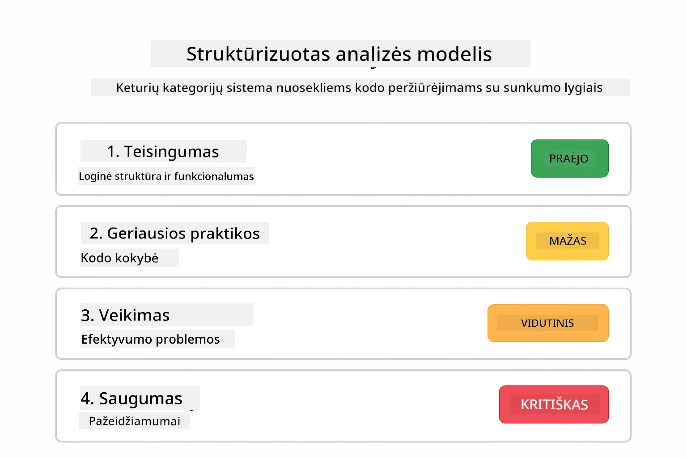
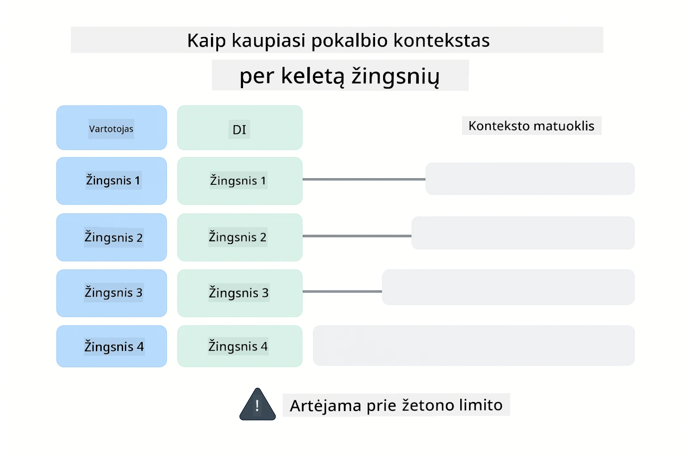
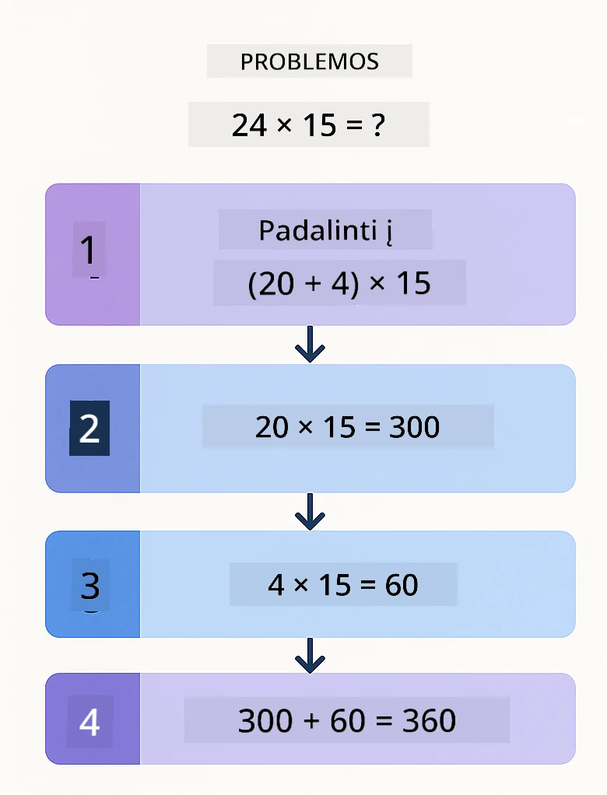
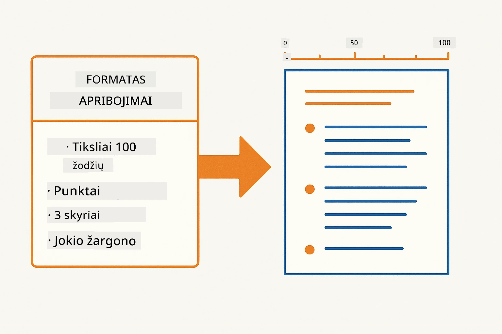
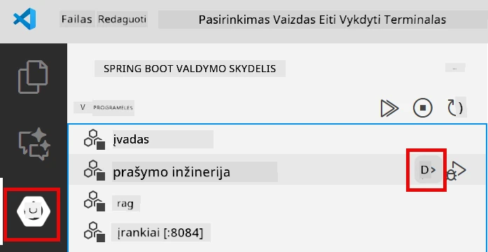
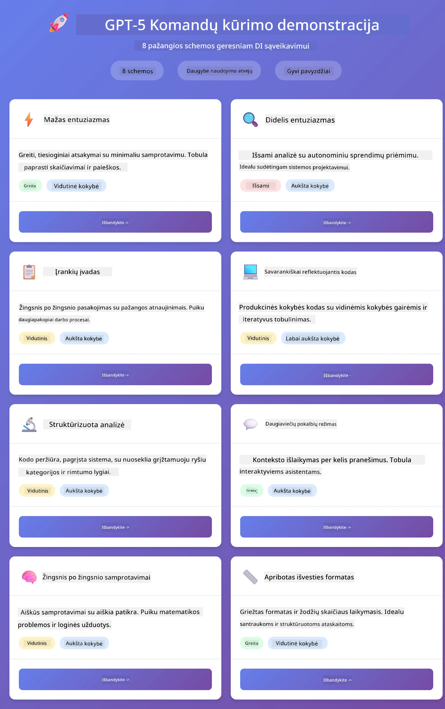
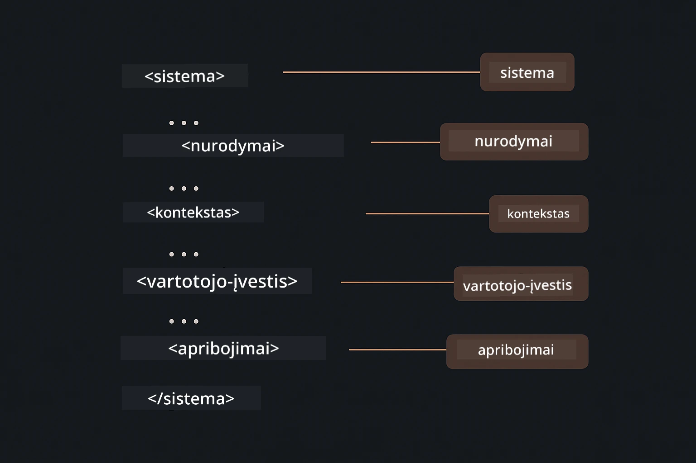

# 02 modulis: Užklausų inžinerija su GPT-5.2

## Turinys

- [Vaizdo įrašo peržiūra](#vaizdo-įrašo-peržiūra)
- [Ko išmoksite](#ko-išmoksite)
- [Priešmokymai](#priešmokymai)
- [Supratimas apie užklausų inžineriją](#supratimas-apie-užklausų-inžineriją)
- [Užklausų inžinerijos pagrindai](#užklausų-inžinerijos-pagrindai)
  - [Zero-Shot užklausos](#zero-shot-užklausos)
  - [Few-Shot užklausos](#few-shot-užklausos)
  - [Grandininio mąstymo užklausos](#grandininio-mąstymo-užklausos)
  - [Rolės pagrindu paremtos užklausos](#rolės-pagrindu-paremtos-užklausos)
  - [Užklausų šablonai](#užklausų-šablonai)
- [Pažangiosios šablonai](#pažangiosios-šablonai)
- [Programos paleidimas](#programos-paleidimas)
- [Programos ekrano kopijos](#programos-ekrano-vaizdai)
- [Šablonų tyrinėjimas](#modelių-tyrinėjimas)
  - [Mažas ir didelis entuziazmas](#mažas-ir-didelis-entuziazmas-low-vs-high-eagerness)
  - [Užduoties vykdymas (įrankių preambulės)](#užduočių-vykdymas-įrankių-įvadai)
  - [Savirefleksinis kodas](#savianalizės-kodas-self-reflecting-code)
  - [Struktūruota analizė](#strukturizuota-analizė)
  - [Daugiaetapiai pokalbiai](#daugkartinis-pokalbis)
  - [Žingsnis po žingsnio mąstymas](#žingsnis-po-žingsnio-mąstymas)
  - [Apribotas išvestis](#apribotas-išvesties-formatas)
- [Tikrasis mokymasis](#ko-išties-išmokstate)
- [Kiti žingsniai](#tolimesni-žingsniai)

## Vaizdo įrašo peržiūra

Peržiūrėkite šią tiesioginę sesiją, kurioje paaiškinama, kaip pradėti darbą su šiuo moduliu:

<a href="https://www.youtube.com/live/PJ6aBaE6bog?si=LDshyBrTRodP-wke"></a>

## Ko išmoksite

Toliau pateiktas diagramas apžvelgia pagrindines temas ir įgūdžius, kuriuos įgysite šio modulio metu — nuo užklausų tobulinimo technikų iki žingsnis po žingsnio darbo eigos.


Ankstesniame modulyje matėte, kaip atmintis leidžia pokalbių dirbtiniam intelektui naudoti Azure OpenAI. Dabar sutelksime dėmesį į tai, kaip užduodate klausimus — pačias užklausas — naudojant Azure OpenAI GPT-5.2. Užklausų struktūra smarkiai veikia gaunamų atsakymų kokybę. Pradedame nuo pagrindinių užklausų technikų apžvalgos, o vėliau pereisime prie aštuonių pažangių šablonų, atskleidžiančių GPT-5.2 galimybes.

Naudosime GPT-5.2, nes jis įveda mąstymo kontrolę – galite pasakyti modeliui, kiek jis turi pagalvoti prieš atsakydamas. Tai daro skirtingas užklausų strategijas aiškesnes ir padeda suprasti, kada naudoti įvairius metodus.

## Priešmokymai

- Baigtas 01 modulis (Azure OpenAI ištekliai paskelbti)
- `.env` failas šakniniame kataloge su Azure prisijungimo duomenimis (sukurtas naudojant `azd up` 01 modulyje)

> **Pastaba:** Jei nebaigėte 01 modulio, pirmiausia vykdykite jame pateiktas diegimo instrukcijas.

## Supratimas apie užklausų inžineriją

Iš esmės užklausų inžinerija yra skirtumas tarp neaiškių instrukcijų ir tikslių nurodymų, kaip iliustruoja žemiau pateiktas palyginimas.


Užklausų inžinerija reiškia įvesties teksto kūrimą, kuris nuosekliai suteikia reikiamus rezultatus. Tai ne tik klausimų uždavimas — tai prašymų struktūrizavimas taip, kad modelis tiksliai suprastų, ko norite ir kaip tai pateikti.

Galvokite apie tai, kaip instrukcijų suteikimą kolegai. „Pataisyk klaidą“ yra neaišku. „Pataisyk null pointer exception UserService.java 45 eilutėje pridėdamas null tikrinimą“ yra konkretu. Kalbų modeliai veikia taip pat – svarbi tikslių ir struktūrizuotų instrukcijų reikšmė.

Žemiau pateikta schema rodo, kaip LangChain4j įsilieja į šį procesą — jungia jūsų užklausų šablonus su modeliu per `SystemMessage` ir `UserMessage` konstrukcijas.


LangChain4j teikia infrastruktūrą — modelių jungtis, atmintį ir žinučių tipus — o užklausų šablonai yra tiesiog kruopščiai struktūruotas tekstas, siunčiamas per šią infrastruktūrą. Pagrindiniai statybiniai blokai yra `SystemMessage` (nustato DI elgesį ir vaidmenį) bei `UserMessage` (talpina jūsų užklausą).

## Užklausų inžinerijos pagrindai

Žemiau parodytos penkios pagrindinės technikos formuoja efektyvios užklausų inžinerijos pagrindą. Kiekviena sprendžia skirtingą kalbos modelių bendravimo aspektą.


Prieš pradedant pažangius šablonus šiame modulyje, apžvelkime penkias pagrindines užklausų technikas. Tai yra statybiniai blokai, kuriuos turi žinoti kiekvienas užklausų inžinierius.

### Zero-Shot užklausos

Paprastumiausias metodas: duoti modeliui tiesioginę instrukciją be pavyzdžių. Modelis visiškai pasikliauja savo mokymu, kad suprastų ir įvykdytų užduotį. Tai gerai veikia paprastoms užklausoms, kur numatytas elgesys aiškus.


*Tiesioginė instrukcija be pavyzdžių — modelis nuspėja užduotį tik iš instrukcijos*

```java
String prompt = "Classify this sentiment: 'I absolutely loved the movie!'";
String response = model.chat(prompt);
// Atsakymas: "Teigiamas"
```

**Kada naudoti:** paprasta klasifikacija, tiesioginiai klausimai, vertimai arba bet kokia užduotis, kurią modelis gali atlikti be papildomų nurodymų.

### Few-Shot užklausos

Pateikite pavyzdžių, demonstruojančių modelio sekamą šabloną. Modelis iš jūsų pavyzdžių išmoksta reikiamą įvesties-išvesties formatą ir taiko jį naujoms įvestims. Tai žymiai pagerina nuoseklumą užduotyse, kur pageidaujamas formatas arba elgesys nėra akivaizdus.


*Mokymasis iš pavyzdžių — modelis atpažįsta šabloną ir taiko naujoms įvestims*

```java
String prompt = """
    Classify the sentiment as positive, negative, or neutral.
    
    Examples:
    Text: "This product exceeded my expectations!" → Positive
    Text: "It's okay, nothing special." → Neutral
    Text: "Waste of money, very disappointed." → Negative
    
    Now classify this:
    Text: "Best purchase I've made all year!"
    """;
String response = model.chat(prompt);
```

**Kada naudoti:** individualios klasifikacijos, nuoseklus formatavimas, domeno specifinės užduotys arba kai zero-shot rezultatai yra nenuoseklūs.

### Grandininio mąstymo užklausos

Paprašykite modelio parodyti savo mąstymą žingsnis po žingsnio. Vietoje tiesioginio atsakymo modelis išskaido problemą ir išsamiai ją analizuoja. Tai pagerina tikslumą matematikos, logikos ir daugelio žingsnių mąstymo užduotyse.


*Žingsnis po žingsnio mąstymas — sudėtingų problemų dalijimas į aiškius loginius žingsnius*

```java
String prompt = """
    Problem: A store has 15 apples. They sell 8 apples and then 
    receive a shipment of 12 more apples. How many apples do they have now?
    
    Let's solve this step-by-step:
    """;
String response = model.chat(prompt);
// Modelis rodo: 15 - 8 = 7, tada 7 + 12 = 19 obuolių
```

**Kada naudoti:** matematinės problemos, loginiai galvosūkiai, klaidų taisymas arba bet kokia užduotis, kurioje mąstymo proceso demonstravimas gerina tikslumą ir pasitikėjimą.

### Rolės pagrindu paremtos užklausos

Nustatykite DI personą arba vaidmenį prieš užduodami klausimą. Tai suteikia kontekstą, kuris formuoja atsakymo toną, gylį ir fokusuotumą. „Programinės įrangos architektas“ duoda kitokius patarimus nei „jaunesnysis programuotojas“ arba „saugumo auditorius“.


*Kontexto ir personos nustatymas — tas pats klausimas gauna skirtingą atsakymą priklausomai nuo priskirto vaidmens*

```java
String prompt = """
    You are an experienced software architect reviewing code.
    Provide a brief code review for this function:
    
    def calculate_total(items):
        total = 0
        for item in items:
            total = total + item['price']
        return total
    """;
String response = model.chat(prompt);
```

**Kada naudoti:** kodo peržiūros, mokymas, domeno specifinė analizė arba kai reikia atsakymų, pritaikytų konkretaus lygio patirčiai ar perspektyvai.

### Užklausų šablonai

Kurkite pakartotinai naudojamas užklausas su kintamaisiais žymekliais. Užuot rašę naują užklausą kiekvieną kartą, apibrėžkite šabloną vieną kartą ir užpildykite skirtingas reikšmes. LangChain4j `PromptTemplate` klasė tai supaprastina su `{{variable}}` sintakse.


*Pakartotinai naudojamos užklausos su kintamais žymekliais — vienas šablonas, daug panaudojimų*

```java
PromptTemplate template = PromptTemplate.from(
    "What's the best time to visit {{destination}} for {{activity}}?"
);

Prompt prompt = template.apply(Map.of(
    "destination", "Paris",
    "activity", "sightseeing"
));

String response = model.chat(prompt.text());
```

**Kada naudoti:** pasikartojančios užklausos su skirtingomis įvestimis, partijų apdorojimas, pakartotiniai DI darbo eigos kūrimas arba bet kuri situacija, kai užklausos struktūra išlieka ta pati, bet keičiasi duomenys.

---

Šios penkios pagrindinės technikos suteikia jums tvirtą įrankių rinkinį daugumai užklausų. Likusi šio modulio dalis plečia jas su **aštuoniais pažangiais šablonais**, kurie išnaudoja GPT-5.2 mąstymo kontrolę, savivertinimą ir struktūruotų išvesties galimybes.

## Pažangiosios šablonai

Išmokę pagrindus, pereikime prie aštuonių pažangių šablonų, kurie daro šį modulį unikalų. Ne visoms problemoms tinka tas pats požiūris. Kai kurie klausimai reikalauja greitų atsakymų, kiti – gilios analizės. Kai kuriems reikia matomo mąstymo, kitiems – tiesiog rezultatų. Kiekvienas žemiau pateiktas šablonas optimizuotas skirtingam scenarijui — o GPT-5.2 mąstymo kontrolė dar labiau sustiprina skirtumus.



*Aštuonių užklausų inžinerijos šablonų apžvalga ir jų panaudojimo atvejai*

GPT-5.2 įveda dar vieną šių šablonų dimensiją: *mąstymo kontrolę*. Žemiau esantis slankiklis rodo, kaip galite reguliuoti, kiek modeliui reikia galvoti – nuo greitų tiesioginių atsakymų iki gilaus, išsamaus analizavimo.


*GPT-5.2 mąstymo kontrolė leidžia nurodyti, kiek mąstymo turi atlikti modelis — nuo greitų tiesioginių atsakymų iki gilaus tyrinėjimo*

**Mažas entuziazmas (Greita ir tikslinė)** – paprastiems klausimams, kur norite greitų, tiesioginių atsakymų. Modelis atlieka minimalią analizę – daugiausia 2 žingsnius. Naudokite tai skaičiavimams, paieškoms ar paprastiems klausimams.

```java
String prompt = """
    <context_gathering>
    - Search depth: very low
    - Bias strongly towards providing a correct answer as quickly as possible
    - Usually, this means an absolute maximum of 2 reasoning steps
    - If you think you need more time, state what you know and what's uncertain
    </context_gathering>
    
    Problem: What is 15% of 200?
    
    Provide your answer:
    """;

String response = chatModel.chat(prompt);
```

> 💡 **Tyrinėkite su GitHub Copilot:** Atidarykite [`Gpt5PromptService.java`](../../../02-prompt-engineering/src/main/java/com/example/langchain4j/prompts/service/Gpt5PromptService.java) ir paklauskite:
> - "Kuo skiriasi mažo ir didelio entuziazmo užklausų šablonai?"
> - "Kaip XML žymos užklausose padeda struktūrizuoti AI atsakymą?"
> - "Kada naudoti savirefleksijos šablonus, o kada tiesioginę instrukciją?"

**Didelis entuziazmas (Gilus ir kruopštus)** – sudėtingoms problemoms, kai reikia išsamios analizės. Modelis atlieka išsamų tyrimą ir pateikia detalų mąstymą. Naudokite tai sistemos dizaino, architektūros sprendimams arba sudėtingiems tyrimams.

```java
String prompt = """
    Analyze this problem thoroughly and provide a comprehensive solution.
    Consider multiple approaches, trade-offs, and important details.
    Show your analysis and reasoning in your response.
    
    Problem: Design a caching strategy for a high-traffic REST API.
    """;

String response = chatModel.chat(prompt);
```

**Užduoties vykdymas (žingsnis po žingsnio pažanga)** – daugiaetapiams darbo eigos procesams. Modelis pateikia išankstinį planą, pasakoja apie kiekvieną žingsnį jį vykdydamas, po to apibendrina. Naudokite migracijoms, įgyvendinimams ar bet kuriam daugiaetapiam procesui.

```java
String prompt = """
    <task_execution>
    1. First, briefly restate the user's goal in a friendly way
    
    2. Create a step-by-step plan:
       - List all steps needed
       - Identify potential challenges
       - Outline success criteria
    
    3. Execute each step:
       - Narrate what you're doing
       - Show progress clearly
       - Handle any issues that arise
    
    4. Summarize:
       - What was completed
       - Any important notes
       - Next steps if applicable
    </task_execution>
    
    <tool_preambles>
    - Always begin by rephrasing the user's goal clearly
    - Outline your plan before executing
    - Narrate each step as you go
    - Finish with a distinct summary
    </tool_preambles>
    
    Task: Create a REST endpoint for user registration
    
    Begin execution:
    """;

String response = chatModel.chat(prompt);
```

Grandininio mąstymo užklausos aiškiai prašo modelio parodyti savo mąstymo procesą, kas pagerina tikslumą sudėtingų užduočių sprendimuose. Žingsnis po žingsnio suskaidymas padeda suprasti logiką tiek žmonėms, tiek DI.

> **🤖 Išbandykite su [GitHub Copilot](https://github.com/features/copilot) pokalbiu:** Paklauskite apie šį šabloną:
> - "Kaip adaptuočiau užduoties vykdymo šabloną ilgai trukmės operacijoms?"
> - "Kokios yra geriausios praktikos struktūrizuojant įrankių preambules gamybos programose?"
> - "Kaip fiksuoti ir rodyti tarpinę pažangą naudotojo sąsajoje?"

Žemiau pateikta schema iliustruoja šią Plan → Vykdyti → Apibendrinti darbo eigą.



*Plan → Vykdyti → Apibendrinti darbo eiga daugiaetapėms užduotims*

**Savirefleksinis kodas** – gamybinės kokybės kodo generavimui. Modelis generuoja kodą laikydamasis gamybinei programinei įrangai keliamų reikalavimų su tinkama klaidų tvarkymo logika. Naudokite tai kuriant naujas funkcijas ar paslaugas.

```java
String prompt = """
    Generate Java code with production-quality standards: Create an email validation service
    Keep it simple and include basic error handling.
    """;

String response = chatModel.chat(prompt);
```

Žemiau pateikta schema rodo šį iteracinio tobulinimo ciklą – generuoti, vertinti, identifikuoti silpnas vietas ir tobulinti, kol kodas atitinka gamybinius standartus.



*Iteracinio tobulinimo ciklas – generuoti, vertinti, rasti problemas, gerinti, kartoti*

**Struktūruota analizė** – nuosekliai vertinti. Modelis peržiūri kodą naudodamas fiksuotą sistemą (teisingumas, geros praktikos, veikimas, saugumas, prižiūrimumas). Naudokite tai kodo peržiūroms arba kokybės vertinimams.

```java
String prompt = """
    <analysis_framework>
    You are an expert code reviewer. Analyze the code for:
    
    1. Correctness
       - Does it work as intended?
       - Are there logical errors?
    
    2. Best Practices
       - Follows language conventions?
       - Appropriate design patterns?
    
    3. Performance
       - Any inefficiencies?
       - Scalability concerns?
    
    4. Security
       - Potential vulnerabilities?
       - Input validation?
    
    5. Maintainability
       - Code clarity?
       - Documentation?
    
    <output_format>
    Provide your analysis in this structure:
    - Summary: One-sentence overall assessment
    - Strengths: 2-3 positive points
    - Issues: List any problems found with severity (High/Medium/Low)
    - Recommendations: Specific improvements
    </output_format>
    </analysis_framework>
    
    Code to analyze:
    ```
    public List getUsers() {
        return database.query("SELECT * FROM users");
    }
    ```
    Provide your structured analysis:
    """;

String response = chatModel.chat(prompt);
```

> **🤖 Išbandykite su [GitHub Copilot](https://github.com/features/copilot) pokalbiu:** Paklauskite apie struktūruotą analizę:
> - "Kaip pritaikyti analizės sistemą skirtingoms kodo peržiūroms?"
> - "Kokia geriausia praktika programiškai apdoroti struktūruotą išvestį?"
> - "Kaip užtikrinti nuoseklius sunkumo lygius skirtinguose peržiūros seansuose?"

Žemiau pateikta schema rodo, kaip ši struktūruota sistema organizuoja kodo peržiūrą į nuoseklias kategorijas ir sunkumo lygius.



*Sistema nuoseklioms kodo peržiūroms su sunkumo lygiais*

**Daugiaetapiai pokalbiai** – pokalbiams, kuriems reikalingas kontekstas. Modelis prisimena ankstesnes žinutes ir kuria jas toliau. Naudokite tai interaktyvioms pagalbos sesijoms arba sudėtingiems klausimų-atsakymų veiksmams.

```java
ChatMemory memory = MessageWindowChatMemory.withMaxMessages(10);

memory.add(UserMessage.from("What is Spring Boot?"));
AiMessage aiMessage1 = chatModel.chat(memory.messages()).aiMessage();
memory.add(aiMessage1);

memory.add(UserMessage.from("Show me an example"));
AiMessage aiMessage2 = chatModel.chat(memory.messages()).aiMessage();
memory.add(aiMessage2);
```

Schema žemiau vizualizuoja, kaip kontekstas kaupiasi per kelis pokalbio žingsnius ir kaip tai susiję su modelio tokenų limitu.



*Kaip pokalbio kontekstas kaupiasi per daugiau nei vieną žingsnį iki tokenų limito pasiekimo*

**Žingsnis po žingsnio mąstymas** – problemoms, kurioms reikia matomos logikos. Modelis rodo aiškų kiekvieno žingsnio mąstymo procesą. Naudokite tai matematikos uždaviniams, logikos galvosūkiams arba kai norite suprasti mąstymo eigą.

```java
String prompt = """
    <instruction>Show your reasoning step-by-step</instruction>
    
    If a train travels 120 km in 2 hours, then stops for 30 minutes,
    then travels another 90 km in 1.5 hours, what is the average speed
    for the entire journey including the stop?
    """;

String response = chatModel.chat(prompt);
```

Žemiau pateikta schema iliustruoja, kaip modelis skaido problemas į aiškius, sunumeruotus loginius žingsnius.


*Probleminių uždavinių suskaidymas į aiškius loginius žingsnius*

**Apribotas Išvestis** – Atsakymams su konkrečiais formato reikalavimais. Modelis griežtai laikosi formato ir ilgumo taisyklių. Naudokite tai suvestinėms arba kai reikia tikslios išvesties struktūros.

```java
String prompt = """
    <constraints>
    - Exactly 100 words
    - Bullet point format
    - Technical terms only
    </constraints>
    
    Summarize the key concepts of machine learning.
    """;

String response = chatModel.chat(prompt);
```

Toliau pateiktas paveikslėlis rodo, kaip apribojimai nukreipia modelį generuoti išvestį, kuri griežtai atitinka jūsų formatą ir ilgumo reikalavimus.



*Reikalavimų formatui, ilgumui ir struktūrai taikymas*

## Programos paleidimas

**Patikrinkite diegimą:**

Įsitikinkite, kad `.env` failas egzistuoja pagrindiniame kataloge su Azure prisijungimo duomenimis (sukurti 1 modulyje). Paleiskite tai iš modulio katalogo (`02-prompt-engineering/`):

**Bash:**
```bash
cat ../.env  # Turėtų parodyti AZURE_OPENAI_ENDPOINT, API_KEY, DEPLOYMENT
```

**PowerShell:**
```powershell
Get-Content ..\.env  # Turėtų rodyti AZURE_OPENAI_ENDPOINT, API_KEY, DEPLOYMENT
```

**Paleiskite programą:**

> **Pastaba:** Jei jau paleidote visas programas naudodami `./start-all.sh` iš pagrindinio katalogo (kaip aprašyta 1 modulyje), šis modulis jau veikia 8083 prievade. Galite praleisti žemiau pateiktas paleidimo komandas ir tiesiogiai eiti į http://localhost:8083.

**1 variantas: Naudojant Spring Boot Dashboard (rekomenduojama VS Code naudotojams)**

Dev container įtraukia Spring Boot Dashboard plėtinį, kuris suteikia vizualią sąsają visoms Spring Boot programoms valdyti. Jį rasite Activity Bar kairėje VS Code pusėje (ieškokite Spring Boot ikonos).

Iš Spring Boot Dashboard galite:
- Peržiūrėti visas darbo erdvėje esančias Spring Boot programas
- Paleisti / sustabdyti programas vienu paspaudimu
- Realizuoti programos žurnalus realiu laiku
- Stebėti programos būseną

Tiesiog paspauskite paleidimo mygtuką šalia „prompt-engineering“, kad paleistumėte šį modulį, arba paleiskite visus modulius vienu metu.



*Spring Boot Dashboard VS Code — paleiskite, sustabdykite ir stebėkite visus modulius vienoje vietoje*

**2 variantas: Naudojant shell scenarijus**

Paleiskite visas interneto programas (1–4 moduliai):

**Bash:**
```bash
cd ..  # Iš šakninių katalogų
./start-all.sh
```

**PowerShell:**
```powershell
cd ..  # Iš šakninių katalogų
.\start-all.ps1
```

Arba paleiskite tik šį modulį:

**Bash:**
```bash
cd 02-prompt-engineering
./start.sh
```

**PowerShell:**
```powershell
cd 02-prompt-engineering
.\start.ps1
```

Abu scenarijai automatiškai įkelia aplinkos kintamuosius iš pagrindinio `.env` failo ir sukurs JAR failus, jei jų nėra.

> **Pastaba:** Jei norite visus modulius sukompiliuoti rankiniu būdu prieš paleidimą:
>
> **Bash:**
> ```bash
> cd ..  # Go to root directory
> mvn clean package -DskipTests
> ```
>
> **PowerShell:**
> ```powershell
> cd ..  # Go to root directory
> mvn clean package -DskipTests
> ```

Atidarykite http://localhost:8083 savo naršyklėje.

**Norėdami sustabdyti:**

**Bash:**
```bash
./stop.sh  # Tik šis modulis
# Arba
cd .. && ./stop-all.sh  # Visi moduliai
```

**PowerShell:**
```powershell
.\stop.ps1  # Tik šis modulis
# Arba
cd ..; .\stop-all.ps1  # Visi moduliai
```

## Programos ekrano vaizdai

Čia pagrindinė promptų inžinerijos modulio sąsaja, kur galite eksperimentuoti su visais aštuoniais modeliais iš karto.



*Pagrindinis pultas su visais 8 promptų inžinerijos modeliais ir jų savybėmis bei naudojimo atvejais*

## Modelių tyrinėjimas

Žiniatinklio sąsaja leidžia eksperimentuoti su įvairiomis prašymų strategijomis. Kiekvienas modelis sprendžia skirtingas problemas – išbandykite, kad pamatytumėte, kada kuris metodas geriausiai tinka.

> **Pastaba: Srautinė ir nesrautinė išvestis** — Kiekviename modelio puslapyje yra du mygtukai: **🔴 Stream Response (Live)** ir **Non-streaming** variantas. Srautinė išvestis naudoja Server-Sent Events (SSE) ir rodo žodžius realiuoju laiku, kai modelis juos generuoja, todėl iš karto matote progreso eigą. Nesrautinė išvestis laukia viso atsakymo pabaigos, kad jį parodytų. Modeliams, kuriuos verčia gilus mąstymas (pvz., High Eagerness, Self-Reflecting Code), nesrautinė išvestis gali užtrukti labai ilgai – kartais kelias minutes – be jokios matomos grįžtamosios informacijos. **Eksperimentuojant su sudėtingais prašymais naudokite srautinę išvestį**, kad matytumėte modelio veikimą ir išvengtumėte klaidingo įspūdžio, kad prašymas užstringa.
>
> **Pastaba: Naršyklės reikalavimai** — Srautinė funkcija naudoja Fetch Streams API (`response.body.getReader()`), kurią palaiko pilnos naršyklės (Chrome, Edge, Firefox, Safari). Ji **neveikia** VS Code integruotoje Simple Browser, nes ši nepalaiko ReadableStream API. Jei naudojate Simple Browser, nesrautiniai mygtukai veiks įprastai – paveikti yra tik srautiniai. Norėdami pilnos patirties, atidarykite `http://localhost:8083` išorinėje naršyklėje.

### Mažas ir didelis entuziazmas (Low vs High Eagerness)

Uždėkite lengvą klausimą, pavyzdžiui „Kiek yra 15 % iš 200?“, naudodami Mažą entuziazmą. Gaunate greitą ir tiesioginį atsakymą. Dabar užduokite sudėtingesnį klausimą, pvz., „Sukurkite aukšto srauto API kešavimo strategiją“ naudodami Didelį entuziazmą. Paspauskite **🔴 Stream Response (Live)** ir stebėkite, kaip modelis žingsnis po žingsnio detalizuoja mintis. Tas pats modelis, ta pati klausimo struktūra – skiriasi tik prašymas, nurodantis kiek mąstyti.

### Užduočių vykdymas (Įrankių įvadai)

Daugiapakopiai darbo eiga naudoja išankstinį planavimą ir progreso aprašymą. Modelis apibendrina, ką darys, aprašo kiekvieną žingsnį, po to pateikia rezultatų santrauką.

### Savianalizės kodas (Self-Reflecting Code)

Išbandykite „Sukurk el. pašto validacijos servisą“. Vietoj to, kad tik sugeneruotų kodą ir sustotų, modelis generuoja, vertina pagal kokybės kriterijus, identifikuoja trūkumus ir tobulina. Matysite, kaip jis kartoja procesą tol, kol kodas pasiekia gamybos lygį.

### Strukturizuota analizė

Kodo apžvalgoms reikia nuoseklių vertinimo kriterijų. Modelis analizuoja kodą pagal fiksuotas kategorijas (teisingumas, praktikos, našumas, saugumas) su skirtingais griežtumo lygiais.

### Daugkartinis pokalbis

Paklauskite „Kas yra Spring Boot?“ ir tuoj pat pridėkite „Parodyk pavyzdį“. Modelis atsimena pirmą klausimą ir pateikia būtent su Spring Boot susijusį pavyzdį. Be atminties antras klausimas būtų per daug bendras.

### Žingsnis po žingsnio mąstymas

Pasirinkite matematinę užduotį ir išbandykite ją naudodami tiek Žingsnis po žingsnio mąstymą, tiek Mažą entuziazmą. Mažas entuziazmas greitai pateikia atsakymą – tačiau jis neaiškus. Žingsnis po žingsnio parodo kiekvieną skaičiavimą ir sprendimą.

### Apribotas išvesties formatas

Kai reikia konkrečių formatų ar žodžių skaičiaus, šis modelis užtikrina griežtą laikymąsi. Išbandykite sugeneruoti apibendrinimą tiksliai su 100 žodžių bulleted formatu.

## Ko išties išmokstate

**Mąstymo pastangos lemia viską**

GPT-5.2 leidžia valdyti skaičiavimo pastangas per prašymus. Mažos pastangos reiškia greitus atsakymus su minimalia paieška. Didelės pastangos reiškia, kad modelis skiria laiko giliau mąstyti. Mokotės pritaikyti pastangas uždavinio sudėtingumui – neskubinkite paprastų klausimų, bet ir nepraleiskite svarbių sudėtingų sprendimų.

**Struktūra valdo elgesį**

Pastebėjote XML žymes prašymuose? Jos nėra dekoratyvios. Modeliai labiau seka struktūrizuotus nurodymus nei laisvą tekstą. Kai reikia daugiapakopių procesų ar sudėtingos logikos, struktūra padeda modeliui žinoti, kur yra ir kas toliau. Žemiau pateiktas paveikslėlis analizuoja gerai struktūruotą prašymą, parodant, kaip žymės `<system>`, `<instructions>`, `<context>`, `<user-input>`, ir `<constraints>` organizuoja instrukcijas aiškiomis dalimis.



*Gerai struktūruoto prašymo anatomija su aiškiomis dalimis ir XML stiliaus organizacija*

**Kokybė per savianalizę**

Savianalizės modeliai naudoja aiškius kokybės kriterijus. Vietoje to, kad tikėtumėtės, jog modelis „atliks teisingai“, jūs tiksliai nurodote, ką reiškia „teisingai“: taisyklinga logika, klaidų tvarkymas, našumas, saugumas. Modelis tada gali įvertinti savo išvestį ir patobulinti ją. Tai paverčia kodo generavimą ne loterija, o procesu.

**Kontekstas yra ribotas**

Daugkartiniai pokalbiai veikia, kai kiekviename užklausoje siunčiate žinučių istoriją. Tačiau yra apribojimas – kiekvienas modelis turi maksimalų žodžių skaičių. Pokalbiui augant, jums reikės strategijų, kaip išlaikyti svarbų kontekstą, bet neviršyti ribos. Šis modulis parodo, kaip veikia atmintis; vėliau sužinosite, kada santrumpinti, kada pamiršti ir kada atsiminti.

## Tolimesni žingsniai

**Kitas modulis:** [03-rag - RAG (Retrieval-Augmented Generation)](../03-rag/README.md)

---

**Navigacija:** [← Ankstesnis: 01 modulis – Įvadas](../01-introduction/README.md) | [Grįžti į pagrindinį](../README.md) | [Kitas: 03 modulis – RAG →](../03-rag/README.md)

---

<!-- CO-OP TRANSLATOR DISCLAIMER START -->
**Atsakomybės apribojimas**:
Šis dokumentas buvo išverstas naudojant dirbtinio intelekto vertimo paslaugą [Co-op Translator](https://github.com/Azure/co-op-translator). Nors siekiame tikslumo, prašome atkreipti dėmesį, kad automatiniai vertimai gali turėti klaidų ar netikslumų. Originalus dokumentas jo gimtąja kalba laikomas autoritetingu šaltiniu. Svarbiai informacijai rekomenduojama naudoti profesionalų žmogiškąjį vertimą. Mes neatsakome už jokius nesusipratimus ar neteisingą interpretaciją, kilusią naudojantis šiuo vertimu.
<!-- CO-OP TRANSLATOR DISCLAIMER END -->