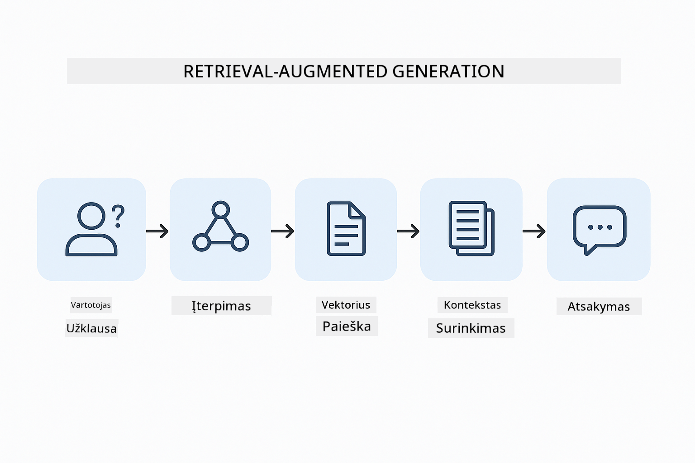
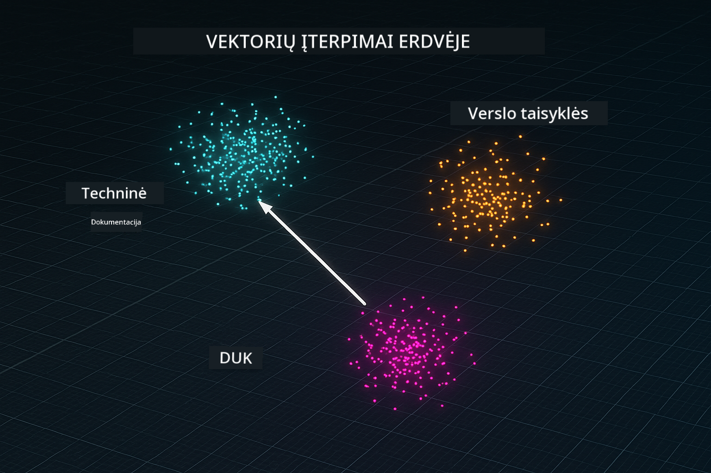
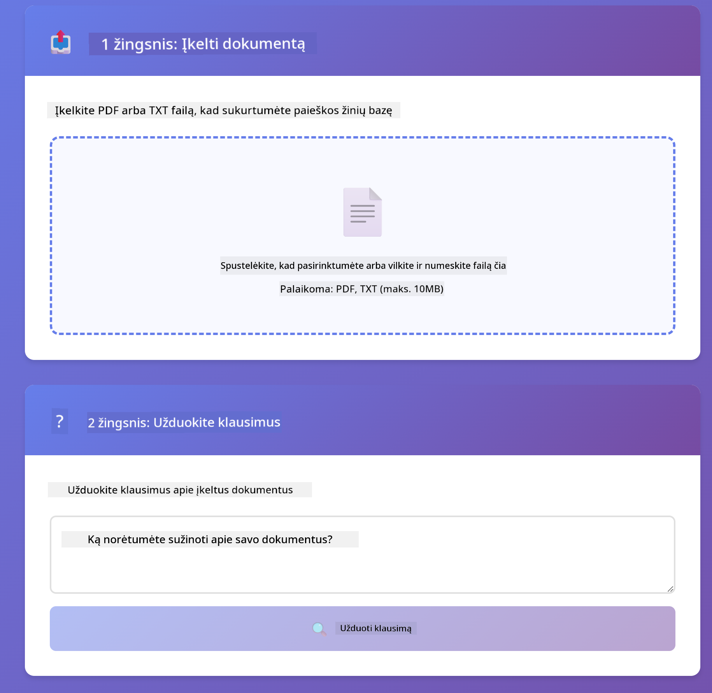

<!--
CO_OP_TRANSLATOR_METADATA:
{
  "original_hash": "f538a51cfd13147d40d84e936a0f485c",
  "translation_date": "2025-12-13T17:24:53+00:00",
  "source_file": "03-rag/README.md",
  "language_code": "lt"
}
-->
# Modulis 03: RAG (Retrieval-Augmented Generation)

## Turinys

- [Ko Išmoksite](../../../03-rag)
- [Reikalavimai](../../../03-rag)
- [RAG Suvokimas](../../../03-rag)
- [Kaip Tai Veikia](../../../03-rag)
  - [Dokumentų Apdorojimas](../../../03-rag)
  - [Įterpimų Kūrimas](../../../03-rag)
  - [Semantinė Paieška](../../../03-rag)
  - [Atsakymų Generavimas](../../../03-rag)
- [Paleiskite Programą](../../../03-rag)
- [Programos Naudojimas](../../../03-rag)
  - [Įkelti Dokumentą](../../../03-rag)
  - [Užduoti Klausimus](../../../03-rag)
  - [Patikrinti Šaltinių Nuorodas](../../../03-rag)
  - [Eksperimentuoti su Klausimais](../../../03-rag)
- [Pagrindinės Sąvokos](../../../03-rag)
  - [Dalijimosi Strategija](../../../03-rag)
  - [Panašumo Balai](../../../03-rag)
  - [Atminties Saugykla](../../../03-rag)
  - [Konteksto Langų Valdymas](../../../03-rag)
- [Kada RAG Yra Svarbus](../../../03-rag)
- [Kiti Žingsniai](../../../03-rag)

## Ko Išmoksite

Ankstesniuose moduliuose išmokote, kaip bendrauti su DI ir efektyviai struktūruoti savo užklausas. Tačiau yra esminė riba: kalbos modeliai žino tik tai, ką išmoko mokymo metu. Jie negali atsakyti į klausimus apie jūsų įmonės politiką, jūsų projekto dokumentaciją ar bet kokią informaciją, kurios nebuvo mokomi.

RAG (Retrieval-Augmented Generation) išsprendžia šią problemą. Vietoje to, kad bandytumėte mokyti modelį jūsų informacijos (kas yra brangu ir nepraktiška), jūs suteikiate jam galimybę ieškoti jūsų dokumentuose. Kai kas nors užduoda klausimą, sistema suranda susijusią informaciją ir įtraukia ją į užklausą. Modelis tada atsako remdamasis tuo surinktu kontekstu.

Įsivaizduokite RAG kaip nuorodų biblioteką modeliui. Kai užduodate klausimą, sistema:

1. **Vartotojo Užklausa** – Jūs užduodate klausimą  
2. **Įterpimas** – Jūsų klausimas paverčiamas vektoriumi  
3. **Vektorinė Paieška** – Randami panašūs dokumentų fragmentai  
4. **Konteksto Surinkimas** – Į užklausą pridedami susiję fragmentai  
5. **Atsakymas** – LLM generuoja atsakymą remdamasis kontekstu  

Tai pagrindžia modelio atsakymus jūsų tikrais duomenimis, o ne remiasi mokymo žiniomis ar išgalvotais atsakymais.



*RAG darbo eiga – nuo vartotojo užklausos iki semantinės paieškos ir kontekstinio atsakymo generavimo*

## Reikalavimai

- Baigtas Modulis 01 (išdiegti Azure OpenAI ištekliai)  
- `.env` failas šakniniame kataloge su Azure kredencialais (sukurtas `azd up` Modulyje 01)  

> **Pastaba:** Jei dar nebaigėte Modulio 01, pirmiausia sekite ten pateiktas diegimo instrukcijas.

## Kaip Tai Veikia

**Dokumentų Apdorojimas** – [DocumentService.java](../../../03-rag/src/main/java/com/example/langchain4j/rag/service/DocumentService.java)

Kai įkeliate dokumentą, sistema jį suskaido į fragmentus – mažesnes dalis, kurios patogiai telpa modelio konteksto lange. Šie fragmentai šiek tiek persidengia, kad neprarastumėte konteksto ribose.

```java
Document document = FileSystemDocumentLoader.loadDocument("sample-document.txt");

DocumentSplitter splitter = DocumentSplitters
    .recursive(300, 30, new OpenAiTokenizer());

List<TextSegment> segments = splitter.split(document);
```
  
> **🤖 Išbandykite su [GitHub Copilot](https://github.com/features/copilot) Chat:** Atidarykite [`DocumentService.java`](../../../03-rag/src/main/java/com/example/langchain4j/rag/service/DocumentService.java) ir paklauskite:  
> - „Kaip LangChain4j dalija dokumentus į fragmentus ir kodėl persidengimas svarbus?“  
> - „Koks yra optimalus fragmento dydis skirtingiems dokumentų tipams ir kodėl?“  
> - „Kaip tvarkyti dokumentus keliomis kalbomis ar su specialiu formatavimu?“

**Įterpimų Kūrimas** – [LangChainRagConfig.java](../../../03-rag/src/main/java/com/example/langchain4j/rag/config/LangChainRagConfig.java)

Kiekvienas fragmentas paverčiamas skaitmenine reprezentacija, vadinama įterpimu – iš esmės matematinis pirštų atspaudas, kuris fiksuoja teksto prasmę. Panašus tekstas sukuria panašius įterpimus.

```java
@Bean
public EmbeddingModel embeddingModel() {
    return OpenAiOfficialEmbeddingModel.builder()
        .baseUrl(azureOpenAiEndpoint)
        .apiKey(azureOpenAiKey)
        .modelName(azureEmbeddingDeploymentName)
        .build();
}

EmbeddingStore<TextSegment> embeddingStore = 
    new InMemoryEmbeddingStore<>();
```
  


*Dokumentai vaizduojami kaip vektoriai įterpimų erdvėje – panašus turinys grupuojasi kartu*

**Semantinė Paieška** – [RagService.java](../../../03-rag/src/main/java/com/example/langchain4j/rag/service/RagService.java)

Kai užduodate klausimą, jūsų klausimas taip pat paverčiamas įterpimu. Sistema palygina jūsų klausimo įterpimą su visų dokumentų fragmentų įterpimais. Randami fragmentai, turintys panašią prasmę – ne tik atitinkantys raktinius žodžius, bet ir tikrą semantinį panašumą.

```java
Embedding queryEmbedding = embeddingModel.embed(question).content();

List<EmbeddingMatch<TextSegment>> matches = 
    embeddingStore.findRelevant(queryEmbedding, 5, 0.7);

for (EmbeddingMatch<TextSegment> match : matches) {
    String relevantText = match.embedded().text();
    double score = match.score();
}
```
  
> **🤖 Išbandykite su [GitHub Copilot](https://github.com/features/copilot) Chat:** Atidarykite [`RagService.java`](../../../03-rag/src/main/java/com/example/langchain4j/rag/service/RagService.java) ir paklauskite:  
> - „Kaip veikia panašumo paieška su įterpimais ir kas lemia balą?“  
> - „Kokį panašumo slenkstį turėčiau naudoti ir kaip tai veikia rezultatus?“  
> - „Kaip elgtis, kai nerandama jokių susijusių dokumentų?“

**Atsakymų Generavimas** – [RagService.java](../../../03-rag/src/main/java/com/example/langchain4j/rag/service/RagService.java)

Svarbiausi fragmentai įtraukiami į užklausą modeliui. Modelis perskaito tuos konkrečius fragmentus ir atsako į jūsų klausimą remdamasis ta informacija. Tai užkerta kelią haliucinacijoms – modelis gali atsakyti tik iš to, kas yra prieš jį.

## Paleiskite Programą

**Patikrinkite diegimą:**

Įsitikinkite, kad `.env` failas yra šakniniame kataloge su Azure kredencialais (sukurtas Modulyje 01):  
```bash
cat ../.env  # Turėtų rodyti AZURE_OPENAI_ENDPOINT, API_KEY, DEPLOYMENT
```
  
**Paleiskite programą:**

> **Pastaba:** Jei jau paleidote visas programas naudodami `./start-all.sh` Modulyje 01, šis modulis jau veikia 8081 prievade. Galite praleisti žemiau pateiktas paleidimo komandas ir tiesiog nueiti į http://localhost:8081.

**1 variantas: Naudojant Spring Boot Dashboard (rekomenduojama VS Code naudotojams)**

Dev konteineryje yra Spring Boot Dashboard plėtinys, kuris suteikia vizualią sąsają valdyti visas Spring Boot programas. Jį rasite veiklos juostoje kairėje VS Code pusėje (ieškokite Spring Boot ikonos).

Iš Spring Boot Dashboard galite:  
- Matyti visas prieinamas Spring Boot programas darbo aplinkoje  
- Vienu paspaudimu paleisti/stabdyti programas  
- Realizuoti programų žurnalų peržiūrą  
- Stebėti programų būseną  

Tiesiog spustelėkite paleidimo mygtuką šalia „rag“, kad paleistumėte šį modulį, arba paleiskite visus modulius vienu metu.


**2 variantas: Naudojant shell skriptus**

Paleiskite visas žiniatinklio programas (modulius 01-04):

**Bash:**  
```bash
cd ..  # Iš šakninių katalogų
./start-all.sh
```
  
**PowerShell:**  
```powershell
cd ..  # Iš šakninių katalogų
.\start-all.ps1
```
  
Arba paleiskite tik šį modulį:

**Bash:**  
```bash
cd 03-rag
./start.sh
```
  
**PowerShell:**  
```powershell
cd 03-rag
.\start.ps1
```
  
Abu skriptai automatiškai įkelia aplinkos kintamuosius iš šakniniame kataloge esančio `.env` failo ir sukurs JAR failus, jei jų nėra.

> **Pastaba:** Jei norite rankiniu būdu sukompiliuoti visus modulius prieš paleidimą:  
>  
> **Bash:**  
> ```bash
> cd ..  # Go to root directory
> mvn clean package -DskipTests
> ```
  
> **PowerShell:**  
> ```powershell
> cd ..  # Go to root directory
> mvn clean package -DskipTests
> ```
  
Atidarykite http://localhost:8081 savo naršyklėje.

**Norėdami sustabdyti:**

**Bash:**  
```bash
./stop.sh  # Tik šis modulis
# Arba
cd .. && ./stop-all.sh  # Visi moduliai
```
  
**PowerShell:**  
```powershell
.\stop.ps1  # Tik šis modulis
# Arba
cd ..; .\stop-all.ps1  # Visi moduliai
```


## Programos Naudojimas

Programa suteikia žiniatinklio sąsają dokumentų įkėlimui ir klausimų uždavimui.

<a href="images/rag-homepage.png"></a>

*RAG programos sąsaja – įkelkite dokumentus ir užduokite klausimus*

**Įkelti Dokumentą**

Pradėkite įkeldami dokumentą – TXT failai geriausiai tinka testavimui. Šiame kataloge yra pateiktas `sample-document.txt`, kuriame yra informacija apie LangChain4j funkcijas, RAG įgyvendinimą ir geriausias praktikas – puikiai tinka sistemai testuoti.

Sistema apdoroja jūsų dokumentą, suskaido jį į fragmentus ir sukuria įterpimus kiekvienam fragmentui. Tai vyksta automatiškai įkėlus dokumentą.

**Užduoti Klausimus**

Dabar užduokite konkrečius klausimus apie dokumentų turinį. Išbandykite faktinius klausimus, kurie aiškiai nurodyti dokumente. Sistema ieško susijusių fragmentų, įtraukia juos į užklausą ir generuoja atsakymą.

**Patikrinti Šaltinių Nuorodas**

Atkreipkite dėmesį, kad kiekvienas atsakymas pateikia šaltinių nuorodas su panašumo balais. Šie balai (nuo 0 iki 1) rodo, kiek kiekvienas fragmentas buvo susijęs su jūsų klausimu. Aukštesni balai reiškia geresnį atitikimą. Tai leidžia jums patikrinti atsakymą pagal šaltinį.

<a href="images/rag-query-results.png"></a>

*Užklausos rezultatai, rodantys atsakymą su šaltinių nuorodomis ir aktualumo balais*

**Eksperimentuoti su Klausimais**

Išbandykite skirtingų tipų klausimus:  
- Konkretūs faktai: „Kokia pagrindinė tema?“  
- Palyginimai: „Kuo skiriasi X ir Y?“  
- Santraukos: „Apibendrinkite pagrindines Z temas“  

Stebėkite, kaip keičiasi aktualumo balai priklausomai nuo to, kaip gerai jūsų klausimas atitinka dokumentų turinį.

## Pagrindinės Sąvokos

**Dalijimosi Strategija**

Dokumentai dalijami į 300 žodžių fragmentus su 30 žodžių persidengimu. Šis balansas užtikrina, kad kiekvienas fragmentas turi pakankamai konteksto, kad būtų prasmingas, bet tuo pačiu pakankamai mažas, kad į užklausą tilptų keli fragmentai.

**Panašumo Balai**

Balai svyruoja nuo 0 iki 1:  
- 0.7-1.0: Labai aktualu, tikslus atitikmuo  
- 0.5-0.7: Aktualu, geras kontekstas  
- Žemiau 0.5: Filtruojama, per daug skiriasi  

Sistema paima tik fragmentus, kurių balas viršija minimalų slenkstį, kad užtikrintų kokybę.

**Atminties Saugykla**

Šis modulis naudoja atminties saugyklą paprastumui. Kai perkraunate programą, įkelti dokumentai prarandami. Produkcinės sistemos naudoja nuolatines vektorines duomenų bazes, tokias kaip Qdrant ar Azure AI Search.

**Konteksto Langų Valdymas**

Kiekvienas modelis turi maksimalų konteksto langą. Negalite įtraukti visų fragmentų iš didelio dokumento. Sistema paima viršutinius N aktualiausių fragmentų (numatyta 5), kad liktų ribose ir būtų pakankamai konteksto tiksliems atsakymams.

## Kada RAG Yra Svarbus

**Naudokite RAG, kai:**  
- Atsakote į klausimus apie konfidencialius dokumentus  
- Informacija dažnai keičiasi (politikos, kainos, specifikacijos)  
- Tikslumui reikalinga šaltinių nurodymas  
- Turinys per didelis, kad tilptų į vieną užklausą  
- Reikia patikimų, pagrįstų atsakymų  

**Nenaudokite RAG, kai:**  
- Klausimai reikalauja bendrųjų žinių, kurias modelis jau turi  
- Reikia realaus laiko duomenų (RAG veikia su įkeltais dokumentais)  
- Turinys pakankamai mažas, kad būtų įtrauktas tiesiogiai į užklausas  

## Kiti Žingsniai

**Kitas Modulis:** [04-tools - DI Agentai su Įrankiais](../04-tools/README.md)

---

**Navigacija:** [← Ankstesnis: Modulis 02 - Užklausų Kūrimas](../02-prompt-engineering/README.md) | [Atgal į Pagrindinį](../README.md) | [Kitas: Modulis 04 - Įrankiai →](../04-tools/README.md)

---

<!-- CO-OP TRANSLATOR DISCLAIMER START -->
**Atsakomybės apribojimas**:  
Šis dokumentas buvo išverstas naudojant dirbtinio intelekto vertimo paslaugą [Co-op Translator](https://github.com/Azure/co-op-translator). Nors stengiamės užtikrinti tikslumą, prašome atkreipti dėmesį, kad automatiniai vertimai gali turėti klaidų ar netikslumų. Originalus dokumentas gimtąja kalba turėtų būti laikomas autoritetingu šaltiniu. Svarbiai informacijai rekomenduojamas profesionalus žmogaus vertimas. Mes neatsakome už bet kokius nesusipratimus ar neteisingus aiškinimus, kilusius dėl šio vertimo naudojimo.
<!-- CO-OP TRANSLATOR DISCLAIMER END -->