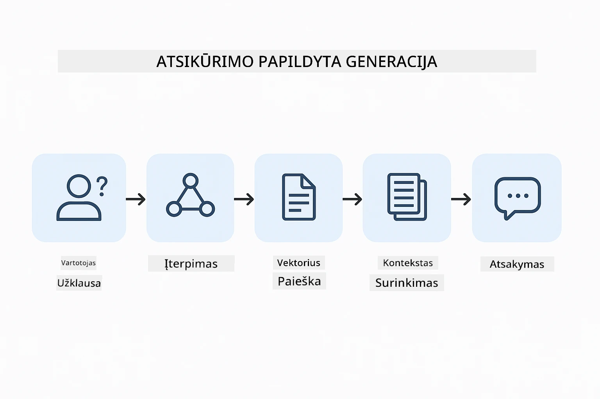
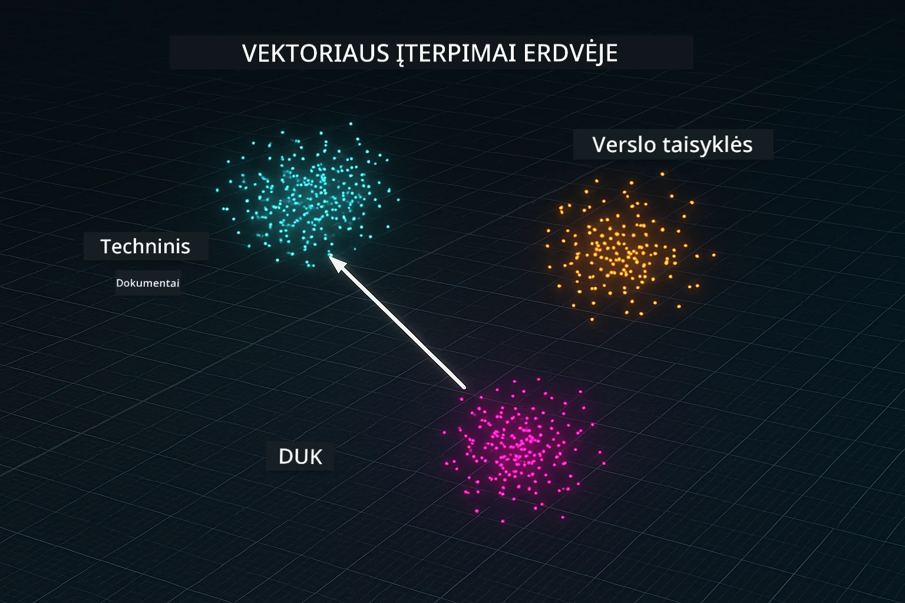
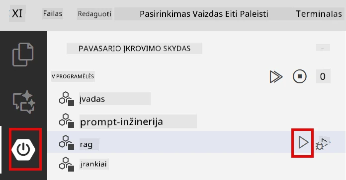
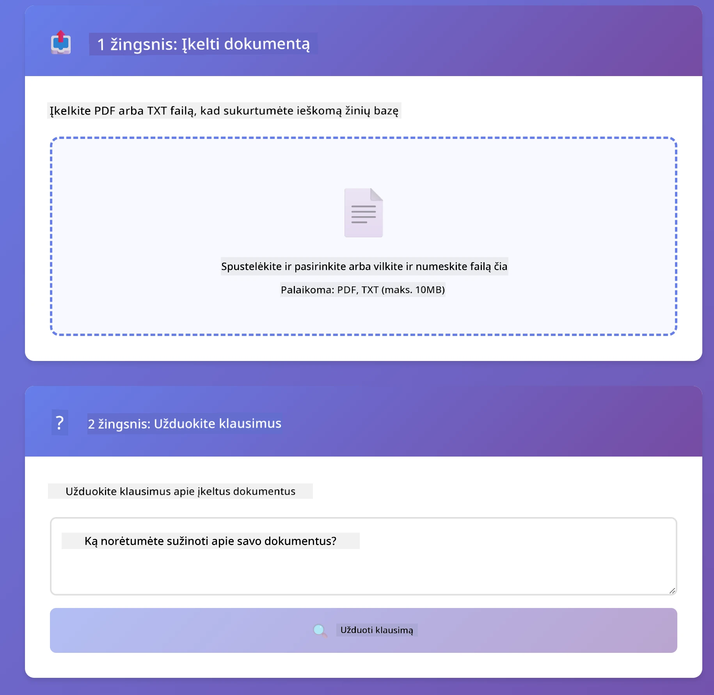
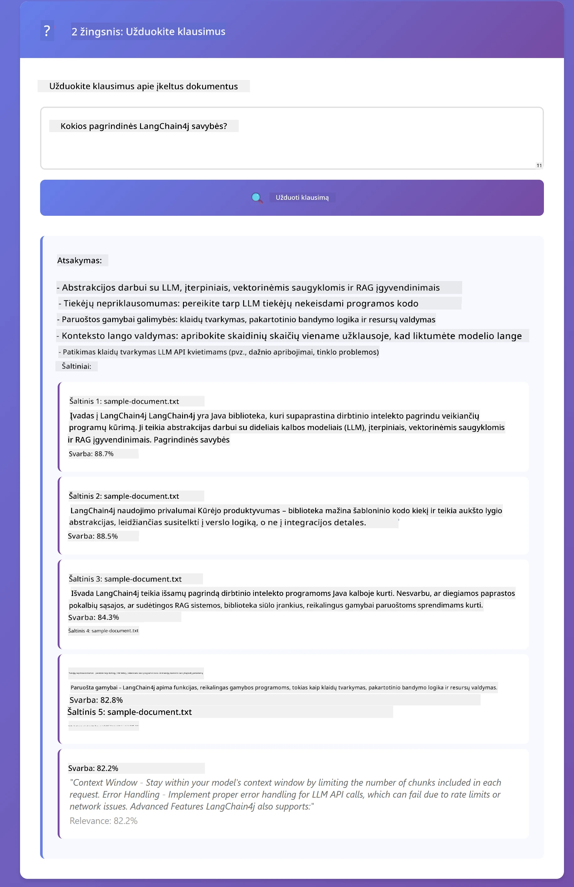

# Modulis 03: RAG (Retrieval-Augmented Generation)

## Turinys

- [Vaizdo įrašo vadovas](#vaizdo-įrašo-vadovas)
- [Ko Išmoksite](#ko-išmoksite)
- [Išankstiniai reikalavimai](#išankstiniai-reikalavimai)
- [RAG Suvokimas](#rag-suvokimas)
  - [Kuri RAG Požiūrį Naudoja Šis Vadovėlis?](#kuri-rag-požiūrį-naudoja-šis-vadovėlis)
- [Kaip Tai Veikia](#kaip-tai-veikia)
  - [Dokumento Apdorojimas](#dokumento-apdorojimas)
  - [Įterpimų Kūrimas](#įterpimų-kūrimas)
  - [Semantinė Paieška](#semantinė-paieška)
  - [Atsakymo Generavimas](#atsakymo-generavimas)
- [Paleiskite Programą](#programos-paleidimas)
- [Programos Naudojimas](#programos-naudojimas)
  - [Įkelti Dokumentą](#dokumento-įkėlimas)
  - [Užduoti Klausimus](#užduokite-klausimus)
  - [Patikrinti Šaltinių Nuorodas](#patikrinkite-šaltinių-nuorodas)
  - [Eksperimentuoti su Klausimais](#eksperimentuokite-su-klausimais)
- [Svarbios Sąvokos](#pagrindinės-sąvokos)
  - [Skirsniavimo Strategija](#ištraukų-skaidymo-strategija)
  - [Panašumo Įvertinimai](#panašumo-balai)
  - [Atminties Saugojimas](#atminties-naudojimas)
  - [Konteksto Langų Valdymas](#konteksto-lango-valdymas)
- [Kada RAG Yra Svarbus](#kada-rag-yra-svarbus)
- [Kiti Žingsniai](#tolimesni-žingsniai)

## Vaizdo įrašo vadovas

Žiūrėkite šią tiesioginę sesiją, kurioje paaiškinama, kaip pradėti darbą su šiuo moduliu:

<a href="https://www.youtube.com/watch?v=_olq75ZH_eY"></a>

## Ko Išmoksite

Ankstesniuose moduliuose išmokote kaip bendrauti su DI ir efektyviai struktūruoti užklausas. Tačiau yra esminė apribojimas: kalbos modeliai žino tik tai, ką išmoko treniravimo metu. Jie negali atsakyti į klausimus apie jūsų įmonės politiką, jūsų projekto dokumentaciją ar bet kokią informaciją, kurios nebuvo mokomi.

RAG (Retrieval-Augmented Generation) išsprendžia šią problemą. Vietoj to, kad bandytumėte mokyti modelį jūsų informacijos (kas yra brangu ir nepraktiška), jūs suteikiate jam galimybę ieškoti per jūsų dokumentus. Kai kas nors užduoda klausimą, sistema suranda svarbią informaciją ir įtraukia ją į užklausą. Modelis tada atsako remdamasis šiuo paimtu kontekstu.

Galvokite apie RAG kaip apie tai, kad modelis gauna nuorodų biblioteką. Kai užduodate klausimą, sistema:

1. **Vartotojo Užklausa** – jūs užduodate klausimą  
2. **Įterpimas** – jūsų klausimas virsta vektoriumi  
3. **Vektorinė Paieška** – randami panašūs dokumentų skirsniai  
4. **Konteksto Surinkimas** – pridėti svarbūs skirsniai į užklausą  
5. **Atsakymas** – LLM generuoja atsakymą remdamasis kontekstu  

Tai pagrindžia modelio atsakymus jūsų faktais, o ne pasikliauja jo treniravimo žiniomis ar sugalvotais atsakymais.

## Išankstiniai reikalavimai

- Baigtas [Modulis 01 - Įvadas](../01-introduction/README.md) (įdiegti Azure OpenAI ištekliai, įskaitant `text-embedding-3-small` įterpimo modelį)  
- `.env` failas projekto šaknyje su Azure kredencialais (sukurtas komandą `azd up` modulyje 01)  

> **Pastaba:** Jei dar neužbaigėte Modulio 01, pirmiausia sekite ten esančias diegimo instrukcijas. Komanda `azd up` įdiegia tiek GPT pokalbių modelį, tiek įterpimo modelį, kurį naudoja šis modulis.

## RAG Suvokimas

Žemiau pateiktas diagramas iliustruoja pagrindinę idėją: vietoj to, kad pasikliautume tik modelio treniravimo duomenimis, RAG suteikia jam nuorodų biblioteką iš jūsų dokumentų, kad jis pasitikrintų prieš generuodamas atsakymą.


*Ši diagrama vaizduoja skirtumą tarp standartinio LLM (kuris spėlioja remdamasis treniravimo duomenimis) ir RAG patobulinto LLM (kuris pirmiausia pasitikrina jūsų dokumentus).*

Štai kaip komponentai yra sujungti per visą procesą. Vartotojo klausimas teka per keturis etapus – įterpimą, vektorinę paiešką, konteksto sudarymą ir atsakymo generavimą – kiekvienas statomas ant ankstesnio:



*Ši diagrama rodo end-to-end RAG procesą — vartotojo užklausa praeina per įterpimą, vektorinę paiešką, konteksto sudarymą ir atsakymo generavimą.*

Likusi modulio dalis išsamiai paaiškina kiekvieną etapą su kodu, kurį galite paleisti ir modifikuoti.

### Kuri RAG Požiūrį Naudoja Šis Vadovėlis?

LangChain4j siūlo tris būdus įgyvendinti RAG, kiekvienas su skirtingu abstrakcijos lygiu. Žemiau pateikta diagrama palygina juos šalia vienas kito:


*Ši diagrama palygina tris LangChain4j RAG požiūrius – Easy, Native ir Advanced – rodydama jų pagrindinius komponentus ir kada naudoti kiekvieną.*

| Požiūris | Ką Atlieka | Kompromisas |
|---|---|---|
| **Easy RAG** | Automatiškai apjungia viską per `AiServices` ir `ContentRetriever`. Aprašo sąsają, prideda paieškos įrankį ir LangChain4j užkulisiuose tvarko įterpimą, paiešką ir užklausos sudarymą. | Minimalus kodas, bet nematote, kas dedasi kiekviename žingsnyje. |
| **Native RAG** | Jūs tiesiogiai kviečiate įterpimo modelį, ieškote saugykloje, statote užklausą ir generuojate atsakymą — žingsnis po žingsnio. | Daugiau kodo, bet kiekvienas etapas matomas ir modifikuojamas. |
| **Advanced RAG** | Naudoja `RetrievalAugmentor` sistemą su integruojamais užklausų transformatoriais, maršrutizatoriais, reitinguotojais ir turinio injektoriais gamybinėms grandinėms. | Maksimali lankstumas, tačiau žymiai sudėtingesnė sistema. |

**Šis vadovėlis naudoja Native požiūrį.** Kiekvienas RAG proceso žingsnis – užklausos įterpimas, paieška vektoriniame saugykloje, konteksto sudarymas ir atsakymo generavimas – yra aiškiai parašyti faile [`RagService.java`](../../../03-rag/src/main/java/com/example/langchain4j/rag/service/RagService.java). Tai sąmoningas sprendimas: mokymo tikslais svarbiau, kad matytumėte ir suprastumėte kiekvieną etapą, nei kad kodas būtų maksimaliai sutrumpintas. Kai suprasite procesą, galėsite pereiti prie Easy RAG greitiems prototipams arba Advanced RAG gamybiniams sprendimams.

> **💡 Domina Easy RAG?** LangChain4j taip pat suteikia *Easy RAG* požiūrį, kur `AiServices` ir `ContentRetriever` automatiškai tvarko įterpimą, paiešką ir užklausos sudarymą. Šis modulis eina tiesesniu – išardantis procesą, kad matytumėte ir kontroliuotumėte kiekvieną etapą patys.

Žemiau pateikta schema parodo Easy RAG grandinę. Atkreipkite dėmesį, kaip `AiServices` ir `EmbeddingStoreContentRetriever` paslepia visą sudėtingumą – jūs įkeliat dokumentą, prijungiat paieškos įrankį ir gaunate atsakymus. Native požiūris šiame modulyje sulaužo šiuos paslėptus žingsnius:


*Ši diagrama rodo Easy RAG grandinę. Palyginkite su Native požiūriu, kuris naudojamas šiame modulyje: Easy RAG paslepia įterpimą, paiešką ir užklausos sudarymą už `AiServices` ir `ContentRetriever` — jūs įkeliat dokumentą, prijungiat ieškiklį ir gaunate atsakymus. Native požiūris šiuo moduliu atveria šią grandinę, todėl patys kviečiate kiekvieną etapą (įterpimas, paieška, konteksto sudarymas, generavimas) – suteikdamas visišką matomumą ir kontrolę.*

## Kaip Tai Veikia

Šio modulio RAG grandinė suskaidoma į keturis etapus, kurie vykdomi iš eilės kiekvieną kartą, kai vartotojas užduoda klausimą. Pirmiausia įkeliamas dokumentas yra **nuskaitomas ir skaidomas** į valdomus gabalus. Tie gabalai tada paverčiami į **vektorinius įterpimus** ir saugomi, kad būtų galima matematiškai lyginti. Kai atvyksta užklausa, sistema atlieka **semantinę paiešką** surasti labiausiai susijusius gabalus, galiausiai perduodama juos kaip kontekstą LLM atsakymo **generavimui**. Žemiau pateiktose sekcijose praeisime per kiekvieną etapą su tikru kodu ir diagramomis. Pažiūrėkime pirmą veiksmą.

### Dokumento Apdorojimas

[DocumentService.java](../../../03-rag/src/main/java/com/example/langchain4j/rag/service/DocumentService.java)

Kai įkeliate dokumentą, sistema jį parsiunčia (PDF ar paprasto teksto formatu), prideda metaduomenis, tokius kaip failo pavadinimas, ir tada suskaido į gabalus – mažesnes dalis, kurios patogiai telpa modelio konteksto lange. Šie gabalai šiek tiek persidengia, kad neprarastumėte konteksto kraštuose.

```java
// Išanalizuokite įkeltą failą ir įvyniokite jį į LangChain4j dokumentą
Document document = Document.from(content, metadata);

// Padalykite į 300 ženklų dalis su 30 ženklų persidengimu
DocumentSplitter splitter = DocumentSplitters
    .recursive(300, 30);

List<TextSegment> segments = splitter.split(document);
```

Žemiau pateikta diagrama vizualiai parodo, kaip tai veikia. Atkreipkite dėmesį, kaip kiekvienas gabalas dalijasi dalimi žodžių su kaimynais – 30 žodžių persidengimas užtikrina, kad svarbus kontekstas nepraslystų per plyšius:


*Ši diagrama parodo, kaip dokumentas skaidomas į 300 žodžių gabalus su 30 žodžių persidengimu, išlaikant kontekstą gabalų ribose.*

> **🤖 Išbandykite su [GitHub Copilot](https://github.com/features/copilot) Pokalbių:** Atidarykite [`DocumentService.java`](../../../03-rag/src/main/java/com/example/langchain4j/rag/service/DocumentService.java) ir paklauskite:  
> - "Kaip LangChain4j skaido dokumentus į gabalus ir kodėl persidengimas svarbus?"  
> - "Koks yra optimalus gabalo dydis skirtingiems dokumentų tipams ir kodėl?"  
> - "Kaip tvarkyti dokumentus keliomis kalbomis arba su specialiu formatavimu?"

### Įterpimų Kūrimas

[LangChainRagConfig.java](../../../03-rag/src/main/java/com/example/langchain4j/rag/config/LangChainRagConfig.java)

Kiekvienas gabalas paverčiamas į skaitmeninį atvaizdą, vadinamą įterpimu – iš esmės tai pašnekovo „prasmės į skaičius“ konverteris. Įterpimo modelis nėra „protingas“ kaip pokalbių modelis; jis negali vykdyti nurodymų, mąstyti ar atsakyti į klausimus. Jis tik įžemina tekstą į matematinę erdvę, kur panašios prasmės dedamos arti viena kitos – „automobilis“ arti „mašina“, „grąžinimo politika“ arti „sugrąžink pinigus“. Galvokite apie pokalbių modelį kaip asmenį, su kuriuo galite kalbėtis; o įterpimo modelis yra itin geras archyvų tvarkytojas.

Žemiau pateikta diagrama vizualizuoja šią sąvoką – tekstas patenka vidun, išeina skaitmeniniai vektoriai, o panašios prasmės sukurią artimus vektorius:


*Ši diagrama rodo, kaip įterpimo modelis paverčia tekstą į skaitmeninius vektorius, sudėdamas panašios prasmės – pvz., „automobilis“ ir „mašina“ – arti vienas kito vektorių erdvėje.*

```java
@Bean
public EmbeddingModel embeddingModel() {
    return OpenAiOfficialEmbeddingModel.builder()
        .baseUrl(azureOpenAiEndpoint)
        .apiKey(azureOpenAiKey)
        .modelName(azureEmbeddingDeploymentName)
        .build();
}

EmbeddingStore<TextSegment> embeddingStore = 
    new InMemoryEmbeddingStore<>();
```

Klasės diagrama žemiau parodo dvi atskiras RAG grandinės srautus ir LangChain4j klases, kurios juos įgyvendina. **Įvedimo srautas** (vyksta vieną kartą įkeliant dokumentą) skaido dokumentą, įterpia gabalus ir saugo per `.addAll()`. **Užklausos srautas** (vyksta kiekvieną kartą, kai užduodamas klausimas) įterpia užklausą, ieško saugykloje per `.search()`, ir perduoda surinktą kontekstą pokalbių modeliui. Abu srautai susijungia bendroje `EmbeddingStore<TextSegment>` sąsajoje:


*Ši diagrama rodo dvi RAG grandinės srautus – įvedimą ir užklausą – ir kaip jie jungiasi per bendrą EmbeddingStore.*

Kai įterpimai yra saugomi, panašus turinys natūraliai klasterizuojasi vektorinėje erdvėje. Žemiau pateikta vizualizacija rodo, kaip susiję dokumentai tampa artimais taškais, kas leidžia atlikti semantinę paiešką:



*Ši vizualizacija parodo, kaip susiję dokumentai grupuojasi 3D vektorinėje erdvėje, kur temos kaip Techniniai Dokumentai, Verslo Taisyklės ir DUK sudaro atskirus klasterius.*

Kai vartotojas ieško, sistema vykdo keturis veiksmus: vieną kartą įterpia dokumentus, kiekvieną paiešką įterpia užklausą, lygina užklausos vektorių su visais saugomais vektoriais naudodama kosinuso panašumo matą ir grąžina top-K aukščiausio įvertinimo gabalus. Žemiau pateikta diagrama demonstruoja kiekvieną žingsnį ir susijusias LangChain4j klases:


*Ši diagrama rodo keturių žingsnių įterpimo paieškos procesą: įterpti dokumentus, įterpti užklausą, palyginti vektorius naudojant kosinuso panašumą ir grąžinti top-K rezultatus.*

### Semantinė Paieška

[RagService.java](../../../03-rag/src/main/java/com/example/langchain4j/rag/service/RagService.java)

Kai užduodate klausimą, jūsų klausimas taip pat virsta įterpimu. Sistema lygina jūsų klausimo įterpimą su visais dokumentų gabalų įterpimais. Ji suranda gabalus su labiausiai panašiomis prasmėmis – ne tik pagal atitinkančius raktinius žodžius, bet tikrą semantinį panašumą.

```java
Embedding queryEmbedding = embeddingModel.embed(question).content();

EmbeddingSearchRequest searchRequest = EmbeddingSearchRequest.builder()
    .queryEmbedding(queryEmbedding)
    .maxResults(5)
    .minScore(0.5)
    .build();

EmbeddingSearchResult<TextSegment> searchResult = embeddingStore.search(searchRequest);
List<EmbeddingMatch<TextSegment>> matches = searchResult.matches();

for (EmbeddingMatch<TextSegment> match : matches) {
    String relevantText = match.embedded().text();
    double score = match.score();
}
```

Diagrama žemiau lygina semantinę paiešką su tradicine raktinių žodžių paieška. Raktinių žodžių paieška „transporto priemonė“ nepaiso gabalo apie „automobilius ir sunkvežimius“, tačiau semantinė paieška supranta, kad tai tas pats dalykas ir grąžina ją kaip aukštos kokybės atitikmenį:


*Ši diagrama lygina raktinių žodžių paiešką su semantine paieška, rodydama, kaip semantinė paieška suranda konceptualiai susijusį turinį net jei raktiniai žodžiai nesutampa.*

Po gaubtu, panašumas matuojamas naudojant kosinuso panašumą – iš esmės klausiama „ar šie du strėlytės rodo ta pačia kryptimi?“ Du gabalai gali naudoti visiškai skirtingus žodžius, bet jei reiškia tą patį dalyką, jų vektoriai rodo tokia pačia kryptimi ir įvertinami artimai 1.0:


*Ši schema iliustruoja kosinuso panašumą kaip kampą tarp įterptinių vektorių — kuo vektoriai labiau suderinti, tuo jų rezultatas arčiau 1.0, rodantis didesnį semantinį panašumą.*

> **🤖 Išbandykite su [GitHub Copilot](https://github.com/features/copilot) Chat:** Atverkite [`RagService.java`](../../../03-rag/src/main/java/com/example/langchain4j/rag/service/RagService.java) ir paklauskite:
> - „Kaip veikia panašumo paieška su įterpimais ir kas lemia balą?“
> - „Kokį panašumo slenkstį turėčiau naudoti ir kaip tai veikia rezultatus?“
> - „Kaip elgtis, kai nerandama susijusių dokumentų?“

### Atsakymo generavimas

[RagService.java](../../../03-rag/src/main/java/com/example/langchain4j/rag/service/RagService.java)

Svarbiausios ištraukos surenkamos į struktūruotą užklausos šabloną, kuriame pateikiamos aiškios instrukcijos, gauta konteksto informacija ir vartotojo klausimas. Modelis skaito tik šias konkrečias ištraukas ir remiasi šiomis žiniomis — jis gali naudoti tik tai, kas yra priešais, kas padeda išvengti klaidų.

```java
String context = matches.stream()
    .map(match -> match.embedded().text())
    .collect(Collectors.joining("\n\n"));

String prompt = String.format("""
    Answer the question based on the following context.
    If the answer cannot be found in the context, say so.

    Context:
    %s

    Question: %s

    Answer:""", context, request.question());

String answer = chatModel.chat(prompt);
```

Žemiau pateikta schema demonstruoja šį surinkimą — aukščiausiai įvertintos ištraukos iš paieškos žingsnio įdedamos į užklausos šabloną, o `OpenAiOfficialChatModel` generuoja pagrįstą atsakymą:


*Ši schema rodo, kaip aukščiausiai įvertintos ištraukos surenkamos į struktūruotą užklausą, leidžiančią modeliui generuoti pagrįstą atsakymą iš jūsų duomenų.*

## Programos paleidimas

**Patikrinkite diegimą:**

Įsitikinkite, kad .env failas yra pagrindiniame kataloge su Azure kredencialais (sukurtais 1 modulyje). Paleiskite tai module kataloge (`03-rag/`):

**Bash:**
```bash
cat ../.env  # Turėtų rodyti AZURE_OPENAI_ENDPOINT, API_KEY, DEPLOYMENT
```

**PowerShell:**
```powershell
Get-Content ..\.env  # Turėtų parodyti AZURE_OPENAI_ENDPOINT, API_KEY, DEPLOYMENT
```

**Paleiskite programą:**

> **Pastaba:** Jei jau paleidote visas programas naudodami `./start-all.sh` pagrindiniame kataloge (kaip aprašyta 1 modulyje), šis modulis jau veikia prievade 8081. Galite praleisti paleidimo komandas žemiau ir tiesiogiai pereiti į http://localhost:8081.

**1 variantas: naudojant Spring Boot Dashboard (Rekomenduojama VS Code naudotojams)**

Dev container yra Spring Boot Dashboard plėtinys, kuris suteikia vizualią sąsają valdyti visas Spring Boot programas. Jį rasite kairėje pusėje esančioje veiklos juostoje VS Code (ieškokite Spring Boot ikonos).

Iš Spring Boot Dashboard galite:
- Matyti visas darbo vietoje esančias Spring Boot programas
- Vienu paspaudimu paleisti/stabdyti programas
- Realiai stebėti programų žurnalus
- Kontroliuoti programų būseną

Paprastai spustelėkite paleidimo mygtuką šalia „rag“, kad paleistumėte šį modulį arba paleiskite visus modulius vienu metu.



*Šis ekrano vaizdas rodo Spring Boot Dashboard VS Code, kur galite vizualiai paleisti, sustabdyti ir stebėti programas.*

**2 variantas: naudojant shell skriptus**

Paleiskite visas žiniatinklio programas (1–4 moduliai):

**Bash:**
```bash
cd ..  # Iš pagrindinio katalogo
./start-all.sh
```

**PowerShell:**
```powershell
cd ..  # Iš šakninių katalogų
.\start-all.ps1
```

Arba paleiskite tik šį modulį:

**Bash:**
```bash
cd 03-rag
./start.sh
```

**PowerShell:**
```powershell
cd 03-rag
.\start.ps1
```

Abu skriptai automatiškai įkrauna aplinkos kintamuosius iš pagrindinio .env failo ir sukurs JAR failus, jei jų nėra.

> **Pastaba:** Jei norite visus modulius sukompiliuoti rankiniu būdu prieš paleidžiant:
>
> **Bash:**
> ```bash
> cd ..  # Go to root directory
> mvn clean package -DskipTests
> ```
>
> **PowerShell:**
> ```powershell
> cd ..  # Go to root directory
> mvn clean package -DskipTests
> ```

Atidarykite naršyklėje http://localhost:8081.

**Norint sustabdyti:**

**Bash:**
```bash
./stop.sh  # Tik šis modulis
# Arba
cd .. && ./stop-all.sh  # Visi moduliai
```

**PowerShell:**
```powershell
.\stop.ps1  # Tik šis modulis
# Arba
cd ..; .\stop-all.ps1  # Visi moduliai
```

## Programos naudojimas

Programa suteikia internetinę sąsają dokumentų įkėlimui ir klausimams užduoti.

<a href="images/rag-homepage.png"></a>

*Šiame ekrano vaizde matoma RAG programos sąsaja, kur įkeliate dokumentus ir užduodate klausimus.*

### Dokumento įkėlimas

Pradėkite įkeldami dokumentą – TXT failai geriausiai tinka testavimui. Šiame kataloge pateiktas `sample-document.txt`, kuriame yra informacija apie LangChain4j funkcijas, RAG įgyvendinimą ir geriausias praktikas – puiku sistemos testavimui.

Sistema apdoroja jūsų dokumentą, suskaido jį į ištraukas ir sukuria įterpimus kiekvienai ištrauka. Tai vyksta automatiškai įkeliant.

### Užduokite klausimus

Dabar užduokite specifinius klausimus apie dokumentą. Išbandykite faktinius dalykus, aiškiai išdėstytus dokumente. Sistema ieško tinkamų ištraukų, įtraukia jas į užklausą ir generuoja atsakymą.

### Patikrinkite šaltinių nuorodas

Pastebėsite, kad kiekviename atsakyme yra šaltinių nuorodos su panašumo balais. Šie balai (nuo 0 iki 1) parodo, kiek kiekviena ištrauka buvo susijusi su jūsų klausimu. Aukštesni balai reiškia geresnį atitikimą. Tai leidžia patikrinti atsakymą pagal šaltinį.

<a href="images/rag-query-results.png"></a>

*Šis ekrano vaizdas rodo užklausos rezultatus su sugeneruotu atsakymu, šaltinių nuorodomis ir svarbos balais kiekvienai gautai ištraukai.*

### Eksperimentuokite su klausimais

Išbandykite skirtingus klausimų tipus:
- Konkretūs faktai: „Kokia pagrindinė tema?“
- Palyginimai: „Kuo skiriasi X ir Y?“
- Santraukos: „Apibendrinkite svarbiausius Z aspektus“

Sekite, kaip svarbos balai keičiasi, priklausomai nuo to, kaip gerai jūsų klausimas atitinka dokumentą.

## Pagrindinės sąvokos

### Ištraukų skaidymo strategija

Dokumentai skaidomi į 300 žodžių ištraukas su 30 žodžių persidengimu. Toks balansas užtikrina, kad kiekviena ištrauka turėtų pakankamai konteksto, kad būtų prasminga, ir išliktų pakankamai maža, kad kelios ištraukos tilptų užklausoje.

### Panašumo balai

Kiekviena gauta ištrauka turi panašumo balą nuo 0 iki 1, rodantį, kaip tiksliai atitinka vartotojo klausimą. Žemiau pateikta schema vizualizuoja balų diapazonus ir kaip sistema juos naudoja rezultatų filtravimui:


*Ši schema rodo balų intervalo diapazonus nuo 0 iki 1, su minimaliu slenksčiu 0.5, kuris filtruoja nereikšmingas ištraukas.*

Balai svyruoja nuo 0 iki 1:
- 0.7–1.0: Labai svarbu, tikslus atitikimas
- 0.5–0.7: Svarbu, geras kontekstas
- Mažiau nei 0.5: Filtruojama, pernelyg nesutampa

Sistema renka tik ištraukas, turinčias balą virš minimalaus slenksčio, užtikrindama kokybę.

Įterpimai veikia gerai, kai prasmės klasteriai aiškūs, tačiau turi ribotumų. Žemiau schema rodo dažniausias klaidų formas — per didelės ištraukos kuria neaiškius vektorius, per mažos ištraukos neturi konteksto, dviprasmiški terminai rodo į kelis klasterius, o tikslūs paieškos atitikimai (ID, dalių numeriai) visai neveikia su įterpimais:


*Ši schema rodo dažniausias įterpimų klaidų formas: per didelės ištraukos, per mažos ištraukos, dviprasmiški terminai rodo į kelis klasterius ir tikslūs paieškos atitikimai, pavyzdžiui ID.*

### Atminties naudojimas

Šis modulis naudoja atminties saugyklą dėl paprastumo. Perkraunant programą įkelti dokumentai prarandami. Produkcijos sistemose naudojamos nuolatinės vektorinių duomenų bazės, pavyzdžiui, Qdrant arba Azure AI Search.

### Konteksto lango valdymas

Kiekvienas modelis turi maksimalų konteksto langą. Negalite įtraukti kiekvienos ištraukos iš didelio dokumento. Sistema gauna viršutinius N svarbiausių ištraukų (pagal numatytuosius nustatymus 5), kad tilptų į ribas ir suteiktų pakankamai konteksto tiksliems atsakymams.

## Kada RAG yra svarbus

RAG ne visada yra tinkamiausias pasirinkimas. Žemiau pateiktas sprendimų vadovas padeda nuspręsti, kada RAG prideda vertės, o kada paprastesni metodai — pavyzdžiui, tiesiog įtraukti turinį į užklausą ar pasikliauti modelio įmontuotomis žiniomis — yra pakankami:


*Ši schema rodo sprendimų vadovą, kada RAG prideda vertės, o kada pakanka paprastesnių metodų.*

## Tolimesni žingsniai

**Kitas modulis:** [04-tools - AI agentai su įrankiais](../04-tools/README.md)

---

**Naršymas:** [← Ankstesnis: 02 modulis - Užklausų kūrimas](../02-prompt-engineering/README.md) | [Atgal į pagrindinį](../README.md) | [Kitas: 04 modulis - Įrankiai →](../04-tools/README.md)

---

<!-- CO-OP TRANSLATOR DISCLAIMER START -->
**Atsakomybės apribojimas**:
Šis dokumentas buvo išverstas naudojant dirbtinio intelekto vertimo paslaugą [Co-op Translator](https://github.com/Azure/co-op-translator). Nors siekiame tikslumo, prašome atkreipti dėmesį, kad automatiniai vertimai gali turėti klaidų ar netikslumų. Originalus dokumentas jo gimtąja kalba laikomas autoritetingu šaltiniu. Svarbiai informacijai rekomenduojama naudoti profesionalų žmogiškąjį vertimą. Mes neatsakome už jokius nesusipratimus ar neteisingą interpretaciją, kilusią naudojantis šiuo vertimu.
<!-- CO-OP TRANSLATOR DISCLAIMER END -->