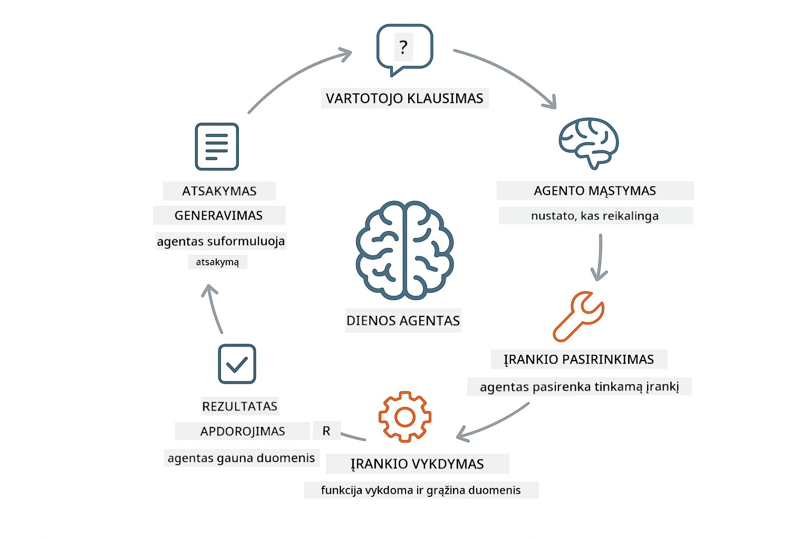
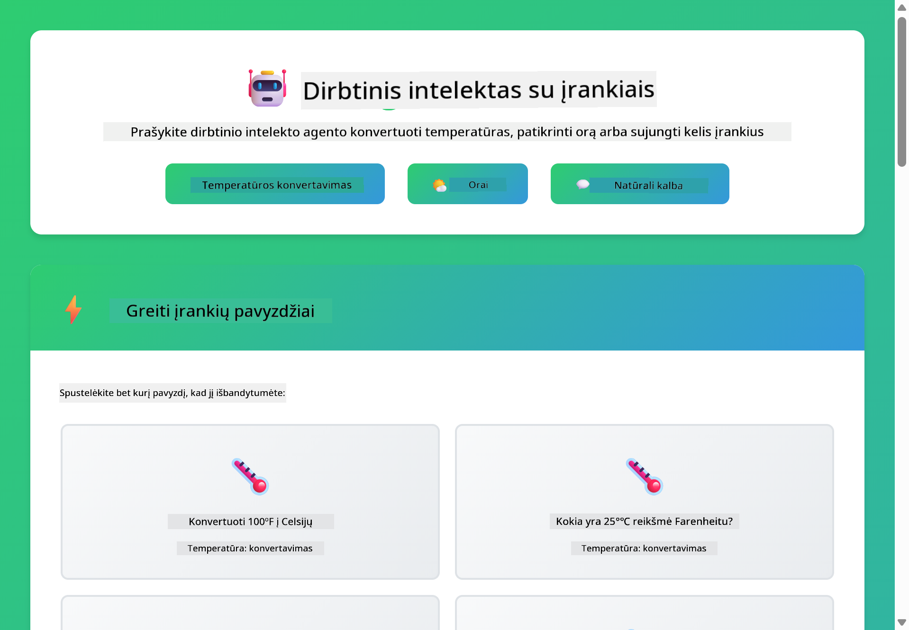

<!--
CO_OP_TRANSLATOR_METADATA:
{
  "original_hash": "13ec450c12cdd1a863baa2b778f27cd7",
  "translation_date": "2025-12-31T06:40:10+00:00",
  "source_file": "04-tools/README.md",
  "language_code": "lt"
}
-->
# Modulis 04: AI agentai su įrankiais

## Turinys

- [Ko išmoksite](../../../04-tools)
- [Prieš sąlygos](../../../04-tools)
- [AI agentų su įrankiais supratimas](../../../04-tools)
- [Kaip veikia įrankių kvietimas](../../../04-tools)
  - [Įrankių apibrėžimai](../../../04-tools)
  - [Sprendimų priėmimas](../../../04-tools)
  - [Vykdymas](../../../04-tools)
  - [Atsakymo generavimas](../../../04-tools)
- [Įrankių grandinimas](../../../04-tools)
- [Paleiskite programą](../../../04-tools)
- [Programos naudojimas](../../../04-tools)
  - [Išbandykite paprastą įrankio naudojimą](../../../04-tools)
  - [Išbandykite įrankių grandinavimą](../../../04-tools)
  - [Peržiūrėkite pokalbio eigą](../../../04-tools)
  - [Stebėkite samprotavimą](../../../04-tools)
  - [Eksperimentuokite su skirtingais prašymais](../../../04-tools)
- [Pagrindinės sąvokos](../../../04-tools)
  - [ReAct modelis (samprotavimas ir veikimas)](../../../04-tools)
  - [Įrankių aprašymai yra svarbūs](../../../04-tools)
  - [Sesijų valdymas](../../../04-tools)
  - [Klaidų tvarkymas](../../../04-tools)
- [Galimi įrankiai](../../../04-tools)
- [Kada naudoti agentus su įrankiais](../../../04-tools)
- [Kiti žingsniai](../../../04-tools)

## Ko išmoksite

Iki šiol išmokote bendrauti su dirbtiniu intelektu, efektyviai struktūruoti užklausas ir pririšti atsakymus prie savo dokumentų. Tačiau vis dar egzistuoja esminis apribojimas: kalbos modeliai gali tik generuoti tekstą. Jie negali patikrinti oro sąlygų, atlikti skaičiavimų, užklausinėti duomenų bazių ar sąveikauti su išorinėmis sistemomis.

Įrankiai tai pakeičia. Pateikdami modeliui prieigą prie funkcijų, kurias jis gali kviesti, paverčiate jį iš teksto generatoriaus į agentą, galintį atlikti veiksmus. Modelis nusprendžia, kada jam reikalingas įrankis, kurį įrankį naudoti ir kokius parametrus perduoti. Jūsų kodas vykdo funkciją ir grąžina rezultatą. Modelis įtraukia tą rezultatą į savo atsakymą.

## Prieš sąlygos

- Baigtas Modulis 01 (Azure OpenAI ištekliai įdiegti)
- `.env` failas projekto šakninėje direktorijoje su Azure prisijungimo duomenimis (sukurtas komandą `azd up` Modulyje 01)

> **Pastaba:** Jei dar nepabaigėte Modulio 01, pirmiausia atlikite ten pateiktas diegimo instrukcijas.

## AI agentų su įrankiais supratimas

> **📝 Pastaba:** Šiame modulyje terminas „agentai“ reiškia DI asistentus, patobulintus su įrankių kvietimo galimybėmis. Tai skiriasi nuo **Agentic AI** modelių (autonominiai agentai su planavimu, atmintimi ir daugiažingsniu samprotavimu), kuriuos aptarsime [Modulyje 05: MCP](../05-mcp/README.md).

AI agentas su įrankiais seka samprotavimo ir veikimo modelį (ReAct):

1. Vartotojas užduoda klausimą
2. Agentas samprotauja, ko jam reikia sužinoti
3. Agentas nusprendžia, ar jam reikia įrankio atsakymui pateikti
4. Jei taip, agentas kviečia tinkamą įrankį su tais parametrais
5. Įrankis vykdo užklausą ir grąžina duomenis
6. Agentas įtraukia rezultatą ir pateikia galutinį atsakymą



*ReAct modelis – kaip DI agentai keičiasi tarp samprotavimo ir veikimo, spręsdami problemas*

Tai įvyksta automatiškai. Jūs apibrėžiate įrankius ir jų aprašymus. Modelis priima sprendimus, kada ir kaip juos naudoti.

## Kaip veikia įrankių kvietimas

**Įrankių apibrėžimai** - [WeatherTool.java](../../../04-tools/src/main/java/com/example/langchain4j/agents/tools/WeatherTool.java) | [TemperatureTool.java](../../../04-tools/src/main/java/com/example/langchain4j/agents/tools/TemperatureTool.java)

Jūs apibrėžiate funkcijas su aiškiais aprašymais ir parametrų specifikacijomis. Modelis mato šiuos aprašymus savo sistemos užklausoje ir supranta, ką kiekvienas įrankis daro.

```java
@Component
public class WeatherTool {
    
    @Tool("Get the current weather for a location")
    public String getCurrentWeather(@P("Location name") String location) {
        // Jūsų orų paieškos logika
        return "Weather in " + location + ": 22°C, cloudy";
    }
}

@AiService
public interface Assistant {
    String chat(@MemoryId String sessionId, @UserMessage String message);
}

// Asistentas automatiškai sujungiamas Spring Boot su:
// - ChatModel bean
// - Visos @Tool metodai iš @Component klasių
// - ChatMemoryProvider sesijų valdymui
```

> **🤖 Išbandykite su [GitHub Copilot](https://github.com/features/copilot) Chat:** Atidarykite [`WeatherTool.java`](../../../04-tools/src/main/java/com/example/langchain4j/agents/tools/WeatherTool.java) ir paklauskite:
> - "Kaip integruočiau tikrą orų API, pvz., OpenWeatherMap, vietoje imituojamų duomenų?"
> - "Kas yra geras įrankio aprašymas, kuris padeda DI teisingai jį naudoti?"
> - "Kaip valdyti API klaidas ir užklausų limitus įrankio įgyvendinime?"

**Sprendimų priėmimas**

Kai vartotojas klausia „Koks oras Sietle?“, modelis atpažįsta, kad jam reikia orų įrankio. Jis sugeneruoja funkcijos kvietimą su parametro location reikšme "Seattle".

**Vykdymas** - [AgentService.java](../../../04-tools/src/main/java/com/example/langchain4j/agents/service/AgentService.java)

Spring Boot automatiškai įveda deklaratyvų `@AiService` sąsają su visais užregistruotais įrankiais, o LangChain4j automatiškai vykdo įrankių kvietimus.

> **🤖 Išbandykite su [GitHub Copilot](https://github.com/features/copilot) Chat:** Atidarykite [`AgentService.java`](../../../04-tools/src/main/java/com/example/langchain4j/agents/service/AgentService.java) ir paklauskite:
> - "Kaip veikia ReAct modelis ir kodėl jis efektyvus DI agentams?"
> - "Kaip agentas nusprendžia, kurį įrankį naudoti ir kokia tvarka?"
> - "Kas nutinka, jei įrankio vykdymas nepavyksta – kaip robustiškai tvarkyti klaidas?"

**Atsakymo generavimas**

Modelis gauna orų duomenis ir formatuoja juos natūralaus kalbėjimo atsakymui vartotojui.

### Kodėl naudoti deklaratyvias AI paslaugas?

Šis modulis naudoja LangChain4j integraciją su Spring Boot ir deklaratyvias `@AiService` sąsajas:

- **Spring Boot automatinis įvedimas** - ChatModel ir įrankiai įstatomi automatiškai
- **@MemoryId modelis** - Automatinis sesijomis pagrįstas atminties valdymas
- **Vienas instancijas** - Asistentas sukuriamas vieną kartą ir pakartotinai naudojamas geresniam našumui
- **Tipų saugus vykdymas** - Java metodai kviečiami tiesiogiai su tipų konversija
- **Daugiau žingsnių orkestracija** - Automatiškai valdo įrankių grandinavimą
- **Nulis boilerplate** - Nereikia rankinių AiServices.builder() kvietimų ar HashMap atminties

Alternatyvūs požiūriai (rankinis `AiServices.builder()`) reikalauja daugiau kodo ir praranda Spring Boot integracijos privalumus.

## Įrankių grandinavimas

**Įrankių grandinavimas** - DI gali kviesti kelis įrankius iš eilės. Paklauskite „Koks oras Sietle ir ar turėčiau neštis skėtį?“ ir stebėkite, kaip jis iš eilės kviečia `getCurrentWeather` ir samprotauja apie lietaus reikalingumą.

<a href="images/tool-chaining.png"></a>

*Eilės tvarka vykdomi įrankio kvietimai – vieno įrankio išvestis įtakoja kitą sprendimą*

**Gražiosios klaidos** - Paprašykite oro miesto, kurio nėra imituojamuose duomenyse. Įrankis grąžina klaidos pranešimą, o DI paaiškina, kad negali padėti. Įrankiai sugeda saugiai.

Tai įvyksta per vieną pokalbio ciklą. Agentas savarankiškai orkestruoja kelis įrankių kvietimus.

## Paleiskite programą

**Patikrinkite diegimą:**

Įsitikinkite, kad `.env` failas egzistuoja projekto šakniniame kataloge su Azure prisijungimo duomenimis (sukurtas Modulyje 01):
```bash
cat ../.env  # Turėtų rodyti AZURE_OPENAI_ENDPOINT, API_KEY, DEPLOYMENT
```

**Paleiskite programą:**

> **Pastaba:** Jei jau paleidote visas programas naudodami `./start-all.sh` iš Modulio 01, šiame modulyje jau veikia 8084 prievade. Galite praleisti žemiau esančias paleidimo komandas ir tiesiog nueiti į http://localhost:8084.

**1 variantas: naudoti Spring Boot valdymo skydelį (rekomenduojama VS Code naudotojams)**

Dev konteineryje yra Spring Boot Dashboard plėtinys, kuris suteikia vizualią sąsają visoms Spring Boot programoms valdyti. Jį rasite Activity Bar kairėje VS Code pusėje (ieškokite Spring Boot ikonos).

Iš Spring Boot Dashboard galite:
- Matyti visas prieinamas Spring Boot programas darbo aplinkoje
- Paleisti/stabdyti programas vienu paspaudimu
- Peržiūrėti programos žurnalus realiu laiku
- Stebėti programos būseną

Tiesiog spustelėkite paleidimo mygtuką šalia "tools", kad paleistumėte šį modulį, arba paleiskite visus modulius vienu metu.


**2 variantas: naudoti shell scenarijus**

Paleiskite visas žiniatinklio programas (moduliai 01–04):

**Bash:**
```bash
cd ..  # Iš šakninio katalogo
./start-all.sh
```

**PowerShell:**
```powershell
cd ..  # Iš šakninio katalogo
.\start-all.ps1
```

Arba paleiskite tik šį modulį:

**Bash:**
```bash
cd 04-tools
./start.sh
```

**PowerShell:**
```powershell
cd 04-tools
.\start.ps1
```

Abu scenarijai automatiškai įkelia aplinkos kintamuosius iš šakninio `.env` failo ir surenka JAR failus, jei jų nėra.

> **Pastaba:** Jei norite surinkti visus modulius rankiniu būdu prieš paleidžiant:
>
> **Bash:**
> ```bash
> cd ..  # Go to root directory
> mvn clean package -DskipTests
> ```
>
> **PowerShell:**
> ```powershell
> cd ..  # Go to root directory
> mvn clean package -DskipTests
> ```

Atidarykite http://localhost:8084 naršyklėje.

**Norint sustabdyti:**

**Bash:**
```bash
./stop.sh  # Tik šis modulis
# Arba
cd .. && ./stop-all.sh  # Visi moduliai
```

**PowerShell:**
```powershell
.\stop.ps1  # Tik šis modulis
# Arba
cd ..; .\stop-all.ps1  # Visi moduliai
```

## Programos naudojimas

Programa suteikia žiniatinklio sąsają, kurioje galite bendrauti su DI agentu, turinčiu prieigą prie orų ir temperatūros konvertavimo įrankių.

<a href="images/tools-homepage.png"></a>

*DI agento įrankių sąsaja – greiti pavyzdžiai ir pokalbio sąsaja įrankių naudojimui*

**Išbandykite paprastą įrankio naudojimą**

Pradėkite nuo paprasto prašymo: "Konvertuokite 100 laipsnių Farenheito į Celsijų". Agentas atpažins, kad reikia temperatūros konvertavimo įrankio, kvies jį su tinkamais parametrais ir pateiks rezultatą. Pastebėkite, koks natūralus jausmas – jūs nebuvo nurodę, kurį įrankį naudoti ar kaip jį kviesti.

**Išbandykite įrankių grandinavimą**

Dabar pabandykite kažką sudėtingesnio: "Koks oras Sietle ir konvertuokite jį į Farenheitą?" Stebėkite, kaip agentas tai atlieka etapais. Pirmiausia gauna orus (kurie pateikiami Celsijumi), atpažįsta, kad reikia konvertuoti į Farenheitą, kviečia konversijos įrankį ir sujungia abu rezultatus į vieną atsakymą.

**Peržiūrėkite pokalbio eigą**

Pokalbio sąsaja išsaugo pokalbio istoriją, leidžiant jums turėti daugiažingsnius dialogus. Matysite visus ankstesnius užklausimus ir atsakymus, todėl lengva sekti pokalbį ir suprasti, kaip agentas stato kontekstą per keletą mainų.

<a href="images/tools-conversation-demo.png"></a>

*Daugiažingsnis pokalbis, rodantis paprastus konvertavimus, orų užklausas ir įrankių grandinavimą*

**Eksperimentuokite su skirtingais prašymais**

Išbandykite įvairias kombinacijas:
- Orų užklausos: "Koks oras Tokijuje?"
- Temperatūros konversijos: "Kiek yra 25°C Kelvine?"
- Kombinuotos užklausos: "Patikrink orus Paryžiuje ir pasakyk, ar viršija 20°C"

Pastebėkite, kaip agentas interpretuoja natūralią kalbą ir atitinka ją tinkamiems įrankių kvietimams.

## Pagrindinės sąvokos

**ReAct modelis (samprotavimas ir veikimas)**

Agentas keičiasi tarp samprotavimo (nusprendžia, ką daryti) ir veikimo (naudoja įrankius). Šis modelis leidžia autonomiškai spręsti problemas, o ne tik vykdyti nurodymus.

**Įrankių aprašymai yra svarbūs**

Jūsų įrankių aprašymo kokybė tiesiogiai veikia, kaip gerai agentas juos naudoja. Aiškūs, konkretūs aprašymai padeda modeliui suprasti, kada ir kaip kviesti kiekvieną įrankį.

**Sesijų valdymas**

`@MemoryId` anotacija leidžia automatinį sesijų pagrindu veikiančią atminties valdymą. Kiekvienas sesijos ID gauna savo `ChatMemory` instanciją, kurią valdo `ChatMemoryProvider` bean, pašalinant poreikį rankiniam atminties sekimui.

**Klaidų tvarkymas**

Įrankiai gali sugesti – API užtrunka, parametrai gali būti neteisingi, išorinės paslaugos gali neveikti. Produkciniai agentai turi turėti klaidų valdymą, kad modelis galėtų paaiškinti problemas arba pabandyti alternatyvas.

## Galimi įrankiai

**Orai įrankiai** (imituoti duomenys demonstracijai):
- Gauti dabartinį orą vietovėje
- Gauti kelių dienų prognozę

**Temperatūros konversijos įrankiai**:
- Celsijus į Farenheitą
- Farenheitas į Celsijų
- Celsijus į Kelviną
- Kelvinas į Celsijų
- Farenheitas į Kelviną
- Kelvinas į Farenheitą

Tai yra paprasti pavyzdžiai, bet modelis taikomas bet kokiai funkcijai: duomenų bazių užklausoms, API kvietimams, skaičiavimams, failų operacijoms ar sistemos komandoms.

## Kada naudoti agentus su įrankiais

**Naudokite įrankius, kai:**
- Atsakymas reikalauja realaus laiko duomenų (oras, akcijų kainos, atsargos)
- Reikia atlikti skaičiavimus, kurių negalima padaryti paprastais būdais
- Reikia prieigos prie duomenų bazių ar API
- Atliekami veiksmai (siųsti el. laiškus, kurti bilietus, atnaujinti įrašus)
- Kombinuojami keli duomenų šaltiniai

**Nenaudokite įrankių, kai:**
- Klausimai gali būti atsakyti iš bendrųjų žinių
- Atsakymas yra vien tik pokalbinis
- Įrankių vėlavimas padarytų patirtį per lėtą

## Kiti žingsniai

**Kitas modulis:** [05-mcp - Model Context Protocol (MCP)](../05-mcp/README.md)

---

**Navigacija:** [← Ankstesnis: Modulis 03 - RAG](../03-rag/README.md) | [Atgal į pradžią](../README.md) | [Kitas: Modulis 05 - MCP →](../05-mcp/README.md)

---

<!-- CO-OP TRANSLATOR DISCLAIMER START -->
Atsakomybės pareiškimas:
Šis dokumentas buvo išverstas naudojant dirbtinio intelekto vertimo paslaugą Co-op Translator (https://github.com/Azure/co-op-translator). Nors stengiamės užtikrinti tikslumą, atkreipkite dėmesį, kad automatiniai vertimai gali turėti klaidų arba netikslumų. Originalus dokumentas jo gimtąja kalba turi būti laikomas autoritetingu šaltiniu. Dėl svarbios informacijos rekomenduojama kreiptis į profesionalų vertėją. Mes neatsakome už jokius nesusipratimus ar neteisingas interpretacijas, kylančias dėl šio vertimo naudojimo.
<!-- CO-OP TRANSLATOR DISCLAIMER END -->