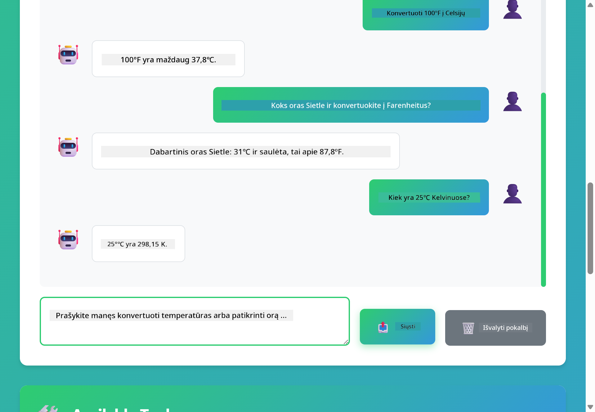

<!--
CO_OP_TRANSLATOR_METADATA:
{
  "original_hash": "aa23f106e7f53270924c9dd39c629004",
  "translation_date": "2025-12-13T19:38:18+00:00",
  "source_file": "04-tools/README.md",
  "language_code": "lt"
}
-->
# 04 modulis: DI agentai su įrankiais

## Turinys

- [Ko išmoksite](../../../04-tools)
- [Reikalavimai](../../../04-tools)
- [DI agentų su įrankiais supratimas](../../../04-tools)
- [Kaip veikia įrankių kvietimas](../../../04-tools)
  - [Įrankių apibrėžimai](../../../04-tools)
  - [Sprendimų priėmimas](../../../04-tools)
  - [Vykdymas](../../../04-tools)
  - [Atsakymo generavimas](../../../04-tools)
- [Įrankių grandinimas](../../../04-tools)
- [Paleiskite programą](../../../04-tools)
- [Programos naudojimas](../../../04-tools)
  - [Išbandykite paprastą įrankio naudojimą](../../../04-tools)
  - [Išbandykite įrankių grandinimą](../../../04-tools)
  - [Peržiūrėkite pokalbio eigą](../../../04-tools)
  - [Stebėkite samprotavimą](../../../04-tools)
  - [Eksperimentuokite su skirtingais užklausimais](../../../04-tools)
- [Pagrindinės sąvokos](../../../04-tools)
  - [ReAct modelis (samprotavimas ir veikimas)](../../../04-tools)
  - [Įrankių aprašymai yra svarbūs](../../../04-tools)
  - [Sesijos valdymas](../../../04-tools)
  - [Klaidų tvarkymas](../../../04-tools)
- [Galimi įrankiai](../../../04-tools)
- [Kada naudoti agentus su įrankiais](../../../04-tools)
- [Kiti žingsniai](../../../04-tools)

## Ko išmoksite

Iki šiol išmokote, kaip bendrauti su DI, efektyviai struktūruoti užklausas ir pagrįsti atsakymus savo dokumentais. Tačiau vis dar yra esminė ribotybė: kalbos modeliai gali generuoti tik tekstą. Jie negali patikrinti oro sąlygų, atlikti skaičiavimų, užklausti duomenų bazių ar sąveikauti su išorinėmis sistemomis.

Įrankiai tai keičia. Suteikdami modeliui prieigą prie funkcijų, kurias jis gali iškviesti, paverčiate jį iš teksto generatoriaus į agentą, galintį imtis veiksmų. Modelis nusprendžia, kada jam reikia įrankio, kurį įrankį naudoti ir kokius parametrus perduoti. Jūsų kodas vykdo funkciją ir grąžina rezultatą. Modelis įtraukia tą rezultatą į savo atsakymą.

## Reikalavimai

- Baigtas 01 modulis (išdiegti Azure OpenAI ištekliai)
- `.env` failas šakniniame kataloge su Azure kredencialais (sukurtas `azd up` 01 modulyje)

> **Pastaba:** Jei dar nebaigėte 01 modulio, pirmiausia sekite ten pateiktas diegimo instrukcijas.

## DI agentų su įrankiais supratimas

DI agentas su įrankiais seka samprotavimo ir veikimo modelį (ReAct):

1. Vartotojas užduoda klausimą
2. Agentas samprotauja, ką jam reikia sužinoti
3. Agentas nusprendžia, ar jam reikia įrankio atsakymui
4. Jei taip, agentas iškviečia tinkamą įrankį su teisingais parametrais
5. Įrankis vykdo ir grąžina duomenis
6. Agentas įtraukia rezultatą ir pateikia galutinį atsakymą


*ReAct modelis – kaip DI agentai keičiasi tarp samprotavimo ir veikimo sprendžiant problemas*

Tai vyksta automatiškai. Jūs apibrėžiate įrankius ir jų aprašymus. Modelis sprendžia, kada ir kaip juos naudoti.

## Kaip veikia įrankių kvietimas

**Įrankių apibrėžimai** - [WeatherTool.java](../../../04-tools/src/main/java/com/example/langchain4j/agents/tools/WeatherTool.java) | [TemperatureTool.java](../../../04-tools/src/main/java/com/example/langchain4j/agents/tools/TemperatureTool.java)

Jūs apibrėžiate funkcijas su aiškiais aprašymais ir parametrų specifikacijomis. Modelis mato šiuos aprašymus savo sistemos užklausoje ir supranta, ką kiekvienas įrankis daro.

```java
@Component
public class WeatherTool {
    
    @Tool("Get the current weather for a location")
    public String getCurrentWeather(@P("Location name") String location) {
        // Jūsų orų paieškos logika
        return "Weather in " + location + ": 22°C, cloudy";
    }
}

@AiService
public interface Assistant {
    String chat(@MemoryId String sessionId, @UserMessage String message);
}

// Asistentas automatiškai sujungiamas per Spring Boot su:
// - ChatModel komponentu
// - Visais @Tool metodais iš @Component klasių
// - ChatMemoryProvider sesijos valdymui
```

> **🤖 Išbandykite su [GitHub Copilot](https://github.com/features/copilot) Chat:** Atidarykite [`WeatherTool.java`](../../../04-tools/src/main/java/com/example/langchain4j/agents/tools/WeatherTool.java) ir paklauskite:
> - "Kaip integruočiau tikrą oro sąlygų API, pvz., OpenWeatherMap, vietoje imituotų duomenų?"
> - "Kas sudaro gerą įrankio aprašymą, kuris padeda DI jį teisingai naudoti?"
> - "Kaip tvarkyti API klaidas ir kvotų ribojimus įrankių įgyvendinimuose?"

**Sprendimų priėmimas**

Kai vartotojas klausia „Kokia oro temperatūra Sietle?“, modelis atpažįsta, kad jam reikia oro sąlygų įrankio. Jis sugeneruoja funkcijos kvietimą su vietos parametru „Seattle“.

**Vykdymas** - [AgentService.java](../../../04-tools/src/main/java/com/example/langchain4j/agents/service/AgentService.java)

Spring Boot automatiškai sujungia deklaratyvų `@AiService` sąsają su visais registruotais įrankiais, o LangChain4j automatiškai vykdo įrankių kvietimus.

> **🤖 Išbandykite su [GitHub Copilot](https://github.com/features/copilot) Chat:** Atidarykite [`AgentService.java`](../../../04-tools/src/main/java/com/example/langchain4j/agents/service/AgentService.java) ir paklauskite:
> - "Kaip veikia ReAct modelis ir kodėl jis efektyvus DI agentams?"
> - "Kaip agentas nusprendžia, kurį įrankį naudoti ir kokia tvarka?"
> - "Kas nutinka, jei įrankio vykdymas nepavyksta – kaip patikimai tvarkyti klaidas?"

**Atsakymo generavimas**

Modelis gauna oro sąlygų duomenis ir suformuoja juos į natūralios kalbos atsakymą vartotojui.

### Kodėl naudoti deklaratyvias DI paslaugas?

Šiame modulyje naudojama LangChain4j Spring Boot integracija su deklaratyviomis `@AiService` sąsajomis:

- **Spring Boot automatinis sujungimas** – ChatModel ir įrankiai įterpiami automatiškai
- **@MemoryId modelis** – automatinis sesijos pagrindu valdomas atminties valdymas
- **Vienas egzempliorius** – asistentas sukuriamas vieną kartą ir pakartotinai naudojamas geresniam našumui
- **Tipų saugus vykdymas** – Java metodai kviečiami tiesiogiai su tipų konvertavimu
- **Daugiapakopis valdymas** – automatiškai tvarko įrankių grandinimą
- **Nulis boilerplate** – nereikia rankinių AiServices.builder() kvietimų ar atminties HashMap

Alternatyvūs metodai (rankinis `AiServices.builder()`) reikalauja daugiau kodo ir neturi Spring Boot integracijos privalumų.

## Įrankių grandinimas

**Įrankių grandinimas** – DI gali iškviesti kelis įrankius paeiliui. Paklauskite „Kokia oro temperatūra Sietle ir ar turėčiau pasiimti skėtį?“ ir stebėkite, kaip jis sujungia `getCurrentWeather` su samprotavimu apie lietaus reikmenis.

<a href="images/tool-chaining.png"></a>

*Sekantys įrankių kvietimai – vieno įrankio rezultatas naudojamas kitam sprendimui*

**Gražūs gedimai** – Paklauskite apie orą mieste, kuris nėra imituotų duomenų sąraše. Įrankis grąžina klaidos pranešimą, o DI paaiškina, kad negali padėti. Įrankiai gedimus tvarko saugiai.

Tai vyksta vieno pokalbio metu. Agentas savarankiškai koordinuoja kelis įrankių kvietimus.

## Paleiskite programą

**Patikrinkite diegimą:**

Įsitikinkite, kad `.env` failas yra šakniniame kataloge su Azure kredencialais (sukurtas 01 modulyje):
```bash
cat ../.env  # Turėtų rodyti AZURE_OPENAI_ENDPOINT, API_KEY, DEPLOYMENT
```

**Paleiskite programą:**

> **Pastaba:** Jei jau paleidote visas programas naudodami `./start-all.sh` iš 01 modulio, šis modulis jau veikia 8084 prievade. Galite praleisti žemiau pateiktas paleidimo komandas ir tiesiog nueiti į http://localhost:8084.

**1 variantas: Naudojant Spring Boot Dashboard (rekomenduojama VS Code naudotojams)**

Dev konteineryje yra Spring Boot Dashboard plėtinys, kuris suteikia vizualią sąsają valdyti visas Spring Boot programas. Jį rasite Activity Bar kairėje VS Code pusėje (ieškokite Spring Boot ikonos).

Iš Spring Boot Dashboard galite:
- Matyti visas prieinamas Spring Boot programas darbo aplinkoje
- Vienu paspaudimu paleisti/stabdyti programas
- Realizuoti programų žurnalus realiu laiku
- Stebėti programų būseną

Tiesiog spustelėkite paleidimo mygtuką šalia „tools“, kad paleistumėte šį modulį, arba paleiskite visus modulius vienu metu.


**2 variantas: Naudojant shell skriptus**

Paleiskite visas žiniatinklio programas (moduliai 01-04):

**Bash:**
```bash
cd ..  # Iš šakninių katalogų
./start-all.sh
```

**PowerShell:**
```powershell
cd ..  # Iš šakninių katalogų
.\start-all.ps1
```

Arba paleiskite tik šį modulį:

**Bash:**
```bash
cd 04-tools
./start.sh
```

**PowerShell:**
```powershell
cd 04-tools
.\start.ps1
```

Abu skriptai automatiškai įkelia aplinkos kintamuosius iš šakniniame kataloge esančio `.env` failo ir sukurs JAR failus, jei jų nėra.

> **Pastaba:** Jei norite rankiniu būdu sukompiliuoti visus modulius prieš paleidimą:
>
> **Bash:**
> ```bash
> cd ..  # Go to root directory
> mvn clean package -DskipTests
> ```
>
> **PowerShell:**
> ```powershell
> cd ..  # Go to root directory
> mvn clean package -DskipTests
> ```

Atidarykite http://localhost:8084 savo naršyklėje.

**Norėdami sustabdyti:**

**Bash:**
```bash
./stop.sh  # Tik šis modulis
# Arba
cd .. && ./stop-all.sh  # Visi moduliai
```

**PowerShell:**
```powershell
.\stop.ps1  # Tik šis modulis
# Arba
cd ..; .\stop-all.ps1  # Visi moduliai
```

## Programos naudojimas

Programa suteikia žiniatinklio sąsają, kur galite bendrauti su DI agentu, turinčiu prieigą prie oro sąlygų ir temperatūros konvertavimo įrankių.

<a href="images/tools-homepage.png"></a>

*DI agento įrankių sąsaja – greiti pavyzdžiai ir pokalbių sąsaja įrankių naudojimui*

**Išbandykite paprastą įrankio naudojimą**

Pradėkite nuo paprasto užklausimo: „Konvertuokite 100 laipsnių Farenheito į Celsijų“. Agentas atpažįsta, kad jam reikia temperatūros konvertavimo įrankio, iškviečia jį su teisingais parametrais ir pateikia rezultatą. Pastebėkite, kaip natūraliai tai jaučiasi – jūs nenurodėte, kurį įrankį naudoti ar kaip jį iškviesti.

**Išbandykite įrankių grandinimą**

Dabar pabandykite sudėtingesnį užklausimą: „Kokia oro temperatūra Sietle ir konvertuokite ją į Farenheitą?“ Stebėkite, kaip agentas žingsnis po žingsnio sprendžia užduotį. Pirmiausia gauna orą (kuris pateikiamas Celsijais), supranta, kad reikia konvertuoti į Farenheitą, iškviečia konvertavimo įrankį ir sujungia abu rezultatus į vieną atsakymą.

**Peržiūrėkite pokalbio eigą**

Pokalbių sąsaja saugo pokalbio istoriją, leidžiantį turėti daugiapakopes sąveikas. Matysite visas ankstesnes užklausas ir atsakymus, todėl lengva sekti pokalbį ir suprasti, kaip agentas kuria kontekstą per kelis mainus.

<a href="images/tools-conversation-demo.png"></a>

*Daugiapakopis pokalbis, rodantis paprastus konvertavimus, oro sąlygų užklausas ir įrankių grandinimą*

**Eksperimentuokite su skirtingais užklausimais**

Išbandykite įvairias kombinacijas:
- Oro sąlygų užklausos: „Kokia oro temperatūra Tokijuje?“
- Temperatūros konvertavimai: „Kiek yra 25°C Kelvinuose?“
- Kombinuotos užklausos: „Patikrink orą Paryžiuje ir pasakyk, ar temperatūra viršija 20°C“

Pastebėkite, kaip agentas interpretuoja natūralią kalbą ir pritaiko ją tinkamiems įrankių kvietimams.

## Pagrindinės sąvokos

**ReAct modelis (samprotavimas ir veikimas)**

Agentas keičiasi tarp samprotavimo (sprendžiant, ką daryti) ir veikimo (naudojant įrankius). Šis modelis leidžia savarankiškai spręsti problemas, o ne tik vykdyti nurodymus.

**Įrankių aprašymai yra svarbūs**

Jūsų įrankių aprašymų kokybė tiesiogiai veikia, kaip gerai agentas juos naudoja. Aiškūs, konkretūs aprašymai padeda modeliui suprasti, kada ir kaip iškviesti kiekvieną įrankį.

**Sesijos valdymas**

`@MemoryId` anotacija leidžia automatiškai valdyti atmintį pagal sesiją. Kiekvienas sesijos ID gauna savo `ChatMemory` egzempliorių, kurį valdo `ChatMemoryProvider` komponentas, todėl nereikia rankiniu būdu sekti atminties.

**Klaidų tvarkymas**

Įrankiai gali sugesti – API gali užtrukti, parametrai gali būti neteisingi, išorinės paslaugos gali neveikti. Produkcijos agentams reikia klaidų tvarkymo, kad modelis galėtų paaiškinti problemas arba bandyti alternatyvas.

## Galimi įrankiai

**Oro sąlygų įrankiai** (imituoti duomenys demonstracijai):
- Gauti dabartines oro sąlygas vietovėje
- Gauti kelių dienų prognozę

**Temperatūros konvertavimo įrankiai**:
- Celsijus į Farenheitą
- Farenheitas į Celsijų
- Celsijus į Kelviną
- Kelvinas į Celsijų
- Farenheitas į Kelviną
- Kelvinas į Farenheitą

Tai paprasti pavyzdžiai, bet modelis tinka bet kokiai funkcijai: duomenų bazių užklausoms, API kvietimams, skaičiavimams, failų operacijoms ar sistemos komandoms.

## Kada naudoti agentus su įrankiais

**Naudokite įrankius, kai:**
- Atsakymams reikia realaus laiko duomenų (oras, akcijų kainos, inventorius)
- Reikia atlikti skaičiavimus, viršijančius paprastą matematiką
- Reikia prieigos prie duomenų bazių ar API
- Reikia imtis veiksmų (siųsti el. laiškus, kurti užduotis, atnaujinti įrašus)
- Reikia sujungti kelis duomenų šaltinius

**Nenaudokite įrankių, kai:**
- Klausimai gali būti atsakyti iš bendrų žinių
- Atsakymas yra tik pokalbinis
- Įrankių vėlavimas padarytų patirtį per lėtą

## Kiti žingsniai

**Kitas modulis:** [05-mcp - Modelio konteksto protokolas (MCP)](../05-mcp/README.md)

---

**Navigacija:** [← Ankstesnis: 03 modulis - RAG](../03-rag/README.md) | [Atgal į pradžią](../README.md) | [Kitas: 05 modulis - MCP →](../05-mcp/README.md)

---

<!-- CO-OP TRANSLATOR DISCLAIMER START -->
**Atsakomybės apribojimas**:  
Šis dokumentas buvo išverstas naudojant dirbtinio intelekto vertimo paslaugą [Co-op Translator](https://github.com/Azure/co-op-translator). Nors stengiamės užtikrinti tikslumą, prašome atkreipti dėmesį, kad automatiniai vertimai gali turėti klaidų ar netikslumų. Originalus dokumentas gimtąja kalba turėtų būti laikomas autoritetingu šaltiniu. Svarbiai informacijai rekomenduojamas profesionalus žmogaus vertimas. Mes neatsakome už bet kokius nesusipratimus ar neteisingus aiškinimus, kylančius dėl šio vertimo naudojimo.
<!-- CO-OP TRANSLATOR DISCLAIMER END -->