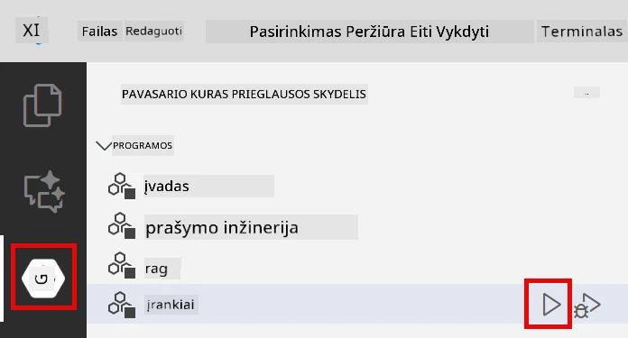
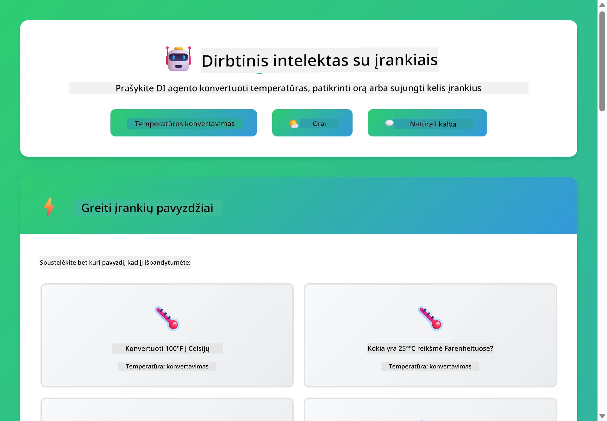
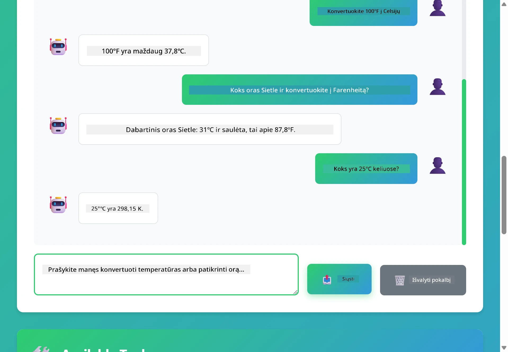

# Modulis 04: DI agentai su įrankiais

## Turinys

- [Vaizdo įrašo peržiūra](#vaizdo-įrašo-peržiūra)
- [Ką išmoksite](#ką-išmoksite)
- [Išankstiniai reikalavimai](#išankstiniai-reikalavimai)
- [Supratimas apie DI agentus su įrankiais](#supratimas-apie-di-agentus-su-įrankiais)
- [Kaip veikia įrankių kvietimas](#kaip-veikia-įrankių-kvietimas)
  - [Įrankių apibrėžimai](#įrankių-apibrėžimai)
  - [Sprendimų priėmimas](#sprendimų-priėmimas)
  - [Vykdymas](#vykdymas)
  - [Atsakymo generavimas](#atsakymo-generavimas)
  - [Architektūra: Spring Boot automatinis sujungimas](#architektūra-spring-boot-automatinis-sujungimas)
- [Įrankių grandinavimas](#įrankių-grandinavimas)
- [Paleiskite programą](#paleiskite-programą)
- [Naudojimas](#kaip-naudotis-programa)
  - [Išbandykite paprastą įrankio naudojimą](#išbandykite-paprastą-įrankių-naudojimą)
  - [Išbandykite įrankių grandinavimą](#išbandykite-įrankių-grandinę)
  - [Peržiūrėkite pokalbio eigą](#žiūrėkite-pokalbio-eigą)
  - [Eksperimentuokite su skirtingais užklausimais](#eksperimentuokite-su-skirtingomis-užklausomis)
- [Pagrindinės sąvokos](#pagrindinės-sąvokos)
  - [ReAct modelis (mąstymas ir veikimas)](#react-modelis-apsvarstymas-ir-veiksmas)
  - [Įrankių aprašymai yra svarbūs](#įrankių-aprašymai-svarbūs)
  - [Sesijų valdymas](#sesijų-valdymas)
  - [Klaidų valdymas](#klaidos-tvarkymas)
- [Prieinami įrankiai](#galimi-įrankiai)
- [Kada naudoti įrankiais pagrįstus agentus](#kada-naudoti-įrankinius-agentus)
- [Įrankiai prieš RAG](#įrankiai-vs-rag)
- [Kiti žingsniai](#kiti-žingsniai)

## Vaizdo įrašo peržiūra

Peržiūrėkite šią tiesioginę sesiją, kuri paaiškina, kaip pradėti su šiuo moduliu:

<a href="https://www.youtube.com/watch?v=O_J30kZc0rw"></a>

## Ką išmoksite

Iki šiol jūs išmokote, kaip bendrauti su DI, efektyviai struktūruoti užklausas ir pagrįsti atsakymus savo dokumentuose. Tačiau yra esminė ribotybė: kalbos modeliai gali generuoti tik tekstą. Jie negali patikrinti orų, atlikti skaičiavimų, užklausti duomenų bazių ar sąveikauti su išorinėmis sistemomis.

Įrankiai tai keičia. Suteikdami modeliui prieigą prie funkcijų, kurias jis gali kviesti, jūs paverčiate jį iš teksto generatoriaus į agentą, kuris gali imtis veiksmų. Modelis nusprendžia, kada jam reikia įrankio, kurį įrankį naudoti ir kokius parametrus perduoti. Jūsų kodas vykdo funkciją ir grąžina rezultatą. Modelis įtraukia tą rezultatą į atsakymą.

## Išankstiniai reikalavimai

- Įvykdytas [Modulis 01 – Įvadas](../01-introduction/README.md) (Azure OpenAI ištekliai deploy‘inti)
- Rekomenduojama įvykdyti ankstesnius modulius (šis modulis remiasi [RAG sąvokomis iš Modulio 03](../03-rag/README.md) palyginime Įrankiai prieš RAG)
- Šakniniame kataloge turi būti `.env` failas su Azure kredencialais (sukurtas vykdant `azd up` Module 01 metu)

> **Pastaba:** Jei dar nebaigėte Modulio 01, pirmiausia vykdykite ten pateiktas diegimo instrukcijas.

## Supratimas apie DI agentus su įrankiais

> **📝 Pastaba:** Šio modulio terminas „agentai“ reiškia DI pagalbininkus, patobulintus įrankių kvietimo funkcionalumu. Tai skiriasi nuo **Agentinio DI** modelių (autonomi agentai su planavimu, atmintimi ir daugiapakopiu mąstymu), kuriuos apžvelgsime [Modulyje 05: MCP](../05-mcp/README.md).

Be įrankių kalbos modelis gali tik generuoti tekstą iš savo mokymosi duomenų. Klauskite, koks yra dabartinis oras, ir jis turi spėti. Suteikite įrankius, ir jis gali kviesti orų API, atlikti skaičiavimus arba užklausti duomenų bazę – tada įterpti tuos tikrus rezultatus į savo atsakymą.


*Be įrankių modelis tik spėja – su įrankiais jis kviečia API, atlieka skaičiavimus ir pateikia realaus laiko duomenis.*

DI agentas su įrankiais vykdo **Mąstymo ir Veikimo (ReAct)** ciklą. Modelis ne tik atsako – jis mąsto, ko jam reikia, veikia kviesdamas įrankį, stebi rezultatą ir tada sprendžia, ar daryti dar vieną veiksmą, ar pateikti galutinį atsakymą:

1. **Mąstyti** — agentas analizuoja vartotojo klausimą ir nustato, kokios informacijos jam reikia
2. **Veikti** — agentas pasirenka tinkamą įrankį, sukuria teisingus parametrus ir jį kviečia
3. **Stebėti** — agentas gauna įrankio išvestį ir įvertina rezultatą
4. **Kartoti arba Atsakyti** — jei reikia daugiau duomenų, agentas sugrįžta į pradžią; jei ne – sudaro natūralios kalbos atsakymą


*ReAct ciklas – agentas mąsto, ką daryti, veikia kviesdamas įrankį, stebi rezultatą ir kartoja tol, kol gali pateikti galutinį atsakymą.*

Tai vyksta automatiškai. Jūs apibrėžiate įrankius ir jų aprašymus. Modelis sprendžia, kada ir kaip juos naudoti.

## Kaip veikia įrankių kvietimas

### Įrankių apibrėžimai

[WeatherTool.java](../../../04-tools/src/main/java/com/example/langchain4j/agents/tools/WeatherTool.java) | [TemperatureTool.java](../../../04-tools/src/main/java/com/example/langchain4j/agents/tools/TemperatureTool.java)

Jūs apibrėžiate funkcijas su aiškiais aprašymais ir parametrų specifikacijomis. Modelis mato šiuos aprašymus sistemos užklausoje ir supranta, ką kiekvienas įrankis daro.

```java
@Component
public class WeatherTool {
    
    @Tool("Get the current weather for a location")
    public String getCurrentWeather(@P("Location name") String location) {
        // Jūsų orų paieškos logika
        return "Weather in " + location + ": 22°C, cloudy";
    }
}

@AiService
public interface Assistant {
    String chat(@MemoryId String sessionId, @UserMessage String message);
}

// Asistentas automatiškai sujungtas su Spring Boot:
// - ChatModel komponentas
// - Visos @Tool metodai iš @Component klasių
// - ChatMemoryProvider sesijų valdymui
```

Žemiau pateiktas diagrama išskaido kiekvieną anotaciją ir parodo, kaip kiekviena dalis padeda DI suprasti, kada kviesti įrankį ir kokius argumentus perduoti:


*Įrankio apibrėžimo anatomija — @Tool nurodo DI, kada naudoti įrankį, @P aprašo kiekvieną parametrą, o @AiService automatiškai sujungia viską paleidimo metu.*

> **🤖 Išbandykite su [GitHub Copilot](https://github.com/features/copilot) Chat:** Atidarykite [`WeatherTool.java`](../../../04-tools/src/main/java/com/example/langchain4j/agents/tools/WeatherTool.java) ir klauskite:
> - „Kaip integruočiau tikrą orų API, pvz., OpenWeatherMap, vietoje imituotų duomenų?“
> - „Kas yra geras įrankio aprašymas, kuris padeda DI jį teisingai naudoti?“
> - „Kaip tvarkyti API klaidas ir ribojimus įrankių implementacijoje?“

### Sprendimų priėmimas

Kai vartotojas klausia „Koks oras Siatle?“, modelis nepasirenka įrankio atsitiktinai. Jis lygina vartotojo ketinimą su kiekvieno įrankio aprašymu, įvertina svarbą ir pasirenka geriausią atitikimą. Tada sugeneruoja struktūruotą funkcijos kvietimą su tinkamais parametrais – šiuo atveju nustatydamas `location` į `"Seattle"`.

Jei jokio įrankio užklausa neatitinka, modelis grįžta prie atsakymo iš savo žinių. Jei keli įrankiai tinka, pasirenka patį specifiniausią.


*Modelis vertina visus galimus įrankius pagal vartotojo ketinimą ir pasirenka geriausią atitikmenį – todėl svarbu rašyti aiškius, konkrečius įrankių aprašymus.*

### Vykdymas

[AgentService.java](../../../04-tools/src/main/java/com/example/langchain4j/agents/service/AgentService.java)

Spring Boot automatiškai susieja deklaratyvų `@AiService` interfeisą su visais registruotais įrankiais, o LangChain4j automatiškai vykdo įrankių kvietimus. Užkulisiuose viso įrankio kvietimo procesas vyksta per šešias stadijas – nuo vartotojo natūralios kalbos klausimo iki natūralaus kalbos atsakymo:


*Pilnas procesas – vartotojas užduoda klausimą, modelis pasirenka įrankį, LangChain4j jį vykdo, o modelis įtraukia rezultatą į natūralų atsakymą.*

Užkulisiuose `AiServices` vykdo tą patį įrankių kvietimo ciklą bet kuriam įrankiui – čia pavaizduota su paprastu `Calculator`. Sekos diagrama žemiau rodo, kas vyksta po gaubtu:


*Įrankių kvietimo ciklas – `AiServices` siunčia jūsų žinutę ir įrankių schemas LLM, LLM atsako funkcijos kvietimu pvz., `add(42, 58)`, LangChain4j vietoje vykdo `Calculator` metodą ir pateikia rezultatą atgal galutiniam atsakymui.*

> **🤖 Išbandykite su [GitHub Copilot](https://github.com/features/copilot) Chat:** Atidarykite [`AgentService.java`](../../../04-tools/src/main/java/com/example/langchain4j/agents/service/AgentService.java) ir klauskite:
> - „Kaip veikia ReAct modelis ir kodėl jis efektyvus DI agentams?“
> - „Kaip agentas nusprendžia, kurį įrankį naudoti ir kokia tvarka?“
> - „Kas nutinka, jei įrankio vykdymas nepavyksta – kaip tvarkingai tvarkyti klaidas?“

### Atsakymo generavimas

Modelis gauna orų duomenis ir suformuoja natūralios kalbos atsakymą vartotojui.

### Architektūra: Spring Boot automatinis sujungimas

Šis modulis naudoja LangChain4j Spring Boot integraciją su deklaratyviais `@AiService` interfeisais. Paleidimo metu Spring Boot suranda kiekvieną `@Component`, kuriame yra `@Tool` metodų, jūsų `ChatModel` bean‘ą ir `ChatMemoryProvider` – ir visus juos sujungia į vieną `Assistant` interfeisą be jokio boilerplate kodo.


*@AiService interfeisas jungia ChatModel, įrankių komponentus ir atminties tiekėją – Spring Boot automatiškai atlieka visą sujungimą.*

Štai pilnas užklausos gyvavimo ciklas sekos diagramoje – nuo HTTP užklausos per kontrolerį, servisą, auto-sujungtą proxy iki įrankio vykdymo ir atgal:


*Pilnas Spring Boot užklausos gyvavimo ciklas – HTTP užklausa praeina per kontrolerį ir servisą iki auto-sujungto Assistant proxy, kuris koreliuoja LLM ir įrankių kvietimus automatiškai.*

Pagrindiniai šio požiūrio privalumai:

- **Spring Boot automatinis sujungimas** – ChatModel ir įrankiai įterpiami automatiškai
- **@MemoryId modelis** – automatinis sesijos pagrindu valdomas atminties valdymas
- **Viena instancija** – Assistant sukuriamas vieną kartą ir naudojamas pakartotinai dėl geresnio našumo
- **Tipų saugus vykdymas** – Java metodai kviečiami tiesiogiai su tipo konvertacijomis
- **Daugiataukio valdymas** – automatiškai palaiko įrankių grandinavimą
- **Nulis boilerplate** – jokių rankinių `AiServices.builder()` kvietimų ar atminties HashMap

Alternatyvūs metodai (rankinis `AiServices.builder()`) reikalauja daugiau kodo ir neturi Spring Boot integracijos pranašumų.

## Įrankių grandinavimas

**Įrankių grandinavimas** – tikroji įrankiais pagrįstų agentų galia pasireiškia tada, kai vienas klausimas reikalauja kelių įrankių. Paklauskite „Koks oras Siatle Fahrenheito laipsniais?“ ir agentas automatiškai sujungia du įrankius: pirmiausia kviečia `getCurrentWeather`, kad gautų temperatūrą Celsijumi, tada perduoda tą vertę `celsiusToFahrenheit` konvertavimui – visa tai per vieną pokalbio turą.


*Įrankių grandinavimas veiksme – agentas pirmiausia kviečia getCurrentWeather, tada perduoda Celsijaus rezultatą į celsiusToFahrenheit ir pateikia kombinuotą atsakymą.*

**Tvarkingos klaidos** – paklauskite apie orą mieste, kuris nėra imituotuose duomenyse. Įrankis grąžina klaidos pranešimą, o DI aiškina, kad negali padėti, vietoje to, kad sužlugtų. Įrankiai saugiai tvarko klaidas. Žemiau diagrama lygina abi situacijas – su tinkamu klaidų apdorojimu agentas pagauna išimtį ir atsako pagalbingu paaiškinimu, o be jo visa programa sugenda:


*Kai įrankis nepavyksta, agentas pagauna klaidą ir atsako su pagalbingu paaiškinimu vietoje programos sutrikimo.*

Tai įvyksta per vieną pokalbio turą. Agentas autonomiškai koordinuoja kelis įrankių kvietimus.

## Paleiskite programą

**Patikrinkite diegimą:**

Įsitikinkite, kad root kataloge yra `.env` failas su Azure kredencialais (sukurtas Modulyje 01). Paleiskite šią komandą modulio kataloge (`04-tools/`):

**Bash:**
```bash
cat ../.env  # Turėtų rodyti AZURE_OPENAI_ENDPOINT, API_KEY, DEPLOYMENT
```

**PowerShell:**
```powershell
Get-Content ..\.env  # Turėtų rodyti AZURE_OPENAI_ENDPOINT, API_KEY, DEPLOYMENT
```

**Paleiskite programą:**

> **Pastaba:** Jei jau paleidote visas programas naudodami `./start-all.sh` iš root katalogo (kaip aprašyta Modulyje 01), šis modulis jau veikia prievade 8084. Galite praleisti toliau pateiktas paleidimo komandas ir tiesiog nueiti į http://localhost:8084.

**1 variantas: naudokite Spring Boot Dashboard (rekomenduojama VS Code naudotojams)**

Dev container yra Spring Boot Dashboard plėtinys, suteikiantis vizualią sąsają valdyti visas Spring Boot programas. Jį rasite kairėje pusėje esančiame Activity Bar (ieškokite Spring Boot ikonėlės).

Per Spring Boot Dashboard galite:
- Matyti visas prieinamas Spring Boot programas darbo aplinkoje
- Vienu paspaudimu paleisti / sustabdyti programas
- Realizuoti programų žurnalų peržiūrą
- Stebėti programų būseną

Tiesiog spustelėkite paleidimo mygtuką šalia „tools“, kad paleistumėte šį modulį, arba paleiskite visus modulius vienu metu.

Štai kaip atrodo Spring Boot Dashboard VS Code aplinkoje:


*Spring Boot skydelis VS Code — paleiskite, sustabdykite ir stebėkite visus modulius vienoje vietoje*

**2 variantas: naudojant apvalkalo scenarijus**

Paleiskite visas žiniatinklio programas (modulius 01–04):

**Bash:**
```bash
cd ..  # Iš šaknininio katalogo
./start-all.sh
```

**PowerShell:**
```powershell
cd ..  # Iš šaknininio katalogo
.\start-all.ps1
```

Arba paleiskite tik šį modulį:

**Bash:**
```bash
cd 04-tools
./start.sh
```

**PowerShell:**
```powershell
cd 04-tools
.\start.ps1
```

Abu scenarijai automatiškai įkrauna aplinkos kintamuosius iš šakninio `.env` failo ir sukurs JAR failus, jei jų nėra.

> **Pastaba:** jei norite prieš pradėdami rankiniu būdu sukompiliuoti visus modulius:
>
> **Bash:**
> ```bash
> cd ..  # Go to root directory
> mvn clean package -DskipTests
> ```
>
> **PowerShell:**
> ```powershell
> cd ..  # Go to root directory
> mvn clean package -DskipTests
> ```

Atidarykite naršyklėje http://localhost:8084.

**Norėdami sustabdyti:**

**Bash:**
```bash
./stop.sh  # Tik šis modulis
# Arba
cd .. && ./stop-all.sh  # Visi moduliai
```

**PowerShell:**
```powershell
.\stop.ps1  # Tik šis modulis
# Arba
cd ..; .\stop-all.ps1  # Visi moduliai
```

## Kaip naudotis programa

Programa siūlo žiniatinklio sąsają, kurioje galite bendrauti su DI agentu, turinčiu prieigą prie orų ir temperatūros konvertavimo įrankių. Štai kaip atrodo sąsaja — ji apima greituosius pavyzdžius ir pokalbių skydelį užklausoms siųsti:

<a href="images/tools-homepage.png"></a>

*DI agentų įrankių sąsaja – greiti pavyzdžiai ir pokalbių sąsaja įrankių naudojimui*

### Išbandykite paprastą įrankių naudojimą

Pradėkite nuo paprastos užklausos: „Konvertuokite 100 laipsnių Farenheito į Celsijų“. Agentas atpažįsta, kad jam reikia temperatūros konvertavimo įrankio, iškviečia jį su tinkamais parametrais ir pateikia rezultatą. Pastebėkite, kaip natūraliai tai veikia – jūs nenurodėte, kurį įrankį naudoti ar kaip jį iškviesti.

### Išbandykite įrankių grandinę

Dabar pabandykite ką nors sudėtingesnio: „Koks oras Sietle ir konvertuokite jį į Farenheitą?“ Stebėkite, kaip agentas atlieka veiksmus žingsnis po žingsnio. Pirmiausia gauna orą (kuris pateikiamas Celsijais), supranta, kad reikia konvertuoti į Farenheitą, iškviečia konvertavimo įrankį ir sujungia abu rezultatus į vieną atsakymą.

### Žiūrėkite pokalbio eigą

Pokalbių sąsaja saugo pokalbio istoriją, leidžia turėti daugkartinius pokalbius. Matote visas ankstesnes užklausas ir atsakymus, todėl lengva sekti pokalbį ir suprasti, kaip agentas kuria kontekstą per kelis mainus.

<a href="images/tools-conversation-demo.png"></a>

*Daugiapakopis pokalbis, rodantis paprastas konvertacijas, orų tikrinimus ir įrankių grandinę*

### Eksperimentuokite su skirtingomis užklausomis

Išbandykite įvairius derinius:
- Orų patikrinimai: „Koks oras Tokijuje?“
- Temperatūros konvertavimai: „Kokia yra 25 °C pagal kelviną?“
- Derinamos užklausos: „Patikrink orą Paryžiuje ir pasakyk, ar temperatūra viršija 20 °C“

Pastebėkite, kaip agentas interpretuoja natūralią kalbą ir susieja ją su tinkamais įrankių iškvietimais.

## Pagrindinės sąvokos

### ReAct modelis (Apsvarstymas ir Veiksmas)

Agentas kinta tarp mąstymo (sprendimo, ką daryti) ir veikimo (įrankių naudojimo). Šis modelis leidžia autonomiškai spręsti problemas, o ne tik reaguoti į nurodymus.

### Įrankių aprašymai svarbūs

Įrankių aprašymų kokybė tiesiogiai veikia, kaip gerai agentas juos naudoja. Aiškūs, konkretūs aprašymai padeda modeliui suprasti, kada ir kaip iškviesti kiekvieną įrankį.

### Sesijų valdymas

`@MemoryId` anotacija leidžia automatiškai valdyti atmintį pagal sesiją. Kiekvienam sesijos ID priskiriama atskira `ChatMemory` egzempliorius, kuriuo rūpinasi `ChatMemoryProvider` komponentas, todėl keli vartotojai gali bendrauti su agentu vienu metu, nesimaišant jų pokalbiams. Toliau pateikta diagrama rodo, kaip keli vartotojai nukreipiami į izoliuotas atminties saugyklas pagal savo sesijos ID:


*Kiekvienas sesijos ID atitinka izoliuotą pokalbio istoriją — vartotojai nemato vienas kito žinučių.*

### Klaidos tvarkymas

Įrankiai gali sugesti — API laiko limitai, netinkami parametrai, išorinės paslaugos gali nutrūkti. Produkciniai agentai turi valdyti klaidas, kad modelis galėtų paaiškinti problemas arba bandyti alternatyvas, o ne sugadinti visą programą. Kai įrankis meta išimtį, LangChain4j ją pagauna ir grąžina klaidos pranešimą modeliui, kuris gali paaiškinti problemą natūralia kalba.

## Galimi įrankiai

Žemiau esanti diagrama parodo plačią įrankių ekosistemą, kurią galite sukurti. Šis modulis demonstruoja orų ir temperatūros įrankius, bet tas pats `@Tool` modelis veikia bet kuriai Java metodui — nuo duomenų bazių užklausų iki mokėjimų apdorojimo.


*Bet kuris Java metodas, pažymėtas @Tool, tampa prieinamas DI — modelis plečiasi iki duomenų bazių, API, el. pašto, failų operacijų ir daugiau.*

## Kada naudoti įrankinius agentus

Ne kiekvienai užklausai reikalingi įrankiai. Sprendimas priklauso nuo to, ar DI turi bendrauti su išorinėmis sistemomis, ar gali atsakyti remdamasis savo žiniomis. Toliau pateiktas vadovas apibendrina, kada įrankiai prideda vertės, o kada jų nereikia:


*Greitas sprendimų vadovas — įrankiai skirti realaus laiko duomenims, skaičiavimams ir veiksmams; bendrosioms žinioms ir kūrybingiems darbams jie nereikalingi.*

## Įrankiai vs RAG

3 ir 4 moduliai abu plečia DI galimybes, bet fundamentaliai skirtingais būdais. RAG suteikia modeliui prieigą prie **žinių** per dokumentų gavimą. Įrankiai suteikia modeliui galimybę atlikti **veiksmus** iškviečiant funkcijas. Žemiau pateikta diagrama lygina šiuos du metodus šalia — nuo to, kaip veikia kiekviena darbo eiga, iki kompromisų tarp jų:


*RAG renka informaciją iš statinių dokumentų — įrankiai atlieka veiksmus ir gauna dinamiškus, realaus laiko duomenis. Daugelis gamybos sistemų naudoja abu.*

Praktikoje dauguma gamybos sistemų derina abu metodus: RAG atsakymų pagrindimui jūsų dokumentacijoje ir Įrankius gyvų duomenų gavimui arba operacijų vykdymui.

## Kiti žingsniai

**Kitas modulis:** [05-mcp - Modelio konteksto protokolas (MCP)](../05-mcp/README.md)

---

**Navigacija:** [← Ankstesnis: Modulis 03 - RAG](../03-rag/README.md) | [Atgal į pradžią](../README.md) | [Toliau: Modulis 05 - MCP →](../05-mcp/README.md)

---

<!-- CO-OP TRANSLATOR DISCLAIMER START -->
**Atsakomybės apribojimas**:
Šis dokumentas buvo išverstas naudojant dirbtinio intelekto vertimo paslaugą [Co-op Translator](https://github.com/Azure/co-op-translator). Nors siekiame tikslumo, prašome atkreipti dėmesį, kad automatiniai vertimai gali turėti klaidų ar netikslumų. Originalus dokumentas jo gimtąja kalba laikomas autoritetingu šaltiniu. Svarbiai informacijai rekomenduojama naudoti profesionalų žmogiškąjį vertimą. Mes neatsakome už jokius nesusipratimus ar neteisingą interpretaciją, kilusią naudojantis šiuo vertimu.
<!-- CO-OP TRANSLATOR DISCLAIMER END -->